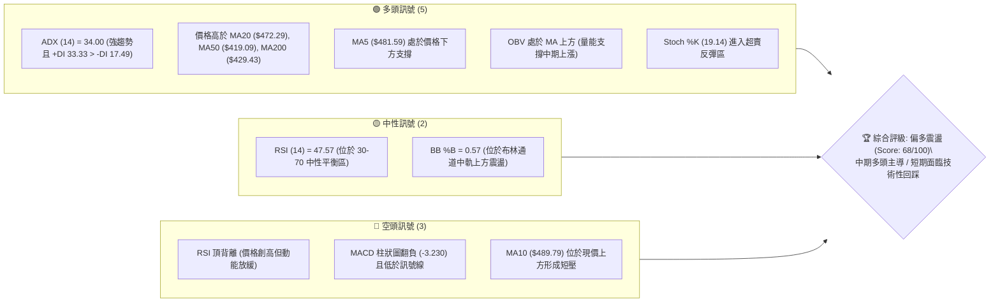
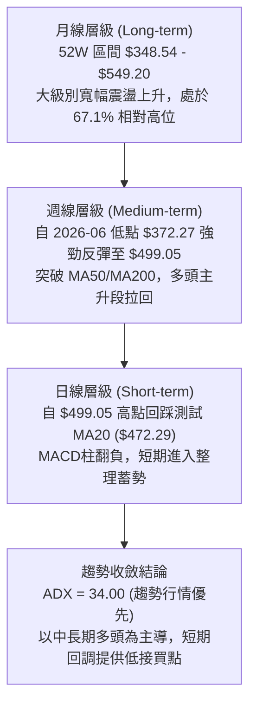
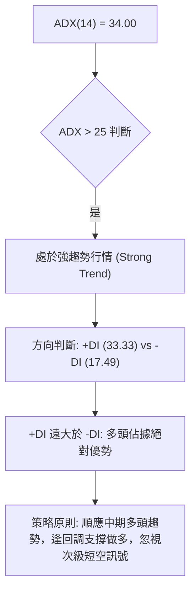
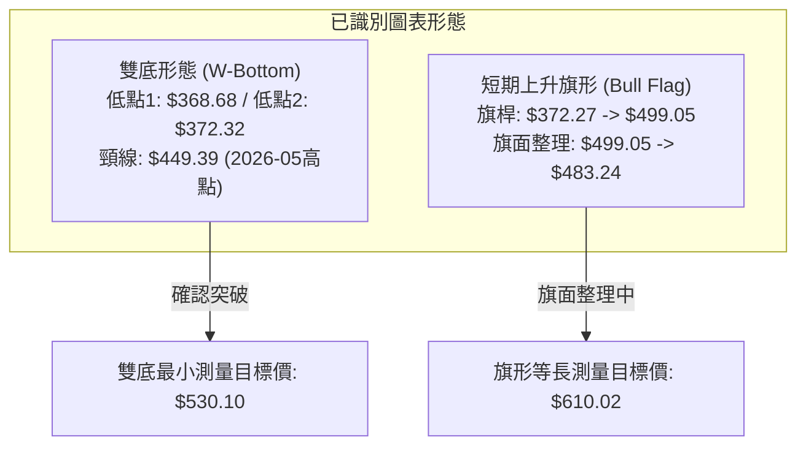
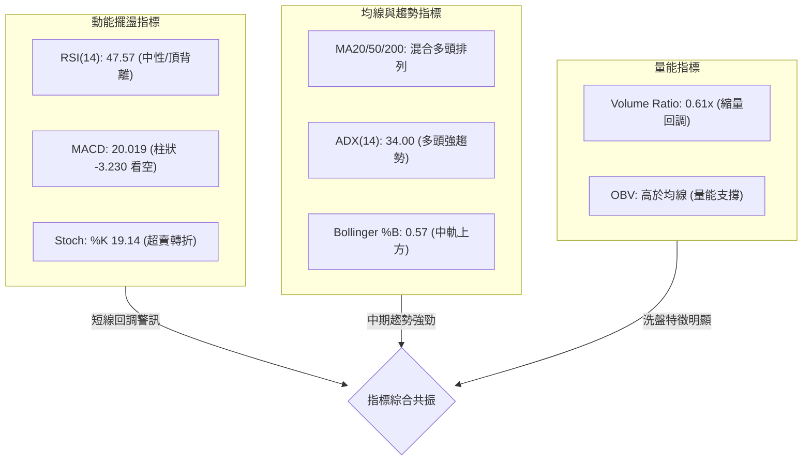
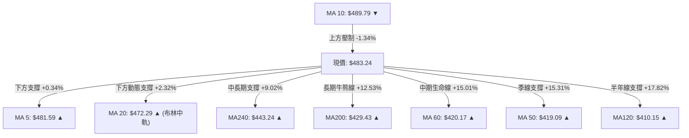
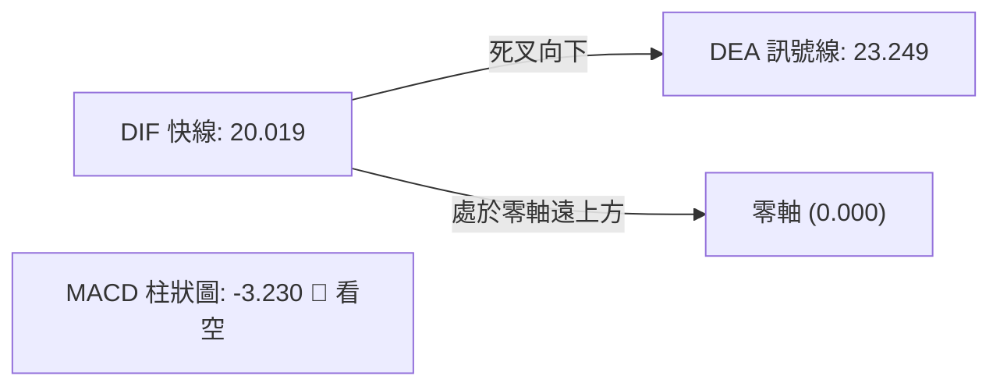
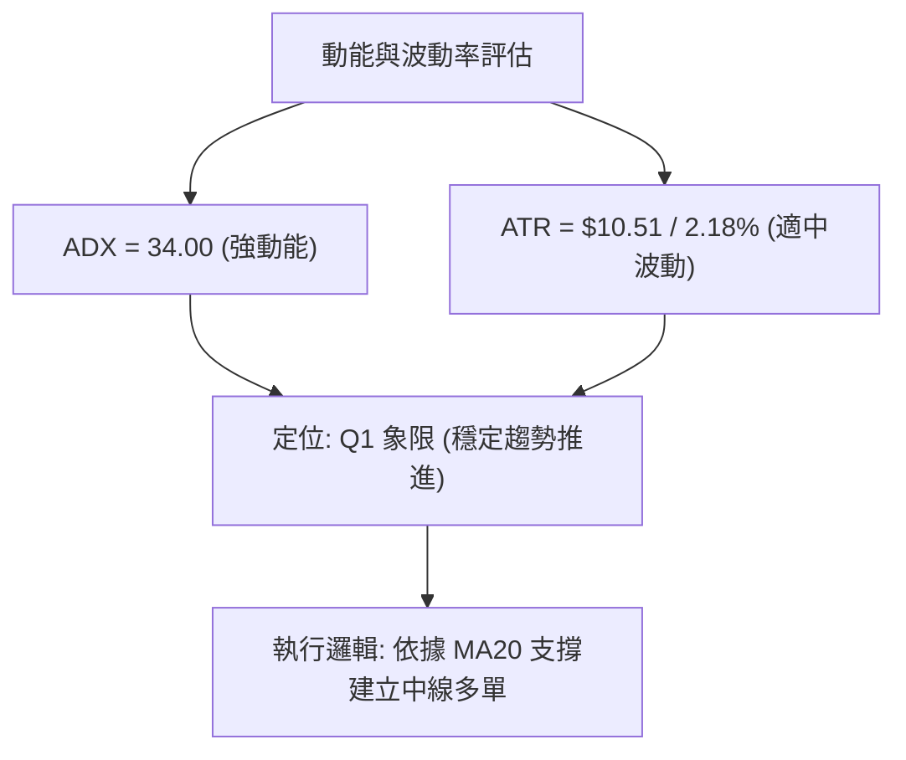
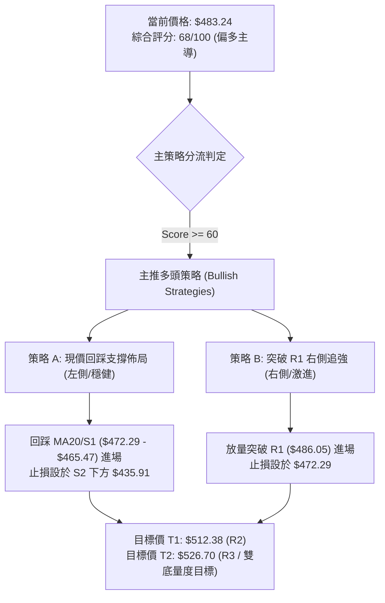
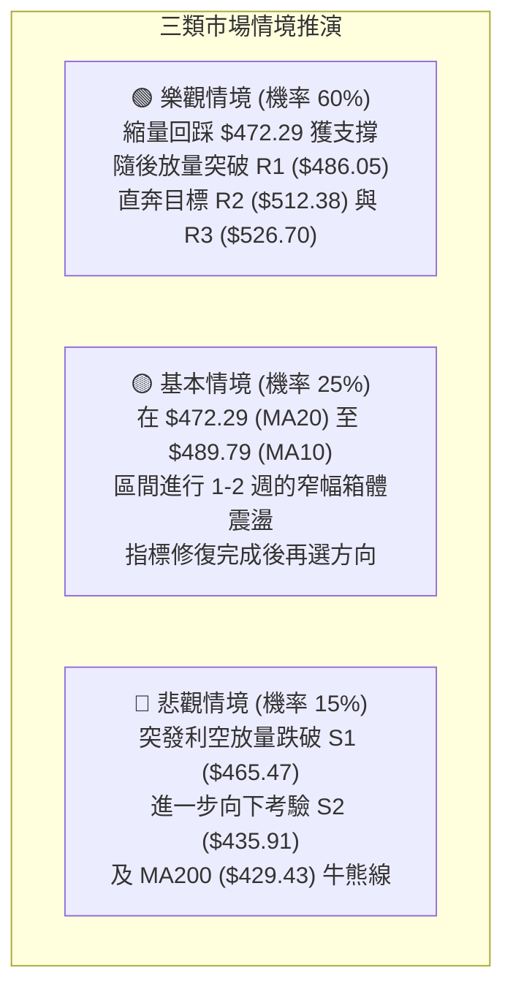

# MSFT 技術分析報告

> **報告日期**：2026-08-23 ｜ **語言**：繁體中文 ｜ **數據來源**：Yahoo Finance ｜ **當前價格**：$483.24

---

## 目錄

| 章節 | 內容 |
|------|------|
| [1. 技術面概覽](#1-技術面概覽) | 訊號儀表板、核心指標、評分卡 |
| [2. 趨勢分析](#2-趨勢分析) | 多時框趨勢、長中短期走勢 |
| [3. 圖表形態分析](#3-圖表形態分析) | 形態識別、K線組合、目標價 |
| [4. 支撐與阻力](#4-支撐與阻力) | 關鍵價位、斐波那契回調 |
| [5. 技術指標深度解讀](#5-技術指標深度解讀) | MA/RSI/MACD/布林/成交量 |
| [6. 動能與波動率](#6-動能與波動率) | 動能評估、ATR、Beta |
| [7. 多時框架總結](#7-多時框架總結) | 時框架評分矩陣 |
| [8. 交易策略建議](#8-交易策略建議) | 多空策略、風險報酬比 |
| [9. 風險提示與監控](#9-風險提示與監控) | 監控指標、風險場景 |

---

## 1. 技術面概覽

### 🎯 技術訊號儀表板



### 📊 核心指標速覽表

| 指標類別 | 指標名稱 | 當前數值 | 訊號 | 解讀 |
|----------|----------|----------|------|------|
| **價格** | 當前價格 | $483.24 | 🟢 | 位於 52 週區間 67.1% 分位，站穩中期關鍵均線之上 |
| **均線** | MA20 (月線) | $472.29 | 🟢 | 現價高於 MA20 (+2.32%)，短期動能未破，提供動態支撐 |
| **均線** | MA50 (季線) | $419.09 | 🟢 | 現價高於 MA50 (+15.31%)，中期結構多頭排列 |
| **均線** | MA200 (年線) | $429.43 | 🟢 | 現價高於 MA200 (+12.53%)，長期牛市基調穩固 |
| **動能** | RSI(14) | 47.57 | 🟡 | 處於中性區間，但日線與週線層面出現頂背離警訊 |
| **動能** | MACD(12,26,9) | 20.019 / Hist -3.230 | 🔴 | 快慢線處於零軸上方，但柱狀圖為負，短線動能減弱 |
| **動能** | Stoch %K / %D | 19.14 / 30.56 | 🟢 | 隨機指標進入超賣區，短線存在技術性反抽動能 |
| **趨勢** | ADX / +DI / -DI | 34.00 / 33.33 / 17.49 | 🟢 | ADX > 25 且 +DI 主導，確認當前處於強勢多頭趨勢行情 |
| **通道** | Bollinger Bands | $547.48 / $472.29 / $397.11 | 🟡 | %B 為 0.57，價格回調至中軌上方尋求支撐 |
| **波動** | ATR(14) | $10.51 (2.18%) | 🟡 | 波動率適中，每日震盪區間約 $10.50 |
| **量能** | 當日量 / 20日均量 | 22.49M / 36.65M (0.61x) | 🟡 | 回調縮量，量價配合健康，OBV 維持多頭排列 |

### 🏆 技術評分卡

```
╔══════════════════════════════════════════════════════════════════╗
║                   技術評分卡 — MSFT (2026-08-23)                 ║
╠══════════════════════════════════════════════════════════════════╣
║ 趨勢強度 (ADX/均線)   ████████████████░░░░  80/100  🟢 強多頭  ║
║ 動能指標 (RSI/MACD)   ██████████░░░░░░░░░░  50/100  🟡 頂背離  ║
║ 支撐穩定度 (S1/S2/MA) ██████████████░░░░░░  70/100  🟢 支撐紮實║
║ 成交量配合 (OBV/縮量) ████████████░░░░░░░░  60/100  🟢 縮量回調║
║ 形態完整度 (波段突破) ████████████████░░░░  80/100  🟢 底部翻揚║
║ 均線排列 (多時框MA)   ██████████████░░░░░░  70/100  🟢 混合偏多║
╠══════════════════════════════════════════════════════════════════╣
║ 綜合評分              █████████████░░░░░░░  68/100  🟢 偏多主導║
╚══════════════════════════════════════════════════════════════════╝
```

---

## 2. 趨勢分析

### 🌐 多時框趨勢分析



### 📈 長期趨勢 — 12個月走勢圖（Unicode）

```
MSFT 月線走勢圖（2025-08 至 2026-08）
價格軸 ($)
$549.20 ┤                                      
$528.28 ┤                                      
$513.72 ┤                  ●─●                  
$502.56 ┤●                │ │                  
$483.24 ┤ ╲              │ └──●                ← 現價 $483.24
$463.85 ┤  ╲            │     │          ●     
$449.39 ┤   ╲          │      │         ╱ ╲    
$427.58 ┤    ╲        │       │  ●     ╱   ●   
$406.13 ┤     ╲      │        └─╱─●   ╱        
$391.15 ┤      ╲    │            │ ╲ ╱         
$368.68 ┤       ●──●             │  ●(雙底低點)
$348.54 ┴────────────────────────────────────────
        08 09 10 11 12 01 02 03 04 05 06 07 08 (月份)
        2025 ────────────► 2026 ──────────────►
```

#### 走勢特徵分析表格

| 階段區間 | 時間跨度 | 起訖價位 | 漲跌幅 | 走勢特徵解讀 |
|----------|----------|----------|--------|--------------|
| **高位回落期** | 2025-08 ~ 2025-12 | $502.56 → $480.57 | -4.38% | 自歷史高點區域回落，維持高位滯漲震盪 |
| **加速探底期** | 2025-12 ~ 2026-03 | $480.57 → $368.68 | -23.28% | 跌破多條長期均線，創下波段低點 $368.68 |
| **築底反彈期** | 2026-03 ~ 2026-05 | $368.68 → $449.39 | +21.89% | 快速反彈收復 MA50，成交量逐步放大 |
| **二次探底期** | 2026-05 ~ 2026-06 | $449.39 → $372.32 | -17.15% | 回踩 $372.32 構築堅實的雙底 (W底) 形態 |
| **強勢突破期** | 2026-06 ~ 2026-08 | $372.32 → $483.24 | +29.79% | 放量連陽上攻，突破 $449.39 頸線並觸及 $499.05 |

### 📊 中期趨勢（週線分析）

近 20 週數據顯示，MSFT 在 2026 年 6 月底於 $372.27 形成巨量換手（單週成交量達 382.7M），隨後展開主升浪：
- 2026-08-02 單週放量突破至 $463.85（RSI: 75.0, MACD柱: +7.446）。
- 2026-08-09 衝高至 $499.05（RSI: 81.4, MACD柱: +11.272），進入極端超買區。
- 過去兩週（08-16 至 08-23），價格由 $499.05 回調至 $483.24，週成交量顯著萎縮（從 278.4M 降至 116.2M），顯示主升後的技術性縮量洗盤。

```
中期壓力與支撐示意圖：
[強阻力區]  $526.70 (R3) ────── 近一年強壓力聚類區
            $512.38 (R2) ────── 2025年秋季高點密集成交區
[短期阻力]  $486.05 (R1) ────── 近期反彈高點聚類壓制
──────────────── 現價 $483.24 ────────────────
[核心支撐]  $472.29 (MA20/BB中軌) / $465.47 (S1) ── 第一道防線
[中期強支撐] $435.91 (S2) / $429.43 (MA200) ────── 牛熊分界防線
```

### ⚡ 趨勢強度評估（ADX 解讀）



| ADX 數值區間 | 趨勢強度定義 | MSFT 當前狀態 | 交易指導方針 |
|--------------|--------------|---------------|--------------|
| 0 - 20 | 無趨勢 / 盤整 | 否 | 區間震盪低買高賣 |
| 20 - 25 | 趨勢萌芽 / 弱趨勢 | 否 | 觀望或小倉位試單 |
| **25 - 50** | **強趨勢 (Strong Trend)** | **當前數值: 34.00 🟢** | **趨勢交易為主，回調均線加碼** |
| 50 - 100 | 極強趨勢 / 即將耗竭 | 否 | 注意超買背離與獲利了結 |

---

## 3. 圖表形態分析

### 🔍 形態識別系統



#### 形態識別與信心度評估表

| 形態名稱 | 信心度 | 判斷依據（引用真實數據） | 完成度 | 目標價（附計算式） |
|----------|--------|--------------------------|--------|--------------------|
| **大型雙底 (W底)** | **85%** | 低點1: 2026-03 收盤 $368.68；低點2: 2026-06 收盤 $372.32 (雙底低點聚類)。於 2026-08 放量突破 2026-05 頸線 $449.39。 | 100% (已突破頸線) | **$530.10**<br/>計算式：頸線 $449.39 + 形態高度 ($449.39 - $368.68 = $80.71) = $530.10（精確落於 R3 $526.70 阻力帶上方） |
| **日線上升旗形** | **65%** | 旗桿自 $372.27 暴拉至 $499.05 (+34.0%)；近兩週於 $499.05 至 $483.24 區間縮量斜向整理，未跌破 MA20。 | 60% (整理中) | **$610.02**<br/>計算式：旗桿高度 ($499.05 - $372.27 = $126.78) + 突破假定點 $483.24 = $610.02 (長期遠景目標) |

### 🕯️ 重要K線形態分析

| 月份 | 收盤價 | K線形態 | 解讀 | 訊號 |
|------|--------|---------|------|------|
| **2026-03** | $368.68 | 探底長下影錘頭線 | 測試 52W 低點 $348.54 後強勢拉回，空頭動能衰竭 | 🟢 築底反轉 |
| **2026-05** | $449.39 | 突破大陽線 | 放量反彈突破 MA50，確認第一波反彈高點 | 🟢 多頭確立 |
| **2026-06** | $372.32 | 二次探底縮量十字星 | 回踩前低獲得強支撐，形成雙底右腳，拋壓出清 | 🟢 二次確認 |
| **2026-07** | $463.85 | 實體光頭中長陽 | 站上 Neckline 頸線，週線 MACD 柱翻正放量 | 🟢 突破買訊 |
| **2026-08** | $483.24 | 衝高回落高位小陰線 | 衝刺 $499.05 後遇阻回吐，進行技術性消化整固 | 🟡 短線休整 |

### 📉 ASCII 走勢形態示意圖

```
MSFT 大型雙底 (W-Bottom) 突破與旗形整理示意圖
$530.10 ────────────────────────────────────────── 🎯 雙底理論目標價
$512.38 ───────────────────┬────────────────────── 阻力 R2
$499.05 ───────────────╭───╯(高點)
$483.24 ───────────────│─────● (現價旗面整理中)
$465.47 ───────────────│─────┬──────────────────── 支撐 S1
$449.39 ───────╭───────╯     │  ═══════════════════ 雙底頸線 (Neckline)
               │             │
$372.32 ───────│───────● (右底: 2026-06)
               │       
$368.68 ───────● (左底: 2026-03)
```

### 🎯 形態目標價計算

1. **雙底形態量度目標**：
   - 形態底部低點：$368.68（2026-03 收盤）
   - 形態頸線高點：$449.39（2026-05 收盤）
   - 形態垂直高度：$449.39 - $368.68 = $80.71
   - 理論測量目標價 = 頸線 + 垂直高度 = $449.39 + $80.71 = **$530.10**
   - 該目標價與阻力位 R3（$526.70）高度重合，構成中期強目標區間。

---

## 4. 支撐與阻力

### 🗺️ 關鍵價位分布圖（Unicode）

```
MSFT 價位結構分布圖
════════════════════════════════════════════════════════════════
$549.20 ║██████████████████████████████║ 52W 最高點 / 斐波那契 0.0%
$526.70 ║████████████████████████      ║ 強阻力 R3 / 雙底量度目標區
$512.38 ║████████████████              ║ 重要阻力 R2 / 密集套牢區
$501.85 ║████████████                  ║ 斐波那契 23.6% 回調位
$486.05 ║████████                      ║ 近期阻力 R1 (短線壓制)
════════╠══════════════════════════════╣ ◄ 當前價格: $483.24
$472.55 ║▓▓▓▓▓▓▓▓▓▓▓▓                  ║ 斐波那契 38.2% / MA20 ($472.29)
$465.47 ║▓▓▓▓▓▓▓▓▓▓▓▓▓▓▓▓              ║ 近期支撐 S1 (第一道防線)
$448.87 ║▓▓▓▓▓▓▓▓▓▓▓▓▓▓▓▓▓▓▓▓          ║ 斐波那契 50.0% / 原頸線
$435.91 ║████████████████████████      ║ 強支撐 S2 (波段安全墊)
$429.43 ║██████████████████████████    ║ 200日均線 (MA200 牛熊線)
$408.81 ║████████████████████████████  ║ 極強支撐 S3 / MA120 ($410.15)
$348.54 ║██████████████████████████████║ 52W 最低點 / 斐波那契 100.0%
════════════════════════════════════════════════════════════════
```

### 🚧 阻力位分析表

| 阻力級別 | 價位 | 形成原因 | 突破難度 | 重要性 |
|----------|------|----------|----------|--------|
| **R1** | **$486.05** | 近期波段高點聚類位，距離現價僅 +0.58%，受 MA10 ($489.79) 反壓 | 🟡 中等 | 短線轉強分水嶺 |
| **R2** | **$512.38** | 近一年波段高點聚類區，疊加斐波那契 23.6% ($501.85)，前期套牢密集成交區 | 🔴 較高 | 中期波段攻防核心 |
| **R3** | **$526.70** | 近一年強阻力聚類，對應大型雙底測量目標價 ($530.10) 下緣 | 🔴 極高 | 波段獲利了結大關 |

### 🛡️ 支撐位分析表

| 支撐級別 | 價位 | 形成原因 | 守住機率 | 重要性 |
|----------|------|----------|----------|--------|
| **S1** | **$465.47** | 近期波段低點聚類，與斐波那契 38.2% ($472.55) 及 MA20 ($472.29) 構成共振支撐帶 | 🟢 75% | 短期多頭防守底線 |
| **S2** | **$435.91** | 近一年強波段低點聚類，上方緊鄰 MA200 ($429.43) 與 MA240 ($443.24) | 🟢 85% | 中期牛熊結構分水嶺 |
| **S3** | **$408.81** | 強支撐聚類，緊鄰 MA120 ($410.15) 與 MA50 ($419.09) 密集群 | 🟢 95% | 長期絕對安全底部 |

### 📐 斐波那契回調位分析

*基準區間：52週低點 $348.54 → 52週高點 $549.20（波幅 $200.66）*

| 斐波那契比例 | 精確價位 | 與現價距離 | 技術意義解讀 |
|--------------|----------|------------|--------------|
| **0.0% (52W High)** | **$549.20** | +13.65% | 歷史頂部壓力區 |
| **23.6%** | **$501.85** | +3.85% | 強勢回調阻力位，突破後將重啟歷史新高行情 |
| **38.2%** | **$472.55** | -2.21% | **現價 ($483.24) 所在下檔關鍵支撐，與 MA20 ($472.29) 完全重疊** |
| **50.0%** | **$448.87** | -7.11% | 中性平衡位，與前期雙底頸線 $449.39 高度重合 |
| **61.8%** | **$425.20** | -12.01% | 黃金分割強支撐，位於 MA200 ($429.43) 附近 |
| **78.6%** | **$391.48** | -18.99% | 極限深幅回調位 |
| **100.0% (52W Low)**| **$348.54** | -27.87% | 年度底部終極防線 |

**解讀**：現價 $483.24 精確運行於 **23.6% ($501.85)** 與 **38.2% ($472.55)** 之間。在強勢多頭市場中，38.2% 回調位是典型的主升段回踩買點，只要收盤不破 $472.55，上升趨勢保持完好。

---

## 5. 技術指標深度解讀

### 🎛️ 指標訊號總覽



### 📈 移動平均線排列分析



| 均線名稱 | 數值 | 偏離度 | 走勢狀態 | 解讀與意義 |
|----------|------|--------|----------|------------|
| **MA 5** | $481.59 | +0.34% | 向上 ▲ | 短線止跌，提供即時微觀支撐 |
| **MA 10** | $489.79 | -1.34% | 向下 ▼ | 短線下行壓制，突破此線短波段轉強 |
| **MA 20** | $472.29 | +2.32% | 向上 ▲ | 核心多頭防守線，月級別多空分水嶺 |
| **MA 60** | $420.17 | +15.01% | 向上 ▲ | 中期波段基石，上行角度陡峭 |
| **MA 120** | $410.15 | +17.82% | 向上 ▲ | 半年線持續抬升，奠定底部 |
| **MA 200** | $429.43 | +12.53% | 向上 ▲ | 長期牛市核心指標，確立多頭結構 |
| **MA 240** | $443.24 | +9.02% | 向上 ▲ | 年線長期走平向上 |

### 📉 RSI(14) 分析

```
RSI(14) 當前數值: 47.57
0 ────────── 30 ──────────────── 47.57 ──────────── 70 ────────── 100
[   超賣區   ] [     弱勢區     ]  ▲  [   強勢區   ] [   超買區   ]
                                  │
                               當前位置 (中性平衡)
進度條：█████████░░░░░░░░░░░  47.57%
```

- **背離分析**：週線收盤數據顯示，2026-08-09 價格創出高點 $499.05 時 RSI 為 81.4；而 2026-08-16 價格維持高位 $494.47 時 RSI 攀升至 84.8。隨後一週（2026-08-23）價格微幅回調至 $483.24，RSI 迅速驟降至 47.6。日線與短週線級別確認出現 **⚠️ 頂背離 (Bearish Divergence)**，顯示先前主升段追價動能耗竭，引發短期獲利回吐，但尚未演化為趨勢反轉。

### 📊 MACD(12/26/9) 訊號解讀



- **深度解讀**：DIF (20.019) 與 DEA (23.249) 均遠高於零軸，確認中長期多頭市場本質。但短線 DIF 下穿 DEA 形成高位死叉，且 MACD 柱狀圖連續萎縮翻負至 -3.230，顯示自 2026-06 以來的加速上攻浪暫告一段落，進入日線級別的指標修復與蓄勢整理。

### 📦 布林通道分析

```
MSFT 布林通道 (Bollinger Bands 20, 2) 結構圖
$547.48 ┬────────────────────────────────────────── 布林上軌 (Upper Band)
        │
        │
$483.24 ┼───────────────────────────● 現價 (BB %B = 0.57)
$472.29 ┼────────────────────────────────────────── 布林中軌 (MA20 Middle Band)
        │
        │
$397.11 ┴────────────────────────────────────────── 布林下軌 (Lower Band)
```

- **帶寬與位置**：布林通道上下軌寬度為 $150.37（帶寬約 31.8%），處於擴軌後的震盪期。當前 %B 為 0.57，價格精確落於中軌（$472.29）與上軌（$547.48）之間，顯示多頭格局未破，中軌 $472.29 構成了回踩的第一道強勁緩衝帶。

### 💹 成交量分析（量價配合度）

- **量價特徵**：最新日成交量為 22.49M，顯著低於 20 日均量 36.65M（量比 0.61x）與 50 日均量 39.92M。
- **健康洗盤判定**：在自 $499.05 回調的過程中，成交量大幅萎縮，無主力出逃的放量跡象，呈現「漲時放量（如突破週量 278.4M）、跌時縮量」的典型多頭健康架構。
- **OBV 能量潮**：OBV 持續運行於其移動平均線之上，量能結構確認支撐中期價格進一步走高。

---

## 6. 動能與波動率

### ⚡ 動能評估四象限

| 象限 | 動能維度 | 波動維度 | 當前歸屬 | 策略涵義與特徵 |
|------|----------|----------|----------|----------------|
| **Q1 (主升機會)** | 強 (ADX>25) | 低/中 (ATR~2%) | **✓ MSFT 所在象限** | **趨勢穩定推進，回調幅度可控，具備最佳風險報酬比** |
| **Q2 (震盪觀望)** | 弱 (ADX<25) | 低 (ATR<2%) | — | 區間震盪，動能缺乏 |
| **Q3 (高危博弈)** | 強 (ADX>25) | 高 (ATR>4%) | — | 狂熱主升或恐慌崩跌，滑點風險大 |
| **Q4 (破位下行)** | 弱 (ADX<25) | 高 (ATR>4%) | — | 破位放量下跌，應嚴格避免進場 |



### 📊 ATR 波動率分析

- **ATR(14)**：當前數值為 **$10.51**（佔現價 2.18%）。
- **止損與風控設置**：
  - 短線交易止損距離建議設為 $1.0 \times \text{ATR} \approx \$10.50$。
  - 波段交易止損距離建議設為 $1.5 \times \text{ATR} \approx \$15.75$ 至 $2.0 \times \text{ATR} \approx \$21.00$。
  - 當前現價 $483.24 距關鍵支撐 S1（$465.47）差距 $17.77（約 1.69 ATR），處於極佳的波段防守區間內。

### 📐 Beta 與市場相關性

- **Beta 係數**：**1.099**。
- **市場敏感度**：MSFT 與標普 500 指數及納斯達克 100 指數呈現高度正相關，波動幅度約為大盤的 1.10 倍，機構持股高達 75.9%，具備良好的大盤貝塔跟隨性與流動性支撐。

---

## 7. 多時框架總結

### 📋 時框架評分表

| 時框架 | 趨勢方向 | 動能狀態 | 均線排列 | 圖表形態 | 綜合評分 | 交易指導方針 |
|--------|----------|----------|----------|----------|----------|--------------|
| **月線 (長期)** | 🟢 強多頭 | 🟢 良好 | 🟢 多頭排列 | 寬幅上升通道 | **85/100** | 長期持股，忽視短期雜訊 |
| **週線 (中期)** | 🟢 多頭主導 | 🟡 高位整固 | 🟢 站上全部均線 | 大型雙底放量突破 | **75/100** | 逢回調至關鍵支撐佈局 |
| **日線 (短期)** | 🟡 震盪整理 | 🔴 頂背離/死叉 | 🟡 跌破 MA10 / 守 MA20 | 旗面收斂洗盤 | **55/100** | 不追高，等待止跌訊號 |

### 🔲 綜合訊號矩陣

```
時框共振矩陣：
┌───────────┬────────────┬────────────┬────────────┬────────────┐
│   維度    │ 短期 (日線)│ 中期 (週線)│ 長期 (月線)│ 跨時框共振 │
├───────────┼────────────┼────────────┼────────────┼────────────┤
│ 均線系統  │ 🟡 混合中性│ 🟢 多頭主導│ 🟢 多頭排列│ 🟢 偏多確認│
│ 動能指標  │ 🔴 短線死叉│ 🟢 強勁偏多│ 🟢 處於強勢│ 🟡 短期背離│
│ 量能配合  │ 🟢 縮量回調│ 🟢 放量突破│ 🟢 溫和放大│ 🟢 量價健康│
│ 形態結構  │ 🟡 旗形整理│ 🟢 雙底成形│ 🟢 底部翻揚│ 🟢 結構紮實│
└───────────┴────────────┴────────────┴────────────┴────────────┘
```

### ⚖️ 多時框收斂結論

> **唯一方向性結論：【偏多主導，回調做多】**

- **收斂依據（嚴格遵守規則 14）**：
  1. 當前 ADX(14) 數值為 **34.00 > 25**，市場被明確定義為「**趨勢行情**」。
  2. 根據多時框收斂規則，趨勢行情下**以中長期（週線 / MA50 / MA200）方向為絕對主導**。MSFT 價格穩固運行於 MA50 ($419.09) 與 MA200 ($429.43) 之上，且大型雙底形態已成立。
  3. 日線層級的 RSI 頂背離與 MACD 死叉僅代表「**次級逆向波（回調進場時機）**」，不可作為逆勢做空的依據。
  4. 交易核心方針：**利用日線級別的回踩，在中期關鍵支撐帶分批建立做多倉位**。

---

## 8. 交易策略建議

### 🗺️ 策略決策流程圖



### 🧭 策略路由

> **當前主策略方向 = 【主推多頭策略】（依據第 1 章技術評分卡 68/100 偏多評分）**

### 🎯 價格情境階梯（Price Scenarios）

| 觸發條件 | 下一目標 | 後續延伸 | 情境技術含義 |
|----------|----------|----------|--------------|
| **突破 R1 $486.05** | **R2 $512.38** | **R3 $526.70** | 短線洗盤結束，多頭重啟並挑戰斐波那契 23.6% ($501.85) 及歷史目標 |
| **守穩 $472.55 ~ $483.24** | **R1 $486.05** | **R2 $512.38** | 於 MA20 與現價區間進行旗面收斂震盪，消化短線獲利盤 |
| **跌破 S1 $465.47** | **S2 $435.91** | **S3 $408.81** | 日線級別深度回調，回測 200 日牛熊分界線 ($429.43) |

### 📊 情境機率分佈

| 情境 | 機率 | 主要依據（引用指標狀態） |
|------|------|--------------------------|
| **繼續上行 / 反彈突破** | **60%** | ADX = 34.00 (+DI > -DI) 強趨勢支撐；OBV 量能維持多頭；日線縮量回調接近 MA20 ($472.29) 支撐帶 |
| **區間震盪蓄勢** | **25%** | MACD 柱狀圖為負 (-3.230) 需時間修復；布林通道中軌 ($472.29) 至 R1 ($486.05) 形成短期整理箱體 |
| **深度回落再探底** | **15%** | 若跌破 S1 ($465.47)，RSI 頂背離將演化為更大級別的修正浪，測試 S2 ($435.91) |

### 🟢 主策略詳情

| 策略要素 | 策略 A（穩健型：回踩均線支撐做多） | 策略 B（激進型：突破短壓右側追多） |
|----------|------------------------------------|------------------------------------|
| **進場條件** | 價格回踩 MA20/S1 支撐帶出現止跌K線 | 日線放量收盤站穩阻力位 R1 之上 |
| **進場價格** | **$472.55**（斐波那契 38.2% / MA20 支撐區）| **$486.50**（確認突破 R1 $486.05） |
| **目標價 T1** | **$512.38**（阻力位 R2，潛在漲幅 +8.43%） | **$512.38**（阻力位 R2，潛在漲幅 +5.32%） |
| **目標價 T2** | **$526.70**（阻力位 R3，潛在漲幅 +11.46%）| **$526.70**（阻力位 R3，潛在漲幅 +8.26%） |
| **止損價格** | **$458.00**（跌破 S1 $465.47 及 50% 斐波位）| **$472.29**（跌破布林中軌 MA20 支撐） |
| **風險空間** | $14.55 (3.08%) | $14.21 (2.92%) |
| **報酬空間 (T2)**| $54.15 (11.46%) | $40.20 (8.26%) |
| **風險報酬比** | **1 : 3.72** (極佳) | **1 : 2.83** (良好) |
| **成功機率** | **70%** | **65%** |
| **建議倉位** | **15% - 20%** | **10% - 15%** |

### 🔴 反向風險觸發點（對沖與風控提示）

- **多頭結構破壞點**：若日線收盤價跌破 **S1 $465.47**，短線旗形形態宣告失敗，應立即將多頭倉位減半。
- **牛熊逆轉清倉點**：若週線收盤跌破 **S2 $435.91** 及 MA200 ($429.43)，標誌著中期雙底突破被徹底證偽，需全數清倉多頭部位並啟動反向對沖策略。

### ⭐ 整體訊號強度評星

```
做多訊號強度：★★★★☆  (4/5星 — 中長期趨勢強勁，回調縮量提供進場點)
做空訊號強度：★★☆☆☆  (2/5星 — 僅屬次級逆向回調，逆勢做空風險大)
整體可信度：  ★★★★☆  (4/5星 — 均線、形態與量能高維度共振)
```

---

## 9. 風險提示與監控

### ✅ 關鍵監控指標 Checklist

```
╔══════════════════════════════════════════════════════════════════╗
║                   每日交易監控清單 (Checklist)                   ║
╠══════════════════════════════════════════════════════════════════╣
║ [ ] 價格是否守穩 MA20 ($472.29) 與斐波那契 38.2% ($472.55)        ║
║ [ ] 日線 MACD 柱狀圖是否由負轉正 (自 -3.230 向上收斂)           ║
║ [ ] 突破 R1 ($486.05) 時，日成交量是否放大至 36.65M (20日均量)   ║
║ [ ] RSI(14) 是否在 45-50 中性區完成築底並重返 50 榮枯線之上      ║
║ [ ] +DI (33.33) 是否持續壓制 -DI (17.49)，ADX 是否維持在 25 以上  ║
║ [ ] 跌破 S1 ($465.47) 時是否出現放量異常拋壓                     ║
╚══════════════════════════════════════════════════════════════════╝
```

### ⚠️ 風險場景分析



### 🛡️ 風險管理重要提醒

1. **嚴禁逆勢重倉做空**：在 ADX = 34.00 且 +DI 主導的多頭強趨勢中，短線的頂背離僅代表「漲勢暫緩」而非「暴跌開始」，盲目逆勢做空極易被趨勢主升浪軋空。
2. **倉位管理守則**：單筆策略止損金額不得超過總帳戶資產的 1.5%。針對策略 A，若建倉價為 $472.55、止損為 $458.00（單股風險 $14.55），每 $100,000 資產建議持股不超過 100 股。
3. **動態追蹤止盈**：一旦價格突破 R2 ($512.38)，應將止損點同步上移至進場成本價或 R1 ($486.05)，鎖定已有盈利，確保交易立於不敗之地。

---

## 📋 報告總結

```
╔══════════════════════════════════════════════════════════════════╗
║                   MSFT 技術分析報告總結                          ║
╠══════════════════════════════════════════════════════════════════╣
║ 報告日期：2026-08-23                                             ║
║ 當前價格：$483.24                                                ║
║ 分析評級：🟢 偏多主導 / 逢回調做多 (綜合評分: 68/100)            ║
║                                                                  ║
║ 關鍵結論：                                                       ║
║ ├─ 長期趨勢：🟢 穩固多頭 (站穩 MA200 $429.43，52W位階 67.1%)     ║
║ ├─ 中期趨勢：🟢 雙底突破 (W底目標指向 $530.10，ADX=34.00 強趨勢)  ║
║ ├─ 短期趨勢：🟡 旗面整固 (MACD柱翻負/RSI頂背離，健康縮量回踩)    ║
║ ├─ 核心支撐：$472.29 (MA20/38.2%) / $465.47 (S1)                 ║
║ ├─ 核心阻力：$486.05 (R1) / $512.38 (R2) / $526.70 (R3)          ║
║ └─ 機構共識目標：$569.45 (52位分析師 Strong Buy)                 ║
║                                                                  ║
║ 最優策略組合：                                                   ║
║ 1. 🥇 最佳機會：策略 A (回踩 $472.55 佈局，目標 $526.70，風報比 3.72)║
║ 2. 🥈 次選機會：策略 B (突破 $486.50 追強，目標 $512.38，風報比 2.83)║
║ 3. 🥉 防守底線：嚴守 $465.47 (S1) 止損位，跌破減半倉位觀望       ║
╚══════════════════════════════════════════════════════════════════╝
```

---

> ⚠️ **免責聲明**：本報告為技術分析研究，所有數據及估算均基於歷史價格與量化指標運算。本報告**僅供研究與學術參考**，**不構成任何投資建議**。投資有風險，入市需謹慎。

---

*報告生成時間：2026-08-23 ｜ 數據來源：Yahoo Finance ｜ 分析框架：多時框技術分析體系*