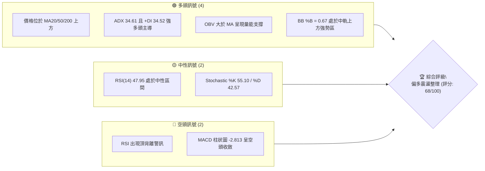
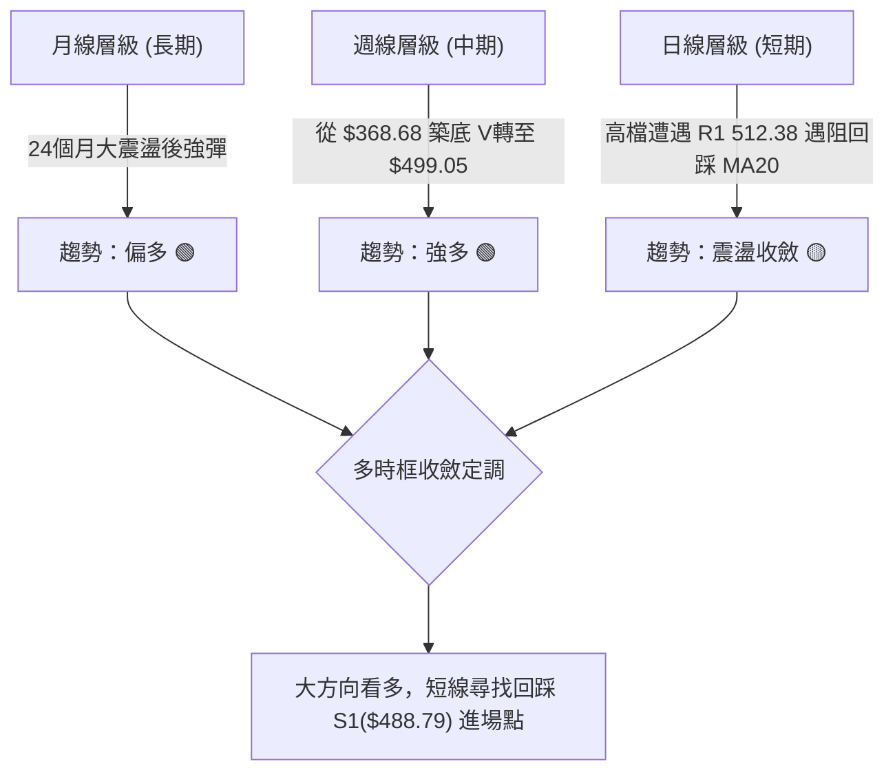
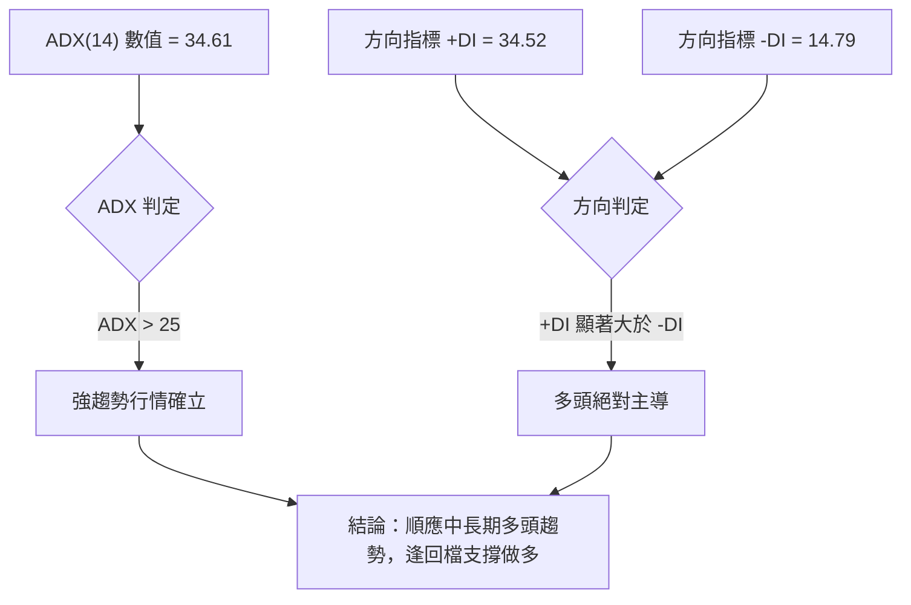
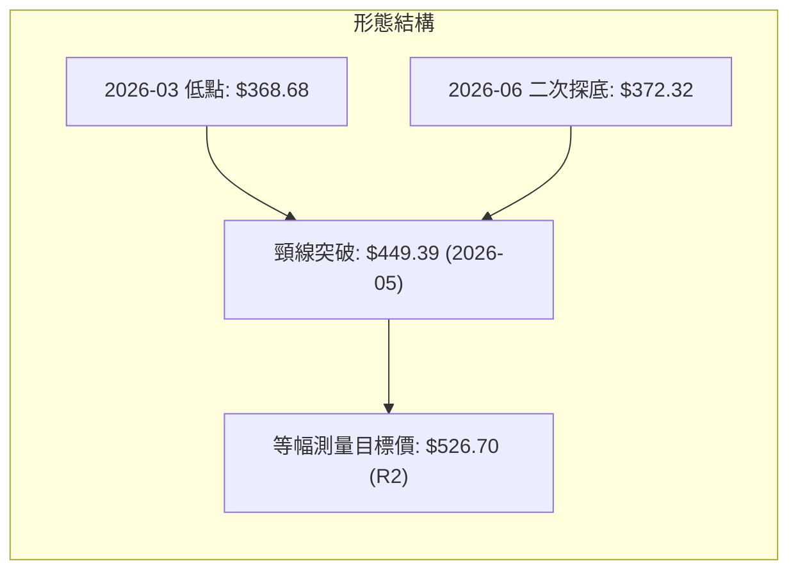
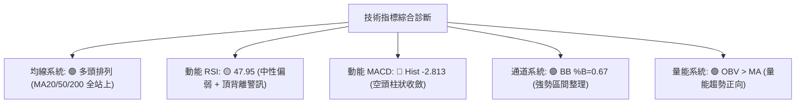
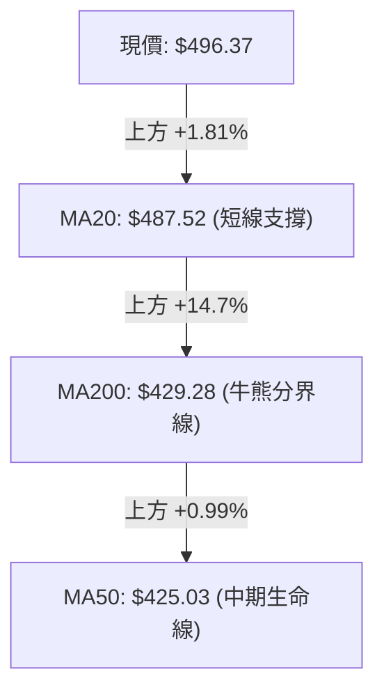
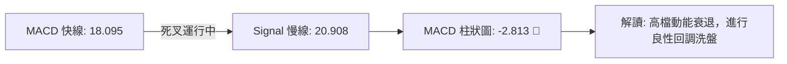
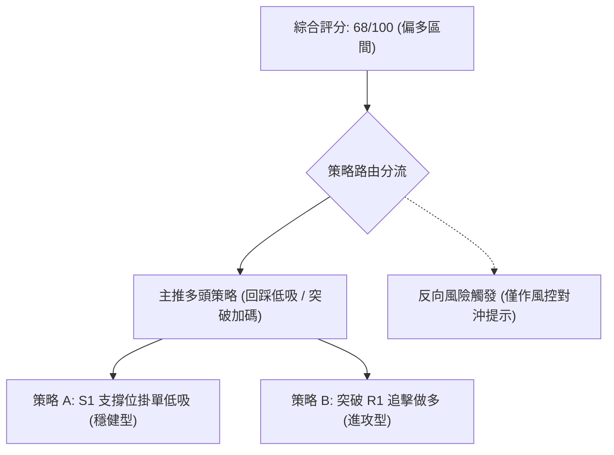
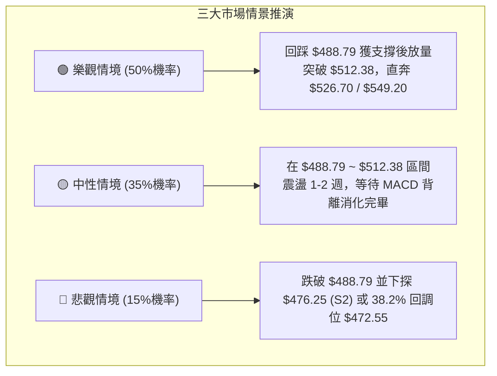

# MSFT 技術分析報告

> **報告日期**：2026-08-27 ｜ **語言**：繁體中文 ｜ **數據來源**：Yahoo Finance ｜ **當前價格**：$496.37

---

## 目錄

| 章節 | 內容 |
|------|------|
| [1. 技術面概覽](#1-技術面概覽) | 訊號儀表板、核心指標、評分卡 |
| [2. 趨勢分析](#2-趨勢分析) | 多時框趨勢、長中短期走勢 |
| [3. 圖表形態分析](#3-圖表形態分析) | 形態識別、K線組合、目標價 |
| [4. 支撐與阻力](#4-支撐與阻力) | 關鍵價位、斐波那契回調 |
| [5. 技術指標深度解讀](#5-技術指標深度解讀) | MA/RSI/MACD/布林/成交量 |
| [6. 動能與波動率](#6-動能與波動率) | 動能評估、ATR、Beta |
| [7. 多時框架總結](#7-多時框架總結) | 時框架評分矩陣 |
| [8. 交易策略建議](#8-交易策略建議) | 多空策略、風險報酬比 |
| [9. 風險提示與監控](#9-風險提示與監控) | 監控指標、風險場景 |

---

## 1. 技術面概覽

### 🎯 技術訊號儀表板



### 📊 核心指標速覽表

| 指標類別 | 指標名稱 | 當前數值 | 訊號 | 解讀 |
|:---|:---|:---|:---:|:---|
| **價格** | 當前價格 | $496.37 | 🟢 | 位於52週區間73.7%處，多頭掌控總體格局 |
| **均線** | MA20 | $487.52 | 🟢 | 價格在MA20上方+1.81%，短線支撐強勁 |
| **均線** | MA50 | $425.03 | 🟢 | 價格大幅高於MA50，中期上升趨勢未變 |
| **均線** | MA200 | $429.28 | 🟢 | 站穩長期生命線上方，牛市底色穩固 |
| **動能** | RSI(14) | 47.95 | 🟡 | 位於30-70中性區，但存在⚠️頂背離跡象 |
| **動能** | MACD Hist | -2.813 | 🔴 | MACD值18.095 < Signal 20.908，動能短線回落 |
| **趨勢** | ADX(14) | 34.61 | 🟢 | ADX > 25強趨勢，+DI(34.52)遠高於-DI(14.79) |
| **波動** | ATR(14) | $9.10 | 🟢 | 佔股價1.83%，波動率溫和可控 |

### 🏆 技術評分卡

```
╔══════════════════════════════════════════════════════════════╗
║              技術評分卡 — MSFT (2026-08-27)                 ║
╠══════════════════════════════════════════════════════════════╣
║ 趨勢強度      ████████████████░░░░  80/100  🟢 強勢多頭      ║
║ 動能指標      ██████████░░░░░░░░░░  50/100  🟡 動能背離調整  ║
║ 支撐穩定度    ██████████████░░░░░░  70/100  🟢 階梯支撐紮實  ║
║ 成交量配合    ██████████████░░░░░░  70/100  🟢 OBV維持強勢   ║
║ 形態完整度    ██████████████░░░░░░  70/100  🟢 V型反轉向上   ║
║ 均線排列      ██████████████░░░░░░  70/100  🟢 價格全線站上  ║
╠══════════════════════════════════════════════════════════════╣
║ 綜合評分      █████████████░░░░░░░  68/100  🟢 偏多回踩布局  ║
╚══════════════════════════════════════════════════════════════╝
```

---

## 2. 趨勢分析

### 🌐 多時框趨勢分析



### 📈 長期趨勢 — 12個月走勢圖（Unicode）

```
MSFT 月線收盤走勢圖（2025-09 至 2026-08）
價格 ($)
$520 ┤    ●   ● (2025-09/10: $513.72/$513.58)
$500 ┤                                     ● ($496.37 現價)
$480 ┤            ●   ● (2025-11/12)   ● (2026-07: $463.85)
$440 ┤                                 ● (2026-05: $449.39)
$420 ┤                    ● (2026-01: $427.58)  ● (2026-04: $406.13)
$390 ┤                        ● (2026-02: $391.15)
$360 ┤                            ● (2026-03: $368.68 低點)  ● (2026-06: $372.32 雙底)
     └─────────────────────────────────────────────────────────────
        09  10  11  12  01  02  03  04  05  06  07  08 (月份)
```

**走勢特徵分析表格**：

| 階段區間 | 價格變動 | 期間漲跌幅 | 走勢特徵與技術解讀 |
|:---|:---:|:---:|:---|
| **2025-09 ~ 2025-10** | $513.72 → $513.58 | -0.03% | 高檔雙頂構築，52週高點 $549.20 形成強大阻力帶 |
| **2025-11 ~ 2026-03** | $488.91 → $368.68 | -24.59% | 中期深度回調，一路下探至年內低點 $348.54 上方 |
| **2026-04 ~ 2026-06** | $406.13 → $372.32 | -8.32% | 築底震盪期，2026-06於 $372.32 形成雙重底結構 |
| **2026-07 ~ 2026-08** | $463.85 → $496.37 | +33.32% | 強勁V型反轉向上，突破全數均線，逼近前高阻力區 |

### 📊 中期趨勢（週線分析）

週線在 2026-06-28 爆出 3.82 億股天量低點（$372.27）後展開主升浪，連續推升至 2026-08-09 的高點 $499.05。近兩週進入量縮回踩（2026-08-23 收 $483.24，當前報 $496.37），確認了 $488.79（S1）一線的動態支撐效應。

### ⚡ 趨勢強度評估（ADX 解讀）



| 指標參數 | 當前讀數 | 門檻標準 | 狀態評估 | 實戰指導意義 |
|:---|:---:|:---:|:---:|:---|
| **ADX(14)** | **34.61** | > 25.0 | 🟢 強趨勢 | 趨勢指標效能極佳，不宜逆勢摸頂放空 |
| **+DI** | **34.52** | > 25.0 | 🟢 多方主攻 | 買方推升力道強勁 |
| **-DI** | **14.79** | < 20.0 | 🟢 空方衰竭 | 賣壓並無連續性宣洩特徵 |

---

## 3. 圖表形態分析

### 🔍 形態識別系統



**圖表形態信心度評估表**：

| 形態名稱 | 信心度 | 判斷依據（引用數據） | 完成度 | 目標價（附計算式） |
|:---|:---:|:---|:---:|:---|
| **雙底形態 (W-Bottom)** | **85%** | 兩次低點 $368.68 與 $372.32 差距僅 0.98%，且 2026-06 探底伴隨 3.82 億股天量支撐 | 100% (已突破頸線) | 頸線 $449.39 + 形態深度 ($449.39 - $370.50) = **$528.28**（直接呼應阻力位 **R2: $526.70**） |
| **高檔矩形箱體整理** | **70%** | 當前於 $488.79 (S1) 與 $512.38 (R1) 之間進行收斂整理 | 60% | 向上突破 R1($512.38) 後量測高度: $512.38 + ($512.38 - $488.79) = **$535.97** |

### 🕯️ 重要K線形態分析

| 期間/月份 | 收盤價 | K線形態 | 解讀 | 訊號 |
|:---|:---:|:---|:---|:---:|
| **2026-06** | $372.32 | 爆量長下影錘頭線 | 單月成交放量，低檔承接買盤極強，確認底部形成 | 🟢 |
| **2026-07** | $463.85 | 長陽實體大突破 | 單月暴漲 24.58%，一口氣收復 MA50 與 MA200 | 🟢 |
| **2026-08 (進行中)** | $496.37 | 高檔震盪紡錘線 | 衝高 $499.05 後遇阻，顯示 $500 大關前多空分歧 | 🟡 |

### 📉 ASCII 走勢形態示意圖

```
MSFT 日/週線 W底突破與回踩形態示意
價格 ($)
$526.70 ┤                                            (形態量測目標 R2)
$512.38 ┤                        ┌─────── R1 阻力線
$496.37 ┤                      ▲─┼─● (現價 $496.37 衝高回踩)
$488.79 ┤                    ▲   └─────── S1 短線頸線支撐
$449.39 ┤───────────● (頸線) ─┘
$400.00 ┤          / \
$370.00 ┤  ●──────/   \──────● (雙底: $368.68 / $372.32)
        └────────────────────────────────────────────► 時間
```

### 🎯 形態目標價計算

1. **W底形態高度**：$449.39（2026-05 頸線）- $370.50（雙底均值）= **$78.89**
2. **第一等幅擴展目標**：$449.39 + $78.89 = **$528.28**，緊密契合波段阻力位 **R2 ($526.70)**。
3. **極限延伸目標**：若順利突破 R2，將進一步測試 52週歷史高點 **R3 ($549.20)**。

---

## 4. 支撐與阻力

### 🗺️ 關鍵價位分布圖（Unicode）

```
MSFT 價位結構分布圖
═════════════════════════════════════════════════════════════════════
$549.20 ║████████████████████████████████████████║ 強阻力 R3 (52W高點)
$526.70 ║████████████████████████████            ║ 波段阻力 R2 (W底目標)
$512.38 ║████████████████████████████████        ║ 關鍵阻力 R1 (近期高點聚類)
$501.85 ║░░░░░░░░░░░░░░░░░░░░░░░░░░░░░░░░░░░░░░░░║ 斐波那契 23.6% 回調位
$496.37 ╠════════════════════════════════════════╣ ◄ 當前價格
$488.79 ║▓▓▓▓▓▓▓▓▓▓▓▓▓▓▓▓▓▓▓▓▓▓▓▓▓▓▓▓▓▓▓▓        ║ 近期支撐 S1 (MA20共振)
$476.25 ║████████████████████                    ║ 支撐 S2 (波段回撤位)
$472.55 ║░░░░░░░░░░░░░░░░░░░░░░░░░░░░░░░░░░░░░░░░║ 斐波那契 38.2% 回調位
$465.47 ║████████████████████████████████        ║ 強支撐 S3 (BB下軌防線)
═════════════════════════════════════════════════════════════════════
```

### 🚧 阻力位分析表

| 阻力級別 | 價位 | 形成原因 | 突破難度 | 重要性 |
|:---|:---:|:---|:---:|:---:|
| **R1** | **$512.38** | 近一年波段高點聚類，接近布林上軌 $513.46 | 🟡 中等 | ★★★★☆ |
| **R2** | **$526.70** | W底形態等幅向上測量目標價位聚類區 | 🔴 較高 | ★★★★☆ |
| **R3** | **$549.20** | 52週歷史最高價，歷史套牢籌碼峰值密集區 | 🔴 極高 | ★★★★★ |

### 🛡️ 支撐位分析表

| 支撐級別 | 價位 | 形成原因 | 守住機率 | 重要性 |
|:---|:---:|:---|:---:|:---:|
| **S1** | **$488.79** | 近一年波段低點聚類，與 MA20 ($487.52) 形成重合共振 | 🟢 80% | ★★★★★ |
| **S2** | **$476.25** | 近期多頭突破後的平台換手低點聚類 | 🟢 75% | ★★★★☆ |
| **S3** | **$465.47** | 波段防禦低點，逼近布林通道下軌 $461.58 | 🟢 85% | ★★★★★ |

### 📐 斐波那契回調位分析

依據 52週區間（低點 **$348.54** → 高點 **$549.20**，落差 $200.66）計算之精確價位：

```
0.0%  (52W High) : $549.20 ─────────────────────────
23.6%            : $501.85 ─── [阻力區間]
【現價 $496.37】 : 處於 23.6% ($501.85) 與 38.2% ($472.55) 之間
38.2%            : $472.55 ─── [強支撐區間]
50.0%            : $448.87 ─── [多空分水嶺 / MA240 $443.19]
61.8%            : $425.19 ─── [黃金分割 / MA50 $425.03 共振]
78.6%            : $391.48
100.0% (52W Low) : $348.54 ─────────────────────────
```

**技術解讀**：現價 $496.37 位於斐波那契 23.6%（$501.85）下方不遠處，屬於極強勢回調區間（回撤未破 38.2% $472.55）。只要價格維持在 38.2% 之上，中長線上升浪潮完全未被破壞。

---

## 5. 技術指標深度解讀

### 🎛️ 指標訊號總覽



### 📈 移動平均線排列分析



| 均線名稱 | 數值 | 偏離度 | 排列狀態 | 技術含義 |
|:---|:---:|:---:|:---:|:---|
| **MA 5** | $487.96 | +1.72% | 向上 ▅▇██ | 短線強勢反彈 |
| **MA 10** | $487.38 | +1.85% | 向上 ▅▆▇█ | 短線買盤均價向上墊高 |
| **MA 20** | $487.52 | +1.81% | 向上 ▄▅▆█ | 短期上升趨勢完好，與 S1 ($488.79) 緊密共振 |
| **MA 50** | $425.03 | +16.78% | 向上 ▃▄▅█ | 中期底部確立，正向上金叉 MA200 |
| **MA 200** | $429.28 | +15.63% | 走平 ▁▁▂▂ | 長期生命線，股價穩居其上確立牛市 |

### 📉 RSI(14) 分析

* 當前數值：**47.95**
* 進度條：`█████████░░░░░░░░░░░ 47.95%` (中性區間 30-70)
* **背離判定**：⚠️ **頂背離 (Bearish Divergence)** 成立。
  * *分析*：股價自 2026-08-09 衝上波段高點 $499.05 時週線 RSI 達 81.4，隨後股價在 $496.37 高檔震盪，但 RSI(14) 快速下滑至 47.95。這表明短線推升動能有所衰減，短線需要以時間換取空間進行指標修復，或回踩支撐確認。

### 📊 MACD(12/26/9) 訊號解讀



雖然 MACD 快線仍處於零軸上方極高位置（18.095），確立了大週期的多頭市場架構，但快線下穿慢線形成短線死叉，柱狀圖為 -2.813，顯示近期不宜追高，應等待柱狀圖收縮翻紅。

### 📦 布林通道分析

```
MSFT 布林通道當前結構 ($)
上軌  $513.46 ────────────────────────────── (壓制帶，接近 R1 $512.38)
現價  $496.37 ──────────● [%B = 0.67] (位於中軌上方強勢區間)
中軌  $487.52 ────────────────────────────── (MA20 強支撐帶)
下軌  $461.58 ────────────────────────────── (極限防禦帶，接近 S3 $465.47)
```

當前通道帶寬穩定，%B 為 0.67，價格在中軌與上軌間運行，屬於典型的多頭強勢整理格局。中軌 $487.52 提供了強大的動態回踩防線。

### 💹 成交量分析（量價配合度）

* **最新成交量**：20,712,000 股
* **20日均量**：34,154,680 股（量比：**0.61x**，呈現縮量整理）
* **50日均量**：38,785,970 股
* **OBV 趨勢**：**OBV > MA**，量能指標依然處於均線上方，表明主力資金在中期上漲波段中未見大規模出逃，縮量回踩屬於籌碼鎖定良好的健康現象。

---

## 6. 動能與波動率

### ⚡ 動能評估四象限


| 象限 | 動能維度 | 波動維度 | 當前狀態 | 評估與策略 |
|:---:|:---:|:---:|:---:|:---|
| **Q1** | 強 | 低 | — | 最佳順勢持股階段 |
| **Q2** | **弱/中** | **低** | **✓ (MSFT)** | **健康蓄勢整理，回踩關鍵支撐位為極佳低吸機會** |
| **Q3** | 強 | 高 | — | 追突破需嚴格止損 |
| **Q4** | 弱 | 高 | — | 籌碼渙散，應觀望離場 |

### 📊 ATR 波動率分析

* **ATR(14) 數值**：**$9.10**（佔股價 1.83%）
* **波動特徵**：屬於大型權值股正常的低波動度，顯示籌碼沉澱穩定。
* **交易止損設置指導**：
  * 日內交易保護止損：$496.37 - 1.0 × ATR ($9.10) = **$487.27**（剛好保護在 MA20 之下）
  * 波段交易保護止損：$496.37 - 2.0 × ATR ($18.20) = **$478.17**（保護在 S2 $476.25 上方）

### 📐 Beta 與市場相關性

* **Beta 係數**：**1.099**
* **市場聯動性**：與標普 500 指數具備高度同步性且略帶進攻彈性。在科技板塊輪動向上時，MSFT 具有提供超額收益（Alpha）的能力，且空頭抵抗力強。

---

## 7. 多時框架總結

### 📋 時框架評分表

| 時框架 | 趨勢方向 | 動能狀態 | 均線排列 | 形態結構 | 綜合評分 | 戰略建議 |
|:---|:---:|:---:|:---:|:---:|:---:|:---|
| **月線 (長期)** | 🟢 多頭 | 🟡 中性修復 | 🟢 站穩長期均線 | 大型回調後回升 | **75/100** | 長期投資堅定持有 |
| **週線 (中期)** | 🟢 強多 | 🟢 多頭放量 | 🟢 全面向上發散 | 雙底反轉突破頸線 | **85/100** | 波段回踩積極做多 |
| **日線 (短期)** | 🟡 震盪 | 🔴 短線頂背離 | 🟢 站上MA20 | 遭遇R1阻力窄幅收斂 | **55/100** | 不追高，逢低掛單低吸 |

### 🔲 綜合訊號矩陣

```
╔══════════════════════════════════════════════════════════════════╗
║               MSFT 多時框架訊號矩陣一致性檢驗                    ║
╠══════════════════════╦════════════════╦══════════════════════════╣
║ 時框維度             ║ 訊號方向       ║ 核心技術邏輯             ║
╠══════════════════════╬════════════════╬══════════════════════════╣
║ 短期 (1-5日)         ║ 🟡 震盪整理    ║ 消化 RSI 背離與 MACD 死叉║
║ 中期 (2-8週)         ║ 🟢 強勢看多    ║ W底成型，目標上看 R2     ║
║ 長期 (3-12月)        ║ 🟢 穩健上行    ║ 站穩 MA200，測試 52W 高點║
╠══════════════════════╩════════════════╩══════════════════════════╣
║ 多時框共振結論：短期回調不改中期強勢，順大勢、逆小勢買入        ║
╚══════════════════════════════════════════════════════════════════╝
```

### ⚖️ 多時框收斂結論

依據多時框收斂規則：
1. **行情性質判定**：當前 **ADX(14) = 34.61 > 25**，明確屬於**趨勢行情**。
2. **主導時框取捨**：以**中長期（週線 / MA200）方向為主導**，日線指標之頂背離與短線回調僅作為「尋找進場優化點位」之工具，不可視為趨勢反轉。
3. **唯一方向性結論**：**【偏多回踩布局】**。主策略鎖定逢回踩強支撐做多，嚴禁盲目摸頂放空。

---

## 8. 交易策略建議

### 🗺️ 策略決策流程圖



### 🧭 策略路由

> **當前主策略方向 = 多頭回踩低吸與突破順勢做多（依評分卡 68/100，處於 ≥60 偏多區間）**

### 🎯 價格情境階梯（Price Scenarios）

| 觸發條件 | 下一目標 | 後續延伸 | 技術情境含義 |
|:---|:---:|:---:|:---|
| **強勢突破 R1 ($512.38)** | **R2 ($526.70)** | **R3 ($549.20)** | 短線背離消化完畢，多頭主升浪開啟 |
| **維持 $488.79 ~ $512.38** | — | — | 高檔箱體整理，以時間換取空間消化獲利盤 |
| **失守 S1 ($488.79)** | **S2 ($476.25)** | **S3 ($465.47)** | 中期回踩深化，測試斐波那契 38.2% 支撐 |

### 📊 情境機率分佈

| 價格情境 | 發生機率 | 主要技術依據 |
|:---|:---:|:---|
| **回踩蓄勢後繼續上行** | **65%** | ADX 34.61 強趨勢、+DI 多頭主導、OBV 量能支撐、全均線站上 |
| **高檔區間箱體震盪** | **25%** | RSI(14) 47.95 頂背離修復需求、MACD 柱狀圖收斂 -2.813 |
| **深度跌破關鍵支撐** | **10%** | 目前各級別支撐扎實，需出現系統性黑天鵝才會回測 S3 ($465.47) |

### 🟢 主策略詳情

```
╔══════════════════════════════════════════════════════════════════╗
║                    MSFT 推薦交易策略執行表                       ║
╠══════════════════════╦════════════════════╦══════════════════════╣
║ 策略要素             ║ 策略 A (回踩低吸)  ║ 策略 B (突破追多)    ║
╠══════════════════════╬════════════════════╬══════════════════════╣
║ 進場條件             ║ 回踩 S1 企穩不破   ║ 放量突破 R1 阻力位   ║
║ 進場價格             ║ **$488.79**        ║ **$512.38**          ║
║ 目標價 T1 (第一目標) ║ **$512.38** (+4.8%)║ **$526.70** (+2.8%)  ║
║ 目標價 T2 (延伸目標) ║ **$526.70** (+7.8%)║ **$549.20** (+7.2%)  ║
║ 止損價格             ║ **$476.25** (S2位) ║ **$496.37** (現價位) ║
║ 單筆風險 (R)         ║ $12.54             ║ $16.01               ║
║ 風險報酬比 (至T2)    ║ **3.02 : 1**       ║ **2.30 : 1**         ║
║ 預期成功機率         ║ **70%**            ║ **60%**              ║
║ 建議配置倉位         ║ **15% - 20%**      ║ **10% - 15%**        ║
╚══════════════════════╩════════════════════╩══════════════════════╝
```

### 🔴 反向風險觸發點（對沖提示）

若日線收盤價**實體跌破 S2 ($476.25)**，且伴隨 MACD 柱狀圖進一步放大擴散，則宣佈多頭結構轉弱，應立即將多頭部位止損離場，或使用等量資金部位買入對沖工具，下看 **S3 ($465.47)**。

### ⭐ 整體訊號強度評星

```
做多訊號強度：★★★★☆  (4/5星 - 中長線多頭確立，短線回踩送買點)
做空訊號強度：★☆☆☆☆  (1/5星 - 逆強勢趨勢，風險極高)
整體可信度：  ★★★★☆  (4/5星 - 多時框共振與量能確認良好)
```

---

## 9. 風險提示與監控

### ✅ 關鍵監控指標 Checklist

```
╔══════════════════════════════════════════════════════════════╗
║               每日盤後技術監控清單 (Checklist)               ║
╠══════════════════════════════════════════════════════════════╣
║ [ ] 價格是否守穩 MA20 / S1 ($488.79) 關鍵分界？              ║
║ [ ] MACD 柱狀圖負值 (-2.813) 是否開始由負轉正或收斂？       ║
║ [ ] 日成交量是否回升突破 20日均量 (34.15M) 配合反彈？        ║
║ [ ] RSI(14) 是否在 45-50 獲得支撐並重新向上拐頭？           ║
║ [ ] ADX(14) 是否持續維持在 25 以上確認趨勢延續？            ║
╚══════════════════════════════════════════════════════════════╝
```

### ⚠️ 風險場景分析



### 🛡️ 風險管理重要提醒

1. **嚴禁高檔追價**：由於 RSI 存在頂背離且 MACD 柱狀圖為負，嚴禁在接近 R1（$512.38）處市價追多，必須採取回踩 S1（$488.79）分批掛單策略。
2. **倉位控制紀律**：單一策略最大虧損金額不得超過總帳戶淨值的 1.5% - 2.0%。
3. **動態移動止盈**：當價格達到第一目標 T1（$512.38）後，應主動將止損點上移至進場成本價（$488.79），鎖定零風險交易狀態。

---

## 📋 報告總結

```
╔══════════════════════════════════════════════════════════════════╗
║                    MSFT 技術分析報告總結                         ║
╠══════════════════════════════════════════════════════════════════╣
║ 報告日期：2026-08-27                                             ║
║ 當前價格：$496.37                                                ║
║ 分析評級：🟢 偏多回踩布局 (技術評分: 68/100)                     ║
║                                                                  ║
║ 關鍵結論：                                                       ║
║ ├─ 長期趨勢：🟢 偏多上行 (站穩 MA200 $429.28 牛市線)            ║
║ ├─ 中期趨勢：🟢 強勢突破 (W底確立，目標看 $526.70)              ║
║ ├─ 短期趨勢：🟡 高檔整固 (消化日線頂背離，回踩蓄勢)              ║
║ ├─ 關鍵支撐：S1 $488.79 │ S2 $476.25 │ S3 $465.47               ║
║ ├─ 關鍵阻力：R1 $512.38 │ R2 $526.70 │ R3 $549.20               ║
║ └─ 華爾街共識目標價：$569.45 (潛在上漲空間 +14.7%)              ║
║                                                                  ║
║ 最優策略組合：                                                   ║
║ 1. 🥇 最佳機會：於 S1 ($488.79) 附近掛單做多，目標 R2 ($526.70) ║
║ 2. 🥈 次選機會：放量突破 R1 ($512.38) 後順勢跟進，目標 $549.20   ║
║ 3. 🥉 保守選擇：等待 MACD 柱狀圖翻紅且 RSI 回升至 50 上方再進場 ║
╚══════════════════════════════════════════════════════════════════╝
```

---

> ⚠️ **免責聲明**：本報告為 AI 自動生成之技術分析，所有數據及估算均基於提供的歷史價格資訊。本報告**僅供研究與學術參考**，**不構成任何投資建議**。投資有風險，入市需謹慎。

---

*報告生成時間：2026-08-27 ｜ 數據來源：Yahoo Finance ｜ 分析框架：多時框技術分析*