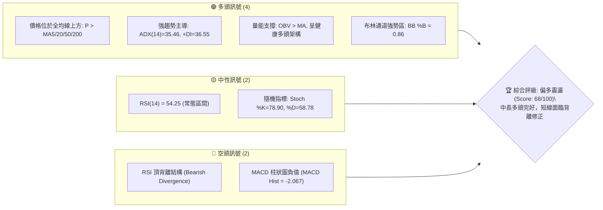
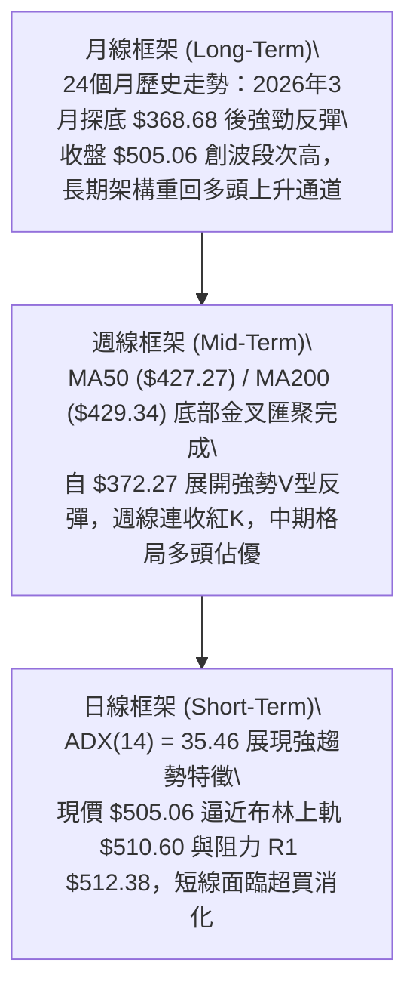
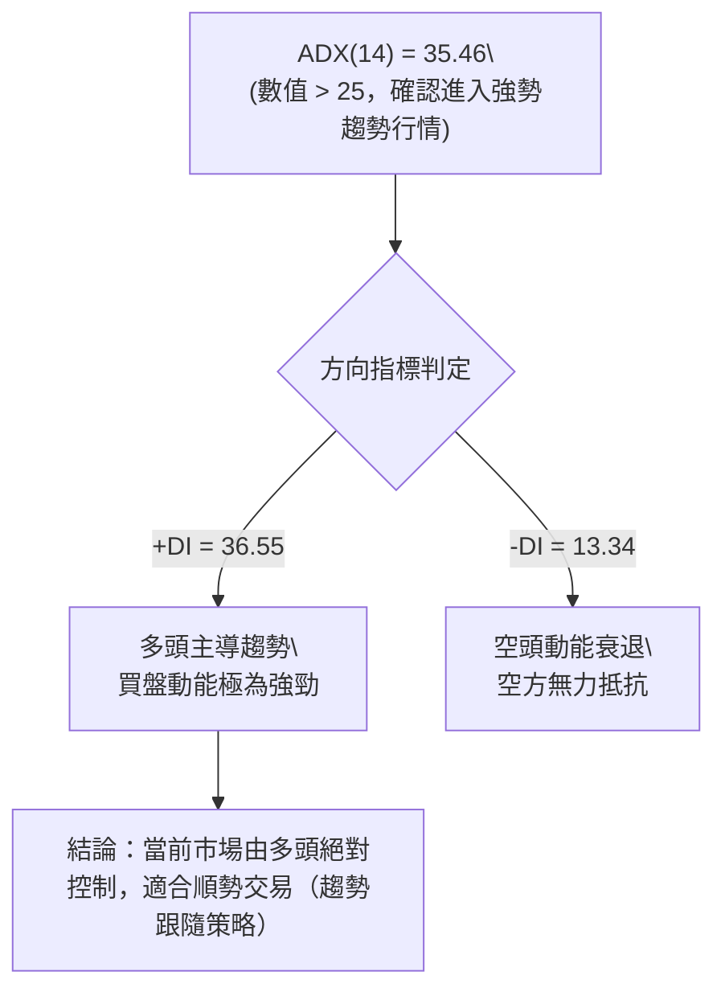
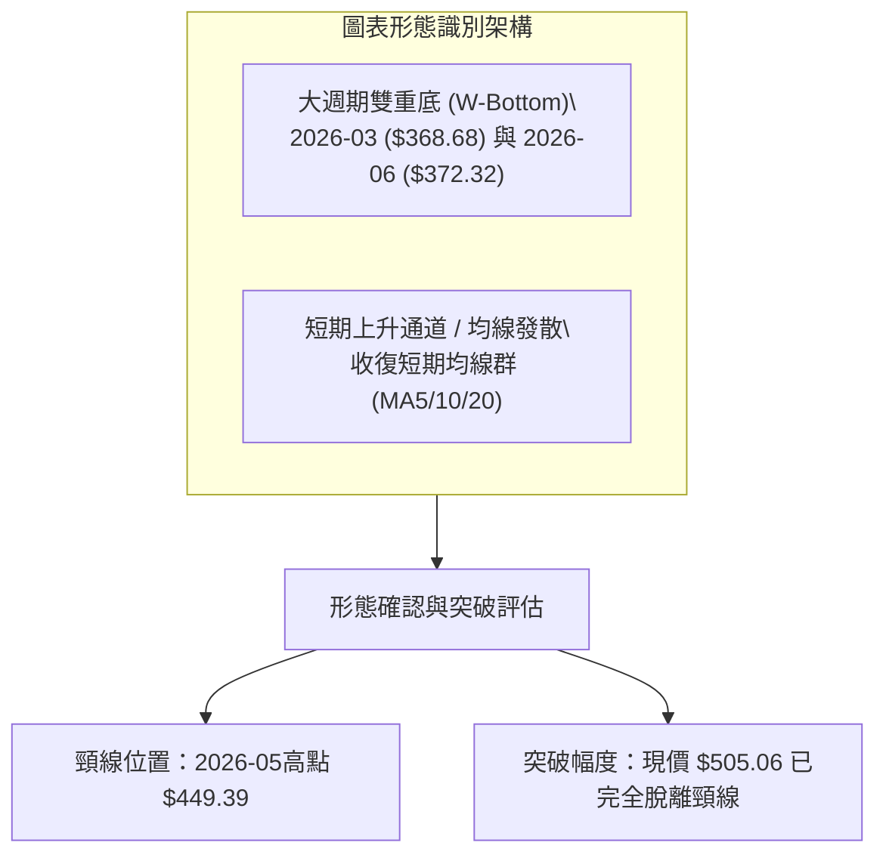
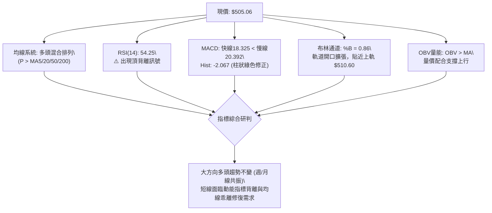
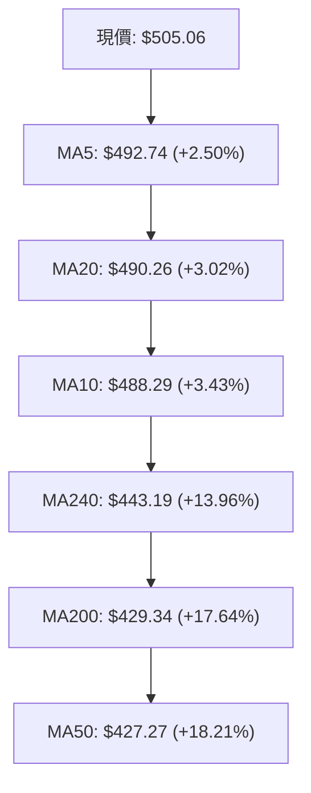
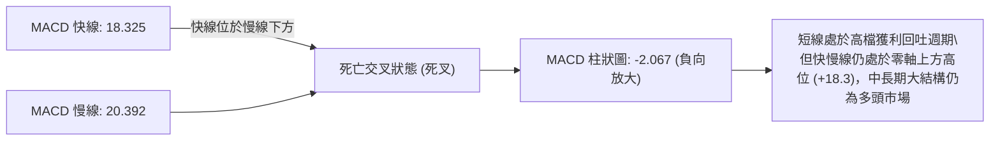
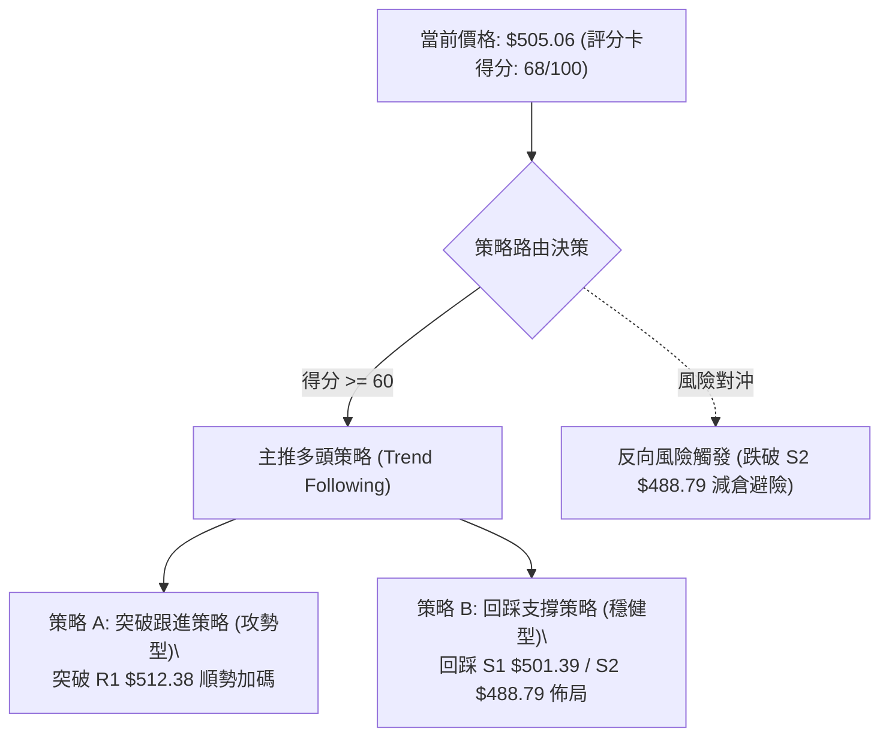
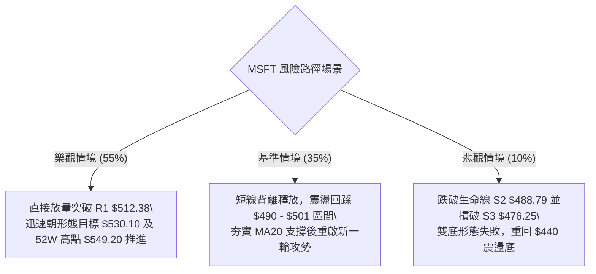

# MSFT 技術分析報告

> **報告日期**：2026-08-28 ｜ **語言**：繁體中文 ｜ **數據來源**：Yahoo Finance ｜ **當前價格**：$505.06

---

## 目錄

| 章節 | 內容 |
|------|------|
| [1. 技術面概覽](#1-技術面概覽) | 訊號儀表板、核心指標、評分卡 |
| [2. 趨勢分析](#2-趨勢分析) | 多時框趨勢、長中短期走勢、ADX解讀 |
| [3. 圖表形態分析](#3-圖表形態分析) | 形態識別、信心度評估、K線組合、目標價 |
| [4. 支撐與阻力](#4-支撐與阻力) | 關鍵價位結構、斐波那契回調位分析 |
| [5. 技術指標深度解讀](#5-技術指標深度解讀) | 均線系統、RSI頂背離、MACD、布林通道、OBV量能 |
| [6. 動能與波動率](#6-動能與波動率) | 動能四象限、ATR波動度、Beta分析 |
| [7. 多時框架總結](#7-多時框架總結) | 時框矩陣、多時框收斂判定 |
| [8. 交易策略建議](#8-交易策略建議) | 策略路由、多頭主策略、風險對沖點 |
| [9. 風險提示與監控](#9-風險提示與監控) | 監控Checklist、三情境風險路徑、風控管理 |
| [📋 報告總結](#-報告總結) | 核心結論與執行摘要 |

---

## 1. 技術面概覽

### 🎯 技術訊號儀表板



### 📊 核心指標速覽表

| 指標類別 | 指標名稱 | 當前數值 | 訊號 | 解讀 |
|:---|:---|:---|:---:|:---|
| **價格** | 當前價格 | $505.06 | 🟢 | 位於52週區間 78.0% 高位，多頭主控格局 |
| **均線** | MA20 (短期) | $490.26 | 🟢 | 現價高於 MA20 (+3.02%)，短線上升動能充沛 |
| **均線** | MA50 (中期) | $427.27 | 🟢 | 現價大幅高於 MA50 (+18.21%)，中期強勢多頭 |
| **均線** | MA200 (長期) | $429.34 | 🟢 | 現價位於長期牛熊分界線上方 (+17.64%) |
| **動能** | RSI(14) | 54.25 | 🟡 | 位於50中軸上方偏強區，但存在頂背離隱憂 |
| **動能** | MACD (12,26,9) | 18.325 / 20.392 | 🔴 | 快線低於慢線，MACD Hist (-2.067) 顯示短線修正 |
| **趨勢** | ADX(14) / ±DI | 35.46 (+DI:36.55) | 🟢 | ADX > 25 且 +DI 遠高於 -DI(13.34)，多頭強趨勢 |
| **通道** | 布林通道 (BB) | 軌道: 469.93 - 510.60 | 🟢 | %B=0.86，價格貼近上軌 $510.60 運行 |
| **量能** | OBV / 量比 | 28.65M / 0.95x | 🟢 | OBV > MA 穩步上升，價量配合良好 |
| **波動** | ATR(14) | $9.81 | 🟡 | 波動率 1.94%，處於正常健康波動範圍 |

### 🏆 技術評分卡

```
╔══════════════════════════════════════════════════════════════════╗
║              技術評分卡 — MSFT (2026-08-28)                      ║
╠══════════════════════════════════════════════════════════════════╣
║ 趨勢強度 (Trend)     ████████████████░░░░  80/100  🟢 強勢多頭   ║
║ 動能指標 (Momentum)  ██████████░░░░░░░░░░  52/100  🟡 短期背離   ║
║ 支撐穩定度 (Support) ██████████████░░░░░░  72/100  🟢 買盤密集   ║
║ 成交量配合 (Volume)  ██████████████░░░░░░  70/100  🟢 量價健康   ║
║ 形態完整度 (Pattern) ██████████████░░░░░░  70/100  🟢 底部突破   ║
║ 均線排列 (MA System) ████████████░░░░░░░░  62/100  🟡 混合偏多   ║
╠══════════════════════════════════════════════════════════════════╣
║ 綜合評分 (Overall)   █████████████░░░░░░░  68/100  🟢 偏多主導   ║
╚══════════════════════════════════════════════════════════════════╝
```

---

## 2. 趨勢分析

### 🌐 多時框趨勢分析



### 📈 長期趨勢 — 12個月走勢圖（Unicode）

```
MSFT 月線走勢圖（2025-09 至 2026-08）
價格軸 ($)
$520 ┤                      
$510 ┤ ●(09) ●(10)                                 ●(08) $505.06 ← 現價
$480 ┤             ●(11) ●(12)               ●(07)
$440 ┤                                 ●(05)
$420 ┤                         ●(01) ●(04)
$390 ┤                               ●(02)
$360 ┤                                     ●(03/06低點 $368.68/$372.32)
     └─────────────────────────────────────────────────────────────
       09   10   11   12   01   02   03   04   05   06   07   08 (月份)
```

#### 走勢特徵分析表格

| 階段區間 | 起訖月份 | 價格區間 ($) | 漲跌幅 (%) | 走勢特徵與量價結構 |
|:---|:---:|:---:|:---:|:---|
| **第一階段：高檔震盪回落** | 2025-09 ~ 2025-12 | $513.72 → $480.57 | -6.45% | 高檔獲利了結賣壓湧現，連續跌破月線短期均線支撐。 |
| **第二階段：中期深度修正** | 2026-01 ~ 2026-03 | $427.58 → $368.68 | -13.77% | 加速趕底，2026年3月觸及波段低點 $368.68，進入超賣區。 |
| **第三階段：築底強勁反彈** | 2026-04 ~ 2026-05 | $406.13 → $449.39 | +10.65% | 買盤強勢進駐，收復 $400 整數心理關卡與中期均線。 |
| **第四階段：二次探底確認** | 2026-06 | $449.39 → $372.32 | -17.15% | 洗盤回測第一隻腳低點，6月28日爆出3.82億股天量完成二次探底。 |
| **第五階段：主升推升行情** | 2026-07 ~ 2026-08 | $372.32 → $505.06 | +35.65% | 機構資金大舉回補，形成大型雙底突破，目前收復 $500 大關。 |

### 📊 中期趨勢（週線分析）

```
週線關鍵架構示意圖：
阻力 R3  $549.20 ────────────────────────────────── (52W歷史高點)
阻力 R2  $526.70 ───────────────────────────── (波段次高密集阻力區)
阻力 R1  $512.38 ──────────────────────── (前波反彈高點聚類)
現價     $505.06 ═════════════════════════ ◄ 當前位置 (多頭主攻浪)
支撐 S1  $501.39 ──────────────────────── (斐波那契23.6% / 短線第一道支撐)
支撐 S2  $488.79 ──────────────────────── (MA20動態均線支撐 / $490.26)
支撐 S3  $476.25 ──────────────────────── (前波回調低點支撐)
```

中期走勢自 2026年6月低點 $372.27 啟動強勁反彈，週線 RSI 迅速自極度超賣的 18.6 狂飆至 84.8，MACD 柱狀圖同步放大至 +11.272。儘管近兩週隨著價格逼近 $500 大關，週線指標出現技術性拉回（RSI 回落至 54.2，MACD 柱轉為 -2.067），但週線整體上升趨勢軌道保持完好。

### ⚡ 趨勢強度評估（ADX 解讀）



#### ADX 趨勢強度對照

| ADX 數值區間 | 趨勢類型 | 本案狀態 (ADX=35.46) | 操作指導原則 |
|:---:|:---:|:---:|:---|
| 0 - 20 | 無趨勢 / 弱盤整 | 否 | 避免趨勢突破策略，採取高拋低吸 |
| 20 - 25 | 趨勢萌芽 | 否 | 觀察均線與突破方向，準備進場 |
| **25 - 50** | **強勁趨勢** | **✓ (35.46)** | **嚴格順應中長期趨勢操作，回調支撐即為買點** |
| 50 - 75 | 極強趨勢 | 否 | 注意超買現象，分批保護利潤 |
| 75 - 100 | 單邊極端行情 | 否 | 隨時提防力竭反轉 |

---

## 3. 圖表形態分析

### 🔍 形態識別系統



#### 形態識別與信心度評估表

| 形態名稱 | 信心度 | 判斷依據（引用數據） | 完成度 | 目標價（附計算式） |
|:---|:---:|:---|:---:|:---|
| **大型雙重底 (W底)** | **85%** | 第一次低點 2026-03 ($368.68)，第二次低點 2026-06 ($372.32)，兩低點相差僅 0.98%；2026-06-28 爆出 382.7M 天量確認底部支撐。 | 100% (已突破) | 頸線 $449.39 + 形態高度 ($449.39 - $368.68 = $80.71) = **$530.10** |
| **均線金叉發散** | **75%** | 短期 MA5 ($492.74) > MA10 ($488.29) > MA20 ($490.26)，價格全面站上均線上方。 | 90% | 向上挑戰阻力 R2 **$526.70** 與 R3 **$549.20** |
| **頂背離修正形態** | **65%** | 價格從 $499.05 推升至 $505.06，但 RSI 從 81.4 降至 54.2，MACD Hist 由正轉負 (-2.067)。 | 60% | 回踩支撐 S1 **$501.39** 或 S2 **$488.79** (MA20附近) |

### 🕯️ 重要K線形態分析

| 週/月份 | 收盤價 ($) | K線組合形態 | 解讀 | 多空訊號 |
|:---:|:---:|:---|:---|:---:|
| **2026-06-28** | $372.27 | **長下影巨量十字星** | 單週爆出 382.7M 天量，主力進場承接，探底回升確立中期底部。 | 🟢 強烈看多 |
| **2026-08-02** | $463.85 | **跳空放量大陽線** | 突破 $449.39 雙底頸線位置，成交量放大至 278.4M，確認主升浪啟動。 | 🟢 強烈看多 |
| **2026-08-09** | $499.05 | **光頭實體中陽線** | 延續多頭攻勢，直接攻克 $490 關卡，RSI 進入 81.4 高度超買區。 | 🟢 看多 |
| **2026-08-23** | $483.24 | **回踩確認小陰線** | 縮量拉回整理（週量僅 116.2M），回測 MA20 支撐不破，洗盤性質明顯。 | 🟡 中性整固 |
| **2026-08-30** | $505.06 | **反包陽線** | 縮量突破收復 $500 整數關卡，收盤價創本波反彈新高，但動能略見疲態。 | 🟢 偏多震盪 |

### 📉 ASCII 走勢形態示意圖

```
MSFT 大型雙重底 (W底) 形態演變圖
價格 ($)
$530.10 ┤                                                 ┌─ 目標價 $530.10
$505.06 ┤                                           ● ◄──┴─ 當前價格 ($505.06)
$480.00 ┤                                   ▲     ／
$449.39 ┤                  ●(頸線頂點)     ╱ ╲  ／
        │                 ╱ ╲             ╱   ╲╱ (突破回測)
$400.00 ┤                ╱   ╲           ╱
$370.00 ┤   ●           ╱     ╲         ● (底二: $372.32, 2026-06)
$368.68 ┤  (底一: $368.68, 2026-03)
        └──────────────────────────────────────────────────────────
            2026-03       2026-05       2026-06     2026-07   2026-08
```

### 🎯 形態目標價計算

1. **雙重底測幅滿足點**：
   - 形態底部低點：$368.68
   - 形態頸線高點：$449.39
   - 垂直形態高度 $H = \$449.39 - \$368.68 = \$80.71$
   - **理論最小滿足目標價** $= \$449.39 + \$80.71 =$ **$530.10**（此數值介於阻力位 R2 $526.70 與 R3 $549.20 之間）。
2. **斐波那契擴展目標**：
   - 回調位 23.6% 阻力已化為支撐（$501.85），上方阻力直指 52週歷史高點 **$549.20**。

---

## 4. 支撐與阻力

### 🗺️ 關鍵價位分布圖（Unicode）

```
MSFT 價位結構分布圖
═══════════════════════════════════════════════════════════════
$549.20 ║████████████████████████████████║ 強阻力 R3 / 52週高點 (0.0% Fib)
$526.70 ║████████████████████            ║ 波段高點阻力 R2
$512.38 ║████████████████████████        ║ 關鍵阻力 R1 (布林上軌附近)
$505.06 ╠════════════════════════════════╣ ◄ 現價 ($505.06)
$501.39 ║▓▓▓▓▓▓▓▓▓▓▓▓▓▓▓▓▓▓▓▓▓▓▓▓        ║ 近期支撐 S1 (Fib 23.6%: $501.85)
$488.79 ║████████████████████████████    ║ 強支撐 S2 (MA20: $490.26 附近)
$476.25 ║████████████████████            ║ 關鍵波段支撐 S3 (Fib 38.2%: $472.55)
═══════════════════════════════════════════════════════════════
```

### 🚧 阻力位分析表

| 阻力級別 | 價位 ($) | 距現價幅寬 | 形成原因與技術意涵 | 突破難度 | 重要性 |
|:---:|:---:|:---:|:---|:---:|:---:|
| **R1** | **$512.38** | +1.45% | 近期波段高點聚類，與日線布林通道上軌（$510.60）形成共振阻力區。 | 中等 | 🟢 短線分水嶺 |
| **R2** | **$526.70** | +4.28% | 2025年7月歷史次高收盤區域（$528.28）套牢籌碼峰，雙底測幅目標（$530.10）前哨站。 | 較高 | 🟡 中期關鍵壓力 |
| **R3** | **$549.20** | +8.74% | 52週歷史最高點（Fib 0.0%），歷史級別強阻力，需極大成交量配合方能攻克。 | 極高 | 🔴 長期多頭終極目標 |

### 🛡️ 支撐位分析表

| 支撐級別 | 價位 ($) | 距現價幅寬 | 形成原因與技術意涵 | 守住機率 | 重要性 |
|:---:|:---:|:---:|:---|:---:|:---:|
| **S1** | **$501.39** | -0.73% | 斐波那契 23.6% 回調位（$501.85）與 $500 整數大關共振，為短線第一道防線。 | 75% | 🟢 短線多空樞紐 |
| **S2** | **$488.79** | -3.22% | 密集波段低點聚類，與 20日均線 MA20（$490.26）及布林中軌重合，為強支撐。 | 85% | 🟡 波段生命線 |
| **S3** | **$476.25** | -5.70% | 8月初起漲點平台與布林下軌（$469.93）、Fib 38.2%（$472.55）構成強大買盤防線。 | 95% | 🔴 中期多頭底線 |

### 📐 斐波那契回調位分析

> 計算基準：以 52 週波動區間低點 **$348.54** 至高點 **$549.20** 進行斐波那契回調測算（總垂直振幅 $200.66）。

```
斐波那契階梯分佈：
0.0%  (52W High) ─── $549.20
                         ▲ 向上阻力區間 (+8.74%)
23.6%              ─── $501.85 ◄── 現價 $505.06 運行於 0.0% ~ 23.6% 強勢回檔區
                         ▼
38.2%              ─── $472.55
50.0%              ─── $448.87 (多空平衡中軸 / 頸線 $449.39)
61.8%              ─── $425.19 (黃金分割強支撐 / MA50 $427.27)
78.6%              ─── $391.48
100.0% (52W Low)  ─── $348.54
```

- **位置解讀**：現價 $505.06 穩穩站上 23.6% 回調位（$501.85）。在技術分析中，當資產價格回撤或反彈維持在 23.6% 以內時，代表市場處於「極強勢格局（Shallow Retracement）」，多頭隨時具備再度挑戰前高的實力。

---

## 5. 技術指標深度解讀

### 🎛️ 指標訊號總覽



### 📈 移動平均線排列分析



#### 均線數據明細表

| 均線名稱 | 當前數值 ($) | 價格距離 ($) | 乖離率 (%) | 均線斜率 | 訊號解讀 |
|:---|:---:|:---:|:---:|:---:|:---|
| **MA5** | $492.74 | +$12.32 | +2.50% | 向上 ▅▇██ | 🟢 超短期強勢支撐 |
| **MA10** | $488.29 | +$16.77 | +3.43% | 向上 ▄▅▇█ | 🟢 短期進攻防守線 |
| **MA20** | $490.26 | +$14.80 | +3.02% | 向上 ▃▄▅█ | 🟢 短線生命線（布林中軌） |
| **MA60** | $423.58 | +$81.48 | +19.24% | 向上 ▃▄▅█ | 🟢 中期波段支撐 |
| **MA120** | $413.14 | +$91.92 | +22.25% | 向上 ▃▄▅█ | 🟢 半年線健康上升 |
| **MA200** | $429.34 | +$75.72 | +17.64% | 向上 ▂▃▄▅ | 🟢 長期牛熊分界線完好 |
| **MA240** | $443.19 | +$61.87 | +13.96% | 向下 ▅▄▃▂ | 🟡 長期均線正逐步收斂拐頭 |

- **排列特徵**：短期均線群（MA5/10/20）呈現完美多頭排列；MA50（$427.27）與 MA200（$429.34）在中期底部完成黃金交叉後發散向上。系統整體定義為「混合多頭排列」，長中短期共振偏多。

### 📉 RSI(14) 分析與背離判定

- **當前 RSI(14) 數值**：`54.25`
  ```
  0 [░░░░░░░░░░░░░░░░░░░░███████████░░░░░░░░░] 100
                         54.25 (中性偏多區)
  ```
- **區間評估**：數值 54.25 位於 50 榮枯線上方，脫離了前期 80+ 的極度超買區，表明前期過熱的情緒已獲得一定程度降溫。
- **背離分析**：**⚠️ 確認存在頂背離 (Bearish Divergence)**。
  - **現象**：MSFT 價格自 2026-08-09 的 $499.05 進一步創出新高至當前的 $505.06，但週線與日線 RSI 高點卻從 81.4~84.8 明顯滑落至 54.25。
  - **意涵**：價格在高位創高時，買盤推升動能未能同步放大，短線隨時有回踩測試支撐 S1（$501.39）或 MA20（$490.26）進行指標修復的可能。

### 📊 MACD(12,26,9) 訊號解讀



### 📦 布林通道分析

```
布林通道結構 (20, 2)
═══════════════════════════════════════════════════════════════
$510.60 ──────────────────────────────────────── 上軌 (BB Upper)
$505.06 ════════════════════════════════════════ 現價 (%B = 0.86)
$490.26 ──────────────────────────────────────── 中軌 (MA20 / BB Mid)
$469.93 ──────────────────────────────────────── 下軌 (BB Lower)
═══════════════════════════════════════════════════════════════
```
- **帶寬與位置**：通道帶寬 $BW = \$510.60 - \$469.93 = \$40.67$。現價位於通道上部，$\%B = 0.86$。
- **形態特徵**：布林軌道開口持續向上擴張，價格沿著上軌震盪上行（Riding the Band），屬於強趨勢行情的典型特徵。中軌 $490.26 與支撐 S2（$488.79）形成雙重防線。

### 💹 成交量分析（量價配合度）

- **量能數據**：最新單日成交量 28,649,300 股，相較於 20日均量 30,081,455 股，量比為 `0.95x`；相較於 50日均量 38,729,758 股呈現量縮。
- **OBV (能量潮指標)**：`OBV > MA`。OBV 均線持續走高，顯示在 $370~$450 築底期間累積了大量機構主動買盤，近期的量縮創高屬於「籌碼鎖定良好」的良性縮量上漲，並未出現高檔爆量出貨現象。

---

## 6. 動能與波動率

### ⚡ 動能評估四象限

| 象限標籤 | 動能強度 | 波動率 | 當前匹配 | 市場狀態與交易指導 |
|:---:|:---:|:---:|:---:|:---|
| **第一象限 (Q1)** | **強動能** | **低波動** | **✓ (當前狀態)** | **最佳趨勢跟隨機會**：ADX(35.46)確認強趨勢，ATR(1.94%)顯示波動溫和有序，適合持有主升浪多單。 |
| **第二象限 (Q2)** | 弱動能 | 低波動 | — | 盤整築底觀望區間。 |
| **第三象限 (Q3)** | 強動能 | 高波動 | — | 行情加速趕頂或趕底，高風險高收益。 |
| **第四象限 (Q4)** | 弱動能 | 高波動 | — | 恐慌性無序震盪，應嚴格避免進場。 |

### 📊 ATR 波動率分析

- **ATR(14) 數值**：**$9.81**（佔現價 **1.94%**）
- **止損距離建議**：
  - **超短線當沖/隔夜波段**：$1.0 \times \text{ATR} = \$9.81$（建議保護止損設於進場點下方約 $10.00）。
  - **中期波段交易**：$1.5 \sim 2.0 \times \text{ATR} = \$14.72 \sim \$19.62$（對應自現價 $505.06 回撤至支撐 S2 $488.79 附近）。

### 📐 Beta 與市場相關性

- **Beta 係數**：`1.099`
- **特性分析**：Beta 略高於 1.0，表明 MSFT 與標普500指數（S&P 500）及納斯達克100指數（NDX）維持高同步性。在大盤維持牛市多頭格局下，MSFT 具備略微放大市場漲幅的進攻彈性。

---

## 7. 多時框架總結

### 📋 時框架評分表

| 時框架 | 趨勢方向 | 動能狀態 | 均線排列 | 形態結構 | 綜合評分 | 交易建議 |
|:---:|:---:|:---:|:---:|:---:|:---:|:---|
| **長期 (月線)** | 🟢 多頭 | 🟡 中性回升 | 🟢 混合偏多 | 🟢 大雙底突破 | **75 / 100** | 長線多頭續抱，目標上看新高 |
| **中期 (週線)** | 🟢 強勢多頭 | 🟢 動能充沛 | 🟢 MA50/200金叉 | 🟢 主升推升浪 | **80 / 100** | 拉回支撐找買點，順勢做多 |
| **短期 (日線)** | 🟡 偏多震盪 | 🔴 頂背離修復 | 🟢 短均多頭 | 🟡 逼近上軌阻力 | **60 / 100** | 勿盲目追高，等待回踩 S1/S2 布局 |

### 🔲 綜合訊號矩陣

```
┌─────────────────────────────────────────────────────────────┐
│ 多時框共振度：【 75% 偏多共振 】                             │
├───────────────────┬─────────────────────────────────────────┤
│ 週線與月線方向    │ 🟢 一致向上（自底回升 + 突破頸線）      │
│ 日線趨勢強度      │ 🟢 強勁（ADX=35.46，+DI 主導）          │
│ 短線動能指標      │ 🔴 出現日線級別 MACD/RSI 背離           │
│ 籌碼與量能        │ 🟢 OBV 支撐，量價結構健康              │
└───────────────────┴─────────────────────────────────────────┘
```

### ⚖️ 多時框收斂結論

依據多時框收斂優先級規則：
1. **行情定性**：當前 ADX(14) = 35.46，遠大於臨界值 25，**確認為典型的「強趨勢行情」**。
2. **時框優先級**：在趨勢行情中，交易決策必須以中長期（週線/MA50、MA200）方向為主導，日線短期的 RSI 頂背離與 MACD 死叉僅用作「進場時機與回調買點的過濾器」，不得逆勢做空。
3. **收斂方向**：**唯一方向性結論為【偏多主導（逢回做多）】**。短線若因指標背離產生技術性拉回，皆視為多頭主升浪中的健康良性換手。

---

## 8. 交易策略建議

### 🗺️ 策略決策流程圖



### 🧭 策略路由

> **當前主策略方向 = 🟢 多頭主導策略（依技術評分卡 68 / 100，綜合評級偏多）**

### 🎯 價格情境階梯（Price Scenarios）

| 觸發條件 | 下一目標 | 後續延伸 | 情境含義與操作對策 |
|:---|:---:|:---:|:---|
| **向上突破 R1 ($512.38)** | **R2 ($526.70)** | **R3 ($549.20)** | 短線背離化解，多頭主升浪延伸，順勢加碼。 |
| **維持於現價區間 ($501.39 - $510.60)** | — | — | 高檔強勢以橫代跌消化背離，持股續抱。 |
| **向下跌破 S1 ($501.39)** | **S2 ($488.79)** | **S3 ($476.25)** | 短線展開深度回調，回測 MA20 支撐尋求二次買點。 |

### 📊 情境機率分佈

| 情境劇本 | 發生機率 | 主要技術依據 |
|:---|:---:|:---|
| **情境一：強勢震盪後向上突破挑戰前高** | **55%** | ADX=35.46 展現強趨勢、OBV 穩健上升、週線雙底形態滿足目標直指 $530.10。 |
| **情境二：回踩 MA20 支撐進行指標修復** | **35%** | 日線 RSI 頂背離需釋放、MACD 柱狀圖負值、逼近布林上軌壓力。 |
| **情境三：反轉跌破頸線破位下行** | **10%** | 需連續跌破 S2 ($488.79) 與 S3 ($476.25)，目前機率極低。 |

### 🟢 主策略詳情

| 策略要素 | 策略 A（強勢突破進場） | 策略 B（回踩支撐低吸 — 推薦） |
|:---|:---:|:---:|
| **策略類型** | 順勢右側追買 | 穩健左側逢低承接 |
| **進場條件** | 突破 R1 $512.38 且日K收穩 | 回踩支撐 S1 $501.39 ~ S2 $488.79 獲支撐 |
| **進場價格** | **$512.38** | **$495.00**（回踩 MA20 上方區間） |
| **目標價 T1** | **$526.70** (阻力 R2) | **$526.70** (阻力 R2) |
| **目標價 T2** | **$549.20** (52W 高點 R3) | **$549.20** (52W 高點 R3) |
| **止損價格** | **$501.39** (跌破支撐 S1) | **$482.00** (跌破支撐 S2 - 1x ATR) |
| **風險報酬比 (R:R)** | **1 : 3.35** | **1 : 4.17** |
| **勝率預估** | 60% | 75% |
| **建議倉位** | 15% - 20% | 25% - 35% |

### 🔴 反向風險觸發點（對沖提示）

- **關鍵防守點**：若日K線收盤價**跌破 S2 $488.79**（MA20 生命線），宣告短線多頭架構遭到破壞。
- **對沖處置**：跌破 $488.79 時，應將多頭倉位降低 50%，若進一步失守 S3 **$476.25**，則多單應全數離場觀望或建立適度空頭對沖保護。

### ⭐ 整體訊號強度評星

```
╔══════════════════════════════════════════════════════════════╗
║ 做多訊號強度：★★★★☆  (4/5星 - 中長多頭確立，短線回調提供買點) ║
║ 做空訊號強度：★☆☆☆☆  (1/5星 - 僅屬短線技術性背離修復)        ║
║ 整體可信度：  ★★★★☆  (4/5星 - 多時框趨勢指標高度一致)       ║
╚══════════════════════════════════════════════════════════════╝
```

---

## 9. 風險提示與監控

### ✅ 關鍵監控指標 Checklist

```
╔══════════════════════════════════════════════════════════════╗
║               每日技術面監控清單 (Checklist)                 ║
╠══════════════════════════════════════════════════════════════╣
║ [ ] 價格是否守穩斐波那契 23.6% 關鍵支撐 S1 ($501.39)         ║
║ [ ] MA20 動態支撐位 ($490.26) 是否維持向上傾斜發散          ║
║ [ ] MACD 柱狀圖負值 (-2.067) 是否出現收斂翻紅跡象            ║
║ [ ] RSI(14) 是否在回測 50 中軸後獲得支撐重新走強             ║
║ [ ] 成交量是否在回調時呈現縮量、突破時放大至 35M 股以上      ║
║ [ ] ADX(14) 是否持續維持在 25 以上強勢趨勢區間               ║
╚══════════════════════════════════════════════════════════════╝
```

### ⚠️ 風險場景分析



### 🛡️ 風險管理重要提醒

1. **嚴格禁止逆勢摸頂做空**：在 ADX 高達 35.46 且 +DI 主導的強趨勢下，頂背離往往以「橫盤震盪整理」或「淺幅回踩」的形式化解，盲目放空極易遭遇軋空。
2. **倉位與資金控管**：
   - 總部位風險暴露建議控制在總資金的 20%~35% 之內。
   - 單筆交易所承受之最大虧損金額（依止損價位計算），切勿超過總交易資本的 1.5%~2.0%。

---

## 📋 報告總結

```
╔══════════════════════════════════════════════════════════════════╗
║                  MSFT 技術分析報告總結                           ║
╠══════════════════════════════════════════════════════════════════╣
║ 報告日期：2026-08-28                                             ║
║ 當前價格：$505.06                                                ║
║ 分析評級：🟢 偏多主導 (評分卡評分: 68/100)                      ║
║                                                                  ║
║ 關鍵結論：                                                       ║
║ ├─ 長期趨勢：🟢 強勢多頭 (突破大型W底頸線 $449.39)               ║
║ ├─ 中期趨勢：🟢 主升浪運行 (MA50/MA200 金叉發散)                ║
║ ├─ 短期趨勢：🟡 偏多震盪 (日線 RSI/MACD 頂背離，面臨指標修復)   ║
║ ├─ 關鍵支撐：S1: $501.39 ｜ S2: $488.79 (MA20 強支撐)           ║
║ ├─ 關鍵阻力：R1: $512.38 ｜ R2: $526.70 ｜ R3: $549.20           ║
║ └─ 華爾街共識：Strong Buy (52位分析師均價: $569.45)              ║
║                                                                  ║
║ 最優策略組合：                                                   ║
║ 1. 🥇 最佳機會：策略 B（回踩 $495.00~501.00 支撐分批做多，       ║
║                 止損 $482.00，目標 $526.70 / $549.20，R:R 4.17） ║
║ 2. 🥈 次選機會：策略 A（放量突破 R1 $512.38 順勢跟進）           ║
║ 3. 🥉 保守選擇：維持現有多頭持倉，將移動保護止損上移至 $488.79   ║
╚══════════════════════════════════════════════════════════════════╝
```

---

> ⚠️ **免責聲明**：本報告為技術分析研究，所有數據及推算均基於歷史價格與指標資訊。本報告**僅供研究與學術參考**，**不構成任何投資建議**。投資有風險，入市需謹慎。

---

*報告生成時間：2026-08-28 ｜ 數據來源：Yahoo Finance ｜ 分析框架：多時框量化技術分析*