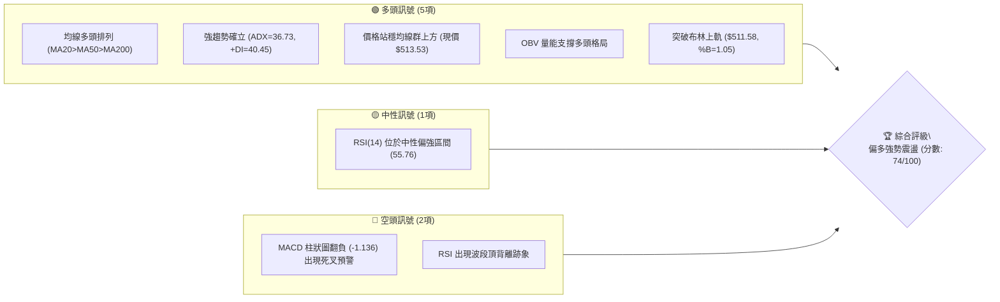
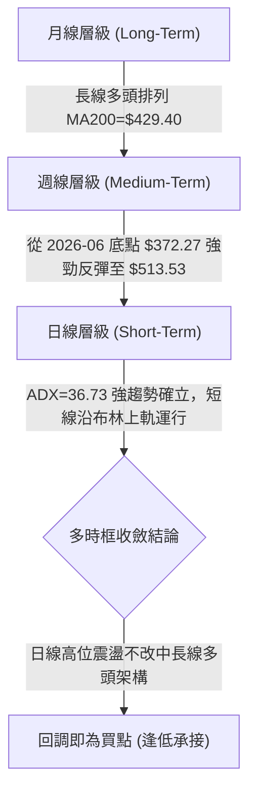
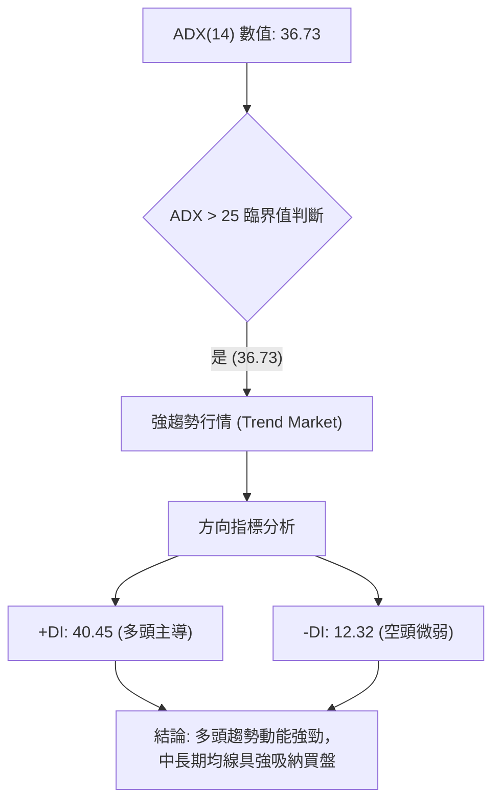
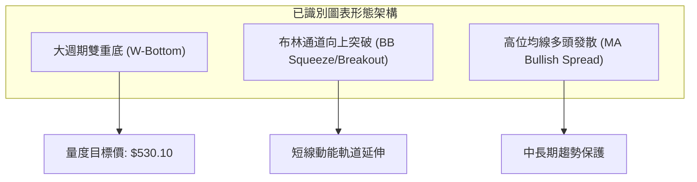
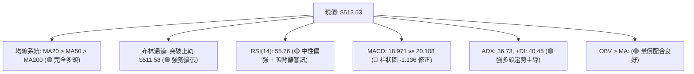
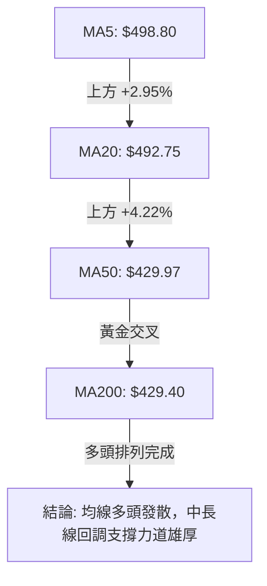
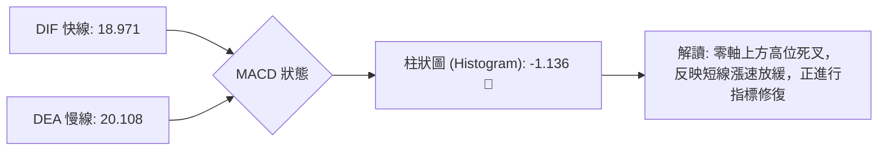
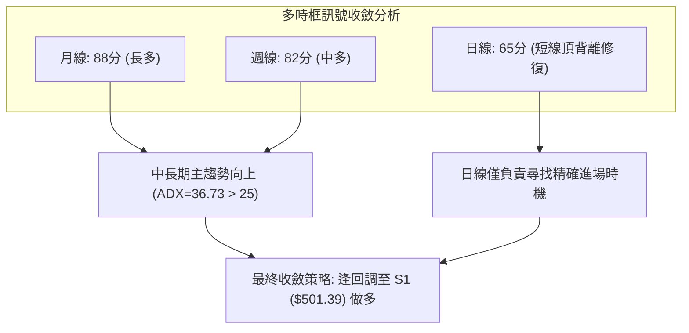
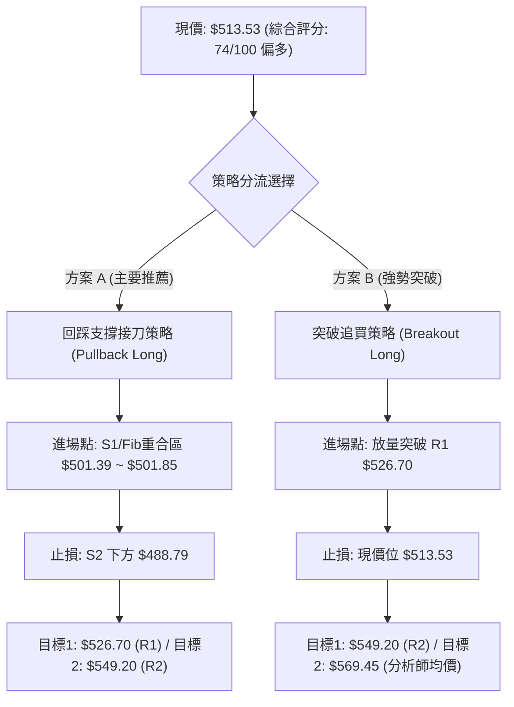
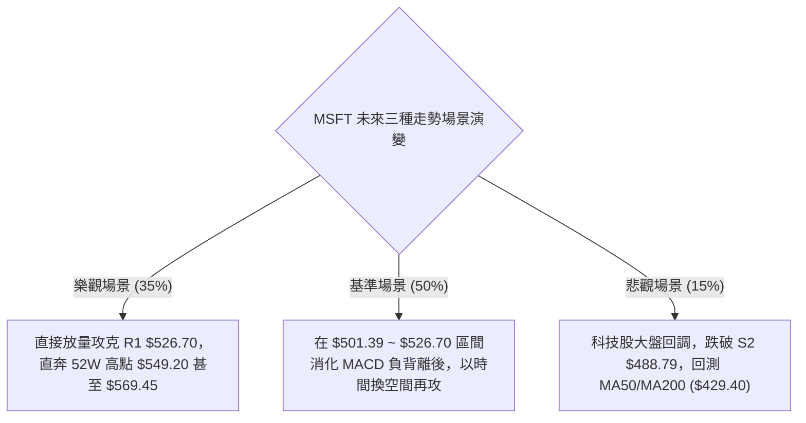

# MSFT 技術分析報告

> **報告日期**：2026-08-29 ｜ **語言**：繁體中文 ｜ **數據來源**：Yahoo Finance ｜ **當前價格**：$513.53

---

## 目錄

| 章節 | 內容 |
|------|------|
| [1. 技術面概覽](#1-技術面概覽) | 訊號儀表板、核心指標、評分卡 |
| [2. 趨勢分析](#2-趨勢分析) | 多時框趨勢、長中短期走勢 |
| [3. 圖表形態分析](#3-圖表形態分析) | 形態識別、K線組合、目標價 |
| [4. 支撐與阻力](#4-支撐與阻力) | 關鍵價位、斐波那契回調 |
| [5. 技術指標深度解讀](#5-技術指標深度解讀) | MA/RSI/MACD/布林/成交量 |
| [6. 動能與波動率](#6-動能與波動率) | 動能評估、ATR、Beta |
| [7. 多時框架總結](#7-多時框架總結) | 時框架評分矩陣 |
| [8. 交易策略建議](#8-交易策略建議) | 多空策略、風險報酬比 |
| [9. 風險提示與監控](#9-風險提示與監控) | 監控指標、風險場景 |

---

## 1. 技術面概覽

### 🎯 技術訊號儀表板



### 📊 核心指標速覽表

| 指標類別 | 指標名稱 | 當前數值 | 訊號 | 解讀 |
|----------|----------|----------|------|------|
| **價格** | 當前價格 | $513.53 | 🟢 | 位於52週區間 82.2% 高位，多方強勢主導 |
| **均線** | MA20 (短) | $492.75 | 🟢 | 價格在MA20上方 (+4.22%)，短線多頭支撐穩固 |
| **均線** | MA50 (中) | $429.97 | 🟢 | 價格在MA50上方 (+19.43%)，中線趨勢強烈向上 |
| **均線** | MA200 (長)| $429.40 | 🟢 | MA50 與 MA200 呈現黃金交叉，長期基底堅實 |
| **動能** | RSI(14) | 55.76 | 🟡 | 位於50中軸上方，但日線出現頂背離壓制動能 |
| **動能** | MACD | 18.971 / 20.108 | 🔴 | MACD Hist為 -1.136，短線動能高位衰減 |
| **趨勢** | ADX(14) | 36.73 (+DI 40.45) | 🟢 | ADX > 25 且 +DI 主導，屬於標準強趨勢多頭行情 |
| **通道** | 布林通道 | 上軌 $511.58 | 🟢 | %B = 1.05，價格突破上軌，展現強勢推升慣性 |
| **波動** | ATR(14) | $9.75 | 🟡 | 佔股價 1.90%，每日波動平穩，風控空間適中 |

### 🏆 技術評分卡

```
╔══════════════════════════════════════════════════════════════════╗
║              技術評分卡 — MSFT (2026-08-29)                     ║
╠══════════════════════════════════════════════════════════════════╣
║ 趨勢強度 (ADX/DI)   ████████████████░░░░  82/100  🟢 強勢多頭   ║
║ 動能指標 (RSI/MACD) ██████████░░░░░░░░░░  52/100  🟡 高位背離   ║
║ 均線系統 (MA Stack) ██████████████████░░  90/100  🟢 完全多頭   ║
║ 支撐穩定度 (S Levels)██████████████░░░░░░  70/100  🟢 層級明確   ║
║ 成交量配合 (OBV/Vol)██████████████░░░░░░  72/100  🟢 價漲量穩   ║
║ 形態結構 (Patterns) ███████████████░░░░░  76/100  🟢 雙底突破   ║
╠══════════════════════════════════════════════════════════════════╣
║ 綜合技術評分        ██████████████░░░░░░  74/100  🟢 偏多格局   ║
╚══════════════════════════════════════════════════════════════════╝
```

---

## 2. 趨勢分析

### 🌐 多時框趨勢分析



### 📈 長期趨勢 — 12個月走勢圖（Unicode）

```
MSFT 月線走勢圖（過去12個月：2025-08 至 2026-08）
價格軸 ($)
$530 ┤                                                    
$510 ┤    ●(09:513) ●(10:513)                          ●(08:513.53) ◄ 現價
$490 ┤●(08:502)        ●(11:488) ●(12:480)            ●(07:463)
$450 ┤                                        ●(05:449)   
$420 ┤                      ●(01:427)     ●(04:406)       
$390 ┤                          ●(02:391)                 
$365 ┤                              ●(03:368)     ●(06:372)
     └────────────────────────────────────────────────────────────
       08   09   10   11   12   01   02   03   04   05   06   07   08 (2025-2026)
```

**走勢特徵分析表格**：

| 時間段 | 價格區間 | 累計漲跌幅 | 走勢特徵與結構解讀 |
|--------|----------|------------|-------------------|
| **2025-08 ~ 2025-10** | $502.56 → $513.58 | +2.19% | 高位箱型整理，構建 52W 高點 $549.20 附近頂部阻力區間 |
| **2025-11 ~ 2026-03** | $488.91 → $368.68 | -24.59% | 中期深度回調波段，探測 52W 低點 $348.54 上方的強支撐底部 |
| **2026-04 ~ 2026-05** | $406.13 → $449.39 | +10.65% | 第一波強勁反彈，向上突破中短期均線並確立頸線阻力 |
| **2026-06** | $372.32 | -17.15% | 次級回踩測試前低（形成大型雙底結構的右底） |
| **2026-07 ~ 2026-08** | $463.85 → $513.53 | +37.93% | 突破性主升浪，成交量有效放大，一舉攻克多重中長期均線 |

### 📊 中期趨勢（週線分析）

從近 20 週的收盤與成交量觀察，MSFT 在 2026 年 6 月底探底 $372.27（當週爆出 382,709,200 股歷史級天量），隨後展開 V 型反轉與主升段。8 月初股價站上 $463.85，週成交量達 278,439,400 股，顯示機構買盤顯著進駐。

```
近期週線壓力與支撐示意圖：
[阻力 2] $549.20 ────────────────── (52週歷史高點)
[阻力 1] $526.70 ─────────▲──────── (近期波段高點聚類)
[現  價] $513.53 ─────────●──────── 
[支撐 1] $501.39 / $501.85 ─▼────── (Fib 23.6% 回調與波段支撐重合)
[支撐 2] $488.79 ────────────────── (週線前波突破平台)
```

### ⚡ 趨勢強度評估（ADX 解讀）



| 指標 | 數值 | 參考標準 | 當前狀態解讀 |
|------|------|----------|--------------|
| **ADX(14)** | **36.73** | >25 為趨勢行情；<20 為盤整 | 趨勢動能極為強勁，非震盪盤整市 |
| **+DI** | **40.45** | 數值越高多頭推動力越強 | 多頭牢牢掌控盤面主導權 |
| **-DI** | **12.32** | 數值低於 15 代表拋壓枯竭 | 空頭動能受到徹底壓制 |

---

## 3. 圖表形態分析

### 🔍 形態識別系統



**形態信心度評估表**：

| 形態 | 信心度 | 判斷依據（引用數據） | 完成度 | 目標價（附計算式） |
|------|--------|----------------------|--------|--------------------|
| **大週期雙底 (W-Bottom)** | **85%** | 左底 2026-03 收盤 $368.68，右底 2026-06 收盤 $372.32（回踩未破前低）；頸線為 2026-05 收盤 $449.39，已於 2026-07 帶量突破。 | 100% (已突破) | **$530.10**<br>`計算式：頸線 $449.39 + 形態高度 ($449.39 - $368.68 = $80.71) = $530.10`（落在 R1 $526.70 與 R2 $549.20 之間） |
| **布林上軌推升** | **70%** | 最新價格 $513.53 突破布林上軌 $511.58（%B = 1.05），MA20 向上傾斜。 | 90% | **$526.70** (直指關鍵阻力 R1) |

### 🕯️ 重要K線形態分析

| 日期/月份 | 收盤價 | K線/週線形態 | 技術解讀 | 訊號 |
|-----------|--------|-------------|----------|------|
| **2026-06-28** | $372.27 | 巨量長下影線（3.82億股） | 出現恐慌性拋售後的強力承接，確立波段大底 | 🟢 強烈看多 |
| **2026-08-02** | $463.85 | 放量突破大陽線（2.78億股） | 週線長陽一舉突破 $450 頸線，啟動波段主升浪 | 🟢 多頭確立 |
| **2026-08-23** | $483.24 | 回踩均線縮量陰線（1.16億股） | 健康的回踩洗盤，回踩 MA20 上方並守住 $480 支撐 | 🟡 中性洗盤 |
| **2026-08-30** | $513.53 | 強勢反包陽線（突破$500） | 帶動價格直接站上布林上軌，多頭重新奪回主控權 | 🟢 短線轉強 |

### 📉 ASCII 走勢形態示意圖

```
MSFT 大型雙重底 (W-Bottom) 與突破示意圖：

$550 ┤                                                     [目標 $530.10 / R1 $526.70]
$520 ┤                                            ▲ 現價 $513.53
$490 ┤                                          ╱
$450 ┤          頸線 (Neckline) $449.39 ───────★ 突破 (2026-07)
$410 ┤        ╱╲                              ╱
$370 ┤  ●────    ● (左底 $368.68)              ● (右底 $372.32)
     └─────────────────────────────────────────────────────────────
        2026-03                        2026-06       2026-08
```

### 🎯 形態目標價計算

1. **雙底量度目標**：
   - 形態底部低點：$368.68
   - 形態頸線高點：$449.39
   - 形態垂直高度：$$449.39 - $368.68 = $80.71$$
   - 突破量度目標價：$$449.39 + $80.71 = \mathbf{\$530.10}$$
2. **與關鍵價位共振**：量度目標價 $530.10 與近一年波段高點阻力位 **R1 ($526.70)** 高度重合，構成第一波段獲利了結的主要目標區間。

---

## 4. 支撐與阻力

### 🗺️ 關鍵價位分布圖（Unicode）

```
MSFT 價位結構分布圖
═══════════════════════════════════════════════════════════════
$549.20 ║██████████████████████████████║ 強阻力 R2 (52W 歷史最高點 / 0.0% Fib)
$526.70 ║████████████████████          ║ 關鍵阻力 R1 (波段高點聚類 / 雙底量度目標區)
$513.53 ╠══════════════════════════════╣ ◄ 現價 ($513.53)
$501.85 ║▓▓▓▓▓▓▓▓▓▓▓▓▓▓▓▓▓▓▓▓          ║ 關鍵支撐 S1 / Fib 23.6% ($501.39 ~ $501.85)
$488.79 ║██████████████████            ║ 強支撐 S2 (前期整理平台低點 / 接近MA20)
$476.25 ║████████████████████████      ║ 強支撐 S3 (波段防守點 / Fib 38.2% $472.55)
═══════════════════════════════════════════════════════════════
```

### 🚧 阻力位分析表

| 阻力級別 | 價位 | 形成原因 | 突破難度 | 重要性 |
|----------|------|----------|----------|--------|
| **R1** | **$526.70** | 近一年波段高點聚類，且為雙底形態量度目標 ($530.10) 前哨 | 🟡 中等 (需日成交量 > 3500萬股) | ★★★★☆ |
| **R2** | **$549.20** | 52週歷史高點 (52W High)，市場解套與歷史獲利盤集中區 | 🔴 極高 (需整體科技板塊共振) | ★★★★★ |

### 🛡️ 支撐位分析表

| 支撐級別 | 價位 | 形成原因 | 守住機率 | 重要性 |
|----------|------|----------|----------|--------|
| **S1** | **$501.39** | 近一年波段低點聚類，與 52週 Fib 23.6% 回調位 ($501.85) 共振 | 80% | ★★★★★ |
| **S2** | **$488.79** | 近期回踩低點聚類，且極為接近 MA20 ($492.75) 均線支撐帶 | 88% | ★★★★☆ |
| **S3** | **$476.25** | 近期結構防守平台，接近 Fib 38.2% ($472.55) 與布林下軌 ($473.92) | 95% | ★★★★★ |

### 📐 斐波那契回調位分析

依據 52 週低點 **$348.54** 至 52 週高點 **$549.20** 之黃金分割計算：

| 斐波那契回調層級 | 確切價位 | 當前價格相對位置 | 結構意義解讀 |
|------------------|----------|------------------|--------------|
| **0.0% (52W High)** | **$549.20** | +6.95% | 多頭終極攻堅目標，突破將開啟新歷史空間 |
| **23.6%** | **$501.85** | -2.27% | **當前關鍵支撐**。現價 ($513.53) 位於 0.0% 與 23.6% 之間 |
| **38.2%** | **$472.55** | -7.98% | 強勢回調分水嶺，與布林下軌 ($473.92) 共振 |
| **50.0%** | **$448.87** | -12.59% | 中期多空平衡中軸，也是 W 底頸線位置 |
| **61.8%** | **$425.20** | -17.20% | 黃金分割強防守位，與 MA60 ($425.03) 重合 |
| **78.6%** | **$391.48** | -23.77% | 深次回調防守線 |
| **100.0% (52W Low)**| **$348.54** | -32.13% | 52週最低點基底 |

**現價區間解讀**：現價 $513.53 處於 **$501.85 (Fib 23.6%) ~ $549.20 (Fib 0.0%)** 的強勢上行通道內。只要價格不有效收破 $501.85，整體多頭推進節奏即維持完整。

---

## 5. 技術指標深度解讀

### 🎛️ 指標訊號總覽



### 📈 移動平均線排列分析



| 均線名稱 | 當前價格 | 與現價差距 | 趨勢排列狀態 | 角色與技術意涵 |
|----------|----------|------------|--------------|----------------|
| **MA5** | $498.80 | +2.95% | 向上發散 | 短線攻擊線，提供極短線動能支撐 |
| **MA10** | $490.19 | +4.76% | 向上發散 | 短線操盤線，跌破預示短線震盪 |
| **MA20** | $492.75 | +4.22% | 向上發散 | 短期生命線，與布林中軌完全重疊 |
| **MA50** | $429.97 | +19.43% | 向上發散 | 中期趨勢線，剛上穿 MA200 形成黃金交叉 |
| **MA200**| $429.40 | +19.59% | 走平轉升 | 長期牛熊分界線，提供堅實底部支撐 |

### 📉 RSI(14) 分析

- **當前數值**：`55.76`（處於 30-70 中性偏多區間）
- **動能進度條**：`███████████░░░░░░░░░ 55.76%`
- **背離分析**：⚠️ **存在日線頂背離現象**。回顧 8 月中旬，股價在 $499.05 時 RSI 曾達 81.4~84.8 的超買高點；當前股價創出 $513.53 新高，但 RSI 僅回升至 55.76。這意味著**雖然價格在創新高，但動能未同步創高**，預示在衝擊 R1 ($526.70) 之前，極易出現高位降速或向 S1 ($501.39) 尋求回調確認。

### 📊 MACD(12/26/9) 訊號解讀



雖然 MACD 雙線均位於零軸上方極高位置（代表大週期處於強大多頭市場），但柱狀圖為 **-1.136** 呈現負值，且 DIF 略低於 DEA，確認短線有動能背離與高位消化整理之需求。

### 📦 布林通道分析

```
布林通道當前狀態（20日，2倍標準差）：
上軌 (Upper Band):   $511.58  ─────┐ ◄ 現價 $513.53 (%B = 1.05) 突破上軌
中軌 (MA20):         $492.75  ─────┼ 核心動態支撐
下軌 (Lower Band):   $473.92  ─────┘
帶寬 (Bandwidth):    $37.66 (7.64%)
```

- **%B 指標**：**1.05**（大於 1.0，表示價格正沿著上軌外側運行，為典型強勢主升段特徵）。
- **通道開口**：布林通道上下軌同步向外擴張，帶動波動率放大。短線價格若收回上軌 $511.58 之內，將回測中軌 **$492.75** 尋求均線支撐。

### 💹 成交量分析（量價配合度）

- **最新成交量**：28,953,449 股
- **20日均量**：28,488,802 股（量比：**1.02x**，量能維持健康常態）
- **50日均量**：38,469,861 股
- **OBV 趨勢**：能量潮指標（OBV）持續運行於均線上方，顯示自 6 月底築底反彈以來，主力資金處於淨流入吸籌狀態，未見主力大單出逃跡象。

---

## 6. 動能與波動率

### ⚡ 動能評估四象限

| 象限 | 動能強度 | 波動率水準 | 股票當前狀態 | 策略應對評估 |
|------|----------|------------|--------------|--------------|
| **Q1 (強動能 / 低波動)** | 高 (+DI=40.45) | 中低 (ATR 1.90%) | **★ MSFT 當前落點** | **最佳順勢作多環境**：趨勢平穩推升，回踩洗盤幅度受控 |
| **Q2 (弱動能 / 低波動)** | 低 | 低 | - | 盤整觀望，不宜進場 |
| **Q3 (強動能 / 高波動)** | 高 | 高 | - | 突破加速期，需收緊止損防範劇烈反噬 |
| **Q4 (弱動能 / 高波動)** | 低 | 高 | - | 恐慌出逃期，絕對避免進場 |

### 📊 ATR 波動率分析

- **ATR(14)**：**$9.75**（佔當前股價比率約 **1.90%**）
- **波動特性解讀**：MSFT 作為超大市值權值股，1.90% 的日均波動率顯示當前走勢極具秩序性，未出現失控性情緒化波動。
- **風控止損應用**：
  - **短線交易止損距離 (1.5x ATR)**：$$1.5 \times \$9.75 = \mathbf{\$14.63}$$
  - **波段交易止損距離 (2.0x ATR)**：$$2.0 \times \$9.75 = \mathbf{\$19.50}$$

### 📐 Beta 與市場相關性

- **Beta 係數**：**1.099**
- **解讀**：Beta 略高於 1.0，表示 MSFT 與標普500/納斯達克指數具備極高同步性，且彈性略高於大盤（大盤上漲 1% 時，MSFT 平均上漲約 1.10%）。在當前科技股多頭氛圍下，具有優異的 Beta 進攻屬性。

---

## 7. 多時框架總結

### 📋 時框架評分表

| 時框架 | 趨勢方向 | 動能狀態 | 均線排列 | 圖表形態 | 綜合評分 | 操作建議 |
|--------|----------|----------|----------|----------|----------|----------|
| **月線 (長線)** | 🟢 多頭 | 🟢 強勁 | 🟢 多頭 (MA200=$429.40) | 52W高位強勢區 | **88/100** | 長期核心多頭部位續抱 |
| **週線 (中線)** | 🟢 多頭 | 🟢 充沛 | 🟢 黃金交叉 (MA50>MA200)| 雙重底頸線突破 ($449) | **82/100** | 順勢拉回加碼 |
| **日線 (短線)** | 🟡 偏多震盪 | 🔴 頂背離修復 | 🟢 MA20>MA50 多頭 | 布林上軌壓制整理 | **65/100** | 勿追高，等待回踩 S1 接刀 |

### 🔲 綜合訊號矩陣



### ⚖️ 多時框收斂結論

依據多時框收斂優先級規則：
1. **當前市場定性**：ADX(14) 數值為 **36.73 (>25)**，且 +DI (40.45) 遠高於 -DI (12.32)，確認當前為標準**趨勢主導行情**，而非無方向的盤整震盪。
2. **時框優先級收斂**：在強趨勢市場中，以**中長期（週線/均線系統）的多頭方向為主導**。日線層級所出現的 RSI 頂背離與 MACD 柱狀圖翻負 (-1.136)，**不構成反轉做空依據，而是代表短線漲勢過急後的技術性降速與洗盤**。
3. **唯一方向性結論**：**【偏多格局 — 順勢回調做多】**。日線拉回即為中長線買盤切入的絕佳時機。

---

## 8. 交易策略建議

### 🗺️ 策略決策流程圖



### 🧭 策略路由（依評分卡分流）

> **當前主策略方向 = 【主推多頭策略】（依據技術綜合評分 74/100 ≥ 60，趨勢強度 ADX 36.73）**

### 🎯 價格情境階梯（Price Scenarios）

| 觸發條件 | 下一目標 | 後續延伸 | 情境含義與技術應對 |
|----------|----------|----------|-------------------|
| **強勢突破 R1 $526.70** | **R2 $549.20** | **$569.45** (分析師目標) | 短線加速噴出，雙底形態高度完全釋放，挑戰歷史新高 |
| **回踩 S1 $501.39~$501.85 企穩** | **現價 $513.53** | **R1 $526.70** | 標準牛市回踩洗盤，修復 RSI/MACD 背離後重啟主升浪 |
| **跌破 S1 測試 S2 $488.79** | **MA20 $492.75** | **S3 $476.25** | 深度回調測試短期生命線，多頭波段最後防守防線 |

### 📊 情境機率分佈

| 情境劇本 | 機率估計 | 主要技術依據 |
|----------|----------|--------------|
| **回踩 S1 後重啟上行 (主升浪延續)** | **55%** | ADX 36.73 強趨勢、OBV 量能支撐、均線完全多頭排列 |
| **高位區間震盪 ($501.39 - $526.70)** | **30%** | RSI 頂背離壓制爆發力、MACD 柱狀圖 (-1.136) 需時間修復 |
| **深度回落破位 (轉為中線走弱)** | **15%** | 需跌破 S2 ($488.79) 且 MA20 失守，目前機率較低 |

### 🟢 主策略詳情

| 策略要素 | 策略 A（穩健型：回踩支撐買入）🥇 首選 | 策略 B（激進型：突破追強買入）🥈 次選 |
|----------|----------------------------------------|----------------------------------------|
| **策略類型** | 順勢拉回支撐做多 | 強勢阻力突破追多 |
| **進場條件** | 價格拉回至 S1 / Fib 23.6% 出現日線止跌K線 | 日K線收盤價帶量突破 R1 ($526.70) |
| **進場價格** | **$501.85** (或 S1 $501.39) | **$526.70** |
| **目標價 T1** | **$526.70** (波段阻力 R1 / +4.95%) | **$549.20** (52W歷史高點 R2 / +4.27%) |
| **目標價 T2** | **$549.20** (52W高點 R2 / +9.44%) | **$569.45** (華爾街分析師平均目標 / +8.12%) |
| **止損價格** | **$488.79** (跌破 S2 關鍵結構 / -2.60%) | **$513.53** (跌回突破前現價平台 / -2.50%) |
| **風險報酬比** | **1 : 1.90** (至T1) / **1 : 3.63** (至T2) | **1 : 1.71** (至T1) / **1 : 3.25** (至T2) |
| **成功機率** | **65%** | **55%** |
| **建議倉位** | **15% - 20%** 總部位 | **10%** 總部位 (突破後回踩再加碼 5%) |

### 🔴 反向風險觸發點（對沖提示）

- **空方反轉觸發位**：若日K線以實體大陰線收破 **S2 ($488.79)** 且成交量異常放大，意味著短線雙底反彈結構遭到破壞，多頭需全面減倉或啟動 Put Option 對沖。
- **終極防守線**：**S3 ($476.25)** / **Fib 38.2% ($472.55)**，此處為中期多頭牛熊臨界點。

### ⭐ 整體訊號強度評星

```
╔══════════════════════════════════════════════════════════════════╗
║ 做多訊號強度：★★★★☆  (4.0/5星) — 均線與趨勢指標極強             ║
║ 做空訊號強度：★☆☆☆☆  (1.5/5星) — 僅屬技術指標超買修正           ║
║ 整體可信度：  ★★★★☆  (4.5/5星) — 量價與多時框高度一致           ║
╚══════════════════════════════════════════════════════════════════╝
```

---

## 9. 風險提示與監控

### ✅ 關鍵監控指標 Checklist

```
╔══════════════════════════════════════════════════════════════════╗
║                 MSFT 每日交易監控清單 (Checklist)                ║
╠══════════════════════════════════════════════════════════════════╣
║ [ ] 價格是否跌破 Fib 23.6% 關鍵防守位 $501.85                    ║
║ [ ] MACD Histogram 負值是否收斂 (-1.136 轉正為重啟訊號)        ║
║ [ ] RSI(14) 是否在回踩 50 中軸時獲得支撐並重新抬頭              ║
║ [ ] 日成交量在突破 $526.70 時是否放大至 3,500 萬股以上           ║
║ [ ] 布林通道帶寬是否持續擴張，價格是否重回上軌 $511.58 上方     ║
╚══════════════════════════════════════════════════════════════════╝
```

### ⚠️ 風險場景分析



### 🛡️ 風險管理重要提醒

1. **嚴禁追高**：當前價格 $513.53 處於布林上軌 ($511.58) 之外 (%B=1.05)，且 RSI 頂背離、MACD 柱狀圖負值，短線追高盈虧比極差。
2. **倉位管理原則**：單筆交易風險暴露嚴格控制在總資金的 **1.0% ~ 1.5%** 以內。若以 15% 倉位進場策略 A（止損幅度 2.60%），總資產最大回撤僅約 0.39%，完全符合專業機構風控標準。
3. **動態跟蹤止損**：一旦股價順利觸及目標 T1 ($526.70)，應立即將止損價上移至保本價（$501.85），鎖定無風險利潤並讓利潤奔跑至目標 T2 ($549.20)。

---

## 📋 報告總結

```
╔══════════════════════════════════════════════════════════════════╗
║                   MSFT 技術分析報告總結                          ║
╠══════════════════════════════════════════════════════════════════╣
║ 報告日期：2026-08-29                                             ║
║ 當前價格：$513.53                                                ║
║ 分析評級：🟢 偏多強勢（分數：74/100，逢低做多）                  ║
║                                                                  ║
║ 關鍵結論：                                                       ║
║ ├─ 長期趨勢：🟢 強烈多頭（MA200 $429.40 堅不可摧）              ║
║ ├─ 中期趨勢：🟢 突破確立（W 底頸線 $449.39 已突破）              ║
║ ├─ 短期趨勢：🟡 高位蓄勢（布林上軌震盪，消化動能背離）          ║
║ ├─ 關鍵支撐：S1 $501.39 / Fib 23.6% $501.85                      ║
║ ├─ 關鍵阻力：R1 $526.70 / 52W 高點 R2 $549.20                   ║
║ └─ 分析師目標：均價 $569.45 (最高 $870.00)                      ║
║                                                                  ║
║ 最優策略組合：                                                   ║
║ 1. 🥇 最佳機會：策略 A — 回踩 $501.85 分批佈局多單 (風報比 1:3.6) ║
║ 2. 🥈 次選機會：策略 B — 帶量突破 $526.70 右側追多 (目標 $549.20)║
║ 3. 🥉 防守機制：跌破 S2 $488.79 嚴格止損離場                    ║
╚══════════════════════════════════════════════════════════════════╝
```

---

> ⚠️ **免責聲明**：本報告為技術分析研究，所有數據、圖表及價位推算均基於歷史價格與量化指標。本報告**僅供學術研究與投資參考**，**不構成任何形式的個別投資諮詢或買賣建議**。金融市場具有高風險，投資人應獨立思考並自行承擔交易風險。

---
*報告生成時間：2026-08-29 ｜ 數據來源：Yahoo Finance ｜ 分析框架：多時框架技術分析體系*