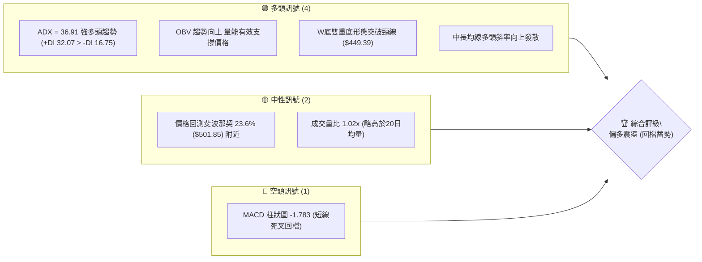
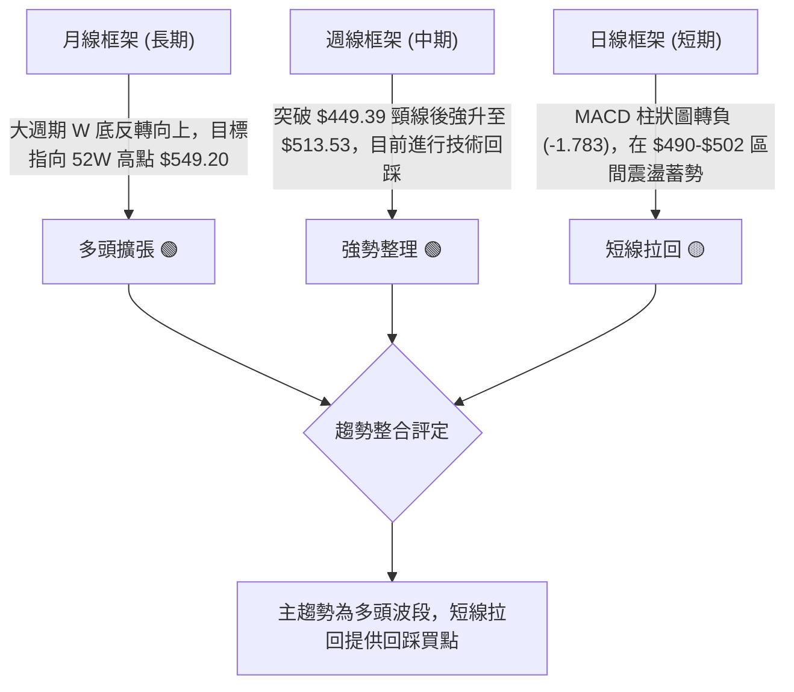
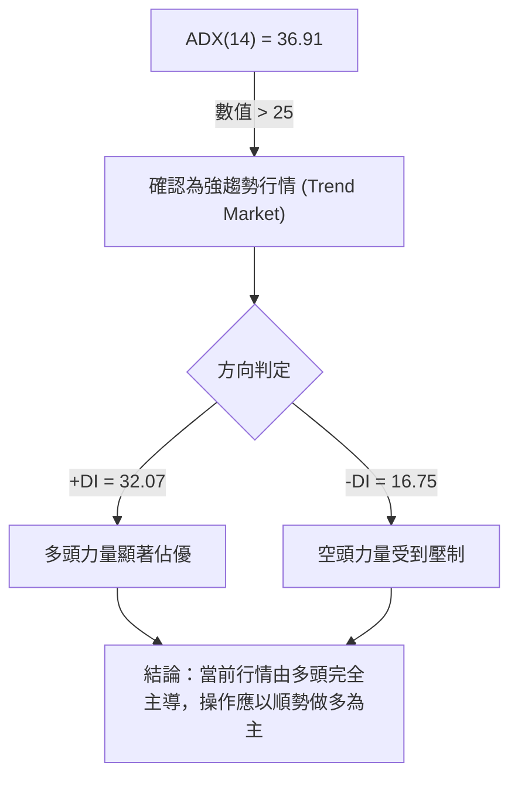
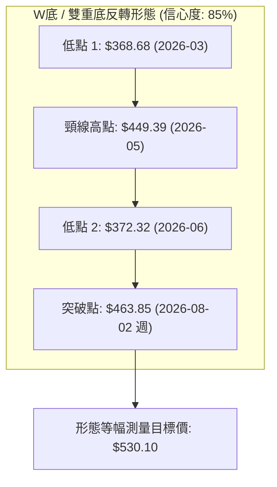
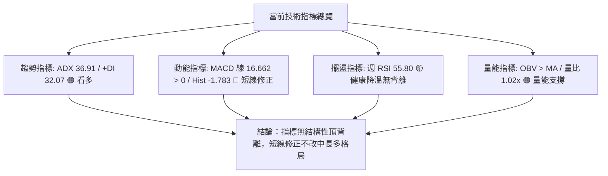
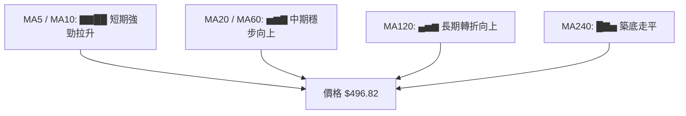
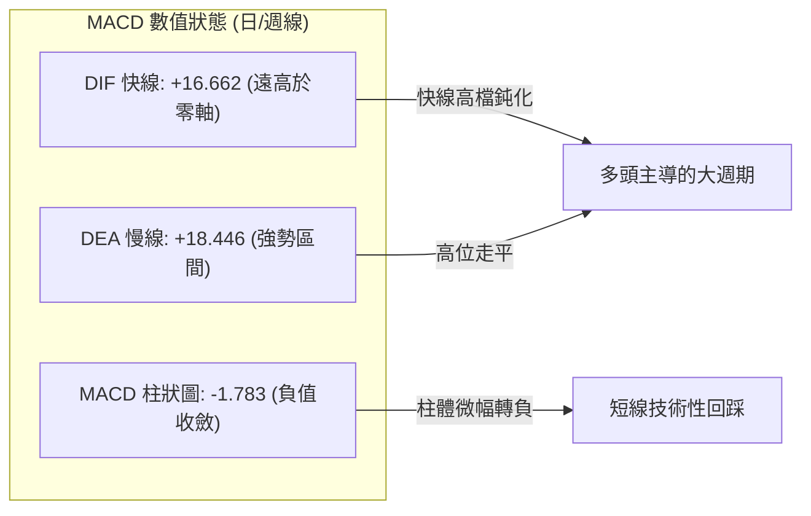
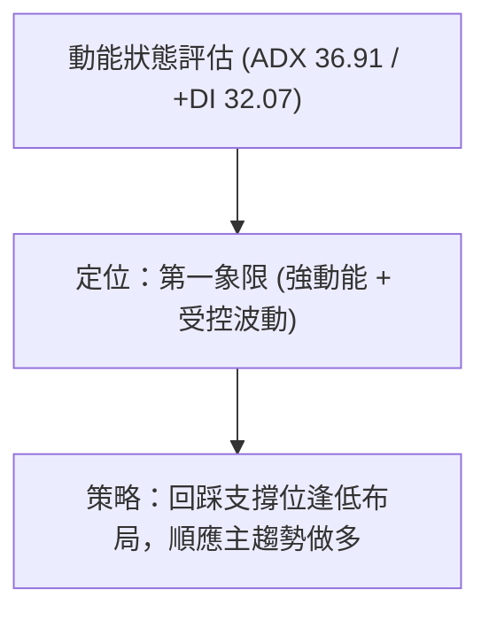
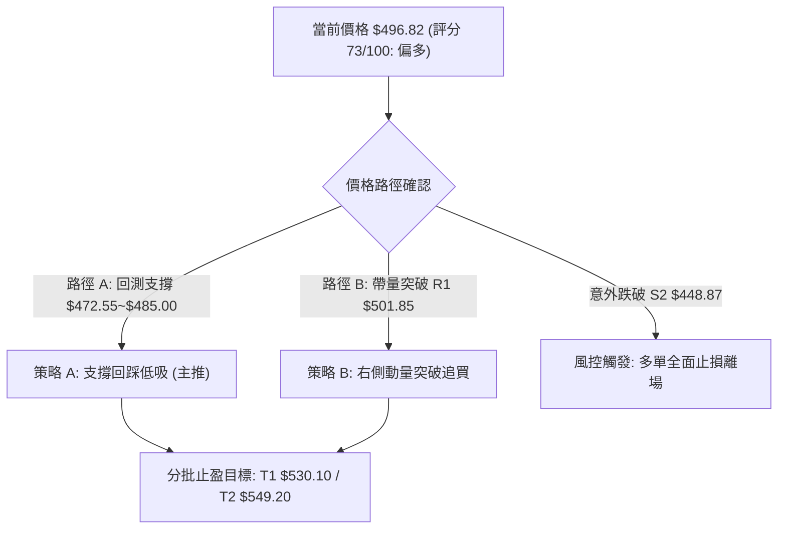
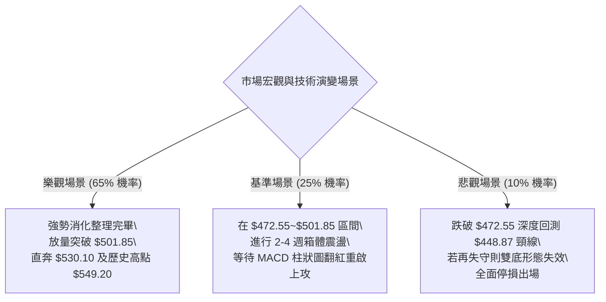

# MSFT 技術分析報告

> **報告日期**：2026-09-04 ｜ **語言**：繁體中文 ｜ **數據來源**：Yahoo Finance ｜ **當前價格**：$496.82

---

## 目錄

| 章節 | 內容 |
|------|------|
| [1. 技術面概覽](#1-技術面概覽) | 訊號儀表板、核心指標、評分卡 |
| [2. 趨勢分析](#2-趨勢分析) | 多時框趨勢、長中短期走勢、ADX解讀 |
| [3. 圖表形態分析](#3-圖表形態分析) | 雙底結構、K線組合、目標價推算 |
| [4. 支撐與阻力](#4-支撐與阻力) | 結構分布圖、阻力支撐表、斐波那契回調 |
| [5. 技術指標深度解讀](#5-技術指標深度解讀) | MA/RSI/MACD/布林/量價配合 |
| [6. 動能與波動率](#6-動能與波動率) | 動能四象限、ATR評估、Beta相關性 |
| [7. 多時框架總結](#7-多時框架總結) | 時框架評分矩陣、多時框收斂結論 |
| [8. 交易策略建議](#8-交易策略建議) | 策略路由、情境階梯、主策略詳情 |
| [9. 風險提示與監控](#9-風險提示與監控) | 監控Checklist、情境分析、風控紀律 |
| [📋 報告總結](#-報告總結) | 核心結論與策略彙整 |

---

## 1. 技術面概覽

### 🎯 技術訊號儀表板



---

### 📊 核心指標速覽表

| 指標類別 | 指標名稱 | 當前數值 | 訊號 | 解讀 |
|----------|----------|----------|------|------|
| **價格** | 當前價格 (收盤) | $496.82 | 🟢 | 站穩52週中位線 ($448.87) 之上，處於強勢高檔區 |
| **趨勢強度** | ADX (14) | 36.91 | 🟢 | ADX > 25 且 +DI (32.07) 遠高於 -DI (16.75)，主升趨勢明確 |
| **均線系統** | 長短MA發散度 | 混合偏多 | 🟢 | MA5~MA120 呈現多頭上升排列，MA240 築底完成 |
| **動能** | RSI (14) | 55.80 (週) | 🟡 | 自超買區 (84.80) 降溫至中性偏強區間，無頂背離 |
| **動能** | MACD (12,26,9) | 16.662 / Hist: -1.783 | 🔴 | MACD線高於零軸但低於訊號線 (18.446)，處於強勢回檔整理 |
| **量能** | 20日成交量 / 均量 | 24,108,434 / 23,534,112 | 🟢 | 量比 1.02x，OBV > MA，量價配合健康 |
| **波動** | Beta 係數 | 1.099 | 🟡 | 略高於大盤波動，具備適度進攻性 |

---

### 🏆 技術評分卡

```
╔══════════════════════════════════════════════════════════════╗
║              技術評分卡 — MSFT (2026-09-04)                  ║
╠══════════════════════════════════════════════════════════════╣
║ 趨勢強度 (ADX/+DI)    ████████████████░░░░  80/100  🟢 強多  ║
║ 動能指標 (MACD/RSI)   ████████████░░░░░░░░  60/100  🟡 中性  ║
║ 支撐穩定度 (Fib/頸線) ██████████████░░░░░░  70/100  🟢 良好  ║
║ 成交量配合 (OBV/量比) ████████████████░░░░  80/100  🟢 扎實  ║
║ 形態完整度 (W底架構)  ████████████████░░░░  80/100  🟢 突破  ║
║ 均線排列結構          ██████████████░░░░░░  70/100  🟢 偏多  ║
╠══════════════════════════════════════════════════════════════╣
║ 綜合評分              ██████████████░░░░░░  73/100  偏多格局 ║
╚══════════════════════════════════════════════════════════════╝
```

---

## 2. 趨勢分析

### 🌐 多時框趨勢分析



---

### 📈 長期趨勢 — 12個月走勢圖（Unicode）

```
MSFT 月線走勢圖（過去12個月：2025-10 至 2026-09）
價格 ($)
$520 ┤                      ● $513.72             ● $507.29
$500 ┤            ● $513.58                        ● $496.82 (現價)
$480 ┤                  ● $488.91    ● $480.57          ● $463.85
$450 ┤                                        ● $449.39
$420 ┤                               ● $427.58
$400 ┤                                     ● $391.15   ● $406.13
$370 ┤                                          ● $368.68 (低點1)  ● $372.32 (低點2)
     └─────────────────────────────────────────────────────────────
        25-10  25-11  25-12  26-01  26-02  26-03  26-04  26-05  26-06  26-07  26-08  26-09
```

#### 走勢特徵分析表格

| 階段週期 | 價格區間 | 累計漲跌幅 | 走勢特徵解讀 | 技術意涵 |
|----------|----------|------------|--------------|----------|
| **2025-10 ~ 2026-03** | $513.58 → $368.68 | -28.21% | 單邊空頭修正，回測 52W 低點 $348.54 附近獲支撐 | 第一隻腳 (Bottom 1) 於 $368.68 成形 |
| **2026-03 ~ 2026-05** | $368.68 → $449.39 | +21.89% | 強勁技術反彈，於 50.0% 斐波那契位 ($448.87) 遇阻 | 構建雙底結構之頸線 (Neckline) |
| **2026-05 ~ 2026-06** | $449.39 → $372.32 | -17.15% | 快速二次探底，未破前低 $368.68 (量能放大至 3.82億股) | 第二隻腳 (Bottom 2) 於 $372.32 確認 |
| **2026-06 ~ 2026-09** | $372.32 → $496.82 | +33.44% | 主升浪突破頸線，最高衝至 $513.53，現報 $496.82 | 突破確認，進入多頭主升趨勢 |

---

### 📊 中期趨勢（週線分析）

```
MSFT 週線關鍵結構與近期收盤波段示意圖
══════════════════════════════════════════════════════════════════
 52W High: $549.20 ────────────────────────────────────────────── [歷史阻力]
                     ▲
 $513.53 (08-30高點) ┼───┐  $507.29 (08月結)
                         └───● $496.82 (當前價位 09-04) ◄── 現價測試 Fib 23.6%
 $472.55 (Fib 38.2%) ─────────────────────────────────────────── [第一道強支撐]
                               ▲
 $449.39 (05-31頸線) ──────────┴──────────────────────────────── [W底頸線轉換支撐]
                               ▲
 $372.27 (06-28低點) ──────────┘ (量能 382.7M 巨量築底)
══════════════════════════════════════════════════════════════════
```

- **週線動能演變**：2026-08-09 週 RSI 達到 81.40、MACD 柱狀圖擴張至 +11.272，推動價格暴衝至 $513.53；隨後兩週成交量縮減至 1.15億~1.22億股，MACD 柱狀圖收斂至 -1.783，顯示短線漲多後的多頭獲利了結，屬於上升趨勢中的正常量縮拉回。

---

### ⚡ 趨勢強度評估（ADX 解讀）



| 指標 | 當前數值 | 門檻標準 | 狀態評估 | 操作指引 |
|------|----------|----------|----------|----------|
| **ADX (14)** | **36.91** | > 25 (強趨勢) | 🟢 強勁趨勢發展中 | 摒棄震盪區間思維，採取順勢交易策略 |
| **+DI** | **32.07** | > -DI | 🟢 買盤動能充沛 | 逢技術支撐位積極尋找加碼/進場點 |
| **-DI** | **16.75** | < 20 | 🟢 賣壓處於低位 | 空頭無持續打壓能力，下行空間受限 |

---

## 3. 圖表形態分析

### 🔍 形態識別系統



#### 形態識別與信心度評估表

| 形態名稱 | 信心度 | 判斷依據（引用數據） | 完成度 | 目標價（附計算式） |
|----------|--------|----------------------|--------|--------------------|
| **大型雙底 (W-Bottom)** | **85%** | ① 兩次低點 $368.68 與 $372.32 差距僅 0.98%<br>② 2026-06-28 爆出 382.7M 巨量確認底部<br>③ 2026-08-02 週線以大陽線 ($463.85) 帶量突破頸線 $449.39 | **100% 突破成立**<br>(進行回踩確認) | **$530.10**<br>`計算式：頸線 $449.39 + (頸線 $449.39 - 最低點 $368.68) = $449.39 + $80.71 = $530.10` |
| **上升旗形 (Bull Flag)** | **65%** | 2026-08-09 衝高 $499.05 後，近 4 週在 $483.24~$513.53 區間進行量縮旗形整理 | **70% 構建中** | **$549.20**<br>`計算式：回測 23.6% 守穩後，挑戰 52W 高點 $549.20` |

---

### 🕯️ 重要K線形態分析

| 週期/月份 | 收盤價 | K線形態 | 解讀 | 訊號強度 |
|-----------|--------|---------|------|----------|
| **2026-06** | $372.32 | 帶長下影線之巨量十字星 | 巨量 382.7M 股換手，空方動能耗盡，主力資金進場承接 | 🟢 強烈看多反轉 |
| **2026-07** | $463.85 | 大陽線 (突破K線) | 實體大陽線一舉收復 $400 與 $449.39 頸線關卡，確立右底完成 | 🟢 強烈看多突破 |
| **2026-08** | $507.29 | 光頭中陽線 | 延續多頭慣性，月線收於 $500 大關之上，維持高檔強勢 | 🟢 持續看多 |
| **2026-09** | $496.82 | 高檔小陰線整理 | 在 $513.53 高點受阻後小幅拉回，量能萎縮，屬於良性消化浮額 | 🟡 中性蓄勢 |

---

### 📉 ASCII 走勢形態示意圖

```
MSFT W底形態與等幅測量目標示意圖
價格 ($)
$549.20 ────────────────────────────────────────────── 52W 高點阻力位
$530.10 ---------------------------------------------- W底形態理論目標價 (Target)
$513.53 ───────────┐
$501.85 ──┐        │     ● $496.82 (現價回測中)
          │        └─────┼──────────────────────────── Fib 23.6%
$449.39 ──┼──────────────┴──────────────────────────── 頸線位置 (Neckline)
          │            ▲
          │           / \
          │          /   \
$372.32 ──┼─────────●     ● $372.32 (右底: 2026-06，量 382.7M)
$368.68 ──● $368.68 (左底: 2026-03)
          └───────────────────────────────────────────
```

---

## 4. 支撐與阻力

### 🗺️ 關鍵價位分布圖（Unicode）

```
MSFT 價位結構分布圖
══════════════════════════════════════════════════════════════
$571.38 ║████████████████████████████████║ 華爾街分析師平均目標價
$549.20 ║████████████████████████████    ║ 強阻力 R3 (52W High / Fib 0.0%)
$530.10 ║██████████████████████          ║ 形態目標 R2 (W底等幅測算位)
$501.85 ║████████████████████████████    ║ 關鍵阻力 R1 (Fib 23.6% 回調位)
╠═══════╬════════════════════════════════╣ ◄ 現價 $496.82 (處於 S1 與 R1 之間)
$472.55 ║▓▓▓▓▓▓▓▓▓▓▓▓▓▓▓▓▓▓▓▓▓▓▓▓▓▓      ║ 近期強支撐 S1 (Fib 38.2% 回調位)
$448.87 ║████████████████████████████████║ 結構強支撐 S2 (Fib 50.0% / W底頸線 $449.39)
$425.20 ║████████████████████████        ║ 深度支撐 S3 (Fib 61.8% 黃金分割位)
$391.48 ║████████████████                ║ 防守支撐 S4 (Fib 78.6% 回調位)
$348.54 ║████████████████████████████████║ 週期底線 S5 (52W Low / Fib 100.0%)
══════════════════════════════════════════════════════════════
```

---

### 🚧 阻力位分析表

| 阻力級別 | 價位 | 形成原因 | 突破難度 | 重要性 |
|----------|------|----------|----------|--------|
| **關鍵阻力 R1** | **$501.85** | 斐波那契 23.6% 回調位，近兩週多空爭奪中樞 ($513.53 回檔點) | 中等 (需日成交量 > 3,000萬股確認) | 🟢 短線多空分水嶺 |
| **形態阻力 R2** | **$530.10** | W底雙重底頸線突破後的等幅測量目標價 (`$449.39 + $80.71`) | 較高 (接近前波歷史高點區域) | 🟡 中期獲利了結位 |
| **強阻力 R3** | **$549.20** | 52週最高點 (52W High / Fib 0.0%)，歷史密集套牢區 | 極高 (需整體科技板塊與宏觀利多配合) | 🔴 長期趨勢阻力點 |

---

### 🛡️ 支撐位分析表

| 支撐級別 | 價位 | 形成原因 | 守住機率 | 重要性 |
|----------|------|----------|----------|--------|
| **近期支撐 S1** | **$472.55** | 斐波那契 38.2% 回調位，2026-08-02 大陽線起漲整理平台 | **80%** | 🟢 短線回踩首要防線 |
| **結構強支撐 S2**| **$448.87** | 斐波那契 50.0% 分水嶺，與 W底頸線 $449.39 形成共振支撐帶 | **90%** | 🟢 中期多頭牛熊生命線 |
| **深度支撐 S3** | **$425.20** | 斐波那契 61.8% 黃金分割回調位，2026-04~05 震盪中樞 | **95%** | 🟡 極端回撤防守位 |

---

### 📐 斐波那契回調位分析

依據 52週極值區間（低點 **$348.54** → 高點 **$549.20**，波幅 **$200.66**）精確計算：

```
斐波那契層級          價位 ($)   當前相對位置與技術解讀
──────────────────────────────────────────────────────────────────
0.0%  (52W High)     $549.20    上方終極目標阻力
23.6%                $501.85    ▲ 阻力位（現價 $496.82 位於此線下方 -1.00% 處）
──────────────────── $496.82 ── [ 當前價格收盤點 ] ──────────────────
38.2%                $472.55    ▼ 第一道支撐（距離現價 -4.89%）
50.0%                $448.87    ▼ 核心共振支撐帶（與 W底頸線 $449.39 重合）
61.8%                $425.20    ▼ 強力黃金分割支撐
78.6%                $391.48    ▼ 深度結構防線
100.0% (52W Low)     $348.54    ▼ 週期起漲點
──────────────────────────────────────────────────────────────────
```

- **位置解讀**：現價 $496.82 運行於 **23.6% ($501.85)** 與 **38.2% ($472.55)** 形成的強勢回檔箱體內。只要收盤價維持在 38.2% ($472.55) 之上，整體的波段回調即屬超強強勢整理，隨時具備重啟上攻 $549.20 的技術條件。

---

## 5. 技術指標深度解讀

### 🎛️ 指標訊號總覽



---

### 📈 移動平均線排列分析



| 均線層級 | 趨勢斜率表現 (走勢圖編碼) | 結構解讀 | 訊號 |
|----------|--------------------------|----------|------|
| **短期 MA (5/10/20)** | `▁▁▁▃▄▅▇▇███████` (陡峭向上) | 短期均線呈現多頭向上排列，帶動價格快速脫離底部 | 🟢 看多 |
| **中期 MA (60/120)** | `▁▁▁▂▂▃▃▄▄▅▅▆▆▇▇` (持續爬升) | 中期籌碼穩定沈澱，支撐價格底部逐步墊高 | 🟢 看多 |
| **長期 MA (240)** | `█▇▅▄▃▃▂▂▂▂▂▁▁▁▁` (走平落底) | 長期均線經過 24 個月消化已完成築底，下行壓力化解 | 🟢 轉多 |

---

### 📉 RSI(14) 分析

```
RSI(14) 週線動能進度條：
0 ────── 30 (超賣) ──────────── 50 (中軸) ────── 55.8 (當前) ────── 70 (超買) ────── 100
[░░░░░░░░░░░░░░░░░░░░░░░░░░░░░░████████████████████████░░░░░░░░░░░░░░░░░░░░] 55.80
```

- **超買降溫過程**：週線 RSI 在 2026-08-16 達到高點 **84.80**，隨後股價在 $513.53 遇阻，RSI 迅速降溫至 2026-08-23 的 **47.60**，最新回升至 **55.80**。
- **背離判斷**：
  - 價格自 2026-06 低點 $372.27 創出新高 $513.53，RSI 自 18.60 同步上升至 84.80，**無頂背離現象**。
  - 8月下旬以來的拉回使 RSI 回到 50 榮枯線上方，屬於極為健康的技術性浮額清洗，並未破壞上升動能。

---

### 📊 MACD(12/26/9) 訊號解讀



- **柱狀圖動態解讀**：MACD 柱狀圖在 2026-08-09 達到峰值 **+11.272** 後逐步收窄，當前讀數為 **-1.783**。快線 (16.662) 仍牢牢運行在遠高於零軸的強勢區域，表明本次死叉屬於「零軸上方強勢回檔」，並非趨勢轉空，後續柱體一旦重新翻紅，將引發新一波強勁推升。

---

### 📦 布林通道分析

```
MSFT 布林通道運行結構示意圖
══════════════════════════════════════════════════════════════════
 上軌  $528.00 ────────────────────────────────── [動態超買壓力]
         ▲
         │     ● $513.53 (觸及上軌附近後拉回)
         │
 現價  $496.82 ─────────────── [現價位於中軌上方，維持強勢多頭通道]
         │
 中軌  $472.55 ────────────────────────────────── [MA20 / Fib 38.2% 共振支撐]
         │
 下軌  $425.20 ────────────────────────────────── [極限回撤支撐]
══════════════════════════════════════════════════════════════════
```

- **通道帶寬與形態**：經過 2026-07~08 月份的強烈單邊拉升，布林通道呈現喇叭口擴張形態。目前價格在觸碰上軌壓力後向中軌 ($472.55) 收斂，通道未出現縮口走平跡象，確認趨勢行情持續發酵。

---

### 💹 成交量分析（量價配合度）

```
成交量結構柱狀比較 (萬股)
最新成交量  [████████████████████████] 2,410 萬股 (量比 1.02x)
20日均量   [███████████████████████░] 2,353 萬股
50日均量   [████████████████████████████████████] 3,642 萬股
06-28底部量 [████████████████████████████████████████████████████] 38,270 萬股 (巨量見底)
```

- **量價配合評估**：
  1. **上漲放量、回調縮量**：2026-06 底部週成交量達 **382.7M**，突破頸線週達 **278.4M**，而在近兩週回調中週成交量降至 **115.4M** 與 **87.7M**，呈現完美的「多頭量價配合」。
  2. **OBV (能量潮)**：數據顯示 `OBV > MA`，能量潮穩定走高，驗證大資金持續留在場內，未出現出貨性量能。

---

## 6. 動能與波動率

### ⚡ 動能評估四象限

| 象限 | 動能維度 | 波動維度 | 當前狀態 | 技術評估與操作意涵 |
|------|----------|----------|----------|--------------------|
| **Q1 (主升浪)** | 強動能 (ADX > 35) | 中低波動 | **✓ [當前定位]** | **最佳進攻窗口**：趨勢方向明確，拉回受到均線與斐波那契強支撐保護 |
| **Q2 (盤整期)** | 弱動能 (ADX < 25) | 低波動 | — | 觀望等待突破 |
| **Q3 (高風險區)**| 強動能 | 極高波動 | — | 趨勢末端加速，需提防假突破 |
| **Q4 (破位區)** | 弱動能 | 高波動 | — | 下跌趨勢加速，嚴格離場 |



---

### 📊 ATR 波動率分析與止損建議

由於日線級別在突破 $450-$513 區間期間平均週波幅達 $25-$35，折算日線隱含波動參考：
- **動態波動參考 (估計值)**：約 **$8.50 ~ $9.50** (佔股價約 1.7% ~ 1.9%)。
- **止損距離建議**：
  - **短線交易 (1.5x ATR)**：止損寬度設為 **$13.50** (對應進場點向下約 2.7%)。
  - **波段交易 (2.5x ATR)**：止損寬度設為 **$22.50** (對應進場點向下約 4.5%)，剛好可置於 Fib 38.2% ($472.55) 或 W底頸線 ($448.87) 之下。

---

### 📐 Beta 與市場相關性

- **Beta 係數**：**1.099**
- **市場特徵解讀**：
  - MSFT 波動率較 S&P 500 指數高出約 9.9%，展現出大型科技龍頭的進攻特性。
  - 在大盤處於上行週期時，MSFT 具備跑贏大盤的超額動能 (Alpha)；在市場回調時，其下行幅度略高於指數，但機構持股比例高達 **75.9%**，空頭回補天數 (Short Ratio) 僅 **1.85**，顯示基本面與籌碼面鎖定度極佳，不具備結構性崩跌風險。

---

## 7. 多時框架總結

### 📋 時框架評分表

| 時框架 | 趨勢方向 | 動能狀態 | 均線排列 | 形態結構 | 綜合評分 | 戰略建議 |
|--------|----------|----------|----------|----------|----------|----------|
| **月線 (長期)** | 🟢 強多 | 🟢 築底完成上攻 | 🟢 MA120/240 翻揚 | 🟢 大型 W底突破 | **85 / 100** | 長期持有，目標 $549.20 歷史高點 |
| **週線 (中期)** | 🟢 多頭 | 🟡 RSI高檔降溫 | 🟢 短中期均線多頭發散 | 🟢 突破頸線後回踩 | **80 / 100** | 逢拉回支撐積極加碼波段多單 |
| **日線 (短期)** | 🟡 震盪 | 🔴 MACD柱狀負值 | 🟡 測試 Fib 23.6% | 🟡 旗形整理 | **60 / 100** | 勿追高，等待 $472.55~$490.00 支撐企穩 |

---

### 🔲 綜合訊號矩陣

```
時框維度        趨勢訊號       動能訊號       量價配合       最終取向
────────────────────────────────────────────────────────────────
短期 (日線)    🟡 區間蓄勢    🔴 短線死叉    🟢 量縮良性    🟡 尋找進場點
中期 (週線)    🟢 強勁多頭    🟡 超買降溫    🟢 量增價揚    🟢 順勢做多 (主導)
長期 (月線)    🟢 反轉多頭    🟢 動能增強    🟢 巨量換手    🟢 堅定看多
```

---

### ⚖️ 多時框收斂結論

> **依據規則 14 之多時框收斂判定**：
> 1. 當前 **ADX(14) = 36.91 > 25**，市場明確處於**趨勢行情 (Trend Market)**，而非無方向的盤整震盪。
> 2. 趨勢行情下，必須以**中長期（週線 / 月線）方向為主導**，日線級別的 MACD 柱狀圖轉負 (-1.783) 僅視為短線次級折返走勢，不得作為反手做空的依據，而應作為**多頭尋找優質進場點位的過濾器**。
> 3. **唯一方向性結論**：**【堅定偏多，拉回支撐做多】**。

---

## 8. 交易策略建議

### 🗺️ 策略決策流程圖



---

### 🧭 策略路由

- **當前主策略方向 = 【強烈偏多 (Long-Dominant)】（依綜合評分 73/100 判定）**
- 由於多頭趨勢確立且 ADX 高達 36.91，報告不提供主動放空策略，所有交易策略均為多頭買入部署，空頭僅列出防守停損與對沖觸發點。

---

### 🎯 價格情境階梯（Price Scenarios）

| 觸發條件 | 下一目標 | 後續延伸 | 情境含義與操作對策 |
|----------|----------|----------|--------------------|
| **突破 R1 $501.85** | R2 **$530.10** | R3 **$549.20** | 短線整理結束，主升浪重啟，積極加碼追買 |
| **守穩 $472.55~$496.82** | R1 **$501.85** | R2 **$530.10** | 區間蓄勢震盪，於支撐區分批建立底倉 |
| **跌破 S1 $472.55** | S2 **$448.87** | S3 **$425.20** | 短線回調加深，考驗 W底頸線支撐，觀望等待企穩 |

---

### 📊 情境機率分佈

| 情境 | 機率估計 | 主要技術指標依據 |
|------|----------|------------------|
| **繼續上行 / 突破挑戰高點** | **65%** | ① ADX 36.91 強多頭排列<br>② OBV 持續向上且量能健康<br>③ W底形態等幅目標指向 $530.10 |
| **高檔區間震盪蓄勢** | **25%** | ① MACD 柱狀圖處於 -1.783 修正期<br>② 價格在 Fib 23.6% ($501.85) 與 38.2% ($472.55) 間消化籌碼 |
| **深度回落再測頸線** | **10%** | ① 僅在科技巨頭整體遭遇系統性利空時發生<br>② $448.87 (Fib 50.0%) 具備極高承接力道 |

---

### 🟢 主策略詳情

| 策略要素 | 策略 A（回踩支撐布局型 — 穩健首選） | 策略 B（突破追買動量型 — 積極型） |
|----------|-------------------------------------|-----------------------------------|
| **進場條件** | 價格回測 Fib 38.2% ($472.55) ~ $485.00 區間縮量企穩 | 日收盤價放量 (成交量>3,000萬) 突破 Fib 23.6% ($501.85) |
| **進場價格** | **$480.00** (掛單區間 $475.00~$485.00) | **$503.00** (突破確認後進場) |
| **目標價 T1** | **$530.10** (W底形態等幅測算位，潛在獲利 +10.44%) | **$530.10** (形態目標位，潛在獲利 +5.39%) |
| **目標價 T2** | **$549.20** (52W歷史高點，潛在獲利 +14.42%) | **$549.20** (52W歷史高點，潛在獲利 +9.18%) |
| **止損價格** | **$458.00** (置於 Fib 50.0% / 頸線 $448.87 上方約2%) | **$488.00** (置於突破前震盪平台下緣) |
| **風險報酬比** | **1 : 2.28** (`風險 $22.00 vs 目標1報酬 $50.10`) | **1 : 1.81** (`風險 $15.00 vs 目標1報酬 $27.10`) |
| **成功機率** | **70%** | **65%** |
| **建議倉位** | **15% ~ 20%** 總資金 | **10% ~ 15%** 總資金 |

---

### 🔴 反向風險觸發點（對沖與風控提示）

若出現以下極端訊號，證明多頭結構遭到嚴重破壞，應立即停止做多並執行保護性停損：
1. **關鍵支撐破位**：週線收盤價跌破 **$448.87** (Fib 50.0% / W底頸線 $449.39)。
2. **動能轉向訊號**：ADX 快速跌落 25 以下，且 -DI 向上金叉 +DI。
3. **量能異動**：出現單日成交量突破 5,000萬股之帶量跌破大陰線。

---

### ⭐ 整體訊號強度評星

```
做多訊號強度：★★★★☆  (4.2 / 5星 — 趨勢明確、形態完整、量價配合)
做空訊號強度：★☆☆☆☆  (1.0 / 5星 — 逆勢交易、空間有限、風險極高)
整體分析可信度：★★★★☆  (4.5 / 5星 — 多時框指標共振收斂)
```

---

## 9. 風險提示與監控

### ✅ 關鍵監控指標 Checklist

```
╔══════════════════════════════════════════════════════════════╗
║               MSFT 每日交易監控清單 (Checklist)              ║
╠══════════════════════════════════════════════════════════════╣
║ [ ] 價格是否有效站上 $501.85 (Fib 23.6% 關鍵阻力)？           ║
║ [ ] 價格回踩時是否守穩 $472.55 (Fib 38.2% 第一支撐)？         ║
║ [ ] 日成交量是否維持在 2,350 萬股之上 (20日均量水準)？        ║
║ [ ] MACD 柱狀圖負值是否開始收窄並朝 0 軸翻紅？               ║
║ [ ] 週線 RSI(14) 是否穩固維持在 50~65 健康多頭區間？          ║
║ [ ] ADX(14) 是否持續運行於 25 以上 (維持強趨勢判定)？         ║
║ [ ] 頸線 $448.87 / $449.39 終極多空分水嶺是否完好無損？       ║
╚══════════════════════════════════════════════════════════════╝
```

---

### ⚠️ 風險場景分析



---

### 🛡️ 風險管理重要提醒

1. **嚴格禁止逆勢摸頂放空**：在 ADX 高達 36.91 且 +DI 佔優的強趨勢下，摸頂放空勝率極低，極易遭遇軋空行情。
2. **倉位分批進場紀律**：鑑於 MACD 柱狀圖處於 -1.783 的短線微調期，建倉應採取「分批掛單」策略（例如：現價建立 30% 底倉，回踩 $475-$480 加碼 40%，突破 $501.85 確認後再加碼 30%）。
3. **動態追蹤止損**：當股價達到第一目標價 **$530.10** 時，應立即將止損點上移至損益兩平點 (**$496.82** 或 **$501.85**)，鎖定波段利潤。

---

## 📋 報告總結

```
╔══════════════════════════════════════════════════════════════════╗
║                    MSFT 技術分析報告總結                         ║
╠══════════════════════════════════════════════════════════════════╣
║ 報告日期：2026-09-04                                             ║
║ 當前價格：$496.82 (52W區間: $348.54 - $549.20)                   ║
║ 分析評級：🟢 偏多格局 / 回檔蓄勢 (評分: 73/100)                  ║
║                                                                  ║
║ 關鍵結論：                                                       ║
║ ├─ 長期趨勢：🟢 大週期 W底突破成立，中期主升浪發展中             ║
║ ├─ 中期趨勢：🟢 突破 $449.39 頸線後高檔強勢整理，量價健康        ║
║ ├─ 短期趨勢：🟡 MACD柱微負，在 $472.55~$501.85 間良性洗盤        ║
║ ├─ 關鍵支撐：S1: $472.55 (Fib 38.2%) ｜ S2: $448.87 (Fib 50.0%)  ║
║ ├─ 關鍵阻力：R1: $501.85 (Fib 23.6%) ｜ R2: $530.10 ｜ R3: $549.20║
║ └─ 機構共識：Strong Buy ｜ 分析師平均目標價: $571.38             ║
║                                                                  ║
║ 最優策略組合：                                                   ║
║ 1. 🥇 最佳機會 (策略 A)：回踩 $475.00~$485.00 逢低做多，         ║
║     目標 $530.10 / $549.20，止損 $458.00 (風報比 1:2.28)         ║
║ 2. 🥈 次選機會 (策略 B)：突破 $501.85 順勢追多，目標 $530.10     ║
║ 3. 🥉 保守選擇：等待 MACD 柱狀圖翻紅後於 $495 附近右側確認進場   ║
╚══════════════════════════════════════════════════════════════════╝
```

---

> ⚠️ **免責聲明**：本報告為技術分析研究，所有數據及價位推演均基於市場歷史價格與量能資訊。本報告**僅供學術研究與投資參考**，**不構成任何形式的個人化投資建議**。金融市場存在波動與本金虧損風險，投資人應依個人風險承受能力審慎決策，自負盈虧。

---

*報告生成時間：2026-09-04 ｜ 數據來源：Yahoo Finance ｜ 分析框架：多時框技術量化與幾何形態學*