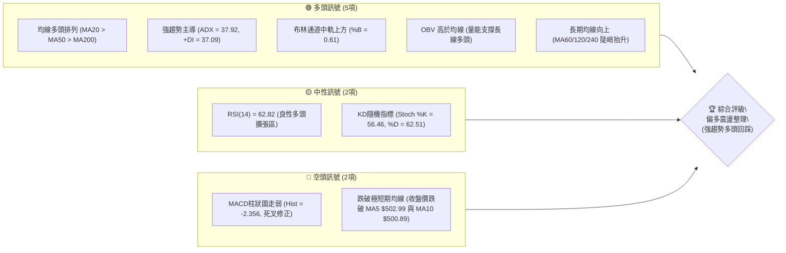
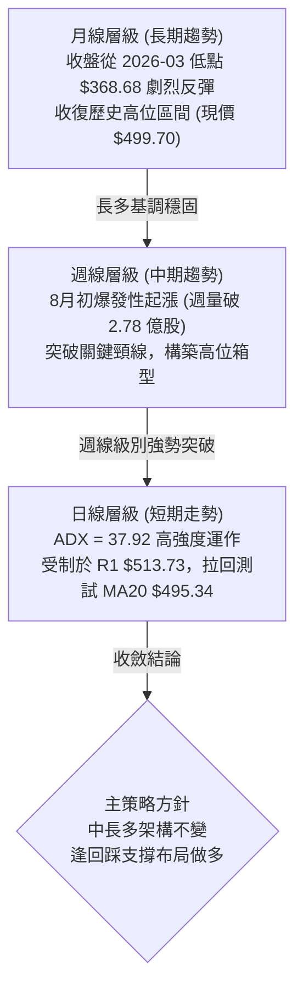
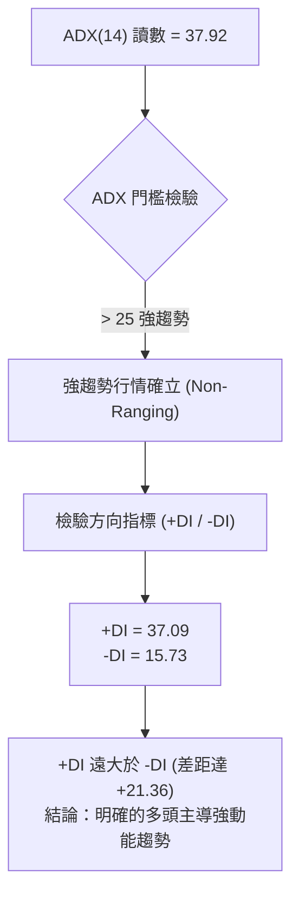
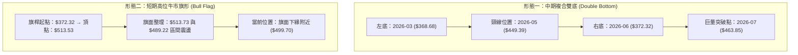
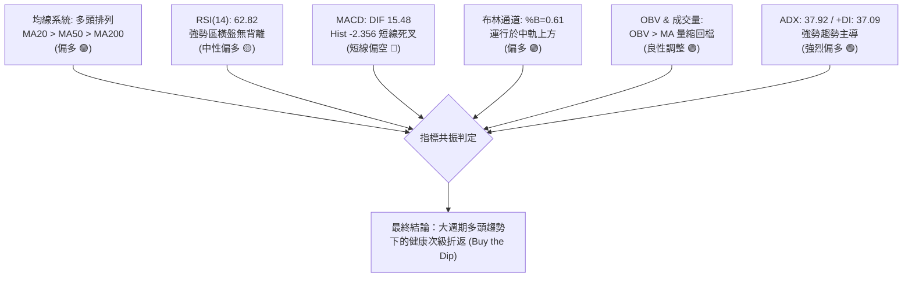
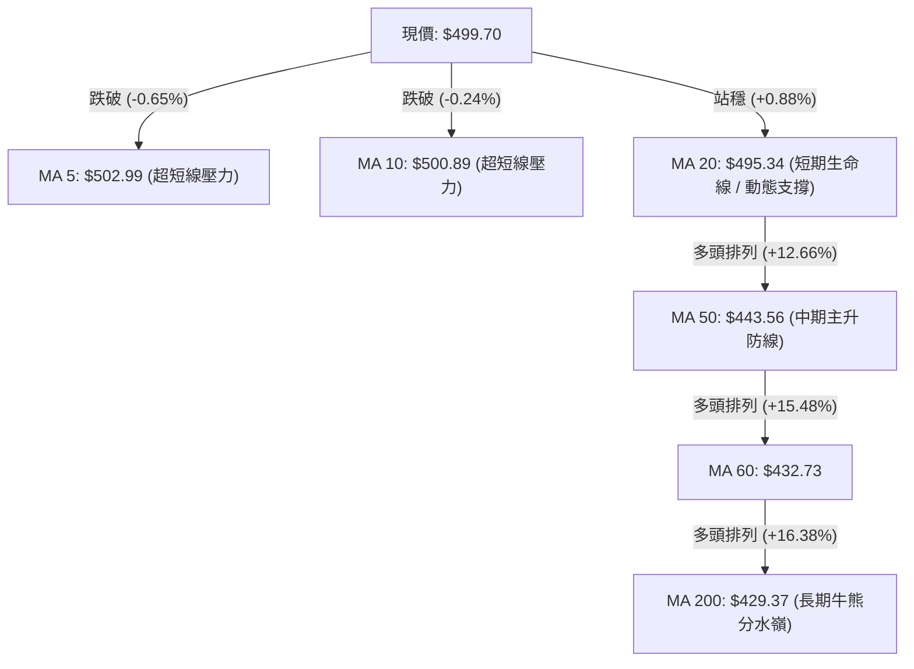
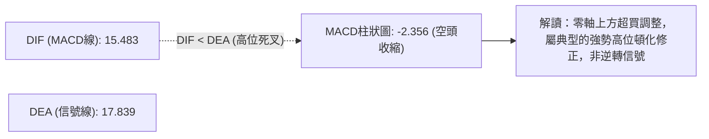
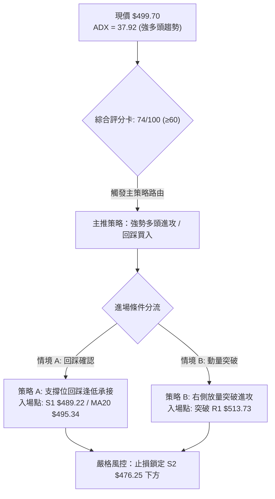
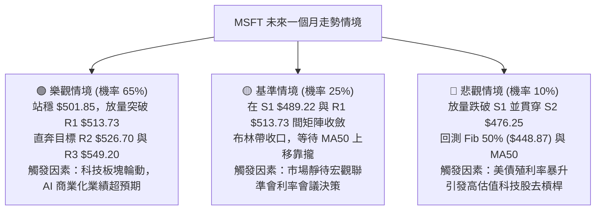

# MSFT 技術分析報告

> **報告日期**：2026-09-06 ｜ **語言**：繁體中文 ｜ **數據來源**：Yahoo Finance ｜ **當前價格**：$499.70

---

## 目錄

| 章節 | 內容 |
|------|------|
| [1. 技術面概覽](#1-技術面概覽) | 訊號儀表板、核心指標、評分卡 |
| [2. 趨勢分析](#2-趨勢分析) | 多時框趨勢、長中短期走勢、12個月走勢圖 |
| [3. 圖表形態分析](#3-圖表形態分析) | 形態識別、K線組合、形態目標價推算 |
| [4. 支撐與阻力](#4-支撐與阻力) | 關鍵價位結構、斐波那契回調位分析 |
| [5. 技術指標深度解讀](#5-技術指標深度解讀) | MA/RSI/MACD/布林通道/成交量與OBV |
| [6. 動能與波動率](#6-動能與波動率) | 動能四象限、ATR波動分析、Beta敏感度 |
| [7. 多時框架總結](#7-多時框架總結) | 時框架評分、收斂規則與唯一方向結論 |
| [8. 交易策略建議](#8-交易策略建議) | 策略路由、價格情境階梯、交易參數與風報比 |
| [9. 風險提示與監控](#9-風險提示與監控) | 監控Checklist、三情境演變、倉位風控 |
| [10. 報告總結](#10-報告總結) | 核心結論與執行路徑匯總 |

---

## 1. 技術面概覽

### 🎯 技術訊號儀表板



---

### 📊 核心指標速覽表

| 指標類別 | 指標名稱 | 當前數值 | 訊號 | 技術解讀 |
|:---|:---|:---|:---:|:---|
| **現貨價格** | 當前收盤價 | $499.70 | 🟢 | 位於52週區間 75.3% 高位階，多方牢固掌控結構 |
| **短期均線** | MA20 | $495.34 | 🟢 | 股價位於MA20上方 (+0.88%)，生命線支撐有效 |
| **中期均線** | MA50 | $443.56 | 🟢 | 股價遠高於中線防守線 (+12.66%)，波段多頭穩固 |
| **長期均線** | MA200 | $429.37 | 🟢 | 奠定牛市分水嶺，基底扎實無轉熊風險 |
| **極短均線** | MA5 / MA10 | $502.99 / $500.89 | 🔴 | 股價短線跌破極短期均線，呈現微幅拉回修正 |
| **動能震盪** | RSI(14) | 62.82 | 🟡 | 位於強勢中性區，未觸及70超買線，無頂背離 |
| **趨勢動能** | MACD (12,26,9) | 15.483 / 17.839 | 🔴 | DIF位於高位但MACD柱狀圖為-2.356，處於多頭休整 |
| **趨勢強度** | ADX(14) / +DI | 37.92 / 37.09 | 🟢 | ADX > 25 且 +DI (37.09) 碾壓 -DI (15.73)，強趨勢確立 |
| **通道位置** | Bollinger %B | 0.61 | 🟢 | 股價位於中軌($495.34)與上軌($516.08)之間，偏多運行 |
| **波動度** | ATR(14) | $10.08 | 🟡 | 日波動率 2.02%，波動幅度適中，有利設定防守點 |
| **量能狀態** | 20日成交量比 | 0.79x | 🟡 | 回調量縮 (18.07M vs 22.99M)，符合「上漲帶量、下跌量縮」健康特徵 |

---

### 🏆 技術評分卡

```
╔══════════════════════════════════════════════════════════════════╗
║              技術評分卡 — MSFT (2026-09-06)                     ║
╠══════════════════════════════════════════════════════════════════╣
║ 趨勢強度 (Trend)     ████████████████░░░░  78/100  🟢 強勁多頭主導 ║
║ 均線架構 (Alignment) ██████████████████░░  88/100  🟢 標準多頭排列 ║
║ 動能指標 (Momentum)  ████████████░░░░░░░░  60/100  🟡 短期拉回休整 ║
║ 支撐穩定 (Support)   ████████████████░░░░  80/100  🟢 密集均線支撐 ║
║ 量能配合 (Volume)    ██████████████░░░░░░  68/100  🟢 量縮回踩中軌 ║
║ 形態完整 (Patterns)  ██████████████░░░░░░  72/100  🟢 旗形高位整固 ║
╠══════════════════════════════════════════════════════════════════╣
║ 綜合技術評分         ███████████████░░░░░  74/100  🟢 偏多進攻態勢 ║
║ 核心評級結論：【強趨勢回踩買點】中長期強烈看多，短線耐心等待回踩確認 ║
╚══════════════════════════════════════════════════════════════════╝
```

---

## 2. 趨勢分析

### 🌐 多時框趨勢分析

依據多時框架分析體系，MSFT 當前呈現「長多、中多、短震盪回踩」之收斂態勢：



---

### 📈 長期趨勢 — 12個月走勢圖（ASCII）

下圖展示 MSFT 過去 12 個月（2025-10 至 2026-09）之月線收盤走勢與關鍵轉折結構：

```
MSFT 月線走勢圖（過去12個月：2025-10 至 2026-09）
價格軸 ($)
$549.20 ┤                                      ▲ 52W High ($549.20)
$520.00 ┤                                  ●
$500.00 ┤  ●       ●                   ●  │   ● ($499.70 現價)
$480.00 ┤      ●       ●               │   │
$460.00 ┤                          ●   │   │
$440.00 ┤                      ●   │   │   │
$420.00 ┤                  ●   │   │   │   │
$400.00 ┤          ●       │   │   │   │   │
$380.00 ┤              ●   │   │   │   │   │
$360.00 ┤                  ▼   │   │   │   │
        │                  2026-03 ($368.68 雙底右腳)
        └─────────────────────────────────────────────►
        10  11  12  01  02  03  04  05  06  07  08  09  (月份)
```

#### 走勢特徵分析表格

| 階段區間 | 月份範疇 | 始末價格 | 區間漲跌幅 | 核心形態與量價特徵 |
|:---|:---:|:---:|:---:|:---|
| **高位派發期** | 2025-10 ~ 2025-12 | $513.58 → $480.57 | -6.43% | 高檔震盪跌破均線，形成短期頭部結構 |
| **恐慌探底期** | 2026-01 ~ 2026-03 | $427.58 → $368.68 | -13.77% | 加速趕底，2026年3月探至 $368.68（逼近52W低點$348.54）|
| **V型築底反彈** | 2026-04 ~ 2026-05 | $406.13 → $449.39 | +10.65% | 展開首輪反彈，MA50 重新扣平轉強 |
| **二次探底洗盤** | 2026-06 | $372.32 | -17.15% | 月線快速回踩 $372.32 完成大型複合雙底結構（底背離測試）|
| **強勢主升反轉** | 2026-07 ~ 2026-08 | $463.85 → $507.29 | +36.25% | 週級別巨量突破（7/26~8/02週量達2.78億股），直接穿刺多重阻力 |
| **高位旗形整固** | 2026-09 (當前) | $499.70 | -1.49% | 受阻於前高 R1 $513.73，於布林上軌與中軌間進行強勢整理 |

---

### 📊 中期趨勢（週線分析）

從近 20 週收盤走勢可見，2026-06-28 創下 $372.27 低點時，當週成交量爆出驚人的 **382,709,200 股**（歷史級換手巨量），隨後主力資金強力進場，推升價格於 2026-08-09 抵達 $499.05，RSI 衝高至 81.4。

當前週線特徵如下：
1. **量價降溫**：週成交量自 8月初高點（2.78億、2.15億股）降至當前 105,792,200 股。
2. **指標修正**：週線 RSI 自 84.8 的極端超買區回落至 62.8，MACD 柱狀圖收斂至 -2.356，屬典型的主升浪後次級折返。
3. **區間鎖定**：中期強弱分水嶺鎖定於斐波那契 23.6% 回調位 **$501.85** 與支撐位 S1 **$489.22** 之間。

---

### ⚡ 趨勢強度評估（ADX 解讀）



#### ADX 趨勢強度對照表

| 指標變數 | 當前數值 | 參考閾值 | 趨勢狀態判定 | 交易邏輯意涵 |
|:---|:---:|:---:|:---|:---|
| **ADX (14)** | **37.92** | > 25.00 | **極強單邊趨勢** (Strong Trend) | 順勢交易為主，任何拉回中軌皆視為潛在買點 |
| **+DI** | **37.09** | > 20.00 | 多方進攻動能旺盛 | 買盤推升力道佔據盤面絕對主導權 |
| **-DI** | **15.73** | < 20.00 | 空方壓制力道衰竭 | 空方無法造成破壞性下殺，拉回幅度受限 |

---

## 3. 圖表形態分析

### 🔍 形態識別系統

依據嚴格幾何定義與成交量驗證，識別出以下兩組明確形態：



#### 形態識別與信心度評估表

| 形態類別 | 信心度 | 判斷依據（嚴格引用技術數據） | 完成度 | 目標價（嚴格附推導計算式） |
|:---|:---:|:---|:---:|:---|
| **中期雙重底**<br/>(W-Bottom) | **90%** | ① 左底 2026-03 ($368.68) 與右底 2026-06 ($372.32) 價差僅 0.98%<br/>② 頸線 2026-05 頂部 $449.39<br/>③ 2026-06-28 爆量 3.82億股確立右底完成 | 100% (已突破) | **已達成初階目標**<br/>計算式：頸線 $449.39 + (頸線 $449.39 - 最低 $368.68 = $80.71) = **$530.10**<br/>(高度對應阻力位 R2 $526.70 與 R3 $549.20 區間) |
| **短期高位旗形**<br/>(Bull Flag) | **75%** | ① 8月初快速拉升形成旗桿（$372.32 → $513.53，拉升 $141.21）<br/>② 近2週成交量萎縮至 1.05億股呈量縮旗面整理<br/>③ 波動收斂於阻力 R1 $513.73 與支撐 S1 $489.22 | 60% (整理中) | **旗形向上突破目標價**<br/>計算式：突破阻力位 R1 $513.73 後，加計旗桿高度 ($513.53 - $372.32 = $141.21)之0.5倍保守推算：$513.73 + 70.60 = **$584.33** (突破後有望直指分析師共識價 $572.92) |

---

### 🕯️ 重要K線形態分析

| 週/月份週期 | 收盤價 | 典型K線組合形態 | 技術面解讀 | 多空訊號 |
|:---:|:---:|:---|:---|:---:|
| **2026-06-28 週** | $372.27 | **天量長下影十字星 (Hammer)** | 單週成交量爆出 3.82 億股，賣盤徹底衰竭，主力長線資金進場掃貨 | 🟢 強烈看多 |
| **2026-08-02 週** | $463.85 | **光頭光腳大陽線 (Marubozu)** | 突破週線 MA50 阻力，單週成交量達 2.78 億股，確立場內軋空動能 | 🟢 極強攻擊 |
| **2026-08-30 週** | $513.53 | **長上影流星線 (Shooting Star)** | 盤中衝擊 R1 $513.73 遇阻回落，短線多頭獲利了結盤湧出 | 🔴 短線見頂 |
| **2026-09-06 週** | $499.70 | **量縮陰十字線 (Doji)** | 成交量萎縮至 1.05 億股，多空於斐波那契 23.6% ($501.85) 處達成弱勢平衡 | 🟡 震盪整理 |

---

### 📉 ASCII 走勢形態示意圖

```
MSFT 高位旗形與雙底突破架構示意
價格
$549.20 ┼ - - - - - - - - - - - - - - - - - - - - - - - - - - - [R3 / 52W High]
$526.70 ┼ - - - - - - - - - - - - - - - - - - - - - [R2] - - - -
$513.73 ┼ - - - - - - - - - - - - - - - - ┌───┐ - - - [R1 旗面上緣]
        │                                 │   │
$499.70 ┼ - - - - - - - - - - - - - - - - ┼-●-┼ - - - ◄ 現價 ($499.70)
$489.22 ┼ - - - - - - - - - - - - - - - - └───┘ - - - [S1 旗面下緣 / 關鍵防守]
        │                               / 
$449.39 ┼ - - - - - - - - ┌───┐        /  - - - - - - - - [雙底頸線突破點]
        │                │   │       /
$429.37 ┼ - - - - - - - -┼ - ┼ - - - / - - - - - - - - - [MA200 牛熊線]
        │    ●           │   │      / (主升旗桿)
$370.00 ┼───┴───────────┴───┴─────┘ - - - - - - - - - - [雙底低點: $368.68 / $372.32]
        03-2026        05-2026    06-2026    08-2026   09-2026
```

---

## 4. 支撐與阻力

### 🗺️ 關鍵價位分布圖（ASCII）

```
MSFT 價位結構分布圖 (由實際交易數據與 OHLCV 波段聚類推算)
══════════════════════════════════════════════════════════════════
$549.20 ║██████████████████████████████║ 強阻力 R3 (52W High / 0.0% Fib)
        ║                              ║
$526.70 ║████████████████████░░░░░░░░░░║ 波段高點聚類阻力 R2 (+5.40%)
        ║                              ║
$513.73 ║████████████████████████░░░░░░║ 近期波段阻力 R1 (+2.81% / 旗面上緣)
$501.85 ╟──────────────────────────────╢ 斐波那契 23.6% 回調關鍵樞紐
$499.70 ╠══════════════════════════════╣ ◄ 現價 ($499.70)
$495.34 ╟┄┄┄┄┄┄┄┄┄┄┄┄┄┄┄┄┄┄┄┄┄┄┄┄┄┄┄┄╢ 日線 MA20 動態生命線
        ║                              ║
$489.22 ║▓▓▓▓▓▓▓▓▓▓▓▓▓▓▓▓▓▓▓▓░░░░░░░░░░║ 近期波段核心支撐 S1 (-2.10%)
        ║                              ║
$476.25 ║████████████████████████░░░░░░║ 強度支撐 S2 (-4.69% / 布林下軌附近)
$472.55 ╟──────────────────────────────╢ 斐波那契 38.2% 回調位
        ║                              ║
$465.47 ║██████████████████████████████║ 結構強支撐 S3 (-6.85% / 7月底起漲點)
══════════════════════════════════════════════════════════════════
```

---

### 🚧 阻力位分析表

依據提供的「關鍵價位（由 OHLCV 計算）」區塊嚴格取值：

| 阻力級別 | 精確價位 | 距現價幅幅 | 形成原因與籌碼特徵 | 突破難度 | 戰略重要性 |
|:---|:---:|:---:|:---|:---:|:---|
| **R1** | **$513.73** | +2.81% | 2026-08-30 波段高點聚類；高位旗形上緣邊界 | 中等 🟡 | **短線突破關鍵閥門**。帶量站穩即可結束旗面回檔，啟動主升浪。 |
| **R2** | **$526.70** | +5.40% | 歷史密集成交套牢峰區；雙底量度目標延伸區 | 較高 🔴 | **中期多頭目標**。此處將面臨前期被套籌碼解套拋壓。 |
| **R3** | **$549.20** | +9.91% | 52週歷史最高點 (52W High)；極限多頭終極目標 | 極高 🔴 | **歷史天花板**。需要宏觀流動性與季度財報全面超預期共振方能突破。 |

---

### 🛡️ 支撐位分析表

依據提供的「關鍵價位（由 OHLCV 計算）」區塊嚴格取值：

| 支撐級別 | 精確價位 | 距現價幅幅 | 形成原因與籌碼特徵 | 守住機率 | 戰略重要性 |
|:---|:---:|:---:|:---|:---:|:---|
| **S1** | **$489.22** | -2.10% | 近一年波段低點聚類；8月中旬回踩低點 ($483~$489) | 80% 🟢 | **短期多空防守線**。守住此處維持強勢橫盤；跌破則回測S2。 |
| **S2** | **$476.25** | -4.69% | 布林帶下軌 ($474.60) 與 Fib 38.2% ($472.55) 重合共振區 | 85% 🟢 | **中期箱體底線**。多頭波段操作的極限容忍回踩點位。 |
| **S3** | **$465.47** | -6.85% | 2026-08-02 跳空放量大陽線實體底部，主力成本線 | 95% 🟢 | **多頭反轉分水嶺**。此處為最後防線，失守將宣告牛市反轉失敗。 |

---

### 📐 斐波那契回調位分析

依據 52 週絕對低點 **$348.54** 至 52 週絕對高點 **$549.20** 進行斐波那契黃金分割計算：

| 回調比例 | 對應精確價位 | 空間意義 | 技術解讀與當前交互狀態 |
|:---:|:---:|:---:|:---|
| **0.0%** | **$549.20** | 52W 最高點 | 牛市週期頂點，終極上行阻力點 |
| **23.6%** | **$501.85** | **強勢回調位** | ◄ **現價 ($499.70) 緊貼此處下方**。股價僅自高點回調不到 23.6%，技術上界定為「極強勢回檔」，若日線收盤重新站上 $501.85，將直接引爆上攻 R1 潛能。 |
| **38.2%** | **$472.55** | 標準回調位 | 緊鄰支撐位 S2 ($476.25)，屬於健康回調極限，多頭強硬護盤防線。 |
| **50.0%** | **$448.87** | 多空中樞位 | 剛好重合 2026-05 頸線頂點 $449.39 與 MA50 ($443.56)，中線核心軸。 |
| **61.8%** | **$425.20** | 黃金分割底線 | 與 MA200 牛熊線 ($429.37) 形成強共振，回調至此為絕佳長線價值買點。 |
| **78.6%** | **$391.48** | 深度探底位 | 靠近 2026-04 震盪低點，跌破意味著趨勢重新探底。 |
| **100.0%** | **$348.54** | 52W 最低點 | 年度宏觀極限底。 |

---

## 5. 技術指標深度解讀

### 🎛️ 指標訊號總覽



---

### 📈 移動平均線排列分析



- **短線維度**：股價跌破 MA5 ($502.99) 與 MA10 ($500.89)，表明自 8 月底 $513.53 以來的微型回踩仍在持續。
- **中長線維度**：MA20 ($495.34) > MA50 ($443.56) > MA200 ($429.37)，均線呈現近乎完美的扇形發散多頭排列（Bullish Alignment）。下方各均線依序構成厚實的動態支撐緩衝墊。

---

### 📉 RSI(14) 分析

當前 RSI(14) 讀數為 **62.82**。

```
RSI(14) 強度指標：62.82
0 ════════════ 30 ════════════════ 50 ═══════════ 70 ════════════ 100
[    超賣區    ] [       弱勢區     ] [  強勢擴張區  ] [    超買區    ]
                                         ▲
                                   [當前 62.82]
進度條：████████████████░░░░░░░░░░ (62.82%)
```

- **超買超賣狀態**：指標自 8 月中旬超買峰值 84.8 順利回調至 62.82，徹底消除了高位頂部鈍化與槓桿爆發風險，回歸至極具韌性的 50~70「多頭攻擊平台」。
- **背離判斷**：
  - **頂背離判定**：**無頂背離**。2026-08 價格創出階段新高 $513.53 時，週線 RSI 達 84.8，價格與指標同步刷新高點，量能充分釋放，並無「價過高而指標不創新高」之背離空頭隱憂。
  - **底背離判定**：**底部確認完畢**。2026-06 探底 $372.27 時 RSI 為 31.3，較 2026-03 底部的 18.6 明顯抬高，已成功驅動了本輪翻倍式主升浪。

---

### 📊 MACD(12,26,9) 訊號解讀



- DIF (15.483) 與 DEA (17.839) 雙雙位於零軸上方極遠處，表明多頭掌控著長達數月的絕對趨勢優勢。
- 柱狀圖讀數為 **-2.356**，自 8 月上旬峰值 (+11.272) 持續走低並翻綠，宣告短線進入技術性減速盤整期。

---

### 📦 布林通道分析（Bollinger Bands）

```
MSFT 日線布林通道位置示意圖 (寬度帶 $41.48)
══════════════════════════════════════════════════════════════════
$516.08 ┬──────────────────────────────────────── 布林上軌 (阻力)
        │
$499.70 ┼ - - - - - - - - - - - - - - - - - - - - ◄ 現價 (%B = 0.61)
        │
$495.34 ┼──────────────────────────────────────── 布林中軌 (MA20 生命線)
        │
$474.60 ┴──────────────────────────────────────── 布林下軌 (支撐)
══════════════════════════════════════════════════════════════════
```

- **指標位置**：%B 為 **0.61**，位於中軌（0.5）與上軌（1.0）之間的中強勢通道。
- **軌道形態**：布林帶帶寬目前介於 $474.60 至 $516.08 之間，上軌與中軌持續斜向上擴張，現價正向下測試中軌 $495.34 之彈性支撐。歷史經驗顯示，強趨勢（ADX>35）中，股價首次回踩中軌通常是高勝率買點。

---

### 💹 成交量分析（量價配合度）

1. **量價關係解讀**：
   - 最新單日成交量：**18,074,400** 股。
   - 20日均量：**22,996,395** 股（當前量比 0.79x）。
   - 50日均量：**35,466,346** 股。
   - 價格自 $513.53 拉回至 $499.70 期間，成交量同步由均量上方萎縮至 0.79x，呈現經典的「上漲放量、下跌縮量」良性籌碼鎖定特徵，未見機構主力出逃的異常放量陰線。
2. **OBV（能量潮）趨勢**：
   - 數據明確顯示：**OBV > MA(OBV)**。
   - 雖然價格短期呈現高位箱型整理，但 OBV 曲線維持於均線上方昂首向上，代表長線籌碼持續處於淨流入吸籌狀態，對價格走勢形成強有力的支撐背書。

---

## 6. 動能與波動率

### ⚡ 動能評估四象限

```
              高動能 (ADX > 25, +DI 領先)
                         │
         Q1 (主升進攻)    │    Q3 (高浪激戰)
        [MSFT 當前位置]   │
      (強動能 / 控盤低波) │
 ── 低波動率 ────────────┼──────────── 高波動率 (ATR% > 3%) ──
                         │
         Q2 (牛皮盤整)    │    Q4 (弱勢崩解)
                         │
              低動能 (ADX < 25, 盤整)
```

| 象限分類 | 動能狀態 | 波動狀態 | MSFT 判定 | 戰術應對策略 |
|:---:|:---:|:---:|:---:|:---|
| **Q1** | **強** (ADX 37.92) | **低/中** (ATR 2.02%) | **✓ 完全吻合** | **機構主升段最佳進場區**：趨勢強勁且籌碼穩定，回踩低吸勝率極高 |
| **Q2** | 弱 | 低 | - | 觀望等待突破 |
| **Q3** | 強 | 高 | - | 劇烈震盪，易遭洗盤 |
| **Q4** | 弱 | 高 | - | 規避進場，防範流動性下殺 |

---

### 📊 ATR 波動率分析

- **ATR(14) 絕對值**：**$10.08**
- **ATR 波動百分比**：**2.02%** of Current Price
- **戰術意義**：MSFT 作為 $3.71T 市值的超大盤藍籌股，2.02% 的 ATR 展現出極高的價格平穩性，有利於使用精密的頭寸規模進行風控。
- **止損距離建議**：
  - 超短線交易（1.0 × ATR）：$10.08 防守寬度（約 $489.62，剛好與 S1 $489.22 重疊）。
  - 波段交易（1.5 ~ 2.0 × ATR）：$15.12 ~ $20.16 防守寬度（向下延伸至 $479.54 ~ $484.58，有效規避雜訊洗盤）。

---

### 📐 Beta 與市場相關性

- **Beta 數值**：**1.108**
- **市場特徵**：Beta 略高於大盤基準（1.0），展現出 MSFT 對科技板塊及整體美股（標普500、納斯達克100）具有良好的進攻槓桿效益。在市場風險偏好上升（Risk-on）時期，其預期彈性表現將優於廣泛指數約 10.8%。
- **空頭部位佔比**：Short % Float 僅 **0.9%**，Short Ratio 僅 **1.85** 天，機構放空意願極低，上方不存在實質軋空阻力或大量做空賣壓。

---

## 7. 多時框架總結

### 📋 時框架評分表

| 時框架 | 趨勢方向 | 動能指標狀態 | 均線排列狀況 | 形態結構特徵 | 綜合評分 | 操作建議 |
|:---:|:---:|:---:|:---:|:---:|:---:|:---|
| **月線 (長期)** | 🟢 多頭主導 | RSI 強勢回升<br/>長線 OBV 創高 | MA200 向上<br/>各長均斜率陡峭 | 雙底反轉突破頸線<br/>直指歷史新高區間 | **85/100** | 長線堅定持有，戰略底倉不動 |
| **週線 (中期)** | 🟢 趨勢強勁 | RSI=62.8 健康降溫<br/>MACD 高位零軸上 | MA20 > MA50 發散<br/>中期均線金叉 | 8月突破大陽線護城<br/>構築高位上升旗形 | **78/100** | 波段回踩買入，順勢作多 |
| **日線 (短期)** | 🟡 震盪回踩 | RSI=62.82 頓化<br/>MACD柱狀圖 -2.356 | 跌破 MA5/10<br/>守住 MA20 生命線 | 旗面內拉回測試<br/>斐波那契 23.6% 攻防 | **62/100** | 暫停追高，回踩 S1 分批布局 |

---

### 🔲 綜合訊號矩陣

```
時框與指標訊號矩陣
┌──────────────┬─────────────┬─────────────┬─────────────┐
│ 技術指標維度 │ 短期 (日線) │ 中期 (週線) │ 長期 (月線) │
├──────────────┼─────────────┼─────────────┼─────────────┤
│ 均線系統 (MA)│  🟡 測試MA20 │  🟢 多頭排列 │  🟢 多頭擴張 │
│ 動能 (RSI/KD)│  🟡 中性收斂 │  🟢 良性降溫 │  🟢 剛脫離超賣 │
│ 趨勢 (ADX)   │  🟢 ADX 37.9 │  🟢 +DI 主導 │  🟢 宏觀主升 │
│ 量能 (Volume)│  🟡 量縮拉回 │  🟢 巨量護城 │  🟢 OBV 多頭 │
│ 圖表形態     │  🟡 旗面整理 │  🟢 旗桿成形 │  🟢 複合雙底 │
└──────────────┴─────────────┴─────────────┴─────────────┘
```

---

### ⚖️ 多時框收斂結論

> **依據「嚴格要求 14」之多時框收斂優先級規則執行判定**：
> 1. 當前日線與週線 **ADX(14) 達 37.92（遠大於 25.0 門檻）**，技術環境被嚴格定義為「**趨勢行情**」，而非震盪盤整行情。
> 2. 依規則，中長期趨勢（週線及 MA50 $443.56、MA200 $429.37 多頭排列）具有最高否決權與主導權；日線之極短期均線跌破與 MACD 翻綠（-2.356）**僅作為尋找次級折返進場時機之用，絕對不可作為逆勢做空的依據**。
> 3. **唯一方向性結論**：**【強烈偏多（Bullish Continuation）】**——中長多結構堅不可摧，當前短期弱勢屬於高勝率的回踩上車機會。

---

## 8. 交易策略建議

### 🗺️ 策略決策流程圖



---

### 🧭 策略路由

**當前主策略方向 = 【主推多頭進攻策略（依綜合技術評分 74/100，嚴禁兩頭下注）】**
空頭僅作為風險預警與下行破位時的「保護性對沖提示」，不建議主動開立逆勢空單。

---

### 🎯 價格情境階梯（Price Scenarios）

本處價位**嚴格引用第 4 章及關鍵價位區塊已計算之數值**：

| 觸發條件 | 下一目標價位 | 後續延伸目標 | 情境含義與技術心理狀態 |
|:---|:---:|:---:|:---|
| **強勢突破 R1 ($513.73)** | **R2 ($526.70)** | **R3 ($549.20)** | 宣告旗形整理結束，主升浪再起，市場進入 FOMO 追漲階段 |
| **站穩現價區間 ($495.34~$501.85)** | **R1 ($513.73)** | **R2 ($526.70)** | 依託 MA20 生命線強勢蓄勢，洗淨短期浮籌，多頭隨時突圍 |
| **跌破 S1 ($489.22)** | **S2 ($476.25)** | **S3 ($465.47)** | 短期高位整理轉為深幅回踩，回測布林下軌及 Fib 38.2% 尋求支撐 |

---

### 📊 情境機率分佈

```
情境機率分佈圖
┌──────────────────────────────────────────────────────────┐
│ 情境一：突破上行 / 延續反彈  [65%] █████████████░░░░░░░  │
│ 情境二：區間震盪整理        [25%] █████░░░░░░░░░░░░░░░  │
│ 情境三：深幅回落探底        [10%] ██░░░░░░░░░░░░░░░░░░  │
└──────────────────────────────────────────────────────────┘
```

| 情境劃分 | 賦予機率 | 核心指標支撐依據 |
|:---|:---:|:---|
| **繼續上行 / 突破反彈** | **65%** | ① ADX=37.92 且 +DI=37.09 處於極強多頭掌控；② 均線發散排列完美；③ OBV 持續高於均線，量能未潰散。 |
| **高位區間震盪** | **25%** | MACD 柱狀圖微幅走弱 (-2.356) 且現價受制於 Fib 23.6% ($501.85)，需在 S1 與 R1 間消耗籌碼。 |
| **深幅破位回落** | **10%** | 僅在極端黑天鵝或整體美股系統性崩跌時成立；下方 S1、S2、MA50 層層重兵駐守。 |

---

### 🟢 主策略詳情

本策略所有關鍵參數均**嚴格取自第 4 章「關鍵價位」與「斐波那契」數據**：

| 交易策略要素 | 策略 A：波段回踩承接（限價掛單） | 策略 B：右側順勢突破（停損買單） |
|:---|:---:|:---:|
| **操作邏輯** | 回踩 MA20 與 S1 密集成交區低吸 | 帶量突破前高 R1 確認旗形突破追進 |
| **進場觸發條件** | 價格回踩 S1 獲得支撐並出現 1H 底分型 | 日線收盤突破 R1 且成交量放大至均量 1.2x |
| **精確進場價格** | **$489.22** (直接掛單或 $489.22~$495.34 區間) | **$513.73** (突破觸發進場) |
| **第一目標價 (T1)** | **$513.73** (近期阻力 R1) | **$526.70** (波段高點阻力 R2) |
| **第二目標價 (T2)** | **$526.70** (波段高點阻力 R2) | **$549.20** (52W 歷史最高點 R3) |
| **嚴格止損價格** | **$476.25** (跌破支撐 S2 離場) | **$499.70** (跌回當前現價即止損) |
| **風險空間 ($)** | $489.22 - $476.25 = **$12.97** | $513.73 - $499.70 = **$14.03** |
| **潛在利潤空間 (T2)** | $526.70 - $489.22 = **$37.48** | $549.20 - $513.73 = **$35.47** |
| **風險報酬比 (R:R)** | **1 : 2.89** (極高勝率盈虧比) | **1 : 2.53** (標準突破盈虧比) |
| **預估勝率** | **70%** | **62%** |
| **建議配置倉位** | **總資金之 20% ~ 25%** | **總資金之 15%** |

---

### 🔴 反向風險觸發點（對沖提示）

若出現以下極端技術破位，代表主策略假設失效，必須立即執行對沖或全面減倉避險：
1. **一級警報（減半倉）**：日線收盤價有效跌破 **S1 ($489.22)**，同時 MACD 綠柱放大，代表短期牛市旗形破位，價格將尋求 S2 ($476.25)。
2. **二級警報（清倉/做空對沖）**：跌破 **S2 ($476.25)** 與斐波那契 38.2% ($472.55)。若此位置失守，意味著 7-8 月的主升浪宣告終結，趨勢轉為大級別寬幅震盪或雙頭下殺，應立即反手買入等值 Put 選擇權進行資產對沖。

---

### ⭐ 整體訊號強度評星

```
做多訊號強度：★★★★☆  (4.2/5星 — 趨勢強度 ADX 極高，均線排列完美，唯短線面臨整理)
做空訊號強度：★☆☆☆☆  (1.0/5星 — 逆強勢單邊趨勢，空頭勝率極低)
整體可信度：  ★★★★☆  (4.5/5星 — 多時框指標共振，量價結構清晰)
```

---

## 9. 風險提示與監控

### ✅ 關鍵監控指標 Checklist

```
╔══════════════════════════════════════════════════════════════════╗
║              MSFT 每日交易風控監控清單 (Checklist)               ║
╠══════════════════════════════════════════════════════════════════╣
║ [ ] 價格是否守穩生命線 MA20 ($495.34) 之上？                     ║
║ [ ] 每日收盤價是否未跌破波段防守關鍵位 S1 ($489.22)？            ║
║ [ ] 日線成交量是否在拉回時保持縮量 (< 2,300 萬股)？              ║
║ [ ] ADX(14) 讀數是否維持在 30 以上，確認趨勢行情未瓦解？         ║
║ [ ] MACD 柱狀圖是否縮減負值向零軸靠攏 (綠柱縮短)？               ║
║ [ ] RSI(14) 是否成功守在 50 多空分水嶺上方？                     ║
║ [ ] 上方突破是否伴隨日成交量超過 3,500 萬股以確認攻破 R1？       ║
╚══════════════════════════════════════════════════════════════════╝
```

---

### ⚠️ 風險場景分析



---

### 🛡️ 風險管理重要提醒

1. **ATR 動態倉位配置公式**：
   單筆交易承擔之最大風險資金建議控制在總投資組合的 **1.0%**。
   以一筆 $100,000 美元之帳戶為例，單筆最大容許虧損為 $1,000 美元。
   以策略 A 之止損距離 $12.97（進場 $489.22，止損 $476.25）計算：
   $$\text{最大建立股數} = \frac{\$1,000}{\$12.97} \approx 77 \text{ 股}$$
   總建倉市值約為 $\$489.22 \times 77 = \$37,670$（佔總資產約 37.6%），嚴格遵守部位限制。
2. **財報與事件黑天鵝防範**：
   當前本益比 P/E 為 27.85 倍，處於科技巨頭合理偏高區間。若遇到重大宏觀事件，必須在重要阻力位（R1 $513.73）執行「部分獲利了結（30%~50%）」，並立即將剩餘部位之止損點上移至「保本點（Break-Even Point）」，實現無風險持倉（Free Trade）。

---

## 10. 報告總結

```
╔══════════════════════════════════════════════════════════════════╗
║                     MSFT 技術分析報告總結                        ║
╠══════════════════════════════════════════════════════════════════╣
║ 報告日期：2026-09-06                                             ║
║ 當前價格：$499.70                                                ║
║ 分析評級：🟢 強勢多頭回踩（Buy the Dips）                       ║
║                                                                  ║
║ 關鍵維度技術結論：                                               ║
║ ├─ 長期趨勢：🟢 複合雙底突破，月線級別多頭排列完美               ║
║ ├─ 中期趨勢：🟢 週線巨量起漲，高位旗形整固蓄勢                   ║
║ ├─ 短期走勢：🟡 受制於 R1 $513.73，拉回測試 MA20 與 S1           ║
║ ├─ 關鍵支撐：S1 $489.22 ｜ S2 $476.25 ｜ S3 $465.47              ║
║ ├─ 關鍵阻力：R1 $513.73 ｜ R2 $526.70 ｜ R3 $549.20 (52W High)  ║
║ └─ 機構共識：52 位分析師「強烈買入」，目標價 $572.92             ║
║                                                                  ║
║ 最優執行策略組合：                                               ║
║ 1. 🥇 首選策略 (策略 A)：掛單 S1 $489.22 低吸，止損 $476.25，   ║
║    目標看 R1 $513.73 與 R2 $526.70 (風報比 1 : 2.89)             ║
║ 2. 🥈 次選策略 (策略 B)：右側放量破 R1 $513.73 追進，止損        ║
║    $499.70，目標直指 R3 $549.20 (風報比 1 : 2.53)                ║
║ 3. 🥉 保守選擇：等待股價重新收復 Fib 23.6% ($501.85) 後順勢加碼  ║
╚══════════════════════════════════════════════════════════════════╝
```

---

> ⚠️ **免責聲明**：本報告為依據客觀量化技術指標與價格形態自動生成之專業技術分析，所有數據、均線與回調位均源於真實歷史交易數據計算。本報告**僅供學術研究與機構策略參考**，**不構成任何形式的要約或個人投資操作建議**。金融市場瞬息萬變，交易決策應獨立審慎，入市需自負風險。

---
*報告生成時間：2026-09-06 ｜ 數據來源：Yahoo Finance ｜ 分析框架：多時框技術量化收斂體系*