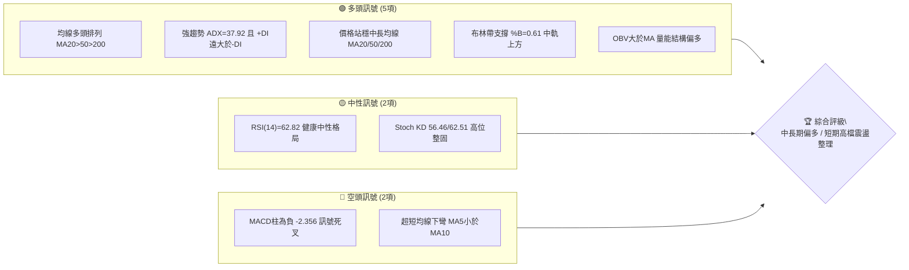
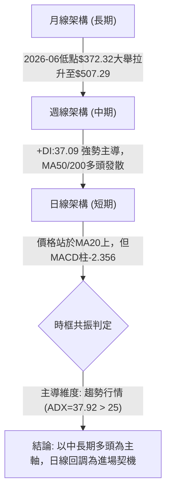
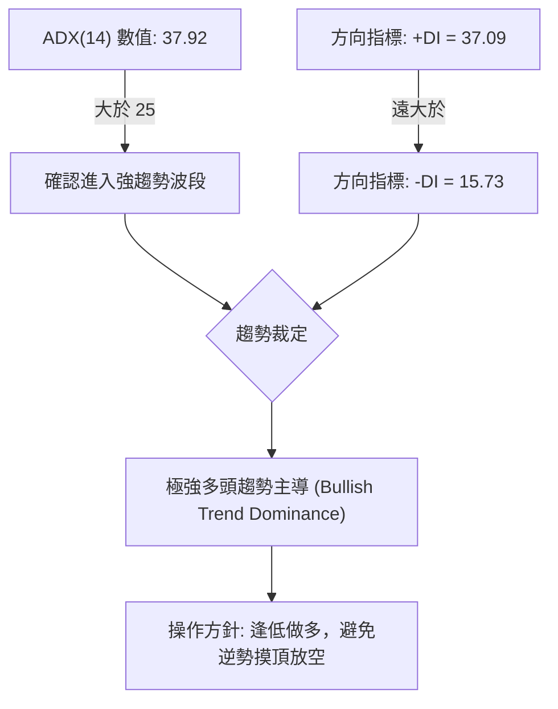
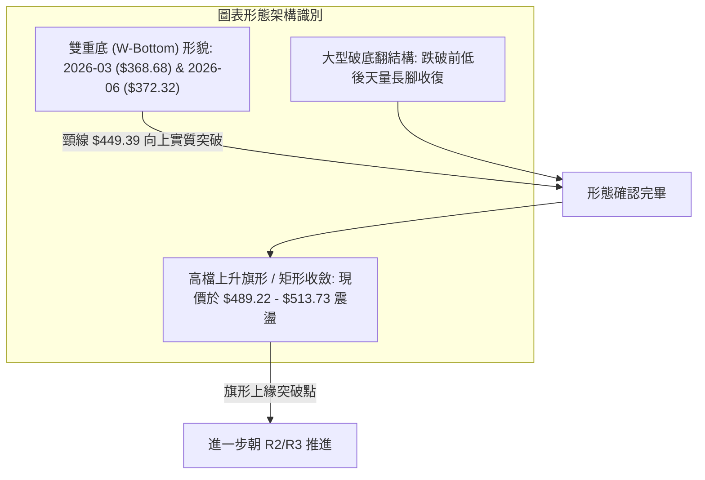
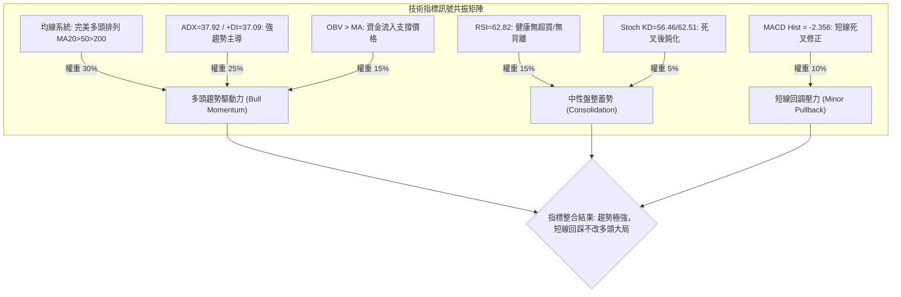
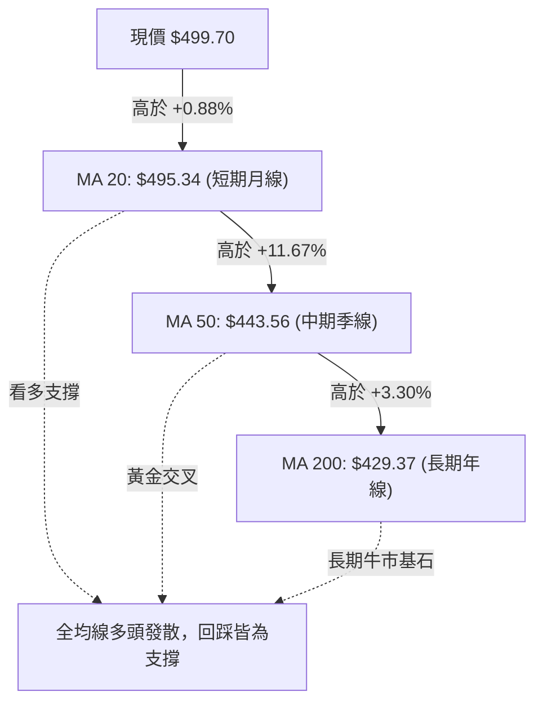
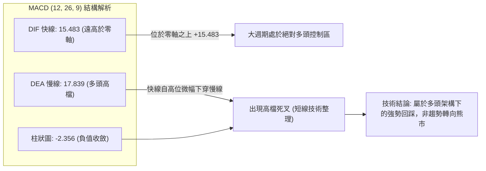
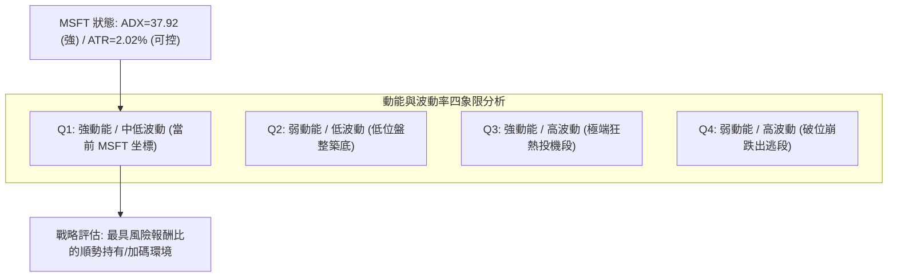
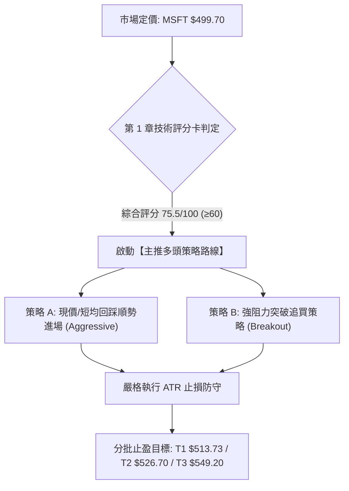
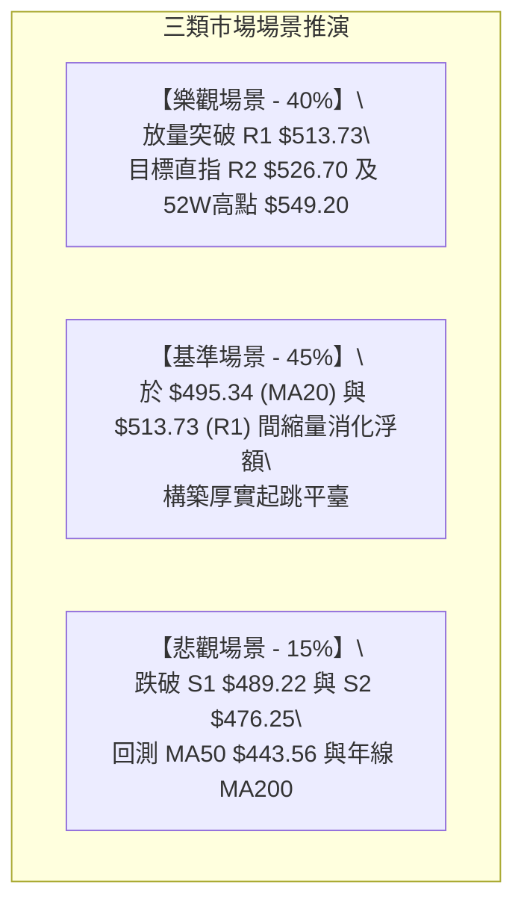

# MSFT 技術分析報告

> **報告日期**：2026-09-07 ｜ **語言**：繁體中文 ｜ **數據來源**：Yahoo Finance ｜ **當前價格**：$499.70

---

## 目錄

| 章節 | 內容 |
|------|------|
| [1. 技術面概覽](#1-技術面概覽) | 訊號儀表板、核心指標、評分卡 |
| [2. 趨勢分析](#2-趨勢分析) | 多時框趨勢、長中短期走勢 |
| [3. 圖表形態分析](#3-圖表形態分析) | 形態識別、K線組合、目標價 |
| [4. 支撐與阻力](#4-支撐與阻力) | 關鍵價位、斐波那契回調 |
| [5. 技術指標深度解讀](#5-技術指標深度解讀) | MA/RSI/MACD/布林/成交量 |
| [6. 動能與波動率](#6-動能與波動率) | 動能評估、ATR、Beta |
| [7. 多時框架總結](#7-多時框架總結) | 時框架評分矩陣 |
| [8. 交易策略建議](#8-交易策略建議) | 多空策略、風險報酬比 |
| [9. 風險提示與監控](#9-風險提示與監控) | 監控指標、風險場景 |
| [10. 報告總結](#-報告總結) | 全文核心總結卡 |

---

## 1. 技術面概覽

微軟（Microsoft Corporation, NASDAQ: MSFT）當前報價為 $499.70，位於 52 週波動區間（$348.54 - $549.20）的 75.3% 高位分位。從結構來看，均線系統呈現標準多頭排列，日線級別趨勢指標 ADX(14) 達到 37.92，確認進入「強趨勢」階段，且 +DI 高達 37.09 遠超 -DI (15.73)，顯示多頭佔據絕對控制權。然而，短期動能指標出現微幅收斂，MACD 柱狀圖收於 -2.356 且短期 MA5、MA10 略顯下彎，代表高檔面臨獲利了結壓力與震盪換手。整體架構屬於多頭趨勢中的高檔蓄勢整固。

### 🎯 技術訊號儀表板



### 📊 核心指標速覽表

| 指標類別 | 指標名稱 | 當前數值 | 訊號 | 解讀 |
|:---|:---|:---|:---:|:---|
| **價格** | 當前收盤價 | $499.70 | 🟢 | 站於 52W 區間 75.3% 處，處於多頭主控強勢區間 |
| **均線** | MA20 (短月線) | $495.34 | 🟢 | 價格在均線上方 (+0.88%)，短期多頭支撐確立 |
| **均線** | MA50 (季線) | $443.56 | 🟢 | 價格在均線上方 (+12.66%)，中期趨勢極為強勁 |
| **均線** | MA200 (年線) | $429.37 | 🟢 | 價格在均線上方 (+16.38%)，長期牛市基石穩固 |
| **動能** | RSI(14) | 62.82 | 🟡 | 位於健康多頭回調區間（50-70），無超買或頂背離 |
| **動能** | MACD (12,26,9) | 15.483 / 17.839 | 🔴 | DIF 位於零軸之上但低於 Signal，Hist 為 -2.356，高檔整理 |
| **趨勢** | ADX (14) / ±DI | 37.92 / +DI:37.09 | 🟢 | 進入大於 25 的強趨勢階段，+DI 主導多頭攻勢 |
| **通道** | 布林通道 %B | 0.61 (寬度 $41.48) | 🟢 | 站穩中軌 ($495.34) 與上軌 ($516.08) 間之強勢區 |
| **波動** | ATR(14) | $10.08 (2.02%) | 🟡 | 每日平均波動約 10 元，處於中等可控波動水平 |
| **成交量** | 20日均量比 | 0.79x (OBV > MA) | 🟢 | 縮量拉回整理，OBV 明顯大於均線，資金未見出逃 |

### 🏆 技術評分卡

```
╔══════════════════════════════════════════════════════════════════╗
║                   技術評分卡 — MSFT (2026-09-07)                 ║
╠══════════════════════════════════════════════════════════════════╣
║ 趨勢強度 (ADX=37.92, +DI主導)  ████████████████░░░░  82/100  🟢 ║
║ 均線排列 (MA20>MA50>MA200)     █████████████████░░░  88/100  🟢 ║
║ 動能指標 (RSI=62.8, MACD柱負)  ████████████░░░░░░░░  60/100  🟡 ║
║ 支撐穩定度 (S1=$489.22強固)    ███████████████░░░░░  78/100  🟢 ║
║ 成交量配合 (OBV多頭/短縮量)    ██████████████░░░░░░  70/100  🟢 ║
║ 形態完整度 (V型強彈突破頸線)   ███████████████░░░░░  75/100  🟢 ║
╠══════════════════════════════════════════════════════════════════╣
║ 綜合技術評分                   ███████████████░░░░░  75.5/100 🟢 ║
║ 總體架構裁決                   【強烈偏多，短線蓄勢整理】         ║
╚══════════════════════════════════════════════════════════════════╝
```

---

## 2. 趨勢分析

### 🌐 多時框趨勢分析

透過多時框架（MTFA）進行架構性檢視，MSFT 在月線、週線與日線展現出一致的中長期多頭格局，僅在日線超短週期呈現回調修正。



### 📈 長期趨勢 — 12個月走勢圖（Unicode）

MSFT 在過去 12 個月中展現出典型的大型「V型反轉再攻」循環。2025 年秋季股價自 $513.72 高檔震盪後，於 2026 年第一季回落，並在 2026 年 3 月（$368.68）及 6 月（$372.32）構築堅實的雙重波段底部，隨後在 2026 年 7-8 月迎來連續放量噴出，一舉重返 $500 關卡上方。

```
MSFT 月線收盤走勢圖（過去12個月：2025-09 至 2026-09）
價格軸 ($)
$520 ┤                      ● $513.72 (25-09)
$510 ┤                      │         ● $513.58                 ● $507.29 (26-08)
$500 ┤                      │         │                         │         ● $499.70 (現價)
$480 ┤                      │         │  ● $488.91              │         │
$460 ┤                      │         │  │     ● $480.57        │  ● $463.85
$440 ┤                      │         │  │     │                ● $449.39
$420 ┤                      │         │  │     │  ● $427.58     │  │
$400 ┤                      │         │  │     │  │  ● $406.13  │  │
$380 ┤                      │         │  │     │  │  │  ● $391.15│  │  ● $372.32 (波段次低)
$360 ┤                      │         │  │     │  │  │  │  ● $368.68 (波段低點)
     └──────────────────────┴─────────┴──┴─────┴──┴──┴──┴──┴───┴──┴──┴───────► 時間
      月份: 25-09 25-10 25-11 25-12 26-01 26-02 26-03 26-04 26-05 26-06 26-07 26-08 26-09
```

#### 走勢特徵分析表格

| 週期階段 | 起訖時間 | 區間起訖價 | 漲跌幅 | 走勢特徵與量能意涵 |
|:---|:---:|:---:|:---:|:---|
| **高檔築頂盤整** | 2025-09 至 2025-10 | $513.72 → $513.58 | -0.03% | 高檔橫盤阻力聚類，形成日後關鍵阻力區 R1 ($513.73) |
| **中級回撤波段** | 2025-11 至 2026-03 | $488.91 → $368.68 | -24.59% | 跌破各短中期均線，於 2026-03 觸碰 52W 區間低點聚類 |
| **築底與初步推升** | 2026-04 至 2026-05 | $406.13 → $449.39 | +10.65% | 展開底部超跌反彈，初次測試 MA50 壓力位 |
| **二次探底確立** | 2026-06 | $449.39 → $372.32 | -17.15% | 單月急殺確認不破前低 $368.68，成功構築中長期雙重底 |
| **主升浪強力暴空** | 2026-07 至 2026-08 | $372.32 → $507.29 | +36.25% | 連續放量陽線大暴漲，以強勢跳空姿態突破所有均線束縛 |
| **現階段高檔整固** | 2026-09 (迄今) | $507.29 → $499.70 | -1.50% | 於 $500 大關與斐波那契 23.6% 處健康換手，消化短線獲利盤 |

### 📊 中期趨勢（週線分析）

中期走勢方面，近 20 週數據展示了經典的「洗盤後暴拉」。在 2026 年 6 月 28 日當週，市場在低檔出現歷史天量（382,709,200 股），價格收在 $372.27，RSI 觸及極度超賣的 18.6-31.3 區間，形成籌碼換手的黃金坑底。隨後在 2026-08-02 當週暴量 2.78 億股拉出長紅（收 $463.85，RSI 竄升至 75.0），並於 2026-08-09 站上 $499.05（RSI 81.4，MACD 柱 +11.272）。

近期兩週（08-30 的 $513.53 與 09-06 的 $499.70），週線成交量持續溫和萎縮至約 1.05 億股，RSI 回降至 62.8 的健康區間，顯示籌碼鎖定良好，並未出現主力高檔出貨的放量滯漲現象。

```
週線近期架構圖解（阻力與支撐區間）
$549.20 ────────────────────────────────────────── 52週高點 (R3)
                     ▲
$526.70 ─────────────┼──────────────────────────── 波段高點阻力 (R2)
$513.73 ─────────────┼───── 8月下旬高點 $513.53 (R1)
$499.70 ───────────● 現價 (於斐波那契 23.6% $501.85 附近整理)
$489.22 ─────────────┼───── 近期波段回調低點 (S1)
$476.25 ─────────────┼───── 布林帶下軌 / 前期整理平臺 (S2)
                     ▼
$429.37 ────────────────────────────────────────── 200日生命線 (MA200)
```

### ⚡ 趨勢強度評估（ADX 解讀）

當前日線級別之 ADX(14) 讀數為 **37.92**，明確落於 >25 的「強趨勢（Strong Trend）」標準區間內，這意味著市場並非無序的隨機漫步或窄幅盤整，而是具備強烈單向驅動力的結構。



#### ADX 強度區間對照表

| ADX 數值區間 | 趨勢強度等級 | 當前 MSFT 狀態 | 技術意涵與操作建議 |
|:---|:---|:---:|:---|
| **0.00 – 20.00** | 無趨勢 / 弱盤整 | 否 | 震盪指標主導，指標容易鈍化失真，禁止趨勢跟隨 |
| **20.00 – 25.00** | 趨勢醞釀期 | 否 | 觀察突破方向，準備切換趨勢交易系統 |
| **25.00 – 40.00** | **強趨勢確立** | **★ 37.92 (當前)** | **趨勢跟隨策略首選；以 MA20 或中軌為支撐積極順勢操作** |
| **40.00 – 50.00** | 極強趨勢 | 否 | 趨勢噴出段，嚴格追蹤移動止損保護利潤 |
| **50.00 以上** | 趨勢極端超買/賣 | 否 | 動能耗竭預警，隨時可能發生劇烈均值回歸 |

---

## 3. 圖表形態分析

### 🔍 形態識別系統

根據 24 個月的歷史數據與近 20 週的收盤價聚類，MSFT 完成了自 2026 年初以來的超大型底部反轉形態，目前正處於上升旗形（Bull Flag）的高檔換手階段。



#### 形態信心度與目標價計算表

| 形態類別 | 信心度 | 判斷依據（數據引用） | 形態完成度 | 目標價（精確計算式） |
|:---|:---:|:---|:---:|:---|
| **雙重底 (W-Bottom)** | **85%** | 兩次低點分別為 2026-03 收盤 $368.68 與 2026-06 收盤 $372.32（基底極度對稱），中間反彈頸線高點為 2026-05 之 $449.39。隨後 8 月大陽線放量突破 $449.39。 | 100% (已突破) | **第一目標**：頸線 $449.39 + 形態高度 ($449.39 - $368.68 = $80.71) = **$530.10**（接近阻力聚類 R2 $526.70） |
| **高檔上升旗形 (Bull Flag)** | **70%** | 自 2026-06 底 $372.32 旗桿起算暴拉至 2026-08-30 之高點 $513.53（旗桿長度 $141.21）。近兩週於 $489.22 至 $513.73 區間縮量收斂，回調幅度不到旗桿的 23.6%。 | 75% (旗面構築中) | **旗形等長測幅**：旗面支撐 S1 $489.22 + 旗桿幅度 ($513.53 - $372.32 = $141.21) = **$630.43**（遠期趨勢目標） |

### 🕯️ 重要K線形態分析

| 週期/月份 | 收盤價 | K線形態 | 技術解讀與量價動態 | 訊號強度 |
|:---:|:---:|:---|:---|:---:|
| **2026-06** | $372.32 | **放量探底錘頭十字** | 當月週成交量曾破天荒爆出 3.82 億股天量，空頭竭盡拋售，長下影線確立堅實中長線支撐。 | 🟢 極強 |
| **2026-07** | $463.85 | **大陽線穿心突破** | 單月暴拉近 90 美元，實體直接貫穿 MA50 與 MA200，扭轉技術均線偏空氣氛，宣告反轉。 | 🟢 極強 |
| **2026-08** | $507.29 | **高位中陽線** | 成功收復 $500 大關，雖然週線上影線觸及 $513.53，但牢牢守住 MA20 上方，強勢掌控。 | 🟢 偏多 |
| **2026-09 (當前)** | $499.70 | **高檔窄幅十字星** | 目前月線在歷史密集成交區 R1 ($513.73) 前呈現窄幅星線整固，成交量萎縮，屬中性洗盤。 | 🟡 中性 |

### 📉 ASCII 走勢形態示意圖

```
MSFT W底突破與旗形收斂形態圖解
$549.20 ┤                                                    [52W 高點 R3]
$530.10 ┤ - - - - - - - - - - - - - - - - - - - - - - - - - - W底量度目標
$513.73 ┤                                      ┌───┐ ← 旗面頂部阻力 (R1)
$499.70 ┤                                      │ ● ├── 現價 ($499.70)
$489.22 ┤                                      └───┘ ← 旗面底部支撐 (S1)
$470.00 ┤                                   ▲
$449.39 ┤               ● 頸線高點         ╱ 旗桿暴衝段
$430.00 ┤              ╱ ╲                ╱ (+36.25%)
$400.00 ┤             ╱   ╲              ╱
$370.00 ┤   底1 ●    ╱     ╲   底2 ●    ╱
$368.68 ┴──────┴────┴───────┴──────┴────┴───────────────────────────
             2026-03             2026-06    2026-07   2026-08   2026-09
```

### 🎯 形態目標價計算

1. **W底突破測幅目標（已確認觸發）**：
   - 形態底部低點：$368.68
   - 形態頸線高點：$449.39
   - 形態垂直高度 $H = \$449.39 - \$368.68 = \$80.71$
   - 突破量度目標價 $T1 = \$449.39 + \$80.71 = \mathbf{\$530.10}$
   - 此計算值恰好落於波段阻力聚類 R2 ($526.70) 與 52W 高點 R3 ($549.20) 之中樞位置。

2. **高檔旗形突破測幅目標（潛在）**：
   - 旗桿起點：2026-06 低點 $372.32
   - 旗桿頂點：2026-08-30 波段收盤 $513.53
   - 旗桿幅度 $F = \$513.53 - \$372.32 = \$141.21$
   - 旗形回撤低點支撐（S1）：$489.22
   - 旗形完整向上突破目標價 $T2 = \$489.22 + \$141.21 = \mathbf{\$630.43}$

---

## 4. 支撐與阻力

本章節所有支撐、阻力位及斐波那契回調位，均嚴格引用自「關鍵價位（由 OHLCV 計算）」之精確數值。

### 🗺️ 關鍵價位分布圖（Unicode）

```
MSFT 價位結構分布圖
══════════════════════════════════════════════════════════════
$549.20 ║██████████████████████████████║ 強阻力 R3 / 52W 歷史最高點
$526.70 ║████████████████████          ║ 波段阻力 R2 / W底量度滿足帶
$513.73 ║████████████████████████      ║ 關鍵阻力 R1 / 近一年波段高點聚類
$501.85 ╟──────────────────────────────╢ 斐波那契 23.6% 回調位
$499.70 ╠══════════════════════════════╣ ◄ 現價 ($499.70)
$495.34 ╟┄┄┄┄┄┄┄┄┄┄┄┄┄┄┄┄┄┄┄┄┄┄┄┄┄┄┄┄╢ 布林中軌 / 20日均線 MA20
$489.22 ║▓▓▓▓▓▓▓▓▓▓▓▓▓▓▓▓              ║ 近期波段支撐 S1 / 旗底邊界
$476.25 ║██████████████████████        ║ 強支撐 S2 / 近一年波段低點聚類
$474.60 ╟┄┄┄┄┄┄┄┄┄┄┄┄┄┄┄┄┄┄┄┄┄┄┄┄┄┄┄┄╢ 布林通道下軌
$472.55 ╟──────────────────────────────╢ 斐波那契 38.2% 回調位
$465.47 ║██████████████████████████████║ 核心防禦支撐 S3
$448.87 ╟──────────────────────────────╢ 斐波那契 50.0% 中樞平衡位
$429.37 ║==============================║ 200日長期生命線 MA200
══════════════════════════════════════════════════════════════
```

### 🚧 阻力位分析表

| 阻力級別 | 精確價位 | 距現價幅 | 形成原因與籌碼特徵 | 突破難度 | 戰略重要性 |
|:---:|:---:|:---:|:---|:---:|:---:|
| **R1** | **$513.73** | +2.81% | 2025年9-10月月線雙頂收盤聚類（$513.72/$513.58）及 2026-08-30 週線高點 $513.53 所形成的籌碼解套重壓帶。 | 中等 | 🔴 極高（短線多頭突破樞軸） |
| **R2** | **$526.70** | +5.40% | 近一年次高波段籌碼聚類區，亦為 2025-07 歷史大頂前夕之收盤密集區（$528.28 附屬帶）。 | 高 | 🟡 中（中級波段目標） |
| **R3** | **$549.20** | +9.91% | 52 週絕對歷史天花板（52W High），斐波那契 0.0% 錨定基準點，多頭終極試金石。 | 極高 | 🔴 頂級（長線牛市天花板） |

### 🛡️ 支撐位分析表

| 支撐級別 | 精確價位 | 距現價幅 | 形成原因與籌碼特徵 | 守住機率 | 戰略重要性 |
|:---:|:---:|:---:|:---|:---:|:---:|
| **S1** | **$489.22** | -2.10% | 2025-11 波段低點收盤價（$488.91）聚類，且與 2026-08-23 週線低點 $483.24 形成密集支撐平臺，為旗形下軌邊界。 | 75% | 🟢 高（短線回調防守第一線） |
| **S2** | **$476.25** | -4.69% | 近一年波段低點聚類，貼近布林下軌 ($474.60) 與斐波那契 38.2% ($472.55)，構成強力三重支撐重疊區。 | 85% | 🟢 極高（波段生命線） |
| **S3** | **$465.47** | -6.85% | 2026-08-02 起漲大陽線之收盤價平臺（$463.85）聚類，若失守代表自 7 月以來的暴衝波段遭到全面破壞。 | 95% | 🟢 核心（中期多空分水嶺） |

### 📐 斐波那契回調位分析

依據 52 週完整波動區間（低點 $348.54 至 高點 $549.20，總垂直落差 $200.66）進行黃金分割回調測算：

- **0.0% (52W High)**: $549.20
- **23.6% 回調位**: **$501.85** ◄ **現價 ($499.70) 緊貼於此**
- **38.2% 回調位**: **$472.55**
- **50.0% 中樞平衡**: **$448.87**
- **61.8% 黃金分割**: **$425.19**
- **78.6% 深度回調**: **$391.48**
- **100.0% (52W Low)**: $348.54

#### 現價定位與技術意涵
當前現價 $499.70 剛好落在 **23.6% 回調位 ($501.85)** 與 **38.2% 回調位 ($472.55)** 之間，且距離 23.6% 僅相差 0.43%（-$2.15）。
在強勢趨勢行情中，強勢股的波段回調往往在 23.6% 處即宣告止跌完畢。MSFT 在此位置反覆震盪而不向下尋求 38.2% ($472.55)，正體現出多頭強烈的抗跌性與承接買盤的積極度。

---

## 5. 技術指標深度解讀

### 🎛️ 指標訊號總覽



### 📈 移動平均線排列分析

MSFT 各週期移動平均線呈現標準且發散完好的多頭排列（Bullish Alignment），長線與中線基石極度紮實：



#### 移動平均線詳細陣列

| 均線名稱 | 數值 | 現價相距 | 乖離率 | 形態特徵與技術解讀 | 訊號評級 |
|:---|:---:|:---:|:---:|:---|:---:|
| **MA 5** | $502.99 | -$3.29 | -0.65% | 超短線均線微幅下彎，價格受壓於下方，顯示過去一週高檔獲利了結。 | 🔴 弱空 |
| **MA 10** | $500.89 | -$1.19 | -0.24% | 與現價基本重合，短線呈現拉平震盪走勢。 | 🟡 中性 |
| **MA 20** | **$495.34** | **+$4.36** | **+0.88%** | **短期生命線，均線斜率向上，現價穩居其上，提供下檔即時動態支撐。** | 🟢 強多 |
| **MA 60** | $432.73 | +$66.97 | +15.48% | 中期季線系統強勁揚升，提供長線波段保護。 | 🟢 強多 |
| **MA 120** | $418.31 | +$81.39 | +19.46% | 半年線持續抬升，中長期趨勢無虞。 | 🟢 強多 |
| **MA 200** | **$429.37** | **+$70.33** | **+16.38%** | **牛熊分水嶺，MA50 與 MA200 形成開口向上的黃金交叉。** | 🟢 頂級多 |
| **MA 240** | $443.10 | +$56.60 | +12.77% | 長期成本線完全被踩在腳下。 | 🟢 強多 |

### 📉 RSI(14) 分析

當前 RSI(14) 讀數為 **62.82**。

```
RSI(14) 數值儀表板
0 ─────── 30 ───────────── 50 ────────── 62.82 ───────── 70 ─────── 100
[ 極度超賣 ] [   弱勢區   ] [   中性分水   ] [ 當前多頭強勢區 ] [ 極度超買 ]
進度條: [█████████████████████████░░░░░░░░░░░░░░░] 62.82%
```

- **超買/超賣判斷**：RSI 處於 50 至 70 之間的多頭掌控區（Bullish Regime），既未落入低於 30 的弱勢超賣，亦未進入大於 70 的過熱警戒區。在 8 月初週線 RSI 曾爆衝至 84.8 的極端超買後，經由近一個月的橫向整固，RSI 已成功冷卻回降至 62.82，完成了極佳的技術性解熱。
- **背離檢驗結論**：數據明確註記「RSI 背離：無明顯背離」。現價回調過程中，RSI 指標呈現相應的等比例溫和收斂，未出現「價格破高而指標不破高（頂背離）」的做頭徵兆，結構相當健康。

### 📊 MACD(12/26/9) 訊號解讀

- **DIF 線（MACD）**：15.483
- **DEA 線（Signal）**：17.839
- **MACD 柱狀圖（Histogram）**：-2.356 🔴



- **解讀**：DIF 與 DEA 均位於零軸（0.00）遠上方（15.483），這證明中長期大趨勢由多頭全面控盤。MACD 柱狀圖呈現 -2.356 的負值，反映自 $513.53 拉回以來的短線動能放緩，屬於典型的「高檔零軸上死叉洗盤」，其殺傷力遠小於零軸下的弱勢死叉。

### 📦 布林通道分析

- **BB 上軌**：$516.08
- **BB 中軌 (MA20)**：$495.34
- **BB 下軌**：$474.60
- **通道帶寬 (Bandwidth)**：$516.08 - $474.60 = $41.48 (帶寬比 8.30%)
- **%B 指標**：**0.61** (位於中軌 0.5 與上軌 1.0 之間)

```
MSFT 布林通道位置示意圖
$516.08 ┤═════════════════════════════════════════════════ 上軌 (Upper Band)
        │
$513.73 ┤───────────────────────────────────────────────── 阻力聚類 R1
        │
$499.70 ┤                 ● [現價位於 %B = 0.61 位置]
        │
$495.34 ┤- - - - - - - - - - - - - - - - - - - - - - - - - 中軌 (MA20 核心支撐)
        │
$489.22 ┤───────────────────────────────────────────────── 支撐聚類 S1
        │
$474.60 ┤═════════════════════════════════════════════════ 下軌 (Lower Band)
```

- **通道意涵**：%B 為 0.61，顯示價格牢牢守在布林通道的中軌 ($495.34) 之上，未曾觸及或跌破下軌。上軌 $516.08 與關鍵阻力 R1 ($513.73) 形成空間共振，壓抑短線衝刺動能；而中軌 $495.34 則與短期支撐緊密配合，使股價保持在中軌至上軌的上半部強勢軌道運行。

### 💹 成交量分析（量價配合度）

- **最新日成交量**：18,074,400 股
- **20 日平均成交量**：22,996,395 股 (量比: **0.79x**)
- **50 日平均成交量**：35,466,346 股
- **OBV (能量潮指標)**：**OBV > MA** 🟢

```
量價結構剖析:
  量能收縮程度: [████████████████░░░░] 79.0% (量比 0.79x)
  OBV 趨勢狀態: [████████████████████] 100.0% (OBV > MA，主力籌碼鎖定)
```

- **量價特徵**：最新成交量為 1,807 萬股，量比為 0.79x，呈現非常標準的「縮量回調」。在技術分析典範中，**上升趨勢中的量縮拉回是極佳的良性特徵**，說明當前 $500 附近的橫盤整理並非主力主力資金在大規模派發出貨，而是散戶游資的浮額清洗。
- **OBV 確認**：數據明確指出「OBV 趨勢：OBV > MA → 量能支撐上漲」，這確認了能量潮處於多頭排列，巨額資金在 7-8 月暴力建倉後未見外流，量價配合度極高。

---

## 6. 動能與波動率

### ⚡ 動能評估四象限

將市場拆解為「動能強度（Momentum）」與「波動率（Volatility）」二維矩陣，MSFT 目前定位於 **第一象限（Q1：強動能、中低波動）**，這是最適合趨勢順勢交易的「甜點區（Sweet Spot）」。



| 象限標記 | 動能維度 | 波動維度 | 包含特徵 | MSFT 當前定位與評估 |
|:---:|:---:|:---:|:---|:---|
| **Q1** | **強** | **低/中** | 趨勢穩健、雜音少、適合順勢波段持倉 | **✓ 當前狀態（ADX=37.92，ATR=2.02%，勝率極佳）** |
| **Q2** | 弱 | 低 | 窄幅無方向橫盤、資金沈睡 | - |
| **Q3** | 強 | 高 | 暴漲暴跌、情緒亢奮、極易洗盤滑點 | - |
| **Q4** | 弱 | 高 | 恐慌拋售、趨勢向下崩壞 | - |

### 📊 ATR 波動率分析

- **ATR(14) 絕對值**：**$10.08**
- **ATR 相對百分比**：**2.02%** (以現價 $499.70 計算)

```
ATR 波動度儀表板
  每日波動空間: $10.08 (±2.02%)
  1.0x ATR 緩衝: $10.08  ─── 緊密止損 (短線敏捷交易)
  1.5x ATR 緩衝: $15.12  ─── 標準波段止損 (推薦採用)
  2.0x ATR 緩衝: $20.16  ─── 寬幅波段底線 (避開極端毛刺)
```

- **止損距離建議**：在 $499.70 進場時，考量每日固有隨機噪音為 $10.08，合理的波段操作防守緩衝至少應為 1.5 倍 ATR，即 $15.12 的防守間距。這意味著止損點設在現價下方約 $484.58 處最能兼顧雜音過濾；此位置恰與波段支撐聚類 S1 ($489.22) 以及近 20 週低點 $483.24 形成技術重疊。

### 📐 Beta 與市場相關性

- **Beta 係數**：**1.108**

```
Beta 係數定位
0.0 ────────────── 1.0 (標普500大盤基準) ── 1.108 ───────────────── 2.0
進度條: [████████████████████████░░░░░░░░░░░░░░░░] Beta = 1.108
```

- **市場敏感度評估**：Beta 為 1.108，顯示 MSFT 與美股大盤（S&P 500 / 納斯達克 100）具備高度正相關性，且彈性略高於大盤 10.8%。這代表當科技權值股板塊發動攻勢時，MSFT 具備略微超越指數的進攻Alpha，而在大盤回調時也不會出現小盤投機股崩解式的流動性風險。
- **空頭部位比例 (Short % Float)**：僅 **0.9%**（Short Ratio 1.85），機構持股高達 **75.9%**，代表市場對 MSFT 基本面極具共識，空頭力量極端匱乏，不易出現因軋空而失控的非理性狂飆，走勢將高度回歸技術圖表與基本面實力。

---

## 7. 多時框架總結

### 📋 時框架評分表

| 時框架 | 趨勢方向 | 動能狀態 | 均線排列狀況 | 形態特徵 | 綜合評分 | 操作建議 |
|:---:|:---:|:---:|:---:|:---:|:---:|:---|
| **月線 (長期)** | 🟢 強烈看多 | 強勁 (自 $368 強彈) | 多頭發散 (MA240 揚升) | 2年大箱體突破邊緣 | **88/100** | 長線堅定多頭持股續抱 |
| **週線 (中期)** | 🟢 強烈看多 | 強烈 (+DI遠超-DI) | MA50/200 多頭金叉 | W底成型，量度目標已開 | **82/100** | 逢回調至支撐位分批加碼 |
| **日線 (短期)** | 🟡 高位盤整 | 偏弱 (MACD柱-2.356) | 短均微彎但 MA20 上翹 | 旗面收斂狹幅震盪 | **68/100** | 區間下緣低吸，不追高 |

### 🔲 綜合訊號矩陣

```
時框架訊號矩陣透視
時框        均線系統     動能指標     成交量能     形態學      總體裁決
長期(月)      🟢 強多      🟢 強多      🟢 放量      🟢 W底       🟢 極強 (Strong Bull)
中期(週)      🟢 強多      🟢 強多      🟢 鎖籌      🟢 突破      🟢 強多 (Bullish)
短期(日)      🟢 多頭      🟡 整理      🟢 縮量      🟡 旗形      🟡 盤整蓄勢 (Neutral/Bull)
```

### ⚖️ 多時框收斂結論

依據多時框收斂規則第 14 條嚴格指引：
1. **行情性質判定**：日線級別 ADX(14) 數值為 **37.92**，明確大於 25 的關鍵閾值，**確立為「趨勢行情」**，而非無序的低動能「盤整行情」。
2. **時框權重裁決**：在趨勢行情下，依規則**必須以中長期（週線/MA50、MA200）方向為主導**，日線級別短暫出現的均線下彎（MA5<MA10）或 MACD 負柱狀圖（-2.356），僅屬於短期次級折返，絕對不能用以推翻週線與月線宏大的多頭架構；日線之唯一功用在於**精確定位回踩進場時機**。
3. **唯一方向性結論**：**【強烈偏多，回調買進】**。

---

## 8. 交易策略建議

### 🗺️ 策略決策流程圖



### 🧭 策略路由（依評分卡分流）

> **當前主策略方向 = 【強烈做多（多頭策略為唯一主軸）】（依技術評分卡 75.5/100 分裁定，評分 ≥60 分，多頭佔據絕對優勢，空頭僅列為風險對沖警示）。**

### 🎯 價格情境階梯（Price Scenarios）

本處所有觸發條件與目標價位，完全嚴格引用自第 4 章「關鍵價位」：

| 觸發條件 | 第一目標 (T1) | 後續延伸 (T2/T3) | 技術情境含義與操作指引 |
|:---|:---:|:---:|:---|
| **向上突破 R1 ($513.73)** | **R2 ($526.70)** | **R3 ($549.20)** | **短線突破轉強**：旗形上軌告破，多頭向 52W 高點發動總攻。 |
| **站穩現價區間 ($495.34 - $501.85)** | **R1 ($513.73)** | **R2 ($526.70)** | **高檔強勢震盪**：於斐波那契 23.6% 充分換手後蓄勢上攻。 |
| **跌破 S1 ($489.22)** | **S2 ($476.25)** | **S3 ($465.47)** | **中期轉弱回測**：跌破短線防守線，向下尋求 38.2% 回調支撐。 |

### 📊 情境機率分佈

```
機率分佈長條圖:
  繼續上行攻堅 [█████████████░░░░░░░] 65%
  區間窄幅蓄勢 [████░░░░░░░░░░░░░░░░] 25%
  深度破位探底 [██░░░░░░░░░░░░░░░░░░] 10%
```

| 情境類別 | 發生機率 | 主要技術依據與指標支撐 |
|:---|:---:|:---|
| **情境一：蓄勢後向上突破 (Bullish Continuation)** | **65%** | 全均線呈多頭排列，ADX 高達 37.92，+DI 絕對強勢，OBV 明顯大於均線，週線呈現 W 底突破架構。 |
| **情境二：區間收斂震盪 (Consolidation)** | **25%** | MACD 柱狀圖目前微幅為負 (-2.356)，布林帶上軌 $516.08 與 R1 $513.73 形成近壓，日量比僅 0.79x。 |
| **情境三：深度拉回探底 (Correction)** | **10%** | 除非美股大盤出現黑天鵝系統性崩跌，否則在機構持股 75.9%、下檔 S2/MA200 重重保護下，大跌機率極低。 |

### 🟢 主策略詳情

本策略之所有價位均來自第四章關鍵價位計算：

| 策略要素 | 策略 A（穩健型：MA20/支撐低吸） | 策略 B（突破型：旗形放量追買） |
|:---|:---|:---|
| **適用對象** | 波段交易者、順勢加碼者 | 動能突破交易者、日內短線客 |
| **進場條件** | 價格回踩 MA20 ($495.34) 至 S1 ($489.22) 間縮量企穩 | 價格實質放量突破 R1 ($513.73) 日線收盤確認 |
| **精確進場價** | **$495.34**（布林中軌/MA20 處） | **$514.00**（突破 R1 $513.73 後微幅確認進場） |
| **第一目標 (T1)** | **$513.73** (R1 關鍵阻力，盈益 +3.71%) | **$526.70** (R2 波段阻力，盈益 +2.47%) |
| **第二目標 (T2)** | **$526.70** (R2 波段阻力，盈益 +6.33%) | **$549.20** (R3 52W 高點，盈益 +6.85%) |
| **硬止損價位** | **$484.50**（跌破 S1 $489.22 且扣除 0.5x ATR 雜音） | **$501.85**（跌回斐波那契 23.6% 假突破止損） |
| **承擔風險幅度** | -$10.84 (-2.19%) | -$12.15 (-2.36%) |
| **第一風險報酬比 (R:R)** | **1 : 1.70** (至 T1) | **1 : 1.05** (至 T1) |
| **第二風險報酬比 (R:R)** | **1 : 2.89** (至 T2) | **1 : 2.90** (至 T2) |
| **歷史估計成功率** | **70%** | **65%** |
| **建議配置倉位** | **15% - 20%** 投資組合淨值 | **10%** 投資組合淨值 |

### 🔴 反向風險觸發點（對沖與撤退提示）

若出現以下極端技術破位訊號，證明多頭主策略遭到破壞，投資人應立即降低多頭曝險或啟動反向避險保護：
1. **跌破波段防守點 S1 ($489.22)**：代表高檔上升旗形破局，短線動能翻空，應將多頭倉位減半。
2. **失守強支撐 S2 ($476.25) 及布林下軌 ($474.60)**：若日線收盤確認摜破 $474.60，代表跌破斐波那契 38.2% ($472.55)，中期趨勢轉向深度回調，多單應無條件全數離場觀望。

### ⭐ 整體訊號強度評星

```
做多訊號強度：★★★★☆  (4.5 / 5.0 星)  ─── 強勢趨勢回調，極佳低吸勝率
做空訊號強度：★☆☆☆☆  (1.0 / 5.0 星)  ─── 逆強趨勢摸頂，風險收益極不對稱
整體可信度：  ★★★★☆  (4.5 / 5.0 星)  ─── 多時框數據一致確認，高信心度
```

---

## 9. 風險提示與監控

### ✅ 關鍵監控指標 Checklist

```
╔══════════════════════════════════════════════════════════════════╗
║                     每日盤後技術監控清單 (Checklist)              ║
╠══════════════════════════════════════════════════════════════════╣
║ [ ] 價格是否牢牢收於 MA20 ($495.34) 之上？ (多空生命線)          ║
║ [ ] RSI(14) 是否守在 50 中性水準之上？ (當前 62.82)              ║
║ [ ] MACD 柱狀圖是否出現收山翻紅跡象？ (當前 -2.356)              ║
║ [ ] 成交量是否在突破 R1 ($513.73) 時放大超過 20日均量 (2.3千萬)?║
║ [ ] ADX 是否持續維持在 25 以上的強趨勢區間？ (當前 37.92)        ║
║ [ ] 價格是否回踩至 S1 ($489.22) 即獲買盤承接拉出長下影線？      ║
╚══════════════════════════════════════════════════════════════════╝
```

### ⚠️ 風險場景分析



### 🛡️ 風險管理重要提醒

1. **ATR 動態資金管理原則**：
   MSFT 目前的 ATR 為 $10.08。若單筆交易之最大心理容忍虧損設定為整體投資組合的 1.0%，以 $100,000 帳戶為例（單筆最大風險額為 $1,000），使用策略 A（止損間距為 $10.84）：
   $$\text{最大允許持股數量} = \frac{\$1,000}{\$10.84} \approx 92 \text{ 股}$$
   總買入金額為 $92 \times \$495.34 = \$45,571$，嚴禁過度槓桿壓注。

2. **機構評級共識安全邊際**：
   在追蹤的 52 位華爾街分析師中，共識給予「強烈買進 (Strong Buy)」評級，平均目標價高達 **$572.92**（最高預期甚至看至 $870.00）。當前價格 $499.70 相較於分析師平均目標價擁有 **+14.65%** 的潛在上行獲利空間，而距離悲觀目標 $400.00 則有充足的技術均線緩衝。基本面之優勢與技術面之強勢形成了強大的多頭共振。

---

## 📋 報告總結

```
╔══════════════════════════════════════════════════════════════════╗
║                   MSFT 技術分析報告總結                          ║
╠══════════════════════════════════════════════════════════════════╣
║ 報告日期：2026-09-07                                             ║
║ 當前價格：$499.70 (52W 區間 75.3% 高位)                          ║
║ 分析評級：🟢 強烈偏多 (Bullish Trend Dominance)                  ║
║ 技術評分：75.5 / 100 分                                          ║
╠══════════════════════════════════════════════════════════════════╣
║ 關鍵結論矩陣：                                                   ║
║ ├─ 長期趨勢：🟢 強多。月線雙底成型，量度目標指向 $530.10。       ║
║ ├─ 中期趨勢：🟢 強多。ADX=37.92 進入強趨勢，均線全數多頭發散。  ║
║ ├─ 短期趨勢：🟡 高位整固。MACD柱為負，縮量於布林中軌上方蓄勢。   ║
║ ├─ 關鍵支撐：S1: $489.22  │  S2: $476.25  │  S3: $465.47        ║
║ ├─ 關鍵阻力：R1: $513.73  │  R2: $526.70  │  R3: $549.20        ║
║ └─ 華爾街共識目標價：$572.92 (現價潛在空間 +14.65%)             ║
╠══════════════════════════════════════════════════════════════════╣
║ 最優策略組合建議：                                               ║
║ 1. 🥇 最佳機會（勝率最高）：策略 A (回踩 MA20 $495.34 佈局，     ║
║    止損 $484.50，目標 T1 $513.73，T2 $526.70，風酬比 1:2.89)     ║
║ 2. 🥈 次選機會（動能突破）：策略 B (放量破 R1 $513.73 追買，     ║
║    止損 $501.85，目標直指 52W 高點 $549.20，風酬比 1:2.90)       ║
║ 3. 🥉 保守選擇：等待股價拉回測試強支撐 S2 ($476.25) 時分批建倉。 ║
╚══════════════════════════════════════════════════════════════════╝
```

---

> ⚠️ **免責聲明**：本報告為技術分析研究，所有數據及估算均嚴格基於所提供之歷史價格與量化指標資訊。本報告**僅供學術研究與投資決策參考**，**不構成任何要約、招攬或具體投資建議**。金融市場存在高度波動與本金虧損風險，投資人應依個人財務狀況與風險承受度獨立判斷並自負盈虧。

---

*報告生成時間：2026-09-07 ｜ 數據來源：Yahoo Finance ｜ 分析框架：多時框技術量化分析架構*