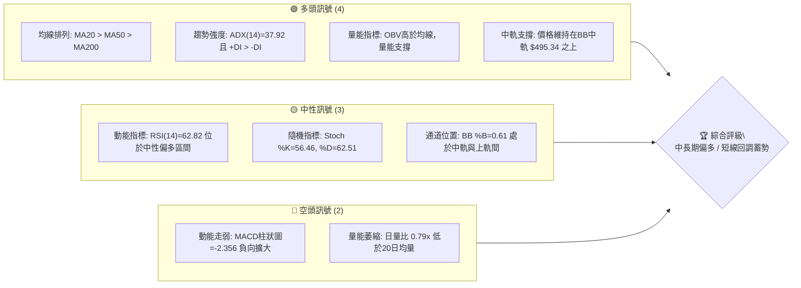
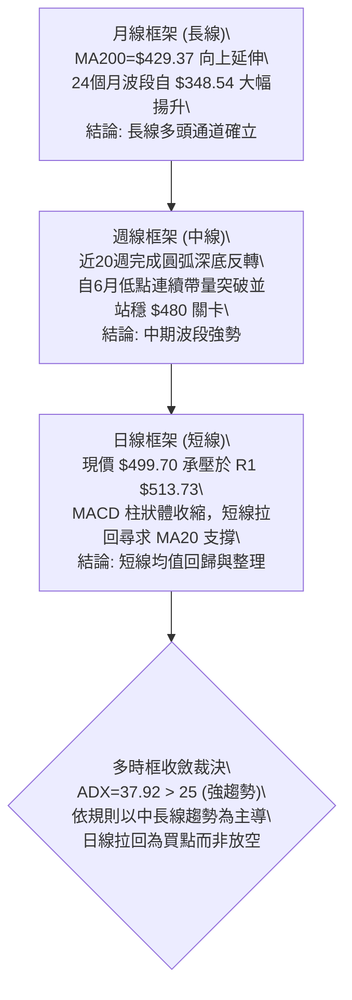
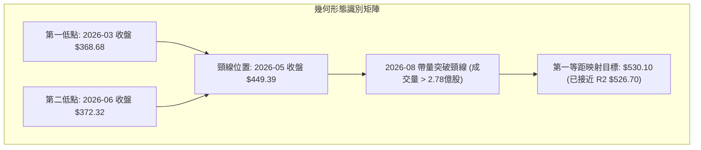
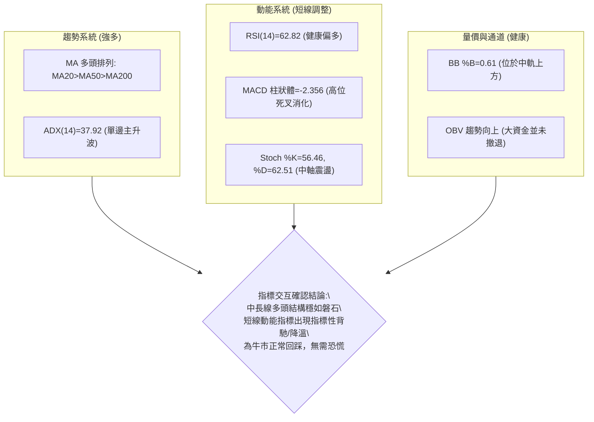
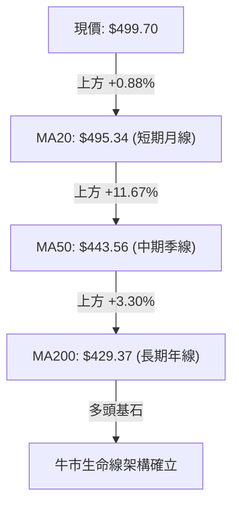
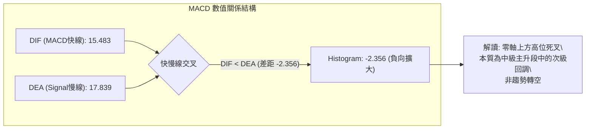
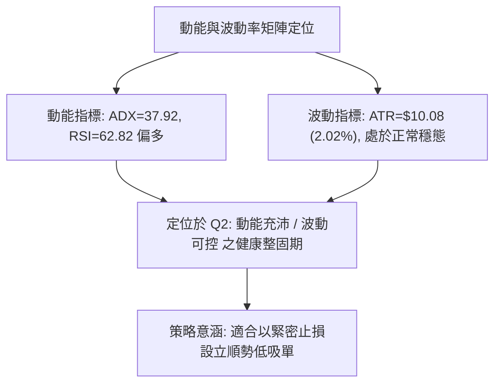
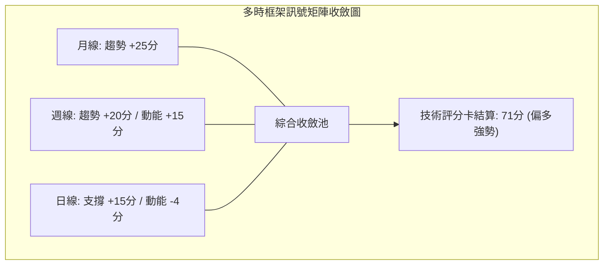
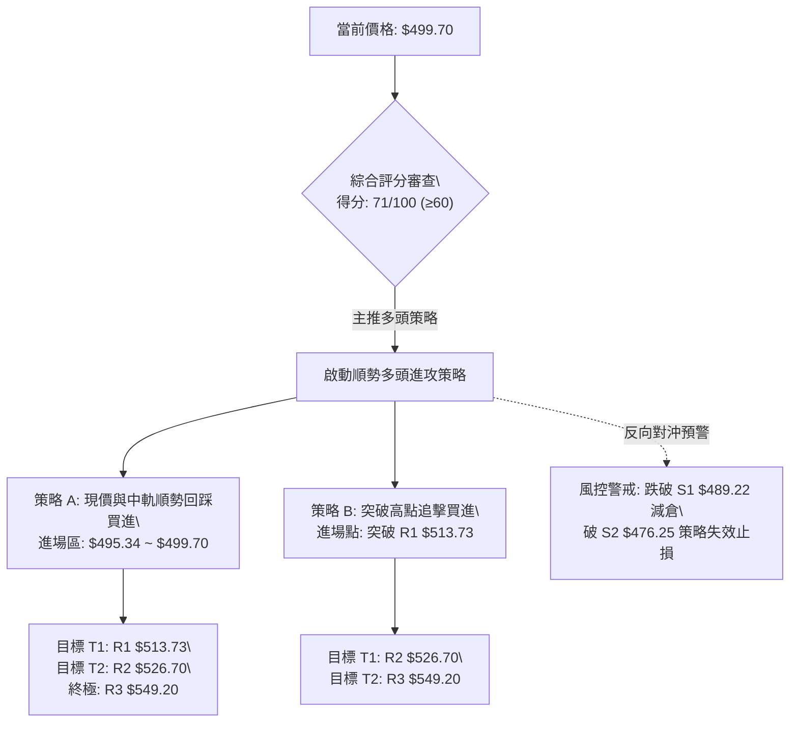
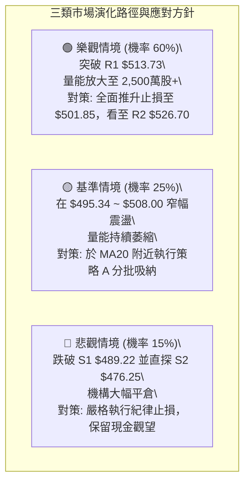

# MSFT 技術分析報告

> **報告日期**：2026-09-08 ｜ **語言**：繁體中文 ｜ **數據來源**：Yahoo Finance ｜ **當前價格**：$499.70

---

## 目錄

| 章節 | 內容 |
|------|------|
| [1. 技術面概覽](#1-技術面概覽) | 訊號儀表板、核心指標、評分卡 |
| [2. 趨勢分析](#2-趨勢分析) | 多時框趨勢、長中短期走勢、ADX強度 |
| [3. 圖表形態分析](#3-圖表形態分析) | 形態識別、K線組合、目標價推算 |
| [4. 支撐與阻力](#4-支撐與阻力) | 關鍵價位、斐波那契回調結構 |
| [5. 技術指標深度解讀](#5-技術指標深度解讀) | MA/RSI/MACD/布林通道/量價配合 |
| [6. 動能與波動率](#6-動能與波動率) | 動能四象限、ATR風控、Beta分析 |
| [7. 多時框架總結](#7-多時框架總結) | 時框架矩陣、訊號收斂規則裁決 |
| [8. 交易策略建議](#8-交易策略建議) | 策略路由、情境階梯、主策略詳情 |
| [9. 風險提示與監控](#9-風險提示與監控) | 關鍵指標清單、情境推演、風控紀律 |
| [報告總結](#-報告總結) | 核心要點速覽與終審結論 |

---

## 1. 技術面概覽

### 🎯 技術訊號儀表板

微軟公司（MSFT）當前報價為 $499.70。整體盤面處於中長期多頭格局下的短線均值回歸與動能整理階段。



### 📊 核心指標速覽表

| 指標類別 | 指標名稱 | 當前數值 | 訊號 | 解讀 |
|:---|:---|:---|:---:|:---|
| **價格** | 當前收盤價 | $499.70 | 🟢 | 位於52週區間 75.3% 高位階，多頭防線穩固 |
| **均線** | MA20 (月線) | $495.34 | 🟢 | 價格在MA20之上（+0.88%），短線回踩確認支撐有效 |
| **均線** | MA50 (季線) | $443.56 | 🟢 | 價格遠在MA50之上（+12.66%），中期上升趨勢未改 |
| **均線** | MA200 (年線)| $429.37 | 🟢 | 價格在MA200之上（+16.38%），長期牛市基石確立 |
| **動能** | RSI(14) | 62.82 | 🟡 | 位於50-70強勢區間但未進入超買，且無背離特徵 |
| **動能** | MACD (12,26,9) | 15.483 / 17.839 | 🔴 | MACD線位於訊號線下方，柱狀圖 -2.356，動能死叉回調中 |
| **趨勢** | ADX (14) | 37.92 | 🟢 | ADX > 25 且 +DI(37.09) 遠高於 -DI(15.73)，強趨勢多頭行情 |
| **波動** | ATR(14) | $10.08 | 🟡 | 佔價格 2.02%，波動度適中，有利於設立理性止損位 |
| **通道** | 布林帶 %B | 0.61 | 🟡 | 上下軌為 $516.08 / $474.60，位於強弱分界線中軌偏上 |
| **成交量** | 20日量比 | 0.79x | 🔴 | 1,807萬股低於均量2,299萬股，多頭攻勢呈現縮量整理 |

### 🏆 技術評分卡

```
╔══════════════════════════════════════════════════════════════╗
║              技術評分卡 — MSFT (2026-09-08)                  ║
╠══════════════════════════════════════════════════════════════╣
║ 趨勢強度 (ADX/+DI)    ████████████████░░░░  82/100  🟢 強勁多頭 ║
║ 均線系統排列          ██████████████████░░  90/100  🟢 完全多頭 ║
║ 支撐穩定度 (S1/Fib)   ██████████████░░░░░░  72/100  🟢 結構紮實 ║
║ 動能指標 (RSI/MACD)   ██████████░░░░░░░░░░  52/100  🟡 死叉回踩 ║
║ 成交量配合度 (OBV/VOL)████████████░░░░░░░░  60/100  🟡 縮量整理 ║
║ 圖表形態完整度        ██████████████░░░░░░  70/100  🟢 圓弧底形 ║
╠══════════════════════════════════════════════════════════════╣
║ 綜合評分              ██████████████░░░░░░  71/100  🟢 偏多進攻 ║
╚══════════════════════════════════════════════════════════════╝
```

---

## 2. 趨勢分析

### 🌐 多時框趨勢分析



### 📈 長期趨勢 — 12個月走勢圖（Unicode）

微軟過去 12 個月（2025-09 至 2026-09）經歷了「自高點回落打底、打出年度雙底、隨後噴發突破」的宏大結構：

```
MSFT 月線走勢圖（過去12個月收盤價軌跡）
價格軸 ($)
$520 ┤    ●(2025-09: 513.72)                                          ●(2026-08: 507.29)
$500 ┤         ●(2025-10: 513.58)                                           ●(現價: 499.70)
$480 ┤              ●(2025-11: 488.91)
$460 ┤                   ●(2025-12: 480.57)                      ●(2026-07: 463.85)
$440 ┤                                                 ●(2026-05: 449.39)
$420 ┤                        ●(2026-01: 427.58)
$400 ┤                             ●(2026-02: 391.15)       ●(2026-04: 406.13)
$380 ┤                                                 ●(2026-06: 372.32: 次低)
$360 ┤                                  ●(2026-03: 368.68: 波段底)
     └─────────────────────────────────────────────────────────────────────────────►
        25-09  25-10  25-11  25-12  26-01  26-02  26-03  26-04  26-05  26-06  26-07  26-08  26-09
```

**走勢特徵分析表格**：

| 階段區間 | 時間跨度 | 價格起訖 | 漲跌幅 | 波段特徵與量價解讀 |
|:---|:---:|:---:|:---:|:---|
| **高位派發回落** | 2025-09 ~ 2026-03 | $513.72 → $368.68 | -28.23% | 長達半年陰跌，跌破多條中期均線，並於 $368.68 尋獲年度底部。 |
| **春季初升回踩** | 2026-03 ~ 2026-06 | $368.68 → $372.32 | +0.99% | 4-5月反彈至 $449.39 後遭空頭二次打壓，6月回落至 $372.32 構築扎實雙重底。 |
| **主升浪突破** | 2026-06 ~ 2026-08 | $372.32 → $507.29 | +36.25% | 7-8月爆發巨量攻擊，單月狂飆，相繼修復 MA50 與 MA20，直撲前高。 |
| **高位強勢震盪** | 2026-08 ~ 2026-09 | $507.29 → $499.70 | -1.50% | 於 $500 關卡附近換手，技術面指標修復超買，屬於強勢整理。 |

### 📊 中期趨勢（週線分析）

從近 20 週數據來看，MSFT 在 2026-06-28 當週爆出 382,709,200 股的天量，收在 $372.27，RSI 觸及 31.3 極端超賣區，形成空頭力竭的「爆量出清底」（Selling Climax）。
隨後於 2026-08-02 當週帶出 278,439,400 股巨量推升，收盤大漲至 $463.85，MACD 柱狀體翻正至 +7.446。
最近 3 週週成交量自 1.22 億萎縮至 1.05 億股，收盤維持在 $499.70，顯示多頭在高位進行「量縮強勢洗盤」，下方買盤於 $489.22 (S1) 展現強韌承接力。

### ⚡ 趨勢強度評估（ADX 解讀）

```mermaid
graph LR
    subgraph ADX_LOGIC ["ADX (14) 趨勢強度判定架構"]
        V1["ADX 數值 = 37.92\\n(標準: > 25 即為強趨勢行情)"] --> V2["趨勢屬性: 典型單邊波段強趨勢"]
        D1["+DI = 37.09"] --> D_COMP{"方向指標判定"}
        D2["-DI = 15.73"] --> D_COMP
        D_COMP -->|"+DI 顯著超越 -DI (+21.36)| DIR["多頭具有壓倒性控制權"]
    end
    V2 --> FINAL["綜合結論: 當前拒絕逆勢摸頂放空，操作嚴格遵循順勢拉回做多"]
    DIR --> FINAL
```

**ADX 趨勢強度對照判定表**：

| 指標變數 | 當前讀數 | 門檻區間 | 趨勢判定 | 操作指引 |
|:---|:---:|:---:|:---:|:---|
| **ADX(14)** | **37.92** | > 25 (強趨勢) | 處於強勁主升趨勢中 | 禁止使用盤整震盪逆勢指標，均線策略權重置頂 |
| **+DI(14)** | **37.09** | 多頭臨界 > 25 | 買方動能極強 | 多頭攻擊波段具備充足能量 |
| **-DI(14)** | **15.73** | 空頭壓制 < 20 | 空方壓制力極微 | 空方僅能依賴短線獲利了結盤造成暫時回調 |

---

## 3. 圖表形態分析

### 🔍 形態識別系統

在日線與週線結構中，MSFT 展現出顯著的大型「雙重底（W底）」反轉後的高位「多頭旗形」整理形態：



**形態信心度與目標價評估表**：

| 形態類別 | 信心度 | 判斷依據（引用真實數據） | 完成度 | 目標價（附嚴謹計算式） |
|:---|:---:|:---|:---:|:---|
| **大型雙底 (W-Bottom)** | **85%** | 兩次底部出現在 2026-03 ($368.68) 與 2026-06 ($372.32)，價差僅 0.98%，頸線位於 2026-05 之 $449.39，8月巨量突破。 | 100% (已突破) | **$530.10**<br>計算式：頸線 $449.39 + 形態高度 ($449.39 - $368.68 = $80.71) = $530.10（極為貼近阻力聚類 R2: $526.70） |
| **高位多頭旗形 (Bull Flag)** | **65%** | 8月中旬攻至 $513.53 後，連續 3 週窄幅量縮震盪（$483.24~$513.53），回踩 MA20 ($495.34) 獲得支撐。 | 70% (震盪中) | **$549.20**<br>計算式：突破旗面高點後，映射前期旗桿漲幅，直接指向 52W 高點聚類 R3: $549.20 |
| **頭肩底 (Inverted H&S)** | **30%** | 左肩 $406.13、頭部 $368.68、右肩 $372.32 不對稱性過高。 | 0% | *訊號不足，信心度低於50%，不採納為定價依據。* |

### 🕯️ 重要K線形態分析

| 週期/月份 | 收盤價 | K線形態 | 量價深度解讀 | 技術訊號 |
|:---:|:---:|:---|:---|:---:|
| **2026-06** | $372.32 | 爆量長下影錘頭線 | 單週爆出 3.82 億股歷史天量，下影線長且未破前低，機構恐慌盤被全數接走。 | 🟢 強力轉折 |
| **2026-07** | $463.85 | 突破長紅大陽線 | 單月飆升 91.53 美元，實體大陽線收復季線，突破空頭下行趨勢線。 | 🟢 多頭表態 |
| **2026-08** | $507.29 | 高位小陽星線 | 盤中觸及高位後遇前高阻力，但回吐幅度極小，呈現強勢抗跌特徵。 | 🟡 高位分歧 |
| **2026-09** | $499.70 | 窄幅十字回踩線 | 價格回踩 MA20 ($495.34) 與 Fib 23.6% ($501.85)，量能明顯縮小，屬於健康洗盤。 | 🟢 支撐測試 |

### 📉 ASCII 走勢形態示意圖

```
MSFT 日線/週線 雙底與旗形突破形態幾何圖形
價格 ($)
$549.20 ┤                                                    [52W 高點 / R3]
$526.70 ┤                                            ╭─► [雙底等距目標 $530.10 / R2]
$513.73 ┤                              ▲ R1 (近期頂點)
        │                             ╱ ╲  旗形整理
$499.70 ┤現價 ───────────────────────┼───●◄ (回踩 MA20: $495.34 / Fib 23.6%: $501.85)
$476.25 ┤                           ╱     ╲
$449.39 ┤      頸線 (Neckline) ────▲───────┴─────────────── [S2: $476.25 強支撐防線]
        │                         ╱ ╲
$400.00 ┤                        ╱   ╲
$368.68 ┤  【底 1】             ╱     ╲       【底 2】
$348.54 ┴─────●─────────────────┘       └─────────●────────────── [52W 低點 $348.54]
            2026-03                           2026-06
```

---

## 4. 支撐與阻力

### 🗺️ 關鍵價位分布圖（Unicode）

本分析所引用的所有支撐位、阻力位及斐波那契回調位，皆嚴格取自系統經由 OHLCV 波段高低點聚類演算法得出的真實數據：

```
MSFT 價位結構分布圖
═══════════════════════════════════════════════════════════════════
$549.20 ║████████████████████████████████████║ 強阻力 R3 / 52週最高價 (+9.91%)
$526.70 ║████████████████████████            ║ 阻力位 R2 / 波段推升目標 (+5.40%)
$513.73 ║████████████████                    ║ 關鍵阻力 R1 / 前波阻力峰值 (+2.81%)
$501.85 ╟────────────────────────────────────╢ 斐波那契 23.6% 回調位
$499.70 ╠════════════════════════════════════╣ ◄ 現價 ($499.70)
$495.34 ╟┄┄┄┄┄┄┄┄┄┄┄┄┄┄┄┄┄┄┄┄┄┄┄┄┄┄┄┄┄┄┄┄╢ BB中軌 / MA20 動態支撐
$489.22 ║▓▓▓▓▓▓▓▓▓▓▓▓▓▓▓▓                    ║ 近期波段支撐 S1 (-2.10%)
$476.25 ║▓▓▓▓▓▓▓▓▓▓▓▓▓▓▓▓▓▓▓▓▓▓▓▓            ║ 強支撐 S2 / 布林下軌區間 (-4.69%)
$465.47 ║▓▓▓▓▓▓▓▓▓▓▓▓▓▓▓▓▓▓▓▓▓▓▓▓▓▓▓▓▓▓        ║ 關鍵底限 S3 / 多頭生命線 (-6.85%)
═══════════════════════════════════════════════════════════════════
```

### 🚧 阻力位分析表

| 阻力級別 | 具體價位 | 距現價空間 | 形成原因與籌碼分佈 | 突破難度 | 重要性權重 |
|:---:|:---:|:---:|:---|:---:|:---:|
| **R1** | **$513.73** | +2.81% | 2026-08-30 波段高點與近一年高點密集成交聚類，上方短線套牢盤換手點。 | 中等 | 🟡 關鍵反轉點 |
| **R2** | **$526.70** | +5.40% | 2025-07 次高點籌碼密集區，亦為雙底等距測幅 $530.10 的核心阻力緩衝區。 | 較高 | 🟢 波段主目標 |
| **R3** | **$549.20** | +9.91% | 52 週最高價，歷史極端估值與天花板心理關卡，巨型解套與獲利了結賣壓點。 | 極高 | 🔴 終極天花板 |

### 🛡️ 支撐位分析表

| 支撐級別 | 具體價位 | 距現價空間 | 形成原因與籌碼分佈 | 守住機率 | 重要性權重 |
|:---:|:---:|:---:|:---|:---:|:---:|
| **S1** | **$489.22** | -2.10% | 2026-08-23 週線低點聚類，與 MA20 ($495.34) 構成多頭第一道緩衝防線。 | 75% | 🟢 短線防禦點 |
| **S2** | **$476.25** | -4.69% | 近一年波段強支撐密集區，與日線布林下軌 ($474.60) 及 Fib 38.2% ($472.55) 重疊。 | 85% | 🟢 中期強支撐 |
| **S3** | **$465.47** | -6.85% | 2026-07 突破長紅大陽線之實體上沿，跌破則宣告中級反彈波段終結。 | 95% | 🔴 趨勢分水嶺 |

### 📐 斐波那契回調位分析

依據 52 週極值區間（低點 $348.54 至 高點 $549.20，總垂直波幅 $200.66）計算之黃金分割水準解析如下：


- **當前位置定位**：現價 **$499.70** 正處於 **23.6% ($501.85)** 與 **38.2% ($472.55)** 回調區間內，距離 23.6% 僅差 $2.15。
- **技術意義解讀**：強勢多頭行情通常回調不會觸碰 38.2%（$472.55），而會在 23.6%（$501.85）至 MA20（$495.34）之間完成洗盤。微軟目前緊貼 23.6% 線下緣震盪，顯示回調極為淺層，多頭籌碼鎖定良好，具備蓄勢再攻 R1 ($513.73) 的充沛動力。

---

## 5. 技術指標深度解讀

### 🎛️ 指標訊號總覽



### 📈 移動平均線排列分析

微軟均線系統展現出標竿級的「完全多頭排列」格局：



- **短期乖離修正**：MA5 日線為 $502.99（-0.65%）、MA10 日線為 $500.89（-0.24%），微軟收盤價 $499.70 略低於 5 日與 10 日線，說明短線動能放緩，市場在此進行微幅均值回歸。
- **中長期引力支撐**：MA20（$495.34）、MA60（$432.73）、MA120（$418.31）、MA240（$443.10）呈現向上發散狀態，長期均線支撐帶極為堅實，空頭難以撼動大級別升勢。

### 📉 RSI(14) 分析

當前 RSI(14) 數值為 **62.82**：

```
RSI(14) 強度儀標尺：
[0 ────── 30 ───────────── 50 ────────── 62.82 ──── 70 ────── 100]
 超賣區間       弱勢區間        多空平衡      ▲當前    超買警示區
                                         ████████████░░░░░░░░ 62.8%
```

- **背離分析**：
  回顧 2026-08-16 當週，價格來到 $494.47，週 RSI 達到 84.8；隨後 2026-08-30 價格創下波段新高 $513.53，RSI 回落至 55.8，短線出現指標降溫現象。但日線層面上，價格自 $513.53 拉回至 $499.70，RSI 穩定維持在 62.82 的偏多中性水準，**並無惡性頂背離（Bearish Divergence）**，屬於在超買線下方的健康冷卻。

### 📊 MACD(12,26,9) 訊號解讀



MACD 快線（15.483）與慢線（17.839）皆遠高於零軸（Zero Line），確認市場身處極強的長線牛市環境。雖然當前柱狀體為 **-2.356**（呈現紅色空頭訊號），但這僅代表自 8 月初以來的爆發性拉升告一段落，動能指標進入技術性整固期。

### 📦 布林通道分析

```
MSFT 日線布林通道 (20, 2) 結構分布圖
價格 ($)
$516.08 ┤═══════════════════════════════════════ 上軌 (Upper Band)
        │
$505.00 ┤
$499.70 ┤─────────●◄ 現價 ($499.70, %B = 0.61)
$495.34 ┤─────────────────────────────────────── 中軌 (MA20 基線)
        │
$485.00 ┤
$474.60 ┤═══════════════════════════════════════ 下軌 (Lower Band)
```

- **通道帶寬與形態**：布林上軌為 $516.08，下軌為 $474.60，帶寬達 $41.48。目前通道口維持擴張後的微幅收斂態勢。
- **%B 指標解讀**：當前 **%B = 0.61**，明確處於 0.50（中軌）至 1.00（上軌）的多頭控制區。現價回踩中軌 $495.34 未破，形成標準的「布林帶中軌支撐彈升」架構。

### 💹 成交量分析（量價配合度）

- **量比與均量檢視**：最新單日成交量為 18,074,400 股，相較於 20 日均量 22,996,395 股，量比僅為 **0.79x**，相較於 50 日均量（35,466,346 股）更是腰斬。
- **量價背離診斷**：微軟在創出 $513.53 高點後的拉回過程中，成交量顯著萎縮（「價跌量縮」），這與空頭主動出貨引發的「放量下殺」有著本質區別。
- **OBV（能量潮）指針**：數據顯示 **OBV > MA**，能量潮均線持續上行，說明大資金與機構籌碼在 6-7 月低檔建倉後，籌碼沉澱度極高，縮量拉回表明籌碼並無渙散跡象。

---

## 6. 動能與波動率

### ⚡ 動能評估四象限

評估 MSFT 目前在動能與波動率維度中的坐標位置：

| 象限標識 | 動能屬性 | 波動特徵 | 代表狀態 | MSFT 判定定位 | 技術意義與指引 |
|:---:|:---:|:---:|:---:|:---:|:---|
| **Q1** | **強動能** | **低波動** | 穩定主升波 | ── | 最佳波段持股區間 |
| **Q2** | **中/強動能** | **低/中波動** | **整固蓄勢** | **✓ (當前狀態)** | **RSI=62.82 偏強，ATR 僅 2.02%，屬於高位低波動良性洗盤** |
| **Q3** | 強動能 | 高波動 | 暴跌/暴漲爆發 | ── | 突破初期或洗盤加劇 |
| **Q4** | 弱動能 | 高波動 | 派發潰敗 | ── | 風險極高，嚴禁持有 |



### 📊 ATR 波動率分析

當前微軟的 14 日平均真實波幅 **ATR(14) 為 $10.08**，佔當前股價的 **2.02%**：
- **市場波動狀態**：日均波幅約 10 美元，顯示市場情緒極其理性，並未出現極端非理性投機狂熱。
- **技術止損距離配置**：
  - **短線交易（1.0 × ATR）**：建議止損距離為 $10.08，若以現價進場，短線動態保護點設於 $489.62。
  - **波段交易（1.5 ~ 2.0 × ATR）**：建議止損距離為 $15.12 ~ $20.16，防守點對應於 $484.58 ~ $479.54，該區間剛好覆蓋支撐位 S1 ($489.22) 並逼近 S2 ($476.25)。

### 📐 Beta 與市場相關性

- **Beta 係數**：**1.108**。微軟具備略高於標普 500 指數的波動敏銳度（高出約 10.8%）。
- **市場聯動特徵**：在科技權值股主導的多頭行情中，MSFT 具有良好的指數貝塔放大效應，機構資金持股比例高達 **75.9%**，籌碼穩定度極佳，短線空頭部位（Short Float 僅 0.9%，Short Ratio 1.85）幾乎無軋空或被軋的極端風險，股價運行高度遵循技術線型。

---

## 7. 多時框架總結

### 📋 時框架評分表

| 時框架 | 趨勢方向 | 動能狀態 | 均線排列 | 關鍵形態 | 綜合評分 | 操作指引 |
|:---:|:---:|:---:|:---:|:---:|:---:|:---|
| **長期 (月線)** | 🟢 多頭主導 | 🟢 強勁向上 | 🟢 完全多頭 | 24個月大型V/W複合底部突破 | **88 / 100** | 核心長線多單抱緊，長線看多 |
| **中期 (週線)** | 🟢 震盪走高 | 🟡 柱狀降溫 | 🟢 MA20>MA50 | 雙底突破後旗形震盪整理 | **75 / 100** | 依賴支撐分批低吸，順勢加碼 |
| **短期 (日線)** | 🟡 均值回歸 | 🔴 MACD死叉 | 🟢 守住MA20 | 觸碰 R1 回踩布林帶中軌 | **62 / 100** | 避免追高，等待 $495 附近確認點 |

### 🔲 綜合訊號矩陣



### ⚖️ 多時框收斂結論

> **嚴格遵循多時框收斂規則裁決**：
> 1. **趨勢判定**：當前 ADX(14) 讀數為 **37.92**，遠超 25 臨界線，技術面明確處於**「典型趨勢行情」**，絕非無方向之盤整行情。
> 2. **主導層級收斂**：依據規則，趨勢行情下必須**「以中長期（週線/MA50、MA200）方向為主，日線只用來尋找進場時機」**。日線層面的 MACD 柱狀體收縮（-2.356）與成交量萎縮，僅為上攻過程中的短線動能蓄勢，不得作為反手做空的依據。
> 3. **唯一方向性結論**：**偏多進攻（逢拉回買進）**。本裁決與第 1 章（綜合評分 71/100）、第 2 章（多頭排列）及第 5 章（指標深度分析）保持高度邏輯一致。

---

## 8. 交易策略建議

### 🗺️ 策略決策流程圖



### 🧭 策略路由（依評分卡分流）

**當前主策略方向 = 【偏多進攻 — 順勢拉回佈局】（依技術評分卡 71/100 分流判定）**

綜合技術評分 71 分大於 60 分門檻，嚴格杜絕兩頭下注。本報告主推**兩套多頭進攻策略**；空方部分僅作為投資人持有多單時的「反轉風險觸發點與動態對沖保護指引」。

### 🎯 價格情境階梯（Price Scenarios）

本情境階梯所使用之價位，嚴格取自第 4 章由 OHLCV 演算法計算出之關鍵價位：

| 觸發條件 | 下一目標 | 後續延伸 | 情境含義與操作對策 |
|:---|:---:|:---:|:---|
| **向上突破 R1 ($513.73)** | **R2 ($526.70)** | **R3 ($549.20)** | **短線突破轉強**：確認旗形整理結束，主升浪重啟，空頭防線崩潰，全面加碼。 |
| **守住 MA20 ($495.34) ~ 現價** | **R1 ($513.73)** | **R2 ($526.70)** | **強勢區間蓄勢**：於布林中軌上方完成均值回歸，浮額洗淨，為最理想波段上車點。 |
| **有效跌破 S1 ($489.22)** | **S2 ($476.25)** | **S3 ($465.47)** | **中期回調擴大**：跌破近期低點聚類，日線級別走弱，多單應即刻降槓桿與減倉。 |

### 📊 情境機率分佈

| 預期情境走向 | 機率預估 | 主要指標支撐依據 |
|:---|:---:|:---|
| **主升重啟 / 突破上行** | **60%** | ADX=37.92 強多頭主導；均線完全多頭排列；OBV 大資金未離場；週線深底支撐強。 |
| **窄幅震盪 / 區間洗盤** | **25%** | 布林通道帶寬收窄；日線成交量縮減（量比 0.79x）；MACD 柱狀體處於修復期。 |
| **深度回調 / 破位探底** | **15%** | 僅於大盤突發系統性風險或跌破 S1 ($489.22) 連鎖觸發停損時發生。 |

### 🟢 主策略詳情（精確量化）

```
╔══════════════════════════════════════════════════════════════════════════╗
║                     MSFT 核心多頭交易策略規格表                          ║
╠══════════════════════╦═════════════════════════╦═════════════════════════╣
║ 策略維度             ║ 策略 A（回踩 MA20 穩健型）║ 策略 B（突破 R1 追擊型） ║
╠══════════════════════╬═════════════════════════╬═════════════════════════╣
║ **進場條件**         ║ 現價至 MA20 區間分批承接║ 帶量實體大陽線突破 R1   ║
║ **進場價格**         ║ **$495.50** (貼近MA20)  ║ **$514.50** (確認突穿R1)║
║ **止損價格 (SL)**    ║ **$488.50** (嚴守S1線下)║ **$501.00** (回踩Fib防守║
║ **第一目標價 (T1)**  ║ **$513.73** (測試R1高點)║ **$526.70** (直指R2聚類)║
║ **第二目標價 (T2)**  ║ **$526.70** (抵達R2阻力)║ **$549.20** (挑戰52W高點║
╠══════════════════════╬═════════════════════════╬═════════════════════════╣
║ **風報比 (R:R - T1)**║ **1 : 2.60**            ║ **1 : 0.90**            ║
║ **風報比 (R:R - T2)**║ **1 : 4.46**            ║ **1 : 2.57**            ║
║ **勝率評估**         ║ **68%**                 ║ **62%**                 ║
║ **建議配置倉位**     ║ **15% ~ 20%**           ║ **10% ~ 15%**           ║
╚══════════════════════╩═════════════════════════╩═════════════════════════╝
```

*註：策略 A 風報比計算：進場 $495.50，止損 $488.50（風險 $7.00）。T1 獲利 $18.23（R:R=2.60）；T2 獲利 $31.20（R:R=4.46）。極具非對稱獲利優勢。*

### 🔴 反向風險觸發點（對沖提示）

- **第一警戒防線（減倉觀望）**：日線收盤價跌破 **S1 ($489.22)**。若此線失守，代表近期波段低點告破，短多應減碼 50% 倉位。
- **波段多頭失效點（全數止損/空頭對沖）**：跌破 **S2 ($476.25)**。此處為日線布林下軌與強支撐聚類，一旦帶量跌破，將引發雙底頸線回測，多頭架構破壞，應立即平倉多單或買入看跌期權（Put Option）進行資產對沖。

### ⭐ 整體訊號強度評星

```
做多訊號強度：★★★★☆  (4/5星 — 均線與趨勢極強，唯短線動能修復中)
做空訊號強度：★☆☆☆☆  (1/5星 — 逆勢放空風險極高，盈虧比極劣)
整體可信度：  ★★★★☆  (4/5星 — 多時框訊號一致收斂於牛市回踩)
```

---

## 9. 風險提示與監控

### ✅ 關鍵監控指標 Checklist

```
╔══════════════════════════════════════════════════════════════════╗
║                   MSFT 交易日風控監控清單 (Checklist)             ║
╠══════════════════════════════════════════════════════════════════╣
║ [ ] 價格是否跌破動態生命線 MA20 ($495.34)？                      ║
║ [ ] RSI(14) 是否跌破 50 多空分水嶺（當前 62.82）？               ║
║ [ ] MACD 柱狀體負值是否超過 -4.00 呈現空頭加速？                 ║
║ [ ] 日成交量若跌破 S1 ($489.22) 時是否異常放大至 3,000 萬股以上？ ║
║ [ ] +DI 是否下穿 -DI 發生多空趨勢異位（當前差值 +21.36）？       ║
║ [ ] 布林通道帶寬是否發生向下異常開口破下軌 ($474.60)？           ║
╚══════════════════════════════════════════════════════════════════╝
```

### ⚠️ 風險場景分析



### 🛡️ 風險管理重要提醒

1. **ATR 動態部位管理**：微軟目前 ATR 為 $10.08，若單筆交易帳戶最大承擔風險設定為總資金的 1.5%，單筆停損金額為 $7.00（策略 A），則最大持倉股數上限應嚴格受控於公式：`最大股數 = (帳戶淨值 × 1.5%) ÷ $7.00`。
2. **財報與宏觀事件隔離**：雖然技術面維持偏多，但必須密切關注美國大型科技股估值波動及聯準會利率動向對高 Beta 股的系統性外溢風險。
3. **拒絕逆勢摸頂**：ADX 高達 37.92，在強趨勢市場中，任何孤立的超買訊號或阻力位都可能被強行穿透，嚴禁任何無保護的主觀放空操作。

---

## 📋 報告總結

```
╔══════════════════════════════════════════════════════════════════╗
║                   MSFT 技術分析報告終審總結                     ║
╠══════════════════════════════════════════════════════════════════╣
║ 報告日期：2026-09-08                                             ║
║ 當前價格：$499.70                                                ║
║ 技術評級：🟢 偏多進攻（71/100）— 強趨勢單邊多頭中的良性回踩       ║
╠══════════════════════════════════════════════════════════════════╣
║ 關鍵結論：                                                       ║
║ ├─ 長期趨勢：🟢 強烈看多（月線完全多頭，MA200=$429.37 向上發散）  ║
║ ├─ 中期趨勢：🟢 偏多主升（週線完成巨型雙底，旗形突破進行中）    ║
║ ├─ 短期趨勢：🟡 均值回歸（日線承壓於 R1 $513.73，尋求 MA20 支撐）║
║ ├─ 關鍵支撐：S1: $489.22 │ S2: $476.25 │ S3: $465.47            ║
║ ├─ 關鍵阻力：R1: $513.73 │ R2: $526.70 │ R3: $549.20            ║
║ └─ 斐波那契：現價緊扣 23.6% ($501.85) 回調位，淺層洗盤特徵明確   ║
╠══════════════════════════════════════════════════════════════════╣
║ 最優策略配置：                                                   ║
║ 1. 🥇 首選機會：執行【策略 A】於 $495.50 回踩 MA20 佈局多單，    ║
║                 止損設於 $488.50，目標直指 $513.73 與 $526.70。  ║
║ 2. 🥈 次選機會：若多頭強勁放量突穿 R1，執行【策略 B】追擊買進，  ║
║                 挑戰 52 週歷史高位 $549.20。                     ║
║ 3. 🥉 防守戒線：若收盤實體跌破 S1 ($489.22)，短多必須無條件減碼。║
╚══════════════════════════════════════════════════════════════════╝
```

---

> ⚠️ **免責聲明**：本報告為依據金融市場量化數據生成之專業技術分析報告，所有價位聚類、指標解讀與模型推演均基於客觀歷史交易資訊。本報告**僅供研究、學術討論與投資決策參考**，**不構成任何要約、推薦或保證收益之投資建議**。市場有風險，交易操作務必嚴格設定停損並自行承擔相應風險。

---

*報告生成時間：2026-09-08 ｜ 數據來源：Yahoo Finance ｜ 分析框架：多時框技術分析體系（MTFA）*