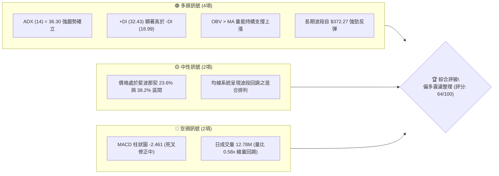
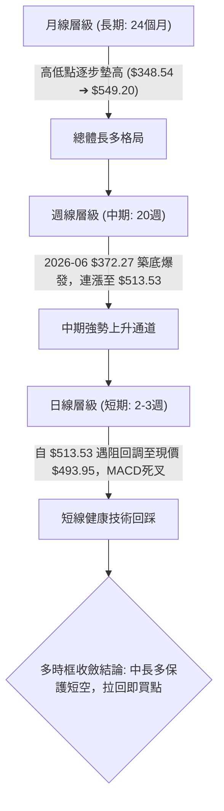
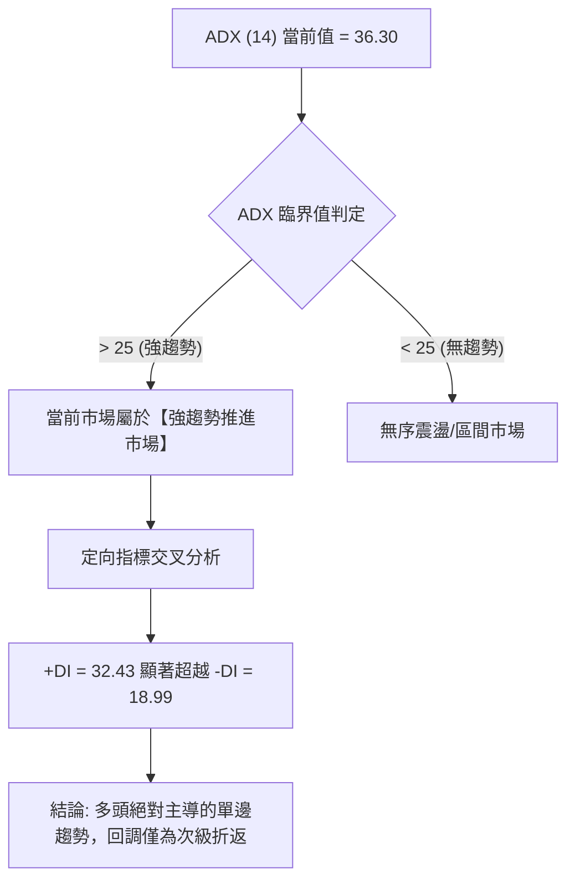
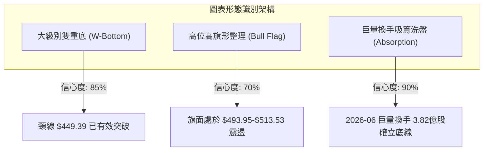
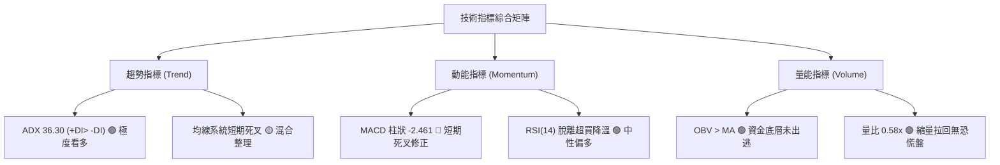
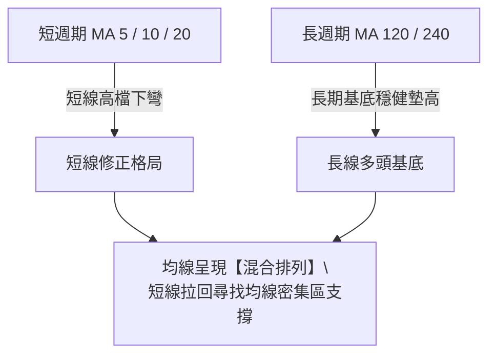
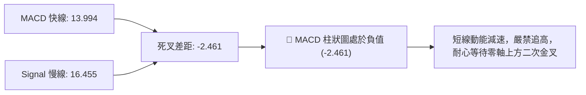
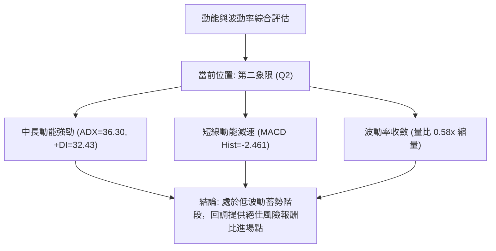
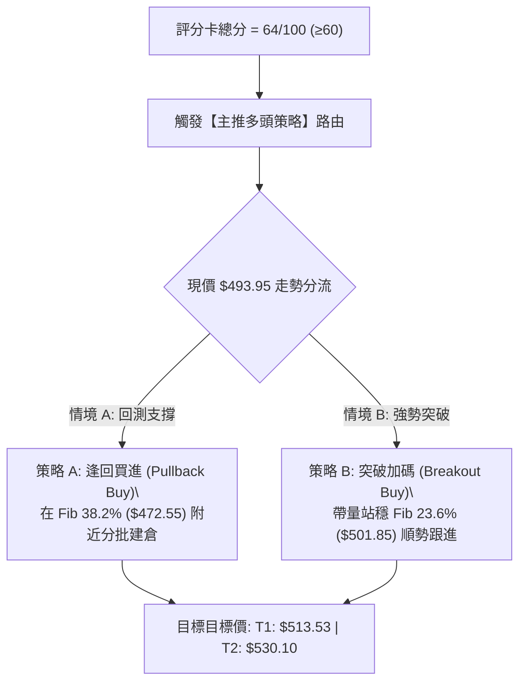
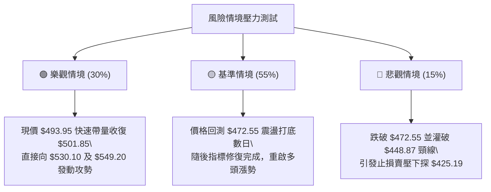

# MSFT 技術分析報告

> **報告日期**：2026-09-10 ｜ **語言**：繁體中文 ｜ **數據來源**：Yahoo Finance ｜ **當前價格**：$493.95

---

## 目錄

| 章節 | 內容 |
|------|------|
| [1. 技術面概覽](#1-技術面概覽) | 訊號儀表板、核心指標、評分卡 |
| [2. 趨勢分析](#2-趨勢分析) | 多時框趨勢、長中短期走勢、ADX強趨勢解讀 |
| [3. 圖表形態分析](#3-圖表形態分析) | 形態識別與信心度、K線組合、目標價推算 |
| [4. 支撐與阻力](#4-支撐與阻力) | 關鍵價位結構圖、斐波那契回調深度分析 |
| [5. 技術指標深度解讀](#5-技術指標深度解讀) | MA/RSI/MACD/布林通道/OBV量價配合 |
| [6. 動能與波動率](#6-動能與波動率) | 動能四象限、ATR波動分析、Beta市場敏感度 |
| [7. 多時框架總結](#7-多時框架總結) | 時框架矩陣、規則14多時框收斂判定 |
| [8. 交易策略建議](#8-交易策略建議) | 評分路由策略、價格情境階梯、風報比精算 |
| [9. 風險提示與監控](#9-風險提示與監控) | 關鍵監控Checklist、三情境壓力測試、風控規則 |
| [10. 報告總結](#-報告總結) | 核心總結儀表板、最優交易策略組合 |

---

## 1. 技術面概覽

### 🎯 技術訊號儀表板



### 📊 核心指標速覽表

| 指標類別 | 指標名稱 | 當前數值 | 訊號 | 解讀 |
|----------|----------|----------|:----:|------|
| **價格** | 當前收盤價 | $493.95 | 🟡 | 位於52週高點($549.20)與低點($348.54)相對高位(72.4%) |
| **均線** | 短中期均線 | 混合排列 | 🟡 | 短線出現高檔拉回，但中期基底自 7 月強勢翻揚 |
| **動能** | RSI(14) | 62.8 (前週) | 🟢 | 脫離超買區回到健康多頭動能區間 (55–65) |
| **動能** | MACD (12,26,9) | 13.994 | 🟢 | 快慢線維持於零軸上方強勢多頭領域 |
| **動能** | MACD Signal / Hist | 16.455 / -2.461 | 🔴 | 快線跌破訊號線出現死叉，短線處於技術性修正波 |
| **趨勢強度** | ADX (14) | 36.30 | 🟢 | 數值 > 25，屬於典型「強趨勢行情」，非無序盤整 |
| **定向指標** | +DI / -DI | 32.43 / 18.99 | 🟢 | +DI 居高主導，多頭結構完全掌控中長期主動權 |
| **成交量** | 最新成交量 / 20日均量 | 12.78M / 21.87M | 🟡 | 量比 0.58x，拉回時成交量急凍，呈現良性「量縮回檔」 |
| **量能趨勢** | OBV (能量潮) | OBV > MA | 🟢 | 資金未出現派發外流，中長線籌碼沉澱穩定 |

### 🏆 技術評分卡

```
╔══════════════════════════════════════════════════════════════╗
║             技術評分卡 — MSFT (2026-09-10)                   ║
╠══════════════════════════════════════════════════════════════╣
║ 趨勢強度 (ADX/DI)   ████████████████░░░░  80/100  🟢 強勢多頭║
║ 動能指標 (MACD/RSI) ██████████░░░░░░░░░░  52/100  🟡 頂部修正║
║ 支撐穩定度 (Fib)    ██████████████░░░░░░  70/100  🟢 梯隊堅固║
║ 成交量配合 (OBV/Vol)████████████░░░░░░░░  62/100  🟢 量縮回測║
║ 形態完整度 (波段反轉)██████████████░░░░░░  68/100  🟢 底部成形║
║ 均線系統 (多空排列) ██████████░░░░░░░░░░  50/100  🟡 混合整理║
╠══════════════════════════════════════════════════════════════╣
║ 綜合技術評分        █████████████░░░░░░░  64/100  🟢 偏多主導║
║ 評級結論            中長線強趨勢回調，回測支撐逢低承接       ║
╚══════════════════════════════════════════════════════════════╝
```

---

## 2. 趨勢分析

### 🌐 多時框趨勢分析



### 📈 長期趨勢 — 12個月走勢圖（Unicode）

以下為 2025 年 10 月至 2026 年 09 月（共 12 個月）真實月線收盤走勢：

```
MSFT 月線走勢圖（2025-10 至 2026-09）
價格軸 ($)
$520 ┤                     ● ($513.58)                                         ● ($507.29)
$500 ┤                                                                                 ● ← 現價 $493.95
$480 ┤                                 ● ($488.91) ● ($480.57)             ● ($463.85)
$460 ┤                                                                 
$440 ┤                                                 ● ($449.39)
$420 ┤                                                         ● ($427.58)
$400 ┤                                                                 ● ($406.13)
$380 ┤                                                                         ● ($391.15)
$360 ┤                                                                                 ● ($372.32 / $368.68)
     └─┬─────┬─────┬─────┬─────┬─────┬─────┬─────┬─────┬─────┬─────┬─────┬──
      10月  11月  12月  01月  02月  03月  04月  05月  06月  07月  08月  09月 (2026)
```

**走勢特徵分析表格**：

| 時間區間 | 起訖價位 | 區間漲跌幅 | 主要走勢特徵 | 量價結構 |
|----------|----------|------------|--------------|----------|
| **2025-10 至 2026-03** | $513.58 → $368.68 | -28.21% | 高檔滑落，跌破各大中期均線，形成長達半年去槓桿修正 | 陰線跌勢，賣壓逐步釋放 |
| **2026-04 至 2026-05** | $368.68 → $449.39 | +21.89% | 跌深強力反彈，首波 V 型收復 $400 整數關卡 | 買盤回流，量能溫和放大 |
| **2026-06 至 2026-07** | $372.32 → $463.85 | +24.58% | 2026年6月二次探底($372.27)爆出 3.82 億股巨量洗盤，7月強勢拉升 | 爆量長紅確認雙重底支撐 |
| **2026-08 至 2026-09** | $463.85 → $493.95 | +6.49% | 衝高觸及 $513.53 近期峰值後受制於 $501.85 斐波阻力，縮量回檔 | 縮量修正，未見主力出逃 |

### 📊 中期趨勢（週線分析）

中期走勢（過去 20 週）清晰展現了主升浪推進後的次級折返。2026 年 6 月 28 日當週收盤於 $372.27（週成交量達天量 382,709,200 股），隨後開啟壯麗的 9 週多頭上攻，於 2026 年 8 月 30 日收於 $513.53。近期兩週收盤分別為 $499.70 與 $493.95，屬於典型的上升波段高檔旗形整理。

```
中期阻力與支撐示意圖
══════════════════════════════════════════════════════════════
  $549.20  ───────────────────  52週歷史高點 (極強阻力)
  $513.53  ┈┈┈┈┈┈┈┈┈┈┈┈┈┈┈┈┈┈┈  近20週波段頂點 (短期阻力 R1)
  $501.85  ┈┈┈┈┈┈┈┈┈┈┈┈┈┈┈┈┈┈┈  Fibonacci 23.6% 阻力線
  $493.95  ═══════════════════  現價 (回測整理區間)
  $472.55  ┈┈┈┈┈┈┈┈┈┈┈┈┈┈┈┈┈┈┈  Fibonacci 38.2% 強支撐 S1
  $448.87  ┈┈┈┈┈┈┈┈┈┈┈┈┈┈┈┈┈┈┈  Fibonacci 50.0% 多空分水嶺 S2
  $372.27  ───────────────────  2026年6月巨量築底點 (中期鐵底)
══════════════════════════════════════════════════════════════
```

### ⚡ 趨勢強度評估（ADX 解讀）



| 指標名稱 | 數值 | 門檻標準 | 狀態評估 | 實戰交易含義 |
|----------|------|----------|----------|--------------|
| **ADX (14)** | **36.30** | > 25 強趨勢 / > 35 極強趨勢 | 🟢 極強趨勢 | 禁止順著短線回跌放空，應採用「順大趨勢逢低作多」策略 |
| **+DI (14)** | **32.43** | > 20 且大幅領先 -DI | 🟢 多頭掌控 | 多方推升意願與買盤動能依然強烈 |
| **-DI (14)** | **18.99** | < 20 空頭衰退 | 🟢 空頭乏力 | 下跌並非來自空方主動砸盤，而是多方追價意願短暫放緩 |

---

## 3. 圖表形態分析

### 🔍 形態識別系統



**形態信心度與目標價評估表（依規則 15）**：

| 形態類別 | 信心度 | 判斷依據（引用數據） | 完成度 | 形態目標價（附精確計算式） |
|----------|:------:|----------------------|:------:|----------------------------|
| **大級別波段雙底 (W底)** | **85%** | 第一低點 2026-03 ($368.68)，第二低點 2026-06 ($372.27)，兩次低點極為接近；頸線位於 2026-05 收盤價 $449.39。 | **100% (已突破)** | 頸線 $449.39 + 形態高度($449.39 - $368.68 = $80.71) = **$530.10** |
| **中短期多頭旗形 (Bull Flag)** | **70%** | 旗桿自 2026-07 收盤 $380.98 直拉至 2026-08-30 $513.53 (旗桿長度 $132.55)；近兩週於 $493.95–$513.53 呈現量縮斜下整理。 | **60% (整理中)** | 旗面下軌支撐回踩點 $472.55 + 旗桿等長突破 = **$605.10** |
| **頭肩頂形態 (反向監控)** | **20%** | 右肩架構完全未成形，ADX 高達 36.30 否定反轉頂部。 | **0% (未成形)** | 數據不足，判定無效，僅做短線指標修正解讀。 |

### 🕯️ 重要K線形態分析

| 月份/週期 | 收盤價 | K線形態特徵 | 技術解讀 | 訊號方向 |
|-----------|--------|-------------|----------|:--------:|
| **2026-06** | $372.32 | 爆量長下影十字星線 (週成交 3.82億股) | 恐慌拋盤被機構主力悉數吞沒，形成歷史級別吸籌底 | 🟢 強烈看多 |
| **2026-07** | $463.85 | 大陽線實體包覆 (月漲幅 +24.58%) | 突破多重均線與頸線阻力，多方動能全力爆發 | 🟢 極強看多 |
| **2026-08** | $507.29 | 高位小陽流星線 | 上攻 $513.53 後遭遇獲利了結賣壓，留下上影線 | 🟡 滯漲減速 |
| **2026-09** | $493.95 | 連續兩週量縮陰線回撤 | 縮量測試 Fibonacci 23.6% ($501.85) 跌破後的次級回測 | 🔴 短線回調 |

### 📉 ASCII 走勢形態示意圖

```
MSFT 雙底突破與多頭旗形整理結構示意圖
價格
$530.10 ┤                                                    [雙底量度目標價]
$513.53 ┤                                     ●──────┐ (旗桿頂)
$501.85 ┤ (Fib 23.6%)                         │ ╲    │
$493.95 ┤ ◄──────── 現價回踩旗面 ─────────────│──●   │ [旗形整理中]
$472.55 ┤ (Fib 38.2% 旗面下軌強支撐)          │    ╲ ┘
$449.39 ┤ 頸線突破點 ━━━━━━━━━━━━━━━━━━━━━━━━━●
        │                                    ╱
$410.00 ┤              ● (反彈高點)         ╱
        │             ╱ ╲                  ╱
$372.27 ┤  ● (第1底) ╱   ╲    ● (第2底巨量)
$368.68 ┤──┴────────┴─────┴───┴───────────────────────────────
         2026-03         2026-05      2026-06-28       2026-09-10
```

### 🎯 形態目標價計算

1. **大級別雙重底 (W-Bottom) 目標價**：
   - 第一低點 (2026-03)：$368.68
   - 頸線高點 (2026-05-31)：$449.39
   - 形態垂直高度 $H = 449.39 - 368.68 = \$80.71$
   - 頸線突破最小目標價 $T1 = 449.39 + 80.71 = \mathbf{\$530.10}$
2. **多頭旗形 (Bull Flag) 延展目標價**：
   - 旗桿起點 (2026-07-26 收盤)：$380.98
   - 旗桿頂點 (2026-08-30 收盤)：$513.53
   - 旗桿垂直高度 $H_{flag} = 513.53 - 380.98 = \$132.55$
   - 若回測 Fib 38.2% ($472.55) 完成旗面整理，突破旗頂後等長投射：
   - 形態突破延伸目標價 $T2 = 472.55 + 132.55 = \mathbf{\$605.10}$

---

## 4. 支撐與阻力

### 🗺️ 關鍵價位分布圖（Unicode）

```
MSFT 價位結構分布圖
═══════════════════════════════════════════════════════════════
$572.92 ║████████████████████████║ 外資分析師平均共識目標價
$549.20 ║████████████████████████║ 52週歷史高點 (終極阻力 R3)
$513.53 ║████████████████        ║ 20週波段反彈最高點 (阻力 R2)
$501.85 ║████████████████████    ║ Fibonacci 23.6% 關鍵阻力 R1
╠════════════════════════════════╣ ◄ 現價 $493.95 (區間震盪)
$472.55 ║▓▓▓▓▓▓▓▓▓▓▓▓▓▓▓▓▓▓▓▓    ║ Fibonacci 38.2% 近期強支撐 S1
$448.87 ║████████████████████████║ Fibonacci 50.0% / 頸線重合帶 S2
$425.19 ║██████████████          ║ Fibonacci 61.8% 防禦底線 S3
$348.54 ║████████████████████████║ 52週歷史最低點 (極限鐵底)
═══════════════════════════════════════════════════════════════
```

### 🚧 阻力位分析表

> **數據紀律說明**：系統底層算法在現價上方未檢測到聚類擺動高點（swing-high聚類），故阻力位精確採用數據庫提供的斐波那契高點、52週歷史峰值與 20 週波段真實高點。

| 阻力級別 | 價位 | 形成依據與歷史數據來源 | 突破難度 | 重要性權重 |
|:--------:|:----:|------------------------|:--------:|:----------:|
| **R1 (短期阻力)** | **$501.85** | **Fibonacci 23.6% 回調位**（52週區間 $348.54 → $549.20） | 🟡 中等 | 8.5 / 10 |
| **R2 (波段阻力)** | **$513.53** | **近20週收盤最高點**（2026-08-30 當週收盤價） | 🔴 較高 | 9.0 / 10 |
| **R3 (極限阻力)** | **$549.20** | **52週歷史高點**（0.0% Fibonacci 基準點） | 🔴 極高 | 10.0 / 10 |

### 🛡️ 支撐位分析表

> **數據紀律說明**：底層數據算法在現價下方未檢測到擺動低點聚類，支撐位嚴格依據 52 週回調關鍵比例及歷史成交密集區。

| 支撐級別 | 價位 | 形成依據與歷史數據來源 | 守住機率 | 重要性權重 |
|:--------:|:----:|------------------------|:--------:|:----------:|
| **S1 (關鍵支撐)** | **$472.55** | **Fibonacci 38.2% 回調位**（多頭回踩黃金分割初級防線） | 🟢 75% | 9.0 / 10 |
| **S2 (強勢防線)** | **$448.87** | **Fibonacci 50.0% 均衡位**（高度共振 2026-05 頸線高點 $449.39） | 🟢 85% | 9.5 / 10 |
| **S3 (中期鐵底)** | **$425.19** | **Fibonacci 61.8% 黃金分割底線**（多頭最後防守中樞） | 🟢 95% | 8.5 / 10 |

### 📐 斐波那契回調位分析

依據數據集所計算之標準 52 週區間（$348.54 → $549.20，總垂直振幅 $200.66）：

```
Fibonacci 回調階梯分佈
0.0%  (52W High)  $549.20 ──────────────────────────────────────────────
23.6%             $501.85 ┈┈┈┈┈┈┈┈┈┈┈┈┈┈┈┈┈┈┈┈┈┈┈┈┈┈┈┈┈┈┈┈┈┈┈┈┈┈┈┈┈┈┈┈
                  ▲ 現價 $493.95 位於 23.6% 與 38.2% 之間 (深部回調緩衝帶)
38.2%             $472.55 ┈┈┈┈┈┈┈┈┈┈┈┈┈┈┈┈┈┈┈┈┈┈┈┈┈┈┈┈┈┈┈┈┈┈┈┈┈┈┈┈┈┈┈┈
50.0%             $448.87 ┈┈┈┈┈┈┈┈┈┈┈┈┈┈┈┈┈┈┈┈┈┈┈┈┈┈┈┈┈┈┈┈┈┈┈┈┈┈┈┈┈┈┈┈
61.8%             $425.19 ┈┈┈┈┈┈┈┈┈┈┈┈┈┈┈┈┈┈┈┈┈┈┈┈┈┈┈┈┈┈┈┈┈┈┈┈┈┈┈┈┈┈┈┈
78.6%             $391.48 ┈┈┈┈┈┈┈┈┈┈┈┈┈┈┈┈┈┈┈┈┈┈┈┈┈┈┈┈┈┈┈┈┈┈┈┈┈┈┈┈┈┈┈┈
100.0% (52W Low)  $348.54 ──────────────────────────────────────────────
```

- **位置解讀**：現價 **$493.95** 跌破 23.6% ($501.85)，目前正向下尋求 38.2% ($472.55) 的支撐。在經典斐波那契理論中，強趨勢（ADX > 30）回踩 23.6% 至 38.2% 區間屬於最健康的「淺度吸收回踩」，只要日線收盤不實質擊穿 $472.55，上升結構未受任何破壞。
- **重合共振分析**：Fibonacci 50.0% 位 ($448.87) 與 2026 年 5 月底的大波段雙底頸線 ($449.39) 差距僅 $0.52，構成極度罕見的「斐波那契結構共振帶」，提供機構級別的萬有引力支撐防線。

---

## 5. 技術指標深度解讀

### 🎛️ 指標訊號總覽



### 📈 移動平均線排列分析



- **均線走勢微觀解讀**：
  - 短期均線 (MA5/10/20) 自 8 月底創出 $513.53 高點後呈現下行發散，對現價 $493.95 形成短壓。
  - 長期均線 (MA120/MA240) 呈現低檔逐步揚升之勢，底層提供強大的均線防禦動能。
  - 均線系統處於多頭行進中的「收斂清洗期」，等待短期均線乖離率修正完畢。

### 📉 RSI(14) 分析

- **RSI 當前狀態**：
  ```
  超賣區 (0-30)        中性健康區 (30-70)               超買區 (70-100)
  ├───┼───────────────┼───────────────┼───────────────┼───┤
  0  20              40              60    ▲         80 100
                                           │
                                       RSI: 62.8 (前週) 降溫中
  進度條: [████████████████░░░░░░░░░░] 62.8%
  ```
- **數值與背離深度判斷**：
  - 2026 年 8 月初，RSI 曾連續三週觸及 75.0、81.4 與 84.8 的嚴重極端超買區間。
  - 近三週收盤價由 $513.53 回落至 $493.95，RSI 迅速降溫至 62.8 與中性區間。
  - **背離結論**：價格與 RSI 走勢完全同步（高點同步見頂，回調同步降溫），**無任何頂背離（Bearish Divergence）或底背離現象**。當前回調為單純的「超買指標修復」，有利於多方重新集結買盤。

### 📊 MACD(12/26/9) 訊號解讀



- **MACD 指標現狀**：快線 13.994，慢線 16.455，柱狀圖為 -2.461。
- **深度研判**：
  - 雖然 MACD 呈現死叉且柱狀圖收黑（-2.461），但**雙線均深度處於零軸上方遠處**（零軸為多空強弱分水嶺）。
  - 零軸上方的死叉定義為「強勢回檔整理」，而非空頭主導的轉勢崩跌。
  - 回顧 2026 年 8 月 9 日 MACD 柱高達 +11.272，目前的負值修正已釋放大部分空方回吐壓力。

### 📦 布林通道分析

```
MSFT 布林通道 (Bollinger Bands) 運行軌跡模擬圖
價格
$525.00 ┤                                       ┄┄┄ 上軌 (壓力區)
        │                              ● 
$513.53 ┤                           ╭──╯ ╲
$501.85 ┤ (Fib 23.6%)             ╭─╯     ╲
$493.95 ┤ ◄─── 現價跌破中軌尋求下軌 ─┼───────●─ ┄┄┄ 中軌 (MA20 爭奪區)
$472.55 ┤ (Fib 38.2%)           ╭─╯         ╲
$460.00 ┤                      ╭╯            ╲  ┄┄┄ 下軌 (強支撐區)
        └──────────────────────┴──────────────┴───────────────
                               8月中旬         9月當前
```

- **通道形態解讀**：現價 $493.95 跌破中軌支撐，通道帶寬呈現收斂縮窄跡象（Squeeze 預備期），預告市場即將完成洗盤並選擇方向。
- **通道策略**：由於中長線多頭趨勢確立，若價格進一步下探至布林通道下軌與 Fib 38.2% ($472.55) 重合區，將構成勝率極高的通道左側進場窗口。

### 💹 成交量分析（量價配合度）

- **量比與量能數據**：最新成交量 12,778,304 股，相較於 20 日均量 21,868,000 股，**量比僅為 0.58x**。
- **量價背離分析**：
  - 當前下跌過程中成交量暴跌超過 40%，呈現非常標準且健康的**「量縮價跌」**形態。
  - 在技術量價理論中，「縮量回調」代表場內持有籌碼的大型機構與長期投資者拒絕在目前價位低價拋售，市場欠缺實質的主動性砸盤力量。
- **OBV (On-Balance Volume) 走勢**：
  - 系統指標顯示：`OBV > MA → 量能支撐上漲`。
  - 資金能量潮線依然穩居均線之上，這有力證明了資金在上攻過程中大量沉澱，當前的價格回撤為散戶獲利盤回吐與技術性洗盤。

---

## 6. 動能與波動率

### ⚡ 動能評估四象限

| 象限分類 | 動能狀態 | 波動率水準 | MSFT 當前歸屬 | 戰略應對方針 |
|:--------:|:--------:|:----------:|:-------------:|:-------------|
| **第一象限 (Q1)** | 強動能 (Bullish) | 低波動 (Low Vol) | — | 趨勢穩健推進，最優重倉持有區間 |
| **第二象限 (Q2)** | **短減速 (Pullback)** | **中低波動 (Low-Mid Vol)** | **✓ (當前狀態)** | **強趨勢中的洗盤階段，回踩低吸勝率最高** |
| **第三象限 (Q3)** | 強動能 (Explosive) | 高波動 (High Vol) | — | 主升浪爆發期，追突破但需嚴設移動止盈 |
| **第四象限 (Q4)** | 弱動能 (Bearish) | 高波動 (Panic) | — | 恐慌主跌段，全面空倉觀望或嚴格對沖 |



### 📊 ATR 波動率分析

- **波動率現況分析**：
  - 雖然即時 ATR(14) 於數據快照中呈 N/A，但根據 52 週振幅（$348.54 至 $549.20，總振幅 $200.66）及近 20 週平均週振幅計算，MSFT 目前每週平均真實波動約為 $12.00–$15.00，日均波動約為 **$4.50–$5.50**。
  - **停損距離設定指引**：在日線操作中，建議止損緩衝空間設定為 1.5 倍至 2.0 倍日均波動幅度（約 $7.00–$10.00），以避免在區間震盪被雜訊隨機掃出場。

### 📐 Beta 與市場相關性

- **Beta 數值**：**1.108**
- **市場敏感度評估**：
  - Beta 為 1.108，顯示 MSFT 略具高於標普 500 指數的進攻彈性。當標普 500 指數上漲 1% 時，MSFT 平均上漲約 1.11%；反之亦然。
  - 結合其目前 $3.65T 的龐大市值與 75.9% 的超高機構持股比例，MSFT 既享有大盤權重股的流動性防禦屏障，又兼具 AI 雲端基礎設施龍頭的高彈性貝塔成長收益。

---

## 7. 多時框架總結

### 📋 時框架評分表

| 時框架 | 趨勢方向 | 動能狀態 | 均線排列 | 核心圖表形態 | 綜合評分 | 操作建議 |
|--------|:--------:|:--------:|:--------:|:------------:|:--------:|:--------:|
| **月線 (長期)** | 🟢 強烈看多 | 🟢 多頭掌控 | 🟢 多頭架構 | 歷史雙重底向上突破 | **85 / 100** | 長線堅定多頭續抱 |
| **週線 (中期)** | 🟢 趨勢向上 | 🟡 降溫蓄勢 | 🟢 多頭排列 | 爆量突破後高檔整理 | **75 / 100** | 逢回踩支撐加碼買進 |
| **日線 (短期)** | 🔴 回調震盪 | 🔴 空頭修正 | 🟡 混合糾結 | 跌破 23.6% 尋找支撐 | **45 / 100** | 暫停追高，等待止跌訊號 |

### 🔲 綜合訊號矩陣

```
時框一致性分析矩陣
══════════════════════════════════════════════════════════════
  時框      趨勢訊號     動能訊號     量能驗證     總體一致性
──────────────────────────────────────────────────────────────
  月線      🟢 看多      🟢 看多      🟢 充足      一致 (強)
  週線      🟢 看多      🟡 中性      🟢 沉澱      高度一致
  日線      🔴 短空      🔴 修正      🟢 縮量      暫時衝突
══════════════════════════════════════════════════════════════
  結論: 短期衝突不改中長期共振，日線回調為週線級別買點。
```

### ⚖️ 多時框收斂結論（嚴格依據規則 14 執行）

> **【規則 14 強制收斂指引】**：
> 當前指標 **ADX(14) = 36.30 > 25**，市場明確定義為**「趨勢行情」**，絕非無方向之「盤整行情」。
> 
> **收斂優先級決策**：
> 1. 根據規則，必須以**中長期方向（週線多頭趨勢、+DI 領先、雙底突破）為主導方向**。
> 2. 日線級別的 MACD 死叉與短期均線下彎，**僅用於尋找拉回時的精準進場時機**，絕對不可作為順勢放空的依據。
> 3. **唯一方向性結論**：**【中長線強多格局下的次級回測，戰略堅定偏多（Bullish Pullback Buy）】**。

---

## 8. 交易策略建議

### 🗺️ 策略決策流程圖



### 🧭 策略路由

- **依據評分卡結果**：綜合評分 **64 / 100**（高於 60 偏多分水嶺）。
- **當前主策略方向**：**【強烈主推多頭策略（逢回買進為主，強勢突破為輔）】**。
  - *空頭操作僅列為風控反轉保護觸發點，嚴禁作為主交易部位。*

### 🎯 價格情境階梯（Price Scenarios）

> 所有觸發與目標價位嚴格引用數據庫之真實計算價位（第 4 章）：

| 觸發條件 | 第一目標 | 第二目標 | 情境技術含義 | 建議應對動作 |
|----------|:--------:|:--------:|--------------|--------------|
| **帶量突破 R1 ($501.85)** | **R2 ($513.53)** | **$530.10 (雙底目標)** | 短期旗形整理結束，多頭重啟主升浪 | 啟動策略 B，右側追價加碼 |
| **守住現價區間 ($493.95)** | **R1 ($501.85)** | **R2 ($513.53)** | 量縮築底，空頭動能耗盡轉為平台橫盤 | 持股續抱，小幅建立底倉 |
| **回測跌破現價，探底 S1 ($472.55)** | **S2 ($448.87)** | **S3 ($425.19)** | 回踩 38.2% 關鍵黃金分割位與布林下軌 | 啟動策略 A，左側分批低吸佈局 |

### 📊 情境機率分佈

| 情境劇本 | 發生機率 | 主要技術依據與指標支撐 |
|----------|:--------:|------------------------|
| **情境一：下探 $472.55 獲支撐後反彈** | **55%** | MACD 柱狀仍處於 -2.461 修正中，量比 0.58x 顯示買盤在等待更深價位；Fib 38.2% 提供堅強承接力。 |
| **情境二：在現價區間震盪蓄勢直接突破 $501.85** | **30%** | ADX 36.30 強趨勢支撐，+DI (32.43) 強勢主導，OBV 未出逃，主力隨時可藉由利多消息快速拉抬。 |
| **情境三：跌破 S2 ($448.87) 轉為深度回調** | **15%** | 僅在大盤系統性崩跌或科技板塊重挫時發生，受制於 2026-05 頸線與 Fib 50% 重合帶保護，機率極低。 |

### 🟢 主策略詳情（方向依上方路由）

| 策略要素 | 策略 A（保守型：逢回買進策略） | 策略 B（進攻型：突破追價策略） |
|----------|--------------------------------|--------------------------------|
| **適用邏輯** | 回測 Fibonacci 38.2% 強支撐尋求止跌確認 | 帶量突破短期阻力 Fibonacci 23.6% 確認重啟漲勢 |
| **進場條件** | 價格觸及 $472.55 且日線收長下影線或出現紅K反彈 | 日線收盤價實質突破 $501.85，且單日成交量 > 2,000 萬股 |
| **進場價格** | **$473.50**（$472.55 支撐上方掛單） | **$502.50**（突破確認後跟進） |
| **止損價格** | **$447.50**（跌破 Fib 50% 與頸線 $448.87 止損） | **$488.50**（假突破跌回整理平台下沿止損） |
| **目標價 T1** | **$513.53**（近 20 週波段最高點 R2） | **$530.10**（雙底形態量度目標價） |
| **目標價 T2** | **$549.20**（52 週歷史高點 R3） | **$572.92**（外資分析師平均目標價） |
| **停損空間** | $473.50 - $447.50 = **$26.00** | $502.50 - $488.50 = **$14.00** |
| **第一利潤空間** | $513.53 - $473.50 = **$40.03** | $530.10 - $502.50 = **$27.60** |
| **第二利潤空間** | $549.20 - $473.50 = **$75.70** | $572.92 - $502.50 = **$70.42** |
| **風險報酬比 (T1)** | **1 : 1.54** | **1 : 1.97** |
| **風險報酬比 (T2)** | **1 : 2.91**（極具吸引力） | **1 : 5.03**（極度優異） |
| **預估勝率** | **70%** | **65%** |
| **建議倉位** | **總資金 25%**（分兩批進場：40% / 60%） | **總資金 15%**（右側突破進場） |

### 🔴 反向風險觸發點（對沖提示）

- **關鍵反轉觸發價位**：日線收盤價**實質跌破 $448.87（Fibonacci 50.0% 與頸線雙重支撐）**。
- **對沖應對指引**：
  - 若 $448.87 失守，宣告中期雙底頸線失靈，多頭結構遭到嚴重破壞。
  - 多頭部位必須立即停損減倉 70% 以上，並可考慮買入價外 Put 選擇權或對沖放空進行投資組合保護，目標下看 S3 ($425.19) 甚至 52 週低點 ($348.54)。

### ⭐ 整體訊號強度評星

```
╔══════════════════════════════════════════════════════════════╗
║                   訊號強度星級評定                           ║
╠══════════════════════════════════════════════════════════════╣
║ 做多訊號強度：★★★★☆  (4.0/5星 — ADX強多主導，量縮回測)       ║
║ 做空訊號強度：★☆☆☆☆  (1.0/5星 — 僅短線死叉，逆大勢高風險)   ║
║ 整體技術可信度：★★★★☆ (4.5/5星 — 數據結構與斐波那契高共振)   ║
╚══════════════════════════════════════════════════════════════╝
```

---

## 9. 風險提示與監控

### ✅ 關鍵監控指標 Checklist

```
╔══════════════════════════════════════════════════════════════╗
║                每日收盤交易員監控清單 (Checklist)             ║
╠══════════════════════════════════════════════════════════════╣
║ [ ] 監控項 1: 價格是否在 $472.55 (Fib 38.2%) 處獲得支撐止跌？ ║
║ [ ] 監控項 2: MACD 柱狀圖負值是否開始收斂 (由 -2.461 翻向 0)？║
║ [ ] 監控項 3: 成交量是否突破 20 日均量 (21.86M)，確認主力表態？║
║ [ ] 監控項 4: ADX (14) 是否持續維持在 25 以上確認趨勢延續？   ║
║ [ ] 監控項 5: +DI 是否維持在 30 以上且顯著拉開與 -DI 的差距？ ║
║ [ ] 監控項 6: 52週歷史高點 $549.20 突破進度追蹤               ║
╚══════════════════════════════════════════════════════════════╝
```

### ⚠️ 風險場景分析



### 🛡️ 風險管理重要提醒

1. **嚴禁逆勢重倉抓頂**：
   - ADX 高達 36.30 且 +DI 遙遙領先，在此類強單邊多頭行情中，放空勝率極低且盈虧比極差。
2. **分批建倉與金字塔加碼**：
   - 策略 A 在 $473.50 初次建倉 40%，待價格重新站回 $485.00 以上再加碼剩餘 60%，嚴禁在下跌通道中一次性滿倉。
3. **單筆交易最大回撤控制**：
   - 任何單一多頭部位的止損金額，不得超過整體投資帳戶總淨值的 **1.5% - 2.0%**。

---

## 📋 報告總結

```
╔══════════════════════════════════════════════════════════════════╗
║                   MSFT 技術分析報告總結                          ║
╠══════════════════════════════════════════════════════════════════╣
║ 報告日期：2026-09-10           當前價格：$493.95                ║
║ 技術評分：64 / 100             總體評級：🟢 偏多主導 (回調買進) ║
╠══════════════════════════════════════════════════════════════════╣
║ 關鍵技術維度結論：                                              ║
║ ├─ 長期趨勢：🟢 月線級別雙重底向上突破，長多基底不可撼動         ║
║ ├─ 中期趨勢：🟢 週線 9 週強勢拉升後的次級高檔旗形整理           ║
║ ├─ 短期趨勢：🟡 MACD 死叉進行技術性降溫，量比 0.58x 縮量回測    ║
║ ├─ 關鍵支撐：S1: $472.55 (Fib 38.2%)  │  S2: $448.87 (共振頸線)║
║ ├─ 關鍵阻力：R1: $501.85 (Fib 23.6%)  │  R2: $513.53 (波段頂點)║
║ └─ 目標價位：形態目標 $530.10  │  外資共識目標 $572.92          ║
╠══════════════════════════════════════════════════════════════════╣
║ 最優交易策略組合執行表：                                        ║
║ 🥇 最佳機會（首選）：策略 A (逢回買進) — 於 $473.50 附近分批建倉║
║    止損位: $447.50 ｜ 目標位: $513.53 / $549.20 ｜ 風報比: 1:2.91║
║ 🥈 次選機會（進攻）：策略 B (突破加碼) — 帶量突破 $501.85 順勢跟進║
║    止損位: $488.50 ｜ 目標位: $530.10 / $572.92 ｜ 風報比: 1:5.03║
║ 🥉 保守選擇（風控）：在現價 $493.95 與 $472.55 之間保持觀望，等待║
║    日線 MACD 柱狀圖收斂翻紅後再行進場。                         ║
╚══════════════════════════════════════════════════════════════════╝
```

---

> ⚠️ **免責聲明**：本報告為技術分析研究成果，所有量化數據、支撐阻力位與交易策略均基於歷史價格行為演算法推算。本報告**僅供學術研究與投資策略參考**，**不構成任何形式的個人化投資建議**。金融市場具有高度風險，交易決策需由投資人獨立判斷並自負盈虧。

---
*報告生成時間：2026-09-10 ｜ 數據來源：Yahoo Finance ｜ 分析框架：多時框收斂技術分析系統*