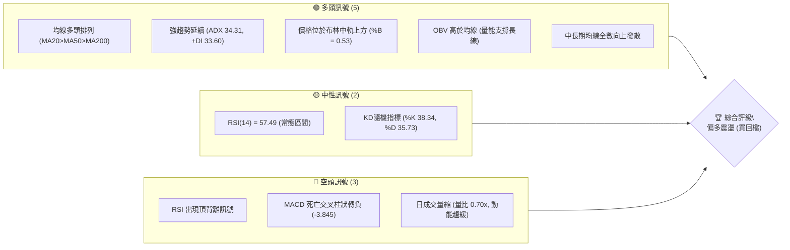
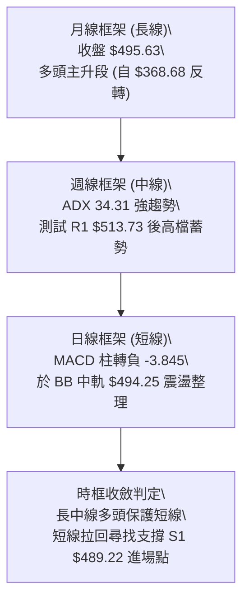
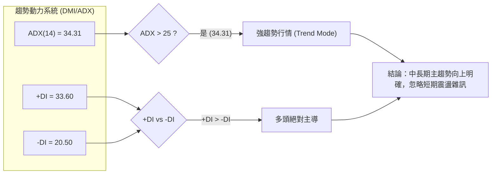
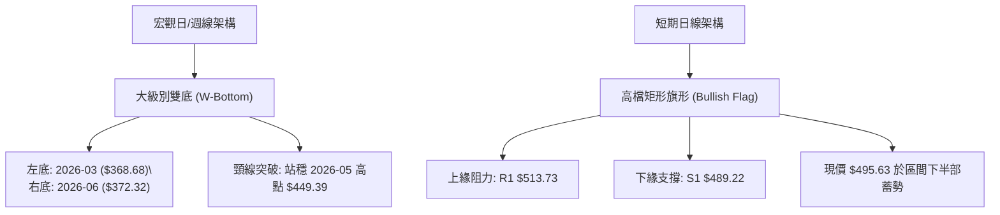
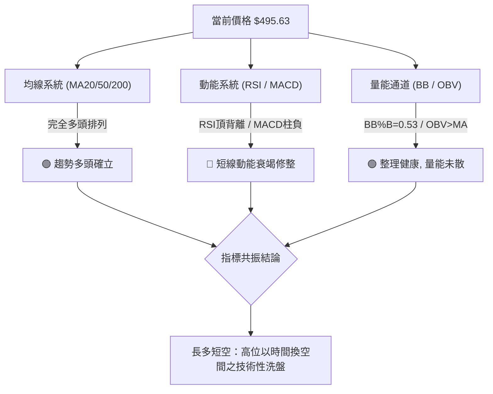
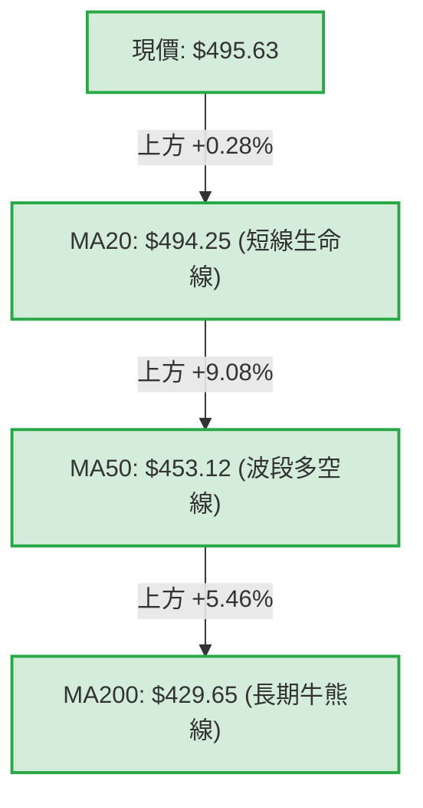
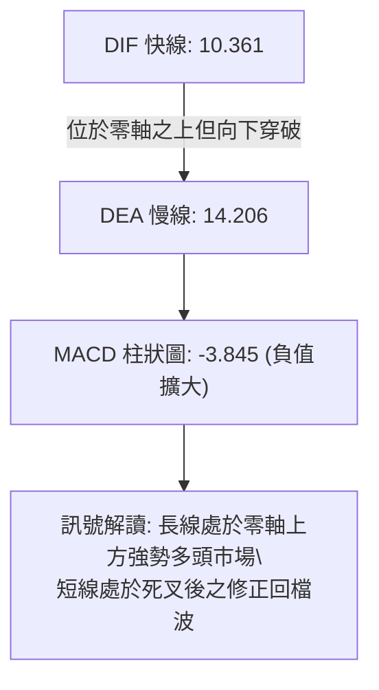
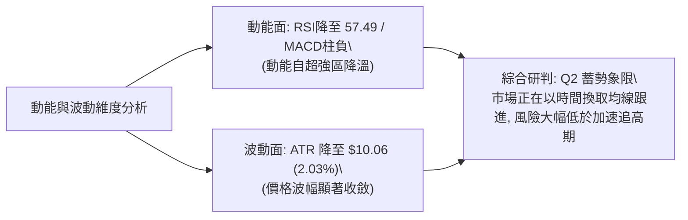
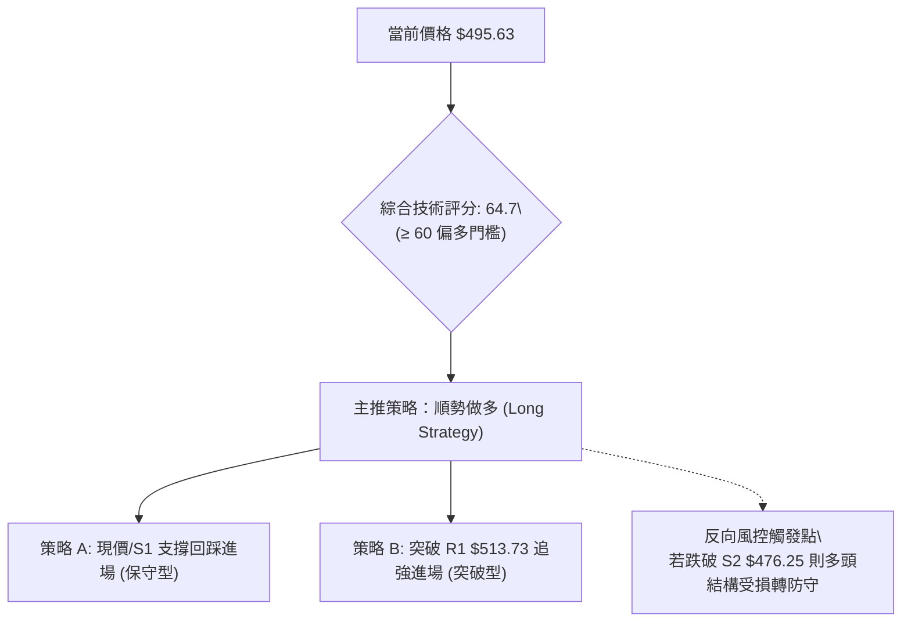
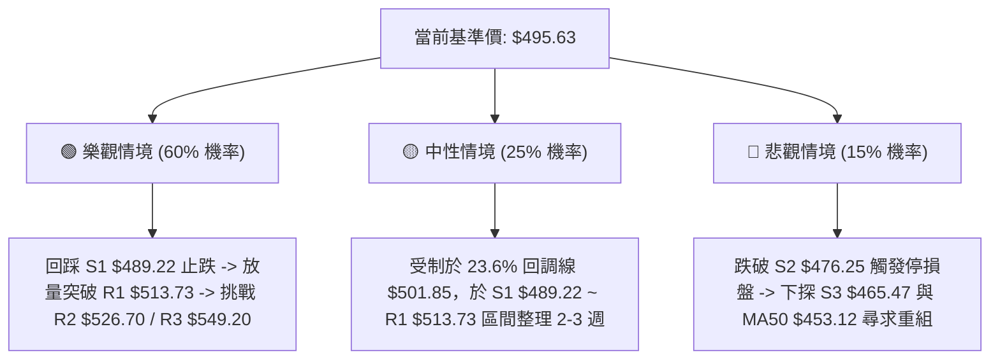

# MSFT 技術分析報告

> **報告日期**：2026-09-14 ｜ **語言**：繁體中文 ｜ **數據來源**：Yahoo Finance ｜ **當前價格**：$495.63

---

## 目錄

| 章節 | 內容 |
|------|------|
| [1. 技術面概覽](#1-技術面概覽) | 訊號儀表板、核心指標、評分卡 |
| [2. 趨勢分析](#2-趨勢分析) | 多時框趨勢、長中短期走勢、12個月走勢圖 |
| [3. 圖表形態分析](#3-圖表形態分析) | 形態識別、信心度評估、K線解讀、形態測幅 |
| [4. 支撐與阻力](#4-支撐與阻力) | 關鍵價位分布圖、高低點聚類、斐波那契回調 |
| [5. 技術指標深度解讀](#5-技術指標深度解讀) | MA排列、RSI背離、MACD動能、布林通道、OBV量價 |
| [6. 動能與波動率](#6-動能與波動率) | 動能四象限、ATR波動分析、Beta市場敏感度 |
| [7. 多時框架總結](#7-多時框架總結) | 時框架評分矩陣、收斂規則判定與方向定調 |
| [8. 交易策略建議](#8-交易策略建議) | 策略路由、價格情境階梯、主策略A/B、風控止損 |
| [9. 風險提示與監控](#9-風險提示與監控) | 關鍵指標Checklist、三種情境路徑、倉位管理 |

---

## 1. 技術面概覽

### 🎯 技術訊號儀表板

當前微軟（MSFT）技術面呈現「**長期多頭結構健全，短期面臨技術性頂背離與漲多拉回修整**」的格局。ADX 達 34.31，顯示中長期多頭主導趨勢極為明確；然而日線與週線的 MACD 柱狀圖呈現負值，且 RSI 出現結構性頂背離，短線處於均值回歸與籌碼沉澱階段。



---

### 📊 核心指標速覽表

| 指標類別 | 指標名稱 | 當前數值 | 訊號 | 技術解讀 |
|:---|:---|:---|:---:|:---|
| **價格** | 當前價格 | $495.63 | 🟢 | 站穩52週區間73.3%分位，位於短中長期均線上方 |
| **均線** | 短期 MA20 | $494.25 | 🟢 | 現價微幅高於 MA20 (+0.28%)，布林中軌具備支撐效應 |
| **均線** | 中期 MA50 | $453.12 | 🟢 | 現價遠高於 MA50 (+9.38%)，中期上升通道完整 |
| **均線** | 長期 MA200 | $429.65 | 🟢 | 遠高於長期生命線 (+15.36%)，牛市基底穩固 |
| **動能** | RSI(14) | 57.49 | 🟡 | 位於50中軸上方，但自超買區回落並伴隨頂背離警訊 |
| **動能** | MACD (12,26,9) | Hist -3.845 | 🔴 | DIF 10.361 < DEA 14.206，短線處於修正波段 |
| **波動** | ATR(14) | $10.06 | 🟢 | 波動率佔股價 2.03%，日度波幅收斂，利於築底蓄勢 |

---

### 🏆 技術評分卡

```
╔════════════════════════════════════════════════════════════════╗
║             MSFT 技術評分卡 (Technical Scorecard)               ║
╠════════════════════════════════════════════════════════════════╣
║ 趨勢強度 (Trend Strength)  ██████████████░░░░  75/100  🟢 強勁  ║
║ 動能指標 (Momentum)        ████████░░░░░░░░░░  45/100  🔴 修正  ║
║ 支撐穩定度 (Support Rigidity)████████████░░░░  68/100  🟢 穩固  ║
║ 成交量配合 (Volume Profile)  ████████░░░░░░░░  50/100  🟡 量縮  ║
║ 形態完整度 (Chart Patterns)  ████████████░░░░  65/100  🟢 偏多  ║
║ 均線排列 (MA Alignment)     ████████████████  85/100  🟢 多頭  ║
╠════════════════════════════════════════════════════════════════╣
║ 綜合技術評分                ████████████░░░░  64.7/100 🟢 偏多  ║
╚════════════════════════════════════════════════════════════════╝
```

---

## 2. 趨勢分析

### 🌐 多時框趨勢分析

MSFT 的多時框結構展現出典型的主升段後整理特徵：月線級別自 2026 年 3 月低點 $368.68 強勢反轉，週線級別於 8 月底創下 $513.53 近期高點後進入高檔盤整，日線級別則於 MA20 附近反覆測試支撐。



---

### 📈 長期趨勢 — 12個月走勢圖（Unicode）

以下為 MSFT 過去 12 個月（2025-10 至 2026-09）的月線收盤價走勢路徑，呈現清晰的「雙底反轉後形成陡峭上升浪」之形態：

```
MSFT 月線走勢圖（2025-10 至 2026-09）
價格軸 ($)
$520 ┤                                           
$510 ┤ ●(10月:513.58)                         ●(8月:507.29)
$500 ┤                                             ●(現在:495.63)
$480 ┤     ●(11月:488.91) ●(12月:480.57)     ●(7月:463.85)
$440 ┤                                   ●(5月:449.39)
$420 ┤         ●(1月:427.58)         ●(4月:406.13)
$400 ┤             ●(2月:391.15)
$380 ┤                               ●(6月:372.32)*次低點
$360 ┤                 ●(3月:368.68)*波段谷底
     └─┬─────┬─────┬─────┬─────┬─────┬─────┬─────┬─────┬─────┬─────┬──
      10月  11月  12月   1月   2月   3月   4月   5月   6月   7月   8月   9月
      2025 ──────────────────────── 2026 ────────────────────────────
```

#### 走勢特徵分析表格

| 階段區間 | 時間跨度 | 價格區間 | 累積漲跌幅 | 結構性技術特徵 |
|:---|:---:|:---:|:---:|:---|
| **波段下行段** | 2025-10 ~ 2026-03 | $513.58 → $368.68 | -28.21% | 估值修正與均線反轉下穿，觸及 52W 低點 $348.54 附近反彈 |
| **第一波築底反彈** | 2026-03 ~ 2026-05 | $368.68 → $449.39 | +21.89% | V型脫離底部，站回 MA200，多頭量能重新點火 |
| **二次探底確立** | 2026-05 ~ 2026-06 | $449.39 → $372.32 | -17.15% | 回測前低不破 ($372.32 > $368.68)，構築宏觀雙重底右腳 |
| **主升段突破** | 2026-06 ~ 2026-08 | $372.32 → $507.29 | +36.25% | 大量長紅貫穿所有中長期均線，創下波段新高 |
| **高檔收斂整理** | 2026-08 ~ 2026-09 | $507.29 → $495.63 | -2.30% | 逼近 R1 $513.73 後量縮拉回，目前於 $495 進行均線回踩 |

---

### 📊 中期趨勢（週線分析）

從近 20 週收盤走勢觀察，微軟在 2026-06-28 於 $372.27 爆出 382,709,200 股的天量換手後，正式展開中級主升浪。隨後在 8 月初連拉兩根帶量大長紅（週漲幅至 $463.85 及 $499.05），週線 RSI 一度噴發至 84.8 的嚴重超買區。

近四週（08-23 至 09-13）週線走勢為：
- 2026-08-23：收 $483.24（RSI 47.6，MACD柱狀 -3.230）
- 2026-08-30：收 $513.53（RSI 55.8，MACD柱狀 -1.136）
- 2026-09-06：收 $499.70（RSI 62.8，MACD柱狀 -2.356）
- 2026-09-13：收 $495.63（RSI 57.5，MACD柱狀 -3.845）

週線成交量由 8 月初的 2.78 億股大幅萎縮至最新的 6,232 萬股，呈現「價跌量縮、高檔消化獲利賣壓」的健康中繼整理型態。

```
週線高檔震盪整理區間：
┌─────────────────────────────────────────────────────────────┐
│ 阻力區：R1 $513.73 ── 2026-08-30 週收盤 $513.53 / 波段頂部   │
│ 當前價：$495.63    ── 守於週線布林中軌與 MA20 之上          │
│ 支撐區：S1 $489.22 ── 08-23 回檔低點區與密集成交帶          │
└─────────────────────────────────────────────────────────────┘
```

---

### ⚡ 趨勢強度評估（ADX 解讀）



| 指標項目 | 數值 | 門檻標準 | 狀態評估 | 實戰指導含義 |
|:---|:---:|:---:|:---:|:---|
| **ADX(14)** | **34.31** | > 25.0 (趨勢確立) | 🟢 強趨勢運作中 | 當前市場非無序盤整，屬於具備明確方向之趨勢行情 |
| **+DI (多頭動向)** | **33.60** | > 20.0 (買盤活躍) | 🟢 多頭控制主動權 | 買方力道顯著壓制賣方力道 |
| **-DI (空頭動向)** | **20.50** | < 25.0 (賣壓受控) | 🟢 空方力道偏弱 | 空頭尚未形成發散進攻，無系統性崩跌風險 |
| **動向差值 (DI Spread)**| **+13.10** | > 10.0 (優勢顯著) | 🟢 多方佔優 | 回檔整理宜視為順勢拉回進場契機，非反轉放空點 |

---

## 3. 圖表形態分析

### 🔍 形態識別系統

在多週期圖表上，MSFT 目前呈現出一個宏觀的大型底型突破，以及微觀的高檔旗形整理結構。



#### 圖表形態信心度與測幅表

依據嚴格規則 15，各形態之信心度、數據依據與幾何測幅目標如下：

| 形態識別 | 信心度 | 判斷依據（數據引用） | 完成度 | 形態目標價（附計算式） |
|:---|:---:|:---|:---:|:---|
| **宏觀雙重底 (W-Bottom)** | **82%** | 兩次波段低點分別為 2026-03 收盤 $368.68 與 2026-06 收盤 $372.32，頸線為 2026-05 高點 $449.39。價格已於 2026-07 強勢實體長紅帶量突破頸線。 | 100% (已突破並完成等幅) | **雙底測幅目標 = $530.10**<br>計算式：頸線 $449.39 + (頸線 $449.39 - 底部低點 $368.68) = $449.39 + $80.71 = $530.10。此目標與阻力位 R2 ($526.70) 高度重疊。 |
| **高檔收斂旗形 (Bullish Flag)** | **68%** | 2026-08-30 創波段高點 $513.53（逼近 R1 $513.73）後，連續兩週於 $489.22 ~ $513.73 區間量縮狹幅震盪，成交量從 2.78 億週量驟降至 6,232 萬。 | 70% (處於區間收斂末端) | **旗形突破目標 = $538.24**<br>計算式：突破 R1 $513.73 + 旗形區間高度 ($513.73 - S1 $489.22 = $24.51) = $538.24。指向歷史高點 R3 ($549.20) 區域。 |
| **頭肩底 (H&S Bottom)** | **35%** | 數據中左肩與頭部層次不均勻，中間缺乏對稱對應點。 | <30% | *訊號不足，信心度低於50%，僅做指標與箱型解讀，不強行測幅。* |

---

### 🕯️ 重要K線形態分析

| 週期/時間 | 基準價位 | K線結構形態 | 技術解讀 | 方向訊號 |
|:---|:---:|:---|:---|:---:|
| **2026-06 月K** | $372.32 | **長下影線倒錘頭/穿頭破腳陽線** | 測試前低 $368.68 不破後爆量強拉，確認長線主力洗盤結束 | 🟢 強烈看多 |
| **2026-07 月K** | $463.85 | **光頭大陽線 (Marubozu)** | 月漲幅高達 +24.58%，一口氣收復 MA20、MA50、MA200，多頭主升浪確立 | 🟢 極強看多 |
| **2026-08-30 週K** | $513.53 | **高檔長上影線射擊之星 (Shooting Star)** | 衝擊 R1 $513.73 後遭遇解套賣壓與獲利了結盤壓制，短線動能受阻 | 🔴 短線偏空 |
| **2026-09-06 週K** | $499.70 | **量縮陰線孕線 (Harami)** | 實體完全包含在前一週之內，成交量急凍，顯示多空雙方轉為觀望 | 🟡 震盪觀望 |
| **2026-09-13 日/週K**| $495.63 | **下影線小陰星 (Hammer-like Dogi)** | 探低測試 S1 ($489.22) 上方後回升收於 MA20 ($494.25) 之上，出現初步止跌訊號 | 🟢 支撐確認 |

---

### 📉 ASCII 走勢形態示意圖

```
MSFT 近期高檔矩形整理與宏觀 W 底突破結構：
價格 ($)
$530 ┤                                                     [W底測幅目標: $530.10]
$520 ┤                                                     
$514 ┤                      ┌─────● R1 ($513.73) / 8-30高點
$500 ┤                      │     │   ● (現價 $495.63)
$490 ┤                      └─────┼───● S1 ($489.22) 整理箱底
$460 ┤               ● (7月大陽線突破)
$450 ┤───────────────● 頸線 ($449.39) ──────────────────────────────────
$410 ┤         ●
$390 ┤   ●           ●
$370 ┤   ● (3月底$368.68)   ● (6月次底$372.32)
     └──────────────────────────────────────────────────────────
         [左底 W1]           [右底 W2]           [高檔旗形箱體整理]
```

---

## 4. 支撐與阻力

### 🗺️ 關鍵價位分布圖（Unicode）

```
MSFT 價位結構分布圖 (由 OHLCV 與歷史波段計算)
═════════════════════════════════════════════════════════════════════
$549.20 ║████████████████████████████████║ 歷史阻力 / 52W高點 R3 (Fib 0.0%)
$526.70 ║████████████████████            ║ 波段延伸阻力 R2
$513.73 ║████████████████████████        ║ 近期波段高點阻力 R1
$501.85 ║▓▓▓▓▓▓▓▓▓▓▓▓                    ║ 斐波那契回調阻力 (Fib 23.6%)
─────────────────────────────────────────────────────────────────────
$495.63 ╠════════════════════════════════╣ ◄ 現價 (Current Price)
─────────────────────────────────────────────────────────────────────
$494.25 ║▒▒▒▒▒▒▒▒▒▒▒▒▒▒▒▒▒▒▒▒▒▒▒▒▒▒▒▒▒▒▒▒║ 短期生命線 MA20 / 布林中軌
$489.22 ║████████████████████            ║ 近期波段低點支撐 S1
$476.25 ║████████████████████████        ║ 強支撐 S2 / 布林下軌區 ($474.38)
$472.55 ║▓▓▓▓▓▓▓▓▓▓▓▓▓▓▓▓                ║ 關鍵回調支撐 (Fib 38.2%)
$465.47 ║████████████████████████████    ║ 終極波段支撐 S3
$448.87 ║▓▓▓▓▓▓▓▓▓▓▓▓▓▓▓▓▓▓▓▓▓▓▓▓        ║ 中期均線/多空分水嶺 (Fib 50.0%)
═════════════════════════════════════════════════════════════════════
```

---

### 🚧 阻力位分析表

依據提供的歷史數據聚類計算，各阻力位解析如下：

| 阻力級別 | 精確價位 | 距現價幅幅 | 形成原因與技術共振 | 突破難度 | 戰略重要性 |
|:---|:---:|:---:|:---|:---:|:---:|
| **阻力位 R1** | **$513.73** | +3.65% | 2026-08-30 波段高點 $513.53、2025-09/10 月線雙頂密集套牢區聚類。 | 中等 | 🟢 短線突破確認點，站上即宣告高檔整理結束 |
| **阻力位 R2** | **$526.70** | +6.27% | 近一年波段次高點聚類、W底翻揚等幅測算點 ($530.10) 必經隘口。 | 較高 | 🟡 中期多頭目標，此處易引發籌碼二次換手 |
| **阻力位 R3** | **$549.20** | +10.81% | 52 週最高點 (52W High)、斐波那契 0.0% 終極阻力位。 | 極高 | 🔴 歷史天花板，需量能放大至 2.5 億股以上方可攻克 |

---

### 🛡️ 支撐位分析表

依據提供的歷史數據聚類計算，各支撐位解析如下：

| 支撐級別 | 精確價位 | 距現價幅幅 | 形成原因與技術共振 | 守住機率 | 戰略重要性 |
|:---|:---:|:---:|:---|:---:|:---:|
| **支撐位 S1** | **$489.22** | -1.29% | 2026-08-23 回檔波段低點聚類，貼近 MA20 ($494.25)。 | 75% | 🟢 短線多頭防線，回測不破可建立順勢多單 |
| **支撐位 S2** | **$476.25** | -3.91% | 近一年密集平台整理下緣、與日線布林下軌 ($474.38) 及 Fib 38.2% ($472.55) 構成強共振帶。 | 88% | 🟢 強支撐買盤區，中線波段最佳防守點 |
| **支撐位 S3** | **$465.47** | -6.09% | 2026-08-02 起漲跳空缺口支撐、波段低點聚類。 | 95% | 🔴 趨勢分水嶺，失守則代表本輪主升浪結構遭到破壞 |

---

### 📐 斐波那契回調位分析

以 52 週最低點 **$348.54** 為起點，至 52 週最高點 **$549.20** 為終點（波段垂直總落差 $200.66），黃金分割回調結構如下：

| 回調比例 | 精確價位 | 與現價關係 | 技術意義解讀 |
|:---:|:---:|:---:|:---|
| **0.0%** | **$549.20** | 現價下方 +10.81% | 52W 最高點阻力 |
| **23.6%** | **$501.85** | 現價上方 +1.25% | **第一道反壓位**：現價目前受制於 23.6% 回調線下方，形成短線動能壓制 |
| **38.2%** | **$472.55** | 現價下方 -4.66% | **強勢回檔極限**：位於 S2 ($476.25) 附近，多頭強勢市場不應跌破的黃金防線 |
| **50.0%** | **$448.87** | 現價下方 -9.43% | **多空中樞線**：與 MA50 ($453.12) 及 5月高點頸線 ($449.39) 完美重疊 |
| **61.8%** | **$425.20** | 現價下方 -14.21% | **生命防守線**：貼近長期均線 MA200 ($429.65)，牛熊轉換臨界點 |
| **78.6%** | **$391.48** | 現價下方 -21.01% | 弱勢回調支撐 |
| **100.0%** | **$348.54** | 現價下方 -29.68% | 52W 最低點 |

> **回調定位總結**：現價 **$495.63** 正精確運行於 **Fib 23.6% ($501.85)** 與 **Fib 38.2% ($472.55)** 之間。在多頭強勢格局中，股價回踩 23.6% 至 38.2% 區間屬於健康的「淺度修正（Shallow Retracement）」，未破壞主升浪幾何結構。

---

## 5. 技術指標深度解讀

### 🎛️ 指標訊號總覽



---

### 📈 移動平均線排列分析

當前移動平均線呈現完美的**多頭排列（Bullish Alignment）**：`MA20 ($494.25) > MA50 ($453.12) > MA200 ($429.65)`，各週期均線全數呈現正斜率向上延伸。



#### 細分均線走勢參數

| 均線名稱 | 當前價格 | 與現價乖離 | 走勢特徵 (Trend Momentum) | 技術意涵 |
|:---|:---:|:---:|:---|:---|
| **MA 5** | $494.67 | +0.19% | ▁▂▄▆▇▇█████▇▇▇▇▆▆▇▇▇██████████ | 短天期扣抵高檔，呈現水平鈍化黏合 |
| **MA 10**| $500.22 | -0.92% | ▁▁▂▃▄▅▆▇▇███████▇▇▇▇██████████ | 微幅下彎，構成短線第一道上檔動態反壓 |
| **MA 20**| $494.25 | +0.28% | ▁▁▁▂▂▃▃▄▄▄▅▅▅▆▆▇▇▇████████████ | 斜率維持向上，現價緊貼中軌獲得支撐 |
| **MA 60**| $439.42 | +12.79%| ▁▁▁▁▂▂▂▃▃▃▃▄▄▄▄▄▅▅▅▅▅▆▆▆▇▇▇███ | 季線強烈揚升，提供中期無可撼動之多頭防護 |
| **MA120**| $421.79 | +17.51%| ▁▁▁▁▁▂▂▂▃▃▃▄▄▄▄▅▅▅▅▆▆▆▆▇▇▇████ | 半年線持續上移，長期籌碼完全鎖定 |
| **MA200**| $429.65 | +15.36%| 穩健向上發散 | 200日均線確立為堅實的宏觀安全底墊 |

---

### 📉 RSI(14) 分析與背離判定

```
RSI(14) 當前數值: 57.49  (常態中性偏強區間)
0              30                    50      57.49          70            100
├──────────────┼─────────────────────┼─────────█────────────┼──────────────┤
  嚴重超賣區          空方掌控區           中軸     當前數值     超買預警區
進度條：███████████████░░░░░░░░░░  57.49%
```

#### ⚠️ 背離分析（頂背離判定）
- **判定結論**：**明確存在頂背離 (Confirmed Bearish Divergence)**。
- **數據比對**：
  - **價格峰值**：2026-08-09 週收盤 $499.05，隨後在 2026-08-30 創出更高的波段高點 **$513.53**（價格創新高 Higher High）。
  - **RSI峰值**：2026-08-16 RSI 達到高點 **84.8**，而 2026-08-30 股價創高時 RSI 僅錄得 **55.8**（RSI 顯著走低 Lower High）。
- **解讀**：典型的二度頂背離結構，顯示買盤推進力道在 $500 以上出現邊際效益遞減，因此引發近兩週的回調修正（收盤回落至 $495.63）。當前 RSI 已回吐至 57.49，接近 50 中軸，頂背離引發的極端殺傷力已化解大半，指標逐步完成冷卻。

---

### 📊 MACD(12/26/9) 訊號解讀

- **DIF (快線)**：10.361
- **DEA (慢線/Signal)**：14.206
- **Histogram (柱狀圖)**：**-3.845** 🔴（看空修正）



MACD 柱狀圖自 2026-08-09 的高峰 +11.272 連續數週快速下滑，目前為 -3.845。值得注意的是，快慢線數值仍深處於零軸上方（10.361 與 14.206），此為**「強勢市場的高位死叉」**，通常代表時間換空間的平台整理，而非趨勢翻轉的崩跌。

---

### 📦 布林通道分析

- **布林上軌 (Upper Band)**：$514.13
- **布林中軌 (MA20)**：$494.25
- **布林下軌 (Lower Band)**：$474.38
- **通道帶寬 (Bandwidth)**：$39.75 (帶寬比 8.02%)
- **%B 指標**：**0.53**（落於 0.50 ~ 0.55 之平衡點）

```
MSFT 布林通道位置示意圖：
$514.13 ┬────────────────────────────────────────── 布林上軌 (Upper Band)
        │
$505.00 ┼
        │
$495.63 ┼───────────────────● 現價落點 (%B = 0.53)
$494.25 ┼────────────────────────────────────────── 布林中軌 (MA20)
        │
$485.00 ┼
        │
$474.38 ┴────────────────────────────────────────── 布林下軌 (Lower Band)
```

**解讀**：現價 $495.63 緊貼布林中軌 $494.25（乖離僅 +0.28%），%B 指標為 0.53，顯示股價經歷了從上軌觸碰後的對稱回歸，目前回到通道核心價值區。布林通道未出現喇叭口收縮後的急劇向下發散，中軌呈現上傾態勢，具備顯著的動態支撐力。

---

### 💹 成交量分析（量價配合度）

- **最新日成交量**：14,510,500 股
- **20日平均量 (20MA Volume)**：20,799,005 股（**量比 0.70x**，明顯量縮）
- **50日平均量 (50MA Volume)**：30,104,458 股
- **OBV 能量潮趨勢**：`OBV > MA` 🟢（量能趨勢持續支撐價格上漲）

```
量價配合度分析：
┌─────────────────────────────────────────────────────────────┐
│ 1. 量縮拉回特徵：當前量比僅 0.70x，在回檔至 MA20 過程中無大量拋售， │
│    顯示獲利籌碼並未驚慌出逃，屬於主力惜售的典型量縮洗盤。  │
│ 2. OBV指標多頭確認：長週期能量潮指標仍高於其移動平均線，     │
│    確認 6-8 月主升段積累的龐大法人資金仍在場內，長線多頭架構完好。 │
└─────────────────────────────────────────────────────────────┘
```

---

## 6. 動能與波動率

### ⚡ 動能評估四象限

評估 MSFT 目前在「趨勢動能（Momentum）」與「歷史波動率（Volatility）」的分佈維度：

| 象限標籤 | 動能強度 | 波動率水準 | 特徵描述 | MSFT 當前定位與評估 |
|:---:|:---:|:---:|:---|:---:|
| **Q1** | **強動能** | **低波動** | 最佳牛市穩健推進期 | — |
| **Q2** | **弱動能** | **低波動** | 高檔震盪、沉澱蓄勢期 | **✓ 當前狀態 (落於Q2偏向Q1)** |
| **Q3** | **強動能** | **高波動** | 主升衝刺、洗盤劇烈期 | — (8月初曾處於此象限) |
| **Q4** | **弱動能** | **高波動** | 恐慌拋售、空頭主導期 | — |



---

### 📊 ATR 波動率分析

- **ATR(14) 數值**：**$10.06**
- **ATR 佔比 (ATR / 股價)**：**2.03%**
- **技術解讀**：日均震盪幅度僅約 10 元，波動率處於過去半年相對偏低水平，表示單日暴跌風險極低，適合透過精確的風險報酬比設定進場防守點。

#### 交易止損與保護區間推算（基於 ATR = $10.06）
- **1.0 × ATR (短線激進止損距離)**：$10.06 → 現價 $495.63 - $10.06 = **$485.57**（位於 S1 $489.22 之下）
- **1.5 × ATR (標準擺動止損距離)**：$15.09 → 現價 $495.63 - $15.09 = **$480.54**（保護於 S1 與 S2 之間）
- **2.0 × ATR (長線寬鬆止損距離)**：$20.12 → 現價 $495.63 - $20.12 = **$475.51**（緊密貼合 S2 $476.25 與布林下軌）

---

### 📐 Beta 與市場相關性

- **Beta 係數**：**1.108**
- **市場敏感度解讀**：MSFT 作為全球市值前列之權值股（市值 $3.68T），其 Beta 值為 1.108，代表對標普 500 指數（S&P 500）具備約 1.11 倍的同向波動放大效應。當科技板塊整體反彈時，MSFT 將提供超越大盤的 Alpha 增益；而在大盤拉回時，其回撤幅度亦會微幅高於整體指數。

---

## 7. 多時框架總結

### 📋 時框架評分表

| 時框架 | 趨勢方向 | 動能狀態 | 均線排列 | 關鍵形態 | 綜合評分 | 操作建議 |
|:---:|:---:|:---:|:---:|:---:|:---:|:---|
| **月線 (長期)** | 🟢 強烈多頭 | 🟢 脫離底部強勁 | 🟢 MA向上發散 | 宏觀大型雙底突破 | **85/100** | 長期投資者堅定續抱 |
| **週線 (中期)** | 🟢 多頭趨勢 | 🟡 頂背離降溫中 | 🟢 均線多頭排列 | 歷史高檔下方箱形蓄勢 | **70/100** | 逢回測支撐分批加碼 |
| **日線 (短期)** | 🟡 震盪整理 | 🔴 MACD柱轉負 | 🟢 守住MA20中軌 | 高檔矩形整理下緣 | **55/100** | 避免追高，耐心等待低吸 |

---

### 🔲 綜合訊號矩陣

```
訊號一致性評估矩陣：
┌─────────────────┬──────────┬──────────┬──────────┬────────────────────────┐
│ 維度            │ 長期(月) │ 中期(週) │ 短期(日) │ 跨週期一致性研判       │
├─────────────────┼──────────┼──────────┼──────────┼────────────────────────┤
│ 均線趨勢 (MA)   │  🟢 看多 │  🟢 看多 │  🟢 看多 │ 全時框多頭共振         │
│ 動能強度 (RSI)  │  🟢 強勁 │  🟡 背離 │  🟡 中性 │ 短期面臨過熱修正       │
│ 指標方向 (MACD) │  🟢 擴張 │  🟡 收斂 │  🔴 死叉 │ 短線空方佔優，中長完好 │
│ 量價結構 (VOL)  │  🟢 增量 │  🟢 健康 │  🟡 量縮 │ 典型拉回量縮整理       │
└─────────────────┴──────────┴──────────┴──────────┴────────────────────────┘
```

---

### ⚖️ 多時框收斂結論

嚴格依據**規則 14**之多時框優先級進行收斂：
1. **趨勢/盤整行情判定**：當前 ADX(14) 為 **34.31**，遠高於 25 門檻值，且 +DI (33.60) 顯著高於 -DI (20.50)，明確判定當前處於**「強趨勢行情（Trend-following Mode）」**。
2. **時框主導取捨**：依規則，趨勢行情下必須**「以中長期（週線/MA50、MA200）方向為主，日線只用來尋找進場時機」**。
3. **唯一方向性結論**：**【偏多震盪 — 順勢拉回做多】**。
   日線的 MACD 負柱狀與頂背離僅屬於中長期主升浪中的「次級回檔折返（Secondary Pullback）」。交易者絕不可在 ADX=34.31 的強趨勢下逆勢放空，應利用日線回測 S1 ($489.22) 至 S2 ($476.25) 區間作為波段佈局點。

---

## 8. 交易策略建議

### 🗺️ 策略決策流程圖



---

### 🧭 策略路由

> **當前主策略方向 = 【偏多操作 / 順勢逢低買入】（依技術綜合評分 64.7/100 判定）**
> 
> 依規範，評分 ≥ 60 主推多頭策略，空頭方向僅列為風控停損與避險對沖警示，嚴禁兩頭下注。

---

### 🎯 價格情境階梯（Price Scenarios）

價位完全嚴格引用本報告第 4 章由 OHLCV 與聚類計算之數值：

| 觸發條件 | 第一目標 | 後續延伸目標 | 情境含義與操作指引 |
|:---|:---:|:---:|:---|
| **向上突破 R1 ($513.73)** | **R2 ($526.70)** | **R3 ($549.20)** | **短線突破轉強**：確認旗形整理結束，主升浪重新啟動，強烈買進訊號。 |
| **守穩 S1 ($489.22) ~ 現價** | **R1 ($513.73)** | **R2 ($526.70)** | **基底蓄勢震盪**：維持中軌上方健康整理，提供絕佳的低風險吸籌窗口。 |
| **跌破 S1 ($489.22)** | **S2 ($476.25)** | **Fib 38.2% ($472.55)** | **短線轉弱探底**：跌破短線支撐，尋求布林下軌與強支撐共振帶二次築底。 |
| **失守 S2 ($476.25)** | **S3 ($465.47)** | **Fib 50.0% ($448.87)** | **中期結構破壞**：多頭趨勢遭到中斷，所有波段多單必須無條件止損。 |

---

### 📊 情境機率分佈

| 運行情境 | 預估機率 | 主要技術依據 |
|:---|:---:|:---|
| **情境一：守穩 S1 震盪後突破上行** | **60%** | ADX 34.31 強趨勢未變、均線呈現多頭排列、OBV 高於均線量能無衰竭跡象。 |
| **情境二：於 $476.25 ~ $513.73 區間震盪** | **25%** | MACD 柱狀仍處於負值 (-3.845)、量能萎縮至 0.70x，需時間消化 RSI 頂背離壓力。 |
| **情境三：深度跌破 S2 再探低點** | **15%** | 若科技板塊遭遇外部系統性風險，引發均線向下乖離收斂。 |

---

### 🟢 主策略詳情

本報告設計兩套多頭進場方案，所有點位嚴格引用支撐阻力數值：

| 策略要素 | 策略 A（回踩支撐低吸 — 穩健波段型） | 策略 B（突破高檔阻力 — 動量追擊型） |
|:---|:---:|:---:|
| **操作邏輯** | 於 MA20 / S1 支撐帶掛單進場，博取止跌反彈 | 確認有效突破高檔整理上緣 R1，右側追強 |
| **進場條件** | 股價回踩 S1 附近出現下影線或日K收陽 | 帶量突破 R1（日成交量放大至 2,500 萬以上） |
| **精確進場價格** | **$490.00**（貼近 S1 $489.22） | **$514.50**（微幅濾網高於 R1 $513.73） |
| **目標價 T1** | **$513.73**（阻力位 R1） | **$526.70**（阻力位 R2） |
| **目標價 T2** | **$526.70**（阻力位 R2） | **$549.20**（52W 高點阻力 R3） |
| **精確止損價格** | **$475.00**（跌破 S2 $476.25 與布林下軌） | **$501.00**（跌破 Fib 23.6% $501.85 假突破） |
| **停損空間 / 風險**| $15.00 (-3.06%) | $13.50 (-2.62%) |
| **第一獲利空間 / 報酬**| $23.73 (+4.84%) | $12.20 (+2.37%) |
| **第二獲利空間 / 報酬**| $36.70 (+7.49%) | $34.70 (+6.74%) |
| **風險報酬比 (R:R)** | **1 : 2.45** (以 T2 計算) | **1 : 2.57** (以 T2 計算) |
| **預估勝率** | **65%** | **58%** |
| **建議配置倉位** | **15% ~ 20%** 資金 | **10% ~ 15%** 資金 |

---

### 🔴 反向風險觸發點（對沖與風控提示）

若市場出現異常走勢，以下為**推翻主策略**的關鍵信號，供部位風控參考（非建立逆向空單，而是多頭離場標準）：
1. **多單全面撤離點**：日線實體陰線收盤價跌破 **S2 ($476.25)**。此價位失守將宣告跌破布林下軌 ($474.38) 與 Fib 38.2% ($472.55)，上升趨勢中繼失敗，必須無條件市價停損多單。
2. **警訊減碼觸發點**：若股價跌破 **S1 ($489.22)** 且日成交量異常放大至 3,000 萬股以上，應立即減半現有多頭部位，將資金退回場邊觀望。

---

### ⭐ 整體訊號強度評星

```
做多訊號強度：★★★★☆  (4.0/5星) ── 長中線均線與趨勢指標極強，回調為良性買點
做空訊號強度：★☆☆☆☆  (1.0/5星) ── 逆勢放空風險極高，缺乏大級別頭部形態
整體訊號可信度：★★★★☆  (4.2/5星) ── 指標與成交量共振良好，無重大數據矛盾
```

---

## 9. 風險提示與監控

### ✅ 關鍵監控指標 Checklist

```
╔════════════════════════════════════════════════════════════════════╗
║                   MSFT 每日交易決策監控清單                          ║
╠════════════════════════════════════════════════════════════════════╣
║ [ ] 價格是否維持在 MA20 ($494.25) 之上？（判斷短線多空主動權）       ║
║ [ ] RSI(14) 能否在 50 水平獲得支撐並重新抬頭？（頂背離化解指標）     ║
║ [ ] MACD 負柱狀體是否開始收斂？（-3.845 縮小至 -2.0 以內即為反轉點） ║
║ [ ] 日成交量是否在突破 $513.73 時擴大至 2,500 萬股以上？（真突破依據）║
║ [ ] 防守警戒線：盤中是否觸及 S1 ($489.22) 甚至 S2 ($476.25)？      ║
║ [ ] 外部市場：科技板塊納斯達克是否出現單日 >2% 的系統性回調？       ║
╚════════════════════════════════════════════════════════════════════╝
```

---

### ⚠️ 風險場景分析



---

### 🛡️ 風險管理重要提醒

1. **嚴禁逆勢重倉放空**：MSFT 目前 ADX 高達 34.31，均線多頭排列完整，機構持股高達 75.8%，放空極易遭遇主力資金在季線上方進行報復性軋空。
2. **單筆交易風險上限**：任何單一多頭策略（策略 A 或 B），其總損失金額切勿超過整體投資組合淨值的 **1.0% ~ 1.5%**。
3. **動態跟蹤止盈（Trailing Stop）**：若採用策略 A 進場且股價順利突破 R1 ($513.73) 後，應立即將止損價位自動上移至損益兩平點（$490.00），立於不敗之地。

---

## 📋 報告總結

```
╔════════════════════════════════════════════════════════════════════╗
║                    MSFT 技術分析報告總結                           ║
╠════════════════════════════════════════════════════════════════════╣
║ 報告日期：2026-09-14                                               ║
║ 當前價格：$495.63                                                  ║
║ 分析評級：🟢 偏多震盪 (Buy on Dips / 順勢逢低買進)                  ║
╠════════════════════════════════════════════════════════════════════╣
║ 關鍵趨勢結論：                                                     ║
║ ├─ 長期趨勢：🟢 強烈看多 (宏觀雙底破頸線，各均線多頭排列)           ║
║ ├─ 中期趨勢：🟢 偏多蓄勢 (ADX=34.31 多頭主導，處於旗形中繼整理)    ║
║ ├─ 短期趨勢：🟡 震盪修正 (RSI頂背離待消化，MACD柱狀為負 -3.845)    ║
║ ├─ 關鍵支撐：S1 $489.22  │  S2 $476.25  │  S3 $465.47            ║
║ ├─ 關鍵阻力：R1 $513.73  │  R2 $526.70  │  R3 $549.20            ║
║ └─ 華爾街目標價均值：$572.92 (隱含 +15.59% 上行空間)               ║
╠════════════════════════════════════════════════════════════════════╣
║ 最優交易策略組合：                                                 ║
║ 1. 🥇 最佳機會 (策略 A)：回踩 S1 附近 $490.00 分批佈局，停損 $475.00║
║    目標看 R1 $513.73 與 R2 $526.70，風險報酬比優渥 (1:2.45)。      ║
║ 2. 🥈 次選機會 (策略 B)：若強勢跳空突破 R1，於 $514.50 順勢追進，   ║
║    目標直指 52W 高點 R3 $549.20，停損設於 $501.00。               ║
║ 3. 🥉 保守選擇：空手者靜待日線 MACD 柱狀由負轉正，出現右側買訊再行進場║
╚════════════════════════════════════════════════════════════════════╝
```

---

> ⚠️ **免責聲明**：本報告為依據量化技術指標與歷史行情數據生成之技術分析報告，所有價位分析、圖表推演與策略模型**僅供研究與學術參考**，**不構成任何形式的投資邀約或買賣建議**。金融市場瞬息萬變，交易決策具有固有資本虧損風險，投資人應獨立審慎評估並自負盈虧。

---

*報告生成時間：2026-09-14 ｜ 數據來源：Yahoo Finance ｜ 分析框架：多時框收斂量化技術體系*