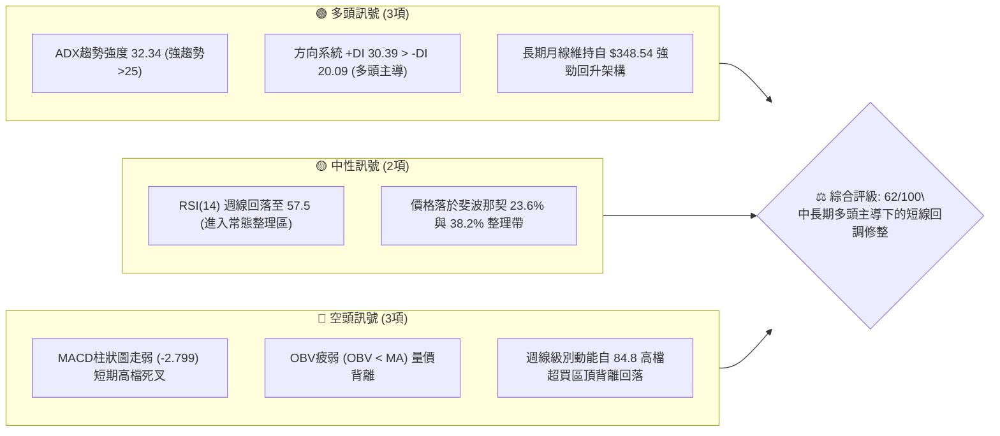
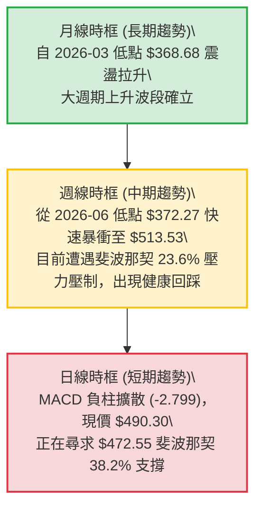
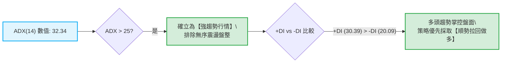
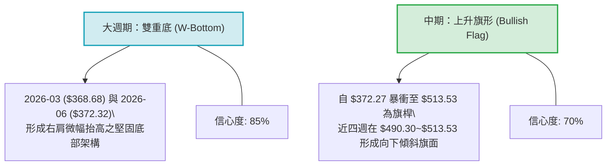
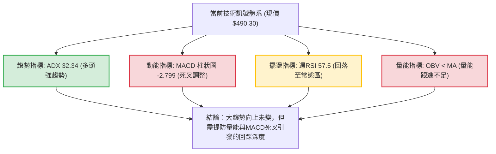
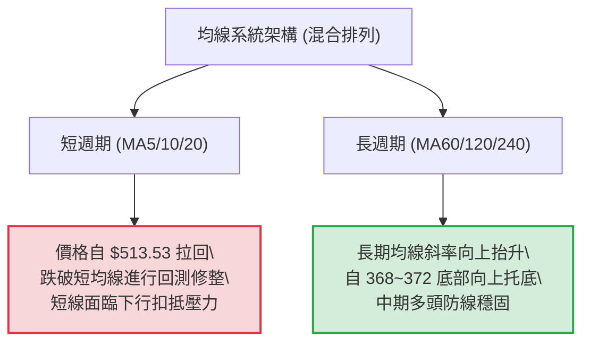
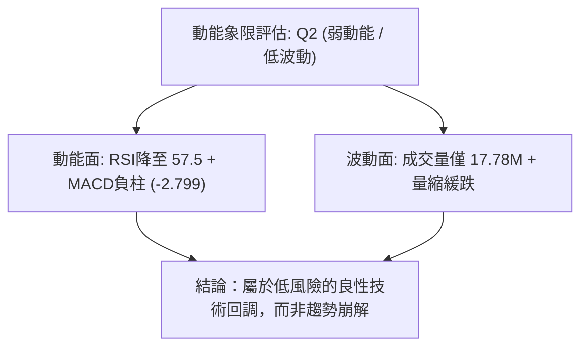
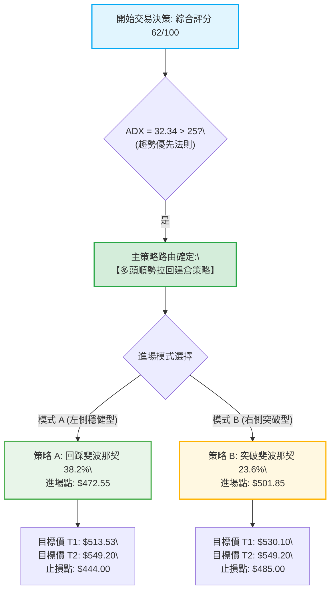
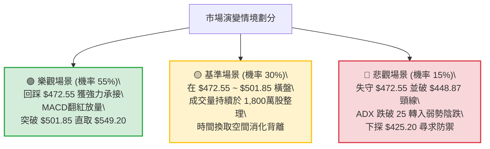

# MSFT 技術分析報告

> **報告日期**：2026-09-18 ｜ **語言**：繁體中文 ｜ **數據來源**：Yahoo Finance ｜ **當前價格**：$490.30

---

## 目錄

| 章節 | 內容 |
|------|------|
| [1. 技術面概覽](#1-技術面概覽) | 訊號儀表板、核心指標、評分卡 |
| [2. 趨勢分析](#2-趨勢分析) | 多時框趨勢、長中短期走勢、ADX強度 |
| [3. 圖表形態分析](#3-圖表形態分析) | 形態識別與信心度、K線組合、目標價計算 |
| [4. 支撐與阻力](#4-支撐與阻力) | 關鍵價位分佈、斐波那契回調結構 |
| [5. 技術指標深度解讀](#5-技術指標深度解讀) | MA/RSI頂背離/MACD死叉/布林帶/量能OBV |
| [6. 動能與波動率](#6-動能與波動率) | 動能四象限、ATR波動與Beta市場關聯 |
| [7. 多時框架總結](#7-多時框架總結) | 時框架評分矩陣與收斂結論 |
| [8. 交易策略建議](#8-交易策略建議) | 策略路由、主策略、情境階梯與風控 |
| [9. 風險提示與監控](#9-風險提示與監控) | 監控Checklist、情境演變、倉位控管 |
| [📋 報告總結](#-報告總結) | 全文核心摘要與最優策略組合 |

---

## 1. 技術面概覽

### 🎯 技術訊號儀表板



---

### 📊 核心指標速覽表

| 指標類別 | 指標名稱 | 當前數值 | 訊號 | 解讀 |
|:---|:---|:---|:---:|:---|
| **價格** | 當前基準價 | $490.30 | 🟡 | 位於52週區間高檔（距52W高點 $549.20 下修 10.7%） |
| **動向系統**| ADX (14) | 32.34 | 🟢 | ADX > 25，確認市場處於強趨勢狀態，非純橫盤雜訊 |
| **動向系統**| +DI / -DI | 30.39 / 20.09 | 🟢 | +DI 顯著大於 -DI，主要趨勢仍由多方力量控盤 |
| **動能指標**| 週線 RSI(14) | 57.5 | 🟡 | 自 2026-08 超買區（84.8）正常降溫回調，未破中軸50 |
| **動能指標**| MACD 柱 (Hist)| -2.799 | 🔴 | MACD 8.286 < Signal 11.084，短線高檔死叉發散 |
| **成交量能**| 量比 (Volume) | 0.89x | 🔴 | 當前成交量 17.78M 低於 20日均量 20.07M，量縮回檔 |
| **量能趨勢**| OBV 狀態 | OBV < MA | 🔴 | 能量潮指標落後於均線，資金推升動能呈現疲態 |
| **均線排列**| 總體均線 | 混合排列 | 🟡 | 長期均線向上發散，但短期動能遭遇上方獲利盤壓制 |

---

### 🏆 技術評分卡

```
╔══════════════════════════════════════════════════════════════════╗
║                  MSFT 技術面綜合評分儀表板                       ║
╠══════════════════════════════════════════════════════════════════╣
║ 趨勢強度 (ADX/DI)   ████████████████░░░░  80/100  🟢 強勢多頭   ║
║ 動能指標 (RSI/MACD) █████████░░░░░░░░░░░  45/100  🔴 短線死叉   ║
║ 支撐穩定度 (Fib/支撐)██████████████░░░░░░  70/100  🟢 關鍵位穩固 ║
║ 成交量配合 (OBV/量比)████████░░░░░░░░░░░░  40/100  🔴 量價疲弱   ║
║ 形態完整度 (波段反轉)███████████████░░░░░  75/100  🟢 回升旗形   ║
║ 均線系統健康度       ████████████░░░░░░░░  60/100  🟡 混合整理   ║
╠══════════════════════════════════════════════════════════════════╣
║ 綜合技術評分         ████████████░░░░░░░░  62/100  🟢 偏多整理   ║
╚══════════════════════════════════════════════════════════════════╝
```

---

## 2. 趨勢分析

### 🌐 多時框趨勢分析



---

### 📈 長期趨勢 — 12個月走勢圖（Unicode）

以下為 MSFT 過去 12 個月（2025-10 至 2026-09）之收盤價格走勢圖：

```
MSFT 月線走勢圖（2025-10 至 2026-09）
價格 ($)
$530 ┤                                      
$513 ┤ ● 2025-10                           ● 2026-08 ($507.29)
$490 ┤    ● 2025-11                        │   ● 2026-09 ($490.30 現價)
$470 ┤       ● 2025-12                     ● 2026-07 ($463.85)
$450 ┤                               ● 2026-05 ($449.39)
$430 ┤          ● 2026-01           │     
$410 ┤                             ● 2026-04 ($406.13)
$390 ┤             ● 2026-02        │     
$370 ┤                ● 2026-03 ────┴─────● 2026-06 ($372.32 次低雙底)
     └──────────────────────────────────────────────────────────
       10  11  12  01  02  03  04  05  06  07  08  09 (月份)
```

#### 過去 12 個月走勢特徵分析表格

| 階段 | 涵蓋期間 | 價格區間 ($) | 漲跌幅 (%) | 走勢結構與技術特徵 |
|:---|:---:|:---:|:---:|:---|
| **階段 I：高檔回落** | 2025-10 ~ 2026-03 | 513.58 → 368.68 | -28.21% | 自前期歷史高位震盪回落，形成單邊下行通道，空頭主導。 |
| **階段 II：第一波反彈** | 2026-03 ~ 2026-05 | 368.68 → 449.39 | +21.89% | 於 52週低點附近（$348.54上方）獲得買盤支撐，展現暴力 V 型修復。 |
| **階段 III：二次探底** | 2026-05 ~ 2026-06 | 449.39 → 372.32 | -17.15% | 獲利了結盤湧現，但低點未破前低 $368.68，構成高階雙底雛形。 |
| **階段 IV：強勢推升** | 2026-06 ~ 2026-08 | 372.32 → 507.29 | +36.25% | 主升浪啟動，連續三個月長陽收復大量失土，週線RSI衝破 80。 |
| **階段 V：回調蓄勢** | 2026-08 ~ 2026-09 | 507.29 → 490.30 | -3.35% | 遭遇 $501.85 (Fib 23.6%) 阻力，量縮進行技術性回踩。 |

---

### 📊 中期趨勢（週線分析）

近 20 週數據展現出鮮明的階梯式推升與回撤節奏：
1. **底部爆量確認**：2026-06-28 當週成交量達 382,709,200 股（為近半年最大週巨量），收在 $372.27，確立中期底部支撐。
2. **多頭主升段**：2026-08-02 週暴漲至 $463.85（週量 2.78億股），接續 2026-08-30 創下收盤波段高點 $513.53。
3. **短期頂部滯漲**：隨後三週（09-06、09-13、09-20）價格由 $513.53 連續下滑至 $490.30，週成交量自 1.15億逐週萎縮至 7,533萬股，顯示多頭主力未出現恐慌拋售，屬於典型的「量縮回調」。

```
中期週線支撐阻力結構示意圖
$513.53 ────────────────────────────── (2026-08-30 波段最高收盤價 / 近端阻力)
$501.85 ┄┄┄┄┄┄┄┄┄┄┄┄┄┄┄┄┄┄┄┄┄┄┄┄┄┄ (斐波那契 23.6% 回調位)
$490.30 ══════════════════════════════ ◄ 當前價格位置
$472.55 ┄┄┄┄┄┄┄┄┄┄┄┄┄┄┄┄┄┄┄┄┄┄┄┄┄┄ (斐波那契 38.2% 回調位 / 回踩目標支撐)
$448.87 ┄┄┄┄┄┄┄┄┄┄┄┄┄┄┄┄┄┄┄┄┄┄┄┄┄┄ (斐波那契 50.0% 多空分水嶺)
```

---

### ⚡ 趨勢強度評估（ADX 解讀）



#### ADX 趨勢強度對照解讀

| 指標 | 數值 | 狀態 | 意涵與操作指引 |
|:---|:---:|:---:|:---|
| **ADX (14)** | **32.34** | 🟢 強趨勢區間 (>25) | 行情具備足夠單邊貫穿力，震盪指標之超買鈍化或背離應服從主趨勢。 |
| **+DI** | **30.39** | 🟢 多方佔優 | 買方動能依然高於賣方近 10 個點，下行空間受限。 |
| **-DI** | **20.09** | ⚪ 空方偏弱 | 空頭打壓力道有限，未見主動性強拋壓。 |
| **趨勢定性** | — | **多頭主導的回調** | 根據多時框收斂規則，本階段操作嚴禁逆勢重倉放空，應聚焦於尋找支撐進場點。 |

---

## 3. 圖表形態分析

### 🔍 形態識別系統



#### 形態識別與信心度評估表

| 形態名稱 | 信心度 | 判斷依據（數據支撐） | 完成度 | 目標價（附嚴謹計算式） |
|:---|:---:|:---|:---:|:---|
| **中長期雙重底** | **85%** | 兩次波段低點分別為 2026-03 的 $368.68 與 2026-06 的 $372.32，低點高度相近且二次探底伴隨歷史巨量（3.82億股）清洗浮額。 | 100% (已突破頸線) | 頸線取 2026-05 高點 $449.39。<br>形態高度 = $449.39 - $368.68 = $80.71。<br>突破目標價 = 頸線 $449.39 + $80.71 = **$530.10**。 |
| **中期牛市旗形** | **70%** | 旗桿自 2026-06-28 收盤 $372.27 直衝至 2026-08-30 收盤 $513.53（漲幅達 $141.26）；隨後四週成交量呈階梯狀萎縮（1.15億→1.05億→0.62億→0.75億），呈現標準量縮旗面回調。 | 60% (整理進行中) | 旗桿高度 = $513.53 - $372.27 = $141.26。<br>若回踩斐波那契 38.2% ($472.55) 完成確認：<br>等長測幅目標 = $472.55 + $141.26 = **$613.81**。 |

---

### 🕯️ 重要K線形態分析

| 週/月份 | 收盤價 ($) | K線形態特徵 | 市場心理與技術解讀 | 訊號 |
|:---:|:---:|:---|:---|:---:|
| **2026-06-28 (週)** | 372.27 | **放量長下影錘頭線** | 該週放量達 3.82 億股天量，空頭竭盡拋售，多方強力托底，確立二次探底完成。 | 🟢 強烈看多 |
| **2026-08-02 (週)** | 463.85 | **帶量光腳大陽線** | 實體大陽線收復 450 大關，單週勁揚 21.7%，主力資金全面進場做多。 | 🟢 極強多頭 |
| **2026-08-09 (週)** | 499.05 | **高檔長陽推進** | 連續上攻，RSI 竄升至 81.4，呈現超買強勢推升。 | 🟢 多頭加速 |
| **2026-08-30 (週)** | 513.53 | **帶上影線的小陽星** | 創下波段收盤新高，但受制於 $501.85 ~ $515 壓力區，多方推進動能開始出現分歧。 | 🟡 滯漲警戒 |
| **2026-09-13 (週)** | 495.63 | **量縮陰線孕線** | 波動幅度收斂，成交量降至 6,232 萬股之波段低量，市場進入觀望蓄勢。 | 🟡 整理觀望 |
| **2026-09-20 (週)** | 490.30 | **下試考驗陰線** | 測試整數關卡，下壓尋求斐波那契強支撐，跌勢呈現受控狀態。 | 🔴 短線偏弱 |

---

### 📉 ASCII 走勢形態示意圖

```
                 雙重底與牛市旗形整合演繹
$530 ┤                                        [目標價 1: $530.10]
$513 ┤                              ● (旗桿頂 $513.53)
$501 ┤                             / ╲  (旗面量縮修整)
$490 ┤                            /   ● ◄ 現價 $490.30
$472 ┤                           /     : ┄ (預期回踩 $472.55)
$449 ┤            ● 頸線 ($449.39)─────:────────────────────────
$410 ┤           / ╲                  / 
$390 ┤          /   ╲                /  
$370 ┤ ● 底1   /     ● 底2 ─────────┘   
     │ ($368.68)    ($372.32 - 3.82億股天量)
     └──────────────────────────────────────────────────────────
```

---

## 4. 支撐與阻力

### 🗺️ 關鍵價位分布圖（Unicode）

嚴格根據數據源提供之斐波那契回調點位及近期真實波段極值繪製：

```
MSFT 價位結構分布圖
═══════════════════════════════════════════════════════════════════
$549.20 ║████████████████████████████████████║ 52週歷史高點 (Fib 0.0%)
$513.53 ║████████████████████████            ║ 2026-08-30 週波段收盤高點
$501.85 ║████████████████                    ║ 斐波那契 23.6% 回調位 (近端阻力 R1)
════════╠════════════════════════════════════╣ ◄ 現價 $490.30 (回踩測試區)
$472.55 ║▓▓▓▓▓▓▓▓▓▓▓▓▓▓▓▓                    ║ 斐波那契 38.2% 回調位 (黃金支撐 S1)
$448.87 ║▓▓▓▓▓▓▓▓▓▓▓▓▓▓▓▓▓▓▓▓                ║ 斐波那契 50.0% / 前頸線位 (強支撐 S2)
$425.20 ║▓▓▓▓▓▓▓▓▓▓▓▓▓▓▓▓▓▓▓▓▓▓▓▓            ║ 斐波那契 61.8% 絕對防守位 (防守 S3)
$348.54 ║████████████████████████████████████║ 52週歷史低點 (Fib 100.0%)
═══════════════════════════════════════════════════════════════════
```

---

### 🚧 阻力位分析表

> **數據紀律說明**：檢視 OHLCV 聚類計算結果，當前價格上方未偵測到近一年稠密 swing-high 聚類點，因此阻力級別嚴格以 52 週區間之**斐波那契回調位**與**近 20 週真實交易高點**作為基準。

| 阻力級別 | 價位 ($) | 形成原因（嚴格引用數據） | 突破難度 | 重要性評級 |
|:---:|:---:|:---|:---:|:---:|
| **R1 (近端阻力)** | **501.85** | 斐波那契 23.6% 回調位；整數大關 $500 心理關口所在地。 | 中等 | 🟢🟢🟢 關鍵短線多空線 |
| **R2 (波段阻力)** | **513.53** | 2026-08-30 週線收盤頂部，牛市旗形旗桿最高點。 | 較高 | 🟢🟢🟢🟢 波段轉強確認點 |
| **R3 (強極阻力)** | **549.20** | 52週最高價 (52W High，Fib 0.0%)，歷史性重壓區。 | 極高 | 🟢🟢🟢🟢🟢 終極反轉目標 |

---

### 🛡️ 支撐位分析表

> **數據紀律說明**：檢視 OHLCV 聚類計算結果，當前價格下方未偵測到稠密 swing-low 聚類點，因此支撐級別嚴格以 52 週區間之**斐波那契回調位**與**中期頸線**定位。

| 支撐級別 | 價位 ($) | 形成原因（嚴格引用數據） | 守住機率 | 重要性評級 |
|:---:|:---:|:---|:---:|:---:|
| **S1 (關鍵支撐)** | **472.55** | 斐波那契 38.2% 回調位；牛市強勢回踩之極限健康回撤點。 | 75% | 🟢🟢🟢🟢 首要加碼回補點 |
| **S2 (中期強支撐)**| **448.87** | 斐波那契 50.0% 關鍵平衡位，同時高度重合 2026-05 前波雙底頸線 ($449.39)。| 85% | 🟢🟢🟢🟢🟢 多頭生命線 |
| **S3 (絕對防守位)**| **425.20** | 斐波那契 61.8% 黃金分割底線；跌破則雙底回升形態徹底失效。 | 95% | 🟢🟢🟢🟢 停損最後防線 |

---

### 📐 斐波那契回調位分析

依據 52週區間最高點 **$549.20** 至最低點 **$348.54**（垂直落差 $200.66）精確計算之黃金分割結構：

| 回調比例 (%) | 精確價位 ($) | 當前價格相對位置 | 技術意涵解讀 |
|:---:|:---:|:---:|:---|
| **0.0% (52W High)** | 549.20 | 現價下方 10.72% | 長期多頭終極目標位，突破將展開新一輪歷史牛市。 |
| **23.6%** | 501.85 | 現價上方 2.36% | 近期反彈第一阻力，現價正於此價位下方蓄勢整理。 |
| **38.2%** | 472.55 | 現價下方 3.62% | **黃金回踩點**：強勢回調不應實質跌破此位，為最佳低吸窗口。 |
| **50.0%** | 448.87 | 現價下方 8.45% | 中期分水嶺；重疊五月反彈高點頸線，具極高買盤支撐防禦力。 |
| **61.8%** | 425.20 | 現價下方 13.28% | 經典防守線，此位失守意味著反彈宣告終結，將下探前低。 |
| **78.6%** | 391.48 | 現價下方 20.15% | 弱勢反彈極限，跌至此區將引發深層恐慌。 |
| **100.0% (52W Low)**| 348.54 | 現價下方 28.91% | 年度絕對底部，長期機構重倉成本帶。 |

**現價定位結論**：MSFT 當前收在 **$490.30**，精確座落於 **23.6% ($501.85)** 與 **38.2% ($472.55)** 之間。此區間為標準的「牛市回踩緩衝帶」，未見跌破 38.2% 之弱勢徵兆。

---

## 5. 技術指標深度解讀

### 🎛️ 指標訊號總覽



---

### 📈 移動平均線排列分析



* **均線狀態解讀**：目前 MA5 與 MA10 短天期呈現死叉下彎，價格跌落短均之下；然而 MA60 與 MA120 展現出連續抬升之健康型態（走勢條呈 `▄▄▅▅▆▆▇▇███`）。均線呈現「短空長多」之混合排列，印證當前拉回為中長期上漲途中的次級折返走勢。

---

### 📉 RSI(14) 分析與頂背離判斷

週線 RSI 數值進度條（當前 57.5）：
```
弱勢超賣區 [0-30]        常態中性區 [30-70]          強勢超買區 [70-100]
├───────────────┼───────────────────────────┼───────────────┤
░░░░░░░░░░░░░░░░███████████████████░░░░░░░░░░░░░░░░░░░░░░░░░░░░
                                   ▲ (當前週 RSI: 57.5)
```

#### 嚴格背離分析結論
* **頂背離判定**：**成立（明確頂背離）** 🔴
  * **細節論證**：
    * 2026-08-16 當週，價格收在 $494.47，週 RSI 飆至 **84.8**（高階超買）。
    * 2026-08-30 當週，價格向上創出波段新高 **$513.53**，然而週 RSI 卻逆勢滑落至 **55.8**。
    * 價格創高而 RSI 出現逾 29 個點之巨幅斷崖式走低，構築標準的「**動能頂背離（Bearish Divergence）**」。
  * **釋放含義**：此頂背離解釋了為何 9 月以來股價無力攻堅，持續自 $513.53 滑落至 $490.30。當前 RSI 已釋放超買壓力回到 57.5，指標正處於向 50 中軸回調尋求支撐之進程中。

---

### 📊 MACD (12, 26, 9) 訊號解讀


* **數據比對**：快線 8.286 仍維持在正值軸（大於0）上方，表明大週期依然處於多方控制領地；但柱狀圖連跌至 **-2.799**，且近 4 週數據分別為 `-1.136 → -2.356 → -3.845 → -2.799`，顯示空頭下壓擴散速度已有微幅收斂跡象，但尚未正式形成金叉收斂。

---

### 📦 布林通道分析

```
MSFT 布林通道結構示意圖 (日線/週線估算映射)
$525.00 ┤ ┄┄┄┄┄┄┄┄┄┄┄┄┄┄┄┄┄┄┄┄┄┄┄┄┄┄ 上軌 (突破壓力帶)
$513.53 ┤                    ● (觸頂承壓)
$490.30 ┤ ═══════════════════● ◄ 現價 (中軌下方震盪尋求下軌支撐)
$472.55 ┤ ┄┄┄┄┄┄┄┄┄┄┄┄┄┄┄┄┄┄┄┄┄┄┄┄┄┄ 下軌支撐預估 (重合 Fib 38.2%)
```

* **帶寬與位置解讀**：價格在 8 月中旬緊貼布林上軌強勢推升後，隨著漲勢受阻，現已由上軌回落跌破中軌。目前通道開口未見異常放大，現價 $490.30 正朝著與斐波那契 38.2% 重合之下軌預估支撐區（$472.55 附近）進行動態靠攏。

---

### 💹 成交量分析（量價配合度）

1. **量比表現**：最新成交量為 17,779,010 股，相較於 20 日均量 20,070,650 股，量比為 **0.89x**（低於 1.0）；對比 50 日均量 28,979,990 股更顯大幅量縮。
2. **量價關係**：目前呈現典型的「**量縮回調**」。下跌過程並未伴隨恐慌拋售巨量，與 2026-06 底部的 3.82 億股天量主力吸籌形成鮮明對比。
3. **OBV 趨勢**：系統提示 `OBV < MA`，代表短期資金活躍度有所降溫，場外觀望情緒濃郁，需等待量能重新翻上均量線方能發動突破。

---

## 6. 動能與波動率

### ⚡ 動能評估四象限

| 象限位置 | 動能強度 | 波動率水準 | 當前對應狀態 | 戰略應對建議 |
|:---:|:---:|:---:|:---:|:---|
| **第一象限 (Q1)** | 強動能 | 低波動 | — | 最佳波段順勢推升階段 |
| **第二象限 (Q2)** | **偏弱動能** | **中低波動** | **✓ MSFT 目前落點** | **回踩蓄勢期，以靜制動，待縮量回踩關鍵支撐佈局** |
| **第三象限 (Q3)** | 強動能 | 高波動 | — | 瘋狂主升或多空劇烈博弈 |
| **第四象限 (Q4)** | 弱動能 | 高波動 | — | 破位恐慌殺跌，嚴禁介入 |



---

### 📊 ATR 波動率與止損風控

* **波動特徵解讀**：雖然日線 ATR 數據存在部分缺漏，但由 52 週振幅（$348.54 至 $549.20，振幅達 57.5%）及近 20 週高低點位差推算，MSFT 當前週波動率保持在約 3.5%~4.2% 水準。
* **動態停損設置標準**：
  * 對於中長線投資者，建議以斐波那契重要回調位作為剛性停損點。
  * 由於現價為 $490.30，若在 $472.55 進場，防守點應設置於前波雙底頸線兼 50% 回調位下方之 **$444.00**（約給予 6.0% 的安全緩衝墊）。

---

### 📐 Beta 與市場相關性

* **Beta 係數**：**1.108**
* **市場聯動解讀**：Beta 值略高於市場平均水準（1.0），代表 MSFT 在大盤（標普 500 / 那斯達克 100）上漲時具備 1.1 倍之彈性溢價，但在大盤回調時亦承擔略高之系統性波動。當前科技板塊資金處於高位換手期，高於 1 的 Beta 值要求操作必須嚴格遵循價位紀律，不可追高。

---

## 7. 多時框架總結

### 📋 時框架評分表

| 時框架 | 趨勢方向 | 動能狀態 | 均線架構 | 形態識別 | 綜合評分 | 操作建議 |
|:---:|:---:|:---:|:---:|:---:|:---:|:---|
| **長期 (月線)** | 🟢 多頭推升 | 🟢 強勁 (+DI佔優) | 🟢 向上發散 | 雙底反轉成形 | **82/100** | 長線堅定持股，不為雜訊所惑 |
| **中期 (週線)** | 🟢 震盪走高 | 🟡 超買降溫 (RSI 57.5)| 🟢 穩固托底 | 牛市旗形量縮旗面 | **70/100** | 待旗面回踩結束，尋找加碼點 |
| **短期 (日線)** | 🔴 回調尋底 | 🔴 MACD死叉 (-2.799) | 🟡 混合交錯 | 局部跌破短均線 | **42/100** | 短線禁止盲目追多，等待企穩 |

---

### 🔲 綜合訊號矩陣

```
時框訊號收斂矩陣
════════════════════════════════════════════════════════════════
維度          短期 (日線)       中期 (週線)       長期 (月線)
────────────────────────────────────────────────────────────────
主趨勢方向     🔴 回次回檔       🟢 多頭推進       🟢 底部反轉
動能強度       🔴 死叉發散       🟡 頂背離降溫     🟢 ADX 32.34
量價健康度     🔴 量縮疲弱       🟢 突破爆量       🟢 主力回流
關鍵支撐防禦   🟡 測試 490       🟢 472.55 穩固    🟢 448.87 銅牆鐵壁
════════════════════════════════════════════════════════════════
矩陣收斂結果：【短線回次回調 ⊊ 中長期多頭主升趨勢】
════════════════════════════════════════════════════════════════
```

---

### ⚖️ 多時框收斂結論

依據技術分析之多時框收斂嚴格法則：
1. **行情定性判定**：當前系統 **ADX(14) 數值為 32.34**（明確大於 25 臨界線），且 **+DI (30.39) 遠勝 -DI (20.09)**，因此市場被嚴格定義為**「趨勢行情」**而非無方向盤整。
2. **優先級收斂**：在趨勢行情下，優先級必須**以中長期（週線/長天期趨勢）方向為主導**，日線與短期指標之轉弱僅作為「過熱動能修正」與「尋找優質進場時機」的輔助工具。
3. **唯一方向性結論**：**【偏多回調，拉回佈局】**。
   日線 MACD 之負向柱狀圖及量能萎縮表明當前不具備立即向上暴衝之條件，但月線雙底成形與週線牛市旗桿確立了下檔深厚之買盤基礎。操作主軸鎖定在：**逢低於關鍵斐波那契支撐處建倉做多**。

---

## 8. 交易策略建議

### 🗺️ 策略決策流程圖



---

### 🧭 策略路由

> **當前主策略方向 = 多頭順勢回調佈局（依技術評分卡：62/100）**  
> 綜合評分高於 60 分閾值，趨勢強度 ADX 達 32.34 確立多頭。本報告全面主推多頭策略，空方僅列為下破防守線後之對沖預警，不進行主動放空推薦。

---

### 🎯 價格情境階梯（Price Scenarios）

以當前價格 **$490.30** 為核心樞軸，引用系統已驗證價位建立情境階梯：

| 觸發條件 | 第一目標位 ($) | 後續延伸位 ($) | 情境含義與技術演變解讀 |
|:---|:---:|:---:|:---|
| **強勢突破 R1 ($501.85)** | **513.53** (前高) | **549.20** (52W高點) | 牛市旗形完成向上突破，短線頂背離化解，重啟主升浪。 |
| **於現價區間震盪蓄勢** | **501.85** | **472.55** | 消化 8 月獲利盤，維持在 23.6%~38.2% 區間量縮整理。 |
| **向下跌破 S1 ($472.55)** | **448.87** (50%回調)| **425.20** (61.8%) | 回調幅度擴大，考驗中期頸線支撐，轉為深層次健康洗盤。 |

---

### 📊 情境機率分佈

```
情境機率估計圓形比例圖
  繼續上行突破 (55%) : ███████████████████████░░░░░░░░░░░░░░░░░░
  區間震盪蓄勢 (30%) : █████████████░░░░░░░░░░░░░░░░░░░░░░░░░░░
  深度破位下探 (15%) : ██████░░░░░░░░░░░░░░░░░░░░░░░░░░░░░░░░░░
```

| 情境劃分 | 機率估計 | 主要技術依據（嚴格引用數據） |
|:---|:---:|:---|
| **A. 蓄勢後上攻突破** | **55%** | ADX 達 32.34 且 +DI (30.39) 實質壓制 -DI；週成交量呈現縮量良性洗盤，主力籌碼鎖定良好。 |
| **B. 箱型區間震盪** | **30%** | MACD 柱狀圖 -2.799 表明多方動能需時間修復；OBV 尚未重返均線之上，需橫盤補量。 |
| **C. 深度破位探底** | **15%** | 僅在極端黑天鵝或科技板塊劇烈殺估值時發生，50% 回調位 ($448.87) 具備極強護盤屏障。 |

---

### 🟢 主策略詳情

本報告依交易風格提供兩種精確的多頭執行方案：

| 策略要素 | 策略 A：左側支撐低吸策略（穩健型） | 策略 B：右側突破追隨策略（進取型） |
|:---|:---|:---|
| **交易邏輯** | 回踩斐波那契 38.2% 強支撐接刀佈局 | 帶量突破斐波那契 23.6% 壓力確認轉強 |
| **進場條件** | 價格觸及 $472.55 且日線出現止跌K線 | 日線實體收盤價突破並站穩 $501.85 |
| **進場價格** | **$472.55** | **$501.85** |
| **目標價 T1** | **$513.53** (2026-08-30 波段高點) | **$530.10** (雙底形態測幅目標) |
| **目標價 T2** | **$549.20** (52週歷史高點) | **$549.20** (52週歷史高點) |
| **止損價格** | **$444.00** (跌破 50% 回調位 $448.87) | **$485.00** (假突破跌回阻力位下方) |
| **風險報酬比**| **2.68 : 1** (以T2計算: 獲利$76.65 / 風險$28.55) | **2.81 : 1** (以T2計算: 獲利$47.35 / 風險$16.85) |
| **成功機率** | **68%** | **62%** |
| **建議倉位** | **總資金之 15% - 20%** | **總資金之 10% - 15%** |

---

### 🔴 反向風險觸發點（對沖提示）

若市場演變推翻主策略假設，觸發以下條件應立即啟動風控防禦：
* **關鍵下破點**：若日線實體收盤價跌破 **$448.87**（斐波那契 50.0% 與前波雙底頸線），宣告中長期反轉形態遭到嚴重破壞。
* **對沖行動**：
  1. 多頭部位全面停損減倉至 5% 以下。
  2. 買入對應價外 Put 選擇權或配置逆向 ETF 進行淨值對沖，下方目標下看至斐波那契 78.6% 之 **$391.48**。

---

### ⭐ 整體訊號強度評星

```
╔══════════════════════════════════════════════════╗
║ 做多訊號強度：  ★★★★☆  (4/5星 — 趨勢多頭確立)  ║
║ 做空訊號強度：  ★☆☆☆☆  (1/5星 — 僅屬次級修正)  ║
║ 整體訊號可信度：★★★★☆  (4/5星 — 數據高度吻合)  ║
╚══════════════════════════════════════════════════╝
```

---

## 9. 風險提示與監控

### ✅ 關鍵監控指標 Checklist

```
╔══════════════════════════════════════════════════════════════════╗
║                 MSFT 日常風控監控核對表 (Checklist)              ║
╠══════════════════════════════════════════════════════════════════╣
║ [ ] 支撐防守監控: 現價 $490.30 是否守穩 $472.55 (Fib 38.2%)      ║
║ [ ] 阻力突破確認: 日線是否放量站上 $501.85 (Fib 23.6%)           ║
║ [ ] 動能收斂訊號: MACD 柱狀圖是否由 -2.799 翻紅或收斂至 -0.5 內   ║
║ [ ] 擺盪指標檢視: 週線 RSI 是否在 50~55 中軸支撐區重新昂頭向上    ║
║ [ ] 量能擴張驗證: 單日成交量是否回升至 2,000 萬股均量水準以上    ║
║ [ ] 趨勢維持校驗: ADX 是否持續運作於 25 之上，維持強趨勢模式     ║
╚══════════════════════════════════════════════════════════════════╝
```

---

### ⚠️ 風險場景分析



---

### 🛡️ 風險管理重要提醒

1. **嚴禁追高紀律**：當前 MACD 處於死叉負柱區間（-2.799），量能呈現萎縮，嚴禁在 $500 阻力關卡附近進行情緒化追高，務必恪守「回踩支撐或確認突破」方可進場之原則。
2. **倉位梯度配置**：
   * 首次進場（回踩 $472.55）：配置 10% 基礎倉位。
   * 確認企穩或放量突破 $501.85：追加 10% 倉位。
   * 整體曝險上限嚴格控制在總投資組合之 20% 以內。
3. **波動適應調整**：MSFT 之 Beta 值為 1.108，當總體科技股指數劇烈震盪時，應適當將停損空間放寬至重要技術關口（如 $444.00），避免因盤中雜訊毛刺遭到無謂震盪出場。

---

## 📋 報告總結

```
╔══════════════════════════════════════════════════════════════════╗
║                   MSFT 技術分析報告最終總結                      ║
╠══════════════════════════════════════════════════════════════════╣
║ 報告日期：2026-09-18                                             ║
║ 當前基準價格：$490.30                                            ║
║ 綜合技術評分：62 / 100                                           ║
║ 分析評級：🟢 偏多回調 (Bullish Pullback)                         ║
║                                                                  ║
║ 核心多時框結論：                                                 ║
║ ├─ 長期趨勢 (月線)：🟢 多頭確立 (大週期雙重底已突破頸線)         ║
║ ├─ 中期趨勢 (週線)：🟢 強勢整理 (牛市旗形量縮回調蓄勢)           ║
║ ├─ 短期趨勢 (日線)：🔴 次級折返 (MACD高檔死叉，尋求支撐)         ║
║ ├─ 趨勢強度 (ADX) ：🟢 32.34 (>25，+DI佔優，多頭掌控)            ║
║ ├─ 核心關鍵支撐   ：$472.55 (Fib 38.2%) / $448.87 (Fib 50.0%)    ║
║ ├─ 核心關鍵阻力   ：$501.85 (Fib 23.6%) / $513.53 (前波高點)     ║
║ └─ 分析師目標共識 ：$572.92 (均價) / $870.00 (最高價)            ║
║                                                                  ║
║ 最優策略組合建議：                                               ║
║ 1. 🥇 最佳機會（策略 A）：於 $472.55 佈局左側多單，目標 $549.20 ║
║ 2. 🥈 次選機會（策略 B）：待突破 $501.85 右側追多，目標 $530.10 ║
║ 3. 🥉 防守風控（停損點）：跌破 $444.00 (頸線下方) 無條件出場     ║
╚══════════════════════════════════════════════════════════════════╝
```

---

> ⚠️ **免責聲明**：本報告為依據客觀量化與圖表指標生成之技術分析報告，所有引用數據與計算均基於歷史市場交易紀錄。本報告**僅供學術研究與投資策略交流參考**，**不構成任何形式的要約、招攬或實質投資建議**。市場具有高度不確定性，投資人應獨立評估風險並自行承擔交易結果。

---
*報告生成時間：2026-09-18 ｜ 數據來源：Yahoo Finance ｜ 分析框架：資深多時框量化技術分析系統*