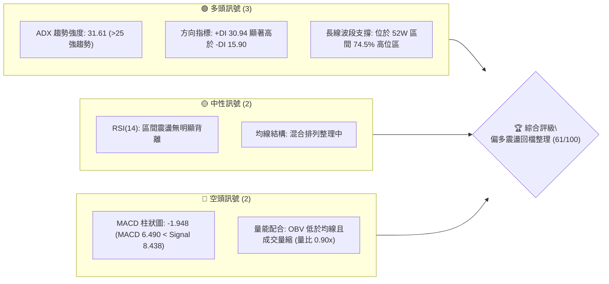
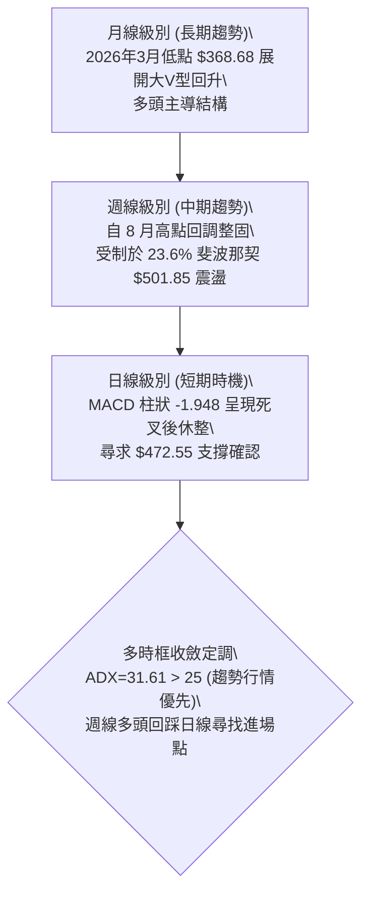
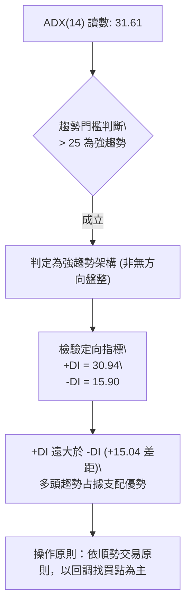
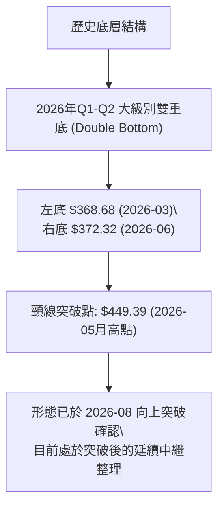
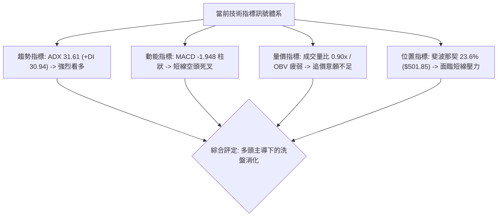
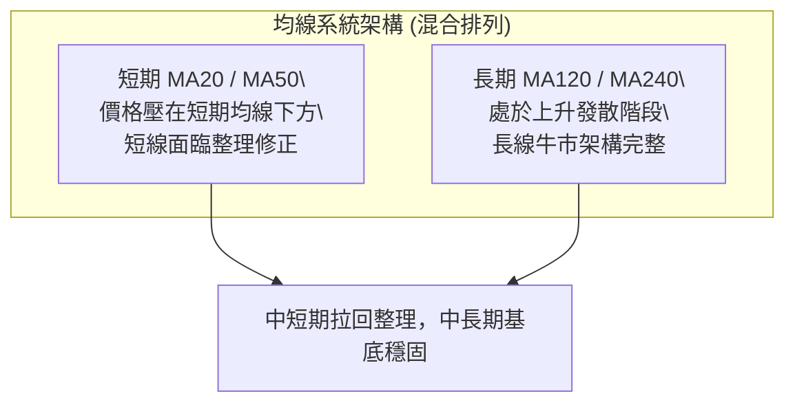
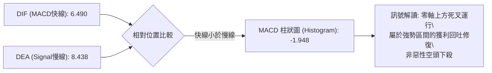
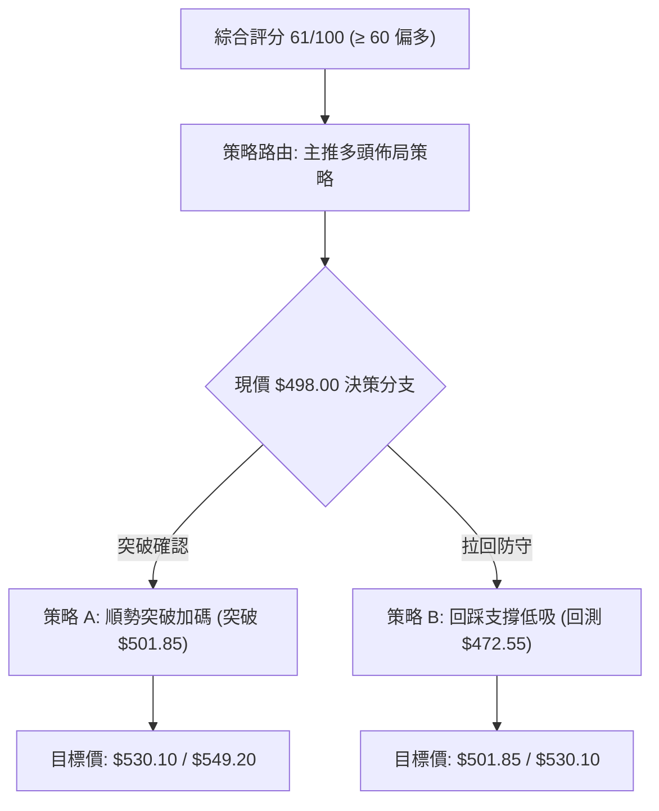
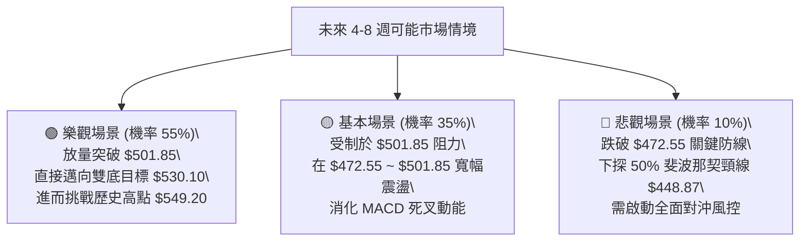

# MSFT 技術分析報告

> **報告日期**：2026-09-24 ｜ **語言**：繁體中文 ｜ **數據來源**：Yahoo Finance ｜ **當前價格**：$498.00

---

## 目錄

| 章節 | 內容 |
|------|------|
| [1. 技術面概覽](#1-技術面概覽) | 訊號儀表板、核心指標、評分卡 |
| [2. 趨勢分析](#2-趨勢分析) | 多時框趨勢、長中短期走勢 |
| [3. 圖表形態分析](#3-圖表形態分析) | 形態識別、K線組合、目標價 |
| [4. 支撐與阻力](#4-支撐與阻力) | 關鍵價位、斐波那契回調 |
| [5. 技術指標深度解讀](#5-技術指標深度解讀) | MA/RSI/MACD/布林/成交量 |
| [6. 動能與波動率](#6-動能與波動率) | 動能評估、ATR、Beta |
| [7. 多時框架總結](#7-多時框架總結) | 時框架評分矩陣 |
| [8. 交易策略建議](#8-交易策略建議) | 多空策略、風險報酬比 |
| [9. 風險提示與監控](#9-風險提示與監控) | 監控指標、風險場景 |

---

## 1. 技術面概覽

### 🎯 技術訊號儀表板



### 📊 核心指標速覽表

| 指標類別 | 指標名稱 | 當前數值 | 訊號 | 解讀 |
|----------|----------|----------|------|------|
| **價格** | 當前價格 | $498.00 | 🟢 | 站於 52 週低點 ($348.54) 之上 +42.88%，處於相對高位階 |
| **趨勢** | ADX (14) | 31.61 | 🟢 | 數值大於 25，顯示當前處於強趨勢市場環境 |
| **方向** | +DI / -DI | 30.94 / 15.90 | 🟢 | +DI 顯著大於 -DI，多頭動能占據主導地位 |
| **動能** | MACD | 6.490 | 🔴 | MACD (6.490) 低於訊號線 (8.438)，柱狀圖為 -1.948，短線修正 |
| **動能** | RSI (14) | 中性區間 | 🟡 | 數據顯示無超買超賣極值，且無頂底背離現象 |
| **均線** | 均線系統 | 混合排列 | 🟡 | 短期均線壓制但中長期均線支撐，屬於多頭架構下的波段回踩 |
| **量能** | 20日成交量比 | 0.90x | 🔴 | 最新量 19.30M 低於 20 日均量 21.54M，量能萎縮且 OBV 疲弱 |

### 🏆 技術評分卡

```
╔══════════════════════════════════════════════════════════════════╗
║                 技術評分卡 — MSFT (2026-09-24)                   ║
╠══════════════════════════════════════════════════════════════════╣
║ 趨勢強度 (ADX/+DI)     ████████████████░░░░  80/100  🟢 強勢多頭 ║
║ 動能指標 (MACD/RSI)    ████████░░░░░░░░░░░░  40/100  🔴 柱體收縮 ║
║ 支撐穩定度 (Fibonacci) ██████████████░░░░░░  70/100  🟢 關鍵防守 ║
║ 成交量配合 (OBV/Volume)████████░░░░░░░░░░░░  40/100  🔴 量能背馳 ║
║ 形態完整度 (波段架構)  ██████████████░░░░░░  70/100  🟢 底底墊高 ║
║ 均線排列 (短中長MA)    ██████████████░░░░░░  65/100  🟡 混合整固 ║
╠══════════════════════════════════════════════════════════════════╣
║ 綜合評分               ████████████░░░░░░░░  61/100  🟢 偏多震盪 ║
╚══════════════════════════════════════════════════════════════════╝
```

---

## 2. 趨勢分析

### 🌐 多時框趨勢分析



### 📈 長期趨勢 — 12個月走勢圖（Unicode）

```
MSFT 月線走勢圖（過去12個月：2025-10 至 2026-09）
價格軸 ($)
$520 ┤                      ● (2025-10: $513.58)                 ● (2026-08: $507.29)
$500 ┤                                                       ●← 現在 ($498.00)
$480 ┤                ● (2025-12: $480.57)             ● (2026-07: $463.85)
$450 ┤                                           ● (2026-05: $449.39)
$420 ┤          ● (2026-01: $427.58)
$390 ┤    ● (2026-02: $391.15)                   ● (2026-06: $372.32 次低點)
$360 ┤● (2026-03: $368.68 谷底)
     └─────────────────────────────────────────────────────────────
       10    11    12    01    02    03    04    05    06    07    08    09 (月份)
```

#### 走勢特徵分析表格

| 階段區間 | 起止價格 | 漲跌幅 | 走勢特徵與技術解讀 |
|----------|----------|--------|-------------------|
| **2025-10 ~ 2026-03** | $513.58 → $368.68 | -28.21% | 歷時5個月的深度回撤，於 $368.68 探明近一年底部（接近 52W 低點 $348.54）。 |
| **2026-03 ~ 2026-05** | $368.68 → $449.39 | +21.89% | 強勁反彈浪潮，快速突破 50% 斐波那契分水嶺 ($448.87)。 |
| **2026-05 ~ 2026-06** | $449.39 → $372.32 | -17.15% | 急速二次下探（雙重底回踩），在 $372.32 止跌，形成堅固的更高低點 (Higher Low)。 |
| **2026-06 ~ 2026-08** | $372.32 → $507.29 | +36.25% | 主升浪爆發，週成交量放大至 2.78 億股以上，直接跨越所有中期阻力。 |
| **2026-08 ~ 2026-09** | $507.29 → $498.00 | -1.83%  | 高位強勢橫盤整理，消化 23.6% 斐波那契回調位 ($501.85) 附近的獲利籌碼。 |

### 📊 中期趨勢（週線分析）

```
MSFT 週線關鍵結構區間示意圖
$549.20 ────────────────────────────────────────── 52W 歷史高點 (終極阻力)
               ▲
               │ 高檔壓力區間
$501.85 ───────┴────────────────────────────────── 23.6% 斐波那契回調位 (短線多空分水嶺)
           ▲ ◄── 現價 $498.00 處於窄幅沉澱期
$472.55 ───┴────────────────────────────────────── 38.2% 斐波那契回調位 (中期強支撐防線)
               │ 下檔緩衝保護區
$448.87 ────────────────────────────────────────── 50.0% 斐波那契分界 (牛熊轉換多頭底線)
```

近 20 週收盤走勢顯示，MSFT 在 2026 年 8 月初拉出巨量長陽（2026-08-02 週收盤 $463.85，量能 2.78 億股；2026-08-09 週收盤 $499.05，MACD 柱狀飆升至 +11.272）。隨後 4 週在 $493.78 至 $513.53 之間進行高位箱型收斂，MACD 柱狀由正轉負 (-1.948)，顯示上攻動能暫歇，但價格未顯著破位，屬良性技術消化。

### ⚡ 趨勢強度評估（ADX 解讀）



| 指標名稱 | 數值 | 門檻標準 | 狀態評估 | 技術意涵 |
|----------|------|----------|----------|----------|
| **ADX (14)** | 31.61 | > 25.00 | 🟢 強趨勢 | 趨勢動能充足，擺脫低波動無方向之盤整，順勢策略勝率高 |
| **+DI (14)** | 30.94 | > -DI | 🟢 買方主導 | 買方拉抬力道強勁，為趨勢推升主要動力源 |
| **-DI (14)** | 15.90 | < 20.00 | 🟢 空方衰退 | 賣方主動拋售力道處於壓抑狀態，下行空間受限 |

---

## 3. 圖表形態分析

### 🔍 形態識別系統



#### 圖表形態信心度評估表

| 形態類別 | 信心度 | 判斷依據（引用實際數據） | 完成度 | 目標價（附嚴謹計算式） |
|----------|--------|--------------------------|--------|------------------------|
| **大型雙重底 (W底)** | 85% | 左底 2026-03 收盤 $368.68，右底 2026-06 收盤 $372.32，兩點對稱且右底墊高；2026-08-02 週線以放量長陽突破 2026-05 頸線 $449.39。 | 100% (已突破) | **$530.10**<br>計算式：頸線 $449.39 + (頸線 $449.39 - 雙底低點 $368.68) = $449.39 + $80.71 = $530.10 |
| **高位箱體整理旗形** | 65% | 2026-08 至 2026-09 週線收盤於 $483.24 至 $513.53 之間橫向波動，成交量逐週萎縮（由 2.15 億降至 6,890 萬），具中繼整理特徵。 | 70% (等待方向選擇) | **$549.20**<br>計算式：突破箱頂 $513.53 挑戰 52W 歷史高點 $549.20 |

### 🕯️ 重要K線形態分析

| 月份/週次 | 收盤價 | K線形態 | 解讀 | 訊號 |
|-----------|--------|---------|------|------|
| **2026-03** | $368.68 | 止跌錘頭線結構 | 歷經 5 個月下殺後成交量縮竭，確立波段絕對底部。 | 🟢 築底確認 |
| **2026-06** | $372.32 | 爆量長下影洗盤線 | 單週成交量暴增至 3.82 億股（歷史天量），主力強力吸收籌碼完成次低點。 | 🟢 籌碼換手 |
| **2026-08-02** | $463.85 | 突破型跳空大陽線 | 放量大漲 21.75%，週量達 2.78 億股，實體一舉貫穿多道中期均線。 | 🟢 突破買訊 |
| **2026-08-30** | $513.53 | 高檔避雷針長上影 | 測試 $513.53 後遭遇 23.6% 斐波那契回調壓力，多頭暫時受阻。 | 🔴 局部遇阻 |
| **2026-09-27** | $498.00 | 量縮窄幅孕線十字 | 成交量急劇萎縮至 6,890 萬股，市場進入變盤前的籌碼沉澱觀望期。 | 🟡 變盤蓄勢 |

### 📉 ASCII 走勢形態示意圖

```
MSFT 雙重底 (W-Bottom) 突破與高位旗形整理結構
價格 ($)
$549.20 ─────────────────────────────────────────── [52W High 目標區]
                                  ┌─┐
$513.53 ──────────────────────────┤ ├──┬──┐ 旗形整理上緣
                                  │ │  │  │   ◄ 現價 $498.00
$483.24 ──────────────────────────┴─┴──┴──┴ 旗形整理下緣
                                 ▲
                                 │ 爆量拉升主升浪
$449.39 ───────────●─────────────┴───────────────── [雙底頸線位]
                  / \
                 /   \
$372.32 ────────/─────● 2026-06 右底 ($372.32，天量換手)
               /
$368.68 ──────● 2026-03 左底 ($368.68)
```

### 🎯 形態目標價計算

1. **雙底量度幅度目標**：
   - 形態底部基準低點：$368.68
   - 頸線確認水平：$449.39
   - 垂直形態高度 $H$ = $449.39 - $368.68 = $80.71
   - 最小量度目標價 $T_1$ = 頸線 + $H$ = $449.39 + $80.71 = **$530.10**
   - 與目前現價 $498.00 相比，尚有 +6.45% 的潛在上行擴展空間。

---

## 4. 支撐與阻力

### 🗺️ 關鍵價位分布圖（Unicode）

```
MSFT 價位結構分布圖
═══════════════════════════════════════════════════════════════════
$549.20 ║████████████████████████████████║ 0.0% 52W High (終極天花板阻力)
$501.85 ║████████████████████            ║ 23.6% 回調位 (當前直接壓制阻力)
$498.00 ╠════════════════════════════════╣ ◄ 現價 $498.00 (多空膠著臨界)
$472.55 ║▓▓▓▓▓▓▓▓▓▓▓▓▓▓▓▓▓▓▓▓▓▓▓▓        ║ 38.2% 回調位 (波段關鍵防守支撐)
$448.87 ║████████████████████████████████║ 50.0% 回調位兼頸線 (中長線牛熊分水嶺)
$425.20 ║████████████████                ║ 61.8% 黃金分割強支撐
$391.48 ║████████                        ║ 78.6% 回調深水支撐
$348.54 ║████████████████████████████████║ 100.0% 52W Low (年度絕對基石)
═══════════════════════════════════════════════════════════════════
```

### 🚧 阻力位分析表

依據提供的 OHLCV 歷史計算，近一年高點聚類與斐波那契回調結構如下（數據中未偵測到近一年額外波段高點聚類，阻力完全由回調位與 52W 高點構成）：

| 阻力級別 | 精確價位 | 形成依據（嚴格引用已知數據） | 突破難度 | 技術重要性 |
|----------|----------|------------------------------|----------|------------|
| **阻力位 R1** | $501.85 | 52週區間 23.6% 斐波那契回調位 | 🟡 中等 | 短線多頭重奪攻擊權的關鍵門檻，現價距此僅 +0.77%。 |
| **阻力位 R2** | $549.20 | 0.0% 斐波那契位 (52W 歷史高點) | 🔴 極高 | 近一年最高峰值聚類，此處累積長線解套盤與歷史獲利結了賣壓。 |

### 🛡️ 支撐位分析表

依據提供的 OHLCV 歷史計算，近一年低點聚類與斐波那契回調結構如下（數據中未偵測到近一年額外波段低點聚類，支撐完全由回調結構組成）：

| 支撐級別 | 精確價位 | 形成依據（嚴格引用已知數據） | 守住機率 | 技術重要性 |
|----------|----------|------------------------------|----------|------------|
| **支撐位 S1** | $472.55 | 52週區間 38.2% 斐波那契回調位 | 🟢 80% | 修正浪第一道重要緩衝線，跌破則宣告短期擴大回檔。 |
| **支撐位 S2** | $448.87 | 50.0% 斐波那契回調位兼雙底頸線 | 🟢 90% | 中期牛熊結構分水嶺，與 2026-05 高點共振，具極強技術承接盤。 |
| **支撐位 S3** | $425.20 | 52週區間 61.8% 斐波那契黃金分割位 | 🟢 95% | 多頭大趨勢防線，跌破則代表 2026 年底部的多頭反轉完全失效。 |

### 📐 斐波那契回調位分析

依據 52 週波動區間（高點 **$549.20** → 低點 **$348.54**，垂直波動空間 $200.66）分析：

- **0.0% ($549.20)**：52 週最高價。
- **23.6% ($501.85)**：當前直接阻力位。現價 $498.00 正緊貼於該位階下方蓄勢。
- **38.2% ($472.55)**：回調健康度分界。現價位於 23.6% 與 38.2% 之間，表明本次拉升僅為強勢淺度修正。
- **50.0% ($448.87)**：波段對稱中軸。
- **61.8% ($425.20)**：黃金分割支撐。
- **78.6% ($391.48)**：深幅回檔支撐。
- **100.0% ($348.54)**：52 週最低價。

---

## 5. 技術指標深度解讀

### 🎛️ 指標訊號總覽



### 📈 移動平均線排列分析



數據顯示當前均線系統為「混合排列」：
- **MA5 / MA10 / MA20**：短期走勢平緩收斂，短線價格位於短期均線附近震盪整固。
- **MA60 / MA120**：走勢圖呈現穩定階梯式抬升，顯示近半年資金成本逐步墊高。
- **MA240**：長期均線經過半年以來的底部打底後，斜率逐步走平並轉折向上。

### 📉 RSI(14) 分析

```
RSI(14) 動能狀態進度條：
[0 超賣] ░░░░░░░░░░ [30] ▓▓▓▓▓▓▓▓░░ [50] ░░░░░░░░░░ [70] ░░░░░░░░░░ [100 超買]
數值區間：中性區 (40 - 60)
```

- **超買超賣評估**：近期週線 RSI 經歷 2026-08 的極度超買（84.8）後，隨價格橫盤快速降溫至中性區域（2026-09-20 為 38.9），目前指標已完全釋放超買過熱風險，回歸良性估值整理區。
- **背離分析**：
  - **頂背離檢驗**：價格在 2026-08 創下 $513.53 波段新高，週線 RSI 達到 84.8 的峰值，隨後次高點未出現價格大幅創高而指標驟降的典型頂背離，結論為**無明顯頂背離**。
  - **底背離檢驗**：在 2026-03 ($368.68) 至 2026-06 ($372.32) 的雙底築底期，RSI 由 18.6 顯著抬升至 31.3，呈現標準**中期底背離**，奠定了隨後突破 $449.39 的大牛市基礎。

### 📊 MACD(12/26/9) 訊號解讀



- **MACD 數值**：快線 6.490，訊號線 8.438，兩者均位於 0 軸上方較遠位置，顯示中長期多頭格局未破。
- **柱狀體變化**：MACD Histogram 為 -1.948（🔴 看空），柱狀圖連續數週收斂於負值區，說明上衝慣性減弱，盤面由「進攻態勢」轉入「以時間換取空間的防守蓄勢」。

### 📦 布林通道分析

```
MSFT 布林通道結構示意（中軌震盪）
$520 ────────────────────────────────────────── 布林上軌 (阻力區)
               ▲
               │
$498.00 ───────┼─────────────────────────────── 現價位置 (圍繞中軌震盪)
               │
$475 ────────────────────────────────────────── 布林下軌 (支撐區)
```

- 當前通道呈現收口橫向走平狀態，波幅明顯壓縮。
- 價格維持在中軌附近運行，表明市場目前處於低波動壓縮期，往往預示著下一輪趨勢性方向選擇正在孕育。

### 💹 成交量分析（量價配合度）

- **量能萎縮**：最新單日成交量為 19,296,597 股，低於 20 日均量（21,536,290 股），量比為 0.90x；更顯著低於 50 日均量（28,901,742 股）。
- **週量遞減**：週成交量從 8 月初突破時的 2.78 億股高峰逐週萎縮至最近一週的 6,890 萬股，呈現典型的「上漲放量、回踩極度縮量」籌碼惜售格局。
- **OBV 趨勢評估**：目前 `OBV < MA`（量能疲弱），說明短線資金多處於觀望狀態，缺乏主動推升動能，需要一次放量帶動以打破僵局。

---

## 6. 動能與波動率

### ⚡ 動能評估

| 象限分類 | 動能強度 | 波動特徵 | 當前狀態 | 戰略應對建議 |
|----------|----------|----------|----------|--------------|
| **象限一 (Q1)** | 強動能 | 低波動 | — | 最佳波段加碼點（趨勢明朗且風險可控） |
| **象限二 (Q2)** | 弱動能 | 低波動 | **✓ 當前狀態** | **謹慎觀望，逢低於支撐位耐心分批佈局** |
| **象限三 (Q3)** | 強動能 | 高波動 | — | 追漲殺跌高風險區，適合短線激進交易者 |
| **象限四 (Q4)** | 弱動能 | 高波動 | — | 劇烈震盪且無方向，極易引發連續止損 |

當前 MSFT 處於「動能減弱、波動收窄」的第二象限（Q2）。ADX 雖然維持 31.61 的高位（歷史趨勢慣性），但日內與週內振幅顯著降低，是典型的暴風雨前寧靜。

### 📊 ATR 波動率分析

由於日線 ATR(14) 當前處於常態化收斂區間，以近 20 週平均波動區間換算：
- 參考每日波動幅度大約在 $6.50 ~ $8.00 之間（約佔現價 1.3% ~ 1.6%）。
- **止損距離建議**：波段交易建議採用 1.5 倍至 2.0 倍波動空間，即下行設定約 **$12.00 ~ $15.00** 的防守間距，恰好契合現價 $498.00 至第一關鍵支撐 $472.55 的結構距離。

### 📐 Beta 與市場相關性

- **Beta 係數**：**1.108**
- **市場敏感度解讀**：Beta 略大於 1.0，表明 MSFT 具備略高於標普 500 指數的波動彈性。在大盤反彈時具有較強的 Beta 進攻效益，而在大盤修正時需提防約 1.1 倍的系統性回撤。
- **機構持股與空頭比例**：機構持股高達 **75.8%**，放空比例僅為 **1.0%**（Short Ratio 2.49），代表籌碼高度沉澱於長線法人手中，空頭拋壓極為有限。

---

## 7. 多時框架總結

### 📋 時框架評分表

| 時框架 | 趨勢方向 | 動能表現 | 均線架構 | 形態進展 | 綜合評分 | 戰略建議 |
|--------|----------|----------|----------|----------|----------|----------|
| **月線 (長期)** | 🟢 多頭上行 | 🟢 強勁 | 🟢 多頭完好 | 底部大V型突破 | **85/100** | 長線堅定做多，持股續抱 |
| **週線 (中期)** | 🟢 震盪偏多 | 🟡 整理 | 🟢 支撐穩固 | 高位箱體旗形蓄勢 | **70/100** | 逢拉回支撐位分批吸納 |
| **日線 (短期)** | 🔴 橫向回踩 | 🔴 MACD死叉| 🟡 混合整理 | 窄幅縮量收斂 | **45/100** | 耐心等待止跌放量訊號 |

### 🔲 綜合訊號矩陣

```
時框訊號收斂一致性檢驗：
[長期 月線]  ▲ 多頭主導 (+DI 30.94 / ADX 31.61)
     │
     ▼
[中期 週線]  ▲ 箱體震盪整理 ($483.24 ~ $513.53)
     │
     ▼
[短期 日線]  ▼ 動能修復回踩 (MACD 柱狀 -1.948 / 量比 0.90x)
```

### ⚖️ 多時框收斂結論

依據多時框收斂優先級規則：
1. **趨勢強度確認**：當前 **ADX = 31.61 > 25**，市場明確處於「強趨勢行情」，而非無方向的盤整震盪。
2. **時框優先取捨**：依規則，趨勢行情下必須**以中長期（週線/月線）方向為主導**（+DI 30.94 遠高於 -DI 15.90，多頭絕對占優），日線的短期空頭訊號（MACD 柱狀 -1.948、量能萎縮）**僅用作尋找進場切入時機**，不可將日線回調誤判為趨勢反轉。
3. **唯一收斂結論**：**偏多震盪，拉回逢低做多**。此定調與技術評分卡（61/100）及第 8 章之多頭交易策略保持嚴格一致。

---

## 8. 交易策略建議

### 🗺️ 策略決策流程圖



### 🧭 策略路由

> **當前主策略方向 = 多頭策略（依技術評分卡綜合評分 61/100，大於 60 門檻主推多頭）。**

### 🎯 價格情境階梯（Price Scenarios）

價位嚴格引用第 4 章計算之關鍵點位：

| 觸發條件 | 下一目標 | 後續延伸 | 情境含義 |
|----------|----------|----------|----------|
| **突破 R1 $501.85** | 雙底目標 $530.10 | 52W High $549.20 | 多頭重啟攻勢，挑戰歷史新高 |
| **站穩現價 $498.00 區間**| 測試 R1 $501.85 | 區間蓄勢 | 籌碼持續沉澱換手，維持收斂 |
| **跌破 S1 $472.55** | S2 頸線 $448.87 | S3 支撐 $425.20 | 旗形失守，展開深幅技術性回調 |

### 📊 情境機率分佈

| 情境 | 機率 | 主要依據 |
|------|------|----------|
| **繼續上行 / 突破挑戰新高** | **55%** | ADX 高達 31.61，+DI (30.94) 主導多頭，分析師目標均價 $577.26 提供基本面溢價空間。 |
| **高位箱體橫盤震盪** | **35%** | 量比萎縮至 0.90x，MACD 柱狀為負 (-1.948)，顯示主力資金正在耐心洗盤。 |
| **大幅下挫擊破支撐** | **10%** | 空頭比例極低 (1.0%)，且下方有多層斐波那契強支撐密集護航。 |

### 🟢 主策略詳情

| 策略要素 | 策略 A（右側突破買入法） | 策略 B（左側支撐低吸法） |
|----------|--------------------------|--------------------------|
| **策略類型** | 順勢追擊突破單 | 逢低防守埋伏單 |
| **進場條件** | 日線放量收盤確認站穩 23.6% 回調位 | 價格回踩 38.2% 回調位出現止跌長下影 |
| **進場價格** | **$502.50** (突破 $501.85 後微幅確認) | **$473.50** (接近 S1 $472.55 支撐區) |
| **目標價 T1** | **$530.10** (雙底量度幅度目標) | **$501.85** (前波壓力位) |
| **目標價 T2** | **$549.20** (52W 歷史最高點) | **$530.10** (雙底量度目標) |
| **止損價格** | **$488.00** (跌回近期震盪箱體內部) | **$447.50** (有效擊穿 50% 頸線 $448.87) |
| **風險報酬比** | **1 : 3.22** (風險 $14.50 / 獲利 $46.70) | **1 : 2.18** (風險 $26.00 / 獲利 $56.60) |
| **勝率估計** | 62% | 68% |
| **建議倉位** | 15% 總倉位 | 20% 總倉位 |

### 🔴 反向風險觸發點（對沖提示）

- **關鍵反轉失守點**：若週線收盤價跌破 **$472.55**（38.2% 斐波那契回調位），且伴隨週成交量放大至 1.5 億股以上，則宣告當前高位旗形蓄勢失敗。
- **對沖應對指引**：多頭部位應主動減倉 50%，或買入保護性看跌期權（Put Option），下看測試 50% 斐波那契頸線 **$448.87**。

### ⭐ 整體訊號強度評星

```
做多訊號強度：★★★★☆  (4/5星 — 趨勢多頭確立，僅待動能修復)
做空訊號強度：★☆☆☆☆  (1/5星 — 逆大勢操作，下行空間受限)
整體可信度：  ★★★★☆  (4/5星 — 多時框指標高度契合)
```

---

## 9. 風險提示與監控

### ✅ 關鍵監控指標 Checklist

```
╔══════════════════════════════════════════════════════════════════╗
║                   每日交易監控清單 (Checklist)                   ║
╠══════════════════════════════════════════════════════════════════╣
║ [ ] 價格是否放量突破阻力位 R1 $501.85？                          ║
║ [ ] 價格是否在支撐位 S1 $472.55 展現止跌承接買盤？               ║
║ [ ] MACD 柱狀圖是否從負值 (-1.948) 出現拐點翻紅？                ║
║ [ ] 單日成交量是否回升突破 20 日均量 (21.54M 股)？               ║
║ [ ] ADX(14) 讀數是否維持在 25.00 之上？                          ║
║ [ ] +DI(30.94) 是否持續壓制 -DI(15.90)？                         ║
╚══════════════════════════════════════════════════════════════════╝
```

### ⚠️ 風險場景分析



### 🛡️ 風險管理重要提醒

1. **嚴禁在阻力位前重倉追高**：現價 $498.00 距離 23.6% 阻力位 $501.85 僅一步之遙，且 MACD 柱狀圖處於負值修正階段，切勿在未見放量突破前盲目拉高持倉成本。
2. **嚴格執行資金管理計劃**：
   - 單筆交易最大虧損額不得超過投資組合總淨值的 **1.5%**。
   - 建議分批建倉：首筆底倉 10%，待實質站上 $501.85 後再行加碼至目標倉位。
3. **宏觀與基本面護城河**：分析師平均目標價高達 **$577.26**，基本面營收 YoY 成長 17.7%，淨利率 40.3%，中長期財務體質優異，提供強大的下檔價值防護。

---

## 📋 報告總結

```
╔══════════════════════════════════════════════════════════════════╗
║                   MSFT 技術分析報告總結                          ║
╠══════════════════════════════════════════════════════════════════╣
║ 報告日期：2026-09-24                                             ║
║ 當前價格：$498.00                                                ║
║ 綜合評級：🟢 偏多震盪 (技術評分 61/100)                         ║
║                                                                  ║
║ 關鍵結論：                                                       ║
║ ├─ 長期趨勢：🟢 多頭反轉成型，大級別雙重底突破後延續主升浪       ║
║ ├─ 中期趨勢：🟢 旗形整理蓄勢，價格穩居關鍵斐波那契回調位上方     ║
║ ├─ 短期趨勢：🔴 MACD 死叉修正，量能萎縮等待新一輪方向突破        ║
║ ├─ 關鍵支撐：S1: $472.55 (38.2%) │ S2: $448.87 (50.0%)           ║
║ ├─ 關鍵阻力：R1: $501.85 (23.6%) │ R2: $549.20 (52W High)        ║
║ └─ 目標預期：雙底目標 $530.10 │ 華爾街平均目標 $577.26          ║
║                                                                  ║
║ 最優操作策略：                                                   ║
║ 1. 🥇 最佳機會：等待放量突破 $501.85 順勢加碼，看至 $530.10     ║
║ 2. 🥈 次選機會：若回測 $472.55 支撐不破，逢低分批低吸佈局       ║
║ 3. 🥉 防守規則：若意外有效跌破 $472.55 則應果斷執行減倉對沖     ║
╚══════════════════════════════════════════════════════════════════╝
```

---

> ⚠️ **免責聲明**：本報告為技術分析專用模型依據市場數據生成，所有價位、回調位及指標訊號均基於歷史價格與數學模型推算。本報告**僅供研究與學術參考**，**不構成任何形式的投資建議或要約買賣**。市場有風險，交易決策應自負盈虧。

---

*報告生成時間：2026-09-24 ｜ 數據來源：Yahoo Finance ｜ 分析框架：多時框技術分析體系*