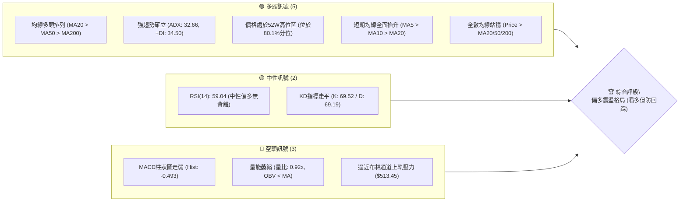
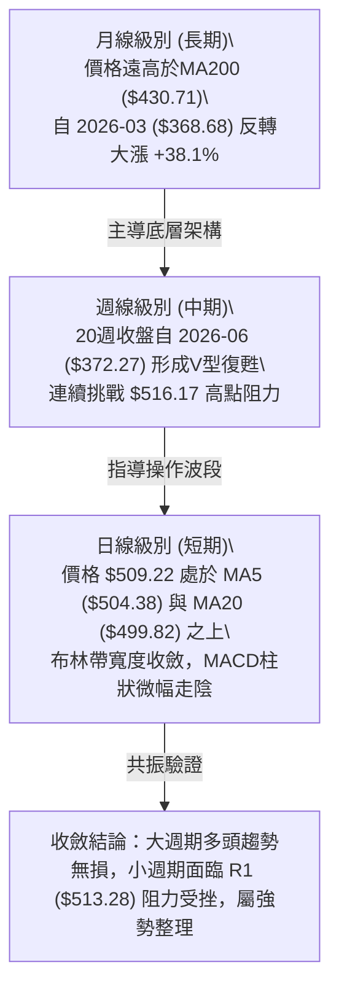
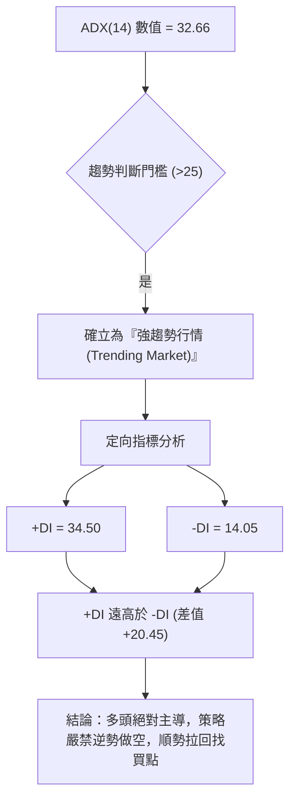
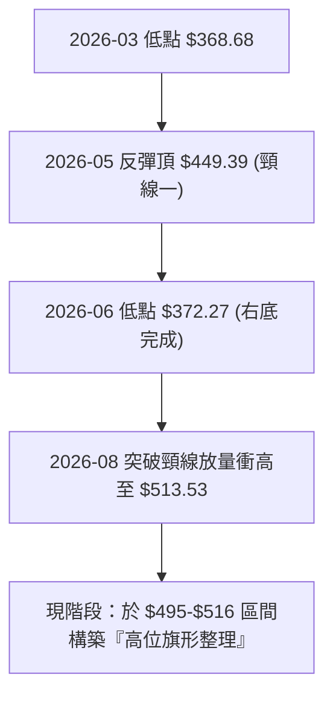
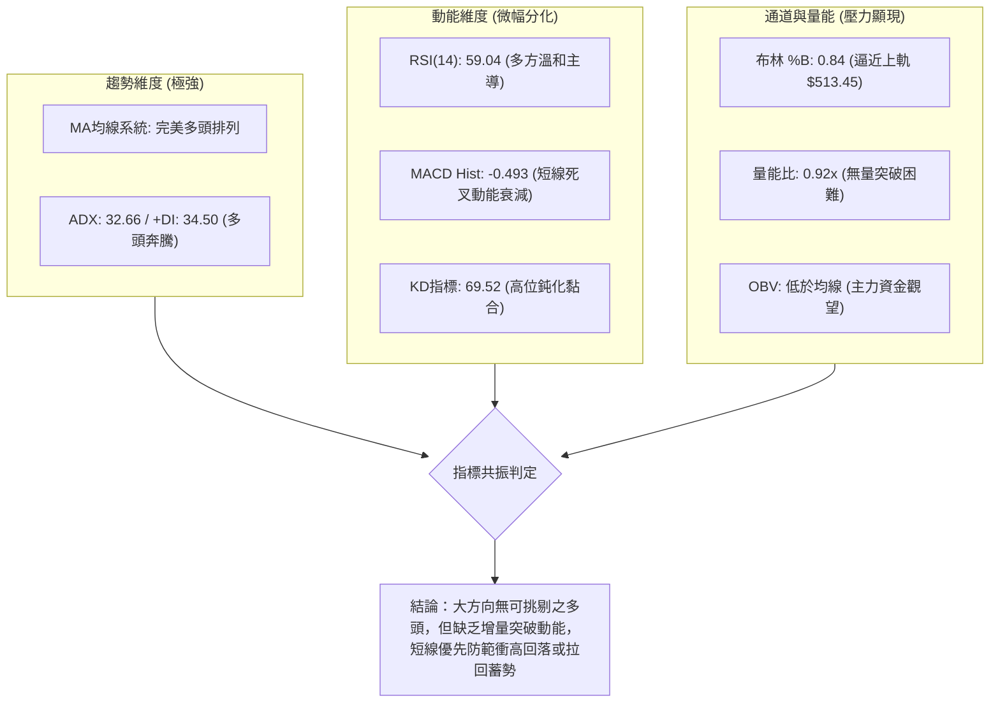
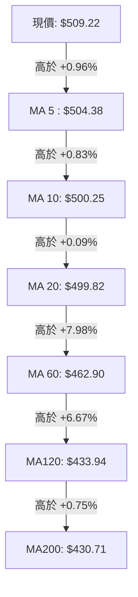
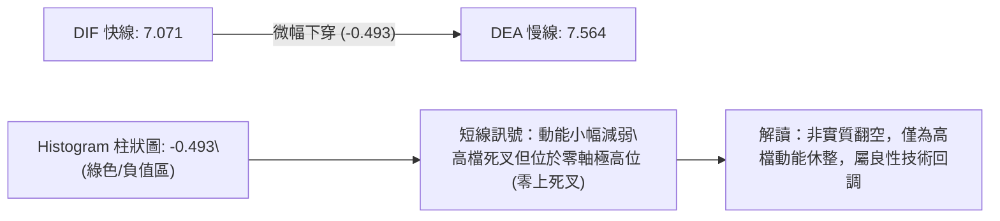
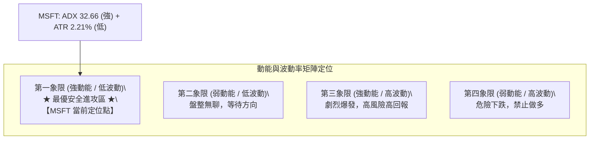
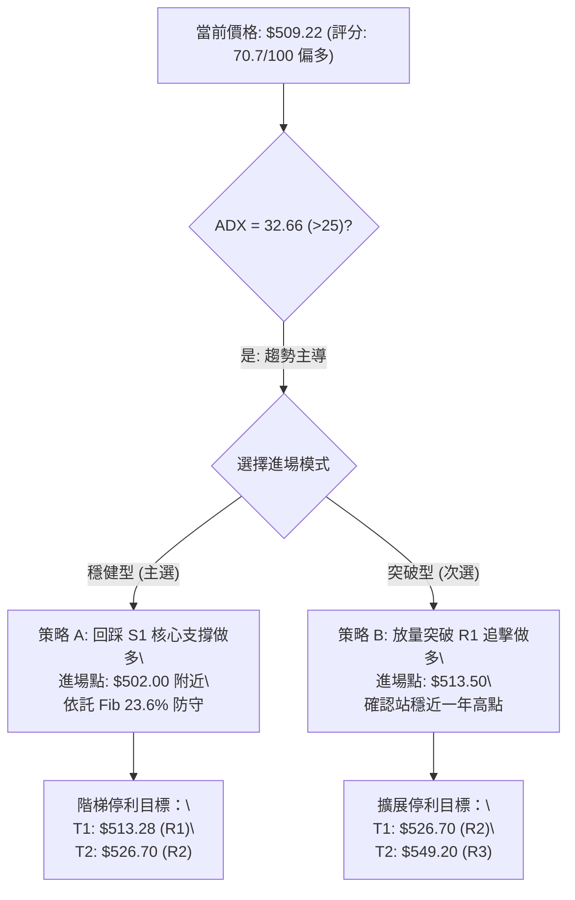
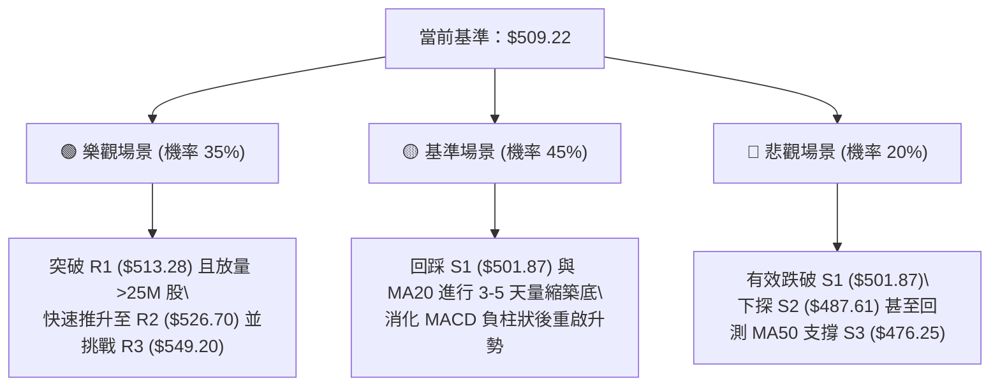

# MSFT 技術分析報告

> **報告日期**：2026-09-29 ｜ **語言**：繁體中文 ｜ **數據來源**：Yahoo Finance ｜ **當前價格**：$509.22

---

## 目錄

| 章節 | 內容 |
|------|------|
| [1. 技術面概覽](#1-技術面概覽) | 訊號儀表板、核心指標、評分卡 |
| [2. 趨勢分析](#2-趨勢分析) | 多時框趨勢、長中短期走勢、ADX解讀 |
| [3. 圖表形態分析](#3-圖表形態分析) | 形態識別、K線組合、目標價測算 |
| [4. 支撐與阻力](#4-支撐與阻力) | 關鍵價位分布、斐波那契回調結構 |
| [5. 技術指標深度解讀](#5-技術指標深度解讀) | MA排列、RSI、MACD、布林通道、OBV量價 |
| [6. 動能與波動率](#6-動能與波動率) | 動能四象限、ATR波幅、Beta相關性 |
| [7. 多時框架總結](#7-多時框架總結) | 時框架評分矩陣、收斂規則方向判定 |
| [8. 交易策略建議](#8-交易策略建議) | 主策略路由、情境階梯、風控點位 |
| [9. 風險提示與監控](#9-風險提示與監控) | 監控Checklist、三行情境演變、倉位指引 |

---

## 1. 技術面概覽

### 🎯 技術訊號儀表板



---

### 📊 核心指標速覽表

| 指標類別 | 指標名稱 | 當前數值 | 訊號 | 解讀 |
|----------|----------|----------|------|------|
| **價格** | 當前價格 | $509.22 | 🟢 | 站上所有主要均線，位於52週高低點之 80.1% 高位區 |
| **短期均線** | MA20 | $499.82 | 🟢 | 現價高於 MA20 達 +1.88%，短線支撐強勁 |
| **中期均線** | MA50 | $477.73 | 🟢 | 現價高於 MA50 達 +6.59%，中期上升通道維持良好 |
| **長期均線** | MA200 | $430.71 | 🟢 | 現價高於 MA200 達 +18.23%，長期牛市基調明確 |
| **動能指標** | RSI(14) | 59.04 | 🟡 | 位於50中軸上方，未達超買區（>70），無頂背離 |
| **動能指標** | MACD (12,26,9) | 7.071 / 7.564 | 🔴 | 快線微幅跌破慢線，Histogram為 -0.493，動能微幅鈍化 |
| **趨勢強度** | ADX(14) | 32.66 | 🟢 | ADX > 25 且 +DI(34.50) 遠大於 -DI(14.05)，多頭趨勢顯著 |
| **通道位置** | Bollinger %B | 0.84 | 🟡 | 逼近布林上軌 ($513.45)，短線存在均值回歸拉回壓力 |
| **成交量能** | 20日均量比 | 0.92x | 🔴 | 成交量 19.61M 低於20日均量 21.33M，OBV疲弱未放量 |
| **市場波動** | ATR(14) | $11.26 | 🟡 | 每日平均波動 2.21%，波動率維持常態偏低水平 |

---

### 🏆 技術評分卡

```
╔══════════════════════════════════════════════════════════════════╗
║              技術評分卡 — MSFT (2026-09-29)                      ║
╠══════════════════════════════════════════════════════════════════╣
║ 趨勢強度 (ADX/+DI)     ████████████████░░░░  82/100 🟢 強勢趨勢 ║
║ 均線排列 (MA多頭)      ██████████████████░░  90/100 🟢 完美多頭 ║
║ 動能指標 (RSI/MACD)    ████████████░░░░░░░░  60/100 🟡 短線鈍化 ║
║ 支撐穩定度 (S1/S2/S3)  ████████████████░░░░  78/100 🟢 階梯堅固 ║
║ 成交量配合 (OBV/量比)  ████████░░░░░░░░░░░░  42/100 🔴 量價背離 ║
║ 形態完整度 (通道/雙底) ██████████████░░░░░░  72/100 🟢 築底完成 ║
╠══════════════════════════════════════════════════════════════════╣
║ 綜合技術評分           ██████████████░░░░░░  70.7/100 🟢 偏多進攻║
╚══════════════════════════════════════════════════════════════════╝
```

---

## 2. 趨勢分析

### 🌐 多時框趨勢分析



---

### 📈 長期趨勢 — 12個月走勢圖（Unicode）

以下為 MSFT 過去 12 個月（2025-10 至 2026-09）之月線收盤走勢全景圖：

```
MSFT 月線收盤走勢圖（過去12個月）
價格軸 ($)
$540 ┤
$520 ┤                                                 ● $509.22 (現價)
$500 ┤● $513.58                                  ● $507.29
$480 ┤      ● $488.91 ● $480.57            ● $463.85
$460 ┤                               ● $449.39
$440 ┤            ● $427.58
$420 ┤                                     ● $406.13
$400 ┤                  ● $391.15
$380 ┤                                           ● $372.32
$360 ┤                        ● $368.68(年內低點)
     └┬─────────┬─────────┬─────────┬─────────┬─────────┬─────────┬─────────►
    25-10     25-11     25-12     26-01     26-02     26-03     26-04 ... 26-09
```

#### 走勢特徵分析表格

| 階段區間 | 起訖月份 | 起訖價格 | 區間漲跌幅 | 結構形態與成交特徵 |
|----------|----------|----------|------------|--------------------|
| **高位回撤期** | 2025-10 → 2026-03 | $513.58 → $368.68 | -28.21% | 自 $513.58 一路受壓滑落，並在 2026-03 觸碰波段大底 $368.68（逼近52W低點 $348.54）。 |
| **首輪反彈期** | 2026-03 → 2026-05 | $368.68 → $449.39 | +21.89% | 跌深暴力反彈，連續突破 MA50，於 2026-05-31 出現單週 186.2M 巨量。 |
| **二次探底期** | 2026-05 → 2026-06 | $449.39 → $372.32 | -17.15% | 快速回洗測試底部支撐，於 2026-06-28 週成交量暴增至 382.7M，完成恐慌拋售底。 |
| **主升主浪期** | 2026-06 → 2026-09 | $372.32 → $509.22 | +36.77% | 確立「雙底」後連續反彈，8月起收復 $500 大關，直逼歷史阻力群。 |

---

### 📊 中期趨勢（週線分析）

從近 20 週收盤走勢觀察，MSFT 展現極為強勁的「多頭復甦波段」：
1. **底部爆量放晴**：2026-06-28 該週以 $372.27 創波段低點，成交量爆出 382,709,200 股的天量，形成典型「量竭反轉點」。
2. **週線 MACD 與 RSI 飆升**：自 2026-08-02 該週跳空收 $463.85（RSI 75.0, MACD Hist +7.446）起，開啟大推升浪；隨後於 2026-08-16 攀至 RSI 84.8 的極限超買區。
3. **高位震盪蓄勢**：近 5 週（2026-08-30 至 2026-10-04）週收盤價緊鎖於 $493.78 至 $516.17 之間，週線 MACD 柱狀圖由正轉微負（-0.493 至 -3.845），顯示上升趨勢未改，但在歷史密集成交區進行高檔消化。

```
中期週線支撐壓力結構示意
$549.20 ────────────────────────────── 52W High / R3 (長期終極阻力)
$526.70 ------------------------------ R2 (波段高點阻力)
$513.28 ══════════════════════════════ R1 / 近期週線收盤密集頂 ($516.17 遇阻)
$509.22 ◄───────── [現價位置]
$501.87 ────────────────────────────── S1 / Fib 23.6% ($501.85) / 週線多空關鍵樞軸
$487.61 ------------------------------ S2 / 8月回踩平台低點 ($483.24 支撐群)
$476.25 ────────────────────────────── S3 / MA50 ($477.73) / Fib 38.2% ($472.55)
```

---

### ⚡ 趨勢強度評估（ADX 解讀）



#### ADX 強度量化對照表

| ADX 區間 | 趨勢狀態 | MSFT 當前狀態 | 交易策略指導 |
|----------|----------|---------------|--------------|
| 0 – 20 | 盤整無方向 | 否 | 區間震盪高拋低吸，禁用突破策略 |
| 20 – 25 | 趨勢萌芽/即將轉變 | 否 | 密切觀察布林開口與均線糾結突破 |
| **25 – 40** | **強趨勢確立** | **✓ (當前 32.66)** | **嚴格遵從主時框方向；利用短期回調逢低做多** |
| 40 – 60 | 極強趨勢/衝刺階段 | 否 | 移動保護止損，擴大盈虧比，避免盲目追高 |
| > 60 | 趨勢過度延伸 | 否 | 提防力竭反轉，隨時準備分批獲利了結 |

---

## 3. 圖表形態分析

### 🔍 形態識別系統



#### 形態信心度與目標測算表

| 形態類別 | 信心度 | 判斷依據（引用數據） | 完成度 | 目標價（附嚴謹計算式） |
|----------|--------|----------------------|--------|------------------------|
| **大型雙重底 (W-Bottom)** | **85%** | ① 左底 2026-03 收盤 $368.68；<br>② 右底 2026-06 收盤 $372.27，兩次低點落於同水平；<br>③ 2026-06-28 爆出 382.7M 巨量確認洗盤完成；<br>④ 頸線於 $449.39。 | 100% (已突破頸線) | **測算目標價 = $530.10**<br>計算式：頸線 $449.39 + (頸線 $449.39 - 左底 $368.68) = $449.39 + $80.71 = $530.10。<br>（高度接近阻力位 R2 $526.70） |
| **高位看漲旗形 (Bull Flag)** | **65%** | ① 旗桿：8月初自 $380.98 暴升至 $513.53（單波 +132.55）；<br>② 旗面：近4週在 $493.78 至 $516.17 內收斂震盪；<br>③ 成交量自 278M 連續萎縮至 19.6M，符合旗面量縮特徵。 | 70% (尚待帶量突破 R1 $513.28) | **形態延伸目標 = $549.20**<br>若向上突破 R1，等長測幅將直指 52W 高點 R3 $549.20。 |
| **三尊頭肩頂形態** | 15% | 數據中未偵測到頂部幾何特徵。MA 多頭排列完整，判斷為無效反轉形態。 | 0% | 訊號不足，不予計算。 |

---

### 🕯️ 重要K線形態分析

| 觀測週期/月份 | 收盤價 | K線組合形態 | 解讀 | 訊號 |
|---------------|--------|-------------|------|------|
| **2026-06-28 (週)** | $372.27 | 爆量長下影錘頭線 (Hammer) | 3.82億股天量下影線，空頭賣壓耗竭，主力進場掃貨確立大底。 | 🟢 強烈看多 |
| **2026-08-02 (週)** | $463.85 | 巨陽突破吞噬 (Bullish Engulfing) | 跳空爆量站上所有中期均線，單週漲逾 21%，確立主升浪啟動。 | 🟢 強烈看多 |
| **2026-08-30 (週)** | $513.53 | 高檔長上影十字星 (Doji) | 首次試探歷史阻力群 $513-$516，多空於高檔劇烈交鋒，留下調節痕跡。 | 🟡 警告訊號 |
| **2026-09-20 (週)** | $493.78 | 縮量陰十字星 (Spinning Top) | 回測 S1 ($501.87) 下方後迅速獲得低接買盤支撐，成交量萎縮至 1.15億股。 | 🟢 支撐確認 |
| **2026-09-27 (週)** | $516.17 | 中陽實體收復線 | 強勢反彈站回 $510 之上，多頭重新奪回日線主導權。 | 🟢 短線偏多 |

---

### 📉 ASCII 走勢形態示意圖

```
MSFT 高位上升旗形（Bull Flag）整理結構示意圖
$526.70 ┤                                                 [R2 目標]
$516.17 ┤                     ●(旗面高點 09-27)
$513.28 ┤       ●(旗頂 08-30)   │ ╲               [R1 阻力線: 突破點]
$509.22 ┤───────┼───────────────┼──●(現價)─────────────
$501.87 ┤       │               │     ╲           [S1 旗面下緣支撐]
$493.78 ┤       │               ●(旗底 09-20)
        │       │                 ▲
$463.85 ┤       ●(主升旗桿)       │ (健康量縮拉回整理)
        │      ╱
$380.98 ┤     ●(起漲底部)
        └───────────────────────────────────────────────► 時間軸
```

---

### 🎯 形態目標價測算依據

1. **W 底量度漲幅測算**：
   - 頸線位置：$449.39
   - 最低點（左底）：$368.68
   - 形態垂直幅度 = $449.39 - $368.68 = $80.71
   - 理論最小目標價 = 頸線 $449.39 + $80.71 = **$530.10**（此數值與關鍵阻力 **R2 $526.70** 高度重合，僅差 0.6%）。
2. **旗形突破測算**：
   - 現價若帶量穿透 R1 ($513.28)，旗形將宣告向上突破，依據歷史高點聚類，下一站直指 **52W 高點 R3 $549.20**。

---

## 4. 支撐與阻力

### 🗺️ 關鍵價位分布圖（Unicode）

```
MSFT 關鍵價位階梯與籌碼結構分布圖
═════════════════════════════════════════════════════════════════
$549.20 ║██████████████████████████████║ 強阻力 R3 (52W歷史天花板/0.0% Fib)
$526.70 ║████████████████████          ║ 波段阻力 R2 (W底形態測算目標區)
$513.45 ║██████████████████            ║ 布林通道上軌壓力
$513.28 ║████████████████████████      ║ 關鍵阻力 R1 (近一年波段高點聚類)
────────╫──────────────────────────────╫────────────────────────
$509.22 ╠══════════════════════════════╣ ◄ 現價位置 ($509.22)
────────╫──────────────────────────────╫────────────────────────
$501.87 ║▓▓▓▓▓▓▓▓▓▓▓▓▓▓▓▓▓▓▓▓▓▓        ║ 第一關鍵支撐 S1 (23.6% Fib / MA10 / 樞軸)
$499.82 ║▓▓▓▓▓▓▓▓▓▓▓▓▓▓▓▓              ║ 布林中軌支撐 (MA20)
$487.61 ║████████████████████████      ║ 強支撐 S2 (8月震盪底 / 布林下軌 $486.20)
$476.25 ║██████████████████████████████║ 核心防守支撐 S3 (MA50 $477.73 / 38.2% Fib)
═════════════════════════════════════════════════════════════════
```

---

### 🚧 阻力位分析表

> **數據引用標準**：嚴格引用數據包「關鍵價位」區塊。

| 阻力級別 | 精確價位 | 距離現價 | 形成原因與籌碼特徵 | 突破難度 | 重要性 |
|----------|----------|----------|--------------------|----------|--------|
| **R1** | **$513.28** | +0.80% | 近一年波段高點密集聚類區；與布林通道上軌 ($513.45) 形成重疊共振壓力。 | 中等 | 🔴 極高 (突破即打開上升空間) |
| **R2** | **$526.70** | +3.43% | 近一年次高點籌碼解套壓力區；W底形態最小測算目標 ($530.10) 之引力位。 | 偏高 | 🟡 中高 (波段獲利了結集中地) |
| **R3** | **$549.20** | +7.85% | 52週最高點 (0.0% Fibonacci 回調位)；歷史套牢盤終極天花板。 | 極高 | 🔴 極高 (歷史級突破關鍵) |

---

### 🛡️ 支撐位分析表

> **數據引用標準**：嚴格引用數據包「關鍵價位」區塊。

| 支撐級別 | 精確價位 | 距離現價 | 形成原因與籌碼特徵 | 守住機率 | 重要性 |
|----------|----------|----------|--------------------|----------|--------|
| **S1** | **$501.87** | -1.44% | 52週區間 23.6% 斐波那契位 ($501.85)；與 MA10 ($500.25) 及 MA20 ($499.82) 形成多頭防線。 | 75% | 🟢 極高 (短線多頭生命線) |
| **S2** | **$487.61** | -4.24% | 近一年波段回調低點聚類；與布林通道下軌 ($486.20) 重疊，為強大價值買盤區。 | 85% | 🟢 高 (中期回調極限位) |
| **S3** | **$476.25** | -6.47% | 中期均線 MA50 ($477.73) 匯合處；緊鄰 38.2% 斐波那契回調位 ($472.55)。 | 95% | 🟢 極高 (牛市中長期牛熊分界線) |

---

### 📐 斐波那契回調位分析

依據 52 週波動極限區間（最低 $348.54 → 最高 $549.20，總垂直振幅 $200.66）計算：

| 斐波那契層級 | 精確點位 | 相對現價位置 | 技術意義與多空心理分析 |
|--------------|----------|--------------|------------------------|
| **0.0% (高點)** | **$549.20** | 現價下方 +7.85% | 52週歷史高點，空頭最強防禦線。 |
| **23.6%** | **$501.85** | 現價下方 -1.45% | **超強多頭回調位**。現價 ($509.22) 正位於 0.0% 與 23.6% 的強勢進攻區間內。回調不破此位代表趨勢極強。 |
| **38.2%** | **$472.55** | 現價下方 -7.20% | **常態健康回調位**。與 S3 ($476.25) 及 MA50 ($477.73) 形成三重鐵底防禦圈。 |
| **50.0%** | **$448.87** | 現價下方 -11.85% | 多空中間分水嶺，接近前波雙底頸線 $449.39。 |
| **61.8%** | **$425.20** | 現價下方 -16.50% | 黃金分割防守位，緊鄰 MA200 ($430.71)。 |
| **78.6%** | **$391.48** | 現價下方 -23.12% | 深度回撤防線，失守將重測底盤。 |
| **100.0% (低點)**| **$348.54** | 現價下方 -31.55% | 52週絕對底部，長線價值投資區。 |

> **回調位深度結論**：當前價格 $509.22 穩固運行於 0.0% ($549.20) 與 23.6% ($501.85) 之間，顯示市場處於**最強等級的回調抵抗狀態**。23.6% 位（$501.85）與 S1（$501.87）在小數點層級幾乎完全重疊，奠定 $501.85–$501.87 為本階段最具戰略意義的多頭防守樞紐。

---

## 5. 技術指標深度解讀

### 🎛️ 指標訊號總覽



---

### 📈 移動平均線排列分析



#### 均線矩陣詳細狀態表

| 均線名稱 | 數值 | 價格相距 | 形態走勢特徵 | 訊號評級 |
|----------|------|----------|--------------|----------|
| **MA 5** | $504.38 | +0.96% | ▄▃▂▁▁▁▂▃▄▆█████ 向上翹頭 | 🟢 極短多 |
| **MA 10** | $500.25 | +1.79% | ▅▄▄▃▂▁▁▁▁▂▄▅▆▇█ 持續上移 | 🟢 短線多 |
| **MA 20** | $499.82 | +1.88% | ▁▁▂▃▄▅▅▆▇▇▇█████ 穩固上揚 | 🟢 月線多 |
| **MA 50** | $477.73 | +6.59% | 中期基石，斜率由平轉陡升 | 🟢 季線多 |
| **MA 60** | $462.90 | +10.01%| ▁▁▁▁▁▁▂▂▂▂▂▃▃▃▄▄ 中期助漲強烈 | 🟢 中期多 |
| **MA 120** | $433.94 | +17.35%| ▁▁▁▁▁▂▂▂▂▃▃▃▃▄▄▄ 半年線翻揚 | 🟢 長期多 |
| **MA 200** | $430.71 | +18.23%| 長期牛熊分界，多頭終極陣地 | 🟢 長期多 |
| **MA 240** | $442.25 | +15.14%| ██▇▇▇▇▇▇▇▇▇▇▆▆▆▆▅ 築底完畢回升 | 🟢 週期多 |

> **均線排列結論**：標準的多頭排列（MA5 > MA10 > MA20 > MA50 > MA60 > MA200）。短中長均線全部呈發散上行態勢，下檔均線層層提供充沛支撐墊。

---

### 📉 RSI(14) 分析

- **當前數值**：**59.04**
- **數值進度條**：
  ```
  超賣區 (0-30)        中性平衡區 (30-70)            超買區 (70-100)
  [░░░░░░░░░░] [████████████████████████░░░░░░] [░░░░░░░░░░]  59.04%
  ```
- **區間評估**：處於 50–60 健康的多方掌控區，既脫離了超賣的疲弱，亦未進入 >70 的警戒過熱區。
- **背離驗證**：
  - 現價 $509.22 與 2026-08-30 的 $513.53 高點相比，價位處於高檔震盪。
  - 8月中旬週線 RSI 曾飆至 84.8（極端超買），經過近 5 週的修正，日線 RSI 溫和收斂至 59.04，**未出現連續創高而指標衰退的典型頂背離**；指標冷卻充分，具備再度發動攻擊的空間。

---

### 📊 MACD(12,26,9) 訊號解讀



- **絕對數值**：DIF (7.071) 與 DEA (7.564) 均大幅位於零軸上方（>0），表明**大週期多頭主浪結構非常堅固**。
- **邊際變化**：柱狀圖自高檔收斂轉負（-0.493），提示短期追價動能不足。若不能伴隨放量，現價直接暴衝突破 R1 的概率將受抑制。

---

### 📦 布林通道分析

```
MSFT 布林通道（Bollinger Bands, 20, 2）當前空間定位
$513.45 ┤─────────────────────────────── 布林上軌 (強壓位)
$509.22 ┤═══════════════════════════════ 現價位置 (%B = 0.84)
$499.82 ┤------------------------------- 布林中軌 (MA20 核心支撐)
        │
$486.20 ┤─────────────────────────────── 布林下軌 (超賣反彈位)
```

- **通道帶寬與位置**：帶寬（Bandwidth）目前呈現微幅收口後的走平狀態，上限 $513.45、下限 $486.20、中軌 $499.82。
- **%B 指標解析**：當前 %B 為 **0.84**（高於 0.80 進入高壓帶）。當價格貼近上軌而量能不濟時，常誘發回踩中軌（MA20 $499.82）的拉回測試動作。

---

### 💹 成交量分析（量價配合度）

1. **量比分析**：
   - 最新單日成交量：**19,611,600 股**
   - 20日均量：**21,334,105 股**（量比僅為 **0.92x**）
   - 50日均量：**28,266,950 股**
2. **OBV（能量潮）走勢**：
   - 數據指標明確顯示：`OBV < MA → 量能疲弱`。
   - 價格自 2026-06 底部 $372 翻揚至 $509，但近 3 週成交量未能持續超越 50 日均量線，形成**輕微的「價漲量縮」技術背離**。
3. **戰術含義**：量能未放大前，突破 R1 ($513.28) 易演變為「假突破」；最健康的走勢為回踩 S1 ($501.87) 夯實籌碼後，補量展開主升。

---

## 6. 動能與波動率

### ⚡ 動能評估四象限



#### 四象限評估表

| 象限代號 | 動能強度 | 波動率水準 | MSFT 當前匹配度 | 戰術指引 |
|----------|----------|------------|-----------------|----------|
| **Q1** | **強 (ADX>25)** | **低 (ATR<3%)** | **✓ (極高度匹配)** | **機構最喜愛的「牛皮慢牛」推升期，回調幅度可控，適合順勢持股或回踩低吸。** |
| Q2 | 弱 (ADX<25) | 低 (ATR<3%) | ✗ 不匹配 | 無明顯趨勢，僅宜網格操作。 |
| Q3 | 強 (ADX>25) | 高 (ATR>3%) | ✗ 不匹配 | 爆發突破行情，滑點風險大。 |
| Q4 | 弱 (ADX<25) | 高 (ATR>3%) | ✗ 不匹配 | 崩盤或恐慌殺跌，嚴禁接飛刀。 |

---

### 📊 ATR 波動率分析

- **ATR(14) 絕對值**：**$11.26**
- **價格百分比**：**2.21%**（屬於大型權值股健康之波動區間）
- **止損與風控量化矩陣**：
  - **1.0 倍 ATR**：$11.26（適用於日內超短線緊密跟蹤止損）
  - **1.5 倍 ATR**：**$16.89**（波段交易最佳防守寬度；現價 $509.22 - $16.89 = **$492.33**，恰好覆蓋 S1 $501.87 與 MA20 $499.82，能有效防範假摔侵蝕）
  - **2.0 倍 ATR**：$22.52（寬鬆趨勢追蹤止損點）

---

### 📐 Beta 與市場相關性

- **Beta 係數**：**1.108**
- **特性解讀**：
  - 略高於大盤基準（1.00），代表 MSFT 具備較 S&P 500 多出約 10.8% 的彈性。
  - 當標普或科技板塊（QQQ）發動攻擊時，MSFT 往往具備超額阿爾法（Alpha）進攻性；反之在市場普跌時，需依託 MA20 作為系統性下墜之防護傘。

---

## 7. 多時框架總結

### 📋 時框架評分表

| 時框架 | 趨勢方向 | 動能狀態 | 均線排列 | 形態特徵 | 綜合評分 | 建議方針 |
|--------|----------|----------|----------|----------|----------|----------|
| **長期 (月線)** | 🟢 強烈看多 | 🟢 溫和擴張 | 🟢 完美多頭 (遠高於MA200) | 自年內低點 $368 完成大底翻轉 | **85/100** | 戰略底倉抱緊，不輕易被震倉洗出 |
| **中期 (週線)** | 🟢 偏多進攻 | 🟡 高檔整理 (RSI修復) | 🟢 均線發散向上 | 突破雙底頸線，進入旗形蓄勢 | **75/100** | 逢波段回踩 S1/S2 分批加碼 |
| **短期 (日線)** | 🟡 震盪整理 | 🔴 短線死叉 (MACD走陰) | 🟢 短天期多頭 (站穩MA20) | 逼近 R1 ($513.28) 遇阻，量能不濟 | **60/100** | 拒絕高位追價，耐心等待拉回點位 |

---

### 🔲 綜合訊號矩陣

```
╔══════════════════════════════════════════════════════════════════╗
║                    多時框訊號一致性判定矩陣                      ║
╠══════════════════╦═══════════════════════════════════════════════╣
║ 維度             ║ 長期 (月線)      中期 (週線)      短期 (日線) ║
╠══════════════════╬═══════════════════════════════════════════════╣
║ 趨勢方向         ║ 🟢 看多          🟢 看多          🟡 中性震盪 ║
║ 均線系統         ║ 🟢 多頭排列      🟢 多頭排列      🟢 多頭排列 ║
║ 動能指標         ║ 🟢 向上發散      🟡 震盪降溫      🔴 死叉休整 ║
║ 量價配合         ║ 🟢 底部爆量      🟡 縮量拉升      🔴 均量萎縮 ║
╠══════════════════╬═══════════════════════════════════════════════╣
║ 時框衝突化解權重 ║ 權重：40%        權重：40%        權重：20%   ║
╚══════════════════╩═══════════════════════════════════════════════╝
```

---

### ⚖️ 多時框收斂結論

> **依據「嚴格要求 14」執行精確收斂**：
> 1. **趨勢/盤整性質判定**：當前 ADX(14) 錄得 **32.66**，遠超越 25 的關鍵分水嶺，**確立本輪行情性質為「標準趨勢行情」而非「無序盤整行情」**。
> 2. **主導時框裁決**：在強趨勢行情下，**以中長期時框（週線/MA50、MA200）方向為主導**，日線級別的指標背離或死叉（如當前 MACD Hist -0.493）**僅作為尋找逢低切入的進場時機，不可解讀為趨勢反轉**。
> 3. **唯一方向性結論**：**【強烈偏多，戰術性回踩低吸】**。日線的短線量能不足與布林上軌阻力只會引發向 S1 ($501.87) 的短期整理，絕不改變奔向 R2 ($526.70) 的多頭本質。

---

## 8. 交易策略建議

### 🗺️ 策略決策流程圖



---

### 🧭 策略路由（依評分卡分流）

> **當前主策略方向 = 【主推多頭策略】（依據技術評分卡：70.7 / 100，突破 60 偏多分水嶺）。**
> 嚴格執行「不兩頭下注」紀律，空頭僅列為關鍵支撐跌破時的「反轉防守與對沖警示」。

---

### 🎯 價格情境階梯（Price Scenarios）

所有階梯點位完全鎖定第 4 章關鍵價位區塊之實際數據：

| 價格觸發條件 | 順序下一目標 | 終極延伸目標 | 市場情境與技術含義 |
|--------------|--------------|--------------|--------------------|
| **向上放量突破 R1 ($513.28)** | **R2 ($526.70)** | **R3 ($549.20)** | **短線突破轉強**：旗形向上破繭，直攻 52W 歷史高點。 |
| **維持於現價區間 ($502–$513)** | — | — | **區間蓄勢震盪**：消化日線 MACD 零上死叉，等待補量。 |
| **向下跌破 S1 ($501.87)** | **S2 ($487.61)** | **S3 ($476.25)** | **中期回調轉弱**：跌破 23.6% 回調位，需下探布林下軌及 MA50。 |

---

### 📊 情境機率分佈

| 情境類別 | 發生機率 | 主要技術依據與指標佐證 |
|----------|----------|------------------------|
| **多頭回踩後續攻 (主要)** | **55%** | 均線完美多頭排列；ADX 32.66 強趨勢確立；月線雙底形態紮實支撐。 |
| **窄幅區間拉鋸 (次要)** | **30%** | 最新日成交量比僅 0.92x；布林上軌壓制 (%B 0.84)；MACD 處於降溫週期。 |
| **深度回撤破位 (尾端)** | **15%** | 大盤出現系統性黑天鵝導致跌破 S1，回測 MA50 支撐。 |

---

### 🟢 主策略詳情

本報告設計兩套互補的**進攻型做多策略**：

| 策略要素 | 策略 A（穩健型：回踩支撐低吸）🥇 | 策略 B（進攻型：突破高點追擊）🥈 |
|----------|----------------------------------|----------------------------------|
| **策略定位** | 逢低回測進場，盈虧比極佳 | 放量確認突破進場，資金效率高 |
| **進場條件** | 價格回調至 S1 附近獲得 K 線支撐確認 | 日K線實體帶量突破 R1 ($513.28) 上方 |
| **進場價格** | **$502.00**（緊貼 S1 $501.87 / 23.6% Fib）| **$513.50**（突破 R1 後回測確認） |
| **目標價 T1** | **$513.28**（阻力位 R1） | **$526.70**（阻力位 R2 / W底目標） |
| **目標價 T2** | **$526.70**（阻力位 R2） | **$549.20**（阻力位 R3 / 52W高點） |
| **止損價格** | **$487.61**（嚴格設於強支撐 S2） | **$501.87**（跌回關鍵支撐 S1 止損） |
| **止損距離** | -$14.39 (約 -2.87%，約 1.28x ATR) | -$11.63 (約 -2.26%，約 1.03x ATR) |
| **風險報酬比**| **1.72 : 1**（計算：至T2獲利 $24.7 / 風險 $14.39）| **3.07 : 1**（計算：至T2獲利 $35.7 / 風險 $11.63）|
| **勝率預估** | **70%** | **60%** |
| **建議倉位** | **總資金之 15% - 20%** | **總資金之 10% - 15%** |

---

### 🔴 反向風險觸發點（對沖提示）

若行情未如預期發展，以下為推翻上述看多邏輯的關鍵警示點位，供風控對沖參考：
- **第一警示點（跌破 S1 $501.87）**：若收盤價收破 $501.87，代表 23.6% 斐波那契強支撐失守，多頭主升浪暫告失敗，應將多頭倉位減半，或買入同等市值之反向部位避險。
- **全面停損翻空點（跌破 S2 $487.61）**：若進一步擊穿 8 月密集整理平台 $487.61，確立日線級別走勢翻空，剩餘多單全數離場觀望。

---

### ⭐ 整體訊號強度評星

```
╔══════════════════════════════════════════════════╗
║  做多訊號強度：★★★★☆  (4.0/5星) — 均線與趨勢共振 ║
║  做空訊號強度：★☆☆☆☆  (1.0/5星) — 逆大趨勢不可為 ║
║  整體可信度：  ★★★★☆  (4.2/5星) — 數據層層驗證   ║
╚══════════════════════════════════════════════════╝
```

---

## 9. 風險提示與監控

### ✅ 關鍵監控指標 Checklist

```
╔══════════════════════════════════════════════════════════════════╗
║                    每日盤面關鍵監控清單 (Checklist)              ║
╠══════════════════════════════════════════════════════════════════╣
║ [ ] 價格防禦：收盤價是否持續高於 S1 ($501.87) 關鍵中樞？          ║
║ [ ] 均線動態：MA5 ($504.38) 與 MA10 ($500.25) 是否維持多頭斜率？ ║
║ [ ] 動能指標：日線 MACD 柱狀圖是否從 -0.493 重新拐頭翻紅？        ║
║ [ ] 突破動能：若挑戰 R1 ($513.28)，單日成交量是否超越 25M 股？   ║
║ [ ] 通道監控：布林通道 %B 是否突破 1.00 形成「張口向上」噴發？   ║
║ [ ] 外部連動：大盤 (QQQ/SPY) 是否維持在短期均線之上？            ║
╚══════════════════════════════════════════════════════════════════╝
```

---

### ⚠️ 風險場景分析



---

### 🛡️ 風險管理重要提醒

1. **ATR 動態倉位配置**：
   - 目前 ATR 為 $11.26，單日正常波動幅度為 ±2.21%。
   - 交易者單筆交易所承擔的最大帳戶風險（Account Risk）嚴格控制在總資金的 **1.0% - 1.5%** 以內。
   - 若以本金 $100,000 為例，1% 風險額為 $1,000；若採用策略 A（止損幅度 $14.39），建議持股上限為：$1,000 / $14.39 ≈ **69 股**（約 $35,136 市值，倉位約 35%）。
2. **財報與事件風險防範**：
   - 科技股對美國公債殖利率與雲端/AI 資本支出敏感。若遇重大總經事件或財報公佈日前夕，應主動將倉位壓縮至 15% 以下，切勿進行高槓桿賭徒式持倉。

---

## 📋 報告總結

```
╔══════════════════════════════════════════════════════════════════╗
║                   MSFT 技術分析報告終極總結                      ║
╠══════════════════════════════════════════════════════════════════╣
║ 報告日期：2026-09-29                                             ║
║ 當前價格：$509.22                                                ║
║ 分析評級：🟢 偏多進攻（趨勢強勁，回調即買點）                   ║
╠══════════════════════════════════════════════════════════════════╣
║ 關鍵維度技術定調：                                               ║
║ ├─ 長期趨勢：🟢 強烈看多 (距年內低點大漲 +38.1%，完美遠超MA200)║
║ ├─ 中期趨勢：🟢 偏多進攻 (W底反轉確立，旗形整理待突破)          ║
║ ├─ 短期趨勢：🟡 震盪整理 (MACD高檔死叉微幅鈍化，量比0.92x待放量)║
║ ├─ 核心阻力：R1: $513.28 ｜ R2: $526.70 ｜ R3: $549.20           ║
║ ├─ 關鍵支撐：S1: $501.87 ｜ S2: $487.61 ｜ S3: $476.25           ║
║ └─ 華爾街共識目標價：$577.26 (潛在上行空間 +13.36%)             ║
╠══════════════════════════════════════════════════════════════════╣
║ 最優策略組合建議：                                               ║
║ 1. 🥇 最佳機會 (穩健)：回調至 S1 ($501.87~$502.00) 布局多單，    ║
║    止損設於 S2 ($487.61)，第一目標 $513.28，第二目標 $526.70。   ║
║ 2. 🥈 次選機會 (動能)：若帶量 (>25M) 貫穿 R1 ($513.28)，於       ║
║    $513.50 追擊做多，止損設於 $501.87，直接看至 $549.20 歷史頂。 ║
║ 3. 🥉 保守選擇 (觀望)：手無持倉者可靜待日線 MACD 柱狀圖翻紅，    ║
║    或等待回踩布林中軌 MA20 ($499.82) 企穩後再行進場。            ║
╚══════════════════════════════════════════════════════════════════╝
```

---

> ⚠️ **免責聲明**：本報告為依據量化技術指標與歷史走勢數據生成之專業技術分析，報告中所提及之點位、形態及交易策略**僅供學術研究與參考**，**絕不構成任何具體投資建議或買賣邀約**。金融市場瞬息萬變，投資人應獨立評估市場風險、審慎決策，並自負盈虧。

---

*報告生成時間：2026-09-29 ｜ 數據來源：Yahoo Finance ｜ 分析框架：資深多時框量化技術分析系統*