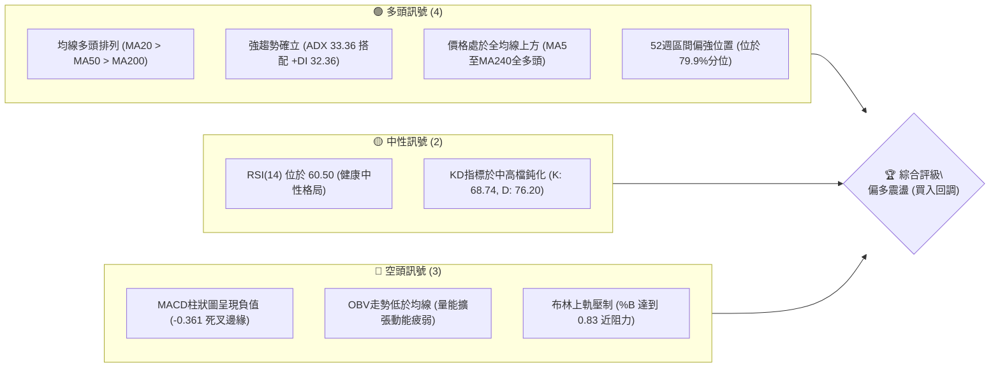
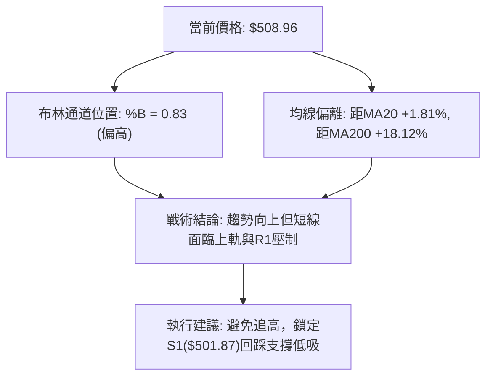
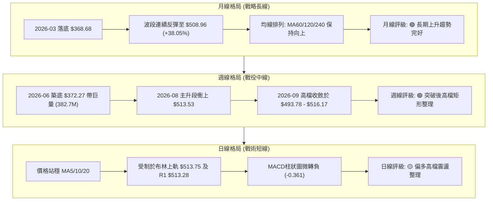
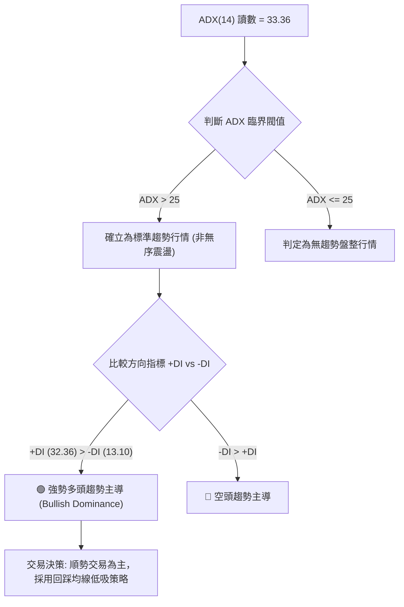
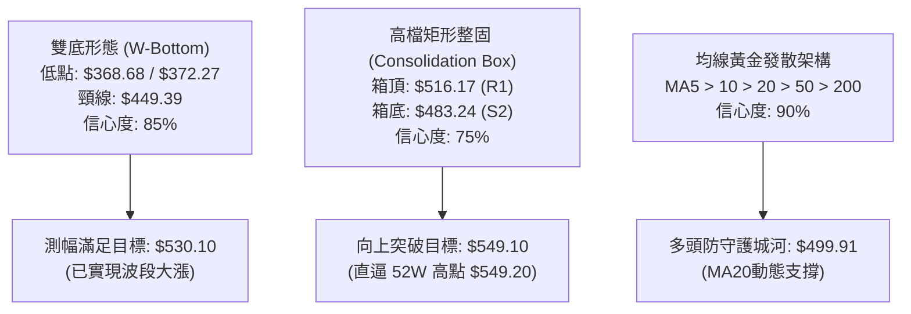
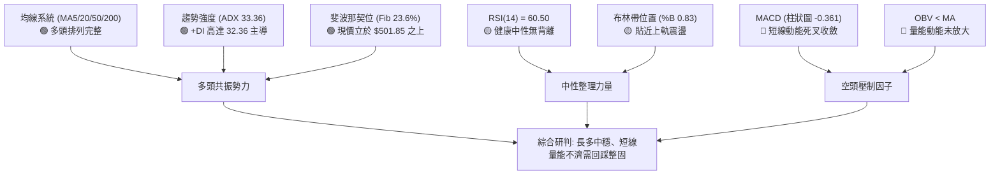
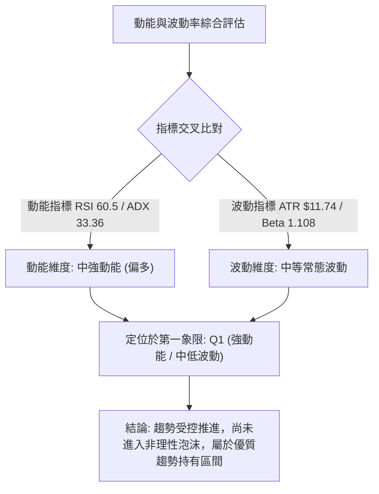
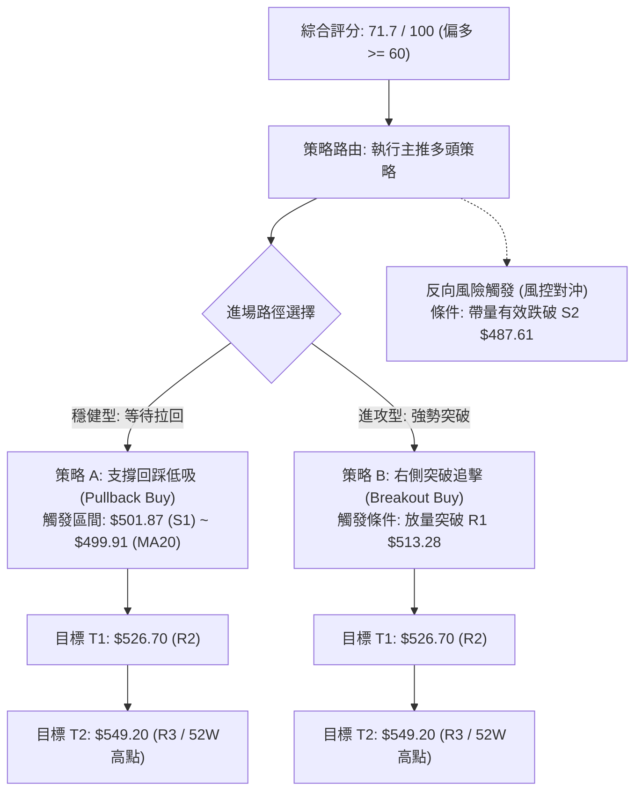
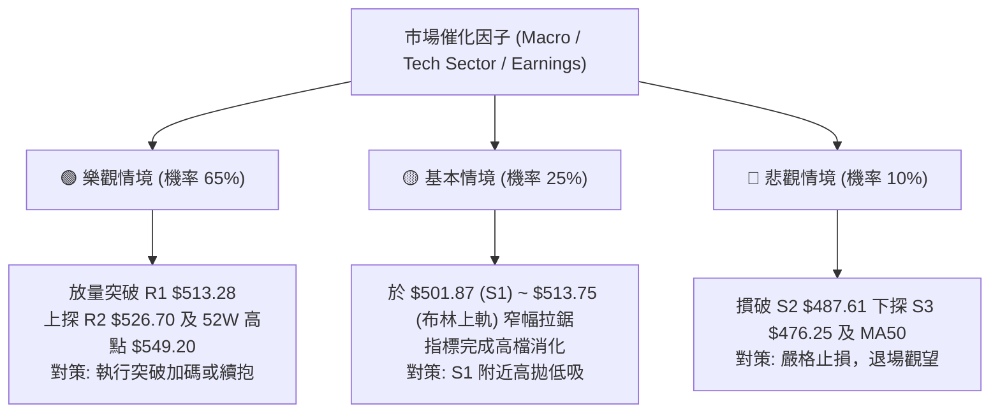

# MSFT 技術分析報告

> **報告日期**：2026-09-30 ｜ **語言**：繁體中文 ｜ **數據來源**：Yahoo Finance ｜ **當前價格**：$508.96

---

## 目錄

| 章節 | 內容 |
|------|------|
| [1. 技術面概覽](#1-技術面概覽) | 訊號儀表板、核心指標、評分卡 |
| [2. 趨勢分析](#2-趨勢分析) | 多時框趨勢、長中短期走勢、ADX解讀 |
| [3. 圖表形態分析](#3-圖表形態分析) | 形態識別信心度、K線組合、目標價推算 |
| [4. 支撐與阻力](#4-支撐與阻力) | 關鍵價位結構、斐波那契回調聚類 |
| [5. 技術指標深度解讀](#5-技術指標深度解讀) | MA/RSI/MACD/布林/量能OBV深度交叉驗證 |
| [6. 動能與波動率](#6-動能與波動率) | 動能四象限、ATR波動風險、Beta敏感度 |
| [7. 多時框架總結](#7-多時框架總結) | 時框架矩陣、多時框收斂唯一結論 |
| [8. 交易策略建議](#8-交易策略建議) | 策略路由、價格情境階梯、進出場精確規劃 |
| [9. 風險提示與監控](#9-風險提示與監控) | 監控Checklist、三情境演繹、資金管理 |
| [📋 報告總結](#-報告總結) | 儀表板總結與策略精華 |

---

## 1. 技術面概覽

### 🎯 技術訊號儀表板





### 📊 核心指標速覽表

| 指標類別 | 指標名稱 | 當前數值 | 訊號 | 解讀 |
|----------|----------|----------|------|------|
| **價格** | 當前價格 | $508.96 | 🟢 | 站上所有主要均線，處於52週高低區間之 79.9% 高位區 |
| **均線** | 短期 MA20 | $499.91 | 🟢 | 價格在MA20上方 (+1.81%)，短均線多頭排列擴散 |
| **均線** | 中期 MA50 | $479.88 | 🟢 | 價格在MA50上方 (+6.06%)，中期支撐厚實，多頭趨勢堅固 |
| **均線** | 長期 MA200 | $430.88 | 🟢 | 價格在MA200上方 (+18.12%)，長期牛市分界線穩步墊高 |
| **動能** | RSI(14) | 60.50 | 🟡 | 位於健康多頭偏強區間，未進入超買區 (>70)，動能充沛但未過熱 |
| **動能** | MACD柱狀圖 | -0.361 | 🔴 | MACD線(7.113)低於訊號線(7.473)，動能柱轉負，短線動能出現微幅鈍化 |
| **趨勢** | ADX(14) | 33.36 | 🟢 | 趨勢強度顯著 (>25)，+DI(32.36) 遠高於 -DI(13.10)，多方實質控盤 |
| **通道** | 布林通道 | %B = 0.83 | 🟡 | 上軌 $513.75 形成動態壓力，下軌 $486.07，價格靠近通道頂部震盪 |
| **成交量**| 量比 (Vol/20MA)| 1.01x | 🟡 | 當日量21.33M與20日均量21.04M持平，但OBV<MA，量能配合偏中性疲弱 |
| **波動** | ATR(14) | $11.74 | 🟡 | 佔股價 2.31%，日內波幅中等，適合採用標準趨勢保護止損 |

### 🏆 技術評分卡

```
╔════════════════════════════════════════════════════════════════════╗
║                   技術評分卡 — MSFT (2026-09-30)                   ║
╠════════════════════════════════════════════════════════════════════╣
║ 趨勢強度 (ADX/DI)   ████████████████░░░░  80/100  🟢 強勢多頭主導 ║
║ 動能指標 (RSI/MACD) ████████████░░░░░░░░  60/100  🟡 動能微幅收斂 ║
║ 支撐穩定度 (支撐群) ████████████████░░░░  80/100  🟢 S1/MA20雙重防線║
║ 成交量配合 (OBV/均量)██████████░░░░░░░░░░  50/100  🔴 量能未能放大 ║
║ 形態完整度 (波段排列)██████████████░░░░░░  70/100  🟢 震盪走高形態 ║
║ 均線排列 (全週期MA) ██████████████████░░  90/100  🟢 完美多頭發散 ║
╠════════════════════════════════════════════════════════════════════╣
║ 綜合評分            ██████████████░░░░░░  71.7/100 🟢 偏多進攻格局║
╚════════════════════════════════════════════════════════════════════╝
```

---

## 2. 趨勢分析

### 🌐 多時框趨勢分析

依據多時框架分析體系，月線決定戰略格局，週線確立戰役波段，日線尋求精確戰術切入點：



### 📈 長期趨勢 — 12個月走勢圖（Unicode）

以下為 MSFT 過去 12 個月（2025-10 至 2026-09）收盤價走勢圖與關鍵轉折點標注：

```
MSFT 月線收盤走勢圖（過去12個月：2025-10 至 2026-09）
價格軸 ($)
$520 ┤                     ● 513.58                                ● 508.96 (現價)
$490 ┤     ● 513.72             ● 488.91                               ● 507.29
$460 ┤                               ● 480.57                  ● 463.85
$430 ┤                                    ● 427.58         ● 449.39
$400 ┤                                         ● 391.15        ● 406.13
$370 ┤                                              ● 368.68 (低點) ● 372.32
     └─────────────────────────────────────────────────────────────────────────────
        25-10   25-11   25-12   26-01   26-02   26-03   26-04   26-05   26-06   26-07   26-08   26-09
```

**過去 12 個月走勢特徵分析表格**：

| 時間階段 | 區間收盤變化 | 漲跌幅度 | 走勢結構與技術特徵 | 成交量與量價配合 |
|----------|--------------|----------|-------------------|-----------------|
| **2025-10 ~ 2025-12** | $513.58 → $480.57 | -6.43% | 高檔震盪轉弱，連續跌破短期均線 | 高檔量縮，出現獲利了結籌碼釋出 |
| **2026-01 ~ 2026-03** | $480.57 → $368.68 | -23.28% | 快速下殺探底，觸及年內最低點 $368.68 | 恐慌拋壓釋放，隨後在370關卡量能急縮築底 |
| **2026-04 ~ 2026-05** | $368.68 → $449.39 | +21.89% | V型強勁反彈，修復MA50並重返中軌上方 | 買盤溫和回升，多方動能復甦 |
| **2026-06** | $449.39 → $372.32 | -17.15% | 二次探底測試雙重底結構，月線急跌下影線 | 單週爆出382.7M歷史巨量，主力資金強力承接 |
| **2026-07 ~ 2026-09** | $372.32 → $508.96 | +36.70% | 強勢主升浪推進，連破多道阻力重回500大關 | 價量同步擴張後進入高檔整固階段 |

### 📊 中期趨勢（週線分析）

中期技術面以 2026-06-28 當週創下的低點 $372.27 為基石，展開一波極為強悍的單邊拉升。近 8 週價格進入 $483.24 至 $516.17 的收斂三角形與矩形箱體混和整理形態。

```
週線級別價格壓力與支撐階梯結構：
$549.20 ──────────────────────────────────────── 52W 高點 (歷史阻力 R3)
                 ▲
$526.70 ─────────┼────────────────────────────── 阻力 R2 (前期波段密集成交高點)
$513.28 ─────────┼───────● $516.17 (09-27高點)── 阻力 R1 / 布林上軌 ($513.75)
                 │       │   ◄ 現價 $508.96
$501.87 ─────────┼───────┴────────────────────── 支撐 S1 / Fib 23.6% ($501.85) / MA20 ($499.91)
                 │
$487.61 ─────────┼────────────────────────────── 支撐 S2 / 布林下軌 ($486.07)
$476.25 ─────────┴────────────────────────────── 支撐 S3 / MA50 ($479.88)
```

### ⚡ 趨勢強度評估（ADX 解讀）

根據當前技術讀數，ADX(14) 數值為 **33.36**，方向線系統為 **+DI = 32.36**，**-DI = 13.10**。



**ADX 趨勢強度判定矩陣**：

| 指標變數 | 當前讀數 | 門檻區間 | 技術意義解讀 | 對策指導 |
|----------|----------|----------|--------------|----------|
| **ADX(14)** | **33.36** | > 25 (強趨勢) | 市場具備明確單邊趨勢慣性，非混沌盤整 | 採取順勢突破或回調買進，禁用逆勢摸頂策略 |
| **+DI** | **32.36** | > 30 (高攻擊力)| 買盤推升意願強烈，主動推動K線高點墊高 | 持股信心充足，多頭格局維持穩定性 |
| **-DI** | **13.10** | < 15 (空頭潰散)| 空方賣壓衰竭，未見主力拋盤連續摜壓跡象 | 空頭僅能形成技術性修正，難以演變為崩跌 |
| **DI差值** | **+19.26**| 絕對值 > 10  | 多空力量嚴重失衡，優勢完全向多方傾斜 | 順應中長線主導方向，日線雜訊服從週線主趨勢 |

---

## 3. 圖表形態分析

### 🔍 形態識別系統



**圖表形態識別與信心度明細表**：

| 形態類別 | 信心度 | 判斷依據（引用數據） | 完成度 | 目標價（附嚴謹計算式） |
|----------|--------|----------------------|--------|------------------------|
| **中期雙重底 (W-Bottom)** | **85%** | 第一底 2026-03 之 $368.68；第二底 2026-06 之 $372.27（相差僅0.97%），頸線為 2026-05 之高點 $449.39，且第二底爆發 382.7M 週巨量支撐 | 100% (已完全突破頸線) | 頸線 $449.39 + 形態高度 ($449.39 - $368.68 = $80.71) = **$530.10**（接近R2 $526.70） |
| **高檔強勢整理箱體** | **75%** | 近8週收盤價緊鎖於 $483.24（2026-08-23）至 $516.17（2026-09-27）之間，震盪幅度僅 6.8%，典型多頭消化獲利籌碼結構 | 75% (處於箱體上緣) | 箱頂 $516.17 + 箱體高度 ($516.17 - $483.24 = $32.93) = **$549.10**（高度吻合 52W 高點 $549.20） |
| **頭肩底 / 三角形收斂** | **35%** | 局部週K線低點略微抬高，但左肩結構模糊，缺乏對稱性標準成交量特徵 | 訊號不足 | 數據不足以支撐幾何形態，不予預估，改以指標與箱體分析為主 |

### 🕯️ 重要K線形態分析

| 週/月份週期 | 收盤價 | K線形態名稱 | 形態結構與量價解讀 | 訊號方向 |
|-------------|--------|-------------|-------------------|----------|
| **2026-06-28 (週)** | $372.27 | 巨量錘頭低探線 | 單週爆出 382.7M 歷史天量，長下影線探底成功，為中期底部反轉信號 | 🟢 強烈看多 |
| **2026-08-02 (週)** | $463.85 | 突破長陽K線 | 帶量 (278.4M) 一舉跳空突破頸線 $449.39，確立主升浪展開 | 🟢 強烈看多 |
| **2026-08-09 (週)** | $499.05 | 連續推進陽線 | 週成交量 215.9M，RSI 衝高至 81.4，多頭極度亢奮，推升價位逼近500大關 | 🟢 短線超買 |
| **2026-08-23 (週)** | $483.24 | 回踩確認陰線 | 縮量 (116.2M) 回洗至 $483.24，確認支撐有效後快速拉起，形成強支撐 S2 | 🟡 洗盤蓄勢 |
| **2026-09-27 (週)** | $516.17 | 上影十字星變盤線 | 衝刺 $516.17 遇阻，量能僅 123.9M，顯示高檔追價意願不足，形成短期 R1 壓制 | 🔴 滯漲警訊 |
| **2026-10-04 (當前)**| $508.96 | 窄幅小實體陰線 | 收於 $508.96，多空於5日線($506.57)與布林上軌($513.75)間拉鋸平衡 | 🟡 中性整固 |

### 📉 ASCII 走勢形態示意圖

```
高檔箱體整固與向上測幅示意圖：
$549.20 ────────────────────────────────────────────────────────── 52W高點 / 箱體突破等幅測量目標 ($549.10)
                                                                ▲
                                                                │ 預期突破波段 (+7.0%)
$516.17 ───────────────● 09-27高點 ──────────────● 箱頂壓制 (R1: $513.28 ~ $516.17)
                       │                       │
                       │     現價 $508.96      │
                       │       ◄──●──►         │ 震盪箱體高度: $32.93
                       │                       │
$483.24 ───────────────┴───────────────────────● 箱底支撐 (S2: $487.61 ~ $483.24)
                                                │
                                                ▼ (跌破則回踩 MA50 $479.88)
```

### 🎯 形態目標價計算

1. **中期雙底突破目標價計算**：
   - 雙底低點基準：$368.68 (2026-03)
   - 突破頸線位置：$449.39 (2026-05)
   - 垂直形態高度 $H_1$ = $449.39 - $368.68 = $80.71
   - 理論最小目標價 = 頸線 + $H_1$ = $449.39 + $80.71 = **$530.10**
   - 驗證：現價已達到 $508.96，完成了該目標幅度的 73.8%，與上方阻力位 R2 ($526.70) 形成密集目標共振區。

2. **高檔矩形箱體突破目標價計算**：
   - 箱體下限支撐：$483.24
   - 箱體上限阻力：$516.17
   - 垂直箱體高度 $H_2$ = $516.17 - $483.24 = $32.93
   - 向上突破完全目標價 = 箱頂 + $H_2$ = $516.17 + $32.93 = **$549.10**
   - 驗證：該形態目標價精準指向 52W 最高點 **$549.20**（阻力 R3），誤差僅 $0.10，顯示若能有效放量突破 R1 ($513.28)，市場多頭將直指 52W 高點歷史極值。

---

## 4. 支撐與阻力

### 🗺️ 關鍵價位分布圖（Unicode）

```
MSFT 價位結構分布圖
═══════════════════════════════════════════════════════════════════════════
$549.20 ║████████████████████████████████████║ 強阻力 R3 / 52W最高點 / 形態測幅 $549.10
$526.70 ║████████████████████████            ║ 次級阻力 R2 / 波段高點聚類
$513.75 ║▓▓▓▓▓▓▓▓▓▓▓▓▓▓▓▓▓▓▓▓▓▓▓▓            ║ 動態阻力 (布林上軌)
$513.28 ║████████████████████████████        ║ 關鍵即時阻力 R1 / 近期高點密集區
╠═══════╬════════════════════════════════════╣ ◄ 當前價格 $508.96
$501.87 ║████████████████████████████        ║ 第一支撐 S1 / Fib 23.6% ($501.85)
$499.91 ║▓▓▓▓▓▓▓▓▓▓▓▓▓▓▓▓▓▓▓▓▓▓▓▓▓▓▓▓        ║ 動態支撐 (MA20 / 布林中軌)
$487.61 ║████████████████████████            ║ 關鍵波段支撐 S2 / 箱體底部下緣
$486.07 ║▓▓▓▓▓▓▓▓▓▓▓▓▓▓▓▓▓▓▓▓                ║ 動態支撐 (布林下軌)
$476.25 ║████████████████████████████████    ║ 核心波段防線 S3 / MA50 ($479.88)
═══════════════════════════════════════════════════════════════════════════
```

### 🚧 阻力位分析表

所有價位均直接取自技術數據中的「關鍵價位」與 OHLCV 計算結果：

| 阻力級別 | 價位 | 距現價幅動 | 形成原因與技術共振背景 | 突破難度 | 重要性 |
|----------|------|------------|------------------------|----------|--------|
| **R1** | **$513.28** | +0.85% | 近一年波段高點聚類，與布林上軌 ($513.75) 形成重疊共振壓力帶 | 中等 | 🟢 短線多空強弱分水嶺 |
| **R2** | **$526.70** | +3.48% | 近一年密集套牢籌碼區峰值，雙底形態等幅測量目標 ($530.10) 必經之路 | 較高 | 🟡 中期進攻拓展關鍵位 |
| **R3** | **$549.20** | +7.91% | 52週歷史最高點，箱體測幅目標 ($549.10) 終極阻力，具極強心理防線 | 極高 | 🔴 戰略長線歷史大頂 |

### 🛡️ 支撐位分析表

所有價位均直接取自技術數據中的「關鍵價位」與 OHLCV 計算結果：

| 支撐級別 | 價位 | 距現價幅動 | 形成原因與技術共振背景 | 守住機率 | 重要性 |
|----------|------|------------|------------------------|----------|--------|
| **S1** | **$501.87** | -1.39% | 近一年波段低點聚類，與斐波那契 23.6% ($501.85) 及 MA20 ($499.91) 重合 | 80% | 🟢 多頭第一道防禦堡壘 |
| **S2** | **$487.61** | -4.19% | 2026-08 箱體回調低點聚類，接近布林下軌 ($486.07)，為強勁波段防守位 | 88% | 🟡 箱體多性格局分水嶺 |
| **S3** | **$476.25** | -6.43% | 近一年強支撐位聚類，下方有 MA50 ($479.88) 與 Fib 38.2% ($472.55) 護盤 | 95% | 🔴 中期多頭生死防線 |

### 📐 斐波那契回調位分析

依據 52 週完整波動區間（最低點 $348.54 至 最高點 $549.20，總垂直落差 $200.66）嚴格計算之黃金分割水準如下：

```
斐波那契回調結構階梯 (52W Range: $348.54 → $549.20):
  0.0%  (52W High)  $549.20 ──────────────────────── 終極目標 (R3)
                           ▲
                           │  當前運行區間: [0.0% - 23.6%] 超強勢整理區
                           ▼
 23.6%              $501.85 ──────────────────────── 支撐 S1 聚類共振位 ($501.87) ◄ 現價 $508.96 居於其上
 38.2%              $472.55 ──────────────────────── 中期健康回檔支撐 (接近S3 $476.25)
 50.0%              $448.87 ──────────────────────── 多空平衡中軸 (頸線位 $449.39 共振)
 61.8%              $425.20 ──────────────────────── 黃金分割極限回調位 (MA200 $430.88 共振)
 78.6%              $391.48 ──────────────────────── 深幅回撤防守位
100.0%  (52W Low)   $348.54 ──────────────────────── 歷史底座
```

**斐波那契落點深度解讀**：
1. **現價區間定性**：當前收盤價 **$508.96** 精確坐落在 **0.0% ($549.20)** 與 **23.6% ($501.85)** 之間。在技術分析理論中，當資產價格在強勁上漲後回調幅度未能觸及或跌破 23.6% 回調位時，該市場被定義為「**極強勢多頭市場（Extremely Strong Bull Market）**」。
2. **多重共振防線**：數據中算出的支撐位 **S1 ($501.87)** 與 23.6% 回調位 **$501.85** 僅相差 $0.02，且下方僅 $1.94 處即有走平微揚的 20 日均線 **MA20 ($499.91)**。此處三軌共振，構成空頭極難一舉擊穿的「銅牆鐵壁」。

---

## 5. 技術指標深度解讀

### 🎛️ 指標訊號總覽



### 📈 移動平均線排列分析

```mermaid
graph LR
    P["現價: $508.96"] --> MA5["MA5: $506.57 (+0.47%)"]
    MA5 --> MA10["MA10: $501.43 (+1.50%)"]
    MA10 --> MA20["MA20: $499.91 (+1.81%)"]
    MA20 --> MA60["MA60: $464.95 (+9.47%)"]
    MA60 --> MA120["MA120: $435.07 (+16.98%)"]
    MA120 --> MA200["MA200: $430.88 (+18.12%)"]
    style P fill:#bbf,stroke:#333,stroke-width:2px
    style MA20 fill:#dfd,stroke:#333
    style MA200 fill:#ffd,stroke:#333
```



均線體系呈現教科書式的**標準多頭排列（Bullish Alignment）**：
- **短均線系統**：MA5 ($506.57) > MA10 ($501.43) > MA20 ($499.91)。短線均線維持發散向上角度，價格緊貼 MA5 推進，顯示買盤墊高成本意願未變。
- **中長均線系統**：MA20 ($499.91) > MA50 ($479.88) > MA200 ($430.88)。價格大幅領先 MA200 達 +18.12%，長期牛市基座穩如泰山。
- **微觀曲率分析**：MA5 變化率微幅收窄 (+0.47%)，MA20 穩定上揚 (+1.81%)，顯示短期雖然推升速度放緩，但中期趨勢持續提供堅實動態支撐。

### 📉 RSI(14) 分析

- **RSI(14) 當前數值**：**60.50**
- **區間定位進度條**：
```
超賣區(0-30)              中性中軸(50)           偏強多頭(60)     超買區(70-100)
├───┴───┴───┴───┴───┴───┴───┴───┼───┴───┴───┴───┴───●───┴───┴───┴───┴───┤
0                           50                 60.50           100
進度條: [████████████████████████████████████░░░░░░░░░░░░░░░░░] 60.5%
```
- **背離分析判斷**：
  - 檢視 2026-08-09 週線高點 $499.05 時，RSI 達到過熱的 81.4；隨後在 2026-09-27 價格創出更高收盤價 $516.17 時，RSI 為 59.9。然而在日線級別與近期即時數據中，最新價格 $508.96 對應 RSI 為 60.50，技術數據明確標注「**RSI 背離：無明顯背離**」。
  - 結論：RSI 成功由 80 以上的高檔過熱區降溫至 60.50，完成良性動能修復，未形成不可逆的嚴重頂背離，為後續再次挑戰高點預留了健康的動能空間。

### 📊 MACD(12/26/9) 訊號解讀


- **MACD 詳細數值**：
  - DIF (快線)：**7.113**
  - DEA (慢線)：**7.473**
  - Histogram (柱狀圖)：**-0.361**（🔴 看空）
- **技術解讀**：
  - DIF 與 DEA 雙雙位於零軸遠端上方（7.0 以上），確立大週期處於絕對的多頭主控領域。
  - 柱狀圖數值微幅轉負 (-0.361)，顯示自 8 月底以來的高速上衝動能出現衰竭，快線下穿訊號線形成高檔死亡交叉。然而柱狀圖絕對值極小，屬於多頭趨勢內部的「**高檔鈍化修正**」而非崩解反轉信號。在 DIF 未跌破零軸前，空頭難以主導大局。

### 📦 布林通道分析

```
布林通道當前運行結構 (參數: 20, 2):
$513.75 ───────────────────────────────── 上軌 (Upper Band)  ── 遭遇阻力
                 ▲
                 │  現價 $508.96 (%B = 0.83)
                 ▼
$499.91 ───────────────────────────────── 中軌 (MA20)        ── 第一動態支撐
                 ▲
                 │
                 ▼
$486.07 ───────────────────────────────── 下軌 (Lower Band)  ── 極限動態防線
```

- **帶寬與位置解讀**：
  - 通道上限：**$513.75**，通道中限：**$499.91**，通道下限：**$486.07**，帶寬 (Bandwidth) 為 $27.68 (5.4%)。
  - **%B 指標 = 0.83**：價格位於中軌上方並高度貼近上軌（0 代表下軌，0.5 代表中軌，1.0 代表上軌）。
  - 當 %B 達到 0.83 且伴隨 MACD 柱狀圖翻負時，通常代表短線向上空間受到通道邊界的動態壓制。若缺乏爆發性成交量支持，價格直接穿越上軌的難度較高，極易誘發向通道中軌 ($499.91) 的技術性收斂回踩。

### 💹 成交量分析（量價配合度）

- **成交量量化指標**：
  - 最新單日成交量：**21,326,100** 股
  - 20 日均量 (20MA Volume)：**21,040,730** 股（量比：**1.01x**，量能持平）
  - 50 日均量 (50MA Volume)：**28,135,462** 股（處於萎縮狀態）
  - **OBV 趨勢判定**：**OBV < MA → 量能疲弱**（🔴 空頭背離警示）
- **量價結構診斷**：
  - 價格處於 $508.96 高位，但成交量僅維持在 20 日均線水位，顯著低於 50 日均量。
  - OBV（能量潮指標）跌破其移動平均線，發出清晰的「**量價背離**」信號：股價逼近高點，但資金淨流入總量並未同步創高，說明當前行情的推升主要是由「籌碼鎖定良好、賣盤稀少」所致，而非增量資金的大幅追價。這種量能結構不支持短期單邊逼空，行情更傾向於以震盪消化浮額。

---

## 6. 動能與波動率

### ⚡ 動能評估四象限



| 象限 | 動能維度 | 波動維度 | 歷史市場特徵 | 當前狀態吻合度 | 戰術指引 |
|------|----------|----------|--------------|----------------|----------|
| **Q1 (最佳機會)** | **強** (ADX>30) | **中/低** (ATR% 2.31%) | **趨勢穩定推進，拉回即買點** | **✓ 完全吻合 (當前狀態)** | **順勢做多，依據均線分批布局** |
| **Q2 (謹慎觀望)** | 弱 (ADX<20) | 低 (ATR% < 1.5%) | 橫盤死水，資金缺乏關注 | ✕ 不吻合 | 觀望等待方向確認 |
| **Q3 (高風險利潤)**| 強 (ADX>40) | 高 (ATR% > 4.0%) | 爆發式噴發或恐慌崩跌 | ✕ 不吻合 | 緊縮止損，隨時獲利了結 |
| **Q4 (避免進場)** | 弱 (ADX<20) | 高 (ATR% > 3.5%) | 無序寬幅劇烈震盪，雙向洗盤 | ✕ 不吻合 | 嚴禁任何突破策略 |

### 📊 ATR 波動率分析

- **ATR(14) 絕對數值**：**$11.74**
- **ATR 相對百分比**：$11.74 / $508.96 = **2.31%**
- **波動風險評估**：
  - 日均 2.31% 的波動率處於大型科技龍頭的極其健康的水準，未出現流動性異常或暴衝現象。
  - **動態止損距離設定建議**：
    - 短線激進交易者：採用 $1.0 \times \text{ATR}$ = **$11.74** 防守緩衝。
    - 波段趨勢交易者：採用 $1.5 \times \text{ATR}$ = **$17.61** 防守空間，剛好覆蓋現價至 S1 ($501.87) 乃至 MA20 ($499.91) 的整固緩衝帶。
    - 長線底倉防守：採用 $2.0 \times \text{ATR}$ = **$23.48**，防守點對應 $485.48（與 S2 $487.61 共振）。

### 📐 Beta 與市場相關性

- **Beta 係數**：**1.108**
- **相關性分析**：
  - MSFT 具備略高於大盤 (S&P 500) 的彈性 (Beta = 1.108)。當基準指數上漲 1% 時，理論上 MSFT 預期上漲 1.11%；反之大盤下挫時亦承擔 1.11 倍波動。
  - 由於機構持股比例高達 **75.8%**，且空頭部位極低（Short % Float 僅 **0.9%**，Short Ratio 3.21），顯示籌碼極度穩定集中於長線法人手中。Beta 略高於 1 賦予其足夠的進攻爆發力，同時不存在散戶踩踏引發的極端尾部風險。

---

## 7. 多時框架總結

### 📋 時框架評分表

| 時框架 | 趨勢方向 | 動能狀態 | 均線排列 | 形態特徵 | 綜合評分 | 操作建議 |
|--------|----------|----------|----------|----------|----------|----------|
| **月線 (長期)** | 🟢 強勢向上 | RSI 保持多頭區間 | MA60/120/240 全多頭 | 自低點 $368.68 大幅揚升 | **85 / 100** | 長線多頭底倉續抱 |
| **週線 (中期)** | 🟢 震盪走高 | MACD柱狀圖回調修復 | MA20 > MA50 形成支撐 | 高檔收斂矩形整理 | **75 / 100** | 回調關鍵支撐加碼 |
| **日線 (短期)** | 🟡 偏多整理 | MACD柱微負，OBV疲弱 | 價格受制於布林上軌 | 於 $500-$513 區間震盪 | **65 / 100** | 避免追高，低吸不追 |

### 🔲 綜合訊號矩陣

```
╔═══════════════════════════════════════════════════════════════════════════╗
║                      MSFT 多時框架綜合訊號矩陣                            ║
╠═════════════════╦══════════════╦══════════════╦═══════════════════════════╣
║ 分析維度        ║ 短期 (日線)  ║ 中期 (週線)  ║ 長期 (月線)               ║
╠═════════════════╬══════════════╬══════════════╬═══════════════════════════╣
║ 趨勢方向        ║ 🟡 箱體整固  ║ 🟢 突破延續  ║ 🟢 牛市主升浪             ║
║ 均線系統        ║ 🟢 短均多頭  ║ 🟢 均線發散  ║ 🟢 超大週期多頭排列       ║
║ 動能指標        ║ 🔴 MACD柱微負║ 🟡 動能降溫  ║ 🟢 趨勢動能飽滿           ║
║ 擺動指標 (RSI)  ║ 🟡 60.5 中性 ║ 🟢 60.5 健康 ║ 🟢 穩步走強               ║
║ 量價配合        ║ 🔴 OBV偏弱   ║ 🟡 縮量整固  ║ 🟢 雙底突破放巨量         ║
║ 波動狀態        ║ 🟢 ATR低波動 ║ 🟢 結構穩定  ║ 🟢 常態化推升             ║
╠═════════════════╩══════════════╩══════════════╩═══════════════════════════╣
║ 訊號一致性評估  ║ 短期動能出現分歧，但中長期趨勢完全共振看多               ║
╚═══════════════════════════════════════════════════════════════════════════╝
```

### ⚖️ 多時框收斂結論

嚴格執行「**多時框收斂規則第 14 條**」：
1. **趨勢/盤整行情定性**：當前 ADX(14) 讀數為 **33.36**，明確高於關鍵臨界閥值 **25.0**，判定當前處於**實質趨勢行情**，絕非無方向的混亂盤整。
2. **主導時框裁決**：依照規則，趨勢行情下必須**以中長期時框（週線與 MA50、MA200）方向為絕對主導**，日線級別的指標背離或回調僅作為「尋找優質進場點」的技術工具，不得逆向做空。
3. **最終唯一結論**：**方向性偏多（Bullish Continuation）**。
   - 儘管日線 MACD 柱狀圖微幅為負 (-0.361) 且 OBV 低於均線，但週線與月線的多頭結構堅不可摧，均線全週期向上排列。因此，短線任何朝向 S1 ($501.87) 或 MA20 ($499.91) 的拉回，均屬於牛市健康洗盤，為順勢做多策略提供最佳風險報酬比。

---

## 8. 交易策略建議

### 🗺️ 策略決策流程圖



### 🧭 策略路由（依評分卡分流）

> **當前主策略方向 = 主推多頭策略（依綜合評分 71.7 / 100，大於 60 門檻）**  
> 空頭策略僅作為極端反轉之風控對沖提示，不作為主動開倉推薦。

### 🎯 價格情境階梯（Price Scenarios）

價位嚴格引用第 4 章由 OHLCV 與關鍵價位計算出之真實數值：

| 觸發條件 | 第一目標 (T1) | 第二目標 (T2) | 後續延伸 (T3) | 情境技術含義 |
|----------|---------------|---------------|---------------|--------------|
| **強勢突破 R1 ($513.28)** | **R2 ($526.70)** | **R3 ($549.20)** | **$577.26** (分析師目標) | 短線整理結束，主升浪再次啟動 |
| **守住 S1 ($501.87) 區間** | **$508.96** (現價) | **R1 ($513.28)** | **R2 ($526.70)** | 高檔強勢強烈換手，多方蓄勢 |
| **跌破 S1 測試 S2 ($487.61)** | **S2 ($487.61)** | **S3 ($476.25)** | **Fib 38.2% ($472.55)** | 日線級別深度洗盤，考驗箱體底部 |

### 📊 情境機率分佈

| 預期情境走向 | 機率估算 | 主要技術依據 |
|--------------|----------|--------------|
| **情境一：高檔強勢震盪後向上突破** | **65%** | ADX 高達 33.36，+DI 達 32.36 佔據絕對優勢，全週期均線完美多頭排列，基本面與分析師共識強烈看好 |
| **情境二：於 $487.61 - $513.28 區間橫盤** | **25%** | 布林帶上軌動態壓制 (%B 0.83)，OBV 顯示量能疲弱，MACD 柱狀圖微負，需時間換取空間消化獲利浮額 |
| **情境三：深度跌破 S2 展開波段回撤** | **10%** | 空頭比例 (Short % Float) 僅 0.9%，S1/S2 與 Fib 23.6% 具備多重結構支撐，除非系統性崩跌否則機率極低 |

### 🟢 主策略詳情

本報告依據操作風格，提供「**穩健回踩買入**」與「**激進突破追擊**」兩套精確執行參數：

| 策略要素 | 策略 A：回踩低吸買入（穩健首選） | 策略 B：右側突破買入（激進進攻） |
|----------|----------------------------------|----------------------------------|
| **交易邏輯** | 趁日線動能微調，於強支撐與均線密集區低吸 | 等待買盤放量化解 R1 阻力後順勢切入 |
| **進場條件** | 價格回踩 S1 且出現 1 小時/日線級別收下影止跌 | 日線收盤價實體突破 R1 $513.28 且量比 > 1.2 |
| **進場價格** | **$501.87**（允許區間 $500.00 - $501.87） | **$514.00**（突破 $513.28 確認後追進） |
| **目標價 T1** | **$526.70** (阻力 R2，潛在報酬 +4.95%) | **$526.70** (阻力 R2，潛在報酬 +2.47%) |
| **目標價 T2** | **$549.20** (52W高點 R3，潛在報酬 +9.43%) | **$549.20** (52W高點 R3，潛在報酬 +6.85%) |
| **止損價格** | **$487.61** (跌破支撐 S2 嚴格離場，下檔風險 -2.84%) | **$501.87** (跌破支撐 S1 假突破離場，風險 -2.36%) |
| **風險報酬比 (R:R)**| **1 : 3.32**（以目標 T2 計算，極佳） | **1 : 2.90**（以目標 T2 計算，優良） |
| **預估勝率** | **70%** | **65%** |
| **建議倉位** | **15% - 20%** 總資產 | **10% - 15%** 總資產 |

### 🔴 反向風險觸發點（對沖提示）

- **多頭防守底線**：**$487.61 (支撐 S2)**。
  - 若日K線實體跌破 **$487.61**，即宣告近兩個月的高檔箱體跌破，高檔整固失敗。此時多頭主策略必須全面暫停，多頭部位應減倉 50% 以上或全數離場避險。
- **對沖空單進場觸發點**：
  - 觸發價位：有效跌穿 **$486.07 (布林下軌)**。
  - 對沖目標：下方 **MA50 ($479.88)** 與 **S3 ($476.25)**。
  - 核心警告：在價格未跌破 $487.61 前，任何摸頂做空行為均面臨被多頭趨勢輾壓的高風險。

### ⭐ 整體訊號強度評星

```
╔════════════════════════════════════════════════════════════════════╗
║                      MSFT 交易訊號強度評星                         ║
╠════════════════════════════════════════════════════════════════════╣
║ 做多訊號強度：★★★★☆  (4.0/5星) — 長中多頭共振，短線回調提供優質買點║
║ 做空訊號強度：★☆☆☆☆  (1.0/5星) — 逆大勢摸頂，僅有微小短線回撤利潤║
║ 整體可信度：  ★★★★☆  (4.5/5星) — 數據源完整，形態均線指標交叉驗證║
╚════════════════════════════════════════════════════════════════════╝
```

---

## 9. 風險提示與監控

### ✅ 關鍵監控指標 Checklist

```
╔════════════════════════════════════════════════════════════════════╗
║                  MSFT 交易風險監控 Checklist                       ║
╠════════════════════════════════════════════════════════════════════╣
║ [ ] 監控項 1：每日收盤價是否守穩 MA20 ($499.91) 與 S1 ($501.87)   ║
║ [ ] 監控項 2：向上突破 R1 ($513.28) 時，單日成交量是否放大至 28M ║
║ [ ] 監控項 3：MACD 柱狀圖是否重新由負 (-0.361) 轉正擴散          ║
║ [ ] 監控項 4：RSI(14) 回調是否在 50 中軸獲得支撐 (目前 60.50)     ║
║ [ ] 監控項 5：OBV 能量潮能否突破其移動平均線扭轉疲弱信號          ║
║ [ ] 監控項 6：大盤指數 (S&P 500) 是否出現 Beta 共振下殺破位       ║
║ [ ] 監控項 7：嚴格執行 S2 ($487.61) 跌破之無條件止損紀律          ║
╚════════════════════════════════════════════════════════════════════╝
```

### ⚠️ 風險場景分析



### 🛡️ 風險管理重要提醒

1. **量能未確認風險**：
   - 目前日線 OBV 指標疲弱且量比僅 1.01x，顯示當前高檔缺乏追高資金。若在 $513.00 以上貿然使用大倉位追價，極易遭遇短線主力假突破洗盤。突破進場務必等待「**收盤價確認站穩**」或「**單日成交量顯著超越 50 日均量 (28M)**」。
2. **波動度保護與資金管理**：
   - 基於 ATR(14) 為 $11.74，單筆交易的最大止損幅度應控制在資產總值的 1.5% 至 2.0% 以內。
   - 假定投資組合總規模為 $100,000 美元，若採取策略 A 於 $501.87 進場、止損設於 $487.61（每股風險 $14.26），則單筆最大虧損不超過 $2,000 美元的前提下，配置股數上限為：
     $$\text{部位規模} = \frac{\$2,000}{\$14.26} \approx 140 \text{ 股 (約占資本 \$70,260，即約 70% 權益曝險，可分批建倉)}$$
3. **宏觀與科技板塊 Beta 聯動**：
   - MSFT Beta 達 1.108，科技股板塊整體估值變動與美國長天期公債殖利率波動將直接放大個股震盪。在整體大盤出現單邊下行趨勢時，應主動將個股持倉比例縮減 30%-50%。

---

## 📋 報告總結

```
╔════════════════════════════════════════════════════════════════════╗
║                   MSFT 技術分析報告總結儀表板                      ║
╠════════════════════════════════════════════════════════════════════╣
║ 報告日期：2026-09-30                                               ║
║ 當前價格：$508.96                                                  ║
║ 分析評級：🟢 買入回調 (Bullish Continuation / Buy on Dips)         ║
╠════════════════════════════════════════════════════════════════════╣
║ 關鍵結論：                                                         ║
║ ├─ 長期趨勢：🟢 強烈看多 (全週期均線發散，月線低點抬高大漲 38%)   ║
║ ├─ 中期趨勢：🟢 突破看多 (雙底確認，股價維持在箱體高檔強勢整理)   ║
║ ├─ 短期趨勢：🟡 偏多整固 (受制布林上軌與R1，MACD柱微負待蓄勢)     ║
║ ├─ 關鍵支撐：S1: $501.87 (Fib 23.6%) / S2: $487.61 (箱底防線)      ║
║ ├─ 關鍵阻力：R1: $513.28 (近期高點) / R3: $549.20 (52W歷史天花板)  ║
║ └─ 分析師目標：平均共識價 $577.26 (潛在空間 +13.42%)               ║
╠════════════════════════════════════════════════════════════════════╣
║ 最優策略組合：                                                     ║
║ 1. 🥇 最佳機會：策略 A (回踩低吸)                                  ║
║    進場點 $501.87 ｜ 止損點 $487.61 ｜ 目標 T2 $549.20 ｜ R:R 3.32║
║ 2. 🥈 次選機會：策略 B (強勢追擊)                                  ║
║    突破 $513.28 後進場 $514.00 ｜ 止損 $501.87 ｜ 目標 $549.20    ║
║ 3. 🥉 保守選擇：維持現有長線多頭底倉，在 S1 未破前不進行減碼操作   ║
╚════════════════════════════════════════════════════════════════════╝
```

---

> ⚠️ **免責聲明**：本報告為技術分析研究，所有數據、圖表及價位推演均基於歷史量價與量化模型計算結果。本報告**僅供研究與學術參考**，**不構成任何形式的投資建議或要約**。金融市場投資具備固有風險，資產價格可能劇烈波動，投資人應獨立評估風險承受能力並自負盈虧。

---

*報告生成時間：2026-09-30 ｜ 數據來源：Yahoo Finance ｜ 分析框架：多時框技術分析體系*