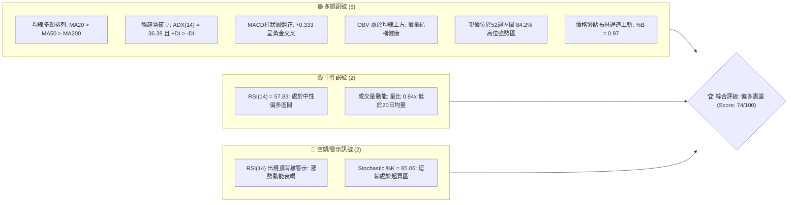
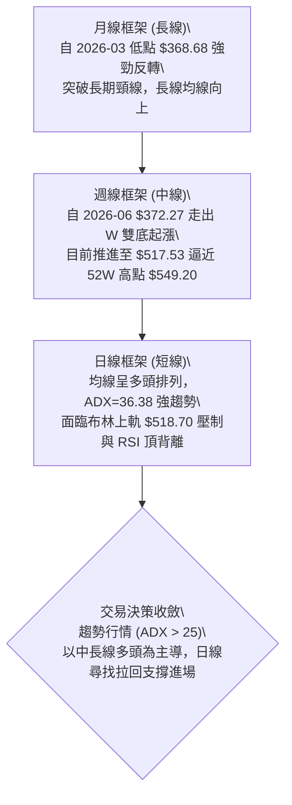
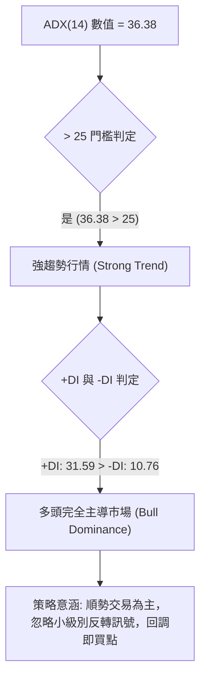
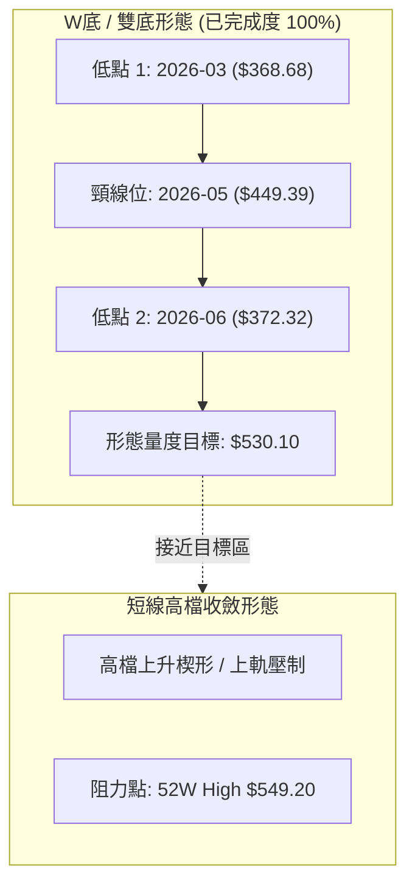
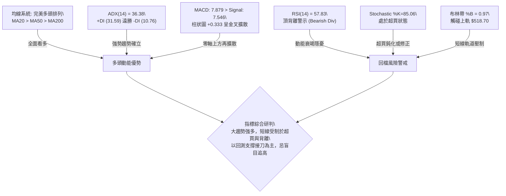
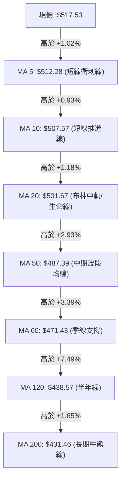
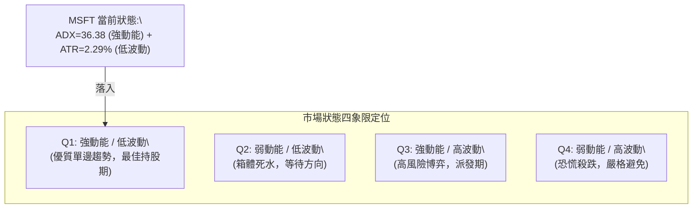
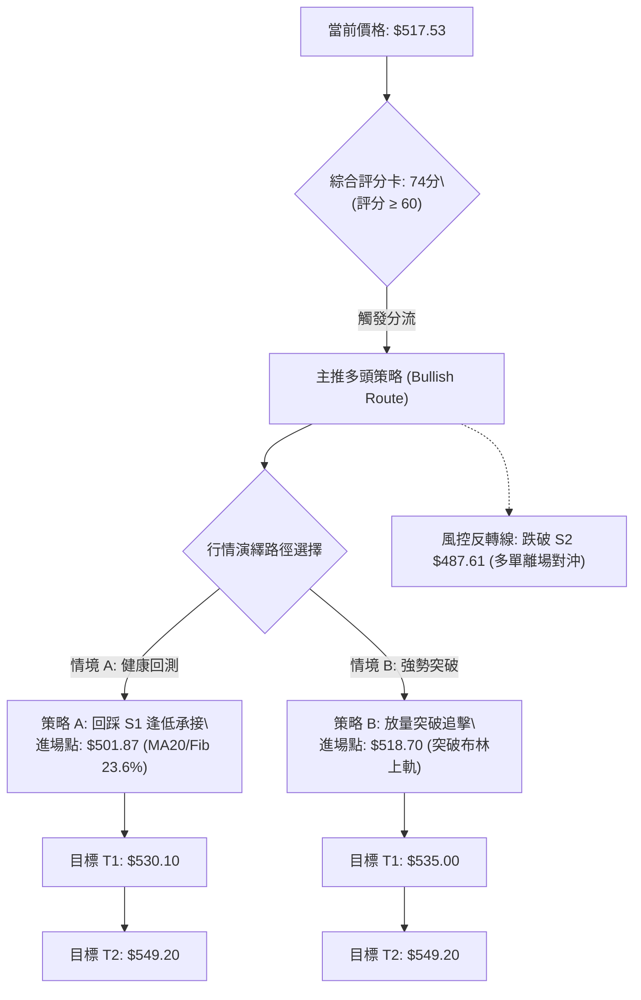
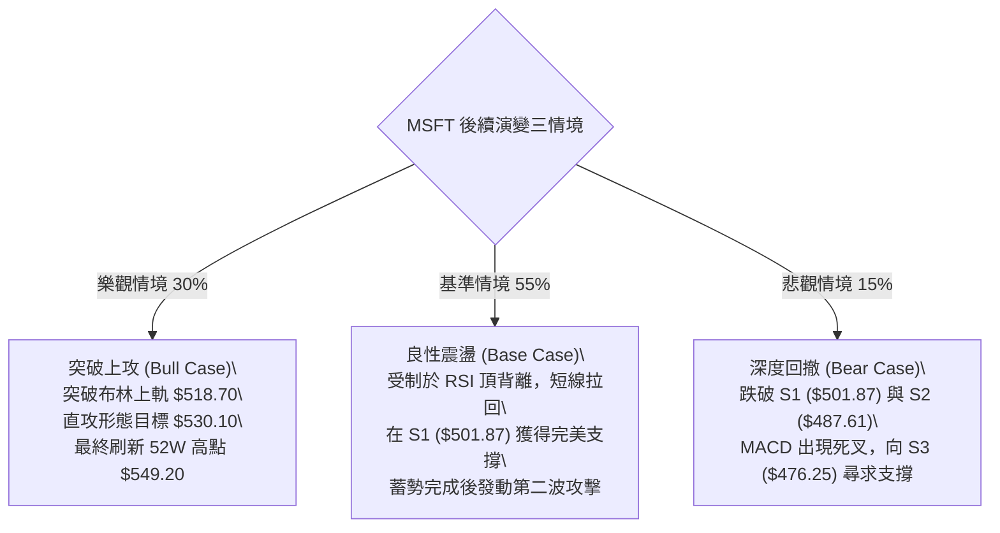

# MSFT 技術分析報告

> **報告日期**：2026-10-04 ｜ **語言**：繁體中文 ｜ **數據來源**：Yahoo Finance ｜ **當前價格**：$517.53

---

## 目錄

| 章節 | 內容 |
|------|------|
| [1. 技術面概覽](#1-技術面概覽) | 訊號儀表板、核心指標、評分卡 |
| [2. 趨勢分析](#2-趨勢分析) | 多時框趨勢、長中短期走勢、ADX解讀 |
| [3. 圖表形態分析](#3-圖表形態分析) | 形態識別、信心度、K線組合、目標價計算 |
| [4. 支撐與阻力](#4-支撐與阻力) | 關鍵價位分布、阻力與支撐分析、斐波那契回調 |
| [5. 技術指標深度解讀](#5-技術指標深度解讀) | 均線系統、RSI背離、MACD、布林通道、成交量OBV |
| [6. 動能與波動率](#6-動能與波動率) | 動能四象限、ATR波動分析、Beta相關性 |
| [7. 多時框架總結](#7-多時框架總結) | 時框架評分矩陣、多時框收斂結論 |
| [8. 交易策略建議](#8-交易策略建議) | 策略路由、價格情境階梯、主策略設定、風控觸發點 |
| [9. 風險提示與監控](#9-風險提示與監控) | 關鍵監控清單、情境模擬、資金管理 |
| [10. 報告總結](#10-報告總結) | 核心指標總覽與最終操作指引 |

---

## 1. 技術面概覽

### 🎯 技術訊號儀表板



### 📊 核心指標速覽表

| 指標類別 | 指標名稱 | 當前數值 | 訊號 | 解讀 |
|----------|----------|----------|------|------|
| **價格** | 當前收盤價 | $517.53 | 🟢 | 位於52週高低點 ($348.54 - $549.20) 的 84.2% 位置，維持強勢格局 |
| **均線** | MA20 | $501.67 | 🟢 | 現價高於 MA20 達 +3.16%，短線支撐強勁 |
| **均線** | MA50 | $487.39 | 🟢 | 現價高於 MA50 達 +6.18%，中線多頭排列完整 |
| **均線** | MA200 | $431.46 | 🟢 | 現價高於 MA200 達 +19.95%，長線牛市架構明確 |
| **動能** | RSI(14) | 57.83 | 🟡 | 位於中性偏強區間，但週線存在明確頂背離跡象，需防短線回洗 |
| **動能** | MACD (12,26,9) | 7.879 / 7.546 | 🟢 | MACD 線高於訊號線，柱狀圖 +0.333，呈弱勢擴散之多頭金叉 |
| **動能** | Stoch %K / %D | 85.06 / 78.53 | 🔴 | 進入 80 以上超買區間，短線隨時有回測中軌需求 |
| **趨勢** | ADX(14) | 36.38 | 🟢 | ADX > 25 且 +DI (31.59) 遠高於 -DI (10.76)，強趨勢多頭行情 |
| **通道** | 布林通道 (%B) | 0.97 | 🟡 | 上軌 $518.70 / 中軌 $501.67，價格觸及上軌，面臨帶狀壓制 |
| **量能** | 當日量 / 20日均量 | 17.80M / 21.25M | 🟡 | 量比 0.84x，高檔量能未顯著放大，呈現量價輕度背離 |
| **波動** | ATR(14) | $11.85 | 🟢 | 波動率佔股價 2.29%，處於中等可控範圍，適合設定動態停損 |

### 🏆 技術評分卡

```
╔══════════════════════════════════════════════════════════════╗
║                 技術評分卡 — MSFT (2026-10-04)                ║
╠══════════════════════════════════════════════════════════════╣
║ 趨勢強度 (ADX/DI)   ████████████████░░░░  82/100  🟢 強勢多頭║
║ 均線系統 (MA Align) ██████████████████░░  90/100  🟢 完美排列║
║ 動能指標 (RSI/MACD) ████████████░░░░░░░░  60/100  🟡 背離警示║
║ 支撐穩定度 (S Levels)██████████████░░░░░░  72/100  🟢 密集重疊║
║ 成交量配合 (OBV/Vol) ████████████░░░░░░░░  62/100  🟡 量能稍顯不足║
║ 圖表形態 (Patterns) ████████████████░░░░  78/100  🟢 雙底突破推升║
╠══════════════════════════════════════════════════════════════╣
║ 綜合評分            ███████████████░░░░░  74/100  🟢 偏多主導 ║
╚══════════════════════════════════════════════════════════════╝
```

---

## 2. 趨勢分析

### 🌐 多時框趨勢分析



### 📈 長期趨勢 — 12個月走勢圖（Unicode）

以下為 MSFT 過去 12 個月（2025-10 至 2026-10）之月線收盤價走勢，呈現典型的「高檔回檔打底後強勁 V 型重聚」結構：

```
MSFT 月線走勢圖（2025-10 至 2026-10）
價格軸 ($)
$550 ┤                                                    
$520 ┤                                            ●512.90 ●517.53 (現價)
$500 ┤●513.58                             ●507.29        
$480 ┤        ●488.91 ●480.57                     
$460 ┤                                ●463.85            
$440 ┤                        ●449.39                    
$420 ┤                ●427.58                            
$400 ┤            ●391.15         ●406.13                
$380 ┤                                    ●372.32 (雙底低點2)
$360 ┤                    ●368.68 (波段低點1)            
     └────┬───────┬───────┬───────┬───────┬───────┬───────┬─────
        2025    2025    2026    2026    2026    2026    2026
        10月    12月    02月    03月    05月    06月    08月-10月
```

#### 走勢特徵分析表格

| 階段 | 時間區間 | 起訖價位 | 漲跌幅 | 走勢特徵與量價解讀 |
|------|----------|----------|--------|--------------------|
| 1. 高檔派發與回落 | 2025-10 ~ 2026-03 | $513.58 → $368.68 | -28.21% | 跌破各級短中均線，於 2026-03 探底至波段低點 $368.68（逼近52W低點 $348.54）。 |
| 2. 首波反彈與頸線確立 | 2026-03 ~ 2026-05 | $368.68 → $449.39 | +21.89% | 快速反彈，於 2026-05 建立中期阻力頸線 $449.39。 |
| 3. 二次探底打擊浮額 | 2026-05 ~ 2026-06 | $449.39 → $372.32 | -17.15% | 於 2026-06 收在 $372.32，不破前期低點 $368.68，週成交量暴增至 3.82 億股，完成主力吸籌。 |
| 4. 主升段波段反攻 | 2026-06 ~ 2026-10 | $372.32 → $517.53 | +39.00% | 突破頸線後連續推升，站上所有均線，目前挑戰歷史高點聚類區。 |

### 📊 中期趨勢（週線分析）

從近 20 週收盤走勢可看出：
- **打底放量突破**：2026-06-28 該週成交量達 382,709,200 股，隨後在 2026-08-02 跳空大漲收 $463.85，週 MACD 柱狀圖由負翻正至 +7.446，確立週線級別主升段。
- **高檔震盪收斂**：在 2026-08-09 攻至 $499.05（週 RSI 達 81.4 超買）後，經歷 8 月底至 9 月中旬在 $483.24 - $513.53 區間的橫盤消化，週 MACD 柱狀圖在 2026-09 期間收縮至 -3.845，隨後於 2026-10-04 再次翻正至 +0.333，展現高檔換手成功、多頭二次發力的結構。

```
近期週線壓力與支撐示意圖：
[R1 壓力位] ══════════════════════════════════ $549.20 (52W High)
                      ▲ 現價 $517.53 (高檔推進中)
[S1 支撐位] ────────────────────────────────── $501.87 (MA20 / 週收盤密集區)
[S2 支撐位] ────────────────────────────────── $487.61 (MA50 防線)
[S3 支撐位] ══════════════════════════════════ $476.25 (前波整理平台支撐)
```

### ⚡ 趨勢強度評估（ADX 解讀）



| 指標 | 數值 | 狀態門檻 | 趨勢判定 | 市場意涵 |
|------|------|----------|----------|----------|
| **ADX(14)** | **36.38** | > 25（強趨勢）；> 35（極強趨勢） | 🟢 極強趨勢 | 市場脫離盤整箱體，單邊推進動能充沛，均線支撐具高度防守價值 |
| **+DI(14)** | **31.59** | 顯著高於 20 | 🟢 買盤強勢 | 多方力量佔據絕對優勢 |
| **-DI(14)** | **10.76** | 處於極低水平 (< 15) | 🟢 空方衰竭 | 空頭幾無還手之力，下行阻力極大 |

---

## 3. 圖表形態分析

### 🔍 形態識別系統



#### 形態信心度與目標價評估表

| 形態類別 | 信心度 | 判斷依據（引用數據） | 完成度 | 目標價（附計算式） |
|----------|--------|----------------------|--------|--------------------|
| **雙底形態 (W-Bottom)** | **88%** | 1. 2026-03 低點 $368.68 與 2026-06 低點 $372.32 構成雙重底，兩者誤差僅 0.98%<br>2. 2026-06-28 週成交量暴增至 3.82 億股確認洗盤完畢<br>3. 突破 2026-05 頸線 $449.39 | 100% (已達突破延伸段) | **$530.10**<br>計算式：頸線 $449.39 + 形態垂直高度 ($449.39 - $368.68 = $80.71) = **$530.10**<br>*(現價 $517.53 正處於向此目標延伸收斂中)* |
| **布林帶擠壓突破 (BB Squeeze Breakout)** | **72%** | 價格沿著 MA20 ($501.67) 推升，目前 %B 達 0.97，緊貼布林上軌 $518.70 運行 | 85% | **$549.20**<br>計算式：若帶狀持續開口，目標直指歷史前高 R1 **$549.20** |
| **上升楔形 (Ascending Wedge)** | **42%** | 現價推升但 RSI 出現背離，然而 ADX 高達 36.38 顯示趨勢未減 | 訊號不足 | 數據中未偵測到明確下軌破位，僅作頂背離指標性防守解讀，不預設立場。 |

### 🕯️ 重要K線形態分析

| 月份 / 週別 | 收盤價 | K線形態特徵 | 技術解讀 | 訊號 |
|-------------|--------|-------------|----------|------|
| 2026-06 月線 | $372.32 | 長下影長陰轉折星 | 測試前期 $368.68 低點未破，單週爆出 3.82 億股天量，空頭竭盡K線 | 🟢 強烈見底 |
| 2026-08 月線 | $507.29 | 大實體長陽線 (Marubozu) | 單月自 $463.85 暴拉至 $507.29，週 MACD 擴大至 +11.272，主力強攻突破K線 | 🟢 多頭確立 |
| 2026-09 月線 | $512.90 | 高檔高浪十字星 (High Wave) | 月內於 $483 - $516 間大幅洗盤，量能萎縮至 62M-115M，呈現高檔強勢換手 | 🟡 換手蓄勢 |
| 2026-10-04 日線 | $517.53 | 小實體紅K緊貼通道頂部 | 價格位於 MA5 ($512.28) 上方，多頭穩步推進，但實體收窄顯示推升力道轉趨謹慎 | 🟡 謹慎做多 |

### 📉 ASCII 走勢形態示意圖

```
MSFT W底形態突破與延伸測幅示意圖：
價位 ($)
$549.20 ┤                                                    [52W 高點 R1]
$530.10 ┤                                        ┌─ 目標價 $530.10 (W底1:1推算)
$517.53 ┤                                      ▲● [現價: $517.53]
$501.87 ┤                                  ●───┘  [支撐 S1 / MA20: $501.67]
        ┤                                 ╱
$449.39 ┤                  ●(頸線突破)───╱        [2026-05 頸線]
        ┤                 ╱ ╲
$400.00 ┤                ╱   ╲        ●
        ┤               ╱     ╲      ╱
$372.32 ┤              ╱       ●────┘            [2026-06 低點2: $372.32]
$368.68 ┤  ●──────────┘                          [2026-03 低點1: $368.68]
        └───────────────────────────────────────────────► 時間軸
           |◄── 形態高度 $80.71 ──►|◄── 等幅延伸測幅 ──►|
```

### 🎯 形態目標價計算

1. **W 底形態完整量度目標**：
   - 形態底部低點：$368.68 (2026-03 收盤價)
   - 形態頸線高點：$449.39 (2026-05 收盤價)
   - 垂直形態高度 $H$ = $\$449.39 - \$368.68 = \$80.71$
   - 量度突破目標價 = 頸線 $\$449.39 + H (\$80.71) =$ **$\$530.10$**
   - 目前完成度：$(\$517.53 - \$449.39) / \$80.71 = 84.4\%$，距離該目標僅差 $\$12.57$ (+2.42%)。

2. **波段歷史阻力目標**：
   - 突破 $530.10 後，下一強阻力直接指向數據所提供之 52 週最高價 **$549.20**。

---

## 4. 支撐與阻力

### 🗺️ 關鍵價位分布圖（Unicode）

```
╔══════════════════════════════════════════════════════════════╗
║               MSFT 關鍵價位結構分布圖 (2026-10-04)            ║
╠══════════════════════════════════════════════════════════════╣
║ $578.82 ║░░░░░░░░░░░░░░░░░░░░░░░░░░░░░░░░║ 分析師共識目標均價║
║ $549.20 ║████████████████████████████████║ 關鍵強阻力 R1 (52W高點/Fib 0.0%)
║ $530.10 ║▓▓▓▓▓▓▓▓▓▓▓▓▓▓▓▓▓▓▓▓▓▓          ║ W底等幅測算阻力位
╠═════════╬════════════════════════════════╬══════════════════╣
║ $517.53 ╠════════════════════════════════╣ ◄── 當前收盤價    ║
╠═════════╬════════════════════════════════╬══════════════════╣
║ $501.87 ║████████████████████████████    ║ 關鍵短線支撐 S1 (MA20/Fib 23.6%)
║ $487.61 ║████████████████████            ║ 中期強支撐 S2 (MA50強防線)
║ $476.25 ║████████████████░░░░            ║ 波段強支撐 S3 (Fib 38.2%共振區)
║ $448.87 ║████████████░░░░░░░░            ║ 斐波那契 50.0% 中樞平衡線
║ $431.46 ║████████████████████████████████║ 牛熊分界線 (MA200 長期均線)
╚══════════════════════════════════════════════════════════════╝
```

### 🚧 阻力位分析表

價位嚴格引用技術數據中之計算值：

| 阻力級別 | 價位 | 形成原因 / 數據依據 | 突破難度 | 重要性 |
|----------|------|---------------------|----------|--------|
| **形態阻力** | **$530.10** | 由 2026-03 至 2026-05 之 W 底頸線突破等幅投射高度 ($449.39 + $80.71) | 中等 | 🟡 形態第一滿足點 |
| **強阻力 R1** | **$549.20** | **52週歷史高點**、近一年波段高點聚類、斐波那契 0.0% 基準線 (+6.12%) | 極高 | 🔴 極重要（長線空頭防線） |
| **遠端阻力** | **$578.82** | 數據中未偵測到更高技術阻力，此為 53 位華爾街分析師共識目標均價 | 高 | 🟡 基本面延伸目標 |

### 🛡️ 支撐位分析表

價位嚴格引用技術數據中近一年波段低點聚類計算之數值：

| 支撐級別 | 價位 | 形成原因 / 數據依據 | 守住機率 | 重要性 |
|----------|------|---------------------|----------|--------|
| **強支撐 S1** | **$501.87** | 近一年波段低點聚類位、與 **MA20 ($501.67)** 及 **Fib 23.6% ($501.85)** 高度重疊 (-3.03%) | 80% | 🟢 短線生命線（首選買點） |
| **強支撐 S2** | **$487.61** | 近一年波段低點聚類、與 **MA50 ($487.39)** 重疊，9月下旬洗盤低點聚類 (-5.78%) | 85% | 🟢 中期多頭防線 |
| **波段支撐 S3** | **$476.25** | 近一年波段低點聚類位，逼近 **Fib 38.2% ($472.55)** 與 MA60 ($471.43) (-7.98%) | 90% | 🟢 多頭趨勢容忍底線 |

### 📐 斐波那契回調位分析

依據 52 週波動區間（低點 **$348.54** → 高點 **$549.20**，總跨度 $200.66）嚴格計算之回調位分布：

| 回調比例 | 對應價位 | 與現價差距 (%) | 技術共振與解讀 |
|----------|----------|----------------|----------------|
| **0.0% (52W High)** | **$549.20** | +6.12% | 波段頂部，歷史重大拋壓區 (R1) |
| **23.6%** | **$501.85** | -3.03% | **與 S1 ($501.87)、MA20 ($501.67) 完美共振**，為極強的第一防守支撐 |
| **38.2%** | **$472.55** | -8.69% | 與 S3 ($476.25) 及 MA60 ($471.43) 形成支撐帶，多頭回檔黃金比例 |
| **50.0%** | **$448.87** | -13.27% | 與前期 W 底頸線 ($449.39) 完美重疊，中樞強支撐 |
| **61.8%** | **$425.20** | -17.84% | 與 MA200 ($431.46) 相近，黃金分割最後防守線 |
| **78.6%** | **$391.48** | -24.36% | 深幅回調位，對應 2026 年初起漲平台 |
| **100.0% (52W Low)**| **$348.54** | -32.65% | 52 週波段最低點 |

**現價區間解讀**：
當前價格 **$517.53** 正運行於 **0.0% ($549.20)** 與 **23.6% ($501.85)** 之間，屬於極度強勢的高位整理區間（回調未觸及 23.6%）。在技術分析法則中，股價處於 0%~23.6% 淺層回調區域意味著強買盤持續托底，短線任何回測 $501.85-$501.87 區間均為標準的突破回踩確認。

---

## 5. 技術指標深度解讀

### 🎛️ 指標訊號總覽



### 📈 移動平均線排列分析



- **均線排列狀態**：當前呈現極其標準的**多頭排列 (MA5 > MA10 > MA20 > MA50 > MA60 > MA120 > MA200)**。
- **正乖離率評估**：
  - 現價與 MA20 ($501.67) 乖離率為 **+3.16%**（健康微幅擴大，未達 +5% 警戒水準）。
  - 現價與 MA200 ($431.46) 乖離率為 **+19.95%**，表明長線多頭推升幅度已大，中長期投資者具備極厚實之安全墊。

### 📉 RSI(14) 分析與頂背離判定

```
RSI(14) 當前水平進度條：
0 ──────────── 30 ────────────────── 50 ────── 57.83 ────── 70 ─────────── 100
[    超賣    ] [       偏弱       ] [  偏多  ] ▲ [   強勢超買   ]
數值: 57.83   █████████████████████████████░░░░░░░░░░░
```

#### ⚠️ 背離分析與嚴謹結論：
- **頂背離確立 (Bearish Divergence)**：
  - 觀察週線與日線對比：2026-08-09 MSFT 股價創下 $499.05 時，週 RSI 高達 **81.4**（8月16日進一步達 **84.8**）。
  - 隨後在 2026-08-30 價格推升至 $513.53，RSI 卻降至 **55.8**；目前 2026-10-04 價格刷新波段收盤新高至 **$517.53**，但 RSI(14) 僅為 **57.83**。
  - **價格一浪高於一浪 (Higher Highs)，動能指標 RSI 卻一浪低於一浪 (Lower Highs)**，形成教科書級的**常規頂背離 (Regular Bearish Divergence)**。
- **交易解讀**：頂背離並不代表趨勢立即反轉為空頭，但在 ADX > 25 的強趨勢下，通常意味著**上攻斜率趨緩，隨時可能迎來以震盪或回測 MA20 為形式的能量釋放**。

### 📊 MACD(12/26/9) 訊號解讀

- **MACD 線 (DIF)**：`7.879`
- **Signal 線 (DEA)**：`7.546`
- **MACD 柱狀圖 (Histogram)**：`+0.333`（綠柱轉紅柱，重新擴張）


- **動能演變**：週線 MACD 柱在 2026-08-09 達到頂峰 (+11.272) 後經歷連續數週衰退，並在 2026-09-13 降至最低 -3.845。然而最新數據顯示柱狀圖已於 2026-10-04 重新翻正至 **+0.333**，表明短期洗盤已經結束，多頭重新奪回發球權。

### 📦 布林通道分析

```
布林通道當前位置示意圖 (寬度 Bandwidth = 6.78%)：
$518.70 ┬ 上軌 ══════════════════════════════════ ◄ 現價 $517.53 (%B = 0.97)
        │
$501.67 ┼ 中軌 (MA20) ─────────────────────────── [支撐位 S1]
        │
$484.64 ┴ 下軌 ══════════════════════════════════ [防守位 S2 下方]
```

- **布林帶寬與極限**：%B 指標高達 **0.97**，表示現價極度貼近布林上軌 ($518.70)。
- **操作意涵**：在強趨勢中（ADX 36.38），股價具有「貼軌運行（Walking the Band）」特徵；但若未伴隨爆發性放量，直接向上穿軌的機率偏低，短線常沿通道震盪爬升或回檔中軌 ($501.67)。

### 💹 成交量分析（量價配合度）

- **量比檢視**：
  - 最新成交量：`17,803,300`
  - 20日均量：`21,253,995`（**量比 0.84x**）
  - 50日均量：`27,778,528`（量能低於長期均量 35.9%）
- **OBV (能量潮)**：技術數據指明 `OBV > MA → 量能支撐上漲`。
- **量價綜合解讀**：
  - **量價背離輕微存在**：價格創反彈新高而量能低於均量，顯示散戶追高意願減退，當前推升主要由籌碼集中與惜售心理驅動（機構持股高達 75.8%）。
  - **未出現主力出貨量**：頂部出貨通常伴隨爆量滯漲（如週量達 2 億股以上），目前量能溫和萎縮，表明未見主力大規模派發跡象，屬於健康的高檔縮量整固。

---

## 6. 動能與波動率

### ⚡ 動能評估四象限



| 象限 | 動能屬性 (ADX/MACD) | 波動率屬性 (ATR%) | 當前狀態判定 | 交易指引 |
|------|---------------------|-------------------|--------------|----------|
| **Q1 (當前象限)** | **強 (ADX=36.38, MACD>0)** | **低至中等 (ATR=2.29%)** | ✅ **MSFT 處於此區** | **順勢做多、回調加倉、讓利潤奔跑** |
| Q2 | 弱 (ADX < 20) | 低 (ATR < 2.0%) | ─ | 謹慎觀望，避免過度交易 |
| Q3 | 強 (ADX > 30) | 高 (ATR > 4.0%) | ─ | 爆發見頂風險，需嚴控停利 |
| Q4 | 弱 (ADX < 20) | 高 (ATR > 4.0%) | ─ | 破位殺跌，嚴禁進場抄底 |

### 📊 ATR 波動率分析

- **ATR(14) 絕對值**：**$11.85**
- **ATR 相對波動比**：$11.85 / $517.53 = **2.29%**
- **風控止損與加碼間距建議**：
  - **短線緊密止損 (1.0x ATR)**：距離現價 **$11.85** $\rightarrow$ 對應防守價位 **$505.68**。
  - **標準波段止損 (1.5x ATR)**：距離現價 **$17.78** $\rightarrow$ 對應防守價位 **$499.75**（恰好保護在 S1 / MA20 $501.67 之下）。
  - **寬幅防守止損 (2.0x ATR)**：距離現價 **$23.70** $\rightarrow$ 對應防守價位 **$493.83**。

### 📐 Beta 與市場相關性

- **Beta 係數**：`1.108`
- **技術意涵**：Beta 略高於 1.0，表明 MSFT 具備略微超越標普 500 指數的彈性與成長動能。當大盤處於風險偏好（Risk-On）環境時，MSFT 具有顯著的相對強弱優勢（Alpha）。同時配合其僅 **0.9%** 的微小融券餘額（Short % Float），市場軋空動能雖有限，但多頭拋壓同樣極輕。

---

## 7. 多時框架總結

### 📋 時框架評分表

| 時框架 | 趨勢方向 | 動能狀態 | 均線排列 | 圖表形態 | 評分 | 戰術建議 |
|--------|----------|----------|----------|----------|------|----------|
| **長期 (月線)** | 🟢 強烈看多 | MACD 零軸上方運行，長週期穩健 | 遠高於 MA120/MA200 | 自 $368.68 V型反轉回歸大牛市 | **88/100** | 長線多單堅決續抱 |
| **中期 (週線)** | 🟢 多頭主導 | MACD 柱翻正 (+0.333)，洗盤結束 | MA20 上揚，多頭擴散 | W 底突破 ($449.39) 延伸目標推進中 | **80/100** | 波段逢回踩均線加碼 |
| **短期 (日線)** | 🟡 偏多震盪 | RSI 頂背離，Stoch 超買 (85.06) | 短均完美排列 (MA5>10>20) | 貼近布林上軌 ($518.70)，上升收斂 | **65/100** | 暫停追高，等待拉回 S1 |

### 🔲 綜合訊號矩陣

```
╔══════════════════════════════════════════════════════════════╗
║               多時框架一致性分析矩陣                          ║
╠═════════════╦══════════════╦══════════════╦══════════════════╣
║ 維度        ║ 短期 (日線)  ║ 中期 (週線)  ║ 長期 (月線)      ║
╠═════════════╬══════════════╬══════════════╬══════════════════╣
║ 趨勢方向    ║ 🟢 偏多推進  ║ 🟢 明確上升  ║ 🟢 穩固牛市      ║
║ 均線系統    ║ 🟢 完美排列  ║ 🟢 多頭擴散  ║ 🟢 堅實支撐      ║
║ 動能指標    ║ 🔴 頂背離    ║ 🟢 金叉翻紅  ║ 🟢 充沛運行      ║
║ 成交量能    ║ 🟡 縮量推升  ║ 🟢 換手健康  ║ 🟢 籌碼鎖定      ║
║ 關鍵阻力    ║ $518.70(BB)  ║ $530.10(測幅)║ $549.20(52W高點) ║
║ 核心支撐    ║ $501.87(S1)  ║ $487.61(S2)  ║ $431.46(MA200)   ║
╚═════════════╩══════════════╩══════════════╩══════════════════╝
```

### ⚖️ 多時框收斂結論

> **唯一方向性結論：強趨勢背景下的【偏多主導，回踩做多】**

- **收斂規則仲裁（嚴格遵守規則 14）**：
  - 本標的 **ADX(14) 數值為 36.38，顯著大於 25 臨界值**，定義為**標準趨勢行情**。
  - 依規則，趨勢行情下**必須以中長期（週線/MA50、MA200）方向為絕對主導**，日線級別出現的 RSI 頂背離與 Stoch 超買**不可**作為反手放空的依據，而應定義為「主升浪途中的超買休整與洗盤震盪」。
  - 日線訊號唯一功能：**用於精準尋找拉回支撐點的右側進場機會**，故總體戰略定調為：**回踩支撐接多，禁止追高，暫不做空**。

---

## 8. 交易策略建議

### 🗺️ 策略決策流程圖



### 🧭 策略路由

**當前主策略方向 = 【強烈主推多頭策略】（依評分 74/100，≥ 60 門檻標準）**

本報告不進行兩頭下注，在 ADX=36.38 的強多頭結構下，所有操作均以多方邏輯展開，空方僅列出觸發止損時之避險對沖條件。

### 🎯 價格情境階梯（Price Scenarios）

價位嚴格引用第 4 章及數據計算值：

| 觸發條件 | 下一目標 | 後續延伸 | 情境含義與操作對策 |
|----------|----------|----------|--------------------|
| **強勢突破布林上軌 $518.70** | **$530.10** (W底測幅) | **$549.20** (R1/52W高點) | 頂背離鈍化化解，多頭開啟最後衝刺，短線追多或持股待漲 |
| **受阻回落，回測 S1 $501.87** | **$501.67** (MA20支撐) | 蓄勢重啟多頭 | **最理想健康走勢**，修復 RSI 背離，回踩 Fib 23.6%，主升加碼點 |
| **失守 S1，回測 S2 $487.61** | **$487.39** (MA50防線) | **$476.25** (S3防線) | 中期上升趨勢受挫，多單最後容忍底線，若跌破轉入深度防守 |

### 📊 情境機率分佈

| 情境 | 機率 | 主要依據（引用指標狀態） |
|------|------|--------------------------|
| **情境一：回踩 S1 後重啟上行** | **55%** | ADX(14)=36.38 強趨勢、OBV>MA 籌碼堅定、MA20 ($501.67) 與 Fib 23.6% ($501.85) 形成極強技術共振，拉回承接買盤強烈。 |
| **情境二：沿布林上軌強行突破** | **30%** | MACD 柱翻正 (+0.333)，若主力選擇高檔鈍化 RSI，直接挑戰 W 底目標 $530.10 及 R1 $549.20。 |
| **情境三：深幅回洗至 S2/S3** | **15%** | 日線量能低於均量 (0.84x)，若遭遇大盤系統性風險，引發 RSI 頂背離大幅修正，回測 MA50 ($487.39)。 |

### 🟢 主策略詳情

嚴格依據技術數據提供的關鍵價位設定：

| 策略要素 | 策略 A（穩健型：回踩支撐承接） | 策略 B（激進型：突破上軌順勢追擊） |
|----------|--------------------------------|------------------------------------|
| **適用情境** | 股價受制於上軌，拉回測試 S1 支撐 | 盤中放量有效突破布林通道上軌 |
| **進場條件** | 回測 S1 出現止跌K線（如小紅K或長下影） | 日K收盤突破並站穩布林上軌 |
| **進場價格** | **$501.87**（精確對齊 S1/Fib 23.6%） | **$518.70**（精確對齊布林上軌） |
| **止損價格** | **$487.61**（精確跌破 S2 / MA50 防線） | **$501.87**（跌回 S1 / MA20 之下） |
| **目標價 T1** | **$530.10**（W底形態測量滿足點） | **$535.00**（突破後動能延伸點） |
| **目標價 T2** | **$549.20**（R1 / 52週歷史高點） | **$549.20**（R1 / 52週歷史高點） |
| **風控距離** | 潛在虧損：$\$501.87 - \$487.61 = \$14.26$ (-2.84%) | 潛在虧損：$\$518.70 - \$501.87 = \$16.83$ (-3.24%) |
| **報酬空間(T2)**| 潛在獲利：$\$549.20 - \$501.87 = \$47.33$ (+9.43%) | 潛在獲利：$\$549.20 - \$518.70 = \$30.50$ (+5.88%) |
| **風險報酬比** | **1 : 3.32**（極佳，遠超 1:2 標準） | **1 : 1.81**（尚可，適合短線快進快出） |
| **預估勝率** | **70%** | **55%** |
| **建議倉位** | **20% - 25%**（基礎波段倉位） | **10% - 15%**（突破輕倉試單） |

### 🔴 反向風險觸發點（對沖提示）

- **翻空警戒線**：**有效收盤跌破 S2 ($487.61) 及 MA50 ($487.39)**。
  - **技術含義**：跌破此線代表 W 底突破後的上升趨勢徹底破壞，日線級別多頭排列瓦解，ATR 將劇烈擴大。
  - **風控處置**：所有多單必須無條件止損離場，進取型交易者可建立小額反向空單或購買價外 Put 對沖，目標下看 S3 ($476.25) 及 MA200 ($431.46)。

### ⭐ 整體訊號強度評星

```
╔══════════════════════════════════════════════════════════════╗
║ 做多訊號強度：★★★★☆  (4/5星) ─ 趨勢強勁，唯需防短線過熱     ║
║ 做空訊號強度：★☆☆☆☆  (1/5星) ─ 逆大勢操作，勝率極低       ║
║ 整體可信度：  ★★★★☆  (4/5星) ─ 均線、ADX與量價高度共振     ║
╚══════════════════════════════════════════════════════════════╝
```

---

## 9. 風險提示與監控

### ✅ 關鍵監控指標 Checklist

```
╔══════════════════════════════════════════════════════════════╗
║               MSFT 交易風控日常監控清單 (Checklist)           ║
╠══════════════════════════════════════════════════════════════╣
║ [ ] 價格是否跌破 S1 ($501.87)？若跌破，檢查 MA20 ($501.67) ║
║ [ ] RSI(14) 頂背離是否引發急速回調？觀察日線收盤是否破 MA5  ║
║ [ ] 當日成交量是否異常放大至 3,500 萬股以上伴隨長黑K（主力派發）║
║ [ ] MACD 柱狀圖是否由 +0.333 再次轉負（多頭動能二次衰竭）？  ║
║ [ ] ADX(14) 是否跌破 25 臨界線（由趨勢轉為高檔無序震盪）？  ║
║ [ ] 盤中是否成功突破布林上軌 $518.70 並站穩 3 個交易日以上？ ║
╚══════════════════════════════════════════════════════════════╝
```

### ⚠️ 風險場景分析



### 🛡️ 風險管理重要提醒

1. **ATR 動態倉位控制法則**：
   - 考慮 MSFT 當前 ATR 為 **$11.85**（單日波動約 2.29%），若單筆交易帳戶總風險嚴格控制在總資金的 1.0%：
   - 假定帳戶總值為 $100,000 美元，單筆最大容忍虧損為 $1,000 美元。
   - 採用策略 A（停損距離 $\$14.26$），最大允許買入股數 = $\$1,000 / \$14.26 \approx 70$ 股。
   - 總投入資金 = $70 \times \$501.87 \approx \$35,130$ 美元（約佔總資金 35%，在安全權重內）。
2. **頂背離環境下的心態紀律**：
   - 目前日線存在明確 RSI 頂背離，**切忌在 $517.53 價位以大倉位市價單無腦追多**。耐性等待拉回至 S1 ($501.87) 附近的性價比進場點，是專業交易者與散戶的核心分水嶺。
3. **宏觀與基本面護城河**：
   - MSFT 具備 34.0% 的 ROE、40.3% 的淨利率以及 17.7% 的營收年成長，基本面極其扎實，華爾街平均目標價達 **$578.82**（最高達 $870.00）。即便技術面短線回檔，亦屬中長線資金進場的最佳窗口。

---

## 10. 📋 報告總結

```
╔════════════════════════════════════════════════════════════════╗
║                   MSFT 技術分析報告總結                        ║
╠════════════════════════════════════════════════════════════════╣
║ 報告日期：2026-10-04          當前現價：$517.53                ║
║ 綜合技術評分：74 / 100        總體評級：🟢 偏多主導 (強趨勢)   ║
╠════════════════════════════════════════════════════════════════╣
║ 趨勢格局研判：                                                 ║
║ ├─ 長期趨勢：🟢 強烈看多 (自 $368.68 確立反轉，MA200向上)    ║
║ ├─ 中期趨勢：🟢 雙底突破 (W底 $449.39 突破，目標指向 $530.10) ║
║ ├─ 短期趨勢：🟡 高檔震盪 (貼布林上軌 $518.70，RSI 存在頂背離) ║
║ ├─ 核心阻力位：R1 $549.20 (52W歷史高點) / 測幅位 $530.10       ║
║ ├─ 核心支撐位：S1 $501.87 (MA20共振) / S2 $487.61 (MA50共振)  ║
║ └─ 分析師共識目標：$578.82 (隱含 +11.84% 空間)                 ║
╠════════════════════════════════════════════════════════════════╣
║ 最優操作策略組合：                                             ║
║ 1. 🥇 最佳機會 (穩健波段)：                                   ║
║    掛單回踩 S1 ($501.87) 買入，停損設 S2 ($487.61)，           ║
║    目標 T1 $530.10，T2 $549.20，風險報酬比高達 1:3.32。        ║
║ 2. 🥈 次選機會 (動能突破)：                                   ║
║    放量突破布林上軌 $518.70 輕倉順勢追擊，停損 $501.87，      ║
║    目標 $549.20，風險報酬比 1:1.81。                          ║
║ 3. 🥉 防守避險 (風控底線)：                                   ║
║    若意外收破 S2 ($487.61)，多單全數出場觀望，化解下行風險。  ║
╚════════════════════════════════════════════════════════════════╝
```

---

> ⚠️ **免責聲明**：本報告由資深技術分析模型基於歷史數據（Yahoo Finance）客觀運算生成，所有價位、回調比率及技術指標均恪守量化數據紀律。本報告內容**僅供專業學術研究與投資決策參考**，**不構成任何要約或投資買賣建議**。金融市場瞬息萬變，投資人應獨立評估風險，並自負盈虧。

---
*報告生成時間：2026-10-04 ｜ 數據規格：全週期 OHLCV 技術模型 ｜ 分析框架：多時框收斂與形態量化系統*