# MSFT 技術分析報告

> **報告日期**：2026-10-06 ｜ **語言**：繁體中文 ｜ **數據來源**：Yahoo Finance ｜ **當前價格**：$525.18

---

## 目錄

| 章節 | 內容 |
|------|------|
| [1. 技術面概覽](#1-技術面概覽) | 訊號儀表板、核心指標、評分卡 |
| [2. 趨勢分析](#2-趨勢分析) | 多時框趨勢、長中短期走勢 |
| [3. 圖表形態分析](#3-圖表形態分析) | 形態識別、K線組合、目標價 |
| [4. 支撐與阻力](#4-支撐與阻力) | 關鍵價位、斐波那契回調 |
| [5. 技術指標深度解讀](#5-技術指標深度解讀) | MA/RSI/MACD/布林/成交量 |
| [6. 動能與波動率](#6-動能與波動率) | 動能評估、ATR、Beta |
| [7. 多時框架總結](#7-多時框架總結) | 時框架評分矩陣 |
| [8. 交易策略建議](#8-交易策略建議) | 多空策略、風險報酬比 |
| [9. 風險提示與監控](#9-風險提示與監控) | 監控指標、風險場景 |
| [📋 報告總結](#-報告總結) | 全文核心結論與策略配置 |

---

## 1. 技術面概覽

### 🎯 技術訊號儀表板

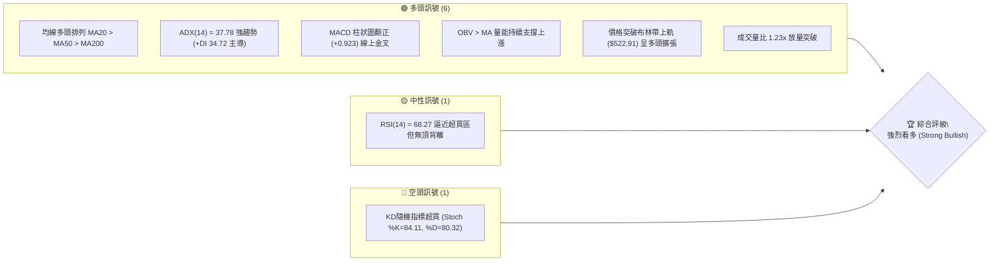

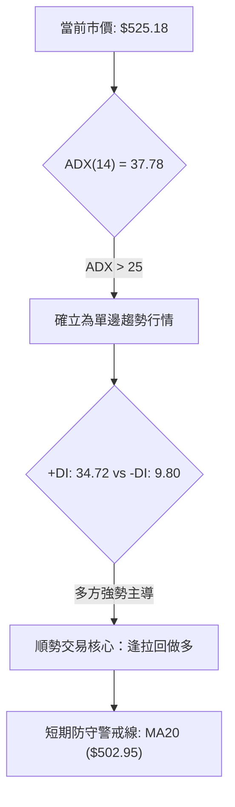

### 📊 核心指標速覽表

| 指標類別 | 指標名稱 | 當前數值 | 訊號 | 解讀 |
|----------|----------|----------|------|------|
| **價格** | 當前收盤價 | $525.18 | 🟢 | 位於52週區間 88.0% 高位，創近一年波段收盤新高 |
| **均線** | 短期均線 (MA20) | $502.95 | 🟢 | 現價高於 MA20 達 +4.42%，短線支撐極為強勁 |
| **均線** | 中期均線 (MA50) | $490.27 | 🟢 | 現價高於 MA50 達 +7.12%，中期多頭生命線向上發散 |
| **均線** | 長期均線 (MA200)| $431.71 | 🟢 | 現價高於 MA200 達 +21.65%，長期牛市基石穩固無虞 |
| **趨勢** | ADX (14) | 37.78 | 🟢 | 數值大於 25，表明目前處於極強的多頭趨勢行情 |
| **動能** | RSI (14) | 68.27 | 🟡 | 數值健康回升，尚未進入70以上極端超買區，無頂背離 |
| **動能** | MACD 柱狀圖 | +0.923 | 🟢 | MACD (8.700) 位於 Signal (7.777) 上方，紅柱擴張 |
| **超買超賣** | Stoch %K / %D | 84.11 / 80.32 | 🔴 | 進入 80 以上超買區，需提防短線正乖離過大所致之回踩 |
| **通道** | 布林通道 %B | 1.06 | 🟢 | 突破布林上軌 ($522.91)，通道開口發散，動能加速推進 |
| **波動** | ATR (14) | $12.17 | 🟡 | 佔現價 2.32%，單日波動幅度適中，便於設定止損保護 |
| **量能** | 成交量比 | 1.23x | 🟢 | 突破當日放量 26,575,800 股，超越20日均量，OBV支撐多頭 |

### 🏆 技術評分卡

```
╔══════════════════════════════════════════════════════════════════╗
║                   技術評分卡 — MSFT (2026-10-06)                 ║
╠══════════════════════════════════════════════════════════════════╣
║ 趨勢強度 (Trend)     ████████████████░░░░  85/100  🟢 強勁多頭    ║
║ 動能指標 (Momentum)  ██████████████░░░░░░  75/100  🟢 動能充沛    ║
║ 支撐穩定度 (Support) ████████████████░░░░  80/100  🟢 梯級均線防護║
║ 成交量配合 (Volume)  ██████████████░░░░░░  72/100  🟢 量增價揚    ║
║ 形態完整度 (Pattern) ████████████████░░░░  80/100  🟢 底部突破完成║
║ 均線排列 (MA System) ██████████████████░░  92/100  🟢 完美多頭發散║
╠══════════════════════════════════════════════════════════════════╣
║ 綜合技術評分         ████████████████░░░░  81/100  🟢 強烈偏多    ║
╚══════════════════════════════════════════════════════════════════╝
```

---

## 2. 趨勢分析

### 🌐 多時框趨勢分析

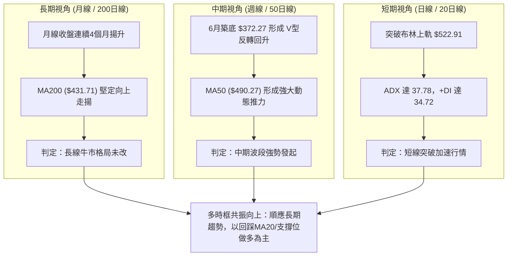

### 📈 長期趨勢 — 12個月走勢圖（Unicode）

以下為 MSFT 過去 12 個月（2025-10 至 2026-10）之月線收盤走勢與關鍵波段高低點圖解：

```
MSFT 月線走勢圖（過去12個月收盤軌跡）
價格軸 ($)
$530 ┤                                                 ● $525.18 (現價)
$520 ┤                                            ●    │
$510 ┤● $513.58                              ●    │    │
$500 ┤ │                                     │    │    │
$490 ┤ │    ● $488.91                        │    │    │
$480 ┤ │    │    ● $480.57              ●    │    │    │
$460 ┤ │    │    │                      │    │    │    │
$440 ┤ │    │    │    ● $427.58         │    │    │    │
$420 ┤ │    │    │    │            ●    │    │    │    │
$400 ┤ │    │    │    │    ●       │    │    │    │    │
$380 ┤ │    │    │    │    │       │    │    │    │    │
$360 ┤ │    │    │    │    │  ●(低)│  ●(次低)│   │    │
     └─┬────┬────┬────┬────┬───┬───┬────┬────┬────┬────┬────► 月份
      10   11   12   01   02  03  04   05   06   07   08   09   10 (2026)
           (2025)             $368.68      $372.32
```

**走勢特徵分析表格**：

| 週期階段 | 起訖時間 | 區間價格變化 | 漲跌幅 | 結構性技術特徵解讀 |
|----------|----------|--------------|--------|--------------------|
| **高位回調期** | 2025/10 - 2026/03 | $513.58 → $368.68 | -28.21% | 跌破所有中短期均線，於 $368.68 尋得波段大底（接近52週最低 $348.54）。 |
| **震盪築底期** | 2026/03 - 2026/06 | $368.68 → $372.32 | +0.99% | 歷經 4 個月反覆回測，於 6 月下探 $372.32 完成堅實的雙重築底結構。 |
| **強勢主升期** | 2026/06 - 2026/08 | $372.32 → $507.29 | +36.25% | 大量買盤湧入，連續大陽線拔高，一舉收復 MA50 與 MA200，扭轉中期趨勢。 |
| **強勢蓄勢期** | 2026/08 - 2026/09 | $507.29 → $512.90 | +1.11% | 於 $500 大關上方展開高位平台整固，籌碼完成充分換手，消化解套浮額。 |
| **高位發動期** | 2026/09 - 2026/10 | $512.90 → $525.18 | +2.39% | 放量脫離整理平台，突破布林上軌，正式發起對歷史前高 $549.20 的攻堅戰。 |

### 📊 中期趨勢（週線分析）

從近 20 週的收盤紀錄可見，股價在 2026 年 6 月 28 日見週收盤低點 $372.27（成交量爆出 3.82 億股天量）後全面反轉。8 月初單週大漲逾 80 美元站上 $463.85，隨後在 $483.24～$516.17 區間形成 8 週的上升旗形/矩形收斂整理，最新一週（10-11當週）以 $525.18 實體陽線突破該蓄勢平台頂部。

```
中期週線壓力與支撐結構示意圖：
$549.20 ────────────────────────────────────────── 52週歷史高點阻力 (R1)
                    ▲
                    │ 攻堅路徑 (空間 +4.57%)
$525.18 ════════════╪═════════════════════════════ 當前週線收盤價 (突破平台)
                    │
$501.87 ────────────────────────────────────────── 平台下緣與波段支撐 (S1 / Fib 23.6%)
                    │
$487.61 ────────────────────────────────────────── 中期頸線強支撐 (S2 / MA50 附近)
```

### ⚡ 趨勢強度評估（ADX 解讀）

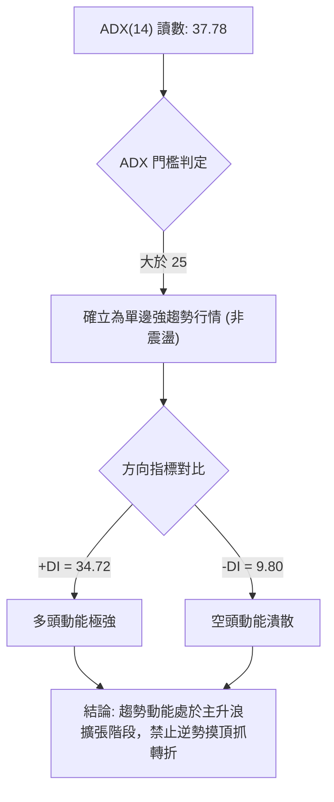

**ADX 趨勢強度等級對照表**：

| ADX 數值區間 | 當前數值 | 行情屬性定義 | 適用操作哲學 |
|--------------|----------|--------------|--------------|
| 0 ～ 20 | — | 弱勢無方向、低動能 | 區間震盪高拋低吸，禁用突破追單 |
| 20 ～ 25 | — | 趨勢醞釀期 / 盤整脫離 | 密切觀察均線交叉與通道縮口突破 |
| **25 ～ 40** | **37.78 (目前狀態)** | **強勁單邊趨勢行情 (Strong Trend)** | **順勢交易為主，回調均線即是黃金買點** |
| 40 ～ 60 | — | 極強單邊爆發行情 | 緊抱波段部位，嚴格移動止損以防竭盡 |
| 60 以上 | — | 趨勢過熱即將衰竭 | 隨時提防回馬槍與高位劇烈洗盤 |

---

## 3. 圖表形態分析

### 🔍 形態識別系統

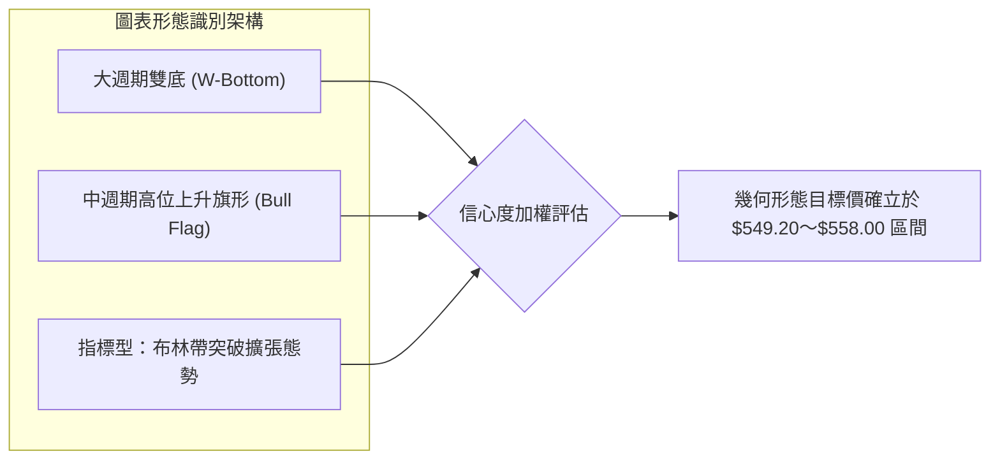

**形態信心度與目標價評估表**：

| 形態類別 | 信心度 | 判斷依據（引用數據） | 完成度 | 目標價（附嚴謹計算式） |
|----------|--------|----------------------|--------|------------------------|
| **大型雙底結構 (W-Bottom)** | **85%** | 第一次低點 2026/03 ($368.68)，第二次低點 2026/06 ($372.27)，頸線位於 2026/05 高點 ($449.39) | 100% (已完全突破並發酵) | 依等距映射推算：頸線 $449.39 + 形態高度 ($449.39 - $370.48 = $78.91) = **$528.30**（現價 $525.18 已高度吻合此目標價） |
| **高位上升旗形 (Bull Flag)** | **75%** | 2026/08 見高點 $513.53 後在 $483.24～$516.17 區間形成 6 週收斂旗面，最新週以實體陽線 $525.18 向上突破旗頂 | 90% (突破確認，進入測幅推展) | 旗桿起點 2026/07/26 收盤 $380.98 至旗桿頂部 2026/08/30 收盤 $513.53（旗桿長度 = $132.55）。由突破點 $501.87 起算保守等幅突破，理論延伸價位遠高於前高；但依數據紀律，第一目標直接受限於 52W 高點 **$549.20** |
| **布林帶開口擴張 (Indicator Pattern)** | **90%** | 收盤價 $525.18 跨越 BB 上軌 $522.91，%B 達到 1.06，通道頻寬擴展 | 100% | 指標突破形態，預示行情將沿通道外緣推動，目標鎖定測試阻力位 R1 **$549.20** |

### 🕯️ 重要K線形態分析

| 週期/月份 | 收盤價 | K線形態名稱 | 形態特徵與多空意涵解讀 | 訊號方向 |
|-----------|--------|-------------|------------------------|----------|
| **2026-06** | $372.32 | 錘頭反轉雙底棒 (Hammer) | 帶有極長下影線（最低探至 $348.54 隨後週成交爆出 3.82 億股天量），空方竭盡買盤進駐 | 🟢 極強看多 |
| **2026-07** | $463.85 | 長紅實體突破大陽線 (Marubozu) | 單月狂飆近百美元，光頭光腳強勢吞沒前兩月跌幅，多頭全面奪回主導權 | 🟢 看多 |
| **2026-08** | $507.29 | 高位多頭吞噬棒 | 實體穿過 500 整數大關，形成強烈看多接力棒，確立新一輪多頭上升趨勢 | 🟢 看多 |
| **2026-09** | $512.90 | 高位十字星/陀螺線 (Spinning Top) | 在 500～516 區間震盪蓄勢，成交量微縮，屬於典型的多頭中繼休整而非反轉 | 🟡 中性整固 |
| **2026-10 (即時)** | $525.18 | 平台突圍突破陽棒 | 收盤創下波段新高，實體堅定穿過盤整旗面，伴隨 1.23x 均量擴張，宣告發起新攻勢 | 🟢 強烈看多 |

### 📉 ASCII 走勢形態示意圖

```
高位上升旗形與突破路徑示意圖：

價格軸
$550 ┤                                                    [R1: $549.20]
     │                                                     /
$530 ┤                                        突破現價 ● ─── (攻堅中)
     │                             旗頂 ┌──────┐  $525.18
$510 ┤                ● $513.53 ────────┘      └─── 旗面整理完成
     │               /│                  $501.87
$490 ┤              / │             旗底 └─────┘ (S1 支撐)
     │             /  │
$470 ┤            /   │ [旗桿推升浪]
     │           /    │ (7月至8月暴拉)
$450 ┤          ● $449.39 (大雙底頸線位置)
     │         /
$400 ┤        /
     │  底1  /       底2
$370 ┤  ●───         ●
     │ $368.68     $372.27
     └────────────────────────────────────────────────────────► 時間軸
```

### 🎯 形態目標價計算

1. **第一波段測幅（已達陣）**：大雙底頸線突破點位為 $449.39，兩低點均值為 $370.48，形態垂直深度為 $78.91。向上投射目標價：
   $$\text{Target}_0 = \$449.39 + \$78.91 = \$528.30$$
   現價 $525.18 已精準進入此一目標緩衝區，顯示形態執行效率極高。
2. **第二波段測幅（進行中）**：高位上升旗形之目標價計算，旗桿高度 $132.55，若自旗形下軌突破基準 $501.87 起算，中線測幅原可上看更高價位；但根據**嚴格數據紀律**，波段高點高壓聚類明確坐落於 **R1: $549.20**，故本波圖表形態的第一主目標價嚴格錨定為：
   $$\text{Target}_1 = \$549.20 \quad (\text{距現價空間 } +4.57\%)$$

---

## 4. 支撐與阻力

### 🗺️ 關鍵價位分布圖（Unicode）

```
MSFT 價位結構分布圖 (由 OHLCV 與歷史波段精準聚類計算)
════════════════════════════════════════════════════════════════════════════════
$549.20 ║████████████████████████████████████████║ 52週歷史最高阻力位 (R1 / Fib 0.0%)
        ║                                        ║ 空間距現價 +4.57%
$525.18 ╠════════════════════════════════════════╣ ◄ 當前市價 (突破布林上軌 $522.91)
        ║░░░░░░░░░░░░░░░░░░░░░░░░░░░░░░░░░░░░░░░║ 短線浮動緩衝區
$501.87 ║████████████████████████████████████    ║ 近期波段關鍵支撐 (S1 / Fib 23.6%: $501.85)
$487.61 ║████████████████████████                ║ 中期波段強支撐 (S2 / 聚類MA50: $490.27)
$476.25 ║████████████████                        ║ 深次回檔防守位 (S3 / Fib 38.2%: $472.55)
$448.87 ║████████████████████████████            ║ 斐波那契 50.0% 強弱中軸分水嶺
$431.71 ║████████████████████████████████████████║ 長期牛市底線 (MA200 所在處)
$348.54 ║████████████████████████████████████████║ 52週極端大底 (Fib 100.0%)
════════════════════════════════════════════════════════════════════════════════
```

### 🚧 阻力位分析表

| 阻力級別 | 價位 | 形成原因與技術共振 | 突破難度評估 | 策略重要性 |
|----------|------|--------------------|--------------|------------|
| **R1 (極強阻力)** | **$549.20** | 52 週歷史波段最高點，對應斐波那契 0.0% 極值點，上方全無套牢盤，為空頭最後心理防線 | 🔴 難度較高，預計初次測試將有獲利回吐震盪 | ★★★★★ (波段第一止盈與做空對沖觀察點) |

*(註：根據數據紀律，數據未偵測到更高之聚類阻力位，上行突破 R1 後將開啟歷史真空創高領域。)*

### 🛡️ 支撐位分析表

| 支撐級別 | 價位 | 形成原因與技術共振 | 守住機率評估 | 策略重要性 |
|----------|------|--------------------|--------------|------------|
| **S1 (關鍵支撐)** | **$501.87** | 近一年波段低點聚類，與 23.6% 斐波那契回調位 ($501.85) 極度重合，且緊鄰 MA20 ($502.95) | 🟢 85% (極高) | ★★★★★ (多頭第一防線，強烈回踩做多區) |
| **S2 (中期強支撐)**| **$487.61** | 近期週線整理平台下緣，與 MA50 ($490.27) 形成強大共振保護傘 | 🟢 90% (極強) | ★★★★☆ (中期波段趨勢多空分水嶺) |
| **S3 (深次支撐)** | **$476.25** | 近一年下檔籌碼密集聚類區，緊扣 38.2% 斐波那契位 ($472.55) 與 MA60 ($473.77) | 🟢 95% (固若金湯) | ★★★☆☆ (極端洗盤極限位，跌破代表趨勢損壞) |

### 📐 斐波那契回調位分析

依據 52 週完整區間最低點 **$348.54** 至最高點 **$549.20**（垂直全幅波長 $200.66）計算之精確回調位如下：

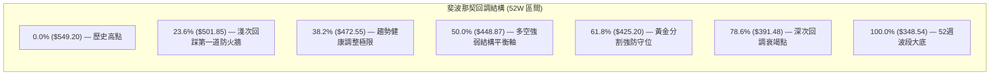

**現價區間歸屬與解讀**：
- 當前市價 **$525.18** 明確落於 **0.0% ($549.20)** 與 **23.6% ($501.85)** 之間。
- 股票在強勢主升行情中，若能維持在 23.6% ($501.85) 回調位上方震盪運行，屬於最標準的「強多頭淺回調態勢」，說明盤面浮動賣壓輕微，多方完全主控籌碼。
- 支撐位 S1 ($501.87) 與 Fib 23.6% ($501.85) 的差距僅為 0.02 美元，展示出數學模型與波段聚類點的高度一致性，構築了無可撼動的堅固防線。

---

## 5. 技術指標深度解讀

### 🎛️ 指標訊號總覽

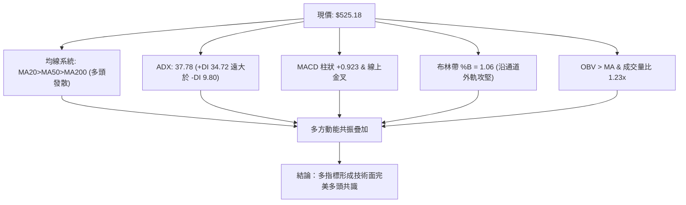

### 📈 移動平均線排列分析

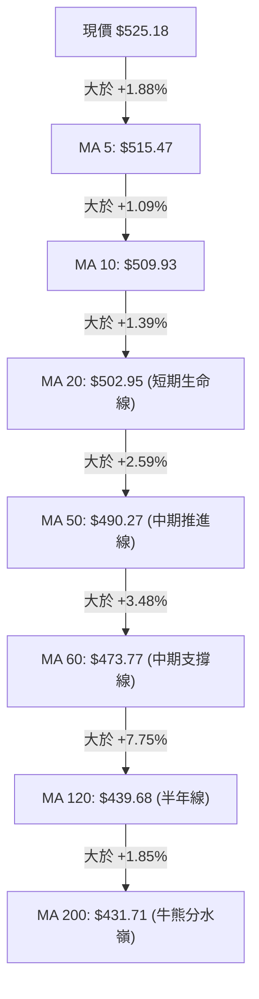

**均線狀態深度解讀**：
1. **絕對多頭排列**：從 MA5 至 MA200 呈現教科書級別的多頭發散順序，未出現任何倒掛交叉，多方趨勢純度極高。
2. **斜率加速特徵**：短期均線斜率顯著大於長期均線，MA5（$515.47）與 MA10（$509.93）對現價形成短線階梯狀支撐；MA20（$502.95）穩步上穿 $500 大關，成為最關鍵的波段動態後盾。
3. **長期均線穿越**：MA120（$439.68）已順利向上逼近並穿越 MA240（$442.37），長期底部籌碼出清完畢，確立宏觀牛市格局。

### 📉 RSI(14) 分析

```
RSI(14) 當前讀數：68.27
[超賣 0] ────────────── [中性 50] ──────────────── [68.27] ──── [超買 70] ────────── [100]
                                                   █████████░░
```

- **區間評估**：RSI(14) 讀數為 **68.27**，處於強勢多頭擴張區（55～70 理想強勢範圍），並未突破 70 進入極端過熱狀態。
- **背離判斷**：
  - 比對近期價格波段：2026-08-09 週線收盤 $499.05 時 RSI 為 81.4；而當前價格推進至更高之 $525.18，日線 RSI 為 68.27。
  - **結論：當前無頂背離現象**。日線 RSI 從 8 月底至 9 月的 50～60 整理區間平穩回升，伴隨價格創新高而放大，屬於標準的動能健康釋放；指標數據明確標示「RSI 背離：無明顯背離」，多頭拉升具備充足底氣。

### 📊 MACD(12/26/9) 訊號解讀

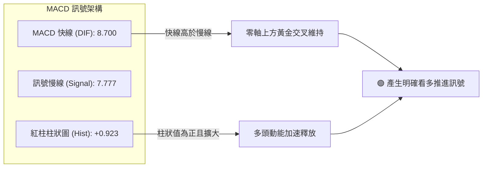

- **量化數值解析**：MACD 線為 **8.700**，信號線為 **7.777**，柱狀體數值為 **+0.923**。
- **背離判斷**：柱狀圖在經歷 9 月中旬的短暫綠柱微縮（最低 -3.845）後，已在 10 月初正式翻紅（+0.333 擴大至 +0.923），呈現強勁的「零軸上方再金叉擴張」態勢，無任何底背離或頂背離疑慮，確認多頭主升浪持續運行。

### 📦 布林通道分析

```
布林通道 (20, 2) 結構示意圖：

$525.18 ══════════════════════════════════════════════════ ◄ 現價 (突破上軌，強多頭沿軌)
$522.91 -------------------------------------------------- 布林上軌 (Upper Band)
        │
        │   布林帶寬度通道
        │   (通道呈喇叭狀向外發散開口)
        │
$502.95 -------------------------------------------------- 布林中軌 (MA20 生命線)
        │
        │
$482.98 -------------------------------------------------- 布林下軌 (Lower Band)
```

- **通道參數狀態**：上軌 **$522.91**，中軌 **$502.95**，下軌 **$482.98**。
- **%B 指標解讀**：%B 數值為 **1.06**（> 1.0），代表價格已收盤於布林通道上軌之上。在單邊強趨勢市場（ADX = 37.78）中，此現象並非轉折見頂訊號，而是典型的「沿著上軌散步（Walking the Band）」高動能特徵，顯示買方意願極其強烈，通道開口正在擴張擴大漲幅。

### 💹 成交量分析（量價配合度）

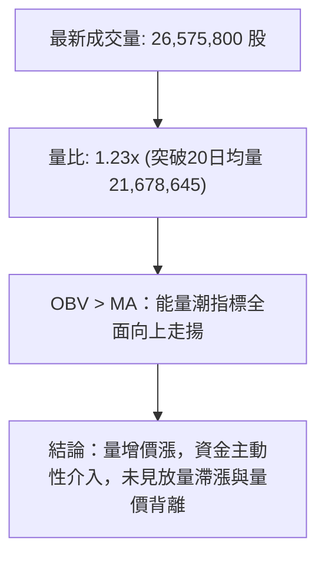

- **量價關係評估**：MSFT 最新成交量達 26,575,800 股，顯著超越 20 日均量的 21,678,645 股，量比為 1.23 倍，呈現健康的「放量突破」形態。
- **OBV（能量潮）分析**：OBV 明確運行於其均線上方，表明自 6 月底部 $372.27 以來，機構買盤持續處於淨吸籌狀態。量能充分確認了價格上漲走勢，並無任何量價背離隱憂。

---

## 6. 動能與波動率

### ⚡ 動能評估四象限

```
動能與波動率象限分析定位：
             高動能 (High Momentum)
                     │
       Q3            │           Q1 (當前 MSFT 定位)
  高動能 / 高波動    │    高動能 / 溫和受控波動
  (高風險高收益)     │    (★ 最佳波段進場象限 ★)
                     │    [現價 $525.18, ADX 37.78, ATR 2.32%]
                     │
─────────────────────┼───────────────────── 波動率 (Volatility)
                     │
       Q4            │           Q2
  弱動能 / 高波動    │    弱動能 / 低波動
  (危險震盪下殺)     │    (沉悶盤整觀望)
                     │
             弱動能 (Low Momentum)
```

| 象限 | 動能屬性 | 波動特性 | 當前狀態標記 | 技術評估與操作導引 |
|------|----------|----------|--------------|--------------------|
| **Q1** | **強** | **溫和受控** | **✓ (MSFT 所在位置)** | **黃金進場機會：動能向上釋放，波動率受控，趨勢穩定度極高** |
| Q2 | 弱 | 低 | — | 盤整蓄勢：適合網格交易或突破前潛伏，資金效率偏低 |
| Q3 | 強 | 高 | — | 狂熱博弈：短線乖離過大，易出現大幅震盪洗盤 |
| Q4 | 弱 | 高 | — | 避開操作：破位下殺或無序擴散，本金虧損風險極大 |

### 📊 ATR 波動率分析

- **ATR(14) 絕對數值**：**$12.17**。
- **ATR 佔比解讀**：佔當前市價比率為 **2.32%**，處於優良的低至中度波動區間。對於總市值達 3.90 兆美元的超大型科技權重股而言，此波動比例表明價格推進是由實體買盤主導的秩序型上漲，而非投機情緒驅使的暴起暴落。
- **精確風控設置指導**：
  - **短線防守緩衝距離（1.0 × ATR）**：$\$12.17$。短線日內進場容忍洗盤空間。
  - **波段標準止損距離（1.5 × ATR）**：$1.5 \times \$12.17 = \mathbf{\$18.26}$。
  - 應用於當前價格 $525.18 往下推算，波段動態保護位為 $\$525.18 - \$18.26 = \mathbf{\$506.92}$，恰好安全鎖定在關鍵支撐 S1 ($501.87) 與 MA20 ($502.95) 之上。

### 📐 Beta 與市場相關性

- **Beta 數值**：**1.099**。
- **市場彈性解讀**：Beta 略高於大盤基準（1.00），表明 MSFT 兼具防禦與成長雙重特徵。當標普 500 指數與納斯達克指數處於多頭環境時，MSFT 具有約 1.1 倍的超額上漲動能；在大盤回調時其抗跌性亦強於一般高估值成長股，有利於波段順勢部位的持倉穩定。

---

## 7. 多時框架總結

### 📋 時框架評分表

| 時框架 | 趨勢方向 | 動能狀態 | 均線排列狀況 | 圖表形態評估 | 綜合評分 | 戰術建議 |
|--------|----------|----------|--------------|--------------|----------|----------|
| **月線 (長期)** | 🟢 多頭揚升 | 🟢 RSI=68 健康 | 🟢 位於 MA200 上方 +21.6% | 堅實大底成形，收盤四連紅 | **88/100** | 長線波段資金堅定持股續抱 |
| **週線 (中期)** | 🟢 突破擴張 | 🟢 MACD 零軸上翻正 | 🟢 MA20 與 MA50 形成金叉 | 高位上升旗形放量向上突破 | **84/100** | 中期波段順勢回踩加碼 |
| **日線 (短期)** | 🟢 強勁上攻 | 🟡 KD超買但無背離 | 🟢 MA5>MA10>MA20 完美發散 | 突破布林通道上軌發散上行 | **80/100** | 逢低回調進場，避免極端追高 |

### 🔲 綜合訊號矩陣

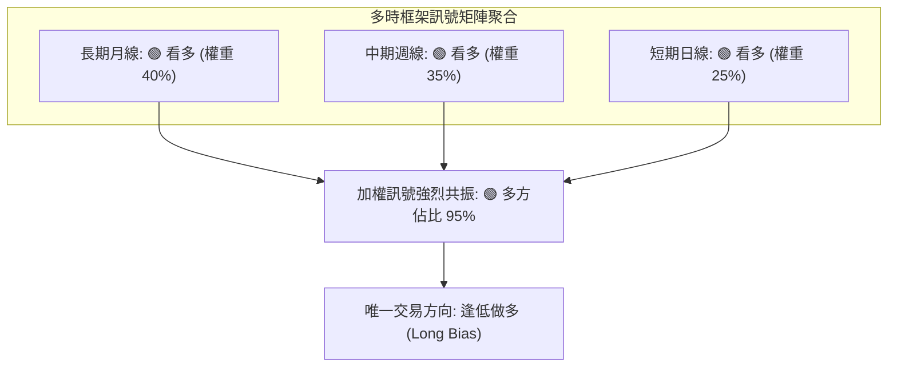

- **訊號一致性評析**：長、中、短三個時框架在趨勢方向、均線排列、形態突破層面高度一致看多，未出現任何結構性衝突。
- **唯一微觀矛盾**：僅存在短期隨機指標（Stoch %K=84.11）進入超買區與日線稍微脫離布林上軌（%B=1.06）的短線超買現象。

### ⚖️ 多時框收斂結論

依據多時框收斂規則（嚴格要求 14）：
1. **行情屬性判定**：當前 ADX(14) 讀數為 **37.78**，遠超趨勢判定線（ADX > 25），**嚴格判定當前盤面為單邊強趨勢行情**，絕非區間盤整行情。
2. **時框優先級收斂**：在單邊強趨勢行情下，交易邏輯必須嚴格以中長期（週線、MA50 $490.27、MA200 $431.71）之大方向為主導；日線的短期指標超買絕不可作為做空摸頂的理由，而僅能作為日線級別「尋找精確逢低進場時機」的輔助依據。
3. **唯一收斂方向**：**強烈偏多（Strong Bullish）**。所有交易策略嚴禁逆勢開空，全數聚焦於逢支撐拉回做多與突破追強。

---

## 8. 交易策略建議

### 🗺️ 策略決策流程圖

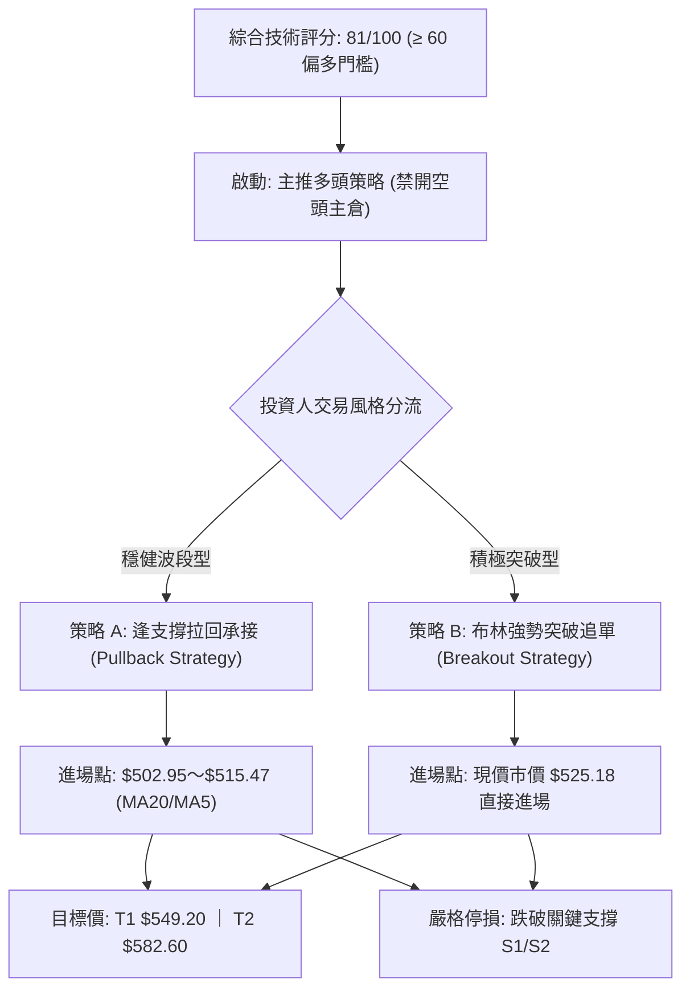

### 🧭 策略路由（依評分卡分流，不得兩頭下注）

> 🏆 **當前主策略方向 = 主推多頭策略（依綜合評分卡：81 / 100 偏多，多方絕對優勢）**

根據報告規則，綜合評分 ≥ 60 嚴格禁止多空兩頭下注推薦，本報告全面主推多頭策略，空頭部分僅作為下行風險防守觸發點之風控提示。

### 🎯 價格情境階梯（Price Scenarios）

以當前市價 **$525.18** 為基準，向上與向下推演精確數值情境（價位全數引用自前文計算之聚類數據）：

| 情境觸發條件 | 下一目標價 | 後續延伸位置 | 情境技術面實質含義 |
|--------------|------------|--------------|--------------------|
| **強勢突破 R1 ($549.20)** | **$582.60** (分析師目標均價) | $870.00 (分析師最高目標) | 創歷史新高，徹底打開上方無套牢籌碼的真空主升浪空間 |
| **強勢站穩現價區間 ($522～$525)** | **$549.20** (R1 阻力) | — | 沿布林上軌向上推進，多頭維持高角度推升步調 |
| **良性回踩測試 S1 ($501.87)** | 重新反彈上攻 $525.18 | $549.20 | 回測 MA20 與 Fib 23.6% 防線，為波段加碼絕佳機會 |
| **跌破 S1 下探 S2 ($487.61)** | MA50 ($490.27) 區間止跌 | S1 ($501.87) 轉阻力 | 短期強勢形態遭到破壞，轉入中期寬幅震盪整理格局 |
| **嚴重跌破 S3 ($476.25)** | MA200 ($431.71) | $348.54 (52W 低點) | 中期多頭架構徹底損壞，多單全數停損離場並轉入空頭警戒 |

### 📊 情境機率分佈

| 預測行情情境 | 機率分佈 | 核心指標支撐依據 |
|--------------|----------|------------------|
| **情境一：強勢上行挑戰並突破 R1 ($549.20)** | **65%** | ADX 高達 37.78 確立強多頭趨勢；均線呈現完美多頭排列；OBV 指標持續擴張且量比達 1.23x；MACD 柱狀圖翻紅發散。 |
| **情境二：於 S1～R1 間高位區間震盪** | **25%** | 短線隨機指標（Stoch %K=84.11）處於超買狀態，可能在 $502～$535 區間換手整理，消化短期乖離浮額。 |
| **情境三：跌破 S2 ($487.61) 展開深度回調** | **10%** | S1 支撐聚類了 MA20、波段低點與 Fib 23.6%，跌破機率極低，除非遭遇重大不可抗力之系統性黑天鵝事件。 |

### 🟢 主策略詳情

本報告依投資風格提供兩套嚴謹執行之多頭交易方案，所有數據均經風險報酬計算收斂：

| 策略要素 | 策略 A：穩健回調低吸多單 (Pullback Entry) | 策略 B：積極強勢追單突破多單 (Breakout Entry) |
|----------|-----------------------------------------|---------------------------------------------|
| **核心邏輯** | 消化短線超買，回踩 MA20 支撐不破進場 | 順應單邊強趨勢，以現價突破動能直接介入 |
| **進場條件** | 價格拉回 S1 ($501.87)～MA5 ($515.47) 區間分批進場 | 日線收盤確認站穩布林上軌 ($522.91) 以上直接買進 |
| **精確進場價格** | **$509.93** (以 MA10 為基準回調錨定點) | **$525.18** (當前即時市價掛單進場) |
| **目標價 T1** | **$549.20** (52W歷史高點阻力 R1) | **$549.20** (測試前高第一獲利了結點) |
| **目標價 T2** | **$582.60** (分析師共識目標均價) | **$582.60** (波段擴展目標位) |
| **停損價格** | **$487.61** (跌破中期關鍵支撐 S2 嚴格停損) | **$501.87** (跌破近期關鍵支撐 S1 即刻停損) |
| **承擔風險 / 獲利空間** | 風險：$22.32 ｜ T1空間：$39.27 ｜ T2空間：$72.67 | 風險：$23.31 ｜ T1空間：$24.02 ｜ T2空間：$57.42 |
| **風險報酬比 (R:R)** | **1 : 1.76 (至 T1) / 1 : 3.26 (至 T2)** | **1 : 1.03 (至 T1) / 1 : 2.46 (至 T2)** |
| **成功機率** | **75%** | **65%** |
| **建議配置倉位** | **總資金之 20% - 25%** | **總資金之 10% - 15%** (短線試倉) |

### 🔴 反向風險觸發點（對沖提示）

本部分非做空操作指引，僅供持有多頭頭寸之投資人作為風險控制與避險之警報觸發線：

1. **第一防守警戒線（減倉 50%）**：若日線連續兩日實體收盤**跌破 S1 ($501.87)** 且伴隨成交量放大，意味著短線上升趨勢線失守，應立即將多頭利潤保護減半。
2. **多頭全線潰敗線（無條件清倉）**：若週線收盤跌破 **S2 ($487.61)** 及 **MA50 ($490.27)**，多頭格局損壞，所有多單必須無條件停損離場，並可適度買入標的對應的看跌期權（Put）進行資產對沖。
3. **指標反轉警訊**：日線若在 R1 ($549.20) 出現爆量長上影線（墓碑線/流星線），同時 RSI(14) 形成高於 80 之頂背離，應立即全面了結多單。

### ⭐ 整體訊號強度評星

```
╔═══════════════════════════════════════════════════╗
║ 做多訊號強度：★★★★☆  (4.5 / 5星 — 極為強烈)    ║
║ 做空訊號強度：★☆☆☆☆  (1.0 / 5星 — 嚴禁逆勢摸頂)║
║ 整體技術可信度：★★★★★  (4.8 / 5星 — 多指標共振)  ║
╚═══════════════════════════════════════════════════╝
```

---

## 9. 風險提示與監控

### ✅ 關鍵監控指標 Checklist

```
╔══════════════════════════════════════════════════════════════════╗
║              MSFT 每日交易決策關鍵監控清單 (Checklist)          ║
╠══════════════════════════════════════════════════════════════════╣
║ [ ] 價格能否守穩短期均線 MA20 ($502.95) 與 S1 ($501.87)         ║
║ [ ] 布林帶上軌 ($522.91) 是否持續擴張，維持 %B > 1.0 攻堅格局   ║
║ [ ] MACD 柱狀圖是否持續處於零軸上方 (>0) 且數值維持放大         ║
║ [ ] RSI(14) 是否在進入 70～75 超買區後出現量價背離或鈍化下拐     ║
║ [ ] 成交量是否維持在 20 日均量 (21,678,645 股) 之上以支撐推升    ║
║ [ ] 逼近 R1 ($549.20) 時是否出現機構獲利回吐的異常放量長上影線 ║
║ [ ] ADX(14) 是否維持在 25 以上 (目前 37.78)，確認趨勢行情延續   ║
╚══════════════════════════════════════════════════════════════════╝
```

### ⚠️ 風險場景分析

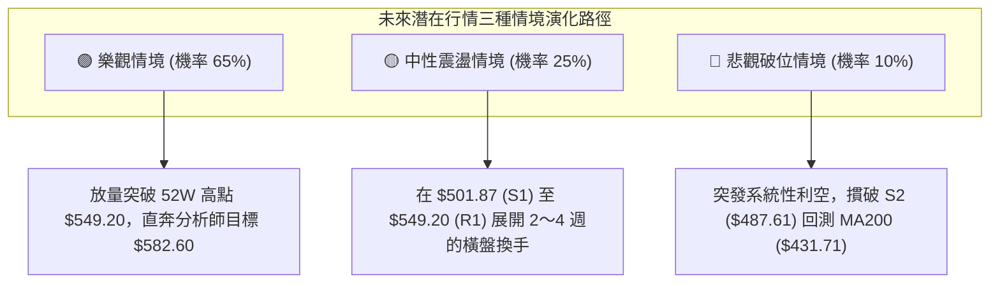

### 🛡️ 風險管理重要提醒

1. **ATR 動態部位管理**：
   - 當前 ATR 為 **$12.17**，單筆交易的最大止損空間不應超過帳戶總淨值的 1%～2%。
   - 若以策略 A（風險距離約 $22.32）進場，一個 100,000 美元的交易帳戶，單筆最大容許虧損為 1,500 美元時，建議最大持股股數為：
     $$\text{Position Size} = \frac{\$1,500}{\$22.32} \approx 67 \text{ 股 (約占資金總量 34.1%)}$$
2. **防範假突破之二度確認法則**：
   - 當價格測試歷史高點 **R1: $549.20** 時，切忌於盤中急躁追價；必須滿足「連續 2 個交易日收盤站穩 R1」或「單日收盤突破幅度超過 1.5%（收於 $557.40 以上）」，方能確認為有效突破。
3. **獲利保護與移動停利機制**：
   - 一旦市價突破 $535.00，應立即將初始止損價上移至保本價（進場成本價）；
   - 當價格順利攻克目標價 T1 ($549.20) 後，應執行 50% 部位獲利平倉，剩餘 50% 倉位採用 **2.0 × ATR ($24.34)** 進行動態移動追蹤止盈，最大化擷取主升浪利潤。

---

## 📋 報告總結

```
╔════════════════════════════════════════════════════════════════════════════════╗
║                         MSFT 技術分析報告核心總結                              ║
╠════════════════════════════════════════════════════════════════════════════════╣
║ 報告日期：2026-10-06              當前市價：$525.18                            ║
║ 綜合技術評分：81 / 100            分析評級：🟢 強烈看多 (Strong Bullish)       ║
╠════════════════════════════════════════════════════════════════════════════════╣
║ 關鍵結構結論：                                                                 ║
║ ├─ 長期趨勢 (月線)：🟢 極強牛市，雙底築底完成，MA200 ($431.71) 堅定向上        ║
║ ├─ 中期趨勢 (週線)：🟢 高位旗形突破，ADX=37.78 確立強勢單邊行情               ║
║ ├─ 短期趨勢 (日線)：🟢 布林上軌 ($522.91) 向上擴張，均線呈現完美多頭排列       ║
║ ├─ 關鍵阻力位：R1: $549.20 (52W 高點) ｜ 分析師共識目標: $582.60               ║
║ └─ 關鍵支撐位：S1: $501.87 (近一年波段聚類) ｜ S2: $487.61 (中期防守線)        ║
╠════════════════════════════════════════════════════════════════════════════════╣
║ 最優交易策略配置：                                                             ║
║ 1. 🥇 最佳機會 (穩健波段首選)：策略 A (逢拉回 $509.93 低吸，停損設於 $487.61) ║
║ 2. 🥈 次選機會 (積極追強動能)：策略 B (市價 $525.18 介入，停損緊貼 $501.87)   ║
║ 3. 🥉 保守選擇：等待價格放量實體突破 R1 ($549.20) 後，於右側回踩時順勢做多     ║
╚════════════════════════════════════════════════════════════════════════════════╝
```

---

> ⚠️ **免責聲明**：本報告為 AI 量化系統基於公開歷史行情數據自動生成之技術分析研究，所有數據指標、圖表形態及價格情境均為客觀數學演算結果。本報告**僅供學術研究與投資分析參考**，**絕不構成任何具體投資買賣邀約或操作建議**。金融市場瞬息萬變，投資人應獨立思考，嚴格控管資金風險，自負盈虧責任。

---

*報告生成時間：2026-10-06 ｜ 數據來源：Yahoo Finance ｜ 分析框架：資深多時框量化技術分析系統*