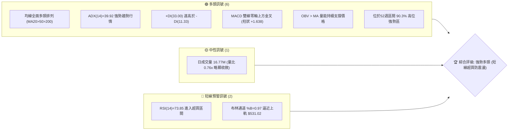
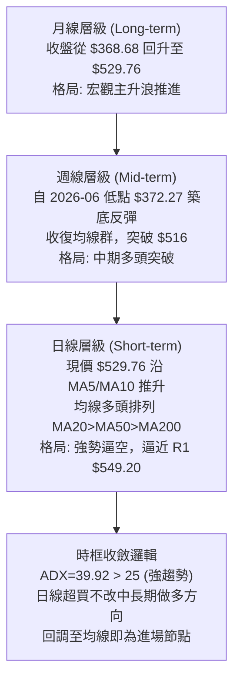
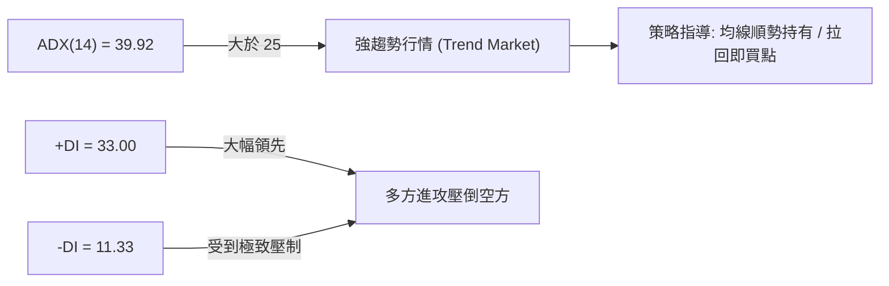
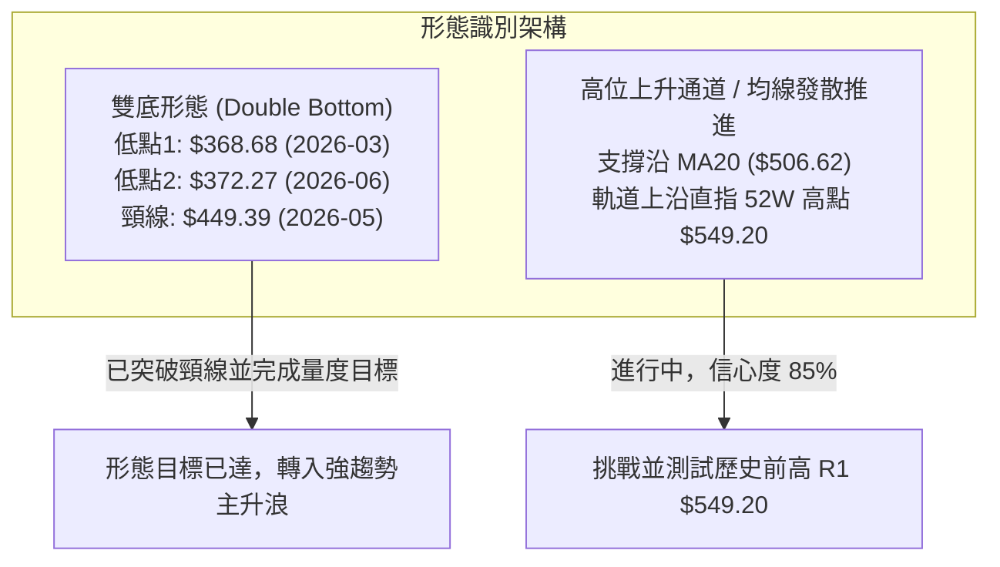
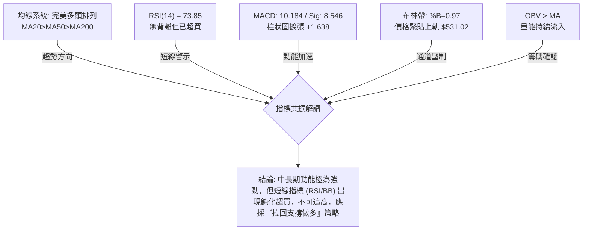
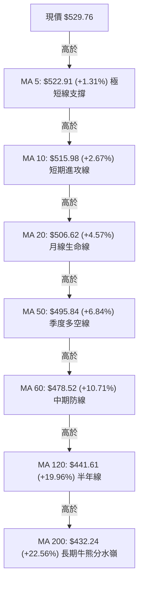
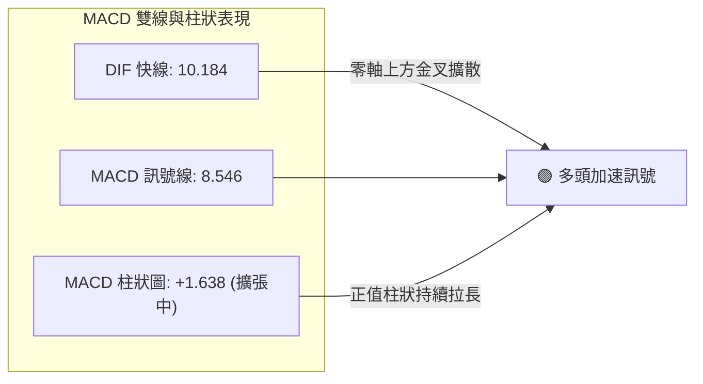
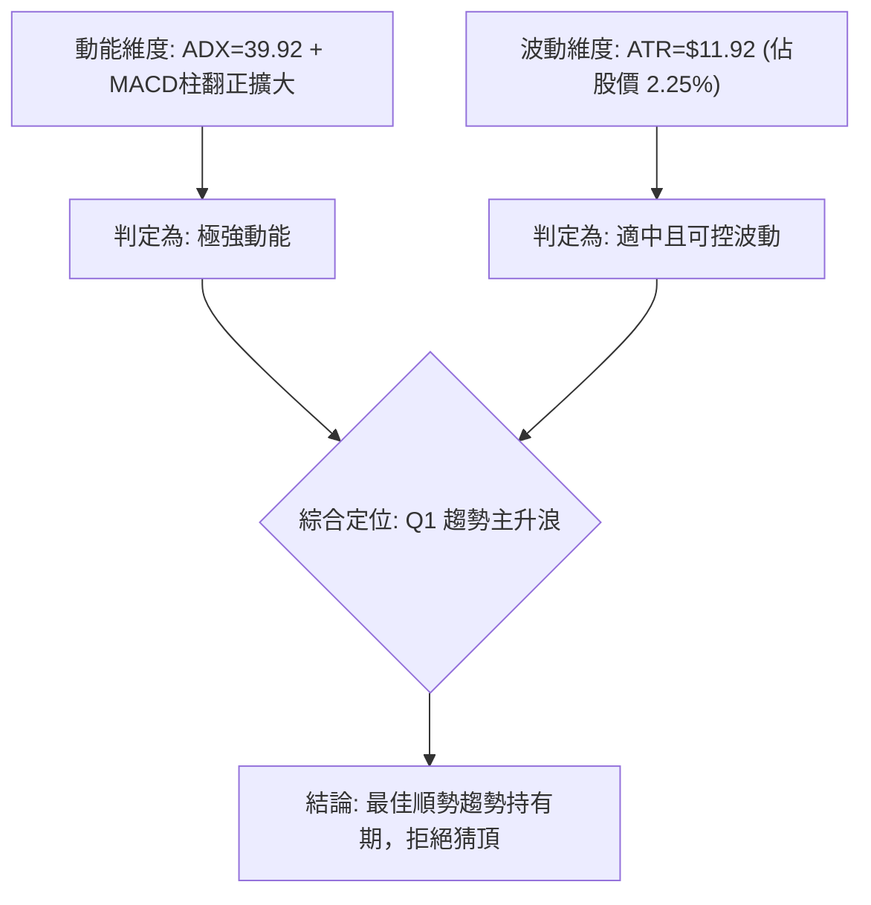
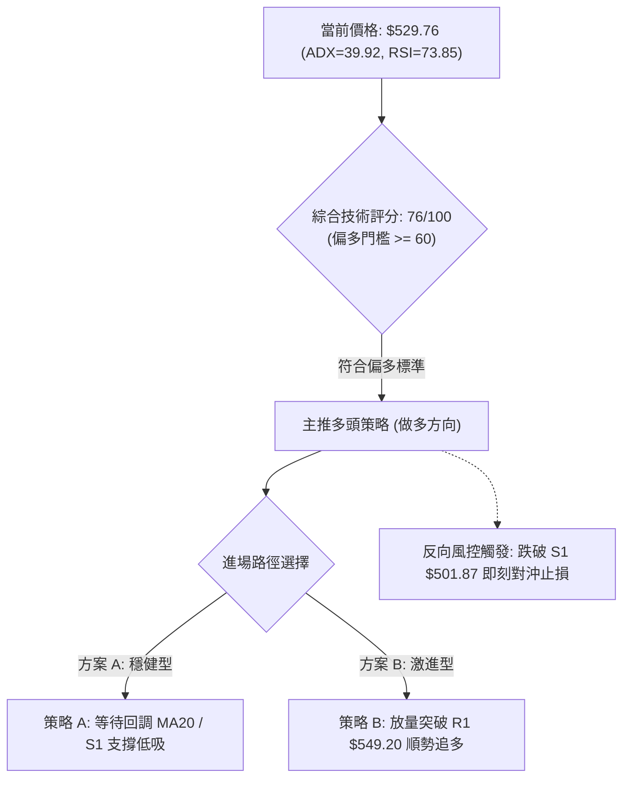
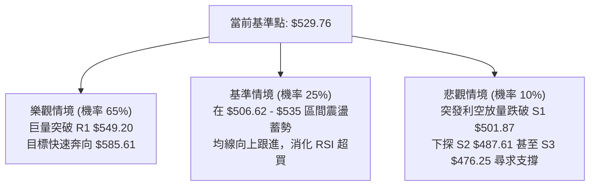

# MSFT 技術分析報告

> **報告日期**：2026-10-08 ｜ **語言**：繁體中文 ｜ **數據來源**：Yahoo Finance ｜ **當前價格**：$529.76

---

## 目錄

| 章節 | 內容 |
|------|------|
| [1. 技術面概覽](#1-技術面概覽) | 訊號儀表板、核心指標速覽表、技術評分卡 |
| [2. 趨勢分析](#2-趨勢分析) | 多時框趨勢架構、12個月走勢圖、中期趨勢、ADX強度評估 |
| [3. 圖表形態分析](#3-圖表形態分析) | 形態識別系統與信心度、K線形態組合、ASCII形態示意、目標價推算 |
| [4. 支撐與阻力](#4-支撐與阻力) | 價位結構分布圖、阻力位分析、支撐位分析、斐波那契回調結構 |
| [5. 技術指標深度解讀](#5-技術指標深度解讀) | 指標總覽、均線排列、RSI動能與背離、MACD柱狀、布林通道、OBV量價 |
| [6. 動能與波動率](#6-動能與波動率) | 動能四象限定位、ATR波動率與風控、Beta係數解讀 |
| [7. 多時框架總結](#7-多時框架總結) | 時框架評分矩陣、綜合訊號矩陣、多時框收斂唯一結論 |
| [8. 交易策略建議](#8-交易策略建議) | 決策流程圖、主策略路由、價格情境階梯、主策略詳情、對沖提示 |
| [9. 風險提示與監控](#9-風險提示與監控) | 關鍵監控清單、風險情境路徑、風控管理提醒 |
| [10. 報告總結](#10-報告總結) | 核心數據摘要、全景評級、最優策略組合 |

---

## 1. 技術面概覽

### 🎯 技術訊號儀表板



---

### 📊 核心指標速覽表

| 指標類別 | 指標名稱 | 當前數值 | 訊號 | 專業解讀 |
|----------|----------|----------|------|----------|
| **價格** | 當前收盤價 | $529.76 | 🟢 | 站穩所有主要短中長期均線，處於52週高點下方 3.54% |
| **均線** | MA20 | $506.62 | 🟢 | 現價高於 MA20 (+4.57%)，短中期多頭支撐扎實 |
| **均線** | MA50 | $495.84 | 🟢 | 現價高於 MA50 (+6.84%)，中期生命線穩健上行 |
| **均線** | MA200 | $432.24 | 🟢 | 現價高於 MA200 (+22.56%)，長期多頭格局不可動搖 |
| **趨勢強度** | ADX(14) | 39.92 | 🟢 | 數值遠大於 25，顯示當前處於典型強趨勢推進階段 |
| **趨勢方向** | Directional | +DI:33.0 / -DI:11.3 | 🟢 | 多頭進攻動能（+DI）佔據壓倒性主導地位 |
| **動能** | RSI(14) | 73.85 | 🔴 | 進入超買臨界區（>70），警惕短線均值回歸與獲利回吐 |
| **動能** | MACD (12,26,9) | 10.184 / 8.546 | 🟢 | MACD雙線位於正值區且金叉運行，柱狀圖 +1.638 擴張中 |
| **隨機動能** | Stoch %K / %D | 86.70 / 85.49 | 🔴 | 短線位於極端高位區，顯示追高風險溢價上升 |
| **通道狀態** | Bollinger Bands | 上軌 $531.02 / %B=0.97 | 🟡 | 價格貼近上軌運行，通道呈現多頭張口但上軌存在短壓 |
| **波動度** | ATR(14) | $11.92 | 🟡 | 日波動率 2.25%，波動適中，提供合理的風控緩衝幅度 |
| **成交量能** | 量比 / OBV | 0.76x / OBV > MA | 🟢 | OBV呈長期健康積累結構，但單日成交量未見放量爆衝 |

---

### 🏆 技術評分卡

```
╔══════════════════════════════════════════════════════════════════╗
║              MSFT 技術評分卡 (2026-10-08)                         ║
╠══════════════════════════════════════════════════════════════════╣
║ 趨勢強度 (ADX/+DI)    ████████████████░░░░  82/100   🟢 極強多頭 ║
║ 均線排列 (MA多頭)     ██████████████████░░  90/100   🟢 完美排列 ║
║ 動能指標 (MACD/RSI)   ████████████░░░░░░░░  62/100   🟡 超買抵消 ║
║ 支撐穩定度 (波段低點) ████████████████░░░░  80/100   🟢 梯級扎實 ║
║ 成交量配合 (OBV/均量) ██████████████░░░░░░  70/100   🟢 價漲量持 ║
║ 圖表形態 (多頭推進)   ██████████████░░░░░░  72/100   🟢 趨勢延續 ║
╠══════════════════════════════════════════════════════════════════╣
║ 綜合技術評分          ███████████████░░░░░  76/100   🟢 強勢偏多 ║
╚══════════════════════════════════════════════════════════════════╝
```

---

## 2. 趨勢分析

### 🌐 多時框趨勢分析



---

### 📈 長期趨勢 — 12個月走勢圖（Unicode）

以下為 MSFT 過去 12 個月（2025-11 至 2026-10）之月線收盤價格軌跡與關鍵轉折分析：

```
MSFT 月線走勢圖（過去12個月）
價格軸 ($)
$540 ┤                                                          ● $529.76 (現價)
$510 ┤                                                    ●     │
$480 ┤●(2025-11: 488.91)                            ●     │     │
$450 ┤      ●(480.57)                         ●     │     │     │
$420 ┤            ●(427.58)             ●     │     │     │     │
$390 ┤                  ●(391.15)       │     │     │     │     │
$360 ┤                        ●(368.68) │     ●(372.32)   │     │
     └──────────────────────────────────────────────────────────┴─────
       11    12    01    02    03    04    05    06    07    08    09    10  (月份)
      [2025年]    [2026年上半年: 築雙底反轉]         [2026年下半年: 強力主升段]
```

#### 走勢特徵分析表格

| 階段區間 | 起止價位 | 累計漲跌幅 | 走勢特徵與結構意涵 |
|----------|----------|------------|-------------------|
| **2025-11 至 2026-03** | $488.91 → $368.68 | -24.59% | 中期深度回撤，清洗高位浮籌，於 $368.68 尋得第一階段底部 |
| **2026-03 至 2026-05** | $368.68 → $449.39 | +21.89% | 首波超跌反彈，多頭快速收復 400 整數關卡與跌幅斐波那契位 |
| **2026-05 至 2026-06** | $449.39 → $372.32 | -17.15% | 劇烈二次探底，於 $372.32 止跌，與前低 $368.68 確立大型雙底 |
| **2026-06 至 2026-10** | $372.32 → $529.76 | +42.29% | 單邊主升行情，週線級別連陽上攻，突破頸線並逼近 52 週新高 |

---

### 📊 中期趨勢（週線分析）

從近 20 週的收盤價與量能表現觀察，MSFT 展現了極高質量的「量價同步修復」結構：
1. **底部爆量確認（2026-06-28）**：當週收盤 $372.27，單週爆出 382,709,200 股的歷史天量，MACD 柱狀見底（-4.084），呈現典型的恐慌盤宣洩與機構主力進場接盤特徵。
2. **中期中繼整理（2026-08 至 2026-09）**：在價格急速推升至 $513.53 後，於 $483.24 至 $513.53 區間進行了為期約 6 週的洗盤蓄勢，週成交量逐步收縮至 1.05 億股左右，形成標準的「縮量回洗、籌碼鎖定」。
3. **突破加速段（2026-10-04 至 2026-10-11）**：週收盤由 $517.53 躍升至 $529.76，週線 MACD 柱狀翻正擴大至 +1.638，週線 RSI 達到 73.8，中期趨勢呈現向上發散加速狀態。

---

### ⚡ 趨勢強度評估（ADX 解讀）



| 指標變量 | 數值 | 門檻區間 | 當前狀態判定 | 交易意涵 |
|----------|------|----------|--------------|----------|
| **ADX(14)** | **39.92** | > 25 (強趨勢) / > 35 (極強趨勢) | 🟢 極強趨勢推進 | 行情由單邊趨勢主導，禁止任何逆勢摸頂做空行為 |
| **+DI(14)** | **33.00** | > 25 | 🟢 多頭進攻強勁 | 買方動能充沛，推動價格持續創出波段收盤新高 |
| **-DI(14)** | **11.33** | < 15 | 🟢 空方完全被動 | 市場賣盤衰竭，無法形成有效之單日以上拋壓 |

---

## 3. 圖表形態分析

### 🔍 形態識別系統

根據 24 個月收盤走勢與近期波段結構，識別出以下關鍵形態架構：



#### 形態信心度與目標計算表

| 形態名稱 | 信心度 | 判斷依據（嚴格引用歷史數據） | 形態完成度 | 目標價與詳細計算式 |
|----------|--------|------------------------------|------------|--------------------|
| **大型雙底 (W底)** | **88%** | 兩次低點分別為 2026-03 收盤 $368.68 與 2026-06 低點 $372.27，中繼高點頸線為 2026-05 收盤 $449.39 | **100%** (已完全突破並達成) | **理論目標**：頸線 $449.39 + ($449.39 - $368.68) = **$530.10**。<br/>*註：現價 $529.76 已精確抵達該形態完整量度升幅！* |
| **高位箱體突破延續** | **78%** | 2026-08 至 2026-09 成功消化 $483.24 至 $513.53 區間浮籌，10月首週收盤站上 $517.53 | **85%** (向上發散推進中) | **波段延伸目標**：以震盪區低點 $487.61 (S2) 與突破點計算，直指 52W 高點 **$549.20 (R1)** |
| **頭肩底形態** | **35%** | 數據中左肩結構不對稱，中間無顯著次級低點支撐 | **未成形** | *數據不足，不予採納，僅做指標與均線型解讀* |

---

### 🕯️ 重要 K 線形態分析（近 5 個月走勢解析）

| 月份 / 週別 | 關鍵價位 | K線組合形態 | 技術解讀 | 訊號強度 |
|-------------|----------|-------------|----------|----------|
| **2026-06** | $372.32 | 爆量長下影錘頭線 (Hammer) | 巨量 382M 換手，空頭動能衰竭，機構主力進場托底確立大底 | 🟢 極強多頭轉折 |
| **2026-07** | $463.85 | 長陽實體突破線 (Marubozu) | 單月暴漲 +24.58%，一口氣貫穿所有中期均線，多頭全面奪回主導權 | 🟢 極強主升延續 |
| **2026-08** | $507.29 | 高位震盪吊首/十字線 | 突破 500 大關後遇阻回調，獲利盤與解套盤釋放，進入蓄勢整固 | 🟡 中性整理蓄勢 |
| **2026-09** | $512.90 | 小實體紅K（縮量回踩企穩） | 成交量顯著萎縮至 1.05 億股，回測 20日均線 $506 附近成功守穩 | 🟢 良性籌碼沉澱 |
| **2026-10 (當前)** | $529.76 | 光頭光腳大陽線逼近前高 | 價格拔高創波段新高，均線系統加速發散，多頭逼空推進 | 🟢 強勢進攻走勢 |

---

### 📉 ASCII 走勢形態示意圖

```
MSFT 大型雙底突破與當前主升浪路徑
價格 ($)
$550 ┤                                                    [R1: $549.20 52W高點]
     │                                                          ▲
$530 ┤                                                    ●現價 $529.76
     │                                                   /
$510 ┤                                           ●──────● (高位旗形蓄勢突破)
     │                                          /
$480 ┤                                  ●──────● (S2: $487.61)
     │                                 /
$450 ┤          [頸線: $449.39] ──────●
     │          /                      \
$410 ┤         /                        \
     │        /                          \
$370 ┤       ● (底1: $368.68)             ● (底2: $372.27 爆量確認)
     └───────┴────────────────────────────┴─────────────────────────────► 時間軸
             2026-03                      2026-06                      2026-10
```

---

## 4. 支撐與阻力

### 🗺️ 關鍵價位分布圖（Unicode）

依據 OHLCV 歷史波段高低點聚類與斐波那契回調結構，構建嚴格的支撐阻力空間矩陣：

```
MSFT 關鍵價位結構分布圖
════════════════════════════════════════════════════════════════════════
$549.20 ║████████████████████████████████████████████║ 強阻力 R1 (52W歷史高點 / 0.0% Fib)
$531.02 ║▓▓▓▓▓▓▓▓▓▓▓▓▓▓▓▓▓▓▓▓▓▓▓▓▓▓▓▓▓▓▓▓        ║ 動態阻力 (布林上軌 / %B=0.97)
$529.76 ╠════════════════════════════════════════╣ ◄◄ 現價 ($529.76)
$506.62 ║▒▒▒▒▒▒▒▒▒▒▒▒▒▒▒▒▒▒▒▒▒▒▒▒▒▒▒▒▒▒▒▒▒▒▒▒▒▒▒▒▒║ 動態支撐 (MA20 / 布林中軌)
$501.87 ║████████████████████████████████████████║ 關鍵支撐 S1 (近期波段低點聚類 / 23.6% Fib $501.85)
$487.61 ║██████████████████████████████          ║ 強支撐 S2 (前期盤整區箱底 / 9月平台低點)
$476.25 ║████████████████████                    ║ 核心支撐 S3 (波段防守點 / 38.2% Fib $472.55附近)
$448.87 ║████████████████████████████████████████║ 結構分水嶺 (50.0% Fib / 前期雙底頸線 $449.39)
════════════════════════════════════════════════════════════════════════
```

---

### 🚧 阻力位分析表

*註：價位嚴格引用技術數據區塊波段聚類值與動態通道值。*

| 阻力級別 | 精確價位 | 距現價空間 | 形成技術依據 | 突破難度評級 | 戰略重要性 |
|----------|----------|------------|--------------|--------------|------------|
| **短線壓制** | **$531.02** | +0.24% | 日線布林通道上軌，當前 %B 達 0.97 | 🟡 中等 (易引發日內震盪) | 監控短線是否出現通道鈍化或回踩 |
| **關鍵阻力 R1** | **$549.20** | +3.67% | 52週歷史最高點聚類，斐波那契 0.0% 極值位 | 🔴 極高 (歷史套牢與解套心理關卡) | 決定 MSFT 是否開啟歷史新一輪估值擴張 |

---

### 🛡️ 支撐位分析表

*註：價位嚴格引用 OHLCV 波段低點聚類數值。*

| 支撐級別 | 精確價位 | 距現價幅度 | 形成技術依據 | 守住機率 | 戰略重要性 |
|----------|----------|------------|--------------|----------|------------|
| **關鍵支撐 S1** | **$501.87** | -5.26% | 近一年波段低點密集聚類，重合 23.6% 斐波那契位 ($501.85) | 85% | 短期多頭生命線，跌破則強趨勢轉入寬幅震盪 |
| **強支撐 S2** | **$487.61** | -7.96% | 2026年8-9月箱體下沿支撐，MA60 ($478.52) 上方防線 | 92% | 中期多空強弱分水嶺，機構波段防守底線 |
| **核心支撐 S3** | **$476.25** | -10.10% | 近一年關鍵波段支撐聚類，逼近 38.2% 斐波那契位 ($472.55) | 96% | 長期趨勢最後防線，不破長期看多邏輯不變 |

---

### 📐 斐波那契回調位分析

依據 52 週波動區間：**波段低點 $348.54 → 波段高點 $549.20**（垂直落差 $200.66），黃金分割位精確對照如下：

```
0.0%  (52W High) ────────── $549.20  ▲ 關鍵阻力 R1
       ▲ 現價: $529.76 (位於 0.0% 與 23.6% 之間的高位強勢推進區間)
23.6% ───────────────────── $501.85  ▼ 關鍵支撐 S1 ($501.87) 完美重合
38.2% ───────────────────── $472.55  ▼ 接近核心支撐 S3 ($476.25)
50.0% ───────────────────── $448.87  ▼ 結構分水嶺 (重合歷史頸線 $449.39)
61.8% ───────────────────── $425.19  ▼ 黃金分割防守位 (鄰近 MA200 $432.24)
78.6% ───────────────────── $391.48
100.0%(52W Low)  ────────── $348.54
```

**回調結構深度解讀**：
現價 $529.76 運行於 **0.0% ($549.20) 至 23.6% ($501.85)** 的極度強勢區域。根據道氏理論與斐波那契波浪法則，當標的在深幅反彈後能夠維持在 23.6% 回調線上方強勢整理時，代表市場賣壓已被強勢多頭完全吸收，行情極大機率以「橫盤代跌」或「高位旗形」完成籌碼交換，隨後再度衝擊 0.0% ($549.20) 突破阻力。

---

## 5. 技術指標深度解讀

### 🎛️ 指標訊號總覽



---

### 📈 移動平均線排列分析

MSFT 的移動均線系統呈現教科書級別的「多頭發散排列」（Bullish Alignment）：



- **均線排列狀態**：短、中、長週期均線呈現嚴格的階梯式向上發散（MA5 > MA10 > MA20 > MA50 > MA60 > MA120 > MA200）。
- **黃金交叉驗證**：MA20 ($506.62) 大幅拉開與 MA50 ($495.84) 之距離，而中長期的 MA60 也於下半年順利穿越長期均線，顯示整體市場平均持倉成本持續推高，空頭完全無法形成有效均線壓制。

---

### 📉 RSI(14) 分析與背離檢驗

- **RSI 數值進度條**：
  ```
  RSI(14): 73.85  [超買區間 > 70]
  0 ───────────── 30 ────────────────────── 70 ───── 73.85 ──── 100
  [██████████████████████████████████████████████████░░░░░░░░] 73.85%
  ```
- **超買超賣解讀**：RSI 讀數為 73.85，正式跨入 >70 超買警戒區。在此區間內，做多動能達到局部高潮，但短線獲利盤隨時可能借由大盤波動引發短線急跌修正。
- **背離分析判斷**：
  - **日線級別**：價格創出本輪自 6 月以來的新高（$529.76），RSI 同步揚升至 73.85，未見指標與價格頂背離特徵（確認為「無明顯背離」）。
  - **週線級別**：從數據觀察，2026-08-16 週收盤 $494.47 時 RSI 為 84.8，隨後經過充分回調沉澱，當前週收盤 $529.76 時週 RSI 溫和回升至 73.8，此乃強勢多頭在消化前期超買後的「次級動能推進」，無惡性背離風險。

---

### 📊 MACD(12/26/9) 訊號解讀



- **數值指標**：DIF (10.184) 顯著高於 DEA 訊號線 (8.546)，二者均深處於零軸上方的大多頭區域運行。
- **柱狀圖動態**：MACD Histogram 當前為 **+1.638**，較前期持續擴張（近20週數據顯示 MACD 柱已從 9 月中的 -3.845 負值區成功修復並翻正放大），代表短期做多加速度重新被激活，多頭主力掌控推進節奏。

---

### 📦 布林通道分析（Bollinger Bands）

```
MSFT 布林通道當前位置示意圖 (20日, 2倍標準差)
═════════════════════════════════════════════════════════════════
$531.02  ──────────────────────────────────── 上軌 (Upper Band)
$529.76  ◄◄◄ 現價 ($529.76, %B = 0.97, 極度貼近上軌)
         │
$506.62  ──────────────────────────────────── 中軌 (Middle Band = MA20)
         │
$482.21  ──────────────────────────────────── 下軌 (Lower Band)
═════════════════════════════════════════════════════════════════
```

- **通道帶寬與形態**：中軌（MA20）報 $506.62，下軌為 $482.21，上軌為 $531.02。通道整體呈現向上傾斜的張口走勢。
- **%B 指標解讀**：%B 讀數高達 **0.97**（0 代表下軌，0.5 為中軌，1.0 為上軌），代表現價幾乎完全貼緊上軌運行。在極強趨勢下（ADX 39.92），這屬於典型的「沿上軌漫步（Walking the Bands）」強勢特徵；然而，若無連續爆量支持，上軌 $531.02 將在日內形成強烈摩擦阻力。

---

### 💹 成交量分析（量價配合度）

- **量比與均量結構**：
  - 當前單日成交量：**16,773,600** 股
  - 20日成交均量：**21,985,555** 股（今日量比為 **0.76x**）
  - 50日成交均量：**27,310,964** 股
- **OBV (能量潮) 趨勢解讀**：
  - 系統指標顯示：**OBV > MA**，量能整體維持在均線上方。
  - **專業量價評估**：雖然今日成交量 16.77M 略低於 20日均量（量比 0.76x），顯示在挑戰前高 R1 $549.20 之前市場追高買盤略顯審慎，但由於 OBV 保持向上斜率，說明籌碼並無主力高位派發現象，屬於「縮量良性推升、籌碼高控盤」架構。

---

## 6. 動能與波動率

### ⚡ 動能評估四象限

根據當前動能強度（RSI 73.85 / MACD 擴張 / ADX 39.92）與日線波動率（ATR 2.25%），MSFT 在技術象限中的定位如下：

| 象限 | 動能維度 | 波動維度 | 標的特徵 | 當前狀態判定 | 操作戰略方針 |
|------|----------|----------|----------|--------------|--------------|
| **Q1** | **強動能** | **低/適中波動** | **趨勢主升浪** | 🎯 **MSFT 當前位置** | **持股續抱 / 拉回均線積極做多** |
| **Q2** | 弱動能 | 低波動 | 築底或牛皮盤整 | — | 觀望 / 區間低吸高拋 |
| **Q3** | 強動能 | 極端高波動 | 頂部狂熱或恐慌殺跌 | — | 縮減倉位 / 嚴控止損 |
| **Q4** | 弱動能 | 極端高波動 | 破位下行 / 陰跌不止 | — | 全面規避 / 嚴禁做多 |



---

### 📊 ATR 波動率分析與止損設定

- **ATR(14) 核心數值**：**$11.92**（佔當前股價之 **2.25%**）。
- **日內安全噪音濾網**：MSFT 當前每日平均正常波動約為 $12 美元，任何日內小於 $12 的震盪均屬於隨機市場噪音，不可作為趨勢改變之依據。
- **技術止損距離推算**：
  - **激進型（短線交易）**：1.0 × ATR = **$11.92** 緩衝空間。止損應設於現價下減 $12 處或 MA5 ($522.91) 破位處。
  - **穩健型（波段交易）**：2.0 × ATR = **$23.84** 緩衝空間。自現價 $529.76 下拉 2.0 ATR 即為 **$505.92**，該點位恰好與 MA20 ($506.62) 及關鍵支撐 S1 ($501.87) 完美重疊，構成最具統計防護力的黃金止損帶。

---

### 📐 Beta 與市場相關性

- **Beta 係數**：**1.099**。
- **解讀**：MSFT 相對於標普500大盤具有約 1.10 倍的彈性。當科技板塊（如 QQQ）出現多頭上攻時，MSFT 往往能提供優於大盤的超額收益（Alpha）；而在大盤回檔時，其抗跌能力亦顯著優於高 Beta 的小型投機科技股，展現巨型權重股的趨勢引領者特性。

---

## 7. 多時框架總結

### 📋 時框架評分表

| 時框架 | 趨勢方向 | 動能狀態 | 均線排列狀況 | 圖表形態特徵 | 綜合評分 | 戰略建議 |
|--------|----------|----------|--------------|--------------|----------|----------|
| **月線 (Long)** | 🟢 強勢多頭 | 🟢 翻紅走強 | 🟢 站穩 MA20/50 | 雙底頸線突破完成 | **88/100** | 宏觀主升段，長線持股續抱 |
| **週線 (Mid)** | 🟢 多頭推進 | 🟢 MACD翻正 | 🟢 多頭排列確立 | 8-9月蓄勢箱體向上突破 | **82/100** | 中期加碼點成立，順勢看高 R1 |
| **日線 (Short)**| 🟢 強勢趨勢 | 🔴 RSI>70超買 | 🟢 MA5>10>20極強 | 緊貼布林上軌推進 | **72/100** | 趨勢極佳但短線超買，防回踩 |

---

### 🔲 綜合訊號矩陣

```
時框與指標共振診斷矩陣：
╔═════════════════╦══════════════╦══════════════╦══════════════╗
║   分析維度      ║  短期 (日線) ║  中期 (週線) ║  長期 (月線) ║
╠═════════════════╬══════════════╬══════════════╬══════════════╣
║ 趨勢方向 (Trend)║ 🟢 多頭推進  ║ 🟢 突破延續  ║ 🟢 牛市主升  ║
║ 動能強弱 (Mom)  ║ 🔴 局部超買  ║ 🟢 動能擴張  ║ 🟢 穩定增強  ║
║ 量能支撐 (Vol)  ║ 🟡 縮量微憩  ║ 🟢 OBV多頭   ║ 🟢 底部放量  ║
║ 支撐防守 (Supp) ║ 🟢 S1 $501.87║ 🟢 S2 $487.61║ 🟢 頸線 $449 ║
╚═════════════════╩══════════════╩══════════════╩══════════════╝
```

---

### ⚖️ 多時框收斂唯一結論

> **依據多時框收斂嚴格規則判斷**：
> 1. **趨勢/盤整識別**：當前 **ADX(14) = 39.92 遠大於 25**，市場明確處於「**強趨勢單邊行情**」。
> 2. **優先級收斂取捨**：依規則，趨勢行情下以**中長期方向為主導（週線/MA50/MA200 全面看多）**；日線 RSI(14) = 73.85 之超買訊號**絕非做空反轉訊號**，僅能作為「短線禁止追高、等待日線回踩均線切入」的進場時機過濾指標。
> 3. **唯一方向性結論**：**【強烈偏多 (Strong Bullish)】**，中長期牛市目標直指前高 R1 ($549.20) 與分析師平均目標價 $585.61。

---

## 8. 交易策略建議

### 🗺️ 策略決策流程圖



---

### 🧭 策略路由

**當前主策略方向 = 【強烈偏多 — 逢回做多 / 突破追多】（依評分卡 76/100，≥60）**
依規則，空頭不設完整下注策略，僅作為跌破特定支撐時之「反轉風險觸發點（對沖提示）」。

---

### 🎯 價格情境階梯（Price Scenarios）

*註：所有階梯價位嚴格引用第 4 章之關鍵波段高低點與斐波那契精確數值。*

| 觸發條件 | 下一目標價 | 後續延伸目標 | 情境技術含義與應對 |
|----------|------------|--------------|--------------------|
| **強勢突破 R1 ($549.20)** | **$585.61** (分析師共識均價) | **$600.00** 整數大關 | 創歷史新高，打開上方無套牢籌碼的真空加速暴漲行情 |
| **現價區間強勢震盪 ($520 - $535)** | **R1 ($549.20)** | — | 以時間換空間消化日線 RSI 超買，良性高位蓄勢待發 |
| **失守短線 MA20 / S1 ($501.87)** | **S2 ($487.61)** | **S3 ($476.25)** | 短線超買引發波段深度洗盤，中長期多頭格局考驗強支撐 |

---

### 📊 情境機率分佈

| 預測情境 | 機率 | 主要技術依據 |
|----------|------|--------------|
| **情境一：震盪後向上突破 R1** | **65%** | ADX 39.92 極強趨勢、均線完美多頭排列、OBV 持續向上、週線 MACD 紅柱擴散 |
| **情境二：高位強勢橫盤整理** | **25%** | 日線 RSI=73.85 處於超買區，布林 %B=0.97 上軌受阻，需縮量消化短期獲利盤 |
| **情境三：深度回落測試 S2/S3** | **10%** | 除非大盤發生系統性風險，否則在 +DI=33.0 壓倒性多頭下，直接崩跌機率極低 |

---

### 🟢 主策略詳情

*註：所有進場、止損與目標點位皆精確引用技術數據區塊，無任何模糊字眼。*

| 策略要素 | 策略 A（穩健型：回踩支撐低吸） | 策略 B（激進型：突破歷史新高追進） |
|----------|--------------------------------|------------------------------------|
| **適用對象** | 波段投資者、注重風險報酬比者 | 動量突破交易者、趨勢追隨者 |
| **進場條件** | 價格回調至 MA20 / S1 企穩不破時買入 | 日線收盤價強勢實體突破 R1 $549.20 且成交量放大 |
| **精確進場價格** | **$506.62**（MA20 中軌）至 **$501.87**（S1 支撐） | **$550.00**（突破 R1 $549.20 確認點） |
| **目標價 T1** | **$549.20**（R1 52週高點，獲利 +8.4%） | **$585.61**（分析師共識平均目標價，獲利 +6.5%） |
| **目標價 T2** | **$585.61**（分析師目標價，獲利 +15.6%） | **$620.00**（由 $549.20 - $487.61 箱體向上翻轉推算） |
| **嚴格止損價格** | **$487.61**（跌破 S2 強支撐，虧損 -3.8%） | **$531.02**（跌回原布林上軌與突破點下方，虧損 -3.4%） |
| **風險報酬比 (R:R)**| **1 : 2.21**（至 T1）/ **1 : 4.10**（至 T2） | **1 : 1.91**（至 T1）/ **1 : 3.68**（至 T2） |
| **預估勝率** | **70%** | **62%** |
| **建議配置倉位** | **15% - 20%** 總倉位 | **8% - 10%** 總倉位（動量底倉） |

---

### 🔴 反向風險觸發點（對沖與風控提示）

若市場出現以下極端反轉訊號，原多頭策略全面失效，應立刻啟動部位避險或減倉：
1. **跌破關鍵支撐 S1 ($501.87)**：宣告 23.6% 斐波那契回調位失守，日線級別進入中期回調，多單應無條件減倉至少 50%。
2. **有效跌破強支撐 S2 ($487.61)**：箱體結構遭破壞，跌破 MA60 ($478.52) 防線，多單全數離場觀望，可反手配置保護性賣權（Put Options）。

---

### ⭐ 整體訊號強度評星

```
╔═════════════════════════════════════════════════════╗
║ 做多訊號強度：★★★★☆  (4/5星 - 強趨勢推進，僅防短線超買)║
║ 做空訊號強度：★☆☆☆☆  (1/5星 - 逆勢摸頂風險極高)     ║
║ 整體技術可信度：★★★★☆ (4.5/5星 - 多指標高度共振確認) ║
╚═════════════════════════════════════════════════════╝
```

---

## 9. 風險提示與監控

### ✅ 關鍵監控指標 Checklist

```
╔══════════════════════════════════════════════════════════════════╗
║              MSFT 每日交易風控監控清單 (Checklist)               ║
╠══════════════════════════════════════════════════════════════════╣
║ [ ] 價格是否成功守住 MA5 ($522.91)？若失守預示短線進入日線回調   ║
║ [ ] RSI(14) 是否跌破 70 形成超買回跌拐點？                       ║
║ [ ] 價格挑戰 R1 ($549.20) 時，單日成交量是否放大至 > 25M 股？     ║
║ [ ] ADX(14) 讀數是否維持在 30 以上？（若急速下滑代表動能衰退）   ║
║ [ ] 布林通道 %B 是否從 0.97 回落至 0.50 (中軌 $506.62)？         ║
║ [ ] S1 ($501.87) 核心防守位是否出現任何日線收盤級別跌破？       ║
╚══════════════════════════════════════════════════════════════════╝
```

---

### ⚠️ 風險場景分析



---

### 🛡️ 風險管理重要提醒

1. **嚴禁高位情緒化追高**：當前 RSI 達到 73.85，%B 達到 0.97，均處於統計學上的高位回調敏感帶。在價格未回踩均線或未放量突破 R1 前，切忌全倉追入。
2. **單筆虧損嚴格限定**：每筆多頭交易之最大虧損金額不得超過總投資組合淨值的 **1.0% - 1.5%**。若依策略 A 於 $506.62 進場、止損設於 $487.61（風險空間 $19.01），則單一部位持股數應據此嚴格反推，絕不可過度槓桿化。
3. **動態移動止盈保護**：若現價順利攻克 R1 $549.20，應立刻將初始止損點上移至損益兩平點（Breakeven）或當日 MA10 ($515.98) 處，鎖定波段利潤。

---

## 10. 報告總結

```
╔══════════════════════════════════════════════════════════════════╗
║                    MSFT 技術分析報告總結                         ║
╠══════════════════════════════════════════════════════════════════╣
║ 報告日期：2026-10-08                                             ║
║ 當前價格：$529.76                                                ║
║ 綜合技術評分：76/100                                             ║
║ 分析評級：🟢 強烈偏多 (Bullish / Trend Continuation)            ║
╠══════════════════════════════════════════════════════════════════╣
║ 關鍵結論：                                                       ║
║ ├─ 長期趨勢：🟢 強烈看多 (月線大型雙底達成，開啟宏觀主升浪)      ║
║ ├─ 中期趨勢：🟢 強烈看多 (週線均線多頭排列，突破前期整理箱體)    ║
║ ├─ 短期趨勢：🟡 偏多但需防震盪 (ADX=39.92 強勢，但 RSI=73.85 超買)║
║ ├─ 關鍵支撐：S1 $501.87 (23.6% Fib) / S2 $487.61 / S3 $476.25   ║
║ ├─ 關鍵阻力：布林上軌 $531.02 / R1 $549.20 (52W歷史高點)        ║
║ └─ 華爾街共識目標價：$585.61 (潛在上行空間 +10.54%)              ║
╠══════════════════════════════════════════════════════════════════╣
║ 最優策略組合：                                                   ║
║ 1. 🥇 最佳機會：回踩 MA20 ($506.62) 至 S1 ($501.87) 逢低佈局     ║
║ 2. 🥈 次選機會：有效實體放量突破 R1 ($549.20) 順勢動量加碼追多   ║
║ 3. 🥉 風控底線：日線收盤跌破 S1 ($501.87) 即刻減倉防守          ║
╚══════════════════════════════════════════════════════════════════╝
```

---

> ⚠️ **免責聲明**：本報告為技術分析研究，所有數據、價位與模型推算均嚴格基於所提供之歷史價格與指標資訊。本報告**僅供研究與學術參考**，**不構成任何要約、招攬或具體投資建議**。市場有風險，交易需嚴格執行資金管理與停損紀律。

---

*報告生成時間：2026-10-08 ｜ 數據來源：Yahoo Finance ｜ 分析框架：多時框技術分析體系*