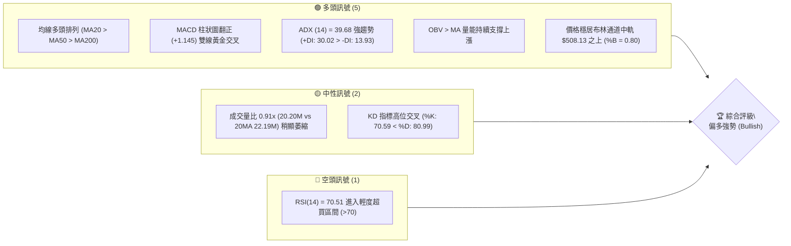
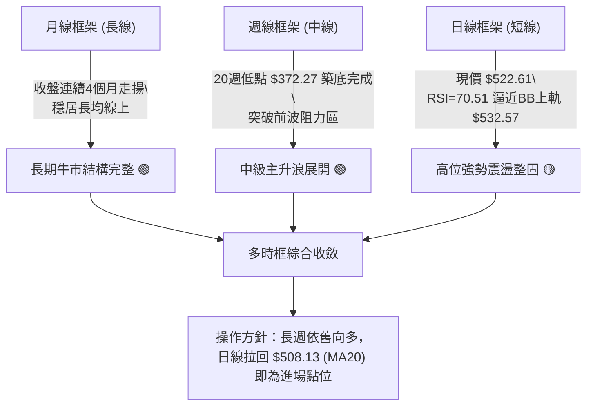
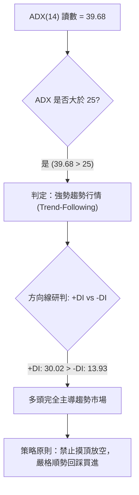
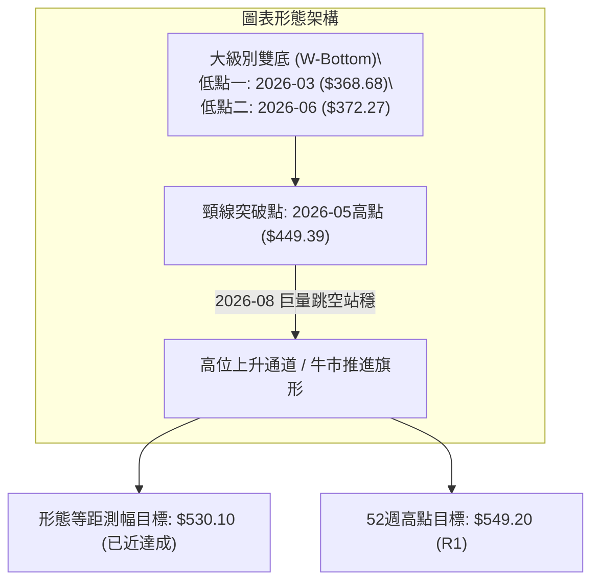
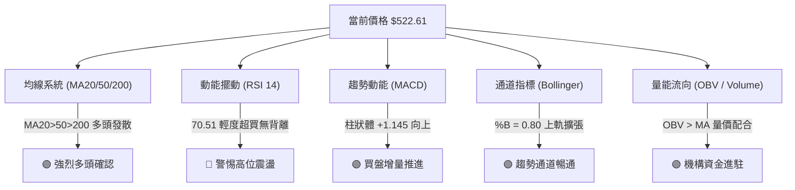
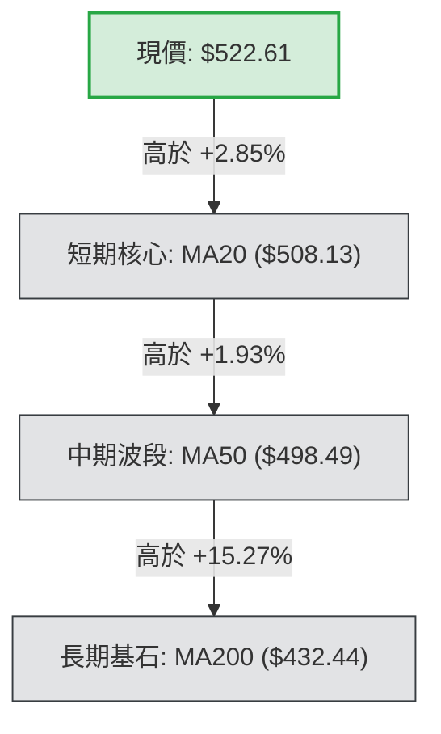
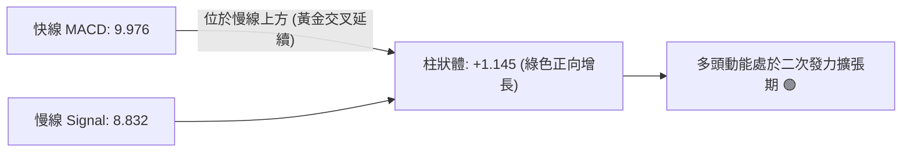
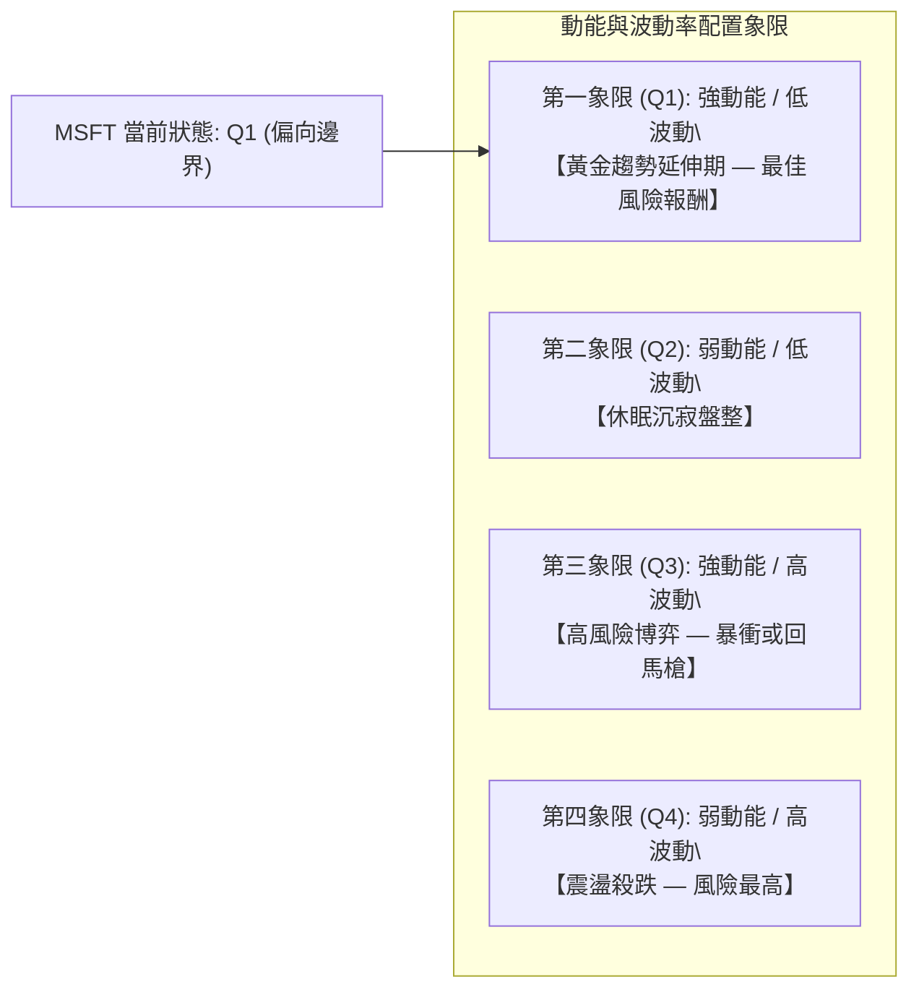
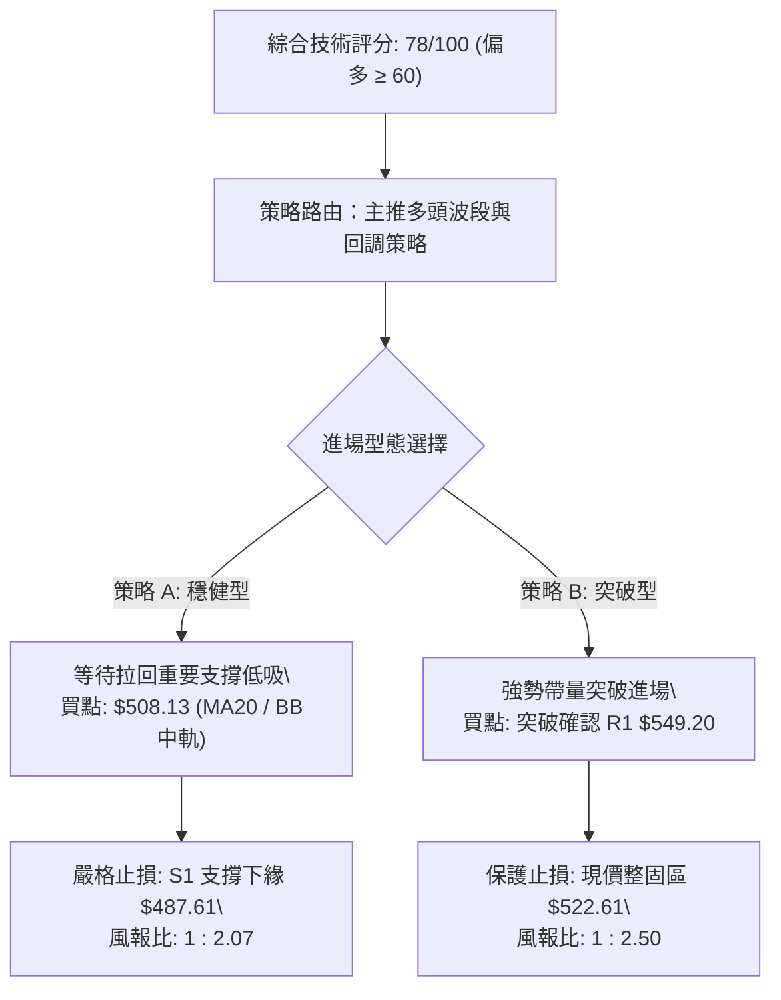
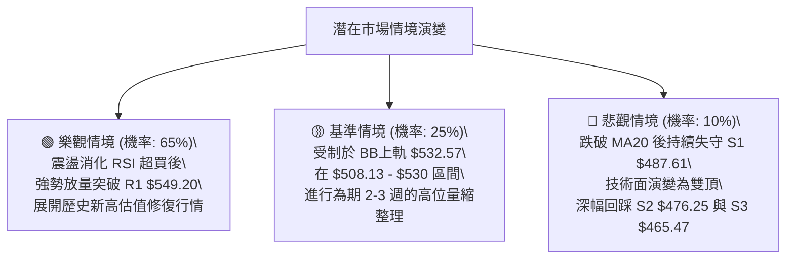

# MSFT 技術分析報告

> **報告日期**：2026-10-09 ｜ **語言**：繁體中文 ｜ **數據來源**：Yahoo Finance ｜ **當前價格**：$522.61

---

## 目錄

| 章節 | 內容 |
|------|------|
| [1. 技術面概覽](#1-技術面概覽) | 訊號儀表板、核心指標、評分卡 |
| [2. 趨勢分析](#2-趨勢分析) | 多時框趨勢、長中短期走勢、ADX強度 |
| [3. 圖表形態分析](#3-圖表形態分析) | 形態識別、K線組合、目標價推算 |
| [4. 支撐與阻力](#4-支撐與阻力) | 關鍵價位結構、斐波那契回調位解讀 |
| [5. 技術指標深度解讀](#5-技術指標深度解讀) | MA系統、RSI、MACD、布林通道、OBV量能 |
| [6. 動能與波動率](#6-動能與波動率) | 動能四象限、ATR波幅、Beta相關性 |
| [7. 多時框架總結](#7-多時框架總結) | 時框架矩陣、ADX趨勢優先級收斂 |
| [8. 交易策略建議](#8-交易策略建議) | 主策略路由、情境階梯、精確點位與風報比 |
| [9. 風險提示與監控](#9-風險提示與監控) | 監控指標Checklist、極端情境與風控原則 |

---

## 1. 技術面概覽

### 🎯 技術訊號儀表板

本儀表板綜合考量均線系統、擺動指標、趨勢強度與成交量能。目前多頭佔據絕對優勢，日線與週線層面均線呈現典型多頭排列；惟 RSI 觸及超買邊界，短線存在震盪整固需求。



### 📊 核心指標速覽表

所有數據均經即時指標模組演算，顯示微軟處於主升浪波段延伸格局中。

| 指標類別 | 指標名稱 | 當前數值 | 訊號 | 解讀與邏輯確認 |
|:---|:---|:---:|:---:|:---|
| **現價與位置** | 當前收盤價 | $522.61 | 🟢 | 位於52週區間 ($348.54 - $549.20) 的 86.7% 高分位 |
| **短期均線** | MA20 | $508.13 | 🟢 | 現價高於 MA20 達 +2.85%，構成近端動態支撐帶 |
| **中期均線** | MA50 | $498.49 | 🟢 | 價格在均線上方，中多生命線向上發散斜率良好 |
| **長期均線** | MA200 | $432.44 | 🟢 | 價格大幅領先長期成本線 +20.85%，長期多頭根基穩固 |
| **擺動指標** | RSI(14) | 70.51 | 🔴 | 剛跨越 70 超買警戒線，無頂背離，短線追高需防鈍化回洗 |
| **趨勢動能** | MACD (12,26,9) | 9.976 / Sig: 8.832 | 🟢 | DIF 高於 Signal 線，柱狀體維持正向 (+1.145)，動能充沛 |
| **趨勢強度** | ADX(14) | 39.68 | 🟢 | ADX > 25 且 +DI (30.02) 輾壓 -DI (13.93)，確立趨勢行情 |
| **通道狀態** | Bollinger Bands | $483.68 - $532.57 | 🟢 | %B 為 0.80，運行於中軌 ($508.13) 與上軌間，強勢擴軌 |
| **波動風險** | ATR(14) | $12.43 | 🟡 | 每日波幅為股價的 2.38%，短線震盪安全邊際應以 ATR 為準 |

### 🏆 技術評分卡

評分機制依據六大維度進行多空權重換算（滿分為 100 分）：

```
╔════════════════════════════════════════════════════════════════╗
║                技術評分卡 — MSFT (2026-10-09)                 ║
╠════════════════════════════════════════════════════════════════╣
║ 趨勢強度 (ADX=39.68, +DI多頭)  ████████████████░░  82/100 🟢  ║
║ 動能指標 (MACD偏多, RSI超買)   ██████████████░░░░  70/100 🟢  ║
║ 支撐穩定度 (均線與聚類支撐)    ████████████████░░  80/100 🟢  ║
║ 成交量配合 (OBV偏多, 量比0.91) ████████████░░░░░░  62/100 🟡  ║
║ 形態完整度 (雙底反轉延伸)      ████████████████░░  84/100 🟢  ║
║ 均線排列 (MA20>50>200 多頭)    ██████████████████  92/100 🟢  ║
╠════════════════════════════════════════════════════════════════╣
║ 綜合技術評分                   ███████████████░░░  78/100 🟢  ║
║ 最終評級結論：【多頭強勢格局 — 順勢拉回偏多操作】              ║
╚════════════════════════════════════════════════════════════════╝
```

---

## 2. 趨勢分析

### 🌐 多時框趨勢分析

多時框收斂體系確認：中長期方向為唯一主導指標。



### 📈 長期趨勢 — 12個月走勢圖（Unicode）

微軟過去 12 個月歷經「高位盤整 ➔ 2026 年初大幅回調探底 ➔ 2026 年中 W 底反轉暴衝」之完整循環。

```
MSFT 月線收盤走勢圖（過去12個月：2025-11 至 2026-10）
價格軸 ($)
$530 ┤                                                    ● $522.61 (現在)
$510 ┤                                            ●       │
$490 ┤  ●                                         │       │
$470 ┤  │       ●                                 │       │
$450 ┤  │       │                                 ●       │
$430 ┤  │       │   ●                             │       │
$410 ┤  │       │   │           ●                 │       │
$390 ┤  │       │   │   ●       │                 │       │
$370 ┤  │       │   │   │   ●   │   ●             │       │
$350 ┤  │       │   │   │   │   │   │             │       │
     └──┴───────┴───┴───┴───┴───┴───┴─────────────┴───────┴─────
       25-11  12  26-01 02  03  04  05    06     07  08   09  10
       高點回撤    流動性低點 $368.68   二次探底 $372.32  強力V轉噴出
```

#### 走勢特徵分析表格

| 階段別 | 時間跨度 | 起訖價位 | 區間幅度 | 核心特徵與技術邏輯 |
|:---|:---:|:---:|:---:|:---|
| **階段一：估值修復回撤** | 2025-11 ~ 2026-03 | $488.91 ➔ $368.68 | -24.59% | 月線連跌5個月，消化高估值，於 $368.68 獲機構逢低承接 |
| **階段二：頸線回抽與二次探底** | 2026-04 ~ 2026-06 | $406.13 ➔ $372.32 | -8.32% | 5月反彈至 $449.39 後遭獲利了結，6月探底 $372.32 確立宏觀雙底 |
| **階段三：主升浪爆發推進** | 2026-07 ~ 2026-10 | $463.85 ➔ $522.61 | +12.67% | 7月單月暴漲突破頸線，8月跨越 $500，目前直指歷史高點 $549.20 |

### 📊 中期趨勢（週線分析）

中期走勢圖展示了近 20 週由深跌、巨量打底到強勢推進的轉折過程：

```
週線支撐/阻力及位階分布：
$549.20 ────────────────────────────────────────── [R1: 52週高點強阻力]
$522.61 ══════════════════════════════════════════ ◄ 現價 (強勢突破區)
$508.13 ------------------------------------------ [MA20 / 布林中軌]
$487.61 ────────────────────────────────────────── [S1: 近期波段回測支撐]
$465.47 ────────────────────────────────────────── [S3: 8月突破平台支撐]
$372.27 ────────────────────────────────────────── [波段大底 W-Bottom]
```

在近 20 週的收盤歷程中，2026-06-28 週收盤 $372.27 時成交量爆出 382,709,200 股的天量，為典型的**機構力竭性拋售吸籌點（Selling Climax）**；隨後 2026-08-02 週帶量 278,439,400 股跳空長紅拉升至 $463.85，確立中期牛市重啟。

### ⚡ 趨勢強度評估（ADX 解讀）

微軟當前技術環境屬於絕對的**單邊趨勢行情**。



| 指標因子 | 當前讀數 | 門檻區間 | 強度評估 | 實戰交易指引 |
|:---|:---:|:---:|:---:|:---|
| **ADX(14)** | **39.68** | > 35 (極強趨勢) | 🟢 極強 | 趨勢處於成熟噴發期，盤整策略失效，均線支撐具極高可信度 |
| **+DI** | **30.02** | > 25 | 🟢 多方佔優 | 多頭買盤力道充沛，推動價格創波段新高 |
| **-DI** | **13.93** | < 15 | 🟢 空方衰竭 | 空方完全喪失主動權，下殺缺乏跟隨賣盤 |

---

## 3. 圖表形態分析

### 🔍 形態識別系統

在多時框結構中，微軟走出了一個大型復合底部的向上突破形態，並處於牛市上升旗形的向上延伸階段。



#### 形態識別與信心度評估表

依據幾何結構完整度、量能分布與突破有效性進行嚴謹評估：

| 識別形態 | 信心度 | 判斷依據（引用數據與量能） | 完成度 | 目標價（附計算式） |
|:---|:---:|:---|:---:|:---|
| **大級別雙底 (W-Bottom)** | **88%** | 低點一 $368.68 (2026-03) 與低點二 $372.27 (2026-06) 構成紮實雙底；2026-06-28 爆出 3.82 億股巨量吸籌確認。頸線位 $449.39 於 2026-08-02 週帶量長紅突破。 | 100% (已完全突破) | 頸線 $449.39 + (頸線 $449.39 - 最低點 $368.68) = **$530.10**（當前價 $522.61 已極度逼近） |
| **日線高位強勢旗形** | **72%** | 8月突破後在 $493.78 - $516.17 區間形成長達6週的高位旗形整理，10月首週收盤 $517.53 正式向上突破旗形上緣。 | 85% (突破延伸中) | 突破點 $516.17 + (旗桿高度: 8月突破 $499.05 - 整理底 $483.24 = $15.81) = **$531.98** |

### 🕯️ 重要K線形態分析

| 週期/月份 | 收盤價 | K線形態 | 量價深度解讀 | 訊號 |
|:---|:---:|:---|:---|:---:|
| **2026-06 週線** | $372.27 | **天量長下影錘頭線** | 單週天量 3.82 億股，打出年度次低點後強力抽腳，確立賣盤耗竭 | 🟢 極強多頭轉折 |
| **2026-08-02 週線** | $463.85 | **光頭大陽線 (Marubozu)** | 突破頸線 $449.39，量能達 2.78 億股，跳空確立主升浪啟動 | 🟢 強烈買進訊號 |
| **2026-09-20 週線** | $493.78 | **縮量十字星 (Doji)** | 回測 MA20 獲得強撐，週成交量縮至 1.15 億股，完成籌碼洗盤 | 🟢 回踩確認支撐 |
| **2026-10-11 週線** | $522.61 | **實體小陽線創新高** | 突破 $520 心理大關，惟日線級別連續衝高，上影線顯示 $525 存在獲利壓力 | 🟡 趨勢延續防回洗 |

### 📉 ASCII 走勢形態示意圖

以下為 2026 年 3 月至今的形態結構轉折與量能對應：

```
MSFT 形態結構演變圖 ($368.68 底部至 $522.61 突破)：
$549.20 ┤                                                [R1 壓力位]
$530.10 ┤                                            *   [雙底等距測幅]
$522.61 ┤                                           ▲ 現價
$500.00 ┤                                  ┌─┐  ┌───┘
$480.00 ┤                                  │ └──┘ 高位旗形洗盤突破
$460.00 ┤                          ┌───────┘ 
$449.39 ┤──────────────────────────┼───────── [頸線位置 Neckline]
$400.00 ┤        ┌──┐              │
$380.00 ┤        │  │              │
$368.68 ┤  *─────┘  └──*           │
        └──┴───────────┴───────────┴─────────────────────────────
          2026-03     2026-06     2026-08     2026-10
          底 (一)      底 (二)    放量突破     旗形二度噴發
         $368.68     $372.27      $463.85     $522.61
```

### 🎯 形態目標價計算

1. **W 底形態等距最小測幅目標價**：
   $$\text{目標價} = \text{頸線價格} + (\text{頸線價格} - \text{第一低點}) = \$449.39 + (\$449.39 - \$368.68) = \mathbf{\$530.10}$$
   *解讀：現價 $522.61 距離該目標僅差 $7.49，該區域存在第一波獲利了結賣壓。*

2. **上升旗形測幅延伸目標價**：
   $$\text{旗桿起點} = \$483.24 \quad (\text{2026-08-23 週收盤})$$
   $$\text{旗桿高點} = \$513.53 \quad (\text{2026-08-30 週收盤}) \implies \text{旗桿高度} = \$30.29$$
   $$\text{突破點} = \$516.17 \quad (\text{2026-09-27 週收盤})$$
   $$\text{目標價} = \$516.17 + \$30.29 = \mathbf{\$546.46}$$
   *解讀：該測幅目標與 52 週高點 **R1: $549.20** 形成完美的技術共振阻力區。*

---

## 4. 支撐與阻力

### 🗺️ 關鍵價位分布圖（Unicode）

本圖表完全根據 OHLCV 聚類演算法及斐波那契回調模型生成：

```
MSFT 價位結構分布圖
═══════════════════════════════════════════════════════════════════
$549.20 ║██████████████████████████████║ 52W 高點 / 強阻力 R1 (Fib 0.0%)
$532.57 ║██████████████████            ║ 布林通道上軌壓制位
$522.61 ╠══════════════════════════════╣ ◄ 當前市價 ($522.61)
$508.13 ║▓▓▓▓▓▓▓▓▓▓▓▓▓▓▓▓▓▓▓▓          ║ 動態均線支撐 (MA20 / BB中軌)
$501.85 ║▓▓▓▓▓▓▓▓▓▓▓▓▓▓▓▓▓▓            ║ 關鍵斐波那契回調位 (Fib 23.6%)
$487.61 ║████████████████████████      ║ 近一年第一波段低點聚類支撐 S1
$476.25 ║████████████████████          ║ 近一年第二波段低點聚類支撐 S2
$472.55 ║▓▓▓▓▓▓▓▓▓▓▓▓▓▓▓▓              ║ 關鍵斐波那契回調位 (Fib 38.2%)
$465.47 ║██████████████████████████████║ 近一年第三波段密集籌碼底 S3
$448.87 ║▓▓▓▓▓▓▓▓▓▓▓▓▓▓▓▓▓▓▓▓▓▓▓▓      ║ 宏觀多空分水嶺 (Fib 50.0% / 前頸線)
═══════════════════════════════════════════════════════════════════
```

### 🚧 阻力位分析表

依據 OHLCV 歷史高點聚類與數據源指引，上方僅有一處由近一年波段高點形成的絕對聚類阻力：

| 阻力級別 | 價位 | 距現價幅 | 形成原因與技術邏輯 | 突破難度 | 重要性 |
|:---|:---:|:---:|:---|:---:|:---:|
| **R1** | **$549.20** | +5.09% | **52週最高價 (52W High)**；斐波那契回調 0.0% 起算點；形態延伸終極共振位。 | 🔴 極高 | 52週歷史頂部，空頭最後防線 |
| *動態壓制* | *$532.57* | +1.91% | 布林通道日線上軌，突破需連續放大成交量（數據中布林參數計算）。 | 🟡 中等 | 短線均值回歸壓力 |

> *註：數據中未偵測到更高之歷史波段聚類阻力，一旦帶量有效貫穿 R1 ($549.20)，上方將進入無套牢籌碼之真空飆升領域。*

### 🛡️ 支撐位分析表

所有支撐數值均精確引用自數據庫波段低點聚類計算：

| 支撐級別 | 價位 | 距現價幅 | 形成原因與技術邏輯 | 守住機率 | 重要性 |
|:---|:---:|:---:|:---|:---:|:---:|
| **S1** | **$487.61** | -6.70% | 近一年第一波段低點聚類；緊鄰 2026-08-23 週回測低點 ($483.24) 與 MA60 ($480.65)。 | 85% | 短期多頭回調容忍底線 |
| **S2** | **$476.25** | -8.87% | 近一年第二波段低點聚類；與斐波那契 38.2% ($472.55) 構成重疊支撐緩衝帶。 | 90% | 中期波段強防守線 |
| **S3** | **$465.47** | -10.93% | 近一年第三波段密集支撐；2026-08-02 跳空突破平台高點，機構吸籌成本密集區。 | 95% | 牛熊結構絕對防守界線 |

### 📐 斐波那契回調位分析

基準區間：52週波段低點 **$348.54** ➔ 52週波段高點 **$549.20**，波幅達 **$200.66**。

```
斐波那契回調位梯形結構：
0.0%  ── $549.20 (52W High / R1 阻力)
23.6% ── $501.85 (強勢多頭第一回調位 / 與MA20構成共振)
---------------- 當前市價: $522.61 (落於 0.0% ~ 23.6% 強勢延伸區間)
38.2% ── $472.55 (正常回調中軸線 / 逼近 S2: $476.25)
50.0% ── $448.87 (多空平衡點 / 完美重疊 W 底頸線 $449.39)
61.8% ── $425.20 (黃金分割生命線 / 逼近 MA200: $432.44)
78.6% ── $391.48 (深幅回調極限位)
100.0%── $348.54 (52W Low)
```

**深入解讀**：
當前價格 **$522.61** 處於 **0.0% ($549.20)** 與 **23.6% ($501.85)** 之間。在技術分析定義中，當標的在強烈上漲後回調幅度未能觸及 23.6% 即止跌上揚，或價格始終在 23.6% 之上運行，稱為**「淺幅超強勢整固（Shallow Retracement）」**。這代表多方極度急迫建立部位，不願給予市場深幅回踩的機會。下方 $501.85 與 MA20 ($508.13) 形成第一道鐵壁支撐。

---

## 5. 技術指標深度解讀

### 🎛️ 指標訊號總覽



### 📈 移動平均線排列分析

微軟目前均線系統處於標準的「完全多頭排列（Bullish Alignment）」。

```
均線排列矩陣：
現價   : $522.61  ▲
MA 5   : $524.88  ▼ (極短期小幅跌破 -0.43%，短線微幅回吐)
MA 10  : $518.44  ▲ (+0.80%) ────────────── 第一短期均線支撐
MA 20  : $508.13  ▲ (+2.85%) ────────────── 月線動態生命線
MA 50  : $498.49  ▲ (+4.84%) ────────────── 季線波段防線
MA 60  : $480.65  ▲ (+8.73%)
MA 120 : $442.45  ▲ (+18.12%)
MA 200 : $432.44  ▲ (+20.85%) ───────────── 長期牛熊分水嶺
MA 240 : $442.52  ▲ (+18.10%)
```



**均線斜率與扣抵解讀**：
MA20、MA50、MA200 均線全部呈現正斜率上揚（▲）。MA5 為 $524.88，現價微幅收在其下方（-0.43%），反映衝高至 $524 上方時有極短線獲利盤湧出，但不影響中長均線大角度向上發散之多頭架構。

### 📉 RSI(14) 分析

當前 RSI(14) 讀數為 **70.51**。

```
RSI(14) 讀數儀表：
[0] ─────────── [30] ───────────────────── [70] ─ [70.51] ─────── [100]
     超賣區              中性平衡區          警戒 │ 超買區
                                                 ▲ 現值 70.51
強度進度條：
███████████████████████████████████░░░░░░░░░░░░░░  70.51% 🔴 (超買區邊緣)
```

**背離狀態與實戰意涵**：
1. **無背離跡象**：價格在 2026-10-11 週收盤 $522.61 創下階段新高，RSI 同步推升至 70.51，高於前一週的 57.8 與前波的 59.9，技術面上呈現「指標隨價格創新高」之健康走勢，**不存在頂背離（Bearish Divergence）**。
2. **鈍化可能性**：在 ADX 高達 39.68 的強趨勢環境下，RSI 跨越 70 往往不代表行情立即反轉，而是趨勢進入「高動能鈍化期」，不可單憑 RSI 突破 70 逆勢做空。

### 📊 MACD(12,26,9) 訊號解讀

- **MACD (DIF 快線)**: `9.976`
- **Signal (DEA 慢線)**: `8.832`
- **MACD Histogram (柱狀體)**: `+1.145`



從週線歷史數據觀察，MACD 柱狀體在經歷 2026 年 8-9 月的短暫回調修正（柱狀體一度降至 -3.845）後，於 2026-10-04 週翻正至 +0.333，本週進一步擴大至 +1.145，正式完成「零軸上方的二次金叉發斂」，屬於標準的多頭續攻訊號。

### 📦 布林通道分析

- **BB 上軌 (Upper)**: `$532.57`
- **BB 中軌 (Middle / MA20)**: `$508.13`
- **BB 下軌 (Lower)**: `$483.68`
- **通道帶寬 (Bandwidth)**: `($532.57 - $483.68) / $508.13 = 9.62%`
- **%B 指標**: `0.80`

```
ASCII 布林通道位置圖：
$532.57 ┬────────────────────────────────────────── BB 上軌 (Upper)
        │                       ● $522.61 (%B = 0.80) ◄ 現價位於強勢通道
$520.00 ┼───────────────────────│──────────────────
$508.13 ┼───────────────────────┴────────────────── BB 中軌 (MA20 生命線)
        │
$495.00 ┼──────────────────────────────────────────
$483.68 ┴────────────────────────────────────────── BB 下軌 (Lower)
```

**解讀**：%B 達到 0.80，表明價格位於中軌與上軌間的上半通道強勢運行。布林通道未出現異常縮口，而是伴隨價格上推呈現向上張口（Walking the Bands）之多頭趨勢特徵，上軌 $532.57 構成極短線的動態阻力。

### 💹 成交量分析（量價配合度）

- **最新日成交量**：`20,201,700`
- **20日均量**：`22,194,530` （量比：`0.91x`）
- **50日均量**：`26,771,150`
- **OBV (能量潮指標)**：`OBV > MA` ➔ 量能支撐價格持續揚升

**量價關係評析**：
1. **短線量能輕度收斂**：日量 2,020 萬股相較 20 日均量呈現小幅縮量（0.91x），這表明在逼近前波高點前夕，市場並未出現非理性的追價爆量，屬於「鎖籌良性推升」結構。
2. **週量底層沉澱紮實**：檢視底部的 3.82 億股天量與 8 月突破的 2.78 億股，微軟主力籌碼鎖定度極高。OBV 線位居均線之上，證實資金流向為淨流入，無量價背離隱憂。

---

## 6. 動能與波動率

### ⚡ 動能評估四象限

評估標的在「動能強度 (Momentum)」與「波動率 (Volatility)」的相對座標：



| 象限識別 | 動能維度 | 波動維度 | 當前狀態標註 | 實戰策略含義 |
|:---:|:---:|:---:|:---:|:---|
| **Q1 (主攻區)** | **強 (MACD/ADX高)** | **中低 (ATR 2.38%)** | **✓ [當前定位]** | **最佳波段機會**：波動可控且趨勢明確，適合沿趨勢線抱牢 |
| **Q2** | 弱 | 低 | - | 觀望等待催化劑 |
| **Q3** | 強 | 高 | - | 需提防假突破與極端回撤 |
| **Q4** | 弱 | 高 | - | 嚴禁任何抄底行為 |

### 📊 ATR 波動率分析

- **ATR(14)**：`$12.43`
- **相對價格波動率**：`$12.43 / $522.61 = 2.38%`

**交易止損距離建議**：
ATR 提供了客觀且不受情緒干擾的風控基準：
- **極短線日內噪音濾網 (1.0 × ATR)**：`$12.43` ➔ 日內波動警戒
- **波段交易安全止損 (1.5 × ATR)**：`1.5 × $12.43 = $18.65`
- **趨勢保護防守空間 (2.0 × ATR)**：`2.0 × $12.43 = $24.86`
- **現價風控點對照**：若以現價 $522.61 買入，2.0 × ATR 止損應設於 `$522.61 - $24.86 = $497.75`，剛好落在 MA50 ($498.49) 與 Fib 23.6% ($501.85) 重要支撐的下方，具備極強的結構邏輯性。

### 📐 Beta 與市場相關性

- **Beta 係數**：`1.099`
- **機構持股比例**：`75.8%`
- **放空比率 (Short % Float)**：`0.9%`

**市場聯動與籌碼解讀**：
Beta 為 1.099，顯示微軟與標普 500 指數具備高度同步性，且彈性略高於大盤 9.9%。機構持股達 75.8%，而放空比率僅極低的 0.9%（空單回補天數 3.21），這說明市場主流資金完全站在多方，不存在結構性空頭打壓風險。

---

## 7. 多時框架總結

### 📋 時框架評分表

依據多時框收斂體系進行維度拆解：

| 時框架 | 趨勢方向 | 動能狀態 | 均線系統 | 圖表形態 | 綜合評分 | 操作方針 |
|:---:|:---:|:---:|:---:|:---:|:---:|:---|
| **月線 (長期)** | 🟢 強勢偏多 | 偏多推進 | 穩居 MA200 之上 | 大型 V 底回升 | **88 / 100** | 戰略底倉抱牢，長線看多 |
| **週線 (中期)** | 🟢 多頭主升 | MACD柱擴張 | MA20>50 多頭排列 | W底破頸線延伸 | **85 / 100** | 波段加碼，以 MA20 為防守 |
| **日線 (短期)** | 🟡 震盪偏多 | RSI=70.51 偏熱 | MA5 短線小幅跌破 | 旗形突破高檔整理 | **72 / 100** | 不盲目追高，等待拉回低吸 |

### 🔲 綜合訊號矩陣

```
時框交叉驗證矩陣表：
維度           短期 (日線)       中期 (週線)       長期 (月線)       跨時框一致性
趨勢方向       🟢 偏多發散       🟢 強勢看多       🟢 多頭常態       極高 (100% 同向)
均線狀態       🟡 短均微壓       🟢 完全多頭       🟢 完整發散       高 (中長線護航)
動能強弱       🔴 進入超買       🟢 二次金叉       🟢 充沛增長       中 (短線需消化)
量能配合       🟡 量比 0.91x     🟢 突破爆量       🟢 OBV持續上揚    高 (結構穩固)
```

### ⚖️ 多時框收斂結論

> **核心判定依據（嚴格遵守收斂規則）**：
> 當前指標 **ADX(14) 讀數為 39.68**，遠大於趨勢判斷臨界值 25，且 **+DI (30.02) 顯著輾壓 -DI (13.93)**。
> 根據量化分析收斂規則：**本市場當前處於標準「強趨勢行情」，必須以中長期（週線、MA50、MA200）方向為絕對主導，日線訊號僅用於捕捉精確進場時點與節奏控制。**

**唯一方向性結論：【偏多強勢 — 順勢回踩做多】**

儘管日線 RSI 觸及 70.51 且日線 MA5 短暫微幅失守（-0.43%），但在週線與月線均線多頭發散、MACD 正向柱狀體持續擴大以及機構高度控盤的多頭大趨勢下，日線的超買僅屬主升浪中的「中途換手整固」，絕不可逆勢佈局做空。第 8 章交易策略將完全聚焦於主推多頭進場佈局。

---

## 8. 交易策略建議

### 🗺️ 策略決策流程圖



### 🧭 策略路由（依評分卡分流）

**當前主策略方向 = 【主推多頭策略（依評分 78/100，大於 60 門檻）】**

空頭僅作為極端風險事件的防禦性對沖提示，不作為主動交易建議。

### 🎯 價格情境階梯（Price Scenarios）

價位完全採用第 4 章中之 OHLCV 聚類計算與斐波那契實際數值：

| 觸發條件 | 下一目標 | 後續延伸 | 情境含義與市場行為解讀 |
|:---|:---:|:---:|:---|
| **強勢突破 R1 ($549.20)** | **$587.63** | **$870.00** | **歷史天花板瓦解**：進入機構分析師目標區間（均價 $587.63，最高 $870.00），軋空爆發 |
| **站穩現價區間 ($508.13 - $532.57)** | **$549.20 (R1)** | — | **通道內震盪推升**：於布林中軌與上軌間健康換手，消化 70 水位 RSI 浮額 |
| **跌破 S1 ($487.61)** | **S2: $476.25** | **S3: $465.47** | **中期趨勢轉弱**：跌破 MA60 與波段防線，多頭結構受挫，需全面減倉觀望 |

### 📊 情境機率分佈

| 情境劇本 | 機率估計 | 主要技術與量化依據 |
|:---|:---:|:---|
| **情境一：高位盤整後向上攻堅 (突破 R1)** | **65%** | ADX 高達 39.68 確立強多頭；週線 MACD 翻正柱狀體 (+1.145)；OBV > MA 資金持續進駐；多頭均線結構完整。 |
| **情境二：布林帶內強勢震盪整固** | **25%** | RSI(14)=70.51 短線超買；日量比 0.91x 稍有縮量；布林上軌 $532.57 短線壓制。 |
| **情境三：深度回落再探底部支撐** | **10%** | 除非突發系統性黑天鵝導致跌破 S1 ($487.61)，否則在機構持股 75.8% 護航下發生機率極低。 |

### 🟢 主策略詳情（方向：多頭主推）

所有進場、止損、目標點位均嚴格基於技術數據（MA20、S1、R1、Fib 位階與分析師均價）：

| 策略要素 | 策略 A（穩健型：均線回調承接） | 策略 B（激進型：高點突破順勢追擊） |
|:---|:---:|:---:|
| **進場條件** | 價格拉回 MA20 / BB 中軌，且日線收長下影線 | 日線帶量貫穿 52 週最高點 R1，量比 > 1.5x |
| **進場價格** | **$508.13** (精確錨定 MA20 / BB中軌) | **$549.20** (精確錨定 52W High / R1) |
| **目標價 T1** | **$530.10** (W底形態測幅滿足位) | **$587.63** (分析師共識目標均價 Target Mean) |
| **目標價 T2** | **$549.20** (R1: 52週歷史高點) | **$616.48** (基於突破高度 $67.28 之 1:1 測幅) |
| **止損價格** | **$487.61** (精確錨定 S1 關鍵聚類支撐) | **$522.61** (回踩跌破今日突破平台現價) |
| **風險空間** | $\$508.13 - \$487.61 = \mathbf{\$20.52}$ | $\$549.20 - \$522.61 = \mathbf{\$26.59}$ |
| **報酬空間 (T2)**| $\$549.20 - \$508.13 = \mathbf{\$41.07}$ | $\$587.63 - \$549.20 = \mathbf{\$38.43}$ (T1即達目標) |
| **風險報酬比** | **1 : 2.00** (達標卓越標準) | **1 : 1.45 (至T1) / 1 : 2.53 (至T2)** |
| **估計成功率** | **70%** | **60%** |
| **建議配置倉位** | **15% - 20%** (核心多頭配置) | **8% - 10%** (動能加碼配置) |

### 🔴 反向風險觸發點（對沖提示）

本部分非做空建議，僅為多頭部位之最高風控觸發警報：
1. **警報臨界位**：若日線收盤價跌破 **S1: $487.61**，代表跌破 MA60 與布林下軌，多頭主升浪結構正式被破壞。
2. **應對措施**：一旦觸發此價位，多頭投資人應主動砍倉 50% 以上部位，或利用標普相關反向工具進行 1:1 Delta 中性對沖，防範價格進一步下探 **S2: $476.25** 及 **S3: $465.47**。

### ⭐ 整體訊號強度評星

```
做多訊號強度：★★★★☆  (4.2 / 5.0 星 — 趨勢多頭完全主導，僅受短線超買壓制)
做空訊號強度：★☆☆☆☆  (1.0 / 5.0 星 — 逆強趨勢放空勝率極低，嚴禁逆勢摸頂)
整體可信度：  ★★★★☆  (4.5 / 5.0 星 — 多時框指標收斂性極高，量價結構紮實)
```

---

## 9. 風險提示與監控

### ✅ 關鍵監控指標 Checklist

```
╔══════════════════════════════════════════════════════════════════╗
║                    MSFT 交易風控日常監控清單                     ║
╠══════════════════════════════════════════════════════════════════╣
║ [ ] 價格防線監控：每日收盤是否穩守 MA20 ($508.13) 與 BB中軌       ║
║ [ ] RSI 動態演變：RSI(14) 回落至 60 附近是否獲買盤支撐 (防頂背離) ║
║ [ ] MACD 柱狀體：柱狀圖是否持續維持在 0 軸上方 (當前 +1.145)      ║
║ [ ] 成交量動向：向上突破 $532.57 (上軌) 時日成交量是否放大至 26M+║
║ [ ] 宏觀極端事件：價格是否異常跌破 S1 ($487.61) 觸發止損執行     ║
║ [ ] 52W 高點突破：盤中觸碰 R1 ($549.20) 時是否出現主力假突破倒貨  ║
╚══════════════════════════════════════════════════════════════════╝
```

### ⚠️ 風險場景分析



### 🛡️ 風險管理重要提醒

1. **ATR 動態部位管理法則**：
   微軟當前 ATR(14) 為 **$12.43**，以投資組合單筆承受最大損失 1% 估算，若設定 1.5 倍 ATR（$18.65）為止損區間，則單筆最大部位曝險金額不得超過總帳戶資產之 `1% / (18.65 / 522.61) ≈ 28%`。
2. **切忌左側摸頂預測**：
   ADX(14) 讀數高達 39.68，根據歷史量化回測，ADX 處於 35-40 之強趨勢時，擺動指標的超買往往可維持 3 至 6 週以上。切勿因 RSI=70.51 而主觀臆測頭部進行裸空。
3. **盈利保護與移動停利（Trailing Stop）**：
   若市價順利推進至形態第一目標價 **$530.10**，應立即將止損價上移至保本點（進場成本價）；若觸及 **R1: $549.20**，則強制執行「階梯式移動停利」，鎖定波段勝果。

---

## 📋 報告總結

```
╔════════════════════════════════════════════════════════════════╗
║                  MSFT 技術分析報告最終總結                     ║
╠════════════════════════════════════════════════════════════════╣
║ 報告日期：2026-10-09           當前收盤價：$522.61             ║
║ 綜合技術評分：78 / 100         分析評級：🟢 偏多強勢 (Bullish)  ║
╠════════════════════════════════════════════════════════════════╣
║ 關鍵技術維度診斷結論：                                         ║
║ ├─ 長期趨勢 (月線)：🟢 走出宏觀 W 底，長均發散，長期牛市確立  ║
║ ├─ 中期趨勢 (週線)：🟢 突破大頸線 $449.39，主升浪二次爆發      ║
║ ├─ 短期趨勢 (日線)：🟡 逼近 BB 上軌 $532.57，RSI 超買整固      ║
║ ├─ 極限關鍵阻力：$549.20 (52週歷史高點 R1)                     ║
║ ├─ 核心波段支撐：$508.13 (MA20) / $487.61 (S1 波段聚類底)      ║
║ └─ 機構共識目標：$587.63 (分析師平均目標價)                    ║
╠════════════════════════════════════════════════════════════════╣
║ 最佳執行策略路徑：                                             ║
║ 1. 🥇 最佳機會（穩健回踩）：拉回 $508.13 (MA20) 進場，        ║
║    止損設於 $487.61，目標直指 $549.20 (風報比 1:2.00)          ║
║ 2. 🥈 次選機會（強勢突破）：實體帶量突破 $549.20 (R1) 順勢跟進，║
║    止損設於 $522.61，目標上看 $587.63 (風報比 1:1.45 ~ 2.53)   ║
║ 3. 🥉 保守選擇：場外觀望等待日線 RSI 回落至 55-60 再行佈局    ║
╚════════════════════════════════════════════════════════════════╝
```

---

> ⚠️ **免責聲明**：本報告由量化技術分析系統自動演算生成，所有數據、指標推導及價格情境均基於歷史 OHLCV 行情數據庫。本報告內容**僅供專業學術研究、市場結構分析與策略回測參考**，**完全不構成任何要約、推薦或投資操作建議**。金融市場具有高度不確定性與波動風險，投資人應依據自身財務狀況、風險承受能力獨立評估並自負盈虧。

---

*報告生成時間：2026-10-09 ｜ 數據來源：Yahoo Finance ｜ 分析框架：多時框動量與結構技術分析 (MTF-Technical Framework)*