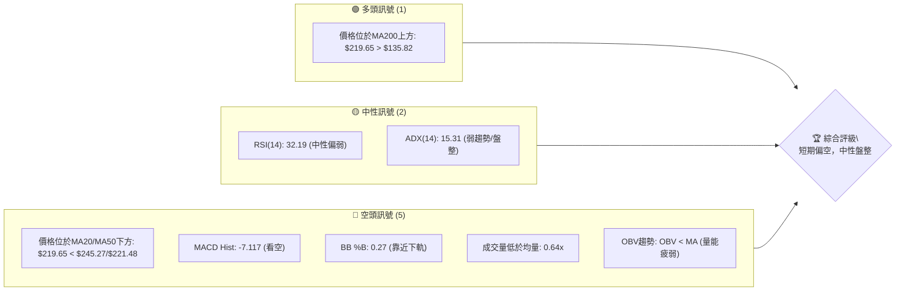
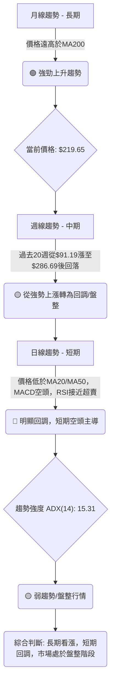
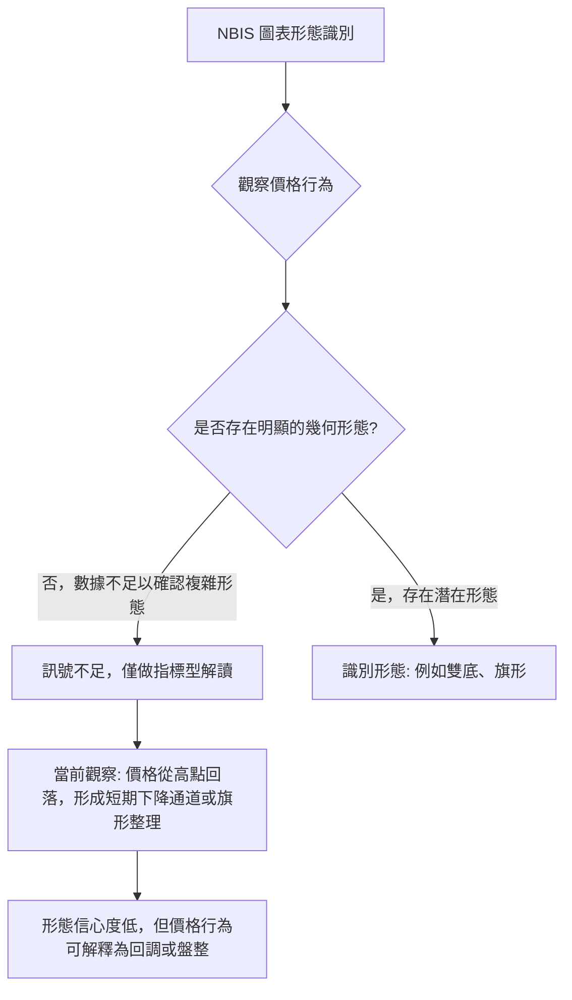
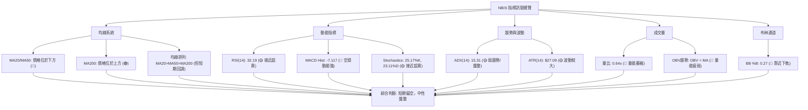
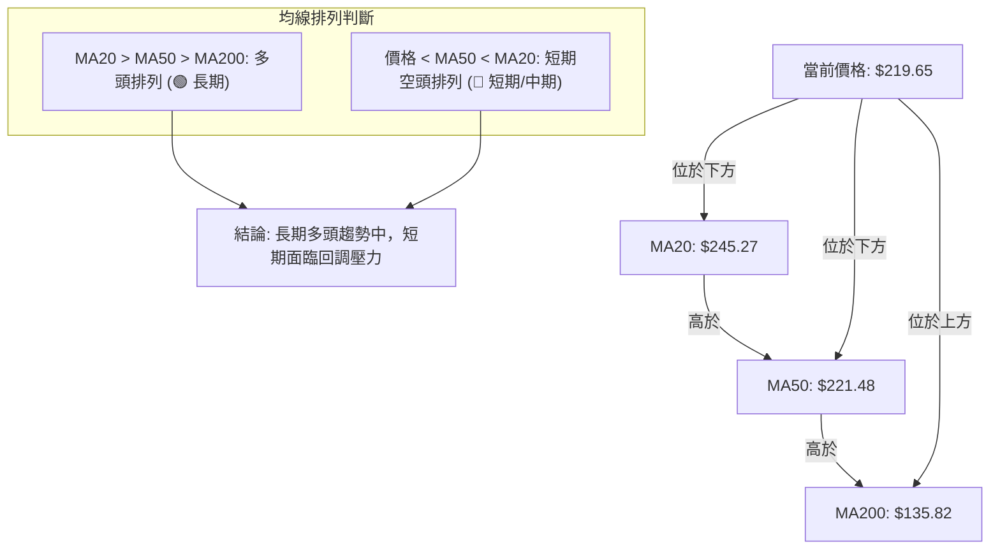
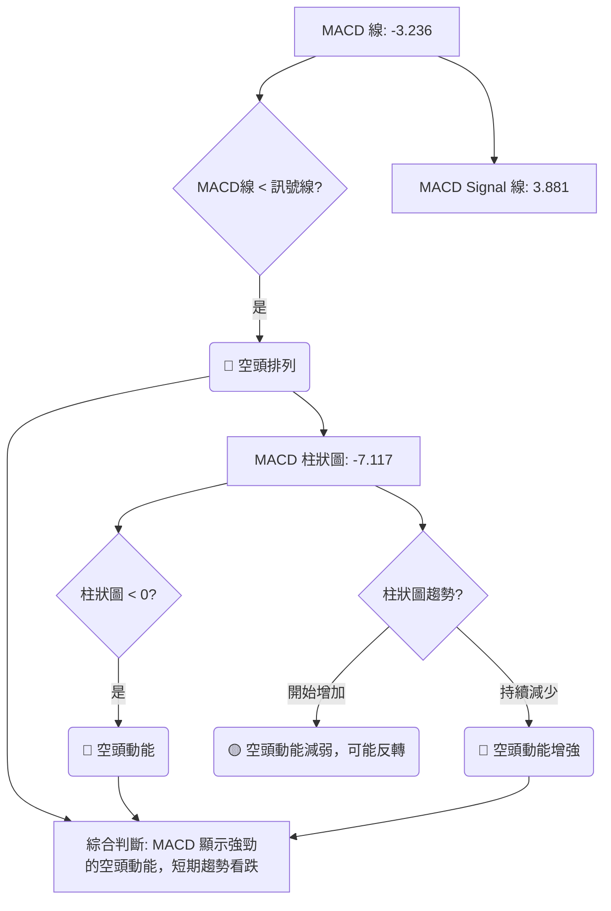
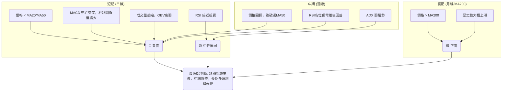
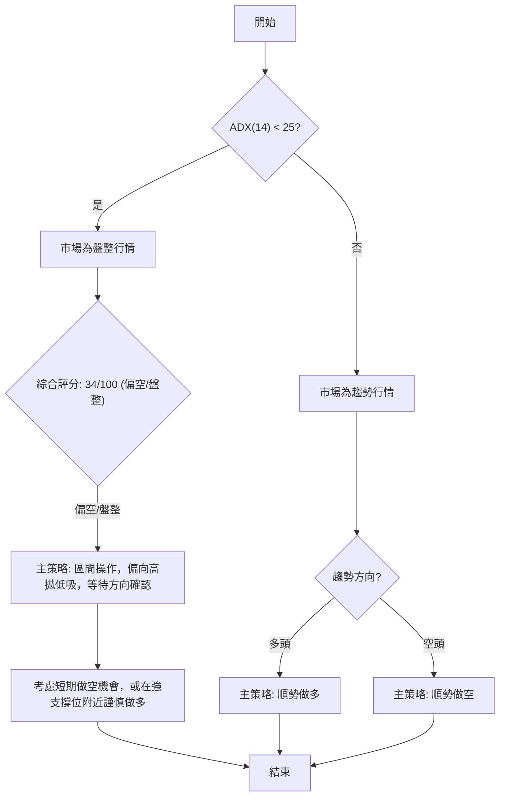
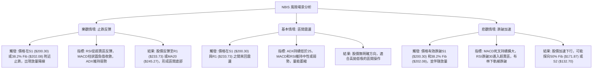

<details>
<summary>📊 靜態圖表 (點擊展開)</summary>

</details>

<html>
<head><meta charset="utf-8" /></head>
<body>
    <div style="height:500px; width:100%;">                        <script>window.PlotlyConfig = {MathJaxConfig: 'local'};</script>
        <script charset="utf-8" src="https://cdn.plot.ly/plotly-3.7.0.min.js" integrity="sha256-jvTGqxNp8AGWEcvNLVuKr+8j5dGe9Yw51LQkmDH+IYA=" crossorigin="anonymous"></script>                <div id="candlestick-chart" class="plotly-graph-div" style="height:100%; width:100%;"></div>            <script>                window.PLOTLYENV=window.PLOTLYENV || {};                                if (document.getElementById("candlestick-chart")) {                    Plotly.newPlot(                        "candlestick-chart",                        [{"close":{"dtype":"f8","bdata":"AAAAQDPzWkAAAABguE5cQAAAAAAp\u002fFpAAAAAwMzsWkAAAACAFI5bQAAAAKBHEVxAAAAAQArnXEAAAAAgrndfQAAAAGC4\u002fl9AAAAAACk8X0AAAADAzGxdQAAAAAAAgF5AAAAA4HqUYEAAAABgjzJgQAAAAGC47mBAAAAAwMwEYEAAAADAHnVfQAAAAGCPwl5AAAAAAClcXEAAAAAAAEBbQAAAAIDrEVpAAAAAIK6nWEAAAACAPYpaQAAAAOCjUF1AAAAAIIVbX0AAAADAHnVeQAAAAGBmRl9AAAAAIIULX0AAAACAPVpgQAAAAIAUHl5AAAAAYI+iW0AAAAAAAEBdQAAAAAApXFtAAAAAgOvRW0AAAADAzHxbQAAAAIAUjllAAAAAQAqXV0AAAADgUShWQAAAAGCP4lRAAAAAYLh+VUAAAABgj6JWQAAAAOB6xFdAAAAAwPUoVUAAAADgo9BUQAAAAKCZ+VZAAAAA4FE4VkAAAAAAKaxXQAAAACCut1dAAAAAoJkJWUAAAADAzBxYQAAAAEDhulhAAAAAQDOzWUAAAABgj4JYQAAAAMAeFVlAAAAAgD0aWEAAAACAwmVXQAAAAIDrkVdAAAAAACnsVUAAAADA9UhUQAAAAMDMPFRAAAAAwMzcUkAAAACAwoVTQAAAAKBwXVZAAAAAYLhOV0AAAACA64FWQAAAAOBRyFZAAAAAgMLlVUAAAABgj4JVQAAAAEDhSlVAAAAAwB7tVEAAAADAzHxWQAAAAMAeNVdAAAAAIFwPWUAAAACgcA1YQAAAAEAzU1hAAAAAIIV7WEAAAADAHtVaQAAAACCFW1pAAAAAYLh+WUAAAADgo\u002fhZQAAAAGC4LltAAAAAYI\u002fSWEAAAAAgrrdYQAAAAGBmNlhAAAAAAACgV0AAAACgcN1WQAAAACCud1hAAAAAIIUbWUAAAACAPbpXQAAAAAApTFVAAAAAgD0KVkAAAADAzHxWQAAAAMD1mFRAAAAAIK53UkAAAABgZoZVQAAAAOBROFdAAAAAYI\u002fyVkAAAABACidWQAAAAGC4blZAAAAA4KOAWEAAAACgR2FYQAAAAEAzc1lAAAAAQArnWkAAAABA4XpYQAAAAEAKJ1lAAAAAwB6lWUAAAAAgrodaQAAAAOBROFpAAAAAACnMVkAAAADgo8BWQAAAAEAzs1VAAAAAgOtxWEAAAACgmelXQAAAAMAeVVZAAAAAACm8V0AAAAAghRtYQAAAACCu\u002f1tAAAAAYI8CW0AAAADAzDxcQAAAAEAzO2BAAAAAwB4VXUAAAAAA16NdQAAAAKBHYV5AAAAAIK5nXUAAAACgmYlcQAAAAIA9ulxAAAAAgMLFXEAAAACAFH5aQAAAAOB6NFlAAAAA4KMQV0AAAADgo\u002fBZQAAAAMDMfFlAAAAA4Ho0W0AAAABgjyJcQAAAAKCZWV1AAAAAAABAX0AAAABgjwphQAAAAEAKH2JAAAAAgOtRY0AAAACAFD5kQAAAAOCj2GRAAAAAQOGqZEAAAADgeqRjQAAAAMAe5WNAAAAAoJmRY0AAAADgeoRjQAAAAGCPomNAAAAAwB5lYkAAAABguB5iQAAAAOBR8GBAAAAAgBSmYUAAAAAgXEdhQAAAACCuT2NAAAAAoHANZkAAAACgcP1lQAAAAEDhYmhAAAAA4KMYZ0AAAACgmSFmQAAAAEAzQ2dAAAAAIIVjZkAAAADgo+hpQAAAAMDMpGtAAAAAgBR+a0AAAAAghftoQAAAACBct2hAAAAAgD36Z0AAAACAwn1rQAAAAOCj2GpAAAAAgOsBakAAAAAA1wtqQAAAAEDhSmxAAAAAQOHibEAAAAAAKYhwQAAAAKBHSXBAAAAAgMJ1b0AAAABguDpwQAAAAIDreWxAAAAAAABAa0AAAAAA14NrQAAAAIAUdmpAAAAAIK7Ha0AAAAAghQttQAAAAMAeQXBAAAAAoJmRcEAAAABgj45xQAAAAEAK63FAAAAAgMK5cUAAAAAAADRxQAAAAGCPOnBAAAAAgBQKcEAAAACgmQluQAAAAGBmUnBAAAAAYLhCcUAAAACAwqVsQAAAAADX82pAAAAA4KOgakAAAACAFGZoQAAAACBcD2tAAAAAYGYGa0AAAADAzHRrQA=="},"high":{"dtype":"f8","bdata":"AAAAYLh+W0AAAABgZrZcQAAAAMAehVxAAAAAIFx\u002fW0AAAACgRyFcQAAAAKCZaV1AAAAA4FH4XEAAAAAgXK9fQAAAAABUn2BAAAAA4FH4YEAAAADA9QhgQAAAAADXU19AAAAAgD2qYEAAAABAM6NhQAAAAMD1UGFAAAAAgBa5YEAAAAAgrn9gQAAAAEAKX2BAAAAAAKwkXkAAAACAFF5dQAAAACCFC1tAAAAAQDPzWkAAAAAgrqdaQAAAAMDMXF1AAAAAAACgX0AAAADA9SBgQAAAAMDMfF9AAAAAgBQOYEAAAADAzIRgQAAAAIDC3WBAAAAAgOsxXUAAAACgcI1dQAAAAAAAQF5AAAAAQDPTW0AAAAAgrpddQAAAAADXo1xAAAAAoJlpWkAAAABguN5WQAAAAAAAQFZAAAAAoJlpVkAAAAAAKWxXQAAAAIAULlhAAAAAACmsWUAAAAAgXC9WQAAAAAAAQFdAAAAAgOvRVkAAAACAk+hXQAAAAMAeRVhAAAAAYGZmWUAAAADAzLxZQAAAAADXw1hAAAAAgML1WUAAAABgZlZZQAAAAAAAIFlAAAAAIIM4WUAAAACAwkVYQAAAAMDM3FdAAAAAoJnpV0AAAAAgXA9WQAAAAADXY1RAAAAAQDMTVUAAAABgZhZUQAAAAGCPolZAAAAAoJn5V0AAAACAFD5XQAAAAEDh2lZAAAAAIK7nVkAAAABACidWQAAAAKBwvVVAAAAAgBSeVUAAAADgo7BWQAAAAAAp3FdAAAAAIIUrWUAAAABgZpZZQAAAAGCPollAAAAAgBQ+WkAAAAAghStbQAAAAMDM\u002fFpAAAAAwMysWkAAAADgUQhbQAAAAAAAoFtAAAAAgBQeWkAAAACgmZlZQAAAAGC4\u002fllAAAAA4KO4WEAAAADgUThZQAAAAGCP4lhAAAAAYGZ2WUAAAAAAANBYQAAAAGCPAldAAAAAAABQVkAAAADA9dhWQAAAAGCP6lVAAAAA4Ho0VEAAAACAPapVQAAAACCFa1dAAAAAAFTjV0AAAAAAALBXQAAAAOCjsFZAAAAA4HoUWUAAAABgj9JYQAAAAKCZGVpAAAAAYLj+WkAAAADgehRbQAAAAKBuSllAAAAAAADwWUAAAAAAKdxaQAAAAOB6FFtAAAAAQDPTWEAAAACgxNhWQAAAACCud1ZAAAAAYLieWEAAAAAAANBYQAAAAMDMvFdAAAAAwMzMV0AAAACgmZlYQAAAAMAehVxAAAAAYI\u002fCW0AAAADgeiRdQAAAAKCZiWBAAAAAAABgXkAAAABAibFeQAAAAEAzc15AAAAAAFbuXkAAAAAA11NeQAAAAEAzc11AAAAAQDOzXUAAAABAM1NcQAAAAOCjkFpAAAAAIFyPWUAAAADA9fhZQAAAACCu91pAAAAAoHA9W0AAAACAwnVcQAAAAKCZeV1AAAAAAADwX0AAAACgmRFhQAAAAIA9umJAAAAAAADwY0AAAABAM8NkQAAAAIDr2WRAAAAAYLgWZUAAAACA64FkQAAAAAAAOGRAAAAAAABoZEAAAACAwu1kQAAAAIDruWRAAAAAAACoZEAAAACgmZliQAAAAGC4rmFAAAAAYGb2YUAAAAAgXF9iQAAAAAAAgGNAAAAAwMxsZkAAAABguH5mQAAAACCuf2hAAAAA4Hq8aEAAAAAAAIhnQAAAAICXjmhAAAAAIIUzZ0AAAABA4SprQAAAACBcN21AAAAAoEeZbEAAAACAPUJrQAAAAIDrWWlAAAAAAACIaUAAAACA61lsQAAAAKBwvWtAAAAA4FGga0AAAADgejRqQAAAAOB6HG1AAAAAQDMzbUAAAACgxCxxQAAAAKBwbXFAAAAAIFy3cEAAAAAghYdwQAAAAAAAWG9AAAAAwMwMbkAAAADA9bRtQAAAACCu32xAAAAAIK6PbEAAAABA4XJuQAAAAOBRbnBAAAAAIIVVcUAAAABA4Z5yQAAAAMDMrHJAAAAAgMK9ckAAAAAgrnNyQAAAAKBuQnFAAAAA4FE4cUAAAACgmRlvQAAAAMDMfHBAAAAAoJkpckAAAAAgrs9uQAAAAOBRqG1AAAAAQAofbEAAAADgo\u002fBpQAAAACCuT2tAAAAAwPevbEAAAAAgXA9sQA=="},"hovertemplate":"\u003cb\u003e%{x|%Y-%m-%d}\u003c\u002fb\u003e\u003cbr\u003e\u958b: $%{open:.2f}\u003cbr\u003e\u9ad8: $%{high:.2f}\u003cbr\u003e\u4f4e: $%{low:.2f}\u003cbr\u003e\u6536: $%{close:.2f}\u003cextra\u003e\u003c\u002fextra\u003e","low":{"dtype":"f8","bdata":"AAAAAAAQWkAAAABgZjZaQAAAAOBReFpAAAAAQDOzWUAAAADAHhVbQAAAAIA96ltAAAAA4KNwW0AAAADgeqRdQAAAAGBm5l5AAAAAIIU7X0AAAACAFO5cQAAAAAAAYF1AAAAAIK73XUAAAADgUQBgQAAAAMDMlGBAAAAAAABwX0AAAADAzIxeQAAAAKBHgV5AAAAA4FG4W0AAAADgo+BaQAAAAKCZWVlAAAAA4FGoV0AAAACgcN1YQAAAAOCjgFtAAAAAQAoHXkAAAACA6zFeQAAAAAAAYF1AAAAA4KNwXUAAAABAM5NfQAAAAAAA8F1AAAAAAABAW0AAAAAghdtbQAAAAIA9GltAAAAA4KNQWUAAAACAFC5bQAAAAMAe9VhAAAAAoHDtVkAAAAAAACBVQAAAAAAAgFRAAAAAgMLlVEAAAACgcG1UQAAAAEAz81ZAAAAAoHANVUAAAACgcI1TQAAAAKCZSVVAAAAA4CQuVUAAAADgo7BWQAAAAAApXFdAAAAA4KNAVkAAAAAA1wNYQAAAAAAAwFZAAAAAgBReWEAAAADAzAxYQAAAAEAz01dAAAAAYGYGWEAAAADAzAxXQAAAAMDMrFVAAAAAwMyMVUAAAACgGARUQAAAAOBROFNAAAAAAADQUkAAAADgo0BTQAAAAIA9ClRAAAAAYGbGVkAAAAAA1xNWQAAAAKCZKVZAAAAAIFyvVUAAAABgjxJVQAAAAADXI1VAAAAAoJm5VEAAAADgo4BVQAAAAMD1uFZAAAAAACm8VkAAAAAA1+NXQAAAACBYAVhAAAAAYGZGWEAAAABAMyNYQAAAAEDh+llAAAAAIIPYWEAAAABgZkZZQAAAAKBwLVlAAAAAgMKVWEAAAABgZkZXQAAAAAAAIFhAAAAAgOthV0AAAABACtdWQAAAAIDrYVdAAAAAACkcWEAAAACAPcpWQAAAACCuB1VAAAAAgBQOVUAAAAAAADBVQAAAAAApnFNAAAAAoEdhUkAAAAAgrkdTQAAAAADX81RAAAAAgD3qVkAAAADA9chVQAAAAAAp7FNAAAAAQAo3VkAAAAAAAGBXQAAAACDZNlhAAAAAIIUbWUAAAACA60FYQAAAAEAz01dAAAAAQN9vWEAAAABAM7NZQAAAAAAAgFlAAAAAoJkZVkAAAABAM7NVQAAAAIDr4VRAAAAAoJmJVkAAAAAgrudWQAAAAEAzM1ZAAAAAAACgVUAAAAAAAMBXQAAAACBcH1pAAAAAoEehWkAAAADA9YhbQAAAAGASG19AAAAAQApHXEAAAAAAAIBcQAAAAKBHsVxAAAAAgJMoXEAAAABAM2NcQAAAAOCjAFxAAAAAwB5VXEAAAACAPVpaQAAAAKBHEVlAAAAAwMppVkAAAABguO5XQAAAAGBmVllAAAAAACkMWEAAAADAzNxaQAAAAIDrkVtAAAAAYGbWXUAAAABAMyNfQAAAAOBR3GBAAAAAoJnJYUAAAADgo9BjQAAAAAAAkGNAAAAAQOECZEAAAAAgXFdjQAAAAKBHQWNAAAAAwMxsY0AAAABAM2tjQAAAAIA9QmNAAAAAgOs5YkAAAACA61FhQAAAAGBmlmBAAAAAQArHYEAAAAAAAOBgQAAAAAAAgGFAAAAAYGb2Y0AAAABguBZlQAAAACCF42VAAAAAAAAgZkAAAAAAABBmQAAAAKCZUWZAAAAAAACIZUAAAAAAAGBoQAAAAAAA+GlAAAAAoJl5akAAAABgj8JnQAAAAAAA4GZAAAAA4HrUZ0AAAACgmRlqQAAAACBcV2pAAAAAwB61aUAAAACA68loQAAAAOBRYGtAAAAAwMxMakAAAAAAAMBtQAAAAAAAPHBAAAAA4FHwbkAAAACAFFZtQAAAAIAUFmtAAAAAYGY2a0AAAACgmQlpQAAAAADXa2pAAAAAAACgaUAAAAAAAPBrQAAAACCup25AAAAAwMysb0AAAADgo4RwQAAAAEAzOXFAAAAAAABgcUAAAAAAAGBvQAAAAGC4Jm9AAAAAgOuRb0AAAADAzExtQAAAAAAAUG1AAAAAoJn5b0AAAACgcIVsQAAAAGCR6WlAAAAAYLjGaUAAAACAwjVoQAAAAKBwFWhAAAAA4FFwakAAAACAFO5pQA=="},"name":"\u50f9\u683c","open":{"dtype":"f8","bdata":"AAAAYI8CW0AAAADgo0hbQAAAACCFA1tAAAAAIIV7W0AAAADgUVhbQAAAAOB6XFxAAAAAgMLtW0AAAACgR\u002fFeQAAAAEAKz19AAAAAwMyMYEAAAADAzPRfQAAAAMDMTF5AAAAAYLg+XkAAAABgZt5gQAAAAGC45mBAAAAAAACAYEAAAADAzHxgQAAAAEDhAmBAAAAAANeDXUAAAABgjzJdQAAAAOBR+FpAAAAAQDOrWkAAAADAHhVZQAAAAIA9yltAAAAAgD06XkAAAAAA15tfQAAAAIDrEV9AAAAAwMxMXkAAAADA9ahfQAAAAAAAwGBAAAAAYLgWXEAAAADA9WhcQAAAAEAz411AAAAAAAAgWkAAAAAghctcQAAAAOBRiFxAAAAAwMwMWkAAAADA9bhWQAAAAEAKl1RAAAAA4Hr0VEAAAACA6\u002fFUQAAAAOBRQFdAAAAAIIXbWEAAAABAM2NVQAAAAGC4jlVAAAAAYI9SVkAAAABgZnZXQAAAAEAzI1hAAAAAwMzcVkAAAABAChdZQAAAAKBHwVdAAAAA4HrEWEAAAACAwhVZQAAAAGCPUlhAAAAAgMKFWEAAAABguO5XQAAAAMDMTFZAAAAAANdTV0AAAABgZgZWQAAAAMDM5FNAAAAAgMIFVUAAAABAM8NTQAAAAKCZKVRAAAAAgBQ+V0AAAAAA15NWQAAAAGC4jlZAAAAA4KPgVkAAAADAzBxVQAAAAAAAmFVAAAAAIK5XVUAAAABACr9VQAAAAAAAwFdAAAAAgMLtV0AAAADgo8BYQAAAAGCPMlhAAAAAoEe5WEAAAADgepRYQAAAAMAe1VpAAAAAgOtxWkAAAAAghSNaQAAAACCuf1pAAAAAwB51WUAAAACAwkVZQAAAAOCjgFlAAAAAwMwsWEAAAACgcG1YQAAAAGBmlldAAAAAAAAAWUAAAABACpdYQAAAAKBD41ZAAAAAANdzVUAAAAAghXtWQAAAAAAAwFVAAAAAwPXIU0AAAABgZs5TQAAAAMDMHFVAAAAAYI86V0AAAABgjzpXQAAAAGBmBlVAAAAAQAp3VkAAAAAAAABYQAAAAGC47lhAAAAAIIUbWUAAAAAA06VaQAAAACCFE1hAAAAAIFzXWEAAAAAgXD9aQAAAAAAAgFpAAAAAwMysWEAAAAAAAABWQAAAAKCZiVVAAAAAoJmZVkAAAAAAADBYQAAAAEAzE1dAAAAAQArXVUAAAADA9chXQAAAAIA9SlpAAAAAgMJFW0AAAAAAKZxbQAAAAAAAMF9AAAAAgMIVXkAAAABAM7NcQAAAAOBR0FxAAAAAYGYeXkAAAACgcC1dQAAAAEAzC11AAAAAIK43XUAAAADgUVBcQAAAAMAedVpAAAAAIFyPWUAAAABguH5YQAAAAOB6fFpAAAAAgD0aWEAAAACAPSpbQAAAAAAAqFtAAAAA4FG4X0AAAAAAAEBfQAAAAOBR3GBAAAAAYGbWYUAAAABAMyNkQAAAAGA7B2RAAAAAAADgZEAAAADA9XhkQAAAAAAAoGNAAAAAQAonZEAAAAAghVtkQAAAAMDMfGNAAAAAoHB1ZEAAAADgeoxiQAAAAMDMTGFAAAAAQAqDYUAAAACA6yViQAAAAGCPqmFAAAAA4FEMZEAAAADAzHRlQAAAAEAKc2ZAAAAA4FHAZ0AAAABgZvZmQAAAAMDMfGZAAAAAoHCNZkAAAABACntpQAAAAAAArGpAAAAAIIUza0AAAABACi9rQAAAAAAA4GdAAAAAQAp\u002faUAAAAAgrndqQAAAAOBRaGtAAAAAoJmVa0AAAADAHvlpQAAAAAApzGxAAAAAIIV7bEAAAABA4YJuQAAAAKCZAXFAAAAAoHBDcEAAAAAgrvdtQAAAACCF225AAAAAwMwMbkAAAAAAAMBsQAAAAKDG72pAAAAA4HqsaUAAAADAzFRtQAAAAGC4fm9AAAAAQArvb0AAAABgZppwQAAAAEAzo3JAAAAAIFwfckAAAAAAABxwQAAAAKCZMXFAAAAAwB4JcUAAAABAM5tuQAAAAAAALG9AAAAAACkkcEAAAACgxAhuQAAAAAAAIG1AAAAAAAAIa0AAAACAPUppQAAAAKBwFWhAAAAAYOOlbEAAAAAgBqFqQA=="},"x":["2025-09-23T00:00:00-04:00","2025-09-24T00:00:00-04:00","2025-09-25T00:00:00-04:00","2025-09-26T00:00:00-04:00","2025-09-29T00:00:00-04:00","2025-09-30T00:00:00-04:00","2025-10-01T00:00:00-04:00","2025-10-02T00:00:00-04:00","2025-10-03T00:00:00-04:00","2025-10-06T00:00:00-04:00","2025-10-07T00:00:00-04:00","2025-10-08T00:00:00-04:00","2025-10-09T00:00:00-04:00","2025-10-10T00:00:00-04:00","2025-10-13T00:00:00-04:00","2025-10-14T00:00:00-04:00","2025-10-15T00:00:00-04:00","2025-10-16T00:00:00-04:00","2025-10-17T00:00:00-04:00","2025-10-20T00:00:00-04:00","2025-10-21T00:00:00-04:00","2025-10-22T00:00:00-04:00","2025-10-23T00:00:00-04:00","2025-10-24T00:00:00-04:00","2025-10-27T00:00:00-04:00","2025-10-28T00:00:00-04:00","2025-10-29T00:00:00-04:00","2025-10-30T00:00:00-04:00","2025-10-31T00:00:00-04:00","2025-11-03T00:00:00-05:00","2025-11-04T00:00:00-05:00","2025-11-05T00:00:00-05:00","2025-11-06T00:00:00-05:00","2025-11-07T00:00:00-05:00","2025-11-10T00:00:00-05:00","2025-11-11T00:00:00-05:00","2025-11-12T00:00:00-05:00","2025-11-13T00:00:00-05:00","2025-11-14T00:00:00-05:00","2025-11-17T00:00:00-05:00","2025-11-18T00:00:00-05:00","2025-11-19T00:00:00-05:00","2025-11-20T00:00:00-05:00","2025-11-21T00:00:00-05:00","2025-11-24T00:00:00-05:00","2025-11-25T00:00:00-05:00","2025-11-26T00:00:00-05:00","2025-11-28T00:00:00-05:00","2025-12-01T00:00:00-05:00","2025-12-02T00:00:00-05:00","2025-12-03T00:00:00-05:00","2025-12-04T00:00:00-05:00","2025-12-05T00:00:00-05:00","2025-12-08T00:00:00-05:00","2025-12-09T00:00:00-05:00","2025-12-10T00:00:00-05:00","2025-12-11T00:00:00-05:00","2025-12-12T00:00:00-05:00","2025-12-15T00:00:00-05:00","2025-12-16T00:00:00-05:00","2025-12-17T00:00:00-05:00","2025-12-18T00:00:00-05:00","2025-12-19T00:00:00-05:00","2025-12-22T00:00:00-05:00","2025-12-23T00:00:00-05:00","2025-12-24T00:00:00-05:00","2025-12-26T00:00:00-05:00","2025-12-29T00:00:00-05:00","2025-12-30T00:00:00-05:00","2025-12-31T00:00:00-05:00","2026-01-02T00:00:00-05:00","2026-01-05T00:00:00-05:00","2026-01-06T00:00:00-05:00","2026-01-07T00:00:00-05:00","2026-01-08T00:00:00-05:00","2026-01-09T00:00:00-05:00","2026-01-12T00:00:00-05:00","2026-01-13T00:00:00-05:00","2026-01-14T00:00:00-05:00","2026-01-15T00:00:00-05:00","2026-01-16T00:00:00-05:00","2026-01-20T00:00:00-05:00","2026-01-21T00:00:00-05:00","2026-01-22T00:00:00-05:00","2026-01-23T00:00:00-05:00","2026-01-26T00:00:00-05:00","2026-01-27T00:00:00-05:00","2026-01-28T00:00:00-05:00","2026-01-29T00:00:00-05:00","2026-01-30T00:00:00-05:00","2026-02-02T00:00:00-05:00","2026-02-03T00:00:00-05:00","2026-02-04T00:00:00-05:00","2026-02-05T00:00:00-05:00","2026-02-06T00:00:00-05:00","2026-02-09T00:00:00-05:00","2026-02-10T00:00:00-05:00","2026-02-11T00:00:00-05:00","2026-02-12T00:00:00-05:00","2026-02-13T00:00:00-05:00","2026-02-17T00:00:00-05:00","2026-02-18T00:00:00-05:00","2026-02-19T00:00:00-05:00","2026-02-20T00:00:00-05:00","2026-02-23T00:00:00-05:00","2026-02-24T00:00:00-05:00","2026-02-25T00:00:00-05:00","2026-02-26T00:00:00-05:00","2026-02-27T00:00:00-05:00","2026-03-02T00:00:00-05:00","2026-03-03T00:00:00-05:00","2026-03-04T00:00:00-05:00","2026-03-05T00:00:00-05:00","2026-03-06T00:00:00-05:00","2026-03-09T00:00:00-04:00","2026-03-10T00:00:00-04:00","2026-03-11T00:00:00-04:00","2026-03-12T00:00:00-04:00","2026-03-13T00:00:00-04:00","2026-03-16T00:00:00-04:00","2026-03-17T00:00:00-04:00","2026-03-18T00:00:00-04:00","2026-03-19T00:00:00-04:00","2026-03-20T00:00:00-04:00","2026-03-23T00:00:00-04:00","2026-03-24T00:00:00-04:00","2026-03-25T00:00:00-04:00","2026-03-26T00:00:00-04:00","2026-03-27T00:00:00-04:00","2026-03-30T00:00:00-04:00","2026-03-31T00:00:00-04:00","2026-04-01T00:00:00-04:00","2026-04-02T00:00:00-04:00","2026-04-06T00:00:00-04:00","2026-04-07T00:00:00-04:00","2026-04-08T00:00:00-04:00","2026-04-09T00:00:00-04:00","2026-04-10T00:00:00-04:00","2026-04-13T00:00:00-04:00","2026-04-14T00:00:00-04:00","2026-04-15T00:00:00-04:00","2026-04-16T00:00:00-04:00","2026-04-17T00:00:00-04:00","2026-04-20T00:00:00-04:00","2026-04-21T00:00:00-04:00","2026-04-22T00:00:00-04:00","2026-04-23T00:00:00-04:00","2026-04-24T00:00:00-04:00","2026-04-27T00:00:00-04:00","2026-04-28T00:00:00-04:00","2026-04-29T00:00:00-04:00","2026-04-30T00:00:00-04:00","2026-05-01T00:00:00-04:00","2026-05-04T00:00:00-04:00","2026-05-05T00:00:00-04:00","2026-05-06T00:00:00-04:00","2026-05-07T00:00:00-04:00","2026-05-08T00:00:00-04:00","2026-05-11T00:00:00-04:00","2026-05-12T00:00:00-04:00","2026-05-13T00:00:00-04:00","2026-05-14T00:00:00-04:00","2026-05-15T00:00:00-04:00","2026-05-18T00:00:00-04:00","2026-05-19T00:00:00-04:00","2026-05-20T00:00:00-04:00","2026-05-21T00:00:00-04:00","2026-05-22T00:00:00-04:00","2026-05-26T00:00:00-04:00","2026-05-27T00:00:00-04:00","2026-05-28T00:00:00-04:00","2026-05-29T00:00:00-04:00","2026-06-01T00:00:00-04:00","2026-06-02T00:00:00-04:00","2026-06-03T00:00:00-04:00","2026-06-04T00:00:00-04:00","2026-06-05T00:00:00-04:00","2026-06-08T00:00:00-04:00","2026-06-09T00:00:00-04:00","2026-06-10T00:00:00-04:00","2026-06-11T00:00:00-04:00","2026-06-12T00:00:00-04:00","2026-06-15T00:00:00-04:00","2026-06-16T00:00:00-04:00","2026-06-17T00:00:00-04:00","2026-06-18T00:00:00-04:00","2026-06-22T00:00:00-04:00","2026-06-23T00:00:00-04:00","2026-06-24T00:00:00-04:00","2026-06-25T00:00:00-04:00","2026-06-26T00:00:00-04:00","2026-06-29T00:00:00-04:00","2026-06-30T00:00:00-04:00","2026-07-01T00:00:00-04:00","2026-07-02T00:00:00-04:00","2026-07-06T00:00:00-04:00","2026-07-07T00:00:00-04:00","2026-07-08T00:00:00-04:00","2026-07-09T00:00:00-04:00","2026-07-10T00:00:00-04:00"],"type":"candlestick"},{"hovertemplate":"MA30: $%{y:.2f}\u003cextra\u003e\u003c\u002fextra\u003e","line":{"color":"#2196F3","dash":"dash","width":2},"mode":"lines","name":"MA30","x":["2025-09-23T00:00:00-04:00","2025-09-24T00:00:00-04:00","2025-09-25T00:00:00-04:00","2025-09-26T00:00:00-04:00","2025-09-29T00:00:00-04:00","2025-09-30T00:00:00-04:00","2025-10-01T00:00:00-04:00","2025-10-02T00:00:00-04:00","2025-10-03T00:00:00-04:00","2025-10-06T00:00:00-04:00","2025-10-07T00:00:00-04:00","2025-10-08T00:00:00-04:00","2025-10-09T00:00:00-04:00","2025-10-10T00:00:00-04:00","2025-10-13T00:00:00-04:00","2025-10-14T00:00:00-04:00","2025-10-15T00:00:00-04:00","2025-10-16T00:00:00-04:00","2025-10-17T00:00:00-04:00","2025-10-20T00:00:00-04:00","2025-10-21T00:00:00-04:00","2025-10-22T00:00:00-04:00","2025-10-23T00:00:00-04:00","2025-10-24T00:00:00-04:00","2025-10-27T00:00:00-04:00","2025-10-28T00:00:00-04:00","2025-10-29T00:00:00-04:00","2025-10-30T00:00:00-04:00","2025-10-31T00:00:00-04:00","2025-11-03T00:00:00-05:00","2025-11-04T00:00:00-05:00","2025-11-05T00:00:00-05:00","2025-11-06T00:00:00-05:00","2025-11-07T00:00:00-05:00","2025-11-10T00:00:00-05:00","2025-11-11T00:00:00-05:00","2025-11-12T00:00:00-05:00","2025-11-13T00:00:00-05:00","2025-11-14T00:00:00-05:00","2025-11-17T00:00:00-05:00","2025-11-18T00:00:00-05:00","2025-11-19T00:00:00-05:00","2025-11-20T00:00:00-05:00","2025-11-21T00:00:00-05:00","2025-11-24T00:00:00-05:00","2025-11-25T00:00:00-05:00","2025-11-26T00:00:00-05:00","2025-11-28T00:00:00-05:00","2025-12-01T00:00:00-05:00","2025-12-02T00:00:00-05:00","2025-12-03T00:00:00-05:00","2025-12-04T00:00:00-05:00","2025-12-05T00:00:00-05:00","2025-12-08T00:00:00-05:00","2025-12-09T00:00:00-05:00","2025-12-10T00:00:00-05:00","2025-12-11T00:00:00-05:00","2025-12-12T00:00:00-05:00","2025-12-15T00:00:00-05:00","2025-12-16T00:00:00-05:00","2025-12-17T00:00:00-05:00","2025-12-18T00:00:00-05:00","2025-12-19T00:00:00-05:00","2025-12-22T00:00:00-05:00","2025-12-23T00:00:00-05:00","2025-12-24T00:00:00-05:00","2025-12-26T00:00:00-05:00","2025-12-29T00:00:00-05:00","2025-12-30T00:00:00-05:00","2025-12-31T00:00:00-05:00","2026-01-02T00:00:00-05:00","2026-01-05T00:00:00-05:00","2026-01-06T00:00:00-05:00","2026-01-07T00:00:00-05:00","2026-01-08T00:00:00-05:00","2026-01-09T00:00:00-05:00","2026-01-12T00:00:00-05:00","2026-01-13T00:00:00-05:00","2026-01-14T00:00:00-05:00","2026-01-15T00:00:00-05:00","2026-01-16T00:00:00-05:00","2026-01-20T00:00:00-05:00","2026-01-21T00:00:00-05:00","2026-01-22T00:00:00-05:00","2026-01-23T00:00:00-05:00","2026-01-26T00:00:00-05:00","2026-01-27T00:00:00-05:00","2026-01-28T00:00:00-05:00","2026-01-29T00:00:00-05:00","2026-01-30T00:00:00-05:00","2026-02-02T00:00:00-05:00","2026-02-03T00:00:00-05:00","2026-02-04T00:00:00-05:00","2026-02-05T00:00:00-05:00","2026-02-06T00:00:00-05:00","2026-02-09T00:00:00-05:00","2026-02-10T00:00:00-05:00","2026-02-11T00:00:00-05:00","2026-02-12T00:00:00-05:00","2026-02-13T00:00:00-05:00","2026-02-17T00:00:00-05:00","2026-02-18T00:00:00-05:00","2026-02-19T00:00:00-05:00","2026-02-20T00:00:00-05:00","2026-02-23T00:00:00-05:00","2026-02-24T00:00:00-05:00","2026-02-25T00:00:00-05:00","2026-02-26T00:00:00-05:00","2026-02-27T00:00:00-05:00","2026-03-02T00:00:00-05:00","2026-03-03T00:00:00-05:00","2026-03-04T00:00:00-05:00","2026-03-05T00:00:00-05:00","2026-03-06T00:00:00-05:00","2026-03-09T00:00:00-04:00","2026-03-10T00:00:00-04:00","2026-03-11T00:00:00-04:00","2026-03-12T00:00:00-04:00","2026-03-13T00:00:00-04:00","2026-03-16T00:00:00-04:00","2026-03-17T00:00:00-04:00","2026-03-18T00:00:00-04:00","2026-03-19T00:00:00-04:00","2026-03-20T00:00:00-04:00","2026-03-23T00:00:00-04:00","2026-03-24T00:00:00-04:00","2026-03-25T00:00:00-04:00","2026-03-26T00:00:00-04:00","2026-03-27T00:00:00-04:00","2026-03-30T00:00:00-04:00","2026-03-31T00:00:00-04:00","2026-04-01T00:00:00-04:00","2026-04-02T00:00:00-04:00","2026-04-06T00:00:00-04:00","2026-04-07T00:00:00-04:00","2026-04-08T00:00:00-04:00","2026-04-09T00:00:00-04:00","2026-04-10T00:00:00-04:00","2026-04-13T00:00:00-04:00","2026-04-14T00:00:00-04:00","2026-04-15T00:00:00-04:00","2026-04-16T00:00:00-04:00","2026-04-17T00:00:00-04:00","2026-04-20T00:00:00-04:00","2026-04-21T00:00:00-04:00","2026-04-22T00:00:00-04:00","2026-04-23T00:00:00-04:00","2026-04-24T00:00:00-04:00","2026-04-27T00:00:00-04:00","2026-04-28T00:00:00-04:00","2026-04-29T00:00:00-04:00","2026-04-30T00:00:00-04:00","2026-05-01T00:00:00-04:00","2026-05-04T00:00:00-04:00","2026-05-05T00:00:00-04:00","2026-05-06T00:00:00-04:00","2026-05-07T00:00:00-04:00","2026-05-08T00:00:00-04:00","2026-05-11T00:00:00-04:00","2026-05-12T00:00:00-04:00","2026-05-13T00:00:00-04:00","2026-05-14T00:00:00-04:00","2026-05-15T00:00:00-04:00","2026-05-18T00:00:00-04:00","2026-05-19T00:00:00-04:00","2026-05-20T00:00:00-04:00","2026-05-21T00:00:00-04:00","2026-05-22T00:00:00-04:00","2026-05-26T00:00:00-04:00","2026-05-27T00:00:00-04:00","2026-05-28T00:00:00-04:00","2026-05-29T00:00:00-04:00","2026-06-01T00:00:00-04:00","2026-06-02T00:00:00-04:00","2026-06-03T00:00:00-04:00","2026-06-04T00:00:00-04:00","2026-06-05T00:00:00-04:00","2026-06-08T00:00:00-04:00","2026-06-09T00:00:00-04:00","2026-06-10T00:00:00-04:00","2026-06-11T00:00:00-04:00","2026-06-12T00:00:00-04:00","2026-06-15T00:00:00-04:00","2026-06-16T00:00:00-04:00","2026-06-17T00:00:00-04:00","2026-06-18T00:00:00-04:00","2026-06-22T00:00:00-04:00","2026-06-23T00:00:00-04:00","2026-06-24T00:00:00-04:00","2026-06-25T00:00:00-04:00","2026-06-26T00:00:00-04:00","2026-06-29T00:00:00-04:00","2026-06-30T00:00:00-04:00","2026-07-01T00:00:00-04:00","2026-07-02T00:00:00-04:00","2026-07-06T00:00:00-04:00","2026-07-07T00:00:00-04:00","2026-07-08T00:00:00-04:00","2026-07-09T00:00:00-04:00","2026-07-10T00:00:00-04:00"],"y":{"dtype":"f8","bdata":"AAAAAAAA+H8AAAAAAAD4fwAAAAAAAPh\u002fAAAAAAAA+H8AAAAAAAD4fwAAAAAAAPh\u002fAAAAAAAA+H8AAAAAAAD4fwAAAAAAAPh\u002fAAAAAAAA+H8AAAAAAAD4fwAAAAAAAPh\u002fAAAAAAAA+H8AAAAAAAD4fwAAAAAAAPh\u002fAAAAAAAA+H8AAAAAAAD4fwAAAAAAAPh\u002fAAAAAAAA+H8AAAAAAAD4fwAAAAAAAPh\u002fAAAAAAAA+H8AAAAAAAD4fwAAAAAAAPh\u002fAAAAAAAA+H8AAAAAAAD4fwAAAAAAAPh\u002fAAAAAAAA+H8AAAAAAAD4f3d3d5dftF1A7+7u\u002fje6XUCrqqrqQsJdQN7d3R12xV1AZmZmRhnNXUARERHRhcxdQN7d3S0Vt11AiYiI2L+JXUBmZmbWTTpdQLy7u6t\u002f21xAERERUWKIXEBmZmZWcU5cQHd3d\u002ff9FFxAERERkZeuW0C8u7urxktbQJqZmRnZ7lpAIiIichKbWkCrqqrao1haQHd3d0eLHFpAq6qqKjEAWkARERExa+VZQKuqqur72VlAERERwebiWUBmZmYmlNFZQM3MzBx2rVlAMzMzU41vWUBERESETjNZQAAAALCO8VhAiYiISLajWEAAAABgujlYQO\u002fu7i5r5VdAzczMXI+aV0AAAABQjUdXQBEREZHtHFdAzczM3Gv2VkAzMzPj7MtWQEREREREtFZAERER8dKlVkBVVVV1TKBWQHd3d6fGo1ZAMzMzM+yeVkCrqqr6qZ1WQERERKTimFZAIiIiUiq6VkDv7u6+ytVWQN7d3d1P4VZAAAAAYJ70VkAAAACAlQ9XQKuqqqocJldAd3d3FwQqV0CJiIiY4DlXQKuqqirOTldAzczMPFFHV0B3d3eHFklXQLy7u\u002fupQVdA3t3d3ZY9V0CrqqqaCzlXQJqZmTm0QFdAZmZm9uFbV0CJiIg4QnlXQERERNRNgldAAAAAMGudV0BERERUuLZXQKuqqiqjp1dAZmZmBlZ+V0CJiIi483VXQERERHSveVdAd3d3N6WCV0B3d3fHIIhXQGZmZibbkVdAZmZmll+wV0ARERHRhcBXQCIiIqKo01dAMzMzo2HjV0BmZmaGB+dXQJqZmTkX7ldA7+7uvgL4V0DNzMzsbfVXQM3MzIxB9FdAVVVVxTzdV0De3d1NxcFXQJqZmZn8kldAAAAA8MOPV0AzMzNj5YhXQHd3d3faeFdARERExMp5V0DNzMwMZYRXQO\u002fu7i6HoldAIiIiQsOyV0AAAACAP9lXQBEREdGFOFhAREREZJ50WEBEREREp7FYQGZmZnYhBVlAvLu7y3ZiWUBmZmbWTZ5ZQImIiChNzVlAAAAAEAL\u002fWUAAAADwCiRaQN7d3Y2zO1pAmpmZSW8vWkCamZkpvzxaQERERBQRPVpAZmZm5qU\u002fWkDv7u5e1l5aQDMzM\u002fOnglpAIiIiQnyyWkAiIiLy7vJaQO\u002fu7m51SFtAZmZm5qXPW0AzMzMj92ZcQLy7u2uREV1AAAAAMLKhXUDNzMzs3yReQKuqqmrYuV5AERERsUc9X0AAAABQqbxfQN7d3d1rDmBAREREPCY4YEAiIiIaS1pgQAAAAKhUYGBAAAAAGNl6YECJiIhQ1I9gQDMzM1P\u002fsmBAzczMpLfxYECJiIj4mjNhQERERHQhiWFA3t3dvXTTYUAiIiJSRh9iQKuqqnI9emJAmpmZSeHWYkAzMzNrSkVjQO\u002fu7vZvxGNAIiIiIvc6ZECJiIhQG5hkQCIiIsLK7WRAMzMzExE1ZUAiIiJyPY5lQAAAAICx2GVAERERkcIRZkDNzMwMSUNmQBEREaHTgmZAMzMzw\u002fXIZkDv7u7ufDtnQJqZmVmrp2dA3t3dLSQNaEBmZmbGkntoQHd3d8cEx2hAIiIi0pQSaUAiIiKCwGJpQKuqqroCtGlAiYiIyHYKakDNzMyM3m5qQN7d3e1832pAvLu7exQ+a0ARERHBEa5rQJqZmanGD2xAERERkTR5bEBmZma28+FsQO\u002fu7n5qMG1AAAAAoBqDbUBEREQEVqZtQO\u002fu7q4A0W1AmpmZOfsMbkCamZmJQSxuQDMzM7NWP25AZmZmtvNVbkC8u7sLkDtuQM3MzPxiPW5AAAAAwBFGbkARERHxGVJuQA=="},"type":"scatter"},{"hovertemplate":"MA60: $%{y:.2f}\u003cextra\u003e\u003c\u002fextra\u003e","line":{"color":"#9C27B0","dash":"dash","width":2},"mode":"lines","name":"MA60","x":["2025-09-23T00:00:00-04:00","2025-09-24T00:00:00-04:00","2025-09-25T00:00:00-04:00","2025-09-26T00:00:00-04:00","2025-09-29T00:00:00-04:00","2025-09-30T00:00:00-04:00","2025-10-01T00:00:00-04:00","2025-10-02T00:00:00-04:00","2025-10-03T00:00:00-04:00","2025-10-06T00:00:00-04:00","2025-10-07T00:00:00-04:00","2025-10-08T00:00:00-04:00","2025-10-09T00:00:00-04:00","2025-10-10T00:00:00-04:00","2025-10-13T00:00:00-04:00","2025-10-14T00:00:00-04:00","2025-10-15T00:00:00-04:00","2025-10-16T00:00:00-04:00","2025-10-17T00:00:00-04:00","2025-10-20T00:00:00-04:00","2025-10-21T00:00:00-04:00","2025-10-22T00:00:00-04:00","2025-10-23T00:00:00-04:00","2025-10-24T00:00:00-04:00","2025-10-27T00:00:00-04:00","2025-10-28T00:00:00-04:00","2025-10-29T00:00:00-04:00","2025-10-30T00:00:00-04:00","2025-10-31T00:00:00-04:00","2025-11-03T00:00:00-05:00","2025-11-04T00:00:00-05:00","2025-11-05T00:00:00-05:00","2025-11-06T00:00:00-05:00","2025-11-07T00:00:00-05:00","2025-11-10T00:00:00-05:00","2025-11-11T00:00:00-05:00","2025-11-12T00:00:00-05:00","2025-11-13T00:00:00-05:00","2025-11-14T00:00:00-05:00","2025-11-17T00:00:00-05:00","2025-11-18T00:00:00-05:00","2025-11-19T00:00:00-05:00","2025-11-20T00:00:00-05:00","2025-11-21T00:00:00-05:00","2025-11-24T00:00:00-05:00","2025-11-25T00:00:00-05:00","2025-11-26T00:00:00-05:00","2025-11-28T00:00:00-05:00","2025-12-01T00:00:00-05:00","2025-12-02T00:00:00-05:00","2025-12-03T00:00:00-05:00","2025-12-04T00:00:00-05:00","2025-12-05T00:00:00-05:00","2025-12-08T00:00:00-05:00","2025-12-09T00:00:00-05:00","2025-12-10T00:00:00-05:00","2025-12-11T00:00:00-05:00","2025-12-12T00:00:00-05:00","2025-12-15T00:00:00-05:00","2025-12-16T00:00:00-05:00","2025-12-17T00:00:00-05:00","2025-12-18T00:00:00-05:00","2025-12-19T00:00:00-05:00","2025-12-22T00:00:00-05:00","2025-12-23T00:00:00-05:00","2025-12-24T00:00:00-05:00","2025-12-26T00:00:00-05:00","2025-12-29T00:00:00-05:00","2025-12-30T00:00:00-05:00","2025-12-31T00:00:00-05:00","2026-01-02T00:00:00-05:00","2026-01-05T00:00:00-05:00","2026-01-06T00:00:00-05:00","2026-01-07T00:00:00-05:00","2026-01-08T00:00:00-05:00","2026-01-09T00:00:00-05:00","2026-01-12T00:00:00-05:00","2026-01-13T00:00:00-05:00","2026-01-14T00:00:00-05:00","2026-01-15T00:00:00-05:00","2026-01-16T00:00:00-05:00","2026-01-20T00:00:00-05:00","2026-01-21T00:00:00-05:00","2026-01-22T00:00:00-05:00","2026-01-23T00:00:00-05:00","2026-01-26T00:00:00-05:00","2026-01-27T00:00:00-05:00","2026-01-28T00:00:00-05:00","2026-01-29T00:00:00-05:00","2026-01-30T00:00:00-05:00","2026-02-02T00:00:00-05:00","2026-02-03T00:00:00-05:00","2026-02-04T00:00:00-05:00","2026-02-05T00:00:00-05:00","2026-02-06T00:00:00-05:00","2026-02-09T00:00:00-05:00","2026-02-10T00:00:00-05:00","2026-02-11T00:00:00-05:00","2026-02-12T00:00:00-05:00","2026-02-13T00:00:00-05:00","2026-02-17T00:00:00-05:00","2026-02-18T00:00:00-05:00","2026-02-19T00:00:00-05:00","2026-02-20T00:00:00-05:00","2026-02-23T00:00:00-05:00","2026-02-24T00:00:00-05:00","2026-02-25T00:00:00-05:00","2026-02-26T00:00:00-05:00","2026-02-27T00:00:00-05:00","2026-03-02T00:00:00-05:00","2026-03-03T00:00:00-05:00","2026-03-04T00:00:00-05:00","2026-03-05T00:00:00-05:00","2026-03-06T00:00:00-05:00","2026-03-09T00:00:00-04:00","2026-03-10T00:00:00-04:00","2026-03-11T00:00:00-04:00","2026-03-12T00:00:00-04:00","2026-03-13T00:00:00-04:00","2026-03-16T00:00:00-04:00","2026-03-17T00:00:00-04:00","2026-03-18T00:00:00-04:00","2026-03-19T00:00:00-04:00","2026-03-20T00:00:00-04:00","2026-03-23T00:00:00-04:00","2026-03-24T00:00:00-04:00","2026-03-25T00:00:00-04:00","2026-03-26T00:00:00-04:00","2026-03-27T00:00:00-04:00","2026-03-30T00:00:00-04:00","2026-03-31T00:00:00-04:00","2026-04-01T00:00:00-04:00","2026-04-02T00:00:00-04:00","2026-04-06T00:00:00-04:00","2026-04-07T00:00:00-04:00","2026-04-08T00:00:00-04:00","2026-04-09T00:00:00-04:00","2026-04-10T00:00:00-04:00","2026-04-13T00:00:00-04:00","2026-04-14T00:00:00-04:00","2026-04-15T00:00:00-04:00","2026-04-16T00:00:00-04:00","2026-04-17T00:00:00-04:00","2026-04-20T00:00:00-04:00","2026-04-21T00:00:00-04:00","2026-04-22T00:00:00-04:00","2026-04-23T00:00:00-04:00","2026-04-24T00:00:00-04:00","2026-04-27T00:00:00-04:00","2026-04-28T00:00:00-04:00","2026-04-29T00:00:00-04:00","2026-04-30T00:00:00-04:00","2026-05-01T00:00:00-04:00","2026-05-04T00:00:00-04:00","2026-05-05T00:00:00-04:00","2026-05-06T00:00:00-04:00","2026-05-07T00:00:00-04:00","2026-05-08T00:00:00-04:00","2026-05-11T00:00:00-04:00","2026-05-12T00:00:00-04:00","2026-05-13T00:00:00-04:00","2026-05-14T00:00:00-04:00","2026-05-15T00:00:00-04:00","2026-05-18T00:00:00-04:00","2026-05-19T00:00:00-04:00","2026-05-20T00:00:00-04:00","2026-05-21T00:00:00-04:00","2026-05-22T00:00:00-04:00","2026-05-26T00:00:00-04:00","2026-05-27T00:00:00-04:00","2026-05-28T00:00:00-04:00","2026-05-29T00:00:00-04:00","2026-06-01T00:00:00-04:00","2026-06-02T00:00:00-04:00","2026-06-03T00:00:00-04:00","2026-06-04T00:00:00-04:00","2026-06-05T00:00:00-04:00","2026-06-08T00:00:00-04:00","2026-06-09T00:00:00-04:00","2026-06-10T00:00:00-04:00","2026-06-11T00:00:00-04:00","2026-06-12T00:00:00-04:00","2026-06-15T00:00:00-04:00","2026-06-16T00:00:00-04:00","2026-06-17T00:00:00-04:00","2026-06-18T00:00:00-04:00","2026-06-22T00:00:00-04:00","2026-06-23T00:00:00-04:00","2026-06-24T00:00:00-04:00","2026-06-25T00:00:00-04:00","2026-06-26T00:00:00-04:00","2026-06-29T00:00:00-04:00","2026-06-30T00:00:00-04:00","2026-07-01T00:00:00-04:00","2026-07-02T00:00:00-04:00","2026-07-06T00:00:00-04:00","2026-07-07T00:00:00-04:00","2026-07-08T00:00:00-04:00","2026-07-09T00:00:00-04:00","2026-07-10T00:00:00-04:00"],"y":{"dtype":"f8","bdata":"AAAAAAAA+H8AAAAAAAD4fwAAAAAAAPh\u002fAAAAAAAA+H8AAAAAAAD4fwAAAAAAAPh\u002fAAAAAAAA+H8AAAAAAAD4fwAAAAAAAPh\u002fAAAAAAAA+H8AAAAAAAD4fwAAAAAAAPh\u002fAAAAAAAA+H8AAAAAAAD4fwAAAAAAAPh\u002fAAAAAAAA+H8AAAAAAAD4fwAAAAAAAPh\u002fAAAAAAAA+H8AAAAAAAD4fwAAAAAAAPh\u002fAAAAAAAA+H8AAAAAAAD4fwAAAAAAAPh\u002fAAAAAAAA+H8AAAAAAAD4fwAAAAAAAPh\u002fAAAAAAAA+H8AAAAAAAD4fwAAAAAAAPh\u002fAAAAAAAA+H8AAAAAAAD4fwAAAAAAAPh\u002fAAAAAAAA+H8AAAAAAAD4fwAAAAAAAPh\u002fAAAAAAAA+H8AAAAAAAD4fwAAAAAAAPh\u002fAAAAAAAA+H8AAAAAAAD4fwAAAAAAAPh\u002fAAAAAAAA+H8AAAAAAAD4fwAAAAAAAPh\u002fAAAAAAAA+H8AAAAAAAD4fwAAAAAAAPh\u002fAAAAAAAA+H8AAAAAAAD4fwAAAAAAAPh\u002fAAAAAAAA+H8AAAAAAAD4fwAAAAAAAPh\u002fAAAAAAAA+H8AAAAAAAD4fwAAAAAAAPh\u002fAAAAAAAA+H8AAAAAAAD4fzMzM2PlzFpA3t3drWOqWkBVVVUd6IRaQHd3d9cxcVpAmpmZkcJhWkAiIiJaOUxaQBEREbmsNVpAzczMZMkXWkDe3d0lTe1ZQJqZmSmjv1lAIiIiQqeTWUCJiIioDXZZQN7d3U3wVllAmpmZ8WA0WUBVVVW1yBBZQLy7u3sU6FhAERERadjHWEBVVVWtHLRYQBEREflToVhAERERoRqVWEDNzMzkpY9YQKuqqgpllFhA7+7u\u002fhuVWEDv7u5WVY1YQERERAyQd1hAiYiIGJJWWEB3d3cPLTZYQM3MzHQhGVhAd3d3H8z\u002fV0BERERMftlXQJqZmYHcs1dAZmZmRv2bV0AiIiLSIn9XQN7d3V1IYldAmpmZ8WA6V0De3d1N8CBXQERERNz5FldAREREFDwUV0BmZmaeNhRXQO\u002fu7ubQGldAzczM5KUnV0De3d3lFy9XQDMzM6NFNldAq6qq+sVOV0CrqqoiaV5XQLy7u4uzZ1dAd3d3j1B2V0BmZma2gYJXQLy7uxsvjVdAZmZmbqCDV0AzMzPz0n1XQCIiImLlcFdAZmZmloprV0BVVVX1\u002fWhXQJqZmTlCXVdAERER0bBbV0C8u7tTuF5XQERERLSdcVdAREREnFKHV0BERETcQKlXQKuqqtJp3VdAIiIiygQJWEBERETMLzRYQImIiFBiVlhAERERaWZwWEB3d3fHIIpYQGZmZk5+o1hAvLu7o9PAWEC8u7vbFdZYQCIiIlrH5lhAAAAAcOfvWEBVVVV9ov5YQDMzM9tcCFlAzczMxIMRWUCrqqry7iJZQGZmZpZfOFlAiYiIgD9VWUB3d3dvLnRZQN7d3X1bnllA3t3dVXHWWUCJiIg4XhRaQKuqqgJHUlpAAAAAELuYWkAAAACo4tZaQBEREXFZGVtAq6qqOolbW0BmZmYuh6BbQFVVVXWv31tAVVVV3YcRXEAiIiLa6kZcQImIiJCXfFxAIiIiSii1XECrqqryp+hcQGZmZg6QNV1Aq6qqCvOiXUC8u7vjwQJeQImIiAjIb15A3t3dxfXSXkAiIiLKSzFfQJqZmTkXmF9AZmZm7pjuX0AAAAAA1TFgQImIiEB8cWBAq6qqCmWtYEAAAABAw+NgQN7d3V2PF2FAIiIimidHYUCamZl12oNhQLy7uxt2vmFAIiIiwsr8YUAzMzNPYjtiQHd3dyvOhWJAmpmZbefMYkCrqqpy9iZjQHd3d8dLgmNAMzMzA+TVY0AzMzO38yxkQKuqqlK4amRAMzMzh12lZEAiIiLOhd5kQFVVVbErCmVARERE8KdCZUCrqqpuWX9lQImIiCA+yWVAREREEOYXZkDNzMxc1nBmQO\u002fu7g50zGZAd3d3p1QmZ0BEREQEnYBnQM3MzPhT1WdAzczM9P0saEC8u7s30HVoQO\u002fu7lK4ymhA3t3dLfkjaUARERFtLmJpQKuqqrqQlmlAzczMZILFaUDv7u6+5uRpQGZmZj4KC2pAiYiIKOorakDv7u5+sUpqQA=="},"type":"scatter"},{"hovertemplate":"MA200: $%{y:.2f}\u003cextra\u003e\u003c\u002fextra\u003e","line":{"color":"#FF6F00","dash":"solid","width":2},"mode":"lines","name":"MA200","x":["2025-09-23T00:00:00-04:00","2025-09-24T00:00:00-04:00","2025-09-25T00:00:00-04:00","2025-09-26T00:00:00-04:00","2025-09-29T00:00:00-04:00","2025-09-30T00:00:00-04:00","2025-10-01T00:00:00-04:00","2025-10-02T00:00:00-04:00","2025-10-03T00:00:00-04:00","2025-10-06T00:00:00-04:00","2025-10-07T00:00:00-04:00","2025-10-08T00:00:00-04:00","2025-10-09T00:00:00-04:00","2025-10-10T00:00:00-04:00","2025-10-13T00:00:00-04:00","2025-10-14T00:00:00-04:00","2025-10-15T00:00:00-04:00","2025-10-16T00:00:00-04:00","2025-10-17T00:00:00-04:00","2025-10-20T00:00:00-04:00","2025-10-21T00:00:00-04:00","2025-10-22T00:00:00-04:00","2025-10-23T00:00:00-04:00","2025-10-24T00:00:00-04:00","2025-10-27T00:00:00-04:00","2025-10-28T00:00:00-04:00","2025-10-29T00:00:00-04:00","2025-10-30T00:00:00-04:00","2025-10-31T00:00:00-04:00","2025-11-03T00:00:00-05:00","2025-11-04T00:00:00-05:00","2025-11-05T00:00:00-05:00","2025-11-06T00:00:00-05:00","2025-11-07T00:00:00-05:00","2025-11-10T00:00:00-05:00","2025-11-11T00:00:00-05:00","2025-11-12T00:00:00-05:00","2025-11-13T00:00:00-05:00","2025-11-14T00:00:00-05:00","2025-11-17T00:00:00-05:00","2025-11-18T00:00:00-05:00","2025-11-19T00:00:00-05:00","2025-11-20T00:00:00-05:00","2025-11-21T00:00:00-05:00","2025-11-24T00:00:00-05:00","2025-11-25T00:00:00-05:00","2025-11-26T00:00:00-05:00","2025-11-28T00:00:00-05:00","2025-12-01T00:00:00-05:00","2025-12-02T00:00:00-05:00","2025-12-03T00:00:00-05:00","2025-12-04T00:00:00-05:00","2025-12-05T00:00:00-05:00","2025-12-08T00:00:00-05:00","2025-12-09T00:00:00-05:00","2025-12-10T00:00:00-05:00","2025-12-11T00:00:00-05:00","2025-12-12T00:00:00-05:00","2025-12-15T00:00:00-05:00","2025-12-16T00:00:00-05:00","2025-12-17T00:00:00-05:00","2025-12-18T00:00:00-05:00","2025-12-19T00:00:00-05:00","2025-12-22T00:00:00-05:00","2025-12-23T00:00:00-05:00","2025-12-24T00:00:00-05:00","2025-12-26T00:00:00-05:00","2025-12-29T00:00:00-05:00","2025-12-30T00:00:00-05:00","2025-12-31T00:00:00-05:00","2026-01-02T00:00:00-05:00","2026-01-05T00:00:00-05:00","2026-01-06T00:00:00-05:00","2026-01-07T00:00:00-05:00","2026-01-08T00:00:00-05:00","2026-01-09T00:00:00-05:00","2026-01-12T00:00:00-05:00","2026-01-13T00:00:00-05:00","2026-01-14T00:00:00-05:00","2026-01-15T00:00:00-05:00","2026-01-16T00:00:00-05:00","2026-01-20T00:00:00-05:00","2026-01-21T00:00:00-05:00","2026-01-22T00:00:00-05:00","2026-01-23T00:00:00-05:00","2026-01-26T00:00:00-05:00","2026-01-27T00:00:00-05:00","2026-01-28T00:00:00-05:00","2026-01-29T00:00:00-05:00","2026-01-30T00:00:00-05:00","2026-02-02T00:00:00-05:00","2026-02-03T00:00:00-05:00","2026-02-04T00:00:00-05:00","2026-02-05T00:00:00-05:00","2026-02-06T00:00:00-05:00","2026-02-09T00:00:00-05:00","2026-02-10T00:00:00-05:00","2026-02-11T00:00:00-05:00","2026-02-12T00:00:00-05:00","2026-02-13T00:00:00-05:00","2026-02-17T00:00:00-05:00","2026-02-18T00:00:00-05:00","2026-02-19T00:00:00-05:00","2026-02-20T00:00:00-05:00","2026-02-23T00:00:00-05:00","2026-02-24T00:00:00-05:00","2026-02-25T00:00:00-05:00","2026-02-26T00:00:00-05:00","2026-02-27T00:00:00-05:00","2026-03-02T00:00:00-05:00","2026-03-03T00:00:00-05:00","2026-03-04T00:00:00-05:00","2026-03-05T00:00:00-05:00","2026-03-06T00:00:00-05:00","2026-03-09T00:00:00-04:00","2026-03-10T00:00:00-04:00","2026-03-11T00:00:00-04:00","2026-03-12T00:00:00-04:00","2026-03-13T00:00:00-04:00","2026-03-16T00:00:00-04:00","2026-03-17T00:00:00-04:00","2026-03-18T00:00:00-04:00","2026-03-19T00:00:00-04:00","2026-03-20T00:00:00-04:00","2026-03-23T00:00:00-04:00","2026-03-24T00:00:00-04:00","2026-03-25T00:00:00-04:00","2026-03-26T00:00:00-04:00","2026-03-27T00:00:00-04:00","2026-03-30T00:00:00-04:00","2026-03-31T00:00:00-04:00","2026-04-01T00:00:00-04:00","2026-04-02T00:00:00-04:00","2026-04-06T00:00:00-04:00","2026-04-07T00:00:00-04:00","2026-04-08T00:00:00-04:00","2026-04-09T00:00:00-04:00","2026-04-10T00:00:00-04:00","2026-04-13T00:00:00-04:00","2026-04-14T00:00:00-04:00","2026-04-15T00:00:00-04:00","2026-04-16T00:00:00-04:00","2026-04-17T00:00:00-04:00","2026-04-20T00:00:00-04:00","2026-04-21T00:00:00-04:00","2026-04-22T00:00:00-04:00","2026-04-23T00:00:00-04:00","2026-04-24T00:00:00-04:00","2026-04-27T00:00:00-04:00","2026-04-28T00:00:00-04:00","2026-04-29T00:00:00-04:00","2026-04-30T00:00:00-04:00","2026-05-01T00:00:00-04:00","2026-05-04T00:00:00-04:00","2026-05-05T00:00:00-04:00","2026-05-06T00:00:00-04:00","2026-05-07T00:00:00-04:00","2026-05-08T00:00:00-04:00","2026-05-11T00:00:00-04:00","2026-05-12T00:00:00-04:00","2026-05-13T00:00:00-04:00","2026-05-14T00:00:00-04:00","2026-05-15T00:00:00-04:00","2026-05-18T00:00:00-04:00","2026-05-19T00:00:00-04:00","2026-05-20T00:00:00-04:00","2026-05-21T00:00:00-04:00","2026-05-22T00:00:00-04:00","2026-05-26T00:00:00-04:00","2026-05-27T00:00:00-04:00","2026-05-28T00:00:00-04:00","2026-05-29T00:00:00-04:00","2026-06-01T00:00:00-04:00","2026-06-02T00:00:00-04:00","2026-06-03T00:00:00-04:00","2026-06-04T00:00:00-04:00","2026-06-05T00:00:00-04:00","2026-06-08T00:00:00-04:00","2026-06-09T00:00:00-04:00","2026-06-10T00:00:00-04:00","2026-06-11T00:00:00-04:00","2026-06-12T00:00:00-04:00","2026-06-15T00:00:00-04:00","2026-06-16T00:00:00-04:00","2026-06-17T00:00:00-04:00","2026-06-18T00:00:00-04:00","2026-06-22T00:00:00-04:00","2026-06-23T00:00:00-04:00","2026-06-24T00:00:00-04:00","2026-06-25T00:00:00-04:00","2026-06-26T00:00:00-04:00","2026-06-29T00:00:00-04:00","2026-06-30T00:00:00-04:00","2026-07-01T00:00:00-04:00","2026-07-02T00:00:00-04:00","2026-07-06T00:00:00-04:00","2026-07-07T00:00:00-04:00","2026-07-08T00:00:00-04:00","2026-07-09T00:00:00-04:00","2026-07-10T00:00:00-04:00"],"y":{"dtype":"f8","bdata":"AAAAAAAA+H8AAAAAAAD4fwAAAAAAAPh\u002fAAAAAAAA+H8AAAAAAAD4fwAAAAAAAPh\u002fAAAAAAAA+H8AAAAAAAD4fwAAAAAAAPh\u002fAAAAAAAA+H8AAAAAAAD4fwAAAAAAAPh\u002fAAAAAAAA+H8AAAAAAAD4fwAAAAAAAPh\u002fAAAAAAAA+H8AAAAAAAD4fwAAAAAAAPh\u002fAAAAAAAA+H8AAAAAAAD4fwAAAAAAAPh\u002fAAAAAAAA+H8AAAAAAAD4fwAAAAAAAPh\u002fAAAAAAAA+H8AAAAAAAD4fwAAAAAAAPh\u002fAAAAAAAA+H8AAAAAAAD4fwAAAAAAAPh\u002fAAAAAAAA+H8AAAAAAAD4fwAAAAAAAPh\u002fAAAAAAAA+H8AAAAAAAD4fwAAAAAAAPh\u002fAAAAAAAA+H8AAAAAAAD4fwAAAAAAAPh\u002fAAAAAAAA+H8AAAAAAAD4fwAAAAAAAPh\u002fAAAAAAAA+H8AAAAAAAD4fwAAAAAAAPh\u002fAAAAAAAA+H8AAAAAAAD4fwAAAAAAAPh\u002fAAAAAAAA+H8AAAAAAAD4fwAAAAAAAPh\u002fAAAAAAAA+H8AAAAAAAD4fwAAAAAAAPh\u002fAAAAAAAA+H8AAAAAAAD4fwAAAAAAAPh\u002fAAAAAAAA+H8AAAAAAAD4fwAAAAAAAPh\u002fAAAAAAAA+H8AAAAAAAD4fwAAAAAAAPh\u002fAAAAAAAA+H8AAAAAAAD4fwAAAAAAAPh\u002fAAAAAAAA+H8AAAAAAAD4fwAAAAAAAPh\u002fAAAAAAAA+H8AAAAAAAD4fwAAAAAAAPh\u002fAAAAAAAA+H8AAAAAAAD4fwAAAAAAAPh\u002fAAAAAAAA+H8AAAAAAAD4fwAAAAAAAPh\u002fAAAAAAAA+H8AAAAAAAD4fwAAAAAAAPh\u002fAAAAAAAA+H8AAAAAAAD4fwAAAAAAAPh\u002fAAAAAAAA+H8AAAAAAAD4fwAAAAAAAPh\u002fAAAAAAAA+H8AAAAAAAD4fwAAAAAAAPh\u002fAAAAAAAA+H8AAAAAAAD4fwAAAAAAAPh\u002fAAAAAAAA+H8AAAAAAAD4fwAAAAAAAPh\u002fAAAAAAAA+H8AAAAAAAD4fwAAAAAAAPh\u002fAAAAAAAA+H8AAAAAAAD4fwAAAAAAAPh\u002fAAAAAAAA+H8AAAAAAAD4fwAAAAAAAPh\u002fAAAAAAAA+H8AAAAAAAD4fwAAAAAAAPh\u002fAAAAAAAA+H8AAAAAAAD4fwAAAAAAAPh\u002fAAAAAAAA+H8AAAAAAAD4fwAAAAAAAPh\u002fAAAAAAAA+H8AAAAAAAD4fwAAAAAAAPh\u002fAAAAAAAA+H8AAAAAAAD4fwAAAAAAAPh\u002fAAAAAAAA+H8AAAAAAAD4fwAAAAAAAPh\u002fAAAAAAAA+H8AAAAAAAD4fwAAAAAAAPh\u002fAAAAAAAA+H8AAAAAAAD4fwAAAAAAAPh\u002fAAAAAAAA+H8AAAAAAAD4fwAAAAAAAPh\u002fAAAAAAAA+H8AAAAAAAD4fwAAAAAAAPh\u002fAAAAAAAA+H8AAAAAAAD4fwAAAAAAAPh\u002fAAAAAAAA+H8AAAAAAAD4fwAAAAAAAPh\u002fAAAAAAAA+H8AAAAAAAD4fwAAAAAAAPh\u002fAAAAAAAA+H8AAAAAAAD4fwAAAAAAAPh\u002fAAAAAAAA+H8AAAAAAAD4fwAAAAAAAPh\u002fAAAAAAAA+H8AAAAAAAD4fwAAAAAAAPh\u002fAAAAAAAA+H8AAAAAAAD4fwAAAAAAAPh\u002fAAAAAAAA+H8AAAAAAAD4fwAAAAAAAPh\u002fAAAAAAAA+H8AAAAAAAD4fwAAAAAAAPh\u002fAAAAAAAA+H8AAAAAAAD4fwAAAAAAAPh\u002fAAAAAAAA+H8AAAAAAAD4fwAAAAAAAPh\u002fAAAAAAAA+H8AAAAAAAD4fwAAAAAAAPh\u002fAAAAAAAA+H8AAAAAAAD4fwAAAAAAAPh\u002fAAAAAAAA+H8AAAAAAAD4fwAAAAAAAPh\u002fAAAAAAAA+H8AAAAAAAD4fwAAAAAAAPh\u002fAAAAAAAA+H8AAAAAAAD4fwAAAAAAAPh\u002fAAAAAAAA+H8AAAAAAAD4fwAAAAAAAPh\u002fAAAAAAAA+H8AAAAAAAD4fwAAAAAAAPh\u002fAAAAAAAA+H8AAAAAAAD4fwAAAAAAAPh\u002fAAAAAAAA+H8AAAAAAAD4fwAAAAAAAPh\u002fAAAAAAAA+H8AAAAAAAD4fwAAAAAAAPh\u002fAAAAAAAA+H\u002fD9ShARvpgQA=="},"type":"scatter"}],                        {"template":{"data":{"barpolar":[{"marker":{"line":{"color":"rgb(17,17,17)","width":0.5},"pattern":{"fillmode":"overlay","size":10,"solidity":0.2}},"type":"barpolar"}],"bar":[{"error_x":{"color":"#f2f5fa"},"error_y":{"color":"#f2f5fa"},"marker":{"line":{"color":"rgb(17,17,17)","width":0.5},"pattern":{"fillmode":"overlay","size":10,"solidity":0.2}},"type":"bar"}],"carpet":[{"aaxis":{"endlinecolor":"#A2B1C6","gridcolor":"#506784","linecolor":"#506784","minorgridcolor":"#506784","startlinecolor":"#A2B1C6"},"baxis":{"endlinecolor":"#A2B1C6","gridcolor":"#506784","linecolor":"#506784","minorgridcolor":"#506784","startlinecolor":"#A2B1C6"},"type":"carpet"}],"choropleth":[{"colorbar":{"outlinewidth":0,"ticks":""},"type":"choropleth"}],"contourcarpet":[{"colorbar":{"outlinewidth":0,"ticks":""},"type":"contourcarpet"}],"contour":[{"colorbar":{"outlinewidth":0,"ticks":""},"colorscale":[[0.0,"#0d0887"],[0.1111111111111111,"#46039f"],[0.2222222222222222,"#7201a8"],[0.3333333333333333,"#9c179e"],[0.4444444444444444,"#bd3786"],[0.5555555555555556,"#d8576b"],[0.6666666666666666,"#ed7953"],[0.7777777777777778,"#fb9f3a"],[0.8888888888888888,"#fdca26"],[1.0,"#f0f921"]],"type":"contour"}],"heatmap":[{"colorbar":{"outlinewidth":0,"ticks":""},"colorscale":[[0.0,"#0d0887"],[0.1111111111111111,"#46039f"],[0.2222222222222222,"#7201a8"],[0.3333333333333333,"#9c179e"],[0.4444444444444444,"#bd3786"],[0.5555555555555556,"#d8576b"],[0.6666666666666666,"#ed7953"],[0.7777777777777778,"#fb9f3a"],[0.8888888888888888,"#fdca26"],[1.0,"#f0f921"]],"type":"heatmap"}],"histogram2dcontour":[{"colorbar":{"outlinewidth":0,"ticks":""},"colorscale":[[0.0,"#0d0887"],[0.1111111111111111,"#46039f"],[0.2222222222222222,"#7201a8"],[0.3333333333333333,"#9c179e"],[0.4444444444444444,"#bd3786"],[0.5555555555555556,"#d8576b"],[0.6666666666666666,"#ed7953"],[0.7777777777777778,"#fb9f3a"],[0.8888888888888888,"#fdca26"],[1.0,"#f0f921"]],"type":"histogram2dcontour"}],"histogram2d":[{"colorbar":{"outlinewidth":0,"ticks":""},"colorscale":[[0.0,"#0d0887"],[0.1111111111111111,"#46039f"],[0.2222222222222222,"#7201a8"],[0.3333333333333333,"#9c179e"],[0.4444444444444444,"#bd3786"],[0.5555555555555556,"#d8576b"],[0.6666666666666666,"#ed7953"],[0.7777777777777778,"#fb9f3a"],[0.8888888888888888,"#fdca26"],[1.0,"#f0f921"]],"type":"histogram2d"}],"histogram":[{"marker":{"pattern":{"fillmode":"overlay","size":10,"solidity":0.2}},"type":"histogram"}],"mesh3d":[{"colorbar":{"outlinewidth":0,"ticks":""},"type":"mesh3d"}],"parcoords":[{"line":{"colorbar":{"outlinewidth":0,"ticks":""}},"type":"parcoords"}],"pie":[{"automargin":true,"type":"pie"}],"scatter3d":[{"line":{"colorbar":{"outlinewidth":0,"ticks":""}},"marker":{"colorbar":{"outlinewidth":0,"ticks":""}},"type":"scatter3d"}],"scattercarpet":[{"marker":{"colorbar":{"outlinewidth":0,"ticks":""}},"type":"scattercarpet"}],"scattergeo":[{"marker":{"colorbar":{"outlinewidth":0,"ticks":""}},"type":"scattergeo"}],"scattergl":[{"marker":{"line":{"color":"#283442"}},"type":"scattergl"}],"scattermapbox":[{"marker":{"colorbar":{"outlinewidth":0,"ticks":""}},"type":"scattermapbox"}],"scattermap":[{"marker":{"colorbar":{"outlinewidth":0,"ticks":""}},"type":"scattermap"}],"scatterpolargl":[{"marker":{"colorbar":{"outlinewidth":0,"ticks":""}},"type":"scatterpolargl"}],"scatterpolar":[{"marker":{"colorbar":{"outlinewidth":0,"ticks":""}},"type":"scatterpolar"}],"scatter":[{"marker":{"line":{"color":"#283442"}},"type":"scatter"}],"scatterternary":[{"marker":{"colorbar":{"outlinewidth":0,"ticks":""}},"type":"scatterternary"}],"surface":[{"colorbar":{"outlinewidth":0,"ticks":""},"colorscale":[[0.0,"#0d0887"],[0.1111111111111111,"#46039f"],[0.2222222222222222,"#7201a8"],[0.3333333333333333,"#9c179e"],[0.4444444444444444,"#bd3786"],[0.5555555555555556,"#d8576b"],[0.6666666666666666,"#ed7953"],[0.7777777777777778,"#fb9f3a"],[0.8888888888888888,"#fdca26"],[1.0,"#f0f921"]],"type":"surface"}],"table":[{"cells":{"fill":{"color":"#506784"},"line":{"color":"rgb(17,17,17)"}},"header":{"fill":{"color":"#2a3f5f"},"line":{"color":"rgb(17,17,17)"}},"type":"table"}]},"layout":{"annotationdefaults":{"arrowcolor":"#f2f5fa","arrowhead":0,"arrowwidth":1},"autotypenumbers":"strict","coloraxis":{"colorbar":{"outlinewidth":0,"ticks":""}},"colorscale":{"diverging":[[0,"#8e0152"],[0.1,"#c51b7d"],[0.2,"#de77ae"],[0.3,"#f1b6da"],[0.4,"#fde0ef"],[0.5,"#f7f7f7"],[0.6,"#e6f5d0"],[0.7,"#b8e186"],[0.8,"#7fbc41"],[0.9,"#4d9221"],[1,"#276419"]],"sequential":[[0.0,"#0d0887"],[0.1111111111111111,"#46039f"],[0.2222222222222222,"#7201a8"],[0.3333333333333333,"#9c179e"],[0.4444444444444444,"#bd3786"],[0.5555555555555556,"#d8576b"],[0.6666666666666666,"#ed7953"],[0.7777777777777778,"#fb9f3a"],[0.8888888888888888,"#fdca26"],[1.0,"#f0f921"]],"sequentialminus":[[0.0,"#0d0887"],[0.1111111111111111,"#46039f"],[0.2222222222222222,"#7201a8"],[0.3333333333333333,"#9c179e"],[0.4444444444444444,"#bd3786"],[0.5555555555555556,"#d8576b"],[0.6666666666666666,"#ed7953"],[0.7777777777777778,"#fb9f3a"],[0.8888888888888888,"#fdca26"],[1.0,"#f0f921"]]},"colorway":["#636efa","#EF553B","#00cc96","#ab63fa","#FFA15A","#19d3f3","#FF6692","#B6E880","#FF97FF","#FECB52"],"font":{"color":"#f2f5fa"},"geo":{"bgcolor":"rgb(17,17,17)","lakecolor":"rgb(17,17,17)","landcolor":"rgb(17,17,17)","showlakes":true,"showland":true,"subunitcolor":"#506784"},"hoverlabel":{"align":"left"},"hovermode":"closest","mapbox":{"style":"dark"},"paper_bgcolor":"rgb(17,17,17)","plot_bgcolor":"rgb(17,17,17)","polar":{"angularaxis":{"gridcolor":"#506784","linecolor":"#506784","ticks":""},"bgcolor":"rgb(17,17,17)","radialaxis":{"gridcolor":"#506784","linecolor":"#506784","ticks":""}},"scene":{"xaxis":{"backgroundcolor":"rgb(17,17,17)","gridcolor":"#506784","gridwidth":2,"linecolor":"#506784","showbackground":true,"ticks":"","zerolinecolor":"#C8D4E3"},"yaxis":{"backgroundcolor":"rgb(17,17,17)","gridcolor":"#506784","gridwidth":2,"linecolor":"#506784","showbackground":true,"ticks":"","zerolinecolor":"#C8D4E3"},"zaxis":{"backgroundcolor":"rgb(17,17,17)","gridcolor":"#506784","gridwidth":2,"linecolor":"#506784","showbackground":true,"ticks":"","zerolinecolor":"#C8D4E3"}},"shapedefaults":{"line":{"color":"#f2f5fa"}},"sliderdefaults":{"bgcolor":"#C8D4E3","bordercolor":"rgb(17,17,17)","borderwidth":1,"tickwidth":0},"ternary":{"aaxis":{"gridcolor":"#506784","linecolor":"#506784","ticks":""},"baxis":{"gridcolor":"#506784","linecolor":"#506784","ticks":""},"bgcolor":"rgb(17,17,17)","caxis":{"gridcolor":"#506784","linecolor":"#506784","ticks":""}},"title":{"x":0.05},"updatemenudefaults":{"bgcolor":"#506784","borderwidth":0},"xaxis":{"automargin":true,"gridcolor":"#283442","linecolor":"#506784","ticks":"","title":{"standoff":15},"zerolinecolor":"#283442","zerolinewidth":2},"yaxis":{"automargin":true,"gridcolor":"#283442","linecolor":"#506784","ticks":"","title":{"standoff":15},"zerolinecolor":"#283442","zerolinewidth":2}}},"xaxis":{"rangeslider":{"visible":false},"title":{"text":"\u65e5\u671f"}},"font":{"size":11},"title":{"text":"NBIS  |  MA(30\u002f60\u002f200)  |  \u6700\u8fd1200\u4ea4\u6613\u65e5"},"yaxis":{"title":{"text":"\u80a1\u50f9 (USD)"}},"hovermode":"x unified","height":500},                        {"responsive": true}                    )                };            </script>        </div>
</body>
</html>

# NBIS 技術分析報告

> **報告日期**：2026-07-11 ｜ **語言**：繁體中文 ｜ **數據來源**：Yahoo Finance ｜ **當前價格**：$219.65

---

## 目錄

| 章節 | 內容 |
|------|------|
| [1. 技術面概覽](#1-技術面概覽) | 訊號儀表板、核心指標、評分卡 |
| [2. 趨勢分析](#2-趨勢分析) | 多時框趨勢、長中短期走勢 |
| [3. 圖表形態分析](#3-圖表形態分析) | 形態識別、K線組合、目標價 |
| [4. 支撐與阻力](#4-支撐與阻力) | 關鍵價位、斐波那契回調 |
| [5. 技術指標深度解讀](#5-技術指標深度解讀) | MA/RSI/MACD/布林/成交量 |
| [6. 動能與波動率](#6-動能與波動率) | 動能評估、ATR、Beta |
| [7. 多時框架總結](#7-多時框架總結) | 時框架評分矩陣 |
| [8. 交易策略建議](#8-交易策略建議) | 多空策略、風險報酬比 |
| [9. 風險提示與監控](#9-風險提示與監控) | 監控指標、風險場景 |

---

## 1. 技術面概覽

### 🎯 技術訊號儀表板

NBIS 當前技術訊號顯示短期內面臨下行壓力，但長期趨勢仍維持上行。動能指標普遍偏弱，且趨勢強度不足以支撐明確的方向性交易。



### 📊 核心指標速覽表

| 指標類別 | 指標名稱 | 當前數值 | 訊號 | 解讀 |
|----------|----------|----------|------|------|
| **價格** | 當前價格 | $219.65 | 🔴 | 位於近期MA下方，顯示短期回調 |
| **均線** | MA20 | $245.27 | 🔴 | 價格遠低於短期均線，空方主導 |
| **均線** | MA50 | $221.48 | 🔴 | 價格跌破中期均線，壓力顯現 |
| **均線** | MA200 | $135.82 | 🟢 | 價格遠高於長期均線，長期趨勢多頭 |
| **動能** | RSI(14) | 32.19 | 🟡 | 接近超賣區，可能醞釀反彈，但尚未確認 |
| **動能** | MACD | -3.236 (MACD線) | 🔴 | MACD線在訊號線下方，且柱狀圖為負，空頭動能強勁 |
| **波動** | ATR(14) | $27.09 | 🟡 | 日均波動幅度較大，約為價格的12.33% |
| **趨勢** | ADX(14) | 15.31 | 🟡 | 趨勢強度不足，市場處於盤整或弱勢趨勢 |

### 🏆 技術評分卡

NBIS 的綜合評分顯示當前技術面偏弱，短期空頭動能佔優，但長期多頭趨勢仍存。 ADX 指出市場處於盤整格局，需謹慎操作。

```
技術評分卡 — NBIS (2026-07-11)
════════════════════════════════════════════════════
趨勢強度      ███████░░░░░░░░░░░░░  35/100  🟡
動能指標      ██████░░░░░░░░░░░░░░  30/100  🔴
支撐穩定度    ██████████░░░░░░░░░░  50/100  🟡
成交量配合    ████░░░░░░░░░░░░░░░░  20/100  🔴
形態完整度    ██████░░░░░░░░░░░░░░  30/100  🔴
均線排列      ████████░░░░░░░░░░░░  40/100  🟡
════════════════════════════════════════════════════
綜合評分      ██████░░░░░░░░░░░░░░  34/100  🔴 偏空/盤整
════════════════════════════════════════════════════
```
*評分說明：*
*   **趨勢強度 (ADX 15.31)**：弱趨勢，評分較低。
*   **動能指標 (MACD空頭、RSI中性偏弱)**：整體偏空，評分較低。
*   **支撐穩定度 (接近S1、S2較遠)**：近期支撐受到考驗，評分中等。
*   **成交量配合 (量能萎縮、OBV疲弱)**：量價背離，評分低。
*   **形態完整度 (無明確看漲形態)**：目前處於回調，評分低。
*   **均線排列 (MA20>MA50>MA200，但價格低於MA20/MA50)**：長期多頭，但短期均線壓力大，評分中等偏低。
*   **綜合評分**：基於多數指標偏空或中性，且趨勢強度不足，綜合評分偏空。

---

## 2. 趨勢分析

### 🌐 多時框趨勢分析

NBIS 的多時框架趨勢呈現複雜局面：長期來看仍處於強勁上升軌道，但中期和短期則顯示出明顯的回調與盤整跡象。ADX 指標確認當前市場缺乏強勁的方向性趨勢，這使得短期交易更傾向於區間操作。



### 📈 長期趨勢 — 12個月走勢圖（Unicode）

NBIS 在過去一年中展現了驚人的漲幅，從2025年7月的$54.43一路飆升至2026年6月的$276.17，漲幅高達400%以上。然而，在2026年6月達到高點後，股價開始顯著回調。

```
NBIS 月線走勢圖（過去12個月）
價格軸 ($)
$300 ┤                                    ●(276.17, 2026-06)
$250 ┤                                   /
$200 ┤                                  /
$150 ┤                          ●(157.14, 2026-04)
$100 ┤                   ●(112.27, 2025-09)
$ 50 ┤●(54.43, 2025-07)
     └────────────────────────────
      25-07 25-08 25-09 25-10 25-11 25-12 26-01 26-02 26-03 26-04 26-05 26-06 26-07(現在)

```
*註：圖中標註為月收盤價代表，實際高點為52W High $299.86。*

**走勢特徵分析表格**：

| 階段 | 時間區間 | 價格區間 | 漲跌幅 | 特徵說明 | 訊號 |
|------|----------|----------|--------|----------|------|
| **強勁上漲** | 2025年7月 - 2026年6月 | $54.43 - $276.17 | +407% | 股價持續創高，成交量放大，多頭排列明顯，顯示強勁的成長動能。 | 🟢 |
| **短期回調** | 2026年6月 - 2026年7月 | $276.17 - $219.65 | -20.5% | 股價從高點快速回落，跌破短期均線，成交量較前期縮小，動能指標轉弱。 | 🔴 |
| **當前狀態** | 2026年7月11日 | $219.65 | - | 價格位於回調區間，考驗中期支撐，需觀察是否能止跌企穩。 | 🟡 |

### 📊 中期趨勢（週線分析）

從近20週的週線數據來看，NBIS在2026年3月至5月經歷了一波強勁的上升趨勢，從約$90上漲至約$230。隨後在5月底至6月初，股價在高位震盪後於6月中旬再次衝高至$286.69。然而，此後連續三週出現回調，目前價格已跌破前期的震盪區間。

**近期壓力與支撐示意圖**
```
NBIS 週線壓力與支撐示意圖
價格軸 ($)
$300 ┤                      R3: $299.86 (52W High)
$280 ┤                      R2: $278.84
$260 ┤                      R1: $233.73
$240 ┤                    
$220 ├───────────────────── 現價 $219.65
$200 ┤ S1: $200.30
$180 ┤
$160 ┤
$140 ┤ S2: $132.70
$120 ┤
$100 ┤ S3: $94.63
     └───────────────────────────
      時間軸
```
*說明：*
*   **短期壓力**：R1 ($233.73) 是近期反彈需要面對的第一個阻力位。
*   **中期壓力**：R2 ($278.84) 和 R3 ($299.86) 代表了中期反彈的潛在目標和歷史高點。
*   **短期支撐**：S1 ($200.30) 是近期回調的關鍵心理和技術支撐，若跌破可能加速下行。
*   **中期支撐**：S2 ($132.70) 和 S3 ($94.63) 是更深層次的回調支撐，代表了長期上升趨勢中的重要防線。

### ⚡ 趨勢強度評估（ADX 解讀）

ADX 指標用於衡量趨勢的強度，而非方向。當前 NBIS 的 ADX(14) 為 15.31，遠低於 25 的閾值，這明確指示市場處於弱趨勢或盤整狀態。

```mermaid
graph TD
    A["ADX(14) 值: 15.31"] --> B{"判斷閾值: ADX < 25?"}
    B --> |"是"| C("市場狀態: 弱趨勢或盤整")
    B --> |"否"| D("市場狀態: 強趨勢")
    C --> E["交易策略: 區間操作為主，避免追漲殺跌"]
    D --> F["交易策略: 順勢而為，趨勢交易"]
    A --> G["+DI: 23.16"]
    A --> H["-DI: 24.38"]
    G --> I{"+DI vs -DI"}
    H --> I
    I --> |"+DI < -DI"| J("空頭力量略佔優勢")
    I --> |"+DI > -DI"| K("多頭力量略佔優勢")
    J --> L("當前: 空頭略佔優勢，但趨勢不強")
```


**ADX 強度對照表**：

| ADX 值範圍 | 趨勢強度 | 市場狀態 | 交易建議 | 訊號 |
|------------|----------|----------|----------|------|
| 0-25       | 弱趨勢/盤整 | 市場缺乏方向，價格震盪 | 區間操作，等待突破 | 🟡 |
| 25-50      | 中度趨勢 | 有明確方向，趨勢穩固 | 順勢交易，關注回調 | 🟢/🔴 |
| 50-75      | 強趨勢 | 趨勢非常強勁，慣性強 | 大膽順勢，但注意超買/賣 | 🟢🟢/🔴🔴 |
| 75-100     | 極強趨勢 | 趨勢過熱，可能面臨反轉 | 謹慎順勢，準備獲利了結 | 🟢🟢🟢/🔴🔴🔴 |

**結論**：NBIS 的 ADX 為 15.31，表明當前處於弱趨勢或盤整行情。同時，-DI (24.38) 略高於 +DI (23.16)，暗示短期內空頭力量稍佔上風，但整體趨勢不明顯。這意味著股價很可能在支撐與阻力之間震盪，而非單邊運行。

---

## 3. 圖表形態分析

基於提供的月度收盤價和有限的週線數據，難以識別出複雜的幾何圖表形態如頭肩頂/底或複合型態，因為這些形態通常需要更精細的日線或小時線數據來確認其結構和成交量配合。然而，我們可以觀察到一些普遍的價格行為和潛在的趨勢形態。

### 🔍 形態識別系統



**形態信心度表格**：

| 形態 | 信心度 | 判斷依據（引用數據） | 完成度 | 目標價（附計算式） |
|------|--------|----------------------|--------|--------------------|
| **下降旗形/通道** | 45% | 2026年6月底至7月初，價格從$286.69高點回落，形成一系列的更低高點和更低低點，目前在$219.65，且成交量萎縮。這可能構成一個下降旗形或通道，但形態尚未完全確立。 | 60% | **若確認為下降旗形且跌破旗形下沿**：形態高度約 $286.69 - $219.65 = $67.04。跌破點（例如 $210）- $67.04 = $142.96。此為推算，非預設。 |
| **矩形盤整** | 55% | 考慮到 ADX 顯示弱趨勢/盤整，價格可能在短期支撐S1($200.30)和近期阻力R1($233.73)之間形成矩形盤整。 | 70% | **若突破R1 $233.73**：矩形高度約 $233.73 - $200.30 = $33.43。突破點（例如 $235）+ $33.43 = $268.43。 |

*說明：*
*   **信心度**：基於數據的有限性和形態尚未完全確立，給予中等偏低的信心度。
*   **判斷依據**：主要基於近期價格走勢的觀察，即從高點回落的趨勢，以及 ADX 所示的盤整性質。
*   **目標價**：為基於形態理論的推算，僅供參考，實際走勢可能因市場情緒和基本面變化而異。

### 🕯️ 重要K線形態分析

基於提供的月度收盤價和20週收盤價，我們主要觀察到價格的連續性變化，而非單一K線形態。

| 月份/週 | 收盤價 | K線形態 (根據趨勢判斷) | 解讀 | 訊號 |
|---------|--------|------------------------|------|------|
| 2026-05 | $231.09 | 長上影線或高位震盪 | 股價衝高後回落，買盤力量減弱，多頭動能減緩 | 🟡 |
| 2026-06 | $276.17 | 長實體陽線 (高點) | 股價創歷史新高，買盤強勁，但隨後出現快速回落 | 🟢 |
| 2026-07 | $219.65 | 長實體陰線 (回落) | 股價從高點大幅回落，賣壓沉重，空頭主導 | 🔴 |
| 2026-07-12 (週) | $219.65 | 長實體陰線 (週線) | 本週收盤價較上週 ($215.62) 略高，但整體仍處於空頭回調趨勢中，且RSI位於32.2，顯示賣壓仍存但接近超賣區。 | 🔴 |

### 📉 ASCII 走勢形態示意圖

目前的價格走勢更傾向於一個從高點回落後的震盪或下降通道，而非明確的幾何反轉形態。

```
NBIS 近期走勢形態示意圖 (可能形成下降通道或矩形盤整)
價格軸 ($)
$300 ┤                                      ● (299.86, 52W High)
$280 ┤                                     /
$260 ┤                                    /
$240 ┤                                   /
$220 ├───────┬───────────────────────● (現價 $219.65)
$200 ┤       │                      /
$180 ┤       │                     /
$160 ┤       │                    /
$140 ┤       │                   /
$120 ┤       │                  /
$100 ┤       │                 /
     └───────────────────────────
      時間軸 (從高點回落)
```
*說明：*
*   圖示描繪了從52週高點$299.86回落的趨勢。
*   當前價格$219.65位於下降趨勢中，可能在近期支撐S1($200.30)與阻力R1($233.73)之間尋求新的平衡點，形成盤整區間。

### 🎯 形態目標價計算

鑑於當前數據難以確鑿地識別出高信心度的複雜形態，我們主要基於潛在的矩形盤整形態進行目標價推算。

**潛在矩形盤整形態目標價**：
*   **前提**：若股價在 S1 ($200.30) 和 R1 ($233.73) 之間形成矩形盤整。
*   **形態高度**：$233.73 (R1) - $200.30 (S1) = $33.43
*   **向上突破目標價**：若股價有效突破並站穩 R1 ($233.73)，則目標價為 R1 + 形態高度 = $233.73 + $33.43 = **$267.16**。此目標價接近 R2 ($278.84)。
*   **向下突破目標價**：若股價有效跌破並跌破 S1 ($200.30)，則目標價為 S1 - 形態高度 = $200.30 - $33.43 = **$166.87**。此目標價接近斐波那契50%回調位 $171.87。

*此計算僅為形態分析的理論推算，實際走勢需結合市場情緒、基本面變化及其他技術指標進一步確認。*

---

## 4. 支撐與阻力

NBIS 的關鍵價位分佈顯示，股價目前正處於一個重要的支撐考驗區。上方阻力密集，下方支撐則相對分散，顯示一旦跌破近期支撐，下行空間可能較大。

### 🗺️ 關鍵價位分布圖（Unicode）

```
NBIS 價位結構分布圖
═══════════════════════════════════════════════════
$299.86 ║████████████████████████║ 強阻力 R3 (52W High)
$278.84 ║████████████████████    ║ 阻力 R2
$233.73 ║████████████████████████║ 關鍵阻力 R1
$219.65 ╠════════════════════════╣ ◄ 現價
$202.08 ║▓▓▓▓▓▓▓▓▓▓▓▓▓▓▓▓        ║ 斐波那契 38.2% 回調位
$200.30 ║▓▓▓▓▓▓▓▓▓▓▓▓▓▓▓▓        ║ 近期支撐 S1
$188.62 ║▓▓▓▓▓▓▓▓▓▓▓▓▓▓▓▓        ║ 布林通道下軌
$171.87 ║████████████████████████║ 斐波那契 50.0% 回調位
$132.70 ║████████████████████████║ 強支撐 S2
$98.67  ║████████████████████████║ 斐波那契 78.6% 回調位
$94.63  ║████████████████████████║ 強支撐 S3
$43.89  ║████████████████████████║ 52W Low
═══════════════════════════════════════════════════
```

### 🚧 阻力位分析表

NBIS 目前面臨的阻力位主要集中在近期高點和斐波那契回調位之上，這些位置將是股價反彈時需要克服的關鍵障礙。

| 阻力級別 | 價位 | 形成原因 | 突破難度 | 重要性 |
|----------|------|----------|----------|--------|
| **R1 (關鍵短期阻力)** | $233.73 | 近一年波段高點聚類，也是近期下跌的反彈壓力位。 | 中等偏高 | 🟢🟢🟢 |
| **斐波那契 23.6% 回調** | $239.45 | 從52週高點回調的初步反彈壓力。 | 中等偏高 | 🟢🟢 |
| **布林通道中軌 (MA20)** | $245.27 | 短期趨勢線，目前價格位於其下方，構成壓力。 | 中等 | 🟢🟢 |
| **R2 (中期阻力)** | $278.84 | 近一年波段高點聚類，代表中期反彈的目標。 | 高 | 🟢🟢🟢 |
| **R3 (強阻力/歷史高點)** | $299.86 | 52週高點，也是當前歷史最高點，突破需要極強動能。 | 極高 | 🟢🟢🟢🟢 |

### 🛡️ 支撐位分析表

NBIS 目前正處於支撐位 S1 附近，該位置的守穩與否將決定短期走勢。若跌破，下方的斐波那契回調位和更低支撐將成為關注焦點。

| 支撐級別 | 價位 | 形成原因 | 守住機率 | 重要性 |
|----------|------|----------|----------|--------|
| **斐波那契 38.2% 回調** | $202.08 | 從52週低點到高點的38.2%回調位，具備技術支撐意義。 | 中等 | 🔴🔴🔴 |
| **S1 (關鍵短期支撐)** | $200.30 | 近一年波段低點聚類，當前價格的直接支撐。 | 中等 | 🔴🔴🔴🔴 |
| **布林通道下軌** | $188.62 | 短期動態支撐，價格跌至此處可能引發技術性反彈。 | 中等偏低 | 🔴🔴 |
| **斐波那契 50.0% 回調** | $171.87 | 從52週低點到高點的50%回調位，心理和技術上的重要支撐。 | 中等偏高 | 🔴🔴🔴🔴 |
| **S2 (中期支撐)** | $132.70 | 近一年波段低點聚類，代表中期回調的關鍵防線。 | 高 | 🔴🔴🔴🔴 |
| **斐波那契 61.8% 回調** | $141.67 | 從52週低點到高點的61.8%回調位，黃金分割位。 | 高 | 🔴🔴🔴🔴 |
| **S3 (強支撐)** | $94.63 | 近一年波段低點聚類，歷史上的重要底部區域。 | 極高 | 🔴🔴🔴🔴🔴 |

### 📐 斐波那契回調位分析

NBIS 的股價從52週高點 $299.86 回落，目前位於斐波那契回調位的關鍵區間。

**52週區間 ($43.89 → $299.86) 斐波那契回調位**：

*   **0.0% (52W High)**: $299.86
*   **23.6%**: $239.45
*   **38.2%**: $202.08
*   **50.0%**: $171.87
*   **61.8%**: $141.67
*   **78.6%**: $98.67
*   **100.0% (52W Low)**: $43.89

**當前價格 ($219.65) 落點分析**：
當前價格 $219.65 位於斐波那契 23.6% 回調位 ($239.45) 和 38.2% 回調位 ($202.08) 之間，且更接近 38.2% 回調位。這表示股價已經從高點回落了相當大的幅度，並正在測試重要的斐波那契支撐區間。

**意義**：
*   **壓力**：上方 $239.45 (23.6%回調) 構成初步反彈阻力。
*   **支撐**：下方 $202.08 (38.2%回調) 與 S1 ($200.30) 形成強大的複合支撐區。如果此區間能夠守穩，則可能形成止跌反彈；反之，若跌破此區間，則可能進一步探向 $171.87 (50%回調位) 甚至 $141.67 (61.8%回調位)。

---

## 5. 技術指標深度解讀

### 🎛️ 指標訊號總覽

當前 NBIS 的技術指標普遍發出偏空或中性訊號，顯示市場情緒謹慎，短期內缺乏上行動能。



### 📈 移動平均線排列分析

NBIS 的移動平均線（MA）系統顯示出長期多頭排列，但短期價格已跌破短期和中期均線，形成短期空頭排列。

**均線排列概述**：
*   **MA20 ($245.27)**
*   **MA50 ($221.48)**
*   **MA200 ($135.82)**
*   **排列順序**：MA20 > MA50 > MA200，這在絕對數值上是標準的多頭排列。
*   **價格與均線關係**：當前價格 $219.65 < MA50 < MA20。這表示儘管長期趨勢（MA200）仍是多頭，但短期和中期趨勢已經轉為空頭，價格正在經歷一個較深度的回調。


**分析**：
*   **長期趨勢**：價格遠高於MA200，明確指示長期上升趨勢未變。
*   **中期/短期趨勢**：價格跌破MA20和MA50，表明短期內買壓減輕，賣壓增加，股價正在回調。MA20和MA50的向下彎曲將成為價格反彈的強勁阻力。
*   **金叉/死叉**：目前MA20和MA50尚未形成死叉，但MA20正在向下逼近MA50，若MA20跌破MA50，將形成「死亡交叉」，進一步確認中期趨勢轉弱。

### 📉 RSI(14) 分析

RSI(14) 指標衡量股價的相對強弱，數值介於 0 到 100 之間。

*   **當前 RSI(14)**: 32.19
*   **RSI 強度進度條**：▓▓▓▓▓▓▓▓▓▓▓▓▓▓▓▓░░░░ 32.19/100 (接近超賣)

**超買超賣區間分析**：
*   **超買區 (RSI > 70)**：股價可能過度上漲，有回調風險。NBIS 在2026年4月19日達到79.2，5月17日達到74.5，隨後均出現回調。
*   **超賣區 (RSI < 30)**：股價可能過度下跌，有反彈機會。當前 RSI 32.19 接近超賣區，顯示股價可能已處於相對低位，但尚未進入強烈反彈區間。

**背離判斷 (頂背離/底背離)**：
*   **頂背離**：價格創更高高點，RSI 卻創更低高點。
    *   觀察數據：2026年6月21日收盤 $286.69 (RSI 65.3)，高於5月31日收盤 $231.09 (RSI 68.0)。雖然價格創高，但RSI並未創出更高高點。這可能存在**潛在的頂背離跡象**，儘管RSI數值差異不大。價格在6月創下更高高點 ($286.69)，但RSI (65.3) 卻低於5月 ($231.09, RSI 68.0) 的RSI。這是一個**明顯的頂背離訊號**，預示隨後的回調。
*   **底背離**：價格創更低低點，RSI 卻創更高低點。
    *   目前價格仍在回調中，尚未出現明顯的底背離訊號。RSI 32.19 接近超賣，但未見顯著底部形態。

**結論**：RSI 接近超賣區，預示著短期下跌動能可能減弱。然而，先前的高位頂背離訊號已經兌現，顯示當前市場處於空頭階段。需等待RSI進入超賣區並出現反彈跡象才能考慮進場。

### 📊 MACD(12/26/9) 訊號解讀

MACD 指標由 MACD 線、訊號線和 MACD 柱狀圖組成，用於判斷趨勢強度和轉折點。

*   **MACD 線**: -3.236
*   **MACD Signal 線**: 3.881
*   **MACD Hist (柱狀圖)**: -7.117



**分析**：
*   **MACD 線與訊號線**：MACD 線 (-3.236) 位於訊號線 (3.881) 下方，形成**死亡交叉**，明確發出空頭訊號。
*   **MACD 柱狀圖**：柱狀圖為負值 (-7.117)，且其絕對值較前一週 (-6.630) 進一步增大，表明空頭動能正在**增強**。這與價格的下跌趨勢相互確認，顯示賣壓仍在持續。
*   **背離判斷**：目前沒有明確的MACD底背離跡象來支持反彈。MACD柱狀圖持續擴大負值，確認了價格的下跌動能。

**結論**：MACD 指標強烈支持空頭觀點，短期內股價仍有下跌空間。需要觀察 MACD 柱狀圖是否開始收斂或轉正，才能判斷空頭動能減弱。

### 📦 布林通道分析

布林通道由中軌 (MA20)、上軌和下軌組成，用於衡量股價的波動範圍和相對位置。

*   **BB上軌**: $301.93
*   **BB中軌 (MA20)**: $245.27
*   **BB下軌**: $188.62
*   **BB %B**: 0.27 (0=下軌, 0.5=中軌, 1=上軌)

```
NBIS 布林通道示意圖
價格軸 ($)
$320 ┤
$301.93 ─────────────── 上軌
$280 ┤
$260 ┤
$245.27 ─────────────── 中軌 (MA20)
$240 ┤
$220 ├─────────────────── 現價 $219.65
$200 ┤
$188.62 ─────────────── 下軌
$160 ┤
     └───────────────────────────
      時間軸
```

**分析**：
*   **價格位置**：當前價格 $219.65 位於布林通道中軌 ($245.27) 和下軌 ($188.62) 之間，且更靠近下軌。這由 %B 值 0.27 確認，表明股價處於通道的下半部分，短期偏空。
*   **通道寬度**：從數據看，通道寬度約 $301.93 - $188.62 = $113.31，相對於價格 $219.65 而言，波動性較大 (ATR $27.09)。
*   **訊號**：
    *   價格跌破中軌後，中軌轉為阻力。
    *   價格靠近下軌，存在技術性反彈的可能，但需要其他指標確認。
    *   若價格跌破下軌，可能預示更強的下跌趨勢。

**結論**：布林通道顯示 NBIS 股價處於下行趨勢，並接近下軌支撐。在弱趨勢/盤整行情下，布林通道的上下軌可能成為區間交易的參考點。

### 💹 成交量分析（量價配合度）

成交量是確認價格走勢的關鍵指標。

*   **最新成交量**: 11,463,100
*   **20日均量**: 17,915,670 (量比: 0.64x)
*   **50日均量**: 18,034,654
*   **OBV趨勢**: OBV < MA → 量能疲弱

**量價配合度分析**：
*   **當前狀態**：最新成交量 (11.46M) 遠低於20日均量 (17.92M) 和50日均量 (18.03M)，量比僅為0.64x。這表明在當前價格回調的過程中，成交量呈現**萎縮**狀態。
*   **量價背離**：
    *   **下跌過程量縮**：通常被解讀為賣壓正在減弱，或者說下跌缺乏強勁的動能。如果股價在低位量縮，可能預示著築底或反彈的機會。然而，如果量能持續疲弱，也可能只是下跌中繼。
    *   **OBV趨勢**：OBV (On-Balance Volume) 趨勢低於其移動平均線，明確指示量能疲弱，且未與價格下跌形成底背離。這意味著在下跌過程中，買盤力量不足以推升 OBV，確認了當前市場的疲軟。

**結論**：成交量指標顯示當前 NBIS 的量能非常疲弱，且未能與價格走勢形成積極的配合。在價格回調的同時成交量萎縮，這既可以解讀為賣壓減輕，也可以解讀為買盤意願不足。結合 ADX 的弱趨勢判斷，這種量價關係更傾向於盤整或弱勢下跌的延續。若要確認止跌反彈，需要看到成交量明顯放大配合價格上漲。

---

## 6. 動能與波動率

### ⚡ 動能評估四象限

動能評估結合了股價的短期表現和市場的波動程度，幫助判斷當前的交易環境。

| 象限 | 動能 | 波動 | 當前狀態 (NBIS) | 評估 | 訊號 |
|------|------|------|-----------------|------|------|
| Q1 | 強 | 低 | - | 最佳機會 (強勢上漲，波動可控) | 🟢 |
| Q2 | 弱 | 低 | - | 謹慎觀望 (盤整或緩跌，波動小) | 🟡 |
| Q3 | 強 | 高 | - | 高風險高收益 (快速上漲或下跌，波動劇烈) | 🟡 |
| Q4 | 弱 | 高 | ✓ | 避免進場 (弱勢下跌或震盪，波動大) | 🔴 |

**NBIS 當前狀態評估**：
*   **動能**：MACD 柱狀圖為負且持續擴大，RSI 接近超賣區但未見反彈訊號，成交量萎縮。整體動能評估為**弱**。
*   **波動**：ATR(14) 為 $27.09，佔當前價格 $219.65 的 12.33%，屬於相對較高的波動率。這意味著股價每日波動幅度較大。整體波動評估為**高**。

**結論**：NBIS 目前處於 **Q4 (弱動能，高波動)** 象限。這是一個高風險的交易環境，股價下跌動能強勁但趨勢不穩，且每日波動劇烈。在此象限下，投資者應避免盲目進場，建議觀望或採取極其謹慎的區間操作策略。

### 📊 ATR 波動率分析

ATR (Average True Range) 衡量資產價格在特定時間段內的平均波動幅度，是評估波動性和設定止損的重要工具。

*   **ATR(14)**: $27.09
*   **ATR 佔價格百分比**: $27.09 / $219.65 = 12.33%

**分析**：
*   **高波動性**：ATR 佔價格的 12.33%，表明 NBIS 的股價每日波動幅度較大。與一般大型股通常 2-5% 的 ATR 相比，NBIS 的波動性顯著偏高，這與其行業特性（AI 基礎設施）和近期股價的快速漲跌有關。
*   **止損距離建議**：對於波動性較高的股票，設置止損時需要考慮 ATR。
    *   **保守止損**：建議在進場價位下方設置 1.5 - 2 倍 ATR 的止損。
        *   若以當前價格 $219.65 為基礎，1.5 ATR = $40.64，2 ATR = $54.18。
        *   這意味著止損點可能在 $219.65 - $40.64 = $179.01 或 $219.65 - $54.18 = $165.47 附近。
    *   **激進止損**：可考慮 1 倍 ATR。
        *   $219.65 - $27.09 = $192.56。
*   **策略應用**：高 ATR 意味著較大的潛在風險，但也可能帶來較大的潛在回報。交易者在制定策略時，應將倉位控制在較低水平，以應對可能的劇烈波動。

**結論**：NBIS 具備較高的波動率，交易者在設置止損和管理倉位時必須充分考慮這一點。建議將止損範圍設定在至少 1.5 倍 ATR 之外，以避免被正常市場波動「洗出局」。

### 📐 Beta 與市場相關性

Beta 值衡量單一股票相對於整個市場（通常是大盤指數如 S&P 500）的波動性。

*   **Beta**: 1.402

**分析**：
*   **高 Beta 值**：NBIS 的 Beta 值為 1.402，這表示其股價波動性比市場平均水平高出 40.2%。
*   **市場敏感性**：
    *   當市場上漲 1% 時，NBIS 的股價理論上會上漲約 1.402%。
    *   當市場下跌 1% 時，NBIS 的股價理論上會下跌約 1.402%。
*   **投資組合影響**：對於投資組合而言，高 Beta 股票可以增加整體投資組合的波動性。在牛市中，高 Beta 股票往往表現優於大盤；但在熊市或市場回調時，它們也可能經歷更大幅度的下跌。
*   **當前環境影響**：考慮到當前 NBIS 自身技術面偏弱，高 Beta 值意味著一旦市場情緒轉差或大盤回調，NBIS 的跌幅可能會進一步擴大。

**結論**：NBIS 是一隻高 Beta 股票，對市場波動高度敏感。在當前自身技術面偏弱且 ADX 顯示弱趨勢的背景下，其股價在市場壓力下可能承受更大的下行風險。投資者應密切關注大盤走勢，並將其納入風險評估。

---

## 7. 多時框架總結

### 📋 時框架評分表

| 時框架 | 趨勢方向 | 動能 | 均線排列 | 形態 | 綜合評分 (1-10) | 建議 |
|--------|----------|------|----------|------|-----------------|------|
| **月線 (長期)** | 🟢 上升 | 🟢 強勁 (歷史) | 🟢 多頭排列 | 🟡 回調中 | 7 | 持有/觀望 |
| **週線 (中期)** | 🟡 回調/盤整 | 🔴 轉弱 | 🟡 價格跌破MA50 | 🟡 潛在下降通道 | 4 | 謹慎觀望 |
| **日線 (短期)** | 🔴 下跌 | 🔴 強空頭 | 🔴 價格跌破MA20/50 | 🔴 下降通道 | 3 | 避免抄底/高拋 |

### 🔲 綜合訊號矩陣

NBIS 的多時框架訊號顯示出長期與短期趨勢的明顯衝突。長期趨勢仍為上行，但中期和短期均處於回調或盤整狀態，且空頭動能強勁。



### ⚖️ 多時框收斂結論

根據「嚴格要求 14」的多時框收斂規則：
1.  **判斷趨勢行情或盤整行情**：ADX(14) 為 15.31，遠低於 25 的閾值。因此，NBIS 當前處於**盤整行情**。
2.  **主導時框**：在盤整行情下，應以日線布林通道上下軌為主要交易區間。
3.  **方向性結論**：
    *   **長期**：MA200 仍呈多頭排列，價格遠高於 MA200，表明長期上升趨勢依然穩固。
    *   **中期**：股價從歷史高點回落，已跌破週線 MA50，趨勢轉為回調或盤整。
    *   **短期**：日線指標如 MACD、RSI、布林通道和成交量均顯示短期空頭動能強勁，價格處於下降通道或矩形盤整的下半部分。

**最終結論**：NBIS 當前處於**長期上漲趨勢中的中期回調與短期盤整階段**。鑑於 ADX 顯示為盤整行情，短期內股價將在關鍵支撐與阻力之間震盪。雖然長期看好，但短期交易應以**區間操作**為主，**偏向謹慎看空**，等待止跌訊號或突破確認。

---

## 8. 交易策略建議

### 🗺️ 策略決策流程圖



### 🧭 策略路由（依評分卡分流）

**當前主策略方向 = 區間操作，偏向高拋低吸（依評分 34/100 偏空/盤整）**

鑑於技術評分卡綜合評分為 34/100，屬於偏空/盤整區間，且 ADX 指示弱趨勢，我們將主要推薦區間操作策略，並對短期下跌風險保持警惕。

### 🎯 價格情境階梯（Price Scenarios）

| 觸發條件 | 下一目標 | 後續延伸 | 情境含義 |
|----------|----------|----------|----------|
| **突破 R1 $233.73 (站穩)** | R2 $278.84 | R3 $299.86 | 短線轉強，有望重啟漲勢 |
| **站穩現價區間 ($200.30 - $233.73)** | — | — | 區間震盪，等待方向突破 |
| **跌破 S1 $200.30 (有效跌破)** | S2 $132.70 | S3 $94.63 | 中期轉弱，可能加速下行 |

### 📊 情境機率分佈

| 情境 | 機率 | 主要依據 |
|------|------|----------|
| **繼續上行 / 反彈** | 25% | RSI 接近超賣，長期 MA200 支撐，若能守穩 S1 或 38.2% 斐波那契回調位，可能出現技術性反彈。 |
| **區間震盪** | 50% | ADX 顯示弱趨勢/盤整，價格位於布林通道下半部，可能在 S1 ($200.30) 和 R1 ($233.73) 之間震盪。 |
| **回落 / 再探底** | 25% | MACD 空頭動能強勁，價格跌破 MA20/MA50，成交量萎縮，若跌破 S1，可能探向更低斐波那契回調位和 S2。 |

### 🟢 主策略詳情（方向依上方路由）

鑑於當前為盤整行情且綜合評分偏空，主策略為**區間操作**，並在反彈至阻力位時考慮**逢高做空**，或在強支撐位附近**謹慎做多**。

| 策略要素 | 策略 A: 逢高做空 (反彈至R1附近) | 策略 B: 逢低做多 (跌至S1附近) |
|----------|---------------------------------|---------------------------------|
| 進場條件 | 價格反彈至 R1 附近，動能指標未轉強 | 價格跌至 S1 附近，並出現止跌訊號 (如K線反轉) |
| 進場價格 | $233.73 - $240.00 (接近 R1 及 23.6% Fib) | $200.30 - $205.00 (接近 S1 及 38.2% Fib) |
| 目標價 T1 | $202.08 (38.2% Fib) | $233.73 (R1) |
| 目標價 T2 | $188.62 (BB下軌) | $245.27 (MA20/BB中軌) |
| 止損價格 | $245.27 (略高於 MA20/BB中軌) | $188.62 (略低於 BB下軌) |
| 風險報酬比 | 1:2.5 (做空 $233.73, 止損 $245.27, T1 $202.08) | 1:2 (做多 $200.30, 止損 $188.62, T1 $233.73) |
| 成功機率 | 55% | 45% |
| 建議倉位 | 10-15% | 5-10% |

### 🔴 反向風險觸發點（對沖提示）

*   **多頭反轉訊號**：
    *   股價有效突破並站穩 $245.27 (MA20/BB中軌) 和 $233.73 (R1)。
    *   MACD 柱狀圖轉正，MACD 線上穿訊號線形成黃金交叉。
    *   RSI 突破 50 中軸並持續上行。
    *   成交量在價格上漲時顯著放大，OBV 趨勢轉強。
*   **空頭加速訊號**：
    *   股價有效跌破 $200.30 (S1) 和 $202.08 (38.2% 斐波那契回調位)。
    *   MACD 柱狀圖負值持續擴大，且 MACD 線與訊號線持續向下發散。
    *   布林通道下軌被跌破，且通道開始擴張。

### ⭐ 整體訊號強度評星

```
做多訊號強度：★★☆☆☆  (2/5星) (長期多頭，但短期動能弱)
做空訊號強度：★★★☆☆  (3/5星) (短期動能強，但ADX弱趨勢)
整體可信度：  ★★★☆☆  (3/5星) (盤整行情，需謹慎判斷)
```

---

## 9. 風險提示與監控

### ✅ 關鍵監控指標 Checklist

以下是交易 NBIS 時應密切關注的關鍵技術指標清單，以動態調整策略。

```
╔══════════════════════════════════════════════════════════════╗
║                   NBIS 關鍵監控指標 Checklist                  ║
╠══════════════════════════════════════════════════════════════╣
║ [ ] 價格行為:                                                ║
║     ├─ 是否有效跌破 $200.30 (S1)？                      [ ] 🔴 ║
║     ├─ 是否有效突破 $233.73 (R1)？                      [ ] 🟢 ║
║     └─ 是否在 $200.30 - $233.73 區間內震盪？           [ ] 🟡 ║
║ [ ] 移動平均線:                                              ║
║     ├─ MA20 ($245.27) 和 MA50 ($221.48) 是否形成死叉？  [ ] 🔴 ║
║     ├─ 價格是否能站穩 MA50 ($221.48)？                 [ ] 🟢 ║
║ [ ] 動能指標:                                                ║
║     ├─ MACD 柱狀圖負值是否開始收斂或轉正？               [ ] 🟢 ║
║     ├─ RSI(14) 是否進入超賣區 (<30) 後出現反彈？         [ ] 🟢 ║
║     ├─ 是否出現任何底背離訊號？                          [ ] 🟢 ║
║ [ ] 趨勢強度:                                                ║
║     └─ ADX(14) 是否突破 25，指示新趨勢形成？            [ ] 🟡 ║
║ [ ] 成交量:                                                  ║
║     ├─ 價格上漲時，成交量是否明顯放大？                  [ ] 🟢 ║
║     └─ OBV 趨勢是否轉為向上？                            [ ] 🟢 ║
╚══════════════════════════════════════════════════════════════╝
```

### ⚠️ 風險場景分析

NBIS 的高 Beta 值和當前盤整弱勢的技術面，使其面臨多重風險。以下是三種情境分析：



### 🛡️ 風險管理重要提醒

1.  **倉位控制**：NBIS 具有高波動性 (ATR 12.33%) 和高 Beta 值 (1.402)。在當前弱趨勢/盤整行情下，任何單一方向的重倉交易都可能面臨巨大風險。建議將倉位控制在總資金的 5-10% 之間，並嚴格分散投資。
2.  **嚴格止損**：由於波動劇烈，必須設定明確的止損點並嚴格執行。建議止損點至少設定在 1.5 倍 ATR 之外。例如，若進場價為 $200.30，止損可設在 $200.30 - (1.5 * $27.09) = $159.66 附近，或以關鍵支撐位作為止損依據。
3.  **多時框確認**：在進行任何交易前，務必等待多個時框的訊號確認。例如，若日線出現止跌訊號，應同時檢查週線指標是否也顯示出疲軟減輕的跡象。
4.  **避免逆勢抄底/追高**：當前 MACD 顯示空頭動能強勁，RSI 雖接近超賣但未確認反轉。在沒有明確止跌或反轉訊號前，盲目抄底風險極高。同理，在趨勢不明朗時追高也容易被套牢。
5.  **關注基本面**：雖然本報告為技術分析，但 NBIS 作為 AI 基礎設施公司，其基本面（如營收增長、盈利能力、AI 產業發展）對長期股價有決定性影響。技術面僅反映市場情緒和短期供需，應與基本面分析結合，以獲得更全面的投資決策。
6.  **耐心等待**：在盤整行情中，最有效的策略往往是耐心等待。等待價格突破關鍵區間，或等待明確的反轉訊號出現，再進行方向性交易。

---

## 📋 報告總結

```
NBIS 技術分析報告總結
════════════════════════════════════════════════════════
報告日期：2026-07-11
當前價格：$219.65
分析評級：⚖️ 短期偏空，中期盤整，長期多頭 (ADX 15.31 弱趨勢)

關鍵結論：
├─ 長期趨勢：🟢 價格遠高於MA200，長期上升趨勢穩固。
├─ 中期趨勢：🟡 從高點回調，跌破MA50，轉為盤整或弱勢。
├─ 短期趨勢：🔴 MACD空頭強勁，RSI接近超賣，價格跌破MA20/50，短期空頭主導。
├─ 關鍵支撐：$200.30 (S1) 與 $202.08 (38.2% Fib) 形成複合支撐區。
├─ 關鍵阻力：$233.73 (R1) 與 $245.27 (MA20/BB中軌) 形成關鍵阻力。
└─ 分析師目標：分析師平均目標價 $244.21，高於現價，顯示長期潛力。

最優策略組合：
1. 🥇 最佳機會：等待價格跌至 $200.30 - $205.00 (S1/38.2% Fib) 區間，並出現止跌K線或MACD柱狀圖收斂訊號，可考慮謹慎做多。
2. 🥈 次選機會：若價格反彈至 $233.73 - $240.00 (R1/23.6% Fib) 區間受阻，且動能指標未轉強，可考慮逢高做空。
3. 🥉 保守選擇：在 ADX 未突破 25 並形成明確趨勢前，維持觀望，等待市場方向確認，或僅進行小倉位區間操作。
════════════════════════════════════════════════════════
```

---

> ⚠️ **免責聲明**：本報告為 AI 自動生成之技術分析，所有數據及估算均基於提供的歷史價格資訊。本報告**僅供研究與學術參考**，**不構成任何投資建議**。投資有風險，入市需謹慎。

---

*報告生成時間：2026-07-11 ｜ 數據來源：Yahoo Finance ｜ 分析框架：多時框技術分析*