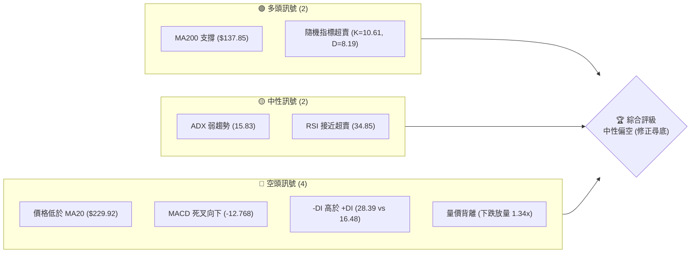
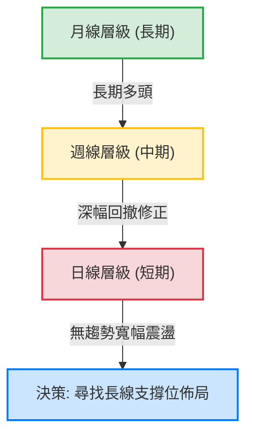
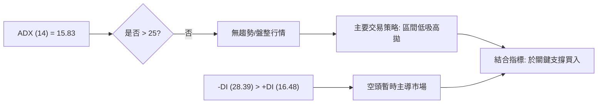
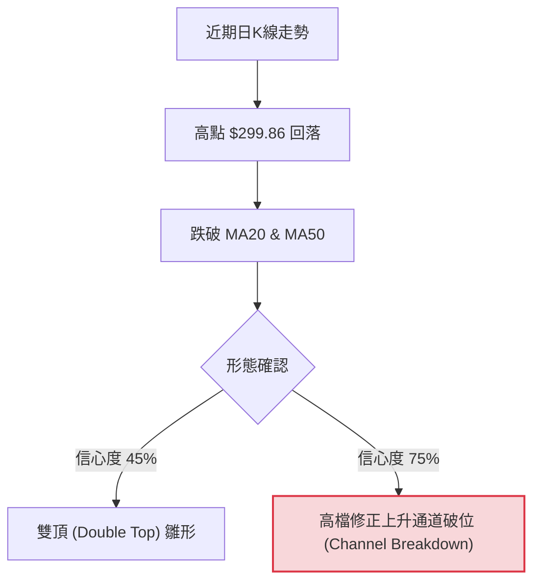
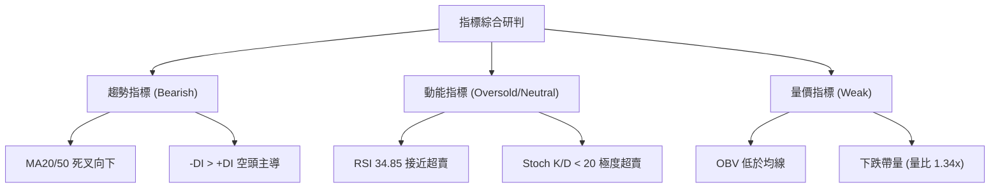
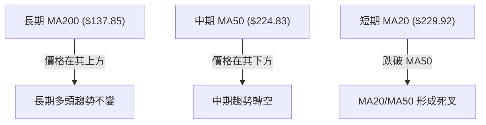
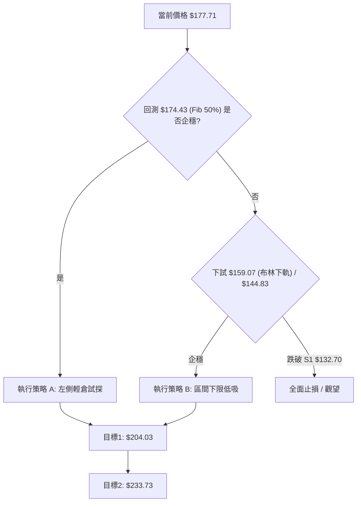
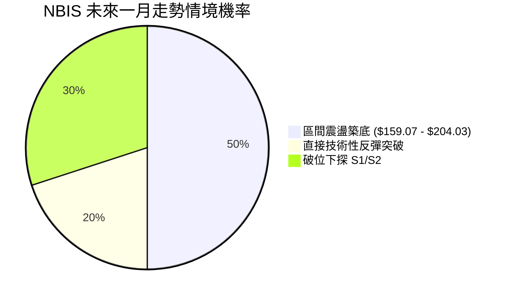
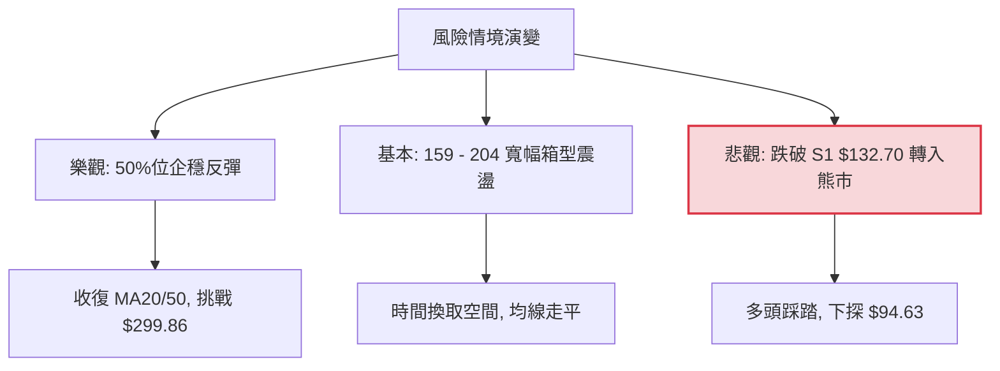

<details>
<summary>📊 靜態圖表 (點擊展開)</summary>

</details>

<html>
<head><meta charset="utf-8" /></head>
<body>
    <div style="height:500px; width:100%;">                        <script>window.PlotlyConfig = {MathJaxConfig: 'local'};</script>
        <script charset="utf-8" src="https://cdn.plot.ly/plotly-3.7.0.min.js" integrity="sha256-jvTGqxNp8AGWEcvNLVuKr+8j5dGe9Yw51LQkmDH+IYA=" crossorigin="anonymous"></script>                <div id="candlestick-chart" class="plotly-graph-div" style="height:100%; width:100%;"></div>            <script>                window.PLOTLYENV=window.PLOTLYENV || {};                                if (document.getElementById("candlestick-chart")) {                    Plotly.newPlot(                        "candlestick-chart",                        [{"close":{"dtype":"f8","bdata":"AAAAoEcRXEAAAABACudcQAAAACCud19AAAAAYLj+X0AAAAAAKTxfQAAAAMDMbF1AAAAAAACAXkAAAADgepRgQAAAAGCPMmBAAAAAYLjuYEAAAADAzARgQAAAAMAedV9AAAAAYI\u002fCXkAAAAAAKVxcQAAAAAAAQFtAAAAAgOsRWkAAAAAgrqdYQAAAAIA9ilpAAAAA4KNQXUAAAAAghVtfQAAAAMAedV5AAAAAYGZGX0AAAAAghQtfQAAAAIA9WmBAAAAAgBQeXkAAAABgj6JbQAAAAAAAQF1AAAAAAClcW0AAAACA69FbQAAAAMDMfFtAAAAAgBSOWUAAAABACpdXQAAAAOBRKFZAAAAAYI\u002fiVEAAAABguH5VQAAAAGCPolZAAAAA4HrEV0AAAADA9ShVQAAAAOCj0FRAAAAAoJn5VkAAAADgUThWQAAAAAAprFdAAAAAIK63V0AAAACgmQlZQAAAAMDMHFhAAAAAQOG6WEAAAABAM7NZQAAAAGCPglhAAAAAwB4VWUAAAACAPRpYQAAAAIDCZVdAAAAAgOuRV0AAAAAAKexVQAAAAMD1SFRAAAAAwMw8VEAAAADAzNxSQAAAAIDChVNAAAAAoHBdVkAAAABguE5XQAAAAIDrgVZAAAAA4FHIVkAAAACAwuVVQAAAAGCPglVAAAAAQOFKVUAAAADAHu1UQAAAAMDMfFZAAAAAwB41V0AAAAAgXA9ZQAAAAKBwDVhAAAAAQDNTWEAAAAAghXtYQAAAAMAe1VpAAAAAIIVbWkAAAABguH5ZQAAAAOCj+FlAAAAAYLguW0AAAABgj9JYQAAAACCut1hAAAAAYGY2WEAAAAAAAKBXQAAAAKBw3VZAAAAAIK53WEAAAAAghRtZQAAAAIA9uldAAAAAAClMVUAAAACAPQpWQAAAAMDMfFZAAAAAwPWYVEAAAAAgrndSQAAAAGBmhlVAAAAA4FE4V0AAAABgj\u002fJWQAAAAEAKJ1ZAAAAAYLhuVkAAAADgo4BYQAAAAKBHYVhAAAAAQDNzWUAAAABACudaQAAAAEDhelhAAAAAQAonWUAAAADAHqVZQAAAACCuh1pAAAAA4FE4WkAAAAAAKcxWQAAAAOCjwFZAAAAAQDOzVUAAAACA63FYQAAAAKCZ6VdAAAAAwB5VVkAAAAAAKbxXQAAAACCFG1hAAAAAIK7\u002fW0AAAABgjwJbQAAAAMDMPFxAAAAAQDM7YEAAAADAHhVdQAAAAADXo11AAAAAoEdhXkAAAAAgrmddQAAAAKCZiVxAAAAAgD26XEAAAACAwsVcQAAAAIAUflpAAAAA4Ho0WUAAAADgoxBXQAAAAOCj8FlAAAAAwMx8WUAAAADgejRbQAAAAGCPIlxAAAAAoJlZXUAAAAAAAEBfQAAAAGCPCmFAAAAAQAofYkAAAACA61FjQAAAAIAUPmRAAAAA4KPYZEAAAABA4apkQAAAAOB6pGNAAAAAwB7lY0AAAACgmZFjQAAAAOB6hGNAAAAAYI+iY0AAAADAHmViQAAAAGC4HmJAAAAA4FHwYEAAAACAFKZhQAAAACBcR2FAAAAAIK5PY0AAAACgcA1mQAAAAKBw\u002fWVAAAAAQOFiaEAAAADgoxhnQAAAAKCZIWZAAAAAQDNDZ0AAAAAghWNmQAAAAOCj6GlAAAAAwMyka0AAAACAFH5rQAAAACCF+2hAAAAAIFy3aEAAAACAPfpnQAAAAIDCfWtAAAAA4KPYakAAAACA6wFqQAAAAADXC2pAAAAAQOFKbEAAAABA4eJsQAAAAAApiHBAAAAAoEdJcEAAAACAwnVvQAAAAGC4OnBAAAAAgOt5bEAAAAAAAEBrQAAAAADXg2tAAAAAgBR2akAAAAAgrsdrQAAAACCFC21AAAAAwB5BcEAAAACgmZFwQAAAAGCPjnFAAAAAQArrcUAAAACAwrlxQAAAAAAANHFAAAAAYI86cEAAAACAFApwQAAAAKCZCW5AAAAAYGZScEAAAABguEJxQAAAAIDCpWxAAAAAANfzakAAAADgo6BqQAAAAIAUZmhAAAAAIFwPa0AAAABgZgZrQAAAAMDMdGtAAAAA4FFQakAAAABA4UJoQAAAAOBR8GhAAAAA4KN4ZUAAAABguDZmQA=="},"high":{"dtype":"f8","bdata":"AAAAoJlpXUAAAADgUfhcQAAAACBcr19AAAAAAFSfYEAAAADgUfhgQAAAAMD1CGBAAAAAANdTX0AAAACAPapgQAAAAEAzo2FAAAAAwPVQYUAAAACAFrlgQAAAACCuf2BAAAAAQApfYEAAAAAArCReQAAAAIAUXl1AAAAAIIULW0AAAABAM\u002fNaQAAAACCup1pAAAAAwMxcXUAAAAAAAKBfQAAAAMD1IGBAAAAAwMx8X0AAAACAFA5gQAAAAMDMhGBAAAAAgMLdYEAAAACA6zFdQAAAAKBwjV1AAAAAAABAXkAAAABAM9NbQAAAACCul11AAAAAANejXEAAAACgmWlaQAAAAGC43lZAAAAAAABAVkAAAACgmWlWQAAAAAApbFdAAAAAgBQuWEAAAAAAKaxZQAAAACBcL1ZAAAAAAABAV0AAAACA69FWQAAAAICT6FdAAAAAwB5FWEAAAABgZmZZQAAAAMDMvFlAAAAAANfDWEAAAACAwvVZQAAAAGBmVllAAAAAAAAgWUAAAAAggzhZQAAAAIDCRVhAAAAAwMzcV0AAAACgmelXQAAAACBcD1ZAAAAAANdjVEAAAABAMxNVQAAAAGBmFlRAAAAAYI+iVkAAAACgmflXQAAAAIAUPldAAAAAQOHaVkAAAAAgrudWQAAAAEAKJ1ZAAAAAoHC9VUAAAACAFJ5VQAAAAOCjsFZAAAAAACncV0AAAAAghStZQAAAAGBmlllAAAAAYI+iWUAAAACAFD5aQAAAACCFK1tAAAAAwMz8WkAAAADAzKxaQAAAAOBRCFtAAAAAAACgW0AAAACAFB5aQAAAAKCZmVlAAAAAYLj+WUAAAADgo7hYQAAAAOBROFlAAAAAYI\u002fiWEAAAABgZnZZQAAAAAAA0FhAAAAAYI8CV0AAAAAAAFBWQAAAAMD12FZAAAAAYI\u002fqVUAAAADgejRUQAAAAIA9qlVAAAAAIIVrV0AAAAAAVONXQAAAAAAAsFdAAAAA4KOwVkAAAADgehRZQAAAAGCP0lhAAAAAoJkZWkAAAABguP5aQAAAAOB6FFtAAAAAoG5KWUAAAAAAAPBZQAAAAAAp3FpAAAAA4HoUW0AAAABAM9NYQAAAAKDE2FZAAAAAIK53VkAAAABguJ5YQAAAAAAA0FhAAAAAwMy8V0AAAADAzMxXQAAAAKCZmVhAAAAAwB6FXEAAAABgj8JbQAAAAOB6JF1AAAAAoJmJYEAAAAAAAGBeQAAAAECJsV5AAAAAQDNzXkAAAAAAVu5eQAAAAADXU15AAAAAQDNzXUAAAABAM7NdQAAAAEAzU1xAAAAA4KOQWkAAAAAgXI9ZQAAAAMD1+FlAAAAAIK73WkAAAACgcD1bQAAAAIDCdVxAAAAAoJl5XUAAAAAAAPBfQAAAAKCZEWFAAAAAgD26YkAAAAAAAPBjQAAAAEAzw2RAAAAAgOvZZEAAAABguBZlQAAAAIDrgWRAAAAAAAA4ZEAAAAAAAGhkQAAAAIDC7WRAAAAAgOu5ZEAAAAAAAKhkQAAAAKCZmWJAAAAAYLiuYUAAAABgZvZhQAAAACBcX2JAAAAAAACAY0AAAADAzGxmQAAAAGC4fmZAAAAAIK5\u002faEAAAADgerxoQAAAAAAAiGdAAAAAgJeOaEAAAAAghTNnQAAAAEDhKmtAAAAAIFw3bUAAAACgR5lsQAAAAIA9QmtAAAAAgOtZaUAAAAAAAIhpQAAAAIDrWWxAAAAAoHC9a0AAAADgUaBrQAAAAOB6NGpAAAAA4HocbUAAAABAMzNtQAAAAKDELHFAAAAAoHBtcUAAAAAgXLdwQAAAACCFh3BAAAAAAABYb0AAAADAzAxuQAAAAMD1tG1AAAAAIK7fbEAAAAAgro9sQAAAAEDhcm5AAAAA4FFucEAAAAAghVVxQAAAAEDhnnJAAAAAwMysckAAAACAwr1yQAAAACCuc3JAAAAAoG5CcUAAAADgUThxQAAAAKCZGW9AAAAAwMx8cEAAAACgmSlyQAAAACCuz25AAAAA4FGobUAAAABACh9sQAAAAOCj8GlAAAAAIK5Pa0AAAADA969sQAAAACBcD2xAAAAAAABga0AAAAAAANhrQAAAAAAAaGlAAAAAQDMjaEAAAADgo1hnQA=="},"hovertemplate":"\u003cb\u003e%{x|%Y-%m-%d}\u003c\u002fb\u003e\u003cbr\u003e\u958b: $%{open:.2f}\u003cbr\u003e\u9ad8: $%{high:.2f}\u003cbr\u003e\u4f4e: $%{low:.2f}\u003cbr\u003e\u6536: $%{close:.2f}\u003cextra\u003e\u003c\u002fextra\u003e","low":{"dtype":"f8","bdata":"AAAAgD3qW0AAAADgo3BbQAAAAOB6pF1AAAAAYGbmXkAAAAAghTtfQAAAAIAU7lxAAAAAAABgXUAAAAAgrvddQAAAAOBRAGBAAAAAwMyUYEAAAAAAAHBfQAAAAMDMjF5AAAAAoEeBXkAAAADgUbhbQAAAAOCj4FpAAAAAoJlZWUAAAADgUahXQAAAAKBw3VhAAAAA4KOAW0AAAABACgdeQAAAAIDrMV5AAAAAAABgXUAAAADgo3BdQAAAAEAzk19AAAAAAADwXUAAAAAAAEBbQAAAACCF21tAAAAAgD0aW0AAAADgo1BZQAAAAIAULltAAAAAwB71WEAAAACgcO1WQAAAAAAAIFVAAAAAAACAVEAAAACAwuVUQAAAAKBwbVRAAAAAQDPzVkAAAACgcA1VQAAAAKBwjVNAAAAAoJlJVUAAAADgJC5VQAAAAOCjsFZAAAAAAClcV0AAAADgo0BWQAAAAADXA1hAAAAAAADAVkAAAACAFF5YQAAAAMDMDFhAAAAAQDPTV0AAAABgZgZYQAAAAMDMDFdAAAAAwMysVUAAAADAzIxVQAAAAKAYBFRAAAAA4FE4U0AAAAAAANBSQAAAAOCjQFNAAAAAgD0KVEAAAABgZsZWQAAAAADXE1ZAAAAAoJkpVkAAAAAgXK9VQAAAAGCPElVAAAAAANcjVUAAAACgmblUQAAAAOCjgFVAAAAAwPW4VkAAAAAAKbxWQAAAAADX41dAAAAAIFgBWEAAAABgZkZYQAAAAEAzI1hAAAAAQOH6WUAAAAAgg9hYQAAAAGBmRllAAAAAoHAtWUAAAACAwpVYQAAAAGBmRldAAAAAAAAgWEAAAACA62FXQAAAAEAK11ZAAAAAgOthV0AAAAAAKRxYQAAAAIA9ylZAAAAAIK4HVUAAAACAFA5VQAAAAAAAMFVAAAAAACmcU0AAAACgR2FSQAAAACCuR1NAAAAAANfzVEAAAACAPepWQAAAAMD1yFVAAAAAACnsU0AAAABACjdWQAAAAAAAYFdAAAAAINk2WEAAAAAghRtZQAAAAIDrQVhAAAAAQDPTV0AAAABA329YQAAAAEAzs1lAAAAAAACAWUAAAACgmRlWQAAAAEAzs1VAAAAAgOvhVEAAAACgmYlWQAAAACCu51ZAAAAAQDMzVkAAAAAAAKBVQAAAAAAAwFdAAAAAIFwfWkAAAACgR6FaQAAAAMD1iFtAAAAAYBIbX0AAAABACkdcQAAAAAAAgFxAAAAAoEexXEAAAACAkyhcQAAAAEAzY1xAAAAA4KMAXEAAAADAHlVcQAAAAIA9WlpAAAAAoEcRWUAAAADAymlWQAAAAGC47ldAAAAAYGZWWUAAAAAAKQxYQAAAAMDM3FpAAAAAgOuRW0AAAABgZtZdQAAAAEAzI19AAAAA4FHcYEAAAACgmclhQAAAAOCj0GNAAAAAAACQY0AAAABA4QJkQAAAACBcV2NAAAAAoEdBY0AAAADAzGxjQAAAAEAza2NAAAAAgD1CY0AAAACA6zliQAAAAIDrUWFAAAAAYGaWYEAAAABACsdgQAAAAAAA4GBAAAAAAACAYUAAAABgZvZjQAAAAGC4FmVAAAAAIIXjZUAAAAAAACBmQAAAAAAAEGZAAAAAoJlRZkAAAAAAAIhlQAAAAAAAYGhAAAAAAAD4aUAAAACgmXlqQAAAAGCPwmdAAAAAAADgZkAAAADgetRnQAAAAKCZGWpAAAAAIFxXakAAAADAHrVpQAAAAIDryWhAAAAA4FFga0AAAADAzExqQAAAAAAAwG1AAAAAAAA8cEAAAADgUfBuQAAAAIAUVm1AAAAAgBQWa0AAAABgZjZrQAAAAKCZCWlAAAAAANdrakAAAAAAAKBpQAAAAAAA8GtAAAAAIK6nbkAAAADAzKxvQAAAAOCjhHBAAAAAQDM5cUAAAAAAAGBxQAAAAAAAYG9AAAAAYLgmb0AAAACA65FvQAAAAMDMTG1AAAAAAABQbUAAAACgmflvQAAAAKBwhWxAAAAAYJHpaUAAAABguMZpQAAAAIDCNWhAAAAAoHAVaEAAAADgUXBqQAAAAIAU7mlAAAAAYGaWaUAAAAAAACBoQAAAACCuZ2dAAAAAYGQnZUAAAACA64lkQA=="},"name":"\u50f9\u683c","open":{"dtype":"f8","bdata":"AAAA4HpcXEAAAACAwu1bQAAAAKBH8V5AAAAAQArPX0AAAADAzIxgQAAAAMDM9F9AAAAAwMxMXkAAAABguD5eQAAAAGBm3mBAAAAAYLjmYEAAAAAAAIBgQAAAAMDMfGBAAAAAQOECYEAAAAAA14NdQAAAAGCPMl1AAAAA4FH4WkAAAABAM6taQAAAAMAeFVlAAAAAgD3KW0AAAACAPTpeQAAAAADXm19AAAAAgOsRX0AAAADAzExeQAAAAMD1qF9AAAAAAADAYEAAAABguBZcQAAAAMD1aFxAAAAAQDPjXUAAAAAAACBaQAAAACCFy1xAAAAA4FGIXEAAAADAzAxaQAAAAMD1uFZAAAAAQAqXVEAAAADgevRUQAAAAIDr8VRAAAAA4FFAV0AAAAAghdtYQAAAAEAzY1VAAAAAYLiOVUAAAABgj1JWQAAAAGBmdldAAAAAQDMjWEAAAADAzNxWQAAAAEAKF1lAAAAAoEfBV0AAAADgesRYQAAAAIDCFVlAAAAAYI9SWEAAAACAwoVYQAAAAGC47ldAAAAAwMxMVkAAAAAA11NXQAAAAGBmBlZAAAAAwMzkU0AAAACAwgVVQAAAAEAzw1NAAAAAoJkpVEAAAACAFD5XQAAAAADXk1ZAAAAAYLiOVkAAAADgo+BWQAAAAMDMHFVAAAAAAACYVUAAAAAgrldVQAAAAEAKv1VAAAAAAADAV0AAAACAwu1XQAAAAOCjwFhAAAAAYI8yWEAAAACgR7lYQAAAAOB6lFhAAAAAwB7VWkAAAACA63FaQAAAACCFI1pAAAAAIK5\u002fWkAAAADAHnVZQAAAAIDCRVlAAAAA4KOAWUAAAADAzCxYQAAAAKBwbVhAAAAAYGaWV0AAAAAAAABZQAAAAEAKl1hAAAAAoEPjVkAAAAAA13NVQAAAACCFe1ZAAAAAAADAVUAAAADA9chTQAAAAGBmzlNAAAAAwMwcVUAAAABgjzpXQAAAAGCPOldAAAAAYGYGVUAAAABACndWQAAAAAAAAFhAAAAAYLjuWEAAAAAghRtZQAAAAADTpVpAAAAAIIUTWEAAAAAgXNdYQAAAACBcP1pAAAAAAACAWkAAAADAzKxYQAAAAAAAAFZAAAAAoJmJVUAAAACgmZlWQAAAAAAAMFhAAAAAQDMTV0AAAABACtdVQAAAAMD1yFdAAAAAgD1KWkAAAACAwkVbQAAAAAApnFtAAAAAAAAwX0AAAACAwhVeQAAAAEAzs1xAAAAA4FHQXEAAAABgZh5eQAAAAKBwLV1AAAAAQDMLXUAAAAAgrjddQAAAAOBRUFxAAAAAwB51WkAAAAAgXI9ZQAAAAGC4flhAAAAA4Hp8WkAAAACAPRpYQAAAAIA9KltAAAAAAACoW0AAAADgUbhfQAAAAAAAQF9AAAAA4FHcYEAAAABgZtZhQAAAAEAzI2RAAAAAYDsHZEAAAAAAAOBkQAAAAMD1eGRAAAAAAACgY0AAAABACidkQAAAACCFW2RAAAAAwMx8Y0AAAACgcHVkQAAAAOB6jGJAAAAAwMxMYUAAAABACoNhQAAAAIDrJWJAAAAAYI+qYUAAAADgUQxkQAAAAMDMdGVAAAAAQApzZkAAAADgUcBnQAAAAGBm9mZAAAAAwMx8ZkAAAACgcI1mQAAAAEAKe2lAAAAAAACsakAAAAAghTNrQAAAAEAKL2tAAAAAAADgZ0AAAABACn9pQAAAACCud2pAAAAA4FFoa0AAAACgmZVrQAAAAMAe+WlAAAAAACnMbEAAAAAghXtsQAAAAEDhgm5AAAAAoJkBcUAAAACgcENwQAAAACCu921AAAAAIIXbbkAAAADAzAxuQAAAAAAAwGxAAAAAoMbvakAAAADgeqxpQAAAAMDMVG1AAAAAYLh+b0AAAABACu9vQAAAAGBmmnBAAAAAQDOjckAAAAAgXB9yQAAAAAAAHHBAAAAAoJkxcUAAAADAHglxQAAAAEAzm25AAAAAAAAsb0AAAAAAKSRwQAAAAKDECG5AAAAAAAAgbUAAAAAAAAhrQAAAAIA9SmlAAAAAoHAVaEAAAABg46VsQAAAACAGoWpAAAAAgBSWakAAAACgRyFrQAAAAKBwrWhAAAAAwB7NZ0AAAABgZqJkQA=="},"x":["2025-09-30T00:00:00-04:00","2025-10-01T00:00:00-04:00","2025-10-02T00:00:00-04:00","2025-10-03T00:00:00-04:00","2025-10-06T00:00:00-04:00","2025-10-07T00:00:00-04:00","2025-10-08T00:00:00-04:00","2025-10-09T00:00:00-04:00","2025-10-10T00:00:00-04:00","2025-10-13T00:00:00-04:00","2025-10-14T00:00:00-04:00","2025-10-15T00:00:00-04:00","2025-10-16T00:00:00-04:00","2025-10-17T00:00:00-04:00","2025-10-20T00:00:00-04:00","2025-10-21T00:00:00-04:00","2025-10-22T00:00:00-04:00","2025-10-23T00:00:00-04:00","2025-10-24T00:00:00-04:00","2025-10-27T00:00:00-04:00","2025-10-28T00:00:00-04:00","2025-10-29T00:00:00-04:00","2025-10-30T00:00:00-04:00","2025-10-31T00:00:00-04:00","2025-11-03T00:00:00-05:00","2025-11-04T00:00:00-05:00","2025-11-05T00:00:00-05:00","2025-11-06T00:00:00-05:00","2025-11-07T00:00:00-05:00","2025-11-10T00:00:00-05:00","2025-11-11T00:00:00-05:00","2025-11-12T00:00:00-05:00","2025-11-13T00:00:00-05:00","2025-11-14T00:00:00-05:00","2025-11-17T00:00:00-05:00","2025-11-18T00:00:00-05:00","2025-11-19T00:00:00-05:00","2025-11-20T00:00:00-05:00","2025-11-21T00:00:00-05:00","2025-11-24T00:00:00-05:00","2025-11-25T00:00:00-05:00","2025-11-26T00:00:00-05:00","2025-11-28T00:00:00-05:00","2025-12-01T00:00:00-05:00","2025-12-02T00:00:00-05:00","2025-12-03T00:00:00-05:00","2025-12-04T00:00:00-05:00","2025-12-05T00:00:00-05:00","2025-12-08T00:00:00-05:00","2025-12-09T00:00:00-05:00","2025-12-10T00:00:00-05:00","2025-12-11T00:00:00-05:00","2025-12-12T00:00:00-05:00","2025-12-15T00:00:00-05:00","2025-12-16T00:00:00-05:00","2025-12-17T00:00:00-05:00","2025-12-18T00:00:00-05:00","2025-12-19T00:00:00-05:00","2025-12-22T00:00:00-05:00","2025-12-23T00:00:00-05:00","2025-12-24T00:00:00-05:00","2025-12-26T00:00:00-05:00","2025-12-29T00:00:00-05:00","2025-12-30T00:00:00-05:00","2025-12-31T00:00:00-05:00","2026-01-02T00:00:00-05:00","2026-01-05T00:00:00-05:00","2026-01-06T00:00:00-05:00","2026-01-07T00:00:00-05:00","2026-01-08T00:00:00-05:00","2026-01-09T00:00:00-05:00","2026-01-12T00:00:00-05:00","2026-01-13T00:00:00-05:00","2026-01-14T00:00:00-05:00","2026-01-15T00:00:00-05:00","2026-01-16T00:00:00-05:00","2026-01-20T00:00:00-05:00","2026-01-21T00:00:00-05:00","2026-01-22T00:00:00-05:00","2026-01-23T00:00:00-05:00","2026-01-26T00:00:00-05:00","2026-01-27T00:00:00-05:00","2026-01-28T00:00:00-05:00","2026-01-29T00:00:00-05:00","2026-01-30T00:00:00-05:00","2026-02-02T00:00:00-05:00","2026-02-03T00:00:00-05:00","2026-02-04T00:00:00-05:00","2026-02-05T00:00:00-05:00","2026-02-06T00:00:00-05:00","2026-02-09T00:00:00-05:00","2026-02-10T00:00:00-05:00","2026-02-11T00:00:00-05:00","2026-02-12T00:00:00-05:00","2026-02-13T00:00:00-05:00","2026-02-17T00:00:00-05:00","2026-02-18T00:00:00-05:00","2026-02-19T00:00:00-05:00","2026-02-20T00:00:00-05:00","2026-02-23T00:00:00-05:00","2026-02-24T00:00:00-05:00","2026-02-25T00:00:00-05:00","2026-02-26T00:00:00-05:00","2026-02-27T00:00:00-05:00","2026-03-02T00:00:00-05:00","2026-03-03T00:00:00-05:00","2026-03-04T00:00:00-05:00","2026-03-05T00:00:00-05:00","2026-03-06T00:00:00-05:00","2026-03-09T00:00:00-04:00","2026-03-10T00:00:00-04:00","2026-03-11T00:00:00-04:00","2026-03-12T00:00:00-04:00","2026-03-13T00:00:00-04:00","2026-03-16T00:00:00-04:00","2026-03-17T00:00:00-04:00","2026-03-18T00:00:00-04:00","2026-03-19T00:00:00-04:00","2026-03-20T00:00:00-04:00","2026-03-23T00:00:00-04:00","2026-03-24T00:00:00-04:00","2026-03-25T00:00:00-04:00","2026-03-26T00:00:00-04:00","2026-03-27T00:00:00-04:00","2026-03-30T00:00:00-04:00","2026-03-31T00:00:00-04:00","2026-04-01T00:00:00-04:00","2026-04-02T00:00:00-04:00","2026-04-06T00:00:00-04:00","2026-04-07T00:00:00-04:00","2026-04-08T00:00:00-04:00","2026-04-09T00:00:00-04:00","2026-04-10T00:00:00-04:00","2026-04-13T00:00:00-04:00","2026-04-14T00:00:00-04:00","2026-04-15T00:00:00-04:00","2026-04-16T00:00:00-04:00","2026-04-17T00:00:00-04:00","2026-04-20T00:00:00-04:00","2026-04-21T00:00:00-04:00","2026-04-22T00:00:00-04:00","2026-04-23T00:00:00-04:00","2026-04-24T00:00:00-04:00","2026-04-27T00:00:00-04:00","2026-04-28T00:00:00-04:00","2026-04-29T00:00:00-04:00","2026-04-30T00:00:00-04:00","2026-05-01T00:00:00-04:00","2026-05-04T00:00:00-04:00","2026-05-05T00:00:00-04:00","2026-05-06T00:00:00-04:00","2026-05-07T00:00:00-04:00","2026-05-08T00:00:00-04:00","2026-05-11T00:00:00-04:00","2026-05-12T00:00:00-04:00","2026-05-13T00:00:00-04:00","2026-05-14T00:00:00-04:00","2026-05-15T00:00:00-04:00","2026-05-18T00:00:00-04:00","2026-05-19T00:00:00-04:00","2026-05-20T00:00:00-04:00","2026-05-21T00:00:00-04:00","2026-05-22T00:00:00-04:00","2026-05-26T00:00:00-04:00","2026-05-27T00:00:00-04:00","2026-05-28T00:00:00-04:00","2026-05-29T00:00:00-04:00","2026-06-01T00:00:00-04:00","2026-06-02T00:00:00-04:00","2026-06-03T00:00:00-04:00","2026-06-04T00:00:00-04:00","2026-06-05T00:00:00-04:00","2026-06-08T00:00:00-04:00","2026-06-09T00:00:00-04:00","2026-06-10T00:00:00-04:00","2026-06-11T00:00:00-04:00","2026-06-12T00:00:00-04:00","2026-06-15T00:00:00-04:00","2026-06-16T00:00:00-04:00","2026-06-17T00:00:00-04:00","2026-06-18T00:00:00-04:00","2026-06-22T00:00:00-04:00","2026-06-23T00:00:00-04:00","2026-06-24T00:00:00-04:00","2026-06-25T00:00:00-04:00","2026-06-26T00:00:00-04:00","2026-06-29T00:00:00-04:00","2026-06-30T00:00:00-04:00","2026-07-01T00:00:00-04:00","2026-07-02T00:00:00-04:00","2026-07-06T00:00:00-04:00","2026-07-07T00:00:00-04:00","2026-07-08T00:00:00-04:00","2026-07-09T00:00:00-04:00","2026-07-10T00:00:00-04:00","2026-07-13T00:00:00-04:00","2026-07-14T00:00:00-04:00","2026-07-15T00:00:00-04:00","2026-07-16T00:00:00-04:00","2026-07-17T00:00:00-04:00"],"type":"candlestick"},{"hovertemplate":"MA30: $%{y:.2f}\u003cextra\u003e\u003c\u002fextra\u003e","line":{"color":"#2196F3","dash":"dash","width":2},"mode":"lines","name":"MA30","x":["2025-09-30T00:00:00-04:00","2025-10-01T00:00:00-04:00","2025-10-02T00:00:00-04:00","2025-10-03T00:00:00-04:00","2025-10-06T00:00:00-04:00","2025-10-07T00:00:00-04:00","2025-10-08T00:00:00-04:00","2025-10-09T00:00:00-04:00","2025-10-10T00:00:00-04:00","2025-10-13T00:00:00-04:00","2025-10-14T00:00:00-04:00","2025-10-15T00:00:00-04:00","2025-10-16T00:00:00-04:00","2025-10-17T00:00:00-04:00","2025-10-20T00:00:00-04:00","2025-10-21T00:00:00-04:00","2025-10-22T00:00:00-04:00","2025-10-23T00:00:00-04:00","2025-10-24T00:00:00-04:00","2025-10-27T00:00:00-04:00","2025-10-28T00:00:00-04:00","2025-10-29T00:00:00-04:00","2025-10-30T00:00:00-04:00","2025-10-31T00:00:00-04:00","2025-11-03T00:00:00-05:00","2025-11-04T00:00:00-05:00","2025-11-05T00:00:00-05:00","2025-11-06T00:00:00-05:00","2025-11-07T00:00:00-05:00","2025-11-10T00:00:00-05:00","2025-11-11T00:00:00-05:00","2025-11-12T00:00:00-05:00","2025-11-13T00:00:00-05:00","2025-11-14T00:00:00-05:00","2025-11-17T00:00:00-05:00","2025-11-18T00:00:00-05:00","2025-11-19T00:00:00-05:00","2025-11-20T00:00:00-05:00","2025-11-21T00:00:00-05:00","2025-11-24T00:00:00-05:00","2025-11-25T00:00:00-05:00","2025-11-26T00:00:00-05:00","2025-11-28T00:00:00-05:00","2025-12-01T00:00:00-05:00","2025-12-02T00:00:00-05:00","2025-12-03T00:00:00-05:00","2025-12-04T00:00:00-05:00","2025-12-05T00:00:00-05:00","2025-12-08T00:00:00-05:00","2025-12-09T00:00:00-05:00","2025-12-10T00:00:00-05:00","2025-12-11T00:00:00-05:00","2025-12-12T00:00:00-05:00","2025-12-15T00:00:00-05:00","2025-12-16T00:00:00-05:00","2025-12-17T00:00:00-05:00","2025-12-18T00:00:00-05:00","2025-12-19T00:00:00-05:00","2025-12-22T00:00:00-05:00","2025-12-23T00:00:00-05:00","2025-12-24T00:00:00-05:00","2025-12-26T00:00:00-05:00","2025-12-29T00:00:00-05:00","2025-12-30T00:00:00-05:00","2025-12-31T00:00:00-05:00","2026-01-02T00:00:00-05:00","2026-01-05T00:00:00-05:00","2026-01-06T00:00:00-05:00","2026-01-07T00:00:00-05:00","2026-01-08T00:00:00-05:00","2026-01-09T00:00:00-05:00","2026-01-12T00:00:00-05:00","2026-01-13T00:00:00-05:00","2026-01-14T00:00:00-05:00","2026-01-15T00:00:00-05:00","2026-01-16T00:00:00-05:00","2026-01-20T00:00:00-05:00","2026-01-21T00:00:00-05:00","2026-01-22T00:00:00-05:00","2026-01-23T00:00:00-05:00","2026-01-26T00:00:00-05:00","2026-01-27T00:00:00-05:00","2026-01-28T00:00:00-05:00","2026-01-29T00:00:00-05:00","2026-01-30T00:00:00-05:00","2026-02-02T00:00:00-05:00","2026-02-03T00:00:00-05:00","2026-02-04T00:00:00-05:00","2026-02-05T00:00:00-05:00","2026-02-06T00:00:00-05:00","2026-02-09T00:00:00-05:00","2026-02-10T00:00:00-05:00","2026-02-11T00:00:00-05:00","2026-02-12T00:00:00-05:00","2026-02-13T00:00:00-05:00","2026-02-17T00:00:00-05:00","2026-02-18T00:00:00-05:00","2026-02-19T00:00:00-05:00","2026-02-20T00:00:00-05:00","2026-02-23T00:00:00-05:00","2026-02-24T00:00:00-05:00","2026-02-25T00:00:00-05:00","2026-02-26T00:00:00-05:00","2026-02-27T00:00:00-05:00","2026-03-02T00:00:00-05:00","2026-03-03T00:00:00-05:00","2026-03-04T00:00:00-05:00","2026-03-05T00:00:00-05:00","2026-03-06T00:00:00-05:00","2026-03-09T00:00:00-04:00","2026-03-10T00:00:00-04:00","2026-03-11T00:00:00-04:00","2026-03-12T00:00:00-04:00","2026-03-13T00:00:00-04:00","2026-03-16T00:00:00-04:00","2026-03-17T00:00:00-04:00","2026-03-18T00:00:00-04:00","2026-03-19T00:00:00-04:00","2026-03-20T00:00:00-04:00","2026-03-23T00:00:00-04:00","2026-03-24T00:00:00-04:00","2026-03-25T00:00:00-04:00","2026-03-26T00:00:00-04:00","2026-03-27T00:00:00-04:00","2026-03-30T00:00:00-04:00","2026-03-31T00:00:00-04:00","2026-04-01T00:00:00-04:00","2026-04-02T00:00:00-04:00","2026-04-06T00:00:00-04:00","2026-04-07T00:00:00-04:00","2026-04-08T00:00:00-04:00","2026-04-09T00:00:00-04:00","2026-04-10T00:00:00-04:00","2026-04-13T00:00:00-04:00","2026-04-14T00:00:00-04:00","2026-04-15T00:00:00-04:00","2026-04-16T00:00:00-04:00","2026-04-17T00:00:00-04:00","2026-04-20T00:00:00-04:00","2026-04-21T00:00:00-04:00","2026-04-22T00:00:00-04:00","2026-04-23T00:00:00-04:00","2026-04-24T00:00:00-04:00","2026-04-27T00:00:00-04:00","2026-04-28T00:00:00-04:00","2026-04-29T00:00:00-04:00","2026-04-30T00:00:00-04:00","2026-05-01T00:00:00-04:00","2026-05-04T00:00:00-04:00","2026-05-05T00:00:00-04:00","2026-05-06T00:00:00-04:00","2026-05-07T00:00:00-04:00","2026-05-08T00:00:00-04:00","2026-05-11T00:00:00-04:00","2026-05-12T00:00:00-04:00","2026-05-13T00:00:00-04:00","2026-05-14T00:00:00-04:00","2026-05-15T00:00:00-04:00","2026-05-18T00:00:00-04:00","2026-05-19T00:00:00-04:00","2026-05-20T00:00:00-04:00","2026-05-21T00:00:00-04:00","2026-05-22T00:00:00-04:00","2026-05-26T00:00:00-04:00","2026-05-27T00:00:00-04:00","2026-05-28T00:00:00-04:00","2026-05-29T00:00:00-04:00","2026-06-01T00:00:00-04:00","2026-06-02T00:00:00-04:00","2026-06-03T00:00:00-04:00","2026-06-04T00:00:00-04:00","2026-06-05T00:00:00-04:00","2026-06-08T00:00:00-04:00","2026-06-09T00:00:00-04:00","2026-06-10T00:00:00-04:00","2026-06-11T00:00:00-04:00","2026-06-12T00:00:00-04:00","2026-06-15T00:00:00-04:00","2026-06-16T00:00:00-04:00","2026-06-17T00:00:00-04:00","2026-06-18T00:00:00-04:00","2026-06-22T00:00:00-04:00","2026-06-23T00:00:00-04:00","2026-06-24T00:00:00-04:00","2026-06-25T00:00:00-04:00","2026-06-26T00:00:00-04:00","2026-06-29T00:00:00-04:00","2026-06-30T00:00:00-04:00","2026-07-01T00:00:00-04:00","2026-07-02T00:00:00-04:00","2026-07-06T00:00:00-04:00","2026-07-07T00:00:00-04:00","2026-07-08T00:00:00-04:00","2026-07-09T00:00:00-04:00","2026-07-10T00:00:00-04:00","2026-07-13T00:00:00-04:00","2026-07-14T00:00:00-04:00","2026-07-15T00:00:00-04:00","2026-07-16T00:00:00-04:00","2026-07-17T00:00:00-04:00"],"y":{"dtype":"f8","bdata":"AAAAAAAA+H8AAAAAAAD4fwAAAAAAAPh\u002fAAAAAAAA+H8AAAAAAAD4fwAAAAAAAPh\u002fAAAAAAAA+H8AAAAAAAD4fwAAAAAAAPh\u002fAAAAAAAA+H8AAAAAAAD4fwAAAAAAAPh\u002fAAAAAAAA+H8AAAAAAAD4fwAAAAAAAPh\u002fAAAAAAAA+H8AAAAAAAD4fwAAAAAAAPh\u002fAAAAAAAA+H8AAAAAAAD4fwAAAAAAAPh\u002fAAAAAAAA+H8AAAAAAAD4fwAAAAAAAPh\u002fAAAAAAAA+H8AAAAAAAD4fwAAAAAAAPh\u002fAAAAAAAA+H8AAAAAAAD4fxEREdGFzF1A3t3dLRW3XUCJiIjYv4ldQGZmZtZNOl1AvLu7q3\u002fbXEARERFRYohcQGZmZlZxTlxAd3d39\u002f0UXEARERGRl65bQLy7u6vGS1tAmpmZGdnuWkAiIiJyEptaQKuqqtqjWFpAd3d3R4scWkCrqqoqMQBaQBERETFr5VlAq6qq6vvZWUARERHB5uJZQGZmZiaU0VlAzczMHHatWUAzMzNTjW9ZQERERIROM1lAAAAAsI7xWECJiIhItqNYQAAAAGC6OVhA7+7uLmvlV0DNzMxcj5pXQAAAAFCNR1dAERERke0cV0DNzMzca\u002fZWQDMzM+Psy1ZARERERES0VkARERHx0qVWQFVVVXVMoFZAd3d3p8ajVkAzMzMz7J5WQKuqqvqpnVZAREREpOKYVkAiIiJSKrpWQO\u002fu7r7K1VZA3t3d3U\u002fhVkAAAABgnvRWQAAAAICVD1dAq6qqqhwmV0B3d3cXBCpXQImIiJjgOVdAq6qqKs5OV0DNzMw8UUdXQHd3d4cWSVdAvLu7+6lBV0De3d3dlj1XQKuqqpoLOVdAmpmZObRAV0BmZmb24VtXQImIiDhCeVdARERE1E2CV0AAAAAwa51XQERERFS4tldAq6qqKqOnV0BmZmYGVn5XQImIiLjzdVdAREREdK95V0B3d3c3pYJXQHd3d8cgiFdAZmZmJtuRV0BmZmaWX7BXQBEREdGFwFdAIiIioqjTV0AzMzOjYeNXQGZmZoYH51dAmpmZORfuV0Dv7u6+AvhXQM3MzOxt9VdAzczMjEH0V0BVVVXFPN1XQN7d3U3FwVdAmpmZmfySV0AAAADww49XQDMzM2PliFdAd3d3d9p4V0BERETEynlXQM3MzAxlhFdA7+7uLoeiV0AiIiJCw7JXQAAAAIA\u002f2VdAERER0YU4WEBERERknnRYQERERESnsVhAZmZmdiEFWUC8u7vLdmJZQGZmZtZNnllAiYiIKE3NWUAAAAAQAv9ZQAAAAPAKJFpA3t3djbM7WkCamZlJby9aQJqZmSm\u002fPFpAREREFBE9WkBmZmbmpT9aQO\u002fu7l7WXlpAMzMz86eCWkAiIiJCfLJaQCIiIvLu8lpA7+7ubnVIW0BmZmbmpc9bQDMzMyP3ZlxAvLu7a5ERXUAAAAAwsqFdQM3MzOzfJF5Aq6qqati5XkARERGxRz1fQAAAAFCpvF9A3t3d3WsOYEBEREQ8JjhgQCIiIhpLWmBAAAAAqFRgYEAAAAAY2XpgQImIiFDUj2BAMzMzU\u002f+yYEDNzMykt\u002fFgQImIiPiaM2FAREREdCGJYUDe3d29dNNhQCIiIlJGH2JAq6qqcj16YkCamZlJ4dZiQDMzM2tKRWNA7+7u9m\u002fEY0AiIiIi9zpkQImIiFAbmGRAIiIiwsrtZEAzMzMTETVlQCIiInI9jmVAAAAAgLHYZUARERGRwhFmQM3MzAxJQ2ZAERERodOCZkAzMzPD9chmQO\u002fu7u58O2dAmpmZWaunZ0De3d0tJA1oQGZmZsaSe2hAd3d3xwTHaEAiIiLSlBJpQCIiIoLAYmlAq6qqugK0aUCJiIjIdgpqQM3MzIzebmpA3t3d7XzfakC8u7t7FD5rQBEREcERrmtAmpmZqcYPbEARERGRNHlsQGZmZrbz4WxA7+7ufmowbUAAAACgGoNtQERERARWpm1A7+7urgDRbUCamZk5+wxuQJqZmYlBLG5AMzMzs1Y\u002fbkBmZma281VuQLy7uwuQO25AzczM\u002fGI9bkAAAADAEUZuQBEREfEZUm5AvLu7SzdBbkBERETUvxluQN7d3X1q1G1AIiIicq91bUBVVVW1yCZtQA=="},"type":"scatter"},{"hovertemplate":"MA60: $%{y:.2f}\u003cextra\u003e\u003c\u002fextra\u003e","line":{"color":"#9C27B0","dash":"dash","width":2},"mode":"lines","name":"MA60","x":["2025-09-30T00:00:00-04:00","2025-10-01T00:00:00-04:00","2025-10-02T00:00:00-04:00","2025-10-03T00:00:00-04:00","2025-10-06T00:00:00-04:00","2025-10-07T00:00:00-04:00","2025-10-08T00:00:00-04:00","2025-10-09T00:00:00-04:00","2025-10-10T00:00:00-04:00","2025-10-13T00:00:00-04:00","2025-10-14T00:00:00-04:00","2025-10-15T00:00:00-04:00","2025-10-16T00:00:00-04:00","2025-10-17T00:00:00-04:00","2025-10-20T00:00:00-04:00","2025-10-21T00:00:00-04:00","2025-10-22T00:00:00-04:00","2025-10-23T00:00:00-04:00","2025-10-24T00:00:00-04:00","2025-10-27T00:00:00-04:00","2025-10-28T00:00:00-04:00","2025-10-29T00:00:00-04:00","2025-10-30T00:00:00-04:00","2025-10-31T00:00:00-04:00","2025-11-03T00:00:00-05:00","2025-11-04T00:00:00-05:00","2025-11-05T00:00:00-05:00","2025-11-06T00:00:00-05:00","2025-11-07T00:00:00-05:00","2025-11-10T00:00:00-05:00","2025-11-11T00:00:00-05:00","2025-11-12T00:00:00-05:00","2025-11-13T00:00:00-05:00","2025-11-14T00:00:00-05:00","2025-11-17T00:00:00-05:00","2025-11-18T00:00:00-05:00","2025-11-19T00:00:00-05:00","2025-11-20T00:00:00-05:00","2025-11-21T00:00:00-05:00","2025-11-24T00:00:00-05:00","2025-11-25T00:00:00-05:00","2025-11-26T00:00:00-05:00","2025-11-28T00:00:00-05:00","2025-12-01T00:00:00-05:00","2025-12-02T00:00:00-05:00","2025-12-03T00:00:00-05:00","2025-12-04T00:00:00-05:00","2025-12-05T00:00:00-05:00","2025-12-08T00:00:00-05:00","2025-12-09T00:00:00-05:00","2025-12-10T00:00:00-05:00","2025-12-11T00:00:00-05:00","2025-12-12T00:00:00-05:00","2025-12-15T00:00:00-05:00","2025-12-16T00:00:00-05:00","2025-12-17T00:00:00-05:00","2025-12-18T00:00:00-05:00","2025-12-19T00:00:00-05:00","2025-12-22T00:00:00-05:00","2025-12-23T00:00:00-05:00","2025-12-24T00:00:00-05:00","2025-12-26T00:00:00-05:00","2025-12-29T00:00:00-05:00","2025-12-30T00:00:00-05:00","2025-12-31T00:00:00-05:00","2026-01-02T00:00:00-05:00","2026-01-05T00:00:00-05:00","2026-01-06T00:00:00-05:00","2026-01-07T00:00:00-05:00","2026-01-08T00:00:00-05:00","2026-01-09T00:00:00-05:00","2026-01-12T00:00:00-05:00","2026-01-13T00:00:00-05:00","2026-01-14T00:00:00-05:00","2026-01-15T00:00:00-05:00","2026-01-16T00:00:00-05:00","2026-01-20T00:00:00-05:00","2026-01-21T00:00:00-05:00","2026-01-22T00:00:00-05:00","2026-01-23T00:00:00-05:00","2026-01-26T00:00:00-05:00","2026-01-27T00:00:00-05:00","2026-01-28T00:00:00-05:00","2026-01-29T00:00:00-05:00","2026-01-30T00:00:00-05:00","2026-02-02T00:00:00-05:00","2026-02-03T00:00:00-05:00","2026-02-04T00:00:00-05:00","2026-02-05T00:00:00-05:00","2026-02-06T00:00:00-05:00","2026-02-09T00:00:00-05:00","2026-02-10T00:00:00-05:00","2026-02-11T00:00:00-05:00","2026-02-12T00:00:00-05:00","2026-02-13T00:00:00-05:00","2026-02-17T00:00:00-05:00","2026-02-18T00:00:00-05:00","2026-02-19T00:00:00-05:00","2026-02-20T00:00:00-05:00","2026-02-23T00:00:00-05:00","2026-02-24T00:00:00-05:00","2026-02-25T00:00:00-05:00","2026-02-26T00:00:00-05:00","2026-02-27T00:00:00-05:00","2026-03-02T00:00:00-05:00","2026-03-03T00:00:00-05:00","2026-03-04T00:00:00-05:00","2026-03-05T00:00:00-05:00","2026-03-06T00:00:00-05:00","2026-03-09T00:00:00-04:00","2026-03-10T00:00:00-04:00","2026-03-11T00:00:00-04:00","2026-03-12T00:00:00-04:00","2026-03-13T00:00:00-04:00","2026-03-16T00:00:00-04:00","2026-03-17T00:00:00-04:00","2026-03-18T00:00:00-04:00","2026-03-19T00:00:00-04:00","2026-03-20T00:00:00-04:00","2026-03-23T00:00:00-04:00","2026-03-24T00:00:00-04:00","2026-03-25T00:00:00-04:00","2026-03-26T00:00:00-04:00","2026-03-27T00:00:00-04:00","2026-03-30T00:00:00-04:00","2026-03-31T00:00:00-04:00","2026-04-01T00:00:00-04:00","2026-04-02T00:00:00-04:00","2026-04-06T00:00:00-04:00","2026-04-07T00:00:00-04:00","2026-04-08T00:00:00-04:00","2026-04-09T00:00:00-04:00","2026-04-10T00:00:00-04:00","2026-04-13T00:00:00-04:00","2026-04-14T00:00:00-04:00","2026-04-15T00:00:00-04:00","2026-04-16T00:00:00-04:00","2026-04-17T00:00:00-04:00","2026-04-20T00:00:00-04:00","2026-04-21T00:00:00-04:00","2026-04-22T00:00:00-04:00","2026-04-23T00:00:00-04:00","2026-04-24T00:00:00-04:00","2026-04-27T00:00:00-04:00","2026-04-28T00:00:00-04:00","2026-04-29T00:00:00-04:00","2026-04-30T00:00:00-04:00","2026-05-01T00:00:00-04:00","2026-05-04T00:00:00-04:00","2026-05-05T00:00:00-04:00","2026-05-06T00:00:00-04:00","2026-05-07T00:00:00-04:00","2026-05-08T00:00:00-04:00","2026-05-11T00:00:00-04:00","2026-05-12T00:00:00-04:00","2026-05-13T00:00:00-04:00","2026-05-14T00:00:00-04:00","2026-05-15T00:00:00-04:00","2026-05-18T00:00:00-04:00","2026-05-19T00:00:00-04:00","2026-05-20T00:00:00-04:00","2026-05-21T00:00:00-04:00","2026-05-22T00:00:00-04:00","2026-05-26T00:00:00-04:00","2026-05-27T00:00:00-04:00","2026-05-28T00:00:00-04:00","2026-05-29T00:00:00-04:00","2026-06-01T00:00:00-04:00","2026-06-02T00:00:00-04:00","2026-06-03T00:00:00-04:00","2026-06-04T00:00:00-04:00","2026-06-05T00:00:00-04:00","2026-06-08T00:00:00-04:00","2026-06-09T00:00:00-04:00","2026-06-10T00:00:00-04:00","2026-06-11T00:00:00-04:00","2026-06-12T00:00:00-04:00","2026-06-15T00:00:00-04:00","2026-06-16T00:00:00-04:00","2026-06-17T00:00:00-04:00","2026-06-18T00:00:00-04:00","2026-06-22T00:00:00-04:00","2026-06-23T00:00:00-04:00","2026-06-24T00:00:00-04:00","2026-06-25T00:00:00-04:00","2026-06-26T00:00:00-04:00","2026-06-29T00:00:00-04:00","2026-06-30T00:00:00-04:00","2026-07-01T00:00:00-04:00","2026-07-02T00:00:00-04:00","2026-07-06T00:00:00-04:00","2026-07-07T00:00:00-04:00","2026-07-08T00:00:00-04:00","2026-07-09T00:00:00-04:00","2026-07-10T00:00:00-04:00","2026-07-13T00:00:00-04:00","2026-07-14T00:00:00-04:00","2026-07-15T00:00:00-04:00","2026-07-16T00:00:00-04:00","2026-07-17T00:00:00-04:00"],"y":{"dtype":"f8","bdata":"AAAAAAAA+H8AAAAAAAD4fwAAAAAAAPh\u002fAAAAAAAA+H8AAAAAAAD4fwAAAAAAAPh\u002fAAAAAAAA+H8AAAAAAAD4fwAAAAAAAPh\u002fAAAAAAAA+H8AAAAAAAD4fwAAAAAAAPh\u002fAAAAAAAA+H8AAAAAAAD4fwAAAAAAAPh\u002fAAAAAAAA+H8AAAAAAAD4fwAAAAAAAPh\u002fAAAAAAAA+H8AAAAAAAD4fwAAAAAAAPh\u002fAAAAAAAA+H8AAAAAAAD4fwAAAAAAAPh\u002fAAAAAAAA+H8AAAAAAAD4fwAAAAAAAPh\u002fAAAAAAAA+H8AAAAAAAD4fwAAAAAAAPh\u002fAAAAAAAA+H8AAAAAAAD4fwAAAAAAAPh\u002fAAAAAAAA+H8AAAAAAAD4fwAAAAAAAPh\u002fAAAAAAAA+H8AAAAAAAD4fwAAAAAAAPh\u002fAAAAAAAA+H8AAAAAAAD4fwAAAAAAAPh\u002fAAAAAAAA+H8AAAAAAAD4fwAAAAAAAPh\u002fAAAAAAAA+H8AAAAAAAD4fwAAAAAAAPh\u002fAAAAAAAA+H8AAAAAAAD4fwAAAAAAAPh\u002fAAAAAAAA+H8AAAAAAAD4fwAAAAAAAPh\u002fAAAAAAAA+H8AAAAAAAD4fwAAAAAAAPh\u002fAAAAAAAA+H8AAAAAAAD4fyIiIlo5TFpAERERuaw1WkDNzMxkyRdaQN7d3SVN7VlAmpmZKaO\u002fWUAiIiJCp5NZQImIiKgNdllA3t3dTfBWWUCamZnxYDRZQFVVVbXIEFlAvLu7exToWEARERFp2MdYQFVVVa0ctFhAERER+VOhWEARERGhGpVYQM3MzOSlj1hAq6qqCmWUWEDv7u7+G5VYQO\u002fu7lZVjVhAREREDJB3WECJiIgYklZYQHd3dw8tNlhAzczMdCEZWEB3d3cfzP9XQEREREx+2VdAmpmZgdyzV0BmZmZG\u002fZtXQCIiItIif1dA3t3dXUhiV0CamZnxYDpXQN7d3U3wIFdARERE3PkWV0BEREQUPBRXQGZmZp42FFdA7+7u5tAaV0DNzMzkpSdXQN7d3eUXL1dAMzMzo0U2V0Crqqr6xU5XQKuqqiJpXldAvLu7i7NnV0B3d3ePUHZXQGZmZraBgldAvLu7Gy+NV0BmZmZuoINXQDMzM\u002fPSfVdAIiIiYuVwV0BmZmaWimtXQFVVVfX9aFdAmpmZOUJdV0ARERHRsFtXQLy7u1O4XldAREREtJ1xV0BEREScUodXQERERNxAqVdAq6qq0mndV0AiIiLKBAlYQERERMwvNFhAiYiIUGJWWEARERFpZnBYQHd3d8cgilhAZmZmTn6jWEC8u7uj08BYQLy7u9sV1lhAIiIiWsfmWEAAAABw5+9YQFVVVX2i\u002flhAMzMz21wIWUDNzMzEgxFZQKuqqvLuIllAZmZmll84WUCJiIiAP1VZQHd3d28udFlA3t3dfVueWUDe3d1VcdZZQImIiDheFFpAq6qqAkdSWkAAAAAQu5haQAAAAKji1lpAERERcVkZW0Crqqo6iVtbQGZmZi6HoFtAVVVVda\u002ffW0BVVVXdhxFcQCIiItrqRlxAiYiIkJd8XEAiIiJKKLVcQKuqqvKn6FxAZmZmDpA1XUCrqqoK86JdQLy7u+PBAl5AiYiICMhvXkDe3d3F9dJeQCIiIspLMV9AmpmZOReYX0BmZmbumO5fQAAAAADVMWBAiYiIQHxxYECrqqoKZa1gQAAAAEDD42BA3t3dXY8XYUAiIiKaJ0dhQJqZmXXag2FAvLu7G3a+YUAiIiLCyvxhQDMzM09iO2JAd3d3K86FYkCamZlt58xiQKuqqnL2JmNAd3d3x0uCY0AzMzMD5NVjQDMzM7fzLGRAq6qqUrhqZEAzMzOHXaVkQCIiIs6F3mRAVVVVsSsKZUBERETwp0JlQKuqqm5Zf2VAiYiIID7JZUBEREQQ5hdmQM3MzFzWcGZA7+7uDnTMZkB3d3enVCZnQERERASdgGdAzczM+FPVZ0DNzMz0\u002fSxoQLy7uzfQdWhA7+7uUrjKaEDe3d0t+SNpQBEREW0uYmlAq6qqupCWaUDNzMxkgsVpQO\u002fu7r7m5GlAZmZmPgoLakCJiIgo6itqQO\u002fu7n6xSmpAZmZmdgViakC8u7vLWnFqQGZmZrbzh2pA3t3dZa2OakCamZlx9plqQA=="},"type":"scatter"},{"hovertemplate":"MA200: $%{y:.2f}\u003cextra\u003e\u003c\u002fextra\u003e","line":{"color":"#FF6F00","dash":"solid","width":2},"mode":"lines","name":"MA200","x":["2025-09-30T00:00:00-04:00","2025-10-01T00:00:00-04:00","2025-10-02T00:00:00-04:00","2025-10-03T00:00:00-04:00","2025-10-06T00:00:00-04:00","2025-10-07T00:00:00-04:00","2025-10-08T00:00:00-04:00","2025-10-09T00:00:00-04:00","2025-10-10T00:00:00-04:00","2025-10-13T00:00:00-04:00","2025-10-14T00:00:00-04:00","2025-10-15T00:00:00-04:00","2025-10-16T00:00:00-04:00","2025-10-17T00:00:00-04:00","2025-10-20T00:00:00-04:00","2025-10-21T00:00:00-04:00","2025-10-22T00:00:00-04:00","2025-10-23T00:00:00-04:00","2025-10-24T00:00:00-04:00","2025-10-27T00:00:00-04:00","2025-10-28T00:00:00-04:00","2025-10-29T00:00:00-04:00","2025-10-30T00:00:00-04:00","2025-10-31T00:00:00-04:00","2025-11-03T00:00:00-05:00","2025-11-04T00:00:00-05:00","2025-11-05T00:00:00-05:00","2025-11-06T00:00:00-05:00","2025-11-07T00:00:00-05:00","2025-11-10T00:00:00-05:00","2025-11-11T00:00:00-05:00","2025-11-12T00:00:00-05:00","2025-11-13T00:00:00-05:00","2025-11-14T00:00:00-05:00","2025-11-17T00:00:00-05:00","2025-11-18T00:00:00-05:00","2025-11-19T00:00:00-05:00","2025-11-20T00:00:00-05:00","2025-11-21T00:00:00-05:00","2025-11-24T00:00:00-05:00","2025-11-25T00:00:00-05:00","2025-11-26T00:00:00-05:00","2025-11-28T00:00:00-05:00","2025-12-01T00:00:00-05:00","2025-12-02T00:00:00-05:00","2025-12-03T00:00:00-05:00","2025-12-04T00:00:00-05:00","2025-12-05T00:00:00-05:00","2025-12-08T00:00:00-05:00","2025-12-09T00:00:00-05:00","2025-12-10T00:00:00-05:00","2025-12-11T00:00:00-05:00","2025-12-12T00:00:00-05:00","2025-12-15T00:00:00-05:00","2025-12-16T00:00:00-05:00","2025-12-17T00:00:00-05:00","2025-12-18T00:00:00-05:00","2025-12-19T00:00:00-05:00","2025-12-22T00:00:00-05:00","2025-12-23T00:00:00-05:00","2025-12-24T00:00:00-05:00","2025-12-26T00:00:00-05:00","2025-12-29T00:00:00-05:00","2025-12-30T00:00:00-05:00","2025-12-31T00:00:00-05:00","2026-01-02T00:00:00-05:00","2026-01-05T00:00:00-05:00","2026-01-06T00:00:00-05:00","2026-01-07T00:00:00-05:00","2026-01-08T00:00:00-05:00","2026-01-09T00:00:00-05:00","2026-01-12T00:00:00-05:00","2026-01-13T00:00:00-05:00","2026-01-14T00:00:00-05:00","2026-01-15T00:00:00-05:00","2026-01-16T00:00:00-05:00","2026-01-20T00:00:00-05:00","2026-01-21T00:00:00-05:00","2026-01-22T00:00:00-05:00","2026-01-23T00:00:00-05:00","2026-01-26T00:00:00-05:00","2026-01-27T00:00:00-05:00","2026-01-28T00:00:00-05:00","2026-01-29T00:00:00-05:00","2026-01-30T00:00:00-05:00","2026-02-02T00:00:00-05:00","2026-02-03T00:00:00-05:00","2026-02-04T00:00:00-05:00","2026-02-05T00:00:00-05:00","2026-02-06T00:00:00-05:00","2026-02-09T00:00:00-05:00","2026-02-10T00:00:00-05:00","2026-02-11T00:00:00-05:00","2026-02-12T00:00:00-05:00","2026-02-13T00:00:00-05:00","2026-02-17T00:00:00-05:00","2026-02-18T00:00:00-05:00","2026-02-19T00:00:00-05:00","2026-02-20T00:00:00-05:00","2026-02-23T00:00:00-05:00","2026-02-24T00:00:00-05:00","2026-02-25T00:00:00-05:00","2026-02-26T00:00:00-05:00","2026-02-27T00:00:00-05:00","2026-03-02T00:00:00-05:00","2026-03-03T00:00:00-05:00","2026-03-04T00:00:00-05:00","2026-03-05T00:00:00-05:00","2026-03-06T00:00:00-05:00","2026-03-09T00:00:00-04:00","2026-03-10T00:00:00-04:00","2026-03-11T00:00:00-04:00","2026-03-12T00:00:00-04:00","2026-03-13T00:00:00-04:00","2026-03-16T00:00:00-04:00","2026-03-17T00:00:00-04:00","2026-03-18T00:00:00-04:00","2026-03-19T00:00:00-04:00","2026-03-20T00:00:00-04:00","2026-03-23T00:00:00-04:00","2026-03-24T00:00:00-04:00","2026-03-25T00:00:00-04:00","2026-03-26T00:00:00-04:00","2026-03-27T00:00:00-04:00","2026-03-30T00:00:00-04:00","2026-03-31T00:00:00-04:00","2026-04-01T00:00:00-04:00","2026-04-02T00:00:00-04:00","2026-04-06T00:00:00-04:00","2026-04-07T00:00:00-04:00","2026-04-08T00:00:00-04:00","2026-04-09T00:00:00-04:00","2026-04-10T00:00:00-04:00","2026-04-13T00:00:00-04:00","2026-04-14T00:00:00-04:00","2026-04-15T00:00:00-04:00","2026-04-16T00:00:00-04:00","2026-04-17T00:00:00-04:00","2026-04-20T00:00:00-04:00","2026-04-21T00:00:00-04:00","2026-04-22T00:00:00-04:00","2026-04-23T00:00:00-04:00","2026-04-24T00:00:00-04:00","2026-04-27T00:00:00-04:00","2026-04-28T00:00:00-04:00","2026-04-29T00:00:00-04:00","2026-04-30T00:00:00-04:00","2026-05-01T00:00:00-04:00","2026-05-04T00:00:00-04:00","2026-05-05T00:00:00-04:00","2026-05-06T00:00:00-04:00","2026-05-07T00:00:00-04:00","2026-05-08T00:00:00-04:00","2026-05-11T00:00:00-04:00","2026-05-12T00:00:00-04:00","2026-05-13T00:00:00-04:00","2026-05-14T00:00:00-04:00","2026-05-15T00:00:00-04:00","2026-05-18T00:00:00-04:00","2026-05-19T00:00:00-04:00","2026-05-20T00:00:00-04:00","2026-05-21T00:00:00-04:00","2026-05-22T00:00:00-04:00","2026-05-26T00:00:00-04:00","2026-05-27T00:00:00-04:00","2026-05-28T00:00:00-04:00","2026-05-29T00:00:00-04:00","2026-06-01T00:00:00-04:00","2026-06-02T00:00:00-04:00","2026-06-03T00:00:00-04:00","2026-06-04T00:00:00-04:00","2026-06-05T00:00:00-04:00","2026-06-08T00:00:00-04:00","2026-06-09T00:00:00-04:00","2026-06-10T00:00:00-04:00","2026-06-11T00:00:00-04:00","2026-06-12T00:00:00-04:00","2026-06-15T00:00:00-04:00","2026-06-16T00:00:00-04:00","2026-06-17T00:00:00-04:00","2026-06-18T00:00:00-04:00","2026-06-22T00:00:00-04:00","2026-06-23T00:00:00-04:00","2026-06-24T00:00:00-04:00","2026-06-25T00:00:00-04:00","2026-06-26T00:00:00-04:00","2026-06-29T00:00:00-04:00","2026-06-30T00:00:00-04:00","2026-07-01T00:00:00-04:00","2026-07-02T00:00:00-04:00","2026-07-06T00:00:00-04:00","2026-07-07T00:00:00-04:00","2026-07-08T00:00:00-04:00","2026-07-09T00:00:00-04:00","2026-07-10T00:00:00-04:00","2026-07-13T00:00:00-04:00","2026-07-14T00:00:00-04:00","2026-07-15T00:00:00-04:00","2026-07-16T00:00:00-04:00","2026-07-17T00:00:00-04:00"],"y":{"dtype":"f8","bdata":"AAAAAAAA+H8AAAAAAAD4fwAAAAAAAPh\u002fAAAAAAAA+H8AAAAAAAD4fwAAAAAAAPh\u002fAAAAAAAA+H8AAAAAAAD4fwAAAAAAAPh\u002fAAAAAAAA+H8AAAAAAAD4fwAAAAAAAPh\u002fAAAAAAAA+H8AAAAAAAD4fwAAAAAAAPh\u002fAAAAAAAA+H8AAAAAAAD4fwAAAAAAAPh\u002fAAAAAAAA+H8AAAAAAAD4fwAAAAAAAPh\u002fAAAAAAAA+H8AAAAAAAD4fwAAAAAAAPh\u002fAAAAAAAA+H8AAAAAAAD4fwAAAAAAAPh\u002fAAAAAAAA+H8AAAAAAAD4fwAAAAAAAPh\u002fAAAAAAAA+H8AAAAAAAD4fwAAAAAAAPh\u002fAAAAAAAA+H8AAAAAAAD4fwAAAAAAAPh\u002fAAAAAAAA+H8AAAAAAAD4fwAAAAAAAPh\u002fAAAAAAAA+H8AAAAAAAD4fwAAAAAAAPh\u002fAAAAAAAA+H8AAAAAAAD4fwAAAAAAAPh\u002fAAAAAAAA+H8AAAAAAAD4fwAAAAAAAPh\u002fAAAAAAAA+H8AAAAAAAD4fwAAAAAAAPh\u002fAAAAAAAA+H8AAAAAAAD4fwAAAAAAAPh\u002fAAAAAAAA+H8AAAAAAAD4fwAAAAAAAPh\u002fAAAAAAAA+H8AAAAAAAD4fwAAAAAAAPh\u002fAAAAAAAA+H8AAAAAAAD4fwAAAAAAAPh\u002fAAAAAAAA+H8AAAAAAAD4fwAAAAAAAPh\u002fAAAAAAAA+H8AAAAAAAD4fwAAAAAAAPh\u002fAAAAAAAA+H8AAAAAAAD4fwAAAAAAAPh\u002fAAAAAAAA+H8AAAAAAAD4fwAAAAAAAPh\u002fAAAAAAAA+H8AAAAAAAD4fwAAAAAAAPh\u002fAAAAAAAA+H8AAAAAAAD4fwAAAAAAAPh\u002fAAAAAAAA+H8AAAAAAAD4fwAAAAAAAPh\u002fAAAAAAAA+H8AAAAAAAD4fwAAAAAAAPh\u002fAAAAAAAA+H8AAAAAAAD4fwAAAAAAAPh\u002fAAAAAAAA+H8AAAAAAAD4fwAAAAAAAPh\u002fAAAAAAAA+H8AAAAAAAD4fwAAAAAAAPh\u002fAAAAAAAA+H8AAAAAAAD4fwAAAAAAAPh\u002fAAAAAAAA+H8AAAAAAAD4fwAAAAAAAPh\u002fAAAAAAAA+H8AAAAAAAD4fwAAAAAAAPh\u002fAAAAAAAA+H8AAAAAAAD4fwAAAAAAAPh\u002fAAAAAAAA+H8AAAAAAAD4fwAAAAAAAPh\u002fAAAAAAAA+H8AAAAAAAD4fwAAAAAAAPh\u002fAAAAAAAA+H8AAAAAAAD4fwAAAAAAAPh\u002fAAAAAAAA+H8AAAAAAAD4fwAAAAAAAPh\u002fAAAAAAAA+H8AAAAAAAD4fwAAAAAAAPh\u002fAAAAAAAA+H8AAAAAAAD4fwAAAAAAAPh\u002fAAAAAAAA+H8AAAAAAAD4fwAAAAAAAPh\u002fAAAAAAAA+H8AAAAAAAD4fwAAAAAAAPh\u002fAAAAAAAA+H8AAAAAAAD4fwAAAAAAAPh\u002fAAAAAAAA+H8AAAAAAAD4fwAAAAAAAPh\u002fAAAAAAAA+H8AAAAAAAD4fwAAAAAAAPh\u002fAAAAAAAA+H8AAAAAAAD4fwAAAAAAAPh\u002fAAAAAAAA+H8AAAAAAAD4fwAAAAAAAPh\u002fAAAAAAAA+H8AAAAAAAD4fwAAAAAAAPh\u002fAAAAAAAA+H8AAAAAAAD4fwAAAAAAAPh\u002fAAAAAAAA+H8AAAAAAAD4fwAAAAAAAPh\u002fAAAAAAAA+H8AAAAAAAD4fwAAAAAAAPh\u002fAAAAAAAA+H8AAAAAAAD4fwAAAAAAAPh\u002fAAAAAAAA+H8AAAAAAAD4fwAAAAAAAPh\u002fAAAAAAAA+H8AAAAAAAD4fwAAAAAAAPh\u002fAAAAAAAA+H8AAAAAAAD4fwAAAAAAAPh\u002fAAAAAAAA+H8AAAAAAAD4fwAAAAAAAPh\u002fAAAAAAAA+H8AAAAAAAD4fwAAAAAAAPh\u002fAAAAAAAA+H8AAAAAAAD4fwAAAAAAAPh\u002fAAAAAAAA+H8AAAAAAAD4fwAAAAAAAPh\u002fAAAAAAAA+H8AAAAAAAD4fwAAAAAAAPh\u002fAAAAAAAA+H8AAAAAAAD4fwAAAAAAAPh\u002fAAAAAAAA+H8AAAAAAAD4fwAAAAAAAPh\u002fAAAAAAAA+H8AAAAAAAD4fwAAAAAAAPh\u002fAAAAAAAA+H8AAAAAAAD4fwAAAAAAAPh\u002fAAAAAAAA+H8K16OuWDthQA=="},"type":"scatter"}],                        {"template":{"data":{"barpolar":[{"marker":{"line":{"color":"rgb(17,17,17)","width":0.5},"pattern":{"fillmode":"overlay","size":10,"solidity":0.2}},"type":"barpolar"}],"bar":[{"error_x":{"color":"#f2f5fa"},"error_y":{"color":"#f2f5fa"},"marker":{"line":{"color":"rgb(17,17,17)","width":0.5},"pattern":{"fillmode":"overlay","size":10,"solidity":0.2}},"type":"bar"}],"carpet":[{"aaxis":{"endlinecolor":"#A2B1C6","gridcolor":"#506784","linecolor":"#506784","minorgridcolor":"#506784","startlinecolor":"#A2B1C6"},"baxis":{"endlinecolor":"#A2B1C6","gridcolor":"#506784","linecolor":"#506784","minorgridcolor":"#506784","startlinecolor":"#A2B1C6"},"type":"carpet"}],"choropleth":[{"colorbar":{"outlinewidth":0,"ticks":""},"type":"choropleth"}],"contourcarpet":[{"colorbar":{"outlinewidth":0,"ticks":""},"type":"contourcarpet"}],"contour":[{"colorbar":{"outlinewidth":0,"ticks":""},"colorscale":[[0.0,"#0d0887"],[0.1111111111111111,"#46039f"],[0.2222222222222222,"#7201a8"],[0.3333333333333333,"#9c179e"],[0.4444444444444444,"#bd3786"],[0.5555555555555556,"#d8576b"],[0.6666666666666666,"#ed7953"],[0.7777777777777778,"#fb9f3a"],[0.8888888888888888,"#fdca26"],[1.0,"#f0f921"]],"type":"contour"}],"heatmap":[{"colorbar":{"outlinewidth":0,"ticks":""},"colorscale":[[0.0,"#0d0887"],[0.1111111111111111,"#46039f"],[0.2222222222222222,"#7201a8"],[0.3333333333333333,"#9c179e"],[0.4444444444444444,"#bd3786"],[0.5555555555555556,"#d8576b"],[0.6666666666666666,"#ed7953"],[0.7777777777777778,"#fb9f3a"],[0.8888888888888888,"#fdca26"],[1.0,"#f0f921"]],"type":"heatmap"}],"histogram2dcontour":[{"colorbar":{"outlinewidth":0,"ticks":""},"colorscale":[[0.0,"#0d0887"],[0.1111111111111111,"#46039f"],[0.2222222222222222,"#7201a8"],[0.3333333333333333,"#9c179e"],[0.4444444444444444,"#bd3786"],[0.5555555555555556,"#d8576b"],[0.6666666666666666,"#ed7953"],[0.7777777777777778,"#fb9f3a"],[0.8888888888888888,"#fdca26"],[1.0,"#f0f921"]],"type":"histogram2dcontour"}],"histogram2d":[{"colorbar":{"outlinewidth":0,"ticks":""},"colorscale":[[0.0,"#0d0887"],[0.1111111111111111,"#46039f"],[0.2222222222222222,"#7201a8"],[0.3333333333333333,"#9c179e"],[0.4444444444444444,"#bd3786"],[0.5555555555555556,"#d8576b"],[0.6666666666666666,"#ed7953"],[0.7777777777777778,"#fb9f3a"],[0.8888888888888888,"#fdca26"],[1.0,"#f0f921"]],"type":"histogram2d"}],"histogram":[{"marker":{"pattern":{"fillmode":"overlay","size":10,"solidity":0.2}},"type":"histogram"}],"mesh3d":[{"colorbar":{"outlinewidth":0,"ticks":""},"type":"mesh3d"}],"parcoords":[{"line":{"colorbar":{"outlinewidth":0,"ticks":""}},"type":"parcoords"}],"pie":[{"automargin":true,"type":"pie"}],"scatter3d":[{"line":{"colorbar":{"outlinewidth":0,"ticks":""}},"marker":{"colorbar":{"outlinewidth":0,"ticks":""}},"type":"scatter3d"}],"scattercarpet":[{"marker":{"colorbar":{"outlinewidth":0,"ticks":""}},"type":"scattercarpet"}],"scattergeo":[{"marker":{"colorbar":{"outlinewidth":0,"ticks":""}},"type":"scattergeo"}],"scattergl":[{"marker":{"line":{"color":"#283442"}},"type":"scattergl"}],"scattermapbox":[{"marker":{"colorbar":{"outlinewidth":0,"ticks":""}},"type":"scattermapbox"}],"scattermap":[{"marker":{"colorbar":{"outlinewidth":0,"ticks":""}},"type":"scattermap"}],"scatterpolargl":[{"marker":{"colorbar":{"outlinewidth":0,"ticks":""}},"type":"scatterpolargl"}],"scatterpolar":[{"marker":{"colorbar":{"outlinewidth":0,"ticks":""}},"type":"scatterpolar"}],"scatter":[{"marker":{"line":{"color":"#283442"}},"type":"scatter"}],"scatterternary":[{"marker":{"colorbar":{"outlinewidth":0,"ticks":""}},"type":"scatterternary"}],"surface":[{"colorbar":{"outlinewidth":0,"ticks":""},"colorscale":[[0.0,"#0d0887"],[0.1111111111111111,"#46039f"],[0.2222222222222222,"#7201a8"],[0.3333333333333333,"#9c179e"],[0.4444444444444444,"#bd3786"],[0.5555555555555556,"#d8576b"],[0.6666666666666666,"#ed7953"],[0.7777777777777778,"#fb9f3a"],[0.8888888888888888,"#fdca26"],[1.0,"#f0f921"]],"type":"surface"}],"table":[{"cells":{"fill":{"color":"#506784"},"line":{"color":"rgb(17,17,17)"}},"header":{"fill":{"color":"#2a3f5f"},"line":{"color":"rgb(17,17,17)"}},"type":"table"}]},"layout":{"annotationdefaults":{"arrowcolor":"#f2f5fa","arrowhead":0,"arrowwidth":1},"autotypenumbers":"strict","coloraxis":{"colorbar":{"outlinewidth":0,"ticks":""}},"colorscale":{"diverging":[[0,"#8e0152"],[0.1,"#c51b7d"],[0.2,"#de77ae"],[0.3,"#f1b6da"],[0.4,"#fde0ef"],[0.5,"#f7f7f7"],[0.6,"#e6f5d0"],[0.7,"#b8e186"],[0.8,"#7fbc41"],[0.9,"#4d9221"],[1,"#276419"]],"sequential":[[0.0,"#0d0887"],[0.1111111111111111,"#46039f"],[0.2222222222222222,"#7201a8"],[0.3333333333333333,"#9c179e"],[0.4444444444444444,"#bd3786"],[0.5555555555555556,"#d8576b"],[0.6666666666666666,"#ed7953"],[0.7777777777777778,"#fb9f3a"],[0.8888888888888888,"#fdca26"],[1.0,"#f0f921"]],"sequentialminus":[[0.0,"#0d0887"],[0.1111111111111111,"#46039f"],[0.2222222222222222,"#7201a8"],[0.3333333333333333,"#9c179e"],[0.4444444444444444,"#bd3786"],[0.5555555555555556,"#d8576b"],[0.6666666666666666,"#ed7953"],[0.7777777777777778,"#fb9f3a"],[0.8888888888888888,"#fdca26"],[1.0,"#f0f921"]]},"colorway":["#636efa","#EF553B","#00cc96","#ab63fa","#FFA15A","#19d3f3","#FF6692","#B6E880","#FF97FF","#FECB52"],"font":{"color":"#f2f5fa"},"geo":{"bgcolor":"rgb(17,17,17)","lakecolor":"rgb(17,17,17)","landcolor":"rgb(17,17,17)","showlakes":true,"showland":true,"subunitcolor":"#506784"},"hoverlabel":{"align":"left"},"hovermode":"closest","mapbox":{"style":"dark"},"paper_bgcolor":"rgb(17,17,17)","plot_bgcolor":"rgb(17,17,17)","polar":{"angularaxis":{"gridcolor":"#506784","linecolor":"#506784","ticks":""},"bgcolor":"rgb(17,17,17)","radialaxis":{"gridcolor":"#506784","linecolor":"#506784","ticks":""}},"scene":{"xaxis":{"backgroundcolor":"rgb(17,17,17)","gridcolor":"#506784","gridwidth":2,"linecolor":"#506784","showbackground":true,"ticks":"","zerolinecolor":"#C8D4E3"},"yaxis":{"backgroundcolor":"rgb(17,17,17)","gridcolor":"#506784","gridwidth":2,"linecolor":"#506784","showbackground":true,"ticks":"","zerolinecolor":"#C8D4E3"},"zaxis":{"backgroundcolor":"rgb(17,17,17)","gridcolor":"#506784","gridwidth":2,"linecolor":"#506784","showbackground":true,"ticks":"","zerolinecolor":"#C8D4E3"}},"shapedefaults":{"line":{"color":"#f2f5fa"}},"sliderdefaults":{"bgcolor":"#C8D4E3","bordercolor":"rgb(17,17,17)","borderwidth":1,"tickwidth":0},"ternary":{"aaxis":{"gridcolor":"#506784","linecolor":"#506784","ticks":""},"baxis":{"gridcolor":"#506784","linecolor":"#506784","ticks":""},"bgcolor":"rgb(17,17,17)","caxis":{"gridcolor":"#506784","linecolor":"#506784","ticks":""}},"title":{"x":0.05},"updatemenudefaults":{"bgcolor":"#506784","borderwidth":0},"xaxis":{"automargin":true,"gridcolor":"#283442","linecolor":"#506784","ticks":"","title":{"standoff":15},"zerolinecolor":"#283442","zerolinewidth":2},"yaxis":{"automargin":true,"gridcolor":"#283442","linecolor":"#506784","ticks":"","title":{"standoff":15},"zerolinecolor":"#283442","zerolinewidth":2}}},"xaxis":{"rangeslider":{"visible":false},"title":{"text":"\u65e5\u671f"}},"font":{"size":11},"title":{"text":"NBIS  |  MA(30\u002f60\u002f200)  |  \u6700\u8fd1200\u4ea4\u6613\u65e5"},"yaxis":{"title":{"text":"\u80a1\u50f9 (USD)"}},"hovermode":"x unified","height":500},                        {"responsive": true}                    )                };            </script>        </div>
</body>
</html>

# NBIS 技術分析報告

> **報告日期**：2026-07-18 ｜ **語言**：繁體中文 ｜ **數據來源**：Yahoo Finance ｜ **當前價格**：$177.71

---

## 目錄

| 章節 | 內容 |
|------|------|
| [1. 技術面概覽](#1-技術面概覽) | 訊號儀表板、核心指標、評分卡 |
| [2. 趨勢分析](#2-趨勢分析) | 多時框趨勢、長中短期走勢 |
| [3. 圖表形態分析](#3-圖表形態分析) | 形態識別、K線組合、目標價 |
| [4. 支撐與阻力](#4-支撐與阻力) | 關鍵價位、斐波那契回調 |
| [5. 技術指標深度解讀](#5-技術指標深度解讀) | MA/RSI/MACD/布林/成交量 |
| [6. 動能與波動率](#6-動能與波動率) | 動能評估、ATR、Beta |
| [7. 多時框架總結](#7-多時框架總結) | 時框架評分矩陣 |
| [8. 交易策略建議](#8-交易策略建議) | 多空策略、風險報酬比 |
| [9. 風險提示與監控](#9-風險提示與監控) | 監控指標、風險場景 |
| [10. 報告總結](#10-報告總結) | 核心結論與最優策略組合 |

---

## 1. 技術面概覽

### 🎯 技術訊號儀表板



### 📊 核心指標速覽表

| 指標類別 | 指標名稱 | 當前數值 | 訊號 | 解讀 |
|----------|----------|----------|------|------|
| **價格** | 當前價格 | $177.71 | 🔴 | 處於52周高/低區間中值偏下 (51.3%) |
| **均線** | MA20 | $229.92 | 🔴 | 價格在MA20下方，短期趨勢偏弱 |
| **均線** | MA50 | $224.83 | 🔴 | 價格跌破中期均線，空頭動能增強 |
| **均線** | MA200 | $137.85 | 🟢 | 價格遠高於長期均線，長期牛市架構未破 |
| **動能** | RSI(14) | 34.85 | 🟡 | 接近超賣區間，下行空間受限但未見反轉 |
| **動能** | MACD | -12.768 | 🔴 | 雙線位於零軸下方，柱狀圖持續放大 (-7.680) |
| **波動** | ATR(14) | $25.32 | 🔴 | 佔股價 14.25%，波動極高，需拉寬止損 |
| **趨勢** | ADX(14) | 15.83 | 🟡 | ADX < 25，顯示當前為弱趨勢之寬幅震盪 |

### 🏆 技術評分卡

```
技術評分卡 — NBIS (2026-07-18)
════════════════════════════════════════════════════
趨勢強度      ██████░░░░░░░░░░░░░░░░  30/100  🟡 中性
動能指標      ████████░░░░░░░░░░░░░░  40/100  🟡 中性
支撐穩定度    ██████████████░░░░░░░░  70/100  🟢 偏強
成交量配合    ██████░░░░░░░░░░░░░░░░  30/100  🔴 偏弱
形態完整度    ██████████░░░░░░░░░░░░  50/100  🟡 中性
均線排列      ████████████░░░░░░░░░░  60/100  🟢 偏多
════════════════════════════════════════════════════
綜合評分      ██████████░░░░░░░░░░░░  50/100  ⚖️ 中性觀望
════════════════════════════════════════════════════
```

---

## 2. 趨勢分析

### 🌐 多時框趨勢分析



### 📈 長期趨勢 — 12個月走勢圖（Unicode）

```
NBIS 月線走勢圖（過去12個月）
價格軸 ($)
$299.86 ┤                                              
$260.00 ┤                                      ● (06月: $276.17)
$220.00 ┤                                  ●             
$180.00 ┤                                  │       ● (07月現價: $177.71)
$140.00 ┤                      ●           │             
$100.00 ┤          ●   ●       │   ●   ●   │             
$60.00  ┤  ●   ●   │   │       │   │   │   │             
$20.00  ┤  │   │   │   │       │   │   │   │             
        └──┴───┴───┴───┴───────┴───┴───┴───┴─────────────
          08  09  10  11  12  01  02  03  04  05  06  07   (月份)
```

**走勢特徵分析表格**：

| 階段 | 期間 | 價格區間 | 走勢特徵 | 成交量變化 |
|------|------|----------|----------|------------|
| 1. 初始奠基期 | 2025-08 ~ 2025-10 | $68.32 → $130.82 | 緩步推升，多頭建立優勢 | 溫和放大 |
| 2. 平台整理期 | 2025-11 ~ 2026-02 | $94.87 → $91.19 | 高檔箱型整理，清洗浮額 | 萎縮 |
| 3. 主升浪噴發 | 2026-03 ~ 2026-06 | $103.76 → $276.17 | 爆發性成長，突破歷史高點 | 顯著放大 |
| 4. 急速修正期 | 2026-07 (至今) | $276.17 → $177.71 | 高檔獲利回吐，回測50%回調位 | 放量下跌 |

### 📊 中期趨勢（週線分析）

```
週線支撐與壓力結構示意圖
═══════════════════════════════════════════════════════════════════════
[壓力區] ─────────────────────────────────────────── $299.86 (52W 高點)
                                                    
[波段阻力] ───────────────────────────────────────── $233.73 (R1 聚類)
                                                    
[當前價格] ────────────────── $177.71 
                                                    
[黃金分割支撐] ───────────────────────────────────── $174.43 (50.0% 回調位)
                                                    
[中期關鍵防線] ───────────────────────────────────── $132.70 (S1 支撐)
═══════════════════════════════════════════════════════════════════════
```

### ⚡ 趨勢強度評估（ADX 解讀）



**ADX 強度對照表**：

| ADX 數值區間 | 趨勢強度 | NBIS 當前狀態 (15.83) | 適用交易系統 |
|--------------|----------|-----------------------|--------------|
| < 20 | 極弱 / 盤整 | **✓ 當前狀態** | 逆勢指標 (Oscillators) / 布林通道 |
| 20 - 25 | 趨勢初生 / 溫和 | | 結合均線與動能指標 |
| 25 - 50 | 強趨勢 | | 順勢突破系統 (Trend Following) |
| > 50 | 極強趨勢 | | 追漲殺跌 / 鎖定利潤 |

---

## 3. 圖表形態分析

### 🔍 形態識別系統



**形態信心度與判斷依據**：

| 形態名稱 | 信心度 | 判斷依據（引用數據） | 完成度 | 目標價（附計算式） |
|----------|--------|----------------------|--------|--------------------|
| **上升通道破位** | 75% | 價格跌破 MA20 ($229.92) 與 MA50 ($224.83)，且近三週收盤價持續下滑 | 100% | 已破位，目標下試 S1 ($132.70) |
| **雙頂 (M頭)** | 45% | 高點 $299.86 未能獲得持續放量支持，頸線設於 $215.62 (7/5收盤) | 50% | 若跌破頸線，目標價：$215.62 - ($299.86 - $215.62) = $131.38 (極接近 S1 $132.70) |
| **指標型超賣反彈** | 65% | 隨機指標 %K (10.61) 與 %D (8.19) 嚴重超賣，暗示有技術性反彈需求 | 70% | 反彈目標為 38.2% 回調位 $204.03 |

### 🕯️ 重要K線形態分析

| 日期 | 收盤價 | K線形態 | 解讀 | 訊號 |
|------|--------|---------|------|------|
| 2026-06-21 | $286.69 | 長上影線 (Shooting Star) | 高檔遇阻，買盤衰竭，$299.86 壓力沉重 | 🔴 空頭 |
| 2026-06-28 | $240.30 | 大陰線 (Bearish Engulfing) | 吞噬前期漲幅，確認短期頭部確立 | 🔴 空頭 |
| 2026-07-12 | $219.65 | 錘頭線 (Hammer) | 下影線試圖尋求支撐，但隨後一週被陰線吞噬 | 🟡 失敗的反彈 |
| 2026-07-19 | $177.71 | 收盤接近週內低點 | 空頭控制局面，直逼 50% 斐波那契位 | 🔴 空頭 |

### 📉 ASCII 走勢形態示意圖

```
高檔上升通道破位與雙頂頸線示意圖
價格 ($)
$299.86 ┼───────────● (頂部1)
        │            \
$240.30 ┼─────────────●───────● (通道上軌)
        │              \     / \
$215.62 ┼───────────────●───●   \ ◄ 頸線位置 ($215.62)
        │                \   /     \
$177.71 ┼─────────────────●─────────● ◄ 當前價格破位 ($177.71)
        │                           \
$132.70 ┼────────────────────────────● ◄ 形態理論目標價 / S1 支撐
        └──────────────────────────────────────────────
```

### 🎯 形態目標價計算

根據**高檔上升通道破位**與**潛在雙頂形態**之量測：
1. **雙頂頸線破位計算法**：
   $$\text{頸線} = \$215.62$$
   $$\text{頭部高點} = \$299.86$$
   $$\text{形態高度} = \$299.86 - \$215.62 = \$84.24$$
   $$\text{最小理論跌幅目標價} = \$215.62 - \$84.24 = \$131.38$$
   *(此計算值與關鍵支撐位 S1 \$132.70 極度重合，具高度技術參考價值)*

---

## 4. 支撐與阻力

### 🗺️ 關鍵價位分布圖（Unicode）

```
NBIS 價位結構分布圖
═══════════════════════════════════════════════════
$299.86 ║████████████████████████║ 強阻力 R3 (52W 高點)
$278.84 ║████████████████████    ║ 阻力 R2
$240.66 ║████████████████        ║ 斐波那契 23.6% 回調位
$233.73 ║████████████████████████║ 關鍵阻力 R1 (MA20/50 聚類區)
$204.03 ║████████████            ║ 斐波那契 38.2% 回調位
$177.71 ╠════════════════════════╣ ◄ 當前價格 ($177.71)
$174.43 ║▓▓▓▓▓▓▓▓▓▓▓▓▓▓▓▓▓▓▓▓▓▓▓▓║ 關鍵支撐 50.0% 回調位
$159.07 ║▓▓▓▓▓▓▓▓▓▓▓▓            ║ 布林通道下軌支撐
$144.83 ║▓▓▓▓▓▓▓▓                ║ 斐波那契 61.8% 回調位
$132.70 ║████████████████████████║ 強支撐 S1 (長期趨勢守護線)
═══════════════════════════════════════════════════
```

### 🚧 阻力位分析表

| 阻力級別 | 價位 | 形成原因 | 突破難度 | 重要性 |
|----------|------|----------|----------|--------|
| **R1** | $233.73 | 近期波段高點聚類，且與 MA20 ($229.92)、MA50 ($224.83) 高度重疊，形成密集套牢區 | ⭐⭐⭐⭐ | **極高**。此處為多空分水嶺，收復此線方能確認中期止跌。 |
| **R2** | $278.84 | 近一年次高點聚類，接近前波起跌點 | ⭐⭐⭐ | **中等**。屬於多頭收復失地後的延續阻力。 |
| **R3** | $299.86 | 52週歷史最高點，心理與實質套牢重盤 | ⭐⭐⭐⭐⭐ | **極高**。需要極大成交量配合方能突破。 |

### 🛡️ 支撐位分析表

| 支撐級別 | 價位 | 形成原因 | 守住機率 | 重要性 |
|----------|------|----------|----------|--------|
| **S1** | $132.70 | 近一年波段低點聚類，且極度接近 MA200 ($137.85) 長期均線 | ▓▓▓▓▓▓▓▓░░ 80% | **極高**。此處為牛熊分界線，一旦跌破將宣告長期多頭行情結束。 |
| **S2** | $94.63 | 歷史密集交易區平台底部 | ▓▓▓▓▓▓▓▓▓░ 90% | **高**。長期週線級別的強力防守區。 |
| **S3** | $89.65 | 2026年3月份起漲點平台 | ▓▓▓▓▓▓▓▓▓▓ 95% | **極高**。極端悲觀情境下的終極支撐。 |

### 📐 斐波那契回調位分析

當前價格 **$177.71** 恰好落在 **50.0% 回調位 ($174.43)** 與 **38.2% 回調位 ($204.03)** 之間。

*   **50.0% 回調位 ($174.43)**：此處為當前最直接的防線。在強勢多頭修正中，50% 通常是多頭重新集結的關鍵位置。
*   **61.8% 黃金分割位 ($144.83)**：若 $174.43 失守，價格將迅速向 $144.83 靠攏，此處與 S1 ($132.70) 共同構成強力的「買盤緩衝帶」。

---

## 5. 技術指標深度解讀

### 🎛️ 指標訊號總覽



### 📈 移動平均線排列分析



**均線狀態分析**：
*   **短期均線糾纏向下**：MA5 ($190.72) < MA10 ($201.41) < MA20 ($229.92)，呈現標準空頭排列，顯示短期下行壓力沉重。
*   **長期均線支撐完好**：MA120 ($161.12) 與 MA240 ($128.06) 依然向上運行，且股價高於 MA200 ($137.85)，長期牛市格局並未被破壞，當前僅為牛市中的深幅回調。

### 📉 RSI(14) 分析

RSI(14) 當前數值為 **34.85**。

```
RSI(14) 強度軸
0 ╠═══════════█══════════════════════════════════════╣ 100
            34.85 (接近超賣區)
```

*   **背離分析**：目前價格創出新低，RSI 亦同步走低，**無明顯底背離**跡象。這意味著下行趨勢尚未見到明確的動能衰竭，不宜盲目左側重倉接刀。

### 📊 MACD(12/26/9) 訊號解讀

*   **MACD 主線**：-12.768
*   **信號線 (Signal)**：-5.088
*   **柱狀圖 (Histogram)**：-7.680

MACD 雙線在零軸下方持續向下發散，且柱狀圖呈現綠柱持續放大態勢（🔴 **看空**）。這表明空頭動能仍處於釋放階段，短期內尚未出現金叉或柱狀圖收斂的止跌訊號。

### 📦 布林通道分析

*   **BB 上軌**：$300.77
*   **BB 中軌**：$229.92
*   **BB 下軌**：$159.07
*   **當前 %B**：0.13

```
布林通道現價位置示意圖
╟─────────────────────────────────────────╢ $300.77 (上軌)
║                                         ║
║                                         ║
╟─────────────────────────────────────────╢ $229.92 (中軌 = MA20)
║                                         ║
║               ● $177.71 (現價)          ║
╟─────────────────────────────────────────╢ $159.07 (下軌)
```

當前價格 $177.71 運行於中軌與下軌之間，%B 為 0.13，顯示股價已極度貼近下軌（$159.07）。當 %B 接近 0 時，通常會引發通道下軌的技術性支撐反彈，但若伴隨高成交量，亦需防範「貼軌下行」的極端弱勢走勢。

### 💹 成交量分析（量價配合度）

*   **最新成交量**：24,850,600
*   **20日均量**：18,602,695（**量比 1.34x**）
*   **OBV 趨勢**：OBV < MA

**分析**：最新交易日呈現「下跌放量」，成交量高出均量 34%，且 OBV 指標跌破其移動平均線，顯示量能配合疲弱，資金主動離場意願較強。此類「量增價跌」結構確認了短期修正的有效性，尚未見到主力資金進場抄底的「縮量止跌」或「放量長下影」特徵。

---

## 6. 動能與波動率

### ⚡ 動能評估四象限

```
                     ▲ 動能強度 (Momentum)
                     │
         Q1 (強動能/低波動) │ Q3 (強動能/高波動)
                     │
   ──────────────────┼──────────────────► 波動率 (Volatility)
                     │
  ★ Q2 (弱動能/低波動)   │ ⬤ Q4 (弱動能/高波動) ◄ NBIS 當前定位
                     │
```

| 象限 | 動能 | 波動 | 當前狀態 | 評估與策略 |
|------|------|------|----------|------------|
| **Q1** | 強 | 低 | - | 最佳趨勢追蹤區間 |
| **Q2** | 弱 | 低 | - | 靜待突破，不宜操作 |
| **Q3** | 強 | 高 | - | 高風險高收益，適合突破交易 |
| **Q4** | 弱 | 高 | **✓ 當前狀態** | **高風險修正區。動能指標（RSI、MACD）偏弱，但 ATR 顯示波動極大。策略上應拉大交易區間，降低倉位，避免被頻繁掃損。** |

### 📊 ATR 波動率分析

*   **ATR(14)**：$25.32（佔當前股價的 **14.25%**）

由於 ATR 極高，常規的 2% - 3% 止損極易被市場隨機噪音掃出場。
*   **技術止損距離建議**：至少採用 $1.5 \times \text{ATR} = \$37.98$ 或 $2.0 \times \text{ATR} = \$50.64$ 的波動寬度。
*   **倉位管理建議**：因單日波動極大，建議將單筆交易風險控制在總資金的 1% 以內，並相應縮減持倉股數。

### 📐 Beta 與市場相關性

*   **Beta 值**：1.402

NBIS 具有高 Beta 屬性，其波動幅度高出大盤（S&P 500）40.2%。在市場整體回調或恐慌情緒蔓延時，NBIS 的跌幅將顯著放大；同理，一旦大盤企穩反彈，其具備極強的彈性。

---

## 7. 多時框架總結

### 📋 時框架評分表

| 時框架 | 趨勢方向 | 動能 | 均線排列 | 形態 | 綜合評分 | 交易建議 |
|--------|----------|------|----------|------|----------|----------|
| **日線** | 🔴 空頭 | 🔴 空頭 | 🔴 空頭 | 🟡 破位 | 30/100 | 觀望，等待下軌支撐確認 |
| **週線** | 🟡 中性 | 🟡 中性 | 🟢 多頭 | 🟡 整理 | 55/100 | 分批逢低佈局長期籌碼 |
| **月線** | 🟢 多頭 | 🟢 多頭 | 🟢 多頭 | 🟢 完好 | 80/100 | 長期牛市格局，持股待漲 |

### 🔲 綜合訊號矩陣

```
┌──────────────────────────────────────────────────────────┐
│                 多時框訊號收斂矩陣                        │
├──────────────┬──────────────┬──────────────┬─────────────┤
│ 指標 / 時框  │ 短期 (日線)  │ 中期 (週線)  │ 長期 (月線) │
├──────────────┼──────────────┼──────────────┼─────────────┤
│ 均線系統     │     🔴       │     🟡       │     🟢      │
│ RSI / 動能   │     🟡       │     🟡       │     🟢      │
│ MACD         │     🔴       │     🔴       │     🟢      │
│ 成交量配合   │     🔴       │     🟡       │     🟢      │
└──────────────┴──────────────┴──────────────┴─────────────┘
```

### ⚖️ 多時框收斂結論

根據 **多時框收斂規則 14**：
*   **當前 ADX = 15.83 (< 25)**：市場定義為**盤整/修正行情**。
*   在此行情下，我們以**日線布林通道上下軌及關鍵斐波那契回調位**為主要交易區間，不宜盲目進行趨勢追逐。
*   **最終方向性結論**：**中性偏空，尋底築底中**。日線與週線出現短期衝突（日線空頭 vs 週線長期多頭），這表明當前下跌並非基本面反轉，而是牛市中的「技術性深幅洗盤」。操作上應採取「左側輕倉防守，右側突破加碼」的策略。

---

## 8. 交易策略建議

### 🗺️ 策略決策流程圖



### 🧭 策略路由

*   **當前主策略方向**：**區間低吸與突破策略（偏多防守）**（基於技術綜合評分 50/100 分之寬幅震盪定義）。
*   由於長期趨勢（MA200）依然向上，此處不建議盲目做空，而應在日線級別超賣、接近關鍵支撐時，分批建立多頭防禦性倉位。

### 🎯 價格情境階梯（Price Scenarios）

| 觸發條件 | 下一目標 | 後續延伸 | 情境含義 |
|----------|----------|----------|----------|
| **向上突破 R1 ($233.73)** | R2 ($278.84) | R3 ($299.86) | 中期修正結束，重回牛市主升浪 |
| **站穩現價區間 ($174.43)** | $204.03 (Fib 38.2%) | R1 ($233.73) | 區間震盪整理，構築底部平台 |
| **向下跌破 S1 ($132.70)** | S2 ($94.63) | S3 ($89.65) | 長期趨勢破位，牛轉熊，需嚴格止損 |

### 📊 情境機率分佈



| 情境 | 機率 | 主要依據 |
|------|------|----------|
| **區間震盪築底** | 50% | ADX 15.83 顯示趨勢極弱，隨機指標極度超賣，支持股價在 $159.07 - $204.03 區間內進行震盪消化。 |
| **回落再探底 (S1)** | 30% | MACD 綠柱持續放大，-DI 佔優，若大盤走弱，股價極易慣性下探 S1 ($132.70)。 |
| **直接強勢反彈** | 20% | 需極大成交量配合與利多催化，目前量能尚未支持此情境。 |

### 🟢 主策略詳情

#### 🥇 策略 A：左側輕倉試探（適合激進投資者）

*   **進場條件**：股價回測 **$174.43**（50.0% 回調位）企穩，且日線出現小十字星或陽包陰 K 線組合。
*   **進場價格**：**$174.43**
*   **目標價 T1**：**$204.03**（38.2% 回調位，預期收益率：+16.9%）
*   **目標價 T2**：**$233.73**（關鍵阻力 R1，預期收益率：+33.9%）
*   **止損價格**：**$156.00**（跌破布林下軌 $159.07 之下方空間，防範假突破）
*   **風險報酬比**：1 : 1.6（風險 $18.43，預期最大收益 $59.30）
*   **成功機率**：55%
*   **建議倉位**：5% (輕倉)

#### 🥈 策略 B：右側突破確認（適合穩健投資者）

*   **進場條件**：日 K 線收盤強勢站上 **$204.03**（38.2% 回調位），且成交量大於 20 日均量 1.2 倍。
*   **進場價格**：**$204.03**
*   **目標價 T1**：**$233.73**（關鍵阻力 R1，預期收益率：+14.5%）
*   **目標價 T2**：**$278.84**（阻力 R2，預期收益率：+36.6%）
*   **止損價格**：**$174.43**（原 50% 回調位轉化為支撐）
*   **風險報酬比**：1 : 2.5
*   **成功機率**：65%
*   **建議倉位**：10% - 15%

### 🔴 反向風險觸發點（對沖提示）

*   **觸發價位**：週線收盤跌破 **$132.70 (S1)**。
*   **應對措施**：一旦跌破，必須無條件出清所有多頭部位，並可考慮反手建立空頭頭寸，目標直指 **$94.63 (S2)**。

### ⭐ 整體訊號強度評星

*   **做多訊號強度**：★★☆☆☆ (2/5星 — 短期承壓，僅適合左側極輕倉)
*   **做空訊號強度**：★★★☆☆ (3/5星 — 順應短期趋势，但空間已受限)
*   **整體可信度**：  ★★★☆☆ (3/5星 — 寬幅震盪市，指標易反覆)

---

## 9. 風險提示與監控

### ✅ 關鍵監控指標 Checklist

```
╔══════════════════════════════════════════════════════════════╗
║              每日交易監控 Checklist                          ║
╠══════════════════════════════════════════════════════════════╣
║ [ ] 價格是否收盤跌破 $174.43 (50% 斐波那契位)                 ║
║ [ ] MACD 柱狀圖 (Hist) 是否出現收斂 (數值大於 -7.680)         ║
║ [ ] RSI(14) 是否跌破 30 進入極度超賣區                       ║
║ [ ] 成交量是否萎縮至 15,000,000 以下 (確認賣壓竭盡)          ║
║ [ ] +DI 是否開始向上勾頭，收斂與 -DI 的剪刀差                ║
╚══════════════════════════════════════════════════════════════╝
```

### ⚠️ 風險場景分析



### 🛡️ 風險管理重要提醒

1.  **波動率溢價風險**：當前 ATR 高達 $25.32，日內波動極度劇烈。交易者必須嚴格執行「**總資金 1% 風險限額**」原則，切忌重倉滿倉。
2.  **Beta 放大效應**：NBIS Beta 為 1.402，極度依賴大盤科技板塊的整體情緒。若 Nasdaq 指數出現系統性回調，NBIS 將面臨無差別下殺，需密切關注大盤走勢。
3.  **流動性與跳空風險**：近幾週成交量顯著放大，若遭遇突發利空，高 Beta 股票極易出現向下跳空缺口，建議避免持倉過重渡過週末。

---

## 10. 報告總結

```
NBIS 技術分析報告總結
════════════════════════════════════════════════════════
報告日期：2026-07-18
當前價格：$177.71
分析評級：⚖️ 中性觀望 (短期深幅修正，長期多頭尋底)

關鍵結論：
├─ 長期趨勢：🟢 多頭完好 (價格遠高於 MA200 $137.85)
├─ 中期趨勢：🔴 空頭修正 (跌破 MA50 $224.83)
├─ 短期趨勢：🔴 空頭主導 (價格貼近布林下軌 $159.07)
├─ 關鍵支撐：$174.43 (50%回調位) ｜ $132.70 (長期防線)
├─ 關鍵阻力：$233.73 (MA20/50 密集套牢區)
└─ 分析師平均目標價：$244.21 (隱含 +37.42% 空間)

最優策略組合：
1. 🥇 最佳機會：等待 $174.43 - $159.07 區間縮量企穩，分批左側輕倉低吸。
2. 🥈 次選機會：股價強勢收復 $204.03 後，右側順勢跟進，目標直指 $233.73。
3. 🥉 保守選擇：完全觀望，直至日線 MACD 出現黃金交叉，且收盤價站穩 MA50。
════════════════════════════════════════════════════════
```

---

> ⚠️ **免責聲明**：本報告為 AI 自動生成之技術分析，所有數據及估算均基於提供的歷史價格資訊。本報告**僅供研究與學術參考**，**不構成任何投資建議**。投資有風險，入市需謹慎。

---

*報告生成時間：2026-07-18 ｜ 數據來源：Yahoo Finance ｜ 分析框架：多時框技術分析*