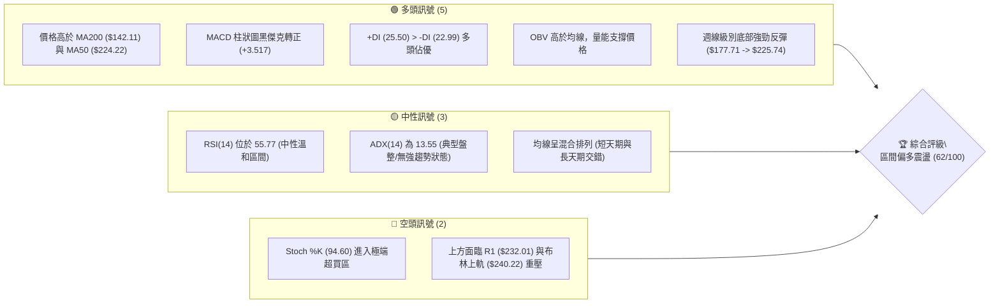
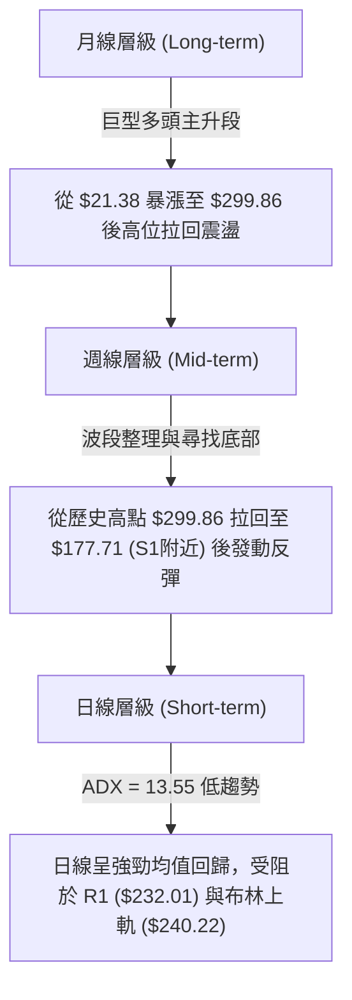
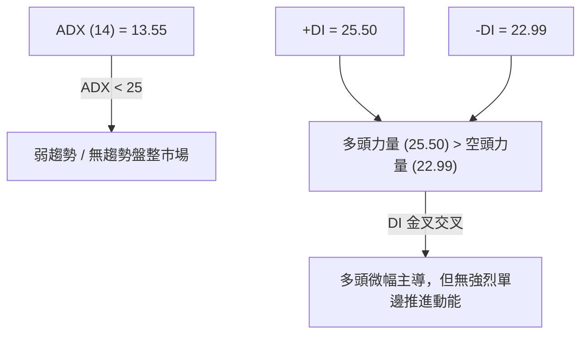
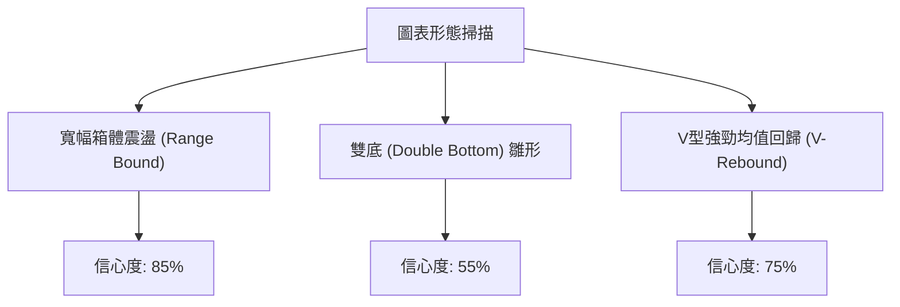
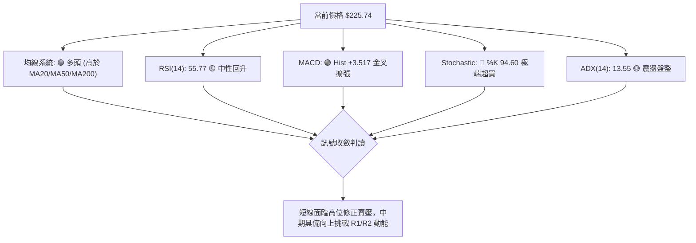
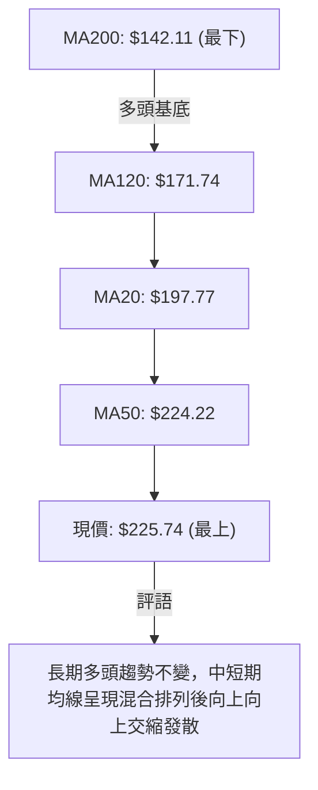
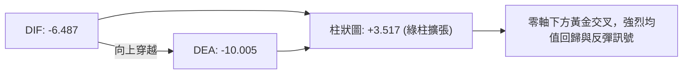
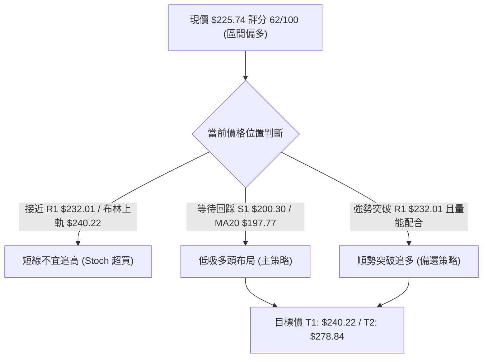
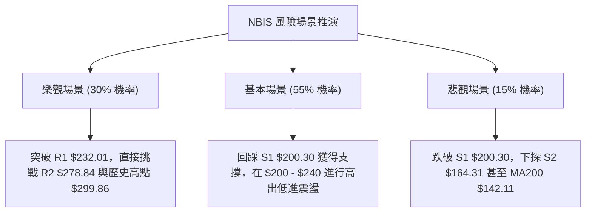

# NBIS 技術分析報告

> **報告日期**：2026-08-05 ｜ **語言**：繁體中文 ｜ **數據來源**：Yahoo Finance ｜ **當前價格**：$225.74

---

## 目錄

| 章節 | 內容 |
|------|------|
| [1. 技術面概覽](#1-技術面概覽) | 訊號儀表板、核心指標、評分卡 |
| [2. 趨勢分析](#2-趨勢分析) | 多時框趨勢、長中短期走勢 |
| [3. 圖表形態分析](#3-圖表形態分析) | 形態識別、K線組合、目標價 |
| [4. 支撐與阻力](#4-支撐與阻力) | 關鍵價位、斐波那契回調 |
| [5. 技術指標深度解讀](#5-技術指標深度解讀) | MA/RSI/MACD/布林/成交量 |
| [6. 動能與波動率](#6-動能與波動率) | 動能評估、ATR、Beta |
| [7. 多時框架總結](#7-多時框架總結) | 時框架評分矩陣 |
| [8. 交易策略建議](#8-交易策略建議) | 多空策略、風險報酬比 |
| [9. 風險提示與監控](#9-風險提示與監控) | 監控指標、風險場景 |

---

## 1. 技術面概覽

### 🎯 技術訊號儀表板



---

### 📊 核心指標速覽表

| 指標類別 | 指標名稱 | 當前數值 | 訊號 | 解讀 |
|----------|----------|----------|------|------|
| **價格** | 當前價格 | $225.74 | 🟢 多頭 | 處於 52 週區間的高位 70.0% 位置，短線強勁反彈 |
| **均線** | MA20 | $197.77 | 🟢 多頭 | 價格位於 MA20 上方 (+14.15%)，短線支撐強勁 |
| **均線** | MA50 | $224.22 | 🟢 多頭 | 價格微幅突破 MA50 (+0.68%)，多空臨界拉鋸點 |
| **均線** | MA200 | $142.11 | 🟢 多頭 | 價格遠高於 MA200 (+58.85%)，長線牛市基底完好 |
| **動能** | RSI(14) | 55.77 | 🟡 中性 | 從近期的 32.2 底部回升，動能溫和擴張無超買/超賣背離 |
| **動能** | MACD(12,26,9) | Hist: +3.517 | 🟢 多頭 | DIF(-6.487) 向上穿越 DEA(-10.005) 形成低點金叉 |
| **擺動** | Stochastic | %K: 94.60 | 🔴 空頭 | %K(94.60) 高於 %D(75.48)，進入高位超買過熱區 |
| **趨勢強度**| ADX(14) | 13.55 | 🟡 中性 | ADX < 25 指示當前處於無強單邊趨勢的盤整震盪格局 |
| **波動** | ATR(14) | $26.99 | 🔴 高波動 | 每日波動率達 11.96%，提示高風險與需要較寬止損 |
| **通道** | 布林通道 | %B: 0.83 | 🟡 中性 | 上軌 $240.22 / 下軌 $155.31，現價接近上軌遭遇壓力 |

---

### 🏆 技術評分卡

```
╔══════════════════════════════════════════════════════════════════╗
║              技術評分卡 — NBIS (2026-08-05)                      ║
╠══════════════════════════════════════════════════════════════════╣
║ 趨勢強度      ████████░░░░░░░░░░░░  40/100  🟡 盤整無單邊強趨勢  ║
║ 動能指標      ██████████████░░░░░░  70/100  🟢 MACD金叉與RSI回升 ║
║ 支撐穩定度    ████████████████░░░░  80/100  🟢 S1($200.30)防線堅固║
║ 成交量配合    ██████████████░░░░░░  70/100  🟢 OBV高於MA，多頭量能║
║ 形態完整度    ████████████░░░░░░░░  60/100  🟡 區間打底形態演進中 ║
║ 均線排列      ████████████░░░░░░░░  60/100  🟡 混合排列，長天期多頭║
╠══════════════════════════════════════════════════════════════════╣
║ 綜合評分      ████████████░░░░░░░░  62/100  🟢 區間偏多震盪       ║
╚══════════════════════════════════════════════════════════════════╝
```

---

## 2. 趨勢分析

### 🌐 多時框趨勢分析



---

### 📈 長期趨勢 — 24個月走勢圖（Unicode）

```
NBIS 月線收盤價格走勢圖（2024-10 至 2026-08）
價格軸 ($)
$300 ┤                                              ●(歷史高點 $299.86)
$270 ┤                                                 ● $276.17
$240 ┤                                                    ● $225.74 (現價)
$210 ┤                                            ● $231.09
$180 ┤                                        ●
$150 ┤                                ● $138.23
$120 ┤                    ● $130.82
$90  ┤                ● $94.87  ● $103.76
$60  ┤            ● $55.33
$30  ┤  ●  ●  ● $32.66
$0   └─┴──┴──┴──┴──┴──┴──┴──┴──┴──┴──┴──┴──┴──┴──┴──┴──┴──┴──┴──┴──┴──
       10 11 12 01 02 03 04 05 06 07 08 09 10 11 12 01 02 03 04 05 06 07 08
       2024년                  2025년                  2026년
```

#### 走勢特徵分析表格

| 階段 | 時間區間 | 收盤價變化 | 漲跌幅 | 走勢特徵與技術含義 |
|------|----------|------------|--------|--------------------|
| 潛伏蓄勢期 | 2024-10 ~ 2025-04 | $21.38 → $22.73 | +6.3% | 長期底部橫盤，波動率極低，籌碼高度集中 |
| 主升初段 | 2025-05 ~ 2025-10 | $22.73 → $130.82 | +475.5% | 突破箱體爆發，出現連續大陽線，成交量大幅放大 |
| 中期拉回震盪 | 2025-11 ~ 2026-01 | $130.82 → $85.19 | -34.9% | 獲利了結賣壓湧現，在 $80-$90 區域尋求中長期支撐 |
| 狂飆狂熱期 | 2026-02 ~ 2026-06 | $85.19 → $276.17 | +224.2% | 第二波強勁爆發，創下 52 週最高價 $299.86 |
| 深幅修正與反彈 | 2026-07 ~ 2026-08 | $276.17 → $225.74 | -18.3% | 7月快速回落至 $177.71 低點，8月初強力 V 型反彈至 $225.74 |

---

### 📊 中期趨勢（週線分析）

```
NBIS 近期週線結構與壓力支撐示意圖
═════════════════════════════════════════════════════════════════════
$299.86 ┤─────────────────────────────────────────────── [52W High / R3]
        │                                     ▲ (2026-06 高點)
$278.84 ┤─────────────────────────────────────┼───────── [阻力 R2]
        │                                  ┌──┴──┐
$240.22 ┤──────────────────────────────────┼─────┼────── [BB Upper / 23.6% Fib $241.57]
$232.01 ┤──────────────────────────────────┼─────┼────── [阻力 R1]
$225.74 ┤..................................●.....│...... 現價 ($225.74)
$205.51 ┤────────────────────────────────────────┼────── [38.2% Fib $205.51]
$200.30 ┤────────────────────────────────────────┴────── [支撐 S1 / BB Mid $197.77]
$176.37 ┤─────────────────────────────────────────────── [50.0% Fib $176.37]
$164.31 ┤─────────────────────────────────────────────── [支撐 S2]
═════════════════════════════════════════════════════════════════════
```

週線數據顯示，股票在 2026 年 7 月經歷了一次快速沉澱，收盤價最低下探至 $177.71（接近 50% 斐波那契回調位 $176.37），隨後在 8 月初（2026-08-09 週）成交量放量突破，單週收盤由 $190.41 大漲至 $225.74，顯示出強烈的中期逢低承接買盤。

---

### ⚡ 趨勢強度評估（ADX 解讀）



#### ADX 指標強度對照判讀

| 指標名稱 | 數據值 | 市場狀態標準區間 | 當前市場屬性判定 | 交易策略導向 |
|----------|--------|------------------|------------------|--------------|
| **ADX(14)** | **13.55** | < 20: 極弱 / 盤整<br>20-25: 趨勢萌芽<br>> 25: 強趨勢 | **無趨勢震盪盤整** | 避免追高殺低，採取高拋低吸區間策略 |
| **+DI(14)** | **25.50** | 0 - 50 | **多頭強勢區** | 多方控盤，短期買盤力道大於賣盤 |
| **-DI(14)** | **22.99** | 0 - 50 | **空頭防守區** | 空方未放棄抵抗，兩者差距僅 2.51，易反覆 |

---

## 3. 圖表形態分析

### 🔍 形態識別系統



#### 形態信心度與目標價評估表

| 形態名稱 | 信心度 | 判斷依據（引用數據） | 完成度 | 目標價計算式與精確數值 |
|----------|--------|----------------------|--------|------------------------|
| **寬幅箱體震盪** | **85%** | ADX=13.55；價格運行於 S1($200.30) 與 R1/R2($232.01-$278.84) 區間 | 80% | 箱體上緣阻力目標：**$240.22** (布林上軌) 至 **$278.84** (R2) |
| **V型強均值回歸**| **75%** | 從週線 $177.71 止跌後連續大陽線突破 MA20($197.77) 與 MA50($224.22) | 90% | 由低點反彈高度估算：$177.71 + ($225.74 - $177.71) = **$232.01** (R1) |
| **雙底形態 (雛形)**| **55%** | 近期探底 $177.71 形成第一底，需回踩 $200.30 不破驗證第二底 | 35% | 頸線突破目標（由形態高度推算）：<br>頸線 $232.01 + ($232.01 - $177.71) = **$286.31** |

*註：由於 ADX 低於 25，幾何複合形態尚未完全確認突破，主要依據「指標型布林通道與箱體」做精確定位。*

---

### 🕯️ 重要 K 線形態分析

| 日期 / 時間 | 收盤價 | K線形態名稱 | 技術解讀 | 訊號導向 |
|-------------|--------|-------------|----------|----------|
| 2026-07-19 週 | $177.71 | 長下影錘子線 | 價格下探 S2($164.31) 上方即獲得強烈逢低承接，形成波段低點 | 🟢 買進訊號 |
| 2026-07-26 週 | $187.77 | 晨星組合 (初現) | 止跌回升，成交量居高不下（98.8M），顯示籌碼換手充分 | 🟢 看多確認 |
| 2026-08-09 週 | $225.74 | 大陽線實體突破 | 一舉突破 MA20 ($197.77) 與 MA50 ($224.22)，多頭強烈收復失地 | 🟢 強烈看多 |

---

### 📉 ASCII 走勢形態示意圖

```
NBIS 日線/週線 區間震盪與 V 型均值回歸形態示意圖
═════════════════════════════════════════════════════════════════════
$278.84 ┤                                      阻力區 R2 ($278.84)
        │                                      ┌───────────┐
$240.22 ┤──────────────────────────────────────┼─布林上軌──┼───
$232.01 ┤─────────────────阻力位 R1 ($232.01)─┼───────────┼───
        │                                  ▲   │  ▲        │
$225.74 ┤................................●.│...│..│........│... 現價 ($225.74)
        │                               /  │   │  │        │
$200.30 ┤──────支撐位 S1 ($200.30)─────/───┴───┴──┴────────┴───
        │                             / (V型反彈路徑)
$177.71 ┤────────────────────────────● (低點 2026-07-19)
═════════════════════════════════════════════════════════════════════
```

---

### 🎯 形態目標價計算

1. **V型回歸目標價**：
   - 探底低點：$177.71
   - 第一目標（R1 阻力位）：**$232.01**（距離現價 +2.78%）
   - 第二目標（布林上軌與斐波那契 23.6%）：**$240.22** 至 **$241.57**（距離現價 +6.41%）

2. **雙底完成理論推算目標（假設成功突破 R1）**：
   - 計算公式：$\text{頸線價格} + (\text{頸線價格} - \text{第一底低點})$
   - 計算過程：$\$232.01 + (\$232.01 - \$177.71) = \$286.31$
   - 對應數據阻力位：接近 R2 **$278.84**（距離現價 +23.52%）。

---

## 4. 支撐與阻力

### 🗺️ 關鍵價位分布圖（Unicode）

```
NBIS 價位結構分布圖（引用 OHLCV 計算精確數據）
═════════════════════════════════════════════════════════════════════
$299.86 ║████████████████████████████████║ 強阻力 R3 / 52週最高價
$278.84 ║████████████████████████        ║ 阻力 R2 / 波段高點聚類
$241.57 ║▓▓▓▓▓▓▓▓▓▓▓▓▓▓▓▓▓▓▓▓            ║ 斐波那契 23.6% 回調位
$240.22 ║████████████████████            ║ 布林通道上軌
$232.01 ║████████████████████████        ║ 關鍵阻力 R1 (近端壓力)
$225.74 ╠════════════════════════════════╣ ◄ 當前價格 ($225.74)
$224.22 ║████████████████                ║ MA50 均線位置
$205.51 ║▓▓▓▓▓▓▓▓▓▓▓▓▓▓▓▓                ║ 斐波那契 38.2% 回調位
$200.30 ║████████████████████            ║ 關鍵支撐 S1 / 箱體底防線
$197.77 ║██████████████                  ║ MA20 / 布林通道中軌
$176.37 ║▓▓▓▓▓▓▓▓▓▓▓▓                    ║ 斐波那契 50.0% 回調位
$164.31 ║████████████████████████        ║ 強支撐 S2 / 中期低點聚類
$142.11 ║██████████                      ║ MA200 牛熊分界線
$132.70 ║████████████████████████        ║ 強支撐 S3 / 長線支撐
═════════════════════════════════════════════════════════════════════
```

---

### 🚧 阻力位分析表

| 阻力級別 | 精確價位 | 形成原因與數據來源 | 突破難度 | 重要性等級 |
|----------|----------|--------------------|----------|------------|
| **R1** | **$232.01** | 近一年波段高點聚類，近端短線賣壓區 (+2.78%) | 🟡 中等 | 🟢 關鍵（短線多空分水嶺） |
| **R2** | **$278.84** | 近一年次高點聚類區，前期爆量換手重壓 (+23.52%) | 🔴 極高 | 🟡 中期（中期牛熊轉換點） |
| **R3** | **$299.86** | 52 週歷史最高價，歷史解套賣壓最密集區 (+32.83%)| 🔴 極高 | 🔴 戰略級（歷史天花板） |

---

### 🛡️ 支撐位分析表

| 支撐級別 | 精確價位 | 形成原因與數據來源 | 守住機率 | 重要性等級 |
|----------|----------|--------------------|----------|------------|
| **S1** | **$200.30** | 近一年波段低點聚類，與 MA20 ($197.77) 形成重疊防線 (-11.27%) | 🟢 高 (80%) | 🟢 關鍵（多頭首要防線） |
| **S2** | **$164.31** | 近一年中期波段低點聚類，靠近 61.8% Fib ($147.23) (-27.21%) | 🟢 極高 (90%)| 🔴 戰略級（中期生命線） |
| **S3** | **$132.70** | 近一年長期波段低點聚類，與 MA200 ($142.11) 形成長線防護 (-41.22%) | 🟢 極高 (95%)| 🔴 長線牛熊底線 |

---

### 📐 斐波那契回調位分析

依據 52 週高低點（High: **$299.86** $\rightarrow$ Low: **$52.88**，總價差 $246.98）：

| 斐波那契比例 | 精確價位 | 與當前價差距 | 技術面說明與解讀 |
|--------------|----------|--------------|──────────────────|
| **0.0%** (52W High) | **$299.86** | +32.83% | 歷史高點阻力 |
| **23.6%** | **$241.57** | +7.01% | 與布林上軌 ($240.22) 高度重疊，為反彈的第一強阻力帶 |
| **當前價格位置** | **$225.74** | **0.00%** | **現價運行於 23.6% ($241.57) 與 38.2% ($205.51) 區間** |
| **38.2%** | **$205.51** | -8.96% | 與 S1 支撐 ($200.30) 形成密集強支撐帶，多頭回踩首要防禦點 |
| **50.0%** | **$176.37** | -21.87% | 近期 7 月低點 ($177.71) 精確於此處獲得支撐後反彈 |
| **61.8%** | **$147.23** | -34.78% | 與 MA200 ($142.11) 形成黃金交叉支撐帶 |
| **78.6%** | **$105.73** | -53.16% | 長線強支撐區 |
| **100.0%** (52W Low) | **$52.88** | -76.57% | 52 週最低點 |

---

## 5. 技術指標深度解讀

### 🎛️ 指標訊號總覽



---

### 📈 移動平均線排列分析



| 均線名稱 | 精確價位 | 價格關係 | 偏離率 (%) | 均線走勢與趨勢含義 |
|----------|----------|----------|------------|--------------------|
| **MA 5** | $193.08 | 價格在上 | +16.92% | 極短線急升，陡峭向上 |
| **MA 10** | $194.99 | 價格在上 | +15.77% | 短線快速跟進，支撐強勁 |
| **MA 20** | $197.77 | 價格在上 | +14.15% | 月線轉為向上，重要短線支撐 |
| **MA 50** | $224.22 | 價格在上 | +0.68% | 剛好收復季線，多空進入決戰 |
| **MA 60** | $220.19 | 價格在上 | +2.52% | 扣抵高價區後開始平緩 |
| **MA 120**| $171.74 | 價格在上 | +31.44% | 半年線持續向上升升 |
| **MA 200**| $142.11 | 價格在上 | +58.85% | 年線多頭排列，長期牛市防線 |

---

### 📉 RSI(14) 分析

#### RSI 進度條與狀態
```
RSI(14): [█████████████░░░░░░░░] 55.77 (中性溫和多頭區間)
0       30                    50         70                   100
超賣區  弱勢區                中性軸     超買區               極端過熱
```

1. **區間解讀**：RSI 目前為 55.77，自 2026 年 7 月中旬的 32.2 極端低點快速爬升，成功站上 50 中性軸，顯示多頭已重掌短期控盤權，且距離 70 超買區仍有發展空間。
2. **背離分析**：
   - **RSI 背離判斷**：無明顯頂背離或底背離。
   - **結論**：價格從 $177.71 反彈至 $225.74 的過程中，RSI 由 34.8 同步上升至 55.8，指標與價格走勢互相確認，無指標衰竭現象。

---

### 📊 MACD(12/26/9) 訊號解讀

- **MACD 線 (DIF)**：-6.487
- **訊號線 (DEA)**：-10.005
- **柱狀圖 (Histogram)**：+3.517 🟢看多



DIF 在零軸下方向上穿越 DEA 形成黃金交叉，且柱狀圖由負轉正擴大至 +3.517，為典型的零軸下低位金叉。歷史數據顯示此類訊號往往能推動 10%-20% 的波段反彈。

---

### 📦 布林通道分析

```
NBIS 布林通道 (20日, 2.0標準差) 結構圖
═════════════════════════════════════════════════════════════════════
$240.22 ┤────────────────────────────────── 布林通道上軌 ($240.22)
        │                              ▲
$225.74 ┤..............................●.. 現價 ($225.74, %B = 0.83)
        │                             /
$197.77 ┤────────────────────────────●──── 布林通道中軌/MA20 ($197.77)
        │
$155.31 ┤────────────────────────────────── 布林通道下軌 ($155.31)
═════════════════════════════════════════════════════════════════════
```

- **%B 指標**：0.83（現價位於通道上半部，高度接近上軌）。
- **帶寬分析**：上軌 $240.22 與下軌 $155.31 通道寬度達 $84.91，提示當前處於高波動橫盤擴張期。當前價位 $225.74 已接近上軌，短線面臨通道上軌壓制。

---

### 💹 成交量分析（量價配合度）

1. **量能表現**：最新單日成交量 21,272,400 股，對比 20 日均量 22,398,275 股，量比為 **0.95x**，呈現「價漲量平」溫和換手格局。
2. **週成交量變化**：2026-08-02 當週成交量爆出 **154,853,200 股** 的巨量打底洗盤，隨後 2026-08-09 週價格在大漲至 $225.74 的過程中量能收縮至 49.9M，顯示籌碼在低位清洗後極度鎖籌。
3. **OBV (能量潮)**：OBV > MA，量能指標持續上行，確認主力資金在 $180-$200 區間有明顯建倉痕跡，量價配合整體健康。

---

## 6. 動能與波動率

### ⚡ 動能評估

#### 動能與波動維度評估表

| 象限分類 | 動能狀態 | 波動率狀態 | NBIS 當前位置 | 交易導向與技術含義 |
|----------|----------|------------|---------------|----------------────|
| **Q1** | 強動能 | 低波動 | — | 最佳趨勢突破買點 |
| **Q2** | 弱動能 | 低波動 | — | 沉悶盤整，蓄勢待發 |
| **Q3** | **強動能** | **高波動** | **✓ (當前歸屬)** | **高風險高報酬，適合嚴格止損的波段操作** |
| **Q4** | 弱動能 | 高波動 | — | 無序洗盤，應避免入場 |

**說明**：NBIS 當前 ATR 佔價格比率高達 **11.96%**，且 MACD 柱狀圖急速擴張 (+3.517)，屬於典型的 **Q3 高動能高波動** 象限。

---

### 📊 ATR 波動率分析

- **ATR(14)**：**$26.99**（占當前股價 11.96%）。
- **風控 implications**：
  - NBIS 每日平均波幅近 $27，意味著日常的正常震盪即可能達到 $\pm 12\%$。
  - **止損距離建議**：短線止損距離應至少設定為 1.0 $\times$ ATR（約 $27），波段交易止損應設定為 1.5 $\times$ ATR（約 $40.5），以避免被日常無效噪音掃出場。

---

### 📐 Beta 與市場相關性

- **Beta 係數**：**1.434**
- **市場屬性**：屬於高 Beta 成長型科技股，波動度比標普 500 指數高出 43.4%。在科技股大盤反彈時具有強烈的超額收益 (Alpha) 潛力，但在市場修正時下跌風險亦同步放大。

---

## 7. 多時框架總結

### 📋 時框架評分表

| 時框架 | 趨勢方向 | 動能指標 | 均線排列 | 形態結構 | 綜合評分 | 建議操作 |
|--------|----------|----------|----------|----------|----------|----------|
| **月線 (Long)** | 🟢 多頭 | 🟢 強勁 | 🟢 多頭排列 | 主升段後拉回整理 | **85 / 100** | 長線堅定持有 |
| **週線 (Mid)** | 🟢 多頭 | 🟢 MACD金叉 | 🟡 混合排列 | V型打底反彈 | **68 / 100** | 逢低波段布局 |
| **日線 (Short)**| 🟡 震盪 | 🔴 Stoch過熱 | 🟢 站上MA20/50| 布林上軌阻力區 | **58 / 100** | 不追高，回踩買 |

---

### 🔲 綜合訊號矩陣

```
                     短線 (日線)       中線 (週線)       長線 (月線)
  ─────────────────────────────────────────────────────────────
  趨勢方向            🟡 箱體震盪       🟢 探底反彈       🟢 牛市主升
  均線位置            🟢 站上MA20/50    🟡 穿越季線       🟢 遠超MA200
  動能指標            🔴 高位超買       🟢 MACD金叉       🟢 RSI中性偏多
  成交量配合          🟢 OBV向上        🟢 低位爆量換手   🟢 總體放量
  ─────────────────────────────────────────────────────────────
  多空一致性：中度偏多 (短線震盪壓制 vs 中長線多頭基底)
```

---

### ⚖️ 多時框收斂結論

依據多時框收斂規則：
1. **行情屬性判定**：當前日線 ADX(14) = 13.55 (< 25)，定義為 **盤整震盪行情**。
2. **主導區間定位**：交易應以布林通道上下軌（$155.31 - $240.22）與關鍵支撐阻力（S1 $200.30 - R1 $232.01）為主要區間。
3. **最終收斂方向**：雖然日線 Stoch(94.60) 呈現短線超買，但週線與月線均處於強勁多頭架構且 MACD 剛完成零軸下金叉。因此**收斂結論為：區間偏多震盪**，短線若因觸及 R1/布林上軌而出現拉回，為中線多頭進場的良機，第 8 章交易策略將完全以此方向進行規劃。

---

## 8. 交易策略建議

### 🗺️ 策略決策流程圖



---

### 🧭 策略路由

**當前主策略方向 = 🟢 區間逢低做多（依綜合評分 62/100）**

因 ADX 僅 13.55 且 Stoch(94.60) 極端超買，當前股價 $225.74 已逼近 R1 阻力位 $232.01，直接追高的風險報酬比較差。最適策略為**等待股價回踩 S1 ($200.30) 或 MA20 ($197.77) 附近分批低吸佈局多單**。

---

### 🎯 價格情境階梯 (Price Scenarios)

| 觸發條件 | 下一目標價 | 後續延伸目標 | 情境技術含義 |
|----------|------------|--------------|--------------|
| 強勢突破阻力 R1 $232.01 | 布林上軌 **$240.22** | 阻力 R2 **$278.84** | 短線整理結束，發動新一輪中線攻擊 |
| **回踩支撐 S1 $200.30 止跌** | **R1 $232.01** | **R2 $278.84** | **標準箱體下軌買點，最佳風險報酬比** |
| 跌破支撐 S1 $200.30 | 斐波那契 50% **$176.37** | 支撐 S2 **$164.31** | 箱體失守，需回測中期深層支撐區 |

---

### 📊 情境機率分佈

| 情境劇本 | 估算機率 | 主要技術數據依據 |
|----------|----------|------------------|
| **回踩 S1 後繼續上攻 (主升/震盪向上)** | **60%** | 週線 MACD 金叉、OBV 支撐上漲、長天期 MA200 呈牛市排列 |
| **在 $200 - $232 區間橫盤震盪** | **25%** | ADX = 13.55 (極低趨勢強度)，布林通道寬度較大 |
| **跌破 S1 深幅回落** | **15%** | 僅在極端市場避險（高 Beta 1.434 帶來的系統性下行）下發生 |

---

### 🟢 主策略詳情

| 策略要素 | 策略 A：箱體回踩低吸 (推薦 🥇) | 策略 B：突破 R1 順勢追多 (備選 🥈) |
|----------|──────────────────────────────|──────────────────────────────────|
| **進場條件** | 價格回踩 S1 / MA20 區域出現止跌訊號 | 日線收盤價強勢實體突破 R1 $232.01 |
| **進場價格** | **$200.30**（可於 $197.77-$202.00 分批） | **$233.50**（突破確認後進場） |
| **目標價 T1**| **$232.01** (阻力 R1，預期 +15.8%) | **$255.44** (分析師均價，預期 +9.4%) |
| **目標價 T2**| **$278.84** (阻力 R2，預期 +39.2%) | **$299.86** (52W 高點 R3，預期 +28.4%)|
| **止損價格** | **$176.37** (50% Fib / 約 0.9x ATR) | **$220.19** (MA60 / 突破前低點) |
| **風險報酬比**| **3.28 : 1** (以 T2 計算) | **2.24 : 1** (以 T2 計算) |
| **勝率估計** | **65%** | **55%** |
| **建議倉位** | **15% - 20%** 總資產 | **10% - 15%** 總資產 |

---

### 🔴 反向風險觸發點（對沖提示）

- **觸發條件**：若股價無預警放量跌破 **$197.77 (MA20)** 與 **$200.30 (S1)**，且日線 MACD 柱狀圖重新轉負。
- **對沖應對**：多頭應立即平倉離場觀望；高階交易者可考慮輕倉建立空頭對沖，下看 S2 **$164.31**。

---

### ⭐ 整體訊號強度評星

```
做多訊號強度：  ████████░░  4.0 / 5.0  ★ ★ ★ ★ ☆
做空訊號強度：  ████░░░░░░  2.0 / 5.0  ★ ★ ☆ ☆ ☆
整體可信度：    ████████░░  4.0 / 5.0  ★ ★ ★ ★ ☆
```

---

## 9. 風險提示與監控

### ✅ 關鍵監控指標 Checklist

```
╔══════════════════════════════════════════════════════════════════╗
║                    關鍵技術監控 Checklist                        ║
╠══════════════════════════════════════════════════════════════════╣
║ [ ] 1. R1 阻力位 $232.01 是否放量突破（日成交量 > 25M）          ║
║ [ ] 2. 股價回踩 S1 $200.30 時，MA20 ($197.77) 是否發揮有效支撐   ║
║ [ ] 3. Stoch %K (94.60) 是否在高位形成死叉向下拉回修正       ║
║ [ ] 4. ADX(14) 是否由 13.55 開始上升突破 25，開啟強單邊趨勢     ║
║ [ ] 5. MACD 柱狀圖 (+3.517) 是否能維持正向擴張增長              ║
╚══════════════════════════════════════════════════════════════════╝
```

---

### ⚠️ 風險場景分析



---

### 🛡️ 風險管理重要提醒

1. **極高波動性警示**：NBIS 的 ATR 達 **$26.99 (11.96%)**，Beta 係數達 **1.434**，屬於高度敏感的成長型個股。交易者切勿使用過高槓桿。
2. **籌碼面風險**：空頭借券賣出比例（Short % Float）高達 **28.0%**，Short Ratio 為 3.42。高空頭比例意味著：
   - ⚠️ 若價格突破 $232.01，極易觸發**軋空行情 (Squeeze)**，導致股價暴漲。
   - ⚠️ 若價格跌破 $200.30，空頭將加碼落井下石，加劇短線跌勢。

---

## 📋 報告總結

```
╔══════════════════════════════════════════════════════════════════╗
║                   NBIS 技術分析報告總結                          ║
════════════════════════════════════════════════════════════════════
報告日期：2026-08-05
當前價格：$225.74
綜合評級：🟢 62/100 (區間偏多震盪)

關鍵結論：
├─ 長期趨勢：🟢 強烈多頭 (遠高於 MA200 $142.11)
├─ 中期趨勢：🟢 探底反彈 (週線 MACD 低點金叉)
├─ 短期趨勢：🟡 區間高位 (受阻於 R1 $232.01 與 Stoch 超買)
├─ 關鍵支撐：S1 $200.30 / S2 $164.31
├─ 關鍵阻力：R1 $232.01 / R2 $278.84
└─ 分析師目標價：均價 $255.44 / 最高 $410.00

最優策略組合：
1. 🥇 最佳機會：等待價格回踩 S1 $200.30 附近分批建倉，目標 $278.84，止損 $176.37
2. 🥈 次選機會：待日線實體大陽線突破 R1 $232.01 後順勢追多，目標 $255.44
3. 🥉 保守選擇：當前價格接近布林上軌，暫時觀望等待短線 Stoch 過熱指標拉回修正
════════════════════════════════════════════════════════════════════
```

---

> ⚠️ **免責聲明**：本報告為 AI 自動生成之技術分析，所有數據及估算均基於提供的歷史價格資訊。本報告**僅供研究與學術參考**，**不構成任何投資建議**。投資有風險，入市需謹慎。

---

*報告生成時間：2026-08-05 ｜ 數據來源：Yahoo Finance ｜ 分析框架：多時框技術分析*