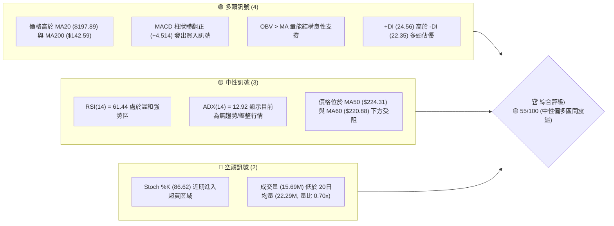
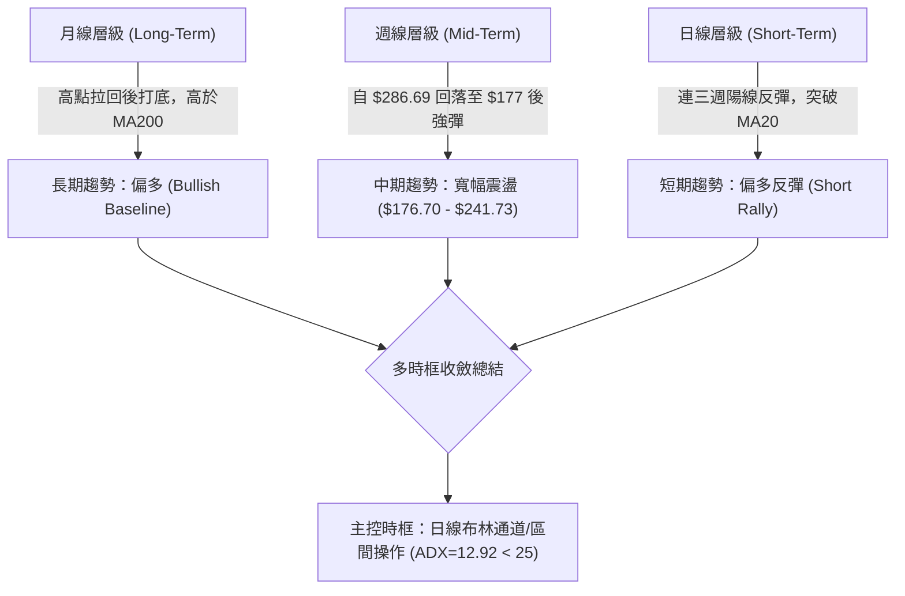
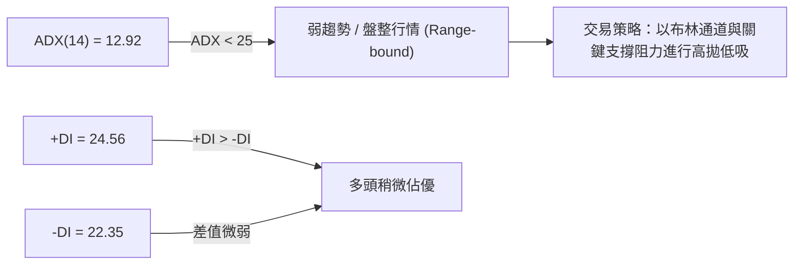
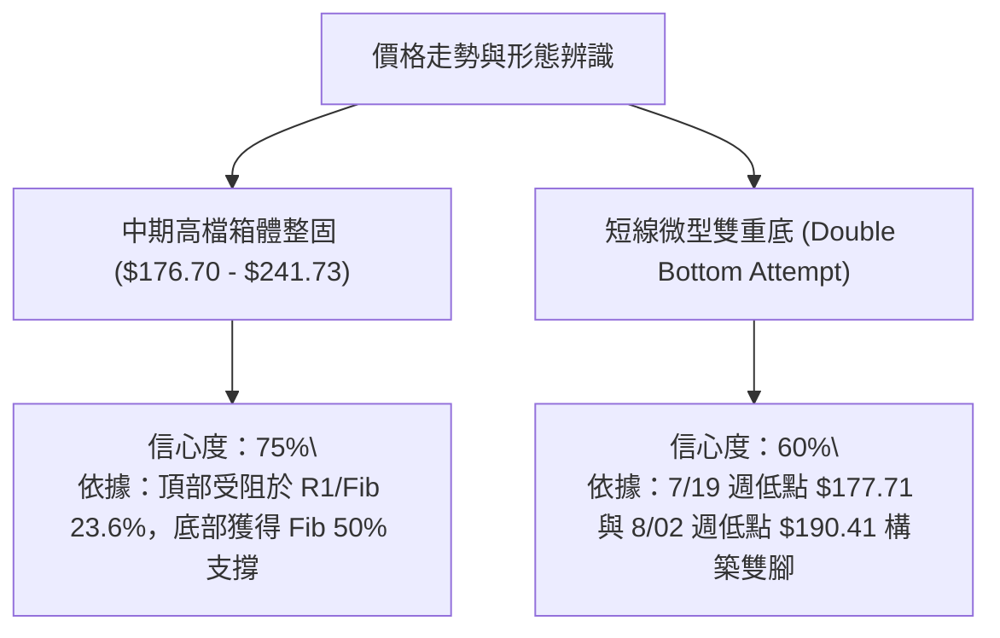
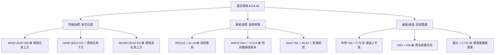
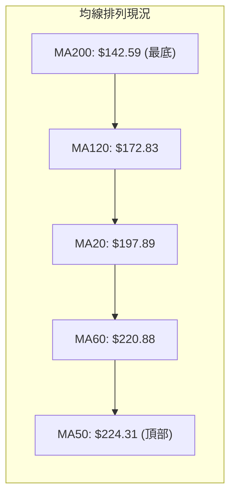
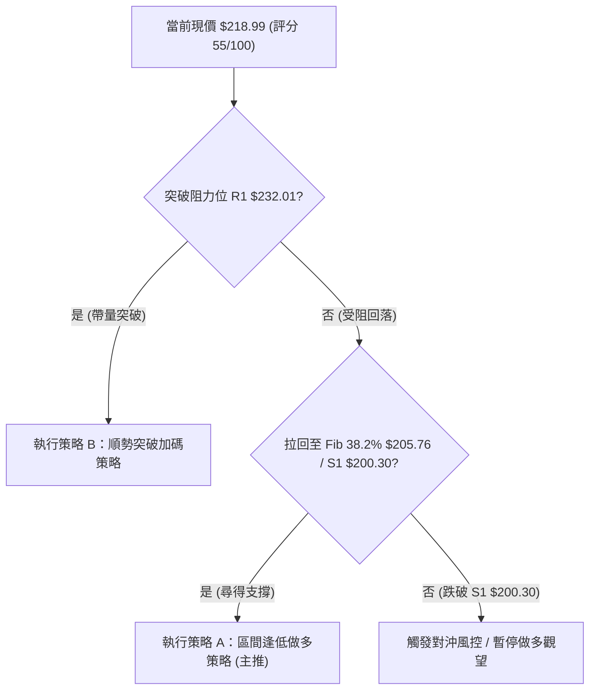
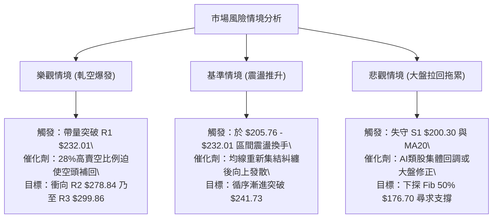

# NBIS 技術分析報告

> **報告日期**：2026-08-06 ｜ **語言**：繁體中文 ｜ **數據來源**：Yahoo Finance ｜ **當前價格**：$218.99

---

## 目錄

| 章節 | 內容 |
|------|------|
| [1. 技術面概覽](#1-技術面概覽) | 訊號儀表板、核心指標、評分卡 |
| [2. 趨勢分析](#2-趨勢分析) | 多時框趨勢、長中短期走勢 |
| [3. 圖表形態分析](#3-圖表形態分析) | 形態識別、K線組合、目標價 |
| [4. 支撐與阻力](#4-支撐與阻力) | 關鍵價位、斐波那契回調 |
| [5. 技術指標深度解讀](#5-技術指標深度解讀) | MA/RSI/MACD/布林/成交量 |
| [6. 動能與波動率](#6-動能與波動率) | 動能評估、ATR、Beta |
| [7. 多時框架總結](#7-多時框架總結) | 時框架評分矩陣 |
| [8. 交易策略建議](#8-交易策略建議) | 多空策略、風險報酬比 |
| [9. 風險提示與監控](#9-風險提示與監控) | 監控指標、風險場景 |
| [10. 報告總結](#10-報告總結) | 綜合評級與核心結論 |

---

## 1. 技術面概覽

### 🎯 技術訊號儀表板



### 📊 核心指標速覽表

| 指標類別 | 指標名稱 | 當前數值 | 訊號 | 解讀 |
|----------|----------|----------|------|------|
| **價格** | 當前收盤價 | $218.99 | 🟡 | 位於 52 週區間 ($53.54–$299.86) 之 67.2% 位置 |
| **均線** | MA20 / MA50 | $197.89 / $224.31 | 🟡 | 站上 20 日均線，但遭遇 50 日均線動態反壓 |
| **均線** | MA200 | $142.59 | 🟢 | 遠高於 200 日均線，長期牛市基調未改 |
| **動能** | RSI(14) | 61.44 | 🟢 | 動能加溫，無頂背離訊號 |
| **動能** | MACD (12,26,9) | -4.362 / Hist +4.514 | 🟢 | 柱狀圖翻正且底擴張，短線動能反彈 |
| **動能** | KD (Stoch %K/%D)| 86.62 / 86.75 | 🔴 | 短線急漲後進入超買區，需防範拉回 |
| **趨勢** | ADX(14) | 12.92 | 🟡 | ADX < 25，屬於弱趨勢/區間震盪行情 |
| **通道** | 布林通道 %B | 0.75 ($240.59 / $155.19)| 🟡 | 處於通道中軌與上軌之間，向上軌挑戰 |
| **波動** | ATR(14) | $25.78 (11.77%) | 🔴 | 日均波幅較大，屬於高波動率標的 |
| **量能** | 量比 (vs 20MA) | 0.70x (15.69M) | 🟡 | 反彈過程量能略顯縮減，量價配合有待加強 |

### 🏆 技術評分卡

```
╔══════════════════════════════════════════════════════════════════╗
║                   NBIS 技術綜合評分卡 (2026-08-06)               ║
╠══════════════════════════════════════════════════════════════════╣
║ 趨勢強度 (ADX)     ███████░░░░░░░░░░░░░  35/100  🟡 弱趨勢/盤整  ║
║ 動能指標 (RSI/MACD) █████████████░░░░░░░  68/100  🟢 動能偏多     ║
║ 支撐穩定度 (Fib/S1) █████████████░░░░░░░  65/100  🟢 兩重強支撐   ║
║ 成交量配合度 (OBV)  ███████████░░░░░░░░░  55/100  🟡 量能中性縮減 ║
║ 形態完整度 (區間)   ██████████░░░░░░░░░░  50/100  🟡 箱體打底中   ║
║ 均線系統排列       ████████████░░░░░░░░  58/100  🟡 多空交錯混合 ║
╠══════════════════════════════════════════════════════════════════╣
║ 綜合技術評分       ███████████░░░░░░░░░  55/100  🟡 中性偏多區間 ║
╚══════════════════════════════════════════════════════════════════╝
```

---

## 2. 趨勢分析

### 🌐 多時框趨勢分析



### 📈 長期趨勢 — 24個月走勢圖（ASCII）

```
NBIS 月線收盤走勢圖（2024-10 至 2026-08）
價格 ($)
$300 ┤                                                       ● 276.17
$250 ┤                                                ● 231.09     ● 218.99 (現在)
$200 ┤                                          ● 138.23      ● 190.41
$150 ┤                                  ● 130.82
$100 ┤                            ● 112.27
 $50 ┤        ● 32.66  ● 55.33 ● 68.32
  $0 ┼──●──●─────────●─────────────────────────────────────────────────
       10 11 12 01 02 03 04 05 06 07 08 09 10 11 12 01 02 03 04 05 06 07 08  (月)
       └────── 2024 ──────┘└────────────── 2025 ──────────────┘└── 2026 ──┘
```

#### 走勢特徵分析表

| 階段 | 時間區間 | 主導價格區間 | 漲跌幅特徵 | 技術面解讀 |
|------|----------|--------------|------------|------------|
| **1. 初始打底期** | 2024-10 ~ 2025-04 | $21.11 – $32.66 | 區間震盪 | 沉澱籌碼，低檔整理 |
| **2. 主升段爆發** | 2025-05 ~ 2025-10 | $36.75 – $130.82 | +256.0% 垂直狂飆 | 強勢突破，資金瘋狂湧入 AI 概念 |
| **3. 中期拉回整固** | 2025-11 ~ 2026-02 | $83.71 – $94.87 | -36.0% 高檔獲利回吐 | 測試 $80–$85 強支撐區（消化浮籌）|
| **4. 二次主升段** | 2026-03 ~ 2026-06 | $103.76 – $276.17 | +166.2% 創歷史新高 | 刷新 52 週新高至 $299.86 |
| **5. 高檔修正與反彈**| 2026-07 ~ 2026-08 | $190.41 – $218.99 | 自高點 -27% 後強彈 | 探底至 S1 ($200.30) / Fib 38.2% ($205.76) 後回升 |

### 📊 中期趨勢（週線結構分析）

從近 20 週數據觀察，NBIS 於 2026-06-21 當週創下週收盤高點 $286.69 後遭遇獲利回吐賣壓，隨後於 2026-07-19 當週打出低點 $177.71（精準尋得斐波那契 50.0% 回調位 $176.70 支撐）。近三週收盤價由 $187.77 → $190.41 → $218.99，形成長下影線後的 V 型彈升，顯示中期逢低買盤依然積極。

### ⚡ 趨勢強度評估（ADX 解讀）



| ADX 數值區間 | 當前位置 | 趨勢狀態 | 策略指導 |
|--------------|----------|----------|----------|
| **0 – 20** | **12.92 🟢** | **極弱趨勢 / 無趨勢** | **嚴禁追漲殺跌，採用區間震盪交易策略** |
| **20 – 25** | — | 趨勢醞釀期 | 觀望突破方向 |
| **25 – 50** | — | 強勁趨勢期 | 順勢操作，拉回找買點 |
| **> 50** | — | 極端極化趨勢 | 防範趨勢竭盡反轉 |

---

## 3. 圖表形態分析

### 🔍 形態識別系統



#### 形態評估與信心度分析表

| 形態名稱 | 信心度 | 判斷依據（引用數據） | 完成度 | 測量目標價（附計算式） |
|----------|--------|----------------------|--------|------------------------|
| **矩形箱體震盪** | **75%** | 上軌 $241.73 (Fib 23.6%)，下軌 $176.70 (Fib 50.0%) | 85% | 突破箱體頂部後：$241.73 + ($241.73 - $176.70) = **$306.76** |
| **短線雙重底** | **60%** | 第一腳 $177.71，第二腳 $190.41，頸線 $232.01 (R1) | 50% | 突破頸線後：$232.01 + ($232.01 - $177.71) = **$286.31** |
| **頭肩頂形態** | **30%** | 左肩 $232.01，頭部 $299.86，右肩尚未確立 | 20% | *數據不足，信心度低於 50%，不作主要依據* |

### 🕯️ 近期 K 線組合分析

| 日期/週別 | 收盤價 | K 線形態 | 解讀 | 訊號 |
|-----------|--------|----------|------|------|
| **2026-07-19** | $177.71 | 長下影 Hammer | 探底 $177.71 後強勁收復，買盤於 $176.70 回調位強勢介入 | 🟢 止跌 |
| **2026-07-26** | $187.77 | 小陽線 底部溫和 | 止跌回升，賣壓收斂 | 🟡 震盪 |
| **2026-08-02** | $190.41 | 貫穿回升陽線 | 成交量爆發至 154.8M（週量），籌碼大舉換手 | 🟢 換手完成 |
| **2026-08-09** | $218.99 | 長紅突破大陽線 | 攻克 MA20 ($197.89)，日線連漲突破 $210 關卡 | 🟢 強勢攻擊 |

### 📉 ASCII 形態結構示意圖

```
NBIS 中短期矩形箱體與雙底結構圖
價格 ($)
$299.86 ┼────────────────────────────────────────────── (52W 高點 / R3)
        │            ▲ 頭部 $299.86
$241.73 ┼───────────┼───────┼────────────────────────── (Fib 23.6% 壓力位)
$232.01 ┼───────────┼───────┼───────● 頸線阻力 (R1)
        │   左肩    │       │     /
$218.99 ┼───────────┼───────┼────● 現價 $218.99
        │          / \     / \  /
$200.30 ┼─────────/───\───/───\/─────────────────────── (強支撐 S1)
        │        /     \ /     W底右腳 $190.41
$176.70 ┼───────●───────●────────────────────────────── (Fib 50.0% / W底左腳 $177.71)
```

---

## 4. 支撐與阻力

### 🗺️ 關鍵價位分布圖

```
╔══════════════════════════════════════════════════════════════════╗
║                     NBIS 關鍵價位階梯結構                        ║
╠══════════════════════════════════════════════════════════════════╣
║ $299.86 ║██████████████████████████████████████║ 52週歷史高點 / R3 ║
║ $278.84 ║████████████████████████████████      ║ 波段高點聚類 / R2  ║
║ $241.73 ║████████████████████████              ║ 斐波那契 23.6% 回調║
║ $232.01 ║██████████████████████                ║ 近期關鍵阻力 / R1  ║
║─────────╠══════════════════════════════════════╣─────────────────║
║ $218.99 ║ ◄ 當前收盤價 (Current Price)         ║                 ║
║─────────╠══════════════════════════════════════╣─────────────────║
║ $205.76 ║▓▓▓▓▓▓▓▓▓▓▓▓▓▓▓▓▓▓                    ║ 斐波那契 38.2% 回調║
║ $200.30 ║▓▓▓▓▓▓▓▓▓▓▓▓▓▓▓▓                      ║ 近期波段強支撐 S1 ║
║ $176.70 ║▓▓▓▓▓▓▓▓▓▓                            ║ 斐波那契 50.0% 回調║
║ $164.31 ║▓▓▓▓▓▓▓                               ║ 近一年波段低點 S2 ║
║ $145.80 ║▓▓▓                                   ║ 核心長線支撐 S3   ║
╚══════════════════════════════════════════════════════════════════╝
```

### 🚧 阻力位分析表

| 阻力級別 | 價位 | 形成原因（引用數據） | 突破難度 | 重要性 |
|----------|------|----------------------|----------|--------|
| **R1** | **$232.01** | 近一年波段高點聚類 / 雙底頸線壓力 | 🟡 中等 | 🟢🟢🟢 短線多空分水嶺 |
| **Fib 23.6%** | **$241.73** | 52週區間 23.6% 回調位 / 布林上軌 ($240.59) 疊加 | 🔴 偏高 | 🟢🟢🟢 箱體上軌防線 |
| **R2** | **$278.84** | 波段高點聚類 / 前期起跌重災區 | 🔴 很高 | 🟢🟢🟢 中期多頭目標 |
| **R3** | **$299.86** | 52週最高價 (52W High) | 🔴 極高 | 🟢🟢🟢 歷史高點心理關卡 |

### 🛡️ 支撐位分析表

| 支撐級別 | 價位 | 形成原因（引用數據） | 守住機率 | 重要性 |
|----------|------|----------------------|----------|--------|
| **Fib 38.2%** | **$205.76** | 52週區間 38.2% 斐波那契回調位 | 🟢 高 | 🟢🟢🟢 第一道防禦線 |
| **S1** | **$200.30** | 波段低點聚類 / 整數心理關卡 / MA20 ($197.89) 鄰近 | 🟢 很高 | 🟢🟢🟢 短線多頭防守底線 |
| **Fib 50.0%** | **$176.70** | 52週區間 50.0% 回調位 / 7月低點 ($177.71) | 🟢 極高 | 🟢🟢🟢 中期多空生命線 |
| **S2** | **$164.31** | 近一年波段低點聚類 / 布林通道下軌 ($155.19) 區 | 🟢 極高 | 🟢🟢🟢 中長線強支撐 |
| **S3** | **$145.80** | 近一年波段低點聚類 / MA200 ($142.59) 疊加區 | 🟢 極高 | 🟢🟢🟢 牛熊生死線 |

### 📐 斐波那契回調位分析

*52週價格區間：低點 $53.54 → 高點 $299.86（全波段價差 $246.32）*

| 回調比例 | 價格 | 當前價格位置解讀 |
|----------|------|------------------|
| **0.0% (高點)** | $299.86 | 歷史天花板 |
| **23.6%** | $241.73 | **上方即時阻力**（若突破此位，將開啟向 $278.84 挑戰的大門） |
| **38.2%** | $205.76 | **下方即時支撐**（當前價格 $218.99 處於 23.6% 與 38.2% 之間） |
| **50.0%** | $176.70 | 強力分水嶺（7月份成功回測此位置並觸發大反彈） |
| **61.8%** | $147.63 | 黃金分割強支撐（與 MA200 $142.59 極度接近） |
| **78.6%** | $106.25 | 深層回調區 |
| **100.0% (低點)**| $53.54 | 52週起漲點 |

**結論**：當前價格 $218.99 精準運作於 **Fib 38.2% ($205.76)** 與 **Fib 23.6% ($241.73)** 所構成的關鍵夾層區間內。

---

## 5. 技術指標深度解讀

### 🎛️ 指標訊號總覽



### 📈 移動平均線排列分析



- **均線排列狀態**：**混合排列**。
- **解析**：中長期均線（MA120、MA200）呈現標準多頭多排，且呈 +26.71% 與 +62.01% 的正乖離，奠定中長期長牛格局；然而短期均線中，MA50 ($224.31) 與 MA60 ($220.88) 位於當前價格 ($218.99) 上方，形成雙重動態蓋頂反壓。短線強勢突破 MA20 ($197.89) 後，下一步必須突破 $220.88–$224.31 均線密集交會區。

### 📉 RSI(14) 分析

```
RSI(14) 強度進度條:
0           30                  60.7  61.44     70          100
├───────────┼─────────────────────┼───█─────────┼───────────┤
[   超賣區   ]     [  中性偏多區  ]     [當前]   [   超買區   ]
```

- **當前數值**：**61.44** (🟢 溫和看多區間)。
- **背離檢測**：價格自 7 月底低點 $177.71 彈升至 $218.99，RSI 從 32.2 升至 61.44，指標與價格同向上升，**無頂背離亦無底背離**，動能推升屬健康回升。

### 📊 MACD (12, 26, 9) 訊號解讀

- **MACD 快線**：-4.362
- **MACD 慢線 (Signal)**：-8.876
- **MACD 柱狀體 (Hist)**：**+4.514** (🟢 多頭交叉擴張)
- **解讀**：MACD 柱狀圖已強勢翻正（由上一期的 -1.373 擴張至 +4.514），且快線已向上穿越慢線，形成日線層級黃金交叉，表明短期下行修正動力已告終結，多頭重新掌權。

### 📦 布林通道分析

```
NBIS 布林通道位置示意圖
$240.59 ┼───────────────────────────────── Upper Band (布林上軌)
        │                                 
        │                    ● $218.99    (現價, %B = 0.75)
$197.89 ┼───────────────────────────────── Middle Band (MA20 中軌)
        │                                 
$155.19 ┼───────────────────────────────── Lower Band (布林下軌)
```

- **通道指標**：上軌 $240.59 ｜ 中軌 $197.89 ｜ 下軌 $155.19
- **%B 位置**：**0.75**（處於中軌與上軌之間的黃金攻擊區）。
- **解讀**：價格在觸及中軌 $197.89 支撐後獲買盤推進，目前正朝向上軌 $240.59 邁進，通道寬度適中，未出現極端擠壓，呈現溫和擴張之通道上行形態。

### 💹 成交量分析（量價配合度）

- **最新日成交量**：15,689,800 股
- **20日平均成交量**：22,290,695 股（**量比 0.70x** 🟡）
- **能量潮指標 (OBV)**：OBV > OBV_MA (🟢 量能底層結構看多)
- **解讀**：雖然最近一日大漲突破使價格站上 $218.99，但成交量僅為 20 日均量的 70%，呈現「價漲量縮」的微幅背離現象。所幸 OBV 長線趨勢仍維持於均線上，顯示主力資金並未退場，後續攻克 R1 ($232.01) 時必須見到成交量放大至 22M 以上方能確認有效突破。

---

## 6. 動能與波動率

### ⚡ 動能與波動四象限矩陣

| 象限區塊 | 動能 (Momentum) | 波動率 (Volatility) | 當前股票狀態 | 戰略部署 |
|----------|-----------------|---------------------|--------------|----------|
| **Q1 (高動能/低波動)** | 強 | 低 | — | 最佳趨勢加碼區 |
| **Q2 (弱動能/低波動)** | 弱 | 低 | — | 沉悶盤整，觀望 |
| **Q3 (強動能/高波動)** | **強** | **高** | **✓ NBIS (當前位置)** | **控制倉位，擴大止損帶，分段獲利** |
| **Q4 (弱動能/高波動)** | 弱 | 高 | — | 高風險洗盤，避開 |

### 📊 ATR 波動率分析與止損設定

```
╔══════════════════════════════════════════════════════════════════╗
║                    ATR (14) 波動度與風控指標                     ║
╠══════════════════════════════════════════════════════════════════╣
║ 當前 ATR(14) 數值  ： $25.78                                    ║
║ ATR 相對價格比例   ： 11.77% (屬高波動個股)                       ║
║ 建議短線止損距離 (1.0x ATR) ： $25.78                            ║
║ 建議波段止損距離 (1.5x ATR) ： $38.67                            ║
╚══════════════════════════════════════════════════════════════════╝
```

- **波動率應用**：由於每日平均波幅高達 **$25.78**，交易者若將止損設定過窄（如 $5–$10）極易被市場噪音洗出場。短線多頭止損應至少設於現價扣除 1.0x ATR 以外，即 **$193.21** 以下（剛好位於 S1 $200.30 與 MA20 $197.89 的下方防護網）。

### 📐 Beta 與市場相關性

- **Beta 係數**：**1.434**
- **解讀**：NBIS 的波動幅度為大盤（S&P 500）的 1.434 倍，具備強烈的 高 Beta 科技股/AI概念股 屬性。在大盤上漲時具備超額獲利能力（Alpha），但在市場避險情緒升溫時修正幅度亦較大。

---

## 7. 多時框架總結

### 📋 時框架評分矩陣

| 時框架 | 趨勢方向 | 動能狀態 | 均線結構 | 形態結構 | 時框評分 | 交易指導 |
|--------|----------|----------|----------|----------|----------|----------|
| **月線 (Long)** | 🟢 多頭 | 🟢 強勁 | 🟢 多頭排列 | 🟢 大V型底回升 | **85/100** | 長線持股，逢拉回加碼 |
| **週線 (Mid)** | 🟡 震盪 | 🟡 中性 | 🟡 混合交錯 | 🟡 箱體打底 | **55/100** | 區間波段操作，高拋低吸 |
| **日線 (Short)**| 🟢 偏多 | 🟢 動能翻正| 🟡 突破MA20 | 🟢 雙底反彈 | **65/100** | 短線順勢做多，衝高受阻減碼 |

### 🔲 綜合訊號矩陣

```
╔══════════════════════════════════════════════════════════════════╗
║                   多時框訊號一致性評估                           ║
╠══════════════════════════════════════════════════════════════════╣
║ 長期與短期共振     ： 🟢 多頭方向一致 (月線偏多 + 日線反彈)        ║
║ 中期與 ADX 拘束    ： 🟡 ADX=12.92 < 25 限制了單邊暴漲可能性    ║
║ 多時框收斂總結     ： 🟡 綜合評分 55/100 — 偏多區間震盪行情      ║
╚══════════════════════════════════════════════════════════════════╝
```

### ⚖️ 多時框收斂結論

依據多時框收斂規則，當前 **ADX(14) = 12.92**，明確指明市場處於**盤整/無單邊強趨勢行情**。
因此，本報告將交易主導權交由**日線布林通道與關鍵斐波那契區間**（$205.76–$241.73）。雖然長線趨勢極為看好，但短線不宜盲目追高，交易策略應明確定位為：**以箱體下沿與支撐位為防禦，進行「區間偏多高拋低吸」與「突破 R1 確認後加碼」**。

---

## 8. 交易策略建議

### 🗺️ 策略決策流程圖



### 🧭 策略路由

> **當前主策略方向 = 區間逢低做多與突破追擊（綜合評分 55/100 🟡 中性偏多區間）**

### 🎯 價格情境階梯 (Price Scenarios)

| 觸發條件 | 下一目標價 | 後續延伸目標 | 情境技術含義 |
|----------|------------|--------------|--------------|
| **強勢突破 R1 $232.01** | Fib 23.6% **$241.73** | R2 **$278.84** | 短線多頭波段展開，雙底形態確立 |
| **現價區間震盪** | Fib 38.2% **$205.76** | R1 **$232.01** | 消化 MA50 ($224.31) 反壓，箱體沉澱 |
| **跌破 S1 $200.30** | Fib 50.0% **$176.70** | S2 **$164.31** | 中期回調深化，測試 7 月底起彈腳部 |

### 📊 情境機率分佈

| 情境劇本 | 估計機率 | 主要技術依據 |
|----------|----------|--------------|
| **1. 區間震盪後向上突破 (Bullish Bounce)** | **55%** | MACD 柱狀體擴張、OBV 支撐、RSI 升至 61.44 強勢區 |
| **2. 橫盤箱體整理 (Range Consolidation)** | **30%** | ADX = 12.92 趨勢極弱、量比 0.70x 追價意願受限 |
| **3. 震盪拉回探底 (Bearish Retest)** | **15%** | Stoch %K (86.62) 超買過熱、MA50 ($224.31) 蓋頂反壓 |

### 🟢 主策略詳情

#### 策略 A：區間逢低低吸策略 (主推 - 適合穩健型)

- **進場條件**：價格拉回至 Fib 38.2% ($205.76) 至 S1 ($200.30) 支撐區間，且出現 15分鐘/日線 止跌陽線。
- **買入區間**：**$205.76 – $208.00**
- **第一目標價 (T1)**：**$232.01** (阻力 R1)
- **第二目標價 (T2)**：**$241.73** (Fib 23.6% 回調位 / 布林上軌)
- **嚴格止損價**：**$194.50** (跌破 MA20 $197.89 與 S1 $200.30 實體)
- **風險報酬比 (R:R)**：
  - 至 T1：($232.01 - $206.88) / ($206.88 - $194.50) = $25.13 / $12.38 = **2.03 : 1**
  - 至 T2：($241.73 - $206.88) / ($206.88 - $194.50) = $34.85 / $12.38 = **2.81 : 1**
- **預估成功機率**：65%
- **建議資金倉位**：15% – 20%

#### 策略 B：突破頸線順勢追擊策略 (次選 - 適合激進型)

- **進場條件**：日線收盤價強勢突破阻力 R1 ($232.01)，且日成交量放大至 22M (量比 > 1.0x) 以上。
- **買入區間**：**$232.50 – $234.00**
- **第一目標價 (T1)**：**$278.84** (阻力 R2)
- **第二目標價 (T2)**：**$299.86** (52週最高點 R3)
- **嚴格止損價**：**$218.00** (假突破拉回，跌破當前現價區間)
- **風險報酬比 (R:R)**：
  - 至 T1：($278.84 - $233.25) / ($233.25 - $218.00) = $45.59 / $15.25 = **2.99 : 1**
  - 至 T2：($299.86 - $233.25) / ($233.25 - $218.00) = $66.61 / $15.25 = **4.37 : 1**
- **預估成功機率**：55%
- **建議資金倉位**：10% – 15%

### 🔴 反向風險觸發點（對沖與風控提示）

若價格未如預期上攻，反而**無量跌破 S1 ($200.30)** 且收盤低於 **$197.89 (MA20)**，則代表短線反彈失敗。多頭應立即清場觀望，防範價格進一步下探 **Fib 50.0% ($176.70)** 及 **S2 ($164.31)**。

### ⭐ 整體訊號強度評星

```
╔══════════════════════════════════════════════════════════════════╗
║ 做多訊號強度  ： ★★★☆☆  (3.5/5 星 - 動能強但受限於 ADX 盤整)  ║
║ 做空訊號強度  ： ★★☆☆☆  (2.0/5 星 - MACD/OBV 偏多，空頭無優勢)║
║ 策略可信度    ： ★★★★☆  (4.0/5 星 - 關鍵價位階梯清晰)          ║
╚══════════════════════════════════════════════════════════════════╝
```

---

## 9. 風險提示與監控

### ✅ 關鍵監控指標 Checklist

```
╔══════════════════════════════════════════════════════════════════╗
║                     每日交易監控 Checklist                       ║
╠══════════════════════════════════════════════════════════════════╣
║ [ ] 價格是否成功攻克並站穩 MA60 ($220.88) 與 MA50 ($224.31)？   ║
║ [ ] 成交量是否能夠回升至 20日均量 (22.29M) 以上？               ║
║ [ ] RSI(14) 能否持續維持於 60 以上的強勢多頭區？                ║
║ [ ] MACD 柱狀體 (+4.514) 是否繼續擴張而非縮頭？                 ║
║ [ ] 融券賣空比例 (Short % Float = 28.0%) 是否引發軋空 (Squeeze)？║
╚══════════════════════════════════════════════════════════════════╝
```

### ⚠️ 三大風險場景分析



### 🛡️ 風險管理與倉位控管提醒

1. **高 Beta 與空頭比例警訊**：NBIS Beta 高達 1.434，且 **Short % Float 高達 28.0%**（Short Ratio = 3.42）。極高的賣空比例意味著兩面刃：一旦突破 R1 ($232.01)，極易誘發極端爆發性的**軋空行情（Short Squeeze）**；但若大盤重挫，賣空賣壓亦可能加劇跌勢。
2. **波動率管理**：ATR 為 **$25.78** (11.77%)，屬於典型高波幅標的。單一策略部位建議不超過總投資組合的 **15%–20%**，並嚴格遵循 ATR 風險距離設定止損。

---

## 10. 報告總結

```
╔══════════════════════════════════════════════════════════════════════════════╗
║                           NBIS 技術分析報告總結                              ║
════════════════════════════════════════════════════════════════════════════════
  報告日期：2026-08-06
  當前價格：$218.99
  綜合評級：🟡 55/100 (中性偏多區間震盪 / 具備軋空潛力)

  核心技術結論：
  ├─ 長期趨勢：🟢 偏多 (遠高於 MA200 $142.59，52週回調 50% 後強勁打底)
  ├─ 中期趨勢：🟡 區間震盪 (ADX=12.92 指明處於 $176.70–$241.73 箱體中)
  ├─ 短期趨勢：🟢 偏多反彈 (突破 MA20 $197.89，MACD 柱狀體 +4.514 強勢翻正)
  ├─ 關鍵支撐：Fib 38.2% ($205.76) / 近期強支撐 S1 ($200.30)
  ├─ 關鍵阻力：近期阻力 R1 ($232.01) / Fib 23.6% ($241.73)
  └─ 法人目標：$255.44 (共識買入，最高目標 $410.00)

  最優交易策略部署：
  1. 🥇 最佳機會 (低吸)：拉回至 Fib 38.2% ($205.76) 附近佈局，止損 $194.50，目標 $232.01
  2. 🥈 追擊機會 (突破)：帶量突破 R1 ($232.01) 後追擊，止損 $218.00，目標 $278.84
  3. 🥉 風控守則 (觀望)：若實體跌破 S1 ($200.30)，全面轉為觀望，防範下探 $176.70
╚══════════════════════════════════════════════════════════════════════════════╝
```

---

> ⚠️ **免責聲明**：本報告為 AI 自動生成之技術分析報告，所有價位與數據均基於市場歷史行情計算。本報告**僅供研究與學術參考**，**不構成任何投資建議或買賣邀約**。投資有風險，入市需謹慎，請務必獨立評估風險並自負盈虧。

---

*報告生成時間：2026-08-06 ｜ 數據來源：Yahoo Finance ｜ 分析框架：多時框技術分析系統*