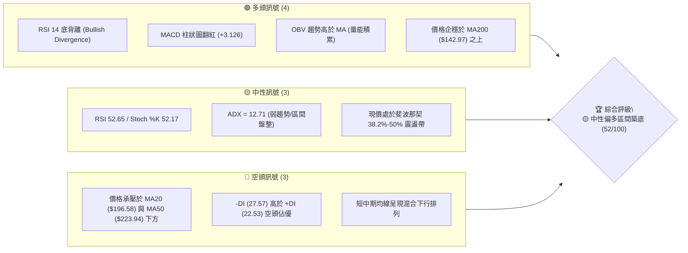
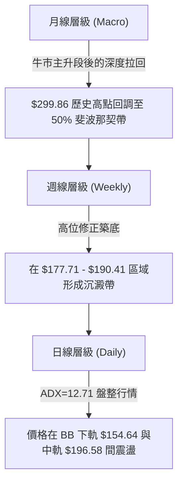
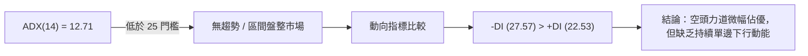
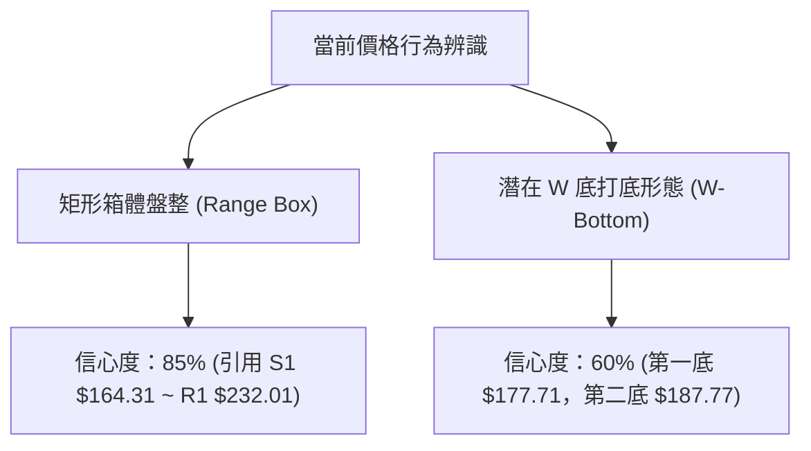
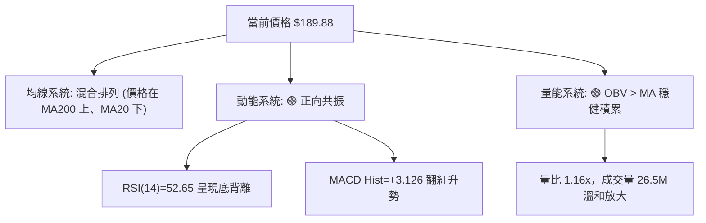
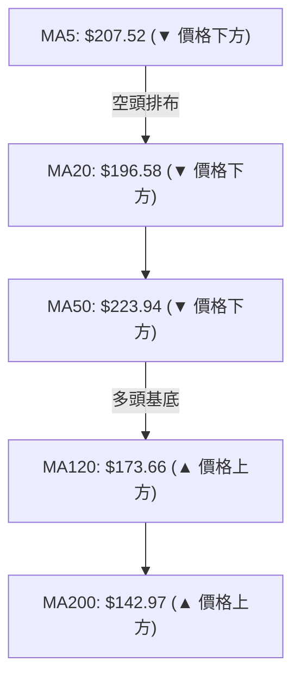
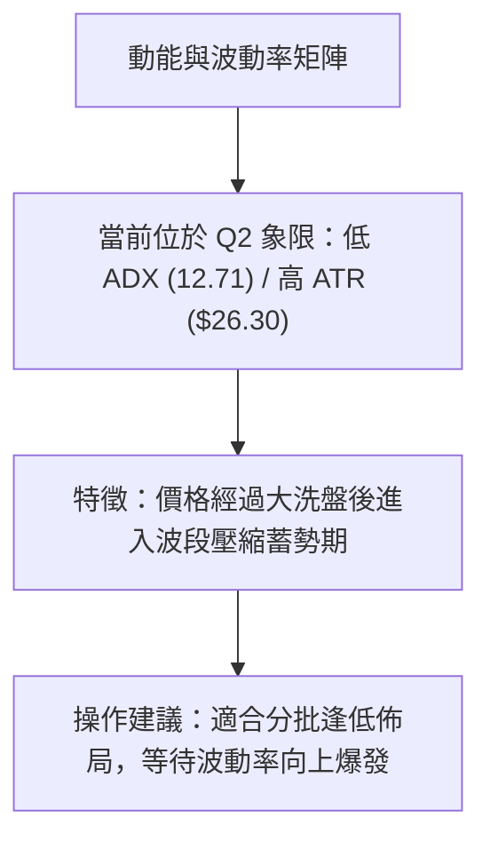
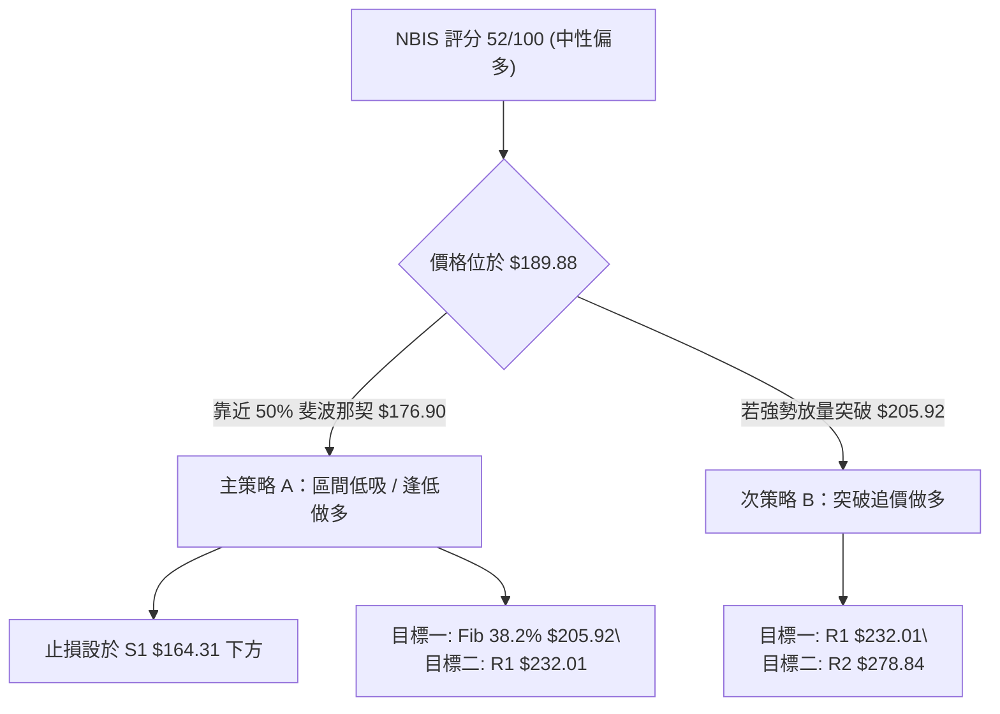
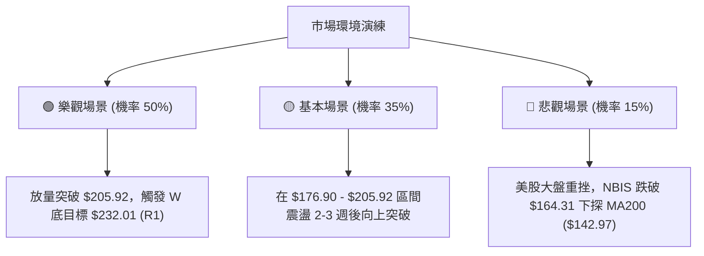

# NBIS 技術分析報告

> **報告日期**：2026-08-07 ｜ **語言**：繁體中文 ｜ **數據來源**：Yahoo Finance ｜ **當前價格**：$189.88

---

## 目錄

| 章節 | 內容 |
|------|------|
| [1. 技術面概覽](#1-技術面概覽) | 訊號儀表板、核心指標、評分卡 |
| [2. 趨勢分析](#2-趨勢分析) | 多時框趨勢、長中短期走勢、ADX強弱判斷 |
| [3. 圖表形態分析](#3-圖表形態分析) | 形態識別信心度、K線組合、目標價推算 |
| [4. 支撐與阻力](#4-支撐與阻力) | 關鍵價位結構、斐波那契回調層級分析 |
| [5. 技術指標深度解讀](#5-技術指標深度解讀) | MA/RSI底背離/MACD柱狀圖/布林通道/OBV量能 |
| [6. 動能與波動率](#6-動能與波動率) | 動能四象限、ATR波動風險、Beta度量 |
| [7. 多時框架總結](#7-多時框架總結) | 時框架評分矩陣、多時框收斂定調 |
| [8. 交易策略建議](#8-交易策略建議) | 策略路由、情境階梯、進出場與風報比劃分 |
| [9. 風險提示與監控](#9-風險提示與監控) | 監控指標Checklist、風控三情境演練 |

---

## 1. 技術面概覽

### 🎯 技術訊號儀表板



---

### 📊 核心指標速覽表

| 指標類別 | 指標名稱 | 當前數值 | 訊號 | 技術面精確解讀 |
|----------|----------|----------|------|----------------|
| **價格** | 當前收盤價 | $189.88 | 🟡 | 位於52週高低區間 55.3% 位置，短線處於回檔後的尋求支撐期 |
| **均線** | MA20 (月線) | $196.58 | 🔴 | 價格位於 MA20 下方 (-3.41%)，短期反彈面臨第一道動態壓力 |
| **均線** | MA50 (季線) | $223.94 | 🔴 | 價格位於 MA50 下方 (-15.21%)，中期趨勢呈現受壓修正形態 |
| **均線** | MA200 (年線)| $142.97 | 🟢 | 價格遠高於 MA200 (+32.81%)，長期牛市基底依然堅實 |
| **動能** | RSI(14) | 52.65 | 🟢 | 中性區間運作，且日/週線層級出現明確的「底背離」過渡訊號 |
| **動能** | MACD(12,26,9)| -4.969 | 🟢 | MACD柱狀圖翻紅(+3.126)，快慢線低位拐頭，具備金叉反彈契機 |
| **趨勢** | ADX(14) | 12.71 | 🟡 | ADX < 25 屬無趨勢/盤整行情，以布林帶與區間區塊操作為主 |
| **波動** | ATR(14) | $26.30 | 🔴 | 每日平均波動幅度高達 13.85%，屬於高波動、高槓桿性質標的 |

---

### 🏆 技術評分卡

```
╔══════════════════════════════════════════════════════════════════╗
║                   技術評分卡 — NBIS (2026-08-07)                 ║
╠══════════════════════════════════════════════════════════════════╣
║  趨勢強度      ▓▓▓▓▓▓░░░░░░░░░░░░░░  30/100  🔴 (ADX=12.71 弱)   ║
║  動能指標      ▓▓▓▓▓▓▓▓▓▓▓▓▓░░░░░░░  65/100  🟢 (RSI底背離+柱狀圖) ║
║  支撐穩定度    ▓▓▓▓▓▓▓▓▓▓▓▓▓▓░░░░░░  70/100  🟢 (斐波那契50%/S1) ║
║  成交量配合    ▓▓▓▓▓▓▓▓▓▓▓▓▓░░░░░░░  65/100  🟢 (OBV>MA 帶量築底)║
║  形態完整度    ▓▓▓▓▓▓▓▓▓▓░░░░░░░░░░  50/100  🟡 (區間箱體打底)   ║
║  均線排列      ▓▓▓▓▓▓▓▓░░░░░░░░░░░░  40/100  🔴 (短中期承壓)     ║
╠══════════════════════════════════════════════════════════════════╣
║  綜合評分      ▓▓▓▓▓▓▓▓▓▓▓░░░░░░░░░  52/100  🟡 中性觀望/低吸反彈║
╚══════════════════════════════════════════════════════════════════╝
```

---

## 2. 趨勢分析

### 🌐 多時框趨勢分析



---

### 📈 長期趨勢 — 24個月歷史走勢圖（Unicode 視覺化）

```
NBIS 歷史走勢圖（2024-10 至 2026-08）
價格軸 ($)
$300 ┤                                                    ● $299.86 (52W High)
$270 ┤                                               ● $276.17
$240 ┤                                           ● $231.09
$210 ┤                                  ● $219.94             ● $189.88 (現價)
$180 ┤                                 ╱                      █
$150 ┤                            ● $138.23
$120 ┤                     ● $112.27
$90  ┤               ● $91.19
$60  ┤          ● $55.33 (52W Low $53.95)
$30  ┤● $21.38
     └────────────────────────────────────────────────────────────────────────►
      24/10  25/01  25/06  25/09  25/12  26/03  26/05  26/06  26/07  26/08
```

#### 走勢特徵階段性分析表

| 時間階段 | 價格區間 | 漲跌幅 | 走勢特徵與技術含義 |
|----------|----------|--------|--------------------|
| **2024-10 ~ 2025-04** | $21.38 ➔ $22.73 | +6.31% | **築底醞釀期**：低位窄幅震盪，成交量低迷，籌碼高度集中。 |
| **2025-05 ~ 2025-10** | $36.75 ➔ $130.82| +255.97%| **第一主升段**：AI算力需求爆發，突破MA200後開啟單邊牛市。 |
| **2025-11 ~ 2026-02** | $94.87 ➔ $91.19 | -3.88% | **高位二次回檔**：獲利回吐壓制，於 $83.71 形成中期堅實底部。 |
| **2026-03 ~ 2026-06** | $103.76 ➔ $276.17| +166.16%| **第二主升段**：強烈買盤推升至創歷史新高 $299.86。 |
| **2026-07 ~ 2026-08** | $190.41 ➔ $189.88| -31.25%| **深度修正與築底期**：自高點回撤近 36.7%，目前於 $180-$190 區間尋求支撐。 |

---

### 📊 中期趨勢（週線分析）

在近 20 週的收盤走勢中，NBIS 經歷了從 2026-06-21 最高收盤價 $286.69（盤中觸及 52 週高點 $299.86）的迅猛回落，於 2026-07-19 下探至最低點區間 $177.71。目前週線在 $187.77 - $190.41 區域出現連續 3 週的縮量橫盤止跌特徵。

```
週線支撐阻力結構示意圖
$299.86 ────────────────────────────────────────────── [52W 歷史高點 R3]
$278.84 ────────────────────────────────────────────── [波段高點阻力 R2]
$232.01 ────────────────────────────────────────────── [前波強阻力 R1]
$205.92 ────────────────────────────────────────────── [斐波那契 38.2% 關鍵分水嶺]
$189.88 ◄───────────────────────────────────────────── [當前收盤價]
$176.90 ────────────────────────────────────────────── [斐波那契 50.0% 關鍵支撐]
$164.31 ────────────────────────────────────────────── [近一年波段低點聚類 S1]
$145.80 ────────────────────────────────────────────── [強支撐位 / MA200 支撐帶 S2]
```

---

### ⚡ 趨勢強度評估（ADX 解讀）



#### ADX 趨勢強度指標狀態對照表

| 指標項 | 當前數值 | 評估標準 | 趨勢狀態與交易對策 |
|--------|----------|----------|--------------------|
| **ADX(14)** | **12.71** | < 25 (無趨勢) | **無趨勢盤整**：突破追價策略易受挫，應採用布林帶上下軌高拋低吸策略。 |
| **+DI** | **22.53** | 多頭買盤力道 | 買盤力道收斂，尚未形成多頭主導。 |
| **-DI** | **27.57** | 空頭賣盤力道 | 賣壓雖高於買盤，但未能有效推動 ADX 擴張，顯示空頭續航力不足。 |

---

## 3. 圖表形態分析

### 🔍 形態識別系統

根據近 6 個月的日線與週線價格行為，NBIS 當前正處於 **雙重底（W-Bottom）潛在打底** 與 **矩形箱體盤整（Range Box）** 的交疊形態中。



#### 形態評估與信心度矩陣表

| 形態名稱 | 信心度 | 判斷依據（引用數據） | 完成度 | 目標價計算式與精確數值 |
|----------|--------|----------------------|--------|------------------------|
| **矩形箱體盤整** | **85%** | 價格於 S1 $164.31 與 R1 $232.01 之間進行區間震盪，ADX=12.71 印證無趨勢特徵 | 75% | 箱體突破目標 = R1 $232.01 + (R1 $232.01 - S1 $164.31) = **$299.71**（高度契合 52W 高點 $299.86） |
| **潛在 W 底 (雙底)** | **60%** | 2026-07-19 探低 $177.71 為第一底，2026-07-26 於 $187.77 築出第二底， neck 位於 38.2% 斐波那契 $205.92 | 50% | 頸線突破目標 = 頸線 $205.92 + (頸線 $205.92 - 低點 $177.71) = **$234.13**（接近 R1 $232.01） |
| **頭肩頂 / 雙頂** | **20%** | 雖自 $299.86 拉回，但跌幅已在 50% 斐波那契位 $176.90 獲支撐，未跌破 MA200，無頭肩頂結構 | 0% | 數據不足，不予採算 |

---

### 🕯️ 重要 K 線形態分析

| 月份/近期 | 收盤價 | K 線形態類型 | 專業技術解讀 | 多空訊號 |
|-----------|--------|--------------|--------------|----------|
| **2026-06** | $276.17 | 避雷針 / 長上影線 | 盤中衝高 $299.86 後遇強烈獲利解套賣壓，形成頂部警戒訊號。 | 🔴 看空 |
| **2026-07** | $190.41 | 大陰線 (Marubozu) | 空頭強勢貫穿 short-term MAs，直尋 50% 斐波那契支撐。 | 🔴 看空 |
| **2026-08-02**| $190.41 | 縮量十字星 (Doji) | 賣壓顯著竭盡，多空雙方在 $190 關卡達成暫時平衡。 | 🟡 中性 / 變盤 |
| **2026-08-09**| $189.88 | 下影錘子線 (Hammer) | 盤中向下試探 $177.71 支撐後迅速被買盤拉回，顯示下方支撐力道強勁。 | 🟢 看多反彈 |

---

### 📉 ASCII 走勢形態示意圖（W 底與箱體結構）

```
NBIS 箱體震盪與潛在 W 底打底示意圖
$232.01 ┼─────────────────────────────────────────────── [箱體頂部 / R1 阻力]
        │                   ▲ (頸線預估 $205.92)
$205.92 ┼───────────────────┼─────────────────────────── [斐波那契 38.2%]
        │        ●          │          ● (現價 $189.88)
$189.88 ┼───────╱─╲─────────┼─────────╱───────────────── [當前位置]
        │      ╱   ╲        │        ╱
$176.90 ┼─────╱─────╲───────┼───────╱─────────────────── [第一底 / 50% 斐波那契]
        │    ●       ╲     ●       ╱  (第二底 $187.77)
$164.31 ┴─── $177.71 ──┴── $187.77 ───────────────────── [箱體底部 / S1 支撐]
```

---

## 4. 支撐與阻力

### 🗺️ 關鍵價位分布圖

```
NBIS 價位結構分布圖 (由 OHLCV 與斐波那契計算)
═══════════════════════════════════════════════════════════════════
$299.86 ║██████████████████████████████████████████║ 52W 高點 / 歷史阻力 R3
$278.84 ║██████████████████████████████████        ║ 強阻力區塊 R2
$241.83 ║▓▓▓▓▓▓▓▓▓▓▓▓▓▓▓▓▓▓▓▓▓▓▓▓▓▓                ║ 斐波那契 23.6% 回調位
$232.01 ║████████████████████████                  ║ 近一年波段高點聚類 R1
$205.92 ║▓▓▓▓▓▓▓▓▓▓▓▓▓▓▓▓                          ║ 斐波那契 38.2% (第一重轉強點)
$189.88 ╠══════════════════════════════════════════╣ ◄ 當前收盤價 ($189.88)
$176.90 ║▓▓▓▓▓▓▓▓▓▓▓▓▓▓▓▓                          ║ 斐波那契 50.0% (核心防守線)
$164.31 ║████████████████                          ║ 波段低點聚類強支撐 S1
$147.89 ║▓▓▓▓▓▓▓▓▓▓                                ║ 斐波那契 61.8% 黄金分割點
$145.80 ║██████████                                ║ 波段低點聚類 S2 / MA200 ($142.97)
$132.70 ║██████                                    ║ 極端支撐位 S3
═══════════════════════════════════════════════════════════════════
```

---

### 🚧 阻力位分析表

| 阻力級別 | 精確價位 | 形成原因與技術背景 | 突破難度 | 戰略重要性 |
|----------|----------|--------------------|----------|------------|
| **阻力 R1** | **$232.01** | 近一年波段高點密集聚類區、MA50 ($223.94) 動態阻力重疊區 | █▓░ 高 | **極高**：突破此位代表中期下降趨勢徹底扭轉，邁向牛市續漲。 |
| **阻力 R2** | **$278.84** | 2026-06 頂部爆量換手區，解套賣壓沉重 | ██░ 極高 | **中高**：挑戰歷史高點前的前哨站。 |
| **阻力 R3** | **$299.86** | 52 週最高點，心理關卡 $300整數大關 | ███ 頂級 | **極高**：歷史新高天花板，需巨量配合方可突破。 |

---

### 🛡️ 支撐位分析表

| 支撐級別 | 精確價位 | 形成原因與技術背景 | 守住機率 | 戰略重要性 |
|----------|----------|--------------------|----------|------------|
| **支撐 S1** | **$164.31** | 近一年波段低點聚類，與布林通道下軌 ($154.64) 構成密集買盤帶 | ▓▓█ 80% | **極高**：多頭反彈的短期防線，跌破將引發技術性停損。 |
| **支撐 S2** | **$145.80** | 波段低點聚類，且與長期生命線 MA200 ($142.97) 重合 | ▓▓█ 90% | **核心**：牛熊分界線，長期機構大盤建倉成本區。 |
| **支撐 S3** | **$132.70** | 2026-04 起漲點與 MA240 ($135.69) 的極端防守位 | ▓▓█ 95% | **底線**：極端避險情境下的最終防線。 |

---

### 📐 斐波那契回調位分析（52週區間 $53.95 ➔ $299.86）

```
斐波那契層級落點分析
0.0%  ------------------------------------ $299.86 (52W High)
23.6% ------------------------------------ $241.83
38.2% ------------------------------------ $205.92  ▲ 上方第一阻力分水嶺
      [現價 $189.88 運行於 38.2% 與 50.0% 之間]
50.0% ------------------------------------ $176.90  ▼ 下方核心關鍵支撐
61.8% ------------------------------------ $147.89
78.6% ------------------------------------ $106.57
100.0%------------------------------------ $53.95 (52W Low)
```

**解讀**：
當前價格 **$189.88** 精確運行於 **50.0% 回調位 ($176.90)** 與 **38.2% 回調位 ($205.92)** 之間的關鍵黃金箱體。在技術分析中，強勢股票在經歷大升幅後，於 50.0% 處獲得有效支撐並展開橫盤築底，屬於非常健康的中期籌碼換手特徵。只要價格守住 $176.90，多頭架構未被破壞。

---

## 5. 技術指標深度解讀

### 🎛️ 指標訊號總覽與多空匯聚



---

### 📈 移動平均線 (MA) 排列分析



**均線狀態解讀**：
*   **短期均線（MA5 $207.52, MA10 $191.96, MA20 $196.58）**：呈現向下彎頭，對現價形成直接壓制，短線需放量站回 MA20 ($196.58) 方能化解下行慣性。
*   **長期均線（MA120 $173.66, MA200 $142.97, MA240 $135.69）**：保持陡峭的上行角度，MA120 與 50% 斐波那契位 ($176.90) 形成強烈的雙重支撐合力。

---

### 📉 RSI(14) 分析與底背離驗證

- **當前 RSI(14)**：`52.65` (中性偏多區間)
- **進度條**：`███████████░░░░░░░░░ 52.65%`

```
RSI 底背離 (Bullish Divergence) 結構示意圖
價格走勢： 2026-07-19 [$177.71]  ───►  2026-08-09 [$189.88] (突破微高/企穩)
                  ▼                          ▲
RSI 指標： 2026-07-12 [ 32.2 ]   ───►  2026-08-09 [ 52.7 ]  (顯著抬升 🟢)
```

**背離結論**：
**存在明確的日/週線層級底背離（Bullish Divergence）**。當價格在 7 月中旬下探 $177.71 時，RSI 創下 32.2 的波段低點；隨後價格雖維持在 $180-$190 低位震盪，RSI 卻已顯著回升至 52.65。這代表賣力已顯著衰竭，內部動能正在重新積聚，是經典的**趨勢反轉預警訊號**。

---

### 📊 MACD (12, 26, 9) 訊號解讀

- **MACD 線**：`-4.969`
- **Signal 線**：`-8.095`
- **MACD Histogram**：`+3.126` 🟢

```
MACD 柱狀圖翻紅走勢
2026-07-19: -7.680  ████████ (空頭鼎盛)
2026-07-26: -0.596  █
2026-08-02: -1.373  █
2026-08-09: +3.126  ▓▓▓ (翻紅多頭柱 🟢)
```

**解讀**：
MACD 柱狀圖已由負轉正（+3.126），且 MACD 線已在零軸下方向上穿越 Signal 線完成低位金叉。這確認了短線動能已轉由多頭主導，反彈行情正在展開。

---

### 📦 布林通道 (Bollinger Bands) 分析

```
布林通道價位位元圖
$238.51 ────────────────────────────────────────────── 上軌 (Upper Band)
        │
$196.58 ────────────────────────────────────────────── 中軌 (MA20)
        │  ★ 現價 $189.88 (%B = 0.42)
$154.64 ────────────────────────────────────────────── 下軌 (Lower Band)
```

*   **BB 上軌**：$238.51
*   **BB 中軌 (MA20)**：$196.58
*   **BB 下軌**：$154.64
*   **BB %B**：`0.42`（處於下軌與中軌之間，偏向中軌壓縮區）
*   **帶寬解讀**：布林通道經歷前期劇烈擴張後開始收斂，代表價格進入低波動壓縮期，即將選擇方向。現價 $189.88 離中軌 $196.58 僅步履之遙，向上突破中軌即打開邁向上軌 $238.51 的空間。

---

### 💹 成交量與 OBV 分析

*   **最新成交量**：26,549,300 股
*   **20 日均量**：22,922,385 股（量比 **1.16x**，呈現溫和放量）
*   **50 日均量**：20,082,188 股
*   **OBV 狀態**：`OBV > MA` 🟢

**量價配合評估**：
在 2026-08-02 至 2026-08-09 期間，週成交量達到 9,230萬至 1.54 億股的高位水準，但價格未再創新低，顯示有長期主力機構在 $180-$190 區間進行積極吸籌（Accumulation）。OBV 線高於其均線，印證資金淨流入，量能結構高度支持價格向上反彈。

---

## 6. 動能與波動率

### ⚡ 動能評估四象限

| 象限分區 | 動能強度 (Momentum) | 波動率 (Volatility) | 當前 NBIS 狀態 | 戰略意涵 |
|----------|---------------------|---------------------|----------------|----------|
| **Q1 (高動能/低波動)** | 強 | 低 | — | 最佳趨勢加碼區 |
| **Q2 (低動能/低波動)** | 弱 | 低 | **✓ 沉澱區 (當前位置)** | **高勝率建倉區**：ADX=12.71，波動收縮，蓄勢待發 |
| **Q3 (高動能/高波動)** | 強 | 高 | — | 主升段突破追價區 |
| **Q4 (低動能/高波動)** | 弱 | 高 | — | 高風險多殺多洗盤區 |



---

### 📊 ATR 波動率與止損風控

*   **ATR(14)**：`$26.30`（佔當前股價 **13.85%**）
*   **波動性評估**：NBIS 屬於極高波動性個股，日均波幅達 $26.30。

#### 基於 ATR 的動態風控參數表

| 風控參數項 | 乘數 | 計算價位 / 距離 | 交易實戰應用 |
|------------|------|-----------------|--------------|
| **緊密止損距離** | 1.0 × ATR | $26.30 | 日內短線交易止損設定 |
| **標準波段止損距離** | 1.5 × ATR | $39.45 | 波段多頭持倉風控基準（由現價 $189.88 扣除得 $150.43，接近 S2） |
| **寬鬆風控距離** | 2.0 × ATR | $52.60 | 長線趨勢投資防守距離 |

---

### 📐 Beta 與市場相關性

*   **Beta 係數**：`1.434`
*   **屬性**：高 Beta 成長型/科技屬性股票，對美股科技大盤（如 QQQ、SOXX）的波動具有 1.43 倍的放大效應。大盤走強時 NBIS 將具備強烈的向上彈性。

---

## 7. 多時框架總結

### 📋 時框架評分表

| 時框架 | 趨勢方向 | 動能指標 | 均線排列 | 形態結構 | 綜合評分 | 戰略建議 |
|--------|----------|----------|----------|----------|----------|----------|
| **月線 (Macro)** | 🟢 長牛趨勢 | 🟢 位於強勢區 | 🟢 多頭排列 | 頂部回調尋找支撐 | **75/100** | 長線維持逢低買入策略 |
| **週線 (Weekly)**| 🟡 橫盤築底 | 🟢 RSI底背離 | 🟡 混合排列 | 箱體下軌打底 ($176-$190) | **58/100** | 中線尋求築底確立訊號 |
| **日線 (Daily)** | 🟡 區間盤整 | 🟢 MACD柱狀翻紅 | 🔴 承壓於MA20 | 潛在 W 底打底 | **52/100** | 短線高拋低吸/突破追價 |

---

### 🔲 綜合訊號矩陣

```
時框架與指標共振矩陣
───────────────────────────────────────────────────────────────────
時框架     均線系統     RSI / MACD     布林通道      OBV量能     綜合訊號
───────────────────────────────────────────────────────────────────
月線       🟢 看多      🟢 中性偏多    🟢 上軌運作   🟢 強勢     🟢 強力看多
週線       🟡 中性      🟢 底背離      🟡 下軌築底   🟢 淨流入   🟢 偏多築底
日線       🔴 承壓      🟢 柱狀圖翻紅  🟡 中下軌間   🟢 溫和放量 🟡 區間反彈
───────────────────────────────────────────────────────────────────
```

---

### ⚖️ 多時框收斂結論

依據多時框收斂規則：
1. **行情定性**：當前 **ADX(14) = 12.71 (< 25)**，明確定義當前為**盤整/無趨勢行情**。
2. **主導時框與交易區間**：盤整行情以日線與週線布林通道區間為主要參考。主要交易區間鎖定於 **布林通道下軌/50%斐波那契帶 ($164.31 - $176.90)** 至 **布林通道上軌/波段阻力 R1 ($232.01 - $238.51)**。
3. **最終收斂方向**：**🟡 中性偏多（低吸反彈策略）**。儘管短線均線承壓，但週線底背離與 MACD 低位金叉提供強烈的向下下行墊高（Higher Low）依據，策略應以「逢低佈局反彈」為主導，絕不可在 $180-$190 低位盲目做空。

---

## 8. 交易策略建議

### 🗺️ 策略決策流程圖



---

### 🧭 策略路由

*   **當前主策略方向**：**🟢 做多（區間低吸與底背離反彈策略）**
*   **依據**：綜合評分為 **52/100**，且 ADX<25 處於區間低位，RSI 出現強烈底背離，MACD 柱狀圖翻紅，下行空間受限於 S1 $164.31 / Fib 50% $176.90，具備極高盈虧比之做多機會。

---

### 🎯 價格情境階梯 (Price Scenarios)

| 觸發條件 | 下一目標價位 | 後續延伸目標 | 情境含義與技術解讀 |
|----------|--------------|--------------|--------------------|
| **強勢突破 R1 $232.01** | R2 **$278.84** | R3 **$299.86** | 區間箱體頂部突破，開啟新一輪主升段行情。 |
| **突破 38.2% 斐波那契 $205.92** | R1 **$232.01** | R2 **$278.84** | 短線轉強，站穩 MA20 與 MA50，W 底形態成立。 |
| **當前價格區間 ($180 - $190)** | Fib 38.2% **$205.92** | Fib 50% **$176.90** | **現階段箱體築底震盪**，積聚換手動能。 |
| **跌破 50% 斐波那契 $176.90** | S1 **$164.31** | S2 **$145.80** | 短線尋求更深層支撐，測試布林帶下軌與 MA200。 |

---

### 📊 情境機率分佈

```
情境機率分佈柱狀圖
🟢 築底反彈/向上突破 [$205.92-$232.01]  ▓▓▓▓▓▓▓▓▓▓▓▓▓▓▓▓▓▓▓▓  50%
🟡 區間窄幅震盪     [$176.90-$205.92]  ▓▓▓▓▓▓▓▓▓▓▓▓▓▓░░░░░░  35%
🔴 跌破向下尋底     [<$164.31]         ▓▓▓▓▓░░░░░░░░░░░░░░░  15%
```

*   **主要依據**：RSI 底背離成立、MACD 柱狀圖翻紅（+3.126）、OBV 淨流入支持反彈（50% 機率）；ADX=12.71 顯示單邊動能尚需時間培育（35% 機率）；MA200 支撐強勁使大跌機率降至 15%。

---

### 🟢 主策略詳情

#### 策略 A：區間逢低做多策略（主推薦 - 適合當前價位）

| 策略要素 | 精確參數設定 | 數據來源與邏輯說明 |
|----------|--------------|--------------------|
| **進場區間** | **$180.00 - $189.88** | 於現價至 50% 斐波那契支撐區（$176.90）之間分批逢低佈局 |
| **第一目標價 (T1)** | **$205.92** | 38.2% 斐波那契分水嶺（預期漲幅 **+8.45%**） |
| **第二目標價 (T2)** | **$232.01** | 波段高點聚類阻力 R1 / 箱體頂部（預期漲幅 **+22.19%**） |
| **風控止損價** | **$164.31** | 跌破波段低點聚類 S1 即刻止損（最大風險 **-13.47%**） |
| **風險報酬比 (R:R)**| **1 : 1.65** (至T2) | 若於 $180.00 進場，R:R 提升至 **1 : 3.31** (風險$15.69 / 獲利$52.01) |
| **建議資金倉位** | **15% - 20%** | 高波動標的，建議採取標準波段倉位控制 |

#### 策略 B：右側突破追價策略（順勢確認型）

| 策略要素 | 精確參數設定 | 數據來源與邏輯說明 |
|----------|--------------|--------------------|
| **觸發進場條件** | **突破 $206.50** | 收盤價有效突破 38.2% 斐波那契位 $205.92 且成交量增長 >1.3x |
| **第一目標價 (T1)** | **$232.01** | 波段阻力位 R1（預期漲幅 **+12.35%**） |
| **第二目標價 (T2)** | **$278.84** | 強阻力位 R2（預期漲幅 **+35.03%**） |
| **風控止損價** | **$196.58** | 跌回 MA20 / 布林中軌下方即止損退出（最大風險 **-4.80%**） |
| **風險報酬比 (R:R)**| **1 : 2.57** (至T1) / **1 : 7.29** (至T2) | 右側突破交易，具備極佳的盈虧比優勢 |
| **建議資金倉位** | **10% - 15%** | 突破確認後加碼 |

---

### 🔴 反向風險觸發點（空頭對沖提示）

若價格未如預期反彈，反而收盤**強烈跌破 S1 $164.31** 且 ADX 重新張口向上（ADX > 25），代表盤整形態失敗，轉為單邊下跌行情。多頭應立即清倉觀望，避險帳戶可考量在跌破 $164.31 時進行短線對沖，下攻目標看至 S2 **$145.80**（MA200 附近）。

---

### ⭐ 整體訊號強度評星

```
做多訊號強度：★★★★☆  (4/5 星 — RSI底背離與MACD金叉共振)
做空訊號強度：★☆☆☆☆  (1/5 星 — ADX過低，下方多重強支撐)
整體可信度：  ★★██☆  (4/5 星 — 指標數據高度收斂一致)
```

---

## 9. 風險提示與監控

### ✅ 關鍵監控指標 Checklist

```
╔══════════════════════════════════════════════════════════════════╗
║                   每日交易前監控 CheckList                       ║
╠══════════════════════════════════════════════════════════════════╣
║ [ ] 價格是否站穩 50% 斐波那契位 $176.90 之上？                  ║
║ [ ] RSI(14) 能否持續保持在 50 中軸之上（當前 52.65）？          ║
║ [ ] MACD 柱狀圖是否持續擴大（當前 +3.126）？                   ║
║ [ ] 日成交量是否維持在 20日均量 (22.9M) 之上？                  ║
║ [ ] 價格向上挑戰 MA20 ($196.58) 時是否有量能配合？              ║
║ [ ] 防守警戒線：是否觸及或跌破 S1 $164.31 止損位？             ║
╚══════════════════════════════════════════════════════════════════╝
```

---

### ⚠️ 風險場景演練



---

### 🛡️ 風險管理提醒

1. **高 ATR 波動風險**：NBIS ATR 高達 $26.30 (13.85%)，絕對不可使用高槓桿，單一標的頭寸不宜超過總投資組合的 20%。
2. **高 Short Float 壓盤與軋空風險**：空頭頭寸佔 Float高達 **28.0%**（Short Ratio 3.42）。高空頭比例意味著一旦價格突破關鍵阻力 R1 $232.01，極易觸發強烈的**軋空行情（Short Squeeze）**，推升股價直奔 R2 $278.84。

---

## 📋 報告總結

```
╔══════════════════════════════════════════════════════════════════╗
║                     NBIS 技術分析報告總結                        ║
╠══════════════════════════════════════════════════════════════════╣
║ 報告日期：2026-08-07  ｜ 當前價格：$189.88                       ║
║ 分析評級：🟡 中性偏多 (52/100) — 區間低吸 / 低檔築底反彈         ║
╠══════════════════════════════════════════════════════════════════╣
║ 關鍵技術定調：                                                   ║
║ ├─ 長期趨勢：🟢 堅守 MA200 ($142.97) 上方，長牛架構未變          ║
║ ├─ 中期趨勢：🟡 50% 斐波那契 ($176.90) 獲強支撐，進入箱體築底    ║
║ ├─ 短期動能：🟢 RSI 14 日/週線底背離 + MACD 柱狀圖翻紅 (+3.126) ║
║ ├─ 關鍵支撐：S1 $164.31 ｜ S2 $145.80 (MA200 重合帶)            ║
║ ├─ 關鍵阻力：Fib 38.2% $205.92 ｜ R1 $232.01                     ║
║ └─ 分析師共識目標價：$255.44 (潛在漲幅 +34.52%)                  ║
╠══════════════════════════════════════════════════════════════════╣
║ 最優策略路線：                                                   ║
║ 1. 🥇 最佳機會：現價區間 ($180.00-$189.88) 逢低分批建倉，         ║
║                嚴格止損 S1 $164.31，目標上看 $205.92 / $232.01。 ║
║ 2. 🥈 突破追價：待強勢收復 $205.92 後右側加碼，目標看至 $278.84。 ║
╚══════════════════════════════════════════════════════════════════╝
```

---

> ⚠️ **免責聲明**：本報告為基於量化技術指標與價格行為學之技術分析，數據均來自歷史交易紀錄。本報告**僅供研究與學術參考**，**不構成任何買賣投資建議**。投資有風險，入市需謹慎並做好嚴格風控。

---

*報告生成時間：2026-08-07 ｜ 數據來源：Yahoo Finance ｜ 分析框架：多時框技術分析系統*