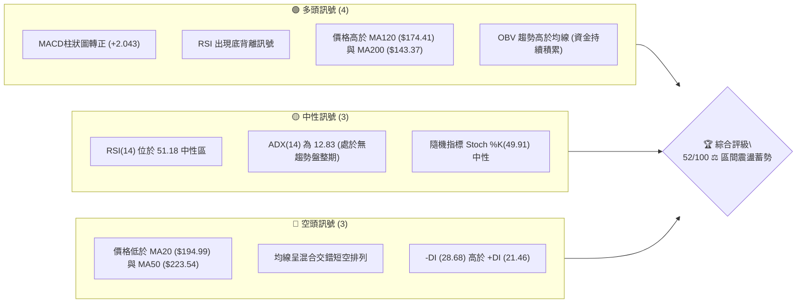
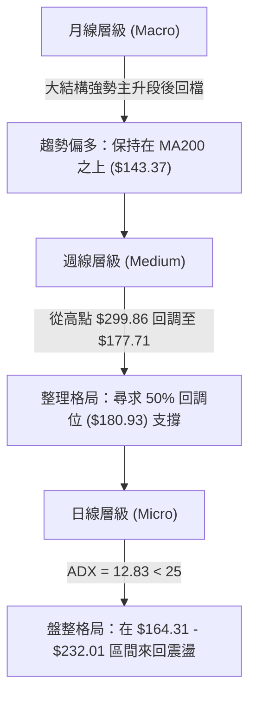
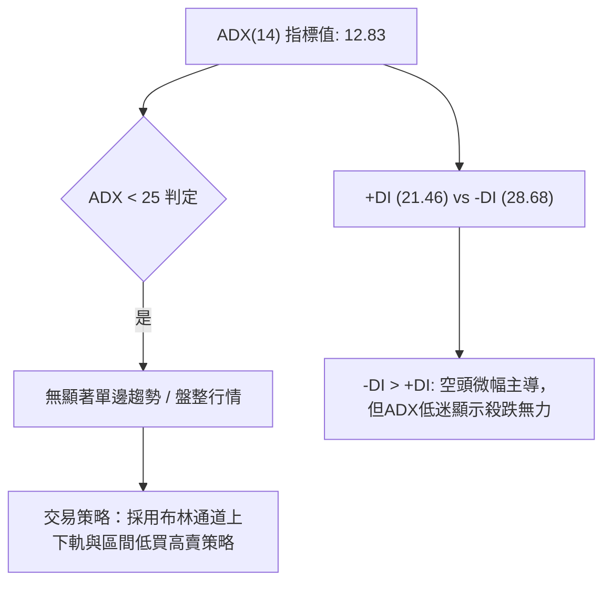
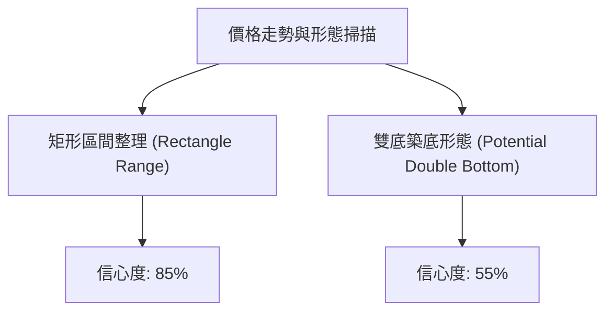
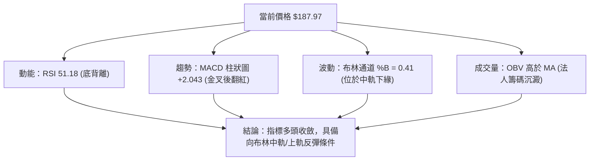
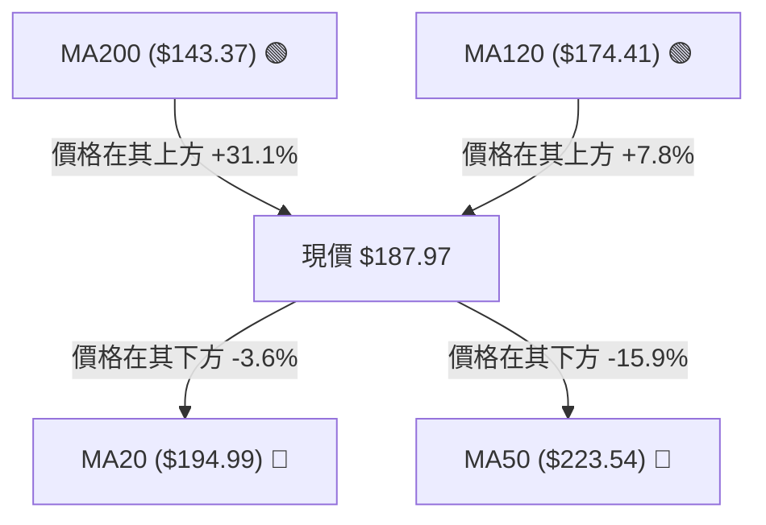
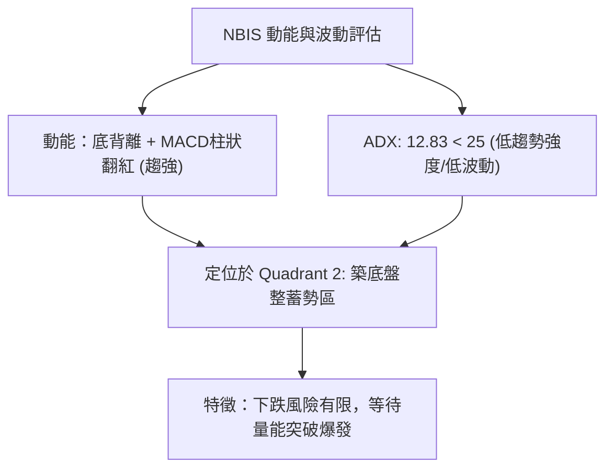
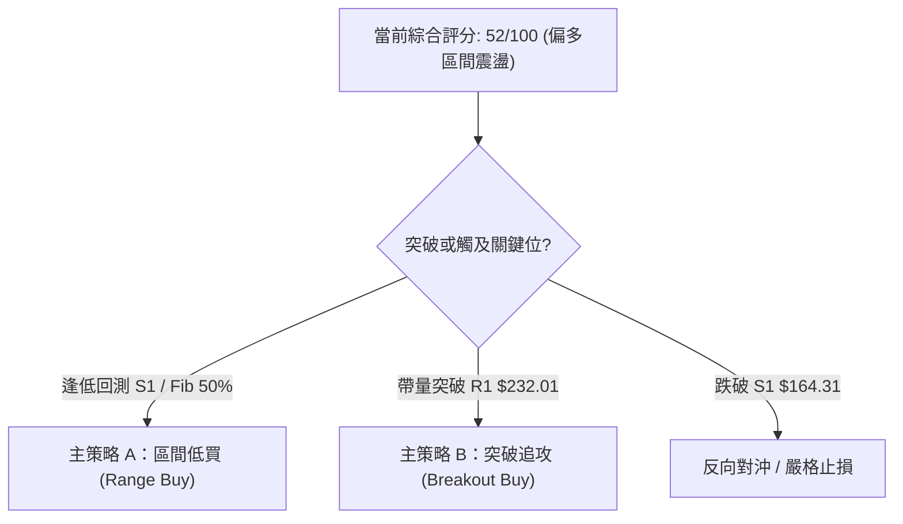
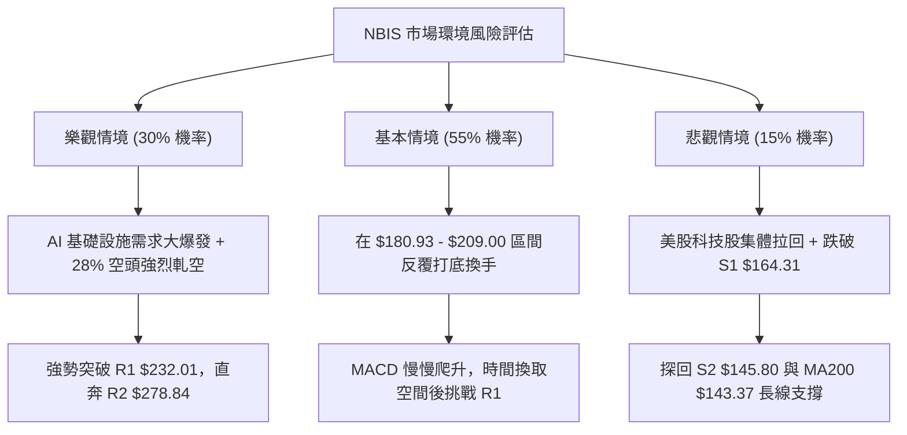

# NBIS 技術分析報告

> **報告日期**：2026-08-09 ｜ **語言**：繁體中文 ｜ **數據來源**：Yahoo Finance ｜ **當前價格**：$187.97

---

## 目錄

| 章節 | 內容 |
|------|------|
| [1. 技術面概覽](#1-技術面概覽) | 訊號儀表板、核心指標、評分卡 |
| [2. 趨勢分析](#2-趨勢分析) | 多時框趨勢、長中短期走勢 |
| [3. 圖表形態分析](#3-圖表形態分析) | 形態識別、K線組合、目標價 |
| [4. 支撐與阻力](#4-支撐與阻力) | 關鍵價位、斐波那契回調 |
| [5. 技術指標深度解讀](#5-技術指標深度解讀) | MA/RSI/MACD/布林/成交量 |
| [6. 動能與波動率](#6-動能與波動率) | 動能評估、ATR、Beta |
| [7. 多時框架總結](#7-多時框架總結) | 時框架評分矩陣 |
| [8. 交易策略建議](#8-交易策略建議) | 多空策略、風險報酬比 |
| [9. 風險提示與監控](#9-風險提示與監控) | 監控指標、風險場景 |

---

## 1. 技術面概覽

### 🎯 技術訊號儀表板



### 📊 核心指標速覽表

| 指標類別 | 指標名稱 | 當前數值 | 訊號 | 解讀 |
|----------|----------|----------|------|------|
| **價格** | 當前價格 | $187.97 | 🟡 中性 | 位於 52 週高低區間 53.0% 位置，短線探底回升 |
| **均線** | MA20 | $194.99 | 🔴 空頭 | 價格在 MA20 下方 (-3.60%)，面臨短期動能反壓 |
| **均線** | MA50 | $223.54 | 🔴 空頭 | 價格在 MA50 下方 (-15.91%)，中期趨勢承壓 |
| **均線** | MA200 | $143.37 | 🟢 多頭 | 價格遠高於 MA200 (+31.11%)，長期牛市基底穩固 |
| **動能** | RSI(14) | 51.18 | 🟢 多頭 | 擺脫超賣區，形成典型「底背離」，反彈動能凝聚 |
| **動能** | MACD | -5.540 (柱狀 +2.043) | 🟢 多頭 | 快慢線於零軸下金叉，Histogram 連續翻紅看多 |
| **波動** | ATR(14) | $26.32 (14.00%) | 🔴 高波動 | 每日平均波動高達 14%，需放大止損空間 |

### 🏆 技術評分卡

```
╔══════════════════════════════════════════════════════════════════╗
║                   技術評分卡 — NBIS (2026-08-09)                 ║
╠══════════════════════════════════════════════════════════════════╣
║ 趨勢強度      ▓▓▓▓▓░░░░░░░░░░░░░░░  35/100  🟡 弱趨勢/盤整        ║
║ 動能指標      ▓▓▓▓▓▓▓▓▓▓▓░░░░░░░░░  58/100  🟢 底背離柱狀翻紅    ║
║ 支撐穩定度    ▓▓▓▓▓▓▓▓▓▓▓▓▓░░░░░░░  65/100  🟢 50%斐波那契守住   ║
║ 成交量配合    ▓▓▓▓▓▓▓▓▓▓▓░░░░░░░░░  55/100  🟢 OBV展現護盤積累   ║
║ 形態完整度    ▓▓▓▓▓▓▓▓▓▓░░░░░░░░░░  50/100  🟡 矩形區間打底中    ║
║ 均線排列      ▓▓▓▓▓▓▓▓░░░░░░░░░░░░  48/100  🔴 短均回壓長均支撐  ║
╠══════════════════════════════════════════════════════════════════╣
║ 綜合評分      ▓▓▓▓▓▓▓▓▓▓░░░░░░░░░░  52/100  ⚖️ 中性觀望/區間震盪 ║
╚══════════════════════════════════════════════════════════════════╝
```

---

## 2. 趨勢分析

### 🌐 多時框趨勢分析



### 📈 長期趨勢 — 12個月走勢圖（Unicode）

```
NBIS 月線歷史走勢圖（2025-09 至 2026-08）
價格軸 ($)
$300 ┤                                        ● $299.86 (52W High)
$270 ┤                                     ● $276.17
$240 ┤                              ● $231.09
$210 ┤                                                 ● $190.41  ● $187.97 (現價)
$180 ┤                       ● $138.23
$150 ┤                ● $130.82
$120 ┤ ● $112.27
$90  ┤         ● $94.87 ● $85.19   ● $103.76
$60  ┤ ● $62.01 (52W Low)
     └─┬───────┬───────┬───────┬───────┬───────┬───────┬───────┬───────► 月份
     25-09   25-11   26-01   26-03   26-05   26-06   26-07   26-08
```

#### 走勢特徵分析表格

| 階段 | 期間 | 價格變動區間 | 漲跌幅 | 走勢特徵描述 |
|------|------|--------------|--------|--------------|
| **起漲爆發期** | 2025-09 ~ 2025-10 | $68.32 → $130.82 | +91.48% | 成交量急增，主力資金大幅建倉突破 |
| **中途回檔洗盤** | 2025-11 ~ 2026-01 | $130.82 → $85.19 | -34.88% | 縮量拉回測試 $85 區域支撐，籌碼洗淨 |
| **主升段飆升期** | 2026-02 ~ 2026-06 | $91.19 → $276.17 | +202.85% | 形成強烈主升浪，於 2026 年 6 月創下 52 週新高 $299.86 |
| **高位獲利回吐** | 2026-07 ~ 2026-08 | $276.17 → $187.97 | -31.93% | 高點大幅回撤，回測 50% 斐波那契黃金切割位 $180.93 |

### 📊 中期趨勢（週線分析）

從近 20 週數據觀察，NBIS 在 2026 年 6 月下旬衝高至 $286.69（歷史高點 $299.86 附近）後，出現快速修正，於 2026 年 7 月 19 日當週下探至 $177.71 低點。隨後三週，價格在 $177.71 ~ $190.41 之間築底，週 RSI 自 32.2 超賣區回升至 51.2，週 MACD 柱狀圖亦由 -7.680 大幅收斂至 +2.043，顯示中期下行動能已顯著衰減，中期修正漸趨尾聲。

### ⚡ 趨勢強度評估（ADX 解讀）



| ADX 區間 | 當前數值 | 行情性質 | 策略指導 |
|----------|----------|----------|----------|
| 0 - 20 | **12.83** | **極弱趨勢 / 無方向盤整** | **嚴格遵守區間操作，避免追漲殺跌** |
| 20 - 25 | - | 趨勢醞釀期 | 觀望突破方向 |
| 25 - 50 | - | 強勁趨勢行情 | 順勢單邊操作 |

---

## 3. 圖表形態分析

### 🔍 形態識別系統



#### 形態信心度與目標價評估表

| 形態名稱 | 信心度 | 判斷依據（引用數據） | 完成度 | 目標價（附計算式） |
|----------|--------|----------------------|--------|--------------------|
| **矩形震盪區間** | **85%** | 價格受限於支撐 S1 ($164.31) 與阻力 R1 ($232.01) 之間 | 90% | 區間頂部：**$232.01** |
| **雙重底反彈** | **55%** | 第一低點 2026-07-19 ($177.71)，第二低點 2026-07-26 ($187.77)，頸線為 R1 ($232.01) | 40% | 頸線 $232.01 + 形態高度 ($232.01 - $177.71 = $54.30) = **$286.31** |

### 🕯️ 重要K線形態分析

| 日期/週 | 收盤價 | K線形態 | 解讀 | 訊號 |
|---------|--------|---------|------|------|
| 2026-07-19 | $177.71 | 長下影陰線 | 探底至 $177.71 獲強烈買盤支撐，為短線築底訊號 | 🟢 看多止跌 |
| 2026-07-26 | $187.77 | 中陽線覆蓋 | 止跌回升，確立 $177-$180 區域買盤強勁 | 🟢 買盤確立 |
| 2026-08-02 | $190.41 | 爆量十字星 (1.54億股) | 主力資金換手劇烈，高成交量未下挫，顯示籌碼轉移 | 🟡 換手蓄勢 |
| 2026-08-09 | $187.97 | 縮量微幅震盪 | 價格在 $187 附近鞏固，等待方向突破 | 🟡 中性鞏固 |

### 📉 ASCII 走勢形態示意圖

```
NBIS 矩形整理與雙底架構示意圖
阻力區 R1 ───────────────────────────────────────── $232.01 (頸線位 / 區間頂)
                                  ▲
                                 / \
                                /   \
                               /     \
現價位 ───────────────────────●───────●─────────────── $187.97 (突破中軸)
                            /   \   /
                           /     \ /
支撐區 S1 ────────────────●───────●───────────────── $164.31 - $177.71 (雙底區域)
                        低點1   低點2
                      ($177.71) ($187.77)
```

### 🎯 形態目標價計算

1. **矩形區間反彈目標**：
   - 區間底界：取近週低點聚類與 S1 $164.31 之間的平衡點約 $177.71。
   - 區間頂界：阻力位 R1 = **$232.01**。
   - **目標價**：**$232.01**。

2. **雙重底（Double Bottom）高度推算**：
   - 形態頸線：R1 = $232.01
   - 形態低點：$177.71
   - 形態高度：$232.01 - $177.71 = $54.30
   - **形態突破目標價**：$232.01 + $54.30 = **$286.31**（接近阻力位 R2 $278.84 區域）。

---

## 4. 支撐與阻力

### 🗺️ 關鍵價位分布圖（Unicode）

```
NBIS 價位結構分布圖
═════════════════════════════════════════════════════════════════════
$299.86 ║████████████████████████████████████████║ 52週歷史高點 / R3
$278.84 ║████████████████████████████████        ║ 波段高點聚類 R2
$243.73 ║▓▓▓▓▓▓▓▓▓▓▓▓▓▓▓▓▓▓▓▓▓▓▓▓                ║ 斐波那契 23.6% 回調位
$232.01 ║████████████████████████████            ║ 關鍵波段高點阻力 R1 / 布林上軌 $235.63
$223.54 ║────────────────────────────────────────║ MA50 中期均線壓力
$209.00 ║▓▓▓▓▓▓▓▓▓▓▓▓▓▓▓▓                        ║ 斐波那契 38.2% 回調位
$194.99 ║────────────────────────────────────────║ MA20 / 布林中軌壓力
$187.97 ╠════════════════════════════════════════╣ ◄ 當前收盤價 ($187.97)
$180.93 ║▓▓▓▓▓▓▓▓▓▓▓▓                            ║ 斐波那契 50.0% 關鍵黃金支撐位
$174.41 ║────────────────────────────────────────║ MA120 半年線強支撐
$164.31 ║████████████████                        ║ 近一年波段低點聚類支撐 S1
$154.35 ║────────────────────────────────────────║ 布林通道下軌
$152.87 ║▓▓▓▓▓▓▓▓                                ║ 斐波那契 61.8% 強力回調位
$145.80 ║██████████                              ║ 波段低點聚類支撐 S2
$143.37 ║────────────────────────────────────────║ MA200 年線長線牛熊分界線
$132.70 ║██████                                  ║ 波段低點聚類支撐 S3
═════════════════════════════════════════════════════════════════════
```

### 🚧 阻力位分析表

| 阻力級別 | 價位 | 形成原因 | 突破難度 | 重要性 |
|----------|------|----------|----------|--------|
| **R1** | **$232.01** | 近一年波段高點聚類、接近布林上軌 ($235.63) 與 MA50 ($223.54) | 🔴 高 | 關鍵反轉點，突破代表轉強 |
| **R2** | **$278.84** | 2026年6月中旬前高套牢區、近一年第二高點聚類 | 🔴 極高 | 中期波段強阻力 |
| **R3** | **$299.86** | 52週歷史最高點，整數心理關卡 | 🔴 極高 | 歷史天花板，需巨量配合 |

### 🛡️ 支撐位分析表

| 支撐級別 | 價位 | 形成原因 | 守住機率 | 重要性 |
|----------|------|----------|----------|--------|
| **S1** | **$164.31** | 近一年波段低點聚類，緊鄰 MA120 ($174.41) 與 Fib 50% ($180.93) | 🟢 80% | 短線防守核心，不容有失 |
| **S2** | **$145.80** | 近一年第二低點聚類，接近 MA200 ($143.37) 與 Fib 61.8% ($152.87) | 🟢 90% | 中長線牛熊防線 |
| **S3** | **$132.70** | 近一年波段低點聚類，MA240 ($136.18) 所在地 | 🟢 95% | 終極長線鐵板支撐 |

### 📐 斐波那契回調位分析

（基於 52 週區間 **$62.01** → **$299.86** 計算）

| 斐波那契比例 | 精確價位 | 相對當前價格 ($187.97) 距離 | 技術面解讀與意義 |
|--------------|----------|-----------------------------|------------------|
| **0.0%** | **$299.86** | +59.53% | 52 週最高價，全壓區 |
| **23.6%** | **$243.73** | +29.66% | 強勢回調防禦線 |
| **38.2%** | **$209.00** | +11.19% | 短線反彈第一目標反壓位 |
| **50.0%** | **$180.93** | -3.75% | **黃金中樞分割線**（目前現價 $187.97 穩守其上） |
| **61.8%** | **$152.87** | -18.67% | 空頭回補極限位 / 強力買盤區 |
| **78.6%** | **$112.91** | -39.93% | 深遠回調線 |
| **100.0%** | **$62.01** | -67.01% | 52 週最低價 |

**現價位置評估**：當前價格 $187.97 精確地落於 **50.0% ($180.93)** 與 **38.2% ($209.00)** 斐波那契回調位之間。50% 回調位 $180.93 提供了極具價值的技術支撐，只要收盤不破 $180.93，整體中長線多頭結構即未受破壞。

---

## 5. 技術指標深度解讀

### 🎛️ 指標訊號總覽



### 📈 移動平均線排列分析



#### 移動平均線數據對照表

| 均線週期 | 精確數值 | 價格相對距離 | 趨勢方向 | 技術面解析 |
|----------|----------|--------------|----------|------------|
| **MA5** | $207.03 | -9.21% | ▼ 下降 | 超短線快速回檔反壓 |
| **MA10** | $191.98 | -2.09% | ▼ 下降 | 短線微幅壓制，突破即可站上 |
| **MA20** | $194.99 | -3.60% | ▼ 下降 | 月線壓制，布林中軌所在 |
| **MA50** | $223.54 | -15.91% | ▼ 下降 | 季線反壓，中期多空分界 |
| **MA120** | $174.41 | +7.77% | ▲ 上升 | 半年線支撐，展現強烈買盤 |
| **MA200** | $143.37 | +31.11% | ▲ 上升 | 年線上升斜率陡峭，長牛格局未變 |

### 📉 RSI(14) 分析

- **當前 RSI 數值**：**51.18**
- **強度進度條**：███████████░░░░░░░░░ 51.18%（處於 30-70 中性擴展區）
- **背離判斷**：⚠️ **強烈底背離 (Bullish Divergence)**
  - **價格走勢**：7 月中旬價格自 $219.65 下跌至 $177.71，隨後於 8 月初二次測試 $187.77。
  - **RSI 走勢**：RSI 指標自 7 月中旬低點 **32.2** 逐步墊高至 **34.8** → **43.1** → **45.3** → **51.2**。
  - **結論**：價格創低/低位震盪，但 RSI 底部一底比一底高，典型的底背離訊號，預示空頭力竭，多頭隨時展開反攻。

### 📊 MACD(12/26/9) 訊號解讀

- **MACD 線**：-5.540
- **Signal 線**：-7.584
- **MACD 柱狀圖 (Histogram)**：**+2.043** 🟢看多
- **分析**：MACD 線已在零軸下方向上交叉 Signal 線（低位金叉），柱狀圖連續兩週擴展為正值（+2.043），顯示負向動能消退，正向修正動能正持續累積。

### 📦 布林通道分析

```
NBIS 布林通道位置示意圖
上軌 (Upper Band) ────────────────────────── $235.63  (%B = 1.0)
                                            
中軌 (MA20)       ────────────────────────── $194.99  (%B = 0.5)
現價 (Current)   ──────────────────●─────── $187.97  (%B = 0.41)
                                            
下軌 (Lower Band) ────────────────────────── $154.35  (%B = 0.0)
```

- **通道帶寬**：上軌 $235.63 與下軌 $154.35 差距 $81.28（高波動性）。
- **當前位置 (%B)**：**0.41**（落於中軌與下軌之間，偏向中軌下方）。
- **解讀**：價格自下軌 $154.35 區域獲得支撐後彈升，目前正在向中軌 $194.99 挑戰。一旦突破中軌，目標將直指上軌 $235.63。

### 💹 成交量分析（量價配合度）

- **最新成交量**：22,697,800 股
- **20 日均量**：23,491,475 股（量比 **0.97x**，量能持平健康）
- **50 日均量**：20,260,012 股
- **OBV 趨勢**：**OBV > MA** 🟢
- **分析**：在 2026 年 8 月 2 日當週，成交量急增至 154,853,200 股，價格並未急挫反而收於 $190.41，顯示有機構大資金在高換手率下進行逢低承接（Accumulation）。OBV 線維持在均線上方，確認量能正支撐價格築底。

---

## 6. 動能與波動率

### ⚡ 動能評估四象限

| 象限 | 動能強度 (RSI/MACD) | 波動率 (ADX/ATR) | 當前 NBIS 位置 | 策略定位與評估 |
|------|--------------------|------------------|----------------|----------------|
| Q1 | 強 (RSI > 60) | 高 (ADX > 25) | - | 順勢暴衝階段（暫非當前） |
| Q2 | 強 (背離向上) | 低 (ADX < 25) | **✓ 當前位置** | **築底蓄勢區：低風險佈局階段** |
| Q3 | 弱 (RSI < 40) | 高 (ADX > 25) | - | 恐慌主跌段（已過期） |
| Q4 | 弱 (動能不足) | 低 (ADX < 25) | - | 沉悶陰跌區 |



### 📊 ATR 波動率分析

- **ATR(14)**：**$26.32**
- **波幅百分比**：**14.00%**
- **止損距離建議**：由於 NBIS 每日波動幅高達 $26.32，若使用過窄止損（如 $5-$10）極易被噪音洗出場。建議止損距離至少設定為 **1.0x 至 1.2x ATR**（即 **$26.32 ~ $31.58**），以避免無謂的洗盤損失。

### 📐 Beta 與市場相關性

- **Beta 係數**：**1.434**
- **解讀**：NBIS 波動度高於大盤 43.4%，屬於高 Beta 科技/AI 基礎設施成長股。在大盤反彈時具有強烈的超額收益（Alpha）潛力，但在市場修正時下挫幅度亦較大，需注意倉位控制。

---

## 7. 多時框架總結

### 📋 時框架評分表

| 時框架 | 趨勢方向 | 動能指標 | 均線排列 | 形態結構 | 綜合評分 | 策略建議 |
|--------|----------|----------|----------|----------|----------|----------|
| **月線 (Long)** | 🟢 看多 | 🟡 中性 | 🟢 多頭排列 | 主升段後回檔 | **75/100** | 長線拉回逢低分批建倉 |
| **週線 (Medium)**| 🟡 震盪 | 🟢 底背離 | 🟡 混合整理 | 50%斐波那契築底 | **55/100** | 守住 $180.93 中期偏多 |
| **日線 (Short)** | 🟡 盤整 | 🟢 MACD金叉 | 🔴 短均下彎 | 矩形區間震盪 | **52/100** | 區間下軌買、上軌賣 |

### 🔲 綜合訊號矩陣

```
╔══════════════════════════════════════════════════════════════════╗
║                   多時框架訊號收斂矩陣                           ║
╠═════════════════════════┬════════════════════════════════════════╣
║ 長期 (Monthly / MA200)  ║ 🟢 絕對多頭 ($187.97 > $143.37)          ║
║ 中期 (Weekly / Fib 50%) ║ 🟢 穩守黃金分割 ($187.97 > $180.93)       ║
║ 短期 (Daily / ADX)      ║ 🟡 區間無趨勢震盪 (ADX = 12.83)           ║
╠═════════════════════════╧════════════════════════════════════════╣
║ 多時框收斂總結：長多中空短盤整，多頭動能低位醞釀。               ║
╚══════════════════════════════════════════════════════════════════╝
```

### ⚖️ 多時框收斂結論

依據多時框收斂規則（ADX = 12.83 < 25），當前市場屬**無趨勢盤整行情**。主導時框為**日線布林通道區間**與**斐波那契 50.0% 回調位 ($180.93)**。長期 MA200 ($143.37) 與 MA120 ($174.41) 提供了穩固的底部防禦，日線 RSI 底背離與 MACD 低位金叉提供了向上反彈的契機。最終收斂結論為：**偏多區間震盪（以 $164.31~$180.93 為強支撐，向 $209.00~$232.01 探攻）**。

---

## 8. 交易策略建議

### 🗺️ 策略決策流程圖



### 🧭 策略路由

**當前主策略方向 = 偏多區間操作與逢低建倉（依綜合評分 52/100）**

### 🎯 價格情境階梯（Price Scenarios）

| 觸發條件 | 下一目標 | 後續延伸 | 情境含義 |
|----------|----------|----------|----------|
| **強勢突破 R1 ($232.01)** | **R2 ($278.84)** | **R3 ($299.86)** | 多頭全面復甦，展開新一波主升浪 |
| **穩守 Fib 50% ($180.93)** | **Fib 38.2% ($209.00)** | **R1 ($232.01)** | 典型區間震盪築底，進行底部換手 |
| **不幸跌破 S1 ($164.31)** | **S2 ($145.80)** | **S3 ($132.70)** | 回測 MA200 長線牛熊分界，進入深度修正 |

### 📊 情境機率分佈

| 情境 | 機率 | 主要依據 |
|------|------|----------|
| **區間反彈 / 向上尋求突破** | **55%** | RSI 底背離、MACD 低位金叉、穩守 Fib 50% ($180.93) |
| **橫盤區間震盪整理** | **30%** | ADX 僅 12.83，短線均線混亂需時間修復 |
| **跌破支撐下探底線** | **15%** | 機構持股 67.3% 且空頭頭寸高 (Short Float 28.0%) 的軋空風險 |

### 🟢 主策略詳情

```
╔══════════════════════════════════════════════════════════════════╗
║                    NBIS 交易策略詳細規劃表                       ║
╠═════════════════┬═══════════════════════┬════════════════════════╣
║ 策略要素        ║ 策略 A：區間低買反彈  ║ 策略 B：突破 R1 追擊   ║
╠═════════════════┼═══════════════════════┼════════════════════════╣
║ 進場條件        ║ 回測 Fib 50% 附近建立 ║ 收盤價強勢突破 R1 且   ║
║                 ║ 偏多頭寸              ║ 成交量 > 3,000 萬股    ║
╠═════════════════┼═══════════════════════┼════════════════════════╣
║ 進場價格        ║ **$180.93 - $187.97** ║ **$232.01 (突破買進)** ║
╠═════════════════┼═══════════════════════┼════════════════════════╣
║ 目標價 T1       ║ **$209.00** (Fib 38.2%)║ **$278.84** (R2 阻力)  ║
╠═════════════════┼═══════════════════════┼════════════════════════╣
║ 目標價 T2       ║ **$232.01** (R1 阻力) ║ **$299.86** (R3 歷史高)║
╠═════════════════┼═══════════════════════┼════════════════════════╣
║ 止損價格        ║ **$164.31** (跌破 S1) ║ **$209.00** (假突破撤退)║
╠═════════════════┼═══════════════════════┼════════════════════════╣
║ 風險報酬比 (T2) ║ **1 : 1.86**          ║ **1 : 2.94**           ║
╠═════════════════┼═══════════════════════┼════════════════════════╣
║ 預估成功機率    ║ **60%**               ║ **55%**                ║
╠═════════════════┼═══════════════════════┼════════════════════════╣
║ 建議倉位        ║ **8% - 10%**          ║ **10% - 15%**          ║
╚═════════════════╧═══════════════════════╧════════════════════════╝
```

*計算式範例（策略 A 當前價位 $187.97 計算）*：
- 潛在風險：$187.97 - $164.31 = $23.66
- 潛在報酬 (至 T2)：$232.01 - $187.97 = $44.04
- 風險報酬比 = $44.04 / $23.66 = **1 : 1.86**

### 🔴 反向風險觸發點（對沖提示）

若價格無預警跌破 **S1 ($164.31)**，即宣告雙底與區間反彈形態失敗，可能進一步下殺至 **S2 ($145.80)** 或 MA200 (**$143.37**)。多頭頭寸應立即執行止損清倉，保守交易者可考慮小部位買入認沽期權（Put Option）進行對沖。

### ⭐ 整體訊號強度評星

```
做多訊號強度：★★★☆☆  (3.5/5星 - RSI底背離與MACD金叉加分)
做空訊號強度：★★☆☆☆  (2.0/5星 - 底部支撐強勁，殺跌動能不足)
整體可信度：  ★★★☆☆  (3.5/5星 - ADX偏低，區間震盪可信度高)
```

---

## 9. 風險提示與監控

### ✅ 關鍵監控指標 Checklist

```
╔══════════════════════════════════════════════════════════════════╗
║                     每日/每週技術面監控清單                      ║
╠══════════════════════════════════════════════════════════════════╣
║ [ ] 50% 斐波那契位 $180.93：收盤價是否每日穩守上緣                ║
║ [ ] MACD 柱狀圖：是否持續保持在正值 (+2.043 以上) 擴展           ║
║ [ ] RSI(14)：能否順利突破 55 並維持在 50 榮枯線之上             ║
║ [ ] MA20 ($194.99)：價格能否有效收復並站穩                       ║
║ [ ] 成交量變化：反彈時成交量是否放大至 2,500 萬股以上            ║
║ [ ] 空頭頭寸 (Short % Float = 28.0%)：關注是否有軋空 (Short Squeeze)║
╚══════════════════════════════════════════════════════════════════╝
```

### ⚠️ 風險場景分析



### 🛡️ 風險管理重要提醒

1. **高 Short Float 雙面刃**：NBIS 浮動股空頭比例高達 **28.0%**（Short Ratio 3.42）。若價格順利突破 MA20 ($194.99) 與 $209.00，極易引發強烈的空頭回補軋空行情（Short Squeeze）；反之，空頭亦可能在高位阻力區進行打壓。
2. **高 ATR 倉位控制**：ATR 為 $26.32 (14.00%)，屬於極高波動股票。單一交易倉位**切勿超過總投資組合的 10%**，並嚴格執行分批建倉策略。

---

## 📋 報告總結

```
╔══════════════════════════════════════════════════════════════════╗
║                   NBIS 技術分析報告總結                          ║
════════════════════════════════════════════════════════════════════
報告日期：2026-08-09
當前價格：$187.97
分析評級：⚖️ 52/100 (區間震盪築底 / 偏多反彈醞釀)

關鍵價位速查：
├─ 長期趨勢：🟢 多頭未變 (穩守 MA200 $143.37 之上)
├─ 中期趨勢：🟡 回檔築底 (穩守 Fib 50% $180.93)
├─ 短期趨勢：🟢 動能轉強 (RSI 底背離、MACD 柱狀圖 +2.043)
├─ 關鍵支撐：S1 $164.31 ｜ S2 $145.80 ｜ S3 $132.70
├─ 關鍵阻力：R1 $232.01 ｜ R2 $278.84 ｜ R3 $299.86
└─ 分析師共識目標價：$255.44 (平均) / $410.00 (最高)

最優策略組合：
1. 🥇 最佳機會（策略 A）：於 $180.93 - $187.97 區間分批佈局，
   止損設於 $164.31，目標上看 $209.00 及 $232.01。
2. 🥈 次選機會（策略 B）：待帶量突破 R1 $232.01 後順勢追擊，
   目標價上看 $278.84。
════════════════════════════════════════════════════════════════════
```

---

> ⚠️ **免責聲明**：本報告為 AI 自動生成之技術分析，所有數據及估算均基於提供的歷史價格資訊。本報告**僅供研究與學術參考**，**不構成任何投資建議**。投資有風險，入市需謹慎。

---

*報告生成時間：2026-08-09 ｜ 數據來源：Yahoo Finance ｜ 分析框架：多時框技術分析*