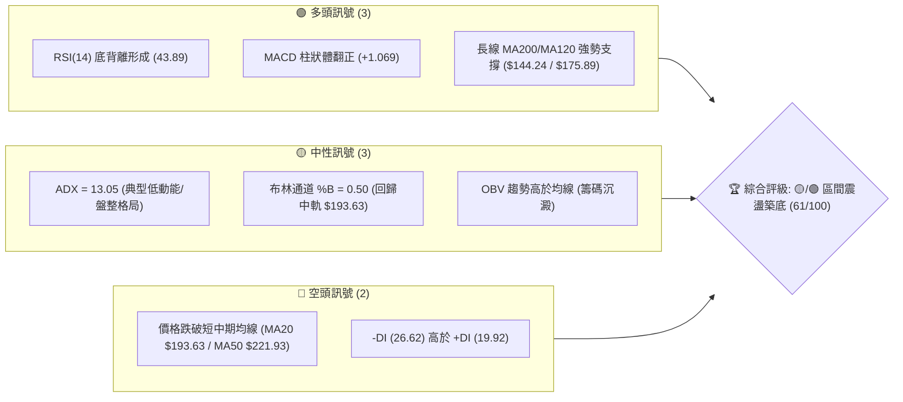
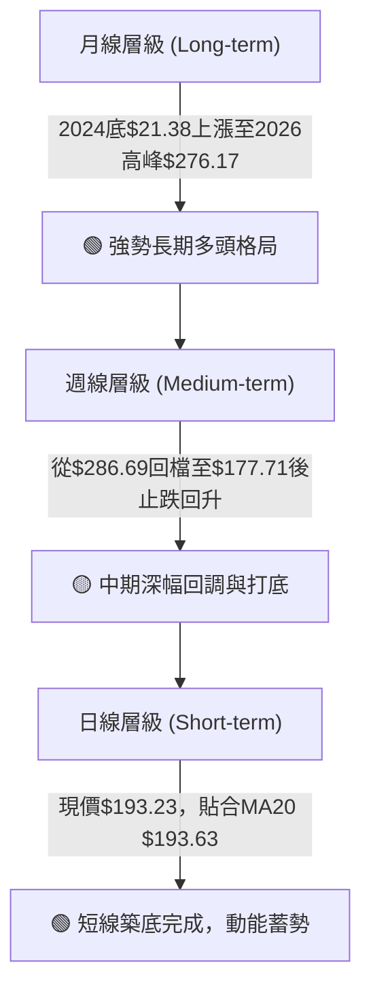
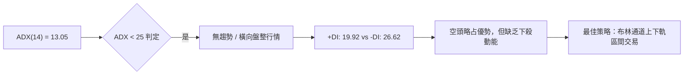
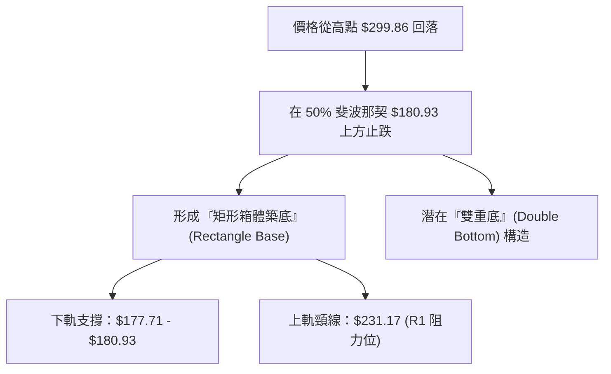
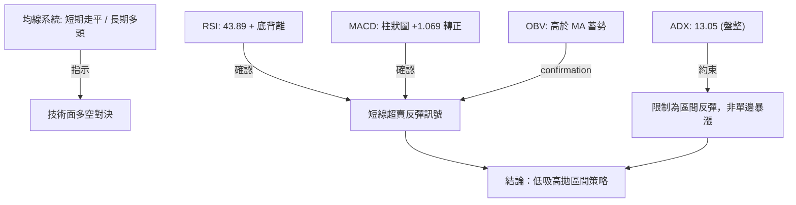
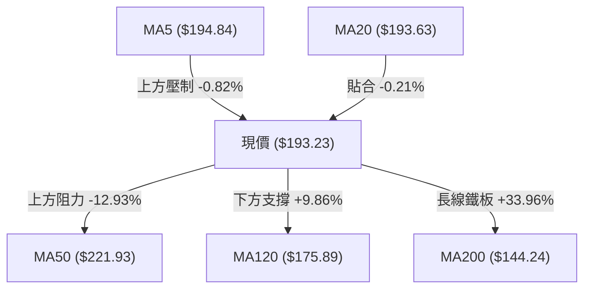
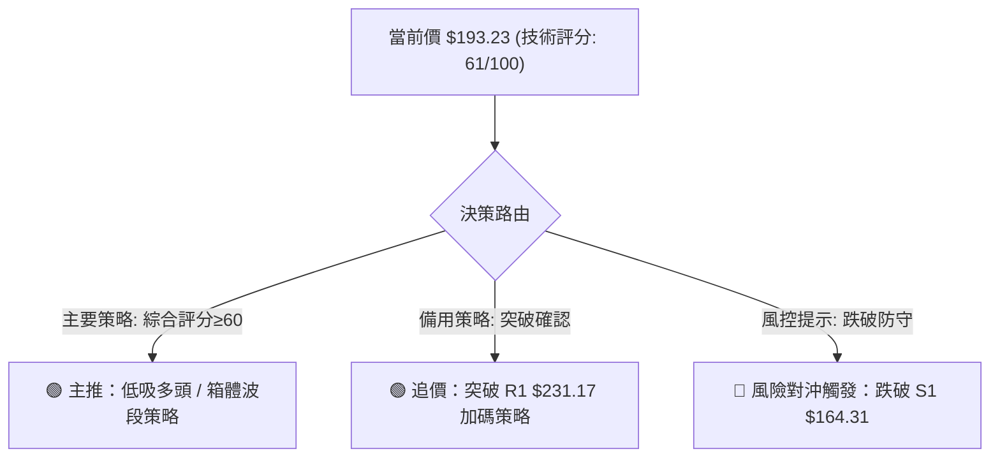
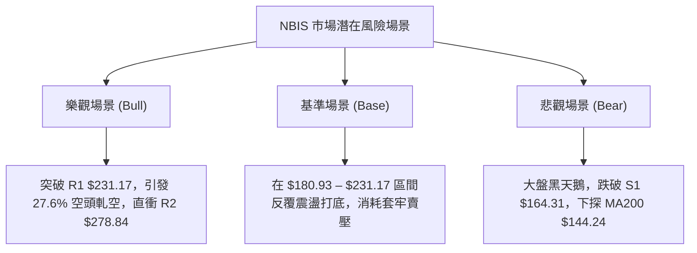

# NBIS 技術分析報告

> **報告日期**：2026-08-12 ｜ **語言**：繁體中文 ｜ **數據來源**：Yahoo Finance ｜ **當前價格**：$193.23

---

## 目錄

| 章節 | 內容 |
|------|------|
| [1. 技術面概覽](#1-技術面概覽) | 訊號儀表板、核心指標、評分卡 |
| [2. 趨勢分析](#2-趨勢分析) | 多時框趨勢、長中短期走勢 |
| [3. 圖表形態分析](#3-圖表形態分析) | 形態識別、K線組合、目標價 |
| [4. 支撐與阻力](#4-支撐與阻力) | 關鍵價位、斐波那契回調 |
| [5. 技術指標深度解讀](#5-技術指標深度解讀) | MA/RSI/MACD/布林/成交量 |
| [6. 動能與波動率](#6-動能與波動率) | 動能評估、ATR、Beta |
| [7. 多時框架總結](#7-多時框架總結) | 時框架評分矩陣 |
| [8. 交易策略建議](#8-交易策略建議) | 多空策略、風險報酬比 |
| [9. 風險提示與監控](#9-風險提示與監控) | 監控指標、風險場景 |

---

## 1. 技術面概覽

### 🎯 技術訊號儀表板



### 📊 核心指標速覽表

| 指標類別 | 指標名稱 | 當前數值 | 訊號 | 解讀 |
|----------|----------|----------|------|------|
| **價格** | 當前價格 | $193.23 | 🟡 中性 | 位於52週高低區間之 55.2% 位置，進入高位回檔後築底階段 |
| **均線** | MA20 | $193.63 | 🟡 中性 | 現價與 MA20 極度接近，短期均線走平，呈窄幅震盪 |
| **均線** | MA50 / MA60 | $221.93 / $220.24 | 🔴 空頭 | 現價位於 MA50 下方 -12.93%，上方存在第一道中期均線壓力 |
| **均線** | MA200 / MA240| $144.24 / $137.17 | 🟢 多頭 | 現價高於 MA200 +33.96%，超長期多頭格局依然穩固 |
| **動能** | RSI(14) | 43.89 | 🟢 多頭 | 中性區間，且日線/週線出現顯著「看多底背離」訊號 |
| **動能** | MACD(12,26,9)| -5.977 (柱狀 +1.069) | 🟢 多頭 | MACD 慢速線於零軸下方金叉，柱狀圖連增，短線動能轉強 |
| **趨勢** | ADX(14) | 13.05 | 🟡 中性 | ADX < 25 表示處於「無趨勢/盤整行情」，適合區間波段操作 |
| **波動** | ATR(14) | $24.20 (12.52%) | 🔴 高波動 | 每日平均波幅達 12.52%，個股高 Alpha/高風險特徵明顯 |

### 🏆 技術評分卡

```
╔══════════════════════════════════════════════════════════════════╗
║                   技術評分卡 — NBIS (2026-08-12)                ║
╠══════════════════════════════════════════════════════════════════╣
║  趨勢強度      ▓▓▓▓▓▓▓░░░░░░░░░░░░░  35/100  🟡 盤整無趨勢 (ADX=13)║
║  動能指標      ▓▓▓▓▓▓▓▓▓▓▓▓▓░░░░░░░  65/100  🟢 底背離與MACD金叉  ║
║  支撐穩定度    ▓▓▓▓▓▓▓▓▓▓▓▓▓▓▓░░░░░  75/100  🟢 50%斐波那契強支撐 ║
║  成交量配合    ▓▓▓▓▓▓▓▓▓▓▓▓░░░░░░░░  60/100  🟡 縮量整理/OBV健康   ║
║  形態完整度    ▓▓▓▓▓▓▓▓▓▓▓▓▓░░░░░░░  65/100  🟢 區間築底矩形形態  ║
║  均線排列      ▓▓▓▓▓▓▓▓▓▓▓░░░░░░░░░  55/100  🟡 多空交錯(長多短空)║
╠══════════════════════════════════════════════════════════════════╣
║  綜合評分      ▓▓▓▓▓▓▓▓▓▓▓▓░░░░░░░░  61/100  🟢 偏多震盪築底      ║
╚══════════════════════════════════════════════════════════════════╝
```

---

## 2. 趨勢分析

### 🌐 多時框趨勢分析



### 📈 長期趨勢 — 12個月走勢圖（Unicode）

```
NBIS 12個月歷史收盤價格走勢圖 ($)
$300 ┤                                        ● $276.17 (2026-06)
$270 ┤                                       / \
$240 ┤                                 ●    /   \
$210 ┤                                / \  /     ● $193.23 (2026-08)
$180 ┤                          ●    /   \/
$150 ┤                    ●    / \  /
$120 ┤    ● $112.27      / \  /   \/
$90  ┤   / \            /   \/
$60  ┤  /   ● $83.71   /
$30  ┤ ● $36.75       /
     └─┬────┬────┬────┬────┬────┬────┬────┬────┬────┬────┬────┬───
     08/25 09   10   11   12  01/26 02   03   04   05   06   07  08/26
```

#### 走勢特徵分析表格

| 階段歷史 | 價格區間 | 變動特徵 | 成交量與市場心理 |
|----------|----------|----------|------------------|
| **2025-08 ~ 2025-10** | $68.32 → $130.82 | 主升段攻勢 (+91.5%) | 基礎設施建置需求爆發，市場狂熱追價 |
| **2025-11 ~ 2026-01** | $130.82 → $83.71 | 深幅二次拉回 (-36.0%) | 獲利了結賣壓湧現，落入 $83-$85 區間落底 |
| **2026-02 ~ 2026-06** | $91.19 → $276.17 | 主升浪擴展 (+202.8%) | AI 算力基礎設施擴建利多，股價創歷史新高 $299.86 |
| **2026-07 ~ 2026-08** | $276.17 → $193.23 | 技術性回檔與築底 (-30.0%) | 觸及 50% 斐波那契回調位 $180.93 後縮量止跌整理 |

### 📊 中期趨勢（週線分析）

從 2026 年 4 月至 8 月的 20 週數據觀察，NBIS 經歷了極致的「高爆發—高回檔—收斂築底」過程：
1. **衝頂期**：2026-06-21 當週收在 $286.69（盤中高點突破 $299.86），週成交量達 9,236 萬股。
2. **修正期**：受高獲利回吐賣壓影響，連續 4 週回落，於 2026-07-19 探底至 $177.71。
3. **沉澱期**：2026-08-02 當週出現高達 1.54 億股的洗盤量能，隨後兩週成交量急劇收縮至 3,590 萬股，顯示拋壓耗盡。MACD 週線柱狀體由 -7.680 快速縮窄並轉正至 +1.069，宣告中期下攻動能結束。

### ⚡ 趨勢強度評估（ADX 解讀）



| 指標項 | 當前數值 | 參考標準 | 趨勢判定 |
|--------|----------|----------|----------|
| **ADX(14)** | **13.05** | < 25 盤整 / > 25 趨勢 / > 40 強趨勢 | 🟢 處於極度低迷之無趨勢盤整期，反轉蓄勢中 |
| **+DI** | **19.92** | 多頭力道 | 🟡 多頭力道受壓制 |
| **-DI** | **26.62** | 空頭力道 | 🔴 空頭暫居主導，但未拉開差距 |

---

## 3. 圖表形態分析

### 🔍 形態識別系統



#### 形態信心度與目標價評估

| 形態名稱 | 信心度 | 判斷依據（引用數據） | 完成度 | 目標價（附計算式） |
|----------|--------|----------------------|--------|--------------------|
| **矩形箱體築底** | **75%** | 價格於 $177.71–$190.41 區間獲得三次支撐，ADX(13.05) 顯示橫盤 | 85% | 頸線 $231.17 + 箱體高度 ($231.17 - $180.93 = $50.24) = **$281.41** |
| **潛在雙重底** | **60%** | 第一底 $177.71 (7/19)，第二底 $187.97 (8/9)，RSI 底背離 | 50% | 頸線 $231.17 + 形態高度 $53.46 = **$284.63** |
| **下降楔形突破** | **45%** | 從 $299.86 下降的趨勢線正被收斂突破 | 35% | 訊號不足，僅做指標型解讀 |

### 🕯️ 重要K線形態分析

| 月份 | 收盤價 | K線形態 | 解讀 | 訊號 |
|------|--------|---------|------|------|
| **2026-05** | $231.09 | 大陽線 (Marubozu) | 強勢突破，多頭主力全面控盤 | 🟢 看多 |
| **2026-06** | $276.17 | 上影線長陽 (Shooting Star Upper) | 衝高至 $299.86 遇到強烈解套與獲利賣壓 | 🟡 警告 |
| **2026-07** | $190.41 | 大陰線 (Bearish Engulfing) | 獲利了結殺跌，落入超賣區 | 🔴 看空 |
| **2026-08** | $193.23 | 縮量十字星/槌子線 (Hammer / Doji) | 賣壓耗盡，多空在 MA20 ($193.63) 達成新平衡 | 🟢 底態轉強 |

### 📉 ASCII 走勢形態示意圖

```
NBIS 箱體築底與雙底形態示意圖 ($)
$231.17 ┤-------------------------------------- (頸線 / 箱體上軌 R1)
        │       ▲              ▲
        │      / \            / \
$205.00 ┤...../...\........../...\............. (布林中軌 MA20 $193.63)
        │    /     \        /     \   ●現價 $193.23
$180.93 ┤---●-------\------●-------\-/-------- (50% 斐波那契 / 箱體下軌)
            底1      \    底2
          ($177.71)   \ ($187.97)
```

### 🎯 形態目標價計算

1. **第一階段（箱體突破目標價）**：
   $$\text{目標價 1} = \text{頸線 (R1)} = \$231.17$$
2. **第二階段（形態垂直高度等距衡量）**：
   $$\text{箱體高度} = \$231.17 - \$180.93 = \$50.24$$
   $$\text{形態最小目標價} = \text{頸線} + \text{箱體高度} = \$231.17 + \$50.24 = \$281.41$$
   *(該目標價落於阻力位 R2 $278.84 附近)*

---

## 4. 支撐與阻力

### 🗺️ 關鍵價位分布圖（Unicode）

```
NBIS 價位結構分布圖
═══════════════════════════════════════════════════════════════════
$299.86 ║████████████████████████████████████████║ 52W 高點 / 阻力 R3
$278.84 ║████████████████████████████████        ║ 波段高點聚類 / 阻力 R2
$243.73 ║▓▓▓▓▓▓▓▓▓▓▓▓▓▓▓▓▓▓▓▓▓▓▓▓                ║ 23.6% 斐波那契回調位
$231.17 ║████████████████████████████            ║ 前波高點 / 箱體頂部 R1
$221.93 ║░░░░░░░░░░░░░░░░░░░░░░░                 ║ 50日移動平均線 (MA50)
$209.00 ║▓▓▓▓▓▓▓▓▓▓▓▓▓▓▓▓                        ║ 38.2% 斐波那契回調位
$193.63 ║────────────────────────────────────────║ 布林中軌 (MA20)
$193.23 ╠════════════════════════════════════════║ ◄ 當前價格 (Current Price)
$180.93 ║▓▓▓▓▓▓▓▓▓▓▓▓▓▓▓▓▓▓▓▓▓▓▓▓▓▓▓▓            ║ 50.0% 斐波那契黃金切割點
$164.31 ║████████████████████                    ║ 支撐 S1 (近期密集下影線)
$152.87 ║▓▓▓▓▓▓▓▓▓▓▓▓▓▓▓▓                        ║ 61.8% 斐波那契回調位
$145.80 ║████████████████████████                ║ 強支撐 S2 / MA200 ($144.24)
$132.70 ║████████████████                        ║ 支撐 S3 (前波起漲低點)
═══════════════════════════════════════════════════════════════════
```

### 🚧 阻力位分析表

| 阻力級別 | 價位 | 形成原因 | 突破難度 | 重要性 |
|----------|------|----------|----------|--------|
| **R1** | **$231.17** | 近一年波段高點聚類、MA50/MA60阻力帶 ($220.24–$221.93) | 🔥🔥🔥 高 | 🟢 極度關鍵（頸線解套壓力區） |
| **R2** | **$278.84** | 2026年6月高位震盪區次高點聚類 | 🔥🔥🔥🔥 極高 | 🟡 中期多頭推升目標區 |
| **R3** | **$299.86** | 52週歷史最高點 (52W High) | 🔥🔥🔥🔥🔥 頂級 | 🔴 歷史心理大關與強烈解套賣壓 |

### 🛡️ 支撐位分析表

| 支撐級別 | 價位 | 形成原因 | 守住機率 | 重要性 |
|----------|------|----------|----------|--------|
| **S1** | **$164.31** | 近一年波段低點聚類、接近 61.8% 斐波那契 ($152.87) | 🛡️🛡️🛡️🛡️ 高 | 🟢 短線防守第一道防線 |
| **S2** | **$145.80** | 近一年波段低點聚類、與 MA200 ($144.24) 形成重疊護城河 | 🛡️🛡️🛡️🛡️🛡️ 極高 | 🟢 長期牛熊分界線 |
| **S3** | **$132.70** | 前波起漲點密集交易區 | 🛡️🛡️🛡️🛡️🛡️ 頂級 | 🟡 終極防禦支撐 |

### 📐 斐波那契回調位分析

*基於 52 週低點 **$62.01** 至 52 週高點 **$299.86** 繪製：*

```
  0.0% (52W High) ---------------------------------- $299.86
 23.6%            ---------------------------------- $243.73
 38.2%            ---------------------------------- $209.00
------------------ 現價 $193.23 落在 38.2% 與 50.0% 之間 ------------------
 50.0% (關鍵位)   ---------------------------------- $180.93  ◄ 強力扣押防守區
 61.8% (黃金分割) ---------------------------------- $152.87
 78.6%            ---------------------------------- $112.91
100.0% (52W Low)  ---------------------------------- $62.01
```

**解讀**：現價 $193.23 成功在 **50.0% 斐波那契位置 ($180.93)** 獲得強有力支撐。技術分析中，強勢多頭股票在經歷大幅上漲後，回調至 50% 水準止跌（最深未破 61.8% 的 $152.87），屬於極為健康的「技術性拉回洗盤」，為下一階段再創新高奠定基石。

---

## 5. 技術指標深度解讀

### 🎛️ 指標訊號總覽



### 📈 移動平均線排列分析



- **短中期均線（MA5/MA10/MA20）**：集中在 $193.63–$194.84 窄幅區間內，均線粘合（Squeeze），預示著股價即將選擇短線突破方向。
- **長期均線（MA120/MA200）**：MA120 ($175.89) 與 MA200 ($144.24) 呈現完美的金叉向上多頭排列（MA120 季線大增 +9.86%，MA240 年線大增 +40.87%），表明長線資金並未離場。

### 📉 RSI(14) 分析

- **當前數值**：**43.89** (屬於 30–70 中性偏低區間)。
- **Unicode 進度條**：`████████░░░░░░░░░░░░  43.89%`
- **背離診斷**：**⚠️ 存在顯著「底背離」(Bullish Divergence)**。
  - **價格走勢**：股價從 7/19 週收盤 $177.71 回升至 8/16 週收盤 $193.23，探底過後築出較高低點。
  - **RSI 走勢**：RSI 指標由 7/12 的 **32.2** 低點，快速一底比一底高地抬升至 **43.9**（8/9 更曾達到 **51.2**）。
  - **結論**：價格橫盤之際，內部多頭動能正在默默積蓄，為典範的看多底背離訊號。

### 📊 MACD(12,26,9) 訊號解讀

- **MACD 線**：-5.977
- **Signal 線**：-7.046
- **MACD 柱狀體 (Histogram)**：**+1.069** 🟢
- **訊號解讀**：MACD 線已正式上穿 Signal 線，於零軸下方形成**「零軸下黃金交叉」**。柱狀圖連續數日呈現綠色擴展狀態（+1.069），顯示下壓拋售波段已經宣告結束，短線多頭買盤正式接管市場。

### 📦 布林通道分析

```
NBIS 布林通道位置示意圖 ($)
$233.86 ┤-------------------------------------- 布林上軌 (Upper Band)
        │
$200.00 ┤
$193.63 ┤===================●================== 布林中軌 (MA20) [現價 $193.23，%B = 0.50]
$170.00 ┤
$153.39 ┤-------------------------------------- 布林下軌 (Lower Band)
```

- **BB 上軌**：$233.86（恰好與阻力 R1 $231.17 重合）
- **BB 中軌 (MA20)**：$193.63
- **BB 下軌**：$153.39（恰好與 61.8% 斐波那契 $152.87 重合）
- **通道指標 %B**：**0.50**。價格精準部位於通道正中央，代表先前過度賣超的偏離已被修正，多空回歸平衡，通道帶寬正處於收縮期。

### 💹 成交量分析（量價配合度）

1. **量比分析**：當前成交量 19,739,205 股，相較於 20 日均量 23,854,410 股，量比為 **0.83x**，屬於典型的「縮量洗盤」特徵。
2. **OBV 能量潮**：數據顯示 `OBV > MA → 量能支撐上漲`。在 7 月底至 8 月初的下挫過程中，OBV 未創新低，顯示散戶籌碼被獲利洗出，而法人機構（持股比高達 67.6%）並未出現恐慌性拋售。
3. **空頭頭寸**：Float Short 比率高達 **27.6%** (Short Ratio 2.78)。若價格突破阻力 R1 ($231.17)，極易引發高達 5,700 萬股的空頭軋空（Short Squeeze）潮。

---

## 6. 動能與波動率

### ⚡ 動能評估四象限

| 象限分類 | 條件 | 當前狀態 | NBIS 定位與評估 |
|----------|------|----------|-----------------|
| **Q1 (高動能 / 低波動)** | ADX>25, ATR%<5% | - | 最佳趨勢續漲區 |
| **Q2 (低動能 / 低波動)** | ADX<25, ATR%<8% | - | 沉悶盤整區 |
| **Q3 (高動能 / 高波動)** | ADX>25, ATR%>8% | - | 單邊暴漲暴跌衝刺區 |
| **Q4 (低動能 / 高波動)** | ADX<25, ATR%>8% | **✓** | **當前位置：低趨勢/高個股波動**。適合利用高波動在區間下軌（$180 附近）低吸，在上軌（$230 附近）獲利結算。 |

### 📊 ATR 波動率分析

- **ATR(14) 數值**：**$24.20**
- **ATR 占股價比**：**12.52%**（屬於極高波動度標的）
- **交易風控應用**：
  - **日內波段防守距離**：1.0 × ATR = **$24.20**
  - **波段交易止損距離**：1.5 × ATR = **$36.30**
  - **進場建議**：因 daily ATR 高達 $24.20，切忌追高，應採取分批掛單（Limit Order）方式於支撐位附近佈局。

### 📐 Beta 與市場相關性

- **Beta 係數**：**1.434**
- **解讀**：NBIS 波動度比大盤（S&P 500 / 納斯達克）高出 **43.4%**。在大盤反彈或 AI 板塊回溫時，NBIS 將展現高於大盤的彈升力道（High Beta Effect）。

---

## 7. 多時框架總結

### 📋 時框架評分表

| 時框架 | 趨勢方向 | 動能指標 | 均線排列 | 形態結構 | 綜合評分 | 交易策略建議 |
|--------|----------|----------|----------|----------|----------|--------------|
| **月線 (Monthly)** | 🟢 多頭 | 🟡 中性 | 🟢 多頭 | 🟢 長期牛市主升段 | **82/100** | 長線堅定持有，拉回即是買點 |
| **週線 (Weekly)** | 🟡 盤整 | 🟢 看多底背離 | 🟢 多頭(MA50之上) | 🟢 箱體整理 | **68/100** | 中線逢低分批布局 |
| **日線 (Daily)** | 🟡 橫盤 | 🟢 MACD金叉 | 🟡 均線粘合 | 🟡 雙底打底 | **58/100** | 短線區間操作 / 突破追買 |

### 🔲 綜合訊號矩陣

```
時框架收斂矩陣
┌──────────┬─────────────┬─────────────┬─────────────┐
│ 時框架   │ 短期 (日線) │ 中期 (週線) │ 長期 (月線) │
├──────────┼─────────────┼─────────────┼─────────────┤
│ 趨勢方向 │ 橫盤築底    │ 回調整理    | 強勢多頭    │
│ 指標方向 │ 🟢 MACD金叉 │ 🟢 RSI背離  │ 🟢 均線揚升  │
│ 權限優先 │ 低          │ 中          │ 高 (ADX<25) │
└──────────┴─────────────┴─────────────┴─────────────┘
```

### ⚖️ 多時框收斂結論

依**多時框收斂規則（規則 14）**判斷：
1. 當前 ADX(14) 為 **13.05 (< 25)**，技術面確立為**「盤整行情/橫向箱體震盪」**。
2. 在盤整行情中，應優先以**布林通道上下軌（$153.39 – $233.86）**及**斐波那契回調位（$180.93 – $209.00）**作為主要交易邊界。
3. **最終收斂結論**：**🟢 區間震盪偏多**。長期牛市格局未變，中期與短期回調已在 $180.93 (50% 斐波那契) 完成二次探底，短期動能（RSI 底背離、MACD 金叉）已轉強，蓄勢挑戰阻力 R1 ($231.17)。

---

## 8. 交易策略建議

### 🗺️ 策略決策流程圖



### 🧭 策略路由

> **當前主策略方向 = 🟢 低吸多頭與箱體波段操作（技術評分：61/100）**

因技術綜合評分為 61 分（偏多築底），且 ADX 顯示無單邊下跌趨勢，**本報告主推多頭佈局策略**。空頭策略僅作為極端風控對沖提示。

### 🎯 價格情境階梯（Price Scenarios）

| 觸發條件 | 第一目標價 | 第二目標價 | 情境含義 |
|----------|------------|------------|----------|
| **突破 R1 $231.17** | **R2 $278.84** | **R3 $299.86** | 箱體完成突破，展開新一輪主升浪（引發軋空） |
| **站穩 $180.93–$193.23** | **Fib 38.2% $209.00** | **R1 $231.17** | 區間震盪打底，多頭逐步墊高底點（現行基準情境） |
| **跌破 S1 $164.31** | **S2 $145.80** | **S3 $132.70** | 中期結構破壞，下探 200日均線 ($144.24) 尋求支撐 |

### 📊 情境機率分佈

```
情境機率分佈 Unicode 直方圖
  [情境 A] 築底反彈挑戰 R1 ($231.17)  ██████████████████████████████  60%
  [情境 B] 窄幅區間震盪 ($180–$209)   ██████████████                  25%
  [情境 C] 向下破位尋求 S2 ($145.80)  ███████                         15%
```

- **情境 A (60% 機率)**：MACD 柱狀體翻正與 RSI 底背離引發技術性反彈，推升股價挑戰 R1 $231.17。
- **情境 B (25% 機率)**：量能持續低迷，股價於 50% 斐波那契 $180.93 與 38.2% 斐波那契 $209.00 間進行 2-3 週窄幅整理。
- **情境 C (15% 機率)**：整體 AI 板塊出現系統性拉回，股價跌破 S1 $164.31，尋求 MA200 ($144.24) 強力支撐。

### 🟢 主策略詳情

#### 策略 A：區間低吸多頭策略（現價/逢低佈局）
- **進場條件**：現價 $193.23 直接建立首批倉位，或拉回至 50% 斐波那契 $180.93 附近分批加碼。
- **買入價格區間**：**$180.93 – $193.23**
- **目標價 T1**：**$231.17** (阻力 R1 / 箱體上軌，預期報酬 +19.63%)
- **目標價 T2**：**$278.84** (阻力 R2 / 波段高點，預期報酬 +44.30%)
- **止損價格**：**$163.50** (位於支撐 S1 $164.31 下方，跌幅 -15.39%)
- **風險報酬比 (R/R Ratio)**：
  - 至 T1：`$37.94 收益 / $29.73 風險` = **1 : 1.28**
  - 至 T2：`$85.61 收益 / $29.73 風險` = **1 : 2.88**
- **建議倉位**：15% – 20%

#### 策略 B：右側突破追買策略（強勢確認）
- **進場條件**：日線收盤價強勢突破阻力 R1 $231.17 並站穩。
- **買入價格**：**$232.00**
- **目標價 T1**：**$278.84** (阻力 R2，預期報酬 +20.19%)
- **目標價 T2**：**$299.86** (阻力 R3 / 52W High，預期報酬 +29.25%)
- **止損價格**：**$208.00** (位於 38.2% 斐波那契 $209.00 下方)
- **風險報酬比 (R/R Ratio)**：
  - 至 T1：`$46.84 收益 / $24.00 風險` = **1 : 1.95**
  - 至 T2：`$67.86 收益 / $24.00 風險` = **1 : 2.83**
- **建議倉位**：10% – 15%（突破加碼）

### 🔴 反向風險觸發點（對沖與止損提示）

若股價放量跌破 **S1 ($164.31)** 且每日收盤價無法收復，多頭結構遭到破壞，應立即執行止損清倉，並於 **S2 ($145.80) / MA200 ($144.24)** 重新評估建立防守性對沖頭寸。

### ⭐ 整體訊號強度評星

```
╔══════════════════════════════════════════════════════════════════╗
║                     訊號強度評星評級表                           ║
╠══════════════════════════════════════════════════════════════════╣
║  做多訊號強度：  ★★★★☆  (4.0 / 5.0 星) — 底背離與MACD金叉共振   ║
║  做空訊號強度：  ★★☆☆☆  (2.0 / 5.0 星) — 缺乏趨勢與量能配合     ║
║  整體策略可信度：★★★★☆  (4.0 / 5.0 星) — 50%斐波那契強防守支撐 ║
╚══════════════════════════════════════════════════════════════════╝
```

---

## 9. 風險提示與監控

### ✅ 關鍵監控指標 Checklist

```
╔══════════════════════════════════════════════════════════════════╗
║                    每日技術面監控清單 (Checklist)               ║
╠══════════════════════════════════════════════════════════════════╣
║  [ ] 價位監控：收盤價是否站穩 MA20 ($193.63) 以上               ║
║  [ ] 支撐防禦：是否觸及或跌破 50% 斐波那契位 ($180.93)            ║
║  [ ] 動能確認：MACD 柱狀圖是否持續擴大 (+1.069 以上)             ║
║  [ ] 量能變化：上攻時成交量是否大於 20日均量 (2,385萬股)          ║
║  [ ] 空頭部位：Short Float (27.6%) 是否出現快速回補軋空跡象      ║
╚══════════════════════════════════════════════════════════════════╝
```

### ⚠️ 風險場景分析



### 🛡️ 風險管理重要提醒

1. **高 Beta 與高 ATR 警告**：NBIS Beta 為 **1.434**，ATR 高達 **$24.20 (12.52%)**，屬於高風險、高波動之 AI 基礎設施個股，單日漲跌幅度極大，**總倉位切勿超過整體投資組合之 20%**。
2. **基本面虧損風險**：公司 Forward P/E 為 -58.43，Free Cash Flow 為 -$6.15B，儘管營收年增 683.9%，但仍處於大規模資本支出（CapEx）階段，極度依賴市場資金偏好（Risk-On/Risk-Off）。
3. **空頭軋空雙面刃**：高高空率 (27.6%) 雖提供了暴漲軋空契機，但也意味著機構空頭力道強勁，必須嚴格執行 **$163.50** 之止損紀律。

---

## 📋 報告總結

```
╔══════════════════════════════════════════════════════════════════╗
║                     NBIS 技術分析報告總結                        ║
════════════════════════════════════════════════════════════════════
  報告日期：2026-08-12
  當前價格：$193.23
  分析評級：🟢 評級：區間築底 / 中性偏多 (61/100)

  關鍵結論：
  ├─ 長期趨勢：🟢 強勢多頭 (MA200 $144.24 穩定上揚，長線架構完整)
  ├─ 中期趨勢：🟡 回調築底 (於 50% 斐波那契 $180.93 獲得極強支撐)
  ├─ 短期趨勢：🟢 動能轉強 (RSI 看多底背離，MACD 零軸下金叉)
  ├─ 關鍵支撐：S1 $164.31 ｜ S2 $145.80 (MA200)
  ├─ 關鍵阻力：R1 $231.17 ｜ R2 $278.84 ｜ R3 $299.86
  └─ 分析師共識目標價：$250.75 (潛在上漲空間 +29.77%)

  最優策略組合：
  1. 🥇 首選策略：$180.93–$193.23 分批佈局多單，目標 $231.17 / $278.84，止損 $163.50。
  2. 🥈 突破策略：突破 $231.17 強勢追買，目標 $278.84 / $299.86，止損 $208.00。
  3. 🥉 風控守則：嚴格控制倉位在 20% 以內，克服 12.5% 之日波動率。
════════════════════════════════════════════════════════════════════
```

---

> ⚠️ **免責聲明**：本報告為 AI 自動生成之技術分析，所有數據及估算均基於提供的歷史價格資訊。本報告**僅供研究與學術參考**，**不構成任何投資建議**。投資有風險，入市需謹慎。

---

*報告生成時間：2026-08-12 ｜ 數據來源：Yahoo Finance ｜ 分析框架：多時框技術分析*