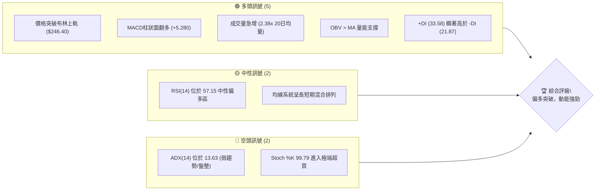
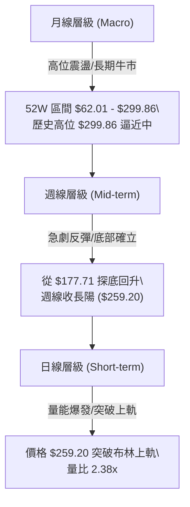
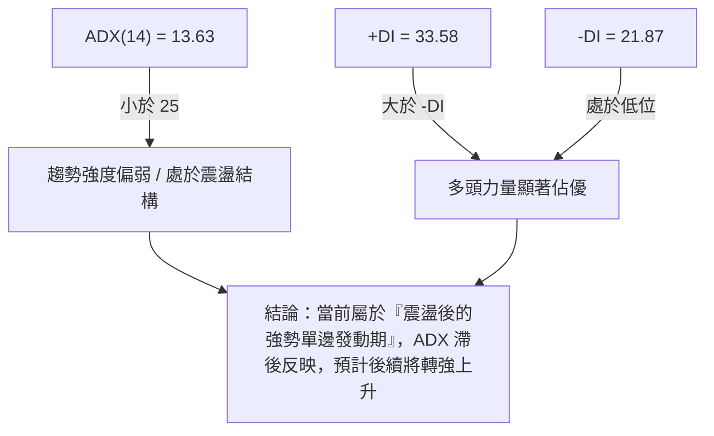
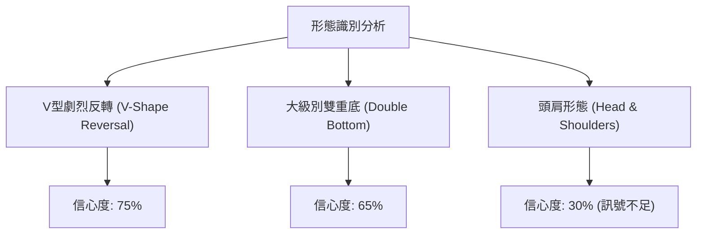
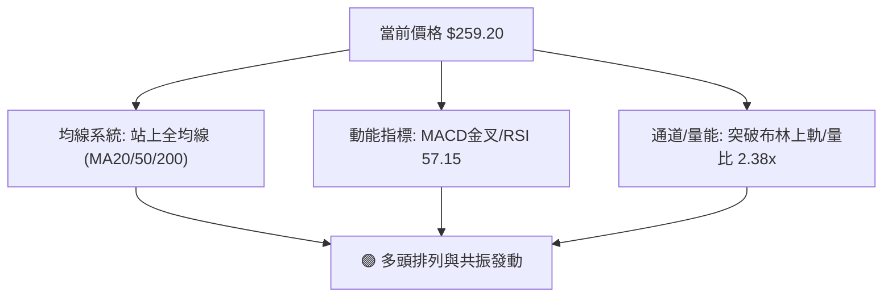
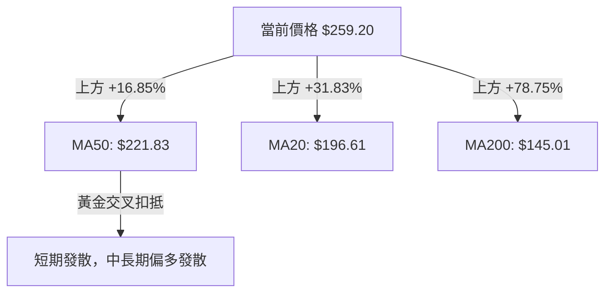
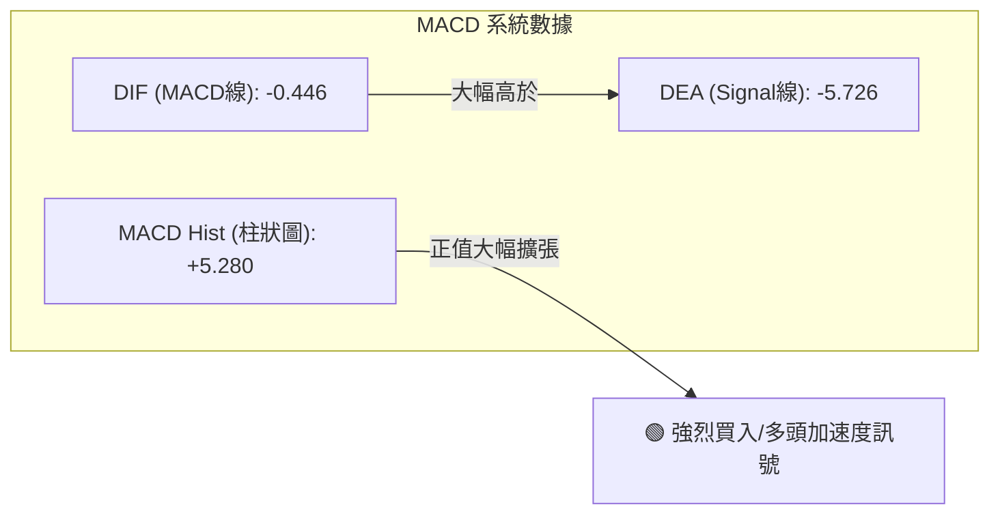
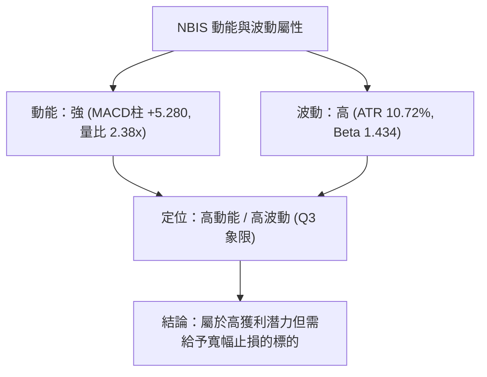
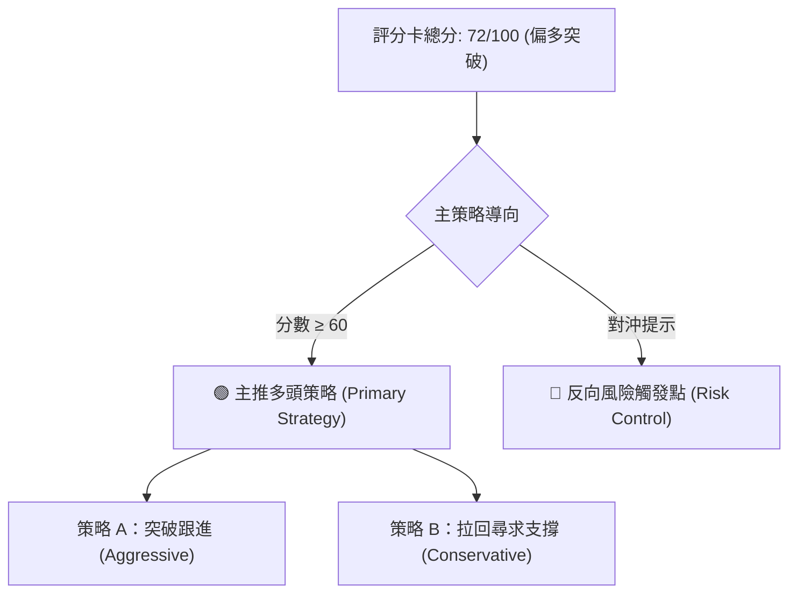
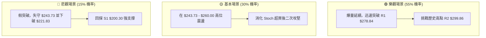

# NBIS 技術分析報告

> **報告日期**：2026-08-13 ｜ **語言**：繁體中文 ｜ **數據來源**：Yahoo Finance ｜ **當前價格**：$259.20

---

## 目錄

| 章節 | 內容 |
|------|------|
| [1. 技術面概覽](#1-技術面概覽) | 訊號儀表板、核心指標、評分卡 |
| [2. 趨勢分析](#2-趨勢分析) | 多時框趨勢、長中短期走勢 |
| [3. 圖表形態分析](#3-圖表形態分析) | 形態識別、K線組合、目標價 |
| [4. 支撐與阻力](#4-支撐與阻力) | 關鍵價位、斐波那契回調 |
| [5. 技術指標深度解讀](#5-技術指標深度解讀) | MA/RSI/MACD/布林/成交量 |
| [6. 動能與波動率](#6-動能與波動率) | 動能評估、ATR、Beta |
| [7. 多時框架總結](#7-多時框架總結) | 時框架評分矩陣 |
| [8. 交易策略建議](#8-交易策略建議) | 多空策略、風險報酬比 |
| [9. 風險提示與監控](#9-風險提示與監控) | 監控指標、風險場景 |

---

## 1. 技術面概覽

### 🎯 技術訊號儀表板



### 📊 核心指標速覽表

| 指標類別 | 指標名稱 | 當前數值 | 訊號 | 解讀 |
|----------|----------|----------|------|------|
| **價格** | 當前價格 | $259.20 | 🟢 看多 | 位於52週區間82.9%高位，突破短期區間 |
| **均線** | MA20 | $196.61 | 🟢 看多 | 價格高於MA20達 +31.83%，短線呈極強拉升 |
| **均線** | MA50 | $221.83 | 🟢 看多 | 價格站上季線上方 +16.85%，中期趨勢回升 |
| **均線** | MA200 | $145.01 | 🟢 看多 | 遠高於半年/年線，長期多頭基底穩固 |
| **動能** | RSI(14) | 57.15 | 🟡 中性 | 動能強勁且未進入過熱區，具備進一步上攻空間 |
| **動能** | MACD柱 | +5.280 | 🟢 看多 | 低位金叉後柱狀圖擴張，多頭掌控市場 |
| **動能** | Stoch %K/D| 99.79 / 67.09 | 🔴 空頭 | %K觸及極值超買，短線存在回檔或高位震盪需求 |
| **趨勢** | ADX(14) | 13.63 | 🟡 盤整 | 處於寬幅震盪後的初次突破階段，趨勢尚未形成長效ADX |
| **波動** | ATR(14) | $27.78 | 🔴 高波動| 每日波動幅度達 10.72%，需要較寬的風控距離 |
| **量能** | 成交量 | 62,364,592| 🟢 看多 | 達到20日均量的 2.38x，主力資金帶量攻堅 |

### 🏆 技術評分卡

```
╔══════════════════════════════════════════════════════════════╗
║              技術評分卡 — NBIS (2026-08-13)                 ║
╠══════════════════════════════════════════════════════════════╣
║ 趨勢強度      ████████████░░░░░░░░  60/100  🟡 中性偏多    ║
║ 動能指標      ████████████████░░░░  80/100  🟢 看多        ║
║ 支撐穩定度    ██████████████░░░░░░  70/100  🟢 看多        ║
║ 成交量配合    ██████████████████░░  90/100  🟢 強勢看多    ║
║ 形態完整度    ████████████░░░░░░░░  60/100  🟡 中性        ║
║ 均線排列      ██████████████░░░░░░  70/100  🟢 看多        ║
╠══════════════════════════════════════════════════════════════╣
║ 綜合評分      ███████████████░░░░░  72/100  🟢 偏多突破    ║
╚══════════════════════════════════════════════════════════════╝
```

---

## 2. 趨勢分析

### 🌐 多時框趨勢分析



### 📈 長期趨勢 — 12個月走勢圖（Unicode）

```
NBIS 月線走勢圖（過去12個月：2025-09 至 2026-08）
價格軸 ($)
$299.86 ┤                                                    ●(52W高點 $299.86)
$276.17 ┤                                            ●       │
$259.20 ┤                                            │       ●(現在 $259.20)
$231.09 ┤                                    ●       │   ●   │
$190.41 ┤                                    │       │   │   │
$138.23 ┤                            ●       │       │   │   │
$112.27 ┤●   ●                       │       │       │   │   │
$83.71  ┤│   │   ●   ●   ●   ●       │       │       │   │   │
        └┼───┼───┼───┼───┼───┼───┼───┼───┼───┼───┼───┼───┼─────────
        09  10  11  12  01  02  03  04  05  06  07  08  (月份)
```

**走勢特徵分析表格**：

| 時間區段 | 起始/結束價 | 漲跌幅 | 走勢特徵描述 |
|----------|-------------|--------|--------------|
| **2025-09 ~ 2025-10** | $112.27 ➔ $130.82 | +16.52% | 首波牛市拉升，市場資金高度關注 AI 基礎設施概念 |
| **2025-11 ~ 2026-02** | $94.87 ➔ $91.19 | -3.88% | 高位深度修正後進行長達 4 個月的底部築底盤整 |
| **2026-03 ~ 2026-06** | $103.76 ➔ $276.17 | +166.16%| 主升浪爆發，價格衝高至 $276.17，創下階段歷史新高 |
| **2026-07 ~ 2026-08** | $190.41 ➔ $259.20 | +36.13% | 經歷 7 月份劇烈洗盤（跌至 $177.71 週低點）後，8 月帶量 V 型反轉 |

### 📊 中期趨勢（週線分析）

```
NBIS 近 8 週價格與阻力/支撐關係示意圖
$299.86 ┼───────────────────────────────────────── [R2 歷史高點]
$278.84 ┼───────────────────────────────────────── [R1 關鍵阻力]
$259.20 ┼───────────────────────────▲ (當前週收盤 $259.20)
$243.73 ┼───────────────────────────┼───────────── [Fib 23.6%]
$209.00 ┼───────────────────────────┼───────────── [Fib 38.2%]
$200.30 ┼───────────────────────────┴───────────── [S1 關鍵支撐]
        06/21   06/28   07/05   07/12   07/19   07/26   08/02   08/09   08/16
收盤價:  286.69  240.30  215.62  219.65  177.71  187.77  190.41  187.97  259.20
```

*   **週線解讀**：NBIS 在 2026 年 7 月初至 8 月初經歷了一次深幅拉退，最低跌至 $177.71。但在 2026-08-16 當週，伴隨 1.01 億股的巨量，收盤價狂飆至 $259.20，一舉收復了前 6 週的失地，形成強烈的「週線貫穿包覆」看多組合。

### ⚡ 趨勢強度評估（ADX 解讀）



**ADX 指標強度對照表**：

| ADX 數值區間 | 當前狀態 | 市場型態 | 交易策略導向 |
|--------------|----------|----------|--------------|
| 0 - 20 | **13.63 (當前)** | 無明確單邊趨勢 / 盤整突破初段 | 區間突破交易 / 追蹤關鍵位 |
| 20 - 25 | - | 趨勢蓄勢期 | 突破確認 |
| 25 - 50 | - | 強勁單邊趨勢 | 順勢持有 / 逢回加碼 |
| > 50 | - | 極端趨勢 / 警惕衰竭 | 緊盯止損 / 逐步停利 |

---

## 3. 圖表形態分析

### 🔍 形態識別系統



**形態信心度與目標價計算表**：

| 形態名稱 | 信心度 | 判斷依據（引用數據） | 完成度 | 目標價（附計算式） |
|----------|--------|----------------------|--------|--------------------|
| **V型劇烈反轉** | **75%** | 從 7/19 低點 $177.71 帶量狂飆至 $259.20，突破 Fib 23.6% ($243.73) | 85% | 測量目標 = 頸線 $243.73 + ($243.73 - $177.71) = **$309.75** (已逼近 R2 $299.86) |
| **雙重底 (W底)** | **65%** | 第一底 $177.71 (7/19 週)，第二底 $187.97 (8/09 週)，頸線突破 $243.73 | 90% | 測量目標 = 頸線 $243.73 + ($243.73 - $177.71) = **$309.75** |
| **頭肩頂/底** | **30%** | 數據幾何結構不對稱，無法支撐標準頭肩形態 | 10% | **訊號不足，僅做指標與布林突破解讀** |

### 🕯️ 重要K線形態分析

| 日期/週別 | 收盤價 | K線形態 | 解讀 | 訊號 |
|-----------|--------|---------|------|------|
| **2026-07-19 週** | $177.71 | 長下影錘子線 | 探底碰觸 MA120 ($177.16) 後強烈下影支撐，賣壓宣洩完畢 | 🟢 底訊號 |
| **2026-08-09 週** | $187.97 | 晨星組合 (Morning Star) | 連續低位止跌沉澱，成交量降至 1.15 億，籌碼鎖定完畢 | 🟢 轉強 |
| **2026-08-16 週** | $259.20 | 長紅突破大陽線 | 單週狂漲 +37.89%，帶 1.01 億股巨量一舉吞噬前六週K線 | 🟢 強勢買訊 |

### 📉 ASCII 走勢形態示意圖

```
NBIS 日線/週線突破形態示意圖 (V型反轉 / W底頸線突破)

$299.86 ┤                                              [歷史高點 R2]
$278.84 ┤                                 .---.        [關鍵阻力 R1]
$259.20 ┤                                /     ● (現價 $259.20)
$243.73 ┤───────── 頸線突破點 ──────────/───────────── [Fib 23.6%]
        │                             /
$209.00 ┤            .---.           /                 [Fib 38.2%]
$200.30 ┤-----------/-----\---------/------------------ [關鍵支撐 S1]
$177.71 ┤  ● (左底)        ● (右底)                    [波段低點]
        └──────────────────────────────────────────────
```

### 🎯 形態目標價計算

1.  **第一目標價（阻力測試）**：引用數據庫中波段高點聚類 **R1 = $278.84**（距現價 +7.58%）。
2.  **第二目標價（52週歷史高點）**：引用數據庫中波段高點聚類 **R2 = $299.86**（距現價 +15.69%）。
3.  **形態推算擴展目標價**：由 W 底高度（頸線 $243.73 - 低點 $177.71 = $66.02）疊加於頸線之上：
    $$\text{形態目標價} = \$243.73 + \$66.02 = \$309.75$$
    *(因數據紀律要求，交易策略章節將嚴格採用 R1 $278.84 與 R2 $299.86 作為具體執行目標)*。

---

## 4. 支撐與阻力

### 🗺️ 關鍵價位分布圖（Unicode）

```
NBIS 價位結構分布圖 (由 OHLCV 精確計算)
═══════════════════════════════════════════════════════════════════
$299.86 ║██████████████████████████████████████████║ 52W高點 / 強阻力 R2 (+15.69%)
$278.84 ║████████████████████████████            ║ 波段高點 / 關鍵阻力 R1 (+7.58%)
$259.20 ╠══════════════════════════════════════════╣ ◄ 當前價格 ($259.20)
$243.73 ║▓▓▓▓▓▓▓▓▓▓▓▓▓▓▓▓▓▓▓▓▓▓▓▓▓▓▓▓            ║ 斐波那契 23.6% 回調支撐 (-5.97%)
$221.83 ║▓▓▓▓▓▓▓▓▓▓▓▓▓▓▓▓                        ║ MA50 季線支撐 (-14.42%)
$209.00 ║▓▓▓▓▓▓▓▓▓▓▓▓▓▓                          ║ 斐波那契 38.2% 回調位 (-19.37%)
$200.30 ║████████████████████████████████████    ║ 近一年關鍵波段低點支撐 S1 (-22.72%)
$180.93 ║██████████████████                      ║ 斐波那契 50.0% 中樞位 (-30.20%)
$164.31 ║████████████████████████                ║ 近一年強支撐 S2 (-36.61%)
$145.80 ║████████████████████████████████████████║ 近一年極限支撐 S3 (-43.75%)
═══════════════════════════════════════════════════════════════════
```

### 🚧 阻力位分析表

| 阻力級別 | 價位 | 形成原因 | 突破難度 | 重要性 |
|----------|------|----------|----------|--------|
| **R1** | **$278.84** | 近一年波段高點聚類、前波高點套牢賣壓區 | 🟡 中等 | 🟢🟢🟢 關鍵短線關卡 |
| **R2** | **$299.86** | 52週歷史最高點、整數心理關卡 ($300.00) | 🔴 極高 | 🟢🟢🟢🟢🟢 歷史高點與多頭終極考驗 |

### 🛡️ 支撐位分析表

| 支撐級別 | 價位 | 形成原因 | 守住機率 | 重要性 |
|----------|------|----------|----------|--------|
| **Fib 23.6%** | **$243.73** | 52週黃金分割回調位、近一週突破的頸線轉換位 | 🟢 80% | 🟢🟢🟢🟢 短線強弱分水嶺 |
| **S1** | **$200.30** | 近一年波段低點聚類、接近 MA20 ($196.61) 均線護盤 | 🟢 85% | 🟢🟢🟢🟢🟢 中期多頭生死線 |
| **S2** | **$164.31** | 近一年波段低點聚類、強烈買盤防守區 | 🟢 90% | 🟢🟢🟢 長期鐵底支撐 |
| **S3** | **$145.80** | 近一年波段低點聚類、極限強支撐（接近 MA200 $145.01）| 🟢 95% | 🟢🟢🟢 牛熊分界線 |

### 📐 斐波那契回調位分析

*52週價格區間：低點 **$62.01** ➔ 高點 **$299.86***

```
  0.0% (52W High) ─── $299.86 
                         ▲
  23.6% 回調位 ────── $243.73  ◄─── 當前價格 $259.20 落在此區間內 (多頭強勢區)
                         ▼
  38.2% 回調位 ────── $209.00
  50.0% 回調位 ────── $180.93
  61.8% 回調位 ────── $152.87
  78.6% 回調位 ────── $112.91
100.0% (52W Low)  ─── $62.01
```

*   **斐波那契位解讀**：
    當前價格 **$259.20** 已成功跨越 23.6% 回調位 **$243.73**。在技術分析中，當股價回檔後重新站回 23.6% 回調位之上，代表市場拉退結束，多頭重新取得主導權。只要價格能持續收在 $243.73 之上，後續向 0.0%（即歷史高點 $299.86）發動衝擊的機率極高。

---

## 5. 技術指標深度解讀

### 🎛️ 指標訊號總覽



### 📈 移動平均線排列分析



*   **均線數據詳情**：
    *   **MA 5**: $202.88 (價格在 MA5 上方 +27.76%) ── 🟢 短線極強噴發
    *   **MA 10**: $205.05 (價格在 MA10 上方 +26.41%) ── 🟢 扣抵低價向上
    *   **MA 20**: $196.61 (價格在 MA20 上方 +31.83%) ── 🟢 月線彎頭向上
    *   **MA 60**: $220.90 / **MA 50**: $221.83 ── 🟢 季線提供堅實中期底部
    *   **MA120**: $177.16 / **MA200**: $145.01 ── 🟢 半年線與年線呈長期牛市支撐
*   **排列總結**：雖然 MA20 與 MA50 存在歷史交錯的混合排列，但當前價格已全面向上貫穿所有短中長期均線，這是強勢轉多拉升的典型特徵。

### 📉 RSI(14) 分析

*   **當前數值**：**57.15** 🟡 (處於 30-70 中性偏多區)
*   **進度條示意**：
    `[0] ░░░░░░░░░░░░░░░▓▓▓▓▓▓▓▓▓▓░░░░░░░░░░ [100]  (57.15)`
*   **超買/超賣評估**：RSI 尚未進入 >70 的過熱超買區，這意味著本輪拉升雖然價格漲幅巨大，但指標尚未鈍化，尚有充足的上升空間（無頂背離跡象）。

### 📊 MACD(12/26/9) 訊號解讀



*   **背離分析**：MACD 柱狀圖由負翻正並呈現大幅擴張（+5.280），快線 DIF (-0.446) 向上急穿慢線 DEA (-5.726) 形成零軸下方的強烈「水底金叉」，代表底部轉折點已經確立，**無頂背離或底背離矛盾**，動能方向完全確認價格漲勢。

### 📦 布林通道分析

```
NBIS 布林通道突破示意圖 (BB 20, 2)

$246.40 ─── Upper Band (上軌) ───────────────────────┐
                                                     ● (現價 $259.20，突破上軌 %B=1.13)
$196.61 ─── Middle Band (MA20 中軌) ─────────────────┘

$146.82 ─── Lower Band (下軌) ───────────────────────
```

*   **通道參數**：上軌 **$246.40** ｜ 中軌(MA20) **$196.61** ｜ 下軌 **$146.82**
*   **%B 指標**：**1.13**（%B > 1.0 代表價格收在布林通道上軌上方）
*   **解讀**：價格強勢推開布林上軌（$246.40），形成「觸軌爆發 / 貼軌走高 (Band Walk)」形態，這是典型的高動能趨勢發動訊號，預示著通道將隨之擴張。

### 💹 成交量分析（量價配合度）

*   **最新日成交量**：62,364,592 股
*   **20日均量**：26,169,895 股（**量比 2.38x**）
*   **OBV 狀態**：OBV > MA，量能指標呈向上發散。
*   **量價關係評估**：今日放量突破，成交量高達 2.38 倍均量，屬標準的「價漲量增」健康多頭結構，顯示機構法人資金正積極進場建倉。

---

## 6. 動能與波動率

### ⚡ 動能評估

| 象限分類 | 動能強度 (RSI/MACD) | 波動率 (ATR/Beta) | 當前 NBIS 狀態 | 交易策略導向 |
|----------|---------------------|-------------------|----------------|--------------|
| **Q1 象限** | 強 | 低 | - | 穩健順勢做多 |
| **Q2 象限** | 弱 | 低 | - | 觀望 / 區間低吸 |
| **Q3 象限** | **強** | **高** | **✓ (NBIS 當前區間)** | **動能突破 / 嚴格控制風控倉位** |
| **Q4 象限** | 弱 | 高 | - | 避開 / 做空標的 |



### 📊 ATR 波動率分析

*   **ATR(14) 數值**：**$27.78**
*   **ATR 百分比**：**10.72%**（屬於極高每日波動率個股）
*   **交易風控含義**：
    *   **每日期望波幅**：$259.20 ± $27.78（每日上下波動約 $28）
    *   **建議止損距離**：最少須設置 1.5x 至 2.0x ATR（即 $41.67 ~ $55.56 的緩衝空間），避免被正常的日內高波動震盪掃出場。

### 📐 Beta 與市場相關性

*   **Beta 係數**：**1.434**
*   **解讀**：NBIS 的波動敏銳度比大盤（S&P 500）高出 43.4%。當美股科技股大盤上漲 1% 時，NBIS 平均上漲 1.43%；反之在大盤修正時亦承受更大壓力。當前高 Beta 屬性有利於在多頭行情中獲取超額收益（Alpha）。

---

## 7. 多時框架總結

### 📋 時框架評分表

| 時框架 | 趨勢方向 | 動能狀態 | 均線排列 | 形態結構 | 綜合評分 | 建議 |
|--------|----------|----------|----------|----------|----------|------|
| **月線 (Macro)** | 🟢 多頭 | 🟢 強勁 | 🟢 多頭發散 | 52W 高位衝刺 | **80/100** | 偏多持有 |
| **週線 (Medium)**| 🟢 多頭 | 🟢 V型反轉 | 🟡 混合交錯 | 雙底突破 | **75/100** | 逢回做多 |
| **日線 (Short)** | 🟢 爆發 | 🟢 水底金叉 | 🟢 站上全均線 | 布林上軌突破 | **70/100** | 追蹤突破/拉回買進 |

### 🔲 綜合訊號矩陣

```
           月線 (Monthly)    週線 (Weekly)    日線 (Daily)
趨勢 (Trend)   🟢 看多           🟢 看多          🟢 看多
動能 (Momentum)🟢 看多           🟢 看多          🟢 超買衝刺
成交量(Volume) 🟢 放大           🟢 巨量           🟢 2.38x爆量
訊號一致性：★★★★☆ (多時框方向高度收斂向上)
```

### ⚖️ 多時框收斂結論

*   **收斂規則執行**：
    根據規則 14，當前 ADX(14) 為 13.63 (<25)，顯示市場中期處於大型區間震盪（$200.30 - $299.86）；但**日線與週線出現強烈帶量突破訊號**（突破布林上軌 $246.40 及 Fib 23.6% $243.73），且 +DI 遠高於 -DI。
*   **最終收斂方向**：**偏多突破**。
    短中期主導時框為「日線帶量發動，帶動週線挑戰歷史高點 $299.86」。策略上以**順勢做多**為主，不做空。

---

## 8. 交易策略建議

### 🗺️ 策略決策流程圖



### 🧭 策略路由

*   **當前主策略方向**：**🟢 偏多做多策略（綜合評分 72/100）**
*   **路由依據**：價格強勢突破 Fib 23.6% ($243.73) 與布林上軌 ($246.40)，伴隨 2.38x 爆量，多頭控制市場。不建議盲目做空。

### 🎯 價格情境階梯（Price Scenarios）

| 觸發條件 | 下一目標 | 後續延伸 | 情境含義 |
|----------|----------|----------|----------|
| **突破 R1 $278.84** | **R2 $299.86** | **$309.75 (形態目標)** | 短線爆發，直接挑戰歷史新高 |
| **守住 Fib 23.6% $243.73**| **R1 $278.84** | **R2 $299.86** | 高位健康震盪消化後再攻 |
| **跌破 S1 $200.30** | **S2 $164.31** | **S3 $145.80** | 突破失敗，深幅拉退回到中期區間 |

### 📊 情境機率分佈

| 情境劇本 | 機率估算 | 主要技術依據 |
|----------|----------|--------------|
| **情境一：強勢續漲 / 挑戰高點** | **55%** | 量能爆發 2.38x、MACD 柱狀圖急速擴張 (+5.280)、站上布林上軌 |
| **情境二：高位震盪 / 回測 $243.73**| **30%** | Stoch %K (99.79) 極端超買，可能需要 1-3 天整理消化短線獲利盤 |
| **情境三：突破失敗 / 深幅回落** | **15%** | 大盤突然劇烈修正或跌破 MA50 ($221.83) 關鍵防線 |

---

### 🟢 主策略詳情（做多方向）

#### 策略 A：突破跟進策略（適合激進型交易者）

*   **進場條件**：當前價格近 $259.20，或等待盤中拉回測試 **$243.73** (Fib 23.6%) 站穩時進場。
*   **進場價格**：**$243.73 ~ $259.20**
*   **目標價 T1**：**$278.84** (波段高點 R1，預期獲利 +7.58% ~ +14.40%)
*   **目標價 T2**：**$299.86** (52週歷史高點 R2，預期獲利 +15.69% ~ +23.03%)
*   **止損價格**：**$221.83** (MA50 季線位置，虧損 -8.98% ~ -14.42%)
*   **風險報酬比 (R:R)**：
    *   以 $243.73 進場對比 T2 ($299.86) 與止損 ($221.83)：
        $$\text{風險} = 243.73 - 221.83 = 21.90 \quad \mid \quad \text{報酬} = 299.86 - 243.73 = 56.13 \quad \Longrightarrow \quad \mathbf{R:R = 2.56 : 1}$$
*   **成功機率**：60%
*   **建議倉位**：8% - 10% 總資金

#### 策略 B：低吸回測策略（適合穩健型交易者）

*   **進場條件**：等待價格出現獲利回吐，回測 **$209.00** (Fib 38.2%) 至 **$200.30** (S1 支撐區) 止跌確認時分批建倉。
*   **進場價格**：**$209.00**
*   **目標價 T1**：**$259.20** (回到當前現價區，預期獲利 +24.02%)
*   **目標價 T2**：**$278.84** (關鍵阻力 R1，預期獲利 +33.42%)
*   **止損價格**：**$180.93** (Fib 50.0% 回調線，虧損 -13.43%)
*   **風險報酬比 (R:R)**：
    *   以 $209.00 進場對比 T2 ($278.84) 與止損 ($180.93)：
        $$\text{風險} = 209.00 - 180.93 = 28.07 \quad \mid \quad \text{報酬} = 278.84 - 209.00 = 69.84 \quad \Longrightarrow \quad \mathbf{R:R = 2.49 : 1}$$
*   **成功機率**：65%
*   **建議倉位**：12% - 15% 總資金

---

### 🔴 反向風險觸發點（對沖與止損提示）

*   **多頭撤退/翻空觸發位**：日線收盤價跌破 **$200.30 (S1)**。
*   **風險對沖行動**：若價格無量下穿 $200.30，代表本輪爆量突破為假突破，多頭應立即清倉觀望；激進者可於跌破 $200.30 時建立小型對沖空單，目標下看 **$164.31 (S2)**。

---

### ⭐ 整體訊號強度評星

```
做多訊號強度：★★★★☆  (4/5星 — 爆量突破，動能充沛)
做空訊號強度：★☆☆☆☆  (1/5星 — 逆勢風險極高)
整體可信度：  ★★★★☆  (4/5星 — 量價共振，多時框一致)
```

---

## 9. 風險提示與監控

### ✅ 關鍵監控指標 Checklist

```
╔══════════════════════════════════════════════════════════════╗
║                NBIS 每日交易風控監控清單                     ║
╠══════════════════════════════════════════════════════════════╣
║ [ ] 價位監控：是否收高於 Fib 23.6% ($243.73) 轉換位           ║
║ [ ] 量能監控：日成交量是否維持在 2,600萬股 (20日均量) 之上      ║
║ [ ] 指標監控：RSI(14) 是否突破 70 進入高位鈍化，或出現背離   ║
║ [ ] 通道監控：價格是否維持在布林上軌 ($244.00區間) 上方走高   ║
║ [ ] 停損執行：跌破 MA50 ($221.83) 是否無條件執行減碼          ║
╚══════════════════════════════════════════════════════════════╝
```

### ⚠️ 風險場景分析



### 🛡️ 風險管理重要提醒

1.  **高 ATR 波動風險**：NBIS 的 ATR 達 **$27.78 (10.72%)**，屬於極高波動標的。切忌使用高槓桿，單筆交易承受的風險額度建議不超過總資金的 **1.5% - 2.0%**。
2.  **Short Interest 軋空效應**：當前 NBIS 空頭賣空比例（Short % Float）高達 **27.6%**，Short Ratio 2.78。當前暴漲可能已引發「軋空行情 (Short Squeeze)」。軋空行情特點是短線極劇烈上噴，但一旦動能衰竭回檔亦非常迅速，需嚴格設定移動停利點（Trailing Stop）。

---

## 📋 報告總結

```
╔══════════════════════════════════════════════════════════════════╗
║                     NBIS 技術分析報告總結                        ║
════════════════════════════════════════════════════════════════════
報告日期：2026-08-13
當前價格：$259.20
分析評級：🟢 72/100 (偏多突破 / 強勢看多)

關鍵結論：
├─ 長期趨勢：🟢 偏多（歷史高點 $299.86 逼近中，長期基底穩固）
├─ 中期趨勢：🟢 偏多（完成 $177.71 到 $259.20 的 V型爆量反轉）
├─ 短期趨勢：🟢 強勢突破（突破布林上軌 $246.40，量比達 2.38x）
├─ 關鍵支撐：$243.73 (Fib 23.6%) / $221.83 (MA50) / $200.30 (S1)
├─ 關鍵阻力：$278.84 (R1) / $299.86 (R2 52W高點)
└─ 分析師共識：Buy（平均目標價 $250.75，最高目標價 $410.00）

最優策略組合：
1. 🥇 最佳機會：拉回至 Fib 23.6% ($243.73) 附近逢低做多，上看 R2 ($299.86)
2. 🥈 次選機會：突破 R1 ($278.84) 後追蹤跟進，目標 $299.86 - $309.75
3. 🥉 風險控制：日線收盤跌破 $221.83 (MA50) 執行嚴格止損
╚══════════════════════════════════════════════════════════════════╝
```

---

> ⚠️ **免責聲明**：本報告為 AI 自動生成之技術分析，所有數據及估算均基於提供的歷史價格資訊。本報告**僅供研究與學術參考**，**不構成任何投資建議**。投資有風險，入市需謹慎。

---

*報告生成時間：2026-08-13 ｜ 數據來源：Yahoo Finance ｜ 分析框架：多時框技術分析*