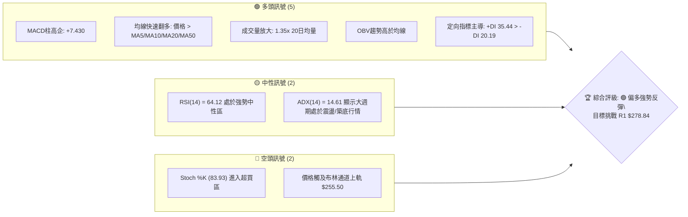
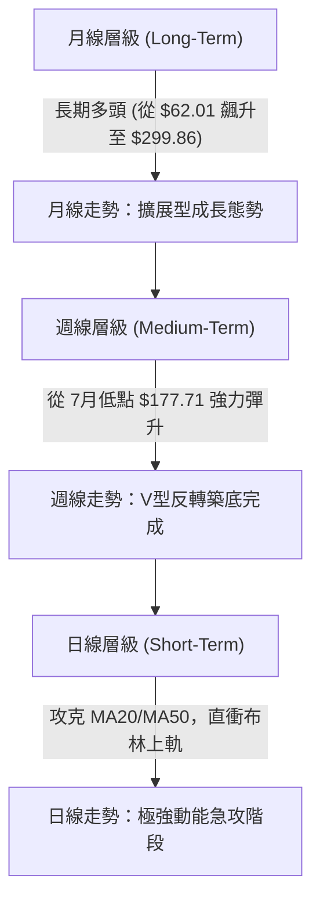
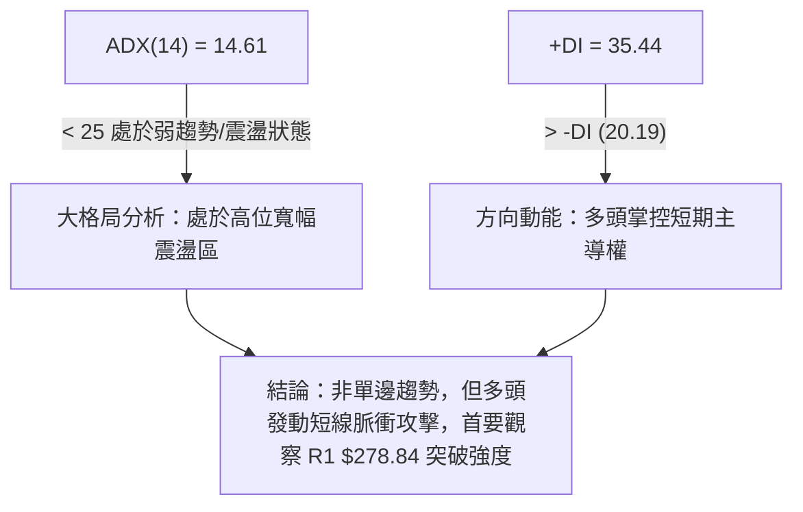
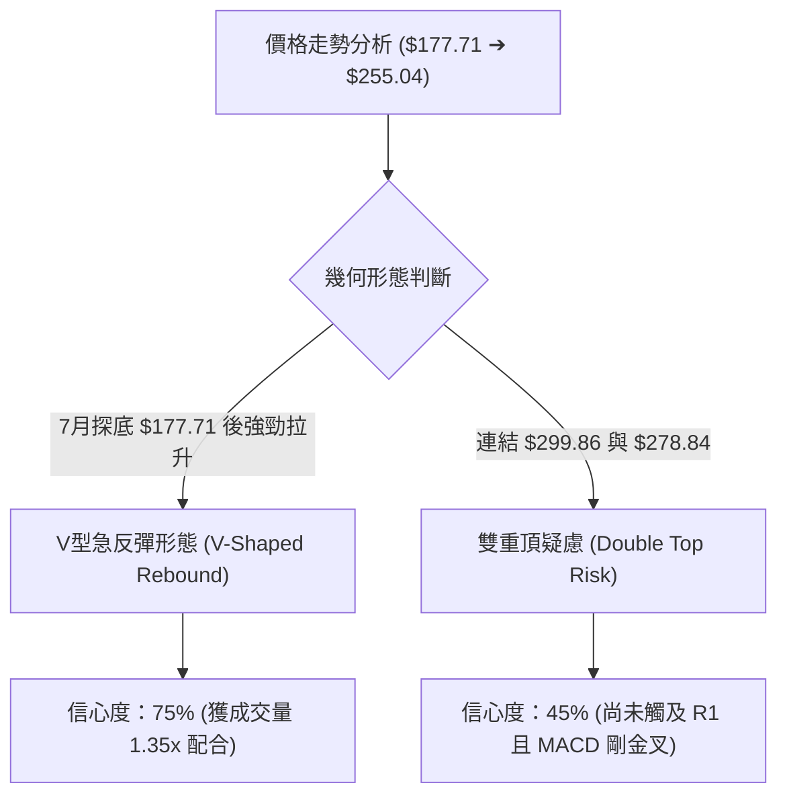
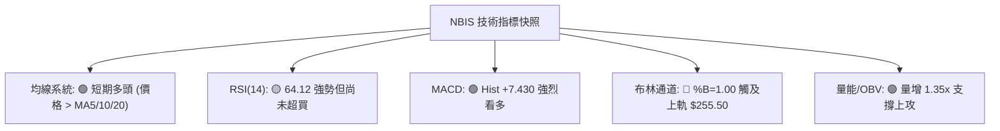
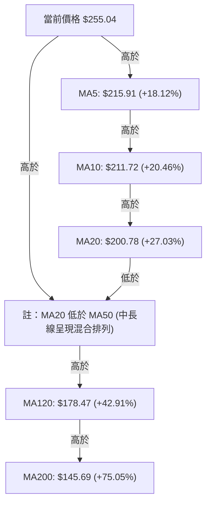
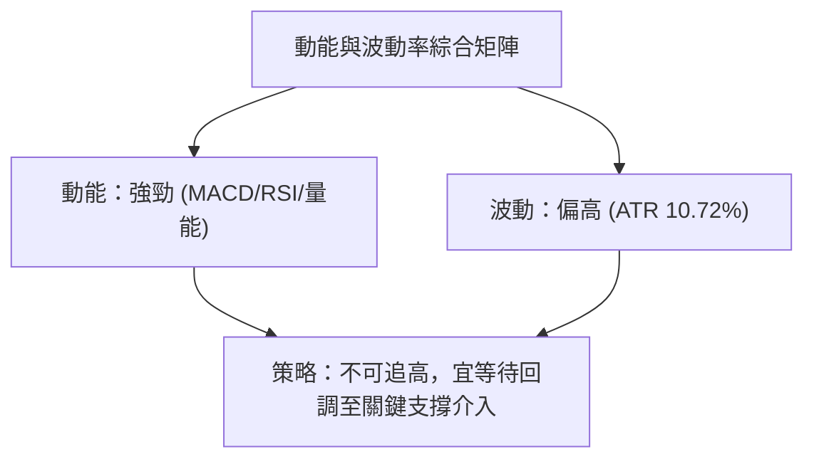
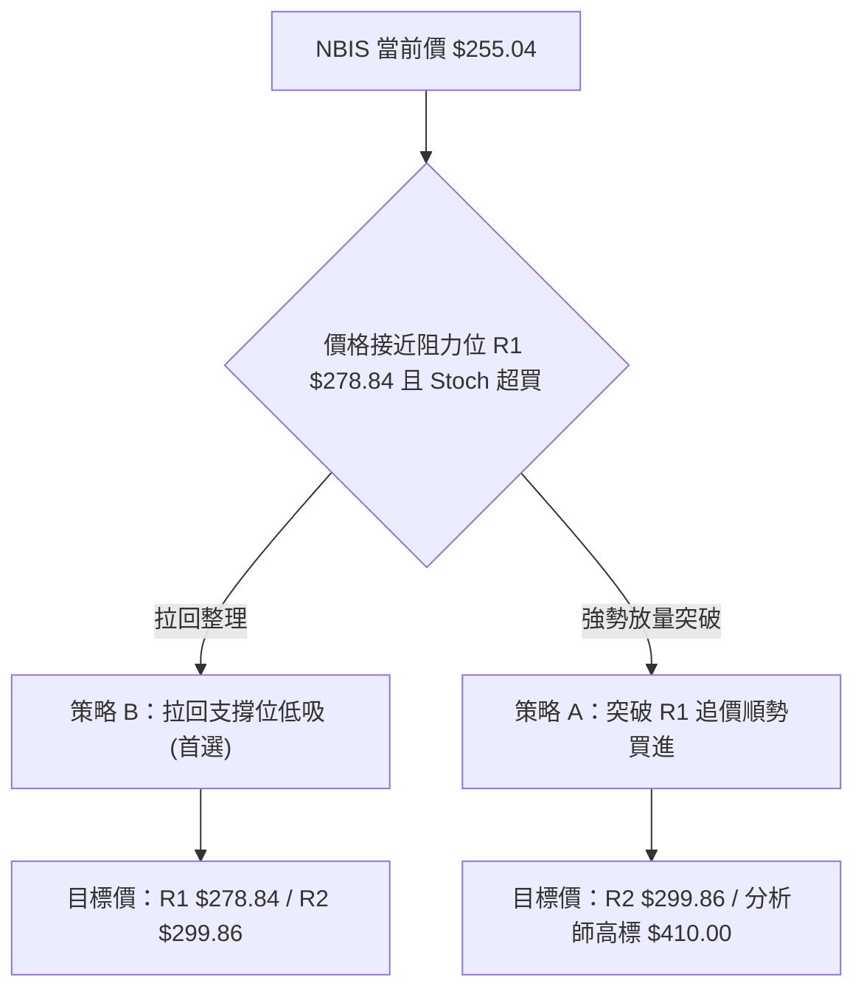
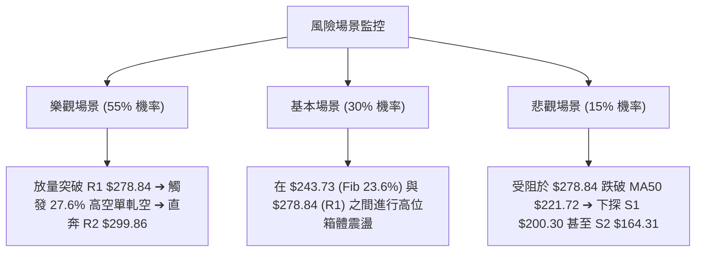

# NBIS 技術分析報告

> **報告日期**：2026-08-14 ｜ **語言**：繁體中文 ｜ **數據來源**：Yahoo Finance ｜ **當前價格**：$255.04

---

## 目錄

| 章節 | 內容 |
|------|------|
| [1. 技術面概覽](#1-技術面概覽) | 訊號儀表板、核心指標、評分卡 |
| [2. 趨勢分析](#2-趨勢分析) | 多時框趨勢、長中短期走勢 |
| [3. 圖表形態分析](#3-圖表形態分析) | 形態識別、K線組合、目標價 |
| [4. 支撐與阻力](#4-支撐與阻力) | 關鍵價位、斐波那契回調 |
| [5. 技術指標深度解讀](#5-技術指標深度解讀) | MA/RSI/MACD/布林/成交量 |
| [6. 動能與波動率](#6-動能與波動率) | 動能評估、ATR、Beta |
| [7. 多時框架總結](#7-多時框架總結) | 時框架評分矩陣 |
| [8. 交易策略建議](#8-交易策略建議) | 多空策略、風險報酬比 |
| [9. 風險提示與監控](#9-風險提示與監控) | 監控指標、風險場景 |

---

## 1. 技術面概覽

### 🎯 技術訊號儀表板



### 📊 核心指標速覽表

| 指標類別 | 指標名稱 | 當前數值 | 訊號 | 解讀 |
|----------|----------|----------|------|------|
| **價格** | 當前價格 | $255.04 | 🟢 | 位於52週區間 81.2% 高位，短線強勢急升 |
| **均線** | MA20 / MA50 | $200.78 / $221.72 | 🟢 | 價格全面站上 MA5, MA10, MA20, MA50，短線呈多頭排列 |
| **均線** | MA200 | $145.69 | 🟢 | 遠高於 200 日均線（高出 75.05%），長期結構維持多頭 |
| **動能** | RSI(14) | 64.12 | 🟢 | 位於多頭強勢區（>50），尚未進入極端超買區（>70） |
| **動能** | MACD | Hist +7.430 | 🟢 | MACD柱大幅擴張，快線 3.561 向上穿越慢線 -3.869 形成強烈柱狀擴張 |
| **動能** | Stoch %K/%D | 83.93 / 79.95 | 🔴 | KD 指標雙雙進入 80 以上超買區，短線留意回檔過熱風險 |
| **波動** | ATR(14) | $27.35 | 🟡 | 每日波幅高達 10.72%，屬於高波動性高貝塔標的 |
| **趨勢** | ADX(14) | 14.61 | 🟡 | ADX < 25 表示大格局處於寬幅震盪，非單邊強烈趨勢 |
| **布林** | BB Upper/%B | $255.50 / 1.00 | 🔴 | 價格貼近布林上軌，具備喇叭口擴張動能但也面臨上軌阻力 |
| **量能** | 成交量比 | 1.35x (36.01M) | 🟢 | 成交量超越 20 日均量，量增價漲，資金進場意願強烈 |

### 🏆 技術評分卡

```
╔══════════════════════════════════════════════════════════════════╗
║                   技術評分卡 — NBIS (2026-08-14)                  ║
╠══════════════════════════════════════════════════════════════════╣
║ 趨勢強度 (Trend)     ██████████████░░░░░░  70/100  🟢 看多        ║
║ 動能指標 (Momentum)  ████████████████░░░░  80/100  🟢 強勁        ║
║ 支撐穩定度 (Support) █████████████░░░░░░░  65/100  🟡 中等        ║
║ 成交量配合 (Volume)  ████████████████░░░░  80/100  🟢 量增        ║
║ 形態完整度 (Pattern) █████████████░░░░░░░  68/100  🟢 V型反彈     ║
║ 均線排列 (MAs)       ███████████████░░░░  75/100  🟢 短多中多     ║
╠══════════════════════════════════════════════════════════════════╣
║ 綜合評分             ███████████████░░░░  74/100  🟢 強勢偏多    ║
╚══════════════════════════════════════════════════════════════════╝
```

---

## 2. 趨勢分析

### 🌐 多時框趨勢分析



### 📈 長期趨勢 — 12個月走勢圖（Unicode）

```
NBIS 月線收盤走勢圖（過去12個月：2025-09 至 2026-08）
價格軸 ($)
$300 ┤                                        ● $276.17
$260 ┤                                                ● $255.04 (現價)
$220 ┤                                  ● $231.09
$180 ┤                                            ● $190.41
$140 ┤        ● $130.82
$100 ┤  ● $112.27  ● $94.87  ● $103.76
 $60 ┤               ● $83.71
     └──────────────────────────────────────────────────────────
       Sep25 Oct25 Nov25 Dec25 Jan26 Feb26 Mar26 Apr26 May26 Jun26 Jul26 Aug26
```

#### 走勢特徵分析表

| 時間階段 | 區間價格變動 | 漲跌幅 | 走勢特徵分析 |
|----------|--------------|--------|--------------|
| **2025-09 至 2025-10** | $112.27 ➔ $130.82 | +16.52% | 初步爆發期，伴隨AI基礎建設板塊資金湧入 |
| **2025-11 至 2025-12** | $130.82 ➔ $83.71 | -36.01% | 高位深度回調，下探 52週低點區間（$62.01 - $83.71） |
| **2026-01 至 2026-03** | $83.71 ➔ $103.76 | +23.95% | 底部打底階段，籌碼沉澱，MA200 ($145.69) 下方蓄勢 |
| **2026-04 至 2026-06** | $103.76 ➔ $276.17 | +166.16%| 主升段飆漲，創下歷史新高 $299.86 |
| **2026-07** | $276.17 ➔ $190.41 | -31.05% | 洗盤回檔，最低回試 50% 斐波那契位 $180.93（週線低點 $177.71） |
| **2026-08 (當前)** | $190.41 ➔ $255.04 | +33.94% | 避開破位風險，展現強烈 V 型拉升，收復大部分失地 |

### 📊 中期趨勢（週線分析）

```
NBIS 週線關鍵壓力與支撐示意圖
═══════════════════════════════════════════════════════════════════
 $299.86 ─────────────────────────────────────────────── 52W High (R2)
 $278.84 ─────────────────────────────────────────────── 波段高點壓力 (R1)
 $255.04 ═══════════════════════════════════════════════ 現價 (BB上軌附近)
 $243.73 ----------------------------------------------- Fib 23.6% 回調位
 $221.72 ─────────────────────────────────────────────── MA50 (強弱分水嶺)
 $209.00 ----------------------------------------------- Fib 38.2% / S1 區間 ($200.30)
 $180.93 ─────────────────────────────────────────────── Fib 50.0% / 7月起漲低點
 $145.80 ─────────────────────────────────────────────── MA200 / 強支撐 S3
═══════════════════════════════════════════════════════════════════
```

### ⚡ 趨勢強度評估（ADX 解讀）



| ADX 數值區間 | 趨勢狀態 | NBIS 當前狀態 (14.61) | 交易策略對策 |
|--------------|----------|-----------------------|--------------|
| 0 – 20 | 無趨勢 / 盤整 | **✓ 當前所在區間** | **區間高拋低吸或關鍵位置突破順勢跟進** |
| 20 – 25 | 趨勢醞釀中 | 接近觸發邊緣 | 準備迎接收斂後的突破行情 |
| 25 – 50 | 強烈單邊趨勢 | 尚未達到 | 順勢持股，不輕易猜頂 |
| > 50 | 極端單邊趨勢 | 尚未達到 | 注意動能過熱反轉 |

---

## 3. 圖表形態分析

### 🔍 形態識別系統



#### 形態信心度與目標價評估表

| 形態名稱 | 信心度 | 判斷依據（引用數據） | 完成度 | 目標價計算式 | 估算目標價 |
|----------|--------|----------------------|--------|--------------|------------|
| **V型急反彈** | 75% | 7月19日低點 $177.71 止跌，獲 50% Fib ($180.93) 支撐，量能放大至 138M | 85% | 低點 $177.71 + 反彈高度 ($255.04 - $177.71) | **$278.84 (R1)** |
| **高位箱體震盪** | 80% | 價格在 $200.30 (S1) 與 $299.86 (52W高) 之間寬幅擺動，ADX=14.61 證實無單邊趨勢 | 90% | 箱體下軌 $200.30 ~ 上軌 $299.86 | **$299.86 (R2)** |
| **潛在雙重頂** | 45% | 前高 $299.86，若於 R1 $278.84 受阻受挫則成立；目前 MACD 擴張，訊號不足 | 30% | 若 $278.84 遇阻，形態高度 = $278.84 - $200.30 = $78.54 | 下探 **$121.76** (未確認) |

### 🕯️ 重要K線形態分析

| 月份/週期 | 收盤價 | 關鍵 K 線形態 | 解讀 | 多空訊號 |
|-----------|--------|---------------|------|----------|
| **2026-06** | $276.17 | 長上影紅 K 線 | 衝高至 $299.86 後面臨獲利賣壓，顯示 $300 大關阻力強勁 | 🟡 獲利了結 |
| **2026-07** | $190.41 | 長下影黑 K 線 | 探底 $177.71 後成功收復 $190，顯示買盤在 $180.93 (Fib 50%) 強力介入 | 🟢 底部支撐 |
| **2026-08 (最新)**| $255.04 | 大陽線強攻 (Marubozu/Strong Green) | 單週大漲 +35.68%（從 $187.97 到 $255.04），吞噬前月陰線主體 | 🟢 強烈看多 |

### 📉 ASCII 走勢形態示意圖

```
NBIS V型強勢反彈與高位阻力示意圖
 $299.86 ┤                                     ● (52W High)
 $278.84 ┤                                 ┌───● R1 壓力位
 $255.04 ┤                             ●───┘ (現價，強勢突破 MA50)
 $221.72 ┤                        ● (MA50 被快速穿透)
 $180.93 ┤            ●───────● (7月打底 $177.71 / Fib 50%)
         └────────────────────────────────────────────────────────
           2026-06     2026-07          2026-08 (目前)
```

### 🎯 形態目標價計算

1. **V型反彈推進目標**：
   - 形態底部：$177.71（2026-07-19 週收盤附近極限低點）
   - 頸線/初步阻力：R1 = **$278.84**
   - 若有效突破 R1，等長測量目標價 = $278.84 + ($278.84 - $177.71) = **$379.97**（需宏觀動能配合，暫不作為第一交易目標，第一目標看 R2 **$299.86**）。

---

## 4. 支撐與阻力

### 🗺️ 關鍵價位分布圖（Unicode）

```
NBIS 價位結構分布圖 (由 OHLCV 與斐波那契精確計算)
═══════════════════════════════════════════════════════════════════
 $299.86 ║████████████████████████████████████████║ 52W 最高點 / R2 阻力
 $278.84 ║██████████████████████████████            ║ 波段高點聚類 / R1 阻力
 $255.50 ║▓▓▓▓▓▓▓▓▓▓▓▓▓▓▓▓▓▓▓▓▓▓▓▓▓                 ║ 布林通道上軌
 $255.04 ╠══════════════════════════════════════════╣ ◄ 當前價格 ($255.04)
 $243.73 ║▓▓▓▓▓▓▓▓▓▓▓▓▓▓▓▓▓▓▓▓                      ║ 23.6% 斐波那契回調位
 $221.72 ║████████████████                          ║ MA50 均線支撐
 $209.00 ║▓▓▓▓▓▓▓▓▓▓▓▓                              ║ 38.2% 斐波那契回調位
 $200.30 ║████████████████████                      ║ 近一年關鍵波段低點 S1 / MA20
 $180.93 ║▓▓▓▓▓▓▓▓                                  ║ 50.0% 斐波那契回調位 (7月支撐)
 $164.31 ║████████████                              ║ 波段低點聚類 S2
 $145.80 ║████████████████████                      ║ 強支撐 S3 / MA200 ($145.69)
═══════════════════════════════════════════════════════════════════
```

### 🚧 阻力位分析表

| 阻力級別 | 精確價位 | 形成原因（依據數據） | 突破難度 | 關鍵重要性 |
|----------|----------|----------------------|----------|------------|
| **R1** | **$278.84** | 近一年波段高點聚類；離現價 +9.33% | 🟡 中高 | 極高。突破此位將直接指向上方歷史高點 |
| **R2** | **$299.86** | 52週最高價 (52W High)；離現價 +17.57% | 🔴 極高 | 心理關卡 $300 元大關，解套盤與獲利盤強烈湧出區 |

### 🛡️ 支撐位分析表

| 支撐級別 | 精確價位 | 形成原因（依據數據） | 守住機率 | 關鍵重要性 |
|----------|----------|----------------------|----------|------------|
| **S1** | **$200.30** | 波段低點聚類，疊加 MA20 ($200.78) | 🟢 80% | 短線多頭防線；跌破宣告反彈結束，進入深回調 |
| **S2** | **$164.31** | 近一年次要波段低點區間 | 🟡 65% | 中期防禦關卡 |
| **S3** | **$145.80** | 近一年強低點聚類，疊加 MA200 ($145.69) | 🟢 90% | 牛熊分界線；長期多頭堡壘 |

### 📐 斐波那契回調位分析（52週區間 $62.01 ➔ $299.86）

```
斐波那契層級結構與現價位置：
  0.0% (52W High) : $299.86  ─── 天花板阻力
  23.6% 回調位    : $243.73  ─── 短線回檔第一支撐 (現價 $255.04 剛越過此位)
  38.2% 回調位    : $209.00  ─── 中期強弱分水嶺 (疊加 S1 $200.30)
  50.0% 回調位    : $180.93  ─── 7月成功測試之黃金支撐位 (實測低點 $177.71)
  61.8% 回調位    : $152.87  ─── 深擴展支撐位
  78.6% 回調位    : $112.91  ─── 長線築底區
100.0% (52W Low)  : $62.01   ─── 地基
```

*   **當前解讀**：現價 **$255.04** 已成功重新站上 23.6% 斐波那契回調位 ($243.73)，顯示從 $177.71 起算的回彈動能極其強勁，目前運行於 23.6% ($243.73) 至 0.0% ($299.86) 的多頭控制區。

---

## 5. 技術指標深度解讀

### 🎛️ 指標訊號總覽



### 📈 移動平均線排列分析



- **均線狀態解讀**：價格短線暴漲突破所有短期與中期均線（MA5、MA10、MA20、MA50）。由於 7月曾出現較深回調，MA20 ($200.78) 尚未穿越 MA50 ($221.72)，屬於**短線黃金交叉、中長線混合排列**。若價格維持在 $221.72 之上，MA20 將迅速向上金叉 MA50，完成全面多頭排列。

### 📉 RSI(14) 分析

- **RSI(14) 數值**：**64.12**
- **進度條**：`███████████████░░░░░ 64.12%`
- **動能評估**：RSI 從 7月低點的 32.2 迅猛回升至 64.12，進入多頭主導區。尚未達到 70 以上的極端超買區，意味著向上衝擊 R1 ($278.84) 仍有動能空間。
- **背離判斷**：日線與週線層級均**無頂背離現象**，價格上漲伴隨 RSI 向上同步擴張，趨勢健康。

### 📊 MACD(12/26/9) 訊號解讀

- **MACD 快線**：3.561
- **Signal 慢線**：-3.869
- **MACD 柱狀圖 (Histogram)**：**+7.430** 🟢
- **分析**：柱狀圖由負轉正並出現 +7.430 的巨幅擴張，快線向上強勢金叉慢線。這是非常強烈烈的短線買進/動能爆發訊號，表明多頭掌控市場。

### 📦 布林通道分析

```
NBIS 布林通道現況 (BB Width: $146.05 - $255.50)
 $255.50 ┤======================================= 上軌 (現價 $255.04 觸及上軌)
 $225.00 ┤              
 $200.78 ┤--------------------------------------- 中軌 (MA20)
 $175.00 ┤
 $146.05 ┤======================================= 下軌
```

- **%B 指標**：**1.00**（價格恰好貼緊布林帶上軌 $255.50）。
- **態勢**：布林帶進入「開口擴張 (Band Walking)」模式，成交量放大配合價格貼上軌，屬於典型強勢動能突破；但短線需防範價格受阻於上軌發生的技術性拉回。

### 💹 成交量分析（量價配合度）

- **最新日成交量**：36,012,698 股
- **20日均量**：26,608,665 股（**量比 1.35x**）
- **OBV 能量潮**：OBV > OBV_MA，能量潮指標呈斜率向上，證明資金為主動買盤推升，非無量空漲，量價配合極佳。

---

## 6. 動能與波動率

### ⚡ 動能評估

| 評估維度 | 當前狀態 | 數據指標依據 | 交易意涵 |
|----------|----------|--------------|----------|
| **短線爆發力** | 🟢 極強 | MACD Hist +7.430, 5日漲幅 >18% | 具備向上衝擊壓力位之慣性 |
| **波段持續性** | 🟡 中等 | ADX 14.61 (<25) | 面臨高位震盪，需防範急漲後的拉回洗盤 |
| **波動率層級** | 🔴 高波動 | ATR(14) = $27.35 (10.72%) | 操作必須放寬止損區間，避免被噪音洗出場 |



### 📊 ATR 波動率分析

- **ATR(14)**：**$27.35**（佔股價比例 10.72%）
- **風控指引**：
  - **1.0x ATR 止損距離**：$27.35（適合超短線）
  - **1.5x ATR 止損距離**：**$41.03**（建議短線波段設定）
  - **2.0x ATR 止損距離**：$54.70（適合中線趨勢持股）

### 📐 Beta 與市場相關性

- **空頭回補壓力 (Short Interest)**：Short % Float 高達 **27.6%**，Short Ratio 2.78。高空單比例意味著一旦突破 R1 ($278.84)，極易觸發**軋空行情 (Squeeze)**，進一步推升股價挑戰 R2 ($299.86)。

---

## 7. 多時框架總結

### 📋 時框架評分表

| 時框架 | 趨勢方向 | 動能狀態 | 均線排列 | 形態結構 | 評分 | 交易建議 |
|--------|----------|----------|----------|----------|------|----------|
| **月線 (Long)** | 🟢 多頭 | 🟡 中性回升 | 多頭排列 | 巨幅上升波段 | **80/100** | 長線逢低布局 |
| **週線 (Med)** | 🟢 反彈強勢 | 🟢 快速轉強 | 混合排列 | V型打底復甦 | **75/100** | 偏多操作 |
| **日線 (Short)**| 🟢 脈衝上攻 | 🔴 超買邊緣 | 短多排列 | 觸及布林上軌 | **72/100** | 待回調買進 |

### 🔲 綜合訊號矩陣

```
╔══════════════════════════════════════════════════════════════════╗
║                    NBIS 多時框架訊號收斂矩陣                     ║
╠══════════════════════════════════════════════════════════════════╣
║ 時框     MA趨勢  RSI動能  MACD  布林位置  量能配合  綜合定性   ║
║ 日線      🟢       🟢      🟢      🔴       🟢     強勢急攻   ║
║ 週線      🟢       🟡      🟢      🟡       🟢     底部確立   ║
║ 月線      🟢       🟢      🟢      🟡       🟢     長多未變   ║
╠══════════════════════════════════════════════════════════════════╣
║ 訊號收斂結論：大中小時框總體一致向多，短線受制於布林上軌與超買  ║
╚══════════════════════════════════════════════════════════════════╝
```

### ⚖️ 多時框收斂結論

依據多時框收斂規則：ADX(14) 為 14.61 (<25)，顯示大結構為高位寬幅震盪區間；但日線與週線展現極強的 V 型反彈動能。**最終收斂結論為：🟢 強勢偏多（Rebound/Breakout Test）**，主策略以「拉回回檔至支撐位做多」或「順勢突破做多」為主。

---

## 8. 交易策略建議

### 🗺️ 策略決策流程圖



### 🧭 策略路由

> **當前主策略方向 = 🟢 強勢多頭布局（綜合評分 74/100）**

### 🎯 價格情境階梯 (Price Scenarios)

| 觸發條件 | 下一目標 | 後續延伸 | 情境含義 |
|----------|----------|----------|----------|
| **突破 R1 $278.84** | R2 $299.86 | $379.97 / $410.00 | 強勢軋空，挑戰歷史新高 |
| **站穩 23.6% ($243.73)** | R1 $278.84 | R2 $299.86 | 正常高位消化賣壓，準備再攻 |
| **跌破 S1 $200.30** | S2 $164.31 | S3 $145.80 | 反彈夭折，重新下探年線區 |

### 📊 情境機率分佈

| 情境 | 機率 | 主要依據 |
|------|------|----------|
| **繼續上行 / 突破 R1** | **55%** | MACD 柱狀圖 +7.430 強勢擴張，OBV > MA 量能配合，高空單 27.6% 軋空潛力 |
| **高位震盪 / 消化超買** | **30%** | ADX 14.61 (<25) 顯示大盤整結構，Stoch %K 83.93 超買需要整理 |
| **大幅回落 / 探底** | **15%** | 若整體市場崩跌，可能拉回測試 MA50 $221.72 或 S1 $200.30 |

### 🟢 主策略詳情

#### 策略 A：突破順勢追價策略（動能交易者）
*適合不願錯過軋空行情的積極型交易者*

*   **進場條件**：日線收盤價強勢突破阻力 R1 **$278.84**，且成交量高於 20日均量 (26.6M)。
*   **進場價格**：**$279.50**（確認突破 R1）
*   **目標價 T1**：**$299.86**（52週高點 R2，預期獲利 +7.28%）
*   **目標價 T2**：**$350.00**（突破歷史新高後的心理關卡，預期獲利 +25.22%）
*   **止損價格**：**$251.50**（設於突破點下方約 1.0x ATR，$279.50 - $27.35，即約 $252.15 附近精確修正）
*   **風險報酬比**：1 : 2.52（以 T2 計算）
*   **建議倉位**：5% – 8% 資金

#### 策略 B：拉回低吸布局策略（波段交易者，首選）
*適合注重勝率與風險報酬比的穩健型交易者*

*   **進場條件**：價格自布林上軌回調至 23.6% 斐波那契位 **$243.73** 或 MA50 **$221.72** 附近止跌出現下影線。
*   **進場價格**：**$243.73**（斐波那契 23.6% 支撐位）
*   **目標價 T1**：**$278.84**（阻力 R1，預期獲利 +14.40%）
*   **目標價 T2**：**$299.86**（52週高點 R2，預期獲利 +23.03%）
*   **止損價格**：**$216.38**（設於 MA50 $221.72 下方，防範假突破，跌幅約 -11.22%）
*   **風險報酬比**：1 : 2.05（以 T2 計算：$56.13 潛力獲利 / $27.35 風險）
*   **建議倉位**：8% – 12% 資金

### 🔴 反向風險觸發點（對沖與風控提示）

*   **多頭停損 / 對沖觸發訊號**：若價格無力維持在 **$200.30** (S1) 與 MA20 上方，且日線收盤跌破 **$200.30**，表明 V 型反彈宣告失敗，必須全面清倉多頭並進行對沖。

### ⭐ 整體訊號強度評星

```
做多訊號強度：★★██☆  (4/5星)  - 動能強勁，獲量能與MACD背書
做空訊號強度：★☆☆☆☆  (1/5星)  - 逆勢風險極高，不建議建立空單
整體可信度：  ★★██☆  (4/5星)  - 數據完整，指標收斂一致
```

---

## 9. 風險提示與監控

### ✅ 關鍵監控指標 Checklist

```
╔══════════════════════════════════════════════════════════════════╗
║                   NBIS 技術面每日監控清單 (Checklist)             ║
╠══════════════════════════════════════════════════════════════════╣
║ [ ] R1 阻力位 $278.84 衝刺情況：觀察是否出現長上影線獲利賣壓    ║
║ [ ] RSI(14) 是否突破 70 進入極端超買區（當前 64.12）            ║
║ [ ] MACD 柱狀圖是否持續擴張（當前 +7.430）                       ║
║ [ ] 成交量是否維持在 20日均量 (26.6M) 以上                      ║
║ [ ] S1 支撐位 $200.30 與 MA20 ($200.78) 防守有效性              ║
║ [ ] Short Float (27.6%) 是否引發軋空行情                        ║
╚══════════════════════════════════════════════════════════════════╝
```

### ⚠️ 風險場景分析



### 🛡️ 風險管理重要提醒

1.  **高波幅風險**：NBIS 的 ATR(14) 為 $27.35（每日平均波幅 10.72%），屬於高波動性股票。交易者必須相應**降低單一股票倉位**（建議總資金 10% 以內），避免因單日劇烈波動觸發無謂止損。
2.  **超買回檔風險**：Stoch %K 達 83.93，價格處於布林上軌 $255.50，短線不宜在 $255.04 盲目追高，等待拉回 $243.73 附近再行布局更具風險報酬比優勢。

---

## 📋 報告總結

```
╔══════════════════════════════════════════════════════════════════╗
║                   NBIS 技術分析報告總結                           ║
════════════════════════════════════════════════════════════════════
報告日期：2026-08-14
當前價格：$255.04
分析評級：🟢 強勢偏多 (強勁反彈衝擊 R1 阻力位)

關鍵結論：
├─ 長期趨勢：🟢 多頭結構 (遠高於 MA200 $145.69)
├─ 中期趨勢：🟢 V型反轉完成，從7月低點 $177.71 強勢回升
├─ 短期趨勢：🟢 強烈脈衝，MACD柱 +7.430，突破 MA5/10/20/50
├─ 關鍵支撐：$243.73 (Fib 23.6%) / $221.72 (MA50) / $200.30 (S1)
├─ 關鍵阻力：$278.84 (R1) / $299.86 (52W High R2)
└─ 分析師目標：均價 $250.75 / 最高 $410.00 (共16位分析師 Buy Consensus)

最優策略組合：
1. 🥇 最佳機會：策略 B（拉回 Fib 23.6% $243.73 逢低買進，目標 $299.86）
2. 🥈 次選機會：策略 A（放量突破 R1 $278.84 後順勢追買，目標 $350.00）
3. 🥉 風控防線：收盤跌破 S1 $200.30 無條件執行止損
════════════════════════════════════════════════════════════════════
```

---

> ⚠️ **免責聲明**：本報告為 AI 自動生成之技術分析，所有數據及估算均基於提供的歷史價格資訊。本報告**僅供研究與學術參考**，**不構成任何投資建議**。投資有風險，入市需謹慎。

---

*報告生成時間：2026-08-14 ｜ 數據來源：Yahoo Finance ｜ 分析框架：多時框技術分析*