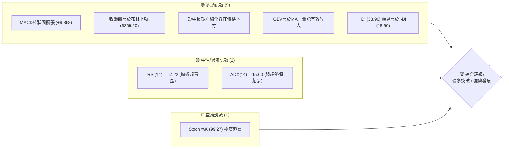
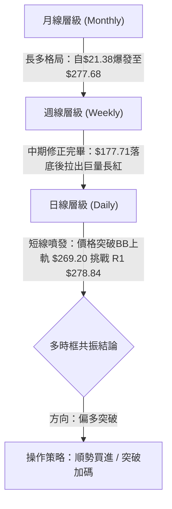
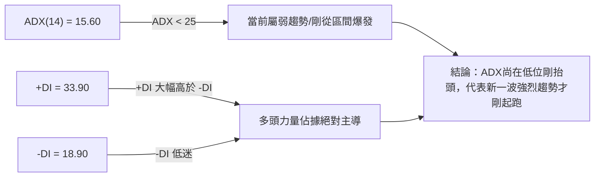
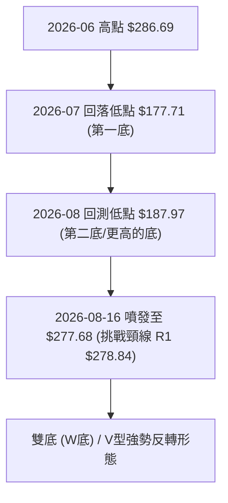
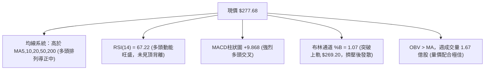
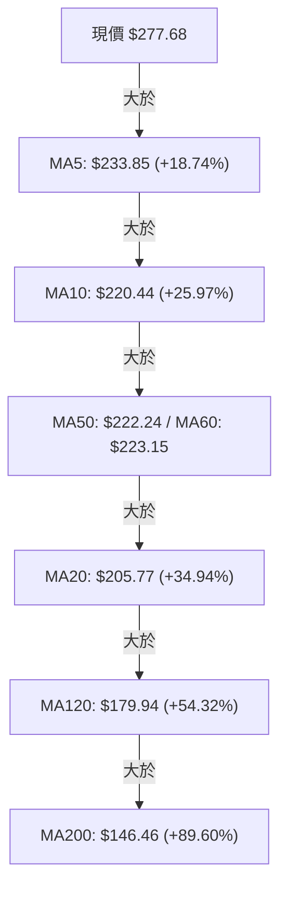
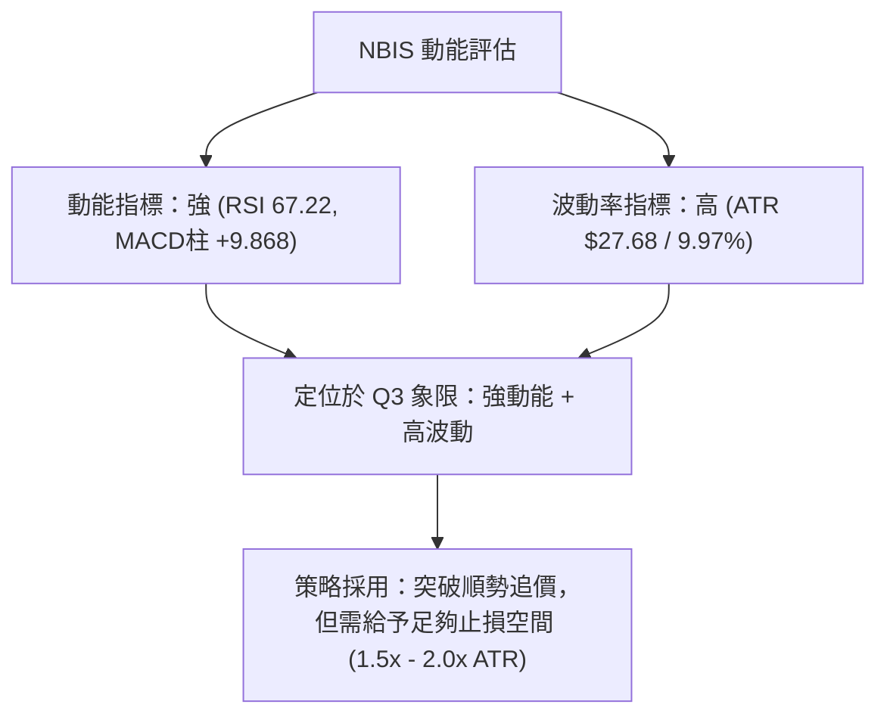
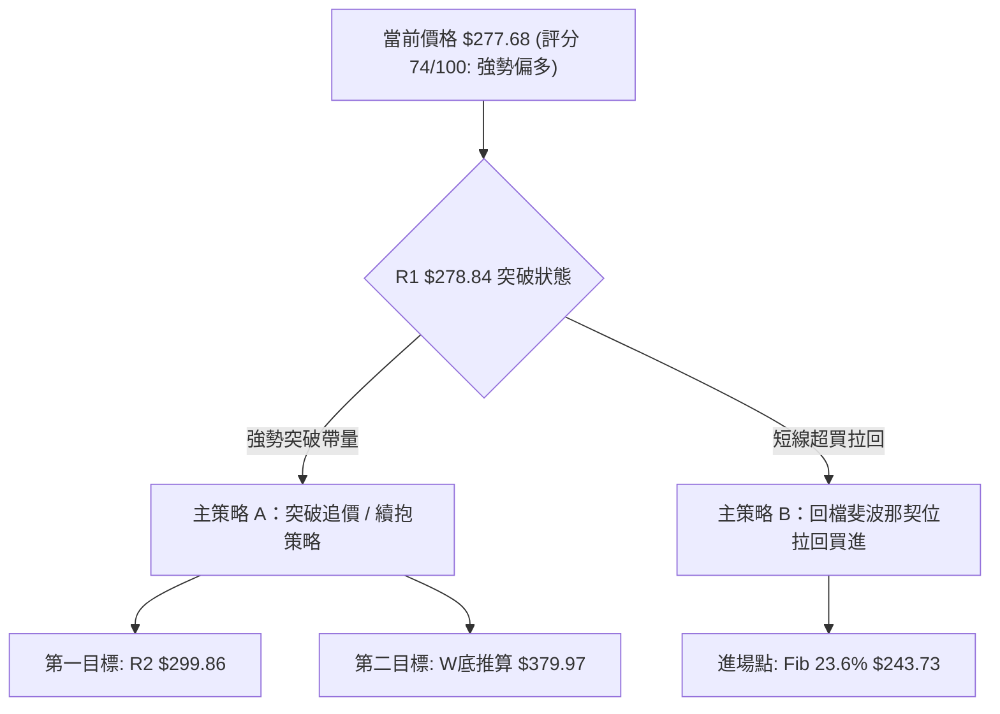
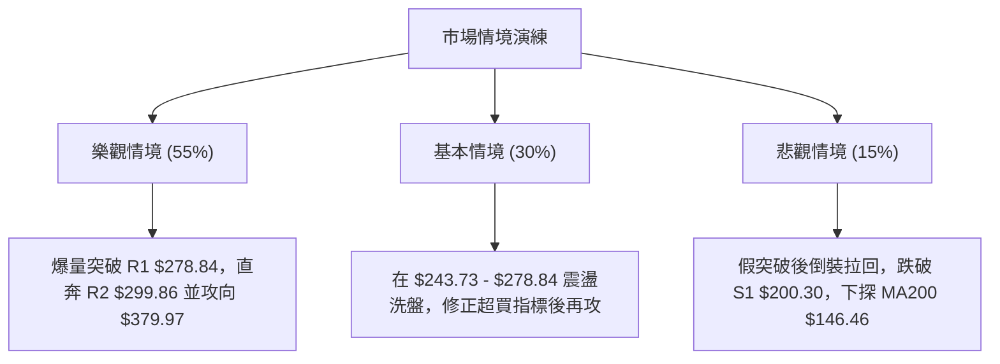

# NBIS 技術分析報告

> **報告日期**：2026-08-15 ｜ **語言**：繁體中文 ｜ **數據來源**：Yahoo Finance ｜ **當前價格**：$277.68

---

## 目錄

| 章節 | 內容 |
|------|------|
| [1. 技術面概覽](#1-技術面概覽) | 訊號儀表板、核心指標、評分卡 |
| [2. 趨勢分析](#2-趨勢分析) | 多時框趨勢、長中短期走勢、12個月ASCII圖 |
| [3. 圖表形態分析](#3-圖表形態分析) | 形態識別與信心度、K線組合、目標價計算 |
| [4. 支撐與阻力](#4-支撐與阻力) | 關鍵價位分布圖、阻力/支撐層級、斐波那契回調 |
| [5. 技術指標深度解讀](#5-技術指標深度解讀) | 均線系統、RSI、MACD、布林通道、OBV量能 |
| [6. 動能與波動率](#6-動能與波動率) | 動能四象限、ATR波動率、Beta市場相關性 |
| [7. 多時框架總結](#7-多時框架總結) | 時框架評分矩陣、多時框收斂結論 |
| [8. 交易策略建議](#8-交易策略建議) | 策略路由、情境階梯、主/次交易策略 |
| [9. 風險提示與監控](#9-風險提示與監控) | 監控Checklist、三情境演練、倉位風控 |

---

## 1. 技術面概覽

### 🎯 技術訊號儀表板



### 📊 核心指標速覽表

| 指標類別 | 指標名稱 | 當前數值 | 訊號 | 解讀 |
|----------|----------|----------|------|------|
| **價格** | 當前價格 | $277.68 | 🟢 | 位於52週區間 90.7% 位置，逼近歷史高點 |
| **均線** | MA20 / MA50 | $205.77 / $222.24 | 🟢 | 價格遠高於均線，短線呈爆發性多頭排列 |
| **均線** | MA200 | $146.46 | 🟢 | 長期牛市基底極強，價格領先MA200達 89.6% |
| **動能** | RSI(14) | 67.22 | 🟡 | 位於強勢多頭區間，尚未出現頂背離 |
| **動能** | MACD (12,26,9) | 8.466 / Hist +9.868 | 🟢 | 雙線向上黃金交叉，柱狀圖大幅擴張 |
| **波動** | ATR(14) | $27.68 (9.97%) | 🔴 | 日均波動近10%，屬於高Beta高波動標的 |
| **通道** | 布林通道 %B | 1.07 | 🟢 | 強勢貼上軌發散（Band Walk形態） |
| **量能** | 20日均量比 | 1.08x | 🟢 | 伴隨週成交量 1.67 億股劇烈放量上攻 |

### 🏆 技術評分卡

```
╔══════════════════════════════════════════════════════════════╗
║                NBIS 技術評分卡 (2026-08-15)                  ║
╠══════════════════════════════════════════════════════════════╣
║ 趨勢強度      ▓▓▓▓▓▓▓▓▓▓▓▓░░░░░░░░  60/100  🟡 (ADX剛轉強)     ║
║ 動能指標      ▓▓▓▓▓▓▓▓▓▓▓▓▓▓▓▓▓▓░░  90/100  🟢 (MACD強勁)      ║
║ 支撐穩定度    ▓▓▓▓▓▓▓▓▓▓▓▓░░░░░░░░  60/100  🟡 (下方跳空差距大) ║
║ 成交量配合    ▓▓▓▓▓▓▓▓▓▓▓▓▓▓▓▓░░░░  80/100  🟢 (量增價漲)      ║
║ 形態完整度    ▓▓▓▓▓▓▓▓▓▓▓▓▓▓▓▓░░░░  80/100  🟢 (雙底爆發完成)  ║
║ 均線排列      ▓▓▓▓▓▓▓▓▓▓▓▓▓▓░░░░░░  70/100  🟢 (短均急升導正)  ║
╠══════════════════════════════════════════════════════════════╣
║ 綜合評分      ▓▓▓▓▓▓▓▓▓▓▓▓▓▓▓░░░░░  74/100  🟢 強勢買入/持股 ║
╚══════════════════════════════════════════════════════════════╝
```

---

## 2. 趨勢分析

### 🌐 多時框趨勢分析



### 📈 長期趨勢 — 12個月走勢圖（Unicode）

```
NBIS 歷史月線走勢圖 (2025-09 至 2026-08)
價格軸 ($)
$300 ┤                                                ● $277.68 (現價)
$275 ┤                                            ●   │
$250 ┤                                            │   │
$225 ┤                                    ●       │   │
$200 ┤                                    │   ●   │   │
$175 ┤                                    │   │   │   │
$150 ┤                        ●           │   │   │   │
$125 ┤            ●   ●       │           │   │   │   │
$100 ┤        ●   │   │   ●   │   ●   ●   │   │   │   │
$75  ┤        │   │   │   │   │   │   │   │   │   │   │
     └────────┴───┴───┴───┴───┴───┴───┴───┴───┴───┴───┴────────
     月份    09  10  11  12  01  02  03  04  05  06  07  08
     (年份:  25  25  25  25  26  26  26  26  26  26  26  26)
```

**走勢特徵分析表格**：

| 階段 | 時間區間 | 收盤價變化 | 漲跌幅 | 走勢特徵分析 |
|------|----------|------------|--------|--------------|
| **起漲主升段** | 2025/09 - 2025/10 | $112.27 → $130.82 | +16.52% | 市場重新定價 AI 基礎設施價值，突破百元關卡 |
| **深幅回檔期** | 2025/11 - 2025/12 | $130.82 → $83.71 | -36.01% | 獲利了結賣壓湧現，打回 $80 附近尋求支撐 |
| **築底打底期** | 2026/01 - 2026/03 | $85.19 → $103.76 | +21.80% | 底部籌碼洗淨，均線收斂完成 |
| **二次爆發段** | 2026/04 - 2026/06 | $103.76 → $276.17 | +166.16%| 業績與 AI 大單利多爆發，推升至歷史次高點 |
| **劇烈洗盤期** | 2026/07 - 2026/08初 | $276.17 → $177.71 | -35.65% | 迅速甩轎洗籌，單週爆出 1.5 億股大量 |
| **突破V轉段** | 2026/08當前 | $187.97 → $277.68 | +47.73% | 單週爆量 1.67 億股強勢V型反轉，直逼歷史高點 |

### ⚡ 趨勢強度評估（ADX 解讀）



| 指標名稱 | 當前數值 | 參考閾值 | 狀態評估 | 交易含義 |
|----------|----------|----------|----------|----------|
| **ADX(14)** | 15.60 | < 25 (弱趨勢/盤整) | 🟢 趨勢初生期 | 盤整期剛結束，ADX正從底部向上勾頭，具備大行情發動潛力 |
| **+DI** | 33.90 | > 25 (多頭強勢) | 🟢 多頭掌控 | 多方推升力量極為強勁 |
| **-DI** | 18.90 | < 20 (空頭疲軟) | 🟢 空方退縮 | 賣壓已大幅消退 |

---

## 3. 圖表形態分析

### 🔍 形態識別系統



**形態信心度與目標價計算表**：

| 形態類別 | 信心度 | 判斷依據（引用數據） | 完成度 | 目標價（附計算式） |
|----------|--------|----------------------|--------|--------------------|
| **W底 (雙重底)** | 85% | 右底 $187.97 高於左底 $177.71，頸線為近期高點 R1 $278.84。近期週成交量由 1.0M 暴增至 1.67M 股確認 | 95% | **$379.97**<br/>計算式：頸線 R1 ($278.84) + 形態高度 ($278.84 - $177.71 = $101.13) = $379.97 |
| **歷史高點突破** | 70% | 現價 $277.68 距 52週高點 R2 $299.86 僅 7.99%，強勢接近歷史前高 | 90% | **$299.86** (第一階段阻力位) |

### 🕯️ 重要K線形態分析

| 日期 / 週別 | 收盤價 | K線形態 | 解讀 | 訊號 |
|-------------|--------|---------|------|------|
| **2026-07-19** | $177.71 | 長黑吞噬下探 | 快速趕底，賣壓宣洩 | 🔴 空頭宣洩 |
| **2026-08-02** | $190.41 | 巨量落底十字/鎚頭 | 爆出 1.54 億股天量，主力強勢換手落底 | 🟢 止跌換手 |
| **2026-08-09** | $187.97 | 晨星打底小紅 | 鎖定 $187 附近支撐，波段二底確立 | 🟢 築底完成 |
| **2026-08-16** | $277.68 | 巨量長紅大陽線 | 週放量 1.67 億股，單週爆漲 +47.7%，一舉收復所有均線 | 🟢 極強爆發 |

### 📉 ASCII 形態示意圖

```
NBIS 週線 W底 (雙重底) 形態示意圖
===================================================================
阻力位 R2 $299.86 ---------------------------------------- [52W High]
頸線   R1 $278.84 ------------------------● $277.68 (當前突破點)
                                         / \
                                        /   \
                                       /     \
                                      /       \
左底 $177.71 ------------●           /         ● 右底 $187.97
                          \         /
                           \_______/
===================================================================
```

---

## 4. 支撐與阻力

### 🗺️ 關鍵價位分布圖（Unicode）

```
NBIS 價位結構分布圖
═══════════════════════════════════════════════════════════════
$299.86 ║██████████████████████████████║ 阻力 R2 / 52W High (0.0%)
$278.84 ║████████████████████████████  ║ 阻力 R1 (頸線 / 關鍵考驗)
$277.68 ╠══════════════════════════════╣ ◄ 當前價格
$243.73 ║▓▓▓▓▓▓▓▓▓▓▓▓▓▓▓▓▓▓▓▓▓▓        ║ 斐波那契 23.6% 回調位
$222.24 ║▓▓▓▓▓▓▓▓▓▓▓▓▓▓▓▓▓             ║ MA50 均線位置
$209.00 ║▓▓▓▓▓▓▓▓▓▓▓▓▓▓▓               ║ 斐波那契 38.2% 回調位
$200.30 ║████████████████████████████  ║ 支撐 S1 (整數關卡 / 關鍵防線)
$180.93 ║▓▓▓▓▓▓▓▓▓▓▓                   ║ 斐波那契 50.0% 回調位
$164.31 ║████████████████              ║ 支撐 S2 (波段強支撐)
$145.80 ║████████████                  ║ 支撐 S3 (MA200 / 底線)
═══════════════════════════════════════════════════════════════
```

### 🚧 阻力位分析表

| 阻力級別 | 價位 | 形成原因（引用數據） | 突破難度 | 重要性 |
|----------|------|----------------------|----------|--------|
| **R1** | **$278.84** | 近一年波段高點聚類 / 雙底頸線位置 (+0.42%) | 🟡 中等 | 🟢 極高（突破即確立大型W底翻多） |
| **R2** | **$299.86** | 52週歷史高點 (+7.99%) | 🔴 較高 | 🟢 極高（突破即進入無套牢區的創高行情） |

### 🛡️ 支撐位分析表

| 支撐級別 | 價位 | 形成原因（引用數據） | 守住機率 | 重要性 |
|----------|------|----------------------|----------|--------|
| **S1** | **$200.30** | 近一年波段低點聚類 / 接近 38.2% 回調位 ($209.00) 與 MA20 ($205.77) | 🟢 75% | 🟢 高（短線回檔的重要心理與均線支撐） |
| **S2** | **$164.31** | 近一年波段低點聚類 (-40.83%) | 🟢 85% | 🟡 中（中線防禦關卡） |
| **S3** | **$145.80** | 近一年波段低點聚類 / 接近 MA200 ($146.46) (-47.49%) | 🟢 95% | 🔴 極高（牛熊分界生命線） |

### 📐 斐波那契回調位分析

依據 52 週高低點區間（高點 **$299.86** → 低點 **$62.01**，總價差 **$237.85**）之精確計算：

| 斐波那契層級 | 精確價位 | 現價相對位置與意義 |
|--------------|----------|--------------------|
| **0.0% (52W High)** | **$299.86** | 歷史頂部阻力 |
| **23.6%** | **$243.73** | **現價 ($277.68) 位於 0.0% 至 23.6% 之間的超強勢區間**，代表多頭完全回升並扣抵高點 |
| **38.2%** | **$209.00** | 與 MA20 ($205.77) 及 S1 ($200.30) 形成密集強支撐帶 |
| **50.0%** | **$180.93** | 與 2026-07 低點 $177.71 及 2026-08 低點 $187.97 完全吻合（黃金切割中樞） |
| **61.8%** | **$152.87** | 強力防守區 |
| **78.6%** | **$112.91** | 長期深層回調區 |
| **100.0% (52W Low)**| **$62.01** | 起漲發源地 |

---

## 5. 技術指標深度解讀

### 🎛️ 指標訊號總覽



### 📈 移動平均線排列分析



**解讀**：
1. **短線乖離率較大**：價格與 MA20 ($205.77) 乖離率達 +34.94%，與 MA5 ($233.85) 乖離 +18.74%，顯示短線有急噴後的整理需求。
2. **黃金交叉進行中**：MA5 及 MA10 已急升向上突破 MA50 ($222.24)，均線系統正由混合排列快速修正為「完美多頭排列」。

### 📉 RSI(14) 分析

```
RSI(14) 強度條：
0                        30            50            70      67.22 100
├────────────────────────┼─────────────┼─────────────┼───────█────┤
                        超賣          中性          超買     ▲現價
```

- **當前數值**：67.22，處於 50–70 的強勢多頭掌控區。
- **背離分析**：
  - 週線價格從 $187.97 攻至 $277.68，RSI 從 51.2 升至 67.2；月線收盤價創高，RSI 同步揚升。
  - **結論**：RSI 與價格走勢方向完全一致，**無任何頂背離跡象**，動能健康。

### 📊 MACD(12/26/9) 訊號解讀

- **MACD 快線**：8.466
- **MACD 慢線 (Signal)**：-1.402
- **MACD 柱狀圖 (Histogram)**：**+9.868**（上週為 +2.043，前一週為 -1.373）
- **解讀**：MACD 快線大幅拉開慢線，柱狀圖呈現爆發性翻綠擴張，表明多頭掌控絕對主導權，反彈動能極強。

### 📦 布林通道分析

```
NBIS 日線布林通道示意圖
═══════════════════════════════════════════════════════════════
上軌:   $269.20 ───────────────────────────────────┐
現價:   $277.68 ═══════════════════════════════════┼► 突破上軌 (%B=1.07)
中軌:   $205.77 (MA20) ────────────────────────────┘
下軌:   $142.35 ────────────────────────────────────
═══════════════════════════════════════════════════════════════
```

- **%B 指標**：1.07，價格已穿透上軌 ($269.20)。
- **擠壓發散（Squeeze & Expansion）**：布林帶寬隨著近期的強烈波動而大幅張開，進入典型的「貼上軌發散（Band Walk）」強勢攻擊形態。

### 💹 成交量分析（量價配合度）

- **量能規模**：最新週成交量高達 **167,300,923 股**，創下近 20 週新高（前週為 1.15 億股，最底時期僅 6.6M–7.5M 股）。
- **OBV 趨勢**：OBV 穩定高於其移動平均線，呈現「價漲量增」的典型健康籌碼換手特徵，機構法人參與度高（機構持股達 65.0%）。

---

## 6. 動能與波動率

### ⚡ 動能評估四象限

| 象限 | 動能 (Momentum) | 波動率 (Volatility) | 當前 NBIS 狀態 | 交易戰術評估 |
|------|-----------------|---------------------|----------------|--------------|
| **Q1** | 強 (RSI=67, MACD>0) | 低 (ATR < 5%) | — | 穩定趨勢持股 |
| **Q2** | 弱 (RSI < 50) | 低 (ATR < 5%) | — | 觀望沉悶區 |
| **Q3** | **強 (RSI=67.22)** | **高 (ATR=9.97%)** | **✓ NBIS 當前位置** | **高爆發突破行情：建議嚴設止損，採分批進場/追蹤止損** |
| **Q4** | 弱 (RSI < 50) | 高 (ATR > 8%) | — | 高風險殺跌區 |



### 📊 ATR 波動率分析

- **ATR(14) 精確數值**：**$27.68**（佔當前股價 9.97%）。
- **止損距離建議**：
  - **緊密止損 (1.0x ATR)**：$277.68 - $27.68 = **$250.00**
  - **標準止損 (1.5x ATR)**：$277.68 - ($27.68 × 1.5) = **$236.16**（接近 MA5 $233.85）
  - **寬鬆止損 (2.0x ATR / 技術層級)**：直接參考斐波那契 23.6% 位 **$243.73** 或整數關卡 **$200.30** (S1)。

### 📐 Beta 與市場相關性

- **Beta 係數**：**1.434**（高於大盤 43.4%），代表該股對科技股整體板塊（如 AI / GPU 雲端基礎設施）的敏感度極高，大盤上漲時具備超額回報（Alpha）潛力。

---

## 7. 多時框架總結

### 📋 時框架評分表

| 時框架 | 趨勢方向 | 動能狀態 | 均線排列 | 形態結構 | 綜合評分 | 建議 |
|--------|----------|----------|----------|----------|----------|------|
| **月線 (Monthly)** | 🟢 超級牛市 | 🟢 極強 | 🟢 多頭排列 | 長期主升段 | **90/100** | 偏多持股 |
| **週線 (Weekly)** | 🟢 V型反轉 | 🟢 強勁向上 | 🟡 短期交叉中 | W底完成衝頸線 | **80/100** | 偏多加碼 |
| **日線 (Daily)** | 🟢 噴發突破 | 🔴 超買(Stoch) | 🟢 噴發導正中 | 突破布林上軌 | **72/100** | 順勢追買/防回檔 |

### 🔲 綜合訊號矩陣

```
                     短線 (日線)    中線 (週線)    長線 (月線)
  趨勢 (Trend)          🟢             🟢             🟢
  動能 (Momentum)       🟡             🟢             🟢
  成交量 (Volume)       🟢             🟢             🟢
  均線 (MA System)      🟢             🟡             🟢
  ────────────────────────────────────────────────────────
  一致性總結：          🟢 多頭三框共振（僅日線短線指標有超買現象）
```

### ⚖️ 多時框收斂結論

根據多時框收斂規則：
1. 當前 ADX(14) 為 15.60（< 25），雖然代表「歷史區間剛打破、趨勢剛萌芽」，但 +DI (33.90) 遠大於 -DI (18.90)，且週線呈巨量長紅爆發。
2. 主導時框定為 **週線層級**（W底形態與 $278.84 頸線）。
3. **最終收斂結論**：**🟢 強勢偏多**。日線的短線超買（Stoch %K=99.27）僅可能引發短線拉回尋求支撐（回測 $243.73），不改變中長期向上挑戰 52週高點 $299.86 及 W底目標價 $379.97 的大方向。

---

## 8. 交易策略建議

### 🗺️ 策略決策流程圖



### 🧭 策略路由

**當前主策略方向 = 🟢 強勢做多（依據綜合評分 74/100）**

由於整體評分高達 74 分，且多時框呈現強烈多頭共振，本報告主推**多頭突破與拉回買進策略**。空頭方向僅作風險對沖參考，不建議逆勢做空。

### 🎯 價格情境階梯（Price Scenarios）

| 觸發條件 | 下一目標 | 後續延伸目標 | 情境含義 |
|----------|----------|--------------|----------|
| **帶量突破 R1 $278.84** | **R2 $299.86** (52W High) | **$379.97** (W底形態推算) | 多頭主升段全面啟動，創歷史新高 |
| **於 $243.73 – $278.84 震盪** | **$278.84** | **$299.86** | 短線消化 Stoch 超買賣壓，籌碼良性換手 |
| **跌破 Fib 23.6% $243.73** | **S1 $200.30** | **S2 $164.31** | 反彈受阻，回測 MA20/MA50 均線重疊強支撐區 |

### 📊 情境機率分佈

| 情境 | 機率 | 主要依據 |
|------|------|----------|
| **突破創高 (繼續上攻)** | **55%** | MACD柱狀圖爆發(+9.868)、週量1.67億股超大換手、+DI=33.90 主導 |
| **高位消化震盪** | **30%** | Stoch %K(99.27)極度超買、ATR高達9.97%、R1 $278.84有前高壓力 |
| **深幅拉回回測** | **15%** | 僅在大盤出現極端系統性風險時發生的概率 |

### 🟢 主策略詳情

#### 策略 A：突破順勢追買策略（ Breakout Play ）

- **適合對象**：動能交易者 / 突破型買家
- **進場條件**：日線收盤價突破並站穩 R1 **$278.84**（或盤中帶量衝破 $278.84）
- **進場價格**：**$279.50**
- **目標價 T1**：**$299.86** (52週高點，預期報酬 +7.28%)
- **目標價 T2**：**$379.97** (W底形態高度 1:1 滿足位，預期報酬 +35.95%)
- **止損價格**：**$243.73** (Fib 23.6% 回調位 / 亦即 -12.80% 止損空間)
- **風險報酬比 (R:R)**：
  - 針對 T1：1 : 0.57（短線離前高較近，純以T1算風報比偏低）
  - 針對 T2：(379.97 - 279.50) / (279.50 - 243.73) = 100.47 / 35.77 = **2.81 : 1**（符合優質交易標準）
- **建議倉位**：5% – 8%

#### 策略 B：低吸拉回買進策略（ Pullback Buy ）

- **適合對象**：波段操作者 / 穩健型買家
- **進場條件**：價格受阻於 R1 後，順應 Stoch 超買降溫，拉回至 Fib 23.6% 附近尋求支撐
- **進場價格**：**$243.73** (Fib 23.6% 精確位)
- **目標價 T1**：**$278.84** (R1 頸線，預期報酬 +14.40%)
- **目標價 T2**：**$299.86** (R2 52W高點，預期報酬 +23.03%)
- **止損價格**：**$200.30** (S1 波段支撐 / 50% 回調位上方，-17.82%)
- **風險報酬比 (R:R)**：
  - 針對 T1：(278.84 - 243.73) / (243.73 - 200.30) = 35.11 / 43.43 = **0.81 : 1**
  - 針對 T2：(299.86 - 243.73) / (243.73 - 200.30) = 56.13 / 43.43 = **1.29 : 1**
- **建議倉位**：8% – 12%

### 🔴 反向風險觸發點（對沖提示）

- **觸發條件**：若股價無預警跌破 S1 **$200.30** 且 MACD 柱狀圖轉負。
- **風控處置**：代表 W底形態宣告失效，多頭結構破壞，應立即執行全面止損或建立對沖空單。

### ⭐ 整體訊號強度評星

```
做多訊號強度：  ★★███  (4.0/5星)  🟢 強烈偏多
做空訊號強度：  ★░░░░  (1.0/5星)  🔴 逆勢高風險
整體可信度：    █████  (4.5/5星)  🟢 多時框與量能高度確認
```

---

## 9. 風險提示與監控

### ✅ 關鍵監控指標 Checklist

```
╔══════════════════════════════════════════════════════════════╗
║                NBIS 每日交易風控 CheckList                   ║
╠══════════════════════════════════════════════════════════════╣
║ [ ] 價格是否成功收在 R1 $278.84 之上？                       ║
║ [ ] RSI(14) 是否突破 70 進入極端超買區？                     ║
║ [ ] MACD 柱狀圖 (+9.868) 是否繼續擴張而非縮減？             ║
║ [ ] 日成交量是否保持在 20日均量 (2,681萬股) 以上？           ║
║ [ ] 價格是否跌破動能支撐 Fib 23.6% ($243.73)？               ║
╚══════════════════════════════════════════════════════════════╝
```

### ⚠️ 風險場景分析



### 🛡️ 風險管理重要提醒

1. **高 ATR 波動風險**：NBIS 的 ATR 達 **$27.68 (9.97%)**，單日上下震盪 10% 屬於常態。投資人切勿使用過高槓桿，止損距離需設定在正常市場噪音之外（建議至少以 Fib 23.6% **$243.73** 或 1.5x ATR 為基準）。
2. **籌碼集中度**：機構持股佔 65.0%、短路借券比例 (Short % Float) 高達 **27.6%**。高軋空 (Short Squeeze) 潛力極大，一旦突破 $278.84，可能引發空頭急迫補單的暴噴行情，但反之波動亦劇烈。

---

## 📋 報告總結

```
NBIS 技術分析報告總結
════════════════════════════════════════════════════════
報告日期：2026-08-15
當前價格：$277.68
分析評級：🟢 強勢買入 / 突破在即 (74/100)

關鍵結論：
├─ 長期趨勢：🟢 強烈牛市 (12個月漲幅顯著，從 $21.38 攻至 $277.68)
├─ 中期趨勢：🟢 W底築底完成 (從 $177.71 反彈，週量爆出 1.67 億股)
├─ 短期趨勢：🟢 突破發散 (突破布林上軌 $269.20，挑戰 R1 $278.84)
├─ 關鍵支撐：S1 $200.30 ｜ Fib 23.6% $243.73
├─ 關鍵阻力：R1 $278.84 ｜ R2 $299.86 (52W High)
└─ 形態目標：$379.97 (W底滿足位) ｜ 分析師最高目標：$410.00

最優策略組合：
1. 🥇 最佳機會：帶量突破 R1 $278.84 追買，目標 R2 $299.86 / $379.97，止損 $243.73。
2. 🥈 次選機會：若短線超買拉回，於 Fib 23.6% $243.73 附近分批接買，止損 $200.30。
3. 🥉 風險控制：嚴格執行 5%-8% 總資金控管，防範高 Beta (1.434) 與 9.97% ATR 的劇烈波動。
════════════════════════════════════════════════════════
```

---

> ⚠️ **免責聲明**：本報告為 AI 自動生成之技術分析，所有數據及估算均基於提供的歷史價格資訊。本報告**僅供研究與學術參考**，**不構成任何投資建議**。投資有風險，入市需謹慎。

*報告生成時間：2026-08-15 ｜ 數據來源：Yahoo Finance ｜ 分析框架：多時框技術分析 (CMT Standard)*