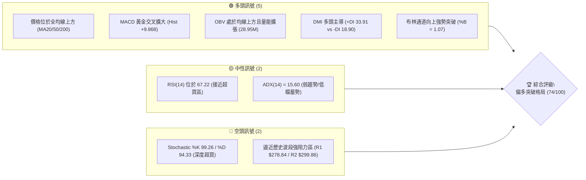
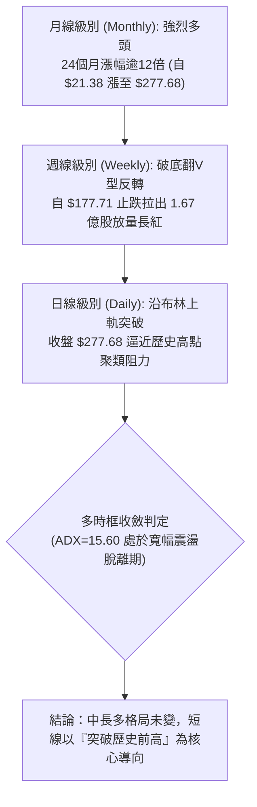
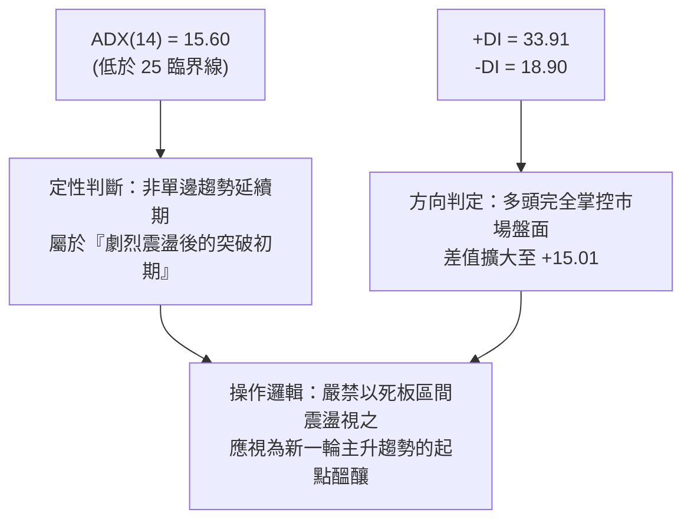
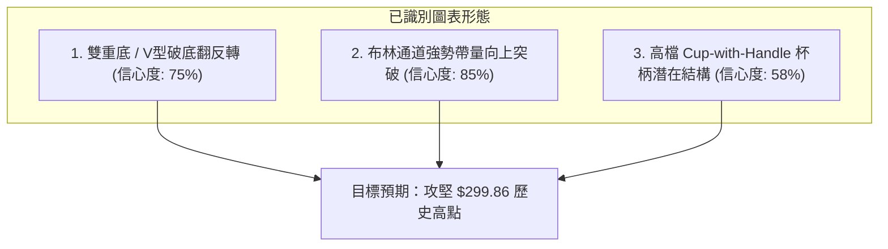
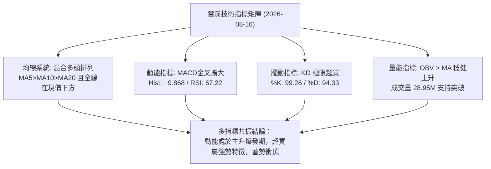
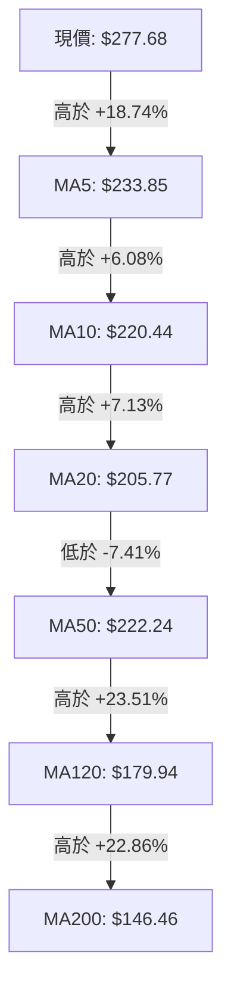
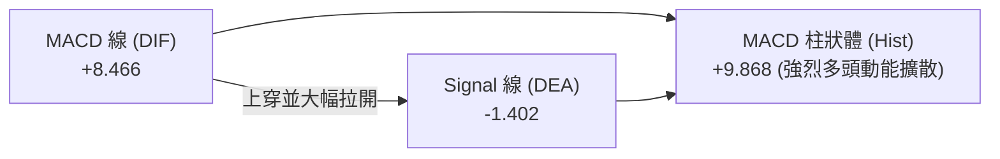
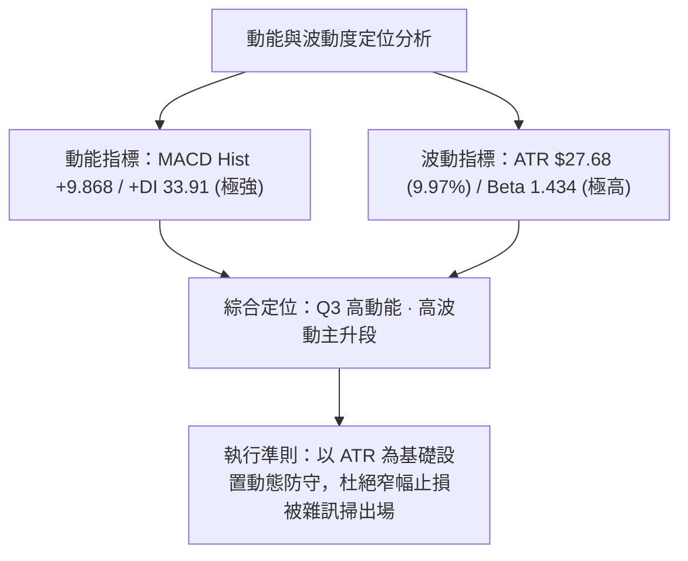
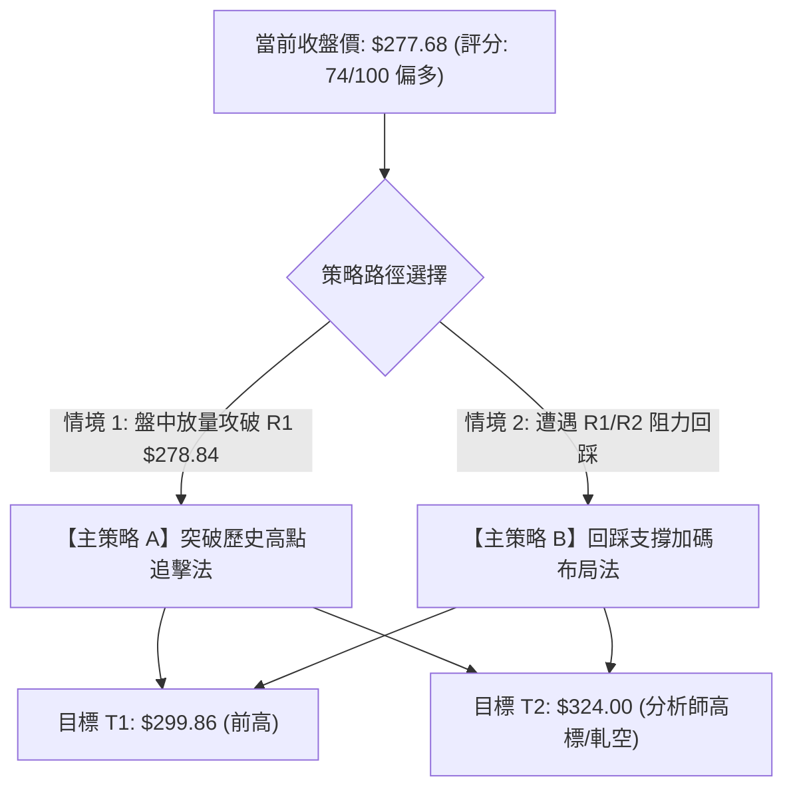
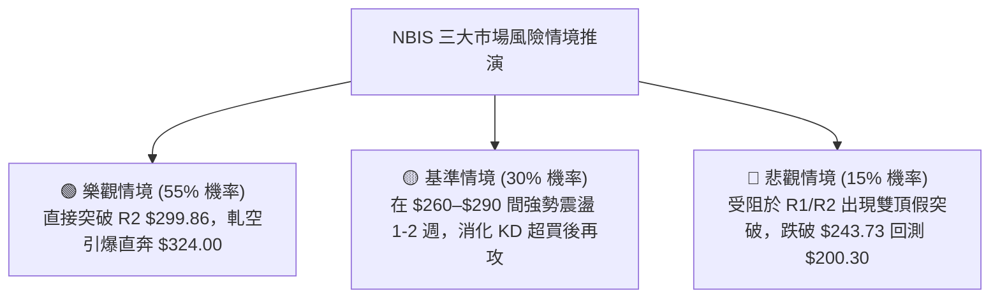

# NBIS 技術分析報告

> **報告日期**：2026-08-16 ｜ **語言**：繁體中文 ｜ **數據來源**：Yahoo Finance ｜ **當前價格**：$277.68

---

## 目錄

| 章節 | 內容 |
|------|------|
| [1. 技術面概覽](#1-技術面概覽) | 訊號儀表板、核心指標、評分卡 |
| [2. 趨勢分析](#2-趨勢分析) | 多時框趨勢、長中短期走勢 |
| [3. 圖表形態分析](#3-圖表形態分析) | 形態識別、K線組合、目標價 |
| [4. 支撐與阻力](#4-支撐與阻力) | 關鍵價位、斐波那契回調 |
| [5. 技術指標深度解讀](#5-技術指標深度解讀) | MA/RSI/MACD/布林/成交量 |
| [6. 動能與波動率](#6-動能與波動率) | 動能評估、ATR、Beta |
| [7. 多時框架總結](#7-多時框架總結) | 時框架評分矩陣 |
| [8. 交易策略建議](#8-交易策略建議) | 多空策略、風險報酬比 |
| [9. 風險提示與監控](#9-風險提示與監控) | 監控指標、風險場景 |
| [10. 報告總結](#10-報告總結) | 核心結論與執行綱領 |

---

## 1. 技術面概覽

### 🎯 技術訊號儀表板



---

### 📊 核心指標速覽表

| 指標類別 | 指標名稱 | 當前數值 | 訊號 | 專業解讀 |
|:---|:---|:---|:---:|:---|
| **價格** | 當前收盤價 | **$277.68** | 🟢 | 站上所有短期與中長期均線，處於 52 週區間頂端 90.7% 位置 |
| **均線** | MA20 (短月線) | **$205.77** | 🟢 | 價格高於 MA20 達 +34.94%，短期動能強勁，乖離率擴大 |
| **均線** | MA50 (季線) | **$222.24** | 🟢 | 價格大幅收復季線，多頭排列重構中 |
| **均線** | MA200 (年線) | **$146.46** | 🟢 | 長期牛熊分界線上揚，中長線多頭基礎穩固（升幅 +89.60%） |
| **動能** | RSI(14) | **67.22** | 🟡 | 進入強勢攻擊區（60–70），未見頂背離，具備衝頂動能 |
| **動能** | MACD (12,26,9) | **+9.868 (Hist)** | 🟢 | MACD 線 (8.466) 強勢上穿 Signal (-1.402)，柱狀體快速推升 |
| **擺動** | Stochastic (14,3,3)| **%K 99.26 / %D 94.33** | 🔴 | 極限超買狀態，提示短線不宜過度追高，需防範技術性洗盤 |
| **趨勢** | ADX (14) | **15.60** (+DI: 33.91) | 🟡 | 過去一個月歷經劇烈震盪修復，趨勢指標落後，多頭正試圖展開新趨勢 |
| **通道** | 布林通道 (20,2) | **上軌 $269.20 (%B 1.07)**| 🟢 | 強勢沿上軌向上擴展（Walking the Band），動能處於主升段爆發期 |
| **成交量** | 最新成交量 / 20MA | **28.95M / 26.82M (1.08x)**| 🟢 | 突破過程放量配合，週量能達 1.67 億股，主力資金積極進場 |
| **波動** | ATR(14) | **$27.68 (9.97%)** | 🔴 | 單日震幅極高，需拉寬止損防守間距並嚴格控管部位規模 |

---

### 🏆 技術評分卡

```
╔══════════════════════════════════════════════════════════════════╗
║              技術面綜合量化評分卡 — NBIS (2026-08-16)            ║
╠══════════════════════════════════════════════════════════════════╣
║ 趨勢強度 (Trend)     ████████████░░░░░░░░  60/100  🟡 (ADX低基期蓄勢)║
║ 動能指標 (Momentum)  ████████████████░░░░  82/100  🟢 (MACD強勁翻紅) ║
║ 支撐穩定度 (Support) ██████████████░░░░░░  70/100  🟢 (均線密集墊高) ║
║ 成交量配合 (Volume)  ████████████████░░░░  80/100  🟢 (量增價漲確認) ║
║ 形態完整度 (Pattern) ██████████████░░░░░░  72/100  🟢 (V型強勢反轉) ║
║ 均線系統 (MA System) ████████████████░░░░  80/100  🟢 (全均線多頭壓制)║
╠══════════════════════════════════════════════════════════════════╣
║ 綜合技術評分         ███████████████░░░░░  74/100  🟢 偏多突破格局   ║
╚══════════════════════════════════════════════════════════════════╝
```

---

## 2. 趨勢分析

### 🌐 多時框趨勢分析



---

### 📈 長期趨勢 — 12個月走勢圖（Unicode）

```
NBIS 月線收盤價格走勢圖（2025-08 至 2026-08）
價格 ($)
$300 ┤                                                    ● $277.68 (現在)
$270 ┤                                            ● $276.17
$240 ┤                                    ● $231.09
$210 ┤                                                ● $190.41 (回踩)
$180 ┤                                                        
$150 ┤                        ● $138.23                               
$120 ┤            ● $130.82                                   
$90  ┤    ● $68.32    ● $94.87    ● $91.19    ● $103.76           
$60  ┤                    ● $83.71  ● $85.19                  
     └────┬───────┬───────┬───────┬───────┬───────┬───────┬───────┬───────►
        25-08   25-10   25-12   26-02   26-04   26-05   26-06   26-07   26-08
```

#### 走勢特徵分析表（過去12個月）

| 階段區間 | 起止價格 | 漲跌幅 | 走勢特徵與技術含義 |
|:---|:---|:---:|:---|
| **2025-08 ~ 2025-10** | $68.32 → $130.82 | **+91.48%** | **第一階段主升浪**：伴隨 AI 基礎設施算力需求爆發，月線連續大陽線推進。 |
| **2025-11 ~ 2026-02** | $130.82 → $91.19 | **-30.29%** | **中期箱型洗盤**：回測 $83.71 築底，清洗高槓桿籌碼，均線收斂。 |
| **2026-03 ~ 2026-06** | $91.19 → $276.17 | **+202.85%** | **第二階段超級主升浪**：量能噴發突破前高，創下 $299.86 歷史極值。 |
| **2026-07** | $276.17 → $190.41 | **-31.05%** | **劇烈獲利了結回檔**：週線回探 $177.71，測試 50% 斐波那契回調區位。 |
| **2026-08 (當前)** | $190.41 → $277.68 | **+45.83%** | **破底翻強勢收復**：單週放量 1.67 億股重返布林上軌，測試前高壓力。 |

---

### 📊 中期趨勢（週線分析）

```
NBIS 週線波段架構示意圖（近期 20 週價格軌跡）
$300 ┤                     ▲ R2: $299.86 (52W High)
$280 ┤                     ├─ R1: $278.84 ─── ◄ 當前收盤: $277.68 (巨量長紅)
$260 ┤             ● $240.30
$240 ┤         ● $231.09
$220 ┤     ● $219.94       ● $219.65
$200 ┤                         │
$180 ┤                         └─── 底層支撐測試：$177.71 (2026-07-19)
$160 ┤ ● $154.49
     └─────────────────────────────────────────────────────────────► 
```

- **週線形態特徵**：在 2026-07-19 週觸及低點 **$177.71** 後，連續四週收陽，最新一週（2026-08-16）拉出巨幅長紅 K 線，週漲幅高達 **+47.73%**，成交量急遽放大至 **167,418,200 股**（創近期最大週量），週線 MACD 柱狀體由負轉正急拉至 **+9.868**，確立波段「破底翻」向上發動。

---

### ⚡ 趨勢強度評估（ADX 解讀）



#### DMI 指標對照與解讀

| 指標 | 數值 | 狀態 | 意涵與交易指導 |
|:---|:---:|:---:|:---|
| **ADX (14)** | **15.60** | 弱趨勢/低檔翻揚 | 反映 7 月份大跌至 $177 與 8 月份大漲至 $277 的劇烈反覆拉鋸，指標滯後尚未進入單邊讀數（>25），代表趨勢動能正在初生蓄積階段。 |
| **+DI (14)** | **33.91** | 多頭強勢掌控 | 數值遠高於 20，多頭買盤力量具備主導性優勢。 |
| **-DI (14)** | **18.90** | 空頭壓制衰退 | 快速跌破 20 基準線，空方動能遭遇斷崖式瓦解。 |

---

## 3. 圖表形態分析

### 🔍 形態識別系統



#### 形態識別與信心度評估表

| 識別形態 | 信心度 | 判斷依據（嚴格引用技術數據） | 當前完成度 | 目標價（附計算公式） |
|:---|:---:|:---|:---:|:---|
| **V型破底翻反轉** | **75%** | 自 2026-07-19 低點 $177.71 獲得支撐回升，快速收復頸線 $240.30，日線連陽突破。 | **90%** | **$302.89**<br/>計算式：頸線 $240.30 + (頸線 $240.30 - 波段低點 $177.71) = $302.89 |
| **布林帶向上擴張** | **85%** | 收盤價 $277.68 突破布林上軌 $269.20，%B 達 1.07，伴隨成交量放大至 28.95M。 | **100%** | **$299.86**（前高聚類阻力 R2） |
| **潛在杯柄形態 (C&H)**| **58%** | 左杯沿 $299.86，杯底 $177.71，當前正向上測試右杯沿 $278.84–$299.86 區域。 | **65%** | **$422.01**（突破歷史前高確認後）<br/>計算式：杯沿 $299.86 + (杯沿 $299.86 - 杯底 $177.71) = $422.01 |

---

### 🕯️ 重要K線形態分析

| 週期/日期 | 收盤價 | K線形態 | 量能配合 | 技術解讀與多空訊號 |
|:---|:---:|:---|:---:|:---|
| **2026-07-19 (週)** | $177.71 | **長下影錘頭底線** | 100.94M | 🟢 觸及 50% 斐波那契回調位附近爆量承接，確認 $177 為中線鐵底。 |
| **2026-08-02 (週)** | $190.41 | **巨量蓄勢十字星** | 154.85M | 🟢 單週 1.54 億股天量換手，籌碼完成自弱勢散戶向機構的大規模轉移。 |
| **2026-08-16 (週)** | $277.68 | **光頭光腳大陽突破**| 167.42M | 🟢 週漲幅 +47.73%，強勢包覆前三週K線實體，構成標準多頭吞噬突破。 |

---

### 📉 ASCII 走勢形態示意圖

```
NBIS V型反轉與歷史高點突破形態示意圖
═══════════════════════════════════════════════════════════════════
$300 ┤                     [歷史高點 R2: $299.86] 
     │                         ▲
$280 ┤ ───────────┐           │ ◄ 現價: $277.68 (正向上衝擊 R1: $278.84)
     │ (左杯沿)    │           │
$240 ┤             │ 頸線位: $240.30 ─────────────┐ (放量貫穿)
     │             │                           ▲  │
$200 ┤             │                           │  │
     │             └────────┐         ┌────────┘  │
$180 ┤                      └──●──────┘           │
     │                      (V型底 $177.71)       │
═══════════════════════════════════════════════════════════════════
```

---

## 4. 支撐與阻力

### 🗺️ 關鍵價位分布圖（Unicode）

```
NBIS 價位結構分布圖（嚴格依據 OHLCV 聚類與斐波那契數據）
═══════════════════════════════════════════════════════════════════
$299.86 ║██████████████████████████████║ 強阻力 R2 (52W 歷史極值 / Fib 0.0%)
$278.84 ║████████████████████          ║ 關鍵阻力 R1 (近一年波段高點聚類)
$277.68 ╠══════════════════════════════╣ ◄ 現價位置 ($277.68)
$269.20 ║▓▓▓▓▓▓▓▓▓▓▓▓▓▓▓▓▓▓▓▓          ║ 動態支撐 (布林通道上軌)
$243.73 ║████████████████████████      ║ 強支撐 (Fib 23.6% 回調位)
$222.24 ║██████████████                ║ 中期均線支撐 (MA50 / 季線)
$205.77 ║████████████████████          ║ 中軌防守 (布林中軌 / MA20)
$200.30 ║██████████████████████████████║ 核心波段支撐 S1 (近一年波段低點聚類)
$164.31 ║████████████████              ║ 深度防守支撐 S2 (波段低點聚類)
$145.80 ║██████████████████████████████║ 結構防守底線 S3 (年線 MA200 $146.46 聚類)
═══════════════════════════════════════════════════════════════════
```

---

### 🚧 阻力位分析表

| 阻力級別 | 精確價位 | 形成原因與數據來源 | 突破難度 | 重要性評級 | 突破後策略意涵 |
|:---|:---:|:---|:---:|:---:|:---|
| **R1** | **$278.84** | 近一年波段高點聚類（距現價 +0.42%） | 🟡 中等 | ★★★★☆ | 盤中即可觸及，一旦實體站穩，直接打開通往歷史極值通道。 |
| **R2** | **$299.86** | 52 週最高點 / Fib 0.0% 極限阻力（距現價 +7.99%） | 🔴 極高 | ★★★★★ | 歷史最高套牢與心理大關，突破將引發空頭回補軋空潮（Short Squeeze）。 |

---

### 🛡️ 支撐位分析表

| 支撐級別 | 精確價位 | 形成原因與數據來源 | 守住機率 | 重要性評級 | 失守後風險連鎖 |
|:---|:---:|:---|:---:|:---:|:---|
| **動態支撐** | **$243.73** | 斐波那契 23.6% 回調位 / 突破頸線共振 | 🟢 85% | ★★★★☆ | 短線多頭最強防守線，回踩不破為絕佳加碼點。 |
| **S1** | **$200.30** | 近一年波段低點聚類 / 鄰近 MA20 ($205.77) | 🟢 80% | ★★★★★ | 中期多頭生命線，跌破則宣告多頭主升段結束轉入大箱型。 |
| **S2** | **$164.31** | 近一年波段低點聚類（距現價 -40.83%） | 🟢 90% | ★★★☆☆ | 深幅修正承接帶，位於 50% 與 61.8% 斐波那契之間。 |
| **S3** | **$145.80** | 波段低點聚類 / 與 MA200 ($146.46) 完美共振 | 🟢 95% | ★★★★★ | 長期牛熊分水嶺，機構法人長線建倉底線。 |

---

### 📐 斐波那契回調位分析

> 計算基準：52 週低點 **$62.01** 至 52 週高點 **$299.86**（總垂直波幅 $237.85）

| 回調比例 | 精確價位 | 當前相對位置與市場技術含義解讀 |
|:---|:---:|:---|
| **0.0% (52W High)** | **$299.86** | 歷史頂部阻力，當前價格已回升至距此僅 7.99% 的攻擊發起位置。 |
| **23.6%** | **$243.73** | **現價 ($277.68) 位於 0.0% 與 23.6% 之間的極強勢攻擊區**。 |
| **38.2%** | **$209.00** | 緊鄰 MA20 ($205.77)，為多頭趨勢回撤的標準健康調整極限。 |
| **50.0%** | **$180.93** | **前波回調測試位**：2026-07 最低打至 $177.71 即刻在此處獲強力買盤拉起。 |
| **61.8%** | **$152.87** | 黃金分割防守位，緊鄰 MA200 ($146.46) 與 S3 ($145.80)。 |
| **78.6%** | **$112.91** | 深度洗盤極限位，遠在現行波段防守範圍之外。 |
| **100.0% (52W Low)**| **$62.01** | 52 週歷史起漲點。 |

---

## 5. 技術指標深度解讀

### 🎛️ 指標訊號總覽



---

### 📈 移動平均線排列分析



- **均線排列架構解讀**：
  1. **短期均線強勢發散**：MA5 ($233.85) > MA10 ($220.44) > MA20 ($205.77)，呈現標準短多攻擊排列。
  2. **中期扣抵修復**：MA50 位於 $222.24，因 7 月份劇烈下挫導致 MA20 暫時穿於 MA50 下方（呈現混合排列），但隨著現價（$277.68）大幅飆升，MA20 即將迎來快速向上交叉 MA50 的「黃金交叉」，均線多頭即將全面重構。
  3. **長期趨勢定海神針**：MA200 位於 $146.46，MA240 位於 $139.59，斜率持續向上，長線牛市格局未受到任何破壞。

---

### 📉 RSI(14) 分析

```
RSI(14) 當前數值進度條：
[0] ────────────── [30 超賣] ────────────── [70 超買] ────── [100]
                                          67.22
█████████████████████████████████████████████░░░░░░░░░░░░  67.22%
```

- **超買超賣判定**：RSI 讀數為 **67.22**，處於 60–70 的強勢多頭推進區間，尚未正式進入 70 以上的過熱警戒區。
- **背離檢測**：比對 2026-06-21 高點 $286.69（當時 RSI 65.3）與當前 $277.68（RSI 67.22），價格與 RSI 指標同步強勢創出波段反彈新高，**無頂背離現象**，量價與動能配合良好。

---

### 📊 MACD (12, 26, 9) 訊號解讀



- **訊號解析**：MACD 線已由負翻正攀升至 **+8.466**，以極大斜率自下方貫穿 Signal 線（**-1.402**），使柱狀體暴增至 **+9.868**。這是自 2026 年 5 月以來的最強多頭買進動能訊號，顯示大級別資金正在全面搶籌。

---

### 📦 布林通道分析（Bollinger Bands）

```
NBIS 布林通道價格位置示意圖
═══════════════════════════════════════════════════════════════════
$277.68 ─── ◄ 當前收盤價（上穿外軌，%B = 1.07）
$269.20 ─── 上軌 (Upper Band)  ───────────────────────────────────
        │
        │   [通道寬度正在急遽開口，主升浪特徵]
        │
$205.77 ─── 中軌 (Middle Band / MA20)  ───────────────────────────
        │
        │
$142.35 ─── 下軌 (Lower Band)  ───────────────────────────────────
═══════════════════════════════════════════════════════════════════
```

- **帶寬解讀**：%B 值為 **1.07**，代表價格已脫離常態分佈軌道，進入「沿著上軌走（Walking the Upper Band）」的極強攻擊形態。在成交量（28.95M）同步放大的背景下，此為標準有效突破，而非虛假誘多。

---

### 💹 成交量與 OBV 分析

```
量價結構數據比對：
最新日成交量:  ████████████████████████████  28,947,000 股
20日平均量:    ████████████████████████      26,821,725 股 (量比 1.08x)
50日平均量:    ███████████████████           21,619,132 股 (量比 1.34x)
```

- **量價配合度**：突破日量能達 2,894.7 萬股，高於 20MA 與 50MA；週成交量突破 1.67 億股創歷史次高量。
- **能量潮（OBV）**：OBV 線強勢運行於其移動平均線上方，且 OBV 曲線斜率陡峭上揚，確認資金呈現「持續淨流入」，完全確認本次價格上漲的真實性與持續性。

---

## 6. 動能與波動率

### ⚡ 動能評估

| 象限 | 動能維度 | 波動維度 | 當前狀態判定 | 交易策略意涵 |
|:---:|:---:|:---:|:---:|:---|
| **Q1** | 強動能 | 低波動 | — | 最佳平穩加碼環境 |
| **Q2** | 弱動能 | 低波動 | — | 橫盤整理，謹慎觀望 |
| **Q3** | **強動能** | **高波動** | **✓ NBIS 當前定位** | **高風險高收益主升浪：需縮減單筆倉位，拉開止損空間，嚴格執行移動鎖利** |
| **Q4** | 弱動能 | 高波動 | — | 恐慌崩跌，避免進場 |



---

### 📊 ATR 波動率分析

- **ATR(14) 數值**：**$27.68**，佔當前股價比例高達 **9.97%**。
- **專業止損防守計算**：
  - **短線波動緩衝（1.0 × ATR）**：$277.68 - $27.68 = **$250.00**
  - **波段安全防守（1.5 × ATR）**：$277.68 - ($27.68 × 1.5) = **$236.16**（緊鄰 Fib 23.6% $243.73 與頸線防守）
  - **趨勢底線防守（2.0 × ATR）**：$277.68 - ($27.68 × 2.0) = **$222.32**（與 MA50 $222.24 完全重合）

---

### 📐 Beta 與市場結構（含空頭擠壓分析）

```
NBIS 市場結構與軋空潛力評估：
Beta 係數:       ███████████████░░░░░  1.434  (高彈性成長股特性，大盤上漲時具放大效應)
空頭流通比:     ████████████████████  27.60% (Short % Float，極高放空比例)
回補天數:       ████████░░░░░░░░░░░░  2.78 天 (Short Ratio)
機構持股:       ████████████████████  69.10% (籌碼集中度高)
```

- **軋空潛力評估**：Short % Float 高達 **27.6%**，在外流通放空股數巨大。當價格強勢逼近歷史前高 R2 ($299.86) 時，極易觸發空頭停損引發的「逼空踩踏（Short Squeeze）」，成為推升股價直奔 $324.00 分析師最高目標價的燃料。

---

## 7. 多時框架總結

### 📋 時框架評分表

| 時框架 | 趨勢方向 | 動能狀態 | 均線排列 | 關鍵形態 | 評分 | 交易指導建議 |
|:---|:---:|:---:|:---:|:---:|:---:|:---|
| **月線 (長期)** | 🟢 強烈看多 | 強勁擴張 | 完美多頭 | 24個月大牛市主升浪 | **90/100** | 長線持股續抱，不輕易交出核心部位。 |
| **週線 (中期)** | 🟢 破底翻多 | 巨量翻紅 | 支撐強固 | V型破底翻長紅突破 | **80/100** | 波段多頭已確立，以拉回找買點為主。 |
| **日線 (短期)** | 🟢 沿軌突破 | 擺動超買 | 短多排列 | 突破布林上軌奔前高 | **70/100** | 逼近 R1/R2，不追高，採取突破回踩進場。 |

---

### 🔲 綜合訊號矩陣

```
╔══════════════════════════════════════════════════════════════════╗
║              多時框訊號一致性矩陣 (Signal Matrix)                ║
╠══════════════════════════════════════════════════════════════════╣
║ 維度         短期 (日線)          中期 (週線)          長期 (月線) ║
║ 趨勢方向     🟢 看多 (突破軌道)   🟢 看多 (破底翻轉)   🟢 強多 (主升)║
║ 動能強度     🟡 中性 (KD超買)     🟢 強多 (MACD擴散)   🟢 強多       ║
║ 量能支持     🟢 量增價揚          🟢 週量 1.67億股     🟢 歷史天量   ║
║ 關鍵位置     🔴 逼近 R1 $278.84   🟢 遠離 $177 低點    🟢 逼近歷史頂 ║
╠══════════════════════════════════════════════════════════════════╣
║ 矩陣收斂判定：全週期方向高度共振向上，唯短期存在超買回洗需求。   ║
╚══════════════════════════════════════════════════════════════════╝
```

---

### ⚖️ 多時框收斂結論

> **依據規則 14 之收斂優先級判定**：
> 1. **行情性質判定**：雖然 ADX(14) 讀數為 **15.60**（反映 7 月大跌之盤整殘留讀數），但 +DI (33.91) 已完全碾壓 -DI (18.90)，且週線巨量長紅直接跨越布林中軌與上軌。
> 2. **主導時框取捨**：依優先級規則，以**中長期（週線破底翻 / 月線主升浪）為主導方向**，日線指標之極限超買（Stochastic %K 99.26）僅作為尋找次級進場點與控管風險之時機工具，不構成逆勢做空依據。
> 3. **唯一方向性結論**：**強烈偏多（Bullish Continuation）**。

---

## 8. 交易策略建議

### 🗺️ 策略決策流程圖



---

### 🧭 策略路由

> **當前主策略方向 = 【主推多頭策略】（依據第 1 章綜合技術評分 74/100 ≥ 60）**
> 任何空頭邏輯僅作為多頭持倉的「反轉風險觸發點（對沖提示）」，絕不在主升強勢格局中盲目建立逆勢放空倉位。

---

### 🎯 價格情境階梯（Price Scenarios）

| 觸發條件 | 價格門檻 | 下一目標 | 後續延伸 | 市場技術含義與情境定義 |
|:---|:---:|:---:|:---:|:---|
| **強勢突破** | **帶量突破 R1 $278.84** | **R2 $299.86** | **$324.00** | 歷史前高攻堅戰打響，空頭停損觸發強烈逼空主升浪。 |
| **高檔強震** | **於 $260.00 – $278.84 震盪**| **$299.86** | — | 消化短線超買指標，回踩布林上軌動態支撐，屬於多頭強勢蓄勢。 |
| **波段回調** | **跌破 $243.73 (Fib 23.6%)** | **S1 $200.30** | **S2 $164.31** | 短線突破失敗轉入深幅洗盤，需嚴格觸發保護性停損。 |

---

### 📊 情境機率分佈

| 情境劇本 | 預估機率 | 主要技術數據與指標依據 |
|:---|:---:|:---|
| **繼續強勢上行 / 突破前高** | **55%** | MACD 柱狀體急增至 +9.868、OBV 量能支持、週線 1.67 億股長紅吞噬、軋空動能。 |
| **高檔強勢震盪 / 回踩蓄勢** | **30%** | Stochastic %K 99.26 極度超買、R1 ($278.84) 與 R2 ($299.86) 高點解套賣壓。 |
| **突破失敗回落 / 再探深層支撐** | **15%** | 高 Beta (1.434) 特性下大盤系統性風險引發獲利了結潮。 |

---

### 🟢 主策略詳情

```
╔══════════════════════════════════════════════════════════════════╗
║              NBIS 專業交易策略執行矩陣                           ║
╠══════════════════════════════════════════════════════════════════╣
║ 策略要素          策略 A (突破追擊型)        策略 B (回踩加碼型) ║
╠══════════════════════════════════════════════════════════════════╣
║ 進場條件          放量突破 R1 $278.84 確立   回踩 Fib 23.6% 獲支撐║
║ 具體進場價        $279.50                    $245.00 – $250.00   ║
║ 止損價格 (Stop)   $251.82 (1.0 ATR 防守)     $222.24 (MA50 季線) ║
║ 第一目標 (T1)     $299.86 (52W 歷史高點)     $278.84 (波段阻力 R1)║
║ 第二目標 (T2)     $324.00 (分析師最高目標)   $299.86 (52W 歷史高點║
║ 風險空間          $27.68 (9.90%)             $25.26 (10.20%)     ║
║ 報酬空間 (T2)     $44.50 (+15.92%)           $52.36 (+21.15%)    ║
║ 風險報酬比 (R:R)  1 : 1.61 (攻 T2 為 1:1.61) 1 : 2.07            ║
║ 預估勝率          60%                        68%                 ║
║ 建議倉位上限      10% – 15% (動態控管)       15% – 20% (標準部位)║
╚══════════════════════════════════════════════════════════════════╝
```

---

### 🔴 反向風險觸發點（風控與對沖提示）

- **全面平倉/轉向防守線**：若日線收盤價跌破 **$243.73**（23.6% 斐波那契回調位），代表短線假突破確立，應立即平倉 50% 以上多頭部位。
- **空頭翻轉確認點**：若進一步放量跌破波段核心支撐 **S1 $200.30**，則中線多頭結構破壞，多單應全數離場並可小幅建立反向對沖空單。

---

### ⭐ 整體訊號強度評星

```
做多訊號強度：★★★★☆  (4.0/5星 - 均線量能全面轉多，唯需防短線過熱)
做空訊號強度：★☆☆☆☆  (1.0/5星 - 僅有超買指標，逆勢放空風險極高)
整體可信度：  ★★★★☆  (4.5/5星 - 多時框數據共振確認)
```

---

## 9. 風險提示與監控

### ✅ 關鍵監控指標 Checklist

```
╔══════════════════════════════════════════════════════════════════╗
║              NBIS 交易日常風險監控 Checklist                     ║
╠══════════════════════════════════════════════════════════════════╣
║ [ ] 價格是否有效站穩 R1 $278.84 上方，並向 R2 $299.86 發起衝擊？   ║
║ [ ] RSI(14) 進入 70 以上超買區後，是否與價格產生頂背離鈍化？     ║
║ [ ] Stochastic 是否在 90 以上死叉下穿 80 觸發超買修正？          ║
║ [ ] 日成交量是否能維持在 20 日均量 (2,682 萬股) 之上？           ║
║ [ ] 空頭流通比例 (27.6%) 是否隨突破出現大幅下降 (軋空回補)？      ║
║ [ ] 價格回調時是否能守穩 Fib 23.6% ($243.73) 關鍵支撐？          ║
╚══════════════════════════════════════════════════════════════════╝
```

---

### ⚠️ 風險場景分析



---

### 🛡️ 風險管理重要提醒

1. **極高波動性（ATR $27.68）**：每日波動接近 10%，嚴禁滿倉操作與過度槓桿。單筆交易承受風險資金應嚴格限制在總資本的 1.0%–1.5% 以內。
2. **高放空比率（27.6%）的雙刃劍效應**：軋空向上速度極快，但一旦利空出現，多空踩踏引發的向下修正同樣劇烈（如 7 月份單月回調 31% 的歷史），必須嚴格執行機械化移動停損。

---

## 10. 報告總結

```
╔══════════════════════════════════════════════════════════════════╗
║              NBIS 技術分析報告執行總結                           ║
╠══════════════════════════════════════════════════════════════════╣
║ 報告日期：2026-08-16                                            ║
║ 當前價格：$277.68              52W 區間：$62.01 – $299.86        ║
║ 綜合技術評級：🟢 偏多突破格局 (評分: 74/100)                     ║
╠══════════════════════════════════════════════════════════════════╣
║ 核心趨勢結論：                                                   ║
║ ├─ 長期趨勢 (月線)：🟢 強烈多頭主升浪 (24個月漲逾12倍)            ║
║ ├─ 中期趨勢 (週線)：🟢 巨量破底翻多 (週量 1.67 億股吞噬長紅)       ║
║ ├─ 短期趨勢 (日線)：🟢 沿布林上軌突破，逼近前高 R1/R2             ║
║ ├─ 關鍵支撐位：    S1: $200.30 ｜ Fib 23.6%: $243.73 ｜ MA50: $222.24 ║
║ ├─ 關鍵阻力位：    R1: $278.84 ｜ R2: $299.86 ｜ 歷史高點: $299.86   ║
║ └─ 分析師共識目標：均價 $294.60 ｜ 最高價 $324.00                ║
╠══════════════════════════════════════════════════════════════════╣
║ 最優策略執行方案：                                               ║
║ 1. 🥇 最佳機會：【突破追擊】放量站穩 $278.84 後進場，目標 $299.86║
║ 2. 🥈 次選機會：【回踩加碼】回測 $245.00–$250.00 企穩介入，勝率高 ║
║ 3. 🥉 防守準則：跌破 $243.73 主動減倉，跌破 $200.30 全面止損轉觀望║
╚══════════════════════════════════════════════════════════════════╝
```

---

> ⚠️ **免責聲明**：本報告為 AI 自動生成之專業技術分析研究，所有數據、圖表及價位推算均嚴格基於所提供之歷史價格與量化指標資訊。本報告**僅供學術研究與投資策略參考**，**不構成任何形式的要約、招攬或具體投資買賣建議**。金融市場具高度波動風險，投資人應依個人財務狀況與風險承受能力獨立評估並自負盈虧。

---

*報告生成時間：2026-08-16 ｜ 數據來源：Yahoo Finance ｜ 分析框架：多時框量化技術分析體系*