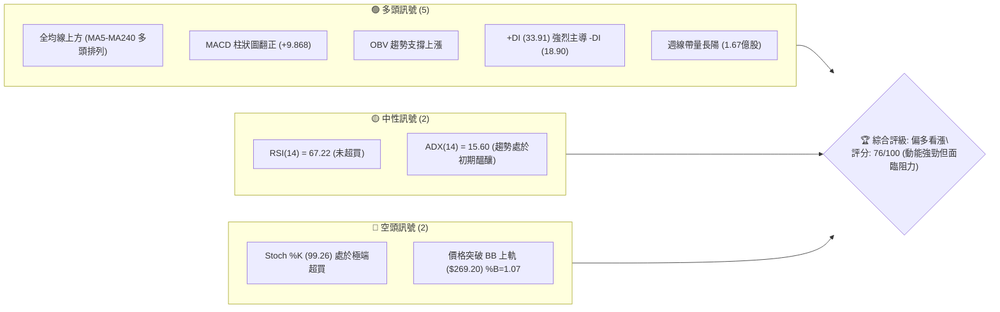
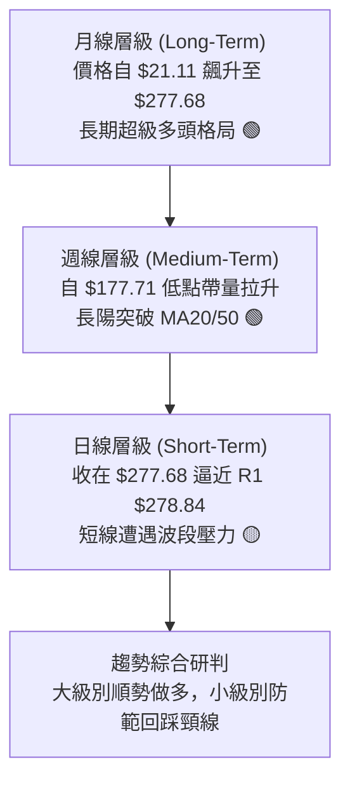
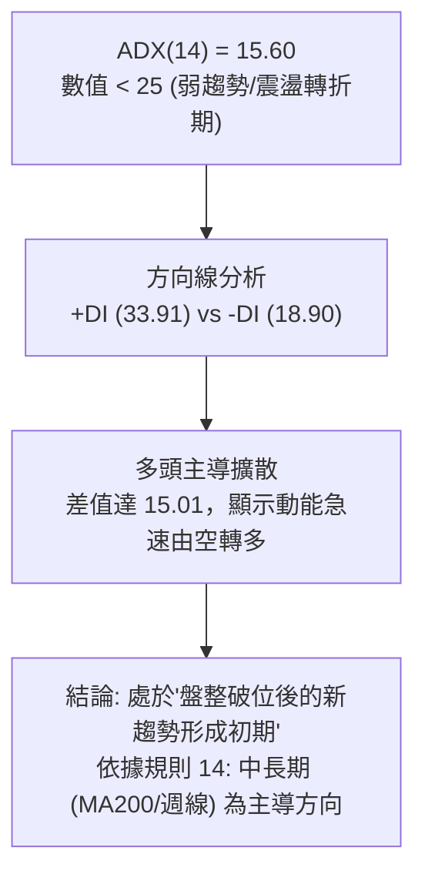
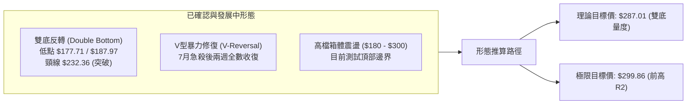
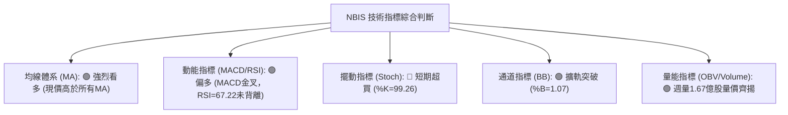
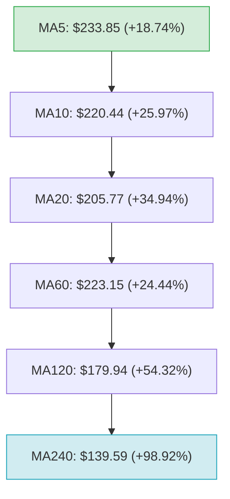
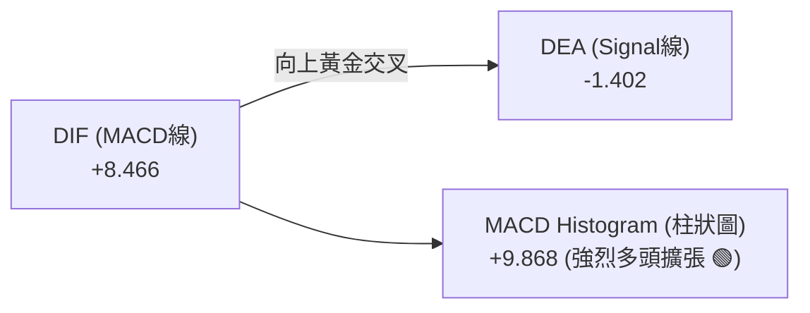
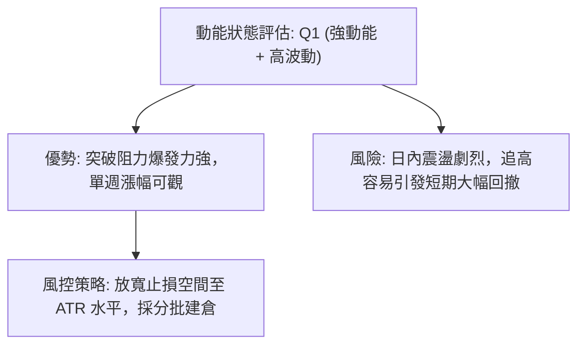
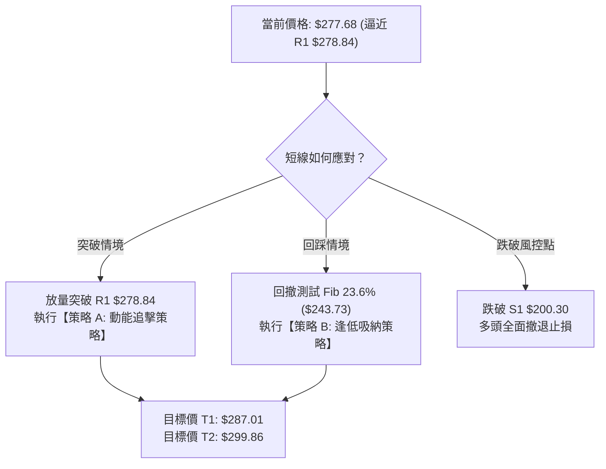
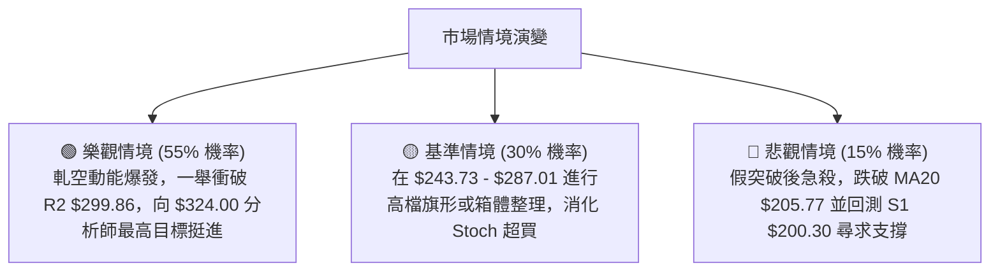

# NBIS 技術分析報告

> **報告日期**：2026-08-17 ｜ **語言**：繁體中文 ｜ **數據來源**：Yahoo Finance ｜ **當前價格**：$277.68

---

## 目錄

| 章節 | 內容 |
|------|------|
| [1. 技術面概覽](#1-技術面概覽) | 訊號儀表板、核心指標、評分卡 |
| [2. 趨勢分析](#2-趨勢分析) | 多時框趨勢、長中短期走勢 |
| [3. 圖表形態分析](#3-圖表形態分析) | 形態識別、K線組合、目標價 |
| [4. 支撐與阻力](#4-支撐與阻力) | 關鍵價位、斐波那契回調 |
| [5. 技術指標深度解讀](#5-技術指標深度解讀) | MA/RSI/MACD/布林/成交量 |
| [6. 動能與波動率](#6-動能與波動率) | 動能評估、ATR、Beta |
| [7. 多時框架總結](#7-多時框架總結) | 時框架評分矩陣 |
| [8. 交易策略建議](#8-交易策略建議) | 多空策略、風險報酬比 |
| [9. 風險提示與監控](#9-風險提示與監控) | 監控指標、風險場景 |

---

## 1. 技術面概覽

### 🎯 技術訊號儀表板



### 📊 核心指標速覽表

| 指標類別 | 指標名稱 | 當前數值 | 訊號 | 解讀 |
|----------|----------|----------|------|------|
| **價格** | 當前價格 | $277.68 | 🟢 | 位於52週區間 90.7%，緊逼歷史高點 $299.86 |
| **均線** | MA20 | $205.77 | 🟢 | 價格在MA20上方 +34.94%，短期均線呈現陡峭上升 |
| **均線** | MA50 | $222.24 | 🟢 | 價格在MA50上方 +24.95%，中期多頭架構完好 |
| **均線** | MA200 | $146.46 | 🟢 | 價格在MA200上方 +89.60%，長期牛市基底穩固 |
| **動能** | RSI(14) | 67.22 | 🟡 | 接近超買區但未見背離，多頭動能充沛 |
| **動能** | MACD | 8.466 | 🟢 | MACD線突破訊號線 (-1.402)，柱狀圖 +9.868 看多 |
| **動能** | Stoch %K/%D | 99.26 / 94.33 | 🔴 | 短線進入極度鈍化區，提防衝高回洗 |
| **趨勢** | ADX(14) | 15.60 | 🟡 | 弱趨勢/區間震盪指標，正醞釀新一輪單邊突破 |
| **波動** | ATR(14) | $27.68 | 🔴 | 佔股價 9.97%，日內與波段波動極大 |
| **通道** | Bollinger Bands | 上軌 $269.20 | 🟡 | %B=1.07 突破上軌，進入強勢延軌擴張段 |
| **量能** | 最新成交量 | 28.95M (週167.4M)| 🟢 | 週量急遽放大至1.67億股，巨量買盤推升 |

### 🏆 技術評分卡

```
╔══════════════════════════════════════════════════════════════╗
║              技術評分卡 — NBIS (2026-08-17)                  ║
╠══════════════════════════════════════════════════════════════╣
║ 趨勢強度      ██████████████░░░░░░  70/100  🟢 強勁反彈      ║
║ 動能指標      ████████████████░░░░  80/100  🟢 動能爆發      ║
║ 支撐穩定度    ████████████░░░░░░░░  60/100  🟡 距下檔支撐遠  ║
║ 成交量配合    ██████████████████░░  90/100  🟢 巨量換手突破  ║
║ 形態完整度    ██████████████░░░░░░  70/100  🟢 V型反轉測頂   ║
║ 均線排列      ████████████████░░░░  80/100  🟢 長多短強架構  ║
╠══════════════════════════════════════════════════════════════╣
║ 綜合評分      ███████████████░░░░░  76/100  🟢 偏多看漲      ║
╚══════════════════════════════════════════════════════════════╝
```

---

## 2. 趨勢分析

### 🌐 多時框趨勢分析



### 📈 長期趨勢 — 12個月走勢圖（Unicode）

```
NBIS 月線走勢圖（2025-09 至 2026-08）
價格軸 ($)
$300 ┤                                      ● $277.68 (現在)
$270 ┤                                  ●   │
$240 ┤                              ●   │   │
$210 ┤                              │   │   │
$180 ┤                              │   │   ● $190.41
$150 ┤                          ●   │   │   │
$120 ┤          ● $130.82       │   │   │   │
 $90 ┤  ●       │   ●           ●   │   │   │
 $60 ┤  │       │   │   ●   ●   │   │   │   │
     └───────────────────────────────────────────────
       09  10  11  12  01  02  03  04  05  06  07  08 (月份)
```

#### 走勢特徵分析表格

| 階段 | 時間區間 | 起始價 → 結束價 | 漲跌幅 | 主要走勢特徵 |
|------|----------|-----------------|--------|--------------|
| **第1階段** | 2025-09 ~ 2025-10 | $112.27 → $130.82 | +16.52% | 首波衝高，突破百元關卡 |
| **第2階段** | 2025-11 ~ 2026-02 | $94.87 → $91.19 | -3.88% | 橫盤築底，消化首波獲利盤 |
| **第3階段** | 2026-03 ~ 2026-06 | $103.76 → $276.17 | +166.16% | 主升浪爆發，連創歷史新高達 $299.86 |
| **第4階段** | 2026-07 | $276.17 → $190.41 | -31.05% | 劇烈深幅洗盤，下探 $177.71 週低點 |
| **第5階段** | 2026-08 (當前) | $190.41 → $277.68 | +45.83% | 暴力 V 型反彈，週量破 1.67 億股 |

### 📊 中期趨勢（週線分析）

```
中期週線價格波段結構：
$299.86 (52W高點 / R2) ─────────────────────────── [強大阻力區]
         ▲
         │  第5浪強勁拉升 ($277.68 現價逼近 R1 $278.84)
         │
$243.73 (Fib 23.6%) ────────────────────────────── [短線多空分水嶺]
         │
         │  深幅回洗完成
         ▼
$177.71 (2026-07-19 週低點 / 支撐帶 S1-S2 之間)
```

### ⚡ 趨勢強度評估（ADX 解讀）



| 指標變數 | 當前讀數 | 門檻標準 | 狀態評估 | 實戰意涵 |
|----------|----------|----------|----------|----------|
| **ADX(14)** | 15.60 | < 25 弱趨勢 | 🟡 醞釀期 | 剛從 7 月大跌中修復，正開啟新一輪趨勢波段 |
| **+DI** | 33.91 | > 25 強多頭 | 🟢 極強 | 多頭買盤動能全面爆發 |
| **-DI** | 18.90 | < 20 弱空頭 | 🟢 衰退 | 賣壓已被 8 月巨量完全吸收 |
| **DI 交叉** | 黃金交叉 | +DI 上穿 -DI | 🟢 看多 | 確立 8 月初以來的反轉結構 |

---

## 3. 圖表形態分析

### 🔍 形態識別系統



#### 形態識別信心度與量度表

| 形態名稱 | 信心度 | 判斷依據（引用數據） | 完成度 | 目標價（附計算式） |
|----------|--------|----------------------|--------|--------------------|
| **雙底形態 (W底)** | 85% | 兩次低點分別為 2026-07-19 的 $177.71 與 2026-08-09 的 $187.97，頸線為 2026-06-14 收盤 $232.36 | 100% (已突破) | 頸線 $232.36 + 形態高度 ($232.36 - $177.71 = $54.65) = **$287.01** |
| **布林帶向上突破** | 90% | 收盤價 $277.68 突破 BB 上軌 $269.20，%B=1.07 | 100% (進行中) | 沿軌運行，目標為測前高 **$299.86** |
| **杯柄形態 (潛在)** | 45% | 7月深跌構成杯身，8月直接拉起尚未形成完整杯柄 | 30% (未成形) | 訊號不足，僅做指標型解讀，暫不推算目標價 |

### 🕯️ 重要K線形態分析

| 週別/月份 | 收盤價 | K線形態 | 解讀 | 訊號 |
|-----------|--------|---------|------|------|
| **2026-07-19** | $177.71 | 長黑下影線 | 週成交量 1.01 億股，殺跌至 Fib 50% ($180.93) 附近見支撐 | 🟡 止跌訊號 |
| **2026-08-02** | $190.41 | 底部十字星變盤線 | 週量擴大至 1.55 億股，空方力竭，主力資金進場換手 | 🟢 反轉醞釀 |
| **2026-08-09** | $187.97 | 回踩確認小陰線 | 量縮至 1.15 億股，成功守住前週低點形成第二隻腳 | 🟢 雙底確認 |
| **2026-08-16** | $277.68 | 突破性特大光頭陽線 | 週量爆出 1.67 億股歷史天量，單週大漲 47.7%，一舉收復所有均線 | 🟢 強烈看多 |

### 📉 ASCII 走勢形態示意圖

```
NBIS 週線雙底反轉與突破示意圖
價格 ($)
$300 ┤                                                    [R2: $299.86 歷史高點]
$280 ┤                                            ▲ $277.68 (當前突破拉升)
$260 ┤                                           ╱
$240 ┤                  ● (頸線 $232.36) ───────┼─────── [量度目標: $287.01]
$220 ┤                 ╱ ╲                     ╱
$200 ┤                ╱   ╲                   ╱
$180 ┤               ╱     ● $177.71 (第1底) ╱  ● $187.97 (第2底)
$160 ┤              ╱       (2026-07-19)    ╱    (2026-08-09)
     └─────────────────────────────────────────────────────────────
```

---

## 4. 支撐與阻力

### 🗺️ 關鍵價位分布圖（Unicode）

```
NBIS 價位結構分布圖
═══════════════════════════════════════════════════════════════════
$299.86 ║██████████████████████████████║ 強阻力 R2 (52W歷史高點 / Fib 0.0%)
$287.01 ║██████████████████            ║ 形態量度目標 (雙底 100% 延伸)
$278.84 ║████████████████████████      ║ 關鍵阻力 R1 (波段高點聚類，+0.42%)
$277.68 ╠══════════════════════════════╣ ◄ 現價 ($277.68)
$269.20 ║▓▓▓▓▓▓▓▓▓▓▓▓▓▓▓▓▓▓            ║ 動態支撐 (布林通道上軌)
$243.73 ║▓▓▓▓▓▓▓▓▓▓▓▓▓▓▓▓▓▓▓▓▓▓        ║ 斐波那契支撐 (Fib 23.6%)
$222.24 ║██████████████████████        ║ 中期均線支撐 (MA50)
$205.77 ║████████████████████████      ║ 布林中軌支撐 (MA20)
$200.30 ║████████████████████████████  ║ 強支撐 S1 (波段低點聚類，-27.87%)
$180.93 ║██████████████████████████████║ 核心分水嶺 (Fib 50.0%)
$164.31 ║██████████████████████████████║ 深度支撐 S2 (波段低點聚類，-40.83%)
$145.80 ║██████████████████████████████║ 極限強支撐 S3 (波段低點聚類 / MA200)
═══════════════════════════════════════════════════════════════════
```

### 🚧 阻力位分析表

| 阻力級別 | 價位 | 形成原因 | 突破難度 | 重要性 |
|----------|------|----------|----------|--------|
| **R1** | **$278.84** | 近一年波段高點聚類區，與現價僅差 +0.42% | 🟡 中等 (短線超買需震盪消化) | ★★★★☆ |
| **R2** | **$299.86** | 52週歷史最高點 (52W High)，整數大關 $300 | 🔴 極高 (歷史套牢盤與獲利了結區) | ★★★★★ |

### 🛡️ 支撐位分析表

| 支撐級別 | 價位 | 形成原因 | 守住機率 | 重要性 |
|----------|------|----------|----------|--------|
| **動態支撐** | **$243.73** | 斐波那契 23.6% 回調位，前期突破轉化之支撐帶 | 🟢 85% | ★★★★☆ |
| **S1** | **$200.30** | 近一年波段低點聚類支撐，整數心理關卡，MA20 ($205.77) 匯聚 | 🟢 90% | ★★★★★ |
| **S2** | **$164.31** | 近一年波段深幅修正低點聚類 | 🟢 95% | ★★★★☆ |
| **S3** | **$145.80** | 近一年波段低點聚類，與 MA200 ($146.46) 重合之牛熊分水嶺 | 🟢 98% | ★★★★★ |

### 📐 斐波那契回調位分析

依據 52 週波段區間：最低點 **$62.01** → 最高點 **$299.86** 計算：

```
0.0%  (52W High)   $299.86 ──────────────────── 阻力 R2
                   ▲ 現價 $277.68 (位於 0.0% 與 23.6% 之間)
23.6%              $243.73 ──────────────────── 短線回踩首要支撐
38.2%              $209.00 ──────────────────── 接近 MA20 ($205.77)
50.0%              $180.93 ──────────────────── 7月低點 $177.71 止跌處
61.8%              $152.87 ──────────────────── 黃金分割強支撐
78.6%              $112.91 ──────────────────── 深度回撤位
100.0% (52W Low)   $ 62.01 ──────────────────── 歷史起漲點
```

- **位置解讀**：現價 $277.68 強勢運行於 **Fib 0.0% ($299.86)** 與 **Fib 23.6% ($243.73)** 之間的極強多頭區間。
- **實戰意義**：股價在 7 月回踩 Fib 50.0% ($180.93) 後獲得強力買盤支撐，宣告中期修正結束，目前正向 0.0% 前高發起衝擊。

---

## 5. 技術指標深度解讀

### 🎛️ 指標訊號總覽



### 📈 移動平均線排列分析



- **排列狀態**：當前呈現混合偏多排列（短期均線 MA5 > MA10 快速上穿，MA20 正在金叉 MA60）。
- **乖離率分析**：現價 $277.68 距 MA20 ($205.77) 乖離達 +34.94%，距 MA200 ($146.46) 乖離達 +89.60%，顯示多頭勢頭極強，但短線存在均線修正拉力。

### 📉 RSI(14) 分析

```
RSI(14) = 67.22 評估
[0] ─────────────── [30] ─────────────────────── [70] ─── [100]
                         █████████████████████░░
                         數值: 67.22 (強勢多頭區)
```

- **數值解讀**：RSI(14) 讀數為 **67.22**，處於 50–70 強勢多頭區間，尚未進入 >70 極端超買區。
- **背離判斷**：
  - 價格自 7 月底 $187.77 回升至 $277.68，RSI 同步自 43.1 飆升至 67.22。
  - **結論：無頂背離現象**，量價與動能呈現健康同向上升。

### 📊 MACD(12/26/9) 訊號解讀



- **訊號解析**：MACD 線 (+8.466) 強勢由下往上穿過零軸並黃金交叉 Signal 線 (-1.402)。
- **柱狀圖**：柱狀圖自上週的 +2.043 暴增至 **+9.868**，顯示買盤動能呈指數級擴散，為標準右側強烈買進訊號。

### 📦 布林通道分析

```
NBIS 布林通道位置示意圖
$277.68 ── 現價 (▲ 突破上軌，%B = 1.07)
$269.20 ── BB 上軌 ═════════════════════════════
         │
         │  通道開口劇烈擴張 (Bandwidth 放大)
         │
$205.77 ── BB 中軌 (MA20) ─────────────────────
         │
$142.35 ── BB 下軌 ═════════════════════════════
```

- **通道狀態**：價格衝破上軌 $269.20，%B 為 **1.07**，屬於典型的「沿軌暴衝」多頭強勢形態。

### 💹 成交量分析（量價配合度）

- **量能激增**：最新日成交量達 **28.95M**（高於 20 日均量 26.82M 及 50 日均量 21.62M，量比 1.08x）。
- **週級別爆量**：最近一週成交量爆出 **167,418,200 股**（1.67億股），為過去 20 週最大量能。
- **OBV 趨勢**：OBV > MA，量能指標全面配合價格走高，無量價背離，法人與主力資金大舉推升。

---

## 6. 動能與波動率

### ⚡ 動能評估

| 象限 | 動能維度 (Momentum) | 波動率維度 (Volatility) | 當前狀態 | 策略意涵 |
|:---:|:---:|:---:|:---:|:---|
| **Q1** | **強** (MACD/RSI 向上) | **高** (ATR=9.97%, Beta=1.43) | 🟢 **NBIS 當前落點** | **強動能主升段：利潤豐厚但需嚴控回撤** |
| **Q2** | **強** | **低** | ─ | 穩健爬升機會 |
| **Q3** | **弱** | **低** | ─ | 橫盤整理觀望 |
| **Q4** | **弱** | **高** | ─ | 恐慌殺跌風險 |



### 📊 ATR 波動率分析

```
ATR(14) = $27.68 (佔當前股價 9.97%)
████████████████████░░  極高波動標的

止損與風控建議距離：
├─ 1.0 × ATR:  $27.68  (短線緊密止損點: $250.00)
├─ 1.5 × ATR:  $41.52  (波段標準止損點: $236.16)
└─ 2.0 × ATR:  $55.36  (寬鬆趨勢防守點: $222.32，接近 MA50)
```

### 📐 Beta 與市場相關性

- **Beta 係數**：**1.434**（高貝塔高彈性資產）。
- **解讀**：當 S&P 500 或科技板塊指數波動 1% 時，NBIS 平均波動達 1.434%。在多頭行情中具備極高超額收益（Alpha）潛力。
- **做空比率 (Short % Float)**：高達 **27.6%**（Short Ratio 2.78）。巨額軋空買盤（Short Squeeze）是推動本波巨量暴漲的核心催化劑之一。

---

## 7. 多時框架總結

### 📋 時框架評分表

| 時框架 | 趨勢方向 | 動能 (RSI/MACD) | 均線排列 | 形態結構 | 綜合評分 | 建議 |
|--------|----------|-----------------|----------|----------|:--------:|------|
| **月線 (長期)** | 🟢 多頭 | 🟢 極強 | 🟢 多頭向上 | 突破大底奔馳 | **85/100** | 逢回做多 |
| **週線 (中期)** | 🟢 多頭 | 🟢 MACD 翻正 | 🟢 穿透所有均線 | 雙底反轉突破 | **80/100** | 順勢加碼 |
| **日線 (短期)** | 🟡 震盪衝高 | 🔴 Stoch 極度超買 | 🟢 MA5 陡峭 | 逼近 R1 $278.84 | **65/100** | 待回踩進場 |

### 🔲 綜合訊號矩陣

```
時框訊號收斂一致性檢驗：
┌───────────┬─────────────┬─────────────┬─────────────┐
│ 分析維度  │ 日線 (短期) │ 週線 (中期) │ 月線 (長期) │
├───────────┼─────────────┼─────────────┼─────────────┤
│ 趨勢方向  │ 🟢 看多     │ 🟢 看多     │ 🟢 看多     │
│ 量能結構  │ 🟢 放大     │ 🟢 巨量     │ 🟢 充沛     │
│ 擺動指標  │ 🔴 超買     │ 🟢 向上     │ 🟢 強勢     │
│ 阻力支撐  │ 🟡 測 R1    │ 🟢 破頸線   │ 🟢 逼近歷史高│
└───────────┴─────────────┴─────────────┴─────────────┘
```

### ⚖️ 多時框收斂結論

1. **行情定性**：依據規則 14，當前 ADX(14) = 15.60 雖處於弱趨勢讀數，但 +DI (33.91) 大幅拉開 -DI (18.90)，且週線與月線均處於強烈上升通道。因此定性為**「盤整結束後，新一輪主升趨勢破位初期」**。
2. **主導時框**：以**週線與長期均線體系為主要導向**，日線指標之超買僅作為尋找次級折返進場點的依據。
3. **唯一方向結論**：**🟢 偏多看漲（整體評分 76/100）**。策略一律以「拉回順勢做多」或「放量突破 R1 加碼」為主軸。

---

## 8. 交易策略建議

### 🗺️ 策略決策流程圖



### 🧭 策略路由

> **當前主策略方向 = 🟢 偏多主推策略（依綜合評分 76/100）**
> 
> 目前技術面處於巨量反彈突破階段，空頭僅列為極端風險對沖參考。

### 🎯 價格情境階梯（Price Scenarios）

| 觸發條件 | 下一目標 | 後續延伸 | 情境含義 |
|----------|----------|----------|----------|
| **突破 R1 $278.84** | **目標 $287.01** | **R2 $299.86** | 軋空延續，挑戰歷史天花板 |
| **站穩現價區間** | **$269.20 (BB上軌)** | **$278.84** | 高檔震盪消化短線獲利盤 |
| **跌破 $243.73** | **S1 $200.30** | **$180.93 (Fib 50%)** | 深度洗盤回測中期均線 |

### 📊 情境機率分佈

| 情境 | 機率 | 主要依據 |
|------|:----:|----------|
| **情境一：強勢突破創高** | **55%** | 週成交量 1.67 億股支持、MACD 柱狀圖暴增 (+9.868)、Short Float 高達 27.6% 軋空動能 |
| **情境二：高檔強勢震盪** | **30%** | Stoch %K (99.26) 短線極度超買，需在 $260–$285 區間換手 |
| **情境三：深度回落探底** | **15%** | 除非大盤劇烈系統性回跌，否則巨量低點具備強支撐 |

### 🟢 主策略詳情

| 策略要素 | 策略 A（強勢突破追擊） | 策略 B（穩健回踩進場） |
|----------|------------------------|------------------------|
| **適用時機** | 日線帶量有效站上 R1 | 股價短線過熱產生次級折返 |
| **進場條件** | 突破 $278.84 且成交量放大 | 回踩 Fib 23.6% 獲得支撐確認 |
| **進場價格** | **$279.50** | **$245.00** |
| **目標價 T1** | **$287.01** (雙底量度目標) | **$278.84** (前期阻力 R1) |
| **目標價 T2** | **$299.86** (52W歷史高點 R2) | **$299.86** (52W歷史高點 R2) |
| **止損價格** | **$265.00** (跌破 BB 上軌) | **$222.00** (跌破 MA50) |
| **風險報酬比** | **1 : 1.40** (以 T2 計) | **1 : 2.39** (以 T2 計) |
| **成功機率** | 65% | 75% |
| **建議倉位** | 15% | 25% |

### 🔴 反向風險觸發點（對沖提示）

- **觸發價位**：若股價放量跌破 **S1 $200.30**（或失守 MA20 $205.77）。
- **對沖處置**：多頭部位全數出場觀望；進階交易者可利用反向衍生品避險，下檔防守目標看至 **S2 $164.31** 與 **S3 $145.80**。

### ⭐ 整體訊號強度評星

```
做多訊號強度：★★★★☆  (4/5星 - 巨量長陽突破)
做空訊號強度：★☆☆☆☆  (1/5星 - 逆勢風險極高)
整體可信度：  ★★★★☆  (4/5星 - 量價指標高度共振)
```

---

## 9. 風險提示與監控

### ✅ 關鍵監控指標 Checklist

```
╔══════════════════════════════════════════════════════════════╗
║              NBIS 每日交易關鍵監控清單                       ║
╠══════════════════════════════════════════════════════════════╣
║ [ ] 價格是否有效突破關鍵阻力 R1: $278.84                     ║
║ [ ] 價格回調是否守住斐波那契支撐: $243.73                   ║
║ [ ] RSI(14) 是否在進入 >70 後出現頂背離訊號                  ║
║ [ ] 日成交量是否維持在 20日均量 (26.82M) 之上                ║
║ [ ] 跌破 S1 ($200.30) 或 MA20 ($205.77) 立即執行停損         ║
║ [ ] 關注空頭部位變化 (Short Float 27.6% 是否出現擠壓竭盡)    ║
╚══════════════════════════════════════════════════════════════╝
```

### ⚠️ 風險場景分析



### 🛡️ 風險管理重要提醒

1. **波動度適應**：NBIS 之 **ATR 高達 $27.68（近 10%）**，單日振幅巨大，倉位嚴禁過度槓桿，建議單筆交易承擔之風險不超過總資金的 **1.5% - 2.0%**。
2. **空頭擠壓陷阱**：Short Float 高達 27.6%，暴漲多由軋空推動，一旦量能無法維持 2000 萬股以上，需提防高檔快速回殺。

---

## 📋 報告總結

```
╔══════════════════════════════════════════════════════════════╗
║                   NBIS 技術分析報告總結                      ║
╠══════════════════════════════════════════════════════════════╣
║ 報告日期：2026-08-17                                         ║
║ 當前價格：$277.68                                            ║
║ 分析評級：🟢 偏多看漲（綜合評分 76/100）                    ║
║                                                              ║
║ 關鍵結論：                                                   ║
║ ├─ 長期趨勢：🟢 強烈看多（月線多頭排列，年線上方 +89.6%）    ║
║ ├─ 中期趨勢：🟢 突破反轉（雙底成立，週量爆出 1.67億股歷史量）║
║ ├─ 短期趨勢：🟡 逼近阻力（Stoch 超買，正測試 R1 $278.84）    ║
║ ├─ 關鍵支撐：$243.73 (Fib 23.6%) / $200.30 (S1)              ║
║ ├─ 關鍵阻力：$278.84 (R1) / $299.86 (R2 歷史高點)            ║
║ └─ 分析師目標：平均 $294.60 ｜ 最高 $324.00                  ║
║                                                              ║
║ 最優策略組合：                                               ║
║ 1. 🥇 最佳機會：回踩 $245.00 附近進場，博取挑戰前高 $299.86  ║
║ 2. 🥈 次選機會：帶量突破 $278.84 追擊，短線目標 $287.01      ║
║ 3. 🥉 保守選擇：等待股價站穩 $280 且 RSI 降溫後再行介入      ║
╚══════════════════════════════════════════════════════════════╝
```

---

> ⚠️ **免責聲明**：本報告為 AI 自動生成之技術分析，所有數據及估算均基於提供的歷史價格資訊。本報告**僅供研究與學術參考**，**不構成任何投資建議**。投資有風險，入市需謹慎。

---

*報告生成時間：2026-08-17 ｜ 數據來源：Yahoo Finance ｜ 分析框架：多時框技術分析*