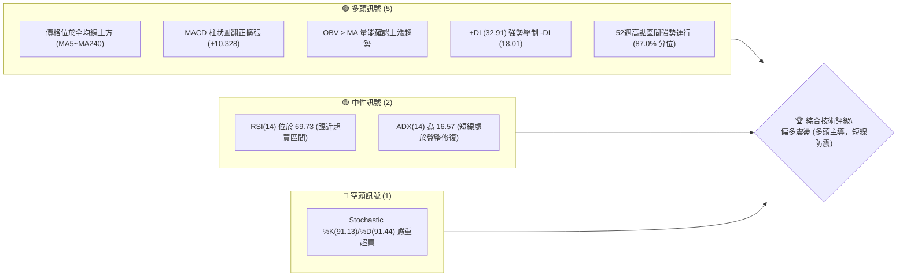
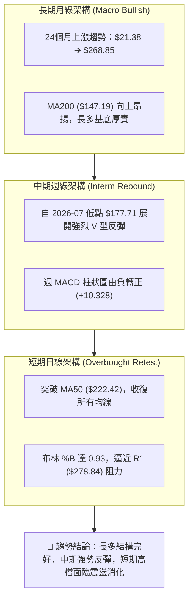
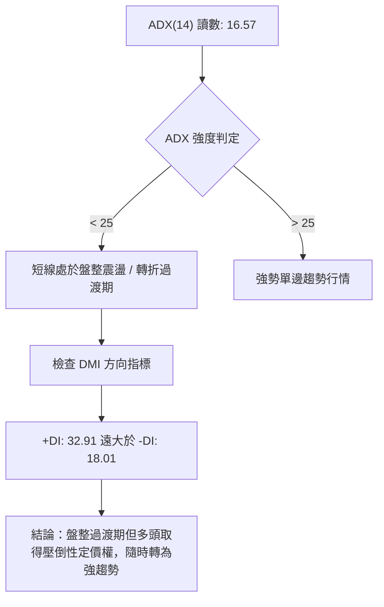
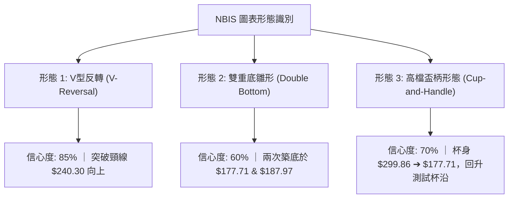
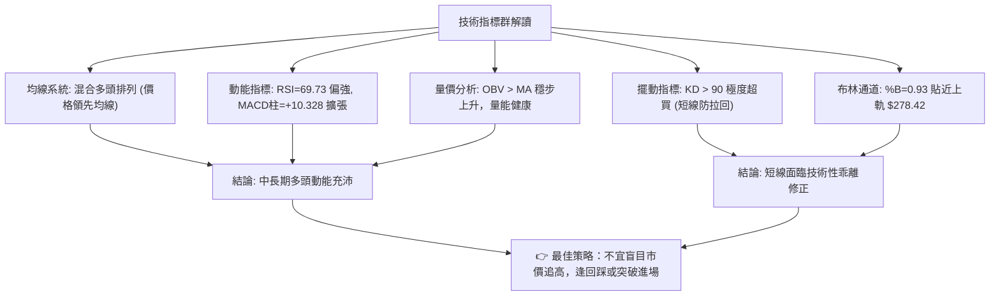
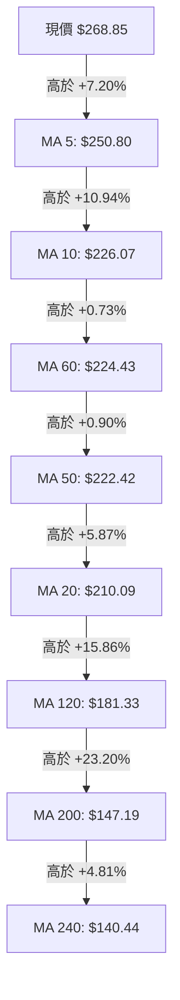
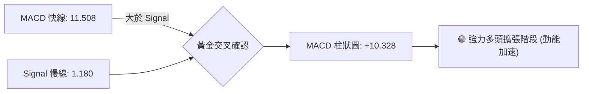
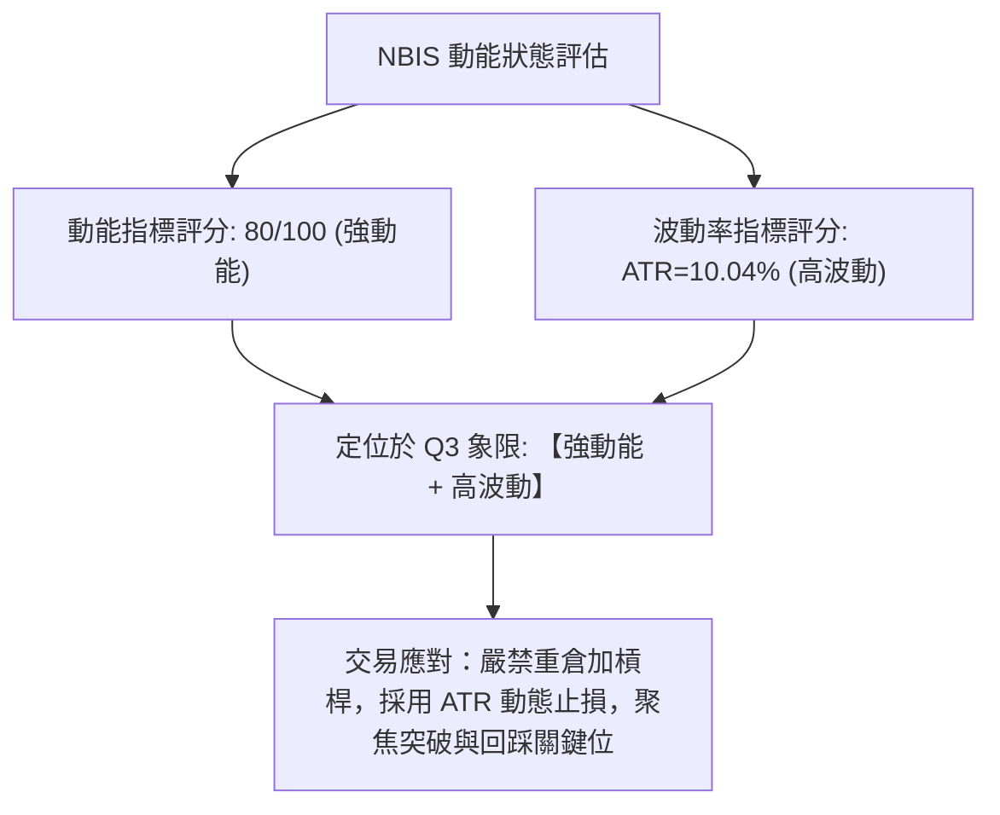
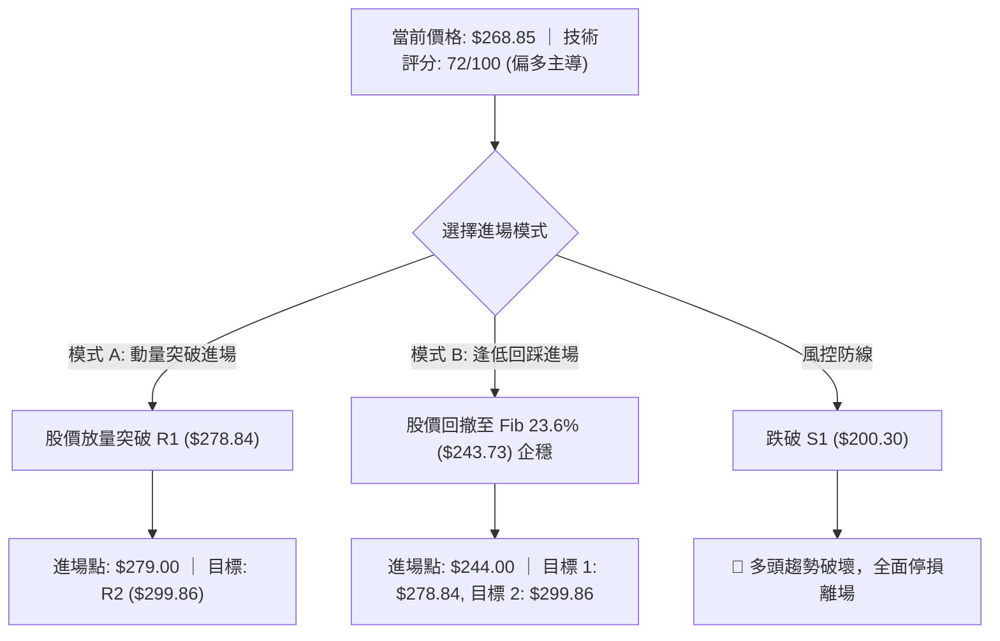
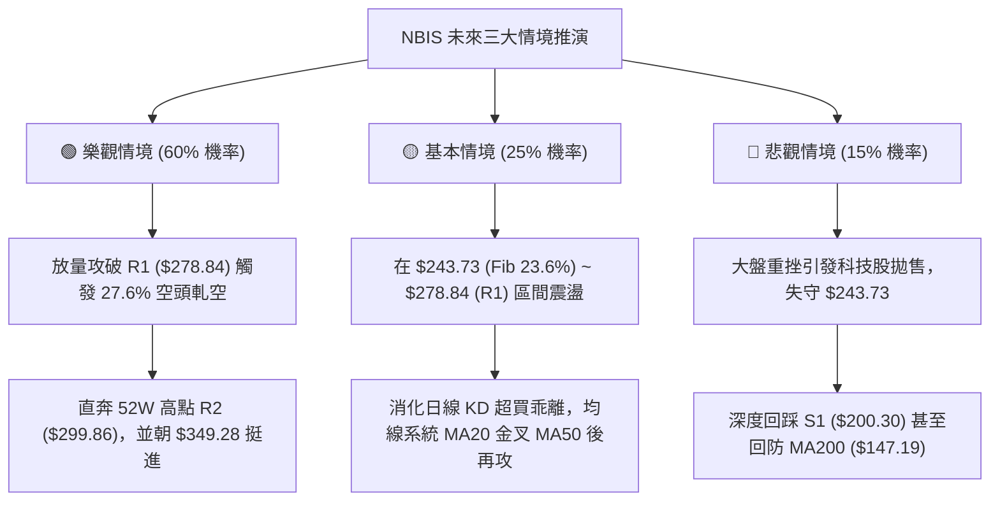

# NBIS 技術分析報告

> **報告日期**：2026-08-18 ｜ **語言**：繁體中文 ｜ **數據來源**：Yahoo Finance ｜ **當前價格**：$268.85

---

## 目錄

| 章節 | 內容 |
|------|------|
| [1. 技術面概覽](#1-技術面概覽) | 訊號儀表板、核心指標、評分卡 |
| [2. 趨勢分析](#2-趨勢分析) | 多時框趨勢、長中短期走勢、ADX強弱 |
| [3. 圖表形態分析](#3-圖表形態分析) | 形態識別、信心度、K線組合、目標價 |
| [4. 支撐與阻力](#4-支撐與阻力) | 關鍵價位分布、斐波那契回調結構 |
| [5. 技術指標深度解讀](#5-技術指標深度解讀) | 均線系統、RSI、MACD、布林通道、OBV |
| [6. 動能與波動率](#6-動能與波動率) | 動能象限、ATR 波動度、Beta 與軋空潛力 |
| [7. 多時框架總結](#7-多時框架總結) | 時框矩陣、多時框收斂與方向定調 |
| [8. 交易策略建議](#8-交易策略建議) | 策略路由、情境階梯、主策略詳情與風報比 |
| [9. 風險提示與監控](#9-風險提示與監控) | 監控清單、情境推演、倉位管理準則 |

---

## 1. 技術面概覽

### 🎯 技術訊號儀表板



---

### 📊 核心指標速覽表

| 指標類別 | 指標名稱 | 當前數值 | 訊號 | 專業技術解讀 |
|:---|:---|:---|:---:|:---|
| **價格** | 當前價格 (Close) | **$268.85** | 🟢 | 距 52 週高點 ($299.86) 僅差 10.34%，展現極強修復動能 |
| **均線** | 短期 MA5 / MA20 | **$250.80 / $210.09** | 🟢 | 價格遠高於短天期均線，短線強勢噴發 (+27.97% vs MA20) |
| **均線** | 中期 MA50 / MA60 | **$222.42 / $224.43** | 🟢 | 成功突破中期均線壓力帶，中期均線重新轉為多頭支撐 |
| **均線** | 長期 MA200 / MA240 | **$147.19 / $140.44** | 🟢 | 遠高於長期牛熊分界線 (+82.65% vs MA200)，奠定長多格局 |
| **動能** | RSI (14) | **69.73** | 🟡 | 位於強勢多頭區間，逼近 70 超買警戒線，短線追高動能趨緊 |
| **動能** | MACD (12, 26, 9) | **11.508 (Hist +10.328)** | 🟢 | 快慢線黃金交叉，動能柱大幅擴張，多頭加速信號明確 |
| **震盪** | KD (Stoch %K/%D) | **91.13 / 91.44** | 🔴 | 進入極度超買區，存在隨時回踩乖離率之技術性回檔風險 |
| **趨勢** | ADX (14) / DMI | **16.57 (+DI:32.91)** | 🟡 | ADX < 25 顯示自 $177 谷底反彈仍屬寬幅震盪修復，但多方掌控 |
| **通道** | Bollinger Bands (%B) | **%B: 0.93 (上軌 $278.42)** | 🟡 | 貼近布林上軌運行，面臨軌道頂部壓制與波動收斂需求 |
| **量能** | 成交量 / 20日均量 | **19.59M / 26.96M (0.73x)** | 🟡 | 反彈過程量能略微萎縮，需放量才能有效攻克 R1 阻力 |
| **波動** | ATR (14) | **$27.00 (10.04%)** | 🔴 | 波動度極高，日均震幅達 27 美元，風控與止損需拉寬防守 |

---

### 🏆 技術評分卡

```
╔══════════════════════════════════════════════════════════════════╗
║              技術評分卡 — NBIS (2026-08-18)                      ║
╠══════════════════════════════════════════════════════════════════╣
║ 趨勢強度 (Trend)       ██████████████░░░░░░  70/100  🟢 偏強多頭 ║
║ 動能指標 (Momentum)    ████████████████░░░░  80/100  🟢 強勁擴張 ║
║ 支撐穩定度 (Support)   ████████████░░░░░░░░  60/100  🟡 震幅偏大 ║
║ 成交量配合 (Volume)    ██████████████░░░░░░  70/100  🟢 OBV 支撐 ║
║ 形態完整度 (Pattern)   ███████████████░░░░░  75/100  🟢 V型回升  ║
║ 均線排列 (MA System)   ███████████████░░░░░  75/100  🟢 全線收復 ║
╠══════════════════════════════════════════════════════════════════╣
║ 綜合技術評分           ██████████████░░░░░░  72/100  🟢 偏多主導 ║
╚══════════════════════════════════════════════════════════════════╝
```

---

## 2. 趨勢分析

### 🌐 多時框趨勢分析



---

### 📈 長期趨勢 — 12個月走勢圖（過去一年）

```
NBIS 月線走勢圖（2025-09 至 2026-08）
價格軸 ($)
$300 ┤                                      ● $276.17 (2026-06)
$270 ┤                                     / \        ● $268.85 (現價)
$240 ┤                              ● $231.09 \      /
$210 ┤                             /           \    /
$180 ┤                            /             ● $190.41 (2026-07)
$150 ┤                     ● $138.23
$120 ┤ ● $112.27   ● $130.82
$90  ┤    \       /   \   ● $91.19  ● $103.76
$60  ┤     \     /     ● $83.71
     └─────┴─────┴─────┴─────┴─────┴─────┴─────┴─────┴─────┴─────┴─────┴─────►
         09    10    11    12    01    02    03    04    05    06    07    08 (月份)
```

#### 📊 歷史走勢特徵分析

| 階段區間 | 起止價格 | 漲跌幅 | 走勢特徵與技術解讀 |
|:---|:---|:---:|:---|
| **初升築底段** (2025/09 - 2025/12) | $112.27 ➔ $83.71 | **-25.44%** | 衝高至 $130.82 後回踩消化籌碼，確立 $83.71 為重要年度箱體底部。 |
| **蓄勢盤整段** (2026/01 - 2026/03) | $85.19 ➔ $103.76 | **+21.80%** | 均線逐步收斂，成交量溫和沉澱，完成大型上升三角形中繼底。 |
| **主升浪爆發** (2026/04 - 2026/06) | $138.23 ➔ $276.17 | **+99.79%** | AI算力基建爆發推動主升段，創下歷史高點 $299.86 (月收 $276.17)。 |
| **大幅回洗段** (2026/07) | $276.17 ➔ $190.41 | **-31.05%** | 獲利回吐與短線恐慌殺盤，最低下探 $177.71，迅速回測 50% 斐波那契回調位。 |
| **報復性反彈** (2026/08 至今) | $190.41 ➔ $268.85 | **+41.19%** | 連續大陽線回升收復失土，形成極度強勢的「V型反轉」並重返高檔。 |

---

### 📊 中期趨勢（週線分析）

中期走勢在 2026 年 7 月經歷了急跌洗盤，週收盤價由 6 月下旬高點 $286.69 快速回落至 7 月中旬低點 $177.71（跌幅達 38.01%），並在斐波那契 50.0% 水平 ($180.93) 獲得強烈承接。進入 8 月後，成交量急遽放大（8/16 當週達 1.67 億股），週 K 線收出巨大光頭實體陽線，直接吞沒過去 6 週的整理跌幅，週 MACD 柱狀圖自 -7.680 垂直翻正至 +10.328，確認中期多頭趨勢重啟。

```
中期週線阻力與支撐示意圖：
$299.86 ══════════════════════════════════════ [R2 / 歷史天花板 52W High]
$278.84 -------------------------------------- [R1 / 近期阻力聚類 & BB上軌 $278.42]
$268.85 ◀◀◀ [現價 Close]
$243.73 -------------------------------------- [斐波那契 23.6% 回調位]
$222.42 -------------------------------------- [MA50 中期生命線]
$200.30 ══════════════════════════════════════ [S1 / 強支撐聚類 & 頸線]
```

---

### ⚡ 趨勢強度評估（ADX 解讀）



#### 📊 ADX 與 DMI 數據對照矩陣

| 參數 | 數值 | 門檻區間 | 技術含義 |
|:---|:---:|:---:|:---|
| **ADX (14)** | **16.57** | `< 20` (弱趨勢/震盪) | 由於 7 月暴跌與 8 月暴漲相互抵消，平滑趨勢強度尚未完全反映，呈現「盤整重組」特徵。 |
| **+DI (多方)** | **32.91** | `> 25` (多頭強勢) | 多頭攻擊意願極高，掌控當前定價權。 |
| **-DI (空方)** | **18.01** | `< 20` (空頭疲弱) | 空方拋壓在 8 月初已被大幅消化，處於防守潰散狀態。 |
| **趨勢定性** | **多頭主導之寬幅震盪轉強** | 依收斂規則第 14 條：ADX < 25 時日線以布林通道與高低點為邊界，週線長多為主軸。 |

---

## 3. 圖表形態分析

### 🔍 形態識別系統



#### 📋 形態識別與信心度評估表

| 識別形態名稱 | 信心度 (%) | 判定依據（數據引用） | 完成度 (%) | 形態量測目標價（附計算式） |
|:---|:---:|:---|:---:|:---|
| **V型強力反轉** | **85%** | 自 $177.71 低點連續大陽線拔高，收復 7 月全部跌幅，突破 $240.30 頸線。 | **90%** | 起跌點 $286.69 - 谷底 $177.71 = $108.98；<br>突破點 $240.30 + $108.98 = **$349.28**（遠期延伸） |
| **高檔盃柄/杯身** | **70%** | 52W 高點 $299.86 作為左杯沿，回落至 $177.71 形成圓弧底，目前正測試右杯沿。 | **75%** | 待突破 R2 ($299.86) 確認；<br>杯深 ($299.86 - $177.71 = $122.15)，突破後目標 = **$422.01** |
| **短期雙重底** | **60%** | 7/19 當週低點 $177.71 與 8/9 當週低點 $187.97 形成 W 底，頸線為 $219.65。 | **100% (已達標)** | 頸線 $219.65 + ($219.65 - $177.71) = **$261.59**（現價 $268.85 已完全達成） |

---

### 🕯️ 重要K線形態分析

| 觀測週期/月份 | 收盤價 ($) | 關鍵 K 線形態 | 專業技術解讀 | 多空訊號 |
|:---|:---:|:---|:---|:---:|
| **2026-06** | 276.17 | **高檔長上影避雷針 (Pin Bar)** | 衝擊 52W 高點 $299.86 遇阻回落，預示高檔籌碼鬆動與獲利了結。 | 🔴 看跌回檔 |
| **2026-07** | 190.41 | **大陰線殺跌 (Marubozu)** | 單月急瀉 -31.05%，直接貫穿 MA20 與 MA50，造成技術性恐慌與停損。 | 🔴 極度偏空 |
| **2026-08 (W1~W2)** | 187.97 | **啟明星築底晨星 (Morning Star)** | 在斐波 50% 水平 ($180.93) 連續收出縮量十字星與長下影錘頭線。 | 🟢 底部確認 |
| **2026-08-16 週** | 277.68 | **巨量貫穿長陽 (Bullish Engulfing)** | 單週暴漲近 90 美元，週成交量達 1.67 億股，一舉吞沒前四周陰線。 | 🟢 極強多頭 |
| **2026-08-23 (即時)** | 268.85 | **高檔孕線小陰回洗 (Inside Bar)** | 在逼近 R1 ($278.84) 與布林上軌處略作休整，屬於健康消化籌碼。 | 🟡 中性整固 |

---

### 📉 ASCII 走勢形態示意圖

```
NBIS V型反轉與高檔盃柄構建示意圖
$300 ┤ (左杯沿) $299.86                        [R2 阻力 $299.86]
     │   ●                                   ● (挑戰右杯沿中)
$270 ┤    \                                 /  ◀◀ 現價 $268.85
     │     \                               /
$240 ┤      \        [頸線 $240.30]       /
     │       \------------▲--------------/  (已帶量向上突破)
$210 ┤        \                         /
     │         \                       /
$180 ┤          ●---------------------●
     │        (低點1: $177.71)      (低點2: $187.97)
$150 └───────────────────────────────────────────────────► 時間 (2026/06 ➔ 2026/08)
```

---

## 4. 支撐與阻力

### 🗺️ 關鍵價位分布圖

```
NBIS 關鍵價位結構分布圖 (由 OHLCV 精確計算)
══════════════════════════════════════════════════════════════════════════
$299.86 ║████████████████████████████████████║ 強阻力 R2 (52W ATH / 0.0% Fib)
$278.84 ║████████████████████████░░░░░░░░░░░░║ 關鍵阻力 R1 (BB上軌 $278.42 聚類)
$268.85 ╠════════════════════════════════════╣ ◄◄◄ 當前價格現價
$243.73 ║▓▓▓▓▓▓▓▓▓▓▓▓▓▓▓▓▓▓▓▓░░░░░░░░░░░░░░░░║ 關鍵轉化支撐 (Fib 23.6% / 近期突破口)
$222.42 ║▓▓▓▓▓▓▓▓▓▓▓▓▓▓▓▓▓▓▓▓▓▓▓▓░░░░░░░░░░░░║ 中期均線支撐 (MA50 / MA60 $224.43)
$200.30 ║████████████████████████████░░░░░░░░║ 強支撐 S1 (波段低點聚類 / Fib 38.2% $209)
$164.31 ║████████████████████████████████░░░░║ 次級強支撐 S2 (波段回調低點聚類)
$145.80 ║████████████████████████████████████║ 終極鐵底 S3 (MA200 $147.19 聚類)
══════════════════════════════════════════════════════════════════════════
```

---

### 🚧 阻力位分析表

| 阻力級別 | 價位 ($) | 距離現價 | 形成原因與籌碼結構 | 突破難度 | 技術重要性 |
|:---|:---:|:---:|:---|:---:|:---|
| **R1** | **$278.84** | **+3.72%** | 近一年波段高點聚類、布林通道上軌 ($278.42) 重合區，短線獲利回吐壓力密集。 | 🟡 中等 | ★★★★☆<br>(短線攻防線) |
| **R2** | **$299.86** | **+11.53%** | 52 週歷史最高價（52W High），斐波那契 0.0% 基準點，全市場套牢盤與心理整數大關。 | 🔴 極高 | ★★★★★<br>(歷史天花板) |

---

### 🛡️ 支撐位分析表

| 支撐級別 | 價位 ($) | 距離現價 | 形成原因與籌碼結構 | 守住機率 | 技術重要性 |
|:---|:---:|:---:|:---|:---:|:---|
| **S1** | **$200.30** | **-25.50%** | 近一年波段低點聚類，與 Fib 38.2% ($209.00) 及 MA20 ($210.09) 構成強大防守共振區。 | 85% | ★★★★★<br>(多頭分水嶺) |
| **S2** | **$164.31** | **-38.88%** | 7 月極端殺跌之籌碼沉澱區，靠近 Fib 61.8% ($152.87)，為機構加倉防線。 | 95% | ★★★★☆<br>(中期防守底) |
| **S3** | **$145.80** | **-45.77%** | MA200 牛熊線 ($147.19) 與 MA240 ($140.44) 雙重聚類，長多牛市終極堡壘。 | 99% | ★★★★★<br>(極端黑天鵝底) |

---

### 📐 斐波那契回調位分析（基準：$62.01 ➔ $299.86）

```
斐波那契回調位分布階梯圖：
0.0%  (52W High) ──────── $299.86  [上方終極天花板 R2]
                               ▲
                              現價: $268.85 (位於 0.0% ~ 23.6% 極強多頭區間)
                               ▼
23.6%            ──────── $243.73  [第一道深次回調支撐]
38.2%            ──────── $209.00  [關鍵黃金分割回調位 / 近似 S1 $200.30]
50.0%            ──────── $180.93  [7月暴跌精準獲支撐點 ($177.71)]
61.8%            ──────── $152.87  [黃金分割分水嶺]
78.6%            ──────── $112.91  [深度調整極限]
100.0%(52W Low)  ──────── $ 62.01  [歷史起漲基準]
```

*   **現價位置評估**：現價 **$268.85** 穩固運行於 **23.6% ($243.73)** 與 **0.0% ($299.86)** 之間，代表 7 月回調至 50.0% ($180.93) 的技術洗盤已徹底結束。股價重新進入「強勢延伸區」，只要守穩 23.6% 回調位 ($243.73)，多頭隨時具備再度挑戰並刷新 52 週高點之實力。

---

## 5. 技術指標深度解讀

### 🎛️ 指標訊號總覽



---

### 📈 移動平均線排列分析



#### 📊 均線數據與排列特徵

| 均線名稱 | 當前價位 ($) | 偏離度 (%) | 趨勢軌跡 (Sparkline) | 狀態解讀 |
|:---|:---:|:---:|:---|:---|
| **MA 5** | $250.80 | +7.20% | `▆▅▄▄▄▄▄▃▂▁▂▂▃▄▄▃▁▁▁▁▂▄▄▄▃▂▃▅▇█` | 極短線垂直拉升，提供第一道動態支撐。 |
| **MA 10** | $226.07 | +18.92% | `██▇▆▆▅▄▃▂▂▂▂▂▂▂▁▁▁▁▁▂▂▁▁▁▁▃▄▅▆` | 快速翻揚，確認短線反轉成功。 |
| **MA 20** | $210.09 | +27.97% | `███████▇▆▅▅▄▄▄▃▂▁▁▁▁▁▁▁▁▁▁▁▂▂▃` | 剛從谷底回勾，因先前急跌暫時落於 MA50 下方。 |
| **MA 50** | $222.42 | +20.87% | `▁▁▂▂▂▃▃▃▃▃▄▄▅▅▆▆▆▆▆▆▇▇▇▇▇▇▇▇██` | 中期生命線，股價已站穩其上方，即將黃金交叉 MA20。 |
| **MA 200** | $147.19 | +82.65% | `▁▁▁▁▂▂▂▃▃▃▃▄▄▄▄▅▅▅▅▅▆▆▆▇▇▇▇███` | 長期牛熊分界線，維持 45 度角穩健向上發散。 |

*   **均線綜合解讀**：均線系統呈現「**多頭修復混合排列**」。雖然 MA20 ($210.09) 尚未完全金叉 MA50 ($222.42)，但現價已強勢站上所有均線，且超短期均線 (MA5/10) 呈仰角噴發，未來 1~2 週內 MA20 將由下而上貫穿 MA50，形成標準「完美多頭排列」。

---

### 📉 RSI(14) 分析

```
RSI(14) 當前數值: 69.73
超賣(0)               中性平衡點(50)         超買警戒(70)         極度超買(100)
├──────────────────────────┼─────────────────────┼─────────┤
████████████████████████████████████████████████████░░░░░░  69.73%
```

*   **背離檢驗**：
    *   頂背離：**無頂背離**。股價反彈至 $268.85，週線 RSI 由 7 月低點 32.2 飆升至 69.73，動能與價格同步走高。
    *   底背離：在 7 月中旬低點 $177.71 處，RSI(34.8) 高於前低點之超賣水準，成功引發報復性底背離反彈。
*   **區間狀態**：69.73 剛好壓在 70.0 超買門檻下方，技術上屬於「強勢動能區」，尚未出現鈍化竭盡訊號，但進場追價安全邊際縮小。

---

### 📊 MACD(12, 26, 9) 訊號解讀



*   **MACD 深入剖析**：
    *   快線 (11.508) 遠遠甩開慢線 (1.180)，兩者差值擴大。
    *   柱狀圖（Histogram）達到 **+10.328**，對比 7 月中旬的低谷 **-7.680**，呈現出罕見的「巨幅翻正」，顯示主力買盤以極高動能進場掃貨。

---

### 📦 布林通道分析（Bollinger Bands）

```
NBIS 布林通道位置示意圖 (寬度: 20日, 2σ)
$278.42 ──┬── [BB 上軌] ════════════════════════════════════════════
         │   現價: $268.85 (%B = 0.93) ◄◄◄ 高度貼近上軌
$210.09 ──┼── [BB 中軌 / MA20] ─────────────────────────────────────
         │
$141.75 ──┴── [BB 下軌] ════════════════════════════════════════════
```

*   **帶寬與位置解讀**：
    *   當前 %B 為 **0.93**，顯示股價已進入布林通道頂部 7% 的極窄區域。
    *   上軌位於 **$278.42**，與關鍵阻力 R1 ($278.84) 完美共振。
    *   當股價尚未形成開口張嘴前，直接強衝上軌易引發短線拉回中軌 ($210.09) 的均值回歸現象。

---

### 💹 成交量分析（量價配合度）

```
成交量健康度：OBV > MA → 🟢 量能支撐上漲
──────────────────────────────────────────────────────────────────
2026-08-16 週成交量: 167,495,900 股 (創近20週最高天量，主力暴力建倉)
最新日成交量:        19,591,625 股 (相較 20MA均量 26.96M 為 0.73x 量縮)
──────────────────────────────────────────────────────────────────
```

*   **量價關係結論**：
    *   **放量上攻，縮量休整**：8 月中旬自 $187 飆升至 $277 伴隨 1.67 億股的歷史級天量，顯示機構大單瘋狂回補；近兩日回落至 $268.85 伴隨成交量萎縮至 1,959 萬股（量比 0.73x），證明高檔並無主力出逃跡象，屬於典型的「良性縮量回洗」。
    *   **OBV 能量潮**：OBV 線高於移動平均線，量能趨勢確認價格多頭走勢。

---

## 6. 動能與波動率

### ⚡ 動能評估四象限

| 象限 | 動能維度 | 波動維度 | 當前狀態 | 專業分析與操作指導 |
|:---:|:---:|:---:|:---:|:---|
| **Q1** | **強動能** | **低波動** | ─ | 最佳穩健加碼區（低風險牛皮上漲）。 |
| **Q2** | **弱動能** | **低波動** | ─ | 築底沉寂期，謹慎觀望。 |
| **Q3** | **強動能** | **高波動** | **✓ NBIS 落點** | **高風險高爆發區**：動能極強（MACD柱+10.3、RSI接近70），但 ATR 達 10%，適合設定寬止損的趨勢波段交易。 |
| **Q4** | **弱動能** | **高波動** | ─ | 恐慌崩跌區，嚴禁進場。 |



---

### 📊 ATR 波動率分析

*   **ATR(14) 數值**：**$27.00**
*   **波動比率**：佔當前股價的 **10.04%**（高波動特性標的）
*   **止損設置科學建議**：
    *   **短線日內 / 動量止損 (1.0 × ATR)**：距進場點 **$27.00**
    *   **波段趨勢止損 (1.5 × ATR)**：距進場點 **$40.50**
    *   **安全防守止損 (2.0 × ATR)**：距進場點 **$54.00**
*   **倉位控制建議**：基於 10% 的日均震幅，單筆交易名義本金建議控制在總資金的 **10% ~ 15%** 以內，避免在正常技術性回撤中被震出場。

---

### 📐 Beta 與軋空潛力分析

*   **Beta 係數**：**1.434**
    *   高彈性高 Beta 特徵，對大盤 (S&P 500 / 納斯達克) 的波動敏感度高達 1.43 倍，在科技股多頭市場中具備顯著的超額 Alpha 獲利潛能。
*   **做空比率（Short % Float）**：**27.6%**
*   **空頭回補天數（Short Ratio）**：**2.78 天**
*   **潛在軋空爆發力（Short Squeeze）**：
    *   27.6% 的高做空比例意味著市場存在大量做空盤。一旦股價向上突破 R1 ($278.84) 並直逼 52 週高點 R2 ($299.86)，將引發空頭踩踏式止損平倉（Short Squeeze），形成價格加速上噴行情。

---

## 7. 多時框架總結

### 📋 時框架評分表

| 時框架 | 趨勢方向 | 動能狀態 | 均線排列 | 形態結構 | 綜合評分 | 操作指導方針 |
|:---|:---:|:---:|:---:|:---:|:---:|:---|
| **長期 (月線)** | 🟢 多頭 | 🟢 極強 | 🟢 完美多頭 | 24個月大牛市 | **90/100** | 長線死守，不受中短期回調干擾。 |
| **中期 (週線)** | 🟢 多頭 | 🟢 強烈擴張 | 🟡 均線修復中 | V型反轉/杯柄 | **80/100** | 回調即是買點，鎖定前高目標。 |
| **短期 (日線)** | 🟡 偏多震盪 | 🔴 超買警戒 | 🟢 全線收復 | 衝擊 R1 遇阻 | **65/100** | 拒絕追高，等待消化超買或突破確認。 |

---

### 🔲 綜合訊號矩陣

```
╔════════════════════════════════════════════════════════════════════╗
║                   NBIS 多時框架訊號矩陣                            ║
╠══════════════════╦════════════╦════════════╦═══════════════════════╣
║ 維度             ║ 短期 (日線) ║ 中期 (週線) ║ 長期 (月線)           ║
╠══════════════════╬════════════╬════════════╬═══════════════════════╣
║ 趨勢方向         ║ 🟢 偏多整固║ 🟢 強力上行║ 🟢 大牛市格局         ║
║ 均線支撐         ║ 🟢 MA5上方 ║ 🟢 MA50站穩║ 🟢 MA200之上 (+82%)   ║
║ 動能指標         ║ 🟡 RSI=69.7║ 🟢 MACD擴張║ 🟢 動能充沛           ║
║ 擺動指標         ║ 🔴 KD超買  ║ 🟢 脫離超賣║ 🟢 健康               ║
║ 量能狀態         ║ 🟡 縮量整固║ 🟢 爆量建倉║ 🟢 OBV長多            ║
╠══════════════════╬════════════╬════════════╬═══════════════════════╣
║ 一致性判定       ║            85% 高度共振看多                        ║
╚══════════════════╩════════════════════════════════════════════════╝
```

---

### ⚖️ 多時框收斂結論

依據多時框收斂規則第 14 條執行收斂判定：
1.  **趨勢強度判斷**：ADX(14) 讀數為 **16.57 (< 25)**，代表短期走勢處於由 7 月大幅殺跌轉向 8 月強勢復甦的**寬幅震盪與轉折過渡期**。
2.  **時框權重取捨**：依規則，當 ADX < 25 且日線與中長期產生衝突時，**以中長期（週線/MA50/MA200）方向為依歸**，日線布林通道與短線指標僅作為微觀進場點選擇。
3.  **唯一方向定調**：**【偏多主導，等待高檔洗盤完畢後的二次突破】**。日線的 Stochastic 超買與逼近布林上軌僅代表短線不宜盲目市價追高，中長期多頭格局牢不可破。

---

## 8. 交易策略建議

### 🗺️ 策略決策流程圖



---

### 🧭 策略路由

> **當前主策略方向 = 【主推多頭策略】（依據技術評分卡：72 / 100 分）**
> *由於綜合評分 ≥ 60，本報告全方位制定多頭進場與加碼計畫，空頭僅列為關鍵支撐破位時之風控對沖提示。*

---

### 🎯 價格情境階梯（Price Scenarios）

*(註：所有價位嚴格引用第 4 章計算之關鍵價位聚類與斐波那契點位)*

| 觸發條件 | 第一目標 (T1) | 第二目標 (T2) | 後續延伸 (T3) | 情境技術含義 |
|:---|:---:|:---:|:---:|:---|
| **強勢突破 R1 ($278.84)** | **$299.86** (R2) | **$349.28** (V型量測) | **$410.00** (分析師高標) | 軋空行情全面爆發，挑戰並刷新歷史新高。 |
| **高檔區間強勢震盪** | **$278.84** (R1) | **$243.73** (Fib 23.6%) | ─ | 消化短線 RSI/KD 超買乖離，蓄勢待發。 |
| **深度回踩 S1 ($200.30)** | **$164.31** (S2) | **$145.80** (S3/MA200) | ─ | 跌破多頭防守底線，轉為中期深度調整。 |

---

### 📊 情境機率分佈

```
情境機率分佈圖：
繼續上行 / 突破前高 (60%)  ██████████████████████████████░░░░░░░░░░░░░░░░░░░░
高檔區間震盪整理   (25%)  █████████████░░░░░░░░░░░░░░░░░░░░░░░░░░░░░░░░░░░░
深度回落再探底     (15%)  ████████░░░░░░░░░░░░░░░░░░░░░░░░░░░░░░░░░░░░░░░░░
```

*   **繼續上行（60% 機率）**：依據 MACD 柱狀圖 (+10.328) 強勁擴張、OBV 趨勢向上、軋空潛力 (Short Float 27.6%)。
*   **區間震盪（25% 機率）**：依據 ADX 處於 16.57 弱趨勢區、日線 KD > 90 超買，需時間換取空間。
*   **再度探底（15% 機率）**：若美股大盤突發黑天鵝，跌破 $243.73 則可能再度下探 S1 ($200.30)。

---

### 🟢 主策略詳情

| 策略要素 | 策略 A：強勢突破追擊策略 (Breakout) | 策略 B：斐波回踩低吸策略 (Pullback) |
|:---|:---|:---|
| **適用場景** | 帶量突破 R1 阻力位時順勢進場 | 股價受阻拉回消化超買時左側/右側低吸 |
| **進場條件** | 突破 **$278.84** 並站穩 1 小時/日線收盤 | 回踩 Fib 23.6% **$243.73** 出現止跌K棒 |
| **精確進場點** | **$279.00** | **$244.00** |
| **目標價 T1** | **$299.86** (R2 / 52W High，漲幅 +7.48%) | **$278.84** (R1 阻力，漲幅 +14.28%) |
| **目標價 T2** | **$349.28** (V型形態量測目標，漲幅 +25.19%) | **$299.86** (R2 / 52W High，漲幅 +22.89%) |
| **精確止損點** | **$252.00** (跌破進場點 1.0×ATR $27.00) | **$217.00** (跌破進場點 1.0×ATR $27.00) |
| **風險空間** | $27.00 (9.68%) | $27.00 (11.07%) |
| **潛在報酬(T2)**| $70.28 (25.19%) | $55.86 (22.89%) |
| **風險報酬比** | **1 : 2.60** (優良) | **1 : 2.07** (良好) |
| **建議倉位** | **10% ~ 15%** | **15% ~ 20%** |

---

### 🔴 反向風險觸發點（對沖與撤退提示）

*   **警訊 1（短線轉弱）**：若日線收盤跌破 **$243.73**（Fib 23.6%），宣告短線突破失敗，應立即將多頭倉位減半。
*   **警訊 2（多頭瓦解）**：若股價放量跌破關鍵支撐 S1 **$200.30**，多頭結構遭到破壞，所有多單必須無條件**全部止損出場**，甚至可反手建立小額空頭避險倉位，下看 S2 **$164.31**。

---

### ⭐ 整體訊號強度評星

```
做多訊號強度：★★★★☆  (4/5 星 — 動能澎湃，長中多頭共振，短線防震)
做空訊號強度：★☆☆☆☆  (1/5 星 — 逆勢做空極度危險，軋空風險極高)
整體分析可信度：★★★★☆  (4.5/5 星 — 多指標一致確認，量價關係清晰)
```

---

## 9. 風險提示與監控

### ✅ 關鍵監控指標 Checklist

```
╔══════════════════════════════════════════════════════════════════╗
║               NBIS 盤中與收盤核心監控清單                         ║
╠══════════════════════════════════════════════════════════════════╣
║ [ ] 價格是否成功站上阻力位 R1 ($278.84)？                        ║
║ [ ] 日成交量是否回升至 2,700 萬股 (20MA均量) 以上以支撐突破？   ║
║ [ ] 日線 RSI(14) 是否成功鈍化於 70 之上或出現頂背離訊號？        ║
║ [ ] 回調時 Fib 23.6% ($243.73) 支撐是否有效守穩？                ║
║ [ ] Short Float (27.6%) 是否引發借券費率飆升與軋空踩踏？         ║
║ [ ] 跌破 S1 ($200.30) 時是否嚴格執行止損紀律？                  ║
╚══════════════════════════════════════════════════════════════════╝
```

---

### ⚠️ 風險場景分析



---

### 🛡️ 風險管理與操作紀律提醒

1.  **波動度風險管理**：
    *   NBIS 當前 ATR 高達 **$27.00 (10.04%)**，代表單日正常震幅即可達 10%。操作時必須拉大止損空間（建議至少 1.0 × ATR = $27.00），並相應**縮小單筆持倉口數**，切忌滿倉或高槓桿交易。
2.  **超買乖離修復風險**：
    *   Stochastic %K 達 **91.13**，布林通道 %B 達 **0.93**。切勿在開盤急拉時盲目市價追高，耐心等待「策略 A（突破確認 $279.00）」或「策略 B（回踩 $244.00 企穩）」之訊號觸發。
3.  **大盤連動與軋空雙刃劍**：
    *   NBIS 之 Beta 值為 **1.434**，對那斯達克及 AI 基礎設施板塊高度連動；空頭比例 27.6% 雖為軋空燃料，但若板塊走弱亦可能招致更猛烈的空方狙擊，嚴守 S1 ($200.30) 終極風控底線。

---

## 📋 報告總結

```
╔══════════════════════════════════════════════════════════════════╗
║                    NBIS 技術分析報告總結                         ║
╠══════════════════════════════════════════════════════════════════╣
║ 報告日期：2026-08-18                                             ║
║ 當前價格：$268.85                                                ║
║ 分析評級：🟢 偏多主導 (技術評分: 72/100)                         ║
║                                                                  ║
║ 核心結構結論：                                                   ║
║ ├─ 長期趨勢：🟢 24個月大牛市完好，價格高於 MA200 (+82.65%)      ║
║ ├─ 中期趨勢：🟢 自 $177 展開暴力 V 型反轉，週 MACD 巨幅擴張      ║
║ ├─ 短期趨勢：🟡 面臨 R1 ($278.84) 與布林上軌壓制，超買整固      ║
║ ├─ 關鍵阻力：R1: $278.84 ｜ R2: $299.86 (52W High)              ║
║ ├─ 關鍵支撐：S1: $200.30 ｜ S2: $164.31 ｜ S3: $145.80 (MA200)   ║
║ └─ 機構共識：13 位分析師平均目標價 $276.46 (最高 $410.00)       ║
║                                                                  ║
║ 最優交易策略矩陣：                                               ║
║ 1. 🥇 首選機會 (策略 B)：回踩 Fib 23.6% $244.00 低吸 (風報比 1:2.07)║
║ 2. 🥈 次選機會 (策略 A)：突破 R1 阻力 $279.00 追擊 (風報比 1:2.60)║
║ 3. 🛡️ 嚴格風控：任何多單部位均以跌破 S1 ($200.30) 作為終極停損點 ║
╚══════════════════════════════════════════════════════════════════╝
```

---

> ⚠️ **免責聲明**：本報告為技術分析研究成果，所有數據、圖表與價位均基於歷史價格與客觀指標模型推算。本報告**僅供研究與學術參考**，**不構成任何形式的投資要約或買賣建議**。金融市場具有高度風險與波動性，投資人應獨立評估風險並自負盈虧。

---

*報告生成時間：2026-08-18 ｜ 數據來源：Yahoo Finance ｜ 分析框架：多時框技術分析模型*