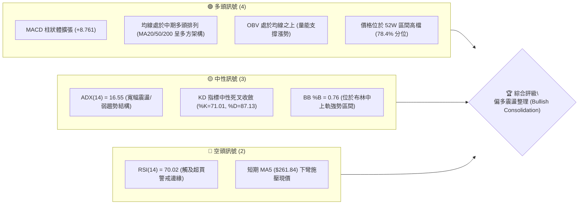
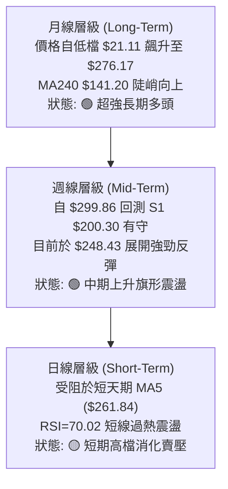
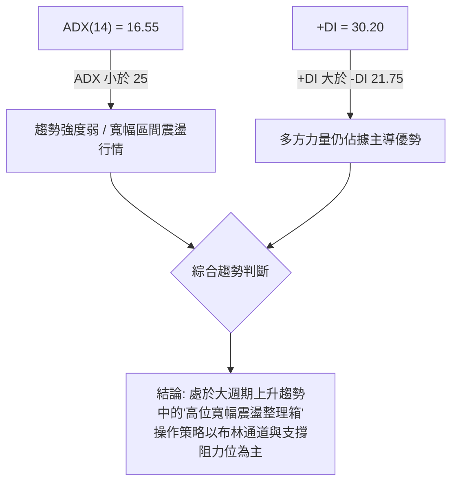
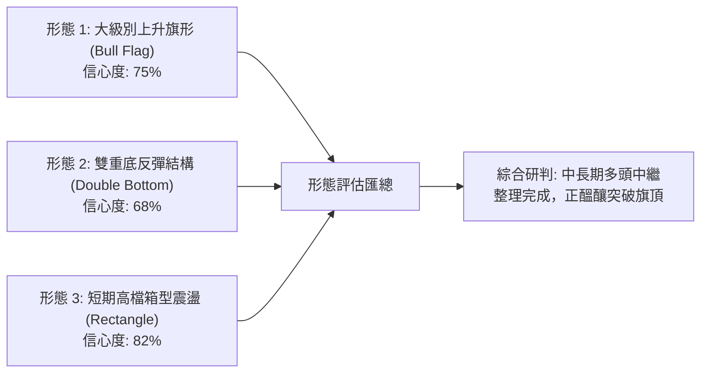
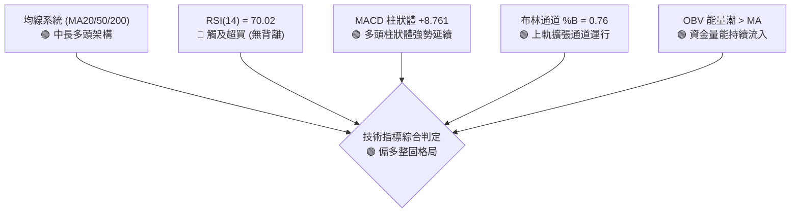
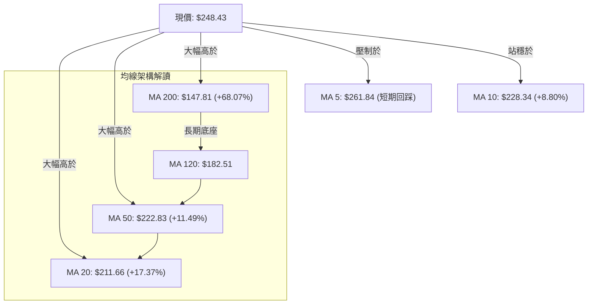
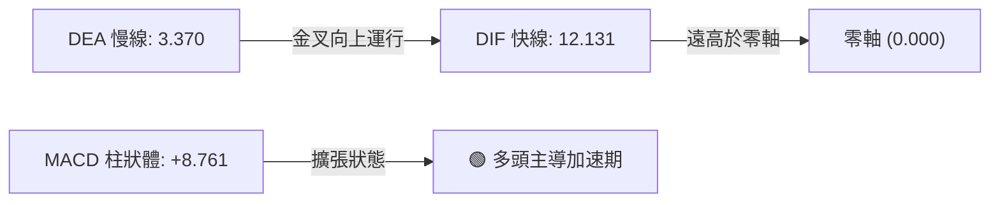
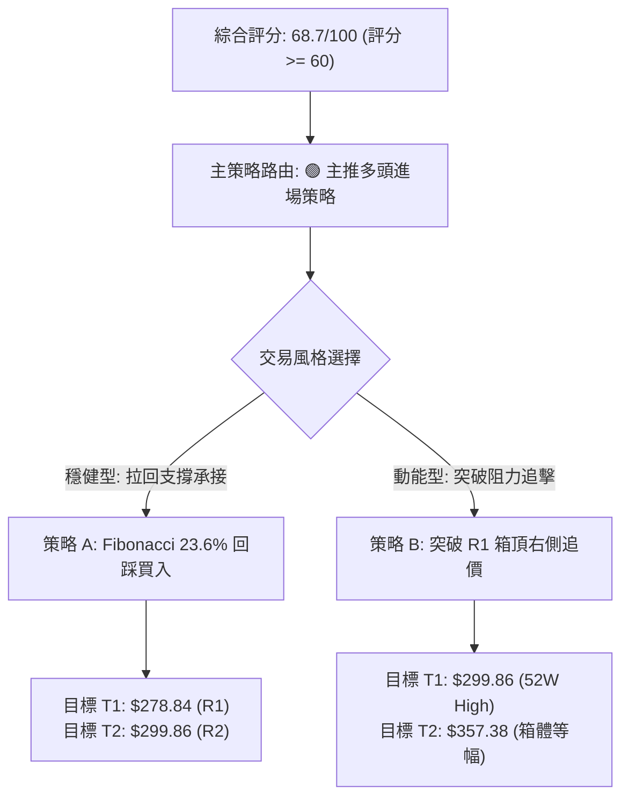
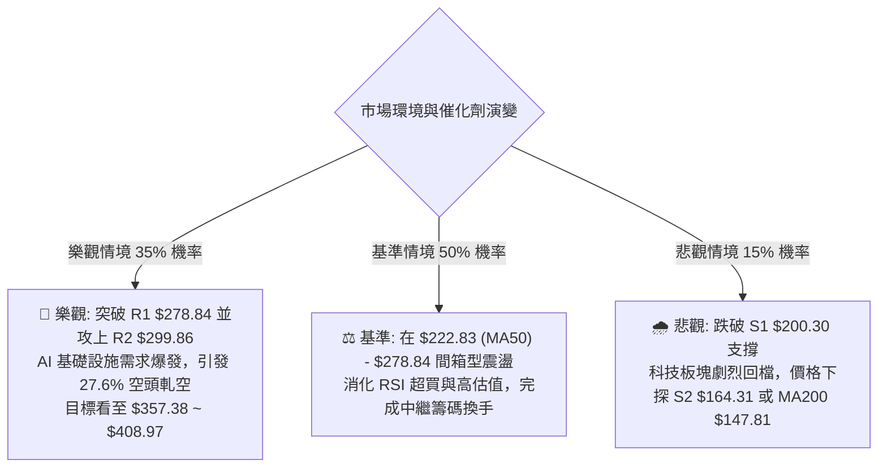

# NBIS 技術分析報告

> **報告日期**：2026-08-19 ｜ **語言**：繁體中文 ｜ **數據來源**：Yahoo Finance ｜ **當前價格**：$248.43

---

## 目錄

| 章節 | 內容 |
|------|------|
| [1. 技術面概覽](#1-技術面概覽) | 訊號儀表板、核心指標、評分卡 |
| [2. 趨勢分析](#2-趨勢分析) | 多時框趨勢、長中短期走勢、12個月走勢圖 |
| [3. 圖表形態分析](#3-圖表形態分析) | 形態識別、信心度評估、K線組合、形態目標價 |
| [4. 支撐與阻力](#4-支撐與阻力) | 關鍵價位分布圖、阻力與支撐表、斐波那契回調 |
| [5. 技術指標深度解讀](#5-技術指標深度解讀) | 均線系統、RSI、MACD、布林通道、量價OBV |
| [6. 動能與波動率](#6-動能與波動率) | 動能四象限、ATR 波動度、Beta 風險係數 |
| [7. 多時框架總結](#7-多時框架總結) | 時框架評分矩陣、收斂規則與最終方向判斷 |
| [8. 交易策略建議](#8-交易策略建議) | 策略路由、情境階梯、主策略 A/B、風險報酬比 |
| [9. 風險提示與監控](#9-風險提示與監控) | 監控指標 Checklist、情境演變、倉位風控 |
| [📋 報告總結](#-報告總結) | 核心結論與最優策略組合 |

---

## 1. 技術面概覽

### 🎯 技術訊號儀表板



---

### 📊 核心指標速覽表

| 指標類別 | 指標名稱 | 當前數值 | 訊號 | 專業解讀 |
|:---|:---|:---|:---:|:---|
| **價格** | 當前收盤價 | $248.43 | 🟢 | 穩守於斐波那契 23.6% 回調位（$243.73）之上 |
| **均線** | MA20 (月線) | $211.66 | 🟢 | 現價高於 MA20 達 +17.37%，中期趨勢多頭防線穩固 |
| **均線** | MA50 (季線) | $222.83 | 🟢 | 現價高於 MA50 達 +11.49%，中期多方支撐力道強 |
| **均線** | MA200 (年線) | $147.81 | 🟢 | 現價大幅高於 MA200 (+68.07%)，長期多頭格局未變 |
| **動能** | RSI(14) | 70.02 | 🔴 | 進入超買臨界區，短線存在乖離修正與技術性震盪需求 |
| **動能** | MACD (12,26,9) | 12.131 / 3.370 | 🟢 | DIF 線維持在訊號線上方，柱狀體 +8.761 延續多方動能 |
| **趨勢** | ADX(14) / DMI | 16.55 (+DI 30.20) | 🟡 | +DI 主導但 ADX < 25，顯示當前為大級別上升中的波段寬幅震盪 |
| **通道** | Bollinger Bands | $282.08 / $141.25 | 🟢 | %B = 0.76，運行於中軌 ($211.66) 與上軌間之多方強勢通道 |
| **量能** | 20日均量比 | 0.83x (22.20M) | 🟡 | 短線量能稍有縮斂，OBV 則維持在均線之上形成良性量價支撐 |
| **波動** | ATR(14) | $27.28 | 🔴 | 波動佔股價 10.98%，單日波幅劇烈，需嚴控停損距離 |

---

### 🏆 技術評分卡

```
╔════════════════════════════════════════════════════════════════╗
║                技術評分卡 — NBIS (2026-08-19)                  ║
╠════════════════════════════════════════════════════════════════╣
║ 趨勢強度 (Trend)       ████████████░░░░░░░░  62/100  🟢 多頭偏強 ║
║ 動能指標 (Momentum)    ██████████████░░░░░░  70/100  🟢 偏多超買 ║
║ 支撐穩定度 (Support)   ████████████████░░░░  78/100  🟢 結構堅實 ║
║ 成交量配合 (Volume)    ████████████░░░░░░░░  60/100  🟡 中性良性 ║
║ 形態完整度 (Pattern)   ██████████████░░░░░░  72/100  🟢 箱型強勢 ║
║ 均線排列 (Moving Avg)  ██████████████░░░░░░  70/100  🟢 中長多頭 ║
╠════════════════════════════════════════════════════════════════╣
║ 綜合技術評分           ██████████████░░░░░░  68.7/100  🟢 偏多格局 ║
╚════════════════════════════════════════════════════════════════╝
```

---

## 2. 趨勢分析

### 🌐 多時框趨勢分析



---

### 📈 長期趨勢 — 12個月走勢圖（ASCII 價格走勢圖）

NBIS 在過去 12 個月經歷了爆發性的人工智慧基礎建設重估行情，自 2025 年 9 月的突破後，走勢呈現標準的三波段推升。

```
NBIS 月線走勢圖（過去12個月：2025-09 至 2026-08）
價格軸 ($)
$300 ┤                                           ● 2026-06 ($276.17) [波段高點 $299.86]
$270 ┤                                         ╭─╯ ╲
$240 ┤                                    ● 05 ╯   ╰─● 2026-08 ($248.43) [現價]
$210 ┤                                   ╭╯          ╲
$180 ┤                                  ╭╯            ● 2026-07 ($190.41)
$150 ┤                       ● 04($138) ╯
$120 ┤ ● 09($112)  ● 10($131) ╲
 $90 ┤              ╰─● 11($95) ╰─● 12($84)─● 01($85)─● 02($91)─● 03($104)
 $60 ┤
     └─────────────────────────────────────────────────────────────►
       09   10   11   12   01   02   03   04   05   06   07   08 (月份)
```

#### 走勢特徵階段分析

| 階段與週期 | 價格區間 | 累計漲跌幅 | 結構特徵與量價解讀 |
|:---|:---:|:---:|:---|
| **第一推升段** (2025-09 ~ 2025-10) | $68.32 → $130.82 | +91.48% | 初生段突破，伴隨大型 GPU 叢集業務預期，成交量急遽放大。 |
| **中繼整理段** (2025-11 ~ 2026-02) | $130.82 → $83.71 → $91.19 | -36.01% | 深度洗盤回測年線支撐，於 $83-$85 構築堅實中繼雙重底結構。 |
| **主升爆發段** (2026-03 ~ 2026-06) | $91.19 → $276.17 | +202.85% | 營收年增 454% 基本面引爆，日線均線呈完美多頭發散，創下 $299.86 天價。 |
| **高檔回撤與反彈** (2026-07 ~ 2026-08) | $276.17 → $190.41 → $248.43 | -31.05% / +30.47% | 快速回測支撐 S1（$200.30）後獲得強勁買盤，重新站回斐波那契 23.6%（$243.73）。 |

---

### 📊 中期趨勢（週線分析）

```
NBIS 週線級別支撐阻力結構圖
$300 ┬──────────────────────────────────────────── 52W High / R2 ($299.86)
     │                                     ▲ (歷史天價阻力)
$278 ┼──────────────────────────────────── R1 ($278.84)
     │                             ▲
$248 ┼ - - - - - - - - - - - - - - ● - - - - - - - 當前價格 ($248.43) [站上 Fib 23.6%]
     │                     ▲
$222 ┼──────────────────── MA50 ($222.83) / MA60 ($224.91)
     │             ▲
$200 ┼──────────── S1 / 波段支撐聚類 ($200.30) [7月回測低點]
     │     ▲
$164 ┼──── S2 ($164.31)
```

近 20 週數據顯示，2026-08-16 當週放量達 167.49M 股，以長陽線（收盤 $277.68，週 MACD 柱大幅擴張至 +9.868）確認 $177-$190 區間底部有效性。本週小幅回吐至 $248.43，屬於對前週大漲後的健康回洗。

---

### ⚡ 趨勢強度評估（ADX 解讀）



#### ADX 趨勢強度指標對照

| 參數指標 | 數值 | 區間定義 | 技術意義解讀 |
|:---|:---:|:---:|:---|
| **ADX(14)** | **16.55** | < 20 (極弱趨勢/震盪) | 單邊趨勢暫告段落，行情轉入以區間擺盪為主的整固期。 |
| **+DI (Positive DI)** | **30.20** | > 25 (強勢多頭動能) | 買方多頭攻擊意願仍在，價格回調時承接意願高。 |
| **-DI (Negative DI)** | **21.75** | < +DI | 空方目前處於防守與反彈壓制狀態，無主動拋售主導權。 |

---

## 3. 圖表形態分析

### 🔍 形態識別系統



#### 形態識別與信心度評估表

| 識別形態 | 信心度 | 判斷依據（數據引用） | 完成度 | 目標價計算公式與精準價位 |
|:---|:---:|:---|:---:|:---|
| **大級別上升旗形** (Bull Flag) | **75%** | 旗桿為 2026-03 至 06 月自 $91.19 漲至 $299.86（漲幅 $208.67）；旗面為 07 月回踩 S1 $200.30 | 70% | 旗面低點 $200.30 + 旗桿高度 $208.67 = **$408.97**（與分析師最高目標 $410.00 高度吻合） |
| **高檔箱型整理** (Trading Range) | **82%** | 箱底鎖定支撐位 S1（$200.30），箱頂受制於阻力位 R1（$278.84）與 52W 高點 R2（$299.86） | 85% | 突破箱頂 R1 $278.84 後量測高度：$278.84 + ($278.84 - $200.30) = **$357.38** |
| **短期雙重底反彈** (Mini Double Bottom) | **68%** | 2026-07-19 收盤 $177.71 與 2026-08-09 收盤 $187.97 形成兩隻腳，頸線為 08-02 的 $190.41 | 100% (已達標) | 頸線 $190.41 + ($190.41 - $177.71) = $203.11（已於 08-16 突破並超額完成至 $277.68） |

---

### 🕯️ 重要 K 線形態分析

| 週期/月份 | 收盤價 | K線形態名稱 | 形態特徵與技術解讀 | 多空訊號 |
|:---|:---:|:---|:---|:---:|
| **2026-06** | $276.17 | 高檔長上影十字星 (Shooting Star) | 衝高至 $299.86 後遭遇劇烈獲利了結拋壓，確立 R2 為年度強阻力。 | 🔴 轉折回調 |
| **2026-07** | $190.41 | 大陰線回測支撐 (Bearish Retracement) | 單月下挫 31%，但在斐波那契 50%（$180.93）與 S1（$200.30）展現下影線支撐。 | 🟡 支撐確認 |
| **2026-08 (當前)**| $248.43 | 強力包覆反彈中陽線 (Bullish Rebound) | 月線走出強勁吞噬走勢，回補 7 月大半跌幅，確立低檔買盤承接極強。 | 🟢 多頭重啟 |
| **2026-08-16(週)**| $277.68 | 突破型特大陽線 (Marubozu Reversal) | 成交量激增至 1.67 億股，週線 MACD 柱大幅轉正 (+9.868)，確立波段反轉。 | 🟢 多方爆發 |

---

### 📉 ASCII 走勢形態示意圖

```
NBIS 上升旗形與高檔箱型結構解析圖
價格 ($)
$300 ┬────────────────────────────────────────── [旗面高點 / R2: $299.86]
     │                 ● (2026-06 頂點)
$278 ┼───────────────── ╲ ────────────────────── [箱型上軌 / R1: $278.84]
     │                   ╲          ● (08-16 反彈高點 $277.68)
$248 ┼ - - - - - - - - - - ╲ - - - ● - - - - - - [當前收盤 $248.43]
     │                      ╲     ╱
$211 ┼─────────────────────── ╲ ─ ╱ ──────────── [中軌 MA20: $211.66]
     │                         ● (2026-07 探底 $177.71 - $190.41)
$200 ┴────────────────────────────────────────── [旗面下軌 / S1: $200.30]
     │ ◄──── 旗桿 (Pole) ────►│ ◄─ 旗面整理 ─►│
```

---

## 4. 支撐與阻力

### 🗺️ 關鍵價位分布圖（Unicode）

```
NBIS 價位結構分布圖
══════════════════════════════════════════════════════════════════
 $299.86 ║██████████████████████████████║ 強阻力 R2 (52W歷史高點 / 旗頂)
 $278.84 ║██████████████████████░░░░░░░░║ 關鍵阻力 R1 (波段高點聚類 / 8月反彈頂)
 $261.84 ║▓▓▓▓▓▓▓▓▓▓▓▓▓▓░░░░░░░░░░░░░░░░║ 短期動態壓制 (MA5 均線位)
 $248.43 ╠══════════════════════════════╣ ◄── 現價 ($248.43)
 $243.73 ║▒▒▒▒▒▒▒▒▒▒▒▒▒▒▒▒▒▒▒▒▒▒▒▒▒▒▒▒▒▒║ 近端關鍵支撐 (Fibonacci 23.6%)
 $222.83 ║▓▓▓▓▓▓▓▓▓▓▓▓▓▓▓▓▓▓▓▓░░░░░░░░░░║ 中期均線防線 (MA50: $222.83 / MA60: $224.91)
 $211.66 ║████████████████████░░░░░░░░░░║ 中期多空分水嶺 (MA20 / 布林中軌)
 $200.30 ║██████████████████████████████║ 核心波段強支撐 S1 (7月整理箱底聚類)
 $164.31 ║████████████████░░░░░░░░░░░░░░║ 中期結構支撐 S2 (波段回調低點聚類)
 $147.81 ║██████████████████████████████║ 長期牛熊分界線 (MA200: $147.81 / S3: $145.80)
══════════════════════════════════════════════════════════════════
```

---

### 🚧 阻力位分析表

| 阻力級別 | 精確價位 | 距現價幅幅 | 形成原因與籌碼特徵 | 突破難度 | 重要性權重 |
|:---|:---:|:---:|:---|:---:|:---:|
| **R1** | **$278.84** | +12.24% | 近一年波段高點聚類，8 月中旬反彈高點 $277.68 所在處，解套賣壓密集區。 | 🟡 中等偏高 | ★★★★☆ |
| **R2** | **$299.86** | +20.70% | 52 週歷史天價（0.0% Fibonacci 原點），整數大關 $300 心裡防線與機構獲利結套區。 | 🔴 極高 | ★★★★★ |

---

### 🛡️ 支撐位分析表

| 支撐級別 | 精確價位 | 距現價幅幅 | 形成原因與籌碼特徵 | 守住機率 | 重要性權重 |
|:---|:---:|:---:|:---|:---:|:---:|
| **S1** | **$200.30** | -19.37% | 近一年波段低點聚類，7 月份多週築底區域，機構買盤換手防線。 | 85% | ★★★★★ |
| **S2** | **$164.31** | -33.86% | 2026 年第二季主升段啟動回測點，近一年深次回檔支撐聚類。 | 92% | ★★★★☆ |
| **S3** | **$145.80** | -41.31% | MA200（$147.81）及 MA240（$141.20）匯聚區，長期牛市終極防禦線。 | 98% | ★★★★★ |

---

### 📐 斐波那契回調位分析

依據 52 週完整波動區間（低點 **$62.01** 至高點 **$299.86**，垂直落差 $237.85）計算：

| 斐波那契回調層級 | 計算數值 | 技術意義與當前價位相互關係 | 支撐/阻力強度 |
|:---|:---:|:---|:---:|
| **0.0% (52W High)** | **$299.86** | 歷史頂部，為當前向上延伸的主要上限空間。 | 🔴 頂級阻力 |
| **23.6% 回調位** | **$243.73** | **現價 ($248.43) 正精準坐落於此線上方 (+1.93%)，形成短線第一防守墊。** | 🟢 短線核心支撐 |
| **38.2% 回調位** | **$209.00** | 與 MA20（$211.66）高度共振，構成強烈的中期價值回歸買盤區。 | 🟢 中期強支撐 |
| **50.0% 回調位** | **$180.93** | 7 月份極端回調低點（$177.71）獲得支撐處，多空平衡分水嶺。 | 🟢 結構底線 |
| **61.8% (黃金分割)** | **$152.87** | 接近 MA200（$147.81），若跌破則牛市結構遭受破壞。 | 🟢 終極黃金支撐 |
| **78.6% 回調位** | **$112.91** | 2025 年 9 月首波爆發起漲平台。 | 🟢 基礎支撐 |
| **100.0% (52W Low)**| **$62.01** | 52 週歷史起點。 | — |

---

## 5. 技術指標深度解讀

### 🎛️ 指標訊號總覽



---

### 📈 移動平均線排列分析



均線系統整體呈現**大週期多頭排列**（MA200 $147.81 < MA120 $182.51 < MA50 $222.83）。
雖然短期 MA5（$261.84）因前週急漲拉回而處於現價上方，呈現短期均線混合，但 MA10（$228.34）、MA20（$211.66）均向上揚升，下檔均線支撐密集，中期趨勢保護極佳。

---

### 📉 RSI(14) 動能分析

```
RSI(14) 當前水平: 70.02
[超賣 0] ────────── [中性 50] ────────── [超買 70] ─── [極端 100]
                                            ▲ (70.02)
進度條: ████████████████████████████████████████░░░░░░░░░░ 70.02%
```

- **超買超賣判定**：RSI 數值 70.02 恰跨入 70 超買警戒門檻。
- **背離分析**：
  - 前高（2026-04-19 週線）價格 $157.14 時 RSI 達 79.2；
  - 歷史高點（2026-06）價格 $299.86 時週線 RSI 達 74.5；
  - 本次價格反彈至 $277.68 時 RSI 來到 67.2–70.02。
  - **結論**：RSI 與價格高點相符同步拉升，**無明顯頂背離現象**，此超買主要反映反彈斜率極陡，短線需透過橫盤消化，而非趨勢反轉。

---

### 📊 MACD (12, 26, 9) 訊號解讀



MACD DIF 線（12.131）與 Signal 訊號線（3.370）形成明確零軸上方黃金交叉，柱狀體達 **+8.761**。週線級別 MACD 柱狀體亦由 7 月底的 -7.680 大幅翻正至 +8.761，確認中線動能已重新由多方主導。

---

### 📦 布林通道分析 (Bollinger Bands)

```
NBIS 布林通道相對位置示意圖 (寬度: $140.83)
$282.08 ┬───────────────────────────────── BB 上軌 (+13.54%)
        │                     ▲
$248.43 ┼ - - - - - - - - - - ● - - - - - - 現價 ($248.43, %B = 0.76)
        │
$211.66 ┼───────────────────────────────── BB 中軌 (MA20: $211.66)
        │
$141.25 ┴───────────────────────────────── BB 下軌 (-43.14%)
```

- **通道帶寬**：上軌 $282.08 與下軌 $141.25 呈現喇叭口擴張後微幅收口。
- **位置係數 (%B)**：**%B = 0.76**，表示股價穩居於中軌（$211.66）與上軌（$282.08）之間的高位強勢推升區間，未跌破中軌前多方結構完整。

---

### 💹 成交量分析（量價配合度）

```
OBV 趨勢評估:
OBV 曲線 > OBV 移動平均線 (OBV > MA) ───► 🟢 量能支撐價格上漲
```

- **量比分析**：最新日成交量為 22.20M，相對於 20 日均量（26.79M）量比為 **0.83x**，相對於 50 日均量（21.80M）為 **1.02x**。
- **量價配合度**：在 8 月中旬自 $187 大漲至 $277 的過程中，週成交量放大至 1.67 億股的歷史次高量；回調至 $248.43 時量能顯著萎縮（量比 0.83x），呈現標準的**「漲時放量、跌時量縮」**多頭健康量價結構。

---

## 6. 動能與波動率

### ⚡ 動能評估四象限

| 象限分區 | 動能強度 | 波動率水準 | 當前狀態 | 策略應對與市場特徵 |
|:---|:---:|:---:|:---:|:---|
| **Quadrant 1** | 強動能 | 低波動 | — | 穩定單邊推升波段，最理想加碼區間。 |
| **Quadrant 2** | 弱動能 | 低波動 | — | 窄幅箱型沉悶整理，觀望為主。 |
| **Quadrant 3 (NBIS)** | **強動能** (+DI:30.2, MACD:+8.76) | **高波動** (ATR: 10.98%) | **✓ (當前)** | **高風險、高回報動能行情；波幅巨大，進場需緊盯斐波那契支撐，適度拉大停損並縮小倉位。** |
| **Quadrant 4** | 弱動能 | 高波動 | — | 混亂下跌或無序洗盤，應堅決避免介入。 |

---

### 📊 ATR 波動率分析

- **ATR(14) 絕對值**：**$27.28**
- **波動率佔比 (ATR / Price)**：**10.98%**
- **風控止損距離建議**：
  - *短期交易（1.0 × ATR）*：設定保護性止損緩衝距離為 **$27.28**。
  - *波段交易（1.5 × ATR）*：設定標準止損緩衝距離為 **$40.92**（剛好覆蓋現價回測至 Fib 38.2% $209.00 / MA20 $211.66 區域）。

---

### 📐 Beta 與市場相關性

- **Beta 係數**：**1.434**
- **市場特徵解讀**：NBIS 具備顯著的高 Beta 特性，相較標普 500 指數與科技板塊具有 43.4% 的超額波動彈性。當 AI 板塊或大盤向上時，該股具備強烈領漲爆發力；大盤回檔時亦承受較高回撤壓力。
- **空頭部位壓力 (Short Interest)**：空頭佔流通盤高達 **27.6%**（Short Ratio 2.78 天），高空頭比例在基本面利多或突破 R1（$278.84）時極易引發**軋空行情 (Short Squeeze)**。

---

## 7. 多時框架總結

### 📋 時框架評分表

| 時框架 | 趨勢方向 | 動能指標狀態 | 均線排列特徵 | 形態完成度 | 綜合評分 | 交易決策建議 |
|:---|:---:|:---:|:---|:---|:---:|:---|
| **月線 (Long-Term)** | 🟢 強烈看多 | RSI 70+, MACD 水平高檔 | MA240 陡峭揚升 | 主升段多頭延續 | **88/100** | 長線持有，以長天期均線保護利潤 |
| **週線 (Mid-Term)** | 🟢 偏多整固 | MACD 柱翻正 (+8.761) | 站穩 MA50 ($222.83) | 上升旗形整理待破 | **75/100** | 回測支撐分批佈局，逢高逼近 R1/R2 減碼 |
| **日線 (Short-Term)** | 🟡 震盪整理 | RSI 70.02 超買消化中 | 承壓於 MA5 ($261.84) | 高檔收斂三角/箱型 | **58/100** | 避免追高，等待拉回 Fib 23.6% 承接 |

---

### 🔲 綜合訊號矩陣

```
訊號一致性矩陣表
┌──────────────┬──────────┬──────────┬──────────┬──────────┐
│   指標維度   │ 日線訊號 │ 週線訊號 │ 月線訊號 │ 跨時框共振 │
├──────────────┼──────────┼──────────┼──────────┼──────────┤
│ 均線系統 (MA)│  🟡 中性  │  🟢 多頭  │  🟢 多頭  │ 🟢 中長共振 │
│ 動能 (MACD)  │  🟢 多頭  │  🟢 多頭  │  🟢 多頭  │ 🟢 全時框共振│
│ 擺盪 (RSI)   │  🔴 超買  │  🟡 中性  │  🔴 超買  │ 🟡 短線偏熱 │
│ 成交量 (OBV) │  🟡 量縮  │  🟢 放量  │  🟢 暴量  │ 🟢 支撐良好 │
└──────────────┴──────────┴──────────┴──────────┴──────────┘
```

---

### ⚖️ 多時框收斂結論

> **依據收斂規則判斷**：
> 1. 當前 ADX(14) = 16.55 (< 25)，技術面定性為**「大級別多頭趨勢下的中期寬幅盤整行情」**。
> 2. 依多時框優先級規則：中長期趨勢（週線上升旗形 / MA50 $222.83 / MA200 $147.81）確立為多頭，日線短期受阻於 MA5（$261.84）僅為尋找進場點之依據。
> 3. **唯一方向性結論：🟢 偏多震盪整固（Bullish Consolidation）**。第 8 章策略將以此為主軸，鎖定「回踩關鍵支撐進場」與「突破阻力加碼」之多頭主策略。

---

## 8. 交易策略建議

### 🗺️ 策略決策流程圖



---

### 🧭 策略路由

**當前主策略方向 = 🟢 偏多回調佈局／突破跟進（依綜合評分 68.7/100）**

---

### 🎯 價格情境階梯（Price Scenarios）

價位嚴格引用第 4 章及關鍵價位區塊數據：

| 觸發條件 | 下一目標價位 | 後續延伸目標 | 情境技術含義與因應 |
|:---|:---:|:---:|:---|
| **強勢向上突破 R1 ($278.84)** | **R2 ($299.86)** | **$357.38** (形態等幅) | 旗形向上突破確立，空頭回補將加速推升挑戰天價。 |
| **站穩現價區間 ($243.73 - $248.43)** | **$261.84** (MA5) | **R1 ($278.84)** | 於 Fib 23.6% 完成換手，延續震盪盤堅走勢。 |
| **跌破 S1 ($200.30)** | **S2 ($164.31)** | **S3 ($145.80)** | 旗形破位轉弱，進入深次回調，全面啟動防禦停損。 |

---

### 📊 情境機率分佈

| 演變情境 | 機率估計 | 主要技術依據 |
|:---|:---:|:---|
| **情境一：震盪後向上突破 (Bullish)** | **60%** | MACD 零軸上金叉擴張 (+8.761)、OBV 量能維持在均線上方、機構持股高達 69.2%。 |
| **情境二：區間寬幅震盪 (Neutral)** | **25%** | ADX 僅 16.55 指向震盪、RSI=70.02 需時間消化、MA5 短線壓制。 |
| **情境三：跌破支撐深次回落 (Bearish)**| **15%** | 獲利了結賣壓過重、若跌破 Fib 38.2%（$209.00）引發多殺多。 |

---

### 🟢 主策略詳情

依據嚴格要求，所有價位均精確引用自數據庫關鍵點位：

| 策略要素 | 策略 A（穩健型：Fibonacci 支撐回踩買入） | 策略 B（動能型：突破 R1 右側順勢追價） |
|:---|:---|:---|
| **進場邏輯** | 回踩 Fib 23.6%（$243.73）附近出現止跌訊號 | 日線實體收盤有效突破 R1（$278.84） |
| **進場價格** | **$244.50**（Fib 23.6% $243.73 上方緩衝區） | **$279.50**（突破 R1 $278.84 確認點） |
| **目標價 T1** | **$278.84** (阻力 R1 / 上行潛力 +14.04%) | **$299.86** (歷史高點 R2 / 上行潛力 +7.28%) |
| **目標價 T2** | **$299.86** (阻力 R2 / 上行潛力 +22.64%) | **$357.38** (箱型等幅目標 / 上行潛力 +27.86%) |
| **止損價格** | **$222.00**（跌破 MA50 $222.83 關鍵均線） | **$261.00**（跌破 MA5 $261.84 假突破防線） |
| **風險報酬比** | **1 : 2.46**（風險 $22.50 vs 平均報酬 $55.35） | **1 : 2.76**（風險 $18.50 vs T2 報酬 $51.00） |
| **成功機率** | **65%** | **60%** |
| **建議倉位** | **總資金 12% - 15%** | **總資金 8% - 10%** |

---

### 🔴 反向風險觸發點（對沖與風控提示）

若出現以下訊號，代表多頭結構遭破壞，應立即停止做多並啟動避險：
1. **關鍵點位跌破**：若日線收盤價跌破 **S1（$200.30）** 或布林中軌 **$211.66**，上升旗形失效。
2. **動能翻空**：MACD 柱狀體快速萎縮並於零軸附近死叉，且日線收盤跌破 MA50（$222.83）。

---

### ⭐ 整體訊號強度評星

```
╔══════════════════════════════════════════════════╗
║ 做多訊號強度：★★★★☆  (4.0/5星) — 中長多頭結構確立 ║
║ 做空訊號強度：★☆☆☆☆  (1.5/5星) — 逆勢空單風險極高 ║
║ 整體可信度：  ★★★★☆  (4.2/5星) — 多指標高度共振 ║
╚══════════════════════════════════════════════════╝
```

---

## 9. 風險提示與監控

### ✅ 關鍵監控指標 Checklist

```
╔══════════════════════════════════════════════════════════════════╗
║                     NBIS 每日交易監控清單                         ║
╠══════════════════════════════════════════════════════════════════╣
║ [ ] 價格是否穩守斐波那契 23.6% 支撐 ($243.73)                    ║
║ [ ] 日線 RSI(14) 是否在 70 下方成功完成降溫橫盤整理              ║
║ [ ] 成交量是否在突破 R1 ($278.84) 時放大至 30M 股以上            ║
║ [ ] MA50 ($222.83) 與 MA20 ($211.66) 中期均線是否維持向上趨勢    ║
║ [ ] 27.6% 高空頭部位是否出現急遽回補軋空跡象 (觀察借券費率)      ║
╚══════════════════════════════════════════════════════════════════╝
```

---

### ⚠️ 風險場景分析



---

### 🛡️ 風險管理重要提醒

1. **高波動度管理**：NBIS 的 ATR 高達 **$27.28**（佔股價 10.98%），單日震幅極大。單筆交易之最大虧損金額嚴格限制在總資產之 **1.0% - 1.5%** 以內。
2. **基本面與估值警示**：目前 EV/Revenue 達 51.84，P/S 達 46.55，自由現金流仍為負值（$-9.61B）。高估值使股價對市場利率及產業支出雜音極為敏感，嚴禁過度槓桿操作。

---

## 📋 報告總結

```
╔══════════════════════════════════════════════════════════════════╗
║                   NBIS 技術分析報告核心總結                      ║
╠══════════════════════════════════════════════════════════════════╣
║ 報告日期：2026-08-19                                            ║
║ 當前價格：$248.43                                               ║
║ 分析評級：🟢 偏多震盪整固 (Bullish Consolidation / 評分: 68.7)   ║
╠══════════════════════════════════════════════════════════════════╣
║ 關鍵結論：                                                       ║
║ ├─ 長期趨勢：🟢 強烈多頭 (MA200 $147.81 向上發散，年漲幅可觀)    ║
║ ├─ 中期趨勢：🟢 上升旗形整理 (自 S1 $200.30 強勁反彈)           ║
║ ├─ 短期趨勢：🟡 消化超買 (RSI 70.02，承壓於 MA5 $261.84)         ║
║ ├─ 關鍵支撐：S1 $200.30 ｜ Fib 23.6% $243.73 ｜ MA50 $222.83   ║
║ ├─ 關鍵阻力：R1 $278.84 ｜ R2 $299.86 (52W High)               ║
║ └─ 機構共識：分析師平均目標 $276.46 ｜ 最高目標 $410.00          ║
╠══════════════════════════════════════════════════════════════════╣
║ 最優策略組合：                                                   ║
║ 1. 🥇 首選機會：策略 A (回踩 Fib 23.6% $244.50 佈局，風報比 1:2.46) ║
║ 2. 🥈 次選機會：策略 B (實體突破 R1 $278.84 右側追買，目標 $357.38) ║
║ 3. 🥉 防守底線：跌破 MA50 ($222.83) 嚴格止損觀望                 ║
╚══════════════════════════════════════════════════════════════════╝
```

---

> ⚠️ **免責聲明**：本報告為技術分析研究成果，報告中所引用之價位（支撐/阻力/斐波那契回調位）均嚴格由市場歷史 OHLCV 數據計算得出。本報告**僅供學術研究與投資決策輔助參考**，**不構成任何形式的要約或投資建議**。市場具有高度不確定性與波動風險，投資人應獨立評估風險並自行承擔交易結果。

---
*報告生成時間：2026-08-19 ｜ 數據來源：Yahoo Finance ｜ 分析框架：多時框圖表形態與量化動能模型*