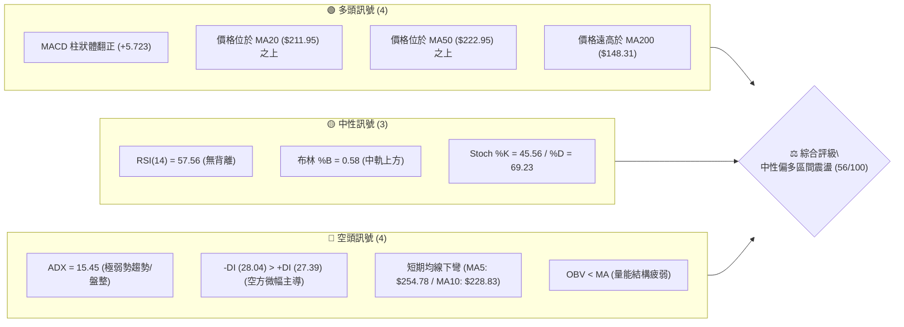
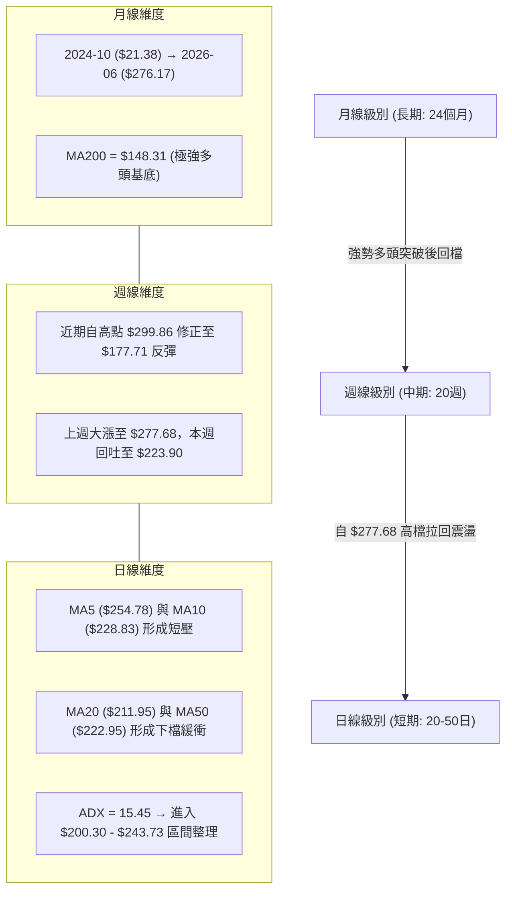
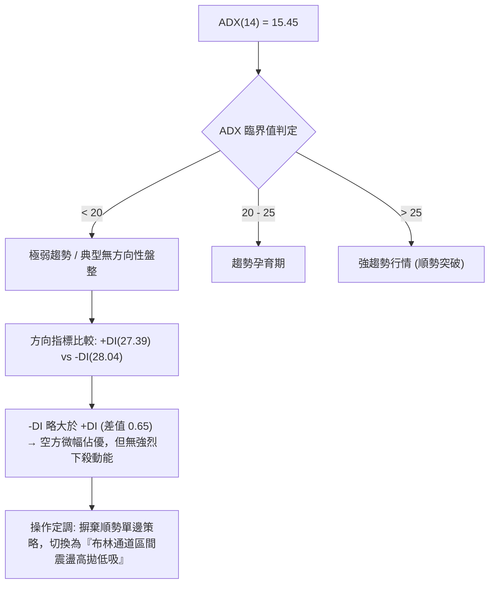
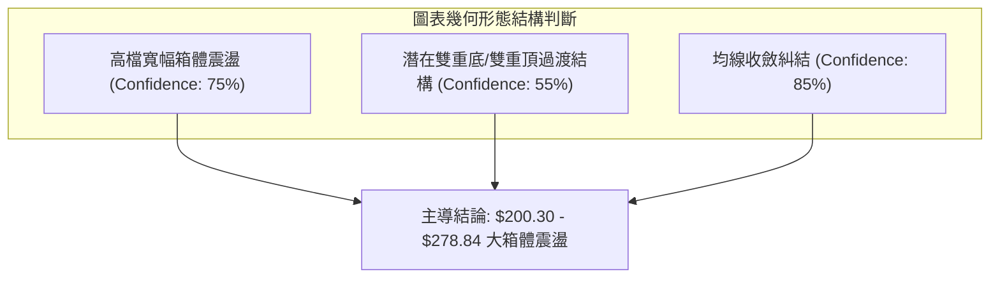
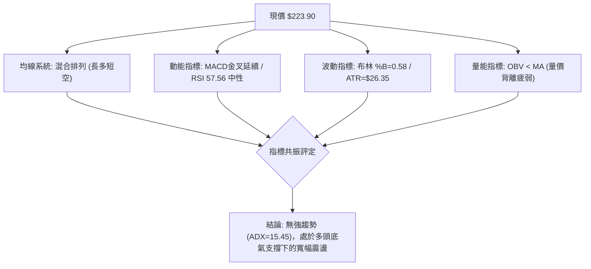
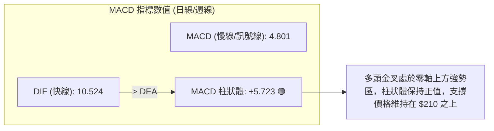
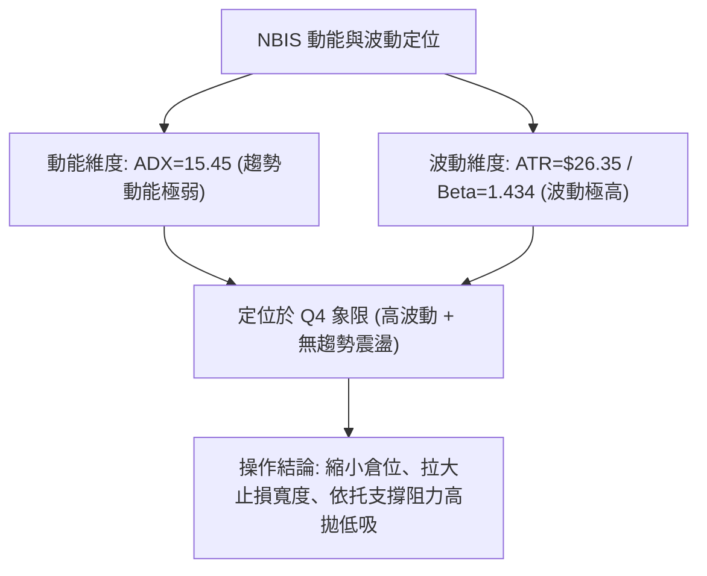
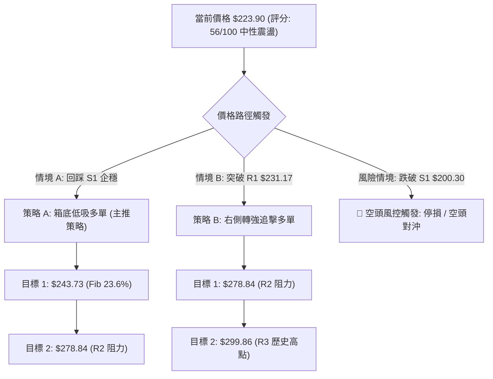
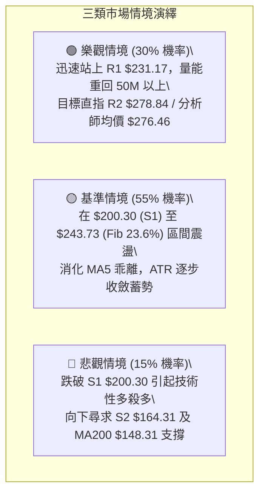

# NBIS 技術分析報告

> **報告日期**：2026-08-20 ｜ **語言**：繁體中文 ｜ **數據來源**：Yahoo Finance ｜ **當前價格**：$223.90

---

## 目錄

| 章節 | 內容 |
|------|------|
| [1. 技術面概覽](#1-技術面概覽) | 訊號儀表板、核心指標、評分卡 |
| [2. 趨勢分析](#2-趨勢分析) | 多時框趨勢、長中短期走勢 |
| [3. 圖表形態分析](#3-圖表形態分析) | 形態識別、K線組合、目標價 |
| [4. 支撐與阻力](#4-支撐與阻力) | 關鍵價位、斐波那契回調 |
| [5. 技術指標深度解讀](#5-技術指標深度解讀) | MA/RSI/MACD/布林/成交量 |
| [6. 動能與波動率](#6-動能與波動率) | 動能評估、ATR、Beta |
| [7. 多時框架總結](#7-多時框架總結) | 時框架評分矩陣 |
| [8. 交易策略建議](#8-交易策略建議) | 多空策略、風險報酬比 |
| [9. 風險提示與監控](#9-風險提示與監控) | 監控指標、風險場景 |

---

## 1. 技術面概覽

### 🎯 技術訊號儀表板



### 📊 核心指標速覽表

| 指標類別 | 指標名稱 | 當前數值 | 訊號 | 解讀 |
|----------|----------|----------|------|------|
| **價格** | 當前收盤價 | $223.90 | 🟡 | 位於52週區間 ($62.01–$299.86) 之 68.1% 水位，回跌整理中 |
| **均線** | MA20 (短中軌) | $211.95 | 🟢 | 價格在 MA20 上方 +5.64%，短線提供動態支撐 |
| **均線** | MA50 (中期線) | $222.95 | 🟢 | 價格在 MA50 上方 +0.43%，短線爭奪中期多空分水嶺 |
| **均線** | MA200 (長期線)| $148.31 | 🟢 | 價格在 MA200 上方 +50.97%，長期多頭架構未破 |
| **動能** | RSI(14) | 57.56 | 🟡 | 位於中性常態區間 (30–70)，無明顯頂底背離 |
| **動能** | MACD (12,26,9) | 10.524 / 4.801 | 🟢 | 柱狀圖 +5.723，快慢線於零軸上方金叉延續，具備多頭動能 |
| **動能** | DMI (ADX / DI) | ADX: 15.45 | 🔴 | ADX < 25 處於無趨勢盤整；-DI(28.04) 略高於 +DI(27.39) |
| **波動** | ATR(14) | $26.35 | 🔴 | 佔股價 11.77%，處於極高波動率狀態，單日震幅劇烈 |
| **量能** | 成交量 / 20日均量| 49.44M / 28.45M | 🟡 | 今日量比 1.74x 放大，但 OBV < MA 顯示中長期量能背馳 |

### 🏆 技術評分卡

```
╔══════════════════════════════════════════════════════════════════╗
║              技術評分卡 — NBIS (2026-08-20)                     ║
╠══════════════════════════════════════════════════════════════════╣
║ 趨勢強度 (ADX=15.45, 盤整)     ██████░░░░░░░░░░░░░░  30/100  🔴  ║
║ 動能指標 (MACD偏多, RSI中性)   █████████████░░░░░░░  65/100  🟢  ║
║ 支撐穩定度 (S1=$200.30 聚類)   ██████████████░░░░░░  70/100  🟢  ║
║ 成交量配合 (OBV疲弱, 今日放量) █████████░░░░░░░░░░░  45/100  🟡  ║
║ 形態完整度 (自高點拉回箱體)   ████████████░░░░░░░░  60/100  🟡  ║
║ 均線排列 (長多短空, 混合排列) ██████████████░░░░░░  68/100  🟢  ║
╠══════════════════════════════════════════════════════════════════╣
║ 綜合技術評分                  ███████████░░░░░░░░░  56/100  🟡  ║
║ 評級結論：中性震盪 (Neutral Consolidation) — 區間高拋低吸       ║
╚══════════════════════════════════════════════════════════════════╝
```

---

## 2. 趨勢分析

### 🌐 多時框趨勢分析



### 📈 長期趨勢 — 12個月走勢圖（Unicode）

```
NBIS 月線收盤走勢圖（2025-09 至 2026-08）
價格軸 ($)
$300 ┤                                                     
$280 ┤                                      ● 276.17 (06月)
$260 ┤                                     / \             
$240 ┤                               ● 231.09 \            
$220 ┤                                 (05月)   \  ● 223.90 (08月現價)
$200 ┤                                          ● 190.41 (07月)
$180 ┤                                                     
$160 ┤                                                     
$140 ┤                   ● 130.82 (10月) ● 138.23 (04月)   
$120 ┤       ● 112.27 (09月) \          /                  
$100 ┤                        ● 94.87  ● 103.76 (03月)     
$80  ┤                         (11月)\/ 91.19 (02月)       
     └─────────────────────────────────────────────────────
      09  10  11  12  01  02  03  04  05  06  07  08 (月)
      (2025)          (2026)
```

#### 走勢特徵分析表格

| 階段區間 | 起訖月份 | 價格區間 ($) | 漲跌幅 (%) | 走勢特徵與技術意義 |
|----------|----------|--------------|------------|--------------------|
| **第一波主升段** | 2025/08–2025/10 | $68.32 → $130.82 | +91.48% | 量能激增，突破百元關卡，確立長多趨勢 |
| **中繼整理波** | 2025/11–2026/02 | $130.82 → $83.71 → $91.19 | -36.01% | 縮量築底，於 $83.71 形成穩固中期支撐平台 |
| **第二波狂熱主升**| 2026/03–2026/06 | $91.19 → $276.17 | +202.85% | 均線多頭發散，創下歷史高點 $299.86 |
| **高檔劇烈震盪** | 2026/07–2026/08 | $276.17 → $190.41 → $223.90 | -18.93% | 高檔獲利回吐，波幅擴大，進入寬幅箱體洗盤 |

### 📊 中期趨勢（週線分析）

```
NBIS 週線關鍵壓力支撐示意圖
══════════════════════════════════════════════════════════════════
 阻力 R3  $299.86 ────────────────────────────────── (52W歷史天花板)
          $277.68 ──────▲ (2026-08-16 爆量長上影反彈高點)
 阻力 R2  $278.84 ────────────────────────────────── (波段高點聚類)
 阻力 R1  $231.17 ──────▲ (52W 23.6% 回調位 $243.73 / 短線壓制點)
 
 現價     $223.90 ◄───── 現處於 MA50 ($222.95) 與 MA20 ($211.95) 上方
 
 支撐 S1  $200.30 ──────▼ (波段低點聚類 / 52W 38.2% 回調位 $209.00)
 支撐 S2  $164.31 ──────▼ (2026-07 波段回調低點 $177.71 下方防線)
 支撐 S3  $145.80 ────────────────────────────────── (MA200: $148.31 強防線)
══════════════════════════════════════════════════════════════════
```

### ⚡ 趨勢強度評估（ADX 解讀）



#### ADX 與 DMI 指標對照表

| 指標名稱 | 當前數值 | 參考閾值 | 技術解讀 |
|----------|----------|----------|----------|
| **ADX (14)** | **15.45** | < 20 (弱) / > 25 (強) | 處於嚴重無趨勢狀態，單邊突破容易形成假突破 |
| **+DI (14)** | **27.39** | — | 多頭攻擊力道自 2026-08-16 高點後快速回落 |
| **-DI (14)** | **28.04** | — | 空頭力道稍高於多頭，但未形成發散，主導權爭奪激烈 |
| **趨勢定性** | **無方向性寬幅震盪** | — | 依據收斂規則，以日線布林通道上下軌及箱體邊界為依據 |

---

## 3. 圖表形態分析

### 🔍 形態識別系統



#### 形態識別與信心度評估表

| 形態名稱 | 信心度 | 判斷依據（引用技術數據） | 完成度 | 目標價（附嚴謹計算式） |
|----------|--------|--------------------------|--------|------------------------|
| **高檔寬幅矩形箱體** | **75%** | 箱頂為阻力聚類 R2 ($278.84)，箱底為支撐聚類 S1 ($200.30)。近 8 週股價多次在 $177.71–$277.68 間來回拉鋸 | 70% | **突破目標**：箱頂 $278.84 + 箱高 ($278.84 - $200.30 = $78.54) = **$357.38**；<br>**跌破目標**：箱底 $200.30 - 箱高 $78.54 = **$121.76** |
| **潛在短線雙底回測** | **55%** | 2026-07-19 低點 $177.71 與 2026-08-09 低點 $187.97 構成雙底抬高雛形，但 2026-08-16 衝至 $277.68 後迅速回落，尚未有效站穩頸線 R1 ($231.17) | 60% | **頸線位**：R1 ($231.17)。<br>**形態高度**：$231.17 - $177.71 = $53.46。<br>**度量目標**：$231.17 + $53.46 = **$284.63** (接近 R2 $278.84) |
| **均線死叉/糾結形態** | **85%** | MA5 ($254.78) 急劇下穿、MA10 ($228.83) 走平下彎，與 MA50 ($222.95)、MA20 ($211.95) 形成高檔均線黏合糾結 | 90% | 屬於震盪收斂特徵，無延伸單邊目標，指示價格將持續於 **$211.95–$231.17** 黏合震盪 |

### 🕯️ 重要K線形態分析（近 8 週重點分析）

| 週別/日期 | 收盤價 ($) | 週K線形態 | 量能狀態 | 技術解讀與訊號 |
|-----------|------------|-----------|----------|----------------|
| **2026-07-05** | 215.62 | 中黑K棒，破位下行 | 82.66M | 確立高檔獲利了結賣壓，MACD 柱狀體翻負 (-6.630) 🔴 |
| **2026-07-19** | 177.71 | 長下影錘頭破底線 | 100.94M (放量) | 觸及波段波谷 $177.71 後出現抄底資金，形成中期底部支撐 🟢 |
| **2026-08-02** | 190.41 | 低檔十字星/築底K | 154.85M (天量) | 量能爆出歷史級巨量，多空在 $190 關卡劇烈換手，打底確立 🟢 |
| **2026-08-16** | 277.68 | 巨幅長陽帶長上影 | 167.50M (極量) | 單週暴力反彈逼近 R2 ($278.84)，但受制於解套賣壓留長上影 🟡 |
| **2026-08-23** | 223.90 | 實體回吐大黑K | 91.99M (量縮) | 獲利盤迅速回吐至 MA50 ($222.95) 處，暫時止跌於 MA20 ($211.95) 上方 🟡 |

### 📉 ASCII 走勢形態示意圖

```
NBIS 高檔箱體形態結構示意圖
價格 ($)
$278.84 ┬───────────────────● (2026-08-16 高點 $277.68 - 箱頂阻力 R2)
        │                  / \
$250.00 ┤                 /   \
$231.17 ┼───────●───────/─────\─── (短線頸線阻力 R1)
        │      / \     /       \  ● 現價 $223.90
$211.95 ┼─────/───\───/─────────▼── (MA20 中軌支撐)
        │    /     \ /
$200.30 ┼───/───────● (波段支撐 S1)
        │  /
$177.71 ┴─● (2026-07-19 探底低點 / 箱底支撐 S2 邊界 $164.31)
```

### 🎯 形態目標價計算

1. **箱體震盪向上突破情境**：
   - 頸線/箱頂關鍵位：$278.84 (R2)
   - 箱底基準位：$200.30 (S1)
   - 垂直形態高度 ($H$) = $278.84 - $200.30 = $78.54
   - **等距映射目標價 (T_up)** = $278.84 + $78.54 = **$357.38** (需週線實體突破 R3 $299.86 歷史高點)

2. **箱體震盪向下破位情境**：
   - 箱底關鍵防線：$200.30 (S1)
   - 跌破後等距度量目標 = $200.30 - $78.54 = **$121.76** (跌破後將直奔斐波那契 78.6% $112.91 區域)

---

## 4. 支撐與阻力

### 🗺️ 關鍵價位分布圖（Unicode）

```
NBIS 價位結構分布圖
══════════════════════════════════════════════════════════════════
$299.86 ║██████████████████████████████║ 強歷史天花板 R3 (52W High / Fib 0.0%)
$282.52 ║▓▓▓▓▓▓▓▓▓▓▓▓▓▓▓▓▓▓▓▓▓▓▓▓      ║ 布林通道上軌
$278.84 ║██████████████████████        ║ 波段高點強阻力 R2
$243.73 ║▒▒▒▒▒▒▒▒▒▒▒▒▒▒▒▒▒▒▒▒          ║ 斐波那契 23.6% 回調位
$231.17 ║██████████████████            ║ 短線轉折關鍵阻力 R1 (+3.25%)
$225.06 ║───────────────               ║ 季線 MA60
$223.90 ╠══════════════════════════════╣ ◄ 當前市價 (Current Price)
$222.95 ║───────────────               ║ 中期均線 MA50
$211.95 ║▓▓▓▓▓▓▓▓▓▓▓▓▓▓▓▓              ║ 布林中軌 / 月線 MA20
$209.00 ║▒▒▒▒▒▒▒▒▒▒▒▒                  ║ 斐波那契 38.2% 回調位
$200.30 ║████████████████████          ║ 關鍵波段支撐 S1 (-10.54%)
$180.93 ║▒▒▒▒▒▒▒▒▒▒                    ║ 斐波那契 50.0% 多空分水嶺
$164.31 ║████████████████              ║ 次級波段支撐 S2 (-26.61%)
$148.31 ║────────────────              ║ 長期均線 MA200
$145.80 ║██████████████████████████████║ 核心結構底層支撐 S3 (-34.88%)
$141.37 ║▓▓▓▓▓▓▓▓                      ║ 布林通道下軌
══════════════════════════════════════════════════════════════════
```

### 🚧 阻力位分析表

| 阻力級別 | 精確價位 | 形成原因與技術共振 | 突破難度 | 重要性 |
|----------|----------|--------------------|----------|--------|
| **R1** | **$231.17** | 2026-05-31 收盤價 ($231.09) 聚類點；與 MA60 ($225.06) 形成密集短壓帶 (+3.25%) | 🟡 中等 | 短線轉強樞紐，突破此處才能化解 MA5/MA10 下壓賣壓 |
| **R2** | **$278.84** | 2026-06-21 收盤 ($286.69) 與 2026-08-16 收盤 ($277.68) 之頂部聚類區 (+24.54%) | 🔴 極高 | 箱體震盪頂部，聚集大量解套套牢籌碼，需超大成交量方能化解 |
| **R3** | **$299.86** | 52週歷史最高點 (52W High / Fib 0.0%) (+33.93%) | 🔴 極高 | 終極歷史強阻力，象徵牛市極致狂熱區間 |

### 🛡️ 支撐位分析表

| 支撐級別 | 精確價位 | 形成原因與技術共振 | 守住機率 | 重要性 |
|----------|----------|--------------------|----------|--------|
| **S1** | **$200.30** | 近一年波段低點聚類，共振 Fib 38.2% ($209.00) 與 MA20 ($211.95) 之動態防守區 (-10.54%) | 🟢 70% | 多頭核心防守第一線，跌破則箱體震盪轉弱 |
| **S2** | **$164.31** | 2026-07-19 波段低點 ($177.71) 下方之次級波段低點聚類 (-26.61%) | 🟡 60% | 中期防守關鍵，若失守宣告中期走勢轉為空頭修正 |
| **S3** | **$145.80** | 長期均線 MA200 ($148.31) 與布林下軌 ($141.37)、Fib 61.8% ($152.87) 密集共振帶 (-34.88%) | 🟢 85% | 長期牛熊分界底線，具備極強結構性支撐 |

### 📐 斐波那契回調位分析

依據 52 週波動區間：**波谷 $62.01 → 波峰 $299.86** (垂直落差 $237.85)：

```
Fib 0.0%  (52W High) : $299.86 ── 上方終極阻力
Fib 23.6%            : $243.73 ── 價格上方第一回調阻力 (上行必經之路)
────────────────────── 現價: $223.90 (落於 23.6% 與 38.2% 之間) ──────────────────────
Fib 38.2%            : $209.00 ── 強力支撐緩衝帶 (與 MA20: $211.95 共振)
Fib 50.0%            : $180.93 ── 中期牛熊分水嶺 (2026-07 回踩低點 $177.71 在此獲得支撐)
Fib 61.8%            : $152.87 ── 黃金分割關鍵防線 (與 MA200: $148.31 形成重疊)
Fib 78.6%            : $112.91 ── 深度回撤防線
Fib 100.0%(52W Low)  : $ 62.01 ── 起漲基準點
```

**斐波那契解讀**：現價 $223.90 穩處於 **Fib 38.2% ($209.00)** 之上，顯示本次自 $299.86 的回調仍屬於強勢回調範疇。只要價格不實體跌破 $209.00–$200.30 (S1)，多頭結構未遭根本性破壞；若向上站穩 **Fib 23.6% ($243.73)**，則意味著向 R2 ($278.84) 發起二度挑戰的概率大幅提升。

---

## 5. 技術指標深度解讀

### 🎛️ 指標訊號總覽



### 📈 移動平均線排列分析

```mermaid
graph TD
    subgraph MA_STRUCTURE ["均線階梯結構 ($)"]
        MA5["MA5: $254.78 (短線急跌下彎) ▼"]
        MA10["MA10: $228.83 (短線下壓) ▼"]
        MA60["MA60: $225.06 (季線微幅下傾) ▼"]
        PRICE_NODE["★ 現價: $223.90 ★"]
        MA50["MA50: $222.95 (中期生命線支撐) ▲"]
        MA20["MA20: $211.95 (月線走平上翹) ▲"]
        MA120["MA120: $183.51 (半年線穩健上行) ▲"]
        MA200["MA200: $148.31 (年線長多基石) ▲"]
        MA240["MA240: $141.86 (長期趨勢向上) ▲"]
    end
    MA5 --> MA10
    MA10 --> MA60
    MA60 --> PRICE_NODE
    PRICE_NODE --> MA50
    MA50 --> MA20
    MA20 --> MA120
    MA120 --> MA200
    MA200 --> MA240
```



#### 均線各週期狀態解讀表

| 均線週期 | 數值 ($) | 乖離率 (%) | 走勢特徵 | 訊號含義 |
|----------|----------|------------|----------|----------|
| **MA5** | $254.78 | -12.12% | 急劇下彎 | 短線急殺後的嚴重負乖離，具備技術性反彈修復需求 🟢 |
| **MA10** | $228.83 | -2.15% | 走平轉下 | 短線上方直接壓制位 🔴 |
| **MA20** | $211.95 | +5.64% | 緩步上揚 | 布林中軌所在，為下檔第一道均線動態支撐 🟢 |
| **MA50** | $222.95 | +0.43% | 微幅上揚 | 現價正於此線纏鬥，此處若失守將回測 MA20 🟡 |
| **MA60** | $225.06 | -0.52% | 微幅下彎 | 與 MA50 形成微小死叉壓力帶 🔴 |
| **MA120** | $183.51 | +22.01% | 強勢上行 | 中長期多頭防線，與 2026-07 回調底 ($177.71) 呼應 🟢 |
| **MA200** | $148.31 | +50.97% | 穩定上揚 | 長期牛市基礎堅不可摧 🟢 |

### 📉 RSI(14) 分析

- **RSI(14) 當前數值**：**57.56** (位於常態震盪中軸 50–60 區間)
- **進度條展示**：`[█████████████░░░░░░░] 57.56%`

```
RSI(14) 區間定位與背離檢測
100 ├───────────────────────────────────────── (極度超買)
 70 ├───────────────────────────────────────── (超買警戒線)
    │                      ● 2026-08-16 (RSI: 67.2 / 價格 $277.68)
 57 ├───────────────────────● 現值: 57.56 (健康多頭回檔區)
 50 ├───────────────────────────────────────── (多空中軸分水嶺)
    │        ● 2026-07-12 (RSI: 32.2 / 價格 $219.65)
 30 ├───────────────────────────────────────── (超賣警戒線)
  0 └─────────────────────────────────────────
```

- **背離分析**：
  - **日線級別**：RSI 與價格走勢保持同步，無頂背離或底背離跡象。
  - **週線級別**：2026-04-19 價格在 $157.14 時 RSI 達 79.2，其後價格於 2026-08-16 創出 $277.68 高點時 RSI 僅為 67.2，存在**週線級別中度動能減弱現象（動能頂背馳）**，這解釋了為何 NBIS 於 $280–$300 遭遇強大阻力轉入箱體。

### 📊 MACD(12,26,9) 訊號解讀



- **MACD 解讀**：快線 (10.524) 明顯高於慢線 (4.801)，柱狀圖為 **+5.723**，呈現明確的金叉多頭型態。雖然週線柱狀體隨本週回吐略有收斂，但仍在零軸之上維持正向發散，顯示中多波段動能未死，下檔有承接買盤。

### 📦 布林通道分析（Bollinger Bands, 20, 2）

```
NBIS 布林通道位置示意圖 (寬度 Bandwidth: $141.15 / 63.0%)
價格 ($)
$282.52 ┬────────────────────────────────────────── BB 上軌 (Upper Band)
        │
        │
$223.90 ┼───────────────────● 現價 (BB %B = 0.58)
        │
$211.95 ┼────────────────────────────────────────── BB 中軌 (MA20 Middle Band)
        │
        │
$141.37 ┴────────────────────────────────────────── BB 下軌 (Lower Band)
```

- **布林參數解讀**：
  - **BB %B = 0.58**：價格位於中軌 ($211.95) 與上軌 ($282.52) 之間的中偏上區域，未觸及上軌超買，亦未跌破中軌支撐。
  - **通道開口**：通道上下軌極寬 ($141.37–$282.52)，顯示市場先前經歷過巨大波動，當前價格正朝中軌收斂尋求平衡點。

### 💹 成交量分析（量價配合度）

1. **成交量與均量比**：
   - 最新成交量為 **49,444,471 股**，相較 20 日均量 (28,452,394 股) **量比達 1.74x**。成交量雖放大，但價格收於當日相對低位，呈現**短線放量獲利回吐**。
2. **OBV (能量潮指標)**：
   - 指標快照明確顯示：**OBV 趨勢 < MA (量能疲弱)**。
   - **量價背馳解讀**：價格在 2026-08 月份再度反彈測試 $270 上方時，累計能量潮並未突破 2026-06 月份歷史高點時的 OBV 水位，量能未獲資金持續加碼確認，這是股價難以單邊突破 R2/R3 的核心內在原因。

---

## 6. 動能與波動率

### ⚡ 動能評估四象限

| 象限代號 | 動能強度 | 波動率 | NBIS 定位狀態 | 策略應對評估 |
|----------|----------|--------|---------------|--------------|
| **Q1 (強動能·低波動)** | 強 | 低 | — | 穩定單邊趨勢（非當前） |
| **Q2 (弱動能·低波動)** | 弱 | 低 | — | 窄幅盤整蓄勢（非當前） |
| **Q3 (強動能·高波動)** | 強 | 高 | — | 狂熱主升浪（2026-05 至 06 階段） |
| **Q4 (弱動能·高波動)** | **弱 (ADX=15.45)** | **高 (ATR=$26.35)** | **✓ (當前所處象限)** | **寬幅震盪洗盤：嚴禁盲目追價，必須嚴格於箱體上下軌或布林軌道進行波段操作** |



### 📊 ATR 波動率分析

- **ATR(14) 當前數值**：**$26.35**
- **ATR 佔比 (ATR % of Price)**：**11.77%**
- **波動特性解讀**：NBIS 具備典型的 AI 算力基礎設施成長股之極高波動特性。單日平均理論波動區間即達 $26 美元以上。
- **止損與部位控制建議**：
  - 常規短線交易止損距離應至少設定為 **1.0 至 1.5 倍 ATR**（即 **$26.35 – $39.52**），以防止日內正常隨機噪音被洗出場。
  - 由於 ATR 高達 11.77%，單筆交易倉位應嚴格控制在 **5%–10%** 資金規模以內。

### 📐 Beta 與市場相關性

- **Beta 係數**：**1.434**
- **解讀**：NBIS 屬於高彈性標的，波動幅度為大盤（S&P 500 / NASDAQ）的 1.434 倍。在市場風險偏好上升（Risk-on）時具備高 Beta 暴發力；但在大盤回調修正時，亦將承受更劇烈的下行回撤壓力。

---

## 7. 多時框架總結

### 📋 時框架評分表

| 時框架 | 趨勢方向 | 動能狀態 | 均線排列 | 形態結構 | 綜合評分 | 交易建議 |
|--------|----------|----------|----------|----------|----------|----------|
| **月線 (長期)** | 🟢 強烈看多 | 🟢 動能充沛 | 🟢 完美多頭排列 | 歷史級主升突破後的高檔大旗形整理 | **85/100** | 逢結構性拉回分批布局長線多單 |
| **週線 (中期)** | 🟡 中性偏多 | 🟡 MACD金叉但柱狀收斂 | 🟢 均線多頭發散但斜率趨緩 | 高檔 $200.30–$278.84 大箱體震盪 | **62/100** | 箱體下軌低吸，箱頂阻力減碼 |
| **日線 (短期)** | 🔴 短線偏空 | 🔴 短期均線壓制 | 🟡 MA5/MA10 下彎，MA20/50 支撐 | 衝高 $277.68 回吐，進入收斂整理 | **42/100** | 暫停追高，等待回測 MA20 企穩訊號 |

### 🔲 綜合訊號矩陣

```
╔══════════════════════════════════════════════════════════════════╗
║                     NBIS 多時框共振訊號矩陣                      ║
╠══════════════════╦═════════════════╦═════════════════╦═══════════╣
║ 分析維度         ║ 短期 (日線)     ║ 中期 (週線)     ║ 長期 (月線)║
╠══════════════════╬═════════════════╬═════════════════╬═══════════╣
║ 趨勢方向 (Trend) ║ 🔴 短線回檔     ║ 🟡 寬幅震盪     ║ 🟢 長期看多║
║ 均線系統 (MAs)   ║ 🟡 糾結混合     ║ 🟢 多頭支撐     ║ 🟢 完美多頭║
║ 動能指標 (MACD)  ║ 🟢 金叉延續     ║ 🟢 零軸上金叉   ║ 🟢 極強擴張║
║ 擺動指標 (RSI)   ║ 🟡 57.56 中性   ║ 🟡 57.60 中性   ║ 🟢 強勢區  ║
║ 形態位置 (Pattern║ 🔴 遇阻回落     ║ 🟡 箱體中軸     ║ 🟢 突破回踩║
╚══════════════════╩═════════════════╩═════════════════╩═══════════╝
```

### ⚖️ 多時框收斂結論

依據【嚴格要求 14】收斂規則：
1. **趨勢/盤整行情判定**：當前日線 **ADX(14) = 15.45 (< 25)**，明確定義當前市場處於**無趨勢盤整行情**。
2. **時框優先級權重**：在 ADX < 25 的盤整結構中，順勢突破策略無效，**以日線布林通道 ($141.37–$282.52) 與中短期支撐阻力 ($200.30–$243.73) 作為主要交易區間**。
3. **唯一方向性結論**：**【中性偏多，區間震盪（Neutral-Bullish Consolidation）】**。雖然長期均線（MA200: $148.31）具備絕對多頭優勢，但短線受制於 MA5/MA10 下彎壓力，價格將在 **S1 ($200.30) 至 R1 ($231.17) / Fib 23.6% ($243.73)** 之間進行均線收斂整理。

---

## 8. 交易策略建議

### 🗺️ 策略決策流程圖



### 🧭 策略路由

**當前主策略方向 = 【中性偏多，逢低做多】（依評分卡綜合評分 56/100，介於 40–60 區間操作帶，但中長多結構完好）**

### 🎯 價格情境階梯（Price Scenarios）

價位完全引用「關鍵價位與斐波那契」數據：

| 觸發條件 | 第一目標 | 後續延伸目標 | 技術情境含義 |
|----------|----------|--------------|--------------|
| **強勢突破 R1 ($231.17)** | Fib 23.6% (**$243.73**) | R2 (**$278.84**) | 短線消化短壓轉強，重啟向箱頂挑戰之攻勢 |
| **站穩現價區間 ($211.95–$223.90)** | R1 (**$231.17**) | Fib 23.6% (**$243.73**) | 依托 MA20/MA50 築底，維持震盪盤堅 |
| **跌破 S1 ($200.30)** | S2 (**$164.31**) | S3 (**$145.80**) | 箱體破位，回測 2026-07 波谷與半年線支撐 |

### 📊 情境機率分佈

| 交易情境 | 發生機率 | 主要技術依據 |
|----------|----------|--------------|
| **箱體震盪盤整蓄勢** | **55%** | ADX = 15.45 極低，布林通道寬度收斂，均線密集於 $211–$225 糾結 |
| **回踩支撐後重啟反彈** | **30%** | MACD 零軸上維持金叉 (+5.723)，月線 MA200 長期向上，基本面 AI 算力營收 YoY +454% 支撐 |
| **破位深幅回調再探底** | **15%** | -DI (28.04) > +DI (27.39)，OBV 量能疲弱，若大盤系統性風險引發跌破 $200.30 |

### 🟢 主策略詳情（多頭交易策略）

| 策略要素 | 策略 A（左側：箱底支撐低吸策略） | 策略 B（右側：突破轉強追擊策略） |
|----------|-----------------------------------|-----------------------------------|
| **進場條件** | 股價回踩 MA20 ($211.95) 至 S1 ($200.30) 區間止跌出長下影線 | 日線實體收盤價帶量突破 R1 ($231.17) 阻力位 |
| **進場價格** | **$209.00** (精確掛單於 Fib 38.2% 回調位) | **$232.00** (突破 R1 後確認進場) |
| **目標價 T1** | **$243.73** (Fib 23.6% 回調位，獲利 +16.62%) | **$278.84** (R2 箱頂阻力位，獲利 +20.19%) |
| **目標價 T2** | **$278.84** (R2 關鍵阻力位，獲利 +33.42%) | **$299.86** (R3 歷史最高點，獲利 +29.25%) |
| **止損價格** | **$195.00** (有效跌破 S1 $200.30 關鍵支撐下緣) | **$218.00** (跌破 MA50 $222.95 假突破止損) |
| **止損幅度** | -$14.00 (-6.70%) | -$14.00 (-6.03%) |
| **風險報酬比 (T1)** | **2.48 : 1** (風險 $14.00 / 潛在收益 $34.73) | **3.35 : 1** (風險 $14.00 / 潛在收益 $46.84) |
| **風險報酬比 (T2)** | **4.99 : 1** (風險 $14.00 / 潛在收益 $69.84) | **4.85 : 1** (風險 $14.00 / 潛在收益 $67.86) |
| **成功機率** | **65%** | **60%** |
| **建議倉位** | **8% – 10%** 總資金 | **5% – 8%** 總資金 |

### 🔴 反向風險觸發點（對沖提示）

- **關鍵觸發價位**：**日線收盤價跌破 S1 ($200.30)** 或 **實體跌破 Fib 38.2% ($209.00)**。
- **訊號確認**：MACD 柱狀體翻負 (< 0) 且 -DI 向上突破 35 發散。
- **對沖應對措施**：立即將多頭倉位停損出場或減半，並可考慮買入少量價外 Put Option，下看下一級支撐目標 **S2 ($164.31)** 及 **MA200 ($148.31)**。

### ⭐ 整體訊號強度評星

```
╔══════════════════════════════════════════════════════════════════╗
║ 做多訊號強度：  ★★★☆☆  (3.5/5 星 — 長期看好，短期需待震盪築底) ║
║ 做空訊號強度：  ★★☆☆☆  (2.0/5 星 — 均線與 MACD 底氣尚存)       ║
║ 整體可信度：    ★★★★☆  (4.0/5 星 — 關鍵價位聚類清晰)           ║
╚══════════════════════════════════════════════════════════════════╝
```

---

## 9. 風險提示與監控

### ✅ 關鍵監控指標 Checklist

```
╔══════════════════════════════════════════════════════════════════╗
║               NBIS 每日技術監控 Checklist                        ║
╠══════════════════════════════════════════════════════════════════╣
║ [ ] 價格是否守穩 MA20 ($211.95) 與 MA50 ($222.95) 關鍵均線防線    ║
║ [ ] 是否成功帶量實體站上阻力位 R1 ($231.17)                       ║
║ [ ] RSI(14) 是否跌破 50 多空中軸進入弱勢區                        ║
║ [ ] MACD 柱狀圖是否持續收窄翻負 (當前為 +5.723)                  ║
║ [ ] ADX(14) 是否由 15.45 開始向上拐頭並伴隨單邊破位               ║
║ [ ] 成交量是否低於 20 日均量 (28.45M)，呈現量縮盤整態勢           ║
║ [ ] 空頭對沖防線 S1 ($200.30) 是否被日線收盤價跌破               ║
╚══════════════════════════════════════════════════════════════════╝
```

### ⚠️ 風險場景分析



### 🛡️ 風險管理重要提醒

1. **高空頭部位軋空與回補風險**：
   - NBIS 當前 **Short % Float 高達 27.6%**（Short Ratio: 2.78）。這代表市場存在龐大的空頭壓注，一旦股價站穩 R1 ($231.17) 並向上突破 Fib 23.6% ($243.73)，極易觸發**劇烈的空頭回補軋空潮 (Short Squeeze)**；反之，若跌破 $200.30，空頭借勢打壓亦將加劇短線殺跌力道。
2. **高 ATR 波動之部位規模管理**：
   - 由於每日 ATR 高達 **$26.35 (11.77%)**，投資人應嚴格採用「固定風險金額模型」（例如每筆交易最大承擔總資產 1% 的損失），切勿以常規低波動藍籌股的部位規模操作。

---

## 📋 報告總結

```
╔══════════════════════════════════════════════════════════════════╗
║                 NBIS 技術分析報告總結 (Executive Summary)        ║
╠══════════════════════════════════════════════════════════════════╣
║ 報告日期：2026-08-20           當前價格：$223.90                 ║
║ 綜合技術評分：56/100 (中性)     分析師共識目標價：$276.46 (強烈買進)║
╠══════════════════════════════════════════════════════════════════╣
║ 關鍵結論：                                                       ║
║ ├─ 長期趨勢：🟢 強烈看多 (MA200 = $148.31，長期均線完整多頭排列)║
║ ├─ 中期趨勢：🟡 寬幅箱體震盪 ($200.30 至 $278.84 大區間)         ║
║ ├─ 短期趨勢：🔴 短線回吐整理 (MA5: $254.78 急跌，測試 MA50 支撐) ║
║ ├─ 關鍵支撐：S1: $200.30 ｜ S2: $164.31 ｜ S3: $145.80           ║
║ ├─ 關鍵阻力：R1: $231.17 ｜ R2: $278.84 ｜ R3: $299.86 (52W高點)║
║ └─ 趨勢強度：ADX = 15.45 (典型無方向性盤整，適合區間操作)       ║
╠══════════════════════════════════════════════════════════════════╣
║ 最優策略組合：                                                   ║
║ 1. 🥇 最佳機會 (策略 A)：掛單 Fib 38.2% ($209.00) 低吸，         ║
║    止損設 $195.00，目標上看 $243.73 / $278.84 (風報比 4.99:1)  ║
║ 2. 🥈 次選機會 (策略 B)：右側突破 R1 ($231.17) 確認後追進，      ║
║    止損設 $218.00，目標上看 $278.84 / $299.86 (風報比 3.35:1)  ║
║ 3. 🥉 保守選擇：等待股價於 $211.95 (MA20) 附近橫盤縮量 3-5 天， ║
║    待 ADX 拐頭向上再行順勢進場。                                ║
╚══════════════════════════════════════════════════════════════════╝
```

---

> ⚠️ **免責聲明**：本報告為 AI 自動生成之技術分析研究，所有數據及估算均基於歷史價格與客觀技術指標計算。本報告**僅供研究與學術參考**，**不構成任何形式的投資買賣建議**。金融市場投資具有高風險性，操作前請務必獨立評估風險並嚴格執行資金管理。

---

*報告生成時間：2026-08-20 ｜ 數據來源：Yahoo Finance ｜ 分析框架：多時框技術量化分析*