# NBIS 技術分析報告

> **報告日期**：2026-08-21 ｜ **語言**：繁體中文 ｜ **數據來源**：Yahoo Finance ｜ **當前價格**：$220.11

---

## 目錄

| 章節 | 內容 |
|------|------|
| [1. 技術面概覽](#1-技術面概覽) | 訊號儀表板、核心指標、評分卡 |
| [2. 趨勢分析](#2-趨勢分析) | 多時框趨勢、長中短期走勢 |
| [3. 圖表形態分析](#3-圖表形態分析) | 形態識別、K線組合、目標價 |
| [4. 支撐與阻力](#4-支撐與阻力) | 關鍵價位、斐波那契回調 |
| [5. 技術指標深度解讀](#5-技術指標深度解讀) | MA/RSI/MACD/布林/成交量 |
| [6. 動能與波動率](#6-動能與波動率) | 動能評估、ATR、Beta |
| [7. 多時框架總結](#7-多時框架總結) | 時框架評分矩陣 |
| [8. 交易策略建議](#8-交易策略建議) | 多空策略、風險報酬比 |
| [9. 風險提示與監控](#9-風險提示與監控) | 監控指標、風險場景 |

---

## 1. 技術面概覽

### 🎯 技術訊號儀表板

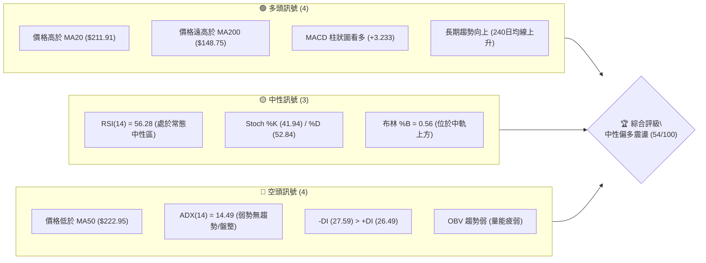

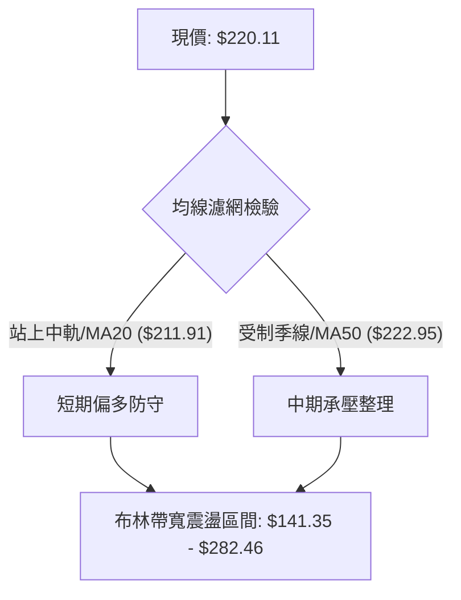

### 📊 核心指標速覽表

| 指標類別 | 指標名稱 | 當前數值 | 訊號 | 解讀 |
|----------|----------|----------|:----:|------|
| **價格** | 當前價格 | $220.11 | 🟡 | 位於52週區間 66.5% 位置，脫離高點回落整理 |
| **均線** | MA20 (布林中軌) | $211.91 | 🟢 | 現價高於 MA20（+3.87%），短線具備下檔支撐 |
| **均線** | MA50 | $222.95 | 🔴 | 現價低於 MA50（-1.27%），季線構成直接上方反壓 |
| **均線** | MA200 | $148.75 | 🟢 | 現價大幅高於 MA200（+47.97%），長線多頭架構未變 |
| **動能** | RSI(14) | 56.28 | 🟡 | 處於 30-70 常態中性區，無超買超賣，多空拉鋸 |
| **動能** | MACD (12,26,9) | 8.843 (柱 +3.233) | 🟢 | MACD 線高於訊號線 (5.609)，柱狀圖為正，偏多修復 |
| **動能** | DMI (ADX / DI) | ADX 14.49, -DI>+DI | 🔴 | ADX < 25 處於典型盤整市，-DI 微幅領先，方向不明 |
| **波動** | ATR(14) | $25.62 (11.64%) | 🔴 | 波動度極高，單日波幅劇烈，需寬幅止損管理 |
| **量能** | OBV 與 20日均量 | 28.42M (量比 0.97x) | 🔴 | OBV < MA，成交量未達50日均量水準，量能相對疲弱 |

### 🏆 技術評分卡

```
╔══════════════════════════════════════════════════════════════╗
║              技術評分卡 — NBIS (2026-08-21)                  ║
╠══════════════════════════════════════════════════════════════╣
║ 趨勢強度 (ADX=14.49)      ████░░░░░░░░░░░░░░░░  25/100  🔴   ║
║ 動能指標 (RSI/MACD)       ████████████░░░░░░░░  60/100  🟢   ║
║ 支撐穩定度 (S1/MA20)      ██████████████░░░░░░  70/100  🟢   ║
║ 成交量配合 (OBV疲弱)      ████████░░░░░░░░░░░░  40/100  🔴   ║
║ 形態完整度 (箱型收斂)     ████████████░░░░░░░░  60/100  🟡   ║
║ 均線排列 (多空糾結)       ████████████░░░░░░░░  60/100  🟡   ║
╠══════════════════════════════════════════════════════════════╣
║ 綜合評分                  ███████████░░░░░░░░░  54/100  🟡   ║
║ 評級結論：中性震盪 (Neutral Consolidation) / 區間突破前偏觀望 ║
╚══════════════════════════════════════════════════════════════╝
```

---

## 2. 趨勢分析

### 🌐 多時框趨勢分析

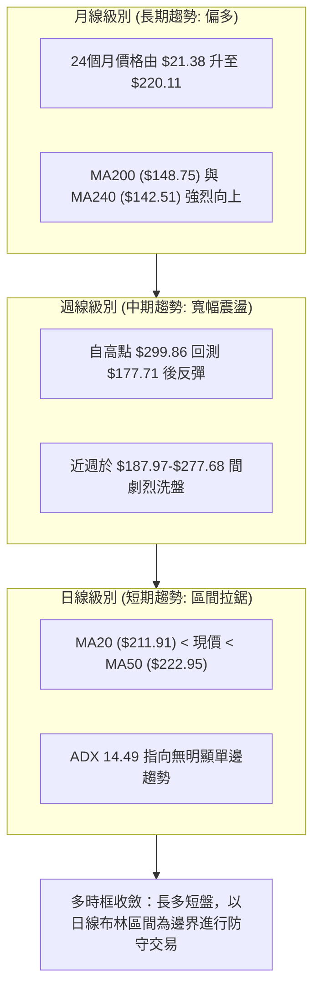

### 📈 長期趨勢 — 12個月走勢圖（Unicode）

```
NBIS 月線走勢圖（過去12個月：2025-09 至 2026-08）
價格軸 ($)
$300 ┤                                           
$275 ┤                                     ●(06月 276.17)
$250 ┤                                   
$225 ┤                                 ●(05月 231.09)     ●(現價 220.11)
$200 ┤                                               ●(07月 190.41)
$175 ┤                                           
$150 ┤                             ●(04月 138.23)
$125 ┤       ●(10月 130.82)                      
$100 ┤ ●(09月 112.27) ●(11月 94.87)   ●(03月 103.76)
$75  ┤            ●(12月 83.71) ●(02月 91.19)
$50  ┤               ●(01月 85.19)
     └─────────────────────────────────────────────────────────────
       09  10  11  12  01  02  03  04  05  06  07  08  (月份)
```

#### 走勢特徵分析表格

| 階段區間 | 時間跨度 | 起訖價位 | 漲跌幅 | 形態特徵與量能意涵 |
|----------|----------|----------|:------:|--------------------|
| **主升一浪** | 2025-09 ~ 2025-10 | $68.32 → $130.82 | +91.48% | 初次突破百元關卡，隨後遭遇高檔獲利了結賣壓 |
| **中繼洗盤** | 2025-11 ~ 2026-02 | $130.82 → $83.71 → $91.19 | -36.01% | 於 $83-$95 區間構築長達 4 個月的扎實底部結構 |
| **主升三浪** | 2026-03 ~ 2026-06 | $91.19 → $276.17 | +202.85% | 爆發性單邊主升段，突破 $200 創歷史新高 $299.86 |
| **寬幅回洗** | 2026-07 ~ 2026-08 | $276.17 → $190.41 → $220.11 | -20.30% | 劇烈震盪回測 38.2% 斐波那契位，進入籌碼重組期 |

### 📊 中期趨勢（週線分析）

```
NBIS 週線波段波動區間示意圖
══════════════════════════════════════════════════════════════
 52W 高點 ─────── $299.86 ─── 上方極限阻力 (0.0% Fib)
                   │
 波段阻力 R2 ──── $278.84 ─── 08-16 週高點聚類 (週收盤 $277.68)
                   │
 斐波阻力 ─────── $243.73 ─── 23.6% 回調位
                   │
 短線阻力 R1 ──── $231.17 ─── 05-31 週收盤 / 短期反彈頸線
 ────────────────────────────────────────────────────────────
 當前價格 ─────── $220.11 ─── 位於 MA20 與 MA50 夾層震盪
 ────────────────────────────────────────────────────────────
 斐波支撐 ─────── $209.00 ─── 38.2% 回調位 / 布林中軌 ($211.91)
                   │
 關鍵支撐 S1 ──── $200.30 ─── 整數關卡 / 07月拉回低點聚類
                   │
 斐波支撐 ─────── $180.93 ─── 50.0% 回調位 (07-19 週低 $177.71)
                   │
 強支撐 S2 ────── $164.31 ─── 前波起漲平台聚類
══════════════════════════════════════════════════════════════
```

### ⚡ 趨勢強度評估（ADX 解讀）

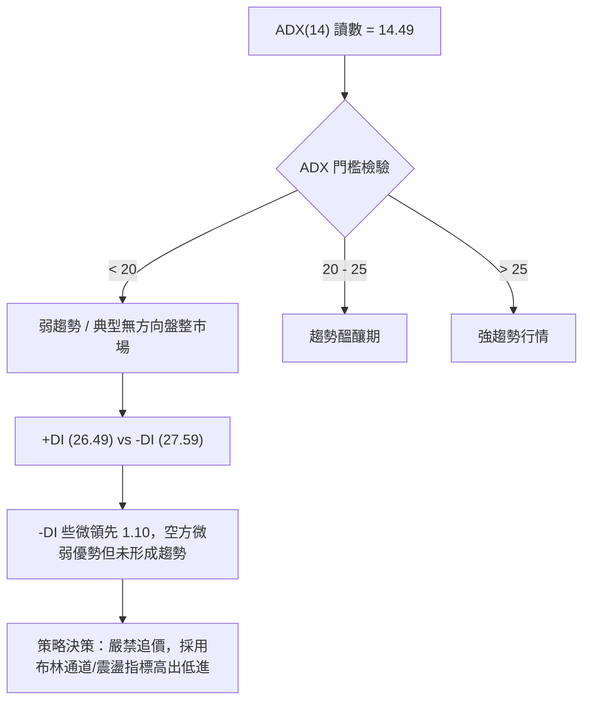

| 指標名稱 | 當前讀數 | 基準閥值 | 趨勢狀態判定 | 操作指導原則 |
|----------|:--------:|:--------:|:------------:|--------------|
| **ADX(14)** | **14.49** | 25.00 | 🟡 無趨勢 (盤整) | 避免順勢突破交易，改以支撐阻力邊界交易 |
| **+DI (14)** | **26.49** | - | 多方動能衰退 | 多方尚未掌握主控權 |
| **-DI (14)** | **27.59** | - | 空方動能平緩 | 空方雖微幅領先，但缺乏實質下殺趨勢推力 |

---

## 3. 圖表形態分析

### 🔍 形態識別系統

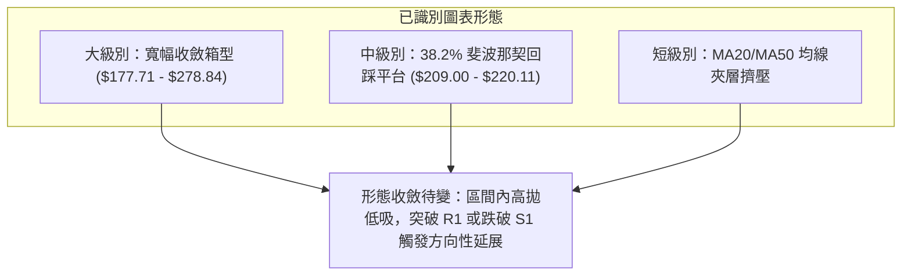

#### 形態識別與信心度評估表

| 形態名稱 | 信心度 | 判斷依據（引用數據） | 完成度 | 目標價（附計算式） |
|----------|:------:|----------------------|:------:|--------------------|
| **寬幅箱型震盪** | **75%** | 底部 S1 $200.30 與回調位 $180.93 多次獲支撐；頂部受制 R2 $278.84 | 70% | 區間震盪上限為 $278.84，下限為 $200.30 |
| **雙重底反彈雛形** | **55%** | 07-19 週低點 $177.71 與 08-09 低點 $187.97 形成潛在次低點抬高 | 60% | 頸線 R1 $231.17 + (形態高 $231.17 - 低 $177.71) = **$284.63**（逼近阻力 R2 $278.84） |
| **頭肩頂形態** | **25%** | 數據中未偵測到完整右肩結構，左肩與頭部高點不對稱 | 15% | 訊號不足，不予預測，僅做指標型解讀 |

### 🕯️ 重要K線形態分析

| 週/月份 | 收盤價 | K線形態特徵 | 市場心理與技術解讀 | 訊號方向 |
|---------|:------:|-------------|--------------------|:--------:|
| **2026-06-21 週** | $286.69 | 長上影大陽線 (衝高 $299.86) | 多頭極致加速後遭遇天量獲利了結，確立歷史天花板阻力 | 🔴 頂部轉折 |
| **2026-07-19 週** | $177.71 | 長下影錘頭線 (成交量 100.9M) | 恐慌盤殺出後迅速獲得逢低買盤支撐，確立中期低點 | 🟢 底部支撐 |
| **2026-08-16 週** | $277.68 | 爆量長陽巨棒 (成交量 167.5M) | 空頭回補與強烈軋空，直接挑戰前高區間阻力 R2 ($278.84) | 🟢 強烈看多 |
| **2026-08-23 週** | $220.11 | 實體回調大陰線 (成交量 121.4M) | 衝高未果引發獲利盤拋售，回踩布林中軌 MA20 ($211.91) 尋求支撐 | 🟡 中性整固 |

### 📉 ASCII 走勢形態示意圖

```
NBIS 近期週K線波段結構示意圖
$300 ┤                   ┌─● 52W High ($299.86)
$280 ┤                  ┌┴┐         ┌─● 08-16 反彈頂 ($277.68 / R2)
$260 ┤                  │ │         │
$240 ┤        ┌─┐       │ │        ┌┴┐
$220 ┤────────│ │───────│ │────────│ │───● 當前收盤 ($220.11) ──────────
$200 ┤        │ │       │ │        │ │    [MA20 $211.91 / Fib 38.2% $209.00]
$180 ┤        └─┘       └┬┘        └┬┘
$160 ┤                   └─● 07-19 底 ($177.71 / S2區間)
     └──────────────────────────────────────────────────────────
      2026-05           2026-06    2026-07    2026-08
```

### 🎯 形態目標價計算

依據確立度最高之**寬幅箱型與次級波段反彈**推算：
1. **箱型向上測幅目標**：
   - 形態底部支撐基準：S1 = **$200.30**
   - 形態頸線阻力基準：R1 = **$231.17**
   - 形態垂直高度 $H = \$231.17 - \$200.30 = \$30.87$
   - 突破 R1 後之等距映射目標：$T_1 = \$231.17 + \$30.87 =$ **$262.04**（落於 R1 與 R2 之間）
2. **箱型向下破位風險測幅**：
   - 若有效跌破 S1 ($200.30)，等距下行目標：$T_{down} = \$200.30 - \$30.87 =$ **$169.43**（逼近支撐 S2 $164.31）

---

## 4. 支撐與阻力

### 🗺️ 關鍵價位分布圖（Unicode）

```
╔══════════════════════════════════════════════════════════════════════╗
║                   NBIS 價位結構與斐波那契分布圖                      ║
╠══════════════════════════════════════════════════════════════════════╣
║ $299.86 ║████████████████████████║ 強阻力 R3 / 52W High (0.0% Fib)  ║
║ $278.84 ║████████████████████    ║ 阻力 R2 / 近期反彈頂部聚類        ║
║ $243.73 ║▒▒▒▒▒▒▒▒▒▒▒▒▒▒▒▒▒▒▒▒▒▒▒▒║ 斐波那契 23.6% 回調位             ║
║ $231.17 ║████████████████        ║ 短線阻力 R1 / MA10 ($231.85)     ║
║ $222.95 ║┄┄┄┄┄┄┄┄┄┄┄┄┄┄┄┄┄┄┄┄┄┄║ 均線反壓 MA50                     ║
║ $220.11 ╠════════════════════════╣ ◄ 現價 (Current Price)           ║
║ $211.91 ║┄┄┄┄┄┄┄┄┄┄┄┄┄┄┄┄┄┄┄┄┄┄║ 均線支撐 MA20 / 布林中軌          ║
║ $209.00 ║▒▒▒▒▒▒▒▒▒▒▒▒▒▒▒▒▒▒▒▒▒▒▒▒║ 斐波那契 38.2% 回調位             ║
║ $200.30 ║▓▓▓▓▓▓▓▓▓▓▓▓▓▓▓▓▓▓▓▓    ║ 關鍵支撐 S1 / 整數心理防線        ║
║ $180.93 ║▒▒▒▒▒▒▒▒▒▒▒▒▒▒▒▒▒▒▒▒▒▒▒▒║ 斐波那契 50.0% 中樞回調位         ║
║ $164.31 ║████████████████████    ║ 強支撐 S2 / 前波突破平台聚類     ║
║ $148.75 ║┄┄┄┄┄┄┄┄┄┄┄┄┄┄┄┄┄┄┄┄┄┄║ 長期生命線 MA200 (下方防線)       ║
║ $145.80 ║████████████████████████║ 強支撐 S3 / 長線多頭防守底線     ║
╚══════════════════════════════════════════════════════════════════════╝
```

### 🚧 阻力位分析表

| 阻力級別 | 價位 | 形成原因 | 突破難度 | 重要性 |
|:--------:|:----:|----------|:--------:|:------:|
| **R1** | **$231.17** | 05-31 週收盤價位聚類，與當前 MA10 ($231.85) 重疊，短線空頭防守第一線 | 中等 | 🟡 關鍵轉強點 |
| **R2** | **$278.84** | 08-16 週巨量上攻受阻高點，近一年次高波段高點聚類 | 極高 | 🔴 中期波段大頂 |
| **R3** | **$299.86** | 52週歷史最高價 (0.0% Fibonacci 回調位)，極致天花板 | 極高 | 🔴 長期絕對壓力 |

### 🛡️ 支撐位分析表

| 支撐級別 | 價位 | 形成原因 | 守住機率 | 重要性 |
|:--------:|:----:|----------|:--------:|:------:|
| **S1** | **$200.30** | 近一年波段低點聚類，緊鄰 38.2% Fib ($209.00) 與整數大關 | 65% | 🟢 短線多頭防線 |
| **S2** | **$164.31** | 2026年4-5月起漲平台聚集區，靠近 50.0% Fib ($180.93) 延伸防區 | 80% | 🟢 中期生命防線 |
| **S3** | **$145.80** | 長期波段低點聚類，與 MA200 ($148.75) 及 MA240 ($142.51) 構成三重共振 | 90% | 🟢 長期牛熊分界 |

### 📐 斐波那契回調位分析

依據 52 週波段低點 **$62.01** 至 歷史高點 **$299.86** 計算：

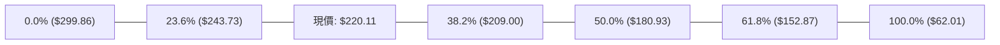

- **位置解讀**：現價 **$220.11** 處於 **23.6% ($243.73)** 與 **38.2% ($209.00)** 之間。
- **技術意涵**：
  1. 回調未跌破 38.2% ($209.00)，顯示強勢上漲結構未遭實質破壞，多頭維持強勢拉回整固特徵。
  2. 若下破 $209.00，將觸發向 50.0% ($180.93) 尋求支撐之修正行情；若向上越過 $243.73，將重啟向 $278.84 之攻勢。

---

## 5. 技術指標深度解讀

### 🎛️ 指標訊號總覽

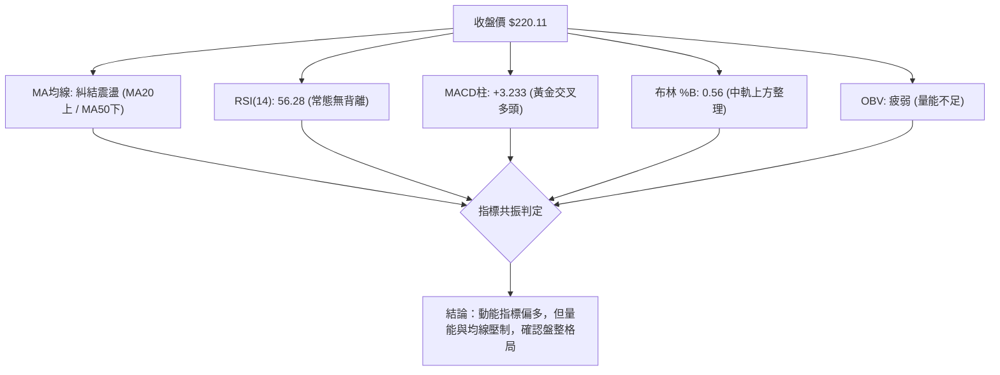

### 📈 移動平均線排列分析

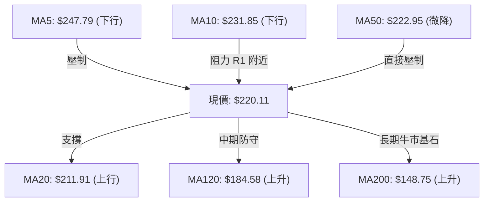

- **均線系統特徵**：
  - 短期均線（MA5、MA10）自高檔快速回落，形成短線空頭排列，限制短多動能。
  - 中期季線 MA50 ($222.95) 與 MA60 ($225.26) 在現價上方形成厚重均線夾層。
  - 下方 MA20 ($211.91) 向上揚升，提供短線下檔承接；MA120 ($184.58)、MA200 ($148.75) 呈健康多頭發散排列，維繫長多格局。

### 📉 RSI(14) 分析

- **當前讀數**：`56.28` 🟡
- **指標進度條**：
  ```
  超賣區 (0-30)        常態中性區 (30-70)        超買區 (70-100)
  [░░░░░░░░░░] [█████████████░░░░░░] [░░░░░░░░░░]
                 ▲ 現值: 56.28
  ```
- **背離判斷**：
  - 現價自高點 $277.68 回落至 $220.11，RSI 同步自 67.2 回落至 56.3。
  - 日線與週線級別皆**無明顯頂背離或底背離**現象，指標與價格變動一致，顯示為正常的獲利回吐行情。

### 📊 MACD(12/26/9) 訊號解讀

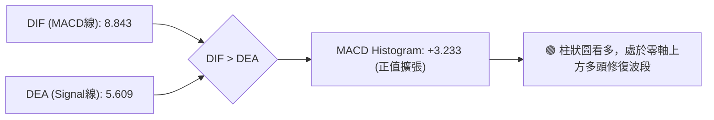

- **深度解析**：MACD 數值為 8.843，高於訊號線 5.609，柱狀圖達到 +3.233。雖然價格自前週高點回吐，但 MACD 仍維持多頭叉特徵，暗示多方能量尚未完全潰散，短線具備止跌築底動能。

### 📦 布林通道分析

```
NBIS 布林通道 (20日, 2倍標準差) 結構示意圖
$282.46 ┬──────────────────────────────────── 布林上軌 (Upper Band)
        │
        │
$220.11 ┼─── 現價 ($220.11, %B = 0.56)
$211.91 ┼──────────────────────────────────── 布林中軌 (MA20)
        │
        │
$141.35 ┴──────────────────────────────────── 布林下軌 (Lower Band)
```

- **通道寬度**：上軌 $282.46 至下軌 $141.35，帶寬極為寬廣（ATR 高達 $25.62 所致）。
- **位置解讀**：現價落於中軌上方，%B 為 0.56，表明市場並未處於極端超買或超賣位置，呈現沿著布林中軌進行的中樞整固行情。

### 💹 成交量分析（量價配合度）

- **量能指標數據**：
  - 最新成交量：28,422,524 股
  - 20日均量：29,157,736 股（量比 0.97x）
  - 50日均量：22,651,110 股
- **量價背離與 OBV 診斷**：
  - 目前 **OBV 趨勢低於其移動平均線**（OBV < MA），代表資金進場力道減弱，呈現量能疲弱狀態。
  - 上週量能放大至 167.5M 衝高後，本週縮量回調至 121.4M，顯示籌碼並未全面奪路而逃，但多頭追價意願顯著降溫，量價呈現「量縮回調」特徵。

---

## 6. 動能與波動率

### ⚡ 動能評估

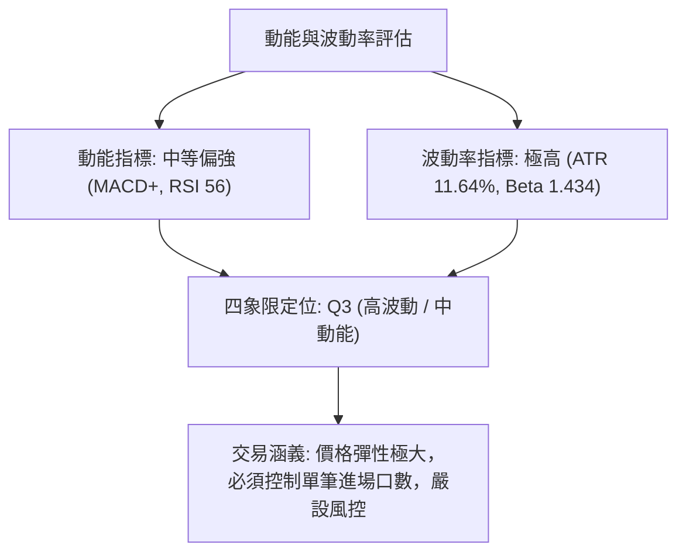

| 象限分類 | 動能特徵 | 波動特徵 | NBIS 所屬狀態 | 操作策略指導 |
|:--------:|:--------:|:--------:|:-------------:|--------------|
| **Q1** | 強 | 低 | - | 穩定順勢加碼 |
| **Q2** | 弱 | 低 | - | 觀望休整 |
| **Q3** | **中/強** | **高** | **✓ (當前所屬)** | **區間高拋低吸，嚴格控制部位大小** |
| **Q4** | 弱 | 高 | - | 嚴禁持倉，防範踩踏 |

### 📊 ATR 波動率分析

- **ATR(14) 數值**：**$25.62**（佔當前股價之 **11.64%**）
- **波動特性**：NBIS 每日平均波動幅度超過 $25 元，屬於超高波動性標的。
- **止損與防守距離設定指引**：
  - **短線交易止損距離**：建議設定 1.0 倍 ATR = **$25.62**
  - **波段交易止損距離**：建議設定 1.5 倍 ATR = **$38.43**
  - **倉位計算警示**：因單日 ATR 佔比達 11.64%，部位規模應壓縮至常規持倉的 50% 以下，防止隔夜跳空觸發非預期爆倉。

### 📐 Beta 與市場相關性

- **Beta 係數**：**1.434**
- **市場特徵**：NBIS 具備顯著的高 Beta 特性，對美股大盤（S&P 500 / Nasdaq）波動極為敏感。當科技類股走強時其具備強烈超額報酬爆發力；同理，在大盤回檔時將面臨 1.43 倍以上的放大修正幅度。

---

## 7. 多時框架總結

### 📋 時框架評分表

| 時框架 | 趨勢方向 | 動能狀態 | 均線排列 | 形態結構 | 綜合評分 | 操作建議 |
|--------|:--------:|:--------:|:--------:|:--------:|:--------:|----------|
| **月線級別** | 🟢 強烈多頭 | 強勁 | 完美多頭發散 | 主升浪延伸 | **85/100** | 長線多單底倉續抱 |
| **週線級別** | 🟡 寬幅震盪 | 中性修復 | 均線發散轉收斂 | 寬幅收斂箱型 | **58/100** | 逢回調支撐分批承接 |
| **日線級別** | 🔴 弱勢盤整 | 偏多但量弱 | MA20/MA50 夾層 | 箱型中樞震盪 | **48/100** | 區間操作，嚴禁追高 |

### 🔲 綜合訊號矩陣

```
╔══════════════════════════════════════════════════════════════╗
║                   多時框架訊號矩陣收斂                       ║
╠══════════════════════════════════════════════════════════════╣
║ 維度         短期 (日線)       中期 (週線)       長期 (月線) ║
║ 趨勢方向     🔴 盤整下壓       🟡 區間震盪       🟢 明確多頭 ║
║ 動能指標     🟢 MACD看多       🟡 RSI中性        🟢 主升動能 ║
║ 均線結構     🟡 糾結中軌       🟢 長均線上揚     🟢 完美排列 ║
║ 量價關係     🔴 OBV疲弱        🟡 巨量後縮量     🟢 換手充分 ║
╠══════════════════════════════════════════════════════════════╣
║ 綜合判定：多時框衝突收斂 ── ADX=14.49 指向中短期盤整市      ║
╚══════════════════════════════════════════════════════════════╝
```

### ⚖️ 多時框收斂結論

> **依多時框收斂規則（規則 14）嚴格判定**：
> 1. 當前 **ADX(14) = 14.49 (< 25)**，技術面確立為**標準盤整行情**，趨勢跟隨策略失效。
> 2. **主導框架**：日線布林通道中軌 MA20 ($211.91) 與 阻力位 R1 ($231.17) 為核心交易區間。
> 3. **唯一方向性結論**：**中性偏多觀望，區間低吸為主（評分 54/100）**。在跌破關鍵支撐 S1 ($200.30) 前，中長多架構依然保護下檔，交易主軸為「守住 S1 逢低買進，遇 R1/R2 分批止盈」。

---

## 8. 交易策略建議

### 🗺️ 策略決策流程圖

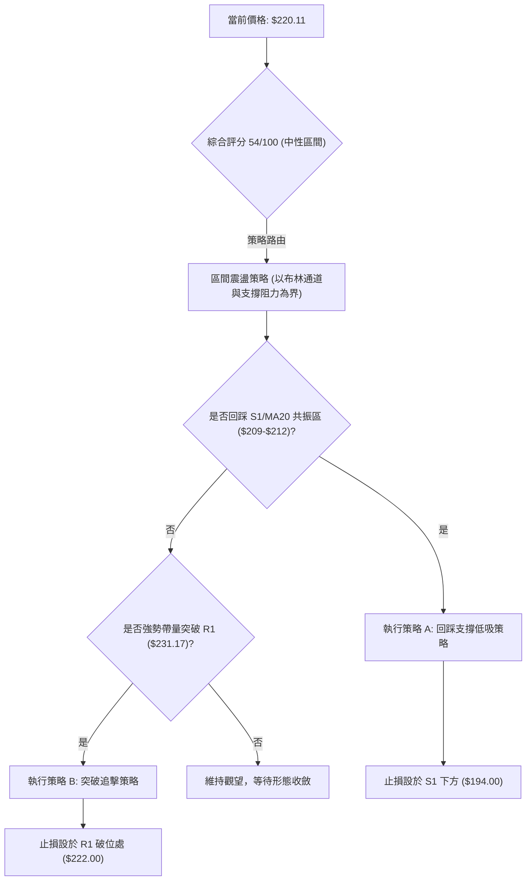

### 🧭 策略路由

**當前主策略方向 = 區間偏多操作 / 震盪低吸（依技術評分卡 54/100，處於中性偏多區間，以日線布林上下軌與關鍵價位操作）**

---

### 🎯 價格情境階梯（Price Scenarios）

| 觸發條件 | 第一目標 (T1) | 後續延伸 (T2) | 情境含義與技術解讀 |
|----------|:-------------:|:-------------:|--------------------|
| **突破 R1 $231.17** | **R2 $278.84** | **R3 $299.86** | 站上 MA50 與頸線，短線重回多頭主升攻擊波 |
| **守穩 MA20 $211.91** | **R1 $231.17** | **$243.73 (23.6% Fib)** | 於 38.2% 回調位上方維持健康中樞震盪 |
| **跌破 S1 $200.30** | **$180.93 (50% Fib)** | **S2 $164.31** | 箱型破位，短線轉弱，回測前波大底起漲區 |

---

### 📊 情境機率分佈

```
情境機率分佈圓形示意
████████████████████  50% 區間中樞震盪 (ADX=14.49, 布林中軌整固)
████████████          30% 向上反彈突破 (MACD紅柱, 長期均線保護)
████████              20% 向下破位回踩 (OBV疲弱, -DI 微幅領先)
```

| 情境方向 | 機率 | 主要技術指標依據 |
|----------|:----:|------------------|
| **區間震盪整理** | **50%** | ADX(14) 僅 14.49 確立無單邊趨勢；布林帶寬寬廣，現價於中軌附近糾結 |
| **向上反彈突破** | **30%** | MACD 柱狀圖為正 (+3.233)；價格位於 MA200 牛市線上，長多趨勢未變 |
| **跌破下行探底** | **20%** | 成交量能未能放大 (量比 0.97x)；-DI (27.59) 略高於 +DI (26.49) |

---

### 🟢 主策略詳情

依據評分路由，提供兩套具體執行策略：

| 策略要素 | 策略 A：回踩支撐低吸（首選） | 策略 B：右側突破加碼（次選） |
|----------|------------------------------|------------------------------|
| **策略邏輯** | 回踩 38.2% Fib / MA20 共振區吸籌 | 帶量站穩 R1 / 季線 MA50 確認轉強 |
| **進場條件** | 回測 $210.00 - $212.00 止跌出陽線 | 日線收盤價實質突破 $231.17 |
| **進場價格** | **$211.00** | **$232.00** |
| **目標價 T1** | **$243.73** (23.6% 斐波位) | **$278.84** (阻力 R2) |
| **目標價 T2** | **$278.84** (阻力位 R2) | **$299.86** (歷史高點 R3) |
| **止損價格** | **$194.00** (跌破 S1 $200.30 約 1.5x ATR 緩衝) | **$222.00** (跌回 MA50 之下假突破) |
| **風險報酬比** | **1 : 3.99** (以 T2 計，風險 $17，報酬 $67.84) | **1 : 4.68** (以 T2 計，風險 $10，報酬 $46.86) |
| **預估勝率** | **60%** | **50%** |
| **建議倉位** | **8% - 10%** (總資金佔比) | **5% - 8%** (突破追單部位) |

---

### 🔴 反向風險觸發點（對沖與風控提示）

- **多頭結構破壞點**：若日線收盤價跌破 **S1 ($200.30)** 且 38.2% Fib ($209.00) 失守，代表箱型震盪向下破位，所有短多部位應立即停損離場。
- **對沖啟動信號**：若價格擊穿 **$200.30**，建議買入等值 Put 選擇權或減倉 50%，下檔第一回補目標鎖定 **50.0% Fib ($180.93)** 至 **S2 ($164.31)**。

---

### ⭐ 整體訊號強度評星

```
做多訊號強度：★★★☆☆  (3.0/5星) ── 依託長多趨勢與MACD正柱，但受制於季線
做空訊號強度：★★☆☆☆  (2.0/5星) ── 僅具短線回檔力道，下方長均線支撐強勁
整體可信度：  ★★★★☆  (4.0/5星) ── 關鍵支撐阻力清晰，斐波那契共振明確
```

---

## 9. 風險提示與監控

### ✅ 關鍵監控指標 Checklist

```
╔══════════════════════════════════════════════════════════════╗
║              NBIS 交易日常風險監控 Checklist                 ║
╠══════════════════════════════════════════════════════════════╣
║ [ ] 價格是否跌破布林中軌 MA20 ($211.91)？                    ║
║ [ ] 日線成交量是否連續 3 日低於 20M（量能枯竭風險）？        ║
║ [ ] RSI(14) 是否跌破 50 中軸轉入弱勢區？                     ║
║ [ ] ADX 是否自 14.49 向上飆升突破 25（代表單邊行情啟動）？   ║
║ [ ] 價格能否放量攻克 MA50 ($222.95) 與 R1 ($231.17)？        ║
║ [ ] 52週高點 $299.86 回調幅度是否擴大至 50% ($180.93)？      ║
╚══════════════════════════════════════════════════════════════╝
```

### ⚠️ 風險場景分析

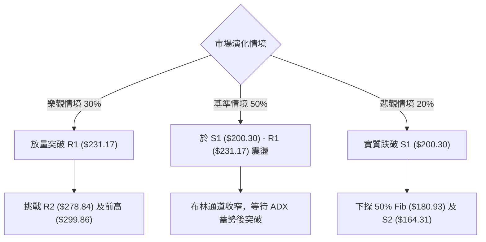

### 🛡️ 風險管理重要提醒

1. **極端波動管理**：NBIS 之 ATR(14) 高達 **$25.62**（佔股價 11.64%），這意味著常態單日波動極其劇烈。進場必須依據 ATR 預留足夠止損空間，切忌滿倉操作。
2. **高放空比例軋空風險**：該股放空比例（Short % Float）高達 **27.6%**，Short Ratio 為 2.78。一旦價格突破 R1 ($231.17)，可能誘發猛烈的軋空行情（Short Squeeze），空頭嚴禁在此逆勢摸頂。
3. **重大基本面/業績事件**：Nebius 處於高速擴張之 AI 基礎設施領域，YoY 營收成長 454%，但前瞻 EPS 為負。成長股對利率預期及資本支出極度敏感，應持續監控機構持股（現為 69.1%）之流向變化。

---

## 📋 報告總結

```
╔══════════════════════════════════════════════════════════════════╗
║                   NBIS 技術分析報告總結                         ║
╠══════════════════════════════════════════════════════════════════╣
║ 報告日期：2026-08-21                                            ║
║ 當前價格：$220.11                                               ║
║ 分析評級：⚖️ 中性偏多震盪 (Neutral-Bullish Consolidation)        ║
║                                                                  ║
║ 關鍵結論：                                                       ║
║ ├─ 長期趨勢：🟢 強烈看多 (遠高於 MA200 $148.75，長多架構穩固)   ║
║ ├─ 中期趨勢：🟡 寬幅箱型震盪 (受阻於 $278.84，守於 $177.71)     ║
║ ├─ 短期趨勢：🟡 夾層整理 (MA20 $211.91 支撐 vs MA50 $222.95 壓力)║
║ ├─ 關鍵支撐：S1 $200.30 / 38.2% Fib $209.00 / MA20 $211.91      ║
║ ├─ 關鍵阻力：R1 $231.17 / R2 $278.84 / 52W High $299.86         ║
║ └─ 分析師共識目標：$271.85 (最高 $410.00 / 最低 $144.00)        ║
║                                                                  ║
║ 最優策略組合：                                                   ║
║ 1. 🥇 最佳機會：策略 A (回踩 $211.00 逢低吸籌，目標 $278.84)    ║
║ 2. 🥈 次選機會：策略 B (突破 $231.17 順勢追多，目標 $299.86)    ║
║ 3. 🥉 防守風控：跌破 $200.30 全面止損離場，規避回測 $164.31 風險║
╚══════════════════════════════════════════════════════════════════╝
```

---

> ⚠️ **免責聲明**：本報告為 AI 自動生成之技術分析，所有數據及估算均基於提供的歷史價格資訊。本報告**僅供研究與學術參考**，**不構成任何投資建議**。投資有風險，入市需謹慎。

---

*報告生成時間：2026-08-21 ｜ 數據來源：Yahoo Finance ｜ 分析框架：多時框技術分析*