# NBIS 技術分析報告

> **報告日期**：2026-08-22 ｜ **語言**：繁體中文 ｜ **數據來源**：Yahoo Finance ｜ **當前價格**：$219.13

---

## 目錄

| 章節 | 內容 |
|------|------|
| [1. 技術面概覽](#1-技術面概覽) | 訊號儀表板、核心指標、評分卡 |
| [2. 趨勢分析](#2-趨勢分析) | 多時框趨勢、長中短期走勢、ADX解讀 |
| [3. 圖表形態分析](#3-圖表形態分析) | 形態識別、K線組合、目標價推算 |
| [4. 支撐與阻力](#4-支撐與阻力) | 關鍵價位、斐波那契回調 |
| [5. 技術指標深度解讀](#5-技術指標深度解讀) | MA/RSI/MACD/布林/成交量 |
| [6. 動能與波動率](#6-動能與波動率) | 動能評估、ATR、Beta |
| [7. 多時框架總結](#7-多時框架總結) | 時框架評分矩陣、多時框收斂 |
| [8. 交易策略建議](#8-交易策略建議) | 策略路由、情境階梯、交易計劃 |
| [9. 風險提示與監控](#9-風險提示與監控) | 監控指標、風險場景、風控紀律 |

---

## 1. 技術面概覽

### 🎯 技術訊號儀表板

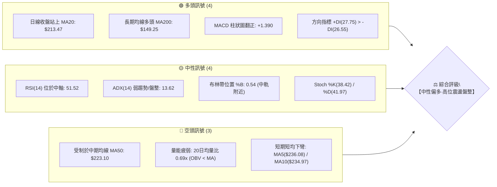

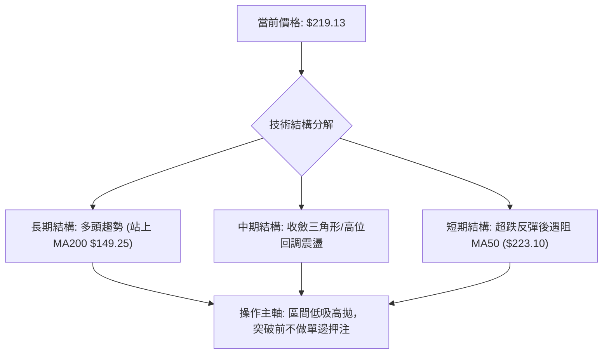

### 📊 核心指標速覽表

| 指標類別 | 指標名稱 | 當前數值 | 訊號 | 解讀 |
|----------|----------|----------|------|------|
| **價格** | 當前價格 | $219.13 | 🟡 | 位於52週區間 65.9%，處於前期衝高回落後的中樞整理區 |
| **均線** | MA20 (短期) | $213.47 | 🟢 | 價格位於 MA20 上方 (+2.65%)，短線具備下檔支撐力道 |
| **均線** | MA50 (中期) | $223.10 | 🔴 | 價格位於 MA50 下方 (-1.78%)，中期反彈面臨動能壓制 |
| **均線** | MA200 (長期) | $149.25 | 🟢 | 價格遠高於 MA200 (+46.82%)，長期多頭結構依舊穩固 |
| **動能** | RSI(14) | 51.52 | 🟡 | 位於中性區間 (30-70)，多空力量處於平衡狀態，無背離 |
| **動能** | MACD (12,26,9) | 7.347 / 5.957 | 🟢 | DIF > DEA 且柱狀圖維持正值 (+1.390)，呈現弱多頭動能 |
| **波動** | ATR(14) | $23.30 | 🔴 | 波動佔股價 10.63%，屬於極高波動標的，需放寬止損區間 |
| **趨勢** | ADX(14) | 13.62 | 🟡 | ADX < 25 表明處於非趨勢的無方向盤整行情 |
| **成交量** | 量比 / OBV | 0.69x / 弱 | 🔴 | 成交量未達均量水準，OBV 低於均線，量價配合欠缺推升力 |

### 🏆 技術評分卡

```
╔══════════════════════════════════════════════════════════════════╗
║                   技術評分卡 — NBIS (2026-08-22)                 ║
╠══════════════════════════════════════════════════════════════════╣
║ 趨勢強度 (ADX=13.62, 盤整)    ████░░░░░░░░░░░░░░░░  25/100 🟡   ║
║ 動能指標 (MACD偏多, RSI中性)  ████████████░░░░░░░░  60/100 🟢   ║
║ 支撐穩定度 (S1=$200.30 守穩)  ██████████████░░░░░░  70/100 🟢   ║
║ 成交量配合 (量比0.69, OBV疲弱)██████░░░░░░░░░░░░░░  30/100 🔴   ║
║ 形態完整度 (大三角收斂整理)   ████████████░░░░░░░░  60/100 🟡   ║
║ 均線排列 (MA200多/MA50壓制)   ██████████░░░░░░░░░░  50/100 🟡   ║
╠══════════════════════════════════════════════════════════════════╣
║ 綜合評分                     ███████████░░░░░░░░░  55/100 🟡   ║
║ 評級結論                     【中性觀望 / 區間突破前偏多操作】  ║
╚══════════════════════════════════════════════════════════════════╝
```

---

## 2. 趨勢分析

### 🌐 多時框趨勢分析

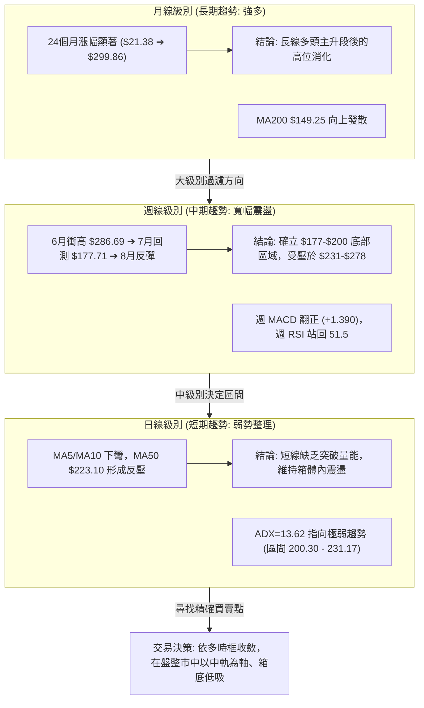

### 📈 長期趨勢 — 12個月走勢圖（Unicode）

```
NBIS 月線走勢圖（2025-09 至 2026-08）
價格軸 ($)
$300 ┤                                      ● (2026-06 $276.17 / 高點$299.86)
$270 ┤                                     / \
$240 ┤                              ●     /   \
$210 ┤                             / \   /     ●←【當前 2026-08 $219.13】
$180 ┤                            /   \ /
$150 ┤                     ●     /     ● (2026-07 $190.41)
$120 ┤ ●            ●     /
$90  ┤  \    ●     /
$60  ┤   \  / \   /
     └────┬──┬──┬──┬──┬──┬──┬──┬──┬──┬──┬──┬────
        09 10 11 12 01 02 03 04 05 06 07 08 (月份)
        2025                             2026
```

**走勢特徵分析表格**：

| 階段 | 時間跨度 | 起訖價格區間 | 區間漲跌幅 | 成交特徵與技術含義 |
|------|----------|--------------|------------|--------------------|
| **第1階段：初升回檔** | 2025-09 ~ 2025-12 | $112.27 ➔ $83.71 | -25.44% | 衝高至 $130.82 後縮量健康洗盤，回踩 52W 低點上方整固 |
| **第2階段：加速爆發** | 2026-01 ~ 2026-06 | $85.19 ➔ $276.17 | +224.18% | 突破百元大關後單邊主升浪，6月創下歷史最高價 $299.86 |
| **第3階段：深度回踩** | 2026-06 ~ 2026-07 | $276.17 ➔ $190.41| -31.05% | 獲利了結盤湧出，最低回測 $177.71（守住 50% 斐波那契位） |
| **第4階段：高位構築** | 2026-07 ~ 2026-08 | $190.41 ➔ $219.13| +15.08% | 於 $180-$200 獲支撐後反彈，現進入以 MA20 為中心的收斂期 |

### 📊 中期趨勢（週線分析）

```
NBIS 週線關鍵結構示意圖
═════════════════════════════════════════════════════════════════
阻力 3 : $299.86  ═════════════════════════════════ (歷史高點 52W High)
阻力 2 : $278.84  ───────────────────────────────── (次高點聚類區)
阻力 1 : $231.17  ┈┈┈┈┈┈┈┈┈┈┈┈┈┈┈┈┈┈┈┈┈┈┈┈┈┈┈┈┈┈┈┈┈ (近期反彈波段頂部)
現  價 : $219.13  ◄────── 當前價格處於 S1 與 R1 夾層整理
支撐 1 : $200.30  ┈┈┈┈┈┈┈┈┈┈┈┈┈┈┈┈┈┈┈┈┈┈┈┈┈┈┈┈┈┈┈┈┈ (近週線底聚類 / 20日均線附近)
支撐 2 : $164.31  ───────────────────────────────── (7月中旬極端洗盤低點聚類)
支撐 3 : $145.80  ═════════════════════════════════ (MA200 與長期上升趨勢線共振)
═════════════════════════════════════════════════════════════════
```

### ⚡ 趨勢強度評估（ADX 解讀）

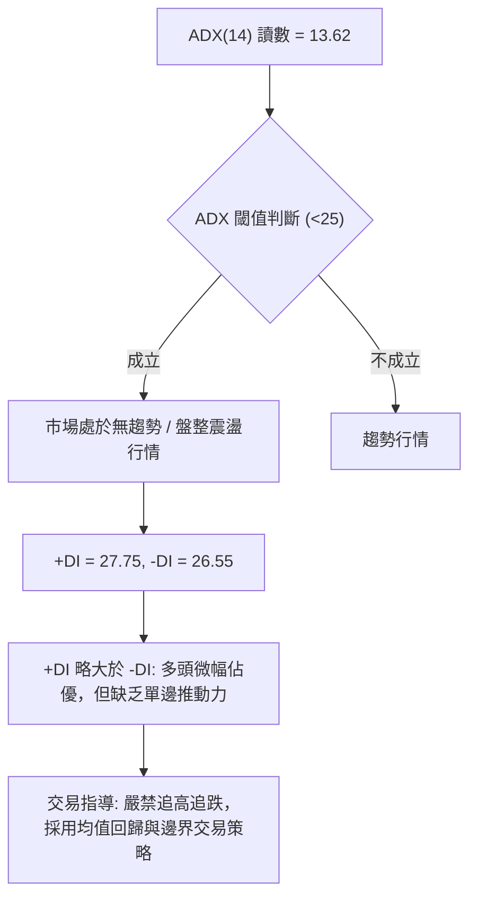

**ADX 趨勢強度對照表**：

| 指標變數 | 數值 | 參考標準 | 當前市場狀態判定 |
|----------|------|----------|------------------|
| **ADX(14)** | **13.62** | 0 - 20 (極弱/無趨勢)<br>20 - 25 (弱趨勢)<br>25 - 50 (強趨勢)<br>> 50 (極強趨勢) | 處於「極弱/無趨勢」階段，表明前期由 $177 反彈至 $277 的劇烈單邊已結束，進入沉澱期。 |
| **+DI (14)** | **27.75** | 多方攻擊動能 | +DI 與 -DI 差距僅 1.20，呈現雙向拉鋸，多方雖略微領先但未能形成破位合力。 |
| **-DI (14)** | **26.55** | 空方打壓動能 | 空方勢力有所衰退，未形成跌破 $200 的壓倒性空頭排列。 |

---

## 3. 圖表形態分析

### 🔍 形態識別系統

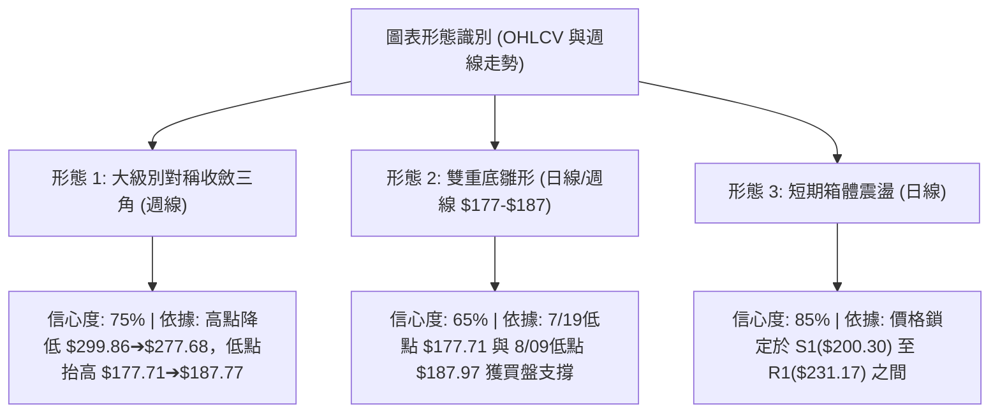

**形態信心度評估表**：

| 形態名稱 | 信心度 | 判斷依據（引用數據） | 完成度 | 目標價（附精確計算式） |
|----------|--------|----------------------|--------|------------------------|
| **對稱收斂三角整理** | 75% | 高點連線由 $299.86 降至 $277.68，低點連線由 $177.71 升至 $187.97，收斂特徵明顯 | 70% | 向上突破測算：突破頸線 R1($231.17) + 三角形底寬($299.86 - $177.71 = $122.15) = **$353.32**（中期潛在目標） |
| **雙重底雛形 (W底)** | 65% | 兩次低點落於 $177.71 (7/19週) 與 $187.97 (8/09週)，隨後週線拉升至 $277.68 確立頸線 | 85% | 頸線位 R1($231.17) 確認站穩後，形態高度 = $231.17 - $177.71 = $53.46；目標 = $231.17 + $53.46 = **$284.63**（貼近 R2 $278.84） |
| **短期箱體橫盤** | 85% | 價格在 S1($200.30) 與 R1($231.17) 區間內反覆穿梭，ADX(13.62) 確認無趨勢 | 90% | 箱體震盪區間：以中軌 $213.47 為軸，向上測頂 R1 **$231.17**，向下測底 S1 **$200.30** |

### 🕯️ 重要K線形態分析

| 週期/時間 | 收盤價 | K線形態特徵 | 技術面解讀 | 訊號 |
|-----------|--------|-------------|------------|------|
| **2026-07-19 週** | $177.71 | 長下影探底陽線 | 測試 $177 斐波那契 50% 水準 ($181.56) 後獲得強力逢低承接 | 🟢 看多 |
| **2026-08-16 週** | $277.68 | 巨量衝高長實體陽線 | 單週成交量放大至 1.67億股，突破前高但留上影線受制於 R2($278.84) | 🟡 中性 |
| **2026-08-23 週** | $219.13 | 縮量長陰回吐 (均值回歸) | 獲利了結盤回吐前週漲幅，成交量降至 1.41億股，回踩 MA20($213.47) 尋求支撐 | 🟡 中性 |
| **日線近期** | $219.13 | 窄幅十字星 / 紡錘線 | 價格徘徊於 MA20 與 MA50 之間，多空力量陷入僵局，靜待突破訊號 | 🟡 觀望 |

### 📉 ASCII 走勢形態示意圖

```
NBIS 週線「收斂三角形與雙底」形態解析
價格 ($)
$300 ┤       高點1 ($299.86)
$280 ┤          \                 高點2 ($277.68)
$260 ┤           \                 / \
$240 ┤            \  頸線 (R1 $231.17)  \
$220 ┤─────────────\───────●─────────────\──── ● 當前 ($219.13)
$200 ┤              \     / \             /
$180 ┤               ●───/   ●───────────/
$160 ┤            底1 ($177.71)  底2 ($187.97)
     └─────────────────────────────────────────────── 時間軸
```

---

## 4. 支撐與阻力

### 🗺️ 關鍵價位分布圖（Unicode）

```
NBIS 價位結構分布圖
══════════════════════════════════════════════════════════════════
$299.86 ║██████████████████████████████║ 強阻力 R3 (52W High / 斐波 0.0%)
$278.84 ║████████████████████          ║ 阻力 R2 (波段高點聚類 / 雙頂阻力)
$244.02 ║▒▒▒▒▒▒▒▒▒▒▒▒▒▒▒▒▒▒▒▒          ║ 斐波那契 23.6% 回調壓力位
$231.17 ║████████████████████████      ║ 關鍵阻力 R1 (近期震盪箱體上沿)
────────╫──────────────────────────────╫─────────────────────────
$219.13 ╠══════════════════════════════╣ ◄ 現價 (位於 38.2% 與 23.6% 之間)
────────╫──────────────────────────────╫─────────────────────────
$209.48 ║▒▒▒▒▒▒▒▒▒▒▒▒▒▒▒▒▒▒▒▒▒▒▒▒      ║ 斐波那契 38.2% 強力支撐位
$200.30 ║▓▓▓▓▓▓▓▓▓▓▓▓▓▓▓▓▓▓▓▓▓▓        ║ 近期支撐 S1 (波段低點聚類 / 核心防線)
$181.56 ║▒▒▒▒▒▒▒▒▒▒▒▒▒▒▒▒▒▒▒▒▒▒▒▒▒▒    ║ 斐波那契 50.0% 多空分水嶺
$164.31 ║██████████████████████████    ║ 強支撐 S2 (波段低點聚類)
$145.80 ║██████████████████████████████║ 終極支撐 S3 (MA200 $149.25 共振區)
══════════════════════════════════════════════════════════════════
```

### 🚧 阻力位分析表

| 阻力級別 | 精確價位 | 形成原因（波段高點聚類） | 突破難度 | 技術重要性 |
|----------|----------|--------------------------|----------|------------|
| **R1** | **$231.17** | 5月高點與近期多次反彈高點聚類區，疊加 MA60 ($225.44) 與 MA50 ($223.10) 反壓 | 🟡 中等 | 短線多空臨界點，有效突破方能開啟往 R2 挑戰之路 |
| **R2** | **$278.84** | 2026年6月及8月中旬（$277.68）兩次衝頂未果聚類區，解套賣壓密集 | 🔴 極高 | 中期強阻力，多頭需巨量配合才可能突破此雙頂結構 |
| **R3** | **$299.86** | 52週歷史最高價，斐波那契 0.0% 絕對天花板 | 🔴 極高 | 歷史極限阻力，多頭終極目標價位 |

### 🛡️ 支撐位分析表

| 支撐級別 | 精確價位 | 形成原因（波段低點聚類） | 守住機率 | 技術重要性 |
|----------|----------|--------------------------|----------|------------|
| **S1** | **$200.30** | 近期回踩低點聚類區，上方緊扣 MA20 ($213.47) 與斐波 38.2% ($209.48) | 🟢 75% | 短線核心防線，守穩代表維持箱體高位強勢整理 |
| **S2** | **$164.31** | 2026年4月突破平台及7月極端插針低點（$177.71）下方聚類區 | 🟢 85% | 中期生命線，跌破則宣告日線級別多頭結構徹底破壞 |
| **S3** | **$145.80** | 長期牛熊分界點，與上升中之 MA200 ($149.25) 及 MA240 ($143.15) 形成重合支撐 | 🟢 95% | 長期多頭終極底線，具備極強價值投資與技術買盤 |

### 📐 斐波那契回調位分析

依據 52 週波動區間（低點 **$63.26** ➔ 高點 **$299.86**，總極差 **$236.60**）計算：

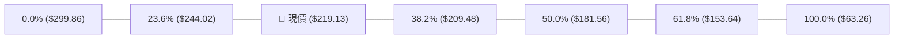

- **當前位置解讀**：現價 **$219.13** 精確運行於 **38.2% 回調位 ($209.48)** 與 **23.6% 回調位 ($244.02)** 之間。
- **回調健康度評估**：自歷史天花板 $299.86 回跌以來，股價多次在 50% 分水嶺（$181.56）獲得支撐拉起，目前站上 38.2% 回調位（$209.48），符合「強勢牛市回調不破黃金分割位」的特徵，表明主力籌碼並未潰散。

---

## 5. 技術指標深度解讀

### 🎛️ 指標訊號總覽

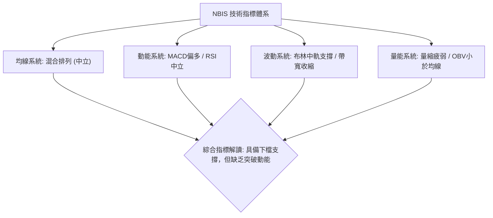

### 📈 移動平均線排列分析

```mermaid
graph TD
    P["現價: $219.13"]
    
    MA5["MA5: $236.08 (下彎)"] -->|"上方阻力"| P
    MA10["MA10: $234.97 (下彎)"] -->|"上方阻力"| P
    MA50["MA50: $223.10 (壓制)|" -->|上方阻力| P
    
    P -->|"下方支撐"| MA20["MA20: $213.47 (上揚)"]
    P -->|"下方支撐"| MA120["MA120: $185.65 (多頭)"]
    P -->|"下方支撐"| MA200["MA200: $149.25 (多頭)"]
    P -->|"下方支撐"| MA240["MA240: $143.15 (多頭)"]
```

- **均線排列狀態**：當前呈現「長週期多頭、短週期受壓」的**混合排列**。
  - 長期趨勢線 MA120 ($185.65)、MA200 ($149.25) 與 MA240 ($143.15) 呈現標準多頭發散排列，奠定長線牛市格局。
  - 短期均線 MA5 ($236.08) 與 MA10 ($234.97) 出現死亡交叉並快速下彎，反映 8 月中旬衝高後的獲利回吐壓力。
  - 價格夾在 **MA20 ($213.47)** 與 **MA50 ($223.10)** 之間，這兩條均線正逐步收斂，預示一週內將面臨短線方向選擇。

### 📉 RSI(14) 分析

```
RSI(14) 當前數值: 51.52
[超賣 0] ────────── [30] ─────── [51.52] ─────── [70] ────────── [超買 100]
進度條:  ██████████░░░░░░░░░░  51.52% (中性平衡區)
```

- **超買超賣判定**：數值 51.52 位於 50 多空分界線附近，遠離超買區 (>70) 與超賣區 (<30)，反映市場情緒冷靜。
- **背離分析**：
  - 在 2026-06 價格創 $299.86 時，週線 RSI 達 65.3；在 2026-08 價格反彈至 $277.68 時，週線 RSI 上升至 67.2，指標與價格並行走高，**無明顯頂背離現象**。
  - 近期回調過程中，RSI 未跌破 30，亦無底背離，指標表現為常規的均值回歸。

### 📊 MACD(12/26/9) 訊號解讀

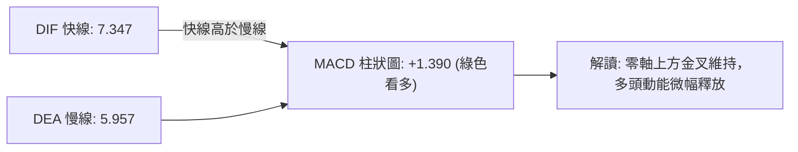

- **MACD 狀態**：DIF (7.347) > DEA (5.957)，兩者均維持在零軸上方運行，且柱狀圖讀數為 **+1.390**。
- **動能評估**：雖然柱狀圖為正，但動能較前週之 +9.868 明顯收斂，表明多頭推升力道放緩，進入弱多頭蓄勢狀態。

### 📦 布林通道分析

```
NBIS 日線布林通道結構 (帶寬 BB Width: 63.6%)
─────────────────────────────────────────────────────────────
上軌 (Upper Band) : $283.16  ═══════════════════════════════
                             
現價 (Current)    : $219.13  ───●── (%B = 0.54，微高於中軌)
中軌 (Middle MA20): $213.47  ┄┄┄┄┄┄┄┄┄┄┄┄┄┄┄┄┄┄┄┄┄┄┄┄┄┄┄
                             
下軌 (Lower Band) : $143.79  ═══════════════════════════════
─────────────────────────────────────────────────────────────
```

- **通道位置 (%B)**：當前 %B 為 **0.54**，價格緊貼中軌 $213.47 運行，處於典型的布林通道中軸盤整狀態。
- **帶寬趨勢**：通道上下軌呈現水平收縮態勢，預示波動率正在被壓縮，短期內價格易在中軌 ($213.47) 至 R1 ($231.17) 間窄幅波動。

### 💹 成交量分析（量價配合度）

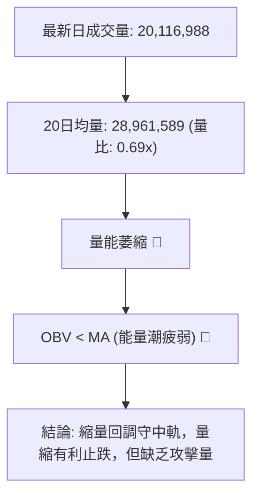

- **量比解讀**：量比僅 0.69x，顯示市場觀望氣氛濃厚，追價意願不足，機構與散戶均在等待明確催化劑。
- **OBV 能量潮**：OBV 低於其移動平均線，反映前期主力資金在高位有部分獲利了結流出，目前尚未見到大規模資金重新搶籌跡象。

---

## 6. 動能與波動率

### ⚡ 動能評估四象限

| 象限 | 動能維度 | 波動維度 | 典型特徵 | 當前狀態判定 |
|------|----------|----------|----------|--------------|
| **第一象限 (Q1)** | 強動能 (MACD/RSI高) | 低波動 (ATR收縮) | 突破初期的黃金進場點 | — |
| **第二象限 (Q2)** | 弱動能 (MACD/RSI中) | 低波動 (ADX<25) | 橫盤整理，適合網格與高拋低吸 | — |
| **第三象限 (Q3)** | 強動能 (爆發拉升) | 高波動 (ATR>10%) | 狂熱主升浪 / 劇烈多空博弈 | — |
| **第四象限 (Q4)** | **弱動能 (ADX=13.62)** | **高波動 (ATR=10.63%)** | **洗盤震盪，假突破多，需防寬幅震盪** | **✓ 【當前所處位置】** |

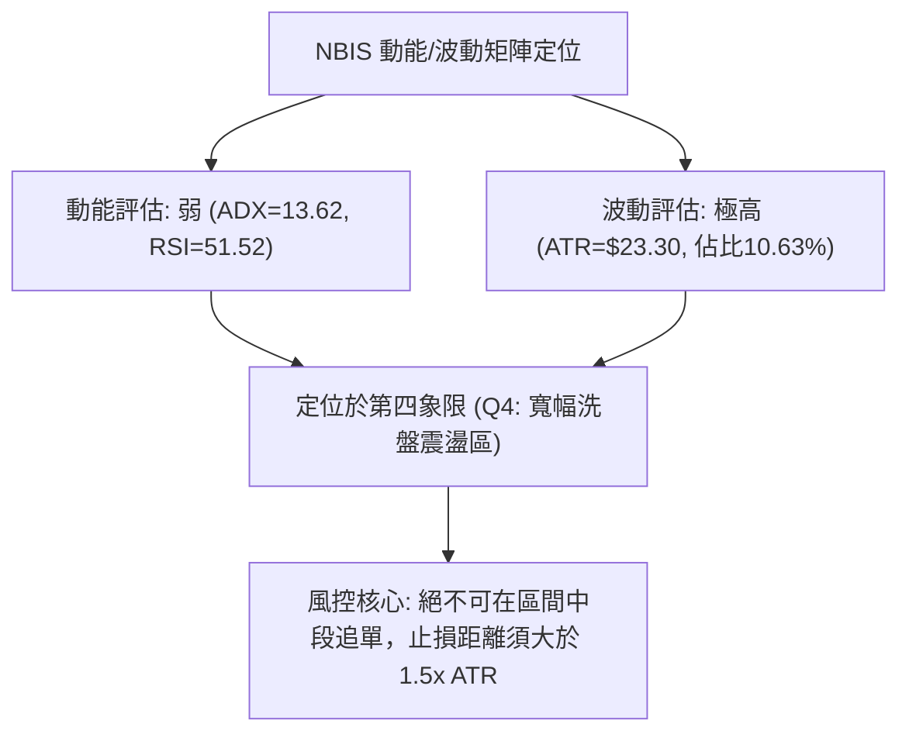

### 📊 ATR 波動率分析

- **ATR(14) 讀數**：**$23.30**（佔股價比例高達 **10.63%**），屬於高 beta、高彈性成長股特性。
- **止損距離設定建議**：
  - **短線交易（1.0x ATR）**：安全止損緩衝空間為 $23.30。
  - **波段交易（1.5x ATR）**：安全止損緩衝空間為 **$34.95**（若以現價 $219.13 計算，波段止損參考底線為 $184.18，略高於 50% 斐波那契位 $181.56）。

### 📐 Beta 與市場相關性

- **Beta 係數**：**1.434**（顯示該股對標普500指數的波動敏感度高出 43.4%）。
- **市場環境影響**：當大盤走強時，NBIS 具備強大的向上彈性；但在大盤回調或市場避險情緒升溫時，其下行波動亦會加劇。

---

## 7. 多時框架總結

### 📋 時框架評分表

| 時框架 | 趨勢方向 | 動能狀態 | 均線排列 | 形態結構 | 綜合評分 | 操作建議 |
|--------|----------|----------|----------|----------|----------|----------|
| **月線 (長期)** | 🟢 多頭主升 | 🟢 強勁向上 | 🟢 完美多頭 (遠高於MA200) | 大圓弧底向上突破 | **85/100** | 長線多單底倉堅決持有 |
| **週線 (中期)** | 🟡 寬幅震盪 | 🟢 柱狀微正 | 🟡 混合整理 (守穩中軌) | 大三角收斂整理中 | **60/100** | 箱底附近分批佈局 |
| **日線 (短期)** | 🔴 弱勢盤整 | 🟡 中性平衡 | 🔴 受壓於短均與MA50 | S1-R1 區間拉鋸 | **45/100** | 區間操作，嚴控倉位 |

### 🔲 綜合訊號矩陣

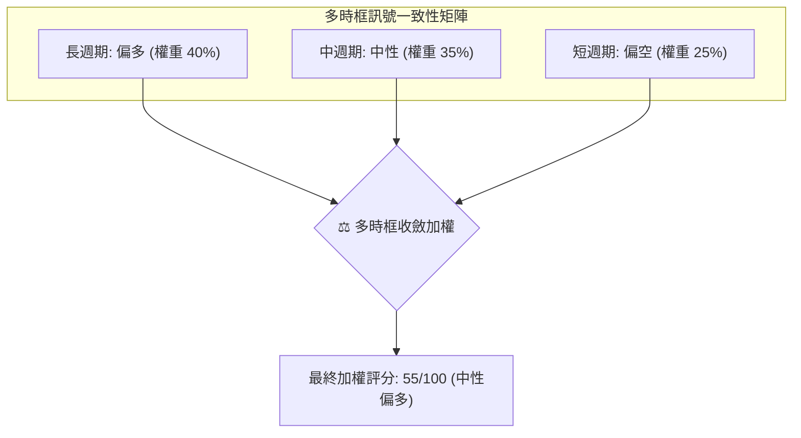

### ⚖️ 多時框收斂結論

依據多時框收斂規則（規則 14）：
1. **行情性質判定**：當前日線 **ADX(14) = 13.62 < 25**，明確判定為**盤整震盪行情**，而非單邊趨勢行情。
2. **時框優先級權衡**：在盤整市中，日線布林通道與短期支撐阻力（$200.30 - $231.17）構成主要交易邊界；同時長期週線與 MA200 ($149.25) 提供穩固的多頭底部保護。
3. **收斂方向性結論**：**【中性偏多觀望 / 區間下沿逢低吸納】**。短線受制於 MA50 反壓，不具備追高動能；但下檔 S1 ($200.30) 與斐波 38.2% ($209.48) 提供強支撐，主策略定調為**區間多頭低吸策略**。

---

## 8. 交易策略建議

### 🗺️ 策略決策流程圖

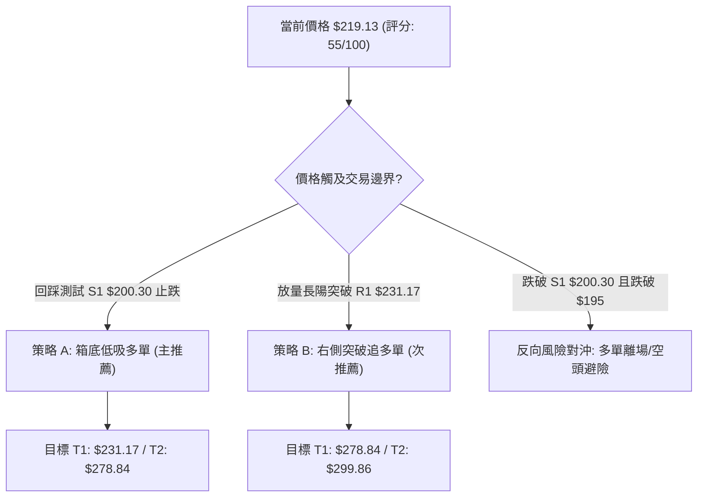

### 🧭 策略路由

**當前主策略方向 = 【中性偏多·區間下沿低吸】（依綜合評分 55/100 定調）**

因評分落於 40–60 區間且 ADX<25，操作核心為「在震盪箱體下軌尋求高盈虧比的多頭買點，拒絕追高，並以布林帶上軌及波段阻力作為目標分批了結」。

### 🎯 價格情境階梯（Price Scenarios）

| 觸發條件 | 第一目標 (T1) | 第二延伸 (T2) | 後續極限 (T3) | 情境含義與技術解讀 |
|----------|---------------|---------------|---------------|--------------------|
| **向上突破 R1 $231.17** | **$244.02** (斐波23.6%) | **$278.84** (阻力R2) | **$299.86** (阻力R3) | 短線震盪出圈，確認重啟主升浪挑戰前高 |
| **維持於現價區間震盪** | **$223.10** (MA50) | **$231.17** (阻力R1) | — | 消化 MA5/MA10 下修賣壓，時間換空間 |
| **向下跌破 S1 $200.30** | **$181.56** (斐波50%) | **$164.31** (支撐S2) | **$145.80** (支撐S3) | 中期震盪結構轉弱，深度回踩 MA200 防線 |

### 📊 情境機率分佈

```
情境機率分佈圖
繼續震盪築底後反彈 (60%) : ████████████████████████████████
維持 $200-$231 區間拉鋸 (25%) : █████████████
跌破 S1 向下深測 S2 (15%) : ████████
```

| 情境類別 | 預估機率 | 主要技術依據 |
|----------|----------|--------------|
| **震盪反彈 (向上)** | **60%** | MACD 柱狀圖維持正值 (+1.390)，長週期 MA200 極為強勢，斐波 38.2% ($209.48) 支撐有效。 |
| **區間橫盤 (中性)** | **25%** | ADX(14) 僅 13.62，布林通道帶寬收窄，量比 0.69x 不足以支撐單邊破位行情。 |
| **破位下行 (向下)** | **15%** | 短期 MA5/MA10 死亡交叉，若大盤重挫可能引發短線多頭止損盤踩踏。 |

### 🟢 主策略詳情

依據嚴格數值紀律，所有價位均精確引用阻力支撐與回調位：

| 策略要素 | 策略 A（箱體下沿逢低佈局·左側） | 策略 B（放量突破阻力加碼·右側） |
|----------|---------------------------------|---------------------------------|
| **進場條件** | 價格回踩 S1 獲得支撐，出現日線反彈K線 | 日線收盤價強勢突破並站穩 R1，成交量放大 |
| **進場價格** | **$209.48** (斐波38.2%) ~ **$213.47** (MA20) | **$231.17** (突破 R1 追買) |
| **目標價 T1** | **$231.17** (阻力位 R1，預期收益 +9.2%) | **$278.84** (阻力位 R2，預期收益 +20.6%) |
| **目標價 T2** | **$278.84** (阻力位 R2，預期收益 +31.5%) | **$299.86** (阻力位 R3，預期收益 +29.7%) |
| **止損價格** | **$195.00** (跌破 S1 $200.30 與緩衝區) | **$219.13** (跌回突破頸線下方) |
| **風險報酬比** | **1 : 3.82** (以進場中值 $211.5 計算至 T2) | **1 : 3.96** (以進場 $231.17 計算至 T2) |
| **預估勝率** | **65%** | **55%** |
| **建議倉位** | **15% - 20%** 總資金 | **10% - 15%** 總資金 |

### 🔴 反向風險觸發點（對沖提示）

- **全面防禦觸發價**：若收盤價**跌破 S1 ($200.30)** 且進一步失守 **$195.00**，多頭結構遭到破壞。
- **對沖處置措施**：
  1. 立即清倉或削減 70% 多頭倉位。
  2. 可利用期權市場買入價外 Put 對沖，或以輕倉反手關注下行至 **S2 ($164.31)** 及 **S3 ($145.80 / MA200)** 的做空機會。

### ⭐ 整體訊號強度評星

```
╔══════════════════════════════════════════════════════════════════╗
║ 做多訊號強度：  ★★★☆☆  (3.5/5星 - 底部支撐紮實，長均線強力支撐)  ║
║ 做空訊號強度：  ★★☆☆☆  (2.0/5星 - 下行空間受 MA200 與支撐約束)   ║
║ 整體技術可信度：★★★★☆  (4.0/5星 - 價位聚類明確，形態結構完整)    ║
╚══════════════════════════════════════════════════════════════════╝
```

---

## 9. 風險提示與監控

### ✅ 關鍵監控指標 Checklist

```
╔══════════════════════════════════════════════════════════════════╗
║                     每日交易監控清單 (Checklist)                 ║
╠══════════════════════════════════════════════════════════════════╣
║ [ ] 價格是否跌破 MA20 ($213.47) 或斐波 38.2% ($209.48)           ║
║ [ ] 日成交量是否放大至 20日均量 (28,961,589 股) 以上             ║
║ [ ] 日線 MACD 柱狀圖是否由正轉負 (跌破 0 軸警戒)                 ║
║ [ ] ADX(14) 是否由 13.62 向上突破 25 (確認新趨勢爆發)            ║
║ [ ] RSI(14) 是否失守 45 中軸支撐                                ║
║ [ ] 盤中是否出現跌破 S1 ($200.30) 的異常放量賣單                 ║
╚══════════════════════════════════════════════════════════════════╝
```

### ⚠️ 風險場景分析

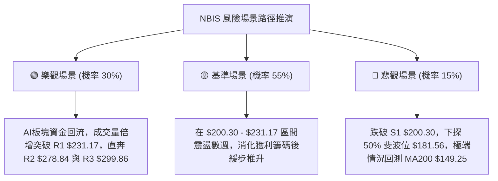

### 🛡️ 風險管理重要提醒

1. **極高波動性警告**：NBIS 當前 ATR(14) 高達 **$23.30 (10.63%)**，單日振幅極大。操作時萬不可重倉滿倉，單一標的倉位上限不得超過總資產之 **20%**。
2. **假突破防範**：在 ADX 低於 25 的盤整市中，價格衝過阻力位或跌破支撐位時極易發生「假突破/假跌破」，建議以「**收盤價確認**」或「**突破幅度 > 3%**」作為進出場判斷標準。
3. **空頭避險提示**：融券比例 (Short % Float) 達 **27.6%**，空頭回補天數為 2.78 天。高空頭佔比意味著一旦向上突破 R1，極易引發**軋空行情 (Short Squeeze)**；反之，若跌破支撐亦可能引發機構止損踩踏。

---

## 📋 報告總結

```
╔══════════════════════════════════════════════════════════════════╗
║                     NBIS 技術分析報告總結                        ║
╠══════════════════════════════════════════════════════════════════╣
║ 報告日期：2026-08-22                                             ║
║ 當前價格：$219.13                                                ║
║ 技術評級：🟡 55/100 【中性偏多 · 高位收斂箱體震盪】               ║
╠══════════════════════════════════════════════════════════════════╣
║ 關鍵結論：                                                       ║
║ ├─ 長期趨勢：🟢 強力多頭 (遠高於 MA200 $149.25 及 MA120 $185.65)  ║
║ ├─ 中期趨勢：🟡 寬幅三角形收斂整理 (底部位於 $177-$200 區間)      ║
║ ├─ 短期趨勢：🔴 弱勢盤整 (受壓於短均 MA5/MA10 及 MA50 $223.10)   ║
║ ├─ 核心支撐：S1 $200.30 ｜ 次級支撐：S2 $164.31 ｜ 極限：S3 $145.80 ║
║ ├─ 核心阻力：R1 $231.17 ｜ 波段阻力：R2 $278.84 ｜ 天花板：R3 $299.86║
║ └─ 機構共識：買入 (Buy) ｜ 平均目標價：$271.85 (隱含 +24.1% 空間)║
╠══════════════════════════════════════════════════════════════════╣
║ 最優策略組合：                                                   ║
║ 1. 🥇 最佳機會（箱底低吸）：在 $209.48-$213.47 逢低佈局，止損設   ║
║      $195.00，目標看 R1 $231.17 及 R2 $278.84 (盈虧比 1:3.82)。  ║
║ 2. 🥈 次選機會（右側追漲）：若放量站穩 R1 $231.17 追買，目標看    ║
║      $278.84 及 $299.86 (盈虧比 1:3.96)。                         ║
║ 3. 🥉 保守選擇（觀望等待）：ADX < 25 期間保持觀望，靜待方向明朗。 ║
╚══════════════════════════════════════════════════════════════════╝
```

---

> ⚠️ **免責聲明**：本報告為 AI 自動生成之技術分析，所有數據及估算均基於提供的歷史價格資訊。本報告**僅供研究與學術參考**，**不構成任何投資建議**。投資有風險，入市需謹慎。

---

*報告生成時間：2026-08-22 ｜ 數據來源：Yahoo Finance ｜ 分析框架：多時框技術分析*