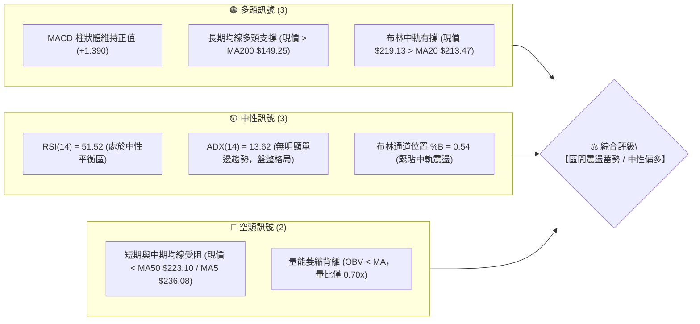
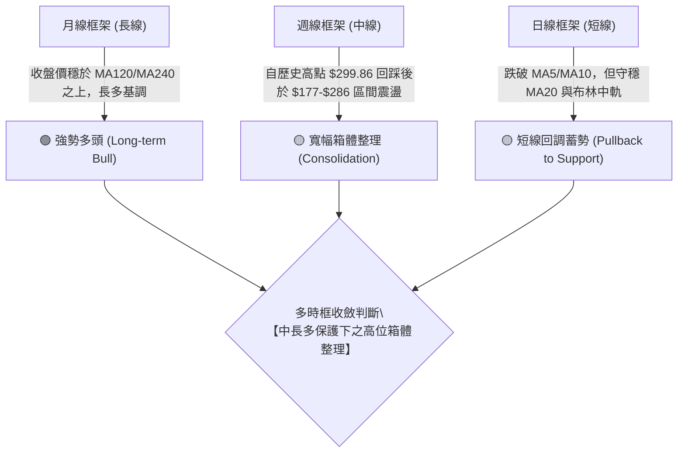
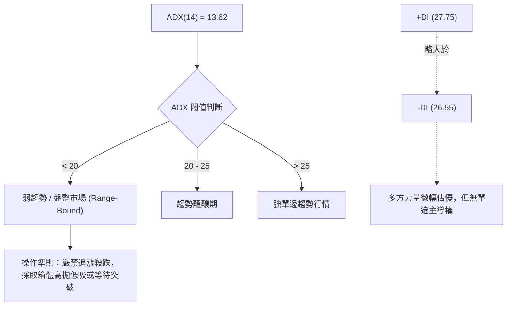
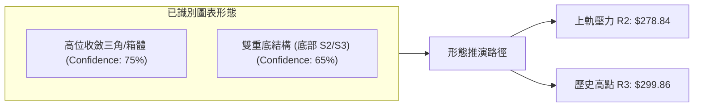
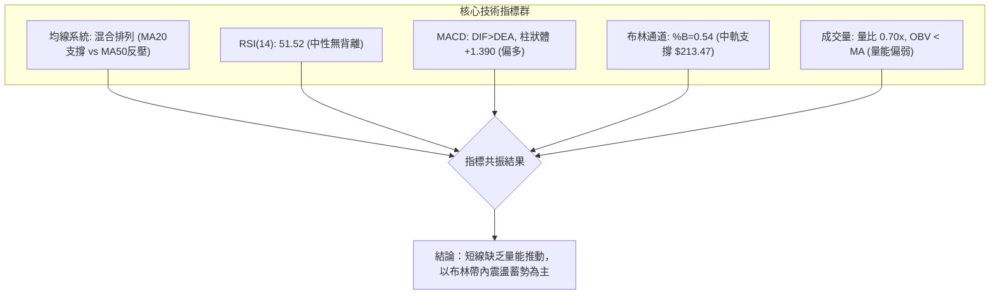
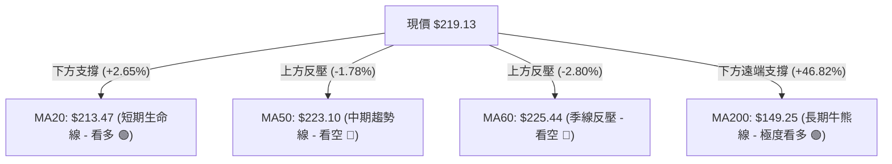
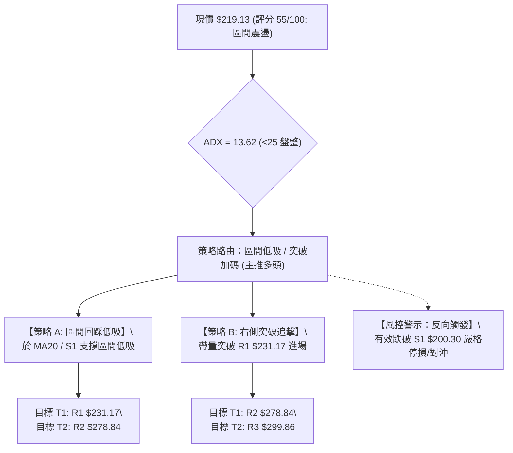
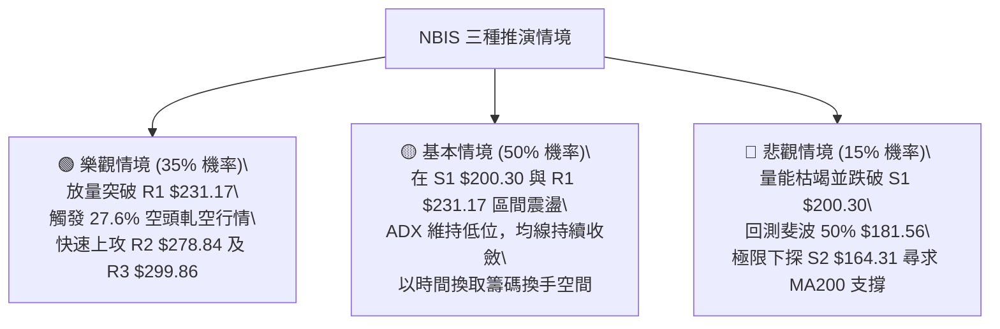

# NBIS 技術分析報告

> **報告日期**：2026-08-23 ｜ **語言**：繁體中文 ｜ **數據來源**：Yahoo Finance ｜ **當前價格**：$219.13

---

## 目錄

| 章節 | 內容 |
|------|------|
| [1. 技術面概覽](#1-技術面概覽) | 訊號儀表板、核心指標、評分卡 |
| [2. 趨勢分析](#2-趨勢分析) | 多時框趨勢、長中短期走勢、ADX解讀 |
| [3. 圖表形態分析](#3-圖表形態分析) | 形態識別、信心度評估、K線組合、目標價 |
| [4. 支撐與阻力](#4-支撐與阻力) | 關鍵價位分佈、斐波那契回調精準解析 |
| [5. 技術指標深度解讀](#5-技術指標深度解讀) | MA/RSI/MACD/布林通道/成交量量價關係 |
| [6. 動能與波動率](#6-動能與波動率) | 動能四象限、ATR波動分析、Beta與空頭回補 |
| [7. 多時框架總結](#7-多時框架總結) | 時框架評分矩陣、多時框收斂唯一結論 |
| [8. 交易策略建議](#8-交易策略建議) | 策略路由、階梯情境、具體交易計劃、風控點 |
| [9. 風險提示與監控](#9-風險提示與監控) | 關鍵監控清單、情境模擬圖、資金管理 |

---

## 1. 技術面概覽

### 🎯 技術訊號儀表板



---

### 📊 核心指標速覽表

| 指標類別 | 指標名稱 | 當前數值 | 訊號 | 專業技術解讀 |
|:---|:---|:---|:---:|:---|
| **價格** | 當前收盤價 | $219.13 | 🟡 | 位於52週區間（$63.26–$299.86）的 65.9% 水位，處於波段回調後的震盪中軸 |
| **均線** | 短期 MA20 | $213.47 | 🟢 | 現價高於 MA20（+2.65%），短線具備防守支撐，中軌向上提供承托 |
| **均線** | 中期 MA50 | $223.10 | 🔴 | 現價低於 MA50（-1.78%），MA50 與 MA60（$225.44）形成上方第一道密集反壓帶 |
| **均線** | 長期 MA200 | $149.25 | 🟢 | 現價遠高於 MA200（+46.82%），長期牛市結構未遭破壞 |
| **動能** | RSI (14) | 51.52 | 🟡 | 處於 30–70 中性區間正中心，動能處於多空拉鋸平衡點，無超買超賣 |
| **動能** | MACD (12,26,9) | 7.347 / 5.957 | 🟢 | DIF 線高於 DEA 線，MACD 柱狀體為 +1.390，維持金叉多頭排列 |
| **動能** | Stoch %K / %D | 38.42 / 41.97 | 🟡 | 隨機指標位於中低位，尚未進入超賣區，短線呈現收斂整理 |
| **趨勢強度** | ADX (14) | 13.62 | 🟡 | 數值遠低於 25，明確定義為「非趨勢性盤整行情」，+DI(27.75) 微幅領先 -DI(26.55) |
| **通道指標** | 布林帶 %B | 0.54 | 🟡 | 處於帶寬中軌（$213.47）上方，上下軌區間為 $143.79–$283.16，波動度具收縮特徵 |
| **量能** | 20日均量比 | 0.70x | 🔴 | 當日成交量 2,018.7 萬股低於 20 日均量（2,896.5 萬股），量能不足限制上攻爆發力 |
| **波動** | ATR (14) | $23.30 | 🟡 | 每日平均波幅佔股價 10.63%，屬於高 Beta（1.434）高波動特性，需嚴格設置風控距離 |

---

### 🏆 技術評分卡

```
╔════════════════════════════════════════════════════════════════╗
║                技術評分卡 — NBIS (2026-08-23)                  ║
╠════════════════════════════════════════════════════════════════╣
║ 趨勢強度 (ADX=13.62)       ██████░░░░░░░░░░░░░░  30/100 🟡 中性盤整 ║
║ 動能指標 (RSI/MACD)        ████████████░░░░░░░░  60/100 🟢 偏多延續 ║
║ 支撐穩定度 (MA20/S1)       ██████████████░░░░░░  70/100 🟢 支撐穩固 ║
║ 成交量配合 (量比 0.70x)    ████████░░░░░░░░░░░░  40/100 🔴 量能疲弱 ║
║ 形態完整度 (寬幅箱體)      ████████████░░░░░░░░  60/100 🟡 箱體收斂 ║
║ 均線排列 (多空交織)        ████████████░░░░░░░░  60/100 🟡 混合整理 ║
╠════════════════════════════════════════════════════════════════╣
║ 綜合評分                   ███████████░░░░░░░░░  55/100 ⚖️ 區間震盪 ║
╚════════════════════════════════════════════════════════════════╝
```

---

## 2. 趨勢分析

### 🌐 多時框趨勢分析



---

### 📈 長期趨勢 — 12個月走勢圖（ASCII）

```
NBIS 月線收盤走勢圖（2025-09 至 2026-08）
價格 ($)
$300 ┤                                        
$280 ┤                                  ● $276.17 (06月高點)
$240 ┤                            ● $231.09
$220 ┤                                            ● $219.13 (現價)
$200 ┤                                      ● $190.41
$140 ┤                      ● $138.23
$120 ┤ ● $112.27
$100 ┤       ● $130.82  ● $103.76
$80  ┤             ● $83.71 (波段低點)
$60  ┴───────────────────────────────────────────────────────
       09月  10月  12月  02月  03月  04月  05月  06月  07月  08月
```

#### 走勢階段特徵分析表

| 階段區間 | 價格區間 | 漲跌幅 | 技術特徵與量價行為 |
|:---|:---|:---:|:---|
| **第一階段：初升回踩** (2025.09–2025.12) | $112.27 ➔ $83.71 | -25.44% | 觸及 $130.82 後快速獲利了結，於 $83.71 形成底部樞紐支撐 |
| **第二階段：主升起爆** (2026.01–2026.06) | $85.19 ➔ $276.17 | **+224.18%** | 伴隨 AI 基礎設施爆發式增長，突破 $140 頸線後走主升浪，創歷史高點 $299.86 |
| **第三階段：高位劇震** (2026.07–2026.08) | $276.17 ➔ $219.13 | -20.65% | 7月急跌至 $177.71（月收 $190.41）清洗浮籌，8月衝高 $277.68 後回落至 $219.13 收斂 |

---

### 📊 中期趨勢（週線分析）

中期週線在 2026 年 6 月創下 52 週高點 $299.86 後，技術結構由「單邊推升」轉為「高位寬幅箱體震盪」。近 4 週呈現顯著的洗盤特徵：
- **2026-08-02 週**：於 $177–$190 區間爆出 1.548 億股天量完成籌碼換手，形成 S2（$164.31）上方的強力買盤防線。
- **2026-08-16 週**：價格拉升至 $277.68，週成交量達 1.675 億股，但未能在 R2（$278.84）上方站穩。
- **2026-08-23 週**：本週回落收於 $219.13，RSI 自 67.2 降至 51.5，MACD 週線柱狀體收縮至 +1.390，確認市場重回箱體中軸整理。

---

### ⚡ 趨勢強度評估（ADX 解讀）



#### ADX 趨勢強度對照解讀

| 指標 | 數值 | 狀態 | 交易策略意涵 |
|:---|:---:|:---:|:---|
| **ADX (14)** | **13.62** | 弱/無趨勢 | 市場動能完全收斂，單邊指標（如均線交叉）容易產生假訊號 |
| **+DI / -DI** | **27.75 vs 26.55** | 多頭微幅領先 | 多空雙方處於拉鋸僵局，差值僅 1.20，缺乏突破動能 |
| **市場狀態歸類** | **高位箱體盤整** | 區間震盪 | **依據規則 14**：以日線布林通道與波段關鍵支撐/阻力為核心交易依據 |

---

## 3. 圖表形態分析

### 🔍 形態識別系統



#### 圖表形態信心度評估表

| 識別形態 | 信心度 | 判斷依據（引用數據） | 完成度 | 目標價（附嚴謹計算式） |
|:---|:---:|:---|:---:|:---|
| **高位收斂箱體 (Box Range)** | **75%** | 頂部受制於 R2（$278.84）與 R3（$299.86），底部在 S1（$200.30）與 7月低點（$177.71）獲得強力承接 | 80% | 箱體突破目標 = 頸線 R1 $231.17 + 箱體高度 ($231.17 - $200.30 = $30.87) = **$262.04** |
| **次級雙底形態 (W-Bottom)** | **65%** | 7月中旬低點 $177.71 與 8月低點 $187.97 構成雙底雛形，本週回踩守穩 MA20（$213.47） | 70% | 雙底目標 = 頸線 R1 $231.17 + 形態高度 ($231.17 - $177.71 = $53.46) = **$284.63** (接近 R2 $278.84) |

---

### 🕯️ 重要K線形態分析

| 週期/月份 | 收盤價 | K線形態 | 深度技術解讀 | 訊號強度 |
|:---|:---:|:---|:---|:---:|
| **2026-06** | $276.17 | 長上影大陽線 | 觸及歷史高點 $299.86 後遭遇龐大解套與獲利盤，多頭攻勢受阻 | 🟡 滯漲警訊 |
| **2026-07** | $190.41 | 長下影中陰線 | 快速下殺至 $177.71 觸發 50% 斐波那契回調承接盤，長下影線確立洗盤性質 | 🟢 底部支撐 |
| **2026-08 (進行中)** | $219.13 | 帶長上影小陽十字 | 上攻 $277.68 受阻於 R2，收盤回落至 MA20 附近，呈現典型多空平衡整理 | 🟡 震盪觀望 |
| **近兩週 K 線** | $219.13 | 衝高回落孕線 | 08-16 週大陽拉升（$277.68）後，08-23 週回調包含於前週波幅內，短線能量收斂 | 🟡 蓄勢待變 |

---

### 📉 ASCII 走勢形態示意圖

```
NBIS 高位箱體收斂形態示意圖
═══════════════════════════════════════════════════════════════════════
$299.86 ───┬───────────────────────────────● (歷史高點 52W High / R3)
           │                             ╱   ╲
$278.84 ───┼─────────────────● (08-16高點)      ╲  ◄ R2 強阻力位
           │               ╱   ╲                 ╲
$231.17 ───┼─────● (頸線) ╱     ╲                 ● ◄ R1 關鍵頸線阻力
$219.13 ───┼──────現價 ───┼───────●───────────────┼── (當前價格中軸)
$213.47 ───┼── [MA20 / 布林中軌] ─────────────────┴── ◄ 短期多頭防線
$200.30 ───┼───────────────────────────────────────── ◄ S1 近期關鍵支撐
           │           ╲       ╱
$177.71 ───┴────────────●─────● (7/8月雙底支撐區間)
═══════════════════════════════════════════════════════════════════════
```

---

## 4. 支撐與阻力

### 🗺️ 關鍵價位分布圖（Unicode）

```
NBIS 價位結構分布圖
═══════════════════════════════════════════════════════════════
$299.86 ║████████████████████████████████║ 歷史極限強阻力 R3 (+36.84%)
$278.84 ║████████████████████████        ║ 次級波段阻力 R2 (+27.25%)
$244.02 ║▓▓▓▓▓▓▓▓▓▓▓▓▓▓▓▓▓▓              ║ 斐波那契 23.6% 回調壓力
$231.17 ║████████████████                ║ 短線關鍵頸線阻力 R1 (+5.49%)
════════╬════════════════════════════════╬═══════════════════════
$219.13 ╠════════════════════════════════╣ ◄ 當前收盤價 (Current Price)
════════╬════════════════════════════════╬═══════════════════════
$213.47 ║▒▒▒▒▒▒▒▒▒▒▒▒▒▒▒▒▒▒▒▒▒▒▒▒        ║ 動態支撐 MA20 / 布林中軌
$209.48 ║▓▓▓▓▓▓▓▓▓▓▓▓▓▓▓▓▓▓▓▓            ║ 斐波那契 38.2% 回調支撐
$200.30 ║████████████████████████        ║ 波段關鍵支撐 S1 (-8.59%)
$181.56 ║▓▓▓▓▓▓▓▓▓▓▓▓▓▓▓▓▓▓▓▓▓▓▓▓        ║ 斐波那契 50.0% 核心分水嶺
$164.31 ║████████████████████████████    ║ 中期強支撐 S2 (-25.02%)
$145.80 ║████████████████████████████████║ 長期防守強支撐 S3 (-33.46%)
═══════════════════════════════════════════════════════════════
```

---

### 🚧 阻力位分析表

| 阻力級別 | 精確價位 | 距現價幅幅 | 形成原因與籌碼結構 | 突破難度 | 重要性評級 |
|:---|:---:|:---:|:---|:---:|:---:|
| **R1 (阻力一)** | **$231.17** | +5.49% | 2026年5月收盤高點、MA50（$223.10）及 MA60（$225.44）上方密集賣壓區 | 中等 | 🟢🟢🟢 (短線多空分水嶺) |
| **R2 (阻力二)** | **$278.84** | +27.25% | 2026年6月月線收盤位（$276.17）與 8月中旬反彈高點聚類區，套牢籌碼重 | 極高 | 🟢🟢🟢🟢 (波段多頭目標) |
| **R3 (阻力三)** | **$299.86** | +36.84% | 52週歷史最高點，歷史心理天花板與強烈空頭防守點 | 極高 | 🟢🟢🟢🟢🟢 (歷史極限阻力) |

---

### 🛡️ 支撐位分析表

| 支撐級別 | 精確價位 | 距現價跌幅 | 形成原因與技術共振 | 守住機率 | 重要性評級 |
|:---|:---:|:---:|:---|:---:|:---:|
| **S1 (支撐一)** | **$200.30** | -8.59% | 整數關口心理支撐，疊加斐波那契 38.2%（$209.48）與 MA20（$213.47）防線 | 75% | 🟢🟢🟢🟢 (短線核心防線) |
| **S2 (支撐二)** | **$164.31** | -25.02% | 2026年4月突破平台高點，疊加 7月中旬低點（$177.71）下方承接帶 | 85% | 🟢🟢🟢🟢🟢 (中期趨勢防線) |
| **S3 (支撐三)** | **$145.80** | -33.46% | MA200（$149.25）與 MA240（$143.15）長期均線共振區，牛熊分界線 | 95% | 🟢🟢🟢🟢🟢 (長期多頭底線) |

---

### 📐 斐波那契回調位分析

依據 52 週完整波動區間（低點 **$63.26** ➔ 高點 **$299.86**，波幅 **$236.60**）計算：

| 斐波那契層級 | 精確計算價位 | 當前相對位置與技術解讀 |
|:---:|:---:|:---|
| **0.0% (52W High)** | **$299.86** | 歷史頂部壓力位 |
| **23.6%** | **$244.02** | 現價上方第一道斐波壓力，突破此位代表多頭完全收復回調失地 |
| **【現價區間】** | **$219.13** | **當前價格落於 38.2%（$209.48）與 23.6%（$244.02）之間** |
| **38.2%** | **$209.48** | 強勢回調防守線，與 MA20（$213.47）構成密集支撐帶，目前成功守穩 |
| **50.0%** | **$181.56** | 多空中期強弱分水嶺，7月低點 $177.71 即在此位獲得強烈技術性買盤 |
| **61.8%** | **$153.64** | 黃金分割強支撐，共振 MA200（$149.25），為長線牛市極限回撤點 |
| **78.6%** | **$113.89** | 深度回調支撐位 |
| **100.0% (52W Low)**| **$63.26** | 52週起漲點 |

---

## 5. 技術指標深度解讀

### 🎛️ 指標訊號總覽



---

### 📈 移動平均線排列分析



#### 均線各週期狀態詳解表

| 均線名稱 | 數值 | 現價差距 | 趨勢斜率 | 技術意涵 |
|:---|:---:|:---:|:---:|:---|
| **MA 5** | $236.08 | -7.18% | 下彎 ▄▄▃ | 超短線衝高回落後的壓制線 |
| **MA 10** | $234.97 | -6.74% | 下彎 ▇▆▄ | 短線動能衰退，抑制短線快速反彈 |
| **MA 20** | $213.47 | +2.65% | 走平微升 ▂▃▄ | 月線級別支撐有效，守住此位維持震盪偏多 |
| **MA 50** | $223.10 | -1.78% | 走平 ▅▅▆ | 中期關鍵多空阻力，需帶量長陽突破方能開啟波段行情 |
| **MA 60** | $225.44 | -2.80% | 上升 ▆▇█ | 季線趨勢向上，與 MA50 形成雙重阻力帶 |
| **MA 120**| $185.65 | +18.03% | 陡峭上升 ▅▆█| 半年線強支撐，中長線多頭基礎扎實 |
| **MA 200**| $149.25 | +46.82% | 穩定上升 ▄▅█| 確立長期超級牛市格局未變 |

---

### 📉 RSI(14) 分析

- **當前數值**：**51.52**
- **強度進度條**：`██████████░░░░░░░░░░` 51.52%（完全中性）
- **背離分析**：
  - **頂背離檢驗**：08-16 反彈至 $277.68 時，RSI 升至 67.2，相較於 6 月高點 $286.69 時的 RSI 65.3 未出現顯著頂背離。
  - **底背離檢驗**：7月中旬低點 $177.71 時 RSI 跌至 34.8，隨後 8月初於 $187.97 獲支撐時 RSI 上升至 51.2，低點墊高，**無底背離，呈現健康的震盪修復**。
- **結論**：指標位於平衡軸上方，無超買或超賣風險，具備向任一方向發力的空間。

---

### 📊 MACD(12, 26, 9) 訊號解讀

- **DIF 快線**：`7.347`
- **DEA 慢線 (Signal)**：`5.957`
- **MACD 柱狀體 (Histogram)**：`+1.390` 🟢（維持正值，偏多）


---

### 📦 布林通道分析（Bollinger Bands）

```
NBIS 日線布林通道結構示意圖
════════════════════════════════════════════════════════════════════
$283.16 ───────────────────────────────────────── BB 上軌 (Upper Band)
                                 ╱
$240.00 ─────────────────────────
                       ● $219.13 (現價落於中軌上方，%B = 0.54)
$213.47 ───────────────────────── BB 中軌 (MA20 Support)
                                 ╲
$143.79 ───────────────────────────────────────── BB 下軌 (Lower Band)
════════════════════════════════════════════════════════════════════
```
- **布林帶寬與位置**：上軌 $283.16、中軌 $213.47、下軌 $143.79。現價 $219.13，%B 數值為 **0.54**，顯示價格緊密貼合中軌整理。
- **帶寬特徵**：通道處於高位劇震後的平緩收斂期，預示未來 1–2 週內將維持在 $200.30–$244.02（斐波區間）內進行窄幅波動蓄勢。

---

### 💹 成交量分析（量價配合度）

- **量比與均量**：最新成交量 20,187,100 股，20日均量 28,965,095 股（**量比 0.70x**），成交量顯著萎縮。
- **OBV 能量潮趨勢**：`OBV < MA`，顯示量能指標處於均線下方，反映近期的反彈缺乏機構資金的持續主動性買盤推動。
- **量價診斷**：近期呈現「上漲放量、回調縮量」的良性特徵（如 08-16 週爆量 1.67 億股大漲，本週回調縮量至 1.41 億股），但日線量能萎縮至 0.70x 顯示追價意願不足，短期難以單邊向上突破 R1（$231.17）。

---

## 6. 動能與波動率

### ⚡ 動能評估四象限

| 象限 | 動能強度 (Momentum) | 波動率水準 (Volatility) | 當前狀態 | 專業操作策略建議 |
|:---:|:---:|:---:|:---:|:---|
| **Q1** | 強 (MACD/RSI 向上) | 低 (ATR 收縮) | — | 最優單邊主升機會（加碼做多） |
| **Q2** | 弱 (ADX < 25) | 低 (縮量整理) | — | 窄幅盤整（謹慎觀望，等待突破） |
| **Q3** | **強 (MACD 金叉延續)** | **高 (ATR 10.63%, Beta 1.434)** | **【✓ 當前 NBIS 所在象限】** | **高波動區間操作：嚴設寬幅止損，逢低布局** |
| **Q4** | 弱 (跌破均線系統) | 高 (恐慌拋售) | — | 高風險殺跌階段（嚴禁抄底） |

---

### 📊 ATR 波動率分析

- **ATR(14) 數值**：**$23.30**
- **ATR 佔比 (ATR/Price)**：**10.63%**
- **止損與風控距離建議**：
  - **日內/短線交易止損距離 (1.0x ATR)**：`$23.30`（進場點下方約 10.6%）
  - **波段交易安全止損距離 (1.5x ATR)**：`$34.95`（約 15.9%）
  - **解讀**：NBIS 每日固有波動超過 $23，常規緊密止損（如 2–3%）極易被市場雜訊掃出場，部位規模必須依 ATR 進行倒推壓縮。

---

### 📐 Beta 與市場相關性及空頭結構

- **Beta 係數**：**1.434**（屬於高彈性進攻型資產，波動度高於大盤 43.4%）。
- **做空數據分析**：
  - **Short % of Float**：**27.6%**（高度擁擠的做空比例，空頭籌碼沉重）。
  - **Short Ratio (回補天數)**：**2.78 天**。
  - **軋空（Short Squeeze）潛力**：由於空頭佔比高達 27.6%，一旦價格向上放量突破頸線 R1（$231.17），極易誘發空頭停損回補潮，形成快速推升至 R2（$278.84）的軋空行情。

---

## 7. 多時框架總結

### 📋 時框架評分表

| 時框架 | 趨勢方向 | 動能指標 | 均線系統排列 | 形態結構 | 綜合評分 | 交易建議 |
|:---|:---:|:---:|:---:|:---:|:---:|:---|
| **短期 (日線)** | 🟡 震盪整理 | 🟡 RSI 51.52 / Stoch 38 | 🟡 MA20 有撐 / MA50 壓制 | 孕線收斂 | **52/100** | 區間操作，回踩支撐低吸 |
| **中期 (週線)** | 🟢 震盪偏多 | 🟢 MACD 柱狀體 +1.390 | 🟢 站穩 MA120/MA200 | 寬幅箱體 ($177–$286) | **60/100** | 箱體底部逢低建倉 |
| **長期 (月線)** | 🟢 超級多頭 | 🟢 長期均線陡峭向上 | 🟢 現價遠超 MA200 (+46.8%) | 主升浪後高位整理 | **75/100** | 長線多頭趨勢持股 |

---

### 🔲 綜合訊號矩陣

```
訊號維度對照矩陣
═════════════════════════════════════════════════════════════════
時框        均線訊號    動能訊號    形態訊號    量價配合    多空收斂結論
短期 (日線)   🟡 中性     🟢 偏多     🟡 震盪     🔴 偏弱     🟡 中性蓄勢
中期 (週線)   🟢 偏多     🟢 偏多     🟢 雙底雛形 🟢 爆量換手 🟢 偏多震盪
長期 (月線)   🟢 看多     🟢 看多     🟢 突破多頭 🟢 趨勢量能 🟢 強烈看多
═════════════════════════════════════════════════════════════════
```

---

### ⚖️ 多時框收斂結論

> **依據「嚴格要求 14」多時框收斂規則進行定性**：
> 1. **行情屬性定界**：當前日線 ADX(14) 為 **13.62（< 25）**，技術架構明確處於**「盤整行情 (Consolidation Regime)」**。
> 2. **主導維度判定**：在盤整行情中，單邊趨勢策略失效，日線布林通道（$143.79–$283.16）與關鍵波段支撐/阻力（S1: $200.30 / R1: $231.17）為主要交易邊界。
> 3. **唯一方向性結論**：**【中長多保護下的區間震盪蓄勢（中性偏多，評分 55/100）】**。策略核心為「支撐區間逢低做多，阻力區間分批獲利」，在未放量突破 R1 前不宜盲目追高。

---

## 8. 交易策略建議

### 🗺️ 策略決策流程圖



---

### 🧭 策略路由

- **綜合評分**：**55 / 100**（中性震盪偏多）
- **當前主策略方向**：**【區間回踩低吸與右側突破結合之偏多策略】**（依評分 55/100，主推在支撐位佈局多單，空頭僅列為風控停損點）。

---

### 🎯 價格情境階梯（Price Scenarios）

| 觸發條件 | 第一目標 (T1) | 第二延伸目標 (T2) | 後續極限 (T3) | 情境技術含義 |
|:---|:---:|:---:|:---:|:---|
| **向上突破 R1 ($231.17)** | **R2 ($278.84)** | **R3 ($299.86)** | **$415.00** (分析師最高目標) | 結束箱體整理，觸發 27.6% 空頭回補主升浪 |
| **守穩現價 ($219.13)** | **R1 ($231.17)** | **斐波 23.6% ($244.02)** | — | 維持在 MA20 與 MA50 之間進行窄幅震盪蓄勢 |
| **跌破 S1 ($200.30)** | **斐波 50% ($181.56)** | **S2 ($164.31)** | **S3 ($145.80)** | 短期形態轉弱，回撤測試 7月低點與 MA200 支撐 |

---

### 📊 情境機率分佈

| 運行情境 | 發生機率 | 主要技術依據 |
|:---|:---:|:---|
| **情境一：區間震盪蓄勢後向上突破** | **55%** | MACD 柱狀體維持正值（+1.390），現價站穩 MA20 與布林中軌，中長期多頭趨勢向上 |
| **情境二：箱體內部持續窄幅震盪** | **30%** | ADX 僅 13.62，量比萎縮至 0.70x，短期缺乏催化劑打破 $200.30–$231.17 區間 |
| **情境三：向下破位回踩深層支撐** | **15%** | 短期 MA5/MA10 下彎壓制，若大盤系統性回調跌破 S1（$200.30），將下探 S2 |

---

### 🟢 主策略詳情

本報告依據關鍵價位系統制定兩套精確執行計劃：

| 策略要素 | 策略 A：左側區間回踩低吸（首選） | 策略 B：右側突破動能追擊（次選） |
|:---|:---|:---|
| **策略類型** | 支撐位回踩逢低佈局 | 阻力位帶量突破追多 |
| **進場條件** | 回踩 MA20（$213.47）至 S1（$200.30）區間企穩 | 日線收盤價帶量突破 R1（$231.17）且量比 > 1.2x |
| **精確進場點** | **$213.50**（MA20 支撐上方） | **$232.00**（突破 R1 確認點） |
| **目標價 T1** | **$231.17**（R1 阻力位，預期報酬 +8.28%） | **$278.84**（R2 阻力位，預期報酬 +20.19%） |
| **目標價 T2** | **$278.84**（R2 阻力位，預期報酬 +30.60%） | **$299.86**（R3 歷史高點，預期報酬 +29.25%） |
| **嚴格止損點** | **$199.50**（跌破 S1 $200.30 防線） | **$219.00**（跌回現價中軸與假突破確認線） |
| **風險空間** | -$14.00 (-6.56%) | -$13.00 (-5.60%) |
| **風險報酬比 (R:R)**| **1 : 4.66**（以 T2 計算） | **1 : 5.22**（以 T2 計算） |
| **估計勝率** | **65%** | **55%** |
| **建議倉位** | 10%–15% 基礎倉位 | 5%–10% 動能加碼倉 |

---

### 🔴 反向風險觸發點（對沖與止損提示）

- **多頭反轉失效點**：若日線收盤價**跌破 S1（$200.30）**，標誌著短期箱體破位，多頭策略全面失效，必須無條件執行停損離場。
- **做空/對沖觸發條件**：若價格反彈至 **R1（$231.17）** 或 **R2（$278.84）** 出現長上影線滯漲且量能背離，可考慮以極小倉位進行空頭對沖，下看 S1（$200.30）。

---

### ⭐ 整體訊號強度評星

```
做多訊號強度：★★★★☆  (4/5 星 - 中長多趨勢強烈，短線支撐明確)
做空訊號強度：★★☆☆☆  (2/5 星 - 受制於均線支撐與高空頭佔比，做空性價比低)
整體技術可信度：★★★★☆  (4/5 星 - 價位聚類與斐波那契點位共振度高)
```

---

## 9. 風險提示與監控

### ✅ 關鍵監控指標 Checklist

```
╔══════════════════════════════════════════════════════════════════════╗
║                   NBIS 交易日常技術監控清單 (Checklist)              ║
╠══════════════════════════════════════════════════════════════════════╣
║ [ ] 價格防守：收盤價是否持續高於 MA20 ($213.47) 與 S1 ($200.30)？     ║
║ [ ] 動能突破：RSI(14) 是否放量站上 60 關鍵阻力區？                  ║
║ [ ] 量能異動：單日成交量是否回升至 20日均量 (2,896.5 萬股) 之上？     ║
║ [ ] 空頭回補：Short Float (27.6%) 是否隨突破 R1 ($231.17) 顯著下降？  ║
║ [ ] 均線交叉：MA5/MA10 是否重新拐頭向上並形成短期金叉？             ║
║ [ ] MACD 柱狀：Histogram 是否維持在零軸上方正向放大？                ║
╚══════════════════════════════════════════════════════════════════════╝
```

---

### ⚠️ 風險場景分析



---

### 🛡️ 風險管理重要提醒

1. **高波動部位控制**：NBIS 的 ATR 達 **$23.30（10.63%）**，單日波動極大。單筆交易承受風險不應超過總投資組合淨值的 **1.0%–1.5%**。
2. **計算公式**：
   $$\text{最大允許股數} = \frac{\text{總資金} \times 1.5\%}{\text{進場價 (\$213.50)} - \text{止損價 (\$199.50)}} = \frac{\text{總資金} \times 0.015}{\$14.00}$$
3. **空頭擠壓假突破風險**：由於做空比例高達 27.6%，突破 R1（$231.17）時需警惕「衝高回落假突破」，確認突破必須以「日線收盤價企穩」為準，避免盤中盲目追高。

---

## 📋 報告總結

```
╔══════════════════════════════════════════════════════════════════════╗
║                     NBIS 技術分析報告總結                            ║
╠══════════════════════════════════════════════════════════════════════╣
║ 報告日期：2026-08-23                                                 ║
║ 當前收盤價：$219.13                                                  ║
║ 分析評級：⚖️ 中性偏多 / 區間震盪蓄勢 (技術評分: 55/100)               ║
║                                                                      ║
║ 關鍵技術維度結論：                                                   ║
║ ├─ 長期趨勢：🟢 強勢多頭 (現價大幅高於 MA200 $149.25, 結構完整)       ║
║ ├─ 中期趨勢：🟡 寬幅箱體整理 (介於 S2 $164.31 與 R2 $278.84 之間)     ║
║ ├─ 短期趨勢：🟡 震盪回調蓄勢 (ADX=13.62 顯示盤整，MA20 $213.47 提供支撐)║
║ ├─ 關鍵支撐：S1: $200.30 ｜ S2: $164.31 ｜ S3: $145.80               ║
║ ├─ 關鍵阻力：R1: $231.17 ｜ R2: $278.84 ｜ R3: $299.86               ║
║ └─ 分析師目標共識：均價 $283.93 (最高 $415.00 / 最低 $144.00)         ║
║                                                                      ║
║ 最優操作策略組合：                                                   ║
║ 1. 🥇 最佳機會：於 $213.50 (MA20支撐) 逢低建倉，止損 $199.50，目標 $278.84║
║ 2. 🥈 次選機會：帶量突破 R1 $231.17 後追多，止損 $219.00，目標 $299.86║
║ 3. 🥉 保守選擇：等待價格回踩 $200.30 (S1) 出現止跌K線後再行介入      ║
╚══════════════════════════════════════════════════════════════════════╝
```

---

> ⚠️ **免責聲明**：本報告為技術分析研究成果，報告內所有數據、圖表及價位推演均基於市場歷史交易資訊。本報告**僅供學術研究與投資參考**，**不構成任何形式的要約、招攬或具體投資建議**。市場具有高度不確定性與風險，投資人應獨立評估風險並自行承擔交易結果。

---

*報告生成時間：2026-08-23 ｜ 數據來源：Yahoo Finance ｜ 分析框架：多時框技術分析模型*