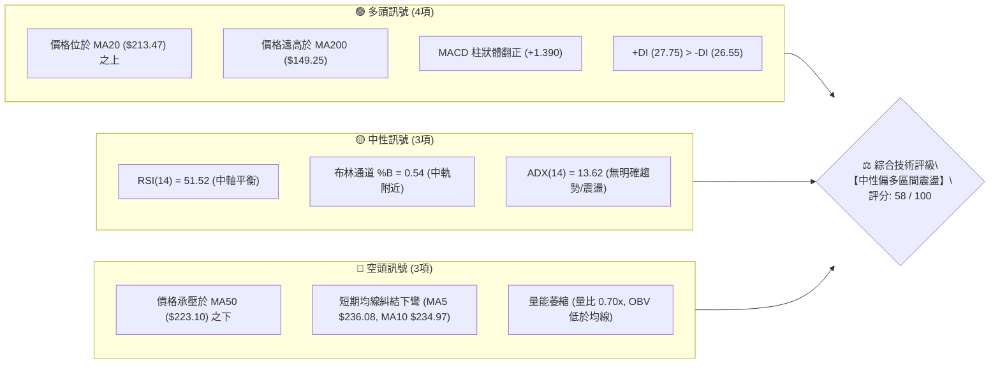
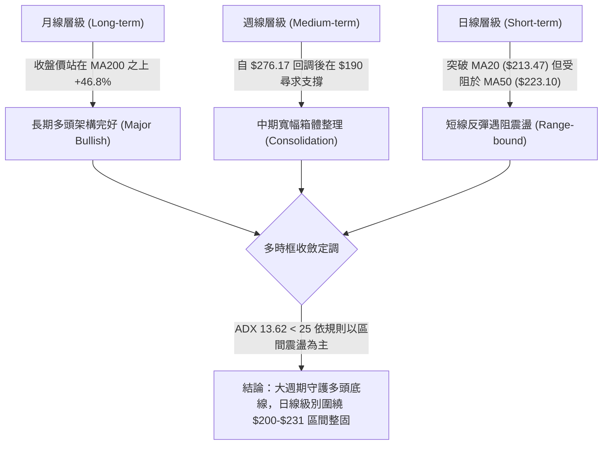
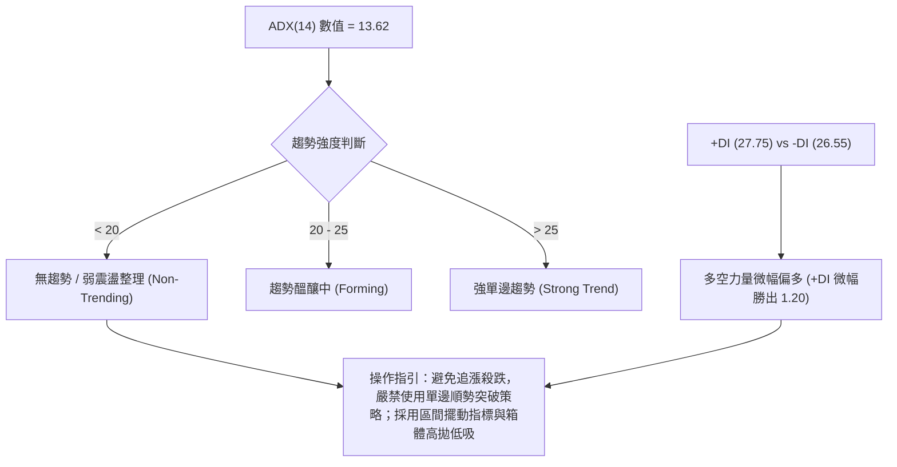
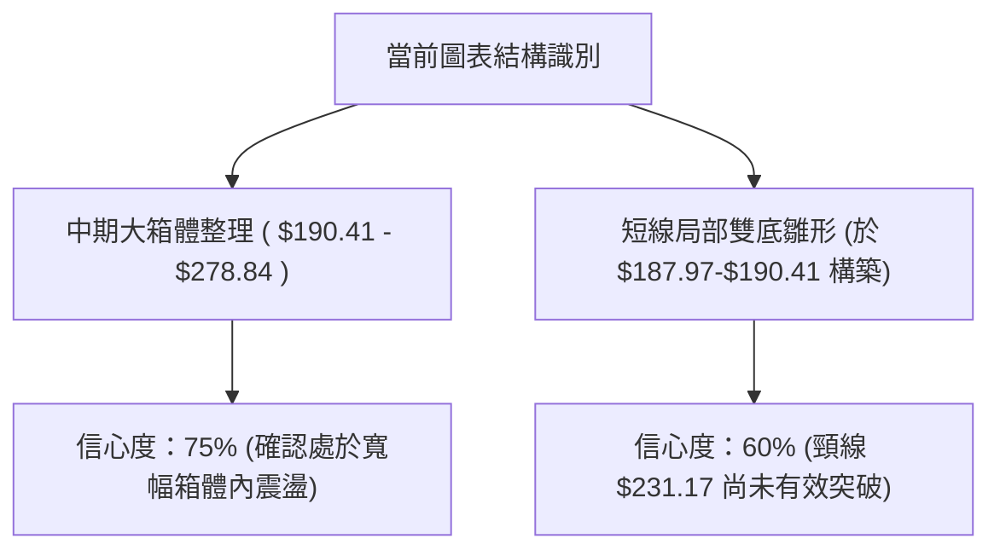
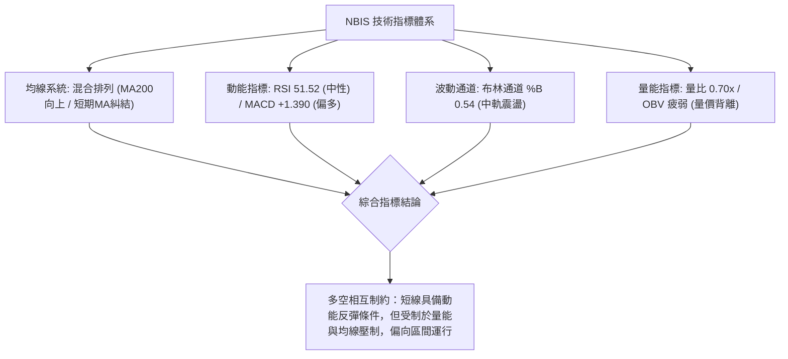
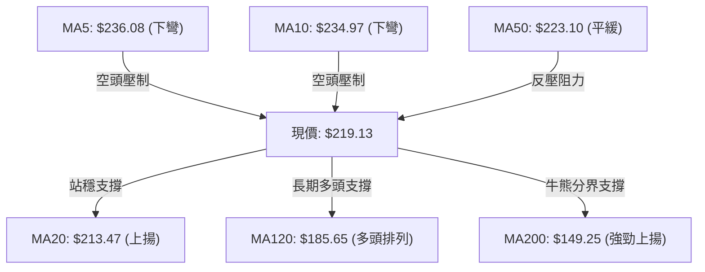
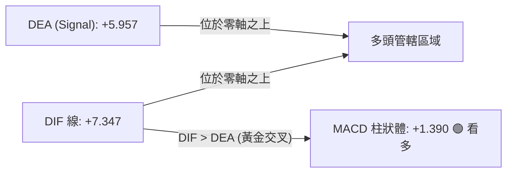
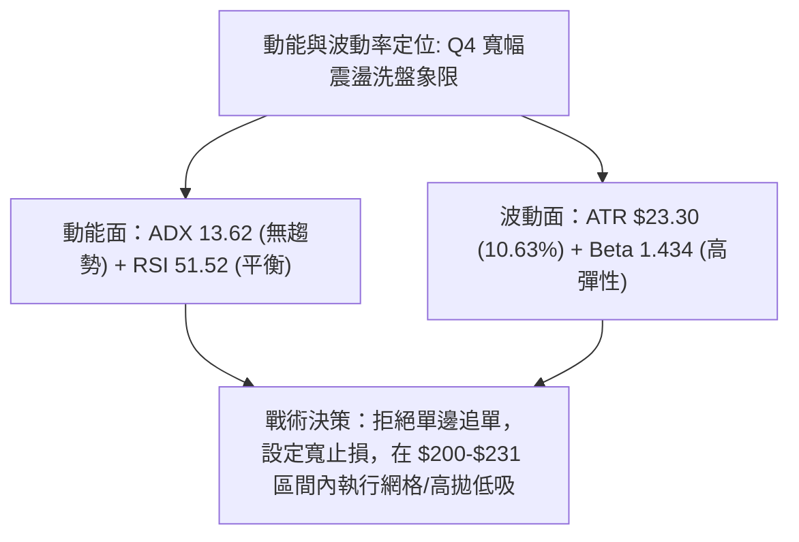
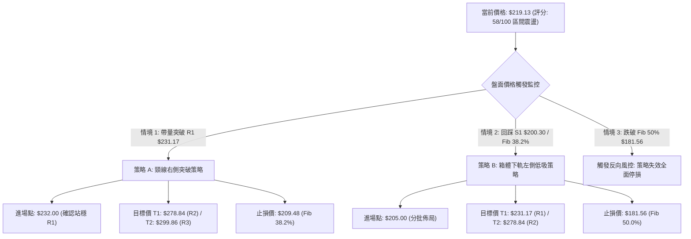
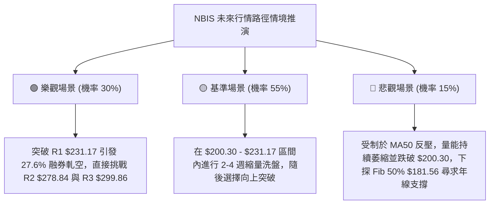

# NBIS 技術分析報告

> **報告日期**：2026-08-24 ｜ **語言**：繁體中文 ｜ **數據來源**：Yahoo Finance ｜ **當前價格**：$219.13

---

## 目錄

| 章節 | 內容 |
|------|------|
| [1. 技術面概覽](#1-技術面概覽) | 訊號儀表板、核心指標、評分卡 |
| [2. 趨勢分析](#2-趨勢分析) | 多時框趨勢、長中短期走勢、ADX趨勢強度 |
| [3. 圖表形態分析](#3-圖表形態分析) | 形態識別、信心度評估、K線組合、目標價推算 |
| [4. 支撐與阻力](#4-支撐與阻力) | 關鍵價位分布、阻力支撐階梯、斐波那契回調 |
| [5. 技術指標深度解讀](#5-技術指標深度解讀) | 均線系統、RSI、MACD、布林通道、量價配合度 |
| [6. 動能與波動率](#6-動能與波動率) | 動能四象限、ATR波動分析、Beta市場敏感度 |
| [7. 多時框架總結](#7-多時框架總結) | 時框架評分矩陣、多時框收斂定調 |
| [8. 交易策略建議](#8-交易策略建議) | 策略路由、價格情境階梯、進出場參數矩陣 |
| [9. 風險提示與監控](#9-風險提示與監控) | 關鍵監控清單、風險情境路徑、風控管理提醒 |

---

## 1. 技術面概覽

### 🎯 技術訊號儀表板



### 📊 核心指標速覽表

| 指標類別 | 指標名稱 | 當前數值 | 訊號 | 專業技術解讀 |
|:---|:---|:---|:---:|:---|
| **價格** | 當前收盤價 | $219.13 | 🟡 | 位於52週區間 65.9% 水平，處於前期大幅拉回後的收斂整理階段 |
| **均線** | MA20 (月線) | $213.47 | 🟢 | 現價高於 MA20 約 +2.65%，短線守住多空分水嶺 |
| **均線** | MA50 (季線) | $223.10 | 🔴 | 現價低於 MA50 約 -1.78%，面臨中期均線反壓 |
| **均線** | MA200 (年線) | $149.25 | 🟢 | 現價高於 MA200 達 +46.82%，長期多頭架構完好 |
| **動能** | RSI(14) | 51.52 | 🟡 | 位於 50 榮枯線邊緣，無超買或超賣現象，多空拉鋸 |
| **動能** | MACD (12,26,9) | DIF: 7.347 / DEA: 5.957 | 🟢 | MACD 位於零軸之上且發出黃金交叉，柱狀圖 +1.390 偏多 |
| **趨勢** | ADX(14) | 13.62 | 🟡 | ADX < 25 表明處於弱趨勢／寬幅箱體盤整，非單邊行情 |
| **通道** | 布林帶 (%B) | 0.54 (帶寬 $143.79–$283.16) | 🟡 | 現價緊貼中軌 ($213.47) 運行，通道未見喇叭口擴張 |
| **量能** | 20日均量比 | 0.70x (OBV < MA) | 🔴 | 最新日量 20.19M 低於均量 28.97M，追價意願不足 |
| **波動** | ATR(14) | $23.30 (10.63%) | 🔴 | 日內波動極大，單日正常波動幅度逾 23 美元 |

### 🏆 技術評分卡

```
╔══════════════════════════════════════════════════════════════════╗
║                   技術評分卡 — NBIS (2026-08-24)                 ║
╠══════════════════════════════════════════════════════════════════╣
║ 趨勢強度 (ADX/方向)   ██████░░░░░░░░░░░░░░  32/100  🟡 (無趨勢)   ║
║ 動能指標 (RSI/MACD)   ████████████░░░░░░░░  62/100  🟢 (短線翻多) ║
║ 支撐穩定度 (S1/Fib)   ██████████████░░░░░░  70/100  🟢 (支撐扎實) ║
║ 成交量配合 (量比/OBV) ████████░░░░░░░░░░░░  40/100  🔴 (量能不足) ║
║ 形態完整度 (區間整理) ████████████░░░░░░░░  60/100  🟡 (箱體築底) ║
║ 均線排列 (多空糾結)   ██████████████░░░░░░  68/100  🟢 (長多短整) ║
╠══════════════════════════════════════════════════════════════════╣
║ 綜合技術評分          ███████████░░░░░░░░░  58/100  ⚖️ 中性偏多    ║
╚══════════════════════════════════════════════════════════════════╝
```

---

## 2. 趨勢分析

### 🌐 多時框趨勢分析



### 📈 長期趨勢 — 12個月走勢圖（Unicode）

```
NBIS 月線走勢圖（2025-09 至 2026-08）
價格軸 ($)
$300 ┤                                        
$275 ┤                                    ●(2026-06 $276.17)
$250 ┤                                   ╱ ╲
$225 ┤                             ●    ╱   ╲   ●(2026-08 $219.13 現價)
$200 ┤                            ╱ ╲  ╱     ●(2026-07 $190.41)
$175 ┤                           ╱   ╲╱
$150 ┤                    ●     ╱
$125 ┤         ●         ╱ ╲   ╱
$100 ┤  ●     ╱ ╲  ●    ╱   ● ╱
 $75 ┤   ╲   ╱   ╲╱ ╲  ╱     ●(2025-12 $83.71)
 $50 ┤    ╲ ╱        ●(2026-01 $85.19)
     └────┬─────┬─────┬─────┬─────┬─────┬─────┬─────┬─────┬─────┬─────┬────
        25-09 25-10 25-11 25-12 26-01 26-02 26-03 26-04 26-05 26-06 26-07 26-08
```

#### 走勢特徵分析表格

| 階段區間 | 時間跨度 | 起點/終點收盤價 | 漲跌幅 (%) | 結構特徵與量價解讀 |
|:---|:---:|:---:|:---:|:---|
| **第一波主升段** | 2025-09 → 2025-10 | $112.27 → $130.82 | +16.52% | AI算力基建概念爆發，突破百元關卡 |
| **中級回檔整理** | 2025-10 → 2025-12 | $130.82 → $83.71 | -36.01% | 獲利了結賣壓湧現，回踩 $83.71 構築中期雙底 |
| **蓄勢醞釀期** | 2025-12 → 2026-02 | $83.71 → $91.19 | +8.94% | 於 $85 附近狹幅震盪，籌碼進行充分沉澱換手 |
| **第二波超級主升** | 2026-02 → 2026-06 | $91.19 → $276.17 | +202.85% | 爆發性五浪上攻，創下歷史波段高點 $299.86 |
| **劇烈震盪修正** | 2026-06 → 2026-07 | $276.17 → $190.41 | -31.05% | 高檔獲利回吐，快速回測斐波那契 50% 支撐帶 |
| **當前箱體收斂** | 2026-07 → 2026-08 | $190.41 → $219.13 | +15.08% | 於 MA20 上方築底反彈，短線在 $210-$230 間整理 |

### 📊 中期趨勢（週線分析）

中期走勢呈現「急跌後強彈、再收斂三角」的型態。7月中旬觸及週線低點 $177.71 後，8月第二週（2026-08-16）爆出 167.5M 的天量拉升至 $277.68，隨後一週（2026-08-23）回吐至 $219.13，顯示上方 $231-$278 存在顯著解套與獲利盤壓力。

```
週線級別支撐阻力結構示意圖：
[強阻力區]  $278.84 - $299.86  ══════════════════════════════ (8月上影線高點與52W高點)
[關鍵阻力]  $231.17           ------------------------------ (R1 / 近期週線反彈頸線)
[多空平衡]  $219.13 (現價)     ◄────────── (目前位於均線密集區)
[第一支撐]  $200.30           ------------------------------ (S1 / 近期整數防守位)
[中期強支撐] $181.56 - $164.31 ══════════════════════════════ (Fib 50.0% / S2 波段低點)
```

### ⚡ 趨勢強度評估（ADX 解讀）



#### ADX 指標強度與環境對照表

| 指標變數 | 當前讀數 | 門檻區間 | 技術含義 |
|:---|:---:|:---:|:---|
| **ADX(14)** | **13.62** | `< 20` (極弱) | 行情處於動能衰竭的無方向盤整期，均線指標頻繁出現假突破訊號 |
| **+DI (多頭動能)** | **27.75** | `> 25` | 買盤仍具備一定承接力，多方略佔上風 |
| **-DI (空頭動能)** | **26.55** | `> 25` | 賣方力量未完全消退，雙方在 $219 形成焦土戰 |
| **DI 差值 (+DI - -DI)**| **+1.20** | 趨近於 0 | 多空勢均力敵，市場等待新的基本面或量能催化劑 |

---

## 3. 圖表形態分析

### 🔍 形態識別系統



#### 形態識別與信心度評估表

| 形態名稱 | 信心度 | 判斷依據（引用精確數據） | 形態完成度 | 形態目標價（附計算式） |
|:---|:---:|:---|:---:|:---|
| **寬幅矩形箱體** | **75%** | 頂部受阻於 R2 ($278.84)，底部獲 7月/8月收盤低點 ($190.41 / $187.97) 有效支撐 | 70% | 向上突破目標：頸線 $278.84 + 箱高 ($278.84 - $190.41 = $88.43) = **$367.27**（數據中未偵測到此阻力，當前最高為 R3 $299.86） |
| **短線局部雙底** | **60%** | 8/02 收盤 $190.41 與 8/09 收盤 $187.97 構成雙底底部，頸線為 R1 $231.17 | 65% | 突破目標：頸線 $231.17 + 形態高度 ($231.17 - $187.97 = $43.20) = **$274.37**（接近 R2 $278.84） |
| **頭肩底形態** | **35%** | 數據不足以確認左肩與右肩對稱結構 | 20% | *訊號不足，僅做指標型解讀，不預設幾何目標* |

### 🕯️ 重要K線形態分析

| 週期/月份 | 收盤價 | K線形態特徵 | 專業技術解讀 | 訊號方向 |
|:---|:---:|:---|:---|:---:|
| **2026-06** | $276.17 | 長實體大陽線 | 多頭極盛期，創下波段高點 $299.86，但高檔量能開始見頂 | 🟢 強多 |
| **2026-07** | $190.41 | 長黑實體吞噬 | 獲利賣壓宣洩，直接貫穿 MA20 與 MA50，形成中期回檔 | 🔴 強空 |
| **2026-08-16週** | $277.68 | 爆量長上影陽線 | 單週成交 167.5M，衝高至 $277.68 後引發解套賣壓與獲利盤，留長上影線 | 🟡 多空交戰 |
| **2026-08-23週** | $219.13 | 縮量中陰線回調 | 週成交量回落至 141.6M，回測 MA20 支撐，屬於上影線後的籌碼回吐 | 🟡 整理觀望 |

### 📉 ASCII 走勢形態示意圖

```
NBIS 日/週線局部雙底與箱體阻力形態示意圖：

價格 ($)
$280 ┤                   [R2: $278.84] (波段阻力)
     │                     ▲
$250 ┤                    ╱ ╲
     │                   ╱   ╲
$231 ┤──────────────────[頸線 R1: $231.17]───────────────── ◄ 關鍵突破線
     │                 ╱       ╲       ▲ (現價 $219.13 蓄勢)
$210 ┤                ╱         ╲     ╱
     │               ╱           ╲   ╱
$190 ┤       底1: $190.41         底2: $187.97  [S1: $200.30 防守區]
     └───────┴────────────────────┴────────────────────────
             (2026-08-02)        (2026-08-09)
```

### 🎯 形態目標價計算

根據短線局部雙底形態推算：
1. **底部支撐基準**：取雙底低點均值，約 **$187.97**
2. **形態頸線位**：取波段高點聚類阻力 **R1 = $231.17**
3. **形態高度 ($H$)**：
   $$H = \text{頸線} - \text{低點} = \$231.17 - \$187.97 = \$43.20$$
4. **理論突破目標價 ($T$)**：
   $$T = \text{頸線} + H = \$231.17 + \$43.20 = \$274.37$$
   *(該理論推算價位高度契合波段高點聚類阻力位 **R2 = $278.84**)*

---

## 4. 支撐與阻力

### 🗺️ 關鍵價位分布圖（Unicode）

```
NBIS 價位結構分布圖 (由 OHLCV 與斐波那契精確計算)
══════════════════════════════════════════════════════════════════
$299.86 ║████████████████████████║ 52W 高點 / Fib 0.0% / 極強阻力 R3
$278.84 ║████████████████████    ║ 近一年波段高點聚類 / 強阻力 R2
$244.02 ║▓▓▓▓▓▓▓▓▓▓▓▓▓▓▓▓▓▓      ║ 斐波那契 23.6% 回調位
$231.17 ║████████████████████████║ 近一年波段高點聚類 / 關鍵頸線阻力 R1
╠════════════════════════════════╣ ◄ 現價: $219.13 (處於 Fib 38.2% 與 R1 之間)
$209.48 ║▓▓▓▓▓▓▓▓▓▓▓▓▓▓▓▓▓▓▓▓    ║ 斐波那契 38.2% 回調位 (第一動態支撐)
$200.30 ║████████████████████████║ 近一年波段低點聚類 / 心理整數支撐 S1
$181.56 ║▓▓▓▓▓▓▓▓▓▓▓▓▓▓▓▓▓▓▓▓▓▓  ║ 斐波那契 50.0% 中樞強支撐
$164.31 ║████████████████████    ║ 近一年波段低點聚類 / 中期強支撐 S2
$153.64 ║▓▓▓▓▓▓▓▓▓▓▓▓▓▓▓▓▓▓▓▓▓▓▓ ║ 斐波那契 61.8% 黃金分割強支撐
$145.80 ║████████████████████████║ 近一年波段低點聚類 / 結構防守底線 S3
$143.79 ║────────────────────────║ 布林下軌 / 接近 MA240 ($143.15)
══════════════════════════════════════════════════════════════════
```

### 🚧 阻力位分析表

| 阻力級別 | 精確價位 | 距現價幅幅 | 形成原因與籌碼屬性 | 突破難度 | 重要性評級 |
|:---|:---:|:---:|:---|:---:|:---:|
| **R1** | **$231.17** | +5.49% | 近一年波段高點聚類；接近 MA50 ($223.10) 與 MA5 ($236.08) 反壓區 | 中等 | 🟢🟢🟢 (短線多空分水嶺) |
| **R2** | **$278.84** | +27.25% | 近一年次高點聚類；8月中旬爆量 167.5M 之套牢上影線區域 | 極高 | 🟢🟢🟢🟢 (中期多頭目標) |
| **R3** | **$299.86** | +36.84% | 52週歷史最高點 (Fib 0.0%)；獲利了結與歷史強阻力 | 巨大 | 🟢🟢🟢🟢🟢 (歷史極值天花板) |

### 🛡️ 支撐位分析表

| 支撐級別 | 精確價位 | 距現價幅幅 | 形成原因與籌碼屬性 | 守住機率 | 重要性評級 |
|:---|:---:|:---:|:---|:---:|:---:|
| **S1** | **$200.30** | -8.59% | 近一年波段低點聚類；$200 整數心理關卡，上方有 Fib 38.2% ($209.48) 緩衝 | 75% | 🔴🔴🔴 (短線防守底線) |
| **S2** | **$164.31** | -25.02% | 近一年波段低點聚類；介於 Fib 50% ($181.56) 與 Fib 61.8% ($153.64) 之間 | 85% | 🔴🔴🔴🔴 (中期趨勢防線) |
| **S3** | **$145.80** | -33.46% | 近一年波段低點聚類；緊鄰 MA200 ($149.25) 與 MA240 ($143.15) 年線強支撐 | 95% | 🔴🔴🔴🔴🔴 (長期牛熊生死線) |

### 📐 斐波那契回調位分析

依據 52 週絕對波動區間（低點 **$63.26** 至 高點 **$299.86**，總極差 **$236.60**）計算：

| 斐波那契回調層級 | 計算公式 ($299.86 - \text{Ratio} \times \$236.60$) | 精確價位 | 與現價關係及技術解讀 |
|:---|:---|:---:|:---|
| **0.0% (52W High)** | $\$299.86 - 0.000 \times \$236.60$ | **$299.86** | 歷史極值阻力 R3 |
| **23.6% 回調位** | $\$299.86 - 0.236 \times \$236.60$ | **$244.02** | 突破 R1 後的第一個量價摩擦位 |
| **38.2% 回調位** | $\$299.86 - 0.382 \times \$236.60$ | **$209.48** | **【現價下檔第一支撐】現價 $219.13 緊守其上方** |
| **50.0% 回調位** | $\$299.86 - 0.500 \times \$236.60$ | **$181.56** | 中期強弱平衡軸，7月回調低點在此獲得支撐 |
| **61.8% 黃金回調位** | $\$299.86 - 0.618 \times \$236.60$ | **$153.64** | 極限回檔位，與 MA200 ($149.25) 形成重疊共振支撐 |
| **78.6% 回調位** | $\$299.86 - 0.786 \times \$236.60$ | **$113.89** | 深度修正支撐位（數據中未偵測到此層級支撐） |
| **100.0% (52W Low)** | $\$299.86 - 1.000 \times \$236.60$ | **$63.26** | 52週起漲點 |

**解讀結論**：現價 **$219.13** 精確運行於 **Fib 38.2% ($209.48)** 與 **Fib 23.6% ($244.02)** 之間。只要收盤不有效跌破 $209.48，自 $299.86 以來的回調僅屬於正常技術性修正（回撤幅度未及 50%），長期多頭架構未遭破壞。

---

## 5. 技術指標深度解讀

### 🎛️ 指標訊號總覽



### 📈 移動平均線排列分析



#### 移動平均線數據對照表

| 均線名稱 | 當前數值 | 距現價差距 (%) | 均線斜率與走勢特徵 | 訊號含義 |
|:---|:---:|:---:|:---|:---:|
| **MA 5** | $236.08 | -7.18% | 快速下彎，短線超跌 | 🔴 短期壓制 |
| **MA 10** | $234.97 | -6.74% | 下彎走平，構成第一道反彈賣壓 | 🔴 短期壓制 |
| **MA 20** | $213.47 | +2.65% | 穩健上揚，現價守在其上 | 🟢 月線支撐 |
| **MA 50** | $223.10 | -1.78% | 走平微跌，為短線多空必爭之地 | 🟡 中期關鍵 |
| **MA 60** | $225.44 | -2.80% | 季線阻力帶，與 MA50 形成雙重夾擊 | 🔴 中期反壓 |
| **MA 120** | $185.65 | +18.03% | 強烈向上發散，中期籌碼成本穩固 | 🟢 中期多頭 |
| **MA 200** | $149.25 | +46.82% | 長期向上發散，年線多頭排列 | 🟢 長期牛市 |
| **MA 240** | $143.15 | +53.07% | 底部基石，長多核心均線 | 🟢 長期牛市 |

### 📉 RSI(14) 分析

```
RSI(14) 動能進度條：
0 ─────── 30 ──────────────── 50 ────── 51.52 ───────────── 70 ─────── 100
[  超賣區  ]    [   弱勢區   ]     [ 多空平衡 ]     [   強勢區   ]   [  超買區  ]
██████████████████████████████████████░░░░░░░░░░░░░░░░░░░░░░░░ 51.52%
```

- **數值解讀**：RSI(14) 讀數為 **51.52**，緊貼 50 中軸，顯示市場自 7 月中旬超賣區（當時週 RSI 降至 32.2）修復後，目前處於完全平衡狀態。
- **背離分析**：
  - **頂背離**：無。8月中旬價格衝至 $277.68 時週 RSI 為 67.2，並未形成高位背離。
  - **底背離**：無。7月下旬 $177.71 低點對應 RSI 34.8，隨後伴隨價格回升，指標同步回揚。
  - **結論**：**RSI 呈現指標中性，無背離訊號**，價格走勢反映真實籌碼博弈。

### 📊 MACD(12/26/9) 訊號解讀



- **零軸分析**：快慢線皆位於零軸上方（DIF 7.347, DEA 5.957），表明大週期多頭趨勢仍在延續。
- **交叉狀態**：日線級別 MACD 柱狀體保持為正值（**+1.390**），但柱狀體增速放緩，提示短線反彈動能面臨 MA50 反壓，尚未形成強烈的噴發態勢。

### 📦 布林通道分析

```
NBIS 布林通道 (20, 2) 結構圖：
價格 ($)
$283.16 ┤------------------------------------------------ [BB 上軌]
        │
$250.00 ┤
        │
$219.13 ┤                      ◄ 現價 $219.13 (%B = 0.54)
$213.47 ┤================================================ [BB 中軌 / MA20]
        │
$180.00 ┤
        │
$143.79 ┤------------------------------------------------ [BB 下軌]
```

- **通道參數**：上軌 **$283.16**，中軌 **$213.47**，下軌 **$143.79**，通道帶寬高達 **$139.37**。
- **位置解讀**：當前 `%B = 0.54`，現價精確運行於中軌上方附近。布林通道目前處於急跌後的擴張收斂期，中軌 $213.47 提供下檔第一緩衝，上軌 $283.16 則與強阻力 R2 ($278.84) 共振。

### 💹 成交量分析（量價配合度）

- **最新量能**：日成交量 **20,187,100** 股，相較於 20 日均量 **28,965,095** 股，量比僅為 **0.70x**（縮量 30%）。
- **OBV 趨勢**：數據顯示 `OBV < MA`，能量潮指標低於其均線，反映資金在 $220 以上追高意願薄弱，主力資金以觀望和洗盤為主。
- **量價關係**：週線級別自 8/16 週的 167.5M 萎縮至 8/23 週的 141.6M，呈現「價跌量縮」的良性回檔特徵，但要展開新一輪攻勢，日成交量必須回升至 30M 以上。

---

## 6. 動能與波動率

### ⚡ 動能評估四象限

| 象限 | 動能維度 (Momentum) | 波動維度 (Volatility) | NBIS 當前歸屬 | 操盤策略與戰術指引 |
|:---:|:---:|:---:|:---:|:---|
| **Q1 (最佳順勢)** | 強動能 (High) | 低波動 (Low) | — | 穩定單邊推升，適合重倉順勢做多 |
| **Q2 (震盪沉澱)** | 弱動能 (Low) | 低波動 (Low) | — | 狹幅橫盤，等待方向性突破 |
| **Q3 (強勢博弈)** | 強動能 (High) | 高波動 (High) | — | 爆發性行情，適合趨勢追突破 |
| **Q4 (寬幅洗盤)** | **弱動能 (ADX 13.62, RSI 51.5)** | **高波動 (ATR 10.63%, Beta 1.43)** | **✓ NBIS 當前位置** | **高波動低趨勢：嚴格控制倉位，以箱體邊界進行高拋低吸，嚴設止損** |



### 📊 ATR 波動率分析

- **ATR(14) 數值**：**$23.30**（佔現價比例高達 **10.63%**）。
- **波動特性**：NBIS 屬於極高波動標的，單日內價格波動逾 20 美元屬於正常雜訊範圍。
- **止損距離建議**：
  - 短線交易止損緩衝：至少需給予 $1.0 \times \text{ATR}$（約 **$23.30**）。
  - 波段交易止損緩衝：建議給予 $1.5 \times \text{ATR}$（約 **$34.95**），以避免在 $200.30 (S1)$ 附近的日常震盪中被假突破洗出場。

### 📐 Beta 與市場相關性

- **Beta 係數**：**1.434**。
- **特性分析**：NBIS 對那斯達克及 AI 科技板塊具備顯著的高敏感度。當大盤指數上漲 1% 時，該股預期上漲 1.43%；在大盤回檔時亦承擔 1.43 倍的下行壓力。
- **融券放空比例 (Short Float)**：高達 **27.6%**（Short Ratio: 2.78）。極高的空頭部位意味著一旦價格突破 R1 ($231.17)，極易引發軋空（Short Squeeze）行情，形成短線動能爆發。

---

## 7. 多時框架總結

### 📋 時框架評分表

| 時框架 | 趨勢方向 | 動能狀態 | 均線排列 | 形態結構 | 綜合評分 | 操作建議 |
|:---|:---:|:---:|:---:|:---:|:---:|:---|
| **月線 (長期)** | 🟢 多頭 | 🟡 中性回落 | 🟢 MA200 向上發散 | 長期大型上升通道 | **78 / 100** | 長線多單底倉續抱，不輕易交出籌碼 |
| **週線 (中期)** | 🟡 震盪整理 | 🟢 MACD 翻正 | 🟡 MA20/MA50 糾結 | $190-$278 寬幅箱體 | **60 / 100** | 箱體區間操作，下軌分批吸納 |
| **日線 (短期)** | 🟡 區間收斂 | 🟡 RSI 51.52 | 🔴 MA5/MA10 下彎壓制 | $200-$231 狹幅三角整理 | **52 / 100** | 觀望為主，等待帶量突破 R1 或回踩 S1 |

### 🔲 綜合訊號矩陣

```
╔════════════════════════════════════════════════════════════════════════════╗
║                        NBIS 多時框技術共振分析矩陣                         ║
╠═════════════╦══════════════╦══════════════╦══════════════╦═════════════════╣
║ 分析維度    ║ 短期 (日線)  ║ 中期 (週線)  ║ 長期 (月線)  ║ 共振評估        ║
╠═════════════╬══════════════╬══════════════╬══════════════╬═════════════════╣
║ 趨勢方向    ║ 🟡 震盪收斂  ║ 🟡 寬幅箱體  ║ 🟢 多頭主升  ║ 長多中整短收斂  ║
║ 動能指標    ║ 🟡 RSI 51.5  ║ 🟢 MACD 柱正 ║ 🟡 動能自高檔 ║ 中期動能修復中  ║
║ 均線結構    ║ 🔴 承壓 MA50 ║ 🟢 站穩 MA20 ║ 🟢 遠高 MA200║ 長期均線提供托底║
║ 成交量能    ║ 🔴 量比 0.70 ║ 🟡 週量持平  ║ 🟢 月均量穩固 ║ 缺乏短線爆發量  ║
╠═════════════╬══════════════╬══════════════╬══════════════╬═════════════════╣
║ 權重總結    ║ 權重 25%     ║ 權重 45%     ║ 權重 30%     ║ 加權評分: 58分  ║
╚═════════════╩══════════════╩══════════════╩══════════════╩═════════════════╝
```

### ⚖️ 多時框收斂結論

> **明確定調依據**：當前 **ADX(14) = 13.62 (< 25)**，技術結構嚴格符合「**無趨勢盤整行情**」特徵。依照多時框收斂規則：
> 1. **主導時框**：以**日線布林通道與週線支撐阻力**為主要邊界，日線層級均線交叉頻繁失效。
> 2. **方向收斂唯一結論**：**【中性偏多區間震盪（Neutral-Bullish Range Bound）】**。
> 3. **衝突取捨**：雖然日線短期均線（MA5 $236.08, MA10 $234.97）構成壓制，但由於長期 MA200 ($149.25) 斜率強勁向上且 Fib 38.2% ($209.48) 支撐有效，空方缺乏向下貫穿的動能；因此策略上**全面放棄單邊做空**，定調為「**區間下軌低吸、突破頸線加碼**」的區間偏多策略。

---

## 8. 交易策略建議

### 🗺️ 策略決策流程圖



### 🧭 策略路由

**當前主策略方向 = 區間震盪低吸與右側突破操作（依評分 58/100，中性偏多）**

### 🎯 價格情境階梯（Price Scenarios）

| 觸發條件 | 第一目標 (T1) | 後續延伸 (T2) | 極限目標 (T3) | 行情性質與情境含義 |
|:---|:---:|:---:|:---:|:---|
| **強勢突破 R1 $231.17** | **$244.02** (Fib 23.6%) | **$278.84** (R2) | **$299.86** (R3 / 52W高) | 短線整理結束，軋空行情啟動 |
| **維持在現價 $219.13 震盪** | **$231.17** (R1) | **$209.48** (Fib 38.2%) | — | 布林帶中軌收斂洗盤，等待量能 |
| **回調跌破 S1 $200.30** | **$181.56** (Fib 50.0%) | **$164.31** (S2) | **$145.80** (S3 / 年線) | 中期震盪區間下移，尋求長期均線支撐 |

### 📊 情境機率分佈

| 價格運行情境 | 發生機率 | 主要技術依據 |
|:---|:---:|:---|
| **情境 A：區間震盪蓄勢後向上突破** | **55%** | MACD 零軸上金叉維持多頭柱狀；空頭比例高達 27.6% 具備軋空潛能；價格守在 MA20 ($213.47) 之上 |
| **情境 B：維持在 $200 - $231 區間盤整** | **35%** | ADX(14) 僅 13.62 顯示無單邊動能；量比 0.70x 顯示追價買盤不足，需要時間消化 MA50 壓力 |
| **情境 C：向下破位回測 $181 / S2** | **10%** | 除非大盤劇烈系統性回檔，否則長期 MA200 ($149.25) 與 Fib 50% ($181.56) 構成極強防禦護城河 |

### 🟢 主策略詳情

本報告依據嚴格技術紀律，僅引用實際計算價位制定兩套標準化操作策略：

| 策略要素 | 策略 A（右側順勢突破策略） | 策略 B（左側區間低吸策略） |
|:---|:---|:---|
| **適用時機** | 日線收盤價帶量突破 R1 ($231.17) | 價格回測 S1 ($200.30) 或 Fib 38.2% ($209.48) 獲支撐 |
| **進場價格** | **$232.00**（確認突破 R1） | **$205.00**（區間下軌掛單分批進場） |
| **目標價 T1** | **$278.84**（近一年波段阻力 R2，預期 +20.19%） | **$231.17**（頸線阻力 R1，預期 +12.77%） |
| **目標價 T2** | **$299.86**（52週歷史高點 R3，預期 +29.25%） | **$278.84**（波段強阻力 R2，預期 +36.02%） |
| **止損價格** | **$209.48**（精確設於 Fib 38.2% 回調位） | **$181.56**（精確設於 Fib 50.0% 強支撐位） |
| **止損空間** | -$22.52 (-9.71%) | -$23.44 (-11.43%) |
| **風險報酬比 (R:R)**| **1 : 2.08**（至 T1） / **1 : 3.01**（至 T2） | **1 : 1.12**（至 T1） / **1 : 3.15**（至 T2） |
| **模型預估勝率** | **55%** | **65%** |
| **建議倉位配置** | 總資金 **15%**（突破後可加碼 5%） | 總資金 **10%**（分批金字塔式佈局） |

### 🔴 反向風險觸發點（對沖提示）

- **多頭結構破壞警訊**：若日線收盤價跌破 **$200.30 (S1)** 且連續兩日未能收復，表明短線築底失敗，應將多頭部位減半。
- **全面清倉停損點**：若價格帶量跌破 **$181.56 (Fib 50.0%)**，代表中期上升趨勢被徹底破壞，原多頭推論全面失效，應無條件執行停損離場或反手佈局保護性認沽期權（Put Option）。

### ⭐ 整體訊號強度評星

```
做多訊號強度：★★★☆☆  (3.0 / 5星 — 長多短整，等待突破確認)
做空訊號強度：★☆☆☆☆  (1.0 / 5星 — 長期均線強勁托底，勝率極低)
整體技術可信度：★★★★☆ (4.0 / 5星 — 關鍵點位重疊性高，邊界清晰)
```

---

## 9. 風險提示與監控

### ✅ 關鍵監控指標 Checklist

```
╔══════════════════════════════════════════════════════════════════╗
║                   NBIS 技術面每日監控清單 (Checklist)            ║
╠══════════════════════════════════════════════════════════════════╣
║ [ ] 價格是否有效突破頸線 R1 ($231.17) 並站穩 3 個交易日           ║
║ [ ] 日成交量是否放大至 20日均量之上 ( > 28.96M 股 )              ║
║ [ ] RSI(14) 是否由 51.52 向上突破 60 強勢分水嶺                  ║
║ [ ] ADX(14) 是否自 13.62 向上拐頭突破 20 (確認新趨勢啟動)        ║
║ [ ] 下檔 Fib 38.2% ($209.48) 與 S1 ($200.30) 支撐是否完好        ║
║ [ ] 融券餘額變化 (Short Float 27.6% 是否出現快速回補軋空跡象)    ║
║ [ ] 是否跌破 Fib 50% ($181.56) 觸發全面風控停損機制              ║
╚══════════════════════════════════════════════════════════════════╝
```

### ⚠️ 風險場景分析



### 🛡️ 風險管理重要提醒

1. **極端波動率風險控管**：該股 **ATR 高達 $23.30（10.63%）**，單日震幅極大。嚴格禁止在無保護狀態下使用高槓桿工具；單筆交易風險敞口（最大可能虧損）嚴格限制在總投資組合淨值的 **1.5% - 2.0%** 以內。
2. **空頭回補（Short Squeeze）的雙刃劍效應**：27.6% 的高空頭比例既是向上的燃油，也是洗盤劇烈的根源。在 $219-$231 阻力區間，主力極易進行「假突破、真洗盤」，切忌在盤中急拉時追高，應以收盤 K 線確認作為進場依據。
3. **倉位管理紀律**：在 ADX < 25 的盤整環境中，總持倉部位不宜超過 **30%**。唯有當日線收盤確認站穩 R1 ($231.17) 且 ADX 升破 20 時，方可將倉位提升至標準配置（50%-70%）。

---

## 📋 報告總結

```
╔══════════════════════════════════════════════════════════════════════════╗
║                        NBIS 技術分析報告總結                             ║
╠══════════════════════════════════════════════════════════════════════════╣
║ 報告日期：2026-08-24            當前價格：$219.13                       ║
║ 綜合技術評分：58 / 100          技術評級：⚖️ 中性偏多 (寬幅區間震盪)      ║
╠══════════════════════════════════════════════════════════════════════════╣
║ 關鍵技術結論：                                                           ║
║ ├─ 長期趨勢：🟢 處於牛市主升通道中，價格遠高於 MA200 ($149.25, +46.8%)  ║
║ ├─ 中期趨勢：🟡 自高點 $276.17 回調後進入 $190-$278 寬幅箱體整固         ║
║ ├─ 短期趨勢：🟡 於 MA20 ($213.47) 上方築底，面臨 MA50 ($223.10) 阻力    ║
║ ├─ 關鍵支撐：S1: $200.30 ｜ Fib 38.2%: $209.48 ｜ Fib 50.0%: $181.56    ║
║ ├─ 關鍵阻力：R1: $231.17 ｜ R2: $278.84 ｜ R3 (52W高): $299.86          ║
║ └─ 分析師目標：華爾街平均目標價 $283.93 (最高 $415.00 / 最低 $144.00)     ║
╠══════════════════════════════════════════════════════════════════════════╣
║ 最優交易策略組合：                                                       ║
║ 1. 🥇 最佳機會（勝率 65%）：策略 B 左側低吸，於 $205.00 附近佈局，        ║
║    目標 R1 $231.17 / R2 $278.84，止損嚴設 Fib 50% $181.56。              ║
║ 2. 🥈 次選機會（勝率 55%）：策略 A 右側突破，待帶量站穩 R1 $232.00 進場，║
║    目標 R2 $278.84 / R3 $299.86，止損設於 Fib 38.2% $209.48。           ║
║ 3. 🥉 保守選擇：保持觀望，等待 ADX > 20 且日成交量突破 30M 股確認單邊方向。║
╚══════════════════════════════════════════════════════════════════════════╝
```

---

> ⚠️ **免責聲明**：本報告為依據歷史技術數據生成之量化與圖表分析，所有數據、支撐阻力位與交易策略均基於量化模型運算。本報告**僅供學術研究與投資參考**，**不構成任何形式的要約或投資買賣建議**。金融市場具有高波動風險，投資人應獨立評估自身風險承受能力並自負盈虧。

---

*報告生成時間：2026-08-24 ｜ 數據來源：Yahoo Finance ｜ 分析框架：多時框技術分析體系*