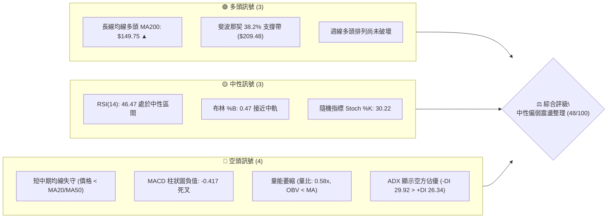
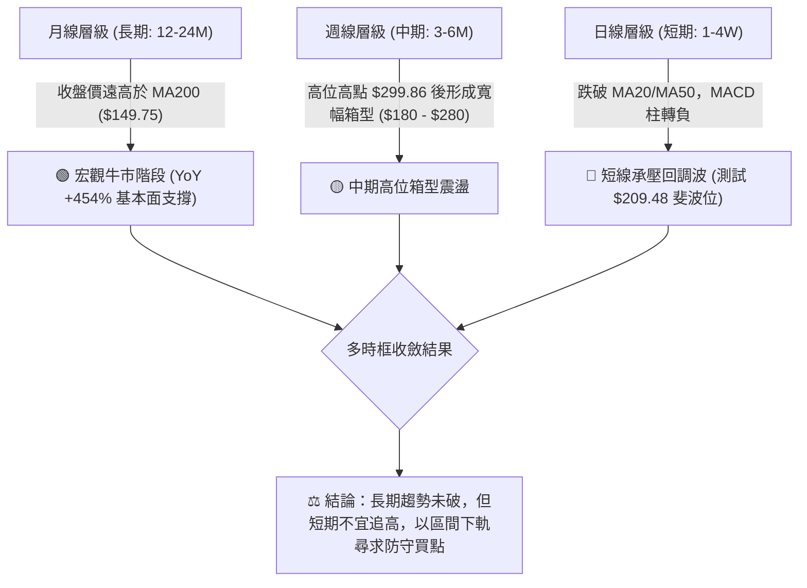
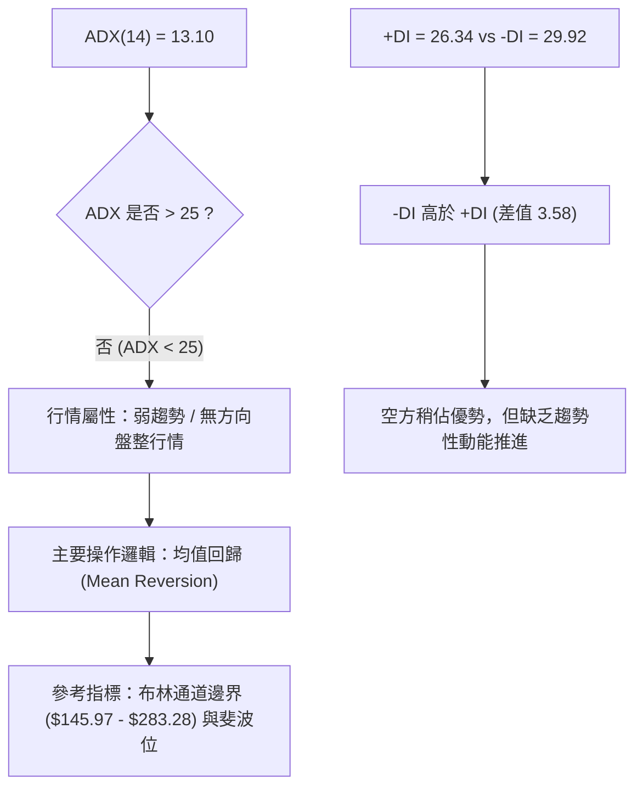
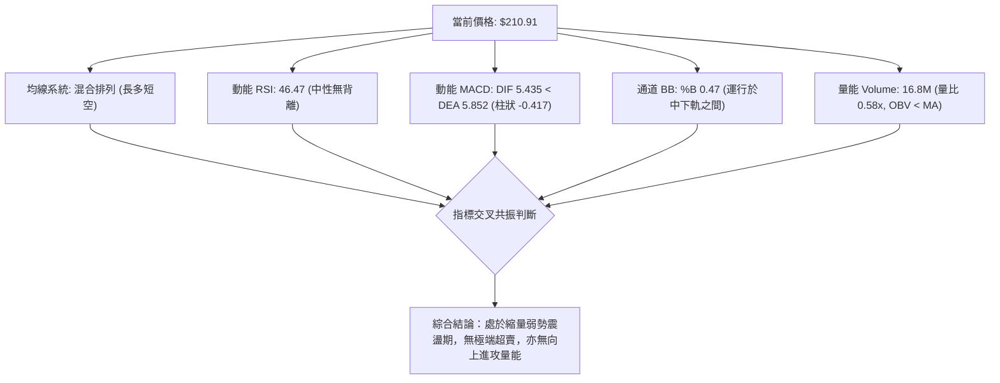
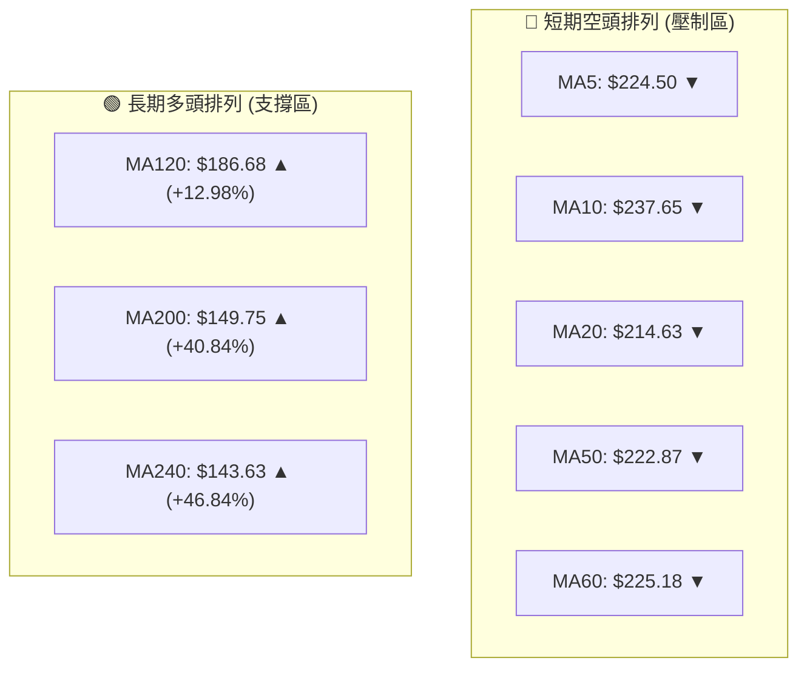
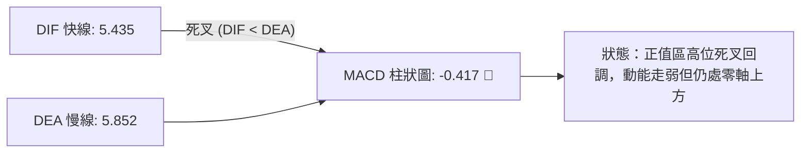
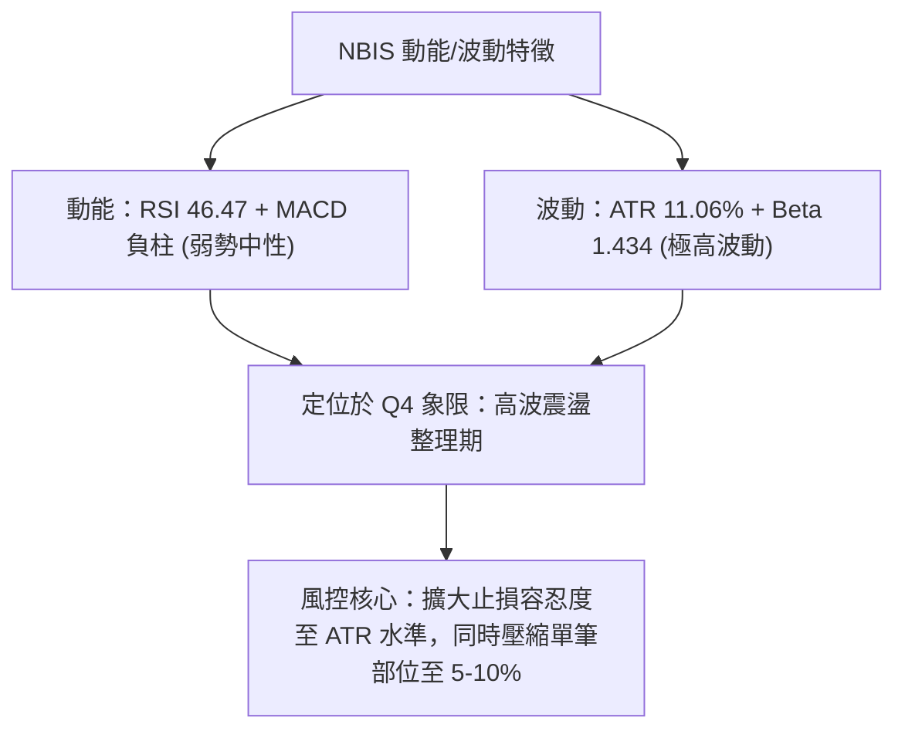
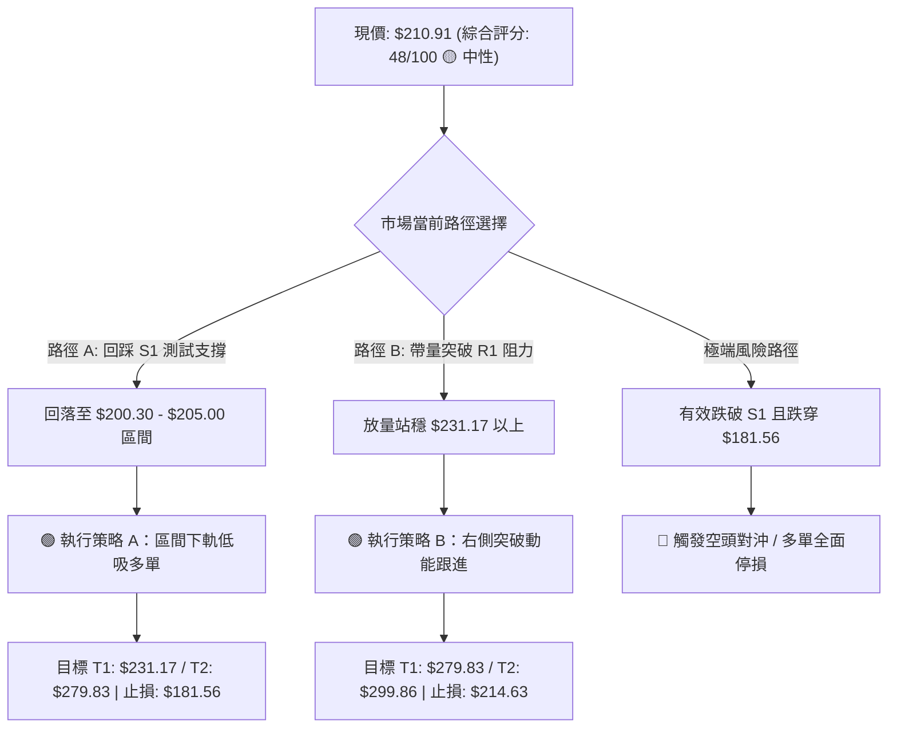
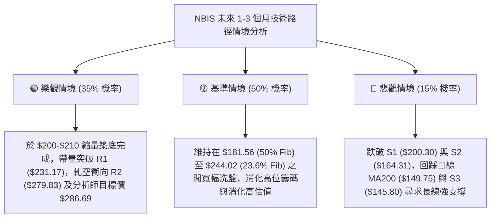

# NBIS 技術分析報告

> **報告日期**：2026-08-25 ｜ **語言**：繁體中文 ｜ **數據來源**：Yahoo Finance ｜ **當前價格**：$210.91

---

## 目錄

| 章節 | 內容 |
|------|------|
| [1. 技術面概覽](#1-技術面概覽) | 訊號儀表板、核心指標、評分卡 |
| [2. 趨勢分析](#2-趨勢分析) | 多時框趨勢、長中短期走勢、ADX解讀 |
| [3. 圖表形態分析](#3-圖表形態分析) | 形態識別、K線組合、形態信心度與目標價 |
| [4. 支撐與阻力](#4-支撐與阻力) | 關鍵價位分布、波段高低點聚類、斐波那契回調 |
| [5. 技術指標深度解讀](#5-技術指標深度解讀) | MA/RSI/MACD/布林通道/成交量與OBV |
| [6. 動能與波動率](#6-動能與波動率) | 動能四象限、ATR波動率、Beta係數 |
| [7. 多時框架總結](#7-多時框架總結) | 時框架評分矩陣、多時框收斂結論 |
| [8. 交易策略建議](#8-交易策略建議) | 策略路由、情境階梯、主策略與對沖點 |
| [9. 風險提示與監控](#9-風險提示與監控) | 關鍵監控清單、風險場景、部位風控 |
| [📋 報告總結](#-報告總結) | 核心總結儀表板與策略摘要 |

---

## 1. 技術面概覽

### 🎯 技術訊號儀表板

NBIS 當前處於「長多中震盪、短線弱勢回踩」的混合技術結構。長期均線（MA120/MA200/MA240）向上發散，但短期動能受制於 MA20/MA50 壓制，MACD 柱狀圖翻負，ADX(14) 為 13.10，顯示市場正式進入無方向的弱勢盤整期。



---

### 📊 核心指標速覽表

| 指標類別 | 指標名稱 | 當前數值 | 訊號 | 解讀 |
|:---|:---|:---|:---:|:---|
| **價格** | 當前價格 (Close) | $210.91 | 🟡 | 位於52週區間 62.4%，處於高位回檔中繼 |
| **均線** | MA20 (短線生命線) | $214.63 | 🔴 | 價格在 MA20 下方 (-1.73%)，短線承壓 |
| **均線** | MA50 (中期趨勢線) | $222.87 | 🔴 | 價格在 MA50 下方 (-5.37%)，中期轉入整理 |
| **均線** | MA200 (長期牛熊線)| $149.75 | 🟢 | 價格在 MA200 上方 (+40.84%)，長牛架構穩固 |
| **動能** | RSI(14) | 46.47 | 🟡 | 位於 40–50 中性偏弱區，無超買超賣極端 |
| **動能** | MACD (12,26,9) | 5.435 / 5.852 (Hist -0.417) | 🔴 | 柱狀圖轉負，DIF 下穿 DEA 形成死叉修正 |
| **趨勢** | ADX(14) / DMI | ADX: 13.10 (+DI: 26.34, -DI: 29.92) | 🟡 | ADX < 25 代表無強趨勢，盤整主導，空方微幅領先 |
| **通道** | 布林通道 (%B) | 0.47 (上軌 $283.28 / 下軌 $145.97) | 🟡 | 價格貼近中軌 ($214.63)，通道維持寬幅擴張 |
| **量能** | 成交量 / 20日均量 | 16,817,431 / 28,900,142 | 🔴 | 量比 0.58x，量能衰退，OBV 低於均線 |
| **波動** | ATR(14) | $23.33 (11.06%) | 🔴 | 單日絕對波動極大，屬於典型高 Beta 成長股特徵 |

---

### 🏆 技術評分卡

```
╔══════════════════════════════════════════════════════════════════╗
║               NBIS 技術維度量化評分卡 (2026-08-25)               ║
╠══════════════════════════════════════════════════════════════════╣
║ 趨勢強度 (ADX/方向)   ███████░░░░░░░░░░░░░  35/100 🔴 弱勢盤整    ║
║ 動能指標 (RSI/MACD)   ████████░░░░░░░░░░░░  40/100 🔴 偏空回檔    ║
║ 支撐穩定度 (Fib/聚類) ██████████████░░░░░░  70/100 🟢 支撐密集    ║
║ 成交量配合 (Volume/OBV)██████░░░░░░░░░░░░░░  30/100 🔴 量能疲弱    ║
║ 形態完整度 (結構確認) ███████████░░░░░░░░░  55/100 🟡 區間收斂    ║
║ 均線排列 (短中長期)   ████████████░░░░░░░░  60/100 🟡 長多短空    ║
╠══════════════════════════════════════════════════════════════════╣
║ 綜合技術評分          █████████░░░░░░░░░░░  48/100 🟡 中性觀望    ║
║ 建議交易方針          區間操作 / 等待回踩 S1 測試或帶量突破 R1   ║
╚══════════════════════════════════════════════════════════════════╝
```

---

## 2. 趨勢分析

### 🌐 多時框趨勢分析

依據多時框收斂原則，中長期（月線、週線）維持強烈上行牛市通道，但短期（日線）受到獲利了結賣壓與量能萎縮影響，處於次級回檔波。



---

### 📈 長期趨勢 — 12個月走勢圖（Unicode）

以下為 NBIS 過去 12 個月（2025-09 至 2026-08）月線收盤走勢與關鍵轉折示意圖：

```
NBIS 月線走勢圖（2025-09 ~ 2026-08）
價格 ($)
$300 ┤                                      
$280 ┤                                  ● $276.17 (2026-06)
$240 ┤                              ● $231.09
$200 ┤                                      ● $210.91 (現價)
     │                                  ● $190.41 (2026-07)
$160 ┤                          ● $138.23
$120 ┤  ● $112.27  ● $130.82
$100 ┤          ● $94.87    ● $103.76
$80  ┤              ● $83.71    ● $91.19
     └─────┬───────┬───────┬───────┬───────┬───────┬───────┬───────► 月份
         2025-09 2025-11 2026-01 2026-03 2026-05 2026-06 2026-08
```

#### 走勢特徵分析表格

| 階段區間 | 起始價 → 結束價 | 漲跌幅 | 趨勢特徵 | 量價表現與技術意涵 |
|:---|:---:|:---:|:---|:---|
| **第一波主升段** (2025/04–2025/10) | $22.73 → $130.82 | **+475.5%** | 單邊爆發性牛市 | AI 算力基礎設施爆發，月線呈大陽線拉升 |
| **中繼洗盤回檔** (2025/11–2026/01) | $130.82 → $83.71 | **-36.0%** | ABC 浪健康修正 | 於 $83-$85 構築堅實底部，確立為中期支撐平台 |
| **第二波強攻浪** (2026/02–2026/06) | $91.19 → $276.17 | **+202.9%** | 主升強勢延伸浪 | 創下 52 週歷史高點 $299.86，成交量大幅放大 |
| **高位寬幅震盪** (2026/07–2026/08) | $276.17 → $210.91 | **-23.6%** | 高位巨震消化籌碼 | 7月急跌至 $190.41 獲買盤支撐，8月反彈後再次收斂 |

---

### 📊 中期趨勢（週線分析）

從近 20 週收盤數據觀察，NBIS 呈現典型的「擴散三角形／寬幅箱型」巨震結構：
1. **阻力聚集區**：在 2026-06-21 觸及週收盤高點 $286.69，並在 2026-08-16 再次反彈衝高至 $277.68 遭遇雙重阻力壓制回落。
2. **支撐聚集區**：在 2026-07-19 下探至週收盤低點 $177.71，隨後在 8 月初於 $187.97–$190.41 區間形成雙底支撐。
3. **最新狀態**：2026-08-30 當週收盤 $210.91，週成交量大幅降至 16,817,431，顯示市場在 $210 附近追空動能枯竭，多空進入觀望平衡。

```
中期週線箱型結構示意圖
$299.86 ┬────────────────────────────────────────── 52W 高點阻力帶 (R3)
        │         ▲ (06/21: $286.69)    ▲ (08/16: $277.68)
$279.83 ┼─────────┼─────────────────────┼────────── 阻力位 R2
        │         │                     │
$231.17 ┼─────────┼───────────▲─────────┼────────── 阻力位 R1 / MA50 ($222.87)
$210.91 ┼─────────┼───────────現價──────┼────────── 斐波 38.2% ($209.48) ◄ 現價
$200.30 ┼─────────┼─────────────────────┼────────── 關鍵支撐 S1
        │         ▼ (07/19: $177.71)    ▼ (08/09: $187.97)
$164.31 ┴────────────────────────────────────────── 次級防守支撐 S2
```

---

### ⚡ 趨勢強度評估（ADX 解讀）



| 指標 | 數值 | 狀態門檻 | 技術解讀 |
|:---|:---:|:---:|:---|
| **ADX(14)** | **13.10** | < 20 (極弱趨勢) | 市場動能極度渙散，不具備單邊趨勢突破條件，切忌追漲殺跌。 |
| **+DI (多方方向)** | **26.34** | > 25 (活躍) | 多方仍保留一定基本盤，未完全潰敗。 |
| **-DI (空方方向)** | **29.92** | > 25 且 > +DI | 空方目前主導短線壓制，但強度不足以引發崩跌。 |

---

## 3. 圖表形態分析

### 🔍 形態識別系統

依據嚴格幾何形態檢驗規則，NBIS 在日線與週線層級呈現**高位大型寬幅收斂箱型（Rectangle Consolidation）**與潛在的**雙底頸線測試結構**。

| 形態名稱 | 信心度 | 判斷依據（引用真實數據） | 完成度 | 目標價（附計算式） |
|:---|:---:|:---|:---:|:---|
| **高位箱型整理** | **75%** | 上軌阻力聚集於 $279.83–$286.69，下軌支撐於 $177.71–$187.97 | 85% | 向上突破：$279.83 + ($279.83 - $177.71) = **$381.95**<br>向下跌破：$177.71 - $102.12 = **$75.59** |
| **局部微型雙底** | **60%** | 低點1 (07/19: $177.71)，低點2 (08/09: $187.97)，頸線為 08/16 高點 $277.68 | 50% | 需突破頸線 $277.68 方可確認；目前價格自頸線回落整理中 |
| **頭肩底 / 旗形** | **30%** | *訊號不足，不予採納幾何形態，僅作指標型與價位支撐解讀* | -- | 不適用 |

---

### 🕯️ 重要K線形態分析

| 週期/月份 | 收盤價 | K線形態特徵 | 技術解讀 | 訊號 |
|:---|:---:|:---|:---|:---:|
| **2026-06** | $276.17 | 歷史天量長上影大陽線 | 衝高至 $299.86 遇強大獲利了結賣壓，留下高位阻力區 | 🟡 |
| **2026-07** | $190.41 | 長下影深幅回調陰線 | 單月重挫回踩 MA120 ($186.68)，低檔湧入長線承接買盤 | 🟡 |
| **2026-08 (進行中)** | $210.91 | 區間震盪小陽星線 | 波動幅度收窄，多空在 38.2% 斐波位 ($209.48) 陷入平衡 | 🟡 |
| **週線 (08-16)** | $277.68 | 爆量長陽線 (1.67億股) | 測試 R2 ($279.83) 未能實質站穩，形成短期多頭竭盡反彈 | 🔴 |
| **週線 (08-23~30)**| $210.91 | 連續縮量回調陰線 | 量能驟降至 16.8M，呈現典型的「縮量回洗」，空方無重殺盤 | 🟢 |

---

### 📉 ASCII 走勢形態示意圖

```
NBIS 週線高位箱型與雙底測試幾何結構
══════════════════════════════════════════════════════════════════
$299.86 ┤                     ▲ 52W 最高點 ($299.86)
        │                    / \
$279.83 ┤   (箱頂 R2) ──────●───●─────── 頸線/箱型頂部 ($277.68 - $279.83)
        │                  /     \     / \
$231.17 ┤ (阻力 R1) ──────●───────\───●───\──── 中間轉換軸 ($231.17)
        │                /         \ /     \
$210.91 ┼───────────────●───────────●───────● ◄ 當前價格 ($210.91 - 38.2% Fib)
        │              /             
$200.30 ┤ (支撐 S1) ──●──────────────────────── 密集支撐平台 ($200.30)
        │            /               ▲ 低點2 ($187.97)
$177.71 ┤ (箱底) ───● (低點1: $177.71)
══════════════════════════════════════════════════════════════════
```

---

## 4. 支撐與阻力

### 🗺️ 關鍵價位分布圖（Unicode）

```
NBIS 關鍵價位結構分布圖 (由 OHLCV 聚類計算)
═══════════════════════════════════════════════════════════════════
$299.86 ║██████████████████████████████║ 強阻力 R3 (52W 歷史極值)
$279.83 ║████████████████████        ║ 阻力 R2 (06/21、08/16 波段雙頂)
$231.17 ║████████████████████████    ║ 關鍵阻力 R1 (05/31收盤 & MA60壓制)
$214.63 ║────────────────────────────║ 短線 MA20 均線壓力帶
$210.91 ╠════════════════════════════╣ ◄ 現價 ($210.91，落於 38.2% 斐波位)
$200.30 ║▓▓▓▓▓▓▓▓▓▓▓▓▓▓▓▓            ║ 近期關鍵支撐 S1 (整數關卡防守)
$181.56 ║▓▓▓▓▓▓▓▓▓▓                  ║ 斐波那契 50.0% 中樞回調位
$164.31 ║████████████████████████    ║ 強支撐 S2 (04月突破平台)
$145.80 ║████████████████████████████║ 核心鐵底 S3 (布林下軌 / MA200)
═══════════════════════════════════════════════════════════════════
```

---

### 🚧 阻力位分析表

| 阻力級別 | 精確價位 | 形成原因（波段高點聚類） | 突破難度 | 技術重要性 |
|:---|:---:|:---|:---:|:---|
| **R1** | **$231.17** | 2026年5月底收盤密集區、MA50 ($222.87) 與 MA60 ($225.18) 反壓區 | 中等 | 短線多頭重奪主控權的必經分水嶺 |
| **R2** | **$279.83** | 2026-06-21 週收盤高點 ($286.69) 與 2026-08-16 反彈頂點 ($277.68) 聚類 | 極高 | 箱型整理上軌，若帶量突破將開啟新一輪主升浪 |
| **R3** | **$299.86** | 52 週最高點，歷史套牢籌碼峰頂 | 極高 | 歷史極值壓力，需全市場宏觀資金配合突破 |

---

### 🛡️ 支撐位分析表

| 支撐級別 | 精確價位 | 形成原因（波段低點聚類） | 守住機率 | 技術重要性 |
|:---|:---:|:---|:---:|:---|
| **S1** | **$200.30** | 近期波段回踩低點聚類、$200 整數心理關卡、38.2% 斐波那契位下沿 | 70% | 短線多頭防守底線，守穩代表維持高位震盪 |
| **S2** | **$164.31** | 2026年4月中旬起漲突破平台、波段低點密集聚類 | 85% | 中期上升趨勢生命線，失守將考驗牛熊分界 |
| **S3** | **$145.80** | 日線 MA200 ($149.75) 與布林通道下軌 ($145.97) 重合區 | 95% | 長期戰略價值支撐區，機構資金底線 |

---

### 📐 斐波那契回調位分析

依據 52 週絕對極值區間（低點 **$63.26** → 高點 **$299.86**，垂直高度 **$236.60**）計算回調位：

```
斐波那契回調階梯 (Fibonacci Retracement)
0.0%  (52W High)   $299.86 ──────────────────────────────────────
23.6%              $244.02 ──────────────────────────────────────
38.2%              $209.48 ────── ◄ 現價 $210.91 正在此關鍵線反覆爭奪
50.0%              $181.56 ────────────────────────────────────── (7月回踩低點 $177.71 止跌處)
61.8%              $153.64 ────────────────────────────────────── (黃金分割強支撐 / 貼近 MA200)
78.6%              $113.89 ──────────────────────────────────────
100.0% (52W Low)   $ 63.26 ──────────────────────────────────────
```

**技術解讀**：
現價 **$210.91** 精確運行於 **38.2% 回調位 ($209.48)** 附近（偏差僅 +0.68%）。在強勢牛市回檔中，38.2% 為極強的「強勢回調支撐位」。7 月份股價一度深跌至 $177.71，即在 50.0% 回調位 ($181.56) 獲得強力買盤支撐並迅速收復。目前股價守在 38.2% 之上，表明長線多頭格局並未因近期波動而轉向。

---

## 5. 技術指標深度解讀

### 🎛️ 指標訊號總覽



---

### 📈 移動平均線排列分析

NBIS 當前呈現「短中期均線空頭排列，長期均線多頭排列」的混合型態：



- **短期結構**：現價 ($210.91) 同時跌破 MA5 ($224.50)、MA10 ($237.65)、MA20 ($214.63) 與 MA50 ($222.87)，短線各均線均呈向下扣抵，對價格形成層層反壓。
- **長期結構**：MA120 ($186.68) 與 MA200 ($149.75) 均呈現陡峭向上發散態勢，提供極具韌性的宏觀底部支撐。

---

### 📉 RSI(14) 分析

```
RSI(14) 數值儀表板
0 ────────────── 30 ──────────────── 50 ──────────────── 70 ────────────── 100
[   超賣區間   ]   [    偏弱區間    ]   [    偏強區間    ]   [   超買區間   ]
                   ▓▓▓▓▓▓▓▓▓▓▓▓▓▓▓▓░ 46.47 (當前位置)
```

- **當前數值**：**46.47**，處於 40–50 之偏弱中性區間。
- **背離檢驗**：
  - **頂背離**：無。股價 8 月中旬衝高至 $277.68 時 RSI 達到 67.2，並未形成高位背離。
  - **底背離**：無。7 月中旬股價探底 $177.71 時 RSI 為 34.8，隨後回升，目前無底背離結構。
- **判斷**：RSI 處於良性冷卻狀態，未進入超賣（<30），顯示尚未引發恐慌性拋售，多頭具備回血空間。

---

### 📊 MACD(12,26,9) 訊號解讀



- **MACD 快慢線**：DIF (5.435) 於零軸上方微幅下穿 DEA (5.852)，柱狀圖（Histogram）為 **-0.417**。
- **深度分析**：MACD 依然維持在零軸之上運行（零軸上死叉），代表當前回調屬於上升趨勢中的「高位整理」，而非轉入熊市單邊下跌。只要 DIF 守在零軸上方並重新形成金叉，將是新一輪攻勢發起點。

---

### 📦 布林通道分析

```
NBIS 布林通道 (20, 2) 結構圖
═══════════════════════════════════════════════════════════════════
$283.28 ┬────────────────────────────────────────── 布林上軌 (Upper Band)
        │
$214.63 ┼───────────────────▲────────────────────── 布林中軌 (MA20: $214.63)
$210.91 ┼───────────────────現價──────────────────── 當前價格 (%B = 0.47)
        │
$145.97 ┴────────────────────────────────────────── 布林下軌 (Lower Band)
═══════════════════════════════════════════════════════════════════
通道寬度 (Bandwidth): 64.0% (高度擴張狀態) ｜ 價格位置: 處於中軌下方邊緣
```

- **%B 指標**：**0.47**（0=下軌，0.5=中軌，1=上軌），價格位於中軌下方附近，屬於通道內部常態波動。
- **通道特徵**：通道寬度達 $137.31，顯示歷史波動劇烈；當前價格在中軌下方尋求支撐，並無跌破下軌之極端超跌風險。

---

### 💹 成交量分析（量價配合度）

- **成交量對比**：最新單日成交量 **16,817,431 股**，相對於 20 日均量（28,900,142 股）量比僅為 **0.58x**。
- **OBV（能量潮）狀態**：`OBV < MA`，能量潮指標低於其移動平均線，顯示資金近期以獲利了結流出為主，缺乏增量進攻資金。
- **量價背離分析**：近兩週自 $277.68 回落至 $210.91 的過程中，成交量由 1.67 億股急劇萎縮至 16.8M 股，呈現顯著的**「量縮價跌」**。量縮價跌意味著下殺並非主力機構恐慌出逃，而是買盤承接暫時退縮，為良性洗盤回調特徵。

---

## 6. 動能與波動率

### ⚡ 動能評估四象限

| 象限 | 動能強度 (RSI/MACD) | 波動率水準 (ATR/Bandwidth) | 當前狀態 | 技術評估與策略 |
|:---:|:---:|:---:|:---:|:---|
| **Q1** | 強 (Bullish) | 低 (Low Volatility) | -- | 穩定主升段（最佳加碼機會） |
| **Q2** | 弱 (Bearish/Neutral) | 低 (Low Volatility) | -- | 低波沉寂期（長線潛伏佈局） |
| **Q3** | 強 (Bullish) | 高 (High Volatility) | -- | 爆發性攻勢（高風險高收益波段） |
| **Q4** | **弱 / 中性 (Neutral-Weak)** | **高 (High Volatility)** | **✓ (NBIS 當前)** | **巨震洗盤期：需嚴控部位，採取區間低吸高拋** |



---

### 📊 ATR 波動率分析

- **ATR(14) 數值**：**$23.33**（佔股價比例高達 **11.06%**）。
- **日內/單日波動解讀**：NBIS 單日平均真實波幅超過 $23，意味著任何日內 5%–10% 的上下波動均屬常態噪音。
- **止損距離建議**：
  - **激進型短線**：1.0 × ATR = **$23.33**（以現價計止損點約 $187.58）。
  - **標準波段型**：1.5 × ATR = **$35.00**（以現價計止損點約 $175.91）。
  - **長線保護型**：2.0 × ATR = **$46.66**（以現價計止損點約 $164.25，恰與 S2 支撐重合）。

---

### 📐 Beta 與市場相關性

- **Beta 係數**：**1.434**。
- **市場敏感度分析**：NBIS 屬於高彈性成長標的，當標普500或那斯達克指數上漲 1% 時，NBIS 預期平均上漲 1.43%；在大盤回檔時亦承擔 1.43 倍回撤壓力。
- **空頭部位比例（Short % Float）**：高達 **27.6%**（Short Ratio 2.78 天），顯示市場存在大量空頭籌碼。一旦價格向上突破關鍵阻力 R1 ($231.17)，高空頭比例極易引發「軋空行情（Short Squeeze）」。

---

## 7. 多時框架總結

### 📋 時框架評分表

| 時框架 | 趨勢方向 | 動能狀態 | 均線排列 | 形態結構 | 綜合評分 | 交易指導建議 |
|:---|:---:|:---:|:---:|:---:|:---:|:---|
| **短期 (日線)** | 🔴 偏空回調 | RSI 46.5 / MACD 死叉 | 價格 < MA20/50 | 跌破短期均線尋求支撐 | **40/100** | 暫停追多，等待回踩 S1 止跌訊號 |
| **中期 (週線)** | 🟡 箱型震盪 | 週 MACD 走平 / RSI 46.5 | 位於 MA20 上方 | $177 - $280 寬幅箱型 | **55/100** | 於箱體下半區分批低吸，箱頂減碼 |
| **長期 (月線)** | 🟢 強烈多頭 | 2年漲幅近 10 倍 | MA120/200 大幅向上 | 宏觀主升浪中繼整理 | **75/100** | 長線多頭趨勢不變，逢深幅回檔加碼 |

---

### 🔲 綜合訊號矩陣

| 技術維度 | 短期 (日線) | 中期 (週線) | 長期 (月線) | 多時框共振結論 |
|:---|:---:|:---:|:---:|:---|
| **趨勢方向** | 🔴 空頭佔優 (-DI 29.9) | 🟡 橫盤整理 (ADX 13.1) | 🟢 牛市多頭 (遠高於 MA200) | 長多中震盪，短線修正洗盤 |
| **關鍵阻力** | MA20 ($214.63) | R1 ($231.17) | R2 ($279.83) / R3 ($299.86) | $231.17 為中期多空分水嶺 |
| **關鍵支撐** | S1 ($200.30) | 50% Fib ($181.56) / S2 ($164.31) | MA200 ($149.75) / S3 ($145.80) | $200.30 與 $181.56 構成核心防線 |
| **動能訊號** | 🔴 弱勢整理 | 🟡 中性降溫 | 🟢 強勁維持 | 動能指標良性釋放超買壓力 |

---

### ⚖️ 多時框收斂結論

> **收斂裁決依據（嚴格規則 14）**：
> 1. 當前 **ADX(14) = 13.10 (< 25)**，技術面確立為**「無單邊趨勢之盤整行情」**。
> 2. 依規則，盤整行情中中長期均線方向提供大背景支撐，交易應以**日線布林通道與關鍵支撐阻力區間**為主導。
> 3. **唯一方向性結論**：**【中性偏多觀望，區間下軌低吸】**。短線雖受制於均線壓制，但長牛基底與 38.2% 斐波那契位 ($209.48) 提供堅實支撐，禁止在此盲目追空，策略核心為「耐心等待回踩 S1 ($200.30) 確認支撐後逢低佈局」。

---

## 8. 交易策略建議

### 🗺️ 策略決策流程圖



---

### 🧭 策略路由

- **綜合技術評分**：**48 / 100（中性區間 40–60）**。
- **主策略方向**：**【區間操作策略（Range-Bound Trading）— 等待支撐確認或突破確認】**。
  - 當前不盲目開立大額市價單，以 $200.30–$279.83 箱型為基準進行高拋低吸。

---

### 🎯 價格情境階梯（Price Scenarios）

所有價位均嚴格引用自關鍵數據聚類與斐波那契計算結果：

| 觸發條件 | 第一目標 (T1) | 第二目標 (T2) | 後續延伸 (T3) | 情境含義與技術解讀 |
|:---|:---:|:---:|:---:|:---|
| **向上放量突破 R1 ($231.17)** | **$279.83 (R2)** | **$299.86 (R3)** | **$381.95 (形態目標)** | 短線轉強，完成箱底回踩確認，發起主升浪攻勢 |
| **維持現價 ($200.30 - $231.17)** | **$214.63 (MA20)** | **$225.18 (MA60)** | **$231.17 (R1)** | 處於 38.2% 斐波位窄幅震盪，多空進行籌碼換手 |
| **向下跌破 S1 ($200.30)** | **$181.56 (50% Fib)** | **$164.31 (S2)** | **$145.80 (S3/MA200)** | 中期轉弱，回撤至 50% 斐波位或年線進行深度洗盤 |

---

### 📊 情境機率分佈

```
情境機率分佈示意
══════════════════════════════════════════════════════════════════
情境一：區間震盪蓄勢 (40 - 60天)      ████████████████████  50%
情境二：回踩企穩後向上突破 R1/R2     ██████████████        35%
情境三：跌破 S1 引發深度回調至 S2/S3   ██████                15%
══════════════════════════════════════════════════════════════════
```

| 情境劃分 | 機率估計 | 主要技術依據 |
|:---|:---:|:---|
| **情境一：區間寬幅震盪** | **50%** | ADX = 13.10 極度低迷，OBV 與成交量萎縮，布林帶寬度大，市場缺乏單邊資金驅動。 |
| **情境二：回踩企穩向上** | **35%** | 長期均線多頭排列穩固，高空頭比例 (27.6%) 提供潛在軋空動能，分析師共識強烈看多 ($286.69)。 |
| **情境三：跌破深度探底** | **15%** | 若整體宏觀市場流動性緊縮，導致短線空頭 (-DI 29.92) 擴大下殺跌破 $200 整數關卡。 |

---

### 🟢 主策略詳情

| 策略要素 | 策略 A：左側區間低吸策略（優先推薦） | 策略 B：右側突破追隨策略（確認訊號） |
|:---|:---|:---|
| **適用時機** | 股價回踩 S1 支撐區間縮量企穩 | 股價放量突破 R1 阻力位確認反轉 |
| **進場條件** | 價格觸及 $200.30–$205.00 且 1H/4H RSI 超賣回升 | 日線收盤價明確突破並站穩 **$231.17**，成交量 > 28M |
| **進場價格** | **$202.00** | **$232.50** |
| **目標價 T1** | **$231.17** (R1 / +14.44%) | **$279.83** (R2 / +20.36%) |
| **目標價 T2** | **$279.83** (R2 / +38.53%) | **$299.86** (R3 / +28.97%) |
| **止損價格** | **$181.56** (50.0% 斐波那契位 / -10.12%) | **$214.63** (跌回 MA20 之下 / -7.69%) |
| **風險報酬比** | **1 : 3.81** (以 T2 計算) | **1 : 3.77** (以 T2 計算) |
| **成功機率** | **65%** | **60%** |
| **建議倉位** | **8% - 10%**（高波動標的嚴控倉位） | **10% - 12%** |

---

### 🔴 反向風險觸發點（對沖提示）

若發生以下技術破位事件，主策略多頭觀點立即失效，應執行風控：
1. **多頭停損/對沖點**：日線收盤價**跌破 $181.56（50.0% 斐波那契位）**，代表 7 月以來的反彈結構徹底破壞，應立即平倉多單或建立賣權（Put Option）保護，下行目標將指向 S2 ($164.31) 及 S3 ($145.80)。
2. **放量跌破 S1 ($200.30)**：若成交量放大至 3,000 萬股以上且收在 $200.30 之下，應主動將多頭部位砍半。

---

### ⭐ 整體訊號強度評星

```
╔══════════════════════════════════════════════════╗
║ 做多訊號強度：  ★★★☆☆  (3.0 / 5星 - 長多短震)   ║
║ 做空訊號強度：  ★★☆☆☆  (2.0 / 5星 - 下有鐵底)   ║
║ 整體技術可信度：★★★★☆  (4.0 / 5星 - 價位聚類明確)║
╚══════════════════════════════════════════════════╝
```

---

## 9. 風險提示與監控

### ✅ 關鍵監控指標 Checklist

```
╔══════════════════════════════════════════════════════════════════╗
║               NBIS 交易日常技術監控清單 (Checklist)              ║
╠══════════════════════════════════════════════════════════════════╣
║ [ ] 價格是否站回 MA20 ($214.63) 之上？ (短線轉強首要訊號)        ║
║ [ ] RSI(14) 是否向上突破 50 中軸？                               ║
║ [ ] MACD 柱狀圖是否由負轉正 (Hist > 0) 形成零軸上金叉？           ║
║ [ ] 單日成交量是否回升突破 2,890 萬股 (超越 20日均量)？          ║
║ [ ] ADX 是否開始從 13.10 上升並伴隨 +DI 突破 30？                ║
║ [ ] 關鍵支撐 S1 ($200.30) 與 38.2% 斐波位 ($209.48) 是否收盤守穩？║
╚══════════════════════════════════════════════════════════════════╝
```

---

### ⚠️ 風險場景分析



---

### 🛡️ 風險管理重要提醒

1. **ATR 波動風險匹配**：NBIS 單日 ATR 高達 **$23.33 (11.06%)**，且 Beta 為 **1.434**。在建立部位時，單筆停損金額不可超過總投資組合淨值的 **1.0%–1.5%**。
2. **高空頭部位雙刃劍**：Short % Float 達 **27.6%**，此類標的在面臨利多時易出現單日 15%–20% 的暴漲軋空，但在流動性缺失時亦可能出現非理性跳空下殺，**嚴格禁止使用過高槓桿**。
3. **財報與估值溢價風險**：目前本益比及自由現金流為負（FCF Yield -17.95%），雖然營收成長率高達 YoY +454.0%，但極高 EV/Revenue (44.25x) 意味著任何業績雜音都可能在技術面上轉化為對 S2 ($164.31) 的考驗。

---

## 📋 報告總結

```
╔══════════════════════════════════════════════════════════════════╗
║                     NBIS 技術分析報告總結                        ║
╠══════════════════════════════════════════════════════════════════╣
║ 報告日期：2026-08-25                                             ║
║ 當前價格：$210.91                                                ║
║ 分析評級：⚖️ 中性觀望 / 區間低吸 (Neutral / Accumulate on Dips) ║
╠══════════════════════════════════════════════════════════════════╣
║ 關鍵維度結論：                                                   ║
║ ├─ 長期趨勢：🟢 強烈看多 (價格遠高於 MA200: $149.75, +40.8%)     ║
║ ├─ 中期趨勢：🟡 高位箱型震盪 ($177.71 - $286.69 寬幅整理)        ║
║ ├─ 短期趨勢：🔴 弱勢縮量回調 (價格 < MA20/MA50，ADX=13.10 弱勢)  ║
║ ├─ 核心支撐：S1: $200.30 ｜ 38.2% Fib: $209.48 ｜ S2: $164.31    ║
║ ├─ 核心阻力：R1: $231.17 ｜ R2: $279.83 ｜ R3: $299.86           ║
║ └─ 華爾街共識目標：$286.69 (16位分析師 Strong Buy)               ║
╠══════════════════════════════════════════════════════════════════╣
║ 最優交易策略推薦：                                               ║
║ 1. 🥇 最佳機會 (策略 A)：回踩 S1 區間 ($200-$205) 低吸買入        ║
║       進場 $202.00 ｜ 止損 $181.56 ｜ 目標 $279.83 (R:R = 1:3.81)║
║ 2. 🥈 次選機會 (策略 B)：右側放量突破 R1 ($231.17) 順勢加碼      ║
║       進場 $232.50 ｜ 止損 $214.63 ｜ 目標 $299.86 (R:R = 1:3.77)║
║ 3. 🥉 保守風控：跌破 $181.56 全面離場觀望，防守 S3 ($145.80)     ║
╚══════════════════════════════════════════════════════════════════╝
```

---

> ⚠️ **免責聲明**：本報告為基於客觀市場技術數據與量化模型之自動分析結果，所有價位、支撐阻力與回調位均源自 OHLCV 歷史數據計算。本報告**僅供學術研究與投資決策參考**，**不構成任何要約、招攬或具體投資建議**。金融市場具有高度風險，投資人應獨立評估風險並自負盈虧。

---

*報告生成時間：2026-08-25 ｜ 數據來源：Yahoo Finance ｜ 分析架構：多時框技術分析模型*