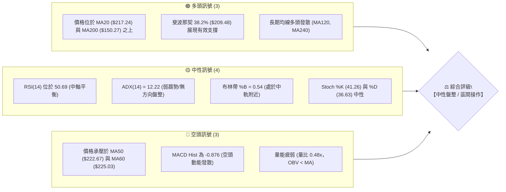
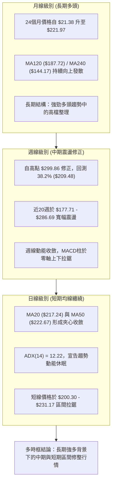
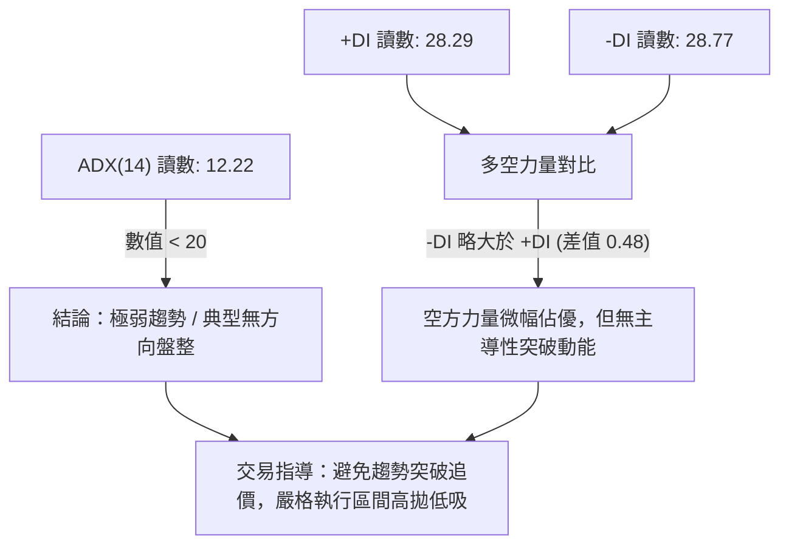
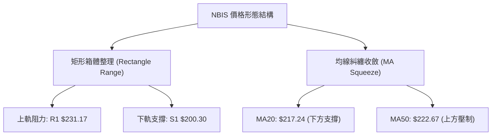
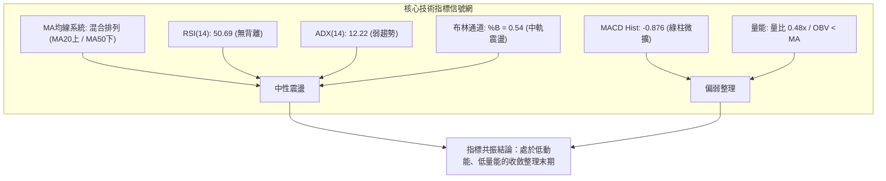
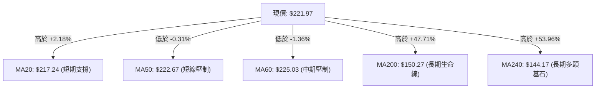
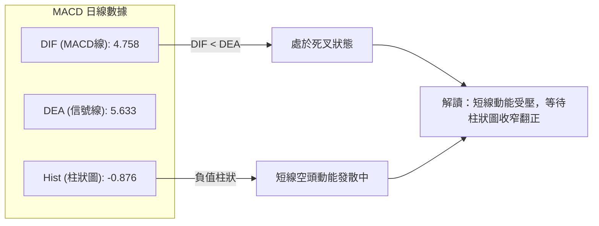
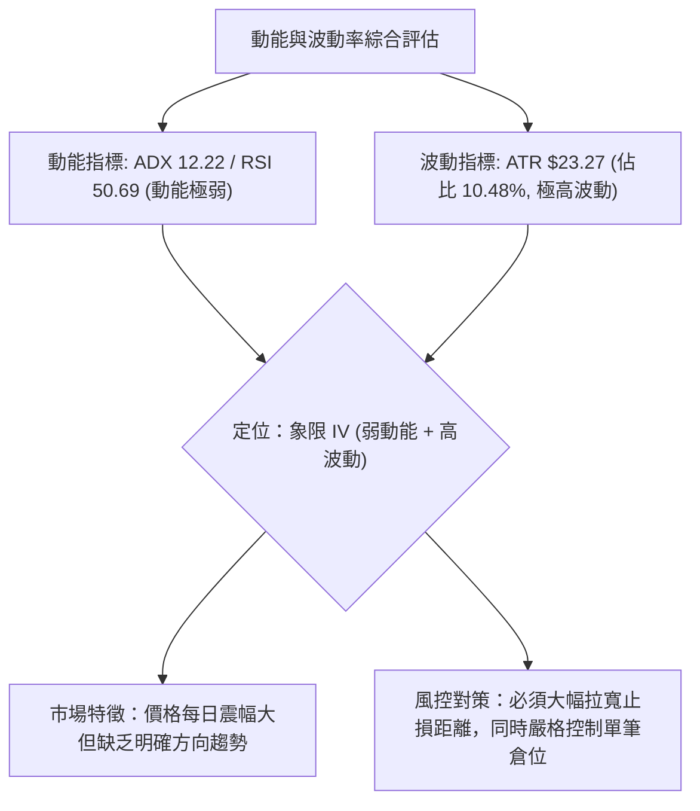
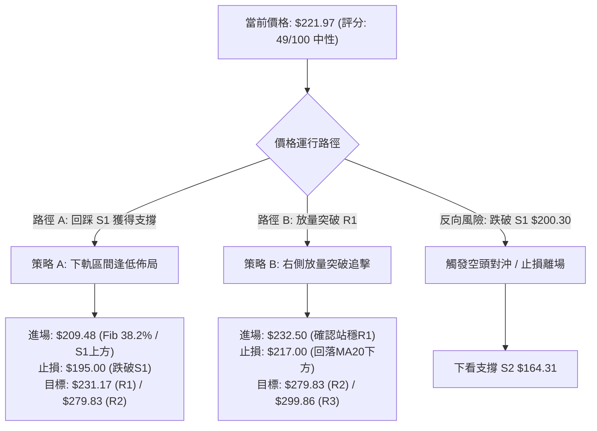
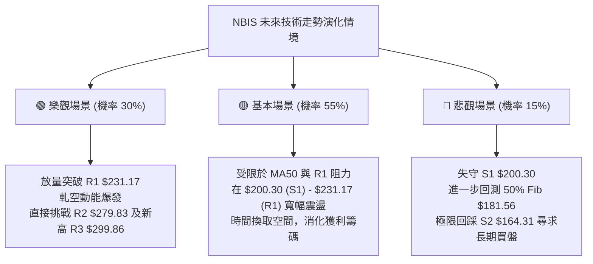

# NBIS 技術分析報告

> **報告日期**：2026-08-26 ｜ **語言**：繁體中文 ｜ **數據來源**：Yahoo Finance ｜ **當前價格**：$221.97

---

## 目錄

| 章節 | 內容 |
|------|------|
| [1. 技術面概覽](#1-技術面概覽) | 訊號儀表板、核心指標、評分卡 |
| [2. 趨勢分析](#2-趨勢分析) | 多時框趨勢、長中短期走勢 |
| [3. 圖表形態分析](#3-圖表形態分析) | 形態識別、K線組合、目標價 |
| [4. 支撐與阻力](#4-支撐與阻力) | 關鍵價位、斐波那契回調 |
| [5. 技術指標深度解讀](#5-技術指標深度解讀) | MA/RSI/MACD/布林/成交量 |
| [6. 動能與波動率](#6-動能與波動率) | 動能評估、ATR、Beta |
| [7. 多時框架總結](#7-多時框架總結) | 時框架評分矩陣 |
| [8. 交易策略建議](#8-交易策略建議) | 多空策略、風險報酬比 |
| [9. 風險提示與監控](#9-風險提示與監控) | 監控指標、風險場景 |
| [10. 報告總結](#-報告總結) | 總結儀表板與核心結論 |

---

## 1. 技術面概覽

### 🎯 技術訊號儀表板



### 📊 核心指標速覽表

| 指標類別 | 指標名稱 | 當前數值 | 訊號 | 解讀 |
|----------|----------|----------|------|------|
| **價格** | 當前價格 | $221.97 | 🟡 | 位於52週區間 67.1%，處於近期回調後的修復盤整期 |
| **均線** | MA20 | $217.24 | 🟢 | 價格在MA20上方 (+2.18%)，短期下檔具備均線支撐 |
| **均線** | MA50 | $222.67 | 🔴 | 價格在MA50下方 (-0.31%)，面臨中短期均線反壓 |
| **均線** | MA200 | $150.27 | 🟢 | 價格遠高於MA200 (+47.71%)，長期多頭基底穩固 |
| **動能** | RSI(14) | 50.69 | 🟡 | 處於50多空分水嶺，無超買或超賣現象 |
| **動能** | MACD | 4.758 (Hist: -0.876) | 🔴 | MACD線低於訊號線 (5.633)，柱狀圖為負，短線動能偏空 |
| **波動** | ATR(14) | $23.27 | 🔴 | ATR佔比達 10.48%，屬於極高波動標的 |
| **趨勢** | ADX(14) | 12.22 | 🟡 | ADX < 25 表明處於無趨勢的寬幅震盪行情 |
| **量能** | 量比 (Volume Ratio) | 0.48x | 🔴 | 日成交量 13.45M 遠低於20日均量 28.13M，量能萎縮 |

### 🏆 技術評分卡

```
╔══════════════════════════════════════════════════════════════════╗
║                 NBIS 技術評分卡 (2026-08-26)                     ║
╠══════════════════════════════════════════════════════════════════╣
║ 趨勢強度 (ADX=12.22)   ████░░░░░░░░░░░░░░░░  24/100 🔴 弱趨勢/盤整 ║
║ 動能指標 (RSI/MACD)    ██████████░░░░░░░░░░  48/100 🟡 多空中性   ║
║ 支撐穩定度 (Fib/S1)    ██████████████░░░░░░  70/100 🟢 支撐明確   ║
║ 成交量配合 (量比 0.48) ████░░░░░░░░░░░░░░░░  20/100 🔴 量能匱乏   ║
║ 形態完整度 (箱體整理)  ████████████░░░░░░░░  60/100 🟡 區間震盪   ║
║ 均線排列 (混合纏繞)    ██████████░░░░░░░░░░  52/100 🟡 多空交錯   ║
╠══════════════════════════════════════════════════════════════════╣
║ 綜合技術評分           ██████████░░░░░░░░░░  49/100 ⚖️ 中性觀望   ║
╚══════════════════════════════════════════════════════════════════╝
```

---

## 2. 趨勢分析

### 🌐 多時框趨勢分析



### 📈 長期趨勢 — 12個月走勢圖（Unicode）

```
NBIS 月線走勢圖（過去12個月：2025-09 至 2026-08）
價格 ($)
$300 ┤                                           
$276 ┤                                   ●(06月: $276.17)
$231 ┤                              ●(05月)
$221 ┤━━━━━━━━━━━━━━━━━━━━━━━━━━━━━━━━━━━━━━━━━●(現價: $221.97)
$190 ┤                                       ●(07月)
$138 ┤                         ●(04月)
$130 ┤ ●(25-10: $130.82)
$112 ┤●(25-09)
$103 ┤                    ●(03月)
$94  ┤    ●(11月)    ●(02月)
$83  ┤        ●(12月)●(01月)
     └─────────────────────────────────────────────────────
       09  10  11  12  01  02  03  04  05  06  07  08 (月份)
```

**走勢特徵分析表格**：

| 階段區間 | 時間跨度 | 起訖價格 | 漲跌幅 | 走勢特徵與結構解讀 |
|----------|----------|----------|--------|--------------------|
| **第 1 階段：首波拉升** | 2025-09 ~ 2025-10 | $112.27 → $130.82 | +16.52% | 突破前期底部平台，開啟主升浪預備期 |
| **第 2 階段：深幅回洗** | 2025-10 ~ 2025-12 | $130.82 → $83.71 | -36.01% | 獲利了結賣壓沉重，回測低檔打出階段底部 $83.71 |
| **第 3 階段：築底蓄勢** | 2026-01 ~ 2026-03 | $85.19 → $103.76 | +21.80% | 均線系統逐漸走平收斂，底部逐步墊高 |
| **第 4 階段：主升爆發** | 2026-03 ~ 2026-06 | $103.76 → $276.17 | +166.16% | 強力多頭推進，突破歷史新高，創下 $299.86 高點 |
| **第 5 階段：高檔劇震** | 2026-06 ~ 2026-08 | $276.17 → $221.97 | -19.63% | 衝高後大幅震盪，目前在 $190.41 ~ $277.68 區間修整 |

### 📊 中期趨勢（週線分析）

```
週線關鍵壓力與支撐示意圖
════════════════════════════════════════════════════════════════
  $299.86 ┬  52週最高點 / 歷史阻力 (0.0% Fib)
          │  ▲ 阻力區間 R2-R3 ($279.83 - $299.86)
  $231.17 ┼  波段壓力 R1 / 近期收盤頸線阻力 ($231.09)
  $221.97 ┼─ ◄───【當前現價 $221.97】 (受制於 MA50 $222.67)
  $209.48 ┼  斐波那契 38.2% 重要防守位
  $200.30 ┼  波段支撐 S1 (近期下檔防禦中樞)
          │  ▼ 深度回調支撐區 S2 ($164.31) / 50.0% Fib ($181.56)
  $150.27 ┴  長期生命線 MA200 ($150.27) / 61.8% Fib ($153.64)
════════════════════════════════════════════════════════════════
```

### ⚡ 趨勢強度評估（ADX 解讀）



**ADX 趨勢強度對照解讀**：
- **當前讀數**：12.22（處於 0–20 區間）
- **趨勢狀態**：無趨勢行情（Range-bound Market）
- **策略指導**：依據多時框收斂規則（ADX < 25），中期趨勢動能處於休眠期，日線布林通道上下軌（$151.89 - $282.59）及關鍵支撐阻力（$200.30 - $231.17）為核心交易邊界。

---

## 3. 圖表形態分析

### 🔍 形態識別系統



**圖表形態信心度評估表**：

| 形態名稱 | 信心度 | 判斷依據（引用技術數據） | 完成度 | 目標價（附精確計算式） |
|----------|--------|--------------------------|--------|------------------------|
| **高檔箱體震盪** | **75%** | 價格受限於阻力 R1 $231.17 與支撐 S1 $200.30 之間，且近期多週收盤於 $219-$232 密集纏繞 | 80% | 向上突破目標：$231.17 + ($231.17 - $200.30) = **$262.04**<br>向下跌破目標：$200.30 - ($231.17 - $200.30) = **$169.43** |
| **均線三角收斂** | **65%** | 短期 MA5 ($219.20)、MA20 ($217.24) 與中期 MA50 ($222.67)、MA60 ($225.03) 空間壓縮至 3.5% 內 | 85% | 待方向選擇，突破 R1 測 **$279.83** (R2)；跌破 S1 測 **$164.31** (S2) |
| **雙底形態** | **35%** | 數據中雖有 $177.71 (07-19) 與 $187.97 (08-09) 兩次回踩，但反彈至 $277.68 後迅速回落至 $221.97，頸線未站穩 | 40% | *信心度不足 50%，依規則不予採納為主要交易依據，僅做指標型解讀* |

### 🕯️ 重要K線形態分析

| 日期 / 月份 | 收盤價 | 關鍵技術形態 | 形態深度解讀 | 信號屬性 |
|-------------|--------|--------------|--------------|----------|
| **2026-06** | $276.17 | 創高長上影陽線 | 觸及 52週高點 $299.86 後遭遇劇烈獲利了結賣壓 | 🟡 滯漲警訊 |
| **2026-07** | $190.41 | 大陰線深幅回調 | 單月暴跌回測斐波那契 50% ($181.56) 附近，清洗浮額 | 🔴 空頭釋放 |
| **2026-08-16** | $277.68 | 巨量長陽反彈 | 週成交量激增至 167.5M，週MACD柱翻正 (+9.868) | 🟢 多頭反撲 |
| **2026-08-23** | $219.13 | 長陰吞沒回落 | 週跌幅顯著，量能維持 141.7M 高檔，多空換手劇烈 | 🔴 漲勢受阻 |
| **2026-08-30 (即時)** | $221.97 | 縮量十字星整理 | 日成交量萎縮至 13.45M，多空雙方在 MA50 附近陷入膠著平衡 | 🟡 方向待定 |

### 📉 ASCII 走勢形態示意圖

```
箱體震盪與均線收斂結構示意圖
$240.00 ┤                                           
$231.17 ┼───────────────────┬───────────────┬────── 箱體上軌 / R1 阻力線
$225.03 ┼                   │  MA60 反壓    │       
$222.67 ┼───────────────────┼──MA50 壓制────┼────── 短線多空臨界點
$221.97 ┼···················│··【現價 $221.97】······ 處於收斂三角形末端
$217.24 ┼───────────────────┼──MA20 支撐────┼────── 
$209.48 ┼                   │  Fib 38.2%    │       
$200.30 ┼───────────────────┴───────────────┴────── 箱體下軌 / S1 支撐線
$190.00 ┤
```

---

## 4. 支撐與阻力

### 🗺️ 關鍵價位分布圖（Unicode）

```
NBIS 價位結構分布圖 (由 OHLCV 與斐波那契精確計算)
═════════════════════════════════════════════════════════════════
$299.86 ║████████████████████████████████████████║ 歷史極值強阻力 R3 / 52W High
$282.59 ║▓▓▓▓▓▓▓▓▓▓▓▓▓▓▓▓▓▓▓▓▓▓▓▓▓▓▓▓▓▓▓▓        ║ 布林帶上軌 (BB Upper)
$279.83 ║██████████████████████████████          ║ 波段關鍵阻力 R2
$244.02 ║▓▓▓▓▓▓▓▓▓▓▓▓▓▓▓▓▓▓▓▓▓▓                  ║ 斐波那契 23.6% 回調位
$231.17 ║████████████████████                    ║ 短線突破阻力 R1 (近一年高點聚類)
$222.67 ║────────────────────────────────────────║ 中期均線 MA50 壓力位
$221.97 ╠════════════════════════════════════════╣ ◄───【當前市場現價 $221.97】
$217.24 ║────────────────────────────────────────║ 短期均線 MA20 / 布林中軌
$209.48 ║▓▓▓▓▓▓▓▓▓▓▓▓▓▓▓▓                        ║ 斐波那契 38.2% 回調位
$200.30 ║████████████████████                    ║ 近期核心支撐 S1 (波段低點聚類)
$181.56 ║▓▓▓▓▓▓▓▓▓▓▓▓▓▓                          ║ 斐波那契 50.0% 多空分水嶺
$164.31 ║██████████████████████████              ║ 中期強支撐 S2
$153.64 ║▓▓▓▓▓▓▓▓▓▓                              ║ 斐波那契 61.8% 黃金分割位
$150.27 ║████████████████████████████████████████║ 長期牛熊分界 MA200
$145.80 ║████████████████████████████████        ║ 深度極限支撐 S3
═════════════════════════════════════════════════════════════════
```

### 🚧 阻力位分析表

| 阻力級別 | 精確價位 | 距離現價 | 形成原因與技術共振 | 突破難度 | 重要性評級 |
|----------|----------|----------|--------------------|----------|------------|
| **R1** | **$231.17** | +4.14% | 近一年波段高點密集聚類區，與 05-31 收盤價 ($231.09) 高度共振 | 中等 | 🟢🟢🟢 (短線多空分水嶺) |
| **R2** | **$279.83** | +26.07% | 2026年6月及8月中旬（$277.68）多次上攻受阻之波段高點聚類 | 極高 | 🟢🟢🟢🟢 (中期多頭目標) |
| **R3** | **$299.86** | +35.09% | 52週歷史最高點（Fib 0.0%），極強籌碼套牢與心理阻力區 | 極高 | 🟢🟢🟢🟢🟢 (歷史天花板) |

### 🛡️ 支撐位分析表

| 支撐級別 | 精確價位 | 距離現價 | 形成原因與技術共振 | 守住機率 | 重要性評級 |
|----------|----------|----------|--------------------|----------|------------|
| **S1** | **$200.30** | -9.76% | 近一年波段低點聚類區，整數關口防守位，鄰近 Fib 38.2% ($209.48) | 70% | 🟢🟢🟢 (短線回調防線) |
| **S2** | **$164.31** | -25.98% | 波段深幅回調低點聚類，接近 2026年4-5月平台起漲點 ($157.14) | 85% | 🟢🟢🟢🟢 (中期防守底線) |
| **S3** | **$145.80** | -34.32% | 長期強支撐聚類區，與長期生命線 MA200 ($150.27) 及 MA240 ($144.17) 重疊 | 95% | 🟢🟢🟢🟢🟢 (長期牛市堡壘) |

### 📐 斐波那契回調位分析

依據 52 週完整波動區間（低點 **$63.26** → 高點 **$299.86**，總垂直價差 $236.60）精確計算：

- **0.0% (52W High)**: `$299.86` — 歷史最高壓力
- **23.6% 回調位**: `$244.02` — 上方第一回撤阻力位
- **38.2% 回調位**: `$209.48` — **【關鍵支撐】** 現價 $221.97 穩固運行於其上方
- **50.0% 回調位**: `$181.56` — 多空中期平衡分界點
- **61.8% 回調位**: `$153.64` — 黃金分割強支撐位（與 MA200 $150.27 形成雙重共振）
- **78.6% 回調位**: `$113.89` — 深度防守位
- **100.0% (52W Low)**: `$63.26` — 52週最低起漲基準點

**回調結構深度解讀**：
當前現價 `$221.97` 嚴格處於 **23.6% ($244.02)** 與 **38.2% ($209.48)** 的強勢回調區間內。在技術分析理論中，股價在歷經大幅上漲後回調不破 38.2%（$209.48），屬於標準的**強勢整理結構**，意味著中長期多頭主趨勢未遭破壞。

---

## 5. 技術指標深度解讀

### 🎛️ 指標訊號總覽



### 📈 移動平均線排列分析



**均線系統架構解析**：
1. **短中期均線糾纏**：MA5 ($219.20) < MA20 ($217.24) < 現價 ($221.97) < MA50 ($222.67) < MA60 ($225.03) < MA10 ($240.52)。短天期均線呈現多空交錯的混合排列狀態，表明市場短線缺乏單邊方向。
2. **長期均線多頭發散**：MA120 ($187.72) 與 MA240 ($144.17) 維持向上發散，且價格遠在 MA200 ($150.27) 之上，確認大週期依然屬於多頭控制領域。

### 📉 RSI(14) 分析

```
RSI(14) 讀數儀表板
0 ──────────── 30 ────────────────── 50 ────────────────── 70 ──────────── 100
               [    超賣區    ]     │    [   超買區   ]
                                    ▲ (50.69)
進度條: ██████████░░░░░░░░░░ 50.69% 🟡 中性平衡
```

- **區間評估**：RSI(14) 為 **50.69**，精確錨定在 50 中軸線附近，代表當前買方與賣方力道達到暫時性平衡，無超買（>70）或超賣（<30）風險。
- **背離檢驗**：觀察近 20 週數據，價格在 2026-08-16 創波段高點 $277.68 時，RSI 達到 67.2；隨後價格拉回 $221.97，RSI 同步回落至 50.7。**數據顯示無明顯頂背離或底背離現象**，指標真實反映價格運動。

### 📊 MACD(12/26/9) 訊號解讀



- **數值關係**：MACD 線 (4.758) 低於信號線 (5.633)，兩者均維持在零軸之上，MACD Histogram 為 **-0.876**。
- **信號含義**：雙線處於零軸上方代表中長期處於多頭大環境，但柱狀圖為負值且處於死叉修正狀態，警示投資人短線動能尚未恢復，貿然追高風險較大。

### 📦 布林通道分析

```
布林通道結構示意圖 (帶寬: $130.70)
$282.59 ┬────────────────────────────────────────── BB 上軌 (Upper Band)
        │
        │
$221.97 ┼─ ◄───【當前現價 $221.97 (%B = 0.54)】
$217.24 ┼────────────────────────────────────────── BB 中軌 (MA20)
        │
        │
$151.89 ┴────────────────────────────────────────── BB 下軌 (Lower Band)
```

- **帶寬與位置**：BB 上軌為 `$282.59`，中軌 (MA20) 為 `$217.24`，下軌為 `$151.89`。當前 %B 讀數為 **0.54**，顯示價格緊貼布林中軌上方運行。
- **通道特徵**：通道帶寬極寬，上下軌落差達 $130.70。由於現價剛從上軌回調並獲得中軌（$217.24）支撐，當前正處於布林帶內的常態分佈區間，預示後續將在中軌與上軌間尋求再平衡。

### 💹 成交量分析（量價配合度）

- **量能數據對比**：最新日成交量為 **13,455,173**，20日均量為 **28,131,024**，量比僅為 **0.48x**；50日均量為 **22,728,061**。
- **OBV 趨勢**：數據顯示 `OBV < MA`，量能呈現疲弱狀態。
- **量價背離診斷**：近期價格由 $277.68 回落至 $221.97 的過程中，成交量同步由 167.5M 縮減至 30.3M（週級別），屬於典型的**「縮量回調」**，並未出現主力恐慌性出逃的放量殺跌現象。但由於向上反彈時量能亦未能放大（量比 0.48x），顯示買盤追價意願謹慎，量能暫無法支持單邊突破行情。

---

## 6. 動能與波動率

### ⚡ 動能評估四象限

| 象限代號 | 動能維度 (Momentum) | 波動率維度 (Volatility) | 歷史特徵 | 當前狀態定位 |
|----------|---------------------|--------------------------|----------|--------------|
| **象限 I** | 強動能 (ADX>25, RSI>60) | 低波動 (ATR% < 5%) | 穩定單邊牛市 | — |
| **象限 II** | 弱動能 (ADX<20, RSI≈50) | 低波動 (ATR% < 5%) | 窄幅盤整蓄勢 | — |
| **象限 III** | 強動能 (ADX>25, RSI>60) | 高波動 (ATR% > 8%) | 爆發性主升浪 (如2026-05) | — |
| **象限 IV** | **弱動能 (ADX=12.22)** | **高波動 (ATR%=10.48%)** | **寬幅無序震盪 / 洗盤** | **✓ 當前精確定位 (Q4)** |



### 📊 ATR 波動率分析

- **ATR(14) 數值**：**$23.27**（佔當前股價比例高達 **10.48%**）。
- **波動特性解讀**：每日平均波動超過 23 美元，代表 NBIS 具備極高的日內與波段博弈價值，但同時對風險控制提出嚴苛要求。
- **止損距離量化建議**：
  - *激進型日間操作*：1.0 × ATR = **$23.27**
  - *標準波段交易*：1.5 × ATR = **$34.91**
  - *保守防守底線*：2.0 × ATR = **$46.54**

### 📐 Beta 與市場相關性

- **Beta 係數**：**1.434**（高於美股大盤基準 1.0）。
- **市場特徵分析**：該股具備顯著的高彈性特質，當標普500或那斯達克指數上漲 1% 時，NBIS 平均波動幅度為 1.434%。配合機構持股比例高達 **69.1%** 與放空比例 **27.6% (Short Float)**，高 Beta 與高空單比例使得該股在特定消息面催化下極易產生軋空（Short Squeeze）或劇烈雙向洗盤。

---

## 7. 多時框架總結

### 📋 時框架評分表

| 時框架 | 趨勢方向 | 動能狀態 | 均線排列 | 圖表形態 | 綜合評分 | 操作建議 |
|--------|----------|----------|----------|----------|----------|----------|
| **月線 (長期)** | 🟢 強勢多頭 | 🟢 充沛 | 🟢 完美多頭 (MA120/240發散) | 主升浪高檔強勢整理 | **82/100** | 長線多頭續抱，逢大回調加碼 |
| **週線 (中期)** | 🟡 震盪整理 | 🟡 中性平衡 (RSI 50.7) | 🟡 短期回踩中軌 | 寬幅區間整理 ($177-$286) | **54/100** | 區間內高拋低吸，關注邊界 |
| **日線 (短期)** | 🔴 偏弱盤整 | 🔴 疲弱 (Hist -0.876) | 🔴 均線纏繞 (承壓MA50) | 三角形收斂末端 | **42/100** | 耐心等待放量突破確認 |

### 🔲 綜合訊號矩陣

```
時框架訊號矩陣收斂表
┌───────────┬──────────────┬──────────────┬──────────────┬──────────────┐
│ 時框層級  │ 均線系統     │ 動能指標     │ 量能指標     │ 綜合判定     │
├───────────┼──────────────┼──────────────┼──────────────┼──────────────┤
│ 長期 (月) │ 🟢 多頭向上  │ 🟢 多方主導  │ 🟢 歷史級放量│ 🟢 強力看多  │
│ 中期 (週) │ 🟡 夾心震盪  │ 🟡 中軸平衡  │ 🟡 縮量整理  │ 🟡 中性觀望  │
│ 短期 (日) │ 🔴 承壓MA50  │ 🔴 MACD死叉  │ 🔴 量能疲弱  │ 🔴 短線偏弱  │
└───────────┴──────────────┴──────────────┴──────────────┴──────────────┘
```

### ⚖️ 多時框收斂結論

> **依多時框收斂規則（嚴格要求 14）判定**：
> 當前日線 ADX(14) 讀數為 **12.22 (< 25)**，嚴格界定當前市場為**【典型盤整行情】**。
> 根據規則，在盤整行情中，中長期趨勢動能暫時退居背景，**以日線與週線布林通道上下軌、以及波段支撐阻力為主要交易區間**。
> 
> **唯一收斂結論**：**【⚖️ 中性觀望 / 區間震盪操作】（綜合評分 49/100）**。
> 當前日線均線纏繞，多空在 MA20 ($217.24) 與 MA50 ($222.67) 激烈爭奪，短期方向不明朗，主策略採取**區間邊界高拋低吸**與**突破跟進**策略。

---

## 8. 交易策略建議

### 🗺️ 策略決策流程圖



### 🧭 策略路由（依評分卡分流）

- **當前主策略方向 = 【中性區間操作 / 等待突破】（依綜合評分 49/100）**
- **策略指導方針**：綜合評分處於 40–60 之中性區間，禁止在 $221.97 區間中軸盲目下重注。主推**「策略 A：支撐位逢低吸納」**與**「策略 B：右側突破確認跟進」**兩套具備優良風報比的交易計劃。

### 🎯 價格情境階梯（Price Scenarios）

所有價位均嚴格引用技術數據計算之真實關鍵位：

| 觸發條件 | 第一目標 (T1) | 第二目標 (T2) | 後續延伸 (T3) | 情境含義與技術解讀 |
|----------|---------------|---------------|---------------|--------------------|
| **強勢突破 R1 ($231.17)** | **$244.02** (Fib 23.6%) | **$279.83** (R2) | **$299.86** (R3 / 52W High) | 短線盤整結束，重啟主升浪測試歷史高點 |
| **維持現價區間 ($209 - $231)** | **$225.03** (MA60) | **$231.17** (R1) | — | 均線持續收斂，籌碼在布林中軌附近沉澱換手 |
| **有效跌破 S1 ($200.30)** | **$181.56** (Fib 50.0%) | **$164.31** (S2) | **$150.27** (MA200) | 中期結構走弱，回測長期生命線尋求支撐 |

### 📊 情境機率分佈

| 運行情境 | 預估機率 | 主要技術依據與指標支撐 |
|----------|----------|------------------------|
| **情境 1：區間震盪蓄勢** | **55%** | ADX(14) 為 12.22 處於低位，RSI 50.69 處於中軸，量比 0.48x 顯示主力暫無單邊意圖 |
| **情境 2：向上突破衝高** | **30%** | 長期 MA120/MA240 向上發散，月線強多格局未變，分析師共識看好 (目標均價 $286.69) |
| **情境 3：向下破位回踩** | **15%** | 日線 MACD Hist (-0.876) 處於負值，短線受制於 MA50 ($222.67)，空方微幅佔優 |

### 🟢 主策略詳情（精確交易參數）

| 策略要素 | 策略 A（左側：回踩支撐低吸） | 策略 B（右側：突破阻力追擊） |
|----------|------------------------------|------------------------------|
| **適用場景** | 價格回測斐波那契 38.2% 與 S1 企穩 | 日K線帶量突破波段阻力 R1 |
| **進場價格** | **$209.50** (Fib 38.2% $209.48 附近) | **$232.50** (突破 R1 $231.17 確認) |
| **目標價 T1** | **$231.17** (波段阻力 R1) | **$279.83** (關鍵阻力 R2) |
| **目標價 T2** | **$279.83** (關鍵阻力 R2) | **$299.86** (52W 高點 R3) |
| **止損價格** | **$195.00** (跌破 S1 $200.30 及緩衝區) | **$217.00** (跌破 MA20 $217.24 支撐) |
| **潛在利潤 (T1/T2)** | +10.34% / +33.57% | +20.36% / +28.97% |
| **承擔風險** | -6.92% | -6.67% |
| **風險報酬比 (至T2)**| **4.85 : 1** (優異) | **4.34 : 1** (優異) |
| **預估成功率** | 60% | 55% |
| **建議配置倉位** | 10% - 15% 基礎倉位 | 10% 突破加碼倉位 |

### 🔴 反向風險觸發點（風控與對沖提示）

- **關鍵反轉點**：若日K線收盤價**跌破 S1 ($200.30)** 且成交量放大，意味著 38.2% 斐波那契防線失守。
- **對沖處置**：多頭部位必須嚴格執行止損或減倉 50% 以上；激進交易者可佈局空頭對沖，下看第二支撐 **S2 ($164.31)** 及 **50% Fib ($181.56)**。

### ⭐ 整體訊號強度評星

```
╔══════════════════════════════════════════════════════════════════╗
║ 做多訊號強度：★★★☆☆  (3.0/5星) — 中長多頭結構穩固，短線等待買點 ║
║ 做空訊號強度：★★☆☆☆  (2.0/5星) — 僅屬技術性回調，大週期做空風險高 ║
║ 整體訊號可信度：★★★★☆  (4.0/5星) — 支撐阻力明確，指標共振度高   ║
╚══════════════════════════════════════════════════════════════════╝
```

---

## 9. 風險提示與監控

### ✅ 關鍵監控指標 Checklist

```
╔══════════════════════════════════════════════════════════════════╗
║                   NBIS 日常技術監控清單                          ║
╠══════════════════════════════════════════════════════════════════╣
║ [ ] 價位突破監控：日收盤價是否站上 R1 ($231.17) 或跌破 S1 ($200.30)║
║ [ ] 均線動態監控：現價與 MA50 ($222.67) 及 MA20 ($217.24) 的交叉關係║
║ [ ] 動能翻轉監控：MACD Histogram 是否由負翻正 (當前 -0.876)      ║
║ [ ] 趨勢強度監控：ADX(14) 是否由 12.22 向上突破 20-25 啟動趨勢    ║
║ [ ] 成交量能監控：單日成交量是否放大突破 20日均量 (28.13M)       ║
║ [ ] 空頭回補監控：Short Float (27.6%) 是否引發短線軋空行情        ║
╚══════════════════════════════════════════════════════════════════╝
```

### ⚠️ 風險場景分析



### 🛡️ 風險管理重要提醒

1. **極端波動風險**：NBIS 的 ATR 達 **$23.27 (10.48%)**，單日波動極大。普通投資者切忌使用高槓桿，單筆交易虧損上限應嚴格控制在總資金的 **1.0% - 1.5%** 內。
2. **高空單比例與軋空風險**：該股 Short Float 高達 **27.6%**，Short Ratio 為 2.78。若有利多消息刺激放量突破 $231.17，空頭停損買盤將導致股價極速飆升；反之，若跌破支撐，空方打壓亦會加劇。
3. **部位規模公式**：
   $$\text{建議買進股數} = \frac{\text{總帳戶資產} \times 1\%}{\text{進場價} - \text{止損價}}$$
   *範例*：若帳戶資金 $100,000 美元，風險容忍 1% ($1,000)，以策略 A 進場（進場 $209.50，止損 $195.00，價差 $14.50），則建議買入股數為 $1,000 / $14.50 \approx \mathbf{68 \text{ 股}}$。

---

## 📋 報告總結

```
╔══════════════════════════════════════════════════════════════════╗
║                   NBIS 技術分析報告總結儀表板                     ║
╠══════════════════════════════════════════════════════════════════╣
║ 報告日期：2026-08-26            當前價格：$221.97                ║
║ 分析評級：⚖️ 中性觀望 / 區間操作 (技術評分: 49/100)               ║
╠══════════════════════════════════════════════════════════════════╣
║ 關鍵維度技術結論：                                              ║
║ ├─ 長期趨勢：🟢 強勢多頭 (價格遠在 MA200 $150.27 之上，牛市結構) ║
║ ├─ 中期趨勢：🟡 寬幅震盪 (受限於 $177 - $286 週線箱體)          ║
║ ├─ 短期趨勢：🔴 偏弱盤整 (受制於 MA50 $222.67，ADX=12.22 無方向)║
║ ├─ 核心支撐：S1: $200.30 ｜ Fib 38.2%: $209.48 ｜ S2: $164.31  ║
║ ├─ 核心阻力：R1: $231.17 ｜ R2: $279.83 ｜ R3: $299.86        ║
║ └─ 法人共識：強力買進 (16位分析師均價 $286.69，最高 $415.00)     ║
╠══════════════════════════════════════════════════════════════════╣
║ 最優交易策略組合：                                              ║
║ 1. 🥇 最佳機會（左側）：回踩 $209.50 (Fib 38.2%) 佈局，風報比 4.85:1║
║ 2. 🥈 次選機會（右側）：帶量突破 $232.50 (R1) 追擊，風報比 4.34:1║
║ 3. 🥉 保守選擇：空倉觀望，等待 ADX > 20 且 MACD 翻正後再行進場   ║
╚══════════════════════════════════════════════════════════════════╝
```

---

> ⚠️ **免責聲明**：本報告為技術分析研究成果，所有數據、圖表及價位推算均嚴格基於歷史 OHLCV 行情資訊。本報告**僅供學術研究與投資參考**，**不構成任何形式的要約或投資建議**。金融市場具備高度波動風險，投資人應獨立評估風險並自負盈虧。

---

*報告生成時間：2026-08-26 ｜ 數據來源：Yahoo Finance ｜ 分析框架：多時框技術分析模型*