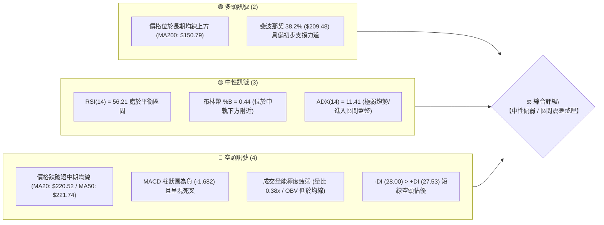
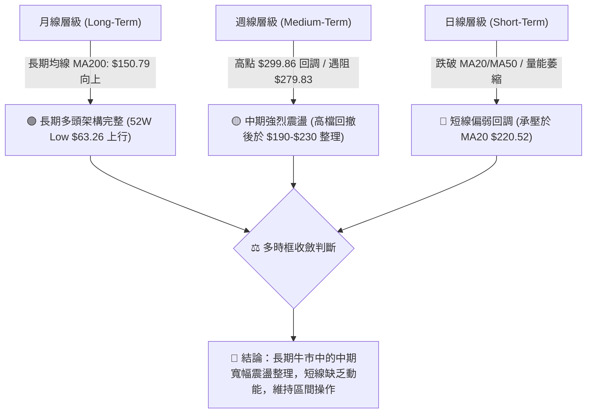
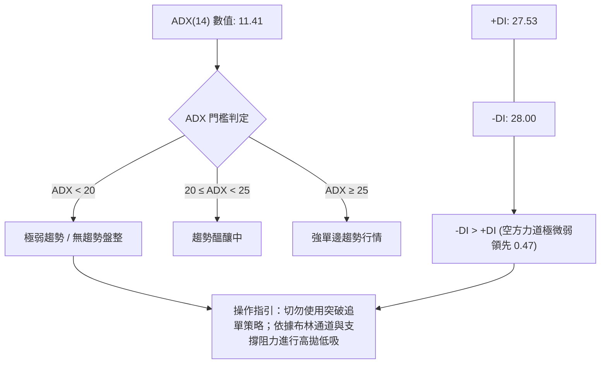
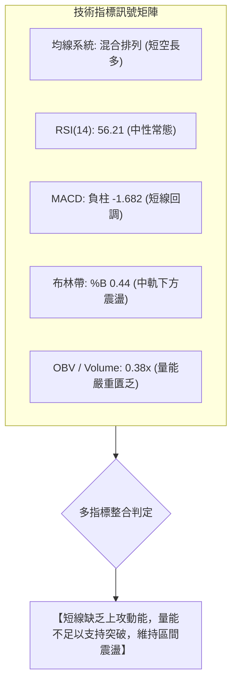
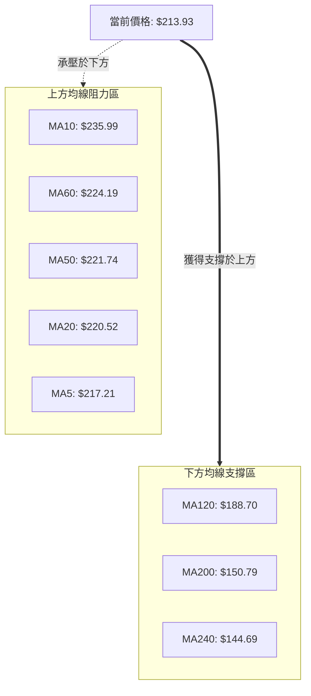
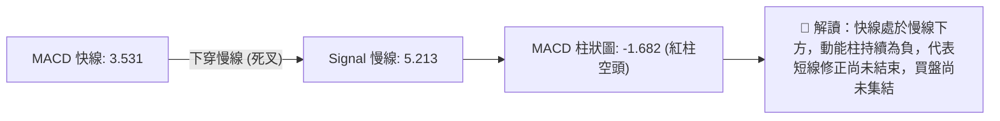
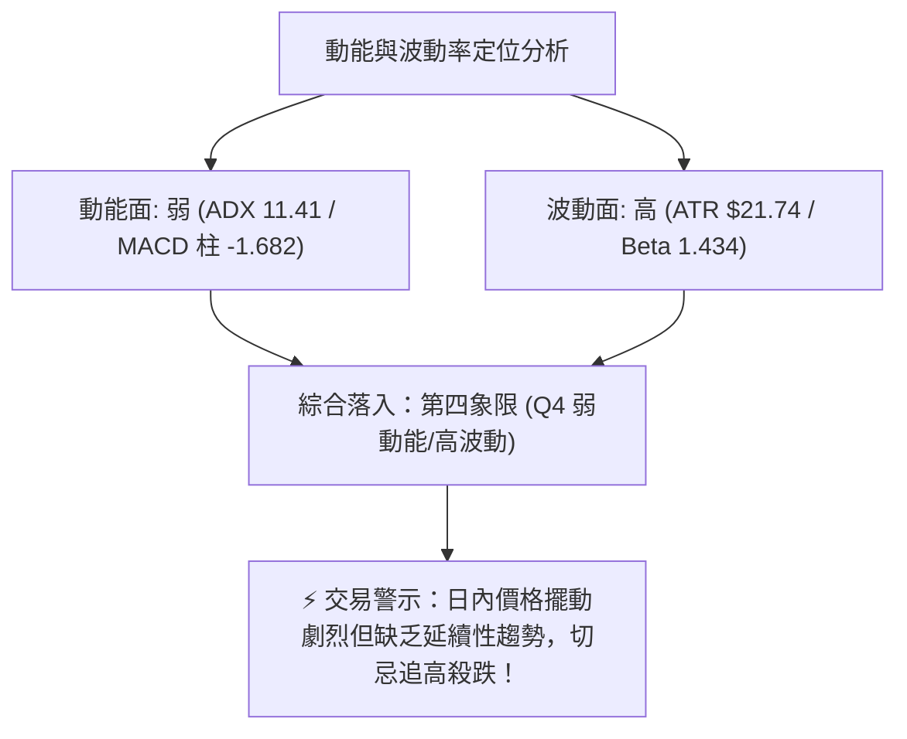
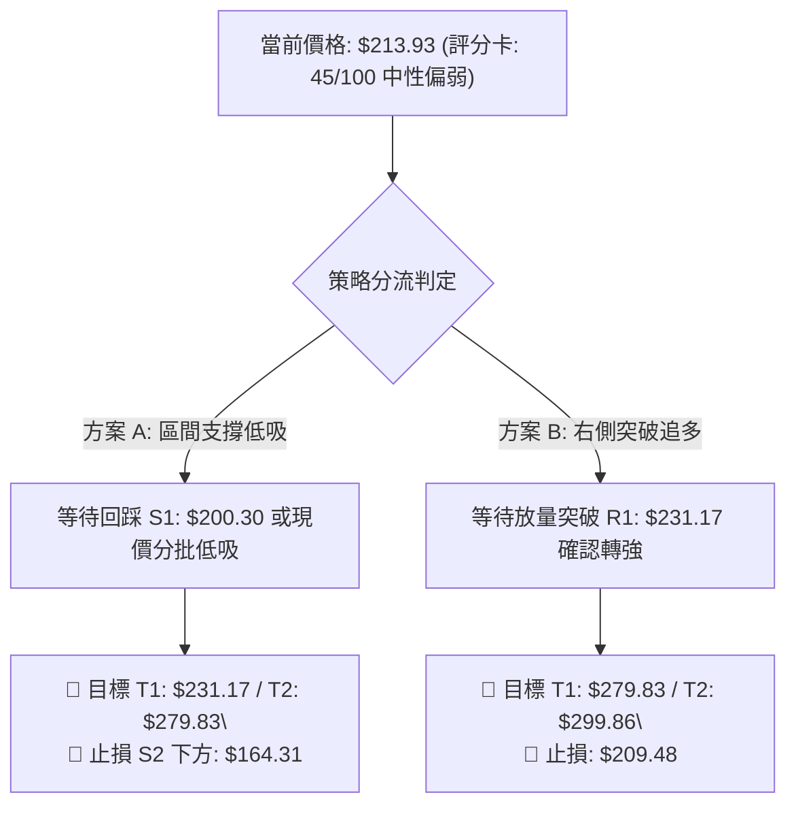
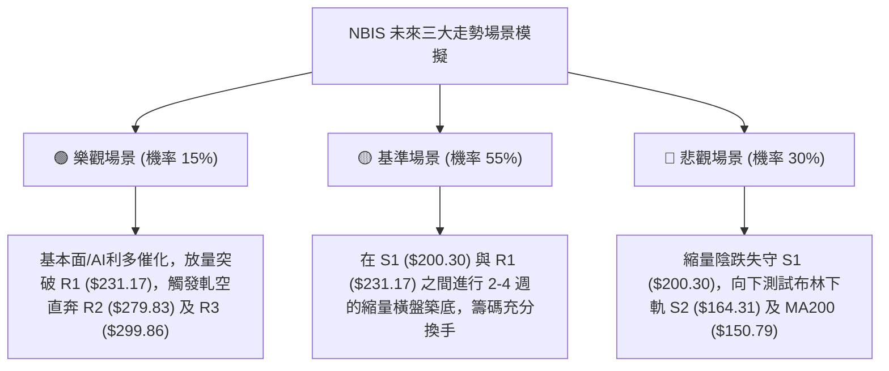

# NBIS 技術分析報告

> **報告日期**：2026-08-27 ｜ **語言**：繁體中文 ｜ **數據來源**：Yahoo Finance ｜ **當前價格**：$213.93

---

## 目錄

| 章節 | 內容 |
|------|------|
| [1. 技術面概覽](#1-技術面概覽) | 訊號儀表板、核心指標、評分卡 |
| [2. 趨勢分析](#2-趨勢分析) | 多時框趨勢、長中短期走勢 |
| [3. 圖表形態分析](#3-圖表形態分析) | 形態識別、K線組合、目標價 |
| [4. 支撐與阻力](#4-支撐與阻力) | 關鍵價位、斐波那契回調 |
| [5. 技術指標深度解讀](#5-技術指標深度解讀) | MA/RSI/MACD/布林/成交量 |
| [6. 動能與波動率](#6-動能與波動率) | 動能評估、ATR、Beta |
| [7. 多時框架總結](#7-多時框架總結) | 時框架評分矩陣 |
| [8. 交易策略建議](#8-交易策略建議) | 多空策略、風險報酬比 |
| [9. 風險提示與監控](#9-風險提示與監控) | 監控指標、風險場景 |

---

## 1. 技術面概覽

### 🎯 技術訊號儀表板



### 📊 核心指標速覽表

| 指標類別 | 指標名稱 | 當前數值 | 訊號 | 解讀 |
|----------|----------|----------|------|------|
| **價格** | 當前收盤價 | $213.93 | 🟡 | 位於52週高低區間 63.7% 水位，回調後進入震盪 |
| **均線** | MA20 (布林中軌) | $220.52 | 🔴 | 現價低於 MA20（-2.99%），短線承壓 |
| **均線** | MA50 | $221.74 | 🔴 | 現價低於 MA50（-3.52%），中期動能暫歇 |
| **均線** | MA200 | $150.79 | 🟢 | 現價高於 MA200（+41.87%），長期多頭架構未遭破壞 |
| **動能** | RSI(14) | 56.21 | 🟡 | 處於 30–70 中性常態區間，無明顯超買/超賣 |
| **動能** | MACD (12,26,9) | 3.531 / Signal 5.213 | 🔴 | MACD Hist = -1.682，處於空頭回調波段 |
| **隨機指標** | Stoch %K / %D | 33.23 / 34.90 | 🟡 | 指標於低檔徘徊但尚未形成有效黃金交叉 |
| **趨勢強度** | ADX(14) | 11.41 | 🟡 | 數值 < 25，顯示當前處於無方向性盤整/震盪行情 |
| **方向指標** | +DI / -DI | 27.53 / 28.00 | 🔴 | -DI 微幅高於 +DI，空方暫居主導 |
| **通道指標** | 布林通道帶寬 | $163.74 – $277.31 | 🟡 | %B = 0.44，價格處於通道中下軌之間震盪 |
| **量能指標** | OBV 與成交量比 | 10.25M (0.38x) | 🔴 | 量能萎縮嚴重，OBV 疲軟，買盤跟進意願偏低 |
| **波動度** | ATR(14) | $21.74 (10.16%) | 🔴 | 日內波動幅度大，操作需嚴格控制風險敞口 |

### 🏆 技術評分卡

```
╔══════════════════════════════════════════════════════════════════╗
║                 技術評分卡 — NBIS (2026-08-27)                  ║
╠══════════════════════════════════════════════════════════════════╣
║ 趨勢強度 (ADX/方向)   ████░░░░░░░░░░░░░░░░   25/100   🔴 空方微優║
║ 動能指標 (RSI/MACD)   ████████░░░░░░░░░░░░   42/100   🟡 中性偏弱║
║ 支撐穩定度 (Fib/S1)   ██████████████░░░░░░   70/100   🟢 支撐明確║
║ 成交量配合 (OBV/Volume)████░░░░░░░░░░░░░░░░   20/100   🔴 嚴重縮量║
║ 形態完整度 (區間整理) ████████████░░░░░░░░   60/100   🟡 區間成形║
║ 均線排列 (多時框MA)   ██████████░░░░░░░░░░   50/100   🟡 混合排列║
╠══════════════════════════════════════════════════════════════════╣
║ 綜合評分              █████████░░░░░░░░░░░   45/100   🟡 中性偏弱║
║ 結論評級：【中性觀望 / 區間震盪】 (建議以 S1~R1 區間操作為主)      ║
╚══════════════════════════════════════════════════════════════════╝
```

---

## 2. 趨勢分析

### 🌐 多時框趨勢分析



### 📈 長期趨勢 — 12個月走勢圖（Unicode）

```
NBIS 月線走勢圖（2025-09 至 2026-08）
價格軸 ($)
$300 ┤                                              ● 2026-06 ($276.17 / 52W High $299.86)
$270 ┤                                            ╭─╯ ╰╮
$240 ┤                                      ● 2026-05  │
$210 ┤                                    ╭─╯ ($231.09)╰──● 2026-08 ($213.93) ◄【現價】
$180 ┤                                  ╭─╯               │
$150 ┤                            ● 2026-04               ╰─● 2026-07 ($190.41)
$120 ┤ ● 2025-09 ($112.27)      ╭─╯ ($138.23)
$90  ┤ ╰─● 2025-10 ($130.82) ╭──╯
$60  ┤   ╰─● 2025-11 ($94.87)╯ 2026-01 ($85.19)
     └─────────────────────────────────────────────────────────────► 時間
       09   10   11   12   01   02   03   04   05   06   07   08 (月份)
```

**走勢特徵分析表格**：

| 階段區間 | 起止價格 | 漲跌幅 | 趨勢特徵 | 量能與動能配合 |
|----------|----------|--------|----------|----------------|
| **2025-09 ~ 2025-10** | $112.27 → $130.82 | +16.52% | 首波衝高，突破百元大關 | 買盤強勁進駐 |
| **2025-11 ~ 2026-01** | $130.82 → $85.19 | -34.88% | 深度洗盤回調，確認 $80-$85 底部 | 縮量築底階段 |
| **2026-02 ~ 2026-06** | $85.19 → $276.17 | +224.18% | 主升浪爆發，創歷史/52W新高 $299.86 | 量價齊揚，強勢單邊行情 |
| **2026-07 ~ 2026-08** | $276.17 → $213.93 | -22.54% | 高檔獲利回吐，於斐波那契 38.2% 處尋求支撐 | 爆量震盪後量能驟降至 0.38x |

### 📊 中期趨勢（週線分析）

從近 20 週歷史明細觀察，價格在 2026-06-21 觸及 $286.69 高點後回落至 2026-07-19 的 $177.71，隨後於 2026-08-16 暴量（1.67億股）衝高至 $277.68，但未能站穩並迅速在接下來兩週回落至 $219.13 與現價 $213.93。週線 RSI 自高檔 67.2 降至 56.2，週 MACD 柱狀圖由正轉負（-1.682），顯示中期處於寬幅區間拉鋸（$180 - $280），尚未形成新的單邊趨勢。

### ⚡ 趨勢強度評估（ADX 解讀）



**ADX 趨勢強度對照解讀**：
- **當前 ADX(14) = 11.41**：明確定義目前市場進入「典型盤整/無趨勢行情」，前期自 $85 飆升至 $299 的主升趨勢已終結，進入籌碼換手期。
- **方向線判讀**：+DI (27.53) 與 -DI (28.00) 幾乎糾結重合，空方微幅領先，說明多空雙方力量處於動態拉鋸平衡中，短線爆發單邊行情的條件尚不成熟。

---

## 3. 圖表形態分析

### 🔍 形態識別系統


**形態信心度與參數評估表**：

| 形態名稱 | 信心度 | 判斷依據（引用數據） | 完成度 | 目標價（附精確計算式） |
|----------|--------|----------------------|--------|------------------------|
| **矩形箱體整理** | **75%** | 價格受限於阻力 R2 ($279.83) 與支撐 S2 ($164.31) 之間震盪，現價處於中軸區間 | 65% | 箱體突破目標：若向上突破 R2，量度目標 = $279.83 + ($279.83 - $164.31) = **$395.35**；若跌破 S2，目標 = $164.31 - $115.52 = **$48.79** |
| **局部雙重頂阻力**| **60%** | 2026-06 週高 $286.69 與 2026-08-16 週高 $277.68 形成阻力聚類 R2 ($279.83) | 80% | 頸線位置為 S1 ($200.30)；若確認跌破 S1，回撤目標 = $200.30 - ($279.83 - $200.30) = **$120.77** |

*(註：由於當前 ADX 僅為 11.41，趨勢動能偏弱，幾何突破形態確認度不高，目前重點以指標型布林通道震盪進行解讀。)*

### 🕯️ 重要K線形態分析

| 週期/月份 | 收盤價 | K線形態特徵 | 技術面解讀 | 多空訊號 |
|-----------|--------|-------------|------------|----------|
| **2026-06 (月)** | $276.17 | 長上影大陽線 (高點 $299.86) | 多頭竭盡衝高，逼近 $300 大關遭遇強烈解套與獲利了結賣壓 | 🟡 滯漲警訊 |
| **2026-07 (月)** | $190.41 | 長陰線回調吞沒 | 獲利盤恐慌出逃，回踩 50% 斐波那契回調位附近進行支撐測試 | 🔴 空方釋放 |
| **2026-08 (月)** | $213.93 | 帶長上影十字星/探底回升 | 上衝 R2 ($279.83) 未果後回落，多空爭奪激烈，收於 MA20 附近 | 🟡 多空僵持 |
| **近兩週走勢** | $213.93 | 縮量連陰回撤 (40.68M) | 衝高失敗後的正常縮量回吐，賣壓未進一步放大，但買盤觀望 | 🟡 縮量整理 |

### 📉 ASCII 走勢形態示意圖

```
NBIS 形態結構與箱體阻力示意圖
$300 ┤                ▲ 52W High ($299.86)
     │               / \
$280 ┤==== 頂部1 ===/===\==== 頂部2 (R2: $279.83) =================== [強阻力帶]
     │   ($286.69) /     \  ($277.68)
$240 ┤           /       \      \
$220 ┤──────────/─────────\──────\───────────── MA20 / MA50 ($220.52 - $221.74)
$214 ┤         /           \      ● 現價 ($213.93)
$200 ┤════════/═════════════\══════════════════ 頸線 / 初步支撐 (S1: $200.30)
     │       /               \   /
$164 ┤======/=================▼=▼============== 箱體底部 / 強支撐 (S2: $164.31)
     │     /                 ($177.71)
$145 ┤====/==================================== 長期強支撐 (S3: $145.80 / MA200)
```

---

## 4. 支撐與阻力

### 🗺️ 關鍵價位分布圖（Unicode）

```
NBIS 關鍵價位結構分布圖
══════════════════════════════════════════════════════════════════════
$299.86 ║████████████████████████████████║ 52W 歷史極值強阻力 (R3 / Fib 0.0%)
$279.83 ║████████████████████████░░░░░░░░║ 近期波段雙頂強阻力 (R2 / BB上軌 $277.31)
$231.17 ║████████████████░░░░░░░░░░░░░░░░║ 短線反彈頸線阻力 (R1 / 5月高點聚類)
$220.52 ╟────────────────────────────────╢ 均線阻力密集區 (MA20 $220.52 / MA50 $221.74)
$213.93 ╠════════════════════════════════╣ ◄───【 當前收盤價格 $213.93 】
$209.48 ╟┄┄┄┄┄┄┄┄┄┄┄┄┄┄┄┄┄┄┄┄┄┄┄┄┄┄┄┄┄┄╢ 斐波那契 38.2% 回調支撐位
$200.30 ║▓▓▓▓▓▓▓▓▓▓▓▓▓▓▓▓░░░░░░░░░░░░░░░░║ 近期波段關鍵支撐 (S1 / 心理整數關卡)
$164.31 ║████████████████████████░░░░░░░░║ 箱體下沿強支撐 (S2 / BB下軌 $163.74)
$145.80 ║████████████████████████████████║ 長期牛熊分水嶺支撐 (S3 / MA200 $150.79)
══════════════════════════════════════════════════════════════════════
```

### 🚧 阻力位分析表

*(依據 OHLCV 關鍵價位計算提取)*

| 阻力級別 | 精確價位 | 形成原因與技術重合 | 突破難度 | 重要性評級 |
|----------|----------|--------------------|----------|------------|
| **R1** | **$231.17** | 2026-05 收盤高點聚類、MA60 ($224.19) 上方阻力 | 中等 | 🟡 **短線轉強點**（需量能放大站穩） |
| **R2** | **$279.83** | 近一年波段高點聚類、布林通道上軌 ($277.31) 重合區 | 極高 | 🔴 **波段重大阻力**（雙頂壓力密集區） |
| **R3** | **$299.86** | 52週歷史最高點、斐波那契 0.0% 極值、整數大關 | 極高 | 🔴 **歷史天花板**（需全面牛市配合） |

### 🛡️ 支撐位分析表

*(依據 OHLCV 關鍵價位計算提取)*

| 支撐級別 | 精確價位 | 形成原因與技術重合 | 守住機率 | 重要性評級 |
|----------|----------|--------------------|----------|------------|
| **S1** | **$200.30** | 近一年波段低點聚類、斐波那契 38.2% ($209.48) 下方緩衝墊 | 65% | 🟢 **短線防守核心**（整數心理關口） |
| **S2** | **$164.31** | 2026-07 波段回調低點聚類、布林通道下軌 ($163.74) 重合 | 80% | 🟢 **中期箱體底線**（跌破則趨勢破壞）|
| **S3** | **$145.80** | 長期波段低點聚類、MA200 ($150.79) / MA240 ($144.69) 支撐 | 90% | 🟢 **長期生命線**（牛熊分水嶺） |

### 📐 斐波那契回調位分析

依據 52 週波動區間 **$63.26 (低點) → $299.86 (高點)** 之計算數據：

```
斐波那契回調層級分析：
  0.0%  (52W High) : $299.86  ██████████████████████████████
 23.6%             : $244.02  ███████████████████████
 38.2%             : $209.48  ███████████████████  ◄ 現價 $213.93 緊鄰此處
 50.0%             : $181.56  ███████████████
 61.8% (黃金分割)  : $153.64  █████████████        (重合 MA200 $150.79)
 78.6%             : $113.89  █████████
100.0%  (52W Low)  : $ 63.26  
```

- **當前位置解讀**：現價 **$213.93** 位於 **23.6% ($244.02)** 與 **38.2% ($209.48)** 之間，且極度貼近 38.2% 回調支撐位。
- **技術意義**：在強勢回調行情中，38.2% ($209.48) 往往是強勢多頭的第一道關鍵防線。只要收盤不有效跌破 $209.48 及 S1 ($200.30)，整體中期結構仍屬健康調整；若失守，價格將向 50.0% ($181.56) 及布林下軌 S2 ($164.31) 尋求支撐。

---

## 5. 技術指標深度解讀

### 🎛️ 指標訊號總覽



### 📈 移動平均線排列分析



- **均線排列狀態**：短中期均線（MA5、MA10、MA20、MA50、MA60）全部位於現價上方，形成密集的上方壓制帶（$217.21 ~ $235.99）；而中長期均線（MA120: $188.70、MA200: $150.79、MA240: $144.69）則保持堅挺多頭向上發散排列。
- **交叉訊號解讀**：短線均線呈現混合糾結走空，但長期均線穩固，確立當前屬於「牛市多頭格局下的中期波段修正」。

### 📉 RSI(14) 分析

```
RSI(14) 數值儀表板：
0        30              50     56.21          70       100
├────────┼───────────────┼───────●──────────────┼────────┤
  超賣區       弱勢區         中性平衡    【當前】    超買區
進度條： [████████████████████████████░░░░░░░░░░░░░░] 56.21%
```

- **數值解讀**：當前 RSI 為 **56.21**，位於 50 中軸上方，顯示市場雖經歷回調，但多頭元氣並未完全潰散。
- **背離分析結論**：
  - **頂背離**：無。前期高點 $299 衝高時 RSI 達到 79.2，隨後高點 $277 時 RSI 為 67.2，呈現隨價格同步回落之正常特徵。
  - **底背離**：無明顯底背離跡象。
  - **結論**：RSI 指標呈現中性，未發出極端轉折訊號。

### 📊 MACD(12/26/9) 訊號解讀



- **數值剖析**：DIF (3.531) 與 DEA (5.213) 均位於零軸上方，說明大週期仍由多方掌控；但短線死叉發散，負柱（-1.682）顯示空方回調動能仍在釋放中，尚未出現金叉翻紅訊號。

### 📦 布林通道分析

```
NBIS 布林通道 (20, 2) 結構示意圖
$277.31 ┬────────────────────────────────────────── BB 上軌 (Upper)
        │
$240.00 ┤
        │
$220.52 ┼ - - - - - - - - - - - - - - - - - - - -  BB 中軌 (MA20)
$213.93 ┤ ◄───【現價位於中軌下方，%B = 0.44】
        │
$180.00 ┤
        │
$163.74 ┴────────────────────────────────────────── BB 下軌 (Lower)
```

- **帶寬與位置**：上軌 $277.31，中軌 $220.52，下軌 $163.74。當前價格 $213.93 處於中軌下方，**%B 數值為 0.44**。
- **型態解讀**：布林通道處於收口擴張後的走平階段，價格在跌破中軌後尋求下軌及 Fib 38.2% 的支撐。在 ADX 弱勢下，通道上下軌 ($163.74 - $277.31) 構成了高勝率的震盪操作區間。

### 💹 成交量分析（量價配合度）

```
成交量對比儀表：
當日成交量  [████░░░░░░░░░░░░░░░░░░░░] 10.25M (量比: 0.38x) 🔴 嚴重萎縮
20日均量    [██████████░░░░░░░░░░░░░░] 26.65M
50日均量    [████████░░░░░░░░░░░░░░░░] 22.60M
```

- **量價背離分析**：現價回落過程中成交量大幅萎縮（僅 1,025 萬股，量比 0.38x），這表明當前下跌並非主力資金恐慌性拋售，而是「縮量陰跌/流動性真空」。
- **OBV 解讀**：數據提示 `OBV < MA → 量能疲弱`，說明近期資金處於淨流出狀態，買方增量資金尚未進場，短線向上突破需要補量確認。

---

## 6. 動能與波動率

### ⚡ 動能評估四象限

| 象限分區 | 動能強度 | 波動率水準 | 股票狀態標記 | 策略應對方針 |
|----------|----------|------------|--------------|--------------|
| **第一象限 (Q1)** | 強動能 (High) | 低波動 (Low) | ── | 最佳單邊趨勢加碼點 |
| **第二象限 (Q2)** | 弱動能 (Low) | 低波動 (Low) | ── | 窄幅盤整，等待方向選擇 |
| **第三象限 (Q3)** | 強動能 (High) | 高波動 (High) | ── | 主升/主跌段，高風險高回報 |
| **第四象限 (Q4)** | **弱動能 (Low)** | **高波動 (High)** | **✓ NBIS 當前位置** | **區間拉鋸，嚴控停損，低吸高拋** |



### 📊 ATR 波動率分析

```
ATR(14) 波動風險評估：
數值: $21.74  (佔股價比例: 10.16%)
進度條: [████████████████████░░░░░░░░░░] 10.16% (極高波動)
```

- **日常波動區間**：NBIS 單日平均波動高達 **$21.74**，代表日內震盪幅度超過 10%。
- **止損距離建議**：
  - **短線交易止損緩衝**：至少預留 **1.0 ~ 1.5 倍 ATR**（約 $21.74 ~ $32.61 之安全防護空間）。
  - **倉位管理意涵**：高 ATR 意味著單筆交易倉位不可過重，需將單筆風險曝險控制在總資產 1%~2% 以內。

### 📐 Beta 與市場相關性

- **Beta 係數 = 1.434**：屬於典型「高彈性/高 Beta」科技標的，對納斯達克大盤具有顯著的放大效應。
- **市場連動解讀**：大盤上漲時其彈性達 1.43 倍，但在大盤回調時亦容易承受加倍的下行壓力。當前高空頭比例（Short % Float 達 23.4%）亦加劇了潛在的軋空或踩踏波動。

---

## 7. 多時框架總結

### 📋 時框架評分表

| 時框架 | 趨勢方向 | 動能狀態 | 均線排列 | 形態結構 | 綜合評分 | 建議方針 |
|--------|----------|----------|----------|----------|----------|----------|
| **月線 (長期)** | 🟢 多頭上行 | 🟢 充沛 | 🟢 均線多頭 (遠高於 MA200) | 52W 區間主升回調 | **78/100** | 逢低分批長線佈局 |
| **週線 (中期)** | 🟡 寬幅震盪 | 🟡 走平 (RSI 56.2) | 🟡 混合糾結 | 矩形箱體整理 ($164-$280) | **52/100** | 箱體下沿低吸，嚴設停損 |
| **日線 (短期)** | 🔴 偏弱回調 | 🔴 疲弱 (MACD死叉) | 🔴 承壓於 MA20/50 下方 | 縮量陰跌尋求 S1 支撐 | **38/100** | 觀望，等待止跌訊號 |

### 🔲 綜合訊號矩陣

```
時框訊號一致性矩陣：
┌───────────┬──────────────┬──────────────┬──────────────┐
│  維度     │  短期 (日線) │  中期 (週線) │  長期 (月線) │
├───────────┼──────────────┼──────────────┼──────────────┤
│ 均線方向  │   🔴 看空    │   🟡 中性    │   🟢 看多    │
│ 動能指標  │   🔴 看空    │   🟡 中性    │   🟢 看多    │
│ 形態量能  │   🔴 縮量    │   🟡 震盪    │   🟢 多頭    │
├───────────┼──────────────┼──────────────┼──────────────┤
│ 矩陣結論  │  短線承壓    │  區間平衡    │  牛市未變    │
└───────────┴──────────────┴──────────────┴──────────────┘
```

### ⚖️ 多時框收斂結論

依據**多時框收斂規則（規則 14）**：
1. **行情性質判定**：當前 **ADX(14) = 11.41 (< 25)**，系統明確判定當前為**【典型盤整行情】**，非單邊趨勢行情。
2. **主導維度收斂**：在盤整行情中，趨勢指標失效，交易以**日線布林通道上下軌 ($163.74 - $277.31)** 與波段支撐阻力為核心交易區間。
3. **唯一方向性結論**：**【🟡 中性偏弱觀望 / 區間低吸策略】**。日線級別短線仍在尋求 S1 ($200.30) 與 Fib 38.2% ($209.48) 的有效支撐，短線切忌盲目追多；激進者僅可於 S1 附近輕倉博弈反彈，穩健者應等待放量突破 R1 ($231.17) 或回踩 S2 ($164.31) 再行介入。

---

## 8. 交易策略建議

### 🗺️ 策略決策流程圖



### 🧭 策略路由（依評分卡分流）

> **當前主策略方向 = 【中性區間操作 / 區間支撐低吸為主】（依據綜合評分 45/100，介於 40–60 區間）**  
> 市場缺乏趨勢單邊動能，主推在關鍵支撐位進行高盈虧比的區間操作，嚴格執行防守止損。

### 🎯 價格情境階梯（Price Scenarios）

*(所有數值均嚴格引用第 4 章關鍵價位)*

| 觸發條件 | 第一目標 (T1) | 後續延伸 (T2) | 情境含義與操作指引 |
|----------|---------------|---------------|--------------------|
| **放量突破 R1 ($231.17)** | **R2 ($279.83)** | **R3 ($299.86)** | 短線重回多頭軌道，突破 MA50 壓制，可順勢加碼 |
| **守穩 S1 ($200.30) 區間** | **R1 ($231.17)** | **R2 ($279.83)** | 維持在箱體內部健康震盪，適合區間網格操作 |
| **有效跌破 S1 ($200.30)** | **S2 ($164.31)** | **S3 ($145.80)** | 中期整理轉弱，向布林下軌及 MA200 生命線尋求強支撐 |

### 📊 情境機率分佈

| 情境劇本 | 估計機率 | 主要技術依據 |
|----------|----------|--------------|
| **區間震盪整理 (主情境)** | **55%** | ADX(14)=11.41 極度平緩、布林通道帶寬收窄、多空力量均衡 |
| **探底回踩 S1/S2 (次情境)**| **30%** | 成交量能疲弱 (量比 0.38x)、MACD 負柱延續、短均線反壓 |
| **直接向上突破 R1 (小機率)**| **15%** | 目前缺乏買盤量能配合，需基本面催化或軋空（Short Float 23.4%）爆發 |

### 🟢 主策略詳情

*(價位精確引用 S1/S2/R1/R2/Fib)*

| 策略要素 | 策略 A（區間左側低吸策略） | 策略 B（右側突破確認策略） |
|----------|----------------------------|----------------------------|
| **適用對象** | 偏好高盈虧比、逢低建倉投資者 | 偏好趨勢確認、右側交易投資者 |
| **進場條件** | 回踩 S1 附近出現止跌 K 線，或現價分批進場 | 日線收盤價放量實體突破 R1 |
| **進場價格** | **$209.48 ~ $213.93** (分批低吸) | **$231.17** (突破買入) |
| **第一目標 (T1)** | **$231.17** (+8.06% ~ +10.35%) | **$279.83** (+21.05%) |
| **第二目標 (T2)** | **$279.83** (+30.81% ~ +33.58%) | **$299.86** (+29.71%) |
| **止損價格** | **$195.00** (跌破 S1 $200.30 與心理整數) | **$213.93** (跌回當前平台及 Fib 38.2%) |
| **風險報酬比 (R:R)**| **1 : 3.48** (以進場 $213.93、目標 T2 計算) | **1 : 2.82** (以目標 T1 計算) |
| **成功機率估計** | **60%** | **50%** |
| **建議倉位** | **10% ~ 15%** (分批建倉) | **15% ~ 20%** |

### 🔴 反向風險觸發點（對沖與風控提示）

- **多頭結構破壞點**：若日線收盤價跌破 **S1 ($200.30)**，多頭應立即將倉位減半；若進一步放量跌破 **S2 ($164.31)**，宣告箱體破位，需無條件停損離場或反手佈局保護性認沽期權（Put）。
- **空頭軋空觸發點**：鑑於空頭未平倉比例高達 **23.4%**，若價格突破 **R1 ($231.17)** 且單日成交量放大至 3,000 萬股以上，可能引發空頭踩踏式回補，此時不可盲目做空。

### ⭐ 整體訊號強度評星

```
╔══════════════════════════════════════════════════════════════════╗
║ 做多訊號強度：  ★★☆☆☆  (2.5/5 星 — 支撐明確但動能不足)          ║
║ 做空訊號強度：  ★★☆☆☆  (2.0/5 星 — 縮量陰跌，長線均線支撐強)     ║
║ 整體訊號可信度：★★★☆☆  (3.0/5 星 — 震盪行情，信號頻繁糾結)      ║
╚══════════════════════════════════════════════════════════════════╝
```

---

## 9. 風險提示與監控

### ✅ 關鍵監控指標 Checklist

```
╔══════════════════════════════════════════════════════════════════╗
║                   NBIS 技術監控清單 (Checklist)                  ║
╠══════════════════════════════════════════════════════════════════╣
║ [ ] 1. 價格防守線：每日收盤是否守穩 Fib 38.2% ($209.48) 與 S1 ($200.30) ║
║ [ ] 2. 動能翻紅點：MACD 柱狀圖是否由 -1.682 收窄並形成零軸上方金叉  ║
║ [ ] 3. 量能放大器：日成交量是否自 10.25M 回升至 20日均量 (26.65M) 以上║
║ [ ] 4. 趨勢重啟線：ADX(14) 是否自 11.41 向上突破 20-25 門檻區間   ║
║ [ ] 5. 空頭平倉潮：注意 Short % Float (23.4%) 是否引發突破 R2 軋空行情║
║ [ ] 6. 均線突破站穩：收盤價是否重新站上 MA20 ($220.52) 與 MA50 ($221.74)║
╚══════════════════════════════════════════════════════════════════╝
```

### ⚠️ 風險場景分析



### 🛡️ 風險管理重要提醒

1. **高波動與滑點風險**：ATR 佔股價高達 **10.16%**（$21.74），市場流動性在縮量期間較差，市價單進出容易產生滑點，建議一律採用「限價單（Limit Order）」進行委託。
2. **空頭擠壓（Short Squeeze）雙刃劍**：高空頭比例（23.4%）意味著一旦有利好消息容易出現跳空暴漲，但無消息時亦代表機構空方壓制意願強烈，切勿在箱體中軸重倉孤注一擲。
3. **倉位嚴格限額**：單一帳戶在 NBIS 的持倉曝險建議不超過總資產的 **15%**，單筆交易嚴格設定最大虧損不超過帳戶總淨值的 **1.5%**。

---

## 📋 報告總結

```
╔══════════════════════════════════════════════════════════════════╗
║                   NBIS 技術分析報告總結                          ║
╠══════════════════════════════════════════════════════════════════╣
║ 報告日期：2026-08-27                                             ║
║ 當前價格：$213.93                                                ║
║ 分析評級：⚖️【中性偏弱 / 區間震盪整理】 (技術評分: 45/100)        ║
╠══════════════════════════════════════════════════════════════════╣
║ 關鍵結論：                                                       ║
║ ├─ 長期趨勢：🟢 強多頭 (遠高於 MA200 $150.79 與 52W低點 $63.26) ║
║ ├─ 中期趨勢：🟡 寬幅箱體震盪 ($164.31 ~ $279.83 區間拉鋸)       ║
║ ├─ 短期趨勢：🔴 偏弱承壓 (低於 MA20 $220.52，量能萎縮至 0.38x)  ║
║ ├─ 關鍵支撐：S1: $200.30 ｜ S2: $164.31 ｜ S3: $145.80          ║
║ ├─ 關鍵阻力：R1: $231.17 ｜ R2: $279.83 ｜ R3: $299.86          ║
║ └─ 分析師目標價：均價 $286.69 (低 $144.00 / 高 $415.00)          ║
╠══════════════════════════════════════════════════════════════════╣
║ 最優策略組合：                                                   ║
║ 1. 🥇 最佳機會：在 Fib 38.2% ($209.48) ~ S1 ($200.30) 區間分批  ║
║                 低吸，止損設 $195.00，博弈反彈 R1/R2 (盈虧比 1:3.5)║
║ 2. 🥈 次選機會：耐心等待日線放量收上 R1 ($231.17) 後右側跟進，   ║
║                 目標鎖定 R2 ($279.83)。                          ║
║ 3. 🥉 保守選擇：場外觀望，等待 ADX > 25 且 MACD 出現底部金叉再行 ║
║                 順勢入場。                                       ║
╚══════════════════════════════════════════════════════════════════╝
```

---

> ⚠️ **免責聲明**：本報告為 AI 自動生成之技術分析，所有數據及估算均基於歷史價格與技術指標資訊。本報告**僅供研究與學術參考**，**不構成任何投資建議或買賣邀約**。金融市場投資具有極高風險，投資人應獨立評估風險並自負盈虧。

---

*報告生成時間：2026-08-27 ｜ 數據來源：Yahoo Finance ｜ 分析框架：多時框技術分析體系*