# NBIS 技術分析報告

> **報告日期**：2026-08-28 ｜ **語言**：繁體中文 ｜ **數據來源**：Yahoo Finance ｜ **當前價格**：$218.48

---

## 目錄

| 章節 | 內容 |
|------|------|
| [1. 技術面概覽](#1-技術面概覽) | 訊號儀表板、核心指標、評分卡 |
| [2. 趨勢分析](#2-趨勢分析) | 多時框趨勢、長中短期走勢 |
| [3. 圖表形態分析](#3-圖表形態分析) | 形態識別、K線組合、目標價 |
| [4. 支撐與阻力](#4-支撐與阻力) | 關鍵價位、斐波那契回調 |
| [5. 技術指標深度解讀](#5-技術指標深度解讀) | MA/RSI/MACD/布林/成交量 |
| [6. 動能與波動率](#6-動能與波動率) | 動能評估、ATR、Beta |
| [7. 多時框架總結](#7-多時框架總結) | 時框架評分矩陣 |
| [8. 交易策略建議](#8-交易策略建議) | 多空策略、風險報酬比 |
| [9. 風險提示與監控](#9-風險提示與監控) | 監控指標、風險場景 |

---

## 1. 技術面概覽

### 🎯 技術訊號儀表板

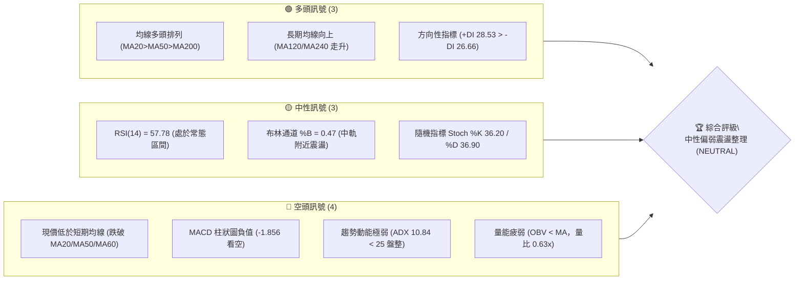

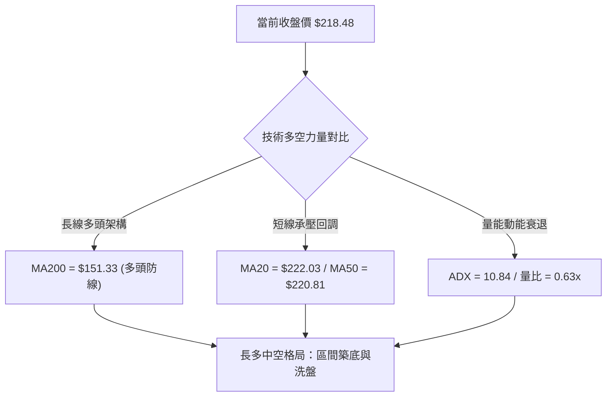

### 📊 核心指標速覽表

| 指標類別 | 指標名稱 | 當前數值 | 訊號 | 解讀 |
|----------|----------|----------|------|------|
| **價格** | 當前價格 | $218.48 | 🟡 | 位於52週區間 65.6% 位置，處於中高檔震盪整理 |
| **均線** | MA20 | $222.03 | 🔴 | 價格低於 MA20 (-1.60%)，短期均線受壓 |
| **均線** | MA50 | $220.81 | 🔴 | 價格低於 MA50 (-1.06%)，中期均線糾結失守 |
| **均線** | MA200 | $151.33 | 🟢 | 價格高於 MA200 (+44.37%)，長期多頭基底穩固 |
| **動能** | RSI(14) | 57.78 | 🟡 | 位於 30-70 常態中性區間，無超買超賣及背離 |
| **動能** | MACD | 2.893 (Hist: -1.856) | 🔴 | 快線低於訊號線 (4.749)，柱狀圖負值，短線修正中 |
| **趨勢** | ADX(14) | 10.84 | 🟡 | ADX < 25 表明處於弱趨勢/無方向盤整行情 |
| **通道** | 布林 %B | 0.47 | 🟡 | 位於布林帶中軌 ($222.03) 略下方，區間壓縮 |
| **量能** | 量比 / OBV | 0.63x / OBV<MA | 🔴 | 20日均量縮減，OBV 跌破均線，主力資金追價意願不足 |
| **波動** | ATR(14) | $21.58 (9.88%) | 🟡 | 每日平均波動近 10%，屬高彈性成長股特性 |

### 🏆 技術評分卡

```
╔══════════════════════════════════════════════════════════════════╗
║                 技術評分卡 — NBIS (2026-08-28)                   ║
╠══════════════════════════════════════════════════════════════════╣
║ 趨勢強度 (ADX/方向)   ████░░░░░░░░░░░░░░░░  25/100  🔴 弱趨勢盤整 ║
║ 動能指標 (RSI/MACD)   ████████░░░░░░░░░░░░  42/100  🟡 動能轉弱   ║
║ 支撐穩定度 (S1/斐波)  ██████████████░░░░░░  70/100  🟢 支撐帶堅實 ║
║ 成交量配合 (OBV/量比) ██████░░░░░░░░░░░░░░  30/100  🔴 量能萎縮   ║
║ 形態完整度 (通道/箱體)████████████░░░░░░░░  60/100  🟡 寬幅箱體   ║
║ 均線排列 (多長均線)   ██████████████░░░░░░  72/100  🟢 多頭排列   ║
╠══════════════════════════════════════════════════════════════════╣
║ 綜合評分              ██████████░░░░░░░░░░  50/100  🟡 中性觀望   ║
╚══════════════════════════════════════════════════════════════════╝
```

---

## 2. 趨勢分析

### 🌐 多時框趨勢分析

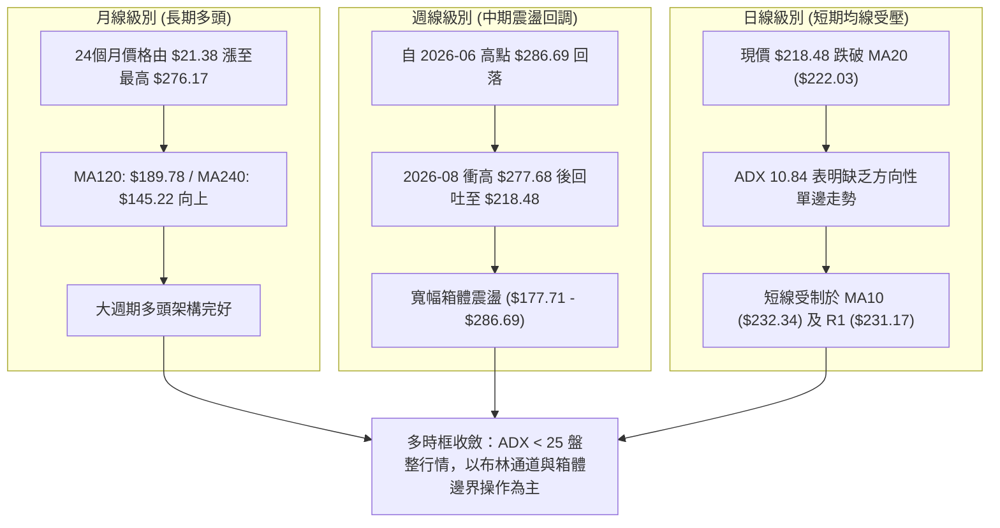

### 📈 長期趨勢 — 12個月走勢圖（Unicode）

```
NBIS 月線走勢圖（2025-09 至 2026-08）
價格軸 ($)
$280 ┤                                           ● (06月: $276.17)
$250 ┤                                      ●
$220 ┤                                           ●←現在 ($218.48)
$190 ┤                                                ● (07月: $190.41)
$160 ┤                                 ●
$130 ┤ ● (10月: $130.82)
$100 ┤ ● (09月: $112.27)         ●
$70  ┤             ●(12月:$83.71)
     └─────────────────────────────────────────────────────────────
       09  10  11  12  01  02  03  04  05  06  07  08  (月份)
```

**走勢特徵分析表格**：

| 階段 | 期間 | 起訖價格 | 漲跌幅 | 走勢特徵與量價表現 |
|------|------|----------|--------|--------------------|
| **主升浪第一階段** | 2025-09 ~ 2025-10 | $68.32 → $130.82 | +91.48% | 突破百元大關，強勢放量推升 |
| **中繼修正波** | 2025-11 ~ 2026-01 | $130.82 → $83.71 | -36.01% | 獲利了結賣壓湧現，回踩 $83.71 尋求支撐 |
| **主升浪第二階段** | 2026-02 ~ 2026-06 | $85.19 → $276.17 | +224.18% | 歷史級別暴漲，月線連續大陽線，創 $299.86 歷史高點 |
| **高檔寬幅震盪** | 2026-07 ~ 2026-08 | $276.17 → $218.48 | -20.89% | 7月急跌至 $190.41，8月中旬反彈至 $277.68 後回落，呈現洗盤 |

### 📊 中期趨勢（週線分析）

```
NBIS 週線波段壓力與支撐示意圖
═══════════════════════════════════════════════════════════════════
$299.86 ────────────────────────────────────── 52W 歷史最高點 (阻力極限 R3)
$279.83 ────────────────────────────────────── 波段密集高點壓力帶 (R2)
$231.17 ────────────────────────────────────── 近期反彈頸線阻力 (R1)
$218.48 ══════════════════════════════════════ ◄ 當前收盤價
$200.30 ────────────────────────────────────── 近期關鍵整數支撐 (S1)
$164.31 ────────────────────────────────────── 波段強支撐帶 (S2)
$145.80 ────────────────────────────────────── MA240 附近極限支撐 (S3)
═══════════════════════════════════════════════════════════════════
```

### ⚡ 趨勢強度評估（ADX 解讀）

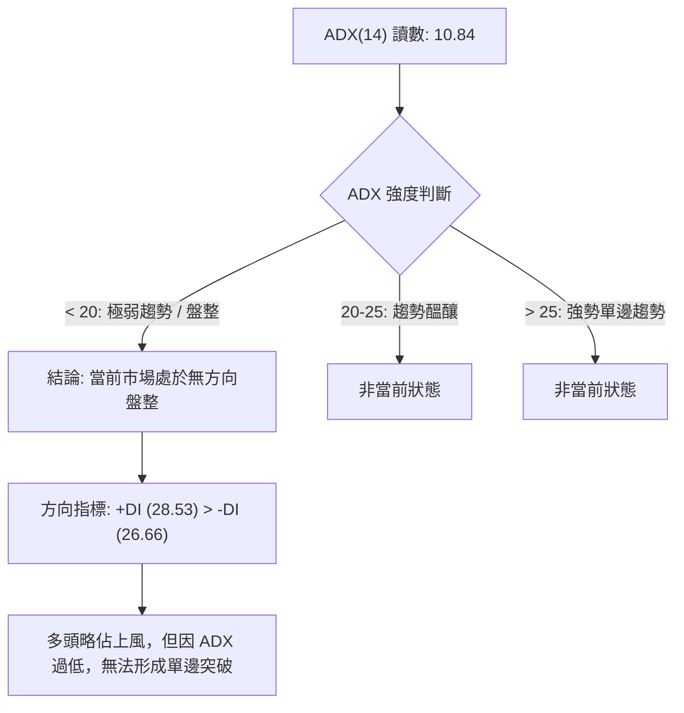

| 指標名稱 | 數值 | 門檻標準 | 趨勢狀態判定 |
|----------|------|----------|--------------|
| **ADX(14)** | 10.84 | < 25.00 | **弱趨勢／無方向盤整行情** |
| **+DI** | 28.53 | > -DI (26.66) | 多方力量微幅佔優 (+1.87) |
| **-DI** | 26.66 | < +DI (28.53) | 空方拋壓有所收斂，但雙方差距極小 |

---

## 3. 圖表形態分析

### 🔍 形態識別系統

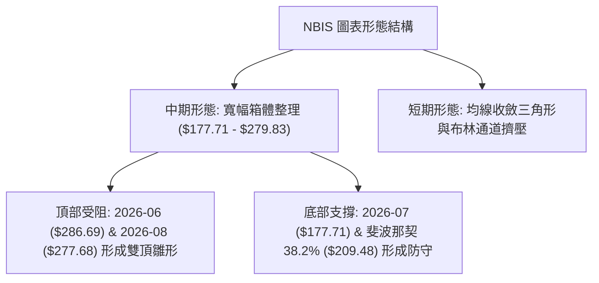

**形態信心度與目標價評估表**：

| 形態 | 信心度 | 判斷依據（引用數據） | 完成度 | 目標價（附計算式） |
|------|--------|----------------------|--------|--------------------|
| **寬幅箱體整理** | 80% | 區間於 S1 $200.30 / S2 $164.31 與 R1 $231.17 / R2 $279.83 間反覆震盪 | 75% | 箱頂突破目標：R2 $279.83；箱底跌破目標：S2 $164.31 |
| **潛在雙重頂 (M頭)** | 55% | 兩次波段高點分別為 2026-06 ($286.69) 與 2026-08 ($277.68)，頸線於 $177.71 | 40% | 若跌破頸線 $177.71，推算目標：$177.71 - ($279.83 - $177.71) = 數據中未偵測到此極端空頭價位，下看 S3 $145.80 |
| **布林通道中軌整理** | 85% | 現價 $218.48 緊貼 BB中軌 $222.03，%B 為 0.47 | 90% | 上軌目標：$276.80；下軌支撐：$167.26 |

### 🕯️ 重要K線形態分析

| 週/月份 | 收盤價 | K線形態 | 解讀 | 訊號 |
|---------|--------|---------|------|------|
| **2026-06** | $276.17 | 歷史大陽線伴隨長上影線 | 觸及 52W 高點 $299.86 後高檔獲利了結 | 🟡 滯漲訊號 |
| **2026-07** | $190.41 | 長陰線回調 | 自高檔大幅回吐，測試下方支撐帶 | 🔴 快速修正 |
| **2026-08-16** | $277.68 | 爆量長陽線 | 單週成交量達 1.67 億股，強力多頭反撲 | 🟢 短線多頭放量 |
| **2026-08-23** | $219.13 | 長黑回吐實體 | 吞噬前週大半漲幅，多頭追價動能中斷 | 🔴 高檔回吐 |
| **2026-08-30** | $218.48 | 縮量十字星/小陰線 | 週量急縮至 5,696 萬股，市場進入觀望平衡 | 🟡 變盤十字 |

### 📉 ASCII 走勢形態示意圖

```
NBIS 近期週線雙頂與箱體震盪形態示意圖
$299.86 ┬                    頂部1 ($286.69)        頂部2 ($277.68)
        │                       ▲                      ▲
$279.83 ┼───────────────────────┼──────────────────────┼─────── 阻力帶 R2
        │                      / \                    / \
$231.17 ┼─────────────────────/───\──────────────────/───\──── 阻力位 R1
        │                    /     \      現價 $218.48    \
$218.48 ┼───────────────────/───────\───────●──────────────\──
        │                  /         \     /                ▼
$200.30 ┼─────────────────/───────────\───/──────────────────── 支撐位 S1
        │                /             ▼ /
$177.71 ┼───────────────/           頸線支撐 ($177.71)
        └─────────────────────────────────────────────────────────────
                         2026-06       2026-07       2026-08
```

### 🎯 形態目標價計算

1. **箱體震盪突破情境**：
   - 箱體頂部阻力取 R2：$279.83，箱體底部取 2026-07 修正低點：$177.71
   - 箱體高度 = $279.83 - $177.71 = $102.12
   - **向上突破理論目標價** = $279.83 + $102.12 = 由箱體高度推算為 $381.95（對應分析師最高目標 $415.00 區間）
   - **向下跌破理論目標價** = $177.71 - $102.12 = 由箱體高度推算為 $75.59（接近 52W 低點 $63.26）
2. **短期區間震盪目標**：
   - 區間上限：R1 $231.17
   - 區間下限：S1 $200.30

---

## 4. 支撐與阻力

### 🗺️ 關鍵價位分布圖（Unicode）

```
NBIS 價位結構分布圖
═══════════════════════════════════════════════════════════════════
$299.86 ║████████████████████████████████║ 歷史極值阻力 R3 / 52W High
$279.83 ║████████████████████████        ║ 波段密集高點 R2 / BB上軌($276.80)
$244.02 ║▓▓▓▓▓▓▓▓▓▓▓▓                    ║ 斐波那契 23.6% 回調位
$231.17 ║████████████████                ║ 近期波段阻力 R1 / MA10($232.34)
$218.48 ╠════════════════════════════════╣ ◄ 當前收盤價 ($218.48)
$209.48 ║▓▓▓▓▓▓▓▓▓▓▓▓▓▓▓▓                ║ 斐波那契 38.2% 回調位
$200.30 ║████████████████████            ║ 近期波段低點支撐 S1
$181.56 ║▓▓▓▓▓▓▓▓▓▓▓▓▓▓▓▓▓▓▓▓            ║ 斐波那契 50.0% 中樞平衡位
$164.31 ║████████████████████████        ║ 關鍵波段強支撐 S2 / BB下軌($167.26)
$153.64 ║▓▓▓▓▓▓▓▓▓▓▓▓▓▓▓▓▓▓▓▓▓▓▓▓        ║ 斐波那契 61.8% 黃金分割位 / MA200($151.33)
$145.80 ║████████████████████████████    ║ 長期防守強支撐 S3 / MA240($145.22)
═══════════════════════════════════════════════════════════════════
```

### 🚧 阻力位分析表

| 阻力級別 | 價位 | 形成原因 | 突破難度 | 重要性 |
|----------|------|----------|----------|--------|
| **R1** | **$231.17** | 近一年波段高點聚類、MA10 ($232.34) 與 MA60 ($223.49) 反壓 | 🟡 中等 | 短線轉強關鍵頸線，突破方可確認短期止跌 |
| **R2** | **$279.83** | 2026-06/08 兩次波段攻勢密集受阻區、布林上軌 ($276.80) | 🔴 極高 | 中期箱體頂部，構成重大多頭獲利了結反壓 |
| **R3** | **$299.86** | 52週歷史最高點、斐波那契 0.0% 基準點 | 🔴 極高 | 歷史天花板，需巨量實質買盤方能有效突破 |

### 🛡️ 支撐位分析表

| 支撐級別 | 價位 | 形成原因 | 守住機率 | 重要性 |
|----------|------|----------|----------|--------|
| **S1** | **$200.30** | 近一年波段低點聚類、整數心理關卡、斐波 38.2% ($209.48) 下方緩衝 | 🟢 70% | 短線多頭第一道防禦陣地，失守將考驗深層支撐 |
| **S2** | **$164.31** | 近一年波段次級低點、布林帶下軌 ($167.26) 重合區 | 🟢 85% | 中期生命線，多頭結構性回調的強支撐中樞 |
| **S3** | **$145.80** | 長期均線 MA240 ($145.22) 及 MA200 ($151.33) 匯聚區 | 🟢 95% | 長期多空分水嶺，跌破則整體多頭循環宣告結束 |

### 📐 斐波那契回調位分析

依據 52 週波動區間（最低點 **$63.26** 至 最高點 **$299.86**，總振幅 $236.60）精確計算：

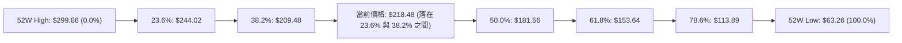

- **當前位置解讀**：現價 **$218.48** 運行於 **38.2% ($209.48)** 與 **23.6% ($244.02)** 回調區間內。
- **技術意涵**：股價自歷史高點回調未跌破 38.2% ($209.48) 關鍵位，顯示中長期多頭架構仍屬強勢回檔（Bullish Retracement）。只要 $209.48 - S1 $200.30 支撐帶不破，多方隨時具備重啟波段攻勢的技術基礎。

---

## 5. 技術指標深度解讀

### 🎛️ 指標訊號總覽

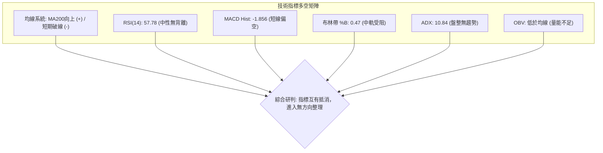

### 📈 移動平均線排列分析

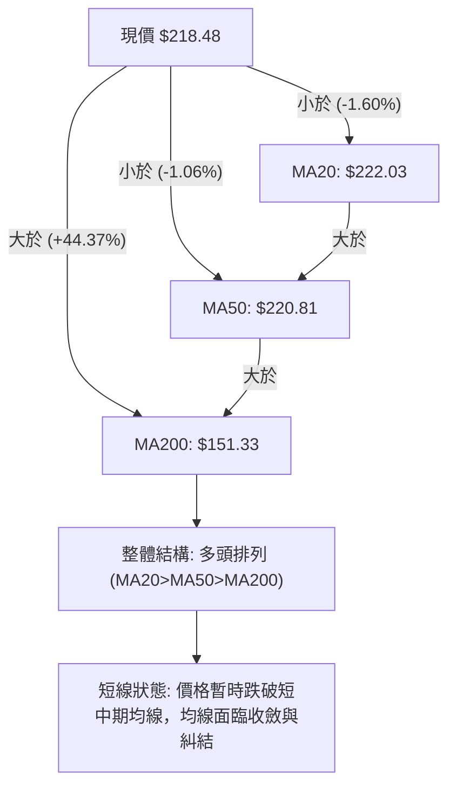

| 均線名稱 | 當前數值 | 現價差距 | 走勢方向 | 排列狀態與技術解讀 |
|----------|----------|----------|----------|--------------------|
| **MA 5** | $216.88 | +$1.60 (+0.74%) | ▲ 向上 | 超短期止跌回穩，提供微弱支撐 |
| **MA 10** | $232.34 | -$13.86 (-5.96%) | ▼ 向下 | 短線急速下彎，構成即時上方第一反壓 |
| **MA 20** | $222.03 | -$3.55 (-1.60%) | ▼ 向下 | 月線下彎，現價受制於月線下方 |
| **MA 50** | $220.81 | -$2.33 (-1.06%) | ▼ 向下 | 季線失守，短中期籌碼成本重疊糾結 |
| **MA 60** | $223.49 | -$5.01 (-2.24%) | ▼ 向下 | 與 MA20/MA50 形成密集反壓帶 ($220.81 - $223.49) |
| **MA 120** | $189.78 | +$28.70 (+15.12%)| ▲ 向上 | 半年線強勁向上，中期上升趨勢不變 |
| **MA 200** | $151.33 | +$67.15 (+44.37%)| ▲ 向上 | 長期年線穩健走揚，多頭核心防線 |
| **MA 240** | $145.22 | +$73.26 (+50.44%)| ▲ 向上 | 兩年線提供極長期戰略支撐 |

### 📉 RSI(14) 分析

```
RSI(14) 儀表板
0 ──────────── 30 ──────────────────────── 57.78 ────────────── 70 ──────────── 100
[  極度超賣區  ] [       中性常態區       █████████░░░░░ ] [  極度超買區  ]
```

- **當前數值**：**57.78**（處於 30-70 常態中性偏強區間）。
- **背離判斷**：
  - **頂背離檢驗**：股價在 2026-06 創高 $286.69 時 RSI 為 65.3，隨後 2026-08 衝高至 $277.68 時 RSI 達 67.2，指標創出相對新高，**無頂背離現象**。
  - **底背離檢驗**：7月中旬低點 $177.71 (RSI 34.8) 至當前 $218.48 (RSI 57.78)，指標與價格同步回升，**無底背離現象**。
  - **結論**：動能無顯著背離，符合盤整震盪市場特性。

### 📊 MACD(12/26/9) 訊號解讀

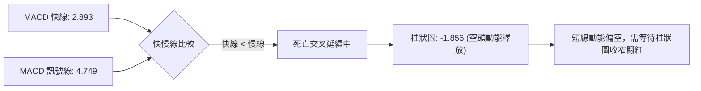

- **MACD 快線 (2.893)** 跌破 **訊號線 (4.749)**，柱狀圖為 **-1.856**。
- 柱狀圖由 2026-08-16 的高檔 +9.868 驟降至當前 -1.856，顯示近兩週多頭動能遭遇劇烈消耗，短期處於空方主導的修正週期。

### 📦 布林通道分析

```
NBIS 布林通道 (20日, 2.0σ) 結構圖
$276.80 ┬──────────────────────────────────────── 上軌 (Upper Band)
        │
        │
$222.03 ┼──────────────────────────────────────── 中軌 (MA20 Baseline)
$218.48 ┼ - - - - - - - - ● - - - - - - - - - - - 當前收盤價 (%B = 0.47)
        │
        │
$167.26 ┴──────────────────────────────────────── 下軌 (Lower Band)
```

- **通道帶寬**：上軌 **$276.80**，下軌 **$167.26**，帶寬達 $109.54 (50.1%)，顯示歷史波動率極大。
- **%B 指標**：**0.47**，表明股價精確運行於中軌 ($222.03) 略下方，處於常態中樞震盪區，未觸及極端邊界。

### 💹 成交量分析（量價配合度）

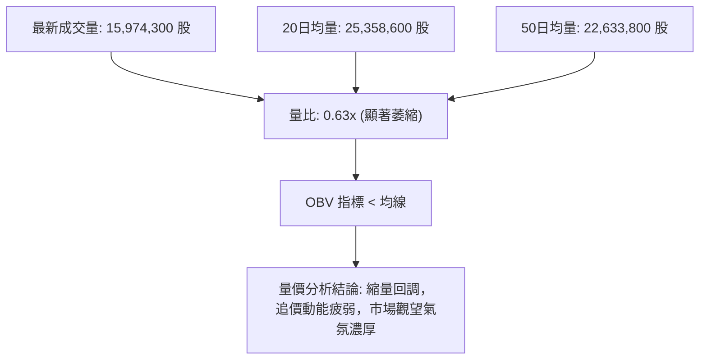

- **量能萎縮**：最新日成交量僅 1,597 萬股，遠低於 20日均量 2,535 萬股（量比 0.63x），顯示股價下跌過程中賣壓並未恐慌性宣洩，但多頭承接意願亦屬消極。
- **OBV 趨勢**：OBV 低於其移動平均線，表明過去一段時間資金呈現淨流出狀態，量能尚未確認價格展開新一輪上升走勢。

---

## 6. 動能與波動率

### ⚡ 動能評估四象限

| 象限 | 動能強度 (RSI/MACD) | 波動率水準 (ATR/Beta) | 當前狀態 | 技術評估與操作意涵 |
|------|----------------------|-----------------------|----------|--------------------|
| **Q1 (高動能·低波動)** | 強 (RSI>60, MACD>0) | 低 (ATR%<5%) | — | 穩定主升浪，最佳加碼機會 |
| **Q2 (弱動能·低波動)** | 弱 (RSI<50, MACD<0) | 低 (ATR%<5%) | — | 沉悶築底，等待催化劑 |
| **Q3 (強動能·高波動)** | 強 (RSI>60, MACD>0) | 高 (ATR%>8%) | — | 爆發性突破，高風險高收益 |
| **Q4 (弱動能·高波動)** | **弱 (RSI 57.8, MACD<0)** | **高 (ATR 9.88%, Beta 1.43)** | **✓ NBIS 當前位置** | **高檔寬幅震盪洗盤，嚴控倉位與止損** |

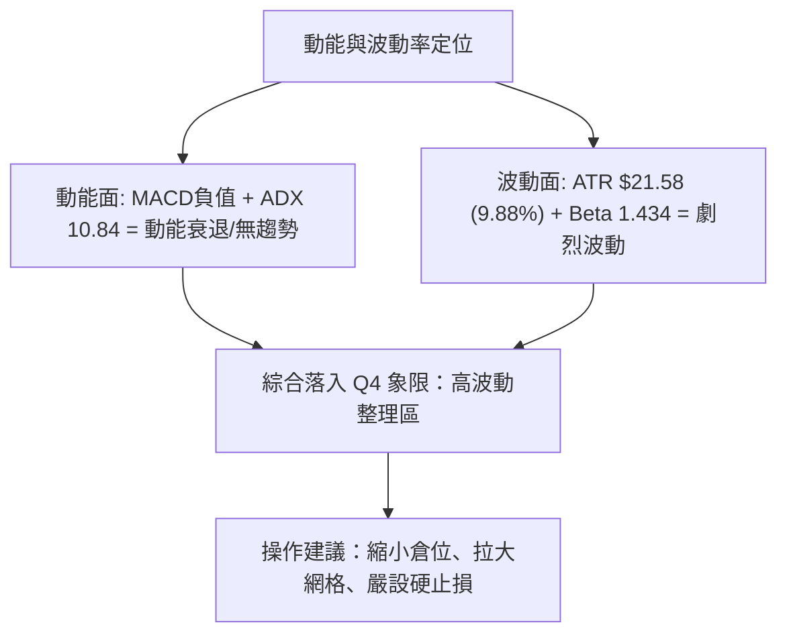

### 📊 ATR 波動率分析

- **ATR(14) 數值**：**$21.58**（佔股價比例高達 **9.88%**）。
- **止損距離建議**：
  - **1.0 × ATR 距離**：$21.58，適合極短線日內交易防守。
  - **1.5 × ATR 距離**：$32.37，適合波段操作防守點位（$218.48 - $32.37 = $186.11，貼近斐波 50.0% $181.56）。
  - **2.0 × ATR 距離**：$43.16，適合中長線戰略止損（$218.48 - $43.16 = $175.32，剛好保護 2026-07 波段低點 $177.71）。

### 📐 Beta 與市場相關性

- **Beta 係數**：**1.434**。
- **市場特徵解讀**：該標的波動幅度為標普500大盤的 1.43 倍，具備典型高 Beta 成長型科技/AI 基礎設施股特徵。當科技板塊整體出現 Beta 級別回調時，NBIS 具備放大波動的下行風險；反之大盤回暖時彈性極大。

---

## 7. 多時框架總結

### 📋 時框架評分表

| 時框架 | 趨勢方向 | 動能狀態 | 均線排列 | 形態結構 | 綜合評分 | 交易建議 |
|--------|----------|----------|----------|----------|----------|----------|
| **長期 (月線)** | 🟢 強勢多頭 | 🟢 保持強勁 | 🟢 MA120/MA240 陡峭向上 | 24個月大級別上升通道 | **80/100** | 長期持股續抱，底倉不動 |
| **中期 (週線)** | 🟡 寬幅箱體 | 🔴 MACD柱轉負 | 🟡 多頭排列但面臨回踩 | 雙頂受阻與高檔洗盤 | **48/100** | 區間操作，高拋低吸 |
| **短期 (日線)** | 🔴 弱勢整理 | 🔴 均線反壓 | 🔴 跌破 MA20/MA50 | 短期均線收斂壓制 | **38/100** | 嚴禁追高，等待止跌訊號 |

### 🔲 綜合訊號矩陣

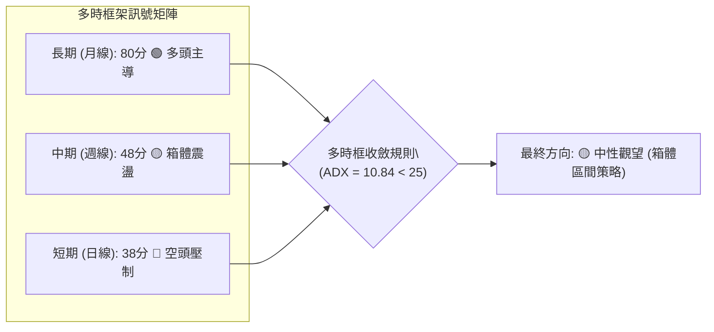

### ⚖️ 多時框收斂結論

依據多時框收斂規則：
1. **行情屬性判定**：當前 **ADX(14) = 10.84 (< 25)**，明確屬於**弱趨勢／無方向盤整行情**。
2. **時框優先級收斂**：在無單邊趨勢下，日線與週線均陷入均線糾結與震盪，不得採用單邊趨勢突破策略，而必須以**日線布林通道上下軌 ($167.26 - $276.80) 及關鍵支撐阻力 (S1 $200.30 - R1 $231.17)** 作為主要震盪交易區間。
3. **唯一定向結論**：**🟡 中性觀望（箱體震盪整理）**。技術評分為 **50/100**，短線多空力道均衡，無單邊持續性動力。

---

## 8. 交易策略建議

### 🗺️ 策略決策流程圖

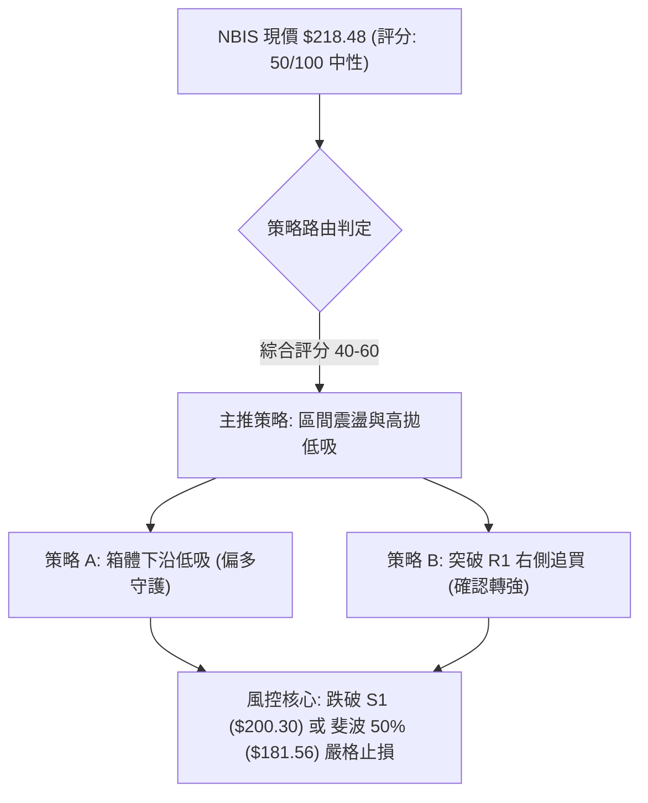

### 🧭 策略路由

> **當前主策略方向 = 🟡 區間震盪操作（等待突破確認）（依技術評分 50/100）**
> 
> 由於綜合評分恰好落在 40–60 之中性區間，市場處於布林帶中軌附近拉鋸。策略核心為：**不追高、在關鍵支撐位附近分批低吸，或等待放量突破 R1 後行右側確認進場**。

### 🎯 價格情境階梯（Price Scenarios）

| 觸發條件 | 下一目標 | 後續延伸 | 情境含義 |
|----------|----------|----------|----------|
| **放量突破 R1 $231.17** | **R2 $279.83** | **R3 $299.86** | 短線轉強，重啟對箱頂與歷史高點之挑戰 |
| **站穩現價 $218.48 區間** | **R1 $231.17** | **S1 $200.30** | 延續 $200.30 - $231.17 狹幅箱體震盪 |
| **有效跌破 S1 $200.30** | **S2 $164.31** | **S3 $145.80** | 中期轉弱，回踩布林下軌與 MA200/MA240 尋求防守 |

### 📊 情境機率分佈

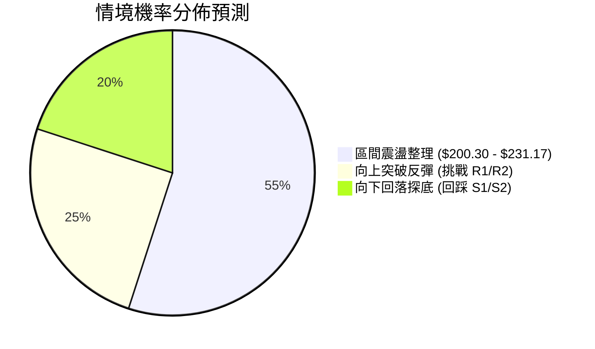

| 情境 | 機率 | 主要依據 |
|------|------|----------|
| **區間震盪** | **55%** | ADX 10.84 顯示無單邊動力，布林 %B 0.47，量能急劇萎縮 (量比 0.63x)，籌碼進行中樞沉澱 |
| **向上反彈** | **25%** | 長期均線保持多頭排列，+DI (28.53) 略高於 -DI，分析師共識目標價 ($286.69) 提供基本面底氣 |
| **向下探底** | **20%** | MACD 柱狀圖負值 (-1.856)，OBV 疲軟，短期均線 MA10/MA20 反壓壓制 |

### 🟢 主策略詳情（區間操作策略）

| 策略要素 | 策略 A（區間下沿逢低布局） | 策略 B（右側突破追動能） |
|----------|----------------------------|--------------------------|
| **策略類型** | 左側逢低掛單低吸 | 右側放量突破進場 |
| **進場條件** | 回踩斐波 38.2% / S1 支撐帶出現止跌K線 | 日K線實體放量收盤站穩 R1 阻力位 |
| **進場價格** | **$209.48**（可於 $200.30 - $209.48 分批） | **$232.00**（突破 R1 $231.17 後確認） |
| **目標價 T1** | **$231.17** (R1 阻力位) | **$279.83** (R2 箱體頂部) |
| **目標價 T2** | **$279.83** (R2 阻力位) | **$299.86** (R3 歷史高點) |
| **止損價格** | **$195.00** (嚴格跌破 S1 $200.30 下方) | **$218.00** (假突破跌回 MA20 之下) |
| **風險報酬比** | **1 : 2.50** (風險 $14.48 / 報酬 $36.19至T1/T2均值) | **1 : 3.42** (風險 $14.00 / 報酬 $47.83至T1) |
| **成功機率** | **65%** | **55%** |
| **建議倉位** | **10% - 15%** (分批建倉) | **10%** (動能追隨倉) |

### 🔴 反向風險觸發點（對沖提示）

- **全面停損／對沖警訊**：若日K線跌破 **S1 $200.30** 且成交量放大，意味 38.2% 回調位徹底失守，將直接觸發向 **S2 $164.31** 的深度回調，此時所有多頭倉位應無條件減倉 50% 以上或建立反向空頭對沖。
- **做空觸發條件**：若股價反彈至 **R1 $231.17** 再次出現長上影線且 MACD 柱狀圖無力翻紅，可輕倉博弈回踩 S1。

### ⭐ 整體訊號強度評星

```
╔══════════════════════════════════════════════════════════════════╗
║ 做多訊號強度：★★☆☆☆  (2.5/5星) — 長多短空，需待短線落底確認    ║
║ 做空訊號強度：★★☆☆☆  (2.0/5星) — 長期均線強撐，下行空間受限    ║
║ 整體可信度：  ★★★☆☆  (3.5/5星) — ADX過低，形態處於震盪沉澱期 ║
╚══════════════════════════════════════════════════════════════════╝
```

---

## 9. 風險提示與監控

### ✅ 關鍵監控指標 Checklist

```
╔══════════════════════════════════════════════════════════════════╗
║                     日常交易風控監控清單                         ║
╠══════════════════════════════════════════════════════════════════╣
║ [ ] 價格是否跌破 S1 關鍵防線 $200.30 (若收盤跌破立即觸發風控)   ║
║ [ ] 價格是否放量突破 R1 $231.17 (確認短線修正結束訊號)           ║
║ [ ] MACD 柱狀圖是否由負轉正 (觀察動能修復進度)                   ║
║ [ ] 日成交量是否回升至 20日均量 (25,358,600股) 以上              ║
║ [ ] ADX(14) 是否突破 25 (確認單邊趨勢重新啟動)                   ║
║ [ ] 空頭回補動向：Short % Float 高達 23.4%，留意逼空潛在爆發力   ║
╚══════════════════════════════════════════════════════════════════╝
```

### ⚠️ 風險場景分析

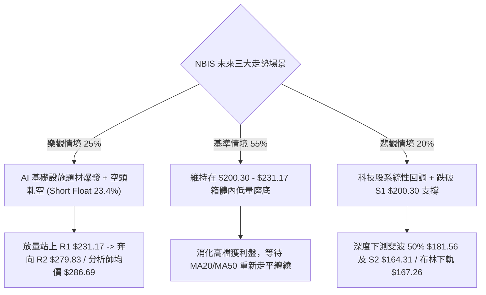

### 🛡️ 風險管理重要提醒

1. **極高波動性風險**：NBIS 的 ATR(14) 高達 **$21.58 (9.88%)**，Beta 為 **1.434**。單日震幅常態性接近 10%，嚴禁使用高槓桿，單筆交易虧損金額不得超過總資產的 **1.0% - 1.5%**。
2. **高放空比例軋空風險 (Short Squeeze)**：該股空頭佔流通盤比例高達 **23.4%**，Short Ratio 為 2.12。一旦基本面出現利多或技術面強勢突破 R1 ($231.17)，極易誘發暴力軋空行情，空頭切忌盲目追空。
3. **流動性與縮量警訊**：近期成交量大幅降至 1,597 萬股（量比 0.63x），流動性收縮代表滑點成本增加，大資金建倉與撤離需分批進行。

---

## 📋 報告總結

```
╔══════════════════════════════════════════════════════════════════╗
║                   NBIS 技術分析報告總結                          ║
╠══════════════════════════════════════════════════════════════════╣
║ 報告日期：2026-08-28                                             ║
║ 當前價格：$218.48                                                ║
║ 分析評級：⚖️ 中性觀望 (NEUTRAL / 區間震盪)                         ║
║                                                                  ║
║ 關鍵結論：                                                       ║
║ ├─ 長期趨勢：🟢 強勢多頭 (MA120/MA240 向上，大週期架構健康)     ║
║ ├─ 中期趨勢：🟡 寬幅箱體整理 ($177.71 - $279.83)                 ║
║ ├─ 短期趨勢：🔴 偏弱整理 (受制於 MA10 $232.34 與 MA20 $222.03)  ║
║ ├─ 關鍵支撐：S1: $200.30 ｜ S2: $164.31 ｜ 斐波38.2%: $209.48   ║
║ ├─ 關鍵阻力：R1: $231.17 ｜ R2: $279.83 ｜ 52W高點 R3: $299.86  ║
║ └─ 分析師目標：均價 $286.69 (16位分析師 Strong Buy)             ║
║                                                                  ║
║ 最優策略組合：                                                   ║
║ 1. 🥇 最佳機會：區間下沿 $200.30 - $209.48 逢低分批吸納 (策略A)   ║
║ 2. 🥈 次選機會：放量突破 R1 $231.17 後右側跟進做多 (策略B)       ║
║ 3. 🥉 保守選擇：場外觀望，待 ADX > 25 且 MACD 翻紅再行介入        ║
╚══════════════════════════════════════════════════════════════════╝
```

---

> ⚠️ **免責聲明**：本報告為技術分析研究，所有數據及估算均基於歷史價格與客觀技術指標計算。本報告**僅供研究與學術參考**，**不構成任何投資建議**。投資有風險，入市需謹慎。

---

*報告生成時間：2026-08-28 ｜ 數據來源：Yahoo Finance ｜ 分析框架：多時框技術分析*