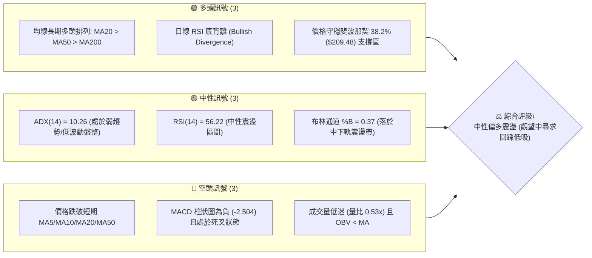
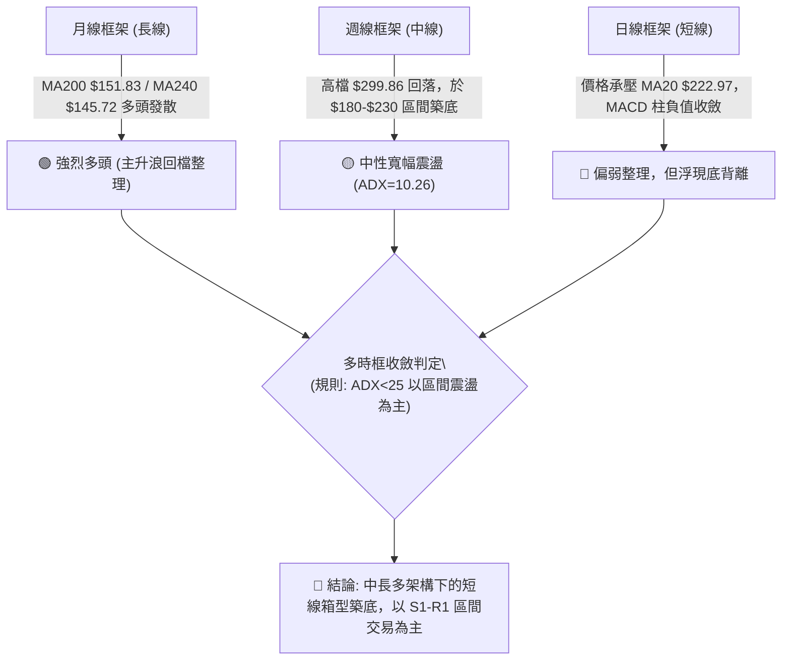
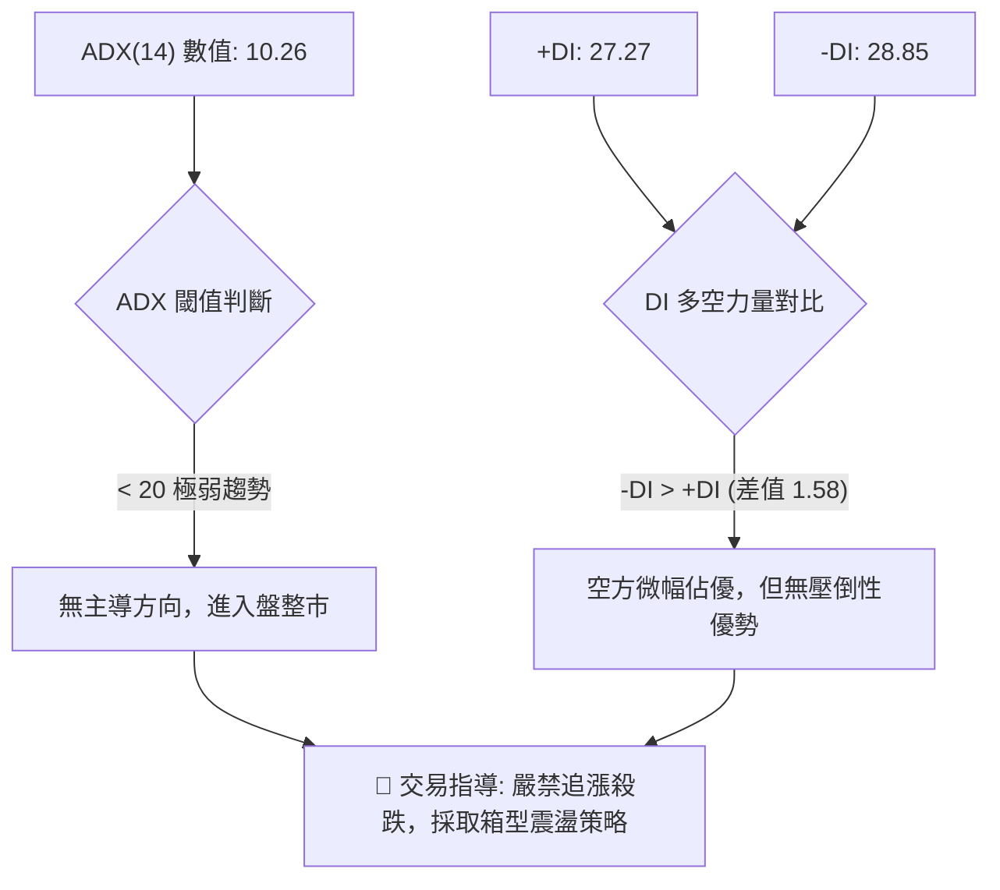
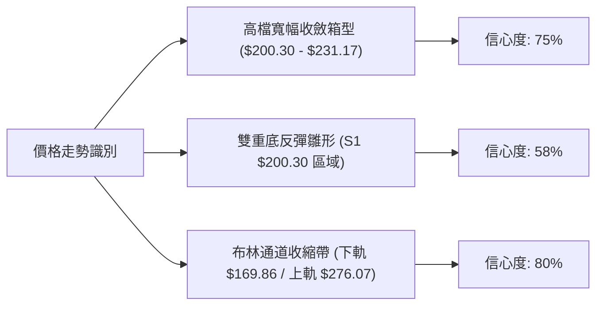
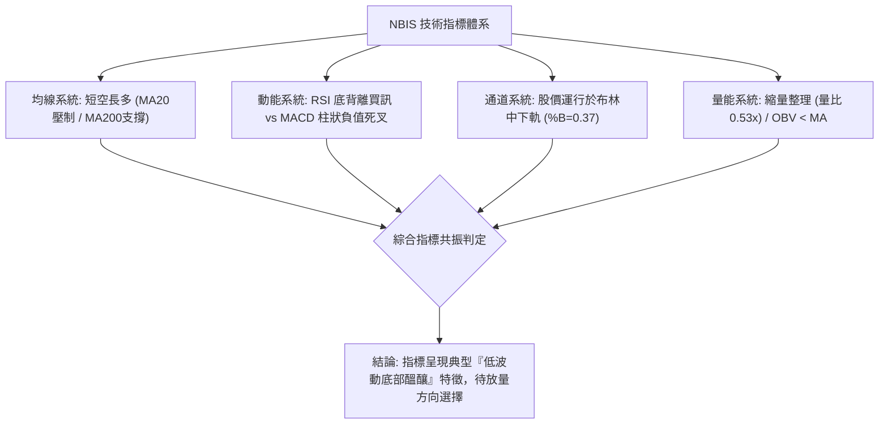
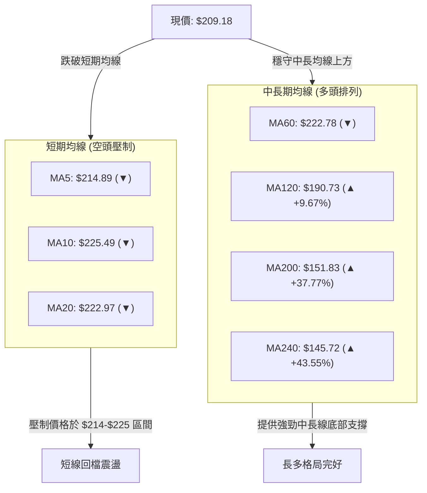
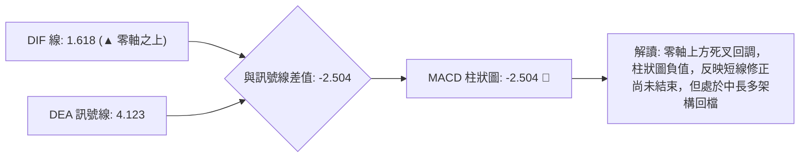
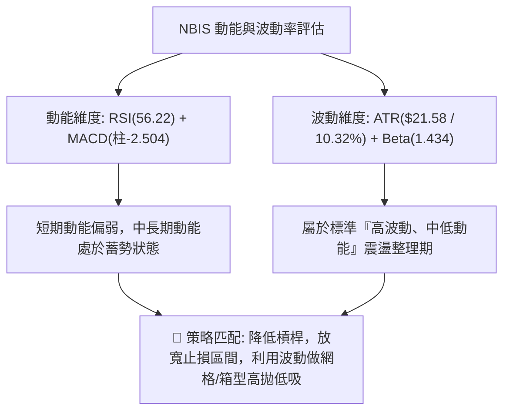
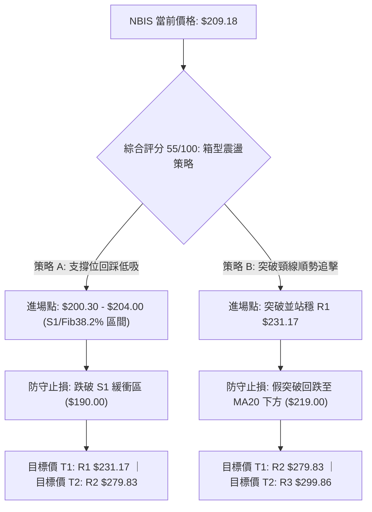
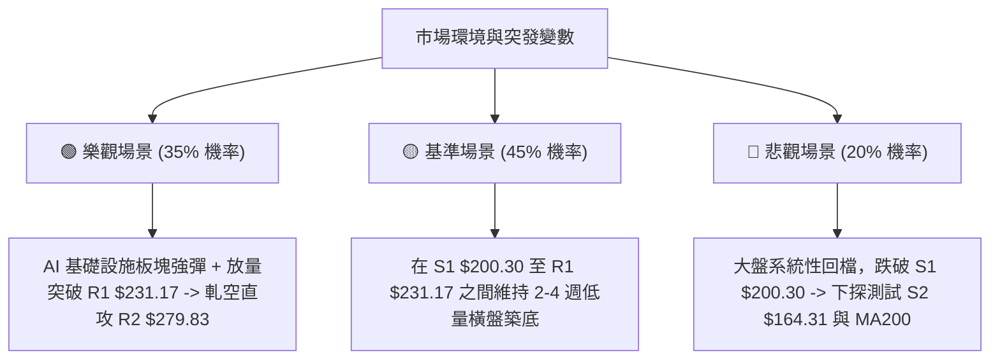

# NBIS 技術分析報告

> **報告日期**：2026-08-30 ｜ **語言**：繁體中文 ｜ **數據來源**：Yahoo Finance ｜ **當前價格**：$209.18

---

## 目錄

| 章節 | 內容 |
|------|------|
| [1. 技術面概覽](#1-技術面概覽) | 訊號儀表板、核心指標、評分卡 |
| [2. 趨勢分析](#2-趨勢分析) | 多時框趨勢、長中短期走勢 |
| [3. 圖表形態分析](#3-圖表形態分析) | 形態識別、K線組合、目標價 |
| [4. 支撐與阻力](#4-支撐與阻力) | 關鍵價位、斐波那契回調 |
| [5. 技術指標深度解讀](#5-技術指標深度解讀) | MA/RSI/MACD/布林/成交量 |
| [6. 動能與波動率](#6-動能與波動率) | 動能評估、ATR、Beta |
| [7. 多時框架總結](#7-多時框架總結) | 時框架評分矩陣 |
| [8. 交易策略建議](#8-交易策略建議) | 多空策略、風險報酬比 |
| [9. 風險提示與監控](#9-風險提示與監控) | 監控指標、風險場景 |

---

## 1. 技術面概覽

### 🎯 技術訊號儀表板



### 📊 核心指標速覽表

| 指標類別 | 指標名稱 | 當前數值 | 訊號 | 解讀 |
|----------|----------|----------|------|------|
| **價格** | 當前價格 | $209.18 | 🟡 | 位於52週區間 61.7% 分位，處於波段回調震盪位 |
| **均線** | MA20 | $222.97 | 🔴 | 價格低於 20 日線 (-6.18%)，短線承壓 |
| **均線** | MA50 | $219.38 | 🔴 | 價格低於 50 日線 (-4.65%)，中期回檔確認 |
| **均線** | MA200 | $151.83 | 🟢 | 價格遠高於年線 (+37.77%)，長期多頭格局未變 |
| **動能** | RSI(14) | 56.22 | 🟢 | 中性偏強，且已觸發日線級別「底背離」買訊 |
| **動能** | MACD (12,26,9) | 1.618 / 4.123 (柱 -2.504) | 🔴 | DIF 線低於訊號線，柱狀圖負值，短線修正中 |
| **動能** | KD 隨機指標 | %K 23.39 / %D 30.94 | 🟡 | 接近超賣區 (%K<30)，具備超跌反彈動能 |
| **趨勢** | ADX / DMI | ADX 10.26 / +DI 27.27 / -DI 28.85 | 🟡 | ADX < 25 屬無趨勢盤整市，-DI 略高於 +DI 空方微佔優 |
| **通道** | 布林通道 (20,2) | 上 $276.07 / 中 $222.97 / 下 $169.86 | 🟡 | %B = 0.37，股價處中軌與下軌間之弱勢整理區 |
| **量能** | 成交量 / OBV | 1,308.88 萬 (量比 0.53x) | 🔴 | 量能大幅萎縮，OBV < MA 反映買盤觀望 |
| **波動** | ATR(14) | $21.58 (10.32%) | 🔴 | 高波動標的，單日波幅劇烈，需寬止損設定 |

### 🏆 技術評分卡

```
╔══════════════════════════════════════════════════════════════╗
║              技術評分卡 — NBIS (2026-08-30)                  ║
╠══════════════════════════════════════════════════════════════╣
║ 趨勢強度 (ADX/DMI)  ████░░░░░░░░░░░░░░░░  25/100 🔴 弱趨勢/盤整 ║
║ 動能指標 (RSI/MACD) ██████████░░░░░░░░░░  52/100 🟡 中性底背離 ║
║ 支撐穩定度 (Fib/S1) ██████████████░░░░░░  70/100 🟢 關鍵支撐強 ║
║ 成交量配合 (Volume) ██████░░░░░░░░░░░░░░  30/100 🔴 縮量整理   ║
║ 形態完整度 (Pattern)████████████░░░░░░░░  60/100 🟡 箱型收斂   ║
║ 均線排列 (MA System)██████████████░░░░░░  72/100 🟢 長多短空   ║
╠══════════════════════════════════════════════════════════════╣
║ 綜合技術評分        ███████████░░░░░░░░░  55/100 🟡 中性盤整   ║
╚══════════════════════════════════════════════════════════════╝
```

---

## 2. 趨勢分析

### 🌐 多時框趨勢分析



### 📈 長期趨勢 — 12個月走勢圖（Unicode）

```
NBIS 月線走勢圖（2025-09 至 2026-08）
價格軸 ($)
$300 ┤                                      ● (52W高點 $299.86 / 06月)
$270 ┤                                  ●   │
$240 ┤                              ●   │   │
$210 ┤                              │   │   │       ●← 當前現價 $209.18
$180 ┤                              │   │   │   ●   │
$150 ┤                          ●   │   │   │   │   │
$120 ┤  ●   ●                   │   │   │   │   │   │
$90  ┤  │   │   ●   ●   ●   ●   │   │   │   │   │   │
$60  ┤  │   │   │   │   │   │   │   │   │   │   │   │
     └──┴───┴───┴───┴───┴───┴───┴───┴───┴───┴───┴───┴──
       09  10  11  12  01  02  03  04  05  06  07  08 (月份)
       2025年                       2026年
```

#### 走勢特徵分析表格

| 階段 | 時間區間 | 起止價位 | 漲跌幅 | 走勢特徵與量能解析 |
|------|----------|----------|--------|-------------------|
| **第一波啟動** | 2025-05 ~ 2025-10 | $36.75 → $130.82 | +255.97% | AI 基礎設施算力需求激增，機構資金大舉建倉，量價齊揚 |
| **中期箱型洗盤** | 2025-11 ~ 2026-02 | $130.82 → $91.19 | -30.29% | 獲利回吐與均線靠攏，於 $83-$95 構築堅實中繼平台 |
| **主升浪爆發** | 2026-03 ~ 2026-06 | $91.19 → $276.17 | +202.85% | 營收年增 454% 基本面驅動，突破歷史高點並創 $299.86 紀錄 |
| **高檔劇烈回撤** | 2026-07 ~ 2026-08 | $276.17 → $209.18 | -24.26% | 獲利籌碼套現，回測斐波那契 38.2% ($209.48) 與 MA120 ($190.73) |

### 📊 中期趨勢（週線分析）

```
NBIS 週線價格架構示意
$299.86 ─────────────────────── 52W High (R3 歷史天花板)
          \
           \  $279.83 ──────── 波段反彈高點 (R2 密集成交阻力)
            \   /   \
             \ /     \ $231.17 ── 20週均線壓制位 (R1 頸線阻力)
              V       \   /
                       \ / ◄── 當前價格 $209.18 (回測 Fib 38.2%)
                        V  $200.30 ── 近期波段密集低點 (S1 支撐)
                           $164.31 ── 前波深幅回踩低點 (S2 強支撐)
```

- **週線形態特徵**：2026-08-16 週創出 $277.68 高點後，隨後兩週成交量連續萎縮（從 1.67 億股降至 7,015 萬股），收盤價回落至 $209.18。
- **均線支撐測試**：當前股價回調至 MA120 ($190.73) 與 MA60 ($222.78) 之間的緩衝帶，下方 $200.30 (S1) 構成中期防守的核心關卡。

### ⚡ 趨勢強度評估（ADX 解讀）



#### ADX 趨勢強度對照表

| 指標參數 | 數值 | 參考標準 | 當前市場狀態判定 |
|----------|------|----------|------------------|
| **ADX(14)** | **10.26** | < 20 (極弱/盤整) ｜ 20-25 (弱) ｜ > 25 (趨勢成型) ｜ > 40 (強趨勢) | **無方向性弱震盪**，趨勢動能處於休眠狀態 |
| **+DI (14)** | **27.27** | 多方買盤推動力 | 多方力量適中，但缺乏量能催化突破 |
| **-DI (14)** | **28.85** | 空方賣壓推動力 | 空方略高於多方，空方佔據微弱短線優勢 |
| **狀態總結** | -DI 略高於 +DI | ADX 遠低於 25 | **非單邊趨勢行情**；遵循規則 14，以日線布林通道 ($169.86 - $276.07) 與 S1/R1 區間為主要操作範圍 |

---

## 3. 圖表形態分析

### 🔍 形態識別系統



#### 圖表形態信心度評估表（依規則 15）

| 形態名稱 | 信心度 | 判斷依據（引用數據） | 完成度 | 目標價（附精確計算式） |
|----------|--------|----------------------|--------|------------------------|
| **箱型整理平台** | **75%** | 近期收盤在 S1 $200.30 獲得支撐，受制於 R1 $231.17，振幅收斂 | 85% | 向上突破：頸線 $231.17 + 箱高 ($231.17 - $200.30 = $30.87) = **$262.04**（接近 R2 $279.83 前哨） |
| **潛在雙重底** | **58%** | 7月中旬低點 ($177.71) 與近期低點聚類 S1 ($200.30) 形成次低點抬高 | 50% | 若突破頸線 R1 $231.17，形態高度 $30.87，推算量度目標價為 **$262.04** |
| **頭肩頂形態** | **35%** | 數據不足（左肩 05/31 $231.09，頭部 06/21 $286.69，右肩 08/16 $277.68，但頸線尚未有效跌破 $164.31） | 30% | 信心度 < 50%，依規則 15 不予採納為主要判斷依據 |

### 🕯️ 重要K線形態分析

| 週期/月份 | 收盤價 | K線形態 | 解讀 | 訊號強度 |
|-----------|--------|---------|------|----------|
| **2026-06-21 週** | $286.69 | **長上影射擊之星** | 衝高 $299.86 遇強大獲利了結賣壓，週成交量達 9,236 萬股，確立頂部區域 | 🔴 強空訊號 |
| **2026-07-19 週** | $177.71 | **長下影錘頭線** | 股價單週下探後大幅回抽，成交量放大至 1.0 億股，確認 S2 $164.31 之上具買盤 | 🟢 強多訊號 |
| **2026-08-16 週** | $277.68 | **巨量長陽破頂線** | 單週巨量 1.67 億股暴拉，空頭回補（軋空 23.4% 做空盤），觸及 R2 $279.83 阻力區 | 🟢 短多轉折 |
| **2026-08-30 週** | $209.18 | **縮量小陰十字星** | 單週量能驟減至 7,015 萬股，多空僵持於斐波那契 38.2% ($209.48)，賣壓顯著減輕 | 🟡 中性築底 |

### 📉 ASCII 走勢形態示意圖

```
NBIS 箱型收斂與底背離形態示意
$299.86 ─── 頭部 (52W High)
             \
  $277.68 ────\─────── 反彈高點 (R2 $279.83)
               \     / \
  $231.17 ──────\───/───\───── 箱型上軌 / 頸線阻力 (R1)
                 \ /     \ 
  $209.18 ────────●───────●── 現價 / 斐波那契 38.2% ($209.48)
                 /         \
  $200.30 ──────●───────────●─ 箱型底邊支撐 (S1)
               /
  $164.31 ────●────────────── 前期深跌低點 (S2)
────────────────────────────────────────────────────────────
RSI(14)  :  34.8 ───────→ 56.22  [↗↗ 底背離形成 ↗↗]
```

### 🎯 形態目標價計算

依據標準形態學原理推導：
1. **箱型突破目標價**：
   $$\text{目標價} = \text{突破頸線 (R1)} + \text{形態高度} = \$231.17 + (\$231.17 - \$200.30) = \$231.17 + \$30.87 = \mathbf{\$262.04}$$
2. **區間破位下行目標價**（若 S1 遭放量跌破）：
   $$\text{下行目標價} = \text{跌破底邊 (S1)} - \text{形態高度} = \$200.30 - \$30.87 = \mathbf{\$169.43} \quad (\text{高度吻合布林下軌 } \$169.86 \text{ 與 S2 } \$164.31)$$

---

## 4. 支撐與阻力

### 🗺️ 關鍵價位分布圖（Unicode）

```
NBIS 價位結構分布圖 (由 OHLCV 與斐波那契精確計算)
═════════════════════════════════════════════════════════════════════
$299.86 ║██████████████████████████████║ 強阻力 R3 (52週歷史高點 / Fib 0.0%)
$279.83 ║██████████████████████        ║ 阻力 R2 (近一年次高波段高點聚類)
$276.07 ║▓▓▓▓▓▓▓▓▓▓▓▓▓▓▓▓▓▓▓▓▓▓        ║ 布林通道上軌阻力
$244.02 ║░░░░░░░░░░░░░░░░░░░░░         ║ 斐波那契 23.6% 回調位
$231.17 ║████████████████████          ║ 關鍵阻力 R1 (波段高點 / 箱型頸線)
$222.97 ║▒▒▒▒▒▒▒▒▒▒▒▒▒▒▒▒▒▒            ║ 短期均線壓制帶 (MA20 / 布林中軌)
────────╫──────────────────────────────╫────────────────────────────
$209.48 ║████████████████              ║ 斐波那契 38.2% 關鍵黃金分割位
$209.18 ╠══════════════════════════════╣ ◄ 現價 ($209.18)
$200.30 ║████████████████████          ║ 近期核心支撐 S1 (波段低點聚類)
$181.56 ║░░░░░░░░░░░░░░░░              ║ 斐波那契 50.0% 強弱分水嶺
$169.86 ║▓▓▓▓▓▓▓▓▓▓▓▓                  ║ 布林通道下軌
$164.31 ║████████████████████████      ║ 強支撐 S2 (波段深幅低點聚類)
$151.83 ║▒▒▒▒▒▒▒▒▒▒▒▒                  ║ 長期牛熊分界線 (MA200 年線)
$145.80 ║██████████████████████████████║ 極限強支撐 S3 (歷史籌碼密集區)
═════════════════════════════════════════════════════════════════════
```

### 🚧 阻力位分析表

| 阻力級別 | 價位 | 距現價空間 | 形成原因 | 突破難度 | 重要性評級 |
|----------|------|------------|----------|----------|------------|
| **R1 (關鍵阻力)** | **$231.17** | +10.51% | 近一年波段高點聚類，疊加 MA20 ($222.97) 及 MA60 ($222.78) 均線密集壓制區 | 中等 | 🟢🟢🟢 (多空短線分水嶺) |
| **R2 (重大阻力)** | **$279.83** | +33.78% | 2026年8月中旬爆量反彈高點聚類，布林上軌 ($276.07) 延伸阻力 | 高 | 🟢🟢 (中期上行天花板) |
| **R3 (極限阻力)** | **$299.86** | +43.35% | 52週最高價，歷史套牢籌碼峰頂部 | 極高 | 🟢 (長期歷史天花板) |

### 🛡️ 支撐位分析表

| 支撐級別 | 價位 | 距現價空間 | 形成原因 | 守住機率 | 重要性評級 |
|----------|------|------------|----------|----------|------------|
| **S1 (近期支撐)** | **$200.30** | -4.25% | 近一年波段低點聚類，整數心理關卡，緊貼 Fib 38.2% ($209.48) | 70% | 🟢🟢🟢 (短線防守底線) |
| **S2 (強支撐)** | **$164.31** | -21.45% | 近一年波段深幅下探低點聚類，布林下軌 ($169.86) 與 MA120 ($190.73) 下方緩衝區 | 85% | 🟢🟢 (中期趨勢防線) |
| **S3 (極限強支撐)** | **$145.80** | -30.30% | MA240 ($145.72) 與 MA200 ($151.83) 形成之牛熊生命線共振支撐 | 95% | 🟢 (長線多頭最後堡壘) |

### 📐 斐波那契回調位分析

依據 52 週完整波動區間（低點 $63.26 → 高點 $299.86，總落差 $236.60）精確計算：

| 斐波那契回檔比例 | 精確價位 | 距現價位置 | 技術意義解讀 |
|------------------|----------|------------|--------------|
| **0.0% (52W High)** | **$299.86** | +43.35% | 歷史頂部阻力位 |
| **23.6% 回調位** | **$244.02** | +16.66% | 強勢回檔阻力位，突破此位代表重啟主升浪 |
| **38.2% 回調位** | **$209.48** | **+0.14% (現價緊貼)** | **黃金分割支撐位**。現價 $209.18 完美貼合此位，屬強勢整理極限回檔區 |
| **50.0% 回調位** | **$181.56** | -13.20% | 多空中期平衡分水嶺，跌破意味多頭結構轉弱 |
| **61.8% 回調位** | **$153.64** | -26.55% | 關鍵黃金分割防守位，緊鄰 MA200 ($151.83) |
| **78.6% 回調位** | **$113.89** | -45.55% | 深幅回檔重挫區 |
| **100.0% (52W Low)**| **$63.26** | -69.76% | 起漲原點 |

- **現價位置解讀**：現價 $209.18 恰好運行於 **38.2% ($209.48)** 與 **50.0% ($181.56)** 之間，且極度貼近 38.2% 關鍵黃金分割線。只要日線收盤價不實質跌破 S1 ($200.30)，此波自 $299.86 的回調即屬於強多頭框架下的「標準幅度修正」。

---

## 5. 技術指標深度解讀

### 🎛️ 指標訊號總覽



### 📈 移動平均線排列分析



#### 均線詳細數據矩陣

| 均線名稱 | 當前數值 | 距現價差距 | 走勢形態 | 技術意義 |
|----------|----------|------------|----------|----------|
| **MA 5** | $214.89 | -2.66% | 下行 (▼) | 超短期動態壓制線 |
| **MA 10** | $225.49 | -7.23% | 下行 (▼) | 短線反彈第一道天花板 |
| **MA 20** | $222.97 | -6.18% | 下行 (▼) | 月線生命線，當前構成短線主要反壓 |
| **MA 50** | $219.38 | -4.65% | 走平 (▼) | 中期分水嶺 |
| **MA 60** | $222.78 | -6.10% | 走平 (▼) | 與 MA20 高度重合，形成 $222-$223 重度壓力帶 |
| **MA 120**| $190.73 | +9.67% | 上揚 (▲) | 半年線支撐，為中期回調第一防護網 |
| **MA 200**| $151.83 | +37.77%| 上揚 (▲) | 年線多頭大本營，牛熊分界基石 |
| **MA 240**| $145.72 | +43.55%| 上揚 (▲) | 長期多頭成本均線 |

### 📉 RSI(14) 分析

- **當前數值**：**56.22**
- **數值進度條**：`███████████░░░░░░░░░ 56.22%`（處於 30-70 中性平衡偏強區間）
- **背離分析**：
  - **狀態確認**：⚠️ **日線底背離 (Bullish Divergence)** 成立。
  - **細節驗證**：股價在 2026-07-19 探底 $177.71 時 RSI 降至 34.8；隨後股價在 2026-08-30 回測 $209.18 過程中，RSI 指標不降反升至 **56.22**，形成顯著的「價格低點抬高、指標動能走強」之底背離特徵，預示空頭拋壓衰竭，潛在反彈動能正在積聚。

### 📊 MACD(12,26,9) 訊號解讀



- **MACD 線**：1.618（位於 0 軸上方，說明中期仍處多頭控制區）
- **Signal 線**：4.123
- **柱狀圖 (Histogram)**：-2.504（負值區域，短線空頭動能主導）
- **交叉判定**：死叉回調中，但由於 DIF 仍位於零軸之上，此死叉屬於「強勢回檔洗盤」，並非全面性空頭反轉。後續需密切觀察負柱狀圖何時開始縮腳。

### 📦 布林通道分析

```
NBIS 布林通道 (20, 2) 結構圖
$276.07 ┬────────────────────────────────────────── 上軌 (Upper Band)
        │
$222.97 ┼────────────────────────────────────────── 中軌 (MA20 Band)
        │       ● 當前價格: $209.18 (%B = 0.37)
$169.86 ┴────────────────────────────────────────── 下軌 (Lower Band)
```

- **通道帶寬 (Bandwidth)**：$$\frac{\$276.07 - \$169.86}{\$222.97} = 47.63\%$$（高帶寬震盪後正在向內收縮）
- **%B 指標**：**0.37**（位於 0 與 0.5 之間，即下軌與中軌區間）
- **交易意涵**：股價在下半區運行，尚未觸及下軌 $169.86 極端超賣區，在中軌 $222.97 受阻回落，屬於典型的通道內弱勢整理，下軌 $169.86 與 S2 ($164.31) 構成極強共振防護墊。

### 💹 成交量分析（量價配合度）

- **最新成交量**：13,088,800 股
- **20日均量**：24,732,565 股 ｜ **量比**：**0.53x**（顯著縮量，成交量不到均量的一半）
- **OBV 趨勢**：`OBV < MA`（能量潮指標低於均線，資金呈現防守觀望態勢）
- **量價背離診斷**：
  - 在 8 月中旬自 $187.97 暴拉至 $277.68 時，單週放出 1.67 億股巨量；
  - 隨後兩週回落至 $209.18 時，週量迅速萎縮至 7,015 萬股；
  - **「上漲放量、下跌縮量」** 是經典的多頭回檔洗盤特徵，表明主力籌碼並無大規模出逃跡象，目前低迷的量能意味著浮籌已被鎖定，正等待新催化劑進場推升。

---

## 6. 動能與波動率

### ⚡ 動能評估



#### 動能-波動狀態矩陣

| 象限 | 動能強度 | 波動率水準 | 當前狀態判定 | 交易策略指導 |
|------|----------|------------|--------------|--------------|
| **Q1** | 強 (ADX>25, +DI主導) | 低 (ATR<5%) | - | 單邊順勢突破加碼 |
| **Q2** | 弱 (ADX<25, 震盪) | 低 (ATR<5%) | - | 突破前夕靜態觀望 |
| **Q3** | 強 (動能充沛) | 高 (ATR>8%) | - | 高動量追蹤，嚴設移動止盈 |
| **Q4** | **弱/中性 (ADX=10.26)** | **高 (ATR=10.32%)** | **✓ NBIS 當前位置** | **高波動箱型震盪：嚴禁追價，於 S1 支撐低吸，R1 阻力分批止盈** |

### 📊 ATR 波動率分析

- **ATR(14) 精確數值**：**$21.58**（佔當前股價之 **10.32%**）
- **波動特性評估**：NBIS 具備極高的日內與單週波動性，單日正常波動區間即可達 $\pm \$21.58$。
- **止損與部位建議**：
  - **合理止損緩衝距**：一般順勢交易應設定至少 $1.0 \times \text{ATR}$（約 $\$21.58$）至 $1.5 \times \text{ATR}$（約 $\$32.37$）的防守空間，避免被日內隨機噪聲洗出場。
  - **進場止損設置**：若於現價 $209.18 建立多頭部位，嚴格止損應設於 S1 下方約 1 個 ATR 緩衝區（即 $\$200.30 - \$10.00 \approx \$190.30$ 附近）。

### 📐 Beta 與市場相關性

- **Beta 係數**：**1.434**（高於美股大盤 43.4% 的波動彈性）
- **做空比率 (Short % Float)**：**23.4%**（空頭部位高度集中，具備潛在軋空 Short Squeeze 動力）
- **市場連動分析**：作為 AI 算力基礎設施的高成長標的，NBIS 對科技板塊（納斯達克 100 / 費城半導體指數）具高度敏感性。在市場風險偏好上升期，其上漲爆發力極強（如 8 月中旬單週 +47%）；而在流動性收緊或板塊回檔時，回撤幅度亦相對劇烈。

---

## 7. 多時框架總結

### 📋 時框架評分表

| 時框架 | 趨勢方向 | 動能狀態 | 均線排列 | 圖表形態 | 綜合評分 | 操作建議 |
|--------|----------|----------|----------|----------|----------|----------|
| **月線 (長期)** | 🟢 強烈多頭 | 🟢 充沛 (+202%波段) | 🟢 MA200/240 發散向上 | 🟢 歷史大型主升浪 | **85/100** | 長線多單堅定持有 |
| **週線 (中期)** | 🟡 寬幅震盪 | 🟡 縮量整理 | 🟢 守穩 MA60/120 上方 | 🟡 高檔箱型收斂 | **60/100** | 回踩關鍵支撐分批佈局 |
| **日線 (短期)** | 🔴 偏弱整理 | 🟢 RSI 底背離 | 🔴 MA5/10/20 壓制 | 🟡 S1 $200.30 築底中 | **48/100** | 區間操作，嚴禁追高 |

### 🔲 綜合訊號矩陣

```
時框訊號一致性分析
┌──────────────────┬──────────────┬──────────────┬──────────────┐
│ 分析維度         │ 短期 (日線)  │ 中期 (週線)  │ 長期 (月線)  │
├──────────────────┼──────────────┼──────────────┼──────────────┤
│ 趨勢方向 (Trend) │ 🔴 偏弱整理  │ 🟡 寬幅震盪  │ 🟢 多頭主升  │
│ 均線系統 (MAs)   │ 🔴 跌破短均  │ 🟢 守住中均  │ 🟢 遠高年線  │
│ 動能指標 (Osc.)  │ 🟢 RSI底背離 │ 🔴 MACD柱負  │ 🟢 高位維持  │
│ 成交量能 (Vol.)  │ 🔴 縮量觀望  │ 🟡 正常萎縮  │ 🟢 歷史放量  │
└──────────────────┴──────────────┴──────────────┴──────────────┘
```

### ⚖️ 多時框收斂結論（依規則 14 嚴格收斂）

1. **行情性質判定**：當前 **ADX(14) = 10.26 < 25**，依多時框收斂規則，市場處於標準的 **「無趨勢盤整行情 (Range-bound Market)」**。
2. **主導時框與權重分配**：
   - 盤整市以日線布林通道 ($169.86 - $276.07) 與 S1/R1 關鍵價位區間為主導交易依據；
   - 長期月線多頭提供下檔安全邊際（MA200 $151.83 為鐵底）；
   - 短期日線均線壓制僅為震盪箱型內部的次級回撤。
3. **唯一方向性結論**：**中性偏多區間震盪（Neutral to Mild Bullish in Range）**。
   - 綜合技術評分為 **55/100**，多空處於均勢拉鋸。
   - 交易核心邏輯：在長多背景下，依據日線 RSI 底背離及 S1 $200.30 支撐，採取 **「下軌/支撐處低吸、上軌/阻力處高拋」** 的箱型防守型多頭策略。

---

## 8. 交易策略建議

### 🗺️ 策略決策流程圖



### 🧭 策略路由（依評分卡分流）

> **當前主策略方向 = 中性箱型區間操作（以 S1 $200.30 支撐區逢低做多為主，依評分 55/100）**

### 🎯 價格情境階梯（Price Scenarios）

所有價位嚴格引用關鍵價位數據：

| 觸發條件 | 第一目標 (T1) | 第二目標 (T2) | 後續延伸 (T3) | 情境技術含義 |
|----------|---------------|---------------|---------------|--------------|
| **強勢突破 R1 $231.17** | **R2 $279.83** (+33.78%) | **R3 $299.86** (+43.35%) | **分析師高標 $415.00** | 突破箱型頸線，軋空行情啟動，挑戰歷史新高 |
| **守穩現價與 S1 $200.30** | **MA20 $222.97** (+6.59%) | **R1 $231.17** (+10.51%) | **Fib 23.6% $244.02** | 箱型底部獲得支撐，展開技術性均線修復反彈 |
| **有效跌破 S1 $200.30** | **Fib 50% $181.56** (-13.20%) | **S2 $164.31** (-21.45%) | **MA200 $151.83** (-27.42%) | 跌破箱型底邊，下探尋求半年線與年線強支撐 |

### 📊 情境機率分佈

```
情境機率分佈圖
繼續上行/突破反彈  ████████████░░░░░░░░░░░░  35% (依據: RSI底背離、基本面營收+454%、23.4%高做空比例)
區間震盪築底      ████████████████░░░░░░░░  45% (依據: ADX=10.26無趨勢、成交量萎縮0.53x、MA密集交纏)
向下破位回踩深支撐███████░░░░░░░░░░░░░░░░░  20% (依據: MACD柱負值、短均線下行壓制)
```

### 🟢 主策略詳情

| 策略要素 | 策略 A：箱型底部低吸策略（左側/勝率優先） | 策略 B：突破頸線順勢策略（右側/動能優先） |
|----------|-----------------------------------------|-----------------------------------------|
| **適用場景** | 股價回測 S1 $200.30 支撐不破，縮量企穩 | 日線放量突破 R1 $231.17 頸線阻力 |
| **進場條件** | 觸及 $200.30 - $204.00 區間且 15分K 出現反轉陽線 | 日線收盤價 > $231.17 且日成交量 > 2,000 萬股 |
| **進場價格** | **$202.00** | **$232.00** |
| **目標價 T1**| **$231.17** (R1 阻力，漲幅 +14.44%) | **$279.83** (R2 阻力，漲幅 +20.62%) |
| **目標價 T2**| **$279.83** (R2 阻力，漲幅 +38.53%) | **$299.86** (R3 歷史高點，漲幅 +29.25%) |
| **止損價格** | **$190.00** (跌破 S1 且留有 0.5 ATR 緩衝，跌幅 -5.94%) | **$219.00** (跌回 MA50 之下，跌幅 -5.60%) |
| **風險報酬比** | **1 : 2.43** (以 T1 計) ｜ **1 : 6.49** (以 T2 計) | **1 : 3.68** (以 T1 計) ｜ **1 : 5.22** (以 T2 計) |
| **預估勝率** | **62%** | **55%** |
| **建議倉位** | **10% - 15%** (分批建倉) | **10%** (突破確認後建立) |

### 🔴 反向風險觸發點（對沖與風控提示）

若發生以下任一情境，宣告主策略失效，應立即停止做多並啟動防守對沖：
1. **關鍵支撐破位**：日線收盤價跌破 **S1 $200.30**，且次日無法收復，代表箱型支撐瓦解，目標將直指 **S2 $164.31**。
2. **量能異常爆跌**：單日成交量放大至 3,000 萬股以上並收長黑實體K線，跌破 Fib 38.2% ($209.48)。
3. **空頭止損操作**：持有現貨者應在跌破 **$200.30** 時減倉 50%，於 **$190.00** 全數出場觀望。

### ⭐ 整體訊號強度評星

```
╔═══════════════════════════════════════════╗
║ 做多訊號強度：  ★★★☆☆  (3.0 / 5.0 星)      ║
║ 做空訊號強度：  ★★☆☆☆  (2.0 / 5.0 星)      ║
║ 整體技術可信度：★★★★☆  (4.0 / 5.0 星)      ║
╚═══════════════════════════════════════════╝
```

---

## 9. 風險提示與監控

### ✅ 關鍵監控指標 Checklist

```
╔══════════════════════════════════════════════════════════════╗
║              NBIS 交易日常技術監控清單 (Checklist)             ║
╠══════════════════════════════════════════════════════════════╣
║ [ ] 價位監控：收盤價是否站穩 Fib 38.2% ($209.48) 與 S1 ($200.30)  ║
║ [ ] 均線監控：價格是否突破 MA20 ($222.97) 壓力線              ║
║ [ ] 動能監控：MACD 柱狀圖是否由負轉正 (-2.504 縮腳回零)       ║
║ [ ] 量能監控：單日成交量是否回升至 20日均量 (2,473 萬股) 以上   ║
║ [ ] 軋空監控：Short % Float (23.4%) 是否出現空頭回補推升波   ║
║ [ ] 突破確認：日線收盤是否實質突破 R1 ($231.17) 頸線         ║
╚══════════════════════════════════════════════════════════════╝
```

### ⚠️ 風險場景分析



### 🛡️ 風險管理重要提醒

1. **波動率管理（ATR 紀律）**：
   - 鑑於 ATR 高達 **$21.58 (10.32%)**，NBIS 屬於極高波動資產。單筆交易承受風險資金嚴格限制在總投資組合淨值的 **1.0% - 1.5%** 以內。
   - 計算公式：$$\text{最大允許持股股數} = \frac{\text{總資金} \times 1\%}{\text{進場價 } (\$202.00) - \text{止損價 } (\$190.00)} = \frac{\text{總資金} \times 0.01}{\$12.00}$$
2. **高做空比例雙刃劍**：
   - 空頭比例高達 **23.4%**，在缺乏成交量配合時，容易形成鈍化陰跌；但一旦帶量突破 R1 $231.17，極易引發暴烈軋空行情，因此突破策略切忌猶豫，嚴格依訊號執行。
3. **多時框衝突應對**：
   - 目前日線處於空頭均線壓制，但月線年線屬超級大多頭。切勿因日線小幅破位而在中長期支撐位（S2 $164.31 / MA200 $151.83）盲目做空。

---

## 📋 報告總結

```
╔══════════════════════════════════════════════════════════════════╗
║                    NBIS 技術分析報告總結                         ║
╠══════════════════════════════════════════════════════════════════╣
║ 報告日期：2026-08-30                 當前價格：$209.18           ║
║ 分析評級：🟡 區間震盪 / 逢低佈局 (Neutral to Mild Bullish)       ║
╠══════════════════════════════════════════════════════════════════╣
║ 關鍵結論：                                                       ║
║ ├─ 長期趨勢：🟢 強烈多頭 (MA200 $151.83 穩健向上，基本面增長 454%) ║
║ ├─ 中期趨勢：🟡 寬幅震盪 (ADX=10.26 弱趨勢，於 $200-$231 箱型整理)║
║ ├─ 短期趨勢：🟡 止跌回穩 (RSI 出現日線底背離，下檔賣壓衰竭)      ║
║ ├─ 核心支撐：S1 $200.30 ｜ S2 $164.31 ｜ Fib 38.2% $209.48      ║
║ ├─ 核心阻力：R1 $231.17 ｜ R2 $279.83 ｜ R3 $299.86 (52W High)  ║
║ └─ 機構共識：16位分析師「強力買入」，平均目標價 $286.69 (+37.0%) ║
╠══════════════════════════════════════════════════════════════════╣
║ 最優策略組合：                                                   ║
║ 1. 🥇 最佳機會：回踩 S1 支撐區 ($200.30-$204.00) 分批佈局多單     ║
║               (止損 $190.00，目標 T1 $231.17 / T2 $279.83)     ║
║ 2. 🥈 次選機會：放量實質突破 R1 ($231.17) 順勢加碼追擊軋空行情  ║
║               (止損 $219.00，目標 T1 $279.83 / T2 $299.86)     ║
║ 3. 🥉 保守選擇：空手觀望，靜待 ADX > 20 且 MACD 柱狀圖翻正再進場║
╚══════════════════════════════════════════════════════════════════╝
```

---

> ⚠️ **免責聲明**：本報告為技術分析研究成果，所有數據及走勢推演均基於市場歷史價格資訊與量化技術指標運算。本報告**僅供研究與學術參考**，**不構成任何形式的個人化投資建議與買賣邀約**。金融市場瞬息萬變，投資具有高度風險，交易者應獨立評估風險並自負盈虧。

---

*報告生成時間：2026-08-30 ｜ 數據來源：Yahoo Finance ｜ 分析框架：多時框技術分析體系*