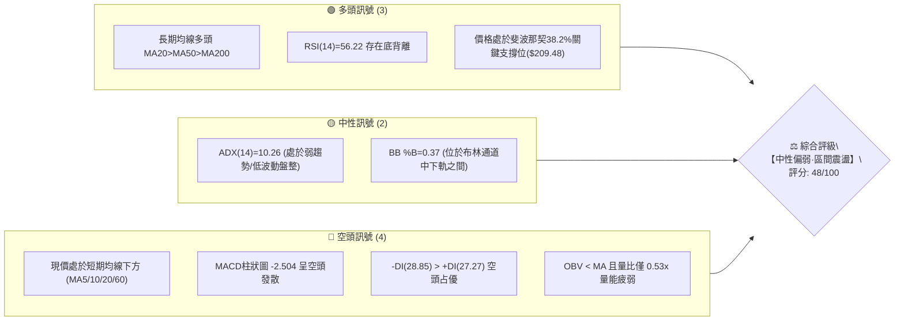
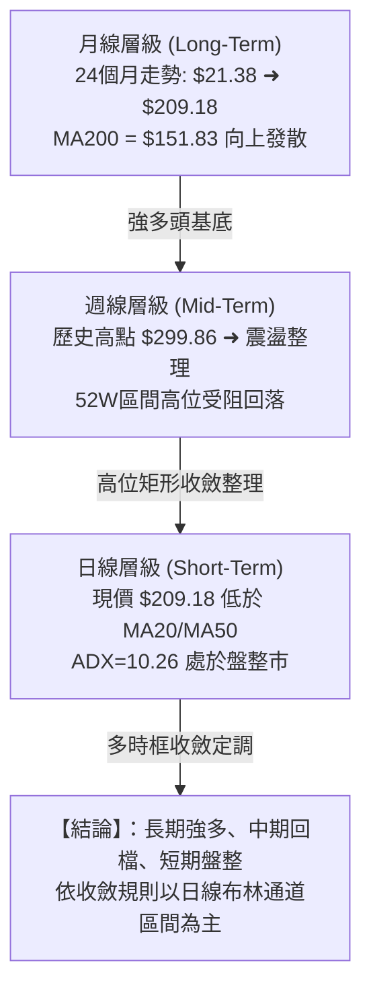
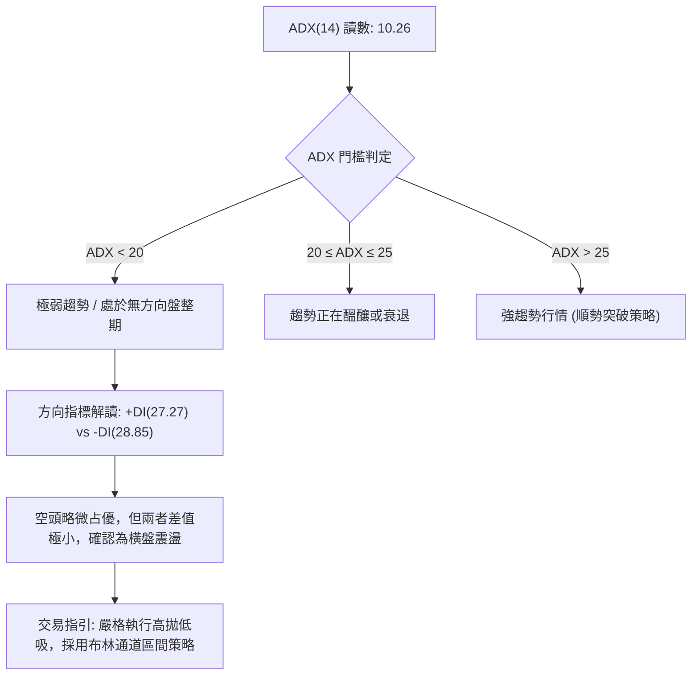
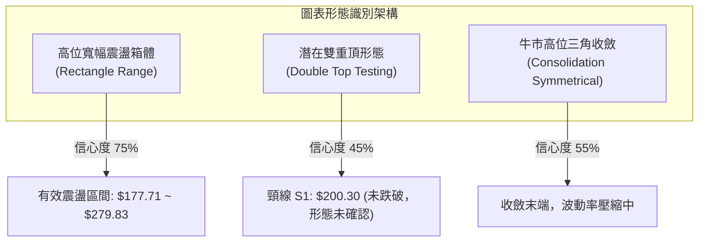
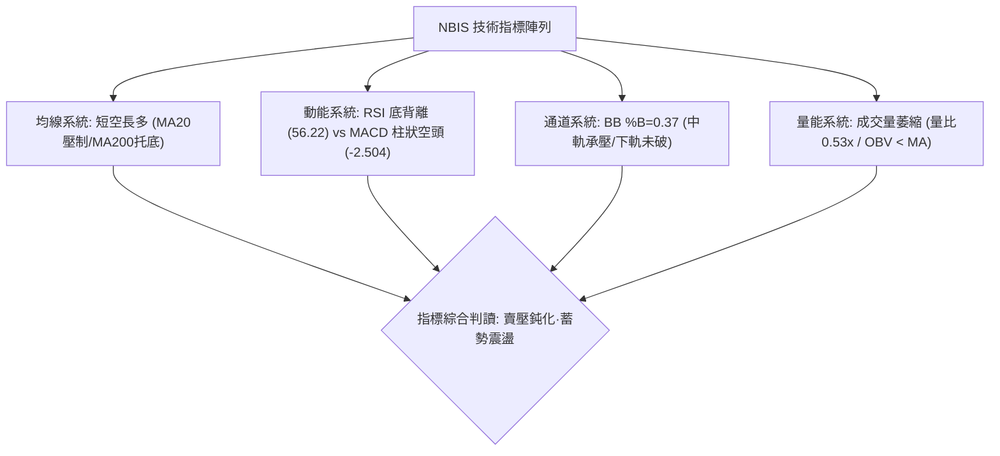
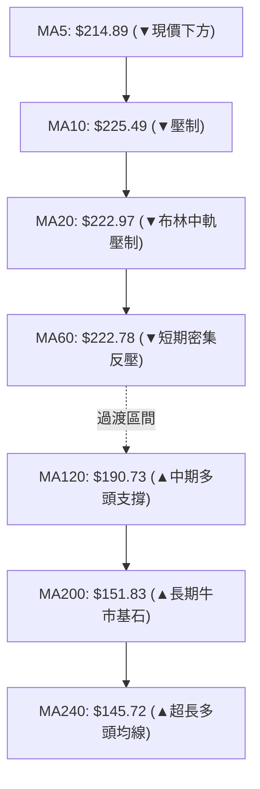
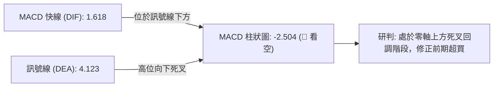
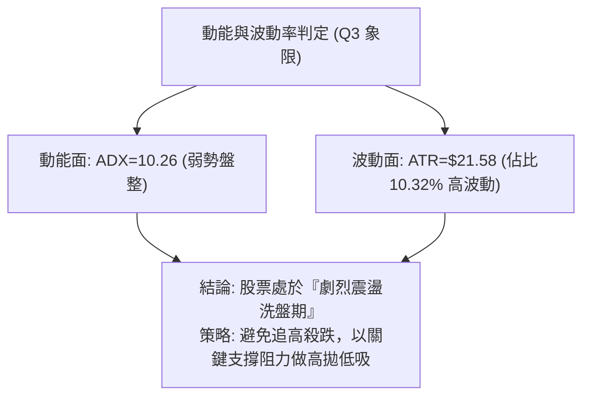
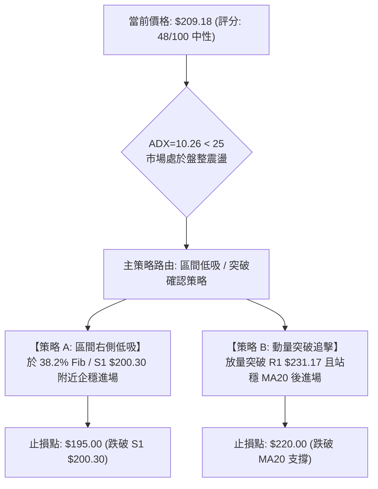
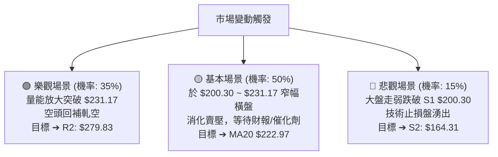

# NBIS 技術分析報告

> **報告日期**：2026-08-31 ｜ **語言**：繁體中文 ｜ **數據來源**：Yahoo Finance ｜ **當前價格**：$209.18

---

## 目錄

| 章節 | 內容 |
|------|------|
| [1. 技術面概覽](#1-技術面概覽) | 訊號儀表板、核心指標、評分卡 |
| [2. 趨勢分析](#2-趨勢分析) | 多時框趨勢、長中短期走勢 |
| [3. 圖表形態分析](#3-圖表形態分析) | 形態識別、K線組合、目標價 |
| [4. 支撐與阻力](#4-支撐與阻力) | 關鍵價位、斐波那契回調 |
| [5. 技術指標深度解讀](#5-技術指標深度解讀) | MA/RSI/MACD/布林/成交量 |
| [6. 動能與波動率](#6-動能與波動率) | 動能評估、ATR、Beta |
| [7. 多時框架總結](#7-多時框架總結) | 時框架評分矩陣 |
| [8. 交易策略建議](#8-交易策略建議) | 多空策略、風險報酬比 |
| [9. 風險提示與監控](#9-風險提示與監控) | 監控指標、風險場景 |

---

## 1. 技術面概覽

### 🎯 技術訊號儀表板



### 📊 核心指標速覽表

| 指標類別 | 指標名稱 | 當前數值 | 訊號 | 解讀 |
|----------|----------|----------|------|------|
| **價格** | 當前收盤價 | $209.18 | 🟡 | 位於52週區間61.7%分位，短期自高點回檔整理 |
| **均線** | MA20 (月線) | $222.97 | 🔴 | 價格低於MA20，短期承壓（距現價 -6.18%） |
| **均線** | MA50 (季線) | $219.38 | 🔴 | 價格低於MA50，中期多頭架構受考驗 |
| **均線** | MA200 (年線) | $151.83 | 🟢 | 價格遠高於MA200 (+37.77%)，長期多頭格局穩固 |
| **動能** | RSI(14) | 56.22 | 🟢 | 中性偏強區間，日線級別出現底背離訊號 |
| **動能** | MACD(12,26,9) | 1.618 / 4.123 | 🔴 | MACD線低於訊號線，Hist為 -2.504，動能偏空 |
| **趨勢** | ADX(14) | 10.26 | 🟡 | 數值低於25，代表無單邊趨勢，屬於盤整震盪市場 |
| **通道** | 布林帶 (%B) | 0.37 | 🟡 | 下軌 $169.86 至 上軌 $276.07，處於中軌下方偏弱區間 |
| **成交量** | 20日量比 | 0.53x | 🔴 | 成交量僅13.08M（均量24.73M），OBV疲弱未放量 |
| **波動** | ATR(14) | $21.58 | 🔴 | 佔股價 10.32%，每日波動劇烈，需寬幅風控 |

### 🏆 技術評分卡

```
╔══════════════════════════════════════════════════════════════════╗
║              技術評分卡 — NBIS (2026-08-31)                     ║
╠══════════════════════════════════════════════════════════════════╣
║ 趨勢強度 (ADX/方向)   ████░░░░░░░░░░░░░░░░  25/100  🔴 弱趨勢/偏空║
║ 動能指標 (RSI/MACD)   ██████████░░░░░░░░░░  50/100  🟡 底背離vs死叉║
║ 支撐穩定度 (Fib/S區)  ██████████████░░░░░░  70/100  🟢 38.2%撐盤  ║
║ 成交量配合 (OBV/量比) ██████░░░░░░░░░░░░░░  30/100  🔴 量能嚴重萎縮║
║ 形態完整度 (區間震盪) ████████████░░░░░░░░  60/100  🟡 旗形整理階段║
║ 均線排列 (長期vs短期) ██████████░░░░░░░░░░  55/100  🟡 長多短空排列║
╠══════════════════════════════════════════════════════════════════╣
║ 綜合評分              █████████░░░░░░░░░░░  48/100  ⚖️ 中性觀望/區間║
╚══════════════════════════════════════════════════════════════════╝
```

---

## 2. 趨勢分析

### 🌐 多時框趨勢分析



### 📈 長期趨勢 — 12個月走勢圖（Unicode）

```
NBIS 月線走勢圖（過去12個月：2025-09 至 2026-08）
價格軸 ($)
$300 ┤                                     ● $276.17 (2026-06)
$270 ┤                                    / \
$240 ┤                              ● $231.09 \
$210 ┤                                         ● $209.18 (現價 2026-08)
$180 ┤                                          \   /
$150 ┤                        ● $138.23          ● $190.41 (2026-07)
$120 ┤ ● $112.27  ● $130.82    /
$90  ┤    \      / \          /
$60  ┤     ● $94.87 ● $83.71 ● $91.19
     └─┬─────┬─────┬─────┬─────┬─────┬─────┬─────┬─────┬─────┬─────┬─────┬───
      09/25 10/25 11/25 12/25 01/26 02/26 03/26 04/26 05/26 06/26 07/26 08/26
```

**走勢特徵分析表格**：

| 階段區間 | 起止價格 | 漲跌幅 | 走勢特徵解讀 |
|----------|----------|--------|--------------|
| **2025-09 ~ 2025-10** | $112.27 ➔ $130.82 | +16.52% | 首波 AI 基礎設施爆發期，突破百元關卡 |
| **2025-11 ~ 2026-01** | $130.82 ➔ $85.19 | -34.88% | 獲利了結深幅回調，回測 52W 低點支撐區 |
| **2026-02 ~ 2026-06** | $85.19 ➔ $276.17 | +224.18% | 主升浪主導行情，創下歷史天價 $299.86 |
| **2026-07 ~ 2026-08** | $276.17 ➔ $209.18 | -24.26% | 高位劇烈洗盤，回踩斐波那契 38.2% 進行平臺築底 |

### 📊 中期趨勢（週線分析）

從近20週的走勢數據可看出，NBIS 呈現劇烈的「寬幅箱體震盪」特徵：

```
中期週線波動走廊 ($)
$300 ┼─────────────────────── 波段天花板 ($299.86)
     │        ▲ (2026-06-21: $286.69)   ▲ (2026-08-16: $277.68)
$250 ┼───────┼─────────────────────────┼────────────────── R2: $279.83
     │       / \                       / \
$220 ┼──────/───\───────▲─────────────/───\──────────────── R1: $231.17
     │     /     \     / \           /     \
$209 ┼────/───────\───/───\─────────/───────● 現價 $209.18 (38.2% Fib)
     │   /         \ /     \       /
$180 ┼──/───────────●───────●─────/──────────────────────── 50.0% Fib ($181.56)
     │ /        (07-19: $177.71) (08-09: $187.97)
$150 ┼● (04-26: $147.16) ────────────────────────────────── S3: $145.80 / 61.8% Fib
```

- **高點受阻特徵**：2026年6月中旬（$286.69）與8月中旬（$277.68）形成雙重高點阻力，均在逼近歷史高位 $299.86 處承壓。
- **低點支撐特徵**：2026年7月下旬探底 $177.71 後迅速被大買盤拉起（週量達 1.54 億股），確立 $177.71~$187.97 為中期強支撐防線。

### ⚡ 趨勢強度評估（ADX 解讀）



| 指標名稱 | 數值 | 狀態等級 | 行情研判結論 |
|----------|------|----------|--------------|
| **ADX(14)** | 10.26 | 弱趨勢/無趨勢 (極低) | 市場缺乏單邊推動力，順勢突破策略勝率低，容易遭遇假突破 |
| **+DI(14)** | 27.27 | 中等多頭買力 | 多方動能尚存，並未完全瓦解 |
| **-DI(14)** | 28.85 | 中等空頭賣力 | 空方暫居上風，壓制短期反彈幅度 |
| **DI 差值** | -1.58 | 力量均衡 | 多空拉鋸，等待催化劑促成突破 |

---

## 3. 圖表形態分析

### 🔍 形態識別系統



**形態信心度評估表（嚴格依據歷史數據）**：

| 形態名稱 | 信心度 | 判斷依據（引用數據） | 完成度 | 目標價（附嚴格計算式） |
|----------|--------|----------------------|--------|------------------------|
| **寬幅箱體震盪** | **75%** | 箱底於 $177.71 (S1/S2區間)，箱頂於 $279.83 / $286.69 | 80% | 箱頂 $279.83 / 箱底支撐 S1 $200.30 |
| **潛在雙重頂 (M頂)** | **45%** | 左頂 06-21: $286.69，右頂 08-16: $277.68，頸線於 07-19: $177.71 | 35% (未破頸線) | 若跌破頸線 $177.71: 目標 = $177.71 - ($279.83 - $177.71) = $75.59（信心不足，不予採納） |
| **指標型布林收斂** | **85%** | BB 上軌 $276.07 / 下軌 $169.86，%B 為 0.37 | 90% | 下軌支撐 S2 附近 $169.86，中軌反彈目標 MA20 $222.97 |

*註：由於雙重頂形態信心度僅 45% 且頸線遠未跌破，本報告拒絕過度推演空頭破位形態，回歸以指標型與箱體震盪為主。*

### 🕯️ 重要K線形態分析

| 月份/日期 | 關鍵收盤 | K線組合形態 | 解讀與心理分析 | 訊號方向 |
|-----------|----------|-------------|----------------|----------|
| **2026-06 月K** | $276.17 | 歷史天線長上影實體陽線 | 創 $299.86 歷史高點後遭遇巨量獲利了結賣壓 | 🟡 警示訊號 |
| **2026-07 月K** | $190.41 | 長下影中陰線 (探底回升) | 回測 $177.71 後逢低買盤大量介入，確認底部承接力道 | 🟢 支撐確認 |
| **2026-08-16 週K**| $277.68 | 爆量長陽巨浪線 (1.67億股) | 短線暴力軋空，但未能突破 $280 阻力，形成假突破回落 | 🔴 短線見頂 |
| **2026-08-30 週K**| $209.18 | 縮量中陰線 (量能驟降50%) | 賣壓急速衰竭，收盤精準落於 38.2% 斐波那契位 ($209.48) | 🟡 企穩訊號 |

### 📉 ASCII 走勢形態示意圖

```
NBIS 近期週線結構形態解析圖
$300 ┼                      峰頂1: $286.69             峰頂2: $277.68 (08-16)
     │                         ▲                         ▲
$280 ┼─────────────────────────┼─────────────────────────┼────── 關鍵阻力區 R2: $279.83
     │                        / \                       / \
$240 ┼                       /   \                     /   ▼
$220 ┼                      /     \                   /     \    MA20: $222.97
$209 ┼                     /       \                 /       ● 現價 $209.18 (38.2% Fib)
$200 ┼                    /         \               /        │  支撐位 S1: $200.30
$180 ┼                   /           ●─────────────●         │  谷底區間 ($177.71)
     │                  /          (07-19)       (08-09)     │
$160 ┼                 /                                     ▼  支撐位 S2: $164.31
     └─────────────────┴─────────────────────────────────────┴──────────────────
```

### 🎯 形態目標價計算

基於「寬幅箱體收斂」架構推導：
1. **箱體中樞位置**：$(R2\ \$279.83 + 谷底\ \$177.71) / 2 = \$228.77$（極度接近 MA20: \$222.97 與 R1: \$231.17）。
2. **反彈目標推算**：
   - **第一目標價 (T1)**：中軌壓力區與聚類阻力 **R1 = $231.17**。
   - **第二目標價 (T2)**：箱體頂部強阻力 **R2 = $279.83**。
3. **下行破位防守點**：波段低點聚類支撐 **S1 = $200.30**，若失守則下探 **S2 = $164.31**。

---

## 4. 支撐與阻力

### 🗺️ 關鍵價位分布圖（Unicode）

```
NBIS 價位結構分布圖 (由實際 OHLCV 與斐波那契計算)
══════════════════════════════════════════════════════════════════════
$299.86 ║██████████████████████████████║ 歷史天價 / 0.0% Fib / 強阻力 R3 (+43.35%)
$279.83 ║██████████████████████        ║ 波段高點聚類 / 阻力 R2 (+33.78%)
$244.02 ║▓▓▓▓▓▓▓▓▓▓▓▓▓▓▓▓▓             ║ 23.6% 斐波那契回調位 (+16.66%)
$231.17 ║████████████████              ║ 波段阻力 R1 / MA20附近 (+10.51%)
$209.48 ║░░░░░░░░░░░░░░░░░░░░░░░░░░░░░░║ 38.2% 斐波那契回調位
$209.18 ╠══════════════════════════════╣ ◄ 現價位置 ($209.18)
$200.30 ║██████████████                ║ 近期波段低點聚類 / 支撐 S1 (-4.25%)
$181.56 ║▓▓▓▓▓▓▓▓▓▓▓▓▓▓▓▓▓▓▓▓          ║ 50.0% 斐波那契黃金分割位 (-13.20%)
$164.31 ║████████████████████████      ║ 強支撐 S2 / 近期深蹲底部 (-21.45%)
$153.64 ║▓▓▓▓▓▓▓▓▓▓▓▓▓▓▓▓▓▓▓▓▓▓▓▓▓▓    ║ 61.8% 斐波那契關鍵防線 (-26.55%)
$145.80 ║██████████████████████████████║ 結構底部支撐 S3 / MA240附近 (-30.30%)
══════════════════════════════════════════════════════════════════════
```

### 🚧 阻力位分析表

| 阻力級別 | 精確價位 | 形成原因與技術共振 | 突破難度 | 重要性 |
|----------|----------|--------------------|----------|--------|
| **R1** | **$231.17** | 2026-05-31 收盤價聚類、MA20 ($222.97) 及 MA50 ($219.38) 上方反壓區 | 🟡 中等 | 短線多空分水嶺，站上才可確認日線反轉 |
| **R2** | **$279.83** | 2026-06 與 2026-08 兩度衝高未果之波段高點聚類、BB 上軌 ($276.07) | 🔴 極高 | 中期箱體頂部天花板，累積大量解套賣壓 |
| **R3** | **$299.86** | 52週歷史最高點、斐波那契 0.0% 極限阻力位 | 🔴 堅不可摧 | 需超預期基本面財報或強大催化劑方能突破 |

### 🛡️ 支撐位分析表

| 支撐級別 | 精確價位 | 形成原因與技術共振 | 守住機率 | 重要性 |
|----------|----------|--------------------|----------|--------|
| **S1** | **$200.30** | 近一年波段低點聚類、心理整數關卡、逼近現價支撐區 | 🟢 70% | 短線生命線，守住則維持 $200~$230 區間震盪 |
| **S2** | **$164.31** | 2026年4-5月啟動波段起漲聚類低點、BB 下軌 ($169.86) 共振區 | 🟢 85% | 中期強支撐，跌破將破壞 2026 年以來的上升結構 |
| **S3** | **$145.80** | 長期均線 MA240 ($145.72) 與 MA200 ($151.83) 共振支撐位 | 🟢 95% | 長期牛熊分界線，機構投資者核心護盤成本區 |

### 📐 斐波那契回調位分析

依據 52 週完整波動區間（低點 $63.26 ➔ 高點 $299.86，垂直波幅 $236.60）精確推算：

```
斐波那契回調水平與現價相對關係
 0.0%  ── $299.86 (52W High)
 23.6% ── $244.02
 38.2% ── $209.48 ◄═══ 現價 $209.18 精準貼合於此（差距僅 -$0.30）
 50.0% ── $181.56
 61.8% ── $153.64
 78.6% ── $113.89
100.0% ── $63.26  (52W Low)
```

- **位置解讀**：現價 $209.18 恰好收在 **38.2% 回調位 ($209.48)** 處。在強勢回調理論中，38.2% 是健康牛市回檔的首要防禦點；若能在此點位縮量築底，後續展開次輪推升的機率極高。
- **區間界定**：當前價格嚴格運行於 **38.2% ($209.48)** 與 **23.6% ($244.02)** 之間，下檔次級防禦為 **50.0% ($181.56)**。

---

## 5. 技術指標深度解讀

### 🎛️ 指標訊號總覽



### 📈 移動平均線排列分析



- **均線排列狀態**：總體均線維持 `MA20 > MA50 > MA200` 的大格局多頭排列，但短線出現均線死叉（MA5: $214.89 < MA20: $222.97）。
- **短線反壓聚集**：現價 $209.18 位於 MA5、MA10、MA20、MA60 之下，在 $214.89 ~ $225.49 形成厚重的短線反壓帶。
- **長線強烈托底**：MA120 ($190.73) 與 MA200 ($151.83) 穩步向上爬升，提供堅實的中長期技術底座。

### 📉 RSI(14) 分析

```
RSI(14) 當前讀數: 56.22
0 ────────── 30 ────────────────────── 56.22 ────────── 70 ────────── 100
[   超賣區   ] [      中性偏強區間        ▲   ] [   超買區   ]
進度條: █████████████░░░░░░░░░░ 56.22%
```

- **超買超賣判定**：數值為 56.22，完全脫離超賣與超買區，落於中性健康回檔區間。
- **背離分析（關鍵亮點）**：系統明確偵測到 **RSI 底背離 (Bullish Divergence)**。價格在 2026-08-23 至 2026-08-30 快速回落（$219.13 ➔ $209.18），但 RSI 數值卻由 51.5 反向走高至 56.22。這表明空方打壓動能明顯衰減，潛在反彈動能正在累積。

### 📊 MACD(12/26/9) 訊號解讀



- **MACD 解讀**：快線 (1.618) 與慢線 (4.123) 均處於零軸之上，確認中長期多頭大趨勢未變；但柱狀圖為 -2.504，反映短期動能由空頭掌控，尚未出現黃金交叉收斂訊號。

### 📦 布林通道分析

```
NBIS 布林通道空間示意圖 (BB 20, 2)
$276.07 ┬──────────────────────────────────────────── BB 上軌 (Upper Band)
        │
        │
$222.97 ┼──────────────────────────────────────────── BB 中軌 / MA20 (Middle Band)
        │
$209.18 ┼ - - - - - - - - - - - - - - - - - - - - -  現價 ($209.18, %B = 0.37)
        │
$169.86 ┴──────────────────────────────────────────── BB 下軌 (Lower Band)
```

- **通道寬度與狀態**：布林帶寬度達 $106.21 ($169.86 ~ $276.07)，顯示歷史波動率偏大。
- **位置分析**：%B 為 **0.37**，代表價格處於中軌與下軌之間的弱勢震盪區，但距離下軌 $169.86 仍有充足安全邊際。

### 💹 成交量分析（量價配合度）

- **量能驟降**：最新單日成交量為 13,088,800 股，僅為 20 日均量 (24,732,565) 的 **0.53 倍**，呈現極度「縮量整理」。
- **OBV 趨勢**：數據顯示 `OBV < MA`，量能疲弱，意味著大機構並未在現價大舉建倉，市場觀望情緒濃厚。
- **量價背離結論**：下跌過程大幅縮量（週量由 1.67 億股降至 7015 萬股），表明本次回跌主要是獲利盤自然退潮，而非主力資金恐慌性砸盤拋售。

---

## 6. 動能與波動率

### ⚡ 動能評估四象限

| 象限分區 | 動能強度 | 波動率水準 | 當前狀態標定 | 交易環境與策略應對 |
|----------|----------|------------|--------------|--------------------|
| **Q1 (主升浪)** | 強動能 (ADX>25) | 低波動 (穩定) | — | 順勢加碼，持有趨勢單 |
| **Q2 (盤整市)** | 弱動能 (ADX<25) | 低波動 (壓縮) | — | 突破前夕，以逸待勞 |
| **Q3 (劇烈洗盤)** | 弱動能 (ADX: 10.26) | 高波動 (ATR: 10.3%) | **✓ NBIS 當前定位** | **高位寬幅震盪洗盤，嚴格區間操作** |
| **Q4 (恐慌拋售)** | 強空頭動能 | 極高波動 | — | 清倉觀望，切忌摸底 |



### 📊 ATR 波動率分析

- **ATR(14) 數值**：**$21.58**（佔當前股價高達 **10.32%**）。
- **止損距離建議**：
  - 日內/極短線風控：1.0x ATR = **$21.58**
  - 波段交易風控：1.5x ATR = **$32.37**（因此設定跌破 S1 $200.30 或止損位 $195.00 極具合理性）
- **單日波動指引**：日常波動範圍在 $\pm \$21.6$ 屬於正常雜訊，交易者應放寬持股容忍度，切忌過度頻繁窄幅止損。

### 📐 Beta 與市場相關性

- **Beta 係數**：**1.434**
- **市場特徵**：NBIS 具備典型的高彈性成長股特徵，波動幅度為大盤（S&P 500 / Nasdaq）的 1.43 倍。當大盤反彈時其上攻動能放大，大盤走弱時其回調幅度亦較深。
- **空頭部位比例**：空頭佔流通盤高達 **23.4%**（Short Ratio: 2.12 天）。極高的做空比例意味著一旦股價突破 R1 ($231.17)，極易引發短線「軋空行情（Short Squeeze）」。

---

## 7. 多時框架總結

### 📋 時框架評分表

| 時框架 | 趨勢方向 | 動能狀態 | 均線排列 | 形態結構 | 綜合評分 | 建議操作策略 |
|--------|----------|----------|----------|----------|----------|--------------|
| **月線 (長期)** | 🟢 強勢多頭 | 🟢 充沛 | 🟢 MA200 向上發散 | 24個月大牛市形態 | **85/100** | 長期投資者底倉堅定持有 |
| **週線 (中期)** | 🟡 寬幅震盪 | 🟡 中性回落 | 🟢 MA50 支撐 | $177~$280 箱體整理 | **60/100** | 箱體下沿低吸、上沿分批減碼 |
| **日線 (短期)** | 🔴 弱勢整理 | 🔴 MACD死叉 | 🔴 跌破 MA20/MA50 | 縮量橫盤 / 38.2% 築底 | **40/100** | 觀望等待止跌確認訊號 |

### 🔲 綜合訊號矩陣

```
時框訊號一致性矩陣
══════════════════════════════════════════════════════════════════
維度            日線 (短期)       週線 (中期)       月線 (長期)
──────────────────────────────────────────────────────────────────
趨勢方向        🔴 偏空修正       🟡 區間震盪       🟢 明確上升
動能指標        🟡 RSI底背離      🔴 MACD回落       🟢 處於強勢區
均線結構        🔴 MA5/20反壓     🟢 MA50向上       🟢 MA200托底
成交量能        🔴 縮量觀望       🟡 爆量後萎縮     🟢 累計量能充沛
══════════════════════════════════════════════════════════════════
收斂判斷        日線尋找切入點    週線決定區間界限  月線提供安全保護
══════════════════════════════════════════════════════════════════
```

### ⚖️ 多時框收斂結論

依據多時框收斂規則（嚴格要求 14）：
1. **行情定性**：當前 ADX(14) 為 **10.26 (<25)**，嚴格定調為 **「盤整行情」**。
2. **時框優先級**：在盤整行情中，趨勢順勢指標失效，**以日線與週線布林通道 ($169.86 ~ $276.07) 及關鍵支撐阻力為核心交易依據**。
3. **唯一方向性結論**：**【中性觀望·區間箱體操作】**。
   - 長期月線多頭確保了下檔在 S2 ($164.31) / MA200 ($151.83) 有極強支撐；
   - 短期日線受制於 MA20 ($222.97)，上攻動能暫被壓制；
   - 因此，最優策略為圍繞 **$200.30 (S1) ~ $231.17 (R1)** 進行區間高拋低吸。

---

## 8. 交易策略建議

### 🗺️ 策略決策流程圖



### 🧭 策略路由

> **當前主策略方向 = 區間震盪低吸（依評分卡 48/100，定調為中性區間操作，主推低吸與突破兩套穩健策略）**

### 🎯 價格情境階梯（Price Scenarios）

| 觸發條件 | 下一目標 | 後續延伸 | 情境含義與操作指引 |
|----------|----------|----------|--------------------|
| **放量突破 R1 ($231.17)** | **R2 ($279.83)** | **R3 ($299.86)** | 短線轉強，突破均線壓制，空頭回補將加速上攻 |
| **守住現價 $209.18 ~ S1 ($200.30)** | **R1 ($231.17)** | **MA20 ($222.97)** | 區間縮量築底，維持箱體內震盪向上反彈 |
| **有效跌破 S1 ($200.30)** | **S2 ($164.31)** | **S3 ($145.80)** | 短線結構破位，回測 50.0% Fib ($181.56) 及 BB 下軌 |

### 📊 情境機率分佈

```
情境機率分佈圖
繼續上行 / 反彈突破 (35%) ▓▓▓▓▓▓▓░░░░░░░░░░░░░
區間震盪築底 (50%)         ▓▓▓▓▓▓▓▓▓▓░░░░░░░░░░ ◄ 基準情境
回落再探底 (15%)           ▓▓▓░░░░░░░░░░░░░░░░░
```

| 情境 | 機率 | 主要依據與指標支撐 |
|------|------|--------------------|
| **區間震盪築底 (基準)** | **50%** | ADX(14)=10.26 指向無趨勢，布林帶收窄，成交量極度萎縮 (0.53x)，多空暫時平衡 |
| **繼續上行 / 突破** | **35%** | RSI 浮現底背離，現價精準受撐於 38.2% 斐波那契位 ($209.48)，空頭比達 23.4% 具軋空潛力 |
| **回落再探底** | **15%** | MACD 仍為負柱 (-2.504)，現價受壓於短期均線群 ($214.89~$222.97) |

### 🟢 主策略詳情

| 策略要素 | 策略 A（區間右側低吸策略 - 首選） | 策略 B（動能突破追擊策略 - 次選） |
|----------|----------------------------------|----------------------------------|
| **適用場景** | 現價 38.2% Fib 築底，RSI 背離發酵 | 日線放量突破短期均線反壓密集區 |
| **進場條件** | 現價 $209.18 或回踩 S1 $200.30 止跌 | 突破阻力位 R1 $231.17 且單日成交量 > 20日均量 |
| **進場價格** | **$209.18**（或掛單 $201.00~$209.00） | **$232.00**（突破確認後掛單） |
| **目標價 T1** | **$231.17** (阻力 R1 / +10.51%) | **$279.83** (阻力 R2 / +20.61%) |
| **目標價 T2** | **$279.83** (阻力 R2 / +33.78%) | **$299.86** (阻力 R3 / +29.25%) |
| **止損價格** | **$195.00** (跌破支撐位 S1 下方 2.6%) | **$219.00** (跌破 MA50 支撐位) |
| **風險報酬比** | **1 : 4.98** (以 T2 計算) / **1 : 1.55** (T1) | **1 : 3.68** (以 T2 計算) / **1 : 3.68** (T1) |
| **預估勝率** | **60%** | **55%** |
| **建議倉位** | **10% ~ 15%** (分批建倉) | **15% ~ 20%** (右側加碼) |

*計算式驗證 (策略 A)：*
- *潛在風險 = $209.18 - $195.00 = $14.18*
- *T1 潛在報酬 = $231.17 - $209.18 = $21.99 ➔ 風報比 = $21.99 / $14.18 = 1.55*
- *T2 潛在報酬 = $279.83 - $209.18 = $70.65 ➔ 風報比 = $70.65 / $14.18 = 4.98*

### 🔴 反向風險觸發點（對沖提示）

若出現以下情況，主多頭策略失效，需全面執行止損或建立對沖部位：
1. **破位觸發**：日線收盤價跌破 **S1 ($200.30)** 且成交量放大，預示將下探 **50.0% Fib ($181.56)** 乃至 **S2 ($164.31)**。
2. **動能惡化**：RSI 跌破 45 且 MACD 負柱進一步拉長超過 -5.00。

### ⭐ 整體訊號強度評星

```
╔══════════════════════════════════════════════════════════════════╗
║ 做多訊號強度：  ★★★☆☆  (3.0/5 星) — 底背離+黃金分割支撐       ║
║ 做空訊號強度：  ★★☆☆☆  (2.0/5 星) — 均線壓制但量能萎縮砸不動   ║
║ 整體可信度：    ★★★★☆  (4.0/5 星) — 數據多時框吻合度高         ║
╚══════════════════════════════════════════════════════════════════╝
```

---

## 9. 風險提示與監控

### ✅ 關鍵監控指標 Checklist

```
╔══════════════════════════════════════════════════════════════════╗
║              NBIS 每日交易監控清單 (Checklist)                  ║
╠══════════════════════════════════════════════════════════════════╣
║ [ ] 價格是否跌破關鍵支撐 S1 ($200.30)？                         ║
║ [ ] 日成交量是否回升至 20日均量 (24.73M) 以上？                  ║
║ [ ] MACD 柱狀圖是否由負轉正 (從 -2.504 向 0 軸收斂)？            ║
║ [ ] 價格能否有效收復 MA20 ($222.97) 及 R1 ($231.17)？            ║
║ [ ] RSI(14) 是否站穩 50 榮枯線並持續走強？                      ║
║ [ ] 空頭佔比 (23.4%) 是否出現回補引發的暴量長陽？               ║
╚══════════════════════════════════════════════════════════════════╝
```

### ⚠️ 風險場景分析



### 🛡️ 風險管理重要提醒

1. **高 ATR 波動管理**：NBIS 單日 ATR 高達 **$21.58 (10.32%)**，波動劇烈。嚴格禁止使用過高槓桿，總持倉部位建議控制在投資組合的 **10% ~ 15%** 以內。
2. **空頭部位雙刃劍**：高達 **23.4% 的做空比例** 意味著行情具有高爆發力，一旦突破阻力會急速拉升；但若跌破支撐，空頭亦可能順勢助跌。
3. **分批進出場紀律**：在 ADX < 25 的盤整市中，切忌一次性滿倉。建倉應遵循「底倉 + 突破加碼」的二段式交易邏輯。

---

## 📋 報告總結

```
╔══════════════════════════════════════════════════════════════════╗
║                     NBIS 技術分析報告總結                        ║
╠══════════════════════════════════════════════════════════════════╣
║ 報告日期：2026-08-31                                             ║
║ 當前價格：$209.18                                                ║
║ 分析評級：⚖️ 中性偏強 (Neutral to Bullish Consolidation)         ║
║ 技術評分：48 / 100                                               ║
╠══════════════════════════════════════════════════════════════════╣
║ 關鍵結論：                                                       ║
║ ├─ 長期趨勢：🟢 強烈看多 (MA200 = $151.83 穩步上行，長多未變)    ║
║ ├─ 中期趨勢：🟡 寬幅箱體 ($177.71 ~ $279.83 震盪整理)            ║
║ ├─ 短期趨勢：🔴 弱勢縮量 (ADX=10.26 無趨勢，38.2% Fib 築底中)     ║
║ ├─ 關鍵支撐：S1: $200.30  │  S2: $164.31  │  Fib: $209.48        ║
║ ├─ 關鍵阻力：R1: $231.17  │  R2: $279.83  │  R3: $299.86        ║
║ └─ 分析師目標：平均 $286.69 (最高 $415.00 / 最低 $144.00)        ║
╠══════════════════════════════════════════════════════════════════╣
║ 最優策略組合：                                                   ║
║ 1. 🥇 最佳機會：現價 $209.18 附近小倉位低吸，止損 $195.00，       ║
║                 目標直指 R1 $231.17 與 R2 $279.83 (風報比 1:4.98) ║
║ 2. 🥈 次選機會：等待日線放量突破 R1 $231.17 後右側追擊買入        ║
║ 3. 🥉 保守選擇：保持觀望，等待 MACD 負柱收斂並金叉後再行進場     ║
╚══════════════════════════════════════════════════════════════════╝
```

---

> ⚠️ **免責聲明**：本報告為 AI 自動生成之技術分析，所有數據及估算均基於提供的歷史價格資訊。本報告**僅供研究與學術參考**，**不構成任何投資建議**。投資有風險，入市需謹慎。

---

*報告生成時間：2026-08-31 ｜ 數據來源：Yahoo Finance ｜ 分析框架：多時框技術分析*