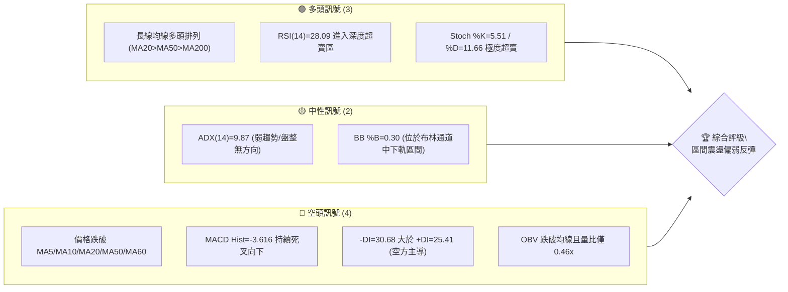
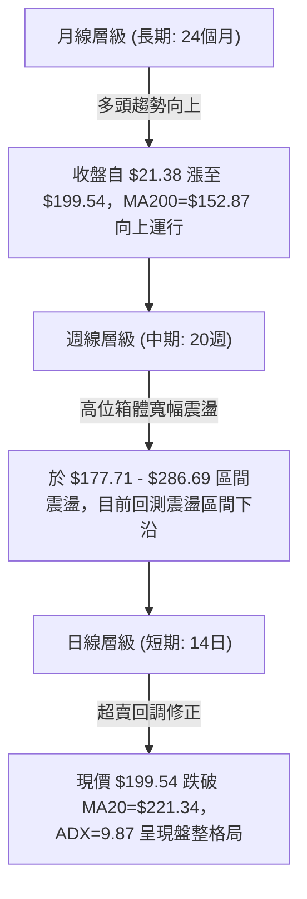
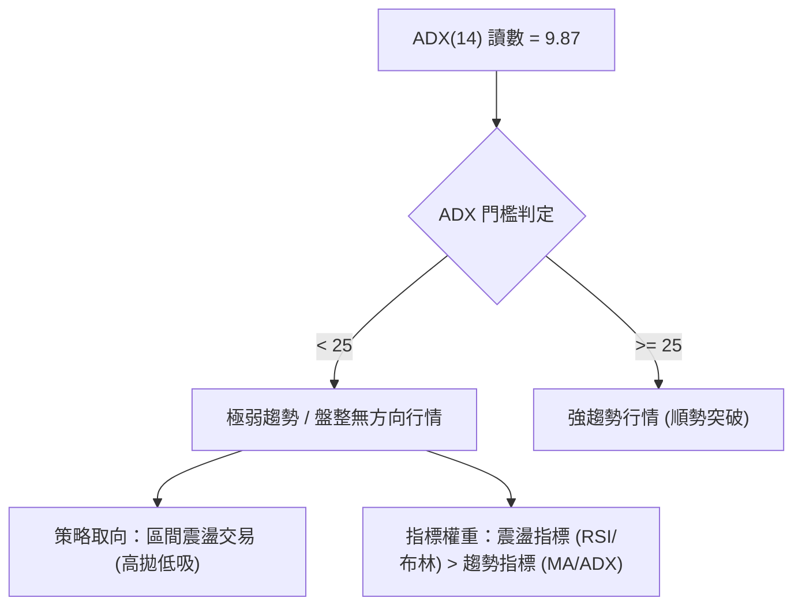
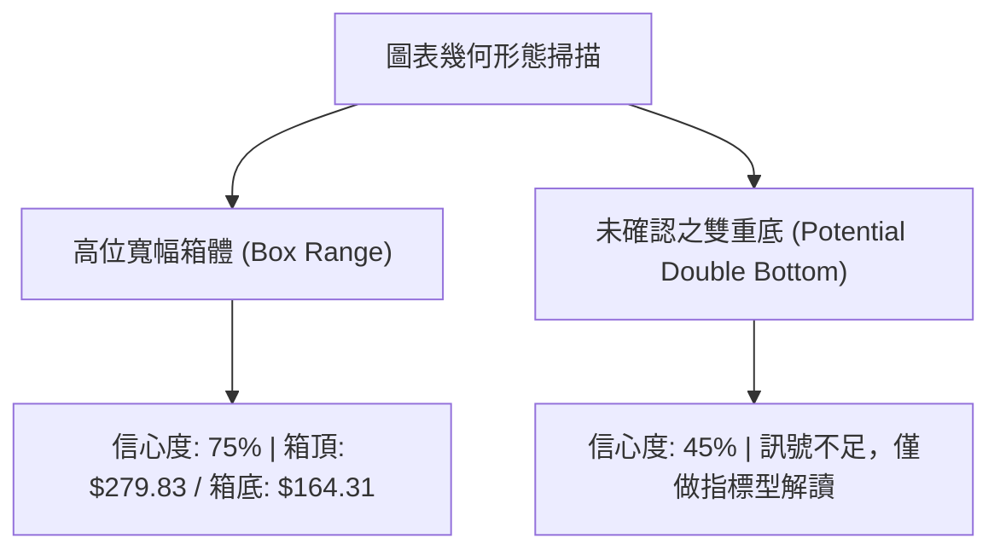
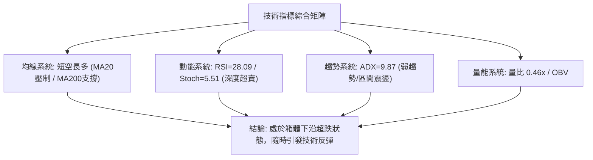
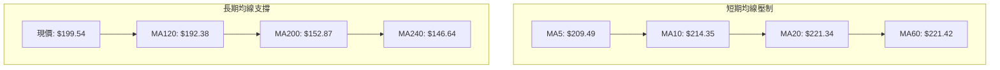
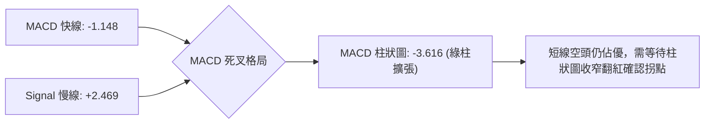
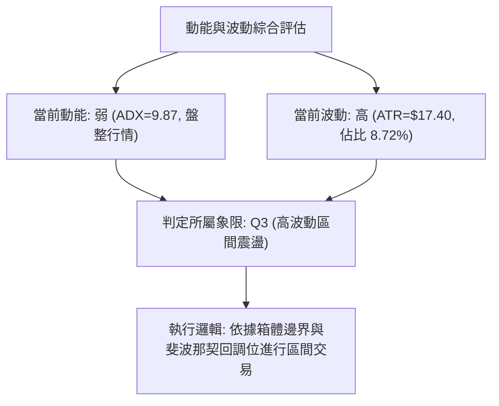
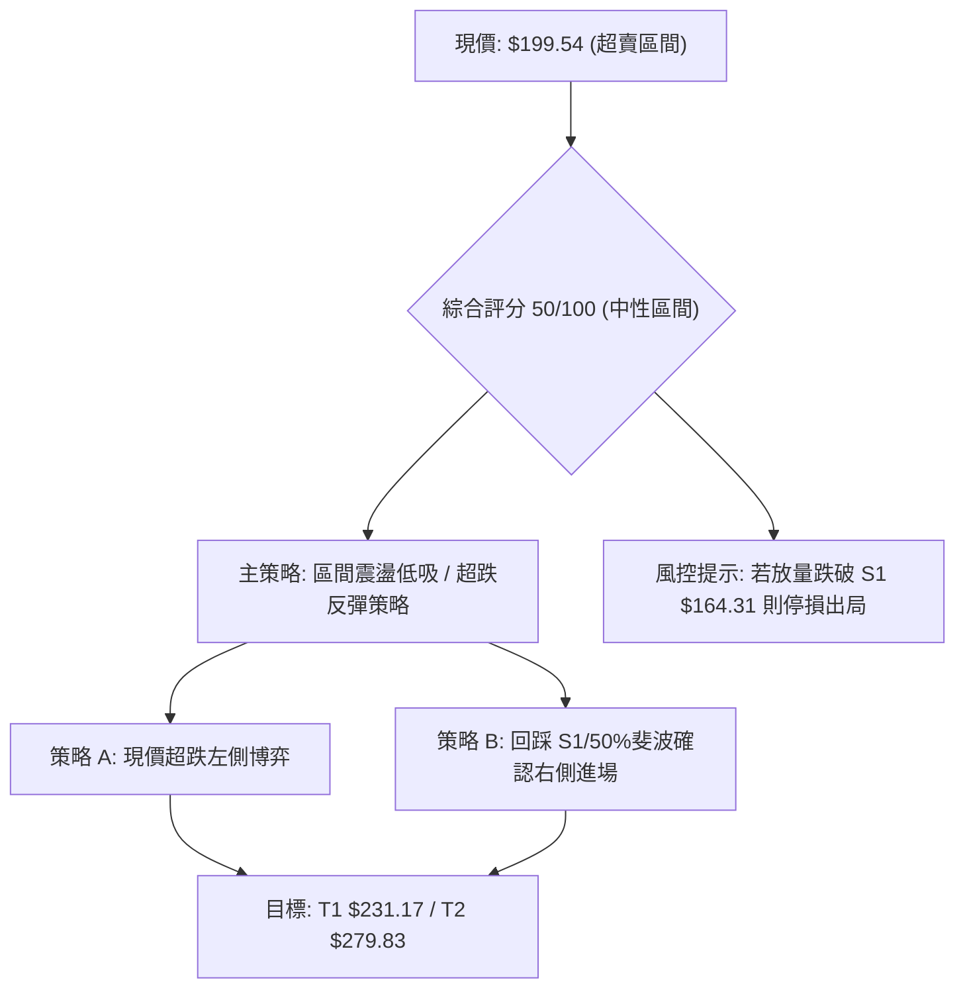
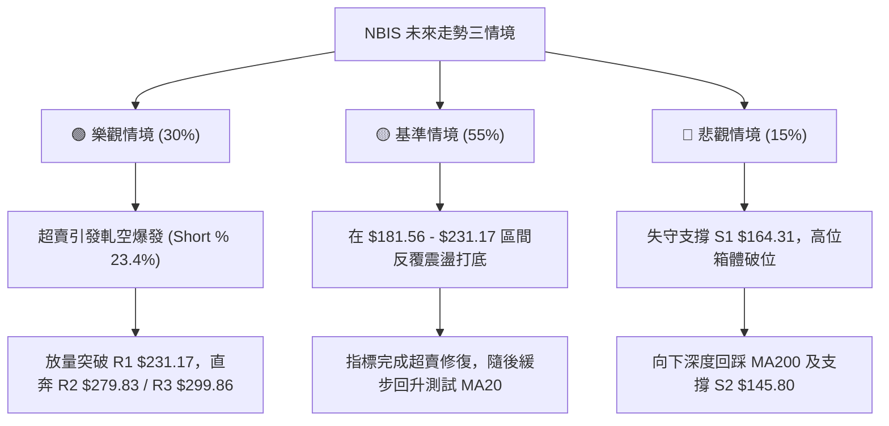

# NBIS 技術分析報告

> **報告日期**：2026-09-02 ｜ **語言**：繁體中文 ｜ **數據來源**：Yahoo Finance ｜ **當前價格**：$199.54

---

## 目錄

| 章節 | 內容 |
|------|------|
| [1. 技術面概覽](#1-技術面概覽) | 訊號儀表板、核心指標、評分卡 |
| [2. 趨勢分析](#2-趨勢分析) | 多時框趨勢、長中短期走勢 |
| [3. 圖表形態分析](#3-圖表形態分析) | 形態識別、K線組合、目標價 |
| [4. 支撐與阻力](#4-支撐與阻力) | 關鍵價位、斐波那契回調 |
| [5. 技術指標深度解讀](#5-技術指標深度解讀) | MA/RSI/MACD/布林/成交量 |
| [6. 動能與波動率](#6-動能與波動率) | 動能評估、ATR、Beta |
| [7. 多時框架總結](#7-多時框架總結) | 時框架評分矩陣 |
| [8. 交易策略建議](#8-交易策略建議) | 多空策略、風險報酬比 |
| [9. 風險提示與監控](#9-風險提示與監控) | 監控指標、風險場景 |

---

## 1. 技術面概覽

### 🎯 技術訊號儀表板



### 📊 核心指標速覽表

| 指標類別 | 指標名稱 | 當前數值 | 訊號 | 解讀 |
|----------|----------|----------|------|------|
| **價格** | 當前價格 | $199.54 | 🟡 | 位於52週高低點區間 57.6%，短線承壓回落 |
| **均線** | MA20 | $221.34 | 🔴 | 現價低於MA20 (-9.85%)，短線呈空頭壓制 |
| **均線** | MA50 | $216.09 | 🔴 | 現價跌破中期生命線 MA50，考驗中期支撐 |
| **均線** | MA200 | $152.87 | 🟢 | 現價大幅高於長期均線 (+30.53%)，長期底部扎實 |
| **動能** | RSI(14) | 28.09 | 🟢 | 跌破30進入超賣區，具備技術性超跌反彈動能 |
| **動能** | MACD | -1.148 (Hist: -3.616) | 🔴 | 快慢線死叉且綠柱擴張，短線動能仍偏空 |
| **動能** | Stoch %K/%D | 5.51 / 11.66 | 🟢 | 極度超賣區間，短期隨時引發均值回歸修復 |
| **趨勢** | ADX(14) | 9.87 | 🟡 | ADX < 25 表明處於無趨勢/寬幅震盪行情 |
| **波動** | ATR(14) | $17.40 (8.72%) | 🔴 | 日內波動幅度大，操作需嚴格控制部位與止損 |
| **量能** | 量比 / OBV | 0.46x / OBV<MA | 🔴 | 量能萎縮且OBV疲弱，多頭反攻需量能放大確認 |

### 🏆 技術評分卡

```
╔══════════════════════════════════════════════════════════════╗
║              技術評分卡 — NBIS (2026-09-02)                  ║
╠══════════════════════════════════════════════════════════════╣
║ 趨勢強度      ████░░░░░░░░░░░░░░░░  20/100  🟡 盤整無方向     ║
║ 動能指標      ██████░░░░░░░░░░░░░░  30/100  🔴 短期動能疲弱   ║
║ 支撐穩定度    ██████████████░░░░░░  70/100  🟢 斐波那契強支撐 ║
║ 成交量配合    ██████░░░░░░░░░░░░░░  30/100  🔴 量能萎縮背離   ║
║ 形態完整度    ██████████░░░░░░░░░░  50/100  🟡 寬幅箱體震盪   ║
║ 均線排列      ████████████░░░░░░░░  60/100  🟢 長期多頭未破   ║
╠══════════════════════════════════════════════════════════════╣
║ 綜合評分      ██████████░░░░░░░░░░  50/100  ⚖️ 中性觀望/區間  ║
╚══════════════════════════════════════════════════════════════╝
```

---

## 2. 趨勢分析

### 🌐 多時框趨勢分析



### 📈 長期趨勢 — 12個月走勢圖（Unicode）

```
NBIS 月線走勢圖（過去12個月：2025-10 至 2026-09）
價格軸 ($)
$300 ┤                                      
$276 ┤                                  ● (2026-06 $276.17)
$231 ┤                              ● (2026-05 $231.09)
$200 ┤                                      ● (2026-08 $206.32)
$199 ┤━━━━━━━━━━━━━━━━━━━━━━━━━━━━━━━━━━━━━━●← 現價 $199.54
$190 ┤                                  ● (2026-07 $190.41)
$138 ┤                          ● (2026-04 $138.23)
$130 ┤● (2025-10 $130.82)
$103 ┤                      ● (2026-03 $103.76)
$94  ┤    ● (2025-11 $94.87)    ● (2026-02 $91.19)
$83  ┤        ● (2025-12 $83.71)● (2026-01 $85.19)
     └────────────────────────────────────────────────────────
       10  11  12  01  02  03  04  05  06  07  08  09 (月份)
```

**走勢特徵分析表格**：

| 階段 | 時間區間 | 起止價位 | 區間漲跌幅 | 走勢特徵與結構解讀 |
|------|----------|----------|------------|-------------------|
| **第一階段：高位回調** | 2025-10 ~ 2025-12 | $130.82 → $83.71 | -36.01% | 歷經前期爆發後的獲利回吐，於 $83-$85 建立中期底部。 |
| **第二階段：蓄勢起步** | 2026-01 ~ 2026-03 | $85.19 → $103.76 | +21.80% | 均線逐步收斂，成交量平穩，構築穩固的上升底座。 |
| **第三階段：主升爆發** | 2026-04 ~ 2026-06 | $103.76 → $276.17 | +166.16% | 爆發性多頭浪潮，創下 52 週新高 $299.86，量能大幅擴張。 |
| **第四階段：高位箱體** | 2026-07 ~ 2026-09 | $276.17 → $199.54 | -27.75% | 衝高受阻後拉回，在 $180-$280 形成大級別箱體震盪。 |

### 📊 中期趨勢（週線分析）

中期走勢呈現典型的高位寬幅拉鋸整理。從近20週收盤數據觀察：
- **波段頂部阻力**：2026-06-21 收盤 $286.69 及 2026-08-16 收盤 $277.68 形成顯著雙頂壓制區（靠近阻力 R2 $279.83）。
- **波段底部支撐**：2026-07-19 最低收盤 $177.71，與斐波那契 50.0% 回調位 $181.56 及支撐 S1 $164.31 構成強大防禦帶。
- **當前位置**：現價 $199.54 處於箱體下半部，週線 RSI 降至 28.1，歷史數據顯示該位置具備極強的技術反彈吸引力。

### ⚡ 趨勢強度評估（ADX 解讀）



| 指標名稱 | 當前讀數 | 強度級別 | 行情定義與交易指引 |
|----------|----------|----------|-------------------|
| **ADX(14)** | 9.87 | ⚪ 極弱 (ADX < 20) | 趨勢動能徹底衰竭，市場進入非趨勢盤整期，嚴禁追漲殺跌。 |
| **+DI** | 25.41 | 🟡 中性 | 多方進攻意願有所退潮，缺乏持續推升動能。 |
| **-DI** | 30.68 | 🔴 偏強 | 空方力量暫時佔優，但因 ADX 走平，未形成單邊下行趨勢。 |

---

## 3. 圖表形態分析

### 🔍 形態識別系統



**形態信心度評估表**：

| 形態名稱 | 信心度 | 判斷依據（引用數據） | 完成度 | 目標價（附計算式） |
|----------|--------|----------------------|--------|--------------------|
| **高位寬幅箱體** | 75% | 2026年6月至8月多次測試阻力 R2 $279.83 受阻，回踩測試支撐 S1 $164.31 / 斐波 $181.56 企穩。 | 85% | 向上突破箱頂目標：$279.83 + ($279.83 - $164.31) = $395.35（需確認突破 R3 $299.86） |
| **潛在雙重底** | 45% | 7月中旬低點 $177.71 與當前 $199.54 構成潛在二腳，但尚未形成反轉K線。 | 30% | 訊號不足，僅做指標型解讀（頸線 $277.68 尚未觸及） |

### 🕯️ 重要K線形態分析

| 月份 | 收盤價 | K線形態 | 解讀 | 訊號 |
|------|--------|---------|------|------|
| **2026-06** | $276.17 | 衝高回落長上影 | 觸及 52W 高點 $299.86 後遭遇強烈解套盤拋壓，形成中期頂部。 | 🔴 看空警訊 |
| **2026-07** | $190.41 | 長陰探底回升線 | 單月重挫回測 50.0% 斐波那契回調位 $181.56，下影線顯示逢低買盤進場。 | 🟢 支撐浮現 |
| **2026-08** | $206.32 | 高位震盪十字星 | 多空拉鋸，週線一度衝至 $277.68 後回吐，市場於 $200 關卡爭奪。 | 🟡 變盤拉鋸 |
| **2026-09** | $199.54 | 縮量陰線（超賣） | 短線下探布林下軌 $166.95 方向，RSI 破 30 形成短線賣壓衰竭。 | 🟢 超跌反彈蓄勢 |

### 📉 ASCII 走勢形態示意圖

```
NBIS 高位箱體結構與當前價位示意圖
$299.86 ┬────────────────────────────────────────── 52W 歷史高點 (R3)
        │                 ▲ (06/21 $286.69)
$279.83 ┼───[箱頂阻力 R2]─▲──────────────────────── (08/16 $277.68)
        │   │                                │   │
$231.17 ┼───┼──────────[波段阻力 R1]──────────┼───┼─ (MA20=$221.34 / MA50=$216.09)
        │   │                                │   │
$199.54 ┼───┼────────────────────────────────●───┼─ ◄ 現價 (RSI=28.09 超賣)
        │   │                                │   │
$181.56 ┼───┼───────[50% 斐波那契回調]───────┼───┼─
        │   │   ▼ (07/19 $177.71)            │   │
$164.31 ┴───[箱底支撐 S1]────────────────────┴───┴─ (接近布林下軌 $166.95)
```

### 🎯 形態目標價計算

依據高位箱體形態推算：
1. **箱體高度** = 箱頂阻力 R2 ($279.83) - 箱底支撐 S1 ($164.31) = **$115.52**
2. **反彈第一目標 (T1)** = 測試箱體中軸 / 阻力 R1 = **$231.17**
3. **反彈第二目標 (T2)** = 測試箱體頂部 / 阻力 R2 = **$279.83**
4. **極端突破目標** = 箱頂 $279.83 + 形態高度 $115.52 = **$395.35**（需確認放量突破 52W 高點 R3 $299.86）

---

## 4. 支撐與阻力

### 🗺️ 關鍵價位分布圖（Unicode）

```
NBIS 價位結構分布圖
══════════════════════════════════════════════════════════════════
$299.86 ║████████████████████████████████████████║ 歷史極值阻力 R3
$279.83 ║██████████████████████████████          ║ 箱頂強阻力 R2
$231.17 ║████████████████████                    ║ 關鍵均線密集阻力 R1
$199.54 ╠════════════════════════════════════════╣ ◄ 現價 (超賣區)
$164.31 ║▓▓▓▓▓▓▓▓▓▓▓▓▓▓▓▓▓▓▓▓                    ║ 箱底核心支撐 S1
$145.80 ║████████████████████████                ║ MA200/波段強支撐 S2
$132.70 ║████████████████████████████████        ║ 長期結構防禦 S3
══════════════════════════════════════════════════════════════════
```

### 🚧 阻力位分析表

| 阻力級別 | 價位 | 形成原因 | 突破難度 | 重要性 |
|----------|------|----------|----------|--------|
| **阻力 R1** | $231.17 | 近一年波段高點聚類，重合 MA20 ($221.34)、MA50 ($216.09) 與 MA60 ($221.42) 均線密集反壓帶。 | 🟡 中等 | ★★★★☆ |
| **阻力 R2** | $279.83 | 2026年6月及8月兩次波段反彈頂點（$286.69 / $277.68），高位籌碼套牢密集區。 | 🔴 極高 | ★★★★★ |
| **阻力 R3** | $299.86 | 52週歷史最高點，心理整數 $300 關卡防線。 | 🔴 極高 | ★★★★☆ |

### 🛡️ 支撐位分析表

| 支撐級別 | 價位 | 形成原因 | 守住機率 | 重要性 |
|----------|------|----------|----------|--------|
| **支撐 S1** | $164.31 | 近一年波段低點聚類，共振布林下軌 ($166.95) 與 7月低點下影線防禦區。 | 🟢 75% | ★★★★★ |
| **支撐 S2** | $145.80 | 長期波段低點聚類，共振長期生命線 MA200 ($152.87) 與 MA240 ($146.64)。 | 🟢 85% | ★★★★★ |
| **支撐 S3** | $132.70 | 2025年10月起漲突破平台頂部，長線多頭最後防線。 | 🟢 95% | ★★★☆☆ |

### 📐 斐波那契回調位分析

基於 52 週區間 **$63.26 (低點) → $299.86 (高點)** 嚴格計算：

```
0.0%  (52W High)  ──────────────────────────── $299.86
23.6%             ──────────────────────────── $244.02
38.2%             ──────────────────────────── $209.48
[現價 $199.54 位於 38.2% 與 50.0% 回調區間內]
50.0%             ──────────────────────────── $181.56 (關鍵中樞支撐)
61.8%             ──────────────────────────── $153.64 (黃金分割強支撐)
78.6%             ──────────────────────────── $113.89
100.0% (52W Low)  ──────────────────────────── $63.26
```

**斐波那契解讀**：
- 現價 **$199.54** 剛跌破 38.2% 回調位 ($209.48)，正向 50.0% 關鍵回調位 **$181.56** 尋求支撐。
- 50.0% 回調位 $181.56 緊鄰 7月中旬低點 $177.71，為多頭中期防守重鎮；若失守，61.8% 黃金分割位 **$153.64** 與 MA200 ($152.87) 形成強共振支撐。

---

## 5. 技術指標深度解讀

### 🎛️ 指標訊號總覽



### 📈 移動平均線排列分析



- **均線排列狀態**：總體維持 `MA20 ($221.34) > MA50 ($216.09) > MA200 ($152.87)` 的長期多頭架構。
- **短線乖離現狀**：現價跌破短期 MA5/MA10/MA20/MA60，短期均線下行帶來上方壓制；但現價距 MA120 ($192.38) 僅 +3.72%，距 MA200 仍有 +30.53% 緩衝空間，長期多頭基石穩固。

### 📉 RSI(14) 分析

- **RSI(14) 讀數**：**28.09**
- **進度條展示**：`█████░░░░░░░░░░░░░░░  28.09/100` 🟢 **超賣區間 (<30)**
- **背離判斷**：日線與週線層面目前**無明顯頂背離或底背離**。此處為純粹的價格快速下挫引發的指標超跌，代表空頭動能已釋放至極限，隨時具備均值回歸修復動力。

### 📊 MACD(12/26/9) 訊號解讀



### 📦 布林通道分析

```
布林通道結構 (20日, 2σ)
$275.74 ┬────────────────────────────────────────── BB 上軌
        │
$221.34 ┼────────────────────────────────────────── BB 中軌 (MA20)
        │
$199.54 ┼─────────────────────────●──────────────── 現價 (BB %B = 0.30)
        │
$166.95 ┴────────────────────────────────────────── BB 下軌
```
- **布林帶寬度與位置**：%B 為 **0.30**，表明價格已進入中軌與下軌之間的超跌區域，下軌 **$166.95** 與支撐 S1 ($164.31) 形成強大下檔支撐帶。

### 💹 成交量分析（量價配合度）

- **最新成交量**：10,802,900 股
- **20日均量**：23,302,830 股（**量比 0.46x**）
- **OBV 趨勢**：`OBV < MA`，量能疲弱。
- **量價解讀**：價格下跌過程中成交量呈現大幅萎縮（量比 0.46x），反映出籌碼並非恐慌性拋售，而是買盤觀望導致的「縮量陰跌」，一旦有買盤進駐，極易引發快速反抽。

---

## 6. 動能與波動率

### ⚡ 動能評估四象限

| 象限 | 動能強度 | 波動率水準 | 當前狀態 | 交易策略指引 |
|------|----------|------------|----------|--------------|
| **Q1 (主升機會)** | 強 (+DI > -DI) | 高 (ATR > 8%) | — | 順勢突破追多 |
| **Q2 (穩定蓄勢)** | 強 (+DI > -DI) | 低 (ATR < 5%) | — | 逢低布局中長線 |
| **Q3 (區間震盪)** | **弱 (ADX=9.87)** | **高 (ATR=8.72%)** | **✓ (NBIS 當前位置)** | **箱體操作：下軌低吸、上軌高拋** |
| **Q4 (單邊下跌)** | 弱 (+DI 衰竭) | 低 (縮量陰跌) | — | 觀望停損避險 |



### 📊 ATR 波動率分析

- **ATR(14) 數值**：**$17.40**（佔現價 **8.72%**）
- **止損距離建議**：
  - 日內/短線交易：建議設定 1.0x ATR = **$17.40**
  - 波段交易：建議設定 1.5x ATR ~ 2.0x ATR = **$26.10 ~ $34.80**
- **倉位管理**：因單日波動高達 8.72%，單筆交易風險敞口應嚴格控制在總資金的 1.5% - 2.0% 以內。

### 📐 Beta 與市場相關性

- **Beta 係數**：**1.434**（高於大盤 43.4% 波動）
- **Short % Float**：**23.4%**（空頭部位極高，具備潛在軋空 Short Squeeze 動能）
- **機構持股**：**69.2%**（法人基本盤穩固）

---

## 7. 多時框架總結

### 📋 時框架評分表

| 時框架 | 趨勢方向 | 動能指標 | 均線排列 | 形態結構 | 綜合評分 | 建議指引 |
|--------|----------|----------|----------|----------|----------|----------|
| **長期 (月線)** | 🟢 多頭向上 | 🟡 中性回調 | 🟢 多頭 (MA200向上) | 🟢 上升趨勢維持 | 75/100 | 長線逢低分批布局 |
| **中期 (週線)** | 🟡 寬幅震盪 | 🟢 RSI超跌 (28.1) | 🟡 均線糾結 | 🟡 高位箱體整理 | 55/100 | 區間下沿逢低買進 |
| **短期 (日線)** | 🔴 弱勢修正 | 🟢 RSI超賣 (28.09) | 🔴 跌破MA20/MA50 | 🟡 尋求S1/斐波支撐 | 45/100 | 嚴控倉位等反彈確認 |

### 🔲 綜合訊號矩陣

```
時框共振檢驗矩陣
────────────────────────────────────────────────────────────────
時框架       趨勢    均線    動能(RSI)   MACD    成交量   綜合結論
────────────────────────────────────────────────────────────────
月線 (長期)  🟢多頭  🟢多頭   🟡中性     🟢看多   🟡正常   🟢 長線多頭完好
週線 (中期)  🟡震盪  🟡糾結   🟢超賣     🔴看空   🟡量縮   🟡 箱體下沿防守
日線 (短期)  🔴偏弱  🔴偏空   🟢超賣     🔴死叉   🔴量萎   🟡 超跌醞釀反彈
────────────────────────────────────────────────────────────────
共振評估：長多、中平、短超賣 —— 典型的「多頭回調至強支撐區」形態。
```

### ⚖️ 多時框收斂結論

依據多時框收斂規則：
1. **行情屬性判定**：當前 ADX(14) = **9.87 (<25)**，明確定義為**盤整/區間震盪行情**。
2. **主導時框與交易邊界**：在盤整行情中，交易邏輯以**日線布林通道上下軌 ($166.95 - $275.74)** 與 **高位箱體支撐阻力 (S1 $164.31 - R2 $279.83)** 為核心邊界。
3. **收斂方向性結論**：**中性觀望偏多（區間下沿低吸反彈策略）**。雖然短期日線均線與 MACD 偏空，但因長期多頭趨勢未破、RSI 進入深度超賣 (28.09)、且價格逼近 50% 斐波那契回調位 ($181.56) 與支撐 S1 ($164.31)，綜合評分落在 50/100（中性區間）。主策略應採取**在支撐位上方逢低分批吸納、博取均值回歸反彈**的操作模式。

---

## 8. 交易策略建議

### 🗺️ 策略決策流程圖



### 🧭 策略路由

> **當前主策略方向 = 中性觀望偏多 / 區間震盪低吸策略（依技術評分卡綜合評分 50/100）**

### 🎯 價格情境階梯（Price Scenarios）

| 觸發條件 | 下一目標 | 後續延伸 | 情境含義 |
|----------|----------|----------|----------|
| 放量突破阻力 R1 $231.17 | 阻力 R2 $279.83 | 阻力 R3 $299.86 | 短線反轉轉強，箱體向上突破 |
| 站穩 $181.56 ~ $209.48 | 阻力 R1 $231.17 | — | 區間震盪築底，指標修復 |
| 跌破支撐 S1 $164.31 | 支撐 S2 $145.80 | 支撐 S3 $132.70 | 中期轉弱，回測 MA200 長線支撐 |

### 📊 情境機率分佈

| 情境 | 機率 | 主要依據 |
|------|------|----------|
| **超跌反彈 / 向上修復** | **55%** | RSI(14)=28.09 深度超賣，Stoch %K=5.51 極端鈍化，縮量回調賣壓竭盡。 |
| **區間震盪 / 築底拉鋸** | **30%** | ADX=9.87 呈現極弱趨勢，多空雙方在 $180-$230 區間反覆拉鋸。 |
| **破位下行 / 深度回調** | **15%** | MACD 綠柱擴張，若大盤系統性風險爆發跌破 S1 $164.31 則觸發多殺多。 |

### 🟢 主策略詳情（區間操作 / 超跌反彈）

| 策略要素 | 策略 A（積極型：現價分批低吸） | 策略 B（穩健型：支撐共振進場） |
|----------|--------------------------------|--------------------------------|
| **進場條件** | RSI < 30 深度超賣，現價分批建立底倉 | 回踩 50% 斐波那契 $181.56 或 S1 企穩收紅K |
| **進場價格** | **$199.54** | **$181.56** |
| **目標價 T1** | **$231.17** (阻力 R1, +15.85%) | **$231.17** (阻力 R1, +27.32%) |
| **目標價 T2** | **$279.83** (阻力 R2, +40.24%) | **$279.83** (阻力 R2, +54.12%) |
| **止損價格** | **$164.31** (跌破支撐 S1, -17.66%) | **$164.31** (跌破支撐 S1, -9.50%) |
| **風險報酬比** | **1 : 2.28** (以目標 T2 計算) | **1 : 5.70** (以目標 T2 計算) |
| **成功機率** | 55% | 65% |
| **建議倉位** | 10% - 15% | 15% - 20% |

### 🔴 反向風險觸發點（對沖提示）

- **關鍵破位信號**：若日K線以實體長陰**收盤跌破支撐 S1 $164.31**（重合布林下軌 $166.95），表明高位箱體破位，主策略全面失效。
- **風控處置**：多頭部位應無條件止損離場，並可考慮在 $164.31 下方建立輕倉對沖空單，向下看空至支撐 S2 **$145.80**（MA200 支撐帶）。

### ⭐ 整體訊號強度評星

```
做多訊號強度：★★★☆☆  (3/5星 — 超賣反彈動能強，但均線壓制仍在)
做空訊號強度：★★☆☆☆  (2/5星 — 處於箱體下沿與超賣區，做空盈虧比差)
整體可信度：  ★★★★☆  (4/5星 — 數據結構完整，價位共振清晰)
```

---

## 9. 風險提示與監控

### ✅ 關鍵監控指標 Checklist

```
╔══════════════════════════════════════════════════════════════╗
║              關鍵技術監控指標 Checklist                      ║
╠══════════════════════════════════════════════════════════════╣
║ [ ] 監控 1：RSI(14) 能否自 28.09 快速回升突破 30 形成底背離  ║
║ [ ] 監控 2：MACD 柱狀圖綠柱是否開始收窄（小於 -3.616）       ║
║ [ ] 監控 3：成交量能否放大超越 20日均量 (23,302,830 股)      ║
║ [ ] 監控 4：下檔關鍵防線 50% 斐波那契位 $181.56 是否有效守住 ║
║ [ ] 監控 5：上檔第一道生命線 MA20 ($221.34) 能否放量收復     ║
╚══════════════════════════════════════════════════════════════╝
```

### ⚠️ 風險場景分析



### 🛡️ 風險管理重要提醒

1. **波動率管理**：NBIS ATR(14) 高達 **$17.40**，單日振幅近 9%，嚴禁重倉押注，單筆交易資金回撤嚴格鎖定在 2% 以內。
2. **軋空潛在動能**：該股空頭比例高達 **23.4%**，在 RSI 極度超賣背景下，極易因利好或大盤反彈出現快速軋空，做空者需嚴設止損於 R1 **$231.17** 上方。
3. **基本面催化劑**：營收 YoY 成長 454.0%，且 16 位華爾街分析師給予 **strong_buy** 評級（平均目標價 **$286.69**），中長期基本面支撐強勁，技術面回調提供中長線分批低吸契機。

---

## 📋 報告總結

```
╔══════════════════════════════════════════════════════════════╗
║                 NBIS 技術分析報告總結                        ║
╠══════════════════════════════════════════════════════════════╣
║ 報告日期：2026-09-02                                         ║
║ 當前價格：$199.54                                            ║
║ 分析評級：⚖️ 中性觀望偏多 / 區間超跌反彈                     ║
║                                                              ║
║ 關鍵結論：                                                   ║
║ ├─ 長期趨勢：🟢 多頭完好 (MA200=$152.87 向上支撐)            ║
║ ├─ 中期趨勢：🟡 高位箱體震盪 ($164.31 - $279.83)              ║
║ ├─ 短期趨勢：🟢 深度超賣醞釀反彈 (RSI=28.09, Stoch=5.51)     ║
║ ├─ 核心支撐：S1 $164.31 ｜ 50% 斐波那契 $181.56              ║
║ ├─ 核心阻力：R1 $231.17 ｜ R2 $279.83                        ║
║ └─ 分析師目標：平均 $286.69 (最高 $415.00)                   ║
║                                                              ║
║ 最優策略組合：                                               ║
║ 1. 🥇 最佳機會：於 $181.56-$199.54 分批低吸，博取超賣反彈至 R1║
║ 2. 🥈 次選機會：突破 R1 $231.17 後順勢加碼，看至箱頂 R2 $279.83║
║ 3. 🥉 保守選擇：等待價格回踩 S1 $164.31 企穩後再行進場       ║
╚══════════════════════════════════════════════════════════════╝
```

---

> ⚠️ **免責聲明**：本報告為 AI 自動生成之技術分析，所有數據及估算均基於提供的歷史價格資訊。本報告**僅供研究與學術參考**，**不構成任何投資建議**。投資有風險，入市需謹慎。

---

*報告生成時間：2026-09-02 ｜ 數據來源：Yahoo Finance ｜ 分析框架：多時框技術分析*