# NBIS 技術分析報告

> **報告日期**：2026-09-03 ｜ **語言**：繁體中文 ｜ **數據來源**：Yahoo Finance ｜ **當前價格**：$204.09

---

## 目錄

| 章節 | 內容 |
|------|------|
| [1. 技術面概覽](#1-技術面概覽) | 訊號儀表板、核心指標、評分卡 |
| [2. 趨勢分析](#2-趨勢分析) | 多時框趨勢、長中短期走勢 |
| [3. 圖表形態分析](#3-圖表形態分析) | 形態識別、K線組合、目標價 |
| [4. 支撐與阻力](#4-支撐與阻力) | 關鍵價位、斐波那契回調 |
| [5. 技術指標深度解讀](#5-技術指標深度解讀) | MA/RSI/MACD/布林/成交量 |
| [6. 動能與波動率](#6-動能與波動率) | 動能評估、ATR、Beta |
| [7. 多時框架總結](#7-多時框架總結) | 時框架評分矩陣 |
| [8. 交易策略建議](#8-交易策略建議) | 多空策略、風險報酬比 |
| [9. 風險提示與監控](#9-風險提示與監控) | 監控指標、風險場景 |

---

## 1. 技術面概覽

### 🎯 技術訊號儀表板

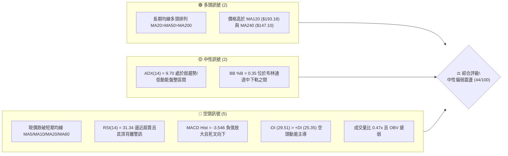

### 📊 核心指標速覽表

| 指標類別 | 指標名稱 | 當前數值 | 訊號 | 解讀 |
|----------|----------|----------|------|------|
| **價格** | 當前價格 | $204.09 | 🟡 | 位於52週區間59.5%，面臨短期回調壓力 |
| **均線** | MA20 | $220.60 | 🔴 | 價格低於MA20（-7.48%），短線承壓 |
| **均線** | MA50 | $214.66 | 🔴 | 價格低於MA50（-4.92%），跌破中期均線 |
| **均線** | MA200 | $153.45 | 🟢 | 價格遠高於MA200（+33.00%），長期多頭架構完好 |
| **動能** | RSI(14) | 31.34 | 🟡 | 處於30-70中性偏弱區間，存在歷史頂背離壓制 |
| **動能** | MACD | -1.963 | 🔴 | MACD線位於訊號線(1.582)下方，綠柱擴大至-3.546 |
| **動能** | Stoch %K/%D | 10.80 / 7.46 | 🟡 | 進入超賣區，短線具備技術性反彈動能 |
| **趨勢** | ADX(14) | 9.70 | 🟡 | ADX < 25 表明處於無方向盤整期，空方佔優(-DI>-DI) |
| **波動** | ATR(14) | $16.08 | 🔴 | 波動佔比達7.88%，單日價格波動幅度劇烈 |
| **量能** | 20日量比 | 0.47x | 🔴 | 成交量10.79M低於20日均量23.05M，量能萎縮 |

### 🏆 技術評分卡

```
╔══════════════════════════════════════════════════════════════╗
║                技術評分卡 — NBIS (2026-09-03)                ║
╠══════════════════════════════════════════════════════════════╣
║ 趨勢強度      ████░░░░░░░░░░░░░░░░  20/100  🔴 極弱趨勢/盤整 ║
║ 動能指標      ██████░░░░░░░░░░░░░░  30/100  🔴 MACD死叉弱勢  ║
║ 支撐穩定度    ████████████░░░░░░░░  60/100  🟡 臨近S1支撐位  ║
║ 成交量配合    ██████░░░░░░░░░░░░░░  30/100  🔴 量能萎縮背離  ║
║ 形態完整度    ██████████░░░░░░░░░░  50/100  🟡 區間震盪築底  ║
║ 均線排列      ██████████████░░░░░░  70/100  🟢 長期均線多頭  ║
╠══════════════════════════════════════════════════════════════╣
║ 綜合評分      ████████░░░░░░░░░░░░  44/100  🟡 中性偏空震盪  ║
╚══════════════════════════════════════════════════════════════╝
```

---

## 2. 趨勢分析

### 🌐 多時框趨勢分析

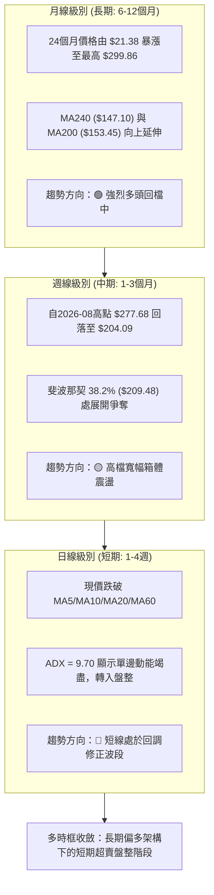

### 📈 長期趨勢 — 12個月走勢圖（Unicode）

```
NBIS 月線走勢圖（過去12個月：2025-10 至 2026-09）
價格軸 ($)
$300 ┤                                      ● 2026-06 ($276.17)
$270 ┤                                     ╱ ╲
$240 ┤                              ● 2026-05 ╲
$210 ┤                             ╱           ╲  ● 2026-08 ($206.32)
$180 ┤                            ╱             ● 2026-07  ╲● 現在 ($204.09)
$150 ┤                     ● 2026-04 ($138.23)
$120 ┤● 2025-10 ($130.82) ╱
$90  ┤ ╲● 2025-11 ($94.87)● 2026-02 ($91.19)
$60  ┤   ● 2025-12 ($83.71)
     └─────────────────────────────────────────────────────────────
       10  11  12  01  02  03  04  05  06  07  08  09 (月份)
```

#### 走勢特徵分析表格

| 階段 | 時間區間 | 起始/結束價 | 漲跌幅 | 核心特徵與成交量解讀 |
|------|----------|-------------|--------|----------------------|
| **第1階段：高檔回洗** | 2025-10 ~ 2025-12 | $130.82 → $83.71 | -36.01% | 首次大波段衝高後的回調築底，於 $83.71 形成底部支撐 |
| **第2階段：蓄勢起跑** | 2026-01 ~ 2026-03 | $85.19 → $103.76 | +21.80% | 均線開始聚攏，量能溫和放大，走出低檔盤整區間 |
| **第3階段：主升浪狂飆** | 2026-04 ~ 2026-06 | $138.23 → $276.17 | +99.79% | AI算力基建題材爆發，創下52週高點 $299.86，月線連續大陽線 |
| **第4階段：劇烈洗盤震盪** | 2026-07 ~ 2026-09 | $190.41 → $204.09 | +7.18% | 衝高後劇烈獲利了結，於 $177.71~$277.68 進行寬幅箱體洗盤 |

### 📊 中期趨勢（週線分析）

```
NBIS 週線關鍵架構示意圖
$299.86 ─────────────────────────────── [52W 最高阻力]
          ▲               ▲
$277.68 ──┼───────────────┼──────────── [R2 / 近期雙頂壓力帶]
          │ ╲           ╱ │ ╲
          │  ╲         ╱  │  ╲
$220.60 ──┼───╲───────╱───┼───╲──────── [BB中軌 / MA20 阻力]
          │    ╲     ╱    │    ╲
$204.09 ──┼─────╲───╱─────┼─────●────── [現價位置：斐波那契 38.2% 回調位]
$200.30 ──┴──────●─╱──────┴──────────── [S1 關鍵波段支撐]
                 $177.71
```

近20週數據顯示，股價在2026-08-16週衝高至 $277.68（伴隨 167.5M 巨量）後快速回落，隨後兩週成交量自 141.7M 驟降至 32.2M，週線 MACD 柱狀圖由正轉負（+9.868 → -3.546），確認中期進入高檔回調整理。

### ⚡ 趨勢強度評估（ADX 解讀）

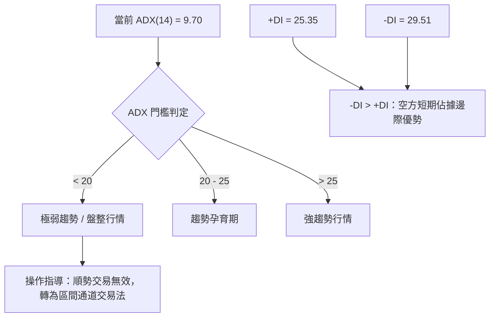

#### ADX 強度對照與解讀

| 指標 | 數值 | 狀態評級 | 戰略含義 |
|------|------|----------|----------|
| **ADX (14)** | **9.70** | 🔴 極弱趨勢 | 數值遠低於25，代表單邊趨勢已經停滯，市場缺乏主導推動力，處於震盪打底期 |
| **+DI** | **25.35** | 🟡 多方動能衰退 | 買盤推升力量減弱，無法形成連續突破 |
| **-DI** | **29.51** | 🔴 空方相對主導 | 空方力量暫時壓過多方，但並未形成單邊崩跌趨勢 |
| **多空差值 (-DI - +DI)** | **+4.16** | 🔴 偏空震盪 | 短線走勢由空頭略佔上風，但因 ADX 極低，空方打壓空間受限 |

---

## 3. 圖表形態分析

### 🔍 形態識別系統

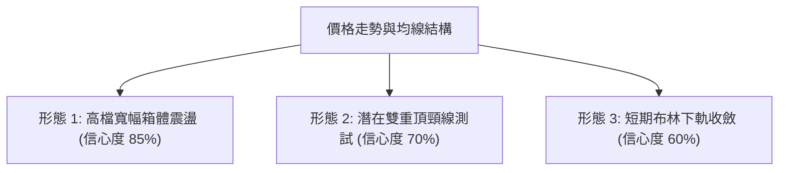

#### 圖表形態信心度評估表

| 形態名稱 | 信心度 | 判斷依據（引用數據） | 完成度 | 目標價（附精確計算式） |
|----------|--------|----------------------|--------|------------------------|
| **高檔寬幅箱體** | **85%** | 箱頂聚類於 R2 ($279.83)，箱底聚類於 S1 ($200.30) 與 S2 ($164.31) | 80% | 震盪反彈目標 = 箱底 $200.30 + (箱頂 $279.83 - 箱底 $200.30) × 0.5 = **$240.07** |
| **雙重頂回測頸線** | **70%** | 第一頂 2026-06 收盤 $276.17，第二頂 2026-08 週高 $277.68，頸線為 2026-07 低點聚類 S1 ($200.30) | 90% | 若跌破頸線 $200.30，量度跌幅 = 頸線 $200.30 - (高點 $277.68 - 頸線 $200.30) = **$122.92**（強支撐於 S3 $145.80） |
| **布林通道下軌收斂** | **60%** | BB %B = 0.35，現價逼近下軌 $165.66 與 S1 $200.30 支撐帶 | 75% | 均值回歸中軌目標 = MA20 = **$220.60** |

### 🕯️ 重要K線形態分析

| 週期/月份 | 收盤價 | K線形態 | 解讀 | 訊號 |
|-----------|--------|---------|------|------|
| **2026-06** | $276.17 | 實體大陽線帶長上影 | 觸及 52W 高點 $299.86 後遇阻回落，顯示 $280-$300 存在強大獲利了結盤 | 🔴 頂部滯漲 |
| **2026-07** | $190.41 | 長陰線回調 | 獲利賣壓出清，單月大跌 -31.05%，直接回踩 MA120 ($193.18) 尋求支撐 | 🔴 恐慌拋售 |
| **2026-08** | $206.32 | 帶長上影十字陽線 | 盤中反彈測試 $277.68 失敗回落，多空雙方在 $200 關口劇烈博弈 | 🟡 震盪整理 |
| **2026-09** | $204.09 | 低量窄幅整理K線 | 交易量大幅萎縮至 10.79M，波動率收窄，空方動能減弱，處於方向抉擇前夕 | 🟡 蓄勢待變 |

### 📉 ASCII 走勢形態示意圖

```
NBIS 形態幾何示意圖：高檔箱體與潛在雙頂結構
$299.86 ┬────────────────────────────────────────────── [52W 峰值]
        │              頂1: $276.17        頂2: $277.68
$280.00 ┤                ╭───╮              ╭───╮  <-- R2 壓力帶 ($279.83)
        │               ╱     ╲            ╱     ╲
$240.00 ┤              ╱       ╲          ╱       ╲
        │             ╱         ╲        ╱         ╲
$220.00 ┤            ╱           ╲      ╱           ╲ <-- MA20 / 中軌 ($220.60)
        │           ╱             ╲    ╱             ╲
$204.09 ┼──────────╱───────────────╲──╱───────────────● <-- 當前價格
$200.30 ┴─────────┴─────────────────┴────────────────── <-- 箱體底部 / 頸線 (S1)
                                谷底: $177.71
```

### 🎯 形態目標價計算

1. **區間震盪均值回歸目標（多頭基線）**：
   - 形態底部：S1 = **$200.30**
   - 形態阻力：MA20 = **$220.60**，第一阻力 R1 = **$231.17**
   - 上行目標計算：自 S1 反彈至 R1，預期空間為 $+15.41\%$。
2. **形態破位下行量度目標（空頭風險）**：
   - 雙頂頸線破位條件：實體跌破 S1 ($200.30)。
   - 下方第一支撐緩衝帶：S2 = **$164.31**（接近斐波那契 61.8% 的 $153.64 及 MA200 的 $153.45）。

---

## 4. 支撐與阻力

### 🗺️ 關鍵價位分布圖（Unicode）

```
NBIS 價位結構分布圖
═════════════════════════════════════════════════════════════════════
$299.86 ║██████████████████████████████║ 歷史極值阻力 R3 (52W High)
$279.83 ║████████████████████          ║ 波段雙頂強阻力 R2 (+37.11%)
$231.17 ║████████████████████████      ║ 近期波段高點阻力 R1 (+13.27%)
$220.60 ║▓▓▓▓▓▓▓▓▓▓▓▓▓▓▓▓              ║ 短期均線阻力 MA20 / BB中軌
$209.48 ║░░░░░░░░░░░░░░░░░░░░░░        ║ 斐波那契 38.2% 回調位
$204.09 ╠══════════════════════════════╣ ◄ 現價 ($204.09)
$200.30 ║▓▓▓▓▓▓▓▓▓▓▓▓▓▓▓▓▓▓▓▓▓▓▓▓      ║ 核心波段支撐 S1 (-1.86%)
$181.56 ║░░░░░░░░░░░░░░░░              ║ 斐波那契 50.0% 強弱分水嶺
$164.31 ║████████████████████████      ║ 波段低點強支撐 S2 (-19.49%)
$153.45 ║██████████████████████████    ║ 長期生命線 MA200 / 斐波那契 61.8%
$145.80 ║██████████████████████████████║ 終極防守支撐 S3 (-28.56%)
═════════════════════════════════════════════════════════════════════
```

### 🚧 阻力位分析表

| 阻力級別 | 精確價位 | 形成原因與技術共振 | 突破難度 | 重要性 |
|----------|----------|--------------------|----------|--------|
| **R1** | **$231.17** | 近期波段反彈高點聚類，與 2026-05-31 收盤價 ($231.09) 高度重合，上方臨近 MA60 ($221.19) | 🟡 中等 | 短線多空翻轉關鍵位 |
| **R2** | **$279.83** | 2026-06 及 2026-08 兩次衝高受阻的波段高點聚類（$276.17 / $277.68） | 🔴 極高 | 中期箱體頂部強阻力 |
| **R3** | **$299.86** | 52週歷史最高點，籌碼套牢盤密集區 | 🔴 極高 | 長期多頭天花板 |

### 🛡️ 支撐位分析表

| 支撐級別 | 精確價位 | 形成原因與技術共振 | 守住機率 | 重要性 |
|----------|----------|--------------------|----------|--------|
| **S1** | **$200.30** | 近一年波段低點聚類，心理整數關卡，2026-08-30 收盤價 ($209.18) 下方防線 | 🟡 65% | 短期多頭最後防線 |
| **S2** | **$164.31** | 近一年波段深次回調低點聚類，與布林下軌 ($165.66) 形成完美技術共振 | 🟢 80% | 中期價值買盤防禦帶 |
| **S3** | **$145.80** | 長期波段起漲點低點聚類，與 MA240 ($147.10) 及 MA200 ($153.45) 構築防線 | 🟢 90% | 長期多頭生死線 |

### 📐 斐波那契回調位分析

依據 52 週完整波動區間（低點 **$63.26** → 高點 **$299.86**，總垂直空間 **$236.60**）計算：

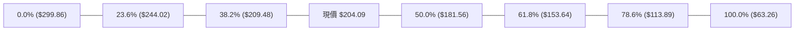

- **當前位置解讀**：現價 **$204.09** 處於 **38.2% ($209.48)** 與 **50.0% ($181.56)** 之間。
- **技術意義**：
  1. 股價回調跌破 38.2% ($209.48)，顯示自 $299.86 的回調已由「強勢淺度回調」轉為「中度震盪整理」。
  2. 若 S1 ($200.30) 失守，下行引力將直接指向 50.0% 回調位 **$181.56**（此處曾為 2026-07 低點 $177.71 附近的支撐平台）。
  3. 只要股價維持在 61.8% 黃金分割位 **$153.64**（與 MA200 $153.45 共振）之上，長線牛市結構並未遭到破壞。

---

## 5. 技術指標深度解讀

### 🎛️ 指標訊號總覽

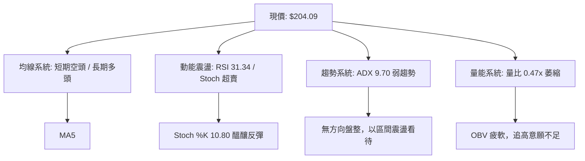

### 📈 移動平均線排列分析

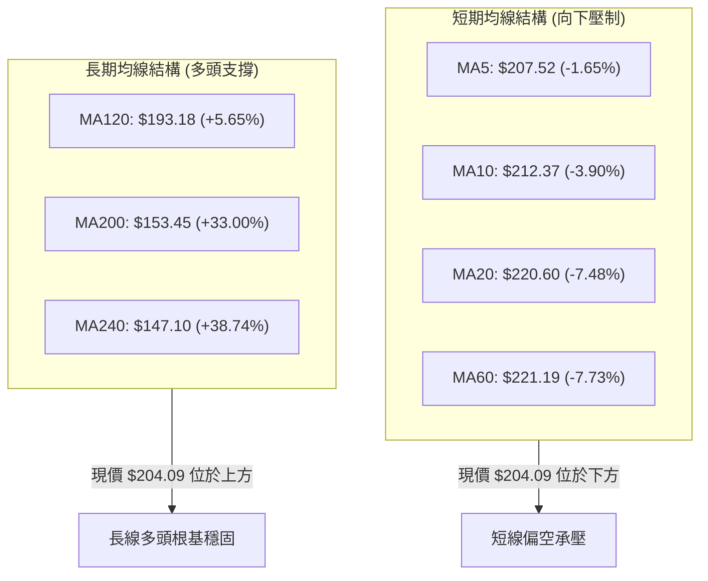

- **均線排列狀態**：總體維持 `MA20 > MA50 > MA200` 多頭排列格局，但短週期均線（MA5、MA10、MA20、MA60）全面向下彎頭，且現價跌破 MA20 ($220.60) 與 MA50 ($214.66)。
- **操作意義**：長多短空，回調屬於上升趨勢中的中級洗盤，上方 MA20 ($220.60) 轉化為動態第一道阻力。

### 📉 RSI(14) 分析

```
RSI(14) 刻度分析：
[0]───────────[30]──●─────────[50]─────────────────────[70]───────────[100]
                  31.34 (中性偏弱/逼近超賣)
RSI 數值進度條：██████░░░░░░░░░░░░░░  31.34%
```

- **背離分析**：系統偵測到 **頂背離（Bearish Divergence）**。在 2026-06 至 2026-08 期間，股價兩次上探 $276-$277 高點，但週線 RSI 由 65.3 降至 67.2 後迅速衰竭至 51.5，未能創出新高，動能衰減引發了後續的破位回調。
- **當前狀態**：日線 RSI 來到 **31.34**，已接近 30 的傳統超賣區，空頭殺跌動能開始衰竭，隨時可能觸發技術性抽頭反彈。

### 📊 MACD(12/26/9) 訊號解讀

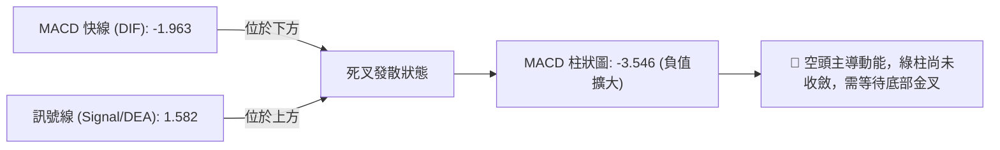

- **數值解讀**：DIF (-1.963) 下穿零軸與 DEA (1.582)，柱狀圖讀數為 **-3.546**。
- **結論**：MACD 當前處於明確的空頭控制區，短線尚未出現底背離訊號，左側進場風險偏高，應等待柱狀圖縮頭（收斂至 0 軸附近）再行確認。

### 📦 布林通道分析

```
NBIS 布林通道位置示意圖 (Bandwidth = $109.87)
$275.53 ┬────────────────────────────────────────── [BB 上軌]
        │
$220.60 ┼────────────────────────────────────────── [BB 中軌 / MA20]
        │
$204.09 ┼─────────────────────●──────────────────── [現價: %B = 0.35]
        │
$165.66 ┴────────────────────────────────────────── [BB 下軌]
```

- **軌道參數**：上軌 **$275.53**，中軌 **$220.60**，下軌 **$165.66**。
- **%B 讀數**：**0.35**，表示股價位於中軌下方、偏向通道下半部。
- **通道形態**：通道開口處於擴張後的收斂期，未出現下軌開口向下擴張的極端單邊殺跌形態，預示價格將在下軌 $165.66 與中軌 $220.60 之間進行區間震盪。

### 💹 成交量分析（量價配合度）

- **量比與均量**：最新成交量為 **10,794,300 股**，對比 20 日均量 **23,056,745 股**，量比僅為 **0.47x**（量能萎縮超過 50%）。
- **OBV 趨勢**：`OBV < MA`，量能指標處於均線下方，顯示主力資金在現階段並未大舉回流接盤，市場呈現典型的「縮量陰跌」特徵。
- **量價診斷**：量能極度萎縮說明賣壓在 $200 附近也逐步衰竭，缺乏主動殺跌盤，市場正在等待新的催化劑來打破僵局。

---

## 6. 動能與波動率

### ⚡ 動能評估四象限

| 象限 | 動能強度 | 波動率水準 | 股票狀態分佈 | 當前 NBIS 評估與解讀 |
|------|----------|------------|--------------|----------------------|
| **Q1** | 強動能 (ADX>25) | 低波動 (ATR%<5%) | 穩定單邊趨勢 | — |
| **Q2** | 弱動能 (ADX<25) | 低波動 (ATR%<5%) | 窄幅盤整蓄勢 | — |
| **Q3** | 強動能 (ADX>25) | 高波動 (ATR%>5%) | 爆發式單邊拉升/下殺 | — |
| **Q4** | **弱動能 (ADX=9.70)** | **高波動 (ATR%=7.88%)** | **寬幅震盪洗盤** | **✓ NBIS 當前處於 Q4 象限：方向動能疲弱但個股自身固有波動極大，屬於典型的高難度洗盤期，切忌追漲殺跌** |

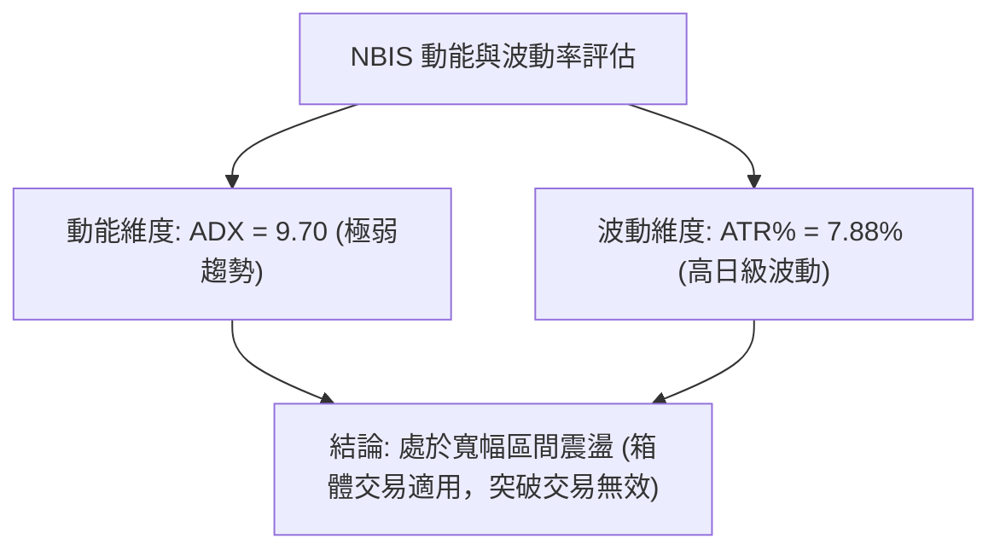

### 📊 ATR 波動率分析

- **ATR(14) 數值**：**$16.08**，佔當前價格比例高達 **7.88%**。
- **波動特性解讀**：NBIS 具備極高的每日隱含波動空間，單日上下震盪 $15~$20 屬於正常技術雜訊。
- **止損距離建議**：
  - **保守型交易（2.0 × ATR）**：止損緩衝距離需設定為 $16.08 × 2.0 = **$32.16**。
  - **進取型交易（1.5 × ATR）**：止損緩衝距離需設定為 $16.08 × 1.5 = **$24.12**。
  - **警示**：過窄的止損（如 < $10）極易在日常日內雜訊中被無效觸發。

### 📐 Beta 與市場相關性

- **Beta 係數**：**1.434**。
- **大盤敏感度解讀**：NBIS 屬於高彈性進攻型資產，對標普500/納斯達克指數的波動敏感度高達 1.43 倍。在市場風險偏好上升時具備超越大盤的爆發力，但在市場避險情緒升溫時，其回調幅度亦將顯著大於基準指數。

---

## 7. 多時框架總結

### 📋 時框架評分表

| 時框架 | 趨勢方向 | 動能狀態 | 均線排列 | 圖表形態 | 綜合評分 | 戰略建議 |
|--------|----------|----------|----------|----------|----------|----------|
| **長期 (月線)** | 🟢 多頭 | 🟡 高檔鈍化 | 🟢 MA200/240 陡峭向上 | 52W多頭旗形整理 | **75/100** | 長線多頭持股，回調提供逢低配置契機 |
| **中期 (週線)** | 🟡 震盪 | 🔴 MACD負值發散 | 🟡 跌破MA20/維持MA50上 | 寬幅箱體 ($200-$280) | **48/100** | 箱體區間思維，高拋低吸，嚴控倉位 |
| **短期 (日線)** | 🔴 偏空 | 🟡 RSI超賣/Stoch鈍化 | 🔴 短期均線空頭壓制 | 跌破中軌尋求下軌支撐 | **35/100** | 暫停追多，等待 S1 支撐確認與量能回升 |

### 🔲 綜合訊號矩陣

```
時框共振度分析：
┌───────────────┬─────────────────────────────────────────────────────────┐
│ 維度          │ 訊號方向與共振狀態                                       │
├───────────────┼─────────────────────────────────────────────────────────┤
│ 均線系統      │ 短期(🔴) ⟷ 中期(🟡) ⟷ 長期(🟢)  [時框背離：長多短空]    │
│ 動能系統      │ 日線RSI超賣(🟡) ⟷ 週線MACD向下(🔴) [短線反彈 vs 中期壓制]│
│ 量價系統      │ 量萎縮0.47x(🔴) ⟷ OBV疲弱(🔴)     [共振偏弱，主力觀望]    │
│ 形態系統      │ 箱底支撐S1(🟢) ⟷ 雙頂頸線壓力(🔴) [面臨 $200 關鍵抉擇]  │
└───────────────┴─────────────────────────────────────────────────────────┘
```

### ⚖️ 多時框收斂結論

依據多時框收斂規則：
1. **行情性質判定**：當前 ADX(14) 為 **9.70 (< 25)**，技術架構明確屬於 **無方向盤整行情**，順勢突破策略失效。
2. **主導時框與交易邊界**：在盤整行情下，以 **日線與週線布林通道上下軌（$165.66 ~ $275.53）** 作為核心操作區間，中長期均線（MA200 $153.45）提供極限安全邊際。
3. **唯一方向性結論**：**🟡 中性觀望，偏向逢低區間操作**。短線雖受制於短期均線壓制，但鑑於 RSI(14) 逼近超賣（31.34）且 Stoch 進入極端超賣區（%K=10.80），股價在波段支撐 **S1 ($200.30)** 具備高勝率技術反彈需求。

---

## 8. 交易策略建議

### 🗺️ 策略決策流程圖

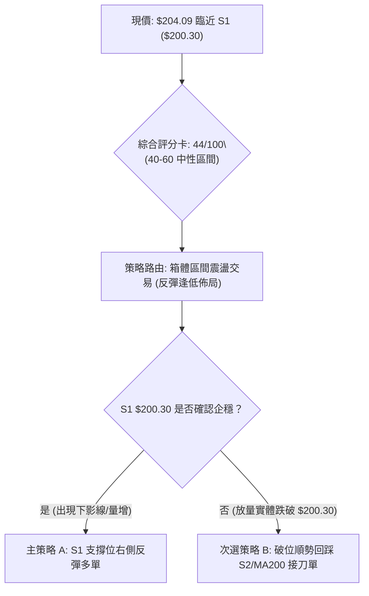

### 🧭 策略路由

> **當前主策略方向 = 🟡 區間低吸震盪策略（依綜合評分 44/100，處於 40–60 中性區間，以布林通道與 S1 支撐操作為主）**

### 🎯 價格情境階梯（Price Scenarios）

| 觸發條件 | 下一目標 | 後續延伸 | 情境含義 |
|----------|----------|----------|----------|
| **向上突破 R1 $231.17** | **R2 $279.83** | **R3 $299.86** | 短線回調結束，確認箱體底部反轉，重啟衝頂行情 |
| **站穩現價區間 ($200.30~$220.60)** | **MA20 $220.60** | **R1 $231.17** | 區間縮量築底，進行均值回歸震盪修復 |
| **向下跌破 S1 $200.30** | **S2 $164.31** | **S3 $145.80** | 中期箱體破位，向 50%~61.8% 斐波那契及 MA200 尋求強支撐 |

### 📊 情境機率分佈

| 情境 | 機率 | 主要依據（引用指標狀態） |
|------|------|--------------------------|
| **情境一：守住 S1 展開均值回歸反彈** | **55%** | RSI(14) 達 31.34 接近超賣，Stoch 極度超賣（%K=10.80），且量比萎縮至 0.47x 顯示殺跌動能枯竭 |
| **情境二：窄幅區間橫盤震盪 ($195~$215)** | **30%** | ADX(14) 僅 9.70，市場動能極低，多空雙方在 $200 整數關卡反覆拉鋸 |
| **情境三：跌破 S1 深度回踩 S2** | **15%** | MACD 綠柱放大 (-3.546) 且短均線呈空頭排列，若遇大盤系統性風險可能引發破位拋壓 |

### 🟢 主策略詳情

| 策略要素 | 策略 A（主選：S1 支撐反彈波段） | 策略 B（次選：破位深吸埋伏單） |
|----------|----------------------------------|----------------------------------|
| **進場條件** | 股價回踩 $200.30~$204.09 區間出現日線底背離或止跌K線 | 實體跌破 S1 後，在 S2 ($164.31) 附近分批掛單 |
| **進場價格** | **$201.50** | **$165.00** |
| **目標價 T1** | **$220.60** (MA20 / BB中軌) | **$200.30** (原箱底轉為阻力) |
| **目標價 T2** | **$231.17** (波段阻力 R1) | **$220.60** (MA20 回抽位) |
| **止損價格** | **$191.00** (跌破 S1 緩衝區，約 1×ATR 內) | **$149.00** (跌破 S3 及 MA200 防線) |
| **風險報酬比** | **1 : 2.83** (冒險 $10.50 獲取 $29.67 空間) | **1 : 2.21** (冒險 $16.00 獲取 $35.30 空間) |
| **成功機率** | **58%** | **65%** |
| **建議倉位** | **15% ~ 20%**（輕倉分批） | **25% ~ 30%**（中線配置） |

### 🔴 反向風險觸發點（對沖提示）

- **多頭止損與對沖觸發**：若日線收盤價**實體跌破 $198.00**（確認失守 S1 $200.30），應立即將現貨多頭部位減半，或買入相應 Delta 的認沽期權進行下行保護，下看目標 **S2 $164.31**。
- **空頭翻多觸發**：若股價放量突破並站穩 **MA20 ($220.60)** 與 **R1 ($231.17)**，則宣告短線空頭結構瓦解，應將所有空頭對沖平倉並轉為主動追多。

### ⭐ 整體訊號強度評星

```
╔════════════════════════════════════════════════╗
║ 做多訊號強度：★★☆☆☆  (2.5/5星 - 偏向超賣左側)  ║
║ 做空訊號強度：★★★☆☆  (3.0/5星 - 短期均線壓制)  ║
║ 整體可信度：  ★★★☆☆  (3.5/5星 - ADX極低雜訊多)║
╚════════════════════════════════════════════════╝
```

---

## 9. 風險提示與監控

### ✅ 關鍵監控指標 Checklist

```
╔══════════════════════════════════════════════════════════════╗
║                    每日盤面關鍵監控清單                      ║
╠══════════════════════════════════════════════════════════════╣
║ [ ] 價格是否跌破 S1 核心防線 ($200.30)？                     ║
║ [ ] 成交量是否放大至 20日均量 (23.05M) 以上？                ║
║ [ ] 日線 RSI(14) 是否在 30 附近形成明確底背離？              ║
║ [ ] MACD 柱狀圖是否開始由 -3.546 收斂轉向零軸？              ║
║ [ ] 股價能否重返短期均線 MA5 ($207.52) 與 MA10 ($212.37) 之上？║
║ [ ] ADX(14) 是否向上突破 20，宣告新單邊趨勢開啟？            ║
╚══════════════════════════════════════════════════════════════╝
```

### ⚠️ 風險場景分析

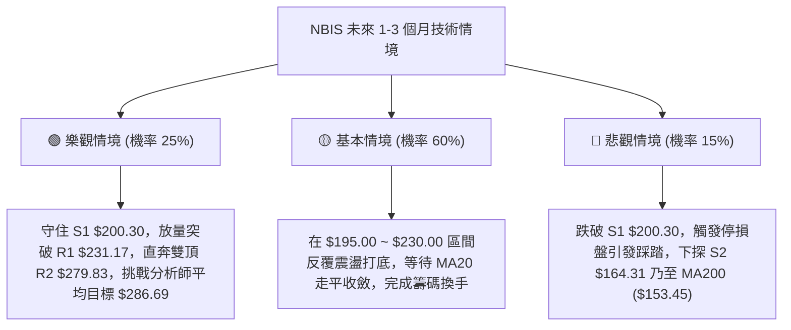

### 🛡️ 風險管理重要提醒

1. **高空頭部位風險 (Short Float 23.4%)**：當前放空比率高達 23.4%，Short Ratio 2.12。高空頭佔比意味著一旦有正面催化劑刺激股價突破阻力位 R1 ($231.17)，極易引發劇烈的**空頭軋空（Short Squeeze）**暴漲；反之，若失守關鍵支撐，空頭打壓將加速股價下挫。
2. **高 ATR 波動風險**：ATR 佔比達 7.88%，絕對金額 $16.08。單筆交易最大虧損額必須嚴格限制在總賬戶資產的 **1.0% ~ 1.5%** 以內，透過倉位規模調控（Position Sizing）來抵禦高波動，切忌滿倉操作。
3. **無趨勢環境下的過度交易風險**：ADX = 9.70 表明當前沒有大級別單邊趨勢，所有突破訊號的假突破機率均高於 60%。嚴格禁止追高買入，交易必須在箱體邊界（S1 買、R1/R2 賣）耐性執行。

---

## 📋 報告總結

```
╔════════════════════════════════════════════════════════════════╗
║                     NBIS 技術分析報告總結                      ║
╠════════════════════════════════════════════════════════════════╣
║ 報告日期：2026-09-03                                          ║
║ 當前價格：$204.09                                             ║
║ 分析評級：⚖️ 中性偏空震盪 (評分 44/100) — 短期超賣等待止跌    ║
╠════════════════════════════════════════════════════════════════╣
║ 關鍵結論：                                                     ║
║ ├─ 長期趨勢：🟢 強烈多頭 (MA200 = $153.45 提供極限防護)       ║
║ ├─ 中期趨勢：🟡 寬幅箱體震盪 (主要運行於 $165 ~ $280 區間)    ║
║ ├─ 短期趨勢：🔴 弱勢回調 (受 MA5/MA10/MA20 空頭排列壓制)      ║
║ ├─ 關鍵支撐：S1 $200.30 │ S2 $164.31 │ S3 $145.80             ║
║ ├─ 關鍵阻力：R1 $231.17 │ R2 $279.83 │ R3 $299.86             ║
║ └─ 華爾街目標：平均 $286.69 (低 $144.00 / 高 $415.00)          ║
╠════════════════════════════════════════════════════════════════╣
║ 最優策略組合：                                                 ║
║ 1. 🥇 最佳機會：在 S1 ($200.30~$201.50) 建立 15% 多頭反彈試倉 ║
║    目標 T1: $220.60, T2: $231.17, 嚴格止損 $191.00 (風報比 1:2.8)║
║ 2. 🥈 次選機會：若放量跌破 S1，於 S2 ($164.31) 附近埋伏長線底倉║
║ 3. 🥉 保守選擇：空倉觀望，等待日線突破 MA20 ($220.60) 後順勢跟進║
╚════════════════════════════════════════════════════════════════╝
```

---

> ⚠️ **免責聲明**：本報告為技術分析研究成果，所有數據、圖表及估算均基於歷史價格與量能資訊推算。本報告**僅供學術研究與參考**，**不構成任何形式的投資要約或交易建議**。金融市場具有高度風險，投資人應獨立評估風險並自負盈虧。

---

*報告生成時間：2026-09-03 ｜ 數據來源：Yahoo Finance ｜ 分析框架：多時框技術分析模型*