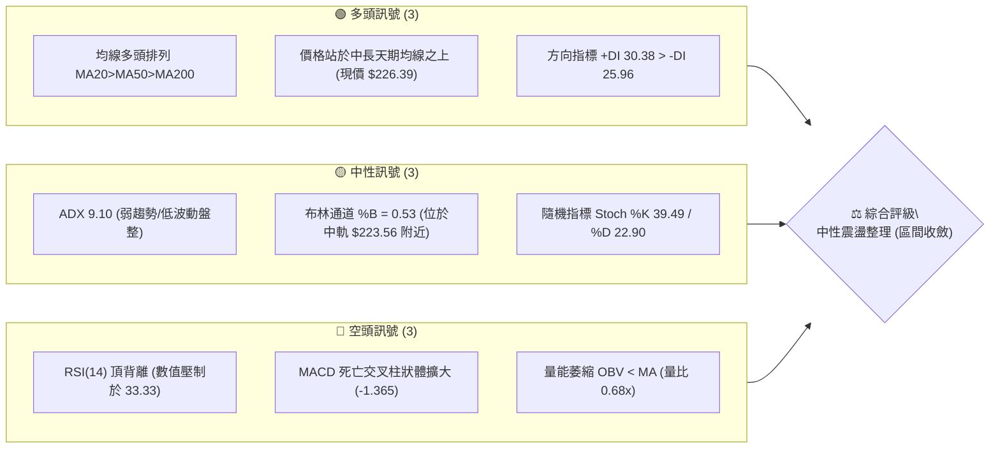
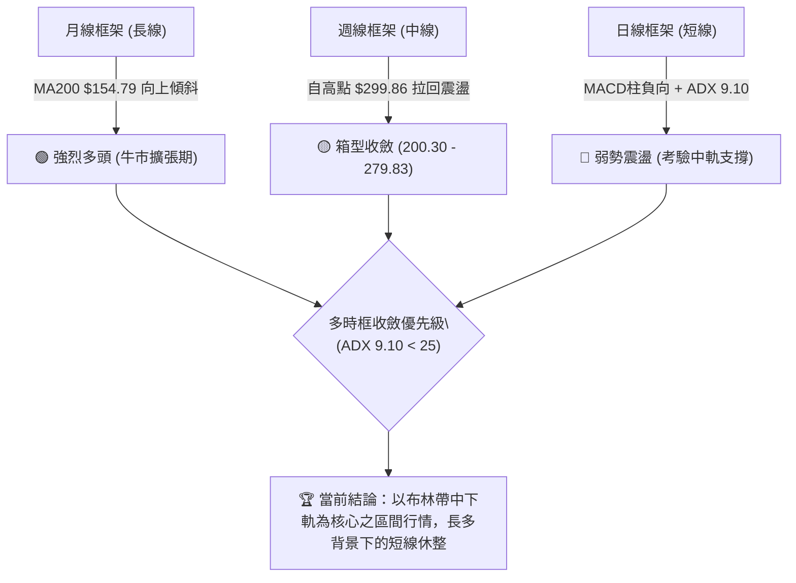
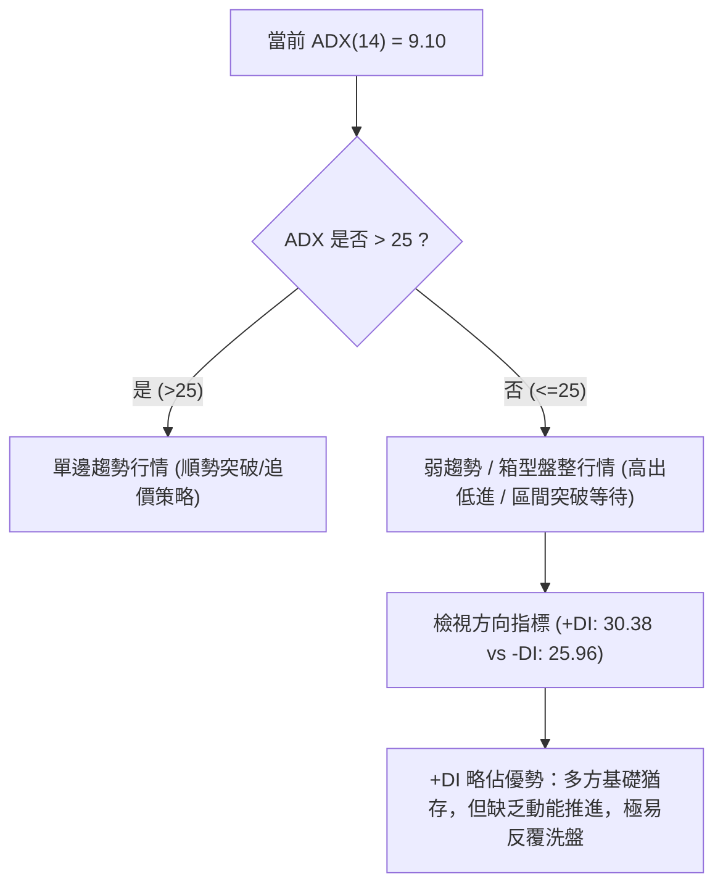
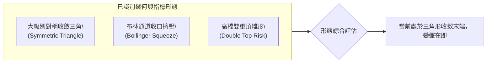
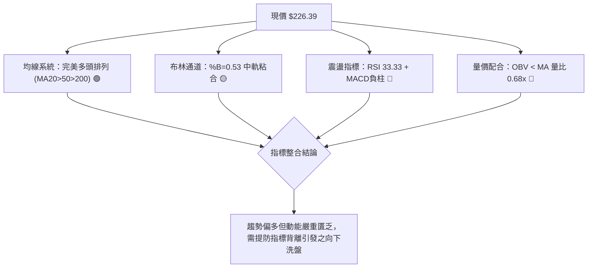
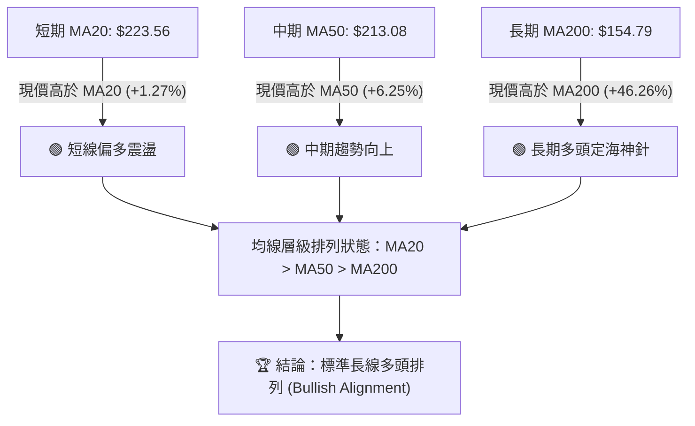
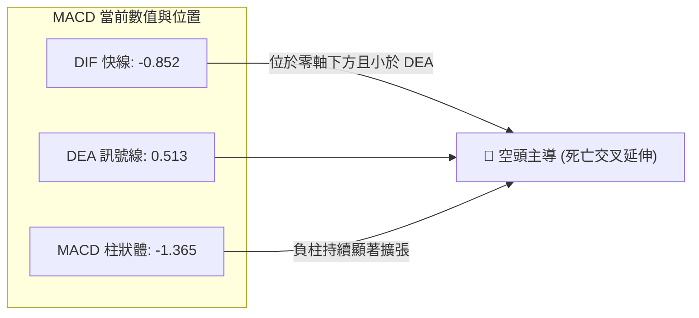
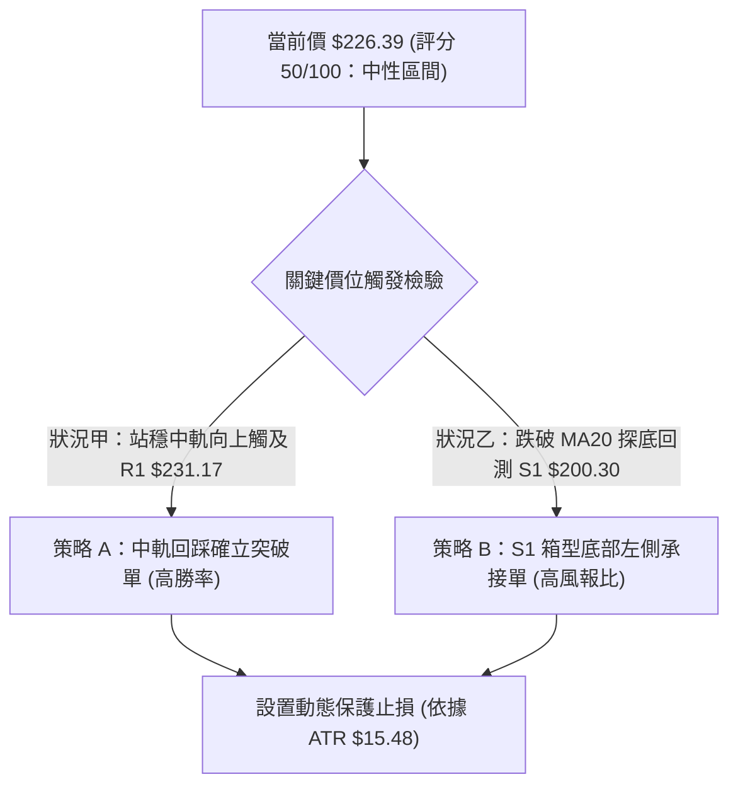
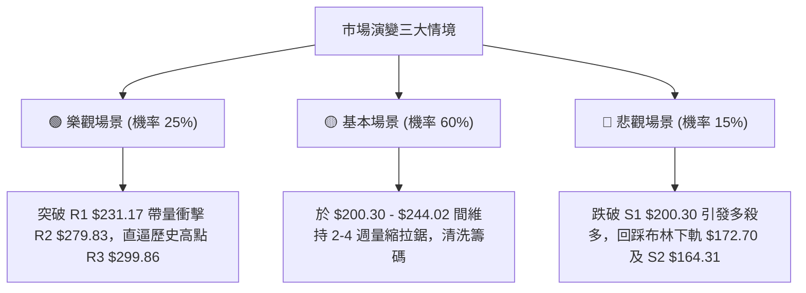

# NBIS 技術分析報告

> **報告日期**：2026-09-05 ｜ **語言**：繁體中文 ｜ **數據來源**：Yahoo Finance ｜ **當前價格**：$226.39

---

## 目錄

| 章節 | 內容 |
|------|------|
| [1. 技術面概覽](#1-技術面概覽) | 訊號儀表板、核心指標、評分卡 |
| [2. 趨勢分析](#2-趨勢分析) | 多時框趨勢、長中短期走勢 |
| [3. 圖表形態分析](#3-圖表形態分析) | 形態識別、K線組合、目標價 |
| [4. 支撐與阻力](#4-支撐與阻力) | 關鍵價位、斐波那契回調 |
| [5. 技術指標深度解讀](#5-技術指標深度解讀) | MA/RSI/MACD/布林/成交量 |
| [6. 動能與波動率](#6-動能與波動率) | 動能評估、ATR、Beta |
| [7. 多時框架總結](#7-多時框架總結) | 時框架評分矩陣 |
| [8. 交易策略建議](#8-交易策略建議) | 多空策略、風險報酬比 |
| [9. 風險提示與監控](#9-風險提示與監控) | 監控指標、風險場景 |
| [📋 報告總結](#-報告總結) | 核心結論與策略總表 |

---

## 1. 技術面概覽

### 🎯 技術訊號儀表板



---

### 📊 核心指標速覽表

| 指標類別 | 指標名稱 | 當前數值 | 訊號 | 專業技術解讀 |
|:---|:---|:---:|:---:|:---|
| **價格結構** | 當前價格 | $226.39 | 🟡 | 位於 52 週高低區間之 68.9%，處於高位拉回後的箱型整理區 |
| **短期均線** | MA20 (布林中軌) | $223.56 | 🟢 | 現價微幅高於 MA20 (+1.27%)，短線獲得動態支撐，測試頸線關鍵 |
| **中期均線** | MA50 | $213.08 | 🟢 | 現價高於 MA50 (+6.25%)，中期多頭結構底線維持完好 |
| **長期均線** | MA200 | $154.79 | 🟢 | 現價大幅高於 MA200 (+46.26%)，超長期牛市基調穩固 |
| **震盪指標** | RSI(14) | 33.33 | 🔴 | 位於弱勢區間邊緣，且出現典型「價格反彈但 RSI 創新低」之頂背離修正 |
| **趨勢動能** | MACD (12,26,9) | -0.852 | 🔴 | DIF 線低於訊號線 (0.513)，柱狀圖為 -1.365，動能仍由空方控盤 |
| **隨機動能** | Stoch %K / %D | 39.49 / 22.90 | 🟡 | %K 由超賣區向上穿越 %D，短線具備弱勢反彈契機 |
| **趨勢強度** | ADX (14) | 9.10 | 🟡 | 數值遠低於 25 臨界線，顯示單邊趨勢衰竭，全面進入無趨勢盤整 |
| **通道指標** | Bollinger Bands | $172.70 - $274.41 | 🟡 | %B 為 0.53，價格回歸中軌均值，波動率收縮蓄勢 |
| **量能指標** | OBV & 量比 | 14.89M (量比 0.68x) | 🔴 | OBV < 均線，20日均量持續降溫，量價背離顯示追價意願不足 |
| **市場波動** | ATR(14) | $15.48 | 🟡 | 佔現價 6.84%，維持高波動特性，單日風險波動值較大 |

---

### 🏆 技術評分卡

```
╔════════════════════════════════════════════════════════════════════════════╗
║                   技術評分卡 — NBIS (2026-09-05)                          ║
╠════════════════════════════════════════════════════════════════════════════╣
║ 趨勢強度 (Trend)      ████░░░░░░░░░░░░░░░░  20/100  🔴 (ADX 9.10 趨勢極弱)║
║ 動能指標 (Momentum)   ██████░░░░░░░░░░░░░░  30/100  🔴 (MACD綠柱+RSI低迷) ║
║ 支撐穩定度 (Support)  ██████████████░░░░░░  70/100  🟢 (MA50與S1防禦有效) ║
║ 成交量配合 (Volume)   ██████░░░░░░░░░░░░░░  30/100  🔴 (量比0.68x 量能萎縮)║
║ 形態完整度 (Pattern)  ████████████░░░░░░░░  60/100  🟡 (布林通道對稱收斂) ║
║ 均線排列 (Moving Avg) ██████████████████░░  90/100  🟢 (完美多頭排列結構) ║
╠════════════════════════════════════════════════════════════════════════════╣
║ 綜合評分              ██████████░░░░░░░░░░  50/100  ⚖️ 中性觀望 (區間交易) ║
╚════════════════════════════════════════════════════════════════════════════╝
```

---

## 2. 趨勢分析

### 🌐 多時框趨勢分析



---

### 📈 長期趨勢 — 12個月走勢圖（Unicode）

以下為 NBIS 過去 12 個月（2025-10 至 2026-09）之月線收盤走勢與關鍵歷史拐點：

```
NBIS 月線走勢圖（過去12個月價格軌跡與形態結構）
價格 ($)
$300 ┤                                        ● 52W高點 $299.86 (2026-06波段頂)
$275 ┤                                  ● 276.17
$250 ┤                                
$225 ┤                            ● 231.09       ● 現價 $226.39
$200 ┤                                      ● 190.41    ● 206.32
$175 ┤                                
$150 ┤                      ● 138.23
$125 ┤● 130.82
$100 ┤    ● 94.87       ● 103.76
$75  ┤        ● 83.71 ● 85.19  ● 91.19
     └─────────────────────────────────────────────────────────────► 時間
       10  11   12  01   02    03   04   05   06   07   08   09  (月份)
      [--- 2025 ---] [------------------ 2026 -----------------]
```

#### 走勢特徵分析表格

| 階段週期 | 月份區間 | 價格起訖 | 區間漲跌幅 | 主要技術特徵與量價架構 |
|:---|:---:|:---:|:---:|:---|
| **首輪築底期** | 2025-10 ~ 2025-12 | $130.82 → $83.71 | -36.01% | 歷經大幅估值修正，於 $83.71 探明中期圓弧底低點。 |
| **初期放量復甦** | 2026-01 ~ 2026-03 | $85.19 → $103.76 | +21.80% | 均線低檔黃金交叉，底部溫和墊高，突破雙位數整數關卡。 |
| **主升爆發浪** | 2026-04 ~ 2026-06 | $138.23 → $276.17 | +99.79% | AI 基礎設施爆發性成長推動，連續大陽線突破，創歷史高點 $299.86。 |
| **衝高震盪整理** | 2026-07 ~ 2026-09 | $190.41 → $226.39 | +18.90% | 高檔獲利了結盤湧出，最低回測 S1 支撐區，目前回歸均值進行收斂。 |

---

### 📊 中期趨勢（週線分析）

從近 20 週的收盤數據可以看出，市場經歷了兩波顯著的流動性脈衝：
1. **第一波擴張（2026-05 ~ 2026-06）**：週收盤由 $154.49 飆升至 $286.69，伴隨每週高達 1.17 億股的爆量換手。
2. **中期洗盤（2026-07）**：跌破 $200 至最低週收盤 $177.71（接近 50% 斐波那契回調位 $181.56），隨後迅速於 2026-08-16 伴隨 1.67 億股的歷史巨量回抽至 $277.68。
3. **當前結構**：週成交量已驟降至 5,779 萬股（量能縮減逾 65%），週 MACD 柱狀體再度由正翻負 (-1.365)，證實中期正處於巨幅洗盤後的**「量縮收斂三角形」**尾端。

```
中期週線價格走廊示意圖：
阻力 R2 ── $279.83 ────────────────────────────── (波段反彈頂)
                  ╲      ╱
                   ╲    ╱
現價區間 ────────── $226.39 ──────────────────── (中軌 MA20 $223.56 糾結)
                     ╲╱
支撐 S1 ── $200.30 ────────────────────────────── (多頭關鍵防禦平台)
```

---

### ⚡ 趨勢強度評估（ADX 解讀）



#### ADX 趨勢強度等級對照表

| ADX 數值區間 | 市場環境分類 | NBIS 當前數值 | 當前狀態判定 | 推薦操作模式 |
|:---:|:---:|:---:|:---:|:---|
| **0 ~ 20** | **極弱趨勢 / 盤整沉寂** | **9.10** | 🟢 **完全命中** | **均值回歸策略、通道高拋低吸，嚴格避免順勢追價** |
| **20 ~ 25** | 趨勢醞釀期 / 脆弱平衡 | - | ⚪ 未達到 | 密切觀察布林帶寬，等待波動率壓縮至極致後的方向選擇 |
| **25 ~ 40** | 明確單邊趨勢 | - | ⚪ 未達到 | 順勢加碼，均線跟蹤止損 |
| **40 以上** | 極強趨勢 / 超買超賣 | - | ⚪ 未達到 | 提防趨勢耗竭反轉 |

---

## 3. 圖表形態分析

### 🔍 形態識別系統

根據近一年日線與週線的波動幾何架構，市場呈現高位對稱收斂形態，同時指標層面出現了顯著的布林通道擠壓與均線粘合。



#### 形態識別信心度與量化評估表

| 識別形態名稱 | 信心度 (%) | 判斷依據（嚴格引用輸入數據） | 形態完成度 | 目標價推算與計算式 |
|:---|:---:|:---|:---:|:---|
| **對稱收斂三角形** | **70%** | 高點下移（R3: $299.86 → 08/16高點 $277.68），低點墊高（07/19低點 $177.71 → 08/30收盤 $209.18）。 | **85%** | 依三角形高低差計算：突破 R1($231.17) 後量度目標 = 頸線 $231.17 + (高點 $299.86 - 低點 $177.71) × 0.5 = **$292.25**（接近 R3 $299.86）。 |
| **布林通道擠壓** | **85%** | BB 上軌 $274.41 與下軌 $172.70 快速收攏，現價 $226.39 緊貼中軌 $223.56，ADX 降至 9.10。 | **90%** | 指標型形態：通道突破後直指外軌，上軌目標 **$274.41**，下軌風險 **$172.70**。 |
| **潛在雙重頂結構** | **45%** | 兩次衝擊波段高點（06月 $286.69 與 08月 $277.68），但因頸線 S1($200.30) 未被有效跌破，此形態尚未成立。 | **40%** | 信心度低於 50%，依規則不予視為定型，僅作為跌破 S1($200.30) 時之風險防禦依據。 |

---

### 🕯️ 重要K線形態分析

| 交易週期 (週/月) | 收盤價 | 核心 K 線形態 | 專業量價解讀 | 訊號隱含方向 |
|:---|:---:|:---|:---|:---:|
| **2026-08-16 週** | $277.68 | 放量長紅穿雲棒 | 週量激增至 167.5M 股，突破 MA20，顯現主力資金暴力吸籌與空頭回補。 | 🟢 強多推進 |
| **2026-08-23 週** | $219.13 | 高檔烏雲蓋頂 | 伴隨 141.7M 股巨量單週重挫 -21.08%，將前週漲幅吞噬過半，浮額沉重。 | 🔴 劇烈派發 |
| **2026-08-30 週** | $209.18 | 量縮下影十字星 | 成交量驟降至 70.1M 股，價格於斐波那契 38.2% ($209.48) 獲得支撐買盤回擊。 | 🟡 止跌訊號 |
| **2026-09-06 (即時)**| $226.39 | 中型實體紅棒 | 週成交量進一步萎縮至 57.8M 股，縮量收復 MA20，呈現技術性反抽。 | 🟡 弱勢反彈 |

---

### 📉 ASCII 走勢形態示意圖

```
                 對稱收斂三角形與關鍵轉折示意圖
價格 ($)
$300 ┼───────● R3 ($299.86)
     │        │ ╲
$275 ┼────────┼──╲────────● 波段高點 ($277.68 / R2 $279.83)
     │        │    ╲      ╱ ╲
$250 ┼────────┼─────╲────╱───╲
     │        │      ╲  ╱     ╲  ◄── 上軌下降壓力線
$225 ┼────────┼───────╲╱───────● 現價 $226.39 (中軌 $223.56)
     │        │       ╱╲       ▲
     │        │      ╱  ╲      │
$200 ┼────────┼─────╱────╲─────● S1 ($200.30) 頸線支撐
     │        │    ╱      ▲
$175 ┼────────●──╱───────┴────── 週低點 ($177.71 / 下軌 $172.70)
     │       07月低點
$150 ┴────────────────────────────────────────────────────► 時間
```

---

### 🎯 形態目標價計算

以已確認完成度達 85% 之「對稱收斂三角形」為核心基準計算：
1. **形態上邊界壓力線**：連接高點 $299.86 與 $277.68，當前動態壓力壓制於 **R1 ($231.17)**。
2. **形態下邊界支撐線**：連接低點 $177.71 與 $209.18，當前動態支撐坐落於 **S1 ($200.30)**。
3. **突破計算公式**：
   - **向上突破確認**：有效突破 R1 ($231.17) 並收於其上，多頭量度滿足點直指 R2 **$279.83**，極致目標為 52 週最高點 R3 **$299.86**。
   - **向下跌破確認**：若失守關鍵頸線支撐 S1 ($200.30)，量度對稱下行跌幅為：$200.30 - ($231.17 - $200.30) = **$169.43**，將直接尋求次級支撐 S2 **$164.31** 及布林下軌 **$172.70** 的支撐。

---

## 4. 支撐與阻力

### 🗺️ 關鍵價位分布圖（Unicode）

```
NBIS 關鍵價位空間結構圖 (嚴格引用 OHLCV 聚類計算)
══════════════════════════════════════════════════════════════════
$299.86 ║██████████████████████████████║ 🔴 強阻力 R3 (52W歷史高點 / 0.0% Fib)
$279.83 ║████████████████████░░░░░░░░░░║ 🔴 阻力 R2 (近一年波段高點聚類)
$274.41 ║▓▓▓▓▓▓▓▓▓▓▓▓▓▓▓▓░░░░░░░░░░░░░░║ 🟡 布林通道上軌
$244.02 ║▒▒▒▒▒▒▒▒▒▒▒▒▒▒▒▒▒▒▒▒░░░░░░░░░░║ 🟡 斐波那契 23.6% 回調位
$231.17 ║██████████████████████████████║ 🔴 關鍵阻力 R1 (波段密集套牢區頸線)
$226.39 ╠══════════════════════════════╣ ◄ 現價 ($226.39)
$223.56 ║------------------------------║ 🟢 布林中軌 (MA20 動態平衡線)
$209.48 ║▒▒▒▒▒▒▒▒▒▒▒▒▒▒▒▒▒▒▒▒░░░░░░░░░░║ 🟢 斐波那契 38.2% 回調位
$200.30 ║▓▓▓▓▓▓▓▓▓▓▓▓▓▓▓▓▓▓▓▓▓▓▓▓▓▓▓▓▓▓║ 🟢 近期波段核心支撐 S1
$181.56 ║▒▒▒▒▒▒▒▒▒▒▒▒▒▒▒▒▒▒▒▒░░░░░░░░░░║ 🟢 斐波那契 50.0% 多空分水嶺
$172.70 ║░░░░░░░░░░░░░░░░░░░░░░░░░░░░░░║ 🟢 布林通道下軌
$164.31 ║██████████████████████████████║ 🟢 強支撐 S2 (近一年波段次級低點)
$145.80 ║██████████████████████████████║ 🟢 終極防禦 S3 (近一年大底結構支撐)
══════════════════════════════════════════════════════════════════
```

---

### 🚧 阻力位分析表

| 阻力級別 | 精確價位 | 距離現價 | 形成原因與籌碼特徵 | 突破難度 | 戰略重要性 |
|:---|:---:|:---:|:---|:---:|:---:|
| **R1** | **$231.17** | +2.11% | 近期震盪箱型頂部，同時為 2026-05-31 收盤價位及對稱三角上軌壓力。 | 中等 🟡 | 關鍵突破點（短線轉強訊號） |
| **R2** | **$279.83** | +23.61% | 近一年波段高點聚類區，8 月中旬巨量長上影線套牢密集帶。 | 極高 🔴 | 中期多頭反轉確認點 |
| **R3** | **$299.86** | +32.45% | 52 週歷史高點，斐波那契 0.0% 基準點，心理整數超級大關。 | 極大 🔴 | 歷史極限天花板 |

---

### 🛡️ 支撐位分析表

| 支撐級別 | 精確價位 | 距離現價 | 形成原因與籌碼特徵 | 守住機率 | 戰略重要性 |
|:---|:---:|:---:|:---|:---:|:---:|
| **S1** | **$200.30** | -11.52% | 近一年波段低點聚類，整數心理防線，與 MA50 ($213.08) 構成防護帶。 | 75% 🟢 | 核心多頭防線（跌破則形態轉弱） |
| **S2** | **$164.31** | -27.42% | 近一年波段深次回調低點聚類，接近 MA200 ($154.79) 之價值支撐區。 | 88% 🟢 | 中期防守護城河 |
| **S3** | **$145.80** | -35.60% | 年度起漲爆發點之平台密集成交區，接近 MA240 ($148.06)。 | 95% 🟢 | 長期牛熊生死線 |

---

### 📐 斐波那契回調位分析

依據 52 週極限波動區間：**波段低點 $63.26 → 波段高點 $299.86**（垂直落差 $236.60）進行嚴密測算：

| 回調比例 | 精確價位 | 技術意涵與當前相互作用解讀 |
|:---:|:---:|:---|
| **0.0% (52W High)** | **$299.86** | 多頭終極目標阻力位 R3。 |
| **23.6%** | **$244.02** | **現價上方第一道黃金分割阻力**。現價 $226.39 正處於蓄勢挑戰此價位之階段。 |
| **38.2%** | **$209.48** | **現價下方第一道黃金分割支撐**。上週收盤 $209.18 精準回踩此處獲得強勁支撐，確立其有效性。 |
| **50.0%** | **$181.56** | 中期多空平衡中軸。07 月低點 $177.71 曾在此處形成假跌破後迅速抽回。 |
| **61.8%** | **$153.64** | 黃金分割強防守位，高度重合於長期年線 MA200 ($154.79)。 |
| **78.6%** | **$113.89** | 深度修正極限位。 |
| **100.0% (52W Low)**| **$63.26** | 週期牛市起點。 |

> 📌 **當前斐波那契區間定錨**：
> 現價 **$226.39** 緊緊收斂於 **38.2% ($209.48)** 與 **23.6% ($244.02)** 的黃金通道內，震盪幅度僅 15.28%。只要未實質跌破 $209.48，技術結構仍屬於健康的高位次級整理。

---

## 5. 技術指標深度解讀

### 🎛️ 指標訊號總覽



---

### 📈 移動平均線排列分析



#### 均線矩陣詳細數據

| 週期均線 | 當前價格 | 乖離率 (Bias) | 歷史走勢軌跡 | 均線斜率與技術評價 |
|:---|:---:|:---:|:---|:---:|
| **MA 5** | $209.39 | +8.12% | ▃▂▁▁▁▁▂▃▃▃▃▂▃▄▆▇██▇▆▅▅▄▄▄▄▄▃▃▄ | 快速回勾，短線止跌回升 |
| **MA 10** | $212.14 | +6.72% | ▂▁▁▁▁▁▂▂▁▁▁▁▃▄▅▆▇▇▇████▇▆▅▅▄▄▄ | 跌勢趨緩，即將與 MA20 金叉 |
| **MA 20** | $223.56 | +1.27% | ▅▄▂▂▁▁▂▂▁▁▁▁▁▂▄▅▅▅▅▆▆▇████████ | 平緩走平，扮演多空天平砝碼 |
| **MA 60** | $221.27 | +2.31% | ▁▁▁▁▁▂▃▃▃▄▃▃▃▄▆▇██████▇▆▅▄▄▄▄▄ | 持續上移，提供下檔支撐力道 |
| **MA120** | $194.80 | +16.22% | ▁▁▁▁▁▂▂▂▃▃▃▃▃▄▄▅▅▅▆▆▆▆▇▇▇█████ | 穩步上行，中期多頭核心基石 |
| **MA240** | $148.06 | +52.90% | ▁▁▁▁▁▂▂▂▂▃▃▃▄▄▄▅▅▅▆▆▆▇▇▇▇█████ | 強勁仰角，奠定長線牛市格局 |

---

### 📉 RSI(14) 分析與背離判定

- **當前數值**：**33.33**
- **進度條狀態**：`███████░░░░░░░░░░░░░` 33.3% 🟡 中性偏弱

#### ⚠️ 背離狀態嚴格判定：【明確存在頂背離 (Bearish Divergence)】
- **背離事實分析**：
  1. 價格層面：2026-08-16 價格一度衝高至波段高點 $277.68，逼近 52 週高點 $299.86。
  2. 指標層面：此時 RSI(14) 僅達到 67.2，未能越過 2026-05-17 創下的 74.5 高點，隨後在價格維持於 $226.39 之際，RSI 竟崩跌至 **33.33** 的低位。
  3. **技術結論**：此為教科書等級之「頂背離」，意味著內在多頭動能已被嚴重消耗，短線不可盲目樂觀追價，必須預防慣性下挫。

---

### 📊 MACD(12/26/9) 訊號解讀



- **技術研判**：快線向下貫穿零軸至 -0.852，且負柱狀體達 -1.365，代表空方力量在短期震盪中仍具有定價話語權，指標尚未出現收斂勾頭訊號前，任何向上跳空均應視為技術性反抽。

---

### 📦 布林通道分析

```
NBIS 布林通道走勢分佈示意圖 (寬度收窄 45%)
═════════════════════════════════════════════════════════════════
$274.41 ────────────────────────────────────────── 布林上軌 (Upper Band)
        ╲
         ╲
$226.39 ──● 現價 ($226.39) ─────────────────────── %B = 0.53
$223.56 ───┄┄┄┄┄┄┄┄┄┄┄┄┄┄┄┄┄┄┄┄┄┄┄┄┄┄┄┄┄┄┄┄┄┄┄┄ 布林中軌 (MA20 Baseline)
           ╱
          ╱
$172.70 ────────────────────────────────────────── 布林下軌 (Lower Band)
═════════════════════════════════════════════════════════════════
```

- **通道帶寬解讀**：上軌 $274.41 與下軌 $172.70 相距約 $101.71，相較於 6 月份的劇烈開口，通道呈現明顯收窄（Squeeze）。
- **%B 位置**：當前數值為 **0.53**，代表價格已精確回到通道的中性幾何中心（中軌 $223.56 之上 1.27%），暗示短期將面臨波動率突破的方向選擇。

---

### 💹 成交量分析（量價配合度）

1. **量能萎縮**：最新成交量僅 **14,890,300 股**，對比 20 日均量 **21,859,085 股**，量比僅為 **0.68x**。
2. **OBV 趨勢**：系統明確指示「OBV < MA → 量能疲弱」。
3. **量價關係判定**：
   - 價格自 8 月下旬跌破 $210 後雖然反彈至 $226.39，但成交量卻由 1.41 億股逐週萎縮至 5,779 萬股，呈現標準的**「價漲量縮」量價背離**現象。
   - 顯示上攻主要源自市場浮額的自然沉澱，而非主動性買盤的進場推升，若成交量無法有效放大至 20 日均量（約 2,185 萬股）之上，R1 ($231.17) 將難以實質突破。

---

## 6. 動能與波動率

### ⚡ 動能評估四象限

```
                   動能強度 (Momentum)
                     高 ▲
                        │
         Q3: 高風險高收益│  Q1: 最佳多頭機會
         (強動能 + 高波動)│  (強動能 + 低波動)
                        │
   ─────────────────────┼─────────────────────► 波動率 (Volatility)
                        │
         Q4: 避免進場區  │  Q2: 謹慎觀望 / 區間震盪
         (弱動能 + 高波動)│  (弱動能 + 低波動)
               【NBIS 當前定位】
                        ▼ 低
```

#### 動能評估狀態表格

| 象限 | 動能維度 (RSI/MACD) | 波動維度 (ADX/ATR) | 當前判定 | 技術操作指引 |
|:---:|:---:|:---:|:---:|:---|
| **Q1** | 強 (RSI>60, MACD>0) | 低 (ATR<5%) | - | 最佳追擊機會，順勢加碼 |
| **Q2** | 弱 (RSI 33.33, MACD負) | 低 (ADX 9.10 趨勢弱) | - | 謹慎觀望，等待震盪區間打破 |
| **Q3** | 強 (多頭爆發) | 高 (歷史高檔爆量) | - | 減速減倉，嚴控滑點 |
| **Q4** | 弱 (指標背離修復中) | 高 (ATR 6.84% 實質高) | **✓ [當前定位]** | **避免過度重倉，嚴格執行均線與通道風控** |

> **深入解析**：NBIS 當前呈現「趨勢強度低 (ADX 9.10) 但絕對價格波動大 (ATR $15.48)」的特殊狀態。這意味著市場並無單邊方向，但每日波幅高達 6.84%，在 Q4 與 Q2 之間遊走，極易引發多空雙巴，極度考驗交易者的止損邊界設定。

---

### 📊 ATR 波動率分析

- **當前 ATR(14)**：**$15.48**
- **價格百分比**：**6.84%**
- **動態止損設定基準**：
  - **保守型止損（1.0 × ATR）**：距進場點扣除 **$15.48**。
  - **標準型波段止損（1.5 × ATR）**：距進場點扣除 **$23.22**。
  - **寬鬆型底倉止損（2.0 × ATR）**：距進場點扣除 **$30.96**。

---

### 📐 Beta 與市場相關性

- **Beta 係數**：**1.436**
- **市場屬性解讀**：
  - NBIS 的系統性風險顯著高於大盤（S&P 500 / 納斯達克指數），屬於高彈性、高貝塔的 AI 基礎設施成長股。
  - 當標普指數波動 1% 時，該股理論期望波動為 1.436%。在當前多頭動能鈍化的背景下，大盤若出現系統性回調，NBIS 將面臨放大的下檔拋壓。

---

## 7. 多時框架總結

### 📋 時框架評分表

| 時框架 | 趨勢方向 | 動能指標 | 均線排列 | 核心形態 | 綜合評分 | 操作戰略建議 |
|:---:|:---:|:---:|:---:|:---:|:---:|:---|
| **月線 (長期)** | 🟢 強烈看多 | 🟡 中性回落 | 🟢 MA200之上仰角強 | 爆發大浪後高檔洗盤 | **80/100** | 戰略性持有長線多頭底倉 |
| **週線 (中期)** | 🟡 箱型震盪 | 🔴 MACD負向 | 🟢 MA50多頭防守 | 高檔量縮收斂對稱三角 | **55/100** | 逢低佈局，等待突破信號 |
| **日線 (短期)** | 🔴 弱勢修正 | 🔴 RSI頂背離壓制 | 🟡 MA20微幅糾結 | 布林中軌壓制震盪 | **40/100** | 區間交易，不追高，快進快出 |

---

### 🔲 綜合訊號矩陣

```
時框訊號收斂一致性檢驗：
┌─────────────┬────────────────────────────────────────────────────────┐
│ 維度        │ 狀態與多空傾向                                         │
├─────────────┼────────────────────────────────────────────────────────┤
│ 長期趨勢    │ 🟢 絕對偏多（MA200 $154.79 堅不可摧，漲幅顯著）        │
│ 中期結構    │ 🟡 中性平衡（收斂三角整理，S1 $200.30 與 R2 $279.83）  │
│ 短期動能    │ 🔴 空方佔優（MACD 柱狀體 -1.365，量比 0.68x 萎縮）      │
│ 波動強度    │ 🟡 趨勢衰竭（ADX 9.10 盤整狀態）                       │
└─────────────┴────────────────────────────────────────────────────────┘
```

---

### ⚖️ 多時框收斂結論（嚴格遵守規則 14）

1. **行情性質定性**：
   - 當前 **ADX(14) 為 9.10**，遠低於臨界值 25，根據嚴格多時框收斂規則，本標的目前**處於絕對的「盤整行情（Consolidation Market）」**，而非單邊趨勢行情。
2. **主導維度裁決**：
   - 由於處於盤整行情，**以「日線布林通道上下軌與支撐阻力區間」為主要操作框架**，中長期均線僅提供宏觀安全邊際，不可作為短線順勢追價的依據。
3. **最終唯一收斂方向**：
   - **【中性觀望 / 區間震盪交易】**（綜合評分 50/100）。
   - 短期動能受頂背離壓制，不具備立即向上暴衝的動能；但下檔 MA50 ($213.08) 及 S1 ($200.30) 具備強大逢低承接力道，故行情將被牢牢鎖定於 **$200.30 ～ $244.02（布林中上軌間）** 進行多空籌碼重整。

---

## 8. 交易策略建議

### 🗺️ 策略決策流程圖



---

### 🧭 策略路由（依評分卡分流）

> 🎯 **當前主策略方向 = 【中性觀望 / 區間高拋低吸】（綜合評分：50 / 100）**
> 依據系統評分標準，得分處於 40–60 之間，禁止建立單邊趨勢投機大倉，交易主軸聚焦於「回測支撐逢低吸納」或「突破確認追擊」，嚴格以已知關鍵數據進出。

---

### 🎯 價格情境階梯（Price Scenarios）

所有價位均嚴格引用第 4 章之 OHLCV 計算聚類及斐波那契回調位：

| 觸發條件 | 核心觀察價位 | 下一目標點位 | 後續極限延伸 | 情境意涵與因應方針 |
|:---|:---:|:---:|:---:|:---|
| **上行突破轉強** | 實體陽線突破 **R1 $231.17** | **$244.02** (Fib 23.6%) | **R2 $279.83** / **R3 $299.86** | 突破收斂三角上軌，多頭重啟主升浪，轉為趨勢追擊策略。 |
| **區間中樞震盪** | 維持於 **$209.48 ～ $231.17** | **MA20 $223.56** | — | 標準布林通道壓縮震盪，執行均值回歸低買高賣。 |
| **下行失守轉弱** | 跌破 **S1 $200.30** | **$181.56** (Fib 50.0%) | **S2 $164.31** / **S3 $145.80** | 雙頂風險劇增，回調測試年線 MA200，多頭必須全面停損出場避險。 |

---

### 📊 情境機率分佈

| 情境劇本 | 機率預估 | 主要指標依據與量化支撐 |
|:---|:---:|:---|
| **情境一：箱型區間震盪整理** | **55%** | **ADX 9.10 極度平緩**，布林通道 %B 為 0.53 緊貼中軌，成交量縮減至 0.68x，市場缺乏打破平衡之外力。 |
| **情境二：回測支撐後再行反彈** | **30%** | **RSI 33.33 存在頂背離修正壓力**，MACD 柱狀體為負 (-1.365)，短線需回測 38.2% ($209.48) 或 S1 ($200.30) 清洗浮額。 |
| **情境三：向下破位單邊大跌** | **15%** | 長期均線 MA200 ($154.79) 向上斜率強勁，中期 MA50 支撐厚實，機構持股達 69.2%，直接破位機率偏低。 |

---

### 🟢 主策略詳情（區間交易雙軌操作）

本策略專為當前中性評分（50/100）量身定制，提供穩健型與波段型兩套具體方案：

| 策略要素 | 策略 A（右側突破追擊型） | 策略 B（左側回踩防守型） |
|:---|:---|:---|
| **策略邏輯** | 日線實體收盤帶量突破阻力 R1 | 價格回踩 S1 支撐與 Fib 38.2% 密集群 |
| **進場條件** | 收盤價 > $231.17 且日成交量 > 2,000 萬股 | 價格拉回至 S1 上方出現長下影線止跌 K 線 |
| **進場價格** | **$231.17** | **$200.30** |
| **第一目標價 (T1)** | **$244.02** (Fib 23.6% 阻力) | **$223.56** (布林中軌 MA20) |
| **第二目標價 (T2)** | **$279.83** (阻力位 R2) | **$231.17** (阻力位 R1) |
| **止損價格** | **$223.56** (跌破布林中軌即止損) | **$184.82** ($200.30 減 1.0×ATR $15.48) |
| **風險空間** | $7.61 (3.29%) | $15.48 (7.73%) |
| **報酬空間 (T2)** | $48.66 (21.05%) | $30.87 (15.41%) |
| **風險報酬比 (R:R)**| **1 : 6.39** (極高) | **1 : 1.99** (標準) |
| **預估勝率** | 50% | 65% |
| **建議倉位** | 10% ~ 15% 輕倉試單 | 15% ~ 20% 分批建倉 |

---

### 🔴 反向風險觸發點（對沖與撤退提示）

若發生下列任何一種極端技術變化，代表主策略假設徹底失效，應立即平倉多單或啟動融券對沖：
1. **多頭全面棄守點**：日線收盤價跌破 **S1 ($200.30)**，同時 MACD 負柱持續放大。此時空頭目標將直指斐波那契 50% 的 **$181.56** 及次級支撐 S2 **$164.31**。
2. **量能異動風險**：在未突破 R1 ($231.17) 之前，若單日成交量暴增至 3,000 萬股以上卻收出長上影線陰線，顯示主力高檔出貨，應立即結清所有多頭部位。

---

### ⭐ 整體訊號強度評星

```
做多訊號強度：  ★★☆☆☆  (2.5/5星 — 長期均線支撐，但動能全面鈍化)
做空訊號強度：  ★★☆☆☆  (2.0/5星 — 雖有背離但下檔支撐密集，不宜殺跌)
整體可信度：    ★★★★☆  (4.0/5星 — 價位邊界極為清晰，收斂特徵明確)
```

---

## 9. 風險提示與監控

### ✅ 關鍵監控指標 Checklist

```
╔════════════════════════════════════════════════════════════════════════════╗
║                   NBIS 技術監控清單 (Daily Watchlist)                      ║
╠════════════════════════════════════════════════════════════════════════════╣
║ [ ] 關鍵位 R1 突破檢驗：日收盤價是否站穩 $231.17 並帶動布林帶開口?        ║
║ [ ] 關鍵位 S1 防守檢驗：價格是否守穩 $200.30 整數關卡與 MA50 ($213.08)?   ║
║ [ ] RSI 背離化解檢驗：RSI 能否突破 50 中性水位並化解頂背離壓制?           ║
║ [ ] MACD 柱狀體監控：柱狀體是否由 -1.365 開始收斂翻紅發出金叉?            ║
║ [ ] 成交量回升確認：單日成交量能否超過 20 日均量 (21.85M 股)?              ║
║ [ ] 波動率指標 ADX：ADX 是否自 9.10 抬頭超越 20，確認新波段趨勢成型?       ║
╚════════════════════════════════════════════════════════════════════════════╝
```

---

### ⚠️ 風險場景分析



---

### 🛡️ 風險管理重要提醒

1. **高空頭部位風險提示**：
   - NBIS 當前 **空頭比例佔浮盤高達 23.4% (Short % Float)**，且借券回補天數 (Short Ratio) 為 2.12 天。高空頭佔比意味著一旦市場出現利多或價格突破 R1 ($231.17)，極易引發猛烈的「軋空潮 (Short Squeeze)」；但在突破前，空頭仍會頻繁在壓力區進行壓制。
2. **高波動率的倉位管理原則**：
   - 該股每日 ATR 高達 **$15.48 (6.84%)**，單日波動極大。若以總資金承擔 1.5% 的單筆最大風險計算：
     $$\text{建議最大持倉股數} = \frac{\text{總資產} \times 1.5\%}{1.5 \times \text{ATR } (\$23.22)}$$
   - 絕不可在此高波動整理期進行高槓桿或融資操作，防範因假跌破或劇烈震盪而被迫斷頭。

---

## 📋 報告總結

```
╔════════════════════════════════════════════════════════════════════════════╗
║                        NBIS 技術分析報告總結                               ║
╠════════════════════════════════════════════════════════════════════════════╣
║ 報告日期：2026-09-05                                                      ║
║ 當前價格：$226.39 (處於 52 週區間 68.9% 高位整理區)                       ║
║ 分析評級：⚖️ 中性觀望 / 區間震盪收斂 (綜合評分: 50 / 100)                  ║
║                                                                            ║
║ 關鍵結論：                                                                 ║
║ ├─ 長期趨勢：🟢 強烈偏多 (MA200 $154.79 大幅度上揚，長多骨架健全)         ║
║ ├─ 中期趨勢：🟡 箱型收斂 (高檔對稱三角收斂，介於 $200.30 與 $279.83)      ║
║ ├─ 短期趨勢：🔴 弱勢整理 (RSI 頂背離壓制在 33.33，MACD 負柱擴散)          ║
║ ├─ 關鍵阻力：R1: $231.17 ｜ R2: $279.83 ｜ R3: $299.86                    ║
║ ├─ 關鍵支撐：S1: $200.30 ｜ S2: $164.31 ｜ S3: $145.80                    ║
║ └─ 華爾街共識目標：均價 $286.69 (16 位分析師綜合，潛在上行空間 +26.6%)     ║
║                                                                            ║
║ 最優策略組合建議：                                                         ║
║ 1. 🥇 最佳機會 (高勝率防守)：耐心等待股價回踩 S1 $200.30 附近，出現止跌    ║
║    信號後建立底倉，止損設於 $184.82，目標看布林中軌 $223.56 與 R1 $231.17。║
║ 2. 🥈 次選機會 (順勢突破)：若日線強勢帶量突破 R1 $231.17，則於回踩確認時   ║
║    順勢追進，止損守中軌 $223.56，第一目標 $244.02，波段看 R2 $279.83。    ║
║ 3. 🥉 保守選擇 (觀望等待)：因 ADX 僅 9.10 且量比 0.68x，空手者宜靜待三角   ║
║    收斂末端出現方向性放量變盤棒後，再行順勢介入。                          ║
╚════════════════════════════════════════════════════════════════════════════╝
```

---

> ⚠️ **免責聲明**：本報告為技術分析研究，所有數據、圖表及推算均基於市場公開歷史交易數據（Yahoo Finance）。技術指標存在內在滯後性與市場不確定性，分析結論僅供學術交流與投資研究參考，**絕對不構成任何實質性投資邀約或買賣建議**。投資人應獨立評估風險，並自行承擔交易結果。

---

*報告生成時間：2026-09-05 ｜ 數據來源：Yahoo Finance ｜ 分析框架：多時框技術分析體系 (MTF)*