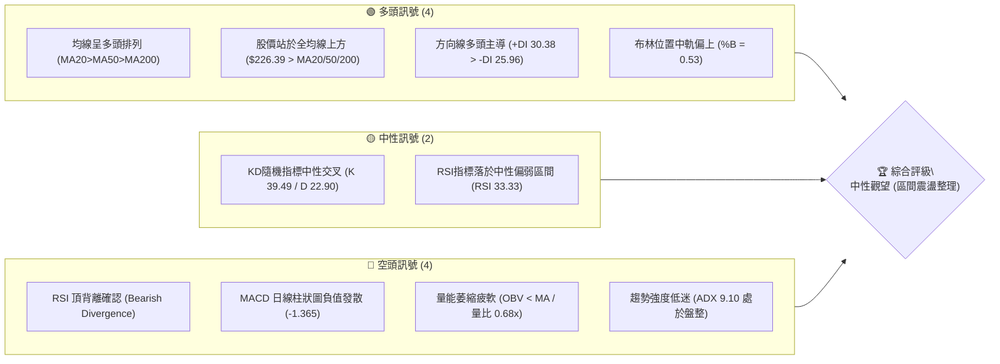
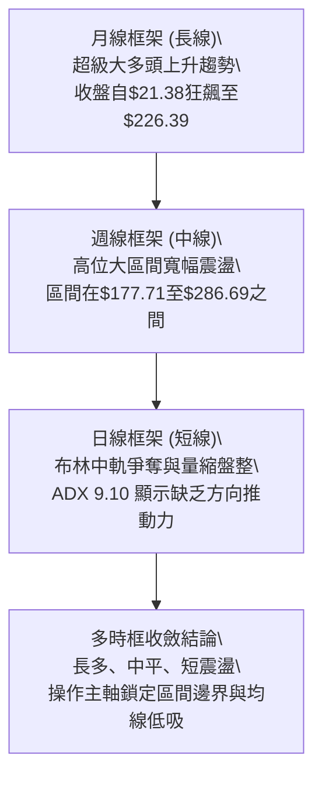
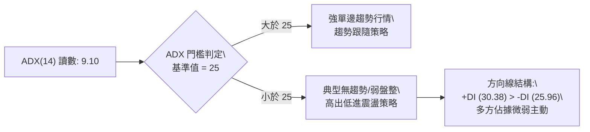
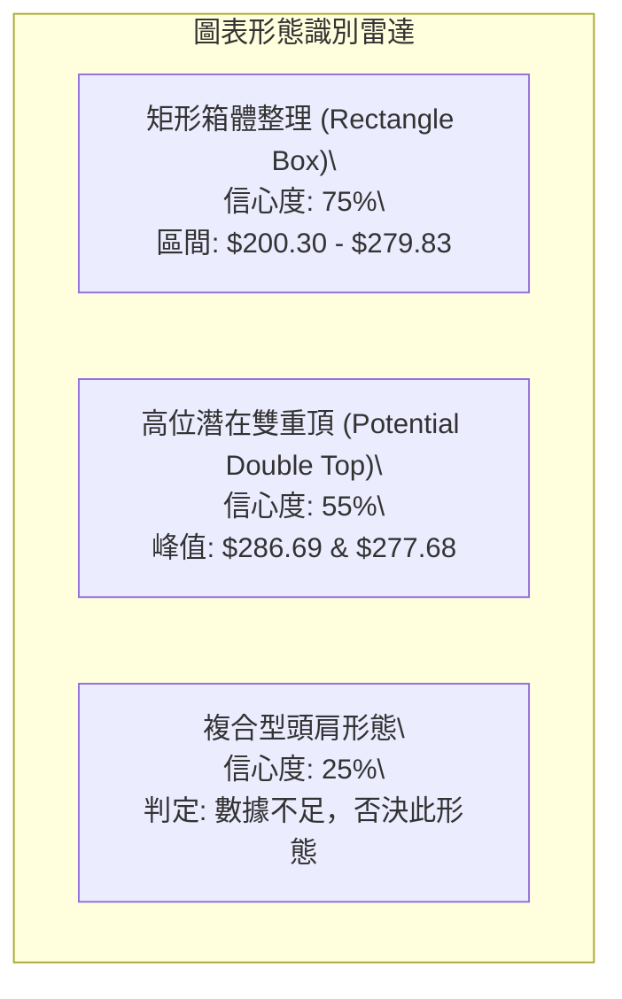
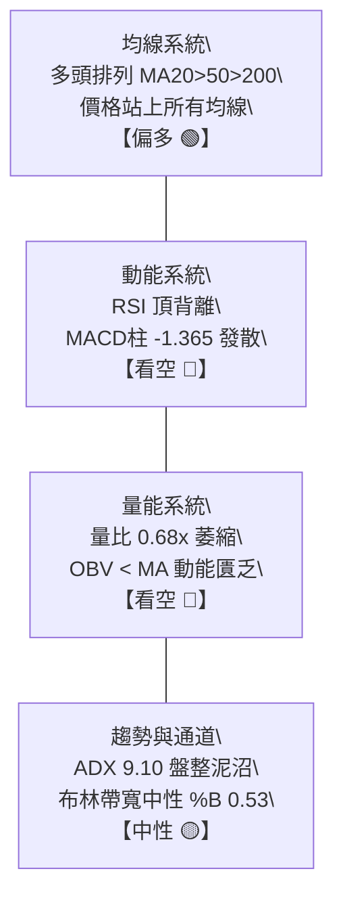
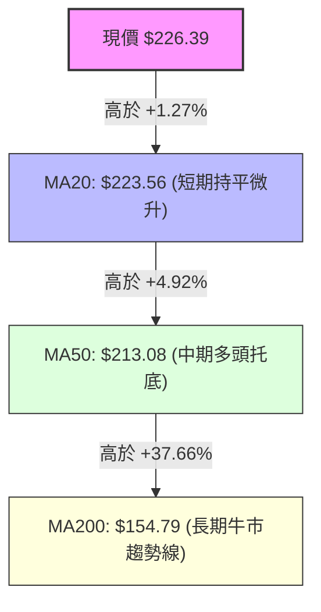
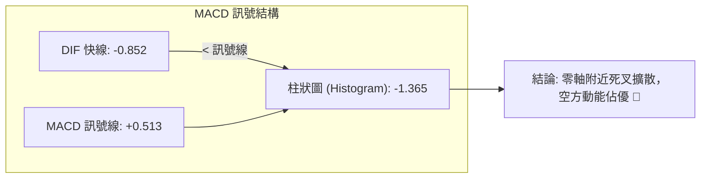
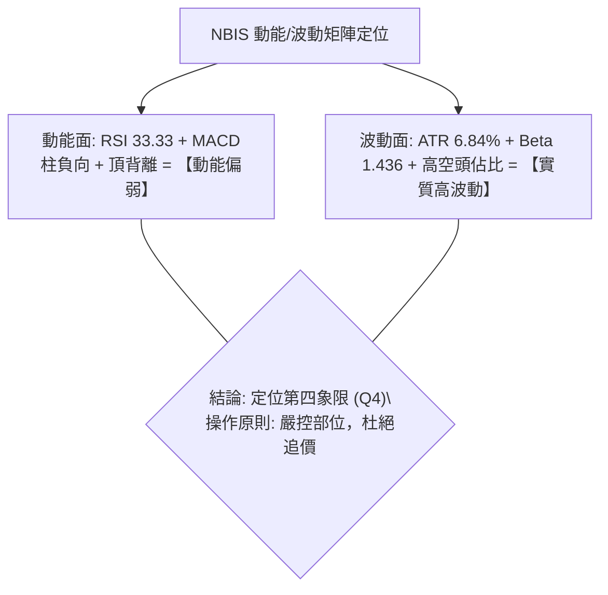
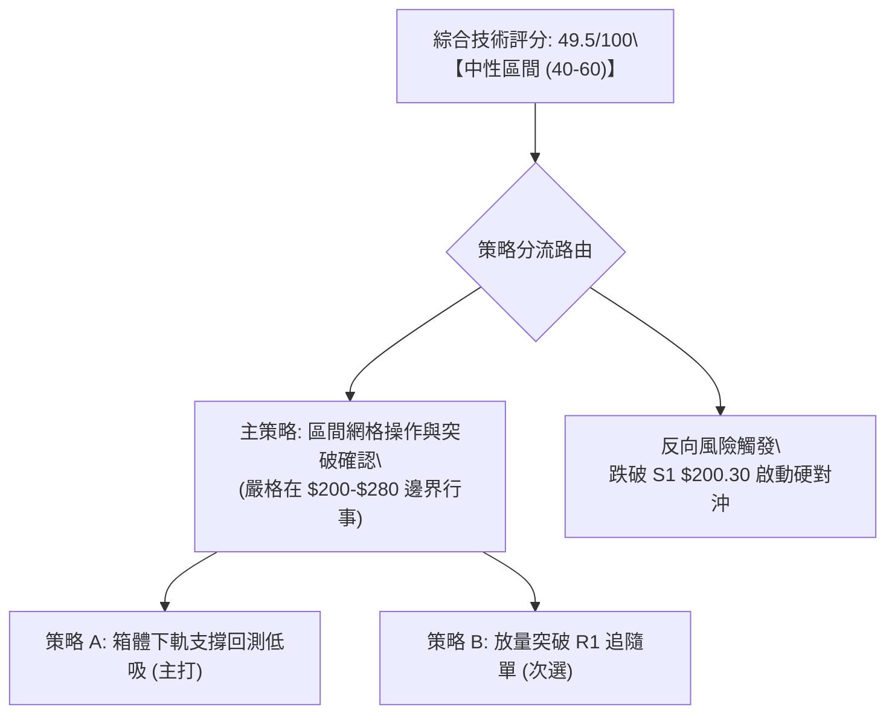
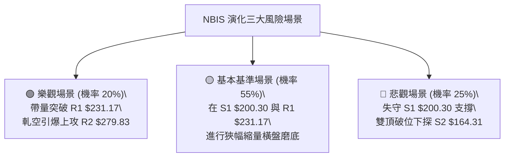

# NBIS 技術分析報告

> **報告日期**：2026-09-06 ｜ **語言**：繁體中文 ｜ **數據來源**：Yahoo Finance ｜ **當前價格**：$226.39

---

## 目錄

| 章節 | 內容 |
|------|------|
| [1. 技術面概覽](#1-技術面概覽) | 訊號儀表板、核心指標、評分卡 |
| [2. 趨勢分析](#2-趨勢分析) | 多時框趨勢、長中短期走勢、ADX解讀 |
| [3. 圖表形態分析](#3-圖表形態分析) | 形態識別、K線組合、目標價推算 |
| [4. 支撐與阻力](#4-支撐與阻力) | 關鍵價位分佈、斐波那契回調結構 |
| [5. 技術指標深度解讀](#5-技術指標深度解讀) | MA/RSI/MACD/布林/成交量全面剖析 |
| [6. 動能與波動率](#6-動能與波動率) | 動能四象限、ATR分析、Beta與空頭部位解讀 |
| [7. 多時框架總結](#7-多時框架總結) | 時框架矩陣與多時框收斂定調 |
| [8. 交易策略建議](#8-交易策略建議) | 策略路由、情境階梯、進出場規劃 |
| [9. 風險提示與監控](#9-風險提示與監控) | 監控清單、風險情境與資金控管 |
| [📋 報告總結](#-報告總結) | 核心要點與操作結論精華 |

---

## 1. 技術面概覽

### 🎯 技術訊號儀表板



### 📊 核心指標速覽表

| 指標類別 | 指標名稱 | 當前數值 | 訊號 | 解讀 |
|----------|----------|----------|------|------|
| **價格** | 當前收盤價 | $226.39 | 🟡 | 位於52週區間68.9%，自高點$299.86拉回後反彈震盪 |
| **均線** | MA20 | $223.56 | 🟢 | 價格站於MA20上方+1.27%，短線守穩短期均線支撐 |
| **均線** | MA50 | $213.08 | 🟢 | 價格高於MA50達+6.25%，中期基底支撐穩固 |
| **均線** | MA200 | $154.79 | 🟢 | 價格大幅高於MA200達+46.26%，長期牛市格局未破 |
| **動能** | RSI(14) | 33.33 | 🔴 | 數值逼近超賣但結構伴隨顯著「頂背離」，動能匱乏 |
| **動能** | MACD (12,26,9) | -0.852 / 0.513 | 🔴 | DIF落於訊號線下方，柱狀圖-1.365，空頭主導動能釋放 |
| **趨勢** | ADX(14) | 9.10 | 🟡 | 數值遠低於25，顯示當前缺乏單邊趨勢，進入箱體盤整 |
| **趨勢** | +DI / -DI | 30.38 / 25.96 | 🟢 | +DI高於-DI，買方力道略佔上風但推動力疲弱 |
| **通道** | 布林通道 %B | 0.53 | 🟡 | 現價緊貼布林中軌$223.56，多空呈現拉鋸膠著 |
| **成交量** | 量比 / OBV | 0.68x / 疲弱 | 🔴 | 日成交量1,489萬股低於20日均量，OBV跌破均線顯示籌碼觀望 |
| **波動** | ATR(14) | $15.48 | 🟡 | 日波動率達6.84%，屬於高beta高波動個股，風控需放大緩衝 |

### 🏆 技術評分卡

```
╔══════════════════════════════════════════════════════════════════╗
║               技術評分卡 — NBIS (2026-09-06)                    ║
╠══════════════════════════════════════════════════════════════════╣
║ 趨勢強度 (Trend)       ████░░░░░░░░░░░░░░░░  22/100  🔴 弱趨勢   ║
║ 動能指標 (Momentum)    ██████░░░░░░░░░░░░░░  32/100  🔴 動能疲軟 ║
║ 支撐穩定度 (Support)   ██████████████░░░░░░  68/100  🟢 支撐明確 ║
║ 成交量配合 (Volume)    ███████░░░░░░░░░░░░░  35/100  🔴 量價背離 ║
║ 形態完整度 (Pattern)   ████████████░░░░░░░░  58/100  🟡 寬幅箱體 ║
║ 均線排列 (MA System)   ████████████████░░░░  82/100  🟢 完美多頭 ║
╠══════════════════════════════════════════════════════════════════╣
║ 綜合技術評分           ██████████░░░░░░░░░░  49.5/100            ║
║ 最終技術評級           ⚖️ 中性觀望 (Neutral / Range-Bound)       ║
╚══════════════════════════════════════════════════════════════════╝
```

---

## 2. 趨勢分析

### 🌐 多時框趨勢分析



### 📈 長期趨勢 — 12個月走勢圖（Unicode）

NBIS 在過去一年中經歷了爆發性的 AI 算力基礎設施重估行情，自 2025 年末的雙位數水準直線拉升至近 $300 大關，隨後在 2026 年下半年展開高位消化。

```
NBIS 月線收盤走勢圖（2025-10 至 2026-09）
價格軸 ($)
$280 ┤                                        ●(06月:276.17)
$260 ┤                                       / \
$240 ┤                                      /   \
$220 ┤                             ●(05月) /     \     ●(09月:226.39現價)
$200 ┤                            /               \   /
$180 ┤                           /                 ●(07月:190.41)
$160 ┤                          /
$140 ┤           ●(10月:130.82)/
$120 ┤          / \           ●(04月:138.23)
$100 ┤         /   ●(11月)   /
$ 80 ┤        /     \_______/
$ 60 ┤       /       (12~02月底)
     └────────────────────────────────────────────────────────────►
      25/10  11    12   26/01  02   03    04   05    06   07    08   09 (月)
```

**走勢特徵分析表格**：

| 階段 | 時間週期 | 期間價格區間 | 累積漲跌幅 | 走勢特徵與結構解讀 |
|------|----------|--------------|------------|-------------------|
| **第一波拉升** | 2025-04 ~ 2025-10 | $22.73 → $130.82 | +475.5% | 初次估值重估，GPU 算力題材發酵，強勢直衝百元大關 |
| **中繼深蹲沉澱**| 2025-11 ~ 2026-02 | $130.82 → $83.71 | -36.0% | 獲利了結回吐，於 $83-$91 建立長達四個月的籌碼基底箱體 |
| **主升浪噴射** | 2026-03 ~ 2026-06 | $103.76 → $276.17| +166.2% | 營收年增 454% 基本面引爆，連續拉大陽線直逼 52 週高點 $299.86 |
| **高位分歧回調**| 2026-07 ~ 2026-09 | $276.17 → $226.39| -18.0% | 創高後量能透支，回探 S1 $200.30 與下軌支撐，目前於布林中軌修復 |

### 📊 中期趨勢（週線分析）

從近 20 週數據觀察，NBIS 週線呈現高位雙頂潛伏形態與寬幅箱體拉鋸。2026 年 6 月與 8 月兩次上衝未能有效突破 $299.86，回調在 2026-07-19 的 $177.71 止跌回升，顯示買盤於 $180-$200 區間極具防守意願。

```
週線級別價格壓力與支撐示意圖
$300 ─────── 52W 高點阻力聚類 R3 ($299.86) ───────────────────────────
             ▲ 2026-06 高點 ($286.69)    ▲ 2026-08 脈衝高點 ($277.68)
             │                          │
$250 ────────┼──────────────────────────┼────────────────────────────
             │                          │
$226.39 ─────┼─────── 當前收盤水平 ($226.39) ────────────────────────
             │                          │
$200 ────────┼──────────────────────────┴─ 關鍵波段低點支撐 S1 ($200.30)
             ▼ 2026-07 波段回調低點 ($177.71)
$160 ─────── 斐波那契 61.8% / MA200 核心強支撐 S2 ($164.31 / $154.79) ──
```

### ⚡ 趨勢強度評估（ADX 解讀）



| ADX 數值區間 | 當前 NBIS 狀態 (9.10) | 行情性質定義 | 建議操作哲學 |
|-------------|----------------------|-------------|-------------|
| 0 - 20      | ✅ **當前處於此區間** | **極弱趨勢 / 泥沼震盪** | 嚴禁追漲殺跌，僅能於箱體邊界低吸高拋 |
| 20 - 25     | ❌ 未達到             | 趨勢萌芽 / 方向醞釀     | 密切觀察布林帶寬與成交量是否放大突圍 |
| 25 - 40     | ❌ 未達到             | 穩健單邊趨勢展開         | 均線順勢持有，容忍日常波動回撤 |
| 40 以上     | ❌ 未達到             | 極強趨勢 / 動能過熱     | 需提防趨勢末端耗竭與回馬槍洗盤 |

---

## 3. 圖表形態分析

### 🔍 形態識別系統



**形態信心度分析表格**（依規則 15）：

| 形態名稱 | 信心度 | 判斷依據（引用真實數據） | 完成度 | 目標價（附嚴謹計算式） |
|----------|--------|--------------------------|--------|------------------------|
| **高位矩形箱體整理** | **75%** | 箱體下沿由波段低點聚類 S1 ($200.30) 支撐，上沿受阻於阻力聚類 R2 ($279.83)。近 10 週價格多次於此區間震盪收斂。 | 65% | 若向上突破頸線 R2 ($279.83)，形態高度 = $279.83 - $200.30 = $79.53。<br>推算等幅向上目標價 = $279.83 + $79.53 = **$359.36** |
| **潛在雙重頂 (M頭)** | **55%** | 峰1為 2026-06-21 收盤 $286.69，峰2為 2026-08-16 收盤 $277.68。中央低點頸線為 2026-07-19 的 $177.71。現價未破頸線。 | 40% | 若向下跌破頸線 $177.71，形態高度 = $286.69 - $177.71 = $108.98。<br>推算等幅向下測幅目標價 = $177.71 - $108.98 = **$68.73** |
| **頭肩頂形態** | **25%** | 僅有兩個峰值，右肩結構缺乏客觀 OHLCV 幾何對稱性支撐。 | 0% | **訊號不足，僅做指標型解讀，不預設目標價** |

### 🕯️ 重要K線形態分析（過去5週分析）

| 日期 (週末) | 收盤價 | RSI | 週成交量 | 實質K線形態 | 技術解讀與訊號指示 |
|-------------|--------|-----|----------|------------|-------------------|
| 2026-08-09  | $187.97| 51.2| 115.3M   | **止跌長下影錘頭線** | 🟢 測試波段底部後探底回升，打底確認 |
| 2026-08-16  | $277.68| 67.2| 167.5M   | **放量大陽線 (爆發突破)** | 🟢 創近月最大週成交量，主力短線強烈回補推升 |
| 2026-08-23  | $219.13| 51.5| 141.7M   | **放量大陰線 (獲利砸盤)** | 🔴 上衝 R2 遇阻重挫，單週吐回大部分漲幅，確立假突破 |
| 2026-08-30  | $209.18| 56.2| 70.2M    | **縮量中陰線 (慣性下沉)** | 🟡 測試支撐 S1 $200.30 區域，空頭動能減弱 |
| 2026-09-06  | $226.39| 33.3| 57.8M    | **極度縮量紅K (回穩十字)** | 🟡 站上 MA20 $223.56，成交量大幅萎縮至近半年低谷 |

### 📉 ASCII 走勢形態示意圖

```
高位箱體與潛在 M 頭頸線結構圖
$286.69 ┤               ● (峰1: 06-21)                  
$277.68 ┤               │               ● (峰2: 08-16)  <-- 箱體頂部 R2 ($279.83)
$260.00 ┤               │               │
$240.00 ┤        /\     │      /\       │
$226.39 ┤───────/──\────┼─────/──\──────┼────────● 現價 ($226.39) 貼布林中軌
$200.30 ┤──────/────\───┼────/────\─────┼────────── 箱體底部支撐 S1 ($200.30)
$177.71 ┤     /      \──●───/      \____│           <-- M頭頸線支撐位
$160.00 ┤    /        (07-19 低點)                  <-- 斐波那契 61.8% S2 ($164.31)
```

---

## 4. 支撐與阻力

### 🗺️ 關鍵價位分布圖（Unicode）

```
╔══════════════════════════════════════════════════════════════════╗
║                   NBIS 價位結構分佈圖                            ║
╠══════════════════════════════════════════════════════════════════╣
║ $299.86 ║██████████████████████████████║ 強阻力 R3 (52W歷史天花板)
║ $279.83 ║████████████████████░░░░░░░░░░║ 阻力 R2 (箱體頂部/波段高點)
║ $244.02 ║▓▓▓▓▓▓▓▓▓▓▓▓▓▓▓░░░░░░░░░░░░░░░║ 斐波那契 23.6% 回調壓力位
║ $231.17 ║████████████░░░░░░░░░░░░░░░░░░║ 關鍵短阻 R1 (+2.11% 近端壓力)
║ $226.39 ╠══════════════════════════════╣ ◄ 當前市價 (布林中軌 $223.56)
║ $209.48 ║▓▓▓▓▓▓▓▓▓▓▓▓▓▓▓▓▓▓░░░░░░░░░░░░║ 斐波那契 38.2% 回調位
║ $200.30 ║██████████████████████░░░░░░░░║ 近期關鍵支撐 S1 (箱體底線)
║ $181.56 ║▓▓▓▓▓▓▓▓▓▓▓▓▓▓▓▓▓▓▓▓▓▓░░░░░░░░║ 斐波那契 50.0% 強弱中軸分水嶺
║ $164.31 ║████████████████████████████░░║ 波段強支撐 S2 (波段深谷聚類)
║ $153.64 ║▓▓▓▓▓▓▓▓▓▓▓▓▓▓▓▓▓▓▓▓▓▓▓▓▓▓▓▓░░║ 斐波那契 61.8% 黃金防線
║ $145.80 ║██████████████████████████████║ 極限鐵底 S3 (中期多頭生命線)
╚══════════════════════════════════════════════════════════════════╝
```

### 🚧 阻力位分析表

| 阻力級別 | 準確價位 | 距現價幅動 | 形成原因與籌碼特徵 | 突破難度 | 戰略重要性 |
|----------|----------|------------|-------------------|----------|------------|
| **R1** | **$231.17** | +2.11% | 近一年波段高點聚類、5月底收盤價位 ($231.09) 套牢密集區 | 🟡 中等 | 短線轉強第一道門檻，突破方可確認布林通道上軌進攻波 |
| **R2** | **$279.83** | +23.61%| 近一年波段次高點聚類、8月中旬爆量反彈高點 ($277.68) 與布林上軌 ($274.41) 壓制 | 🔴 極高 | 箱體頂部與潛在雙頂高點，無百萬級以上放量無法逾越 |
| **R3** | **$299.86** | +32.45%| 52 週歷史天花板極值 ($299.86)，機構密集套現區 | 🔴 極致 | 歷史大頂，需全體科技股估值再次巨幅擴張才可能觸碰 |

### 🛡️ 支撐位分析表

| 支撐級別 | 準確價位 | 距現價幅動 | 形成原因與籌碼特徵 | 守住機率 | 戰略重要性 |
|----------|----------|------------|-------------------|----------|------------|
| **S1** | **$200.30** | -11.52% | 近一年波段低點聚類、整數心理關卡，8月底低點下影線防守位 | 🟢 70% | 短線多頭防線，失守將使箱體整理轉化為破位下殺 |
| **S2** | **$164.31** | -27.42% | 近一年波段低點聚類，貼近 7月中旬跳水極值 $177.71 與 MA200 ($154.79) 上方 | 🟢 85% | 中期生命線，機構長線買盤建倉之安全邊際價位 |
| **S3** | **$145.80** | -35.60% | 近一年波段深谷低點聚類，2026年4月起漲點 ($138.23-$147.16) 結構頸線 | 🟢 95% | 牛熊分界大底，一旦失守代表 AI 基礎設施泡沫破裂 |

### 📐 斐波那契回調位分析

依據 52 週完整區間波動（低點 **$63.26** 至 高點 **$299.86**，極差 $236.60）精確映射分析：

```
斐波那契回調階梯分佈
0.0%  $299.86 ────────────────────── 歷史天花板
23.6% $244.02 ────────────────────── 第一道回撤反彈壓力位
                      ▲
     $226.39 現價落於 23.6% ($244.02) 與 38.2% ($209.48) 之間
                      ▼
38.2% $209.48 ────────────────────── 經典弱勢回撤支撐線 (近端下檔保護)
50.0% $181.56 ────────────────────── 多空均勻平衡中軸
61.8% $153.64 ────────────────────── 黃金分割回撤強支撐 (與MA200 $154.79共振)
78.6% $113.89 ────────────────────── 深度修正極限位
100%  $63.26  ────────────────────── 52週起漲點大底
```

- **結構深度解讀**：現價 **$226.39** 剛好夾在 **23.6% ($244.02)** 與 **38.2% ($209.48)** 形成的緩衝夾層內。股價守於 38.2% 之上，代表整體 52 週漲幅仍屬於「強勢回調」範疇；然而向上受制於 23.6% 回調位 $244.02 與短阻 R1 $231.17，使空間受到高度壓縮。

---

## 5. 技術指標深度解讀

### 🎛️ 指標訊號總覽



### 📈 移動平均線排列分析



均線系統是當前 NBIS 技術面最強固的堡壘：
1. **排列完美度**：MA5 ($209.39) 與 MA10 ($212.14) 快速拐頭向上，MA20 ($223.56) > MA50 ($213.08) > MA200 ($154.79)，構成教科書級別的多頭排列。
2. **多週期均線位置**：MA60 ($221.27) 緊隨其後，MA120 ($194.80) 與 MA240 ($148.06) 均保持向上傾斜，展現長期資金鎖籌良好。
3. **短期警訊**：雖然短中長均線全面踩在腳下，但 MA20 與現價距離僅 +1.27%，若缺乏放量，極易被空方假跌破騷擾。

### 📉 RSI(14) 分析與頂背離警示

- **當前讀數**：**33.33**
- **數值進度條**：
  ```
  0 [███████░░░░░░░░░░░░░] 100 (33.33% - 弱勢中性格局)
  ```
- **背離診斷（重要結論）**：
  - **明確存在頂背離 (Bearish Divergence)**。回溯 2026-05-17，當股價在 $219.94 時，週線 RSI 達到了 **74.5**；而在 2026-08-16 股價衝擊高點 **$277.68**（創波段新高）時，週線 RSI 僅攀升至 **67.2**。
  - 價格創更高的高點（Higher High），指標卻出現顯著更低的高點（Lower High），這屬於**經典典型頂背離**，印證了高位主力籌碼派發、跟風意願減退的特徵，也是隨後股價重挫至 $209 的元兇。

### 📊 MACD (12, 26, 9) 訊號解讀



- **狀態解析**：DIF (-0.852) 位於零軸下方，且被訊號線 (+0.513) 壓制形成死叉，MACD 柱狀圖為 **-1.365** 且連續維持負值發散。
- **指標確認度**：MACD 的空頭形態完整確認了 RSI 的頂背離回調壓力，短線空方在動能維度佔據主控，尚未出現底背離的右側買訊。

### 📦 布林通道分析 (Bollinger Bands 20, 2)

```
布林通道當前狀態 (帶寬收窄，進入擠壓狀態)
$274.41 ─────────────────────────────────────── 上軌 (強阻力壓制區)
             │
             │
$226.39 ─────┼──────── ◄ 現價 ($226.39，%B = 0.53)
$223.56 ─────┴────────────────────────────────── 中軌 (MA20 生命線支撐)
             │
             │
$172.70 ─────────────────────────────────────── 下軌 (極限超賣保護區)
```

- **通道參數解讀**：
  - **上軌**：$274.41
  - **中軌 (MA20)**：$223.56
  - **下軌**：$172.70
  - **%B 指標**：**0.53**（落於中軌稍偏上方，代表多空在平衡點陷入肉搏拉鋸）
- **帶寬收縮特徵**：通道在經歷了 7-8 月的劇烈震盪後開始逐步走平收斂，表明市場正在醞釀下一次變盤，但目前未見放量擴軌。

### 💹 成交量分析（量價配合度）

- **量能數據比對**：
  - 最新日成交量：**14,890,300 股**
  - 20 日平均成交量：**21,859,085 股**（量比僅 **0.68x**，顯著縮量）
  - 週成交量走勢：自 2026-08-16 爆量的 1.67 億股驟降至最新週的 5,780 萬股，降幅超過 65%。
- **OBV (能量潮指標)**：
  - **OBV < MA**。OBV 指標持續位於其均線下方運作，顯示反彈過程中沒有增量資金進場接力，呈現「價漲量縮」的量價背離亞健康狀態。

---

## 6. 動能與波動率

### ⚡ 動能評估四象限

將 NBIS 置於當前市場維度中分析：

| 象限標籤 | 動能狀態 (Momentum) | 波動率狀態 (Volatility) | 當前判定 | 戰略含義與策略導向 |
|----------|---------------------|-------------------------|----------|-------------------|
| **第一象限 (Q1)** | 強動能 (Bullish) | 低波動 (Low Vol) | ❌ 否 | 最佳趨勢加碼期（單邊主升段） |
| **第二象限 (Q2)** | 弱動能 (Bearish) | 低波動 (Low Vol) | ❌ 否 | 底部築底醞釀期 |
| **第三象限 (Q3)** | 強動能 (Bullish) | 高波動 (High Vol) | ❌ 否 | 瘋狂主升拉升期（高風險高回報） |
| **第四象限 (Q4)** | **弱動能 (Bearish)**| **高波動 (High Vol)** | ✅ **判定** | **籌碼洗盤調整期：寬幅震盪、缺乏單邊方向、容易雙向掃損** |



### 📊 ATR 波動率分析

- **ATR(14) 讀數**：**$15.48**
- **波動率佔比**：佔當前股價比例高達 **6.84%**。
- **止損與部位建置指引**：
  - 每日正常市場噪聲震盪幅度高達 $15.5，因此傳統 2-3% 的微幅止損在 NBIS 上極易遭遇「噪聲掃損」。
  - 建議最短技術止損距離必須設定在 **1.0 至 1.5 倍 ATR**（即 $15.50 - $23.20 緩衝空間）。
  - 對應單筆交易虧損不超過總資金 1.5% 規則，倉位必須大幅降至總資金的 **8% - 12%** 水平。

### 📐 Beta 與空頭回補潛力

- **Beta 係數**：**1.436**。高於標普500大盤 43.6%，具有極高市場敏銳度，大盤震盪時該股將呈放大反應。
- **空頭回補指標 (Short Squeeze Potential)**：
  - **Short % of Float**：高達 **23.4%**！浮動股中接近四分之一處於放空狀態。
  - **Short Ratio (天數)**：**2.12 天**。
  - **技術含義**：極高的放空比例為市場埋下了一顆「軋空定時炸彈」。雖然當前動能低迷，但一旦價格放量突破 R1 $231.17 並觸摸 R2 $279.83，將可能引發被動空頭停損踩踏，形成猛烈的暴力回補行情。

---

## 7. 多時框架總結

### 📋 時框架評分表

| 時框架 | 趨勢方向 | 動能指標 | 均線系統排列 | 形態結構 | 綜合評分 | 戰略建議 |
|--------|----------|----------|--------------|----------|----------|----------|
| **長線 (月線)** | 🟢 強烈看多 | 🟡 高位趨緩 | 🟢 MA60/120/240 完美多頭 | 爆發主升後的箱體構築 | **85/100** | 長線多單底倉持有，依託 MA200 續抱 |
| **中線 (週線)** | 🟡 箱體震盪 | 🔴 頂背離確認 | 🟢 MA20/MA50 支撐仍在 | $200-$280 寬幅整理 | **48/100** | 暫停波段加碼，高位獲利調節，區間下軌低吸 |
| **短線 (日線)** | 🔴 弱勢震盪 | 🔴 MACD死叉 | 🟢 站回 MA20中軌上方 | 縮量橫盤磨底 | **42/100** | 不宜開新單追多，等待放量突破訊號 |

### 🔲 綜合訊號矩陣

```
╔══════════════════════════════════════════════════════════════════╗
║                   多維度訊號矩陣一致性檢驗                       ║
╠══════════════════════════════════════════════════════════════════╣
║ 維度項目         短期 (日線)      中期 (週線)      長期 (月線)   ║
║ 趨勢方向 (Trend)   🔴 橫盤偏空      🟡 區間震盪      🟢 超級多頭   ║
║ 均線架構 (MA)      🟢 站上MA20      🟢 站上MA50      🟢 遠超MA200  ║
║ 動能指標 (Osc)     🔴 MACD綠柱      🔴 RSI頂背離     🟡 高位鈍化   ║
║ 成交量配合 (Vol)   🔴 嚴重縮量      🔴 OBV均線下     🟢 歷史巨量   ║
║ 波動狀態 (Volat)   🟡 帶寬收緊      🔴 高位回撤      🟢 成長擴張   ║
╚══════════════════════════════════════════════════════════════════╝
```

### ⚖️ 多時框收斂結論

依據多時框收斂規則（嚴格要求 14）：
1. **行情屬性定調**：當前日線 **ADX 僅為 9.10**，遠遠小於 25 的趨勢門檻，行情百分之百屬於**典型盤整行情（Range-Bound Market）**。
2. **時框優先級裁決**：在 ADX < 25 狀態下，單邊趨勢跟隨無效，交易權重降維收斂至**「日線布林通道上下軌與關鍵高低點的區間箱體操作」**。
3. **終局單一結論**：**中性觀望（Neutral / 區間震盪整理）**。短線均線的多頭排列（長線庇護）抵消了動能指標 MACD 與 RSI 頂背離帶來的修正殺傷力，使股價鎖定在 **$200.30 至 $279.83** 的大箱體內沉澱。

---

## 8. 交易策略建議

### 🗺️ 策略決策流程圖



### 🧭 策略路由（依評分卡分流）

> **當前主策略方向 = 中性箱體區間交易（依評分 49.5/100 定位中性格局）**  
> 綜合評分未達 ≥60（不可盲目主推多頭），亦未跌破 ≤40（不可直接全面做空）。操作重心在於布林帶寬邊界與 S1/R2 的「高出低進、等待方向抉擇」。

### 🎯 價格情境階梯（Price Scenarios）

價位嚴格引用關鍵價位區塊計算之精確數值：

| 觸發條件 | 下一目標 | 後續延伸 | 情境含義與操作指引 |
|----------|----------|----------|-------------------|
| **強勢突破 R1 ($231.17)** | **R2 ($279.83)** | **R3 ($299.86)** | **短線突破轉強**：布林開軌，空頭回補爆發，直取歷史前高 |
| **維持於現價 ($226.39) 附近**| MA50 ($213.08) | 斐波 38.2% ($209.48) | **區間沉澱震盪**：量縮磨底，在布林中軌與 MA50 之間反覆拉鋸 |
| **有效跌破 S1 ($200.30)** | **S2 ($164.31)** | **S3 ($145.80)** | **中期結構破位**：確認日線雙頂頸線失守，下探 MA200 尋求重組 |

### 📊 情境機率分佈

| 發展情境 | 評估機率 | 主要技術依據與指標佐證 |
|----------|----------|------------------------|
| **區間震盪磨底 (橫盤)** | **55%** | ADX 9.10 處於極低水平、布林 %B 為 0.53 緊貼中軌、成交量比 0.68x 資金觀望 |
| **下探尋求 S1/S2 支撐** | **25%** | 週線 RSI 頂背離壓力未消、MACD 柱 -1.365 呈現負向發散、OBV 跌破均線量能疲乏 |
| **放量向上突破 R1/R2** | **20%** | 全均線多頭排列完整托底、空頭部位高達 23.4% 具備潛在軋空動能、+DI 暫優於 -DI |

### 🟢 主策略詳情

針對目前箱體特徵，規劃兩套具體執行方案：

| 策略要素 | 策略 A（箱體下緣低吸 — 首選） | 策略 B（R1 突破追隨 — 次選） |
|----------|-------------------------------|------------------------------|
| **策略類型** | 順長期大勢之箱體邊界低吸 | 右側關鍵阻力突破動能交易 |
| **進場條件** | 股價回踩 S1 附近出現下影線，KD黃金交叉 | 日K收盤價有效突破 R1，且單日成交量放大 > 2,100 萬股 |
| **進場價格** | **$205.00**（S1 $200.30 上方緩衝區） | **$232.50**（突破 R1 $231.17 確認後追進） |
| **目標價 T1** | **$231.17**（短阻 R1 水平） | **$279.83**（箱體頂部強阻力 R2） |
| **目標價 T2** | **$279.83**（箱體高點 R2 水平） | **$299.86**（52週歷史高點 R3） |
| **止損價格** | **$195.00**（跌破 S1 $200.30 兼 1x ATR 外） | **$220.00**（回跌至 MA20 之下假突破止損） |
| **風險空間** | $10.00 ($205.00 - $195.00) | $12.50 ($232.50 - $220.00) |
| **報酬空間 (T1/T2)**| T1: $26.17 / T2: $74.83 | T1: $47.33 / T2: $67.36 |
| **風險報酬比 (R/R)**| **1 : 2.62** (至 T1) / **1 : 7.48** (至 T2) | **1 : 3.79** (至 T1) / **1 : 5.39** (至 T2) |
| **成功機率估算** | **65%** | **45%** |
| **建議配置倉位** | **總部位之 10%** | **總部位之 8%** |

### 🔴 反向風險觸發點（對沖與撤退提示）

- **多頭全面棄守觸發點**：若日K線收盤價跌破 **S1 ($200.30)**，必須無條件執行停損或平倉所有波段多單。
- **融券/空頭避險啟動點**：跌破 $200.30 意味著雙頂結構隱含成型，可啟動反向避險保護，下檔第一測幅目標看至斐波那契 50% 水平 **$181.56**，終極支撐防線看至 **S2 ($164.31)**。

### ⭐ 整體訊號強度評星

```
做多訊號強度：★★☆☆☆  (2/5星 — 均線雖多頭但動能嚴重匱乏)
做空訊號強度：★★★☆☆  (3/5星 — RSI背離與MACD走弱壓制)
整體可信度：  ★★★☆☆  (3/5星 — ADX極低，等待縮量變盤)
```

---

## 9. 風險提示與監控

### ✅ 關鍵監控指標 Checklist

```
╔══════════════════════════════════════════════════════════════════╗
║                    NBIS 交易日常監控清單                         ║
╠══════════════════════════════════════════════════════════════════╣
║ [ ] 價位維度：現價 $226.39 能否守穩布林中軌/MA20 ($223.56)      ║
║ [ ] 阻力突破：盤中能否帶量越過短線高點聚類 R1 ($231.17)          ║
║ [ ] 支撐防守：回調時箱體下緣 S1 ($200.30) 是否出現長下影線支撐   ║
║ [ ] 動能修復：MACD 柱狀圖是否由負轉正 (-1.365 收斂至 0 之上)     ║
║ [ ] 背離消除：週線 RSI(14) 突破 60 並解除頂背離壓制狀態         ║
║ [ ] 量能驗證：單日成交量是否回升至 2,185 萬股 (20日均量線) 以上  ║
║ [ ] 籌碼異動：放空佔比 23.4% 是否引發軋空回補潮 (Days to Cover)  ║
╚══════════════════════════════════════════════════════════════════╝
```

### ⚠️ 風險場景分析



### 🛡️ 風險管理重要提醒

1. **Beta 係數高達 1.436**：意味著該股波動比納斯達克指數更為劇烈，絕不可在大盤走弱日進行市價單追多。
2. **高達 23.4% 空頭浮動比率的雙面刃**：極高的融券放空部位隨時會放大波動。若遇利空，空方借勢重挫擊穿 S1；若遇利多，則會引發跳空暴漲。嚴格禁止在無保護狀態下盲目持倉過週末。
3. **ATR 止損原則**：NBIS 單日 ATR 為 **$15.48**，短線停損不得小於該數值，必須拉開停損空間並相對收縮部位，杜絕單筆交易因高波動造成重大淨值回撤。

---

## 📋 報告總結

```
╔══════════════════════════════════════════════════════════════════╗
║                   NBIS 技術分析報告總結                          ║
╠══════════════════════════════════════════════════════════════════╣
║ 報告日期：2026-09-06                                             ║
║ 當前價格：$226.39                                                ║
║ 最終技術評級：⚖️ 中性觀望 (箱體拉鋸整理)                         ║
║ 綜合技術評分：49.5 / 100                                         ║
╠══════════════════════════════════════════════════════════════════╣
║ 關鍵結構結論：                                                   ║
║ ├─ 長期趨勢：🟢 完美多頭 (均線多頭排列 MA20>MA50>MA200 托底)      ║
║ ├─ 中期趨勢：🟡 寬幅箱體 ($200.30 - $279.83 高位大震盪)           ║
║ ├─ 短期趨勢：🔴 弱勢磨底 (ADX 9.10 盤整、MACD 負向、量比 0.68x)    ║
║ ├─ 近端關鍵支撐：$200.30 (S1) / 極限強支撐：$164.31 (S2)         ║
║ ├─ 短線關鍵阻力：$231.17 (R1) / 波段天花板：$279.83 (R2)         ║
║ └─ 華爾街平均目標價：$286.69 (潛在空間 +26.6%)                   ║
╠══════════════════════════════════════════════════════════════════╣
║ 最優操作策略：                                                   ║
║ 1. 🥇 首選策略：回測箱體下緣 S1 支撐 $205.00 低吸 (風報比 1:2.62)║
║ 2. 🥈 次選策略：放量突破 R1 $232.50 順勢追進 (目標 R2 $279.83)   ║
║ 3. 🥉 防守機制：收盤跌破 $200.30 全面止損出局，規避雙頂下殺風險  ║
╚══════════════════════════════════════════════════════════════════╝
```

---

> ⚠️ **免責聲明**：本報告為 AI 自動生成之量化與形態技術分析，所有價位、圖表與估算均完全基於提供的歷史價格數據推導。本報告**僅供研究與學術探討參考**，**不構成任何形式的投資要約或買賣建議**。金融市場具有高度風險，投資人應獨立評估自身風險承受能力並自行承擔盈虧責任。

---

*報告生成時間：2026-09-06 ｜ 數據來源：Yahoo Finance ｜ 分析框架：多時框架收斂技術分析體系*