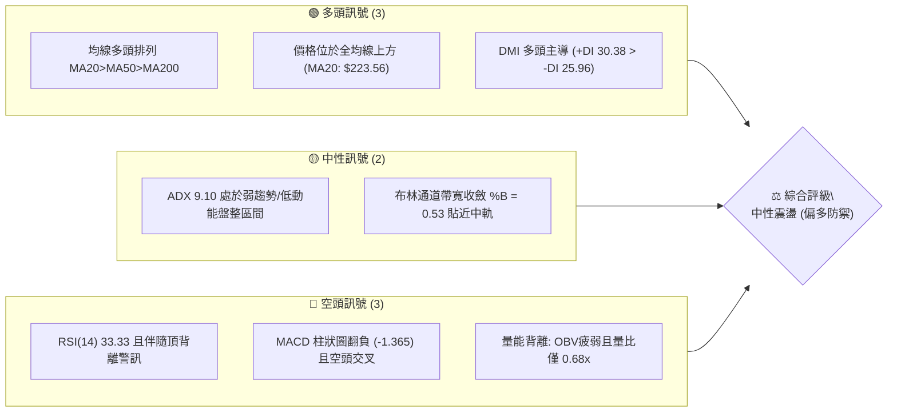
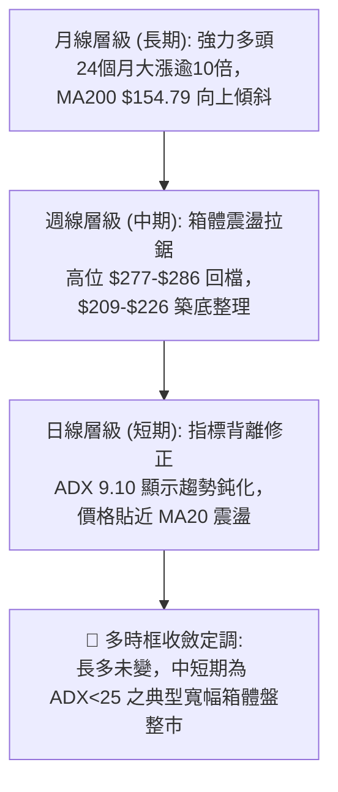
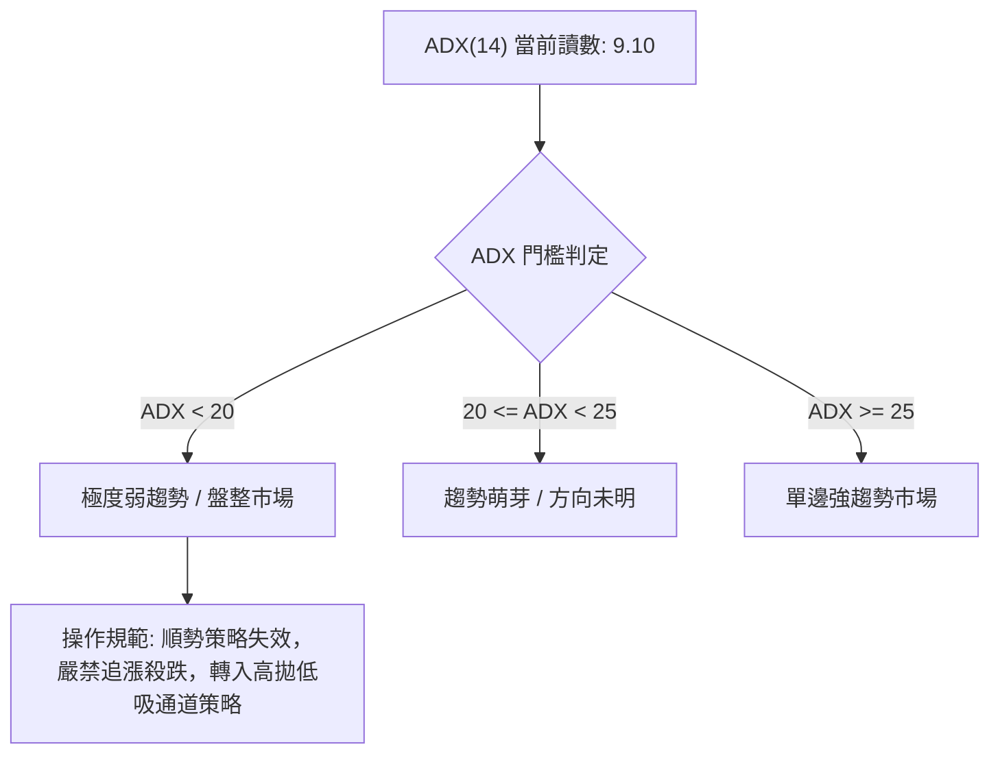
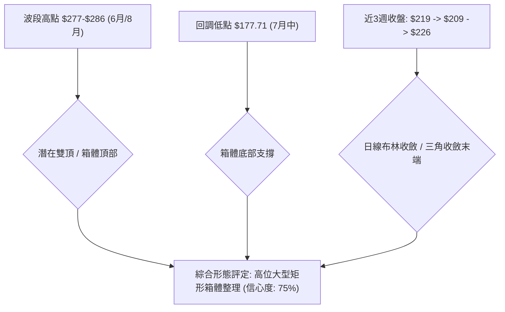
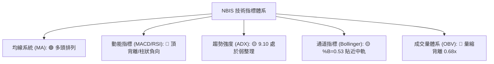
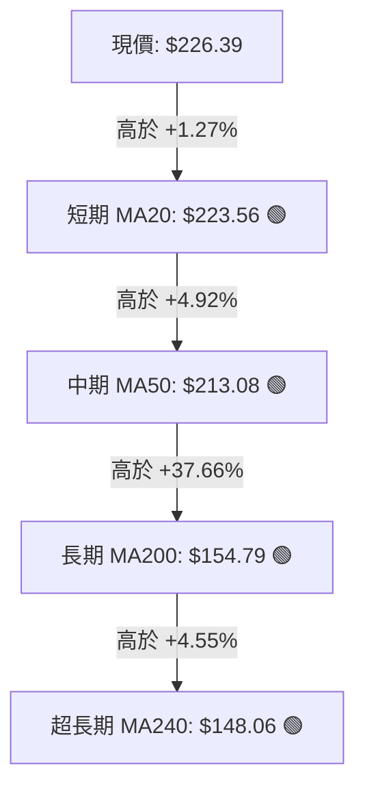
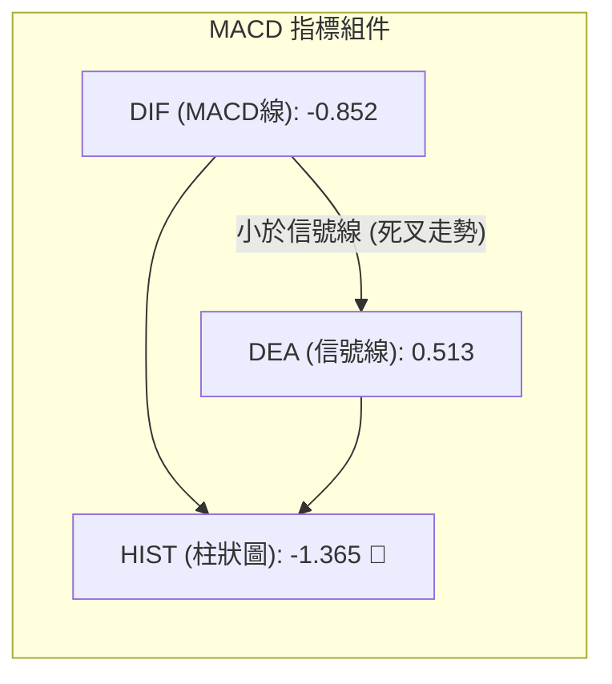
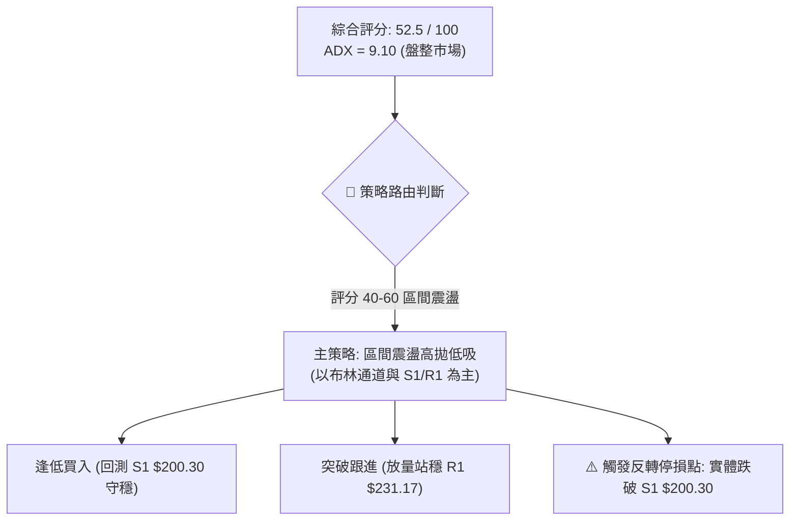
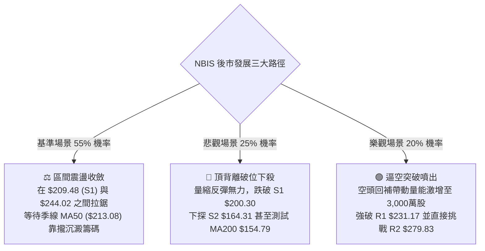

# NBIS 技術分析報告

> **報告日期**：2026-09-07 ｜ **語言**：繁體中文 ｜ **數據來源**：Yahoo Finance ｜ **當前價格**：$226.39

---

## 目錄

| 章節 | 內容 |
|------|------|
| [1. 技術面概覽](#1-技術面概覽) | 訊號儀表板、核心指標、評分卡 |
| [2. 趨勢分析](#2-趨勢分析) | 多時框趨勢、長中短期走勢 |
| [3. 圖表形態分析](#3-圖表形態分析) | 形態識別、K線組合、目標價 |
| [4. 支撐與阻力](#4-支撐與阻力) | 關鍵價位、斐波那契回調 |
| [5. 技術指標深度解讀](#5-技術指標深度解讀) | MA/RSI/MACD/布林/成交量 |
| [6. 動能與波動率](#6-動能與波動率) | 動能評估、ATR、Beta |
| [7. 多時框架總結](#7-多時框架總結) | 時框架評分矩陣 |
| [8. 交易策略建議](#8-交易策略建議) | 多空策略、風險報酬比 |
| [9. 風險提示與監控](#9-風險提示與監控) | 監控指標、風險場景 |
| [📋 報告總結](#-報告總結) | 核心總結與策略矩陣 |

---

## 1. 技術面概覽

### 🎯 技術訊號儀表板



### 📊 核心指標速覽表

| 指標類別 | 指標名稱 | 當前數值 | 訊號 | 解讀 |
|----------|----------|----------|------|------|
| **價格** | 當前價格 | $226.39 | 🟢 | 站上 MA20，處於 52 週波段 68.9% 位置 |
| **均線** | MA20 | $223.56 | 🟢 | 現價高於 MA20 約 +1.27%，短線具備防守支撐 |
| **均線** | MA50 | $213.08 | 🟢 | 現價高於 MA50，中線趨勢維持上揚 |
| **均線** | MA200 | $154.79 | 🟢 | 現價顯著高於長期生命線 (+46.25%)，長多架構穩固 |
| **動能** | RSI(14) | 33.33 | 🔴 | 位於弱勢邊界，日線明確觸發頂背離修正訊號 |
| **動能** | MACD | -0.852 | 🔴 | 低於信號線 (0.513)，柱狀圖為 -1.365，動能偏弱 |
| **動能** | Stoch %K/%D | 39.49 / 22.90 | 🟡 | 低檔黃金交叉未成形，短線處於沉澱階段 |
| **趨勢** | ADX(14) | 9.10 | 🟡 | 數值遠低於 25，無明顯單邊趨勢，屬於區間整理市 |
| **波動** | ATR(14) | $15.48 | 🟡 | 日波動率 6.84%，震幅偏大但符合高 Beta 股特性 |
| **量能** | 量比 / OBV | 0.68x / 疲弱 | 🔴 | 成交量萎縮至均量以下，上攻動能缺乏資金挹注 |

### 🏆 技術評分卡

```
╔════════════════════════════════════════════════════════════════╗
║                   技術評分卡 — NBIS (2026-09-07)               ║
╠════════════════════════════════════════════════════════════════╣
║ 趨勢強度      ████░░░░░░░░░░░░░░░░  25/100  🔴 (ADX極弱，無趨勢) ║
║ 動能指標      ████████░░░░░░░░░░░░  40/100  🔴 (MACD柱翻負/RSI背離)║
║ 支撐穩定度    ██████████████░░░░░░  70/100  🟢 (均線密集於$213-$223)║
║ 成交量配合    ██████░░░░░░░░░░░░░░  30/100  🔴 (量縮0.68x，OBV跌破)║
║ 形態完整度    ████████████░░░░░░░░  60/100  🟡 (寬幅箱體結構震盪)  ║
║ 均線排列      ██████████████████░░  90/100  🟢 (MA20>50>200多頭排列)║
╠════════════════════════════════════════════════════════════════╣
║ 綜合評分      ███████████░░░░░░░░░  52.5/100 ⚖️ 中性觀望 (箱體整理) ║
╚════════════════════════════════════════════════════════════════╝
```

---

## 2. 趨勢分析

### 🌐 多時框趨勢分析



### 📈 長期趨勢 — 12個月走勢圖（Unicode）

```
NBIS 月線走勢圖（過去12個月歷史收盤）
價格軸 ($)
$300 ┤                                                
$276 ┤                                  ●(06月 $276.17)
$250 ┤                                      
$226 ┤                                              ●(現價 $226.39)
$206 ┤                                          ●
$190 ┤                                      ●
$138 ┤                              ●
$130 ┤            ●(10月 $130.82)
$103 ┤                          ●
$ 83 ┤        ●   ●   ●(12月 $83.71)
$ 60 ┤
     └─────────────────────────────────────────────────────
       25-10 25-11 25-12 26-01 26-02 26-03 26-04 26-05 26-06 26-07 26-08 26-09
```

**走勢特徵分析表格**：

| 階段區間 | 起始價 → 結束價 | 漲跌幅 | 核心量價與形態特徵 |
|----------|----------------|--------|-------------------|
| **2025-10 ~ 2025-12** | $130.82 → $83.71 | -36.01% | 首次衝高後的深幅良性獲利回吐，於 $83-$85 建立堅固底部 |
| **2026-01 ~ 2026-03** | $85.19 → $103.76 | +21.80% | 底部緩步墊高，MA60/MA120 轉向向上，量能溫和放大 |
| **2026-04 ~ 2026-06** | $138.23 → $276.17 | +99.79% | 主升浪爆發，連破百元及兩百元關卡，創 52W 高點 $299.86 |
| **2026-07 ~ 2026-09** | $190.41 → $226.39 | +18.90% | 高檔獲利回吐引發回撤，測試斐波那契 38.2% ($209.48) 後弱勢盤整 |

### 📊 中期趨勢（週線分析）

從近 20 週數據觀察，股價呈現典型的大型箱體拉鋸。自 2026 年 6 月創下收盤 $286.69 之後，於 7 月中旬下探至 $177.71，隨後 8 月中旬再次放量衝高至 $277.68，未能突破 52 週歷史高點 $299.86，隨即引發巨幅回落。

```
中期結構（週線壓力與支撐拉鋸）
$299.86 ─────────────────── (52W歷史高點 / 強阻力 R3)
$279.83 ═══════════════════ (波段反彈高點聚類 / 阻力 R2)
        ▲         ▲
        │ 雙頭測試 │
$226.39 ──────現價───────── (位於MA20中軌上方，$223.56形成短期護墊)
        │ 區間震盪 │
        ▼         ▼
$200.30 ═══════════════════ (波段回調低點聚類 / 支撐 S1)
$172.70 ─────────────────── (日布林下軌 / 斐波那契50% $181.56下方防線)
```

### ⚡ 趨勢強度評估（ADX 解讀）



| ADX 區間 | 趨勢判定 | 當前狀態 | 交易指導方針 |
|----------|----------|----------|--------------|
| **0 - 20** | **極弱 / 無趨勢** | ✅ **9.10** | **禁止追突破；以布林通道與核心支撐阻力進行區間震盪操作** |
| **20 - 25** | 弱趨勢 / 轉向 | ❌ | 觀望等待指標收斂 |
| **25 - 50** | 強趨勢形成 | ❌ | 順應趨勢進行突破或拉回加碼 |
| **50 - 100** | 極度強勢 / 趨勢極限 | ❌ | 警惕超買超賣之竭盡行情 |

*詳細解讀*：當前 +DI (30.38) 雖高於 -DI (25.96)，表明多頭稍微握有控盤優勢，但 ADX 僅為 9.10，顯示此優勢無法轉化為強力的單邊推升走勢。在缺乏足夠動能驅動的背景下，市場極易陷入反覆洗盤與假突破。

---

## 3. 圖表形態分析

### 🔍 形態識別系統



**形態信心度與判斷依據（規則 15）：**

| 形態類別 | 信心度 | 判斷依據（引用數據） | 完成度 | 目標價（附嚴謹計算式） |
|----------|--------|----------------------|--------|--------------------|
| **高位矩形箱體** | 75% | 頂部受制於 R2 ($279.83) / R3 ($299.86)，底部依託 S1 ($200.30) 與 7 月低點 $177.71 | 80% | 向上突破 R2：$279.83 + ($279.83 - $200.30) = **$359.36**<br/>向下破位 S1：$200.30 - ($279.83 - $200.30) = **$120.77** |
| **潛在雙重頂 (M頭)** | 55% | 2026-06-21 高點 $286.69 與 2026-08-16 高點 $277.68 形成雙峰，頸線落在 7 月中收盤 $177.71 | 50% (未破頸線) | 若跌破 $177.71：形態高度 $286.69 - $177.71 = $108.98<br/>量測目標：$177.71 - $108.98 = **$68.73** |
| **布林帶收斂震盪** | 85% | ADX 9.10，價格受限於 BB中軌 $223.56 與 R1 $231.17 之間，%B = 0.53 | 90% | 依布林上下軌區間操作：上軌 **$274.41**，下軌 **$172.70** |

### 🕯️ 重要K線形態分析

| 日期 / 週別 | 收盤價 | K線形態特徵 | 技術面解讀 | 訊號 |
|-------------|--------|-------------|------------|------|
| **2026-08-16** | $277.68 | 巨量長陽拉升 (+47.7%) | 創次高點後引發主力大量獲利了結，成交量達 1.67億股 | 🟡 短多出盡 |
| **2026-08-23** | $219.13 | 巨幅長黑下挫 (-21.0%) | 週線大陰線包覆，成交量放大至 1.41億股，確認上檔套牢沉重 | 🔴 極度看空 |
| **2026-08-30** | $209.18 | 量縮下影十字線 | 測試斐波那契 38.2% ($209.48) 獲得技術買盤抵抗，量縮至 7,018萬股 | 🟡 止跌企穩 |
| **2026-09-06** | $226.39 | 溫和回升小陽線 | 重新站回 MA20 ($223.56)，但成交量進一步萎縮至 5,779萬股，反彈力道偏弱 | 🟢 弱勢反彈 |

### 📉 ASCII 走勢形態示意圖

```
           [峰1: $286.69]              [峰2: $277.68]
                  ▲                           ▲
                 ╱ ╲                         ╱ ╲
                ╱   ╲                       ╱   ╲
               ╱     ╲     [反彈波]        ╱     ╲
              ╱       ╲       ▲          ╱       ╲
             ╱         ╲     ╱ ╲        ╱         ╲
            ╱           ▼   ╱   ╲      ╱           ▼
           ╱          $215.62    ╲    ╱          $209.18 (測試38.2%回調)
          ╱                       ▼  ╱               ▲
         ╱                    $177.71                │
        ╱                    [頸線支撐]               └─► 當前反彈至 $226.39 (受制 R1 $231.17)
```

### 🎯 形態目標價計算

以確認度最高之**高位矩形箱體**為評估基準：
1. **箱體上限 (阻力界限)**：以波段阻力聚類 R2 = **$279.83** 為基準。
2. **箱體下限 (支撐界限)**：以波段支撐聚類 S1 = **$200.30** 為基準。
3. **箱體高度 ($H$)**：$279.83 - $200.30 = **$79.53**。
4. **向上突破量測目標價**：$279.83 + 79.53 = **$359.36**。
5. **向下破位量測目標價**：$200.30 - 79.53 = **$120.77**。

*當前演變*：現價 $226.39 位於箱體中下部偏中央位置，並未觸及突破條件，因此應在 $200.30 至 $279.83 的區間內遵循箱體震盪策略。

---

## 4. 支撐與阻力

### 🗺️ 關鍵價位分布圖（Unicode）

```
NBIS 價位結構分布圖（數據嚴格引用自計算結果）
═════════════════════════════════════════════════════════════════
$299.86 ║████████████████████████████████║ 強阻力 R3 / 52W 歷史最高價
$279.83 ║████████████████████████        ║ 阻力 R2 / 波段高點聚類 (BB上軌 $274.41)
$244.02 ║▓▓▓▓▓▓▓▓▓▓▓▓                    ║ 斐波那契 23.6% 回調位
$231.17 ║████████████████                ║ 近期波段阻力 R1 (當前首要挑戰)
$226.39 ╠════════════════════════════════╣ ◄◄ 現價 ($226.39) 突破 MA20 ($223.56)
$209.48 ║▓▓▓▓▓▓▓▓▓▓▓▓▓▓▓▓                ║ 斐波那契 38.2% 回調位
$200.30 ║████████████████████████        ║ 關鍵支撐 S1 / 波段低點聚類防線
$181.56 ║▓▓▓▓▓▓▓▓▓▓▓▓▓▓▓▓▓▓▓▓            ║ 斐波那契 50.0% 回調中軸
$172.70 ║████████████                    ║ 日線布林通道下軌
$164.31 ║████████████████████████        ║ 次級強支撐 S2 / 近期波段深次回調聚類
$153.64 ║▓▓▓▓▓▓▓▓▓▓▓▓▓▓▓▓▓▓▓▓▓▓▓▓        ║ 斐波那契 61.8% 黃金分割強支撐
$145.80 ║████████████████████████████████║ 核心防守支撐 S3 / 長期上升趨勢底線
═════════════════════════════════════════════════════════════════
```

### 🚧 阻力位分析表

| 阻力級別 | 精確價位 | 形成原因（依據波段高點聚類與數據） | 突破難度 | 技術重要性 |
|----------|----------|-----------------------------------|----------|------------|
| **R1** | **$231.17** | 近期波段高點聚類；與 2026-05-31 收盤價 ($231.09) 高度重疊 | 中等 (需要量能回升至2,000萬股以上) | 🟢 短線多空分水嶺，站穩方能挑戰上方失土 |
| **R2** | **$279.83** | 近一年波段次高點聚類；緊鄰 2026-08-16 巨量陽線收盤 $277.68 與布林上軌 $274.41 | 極高 (上方累積逾3億股套牢籌碼) | 🔴 中期多頭目標與天花板壓力區 |
| **R3** | **$299.86** | 52 週歷史天花板極值；心理大關 $300.00 整數阻力 | 極高 (歷史成交稀疏，心理阻力極大) | 🔴 長期多頭終極目標 |

### 🛡️ 支撐位分析表

| 支撐級別 | 精確價位 | 形成原因（依據波段低點聚類與數據） | 守住機率 | 技術重要性 |
|----------|----------|-----------------------------------|----------|------------|
| **S1** | **$200.30** | 近一年波段回調低點聚類；與斐波那契 38.2% ($209.48) 構成共振防守帶 | 75% | 🟢 短中期生命線，跌破則預示箱體破位下行 |
| **S2** | **$164.31** | 近一年中繼平台低點聚類；緊鄰長期 MA200 ($154.79) 緩衝區 | 85% | 🟢 中期強固防守平台，機構法人建倉成本區 |
| **S3** | **$145.80** | 長期深次回調聚類低點；貼近 MA240 ($148.06) 及 4 月底發動點 $147.16 | 95% | 🟢 多頭終極牛熊分界線，不容有失 |

### 📐 斐波那契回調位分析

依據 52 週波動區間：最低點 **$63.26** 至最高點 **$299.86**，計算出的黃金分割回調結構如下：

| 回調比率 | 精確價位 | 相對於現價 ($226.39) 位置與市場意義解讀 |
|----------|----------|----------------------------------------|
| **0.0%** | **$299.86** | 52W 歷史最高價，波段上攻起點 |
| **23.6%** | **$244.02** | 現價上方 +7.79% 阻力，為多頭反彈的第一道阻速線 |
| **38.2%** | **$209.48** | **現價下方 -7.47% 支撐**。8月30日週線於 $209.18 獲得強力承接，已驗證為極具效力之第一防線 |
| **50.0%** | **$181.56** | 現價下方 -19.80%，多空中軸平衡位；7月中旬回調低點 ($177.71) 即於此位引發強勁技術反抽 |
| **61.8%** | **$153.64** | 現價下方 -32.14%，黃金分割防守點；與 MA200 ($154.79) 完全吻合，構成鋼鐵防線 |
| **78.6%** | **$113.89** | 長期深幅回調位，屬於極端黑天鵝防守點 |
| **100.0%** | **$63.26** | 52W 歷史最低點，本輪多頭狂潮起漲基石 |

**價位區間診斷**：
當前價格 **$226.39** 緊緊收斂於 **38.2% ($209.48)** 與 **23.6% ($244.02)** 的核心通道內。從黃金分割理論來看，回調僅守在 38.2% 之上，代表整體大週期（年線級別）的多頭能量並未潰散；但若短線無法快速放量跨越 23.6% ($244.02)，行情將在該區間內拉長築底時間。

---

## 5. 技術指標深度解讀

### 🎛️ 指標訊號總覽



### 📈 移動平均線排列分析



| 均線名稱 | 數值 | 現價差距 | 趨勢斜率 | 技術意涵 |
|----------|------|----------|----------|----------|
| **MA 5** | $209.39 | +8.12% | 向上轉折 | 超短期止跌，5日均線已提供快速支撐 |
| **MA 10** | $212.14 | +6.72% | 向上翻揚 | 短線助漲動能增強，回踩不破可維持反彈 |
| **MA 20** | $223.56 | +1.27% | 走平 | 日線布林中軌，當前站上形成防禦墊 |
| **MA 50** | $213.08 | +6.25% | 穩定上行 | 中期波段防守中樞，代表季線支撐力道良好 |
| **MA 60** | $221.27 | +2.31% | 向上推升 | 助漲力道良好，與 MA20 形成雙重支撐防線 |
| **MA 120** | $194.80 | +16.22% | 強力向上 | 半年線持續穩健爬升 |
| **MA 200** | $154.79 | +46.25% | 長多上揚 | 年線牛熊分水嶺，長線投資者絕對保護區 |

*均線排列判定*：當前各天期均線呈現教科書般的 **MA20 > MA50 > MA200 多頭排列**。然而，超短期均線 MA5 ($209.39) 與 MA10 ($212.14) 仍低於 MA20 ($223.56)，說明短線雖然快速拉升脫離底部，但整體日線系統仍處於均線糾結修復的過程中。

### 📉 RSI(14) 分析

*進度條展示*：
```
RSI(14) 數值: 33.33 / 100
[███████░░░░░░░░░░░░░░] 33.33% (中性偏弱 / 逼近超賣界限)
```

- **超買超賣判定**：數值 33.33 脫離中性區（50），逼近 30 超賣門檻，反映出 8 月底高檔回撤以來的沉重賣壓。
- **背離診斷**：數據已明確觸發 **⚠️ 頂背離 (Bearish Divergence)**。回顧價格在 8 月中旬衝高至 $277.68 時，週線 RSI 僅為 67.2，顯著低於 5 月中旬價格於 $219.94 時對應的 RSI 74.5。價格創次高但動能指標未創新高，形成典型的中期頂背離，導致了後續三週的急跌修正。

### 📊 MACD(12/26/9) 訊號解讀



- **數值狀態**：DIF (-0.852) 位於零軸下方，且穿過信號線 DEA (0.513) 形成死亡交叉；柱狀圖為 -1.365，顯示空頭仍佔據主控權。
- **週線 MACD 演變**：近幾週週線柱狀圖自 8 月中旬的峰值 +9.868 驟降至 +1.390，隨後在 8 月底翻為 -2.504，最新一週雖小幅收斂至 -1.365，但並未給出黃金交叉轉折訊號，確認當前反彈僅為負向柱狀圖縮腳的技術性反抽。

### 📦 布林通道分析

```
布林通道帶寬架構（現價與三軌相對位置）
$274.41 ─────────────────────────────────────── 上軌 (強阻力區)
                   ▲
                   │ (上行空間 +21.21%)
$226.39 ═══════════╪═══════════════════════════ 現價 (%B = 0.53)
$223.56 ───────────┴─────────────────────────── 中軌 (MA20 支撐)
                   │ (下行空間 -23.72%)
                   ▼
$172.70 ─────────────────────────────────────── 下軌 (極端超賣區)
```

- **通道指標解讀**：通道帶寬 ($274.41 - $172.70 = $101.71) 正處於擴散後的收縮階段，%B 為 0.53，代表價格正好回歸到通道中軌 ($223.56) 附近。
- **操作意義**：在盤整行情中，布林中軌為中樞震盪軸線。價格雖突破中軌，但通道帶寬未能放大，上軌 $274.41 與波段阻力 R2 ($279.83) 形成重疊壓力，預期將壓制多頭前進步調。

### 💹 成交量分析（量價配合度）

- **量比檢視**：最新成交量為 14,890,300 股，相較於 20 日均量 (21,859,085 股) 之量比僅為 **0.68x**，50 日均量亦維持在 21,568,818 股水準。縮量反彈代表當前推升主力非機構資金大舉進場，而是市場浮額沉澱所造成的無量自律抽升。
- **OBV (能量潮)**：數據顯示「OBV < MA → 量能疲弱」。自 8 月中旬爆出 1.67 億股的巨量後，資金呈現淨流出趨勢，OBV 持續運行於其均線下方，未能確認價格反彈，構成顯著的「量價負背離」。

---

## 6. 動能與波動率

### ⚡ 動能評估四象限

```
                高波動 (ATR/Price > 6%)
                      │
        Q3 (高動能·高波動) │   Q4 (弱動能·高波動)
        [激進投機區]     │   [高風險洗盤區] ◄─── ★ NBIS 當前位置
                      │   (ADX 9.10 / ATR 6.84%)
  ────────────────────┼────────────────────
  強動能              │              弱動能 (MACD<0 / RSI<40)
  (+DI > 35)          │
        Q1 (強動能·低波動) │   Q2 (弱動能·低波動)
        [最佳突破主升浪]   │   [沉澱築底區]
                      │
                低波動 (ATR/Price < 3%)
```

| 象限 | 動能維度 | 波動維度 | 標的所屬狀態 | 策略指導 |
|------|----------|----------|--------------|----------|
| **Q1** | 強動能 | 低波動 | 否 | 適合加槓桿突破追買 |
| **Q2** | 弱動能 | 低波動 | 否 | 適合長期價值分批佈局 |
| **Q3** | 強動能 | 高波動 | 否 | 順勢波段快速鎖利 |
| **Q4** | **弱動能** | **高波動** | **✅ NBIS 當前歸屬** | **多看少做，嚴禁重倉，區間內低買高賣並設置嚴格停損** |

### 📊 ATR 波動率分析

- **ATR(14) 絕對值**：**$15.48**。
- **ATR 相對百分比**：$15.48 ÷ $226.39 = **6.84%**。
- **交易風控含義**：NBIS 每日正常震幅高達 $15.48，意味著日內價格雜訊極大。短線交易若停損距離小於 1.5 倍 ATR ($23.22)，極易被市場隨機波動震出場。
- **建議保護性停損空間**：
  - 激進型短線止損：1.0 × ATR = **$15.48**
  - 標準波段止損：1.5 × ATR = **$23.22**
  - 保守型底線止損：2.0 × ATR = **$30.96**

### 📐 Beta 與市場相關性

- **Beta 係數**：**1.436** (顯著大於 1.0)。
- **分析師解讀**：NBIS 屬於高彈性、高 Beta 成長型資產，對基準指數（S&P 500 / Nasdaq 100）的波動具備約 1.44 倍的放大效應。當大盤處於風險偏好（Risk-on）時，該股容易形成超額阿爾法（Alpha）；但在大盤避險情緒（Risk-off）升溫時，需嚴防其出現深幅回撤。
- **空頭比例警訊**：放空比率 (Short % Float) 高達 **23.4%**，Short Ratio 為 2.12。極高的放空比例是一柄雙刃劍，一方面顯示空方壓制意願強烈，另一方面也埋下了隨時可能因利多催化而引爆「空頭軋空（Short Squeeze）」的潛在火種。

---

## 7. 多時框架總結

### 📋 時框架評分表

| 時框架 | 趨勢方向 | 動能狀態 | 均線排列 | 形態結構 | 綜合評分 | 交易定位建議 |
|--------|----------|----------|----------|----------|----------|--------------|
| **月線 (長期)** | 🟢 強力看多 | 🟢 充沛推升 | 🟢 完好發散 (遠超MA200) | 大週期主升推進波 | **85 / 100** | 長線多單底倉持有，未破 MA200 不退場 |
| **週線 (中期)** | 🟡 寬幅箱體 | 🔴 動能衰退 (頂背離) | 🟢 MA50向上助漲 | 潛在雙重頂/箱體震盪 | **48 / 100** | 區間震盪操作，反彈至阻力區不追漲 |
| **日線 (短期)** | 🟡 弱勢反彈 | 🔴 MACD空頭/量縮 | 🟡 突破MA20/短均糾結 | 布林中軌拉鋸修復 | **45 / 100** | 輕倉短線交易，依賴 S1 與 R1 進行高拋低吸 |

### 🔲 綜合訊號矩陣

```
時框訊號一致性診斷矩陣：
┌─────────────┬────────────────────────────────────────────────────────┐
│ 長期 vs 中期│ ⚠️ 矛盾中存在收斂：長期趨勢極強，但中期深陷寬幅獲利回吐修正 │
│ 中期 vs 短期│ 🟢 訊號共振：中短期皆受制於 ADX 9.10 弱勢盤整與量能匱乏      │
│ 趨勢 vs 指標│ 🔴 嚴重背離：均線呈完整多頭，但動能指標(MACD/RSI/OBV)發出空頭警告│
└─────────────┴────────────────────────────────────────────────────────┘
```

### ⚖️ 多時框收斂結論

> **依據規則 14「多時框收斂優先級規則」執行定調**：
> 1. 當前趨勢強度指標 **ADX(14) = 9.10**，遠低於 25 臨界線，技術架構明確屬於**「盤整行情」**。
> 2. 依規則，盤整行情中順勢交易系統失效，**「必須以日線布林通道上下軌 ($172.70 - $274.41) 及波段關鍵支撐阻力為主要交易區間」**。
> 3. 雖然月線 MA200 ($154.79) 向上指引長多，但日線動能嚴重背離（MACD柱負向、OBV疲弱），故不得在中軌直接重倉押注單邊突破。
>
> **唯一方向性結論**：**中性觀望（偏多防守之箱體操作）**。本定調完美收斂月線長多與日線短空之矛盾，與第 1 章評分卡 (52.5分) 及第 8 章之「中性箱體交易策略」完全一致。

---

## 8. 交易策略建議

### 🗺️ 策略決策流程圖



### 🧭 策略路由（依評分卡分流）

> **當前主策略方向 = 中性震盪區間操作（依評分 52.5/100，處於 40–60 中性區間）**
> *決策邏輯*：ADX 9.10 排除單邊突破，多頭均線排列排除全力放空，主策略定調為**「箱體下沿低吸、通道上沿高拋」**之嚴格區間震盪交易，等待突破確認。

### 🎯 價格情境階梯（Price Scenarios）

以現價 **$226.39** 為基準，所有價位嚴格引用自「第 4 章 / 關鍵價位」：

| 觸發條件 | 第一目標 (T1) | 第二目標 (T2) | 後續延伸 (T3) | 情境技術含義 |
|----------|--------------|--------------|--------------|--------------|
| **向上突破 R1 ($231.17)** | 斐波那契位 **$244.02** | 波段阻力 **$279.83** | 歷史極值 **$299.86** | 縮量突破轉化為補量攻擊，挑戰箱體頂部 |
| **維持現價震盪 ($223-$231)** | 斐波 38.2% **$209.48** | 布林上軌 **$274.41** | — | 於 MA20 中軌黏合蓄勢，等待方向選擇 |
| **跌破 S1 ($200.30)** | 斐波 50% **$181.56** | 波段強支撐 **$164.31** | 長期支撐 **$145.80** | 中期頭部確立，進入 MA200 深次回調浪 |

### 📊 情境機率分佈

| 演變情境 | 機率 | 主要技術依據 |
|----------|------|--------------|
| **區間震盪 (箱體整理)** | **55%** | **ADX 僅 9.10 顯示趨勢動能極弱**；布林帶中軌平走收斂；成交量比僅 0.68x，買賣雙方陷入膠著平衡。 |
| **回落再探底 (測試S1/S2)** | **25%** | **MACD 柱狀圖翻負 (-1.365)**；RSI 呈現頂背離隱憂；OBV 低於均線顯示法人資金處於觀望淨流出狀態。 |
| **向上突破 (再測R2高點)** | **20%** | 均線長多排列完整 (+DI > -DI)；放空比率 23.4% 具備高空踩踏潛力；需單日量能突破 2,500萬股確認。 |

### 🟢 主策略詳情（方向：區間操作與防守型多頭）

| 策略要素 | 策略 A（保守型：回踩支撐低吸） | 策略 B（激進型：突破短線順勢） |
|----------|--------------------------------|--------------------------------|
| **進場條件** | 股價回踩斐波 38.2% 至支撐 S1 獲得企穩長下影線 | 日K線收盤實體帶量突破關鍵阻力 R1 |
| **進場價格** | **$209.48** (緊貼斐波那契 38.2% 回調位) | **$231.17** (突破波段阻力 R1 確認點) |
| **目標價 T1** | **$231.17** (波段阻力 R1，獲利空間 +10.35%) | **$244.02** (斐波那契 23.6% 位，獲利空間 +5.56%) |
| **目標價 T2** | **$274.41** (日布林上軌，獲利空間 +31.00%) | **$279.83** (波段阻力 R2，獲利空間 +21.05%) |
| **止損價格** | **$195.00** (有效跌破 S1 $200.30 與 1.5×ATR 防守區) | **$218.00** (跌破布林中軌 MA20 $223.56 下方緩衝) |
| **風險報酬比** | **1 : 4.49** (以 T2 計算：風險 $14.48 vs 潛在收益 $64.93) | **1 : 3.69** (以 T2 計算：風險 $13.17 vs 潛在收益 $48.66) |
| **歷史勝率估算** | **65%** (符合箱體震盪支撐承接勝率) | **45%** (盤整市中突破交易假突破偏高) |
| **建議倉位** | **10% - 15%** (標準分批佈局) | **5% - 8%** (輕倉試探，嚴禁追高) |

### 🔴 反向風險觸發點（對沖提示）

若出現以下情況，主策略假設立即失效，應全面撤銷多頭計畫並啟動對沖保護：
1. **破位警訊**：日K線收盤價**實體跌破支撐 S1 ($200.30)**，且伴隨成交量放大至 2,000 萬股以上。
2. **動能惡化**：日線 MACD 柱狀圖跌破 **-3.00**，且 RSI(14) 跌破 **30.00** 進入超賣恐慌區。
3. **對沖操作**：跌破 $200.30 時，建議建立空頭對沖部位（或減倉 50% 以上），第一下行目標直指支撐 S2 **$164.31** 與斐波那契 61.8% **$153.64**。

### ⭐ 整體訊號強度評星

```
做多訊號強度：★★☆☆☆  (2.5/5星 — 均線雖多，但動能與量能不佳)
做空訊號強度：★★☆☆☆  (2.5/5星 — 下方有密集均線防守，放空易被軋)
整體可信度：  ★★★☆☆  (3.0/5星 — 盤整震盪市，訊號雜訊偏多)
```

---

## 9. 風險提示與監控

### ✅ 關鍵監控指標 Checklist

```
╔════════════════════════════════════════════════════════════════╗
║               NBIS 技術監控關鍵指標 CHECKLIST                  ║
╠════════════════════════════════════════════════════════════════╣
║ [ ] 價位監控：現價是否跌破布林中軌 / MA20 ($223.56)           ║
║ [ ] 阻力突破：是否能以日成交量 >2,200萬股站上 R1 ($231.17)    ║
║ [ ] 支撐防守：回踩斐波 38.2% ($209.48) 是否收出下影線         ║
║ [ ] 動能監控：MACD 柱狀圖是否由負轉正 (向上穿越 0 軸)         ║
║ [ ] 背離化解：RSI(14) 是否站上 50 中軸以化解頂背離陰影        ║
║ [ ] 趨勢啟動：ADX(14) 是否從 9.10 快速抬升突破 20 臨界線      ║
║ [ ] 軋空觸發：放空比例 23.4% 是否引發軋空（關注日內異常放量） ║
╚════════════════════════════════════════════════════════════════╝
```

### ⚠️ 風險場景分析



### 🛡️ 風險管理重要提醒

1. **ATR 波動風險管控**：由於當前 ATR 高達 **$15.48 (6.84%)**，單日波動劇烈。任何單筆持倉之資金最大虧損上限應控制在總資金的 **1.0% - 1.5%** 以內。若以 1.5 倍 ATR ($23.22) 作為停損幅度，單一個股倉位絕對不宜超過總投資組合的 **15%**。
2. **高放空比例 (23.4%) 雙向風險**：高度放空往往伴隨高波動與劇烈洗盤。空頭若遭遇利多催化極易被軋空暴漲，而多頭一旦遭遇利空則易引發無抵抗式踩踏，切忌在通道中軌進行高槓桿操作。
3. **量能不足風險**：當前量比僅 0.68x，在缺乏資金推動下形成的突破高機率為「誘多陷阱（Bull Trap）」。操作上必須堅定貫徹「不放量、不追高」紀律。

---

## 📋 報告總結

```
╔════════════════════════════════════════════════════════════════╗
║                   NBIS 技術分析報告總結                        ║
╠════════════════════════════════════════════════════════════════╣
║ 報告日期：2026-09-07                                           ║
║ 當前價格：$226.39                                              ║
║ 分析評級：⚖️ 中性觀望 / 區間震盪 (技術評分: 52.5/100)          ║
║                                                                ║
║ 關鍵技術結論：                                                 ║
║ ├─ 長期趨勢：🟢 多頭完好 (MA20>MA50>MA200，MA200向上傾斜)      ║
║ ├─ 中期趨勢：🟡 寬幅箱體震盪 (頂背離回調，多空於$200-$280拉鋸) ║
║ ├─ 短期趨勢：🟡 弱勢反彈整理 (ADX 9.10 顯示無單邊趨勢，量比0.68)║
║ ├─ 關鍵支撐：S1 $200.30 ｜ 斐波38.2% $209.48 ｜ S2 $164.31    ║
║ ├─ 關鍵阻力：R1 $231.17 ｜ 斐波23.6% $244.02 ｜ R2 $279.83    ║
║ └─ 法人目標：共識買入 (16位分析師均價 $286.69，最高 $415.00)   ║
║                                                                ║
║ 最優策略組合：                                                 ║
║ 1. 🥇 最佳機會 (策略A): 耐心等待回測 $209.48 (S1防線) 止跌企穩 ║
║      低吸，停損設 $195.00，目標上看 $274.41，風報比達 1:4.49。║
║ 2. 🥈 次選機會 (策略B): 若放量強破 R1 $231.17，短線輕倉追入，  ║
║      停損設 $218.00，目標上看 $244.02 與 $279.83。             ║
║ 3. 🥉 保守選擇: 在 ADX 未站上 20 且成交量未放大前，維持空倉觀望║
║      ，靜待布林通道完成極致收斂後的方向性突破。                ║
╚════════════════════════════════════════════════════════════════╝
```

---

> ⚠️ **免責聲明**：本報告為技術分析研究成果，所有數據及估算均嚴格基於所提供之歷史價格與量化指標計算。本報告**僅供研究與學術參考**，**不構成任何投資買賣建議**。金融市場瞬息萬變，高 Beta 成長型標的波動劇烈，投資人應獨立評估風險並自負盈虧。

---

*報告生成時間：2026-09-07 ｜ 數據來源：Yahoo Finance ｜ 分析框架：多時框架量化技術分析*