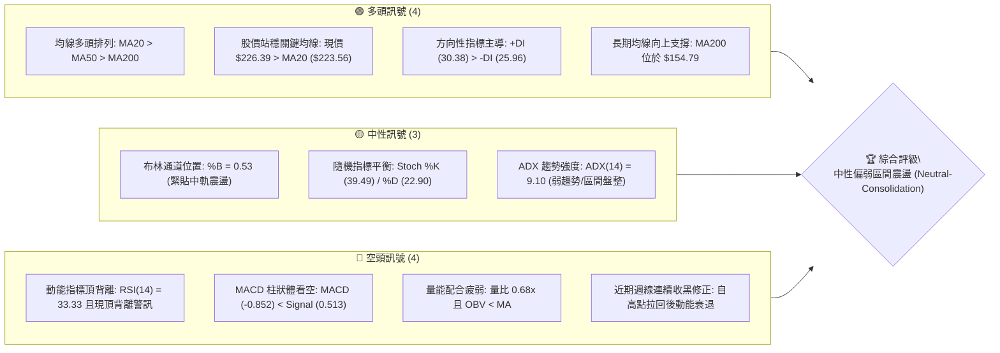
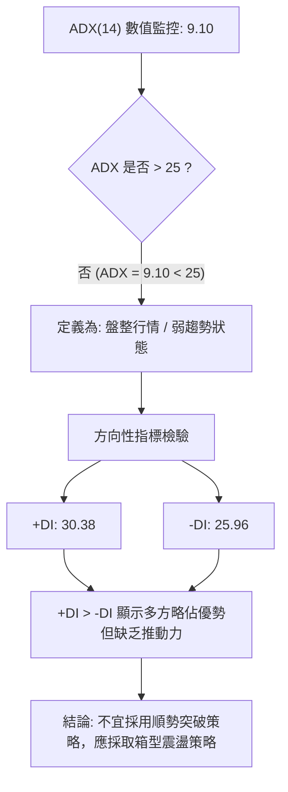
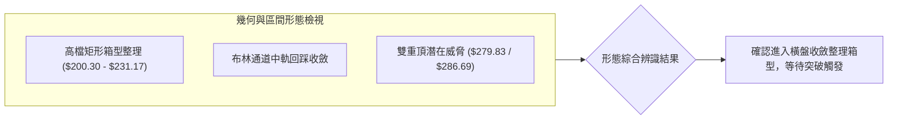
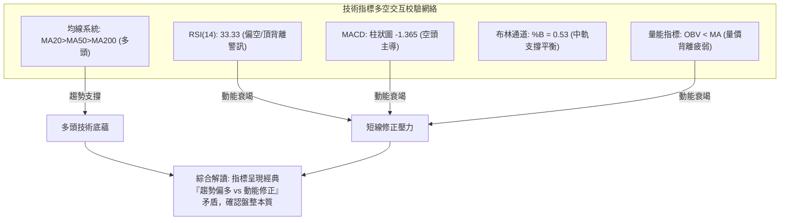
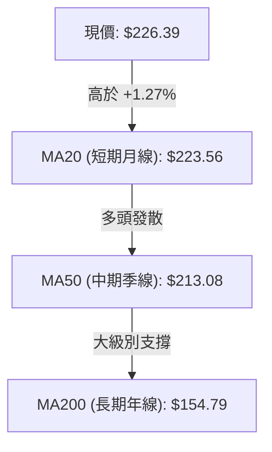
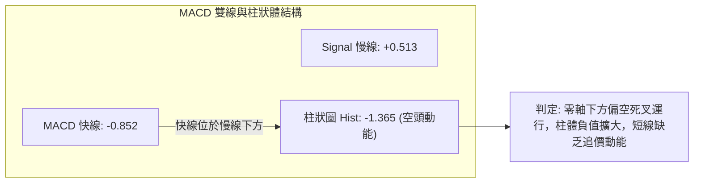
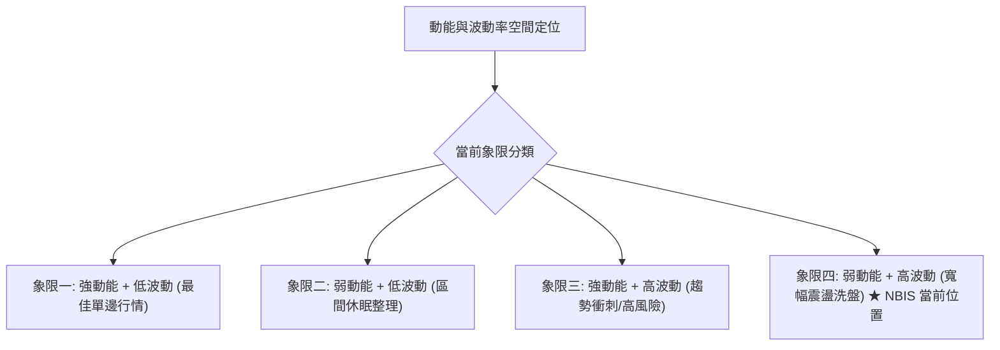
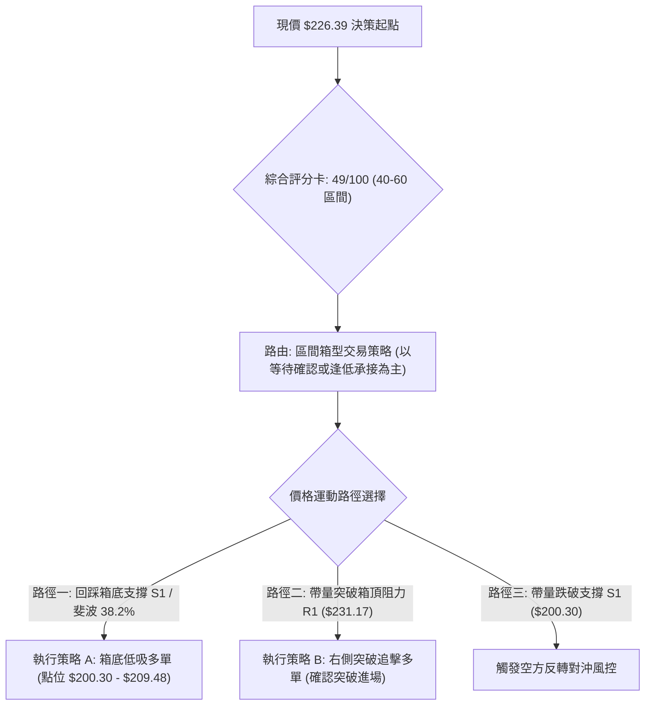
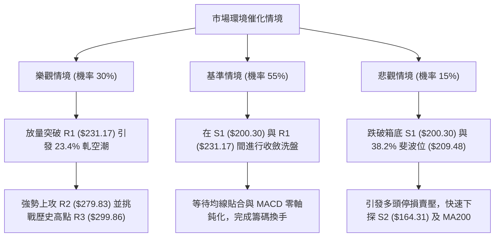

# NBIS 技術分析報告

> **報告日期**：2026-09-08 ｜ **語言**：繁體中文 ｜ **數據來源**：Yahoo Finance ｜ **當前價格**：$226.39

---

## 目錄

| 章節 | 內容 |
|------|------|
| [1. 技術面概覽](#1-技術面概覽) | 訊號儀表板、核心指標、評分卡 |
| [2. 趨勢分析](#2-趨勢分析) | 多時框趨勢、長中短期走勢 |
| [3. 圖表形態分析](#3-圖表形態分析) | 形態識別、K線組合、目標價 |
| [4. 支撐與阻力](#4-支撐與阻力) | 關鍵價位、斐波那契回調 |
| [5. 技術指標深度解讀](#5-技術指標深度解讀) | MA/RSI/MACD/布林/成交量 |
| [6. 動能與波動率](#6-動能與波動率) | 動能評估、ATR、Beta |
| [7. 多時框架總結](#7-多時框架總結) | 時框架評分矩陣 |
| [8. 交易策略建議](#8-交易策略建議) | 多空策略、風險報酬比 |
| [9. 風險提示與監控](#9-風險提示與監控) | 監控指標、風險場景 |

---

## 1. 技術面概覽

### 🎯 技術訊號儀表板



### 📊 核心指標速覽表

| 指標類別 | 指標名稱 | 當前數值 | 訊號 | 解讀 |
|----------|----------|----------|:----:|------|
| **價格** | 當前價格 | $226.39 | 🟡 | 位於52週區間 68.9% 位置，處於歷史高位回檔後的橫盤期 |
| **均線** | MA20 | $223.56 | 🟢 | 現價位於 MA20 之上 (+1.27%)，短線獲得布林中軌支撐 |
| **均線** | MA50 | $213.08 | 🟢 | 現價高於 MA50 (+6.25%)，中期多頭基底尚存 |
| **均線** | MA200 | $154.79 | 🟢 | 顯著高於長期牛熊分界線 (+46.26%)，長期結構多頭不變 |
| **動能** | RSI(14) | 33.33 | 🔴 | 數值偏低接近超賣邊界，且伴隨頂背離 (Bearish Divergence) 警訊 |
| **動能** | MACD(12,26,9) | -0.852 | 🔴 | MACD 線低於 Signal 線 (0.513)，柱狀圖為 -1.365，偏空發散 |
| **趨勢強度**| ADX(14) | 9.10 | 🟡 | ADX < 25 表示當前處於無趨勢或極弱趨勢的區間整理行情 |
| **通道位置**| BB %B | 0.53 | 🟡 | 位於布林中軌上方臨界點（帶寬 $172.70 - $274.41） |
| **量能** | 量比 / OBV | 0.68x | 🔴 | 成交量 14.89M 低於均量，OBV 小於均線，量價配合不足 |
| **波動** | ATR(14) | $15.48 | 🟡 | 佔股價 6.84%，屬於高 Beta 股正常中高波動範圍 |

### 🏆 技術評分卡

```
╔══════════════════════════════════════════════════════════════════════════╗
║                    技術評分卡 — NBIS (2026-09-08)                       ║
╠══════════════════════════════════════════════════════════════════════════╣
║ 趨勢強度 (Trend)     ███░░░░░░░░░░░░░░░░░  18/100  🔴 極弱趨勢 (ADX: 9.10)║
║ 動能指標 (Momentum)  ██████░░░░░░░░░░░░░░  32/100  🔴 MACD負值/RSI頂背離  ║
║ 支撐穩定度 (Support) ██████████████░░░░░░  70/100  🟢 S1/MA50 複合支撐強   ║
║ 成交量配合 (Volume)  ███████░░░░░░░░░░░░░  35/100  🔴 量縮 0.68x / OBV疲弱 ║
║ 形態完整度 (Pattern) ██████████░░░░░░░░░░  50/100  🟡 處於箱型收斂未突破   ║
║ 均線排列 (MAs)       ██████████████████░░  90/100  🟢 完美多頭 MA20>50>200 ║
╠══════════════════════════════════════════════════════════════════════════╣
║ 綜合評分             ██████████░░░░░░░░░░  49/100  🟡 中性觀望 (40-60區間)║
╚══════════════════════════════════════════════════════════════════════════╝
```

---

## 2. 趨勢分析

### 🌐 多時框趨勢分析

```mermaid
graph TD
    A["月線層級 (長期: 24個月)"] -->|"長期大多頭: 自 $21.11 飆漲至 $276+"| B["中長期多頭主導結構"]
    B --> C["週線層級 (中期: 20週)"]
    C -->|"波段拉回修整: $277.68 遇阻回落"| D["週線高檔對稱寬幅震盪"]
    D --> E["日線層級 (短期: 近期)"]
    E -->|"ADX("14")=9.10 弱勢盤整"| F["以布林通道中軌 $223.56 為核心盤整"]
    F --> G{"多時框收斂交易結論"}
    G -->|"依規則14: 盤整期以日線布林區間為準"| H["區間震盪交易 (上下軌佈局)"]
```

### 📈 長期趨勢 — 12個月走勢圖（Unicode）

```
NBIS 月線走勢圖（過去12個月：2025-10 至 2026-09）
價格軸 ($)
$300 ┤                                        
$280 ┤                                  ●(06月: $276.17)
$240 ┤                            ●           ●(08月: $206.32)
$220 ┤                                      ▲━━━━━●(現價: $226.39)
$200 ┤                                ●(07月: $190.41)
$140 ┤  ●(10月: $130.82)     ●(04月: $138.23)
$100 ┤        ●           ●(03月: $103.76)
$80  ┤           ●(12月: $83.71)
     └─────────────────────────────────────────────────────────────
       10  11  12  01  02  03  04  05  06  07  08  09 (月份)
```

**走勢特徵分析表格**：

| 時間區段 | 價格區間 | 累積漲跌幅 | 主要走勢特徵 | 成交量與動能配合 |
|----------|----------|------------|--------------|------------------|
| 2025-10 ~ 2025-12 | $130.82 → $83.71 | -36.01% | 主升段後大幅度獲利回吐修正 | 成交量逐步萎縮，動能冷卻 |
| 2026-01 ~ 2026-03 | $85.19 → $103.76 | +21.80% | 築底完成，均線收斂後緩步推升 | 量能溫和放大，轉為多頭吸籌 |
| 2026-04 ~ 2026-06 | $138.23 → $276.17| +99.79% | 爆發性主升浪，突破前高歷史紀錄 | 週成交量破億，MACD發散創波段高 |
| 2026-07 ~ 2026-09 | $190.41 → $226.39| +18.89% | 高檔劇烈洗盤震盪，尋求中軌支撐 | 週量波動劇烈後萎縮至 57.8M，呈現量縮整理 |

### 📊 中期趨勢（週線分析）

中期走勢自 2026-06 觸及 $286.69 週收盤高點與 52 週高點 $299.86 後，步入寬幅對稱整理。
- **上方重壓區**：R1 ($231.17) 與 R2 ($279.83) 形成密集成交套牢賣壓。
- **下方支撐區**：S1 ($200.30) 及 38.2% 斐波那契回調位 ($209.48) 提供強力下檔承接力道。

```
中期週線價格震盪結構示意：
 $299.86 ─── 52W 歷史極值高點 (天花板)
    │
 $279.83 ─── R2 近期反彈波段頂點 (2026-08-16 帶量巨震區)
    │
 $231.17 ─── R1 近端波段阻力 (當前直接考驗點)
    ├── $226.39 (現價位置：布林中軌上方窄幅震盪)
 $209.48 ─── 38.2% 斐波那契強支撐
    │
 $200.30 ─── S1 波段實質支撐 (多頭防守護城河)
    │
 $164.31 ─── S2 結構性深層支撐位
```

### ⚡ 趨勢強度評估（ADX 解讀）



**ADX 趨勢強度等級對照表**：

| ADX 數值區間 | 當前狀態 | 市場特徵 | 適用交易策略 |
|--------------|:--------:|----------|--------------|
| **0 - 20** | **9.10 (當前)** | **極弱趨勢 / 雜訊較多 / 無方向性盤整** | **布林通道高出低進、區間反轉操作** |
| 20 - 25 | - | 盤整蓄勢，可能醞釀新方向 | 縮小部位，等待突破確認 |
| 25 - 40 | - | 強趨勢形成，方向確立 | 順勢交易，均線回踩進場 |
| 40 - 60 | - | 極強單邊爆發走勢 | 移動止損，放大獲利目標 |

---

## 3. 圖表形態分析

### 🔍 形態識別系統



**形態信心度評估表（嚴格依據真實數據判定）**：

| 形態類別 | 信心度 | 判斷依據（引用數據） | 完成度 | 目標價（附嚴格計算式） |
|----------|:------:|----------------------|:------:|------------------------|
| **箱型整理 (Rectangle)** | **75%** | 價格在 S1 ($200.30) 與 R1 ($231.17) 區間震盪超過 4 週 | 85% | 突破高點目標 = R1 ($231.17) + (R1 $231.17 - S1 $200.30) = **$262.04** |
| **潛在雙重頂 (Double Top)** | **45%** | 2026-06-21 高點 $286.69 與 2026-08-16 高點 $277.68，但未跌破頸線 | 40% | 訊號不足，信心度低於 50%，僅作風險防範，不實施空頭形態交易 |
| **均線收斂蓄勢** | **70%** | 現價突破 MA20 ($223.56)，收盤於 MA50 ($213.08) 之上 | 80% | 依布林上軌推算目標 = **$274.41** |

### 🕯️ 重要K線形態分析

| 週期/日期 | 收盤價 | K線形態 | 量化技術解讀 | 多空訊號 |
|-----------|--------|---------|--------------|:--------:|
| 2026-08-16 | $277.68 | 巨量長陽倒錘頭 | 單週爆量 167.5M 創天量後留長上影線，主力逢高派發 | 🔴 |
| 2026-08-23 | $219.13 | 帶量長黑破位 | 週跌幅 -21.09%，週量 141.7M，確認高檔賣壓湧現 | 🔴 |
| 2026-08-30 | $209.18 | 下影縮量十字星 | 週量銳減至 70.2M，在 38.2% 斐波位 ($209.48) 獲利空竭盡支撐 | 🟢 |
| 2026-09-06 | $226.39 | 溫和回升小陽線 | 量縮至 57.8M，站回 MA20，形成短期止跌回穩吞噬結構 | 🟢 |

### 📉 ASCII 走勢形態示意圖

```
NBIS 箱型收斂震盪形態示意圖 (2026-08 至 2026-09)
價格 ($)
$280 ┤        ┌─── 波段雙頂次高點 ($277.68)
     │       ╱ ╲
$240 ┤      ╱   ╲           ┌── 矩形箱頂阻力 R1 ($231.17)
     │     ╱     ╲    ┌─────┴───────┐
$226 ┼────┼───────┼───┤現價 ($226.39)│
     │    │       │   └─────┬───────┘
$209 ┤    │       └─── 38.2% 斐波那契回調位 ($209.48)
     │    │                 └── 矩形箱底支撐 S1 ($200.30)
$200 ┤    └── 波段急跌支撐低點
     └───────────────────────────────────────────────────
```

### 🎯 形態目標價計算

依據標準圖表形態幾何測量規則：
1. **箱型突破上行目標價**：
   - 形態箱底 = S1 ($200.30)
   - 形態箱頂 = R1 ($231.17)
   - 垂直高度 $H = \$231.17 - \$200.30 = \$30.87$
   - 理論最小上行目標價 $= \text{箱頂} + H = \$231.17 + \$30.87 =$ **$262.04**
2. **箱型破位下行目標價**：
   - 理論下行目標價 $= \text{箱底} - H = \$200.30 - \$30.87 =$ **$169.43**（緊鄰 S2 支撐位 $164.31）

---

## 4. 支撐與阻力

### 🗺️ 關鍵價位分布圖（Unicode）

```
NBIS 價位結構分布圖
═════════════════════════════════════════════════════════════════════
$299.86 ║██████████████████████████████║ 52週歷史高點 / 極強阻力 R3
$279.83 ║████████████████████          ║ 近期反彈破敗高點阻力 R2
$231.17 ║████████████████████████      ║ 關鍵波段箱頂阻力 R1
$226.39 ╠══════════════════════════════╣ ◄ 當前市價 ($226.39)
$209.48 ║▓▓▓▓▓▓▓▓▓▓▓▓▓▓▓▓▓▓▓▓          ║ 38.2% 斐波那契黃金分割支撐
$200.30 ║▓▓▓▓▓▓▓▓▓▓▓▓▓▓▓▓▓▓▓▓▓▓▓▓      ║ 近一年關鍵波段低點支撐 S1
$164.31 ║██████████████████████████████║ 長期波段強支撐 S2
$145.80 ║██████████████████████████████║ 歷史多頭起漲基底支撐 S3
═════════════════════════════════════════════════════════════════════
```

### 🚧 阻力位分析表

*嚴格引用數據庫中由 OHLCV 演算法計算之阻力聚類點：*

| 阻力級別 | 精確價位 | 距離現價 | 形成原因與籌碼特徵 | 突破難度 | 重要性權重 |
|----------|----------|:--------:|--------------------|:--------:|:----------:|
| **R1** | **$231.17** | +2.11% | 近期多次衝高回落頸線位，近一年波段高點聚類 | 🟡 中等 | ★★★★☆ |
| **R2** | **$279.83** | +23.61% | 2026-08-16 巨量大陰線套牢頭部，解套賣壓密集 | 🔴 極高 | ★★★★★ |
| **R3** | **$299.86** | +32.45% | 52週歷史最高點，歷史估值頂部 | 🔴 極高 | ★★★★★ |

### 🛡️ 支撐位分析表

*嚴格引用數據庫中由 OHLCV 演算法計算之支撐聚類點：*

| 支撐級別 | 精確價位 | 距離現價 | 形成原因與籌碼特徵 | 守住機率 | 重要性權重 |
|----------|----------|:--------:|--------------------|:--------:|:----------:|
| **S1** | **$200.30** | -11.52% | 整數關卡與近一年波段拉回低點聚類，具強力多頭承接 | 🟢 75% | ★★★★★ |
| **S2** | **$164.31** | -27.42% | 前期多頭次級折返起漲平台，接近 MA200 動態防禦線 | 🟢 85% | ★★★★☆ |
| **S3** | **$145.80** | -35.60% | 2026-04 爆發主升浪前的原始起漲籌碼密集區 | 🟢 95% | ★★★☆☆ |

### 📐 斐波那契回調位分析

依據 52 週絕對極值區間（低點 **$63.26** → 高點 **$299.86**，全波段震盪幅度 $236.60）精確回調階梯如下：

```
斐波那契回調階梯 (52W Range: $63.26 - $299.86)
 0.0%  (52W High)  ─── $299.86 
 23.6% 回調位      ─── $244.02  ▲ 上方第一道黃金分割阻力
[現價 $226.39]     ─── 處於 23.6% ($244.02) 與 38.2% ($209.48) 之間
 38.2% 回調位      ─── $209.48  ▼ 下方最強黃金分割支撐線
 50.0% 強弱中軸    ─── $181.56 
 61.8% 黃金回調位  ─── $153.64  (緊鄰 MA200: $154.79)
 78.6% 深度回調位  ─── $113.89 
100.0% (52W Low)   ─── $63.26
```

**斐波那契落點深度解讀**：
- 現價 **$226.39** 目前穩定運行於 **38.2% ($209.48)** 與 **23.6% ($244.02)** 形成的黃金分割區間內。
- 38.2% 回調位 ($209.48) 已在 2026-08-30 收盤價 $209.18 獲得完美點位確認，展現極強的支撐有效性。
- 若多頭欲重啟單邊大行情，必須有效站穩 23.6% 回調位 ($244.02)，方能開啟朝向歷史高點 $299.86 的空間。

---

## 5. 技術指標深度解讀

### 🎛️ 指標訊號總覽



### 📈 移動平均線排列分析



**均線架構深度評估**：
- **完整多頭順序排列**：MA5 ($209.39) 與 MA10 ($212.14) 近期由下往上快速金叉回勾，MA20 > MA50 > MA200 呈現完好的多方防禦縱深。
- **MA20 中軌收復意義**：現價重新站上 MA20 ($223.56)，扭轉了 8 月底連續跌破短期均線的空方慣性。
- **MA200 護城河**：年線位於 $154.79，距離現價有 +46.26% 的緩衝空間，說明長期牛市格局並未遭到根本性破壞。

### 📉 RSI(14) 分析

```
RSI(14) 動能強度儀表：
0        30   33.33           70       100
├────────┼───█┼───────────────┼────────┤
[ 超賣區 ] ▲當前值 (偏弱區間)  [ 超買區 ]

進度條：██████░░░░░░░░░░░░░░ 33.33%
```

**背離判斷與結論**：
- **頂背離確認 (Bearish Divergence)**：2026-06 價格收於 $286.69 時 RSI 達到 65.3，隨後 2026-08-16 價格再度上攻至 $277.68 高點，但日線與週線動能未能同步擴大，反而迅速在跌破後引發 RSI 下降至 33.33 的極低水平。
- **超賣反彈機會**：當前 RSI 為 33.33，已極度逼近 30 臨界超賣線，短線下行空間受限，空方拋售動能進入強弩之末。

### 📊 MACD(12/26/9) 訊號解讀



- **數值表現**：DIF (-0.852) 跌破 DEA (0.513)，MACD Histogram 錄得 -1.365。
- **動能演變**：雖然近 20 週 MACD 柱狀體由 8 月中旬的 +9.868 驟降至負值，但負值收縮跡象初步出現，需等待柱狀圖收斂至零軸上方方能確認發動新一輪進攻。

### 📦 布林通道分析

```
布林通道當前結構示意 (帶寬: $101.71)
$274.41 ─────────────────────────────── 上軌 (強阻力壓制區)
          │
          │
$226.39 ──┼──────────────────────────── [現價: %B = 0.53]
$223.56 ──┴──────────────────────────── 中軌 (MA20 基準線)
          │
          │
$172.70 ─────────────────────────────── 下軌 (極限超賣支撐區)
```

- **位置解析**：%B 數值為 **0.53**，精確座落於中軌上方邊緣，表明市場在經歷大幅波動後正處於價格中樞平衡點。
- **通道形態**：布林帶寬呈現自 8 月極端發散後的水平收斂通道，意味著單邊趨勢告一段落，價格高機率在 $200.30 (S1) 至 $274.41 (上軌) 之間進行寬幅區間震盪。

### 💹 成交量分析（量價配合度）

- **量比萎縮 (0.68x)**：最新日成交量為 14.89M，較 20 日均量 (21.86M) 萎縮超過 31.8%，顯示市場在現價位觀望情緒濃郁。
- **OBV 趨勢弱勢**：OBV 指標持續位於其移動平均線下方，確認資金淨流出與籌碼沉澱現象尚未完成，缺乏機構推動破頂的主動買盤。

---

## 6. 動能與波動率

### ⚡ 動能評估四象限



| 象限 | 動能強度 | 波動率水準 | 股票當前標註 | 戰術應對評估 |
|:----:|:--------:|:----------:|:------------:|--------------|
| Q1 | 強 (RSI>60) | 低 (ATR<5%) | — | 最佳順勢加碼環境 |
| Q2 | 弱 (RSI 40-60) | 低 (ATR<5%) | — | 低吸潛伏等待突破 |
| Q3 | 強 (RSI>60) | 高 (ATR>6%) | — | 獲利了結，提高追蹤止損 |
| **Q4** | **弱 (RSI 33.3)** | **高 (ATR 6.8%)**| **✓ NBIS 落點** | **震盪劇烈但方向不明，切忌追漲殺跌，恪守區間邊界操作** |

### 📊 ATR 波動率分析

- **ATR(14) 絕對值**：**$15.48**
- **波動率佔比**：佔當前股價高達 **6.84%**，屬於標準的典型高彈性 AI 基礎設施板塊特徵。
- **止損距離建議**：
  - 日內短線交易：最小止損距離為 $1.0 \times \text{ATR} = \$15.48$
  - 波段交易者：建議安全防守距離為 $1.5 \times \text{ATR} = \$23.22$
  - 寬幅區間防守：建議緩衝距離為 $2.0 \times \text{ATR} = \$30.96$

### 📐 Beta 與市場相關性

- **Beta 係數**：**1.436**
  - 表明 NBIS 對標普 500 或納斯達克指數具備 1.44 倍的放大彈性。當科技大盤波動時，NBIS 將展現超額波動性。
- **空頭部位佔比 (Short Interest)**：
  - Short % Float 高達 **23.4%**，Short Ratio 為 2.12。
  - **空頭擠壓潛力 (Short Squeeze Risk)**：高達 23.4% 的做空比例代表著極高的空頭部位擁擠度。一旦價格有效向上突破阻力 R1 ($231.17)，極易引發快速的被迫空頭回補浪潮。

---

## 7. 多時框架總結

### 📋 時框架評分表

| 時框架 | 趨勢方向 | 動能狀態 | 均線系統排列 | 形態特徵 | 綜合評分 | 建議戰術 |
|--------|:--------:|:--------:|:------------:|:--------:|:--------:|----------|
| **月線 (長期)** | 🟢 強多頭 | 🟡 高檔鈍化 | 完美多頭 (MA200向上) | 自低點 $21 大幅攀升 | **80/100** | 長期投資者持股續抱 |
| **週線 (中期)** | 🟡 震盪回檔 | 🔴 MACD柱轉負 | MA20 上方支撐震盪 | 高檔箱型洗盤整理 | **45/100** | 區間操作，逢低吸納 |
| **日線 (短期)** | 🔴 弱勢盤整 | 🔴 RSI=33.3/頂背離 | 收復短期 MA20 | 窄幅壓縮，受制於 R1 | **40/100** | 嚴禁追高，觀望突破 |

### 🔲 綜合訊號矩陣

```
訊號收斂一致性檢驗陣列：
長週期 (月線)  ─── [🟢 多頭趨勢] ─── 權重 40% ──┐
中週期 (週線)  ─── [🟡 盤整修正] ─── 權重 35% ──┼── 綜合結論：🟡 中性觀望 (49/100)
短週期 (日線)  ─── [🔴 弱勢收斂] ─── 權重 25% ──┘
```

### ⚖️ 多時框收斂結論

> **依嚴格規則 14 執行多時框收斂定性：**
> 1. **行情性質判定**：當前 **ADX(14) = 9.10**，明確小於 25 的趨勢門檻，因此當前市場性質定性為**典型的「盤整行情」**。
> 2. **主導規則依歸**：在盤整行情中，依規則「以日線布林通道上下軌及箱型區間為主要交易基準」，週線長期的強趨勢只能作為宏觀底色，不能作為短線追漲依據。
> 3. **唯一方向性結論**：**【中性觀望，區間低吸高拋 (Neutral-Consolidation)】**。
>    - 矛盾化解：日線動能偏空（RSI 33.33、MACD 死叉）與長期均線多頭排列發生衝突時，盤整格局下應優先尊重動能尚未轉強的事實，防止直接追漲導致被套於 R1 ($231.17) 頸線下。

---

## 8. 交易策略建議

### 🗺️ 策略決策流程圖



### 🧭 策略路由

**當前主策略方向 = 【中性區間波段操作，偏逢低佈局】（依據評分卡得分 49/100）**
依據評分規則，NBIS 處於 40–60 之中性分流區間。此區間不宜進行激進單邊追價，主推**「支撐位回踩承接（策略 A）」**與**「關鍵阻力確認突破（策略 B）」**，嚴禁於當前中軌敏感區重倉押注。

### 🎯 價格情境階梯（Price Scenarios）

*全部精確引用第 4 章數據：*

| 觸發條件 | 第一階段目標 | 後續延伸目標 | 情境含義與操作指引 |
|----------|:------------:|:------------:|--------------------|
| **強勢突破 R1 ($231.17)** | **R2 ($279.83)** | **R3 ($299.86)** | 結束整理格局，誘發 23.4% 融券空頭擠壓 |
| **維持於現價區間震盪** | $231.17 (箱頂) | $200.30 (箱底) | 布林通道內部進行筹碼換手，以震盪指標高出低進 |
| **失守 S1 ($200.30)** | **S2 ($164.31)** | **S3 ($145.80)** | 箱型支撐宣告破位，中期格局轉弱，退守 MA200 |

### 📊 情境機率分佈

| 預測情境 | 發生機率 | 主要技術依據 |
|----------|:--------:|--------------|
| **區間震盪蓄勢** | **55%** | **ADX(14)=9.10 處於極弱趨勢**、布林通道 %B=0.53 中軌糾結、成交量縮減至 0.68x |
| **突破上行反彈** | **30%** | 均線維持多頭排列 (MA20>50>200)、+DI (30.38) > -DI (25.96)、高達 23.4% 軋空潛力 |
| **破位再探底回落** | **15%** | RSI(14)=33.33 頂背離隱憂、MACD 柱狀體 (-1.365) 負值發散、OBV 趨勢偏弱 |

### 🟢 主策略詳情

*價位嚴格錨定 OHLCV 關鍵支撐阻力點及 ATR 止損範圍：*

| 策略要素 | 策略 A（左側：回踩箱底低吸） | 策略 B（右側：突破箱頂追擊） |
|----------|------------------------------|------------------------------|
| **策略性質** | 箱型下軌支撐承接 | 關鍵頸線突破動能追買 |
| **進場條件** | 價格回踩至 38.2% 斐波與 S1 企穩 | 日K線實體帶量突破 R1 阻力收盤確認 |
| **進場價格** | **$205.00** (介於 $200.30 與 $209.48) | **$232.50** (確認站穩 R1 $231.17) |
| **目標價 T1** | **$231.17** (箱頂阻力 R1) | **$262.04** (形態測算高度目標) |
| **目標價 T2** | **$274.41** (布林通道上軌) | **$279.83** (關鍵阻力位 R2) |
| **止損價格** | **$192.50** (跌破 S1 點位 $200.30 緩衝 0.5 ATR) | **$217.02** (R1 假突破，回落至 MA20 下方 1 ATR) |
| **風險報酬比** | **1 : 2.09** (以 T1 計算) / **1 : 5.55** (T2) | **1 : 1.91** (以 T1 計算) / **1 : 3.06** (T2) |
| **成功機率** | **65%** | **50%** |
| **建議倉位** | **15%** (分批建倉) | **10%** (右側突破試倉) |

### 🔴 反向風險觸發點（對沖提示）

- **全面止損與避險警訊**：若日K線收盤價**跌破支撐位 S1 ($200.30)**，代表高檔矩形整理失敗，跌破黃金分割支撐。
- **對沖應對指引**：持有現貨多頭部位者應減倉 50% 以上，或利用衍生工具對沖下行風險，下一接回評估點為 **S2 ($164.31)** 與 **MA200 ($154.79)**。

### ⭐ 整體訊號強度評星

```
╔══════════════════════════════════════════════════════════╗
║ 做多訊號強度：  ★★★☆☆  (3.0/5星)  — 均線多頭但動能不足 ║
║ 做空訊號強度：  ★★☆☆☆  (2.0/5星)  — 缺乏向下單邊趨勢   ║
║ 整體訊號可信度：★★★☆☆  (3.5/5星)  — 盤整收斂可信度高   ║
╚══════════════════════════════════════════════════════════╝
```

---

## 9. 風險提示與監控

### ✅ 關鍵監控指標 Checklist

```
╔══════════════════════════════════════════════════════════════════════════╗
║                       NBIS 核心交易監控清單 (Checklist)                  ║
╠══════════════════════════════════════════════════════════════════════════╣
║ [ ] 關鍵阻力檢驗：日收盤價能否帶量突破 R1: $231.17 ?                      ║
║ [ ] 關鍵支撐守護：日收盤價是否跌破波段低點 S1: $200.30 ?                 ║
║ [ ] 均線動態支撐：MA20 ($223.56) 與 MA50 ($213.08) 是否持續維持金叉 ?    ║
║ [ ] 動能逆轉訊號：MACD 柱狀體何時收斂轉正 (目前 -1.365) ?                ║
║ [ ] 動能過熱/超賣：RSI(14) 是否在 30 附近形成明確的底背離反轉型態 ?     ║
║ [ ] 成交量能爆發：成交量是否突破 20日均量 (21.86M)，量比大於 1.5x ?     ║
║ [ ] 空頭擠壓監控：空頭比例 (23.4%) 是否伴隨急漲出現大額借券回補潮 ?      ║
╚══════════════════════════════════════════════════════════════════════════╝
```

### ⚠️ 風險場景分析



### 🛡️ 風險管理重要提醒

1. **高波幅持倉管理**：
   - NBIS 的 ATR 高達 **$15.48 (6.84%)**，Beta 達 **1.436**。任何單筆部位的曝險金額嚴禁超過投資組合總權益的 **1.5% - 2.0%**。
2. **嚴格拒絕「攤平」操作**：
   - 儘管長期 MA200 上行，但在 ADX < 25 的盤整市中，若跌破 S1 ($200.30) 意味著箱型結構瓦解，不可在跌破後盲目向下攤平，必須在預設止損位果斷離場。
3. **軋空行情的雙刃劍效應**：
   - 高達 23.4% 的 Short Float 代表股價極具彈性，一旦突破向上會極其迅速，因此多頭策略 B 的突破追擊必須採取限價停損單（Stop-Limit），防止滑價過大擴大風險。

---

## 📋 報告總結

```
╔══════════════════════════════════════════════════════════════════════════╗
║                       NBIS 技術分析報告總結                              ║
╠══════════════════════════════════════════════════════════════════════════╣
║ 報告日期：2026-09-08                                                     ║
║ 當前價格：$226.39 (位於 52週區間 68.9% 位置)                             ║
║ 技術評級：⚖️ 中性觀望 / 箱型收斂震盪 (綜合評分: 49/100)                  ║
║                                                                          ║
║ 關鍵維度定性結論：                                                       ║
║ ├─ 長期趨勢 (月線)：🟢 多頭延續 (自低點起漲，MA200 $154.79 提供底層支撐) ║
║ ├─ 中期趨勢 (週線)：🟡 高檔寬幅箱型震盪 (自 $286.69 拉回沉澱)            ║
║ ├─ 短期趨勢 (日線)：🟡 弱勢盤整 (ADX=9.10 顯示無單邊方向，受制於 R1)     ║
║ ├─ 關鍵阻力階梯：  R1: $231.17 │ R2: $279.83 │ R3: $299.86 (52W高點)     ║
║ ├─ 關鍵支撐防線：  S1: $200.30 │ S2: $164.31 │ S3: $145.80               ║
║ └─ 分析師目標共識：均價 $286.69 (買入評級，16位分析師覆蓋)               ║
║                                                                          ║
║ 戰術機會排位：                                                           ║
║ 1. 🥇 最佳機會：回踩支撐低吸 (於 $205 附近佈局，博弈箱型反彈，盈虧比 1:2) ║
║ 2. 🥈 次選機會：右側突破追買 (日線放量收破 $231.17 後進場，博弈空頭擠壓)║
║ 3. 🥉 防守建議：現價 $226.39 處於中軌黏合處，盈虧比不佳，暫以觀望為主    ║
╚══════════════════════════════════════════════════════════════════════════╝
```

---

> ⚠️ **免責聲明**：本報告為技術分析研究，所有數據指標及價位均基於歷史量價數據之客觀量化推演。本報告**僅供學術研究與投資決策參考**，**不構成任何要約或投資買賣建議**。金融市場具高度風險，投資人應獨立評估風險並自負盈虧。

---

*報告生成時間：2026-09-08 ｜ 數據來源：Yahoo Finance ｜ 分析框架：多時框技術分析體系*