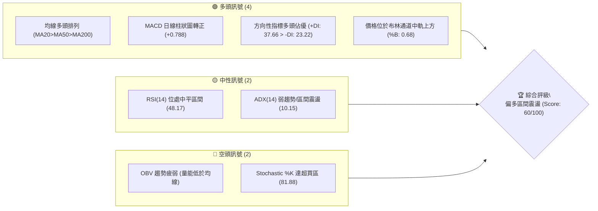
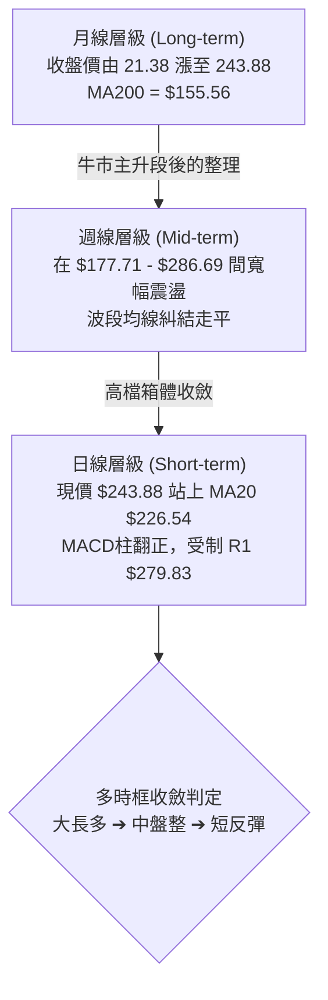
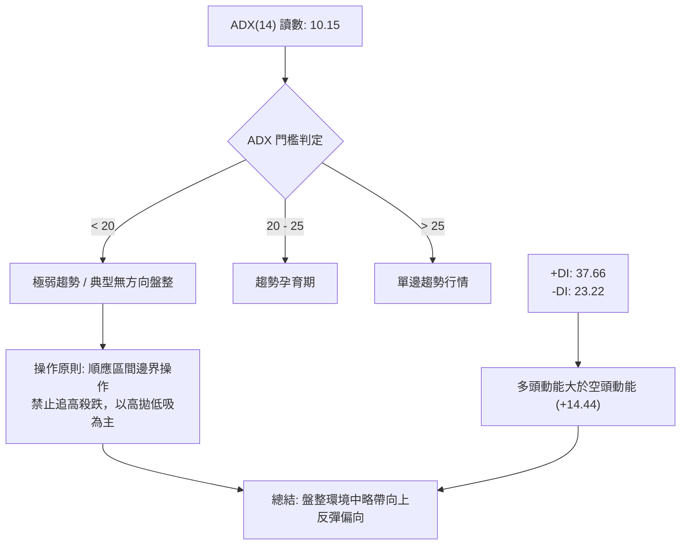
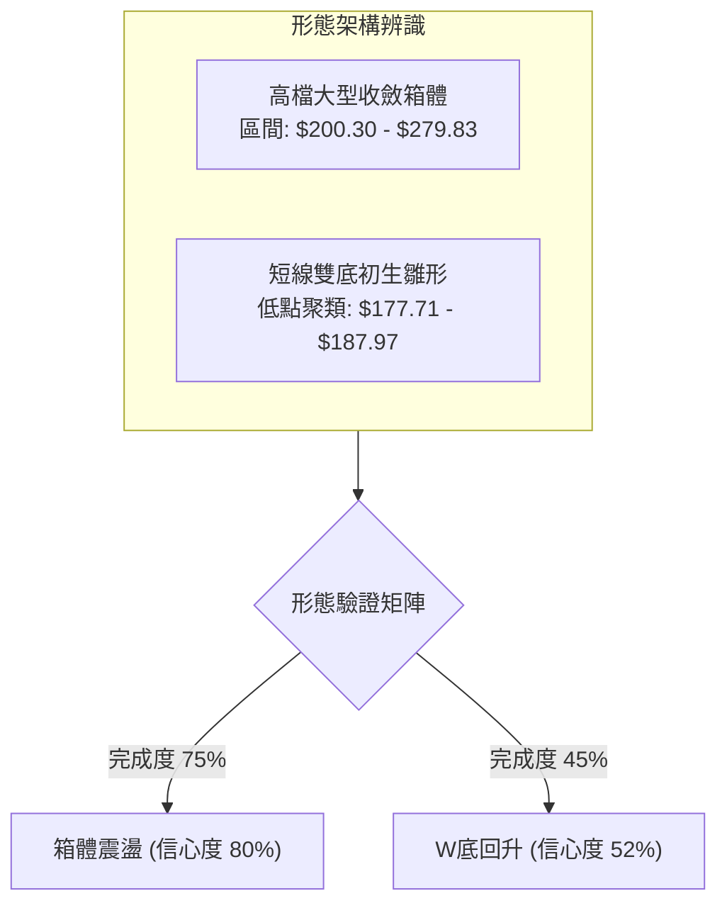
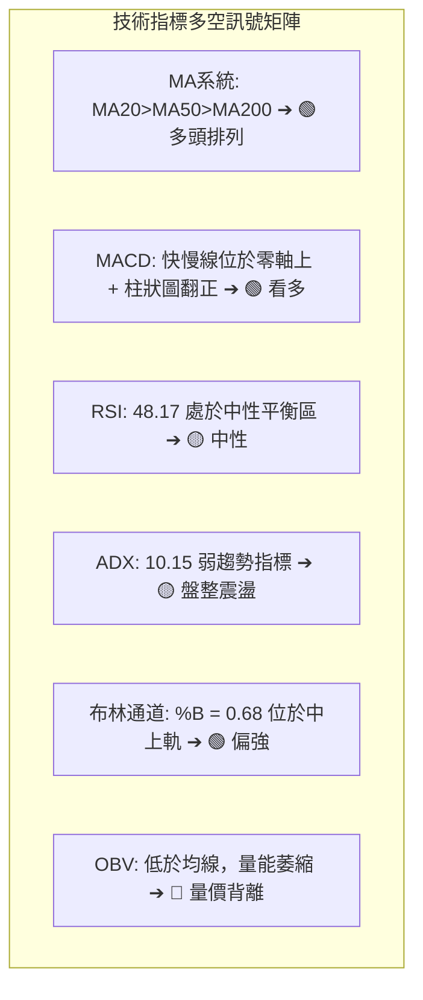
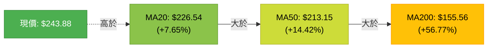
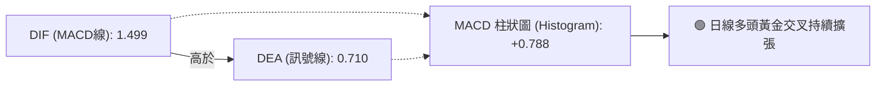
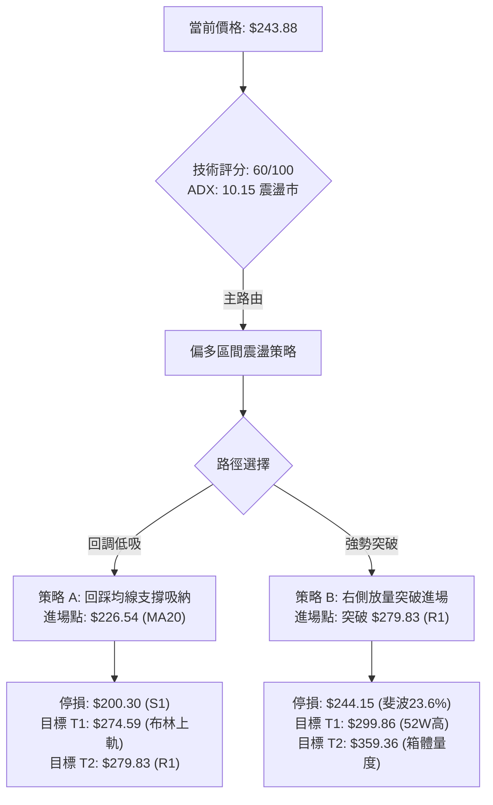
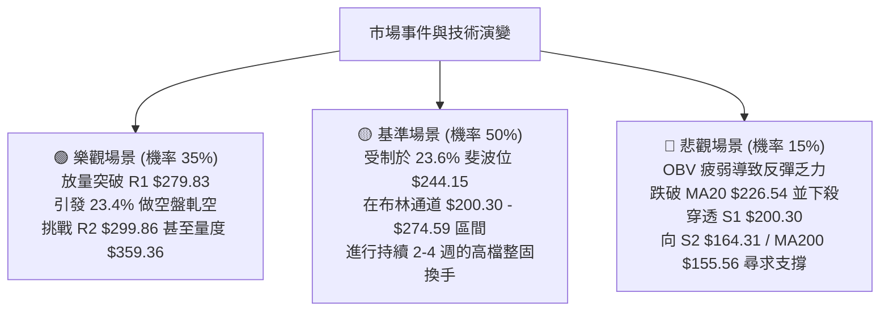

# NBIS 技術分析報告

> **報告日期**：2026-09-09 ｜ **語言**：繁體中文 ｜ **數據來源**：Yahoo Finance ｜ **當前價格**：$243.88

---

## 目錄

| 章節 | 內容 |
|------|------|
| [1. 技術面概覽](#1-技術面概覽) | 訊號儀表板、核心指標、評分卡 |
| [2. 趨勢分析](#2-趨勢分析) | 多時框趨勢、長中短期走勢、ADX解讀 |
| [3. 圖表形態分析](#3-圖表形態分析) | 形態識別、K線組合、形態目標價 |
| [4. 支撐與阻力](#4-支撐與阻力) | 關鍵價位、斐波那契回調 |
| [5. 技術指標深度解讀](#5-技術指標深度解讀) | MA/RSI/MACD/布林/成交量 |
| [6. 動能與波動率](#6-動能與波動率) | 動能評估、ATR、Beta 與空頭部位 |
| [7. 多時框架總結](#7-多時框架總結) | 時框架評分表、訊號收斂結論 |
| [8. 交易策略建議](#8-交易策略建議) | 策略路由、階梯情境、風報比計算 |
| [9. 風險提示與監控](#9-風險提示與監控) | 監控指標、風險場景與倉位控制 |

---

## 1. 技術面概覽

### 🎯 技術訊號儀表板



---

### 📊 核心指標速覽表

| 指標類別 | 指標名稱 | 當前數值 | 訊號 | 解讀 |
|----------|----------|----------|------|------|
| **價格** | 當前收盤價 | $243.88 | 🟢 | 位於 52 週高低區間之 76.3% 高位階，緊貼 23.6% 斐波那契位 |
| **均線** | MA20 (短) | $226.54 | 🟢 | 價格在均線上方 +7.65%，短線多頭掌控回踩中軌有撐 |
| **均線** | MA50 (中) | $213.15 | 🟢 | 價格在均線上方 +14.42%，中期支撐穩固，向上延伸 |
| **均線** | MA200 (長)| $155.56 | 🟢 | 價格在均線上方 +56.77%，長期牛市格局確立無虞 |
| **動能** | RSI(14) | 48.17 | 🟡 | 處於 30–70 中性平衡區，無超買超賣，多空勢力均衡 |
| **動能** | MACD | 1.499 / 0.710 | 🟢 | 快線位於慢線上方，柱狀圖為 +0.788，呈現黃金交叉看多 |
| **擺動** | Stoch %K / %D | 81.88 / 46.59 | 🔴 | %K 突破 80 進入短線超買區，存在技術性回測整理壓力 |
| **趨勢** | ADX(14) | 10.15 | 🟡 | 數值遠低於 25，單邊趨勢尚未成型，盤面定性為高檔震盪 |
| **方向** | +DI / -DI | 37.66 / 23.22 | 🟢 | +DI 大幅領先 -DI，買盤動能相對賣壓佔據優勢 |
| **通道** | 布林通道 %B | 0.68 | 🟢 | 位於中軌 $226.54 與上軌 $274.59 間，偏強整理 |
| **成交量**| 量比 (VR) | 1.19x | 🟢 | 最新量 26.65M 高於 20 日均量 22.39M，具溫和放量跡象 |
| **籌碼量能**| OBV | 疲弱 (OBV < MA)| 🔴 | 能量潮未顯著突破均線，主力追價意願仍處於觀望防守 |
| **波動度** | ATR(14) | $15.36 | 🟡 | 佔現價 6.30%，每日振幅劇烈，需設定較寬風控邊界 |

---

### 🏆 技術評分卡

```
╔══════════════════════════════════════════════════════════════╗
║                 技術評分卡 — NBIS (2026-09-09)                ║
╠══════════════════════════════════════════════════════════════╣
║ 趨勢強度 (ADX/DI)   ████████░░░░░░░░░░░░  42/100  🟡 弱勢趨勢 ║
║ 動能指標 (RSI/MACD) █████████████░░░░░░░  65/100  🟢 偏多金叉 ║
║ 支撐穩定度 (S1/S2)  ██████████████░░░░░░  70/100  🟢 下檔承接 ║
║ 成交量配合 (OBV/VR) ████████░░░░░░░░░░░░  40/100  🔴 量能背離 ║
║ 形態完整度 (箱體)   ████████████░░░░░░░░  60/100  🟡 區間收斂 ║
║ 均線排列 (多頭排列) ██████████████████░░  85/100  🟢 完美排列 ║
╠══════════════════════════════════════════════════════════════╣
║ 綜合評分            ████████████░░░░░░░░  60/100  偏多震盪    ║
╚══════════════════════════════════════════════════════════════╝
```

---

## 2. 趨勢分析

### 🌐 多時框趨勢分析



---

### 📈 長期趨勢 — 12 個月走勢圖（Unicode）

```
NBIS 月線走勢圖（2025-10 至 2026-09）
價格 ($)
$300 ┤                                      
$275 ┤                                  ● $276.17 (06月)
$250 ┤                                              ● $243.88 (現價)
$225 ┤                              ● $231.09       
$200 ┤                                      ● $190.41   ● $206.32
$175 ┤                                      
$150 ┤                      ● $138.23       
$125 ┤  ● $130.82 (10月)                    
$100 ┤      ● $94.87            ● $103.76   
 $75 ┤          ● $83.71    ● $91.19        
     │              ● $85.19 (01月低點)     
     └────────────────────────────────────────────────────────
       10   11  12  01  02  03  04  05  06  07  08  09 (月份)
```

#### 走勢特徵分析表格

| 階段區間 | 時間跨度 | 起訖價位 | 漲跌幅 | 走勢結構與特徵解讀 |
|----------|----------|----------|--------|--------------------|
| **第 I 階段** | 2025-10 ～ 2026-01 | $130.82 → $83.71 | -36.01% | 主升浪結束後的急跌修正，於 $83-$85 構築中期底部聚落 |
| **第 II 階段**| 2026-01 ～ 2026-03 | $85.19 → $103.76 | +21.80% | 底部換手吸籌完畢，均線開始拐頭向上，量能逐漸回溫 |
| **第 III 階段**| 2026-03 ～ 2026-06 | $103.76 → $276.17| +166.16%| 強烈爆發性主升浪，突破前高並創下 52 週最高 $299.86 |
| **第 IV 階段**| 2026-06 ～ 2026-07 | $276.17 → $190.41| -31.05% | 劇烈獲利了結回洗，最低下探 $177.71（守住 MA120 $195.86 與 S1） |
| **第 V 階段** | 2026-07 ～ 2026-09 | $190.41 → $243.88| +28.08% | 下影線回升，現價於 $243.88 測試 23.6% 斐波那契壓制點 |

---

### 📊 中期趨勢（週線分析）

```
NBIS 週線波段阻力與支撐示意圖
╔════════════════════════════════════════════════════════════════╗
║ 52W 歷史極值  $299.86 ─────────────────── 波段頂部阻力 R2     ║
║ 近期高點聚類  $279.83 ═══════════════════ 箱頂關鍵阻力 R1     ║
║ 布林帶通道上軌 $274.59 ┄┄┄┄┄┄┄┄┄┄┄┄┄┄┄┄┄ 動態通道上壓     ║
║ 當前收盤報價  $243.88 ◄───【現價位階：多空爭奪 23.6% 回調位】 ║
║ 20日均線中軌  $226.54 ┄┄┄┄┄┄┄┄┄┄┄┄┄┄┄┄┄ 關鍵短線動能線   ║
║ 斐波 38.2% 位 $209.69 ─────────────────── 箱體中軸平衡點     ║
║ 波段低點聚類  $200.30 ═══════════════════ 強力防守支撐 S1     ║
║ 前波修正低點  $164.31 ─────────────────── 次級防禦支撐 S2     ║
╚════════════════════════════════════════════════════════════════╝
```

從近 20 週表現觀察：
1. **成交量峰值分佈**：2026-08-16 週成交量達到 167,495,900 股，收盤大漲至 $277.68，帶動 MACD 柱擴大至 +9.868。但隨後一週在 $219.13 形成放量回調（141.7M 股），顯示 $275–$280 區間存在大量機構套牢盤。
2. **週線 MACD 週期**：近期 MACD 柱狀圖在經歷 7 月份持續負值（低點 -7.680）後，9 月第二週重新回到正值（+0.788），屬於典型的中期盤整收斂後的多頭反撲嘗試。

---

### ⚡ 趨勢強度評估（ADX 解讀）



| 指標名稱 | 數值 | 參考標準 | 結論與市場狀態 |
|----------|------|----------|----------------|
| **ADX(14)** | 10.15 | < 25 弱趨勢 / 盤整 | 市場處於極度缺乏單邊推進動力的震盪市，任何均線單向突破均易出現假突破 |
| **+DI(14)** | 37.66 | 高於 -DI 視為多方佔優 | 買方推升意願仍存，主導短線波動節奏 |
| **-DI(14)** | 23.22 | 低於 +DI | 賣方主動性砸盤力量減弱，殺跌動能收斂 |
| **趨勢強度總評** | 🟡 震盪盤整 | 適用振盪指標，通道邊界策略優先於順勢突破策略 |

---

## 3. 圖表形態分析

### 🔍 形態識別系統



#### 形態信心度評估表

| 形態類別 | 信心度 | 判斷依據（嚴格引用數據） | 完成度 | 目標價（附嚴格計算式） |
|----------|--------|--------------------------|--------|------------------------|
| **大型矩形箱體** | 80% | 頂部受制阻力位 R1 $279.83；底部獲得支撐位 S1 $200.30 有力承接，收盤連續數月在該區間徘徊 | 75% | 向上突破 R1 之量度目標：<br/>$279.83 + ($279.83 - $200.30) = **$359.36** |
| **雙重底 (W底) 雛形** | 52% | 2026-07-19 最低 $177.71，2026-08-09 週低 $187.97 形成雙腳；頸線為 08-16 週高點 $277.68 | 45% | 若確認放量突破頸線 $277.68：<br/>頸線 $277.68 + ($277.68 - $177.71) = **$377.65** |
| **頭肩頂形態** | 20% | 數據中未偵測到完整的右肩架構與頸線破位 | 0% | 訊號不足，不予採納幾何推估 |

---

### 🕯️ 重要 K 線形態分析

| 月份 | 收盤價 | K線形態特徵 | 技術面解讀 | 訊號 |
|------|--------|-------------|------------|------|
| **2026-05** | $231.09 | 大陽線實體突破 | 脫離底部 $100 區域強勢主升，確立長多骨架 | 🟢 |
| **2026-06** | $276.17 | 高位長上影倒錘頭 | 摸高至 52W 高點 $299.86 後遭遇劇烈拋壓，短線見頂 | 🔴 |
| **2026-07** | $190.41 | 長陰線回調回踩 | 單月重挫下殺回測 MA120 ($195.86) 與 S1 ($200.30)，獲利盤出清 | 🔴 |
| **2026-08** | $206.32 | 低檔十字星轉陽槌 | 下測不破支撐，多方開始介入護盤，止跌企穩信號 | 🟢 |
| **2026-09** | $243.88 | 延續性反彈小陽線 | 價格重返 MA20 ($226.54) 之上，挑戰 23.6% 斐波回調位 | 🟢 |

---

### 📉 ASCII 走勢形態示意圖

```
NBIS 高檔收斂箱體及測試節點示意圖
  $299.86 ┬────────────────────────────────────────── 52W 極限天花板 (R2)
          │            ▲ (06月衝頂)
  $279.83 ┼───────┬────┼───────────────────────────── 箱頂關鍵阻力 (R1)
          │       │    │      ▲ (08-16 反彈高點)
          │       │    │      │
  $243.88 ┼───────┼────┼──────┼────────● 現價 ($243.88)
          │       │    │      │        │
  $226.54 ┼┄┄┄┄┄┄┄┼┄┄┄┄┼┄┄┄┄┄┄┼┄┄┄┄┄┄┄┄┼┄┄┄┄┄┄┄┄┄┄ MA20 中軌支撐
          │       │    │      │        │
  $200.30 ┼───────┴────┴──────┴────────┴───────────── 箱底堅實支撐 (S1)
          │                ▲ (07月下影探底 $177.71)
  $164.31 ┴────────────────────────────────────────── 次級防禦支撐 (S2)
```

---

### 🎯 形態目標價計算

基於「大型矩形箱體」的垂直量度規則：
*   **箱體上限（頸線/阻力 R1）**：$279.83
*   **箱體下限（波段低點 S1）**：$200.30
*   **箱體垂直高度 ($H$)**：$279.83 - $200.30 = $79.53
*   **向上突破理論目標價 ($T_1$)**：
    $$\text{Target} = \text{突破點} (R1) + H = 279.83 + 79.53 = \mathbf{\$359.36}$$
*   **向下破位理論量度目標 ($T_{\text{down}}$)**：
    $$\text{Target}_{\text{down}} = \text{跌破點} (S1) - H = 200.30 - 79.53 = \mathbf{\$120.77}$$
    *(註：下檔途中存在 S2 $164.31 與 MA200 $155.56 之密集強支撐帶攔截)*

---

## 4. 支撐與阻力

### 🗺️ 關鍵價位分布圖（Unicode）

```
NBIS 價位結構分布圖
══════════════════════════════════════════════════════════════════
$299.86 ║██████████████████████████████║ 52W歷史最高 / 極強阻力 R2
$279.83 ║████████████████████          ║ 箱體上邊界 / 波段阻力 R1
$274.59 ║▓▓▓▓▓▓▓▓▓▓▓▓▓▓▓▓              ║ 布林通道上軌壓制
$244.15 ║░░░░░░░░░░░░                  ║ 斐波那契 23.6% 回調位
$243.88 ╠══════════════════════════════╣ ◄ 現價 ($243.88)
$226.54 ║▓▓▓▓▓▓▓▓▓▓▓▓▓▓▓▓              ║ 布林中軌 / MA20 短線防守
$213.15 ║██████████████                ║ MA50 生命線支撐
$209.69 ║░░░░░░░░░░░░░░░░              ║ 斐波那契 38.2% 回調位
$200.30 ║████████████████████████      ║ 近一年波段低點聚類 S1
$178.50 ║▓▓▓▓▓▓▓▓▓▓▓▓                  ║ 布林通道下軌動態支撐
$164.31 ║████████████████████████████  ║ 次級波段防線 S2
$155.56 ║██████████████████████████████║ 長期牛熊分水嶺 MA200
$145.80 ║██████████████████████████████║ 強支撐 S3
══════════════════════════════════════════════════════════════════
```

---

### 🚧 阻力位分析表

| 阻力級別 | 價位 | 與現價距離 | 形成原因（嚴格引用數據） | 突破難度 | 重要性 |
|----------|------|------------|--------------------------|----------|--------|
| **關鍵阻力 R1** | **$279.83** | +14.74% | 近一年波段高點聚類位，且 2026-08-16 週反彈收盤 ($277.68) 受阻回落，累積大量解套賣壓 | 🔴 極高 | ★★★★★ |
| **強阻力 R2** | **$299.86** | +22.95% | 52 週歷史天花板 (52W High)，前波主升浪極限派發點 | 🔴 險峻 | ★★★★☆ |

---

### 🛡️ 支撐位分析表

| 支撐級別 | 價位 | 與現價距離 | 形成原因（嚴格引用數據） | 守住機率 | 重要性 |
|----------|------|------------|--------------------------|----------|--------|
| **近期支撐 S1** | **$200.30** | -17.87% | 近一年波段低點聚類，與 38.2% 斐波那契位 ($209.69) 構成箱體下檔緩衝防禦壁壘 | 🟢 75% | ★★★★★ |
| **強支撐 S2** | **$164.31** | -32.63% | 前期主升浪起漲換手密集成交帶，位於 MA200 ($155.56) 上方約 5% 處，中期價值防守點 | 🟢 85% | ★★★★☆ |
| **極限支撐 S3** | **$145.80** | -40.22% | 數據中標註之波段低點聚類 S3，接近 MA240 ($148.63)，牛市結構最後防線 | 🟢 95% | ★★★☆☆ |

---

### 📐 斐波那契回調位分析

> **測算區間基準**：52 週低點 **$63.80** $\longrightarrow$ 52 週高點 **$299.86**，總垂直空間：**$236.06**

```
0.0%  (52W High)   ────────────────── $299.86
23.6% 回調位       ══════════════════ $244.15  ◄ 現價 $243.88 緊貼於此 (下方僅差 $0.27)
38.2% 回調位       ────────────────── $209.69
50.0% 軸心位       ────────────────── $181.83  (7月低點 $177.71 曾短暫測試)
61.8% 黃金分割     ────────────────── $153.97  (高度貼合 MA200 $155.56)
78.6% 深度回撤     ────────────────── $114.32
100.0%(52W Low)    ────────────────── $ 63.80
```

#### 技術面解讀
*   **現價位階解析**：收盤價 **$243.88** 精準受制於 **23.6% 回調位 ($244.15)**，差距僅 $0.27 (-0.11%)。在技術分析中，23.6% 回調位屬於「強勢回檔位」，若能日線實體有效站上 $244.15，代表市場拒絕進一步深幅回調，將重啟對前高區間的衝擊。
*   **若受阻回落**：下方首要關鍵緩衝區為 **38.2% 回調位 ($209.69)** 與 **波段支撐 S1 ($200.30)** 所形成的寬幅支撐帶。

---

## 5. 技術指標深度解讀

### 🎛️ 指標訊號總覽



---

### 📈 移動平均線排列分析



| 均線名稱 | 數值 | 價距百分比 | 均線角度與狀態 | 技術意涵 |
|----------|------|------------|----------------|----------|
| **MA 5** | $216.91 | +12.44% | 向上陡峭翻揚 | 短線買盤急促推升 |
| **MA 10** | $215.44 | +13.20% | 走平轉向上 | 短線扣抵低檔，形成初階支撐 |
| **MA 20** | $226.54 | +7.65% | 向上攀升 | 多空重要分水嶺，當前為第一道回測防線 |
| **MA 50** | $213.15 | +14.42% | 穩定向上 | 中期生命線，提供強勁趨勢慣性支撐 |
| **MA 60** | $221.63 | +10.04% | 向上 | 季線結構健康 |
| **MA 120** | $195.86 | +24.52% | 向上多頭擴散 | 半年線防禦位，7 月回踩獲其承接 |
| **MA 200** | $155.56 | +56.77% | 長期上揚 | 典型長期牛市基石，無系統性破位疑慮 |

---

### 📉 RSI(14) 分析

*   **當前讀數**：**48.17**（中性區間）
*   **強度指示條**：
    ```
    超賣區 [0] ░░░░░░░░░░ [30] ▓▓▓▓▓▓▓ [48.17] ░░░░░░░░░░ [70] ░░░░░░░░░░ [100] 超買區
    ```
*   **背離檢驗結論**：
    *   **頂背離檢驗**：6 月中創歷史高點 $299.86 時 RSI 達到 74.5 高峰；隨後 8 月中反彈摸高至 $277.68 時 RSI 僅達 67.2，呈現微幅頂背離並引發了 8 月下旬的下殺；但在近期 9 月回升至 $243.88 過程中，RSI 從 33.3 回升至 48.17，與價格反彈方向同步，**當前無頂背離亦無底背離**。
    *   **多空涵義**：48.17 處於 50 多空分界線下方毫釐之處，顯示買賣動能處於均衡膠著狀態，未呈現極端情緒。

---

### 📊 MACD(12, 26, 9) 訊號解讀



*   **數值解讀**：MACD 線 (1.499) 位於 Signal 線 (0.710) 上方，柱狀圖為 **+0.788**，確認日線級別多頭金叉成立。
*   **週線級別連動驗證**：回顧近 20 週收盤走勢，9 月 6 日當週柱狀圖為 -1.365，最新一週（9 月 13 日週期）柱狀圖翻正至 +0.788，結束了連續 2 週的負值衰退，釋放出空方回補、多方嘗試反撲的積極訊號。

---

### 📦 布林通道分析

```
NBIS 日線布林通道結構 (帶寬 20, 2σ)
────────────────────────────────────────────────────
$274.59 ┬   ═══════════════════════════════════════ 布林上軌 (通道阻力)
        │
$243.88 ┼───────● 當前收盤價 ($243.88，%B = 0.68)
        │
$226.54 ┼┄┄┄┄┄┄┄┄┄┄┄┄┄┄┄┄┄┄┄┄┄┄┄┄┄┄┄┄┄┄┄┄┄┄┄┄┄┄┄ 布林中軌 (MA20支撐)
        │
$178.50 ┴   ═══════════════════════════════════════ 布林下軌 (超賣邊界)
────────────────────────────────────────────────────
```

*   **帶寬與相對位置**：
    *   上軌 $274.59，中軌 $226.54，下軌 $178.50。
    *   **%B 指標 = 0.68**：價格處於中軌至上軌的上半部強勢區域（0.5 代表中軌，1.0 代表上軌）。
    *   通道口呈現微幅收斂後走平的特徵，意味著市場波動正在收窄，正醞釀下一階段突破。

---

### 💹 成交量與 OBV 分析（量價配合度）

*   **成交量速覽**：
    *   最新成交量：**26,652,900 股**
    *   20 日均量：**22,387,490 股**（量比 VR = **1.19x**，微幅放量）
    *   50 日均量：**21,840,384 股**
*   **量能矛盾點（OBV 警示）**：
    *   指標數據顯示：`OBV趨勢: OBV < MA → 量能疲弱`。
    *   **量價背離解讀**：儘管日線出現反彈、成交量略高於 20 日均量，但長期累積的能量潮指標（OBV）依然受制於其均線下方，這說明近期的價格上揚主要是空頭回補帶動的技術性反彈，而非主力資金的大規模主動性加倉淨流入。若後續價格挑戰 R1 ($279.83)，必須要有單日 > 5,000 萬股以上的實質買盤湧入方能化解量價背離。

---

## 6. 動能與波動率

### ⚡ 動能評估

```
            動能強度 (Momentum)
                   ▲
                   │
         Q1 (強/低) │ Q3 (強/高)
                   │
    ───低波動率─────┼─────高波動率────► 波動率 (Volatility)
                   │  ★ NBIS 當前位置 (Q4)
         Q2 (弱/低) │ Q4 (弱/高)
                   │  動能中性(RSI:48)/高波動(ATR:6.3%)
                   ▼
```

| 象限分佈 | 動能維度 | 波動維度 | NBIS 狀態評定 | 交易指引 |
|----------|----------|----------|---------------|----------|
| **Q1** | 強動能 | 低波動 | — | 穩定單邊趨勢，最佳加碼區間 |
| **Q2** | 弱動能 | 低波動 | — | 沉悶牛皮市，資金利用效率低 |
| **Q3** | 強動能 | 高波動 | — | 主升浪爆發階段，高風險高回報 |
| **Q4** | **弱/中動能** | **高波動** | **✓ 本標的歸屬** | **振幅劇烈但方向不明顯，嚴防洗盤，控制槓桿** |

---

### 📊 ATR 波動率分析與風控界定

*   **當前 ATR(14)**：**$15.36**
*   **波動比率**：佔現價比例高達 **6.30%**。這意味著 NBIS 在正常交易日內的隨機雜訊波動區間即達到 $\pm \$15.36$。
*   **止損與風控設置指引**：
    *   **短線雜訊安全過濾 (1.5 $\times$ ATR)**：$1.5 \times \$15.36 = \mathbf{\$23.04}$。短線波段止損距離不可小於 $23，否則極易被日內隨機波動震盪出場。
    *   **寬鬆波段保護 (2.0 $\times$ ATR)**：$2.0 \times \$15.36 = \mathbf{\$30.72}$。適合波段持股防守。

---

### 📐 Beta 與籌碼空頭結構

*   **Beta 係數**：**1.436**（對大盤標普 500 / 納斯達克具有顯著的高彈性放大效應，大盤上漲時超額彈升，大盤回調時跌幅擴大）。
*   **空頭部位籌碼數據（重要催化劑）**：
    *   **做空比率 (Short % Float)**：高達 **23.4%**！
    *   **空頭回補天數 (Short Ratio)**：**2.12 天**
    *   **籌碼面解讀**：高達 23.4% 的流通股被做空，代表市場存在大量投機空頭。在技術面維持多頭排列且價格逼近 $244.15 的背景下，若價格能放量擊穿阻力位 R1 ($279.83)，極易觸發大規模的「軋空行情（Short Squeeze）」，迫使空頭不計代價回補推升股價。

---

## 7. 多時框架總結

### 📋 時框架評分表

| 時框架 | 趨勢方向 | 動能狀態 | 均線排列 | 形態結構 | 綜合評分 | 操作建議 |
|--------|----------|----------|----------|----------|----------|----------|
| **長期 (月線)** | 🟢 強烈多頭 | 減速整固 | 完美多頭 (P > MA200) | 自低檔 $21 漲至 $299 之健康回檔 | **78 / 100** | 長線多單底倉續抱 |
| **中期 (週線)** | 🟡 寬幅震盪 | 柱狀圖翻正 | 均線高檔走平收斂 | $200.30 - $279.83 大箱體運作 | **58 / 100** | 箱體兩端高拋低吸 |
| **短期 (日線)** | 🟢 震盪反彈 | MACD金叉/RSI中性 | 價格重返 MA20 ($226.54) | 測試 23.6% 斐波那契壓力點 | **62 / 100** | 回踩逢低介入，不追高 |

---

### 🔲 綜合訊號矩陣

```
時框 / 指標       MA均線系統      動能指標(MACD/RSI)   量能配合度(OBV)    通道位置(%B)
──────────────────────────────────────────────────────────────────────────
長期 (月線)      🟢 極度看多        🟡 漲勢趨緩          🟢 長期增量       🟢 位於通道上部
中期 (週線)      🟡 均線糾結        🟢 柱狀圖轉正        🔴 量能未放大     🟡 位於通道中軌
短期 (日線)      🟢 突破MA20        🟢 MACD金叉          🔴 OBV偏弱        🟢 %B: 0.68
──────────────────────────────────────────────────────────────────────────
矩陣共振結論     均線與動能呈現偏多共振，但受制於量能與 ADX 弱趨勢壓制。
```

---

### ⚖️ 多時框收斂結論（依規則 14 嚴格執行）

1.  **市場環境屬性判定**：
    當前 **ADX(14) 讀數僅為 10.15**（遠低於 25 的趨勢門檻）。依據交易守則，當前市場被嚴格定性為**「高檔盤整震盪行情」**而非單邊趨勢行情。
2.  **主導時框與交易邊界**：
    在盤整行情中，**以日線布林通道上下軌 ($178.50 - $274.59) 及關鍵波段高低點 ($200.30 - $279.83) 作為主要交易區間**。
3.  **唯一方向性結論**：
    **【偏多區間震盪 (Neutral-to-Bullish Consolidation)】**。
    月線長多格局未破，日線剛完成 MACD 金叉反彈，但受制於 R1 ($279.83) 與 23.6% 回調位 ($244.15) 壓制，策略禁止於現價盲目追高，應採取「依託 MA20/S1 支撐回踩吸納、接近通道上軌與阻力位分批止盈」的區間震盪操作。

---

## 8. 交易策略建議

### 🗺️ 策略決策流程圖



---

### 🧭 策略路由

> **當前主策略方向 = 【偏多區間震盪操作】（依技術評分卡：60 / 100）**

---

### 🎯 價格情境階梯（Price Scenarios）

所有價位均嚴格引用第 4 章數據清單：

| 觸發條件 | 下一目標 | 後續延伸目標 | 技術情境含義 |
|----------|----------|--------------|--------------|
| **向上突破 R1 ($279.83)** | **R2 ($299.86)** | **$359.36** | 突破高檔整理箱體，觸發 23.4% 空頭軋空，進入全新主升浪 |
| **突破布林上軌 ($274.59)** | **R1 ($279.83)** | **R2 ($299.86)** | 短線動能轉強，測試箱頂極限壓力區 |
| **現價站穩 ($244.15)** | **布林上軌 ($274.59)** | **R1 ($279.83)** | 23.6% 斐波那契壓力化解，向區間頂部滑行 |
| **跌破 MA20 ($226.54)** | **斐波38.2% ($209.69)** | **S1 ($200.30)** | 短線反彈宣告衰竭，回測箱體中下軌尋求支撐 |
| **跌破 S1 ($200.30)** | **S2 ($164.31)** | **S3 ($145.80)** | 箱體結構破位，中期趨勢轉空，向 MA200 尋求重組 |

---

### 📊 情境機率分佈

| 情境劇本 | 機率 | 主要技術依據 |
|----------|------|--------------|
| **情境一：高檔區間震盪** | **50%** | ADX 僅 10.15 預示缺乏大趨勢；布林中軌有撐、上軌有壓；市場在消化 8 月放量解套盤 |
| **情境二：震盪推升/突破** | **35%** | 均線呈標準多頭排列，MACD 柱翻正，+DI 大於 -DI，且高達 23.4% 空頭比例具潛在軋空動能 |
| **情境三：深度回調破位** | **15%** | OBV 指標背離暗示大資金追價疲弱，若大盤系統性風險爆發可能拖累高 Beta (1.436) 標的向下 |

---

### 🟢 主策略詳情

本報告依據「偏多區間」提供兩套執行紀律嚴明之交易策略：

| 策略要素 | 策略 A（回踩支撐低吸型 — 首選） | 策略 B（突破右側追擊型 — 次選） |
|----------|----------------------------------|----------------------------------|
| **策略定位** | 適合震盪行情的防守型買點 | 適合確認單邊動能重啟的趨勢型買點 |
| **進場條件** | 價格回踩 MA20 獲得支撐，出現止跌K線 | 日線實體收盤突破關鍵阻力位 R1 且成交量放大 |
| **精確進場點** | **$226.54**（回踩 MA20 附近介入） | **$280.50**（確認突破 R1 $279.83 關鍵點） |
| **止損價格** | **$200.30**（跌破波段低點聚類 S1 停損） | **$244.15**（跌回 23.6% 斐波那契回調位下方） |
| **止損空間** | -$26.24 (-11.58%) [符合 1.7x ATR 緩衝] | -$36.35 (-12.96%) [符合 2.3x ATR 緩衝] |
| **目標價 T1** | **$274.59**（布林通道上軌處先結利半倉） | **$299.86**（前波 52W 最高阻力位 R2） |
| **目標價 T2** | **$279.83**（波段阻力 R1 全數離場） | **$359.36**（箱體垂直高度向上量度目標） |
| **預期獲利空間**| T1: +$48.05 (+21.2%) / T2: +$53.29 (+23.5%) | T1: +$19.36 (+6.9%) / T2: +$78.86 (+28.1%) |
| **風險報酬比** | **1 : 2.03**（以 T2 計算） | **1 : 2.17**（以 T2 計算） |
| **評估勝率** | 60% | 45% |
| **建議倉位** | 10% - 15% 總資金倉位 | 5% - 8% 總資金倉位 |

---

### 🔴 反向風險觸發點（對沖提示）

若行情未如預期發展，出現下列訊號時必須立即凍結多頭操作並啟動避險：
1.  **跌破 $200.30 (S1)**：若日線實體跌破 S1，代表過去 3 個月的箱體支撐徹底瓦解，箱體型態轉為「雙頂或複合頂」，應全面出清多單或買入反向保護。
2.  **量能暴增伴隨長黑破中軌**：若單日放量超過 4,000 萬股並殺穿 MA20 ($226.54)，顯示機構籌碼大舉出逃，震盪偏多結構失效。

---

### ⭐ 整體訊號強度評星

```
做多訊號強度：★★★☆☆  (3.0/5星 — 均線極佳但量能背離)
做空訊號強度：★★☆☆☆  (2.0/5星 — 空頭排列未成，多方暫佔優)
整體分析可信度：★★★★☆  (4.0/5星 — 邊界清晰，指標彼此驗證度高)
```

---

## 9. 風險提示與監控

### ✅ 關鍵監控指標 Checklist

```
╔══════════════════════════════════════════════════════════════╗
║                   NBIS 技術監控清單 (Checklist)               ║
╠══════════════════════════════════════════════════════════════╣
║ [ ] 價格能否站穩 23.6% 斐波那契回調位 $244.15 上方？        ║
║ [ ] 日線成交量是否放大至 2,200 萬股以上支撐反彈續航力？      ║
║ [ ] MACD 柱狀圖是否能維持在正值 (+0.788 以上) 持續發散？     ║
║ [ ] ADX(14) 是否由 10.15 向上突破 20，釋放單邊趨勢信號？     ║
║ [ ] 價格回踩時，MA20 ($226.54) 是否發揮動態下影線支撐？      ║
║ [ ] 空頭比率 (23.4% Float) 是否出現借券費暴增引發軋空？      ║
╚══════════════════════════════════════════════════════════════╝
```

---

### ⚠️ 風險場景分析



---

### 🛡️ 風險管理重要提醒

1.  **波動幅度控制**：
    NBIS 的 ATR 高達 **$15.36 (6.30%)**，Beta 高達 **1.436**。這類高彈性股票在單一交易日的正常波動足以打掉過緊的止損。**單筆交易虧損額度務必限制在投資組合總資產的 1.0% – 1.5% 以內**，藉由控制持股股數來適應其寬幅振幅。
2.  **假突破防範法則**：
    在 ADX < 25 的環境下，各類阻力位與支撐位的突破往往伴隨著「假突破」騙線。嚴格執行**「收盤價雙日確認原則」**或**「突破幅度達 1.0 $\times$ ATR ($15)」**方可確認突破有效，切忌盤中急躁追價。

---

## 📋 報告總結

```
╔══════════════════════════════════════════════════════════════════╗
║                   NBIS 技術分析報告總結                         ║
╠══════════════════════════════════════════════════════════════════╣
║ 報告日期：2026-09-09                                             ║
║ 當前價格：$243.88                                                ║
║ 分析評級：⚖️ 偏多區間震盪 (技術評分: 60/100)                     ║
║                                                                  ║
║ 關鍵結論：                                                       ║
║ ├─ 長期趨勢：🟢 強烈看多 (MA200 $155.56 遠在下方，年線級別主升)   ║
║ ├─ 中期趨勢：🟡 寬幅震盪 (受制於 R1 $279.83 與 S1 $200.30 大箱體) ║
║ ├─ 短期趨勢：🟢 震盪反彈 (重返 MA20 $226.54，MACD 金叉翻正)      ║
║ ├─ 關鍵支撐：S1: $200.30 ｜ S2: $164.31 ｜ 動態支撐: $226.54    ║
║ ├─ 關鍵阻力：R1: $279.83 ｜ R2: $299.86 ｜ 斐波23.6%: $244.15   ║
║ └─ 籌碼特徵：空頭佔比高達 23.4%，具備潛在軋空爆發力              ║
║                                                                  ║
║ 最優操作策略：                                                   ║
║ 1. 🥇 最佳機會（策略 A - 區間低吸）：                             ║
║    耐性等待回調至 MA20 ($226.54) 介入，止損設於 S1 ($200.30)，    ║
║    目標上看布林上軌 ($274.59) 與 R1 ($279.83)，風報比 1:2.03。   ║
║ 2. 🥈 次選機會（策略 B - 突破跟進）：                             ║
║    若強勢帶量實體突破 R1 ($279.83)，於 $280.50 追進，             ║
║    止損設於 $244.15，博弈軋空至前高 $299.86 及量度 $359.36。     ║
║ 3. 🥉 保守選擇：                                                 ║
║    當前價位緊貼阻力 $244.15，盈虧比不佳，空倉者維持觀望。        ║
╚══════════════════════════════════════════════════════════════════╝
```

---

> ⚠️ **免責聲明**：本報告為技術分析研究，所有數據及估算均基於市場歷史價格資訊。本報告**僅供研究與學術參考**，**不構成任何要約、招攬或投資建議**。金融市場投資伴隨高風險，讀者應獨立評估自身風險承受能力並諮詢合格財務顧問，嚴格執行風控紀律。

---
*報告生成時間：2026-09-09 ｜ 數據來源：Yahoo Finance ｜ 分析框架：多時框架量化技術分析*